# Chapter 4 / Section 4.27: Exports/Deemed Export supplies in anticipation or subsequent to

**Chapter Title:** Duty Exemption / Remission Schemes

**Pages:** 13, 14

**Purpose:** 4.27 Exports/Deemed Export supplies in anticipation or subsequent to
pg.

**Purpose Thanglish:** Indha Exports/Deemed Export supplies in anticipation or subsequent to section-la, 4.27 Exports/Deemed export supplies in anticipation or subsequent to
pg.

**Summary:** 4.27 Exports/Deemed Export supplies in anticipation or subsequent to
pg. 88
pg. 88
along-with requisite data in ANF 4B.

**Business Meaning:** Exports/Deemed Export supplies in anticipation or subsequent to governs how DGFT business controls should be applied, validated, and enforced.

**Business Explanation:** Exports/Deemed Export supplies in anticipation or subsequent to explains the operating rule set that DEKAI should enforce. Key control points include Shipping Bills / Tax Invoices should be endorsed with File Number or
Authorisation Number to establish co-relation of exports / Deemed Export
supplies with Authorisation issued. The section also drives actions such as 4.27 Exports/Deemed Export supplies in anticipation or subsequent to
issue of an Authorisation..

**Business Explanation Thanglish:** Indha Exports/Deemed Export supplies in anticipation or subsequent to section-la, Exports/Deemed export supplies in anticipation or subsequent to explains the operating rule set that DEKAI should enforce. Key control points include Shipping Bills / Tax Invoices should be endorsed with File Number or
Authorisation Number to establish co-relation of exports / Deemed export
supplies with Authorisation issued. The section also drives actions such as 4.27 Exports/Deemed export supplies in anticipation or subsequent to
issue of an Authorisation..

## Business Logic
- Shipping Bills / Tax Invoices should be endorsed with File Number or
Authorisation Number to establish co-relation of exports / Deemed Export
supplies with Authorisation issued.
- Export/Deemed Export supply
document(s) should also contain details of exempted materials/inputs
consumed and technical characteristics of export and import items, as the
case may be.
- (b) If application is approved, authorisation shall be issued based on input/
output norms in force on the date of receipt of application by Regional
Authority.
- For remaining exports,
Policy / Procedures in force on date of issue of authorisation shall be
applicable.
- (c) The export of SCOMET items shall not be permitted against an Authorisation
until and unless the requisite SCOMET Authorisation is obtained by the
applicant.
- (d) Inputs with pre-import condition shall not be considered for replenishment
against Exports/Deemed Export supplies made before import of such inputs.

## Business Rules
- rule_id=CH4-SEC4_27-R001, rule_description=Shipping Bills / Tax Invoices should be endorsed with File Number or
Authorisation Number to establish co-relation of exports / Deemed Export
supplies with Authorisation issued., trigger=Exports/Deemed Export supplies in anticipation or subsequent to, condition=application is approved, validation=(a) Exports / Deemed Export supplies made from the date of EDI generated file
number for an Advance Authorisation, may be accepted towards discharge
of EO., action=4.27 Exports/Deemed Export supplies in anticipation or subsequent to
issue of an Authorisation., exception=Export/Deemed Export supply
document(s) should also contain details of exempted materials/inputs
consumed and technical characteristics of export and import items, as the
case may be., output=DEKAI should produce a compliance decision for 4.27 - Exports/Deemed Export supplies in anticipation or subsequent to.
- rule_id=CH4-SEC4_27-R002, rule_description=Export/Deemed Export supply
document(s) should also contain details of exempted materials/inputs
consumed and technical characteristics of export and import items, as the
case may be., trigger=Exports/Deemed Export supplies in anticipation or subsequent to, condition=If in the intervening period (i.e., validation=(b) If application is approved, authorisation shall be issued based on input/
output norms in force on the date of receipt of application by Regional
Authority., action=Shipping Bills / Tax Invoices should be endorsed with File Number or
Authorisation Number to establish co-relation of exports / Deemed Export
supplies with Authorisation issued., exception=(c) The export of SCOMET items shall not be permitted against an Authorisation
until and unless the requisite SCOMET Authorisation is obtained by the
applicant., output=DEKAI should produce a compliance decision for 4.27 - Exports/Deemed Export supplies in anticipation or subsequent to.
- rule_id=CH4-SEC4_27-R003, rule_description=(b) If application is approved, authorisation shall be issued based on input/
output norms in force on the date of receipt of application by Regional
Authority., trigger=Exports/Deemed Export supplies in anticipation or subsequent to, condition=from date of filing of application
and date of issue of authorisation) the norms get changed, the authorisation
will be issued in proportion to provisional exports / Deemed Export supplies
already made till any amendment in norms is notified., validation=For remaining exports,
Policy / Procedures in force on date of issue of authorisation shall be
applicable., action=(b) If application is approved, authorisation shall be issued based on input/
output norms in force on the date of receipt of application by Regional
Authority., exception=(c) The export of SCOMET items shall not be permitted against an Authorisation
until and unless the requisite SCOMET Authorisation is obtained by the
applicant., output=DEKAI should produce a compliance decision for 4.27 - Exports/Deemed Export supplies in anticipation or subsequent to.
- rule_id=CH4-SEC4_27-R004, rule_description=For remaining exports,
Policy / Procedures in force on date of issue of authorisation shall be
applicable., trigger=Exports/Deemed Export supplies in anticipation or subsequent to, condition=(c) The export of SCOMET items shall not be permitted against an Authorisation
until and unless the requisite SCOMET Authorisation is obtained by the
applicant., validation=(c) The export of SCOMET items shall not be permitted against an Authorisation
until and unless the requisite SCOMET Authorisation is obtained by the
applicant., action=from date of filing of application
and date of issue of authorisation) the norms get changed, the authorisation
will be issued in proportion to provisional exports / Deemed Export supplies
already made till any amendment in norms is notified., exception=(c) The export of SCOMET items shall not be permitted against an Authorisation
until and unless the requisite SCOMET Authorisation is obtained by the
applicant., output=DEKAI should produce a compliance decision for 4.27 - Exports/Deemed Export supplies in anticipation or subsequent to.
- rule_id=CH4-SEC4_27-R005, rule_description=(c) The export of SCOMET items shall not be permitted against an Authorisation
until and unless the requisite SCOMET Authorisation is obtained by the
applicant., trigger=Exports/Deemed Export supplies in anticipation or subsequent to, condition=(d) Inputs with pre-import condition shall not be considered for replenishment
against Exports/Deemed Export supplies made before import of such inputs., validation=(d) Inputs with pre-import condition shall not be considered for replenishment
against Exports/Deemed Export supplies made before import of such inputs., action=For remaining exports,
Policy / Procedures in force on date of issue of authorisation shall be
applicable., exception=(c) The export of SCOMET items shall not be permitted against an Authorisation
until and unless the requisite SCOMET Authorisation is obtained by the
applicant., output=DEKAI should produce a compliance decision for 4.27 - Exports/Deemed Export supplies in anticipation or subsequent to.
- rule_id=CH4-SEC4_27-R006, rule_description=(d) Inputs with pre-import condition shall not be considered for replenishment
against Exports/Deemed Export supplies made before import of such inputs., trigger=Exports/Deemed Export supplies in anticipation or subsequent to, condition=(d) Inputs with pre-import condition shall not be considered for replenishment
against Exports/Deemed Export supplies made before import of such inputs., validation=(d) Inputs with pre-import condition shall not be considered for replenishment
against Exports/Deemed Export supplies made before import of such inputs., action=(c) The export of SCOMET items shall not be permitted against an Authorisation
until and unless the requisite SCOMET Authorisation is obtained by the
applicant., exception=(c) The export of SCOMET items shall not be permitted against an Authorisation
until and unless the requisite SCOMET Authorisation is obtained by the
applicant., output=DEKAI should produce a compliance decision for 4.27 - Exports/Deemed Export supplies in anticipation or subsequent to.

## Conditions
- (b) If application is approved, authorisation shall be issued based on input/
output norms in force on the date of receipt of application by Regional
Authority.
- If in the intervening period (i.e.
- from date of filing of application
and date of issue of authorisation) the norms get changed, the authorisation
will be issued in proportion to provisional exports / Deemed Export supplies
already made till any amendment in norms is notified.
- (c) The export of SCOMET items shall not be permitted against an Authorisation
until and unless the requisite SCOMET Authorisation is obtained by the
applicant.
- (d) Inputs with pre-import condition shall not be considered for replenishment
against Exports/Deemed Export supplies made before import of such inputs.

## Condition Logic
- id=4.4.27.1, if=application is approved, then=4.27 Exports/Deemed Export supplies in anticipation or subsequent to
issue of an Authorisation., source=(b) If application is approved, authorisation shall be issued based on input/
output norms in force on the date of receipt of application by Regional
Authority.
- id=4.4.27.2, if=If in the intervening period (i.e., then=4.27 Exports/Deemed Export supplies in anticipation or subsequent to
issue of an Authorisation., source=If in the intervening period (i.e.
- id=4.4.27.3, if=from date of filing of application
and date of issue of authorisation) the norms get changed, the authorisation
will be issued in proportion to provisional exports / Deemed Export supplies
already made till any amendment in norms is notified., then=4.27 Exports/Deemed Export supplies in anticipation or subsequent to
issue of an Authorisation., source=from date of filing of application
and date of issue of authorisation) the norms get changed, the authorisation
will be issued in proportion to provisional exports / Deemed Export supplies
already made till any amendment in norms is notified.
- id=4.4.27.4, if=(c) The export of SCOMET items shall not be permitted against an Authorisation
until and unless the requisite SCOMET Authorisation is obtained by the
applicant., then=4.27 Exports/Deemed Export supplies in anticipation or subsequent to
issue of an Authorisation., source=(c) The export of SCOMET items shall not be permitted against an Authorisation
until and unless the requisite SCOMET Authorisation is obtained by the
applicant.
- id=4.4.27.5, if=(d) Inputs with pre-import condition shall not be considered for replenishment
against Exports/Deemed Export supplies made before import of such inputs., then=4.27 Exports/Deemed Export supplies in anticipation or subsequent to
issue of an Authorisation., source=(d) Inputs with pre-import condition shall not be considered for replenishment
against Exports/Deemed Export supplies made before import of such inputs.

## Validations
- (a) Exports / Deemed Export supplies made from the date of EDI generated file
number for an Advance Authorisation, may be accepted towards discharge
of EO.
- (b) If application is approved, authorisation shall be issued based on input/
output norms in force on the date of receipt of application by Regional
Authority.
- For remaining exports,
Policy / Procedures in force on date of issue of authorisation shall be
applicable.
- (c) The export of SCOMET items shall not be permitted against an Authorisation
until and unless the requisite SCOMET Authorisation is obtained by the
applicant.
- (d) Inputs with pre-import condition shall not be considered for replenishment
against Exports/Deemed Export supplies made before import of such inputs.

## Exceptions
- Export/Deemed Export supply
document(s) should also contain details of exempted materials/inputs
consumed and technical characteristics of export and import items, as the
case may be.
- (c) The export of SCOMET items shall not be permitted against an Authorisation
until and unless the requisite SCOMET Authorisation is obtained by the
applicant.

## Dependencies
- 2
- 4

## Authorities
- None identified

## Required Documents
- Shipping Bills / Tax Invoices should be endorsed with File Number or
Authorisation Number to establish co-relation of exports / Deemed Export
supplies with Authorisation issued.
- Export/Deemed Export supply
document(s) should also contain details of exempted materials/inputs
consumed and technical characteristics of export and import items, as the
case may be.
- (b) If application is approved, authorisation shall be issued based on input/
output norms in force on the date of receipt of application by Regional
Authority.
- from date of filing of application
and date of issue of authorisation) the norms get changed, the authorisation
will be issued in proportion to provisional exports / Deemed Export supplies
already made till any amendment in norms is notified.

## Timelines
- (d) Inputs with pre-import condition shall not be considered for replenishment
against Exports/Deemed Export supplies made before import of such inputs.

## Actions
- 4.27 Exports/Deemed Export supplies in anticipation or subsequent to
issue of an Authorisation.
- Shipping Bills / Tax Invoices should be endorsed with File Number or
Authorisation Number to establish co-relation of exports / Deemed Export
supplies with Authorisation issued.
- (b) If application is approved, authorisation shall be issued based on input/
output norms in force on the date of receipt of application by Regional
Authority.
- from date of filing of application
and date of issue of authorisation) the norms get changed, the authorisation
will be issued in proportion to provisional exports / Deemed Export supplies
already made till any amendment in norms is notified.
- For remaining exports,
Policy / Procedures in force on date of issue of authorisation shall be
applicable.
- (c) The export of SCOMET items shall not be permitted against an Authorisation
until and unless the requisite SCOMET Authorisation is obtained by the
applicant.

## Workflow
- Evaluate condition: (b) If application is approved, authorisation shall be issued based on input/
output norms in force on the date of receipt of application by Regional
Authority.
- Evaluate condition: If in the intervening period (i.e.
- Evaluate condition: from date of filing of application
and date of issue of authorisation) the norms get changed, the authorisation
will be issued in proportion to provisional exports / Deemed Export supplies
already made till any amendment in norms is notified.
- 4.27 Exports/Deemed Export supplies in anticipation or subsequent to
issue of an Authorisation.
- Shipping Bills / Tax Invoices should be endorsed with File Number or
Authorisation Number to establish co-relation of exports / Deemed Export
supplies with Authorisation issued.
- (b) If application is approved, authorisation shall be issued based on input/
output norms in force on the date of receipt of application by Regional
Authority.
- from date of filing of application
and date of issue of authorisation) the norms get changed, the authorisation
will be issued in proportion to provisional exports / Deemed Export supplies
already made till any amendment in norms is notified.
- For remaining exports,
Policy / Procedures in force on date of issue of authorisation shall be
applicable.
- (c) The export of SCOMET items shall not be permitted against an Authorisation
until and unless the requisite SCOMET Authorisation is obtained by the
applicant.
- Run validation: (a) Exports / Deemed Export supplies made from the date of EDI generated file
number for an Advance Authorisation, may be accepted towards discharge
of EO.
- Run validation: (b) If application is approved, authorisation shall be issued based on input/
output norms in force on the date of receipt of application by Regional
Authority.
- Run validation: For remaining exports,
Policy / Procedures in force on date of issue of authorisation shall be
applicable.
- Handle exception: Export/Deemed Export supply
document(s) should also contain details of exempted materials/inputs
consumed and technical characteristics of export and import items, as the
case may be.

## Workflow ASCII
```text
Exports/Deemed Export supplies in anticipation or subsequent to
Evaluate condition: (b) If application is approved, authorisation shall be issued based on input/
output norms in force on the date of receipt of application by Regional
Authority.
   |
   v
Evaluate condition: If in the intervening period (i.e.
   |
   v
Evaluate condition: from date of filing of application
and date of issue of authorisation) the norms get changed, the authorisation
will be issued in proportion to provisional exports / Deemed Export supplies
already made till any amendment in norms is notified.
   |
   v
4.27 Exports/Deemed Export supplies in anticipation or subsequent to
issue of an Authorisation.
   |
   v
Shipping Bills / Tax Invoices should be endorsed with File Number or
Authorisation Number to establish co-relation of exports / Deemed Export
supplies with Authorisation issued.
   |
   v
(b) If application is approved, authorisation shall be issued based on input/
output norms in force on the date of receipt of application by Regional
Authority.
   |
   v
from date of filing of application
and date of issue of authorisation) the norms get changed, the authorisation
will be issued in proportion to provisional exports / Deemed Export supplies
already made till any amendment in norms is notified.
   |
   v
For remaining exports,
Policy / Procedures in force on date of issue of authorisation shall be
applicable.
   |
   v
(c) The export of SCOMET items shall not be permitted against an Authorisation
until and unless the requisite SCOMET Authorisation is obtained by the
applicant.
   |
   v
Run validation: (a) Exports / Deemed Export supplies made from the date of EDI generated file
number for an Advance Authorisation, may be accepted towards discharge
of EO.
   |
   v
Run validation: (b) If application is approved, authorisation shall be issued based on input/
output norms in force on the date of receipt of application by Regional
Authority.
   |
   v
Run validation: For remaining exports,
Policy / Procedures in force on date of issue of authorisation shall be
applicable.
   |
   v
Handle exception: Export/Deemed Export supply
document(s) should also contain details of exempted materials/inputs
consumed and technical characteristics of export and import items, as the
case may be.
```

## Decision Tree
- IF (b) If application is approved, authorisation shall be issued based on input/
output norms in force on the date of receipt of application by Regional
Authority. THEN 4.27 Exports/Deemed Export supplies in anticipation or subsequent to
issue of an Authorisation.
- IF If in the intervening period (i.e. THEN 4.27 Exports/Deemed Export supplies in anticipation or subsequent to
issue of an Authorisation.
- IF from date of filing of application
and date of issue of authorisation) the norms get changed, the authorisation
will be issued in proportion to provisional exports / Deemed Export supplies
already made till any amendment in norms is notified. THEN 4.27 Exports/Deemed Export supplies in anticipation or subsequent to
issue of an Authorisation.
- IF (c) The export of SCOMET items shall not be permitted against an Authorisation
until and unless the requisite SCOMET Authorisation is obtained by the
applicant. THEN 4.27 Exports/Deemed Export supplies in anticipation or subsequent to
issue of an Authorisation.
- IF (d) Inputs with pre-import condition shall not be considered for replenishment
against Exports/Deemed Export supplies made before import of such inputs. THEN 4.27 Exports/Deemed Export supplies in anticipation or subsequent to
issue of an Authorisation.
- IF exception applies (Export/Deemed Export supply
document(s) should also contain details of exempted materials/inputs
consumed and technical characteristics of export and import items, as the
case may be.) THEN route to manual review
- IF exception applies ((c) The export of SCOMET items shall not be permitted against an Authorisation
until and unless the requisite SCOMET Authorisation is obtained by the
applicant.) THEN route to manual review

## Decision Tree ASCII
```text
Exports/Deemed Export supplies in anticipation or subsequent to Decision
IF (b) If application is approved, authorisation shall be issued based on input/
output norms in force on the date of receipt of application by Regional
Authority. THEN 4.27 Exports/Deemed Export supplies in anticipation or subsequent to
issue of an Authorisation.
   |
   v
IF If in the intervening period (i.e. THEN 4.27 Exports/Deemed Export supplies in anticipation or subsequent to
issue of an Authorisation.
   |
   v
IF from date of filing of application
and date of issue of authorisation) the norms get changed, the authorisation
will be issued in proportion to provisional exports / Deemed Export supplies
already made till any amendment in norms is notified. THEN 4.27 Exports/Deemed Export supplies in anticipation or subsequent to
issue of an Authorisation.
   |
   v
IF (c) The export of SCOMET items shall not be permitted against an Authorisation
until and unless the requisite SCOMET Authorisation is obtained by the
applicant. THEN 4.27 Exports/Deemed Export supplies in anticipation or subsequent to
issue of an Authorisation.
   |
   v
IF (d) Inputs with pre-import condition shall not be considered for replenishment
against Exports/Deemed Export supplies made before import of such inputs. THEN 4.27 Exports/Deemed Export supplies in anticipation or subsequent to
issue of an Authorisation.
   |
   v
IF exception applies (Export/Deemed Export supply
document(s) should also contain details of exempted materials/inputs
consumed and technical characteristics of export and import items, as the
case may be.) THEN route to manual review
   |
   v
IF exception applies ((c) The export of SCOMET items shall not be permitted against an Authorisation
until and unless the requisite SCOMET Authorisation is obtained by the
applicant.) THEN route to manual review
```

## Examples
- User asks to process Exports/Deemed Export supplies in anticipation or subsequent to; the platform checks conditions, validations, and documents before action.

**Real-world Example:** Example: an importer or exporter invokes Exports/Deemed Export supplies in anticipation or subsequent to, submits Shipping Bills / Tax Invoices should be endorsed with File Number or
Authorisation Number to establish co-relation of exports / Deemed Export
supplies with Authorisation issued., Export/Deemed Export supply
document(s) should also contain details of exempted materials/inputs
consumed and technical characteristics of export and import items, as the
case may be., (b) If application is approved, authorisation shall be issued based on input/
output norms in force on the date of receipt of application by Regional
Authority., and DEKAI uses the extracted rules to 4.27 exports/deemed export supplies in anticipation or subsequent to
issue of an authorisation..

**Real-world Example Thanglish:** Indha Exports/Deemed Export supplies in anticipation or subsequent to section-la, Example: an importer or exporter invokes Exports/Deemed export supplies in anticipation or subsequent to, submits Shipping Bills / Tax Invoices should be endorsed with File Number or
Authorisation Number to establish co-relation of exports / Deemed export
supplies with Authorisation issued., export/Deemed export supply
document(s) should also contain details of exempted materials/inputs
consumed and technical characteristics of export and import items, as the
case may be., (b) If application is approved, authorisation kandippa be issued based on input/
output norms in force on the date of receipt of application by Regional
authority., and DEKAI uses the extracted rules to 4.27 exports/deemed export supplies in anticipation or subsequent to
issue of an authorisation..

## AI Rules
- IF detected context matches section rule THEN enforce: Shipping Bills / Tax Invoices should be endorsed with File Number or
Authorisation Number to establish co-relation of exports / Deemed Export
supplies with Authorisation issued.
- IF detected context matches section rule THEN enforce: Export/Deemed Export supply
document(s) should also contain details of exempted materials/inputs
consumed and technical characteristics of export and import items, as the
case may be.
- IF detected context matches section rule THEN enforce: (b) If application is approved, authorisation shall be issued based on input/
output norms in force on the date of receipt of application by Regional
Authority.
- IF detected context matches section rule THEN enforce: For remaining exports,
Policy / Procedures in force on date of issue of authorisation shall be
applicable.
- IF detected context matches section rule THEN enforce: (c) The export of SCOMET items shall not be permitted against an Authorisation
until and unless the requisite SCOMET Authorisation is obtained by the
applicant.
- IF detected context matches section rule THEN enforce: (d) Inputs with pre-import condition shall not be considered for replenishment
against Exports/Deemed Export supplies made before import of such inputs.
- IF validations pass THEN recommend action: 4.27 Exports/Deemed Export supplies in anticipation or subsequent to
issue of an Authorisation.

## Database Fields
- name=section_code, type=string, required=True, source=parsed_section_heading
- name=section_title, type=string, required=True, source=parsed_section_heading
- name=anf_flag, type=boolean, required=False, source=keyword:ANF
- name=the_flag, type=boolean, required=False, source=keyword:the
- name=edi_flag, type=boolean, required=False, source=keyword:EDI
- name=for_flag, type=boolean, required=False, source=keyword:for
- name=may_flag, type=boolean, required=False, source=keyword:may
- name=tax_flag, type=boolean, required=False, source=keyword:Tax
- name=and_flag, type=boolean, required=False, source=keyword:and
- name=get_flag, type=boolean, required=False, source=keyword:get
- name=document_1_submitted, type=boolean, required=True, source=Shipping Bills / Tax Invoices should be endorsed with File Number or
Authorisation Number to establish co-relation of exports / Deemed Export
supplies with Authorisation issued.
- name=document_2_submitted, type=boolean, required=True, source=Export/Deemed Export supply
document(s) should also contain details of exempted materials/inputs
consumed and technical characteristics of export and import items, as the
case may be.
- name=document_3_submitted, type=boolean, required=True, source=(b) If application is approved, authorisation shall be issued based on input/
output norms in force on the date of receipt of application by Regional
Authority.
- name=document_4_submitted, type=boolean, required=True, source=from date of filing of application
and date of issue of authorisation) the norms get changed, the authorisation
will be issued in proportion to provisional exports / Deemed Export supplies
already made till any amendment in norms is notified.

## API Requirements
- method=GET, path=/api/dgft/sections/4.27, purpose=Retrieve knowledge payload for section 4.27, query_params=['include=workflow,decision_tree,validations'], response_fields=['section', 'title', 'summary', 'conditions', 'validations', 'exceptions', 'workflow', 'decision_tree']
- method=POST, path=/api/dgft/Exports-Deemed-Export-supplies-in-anticipation-or-subsequent-to/validate, purpose=Validate inputs and documents for Exports/Deemed Export supplies in anticipation or subsequent to, request_fields=['section_code', 'section_title', 'document_1_submitted', 'document_2_submitted', 'document_3_submitted', 'document_4_submitted'], response_fields=['status', 'errors', 'warnings', 'next_actions']
- method=POST, path=/api/dgft/Exports-Deemed-Export-supplies-in-anticipation-or-subsequent-to/execute, purpose=Trigger business action for 4.27 Exports/Deemed Export supplies in anticipation or subsequent to
issue of an Authorisation., request_fields=['section_code', 'section_title', 'document_1_submitted', 'document_2_submitted', 'document_3_submitted', 'document_4_submitted'], response_fields=['reference_id', 'status', 'authority', 'timeline']

## UI Screens
- screen_id=Exports_Deemed_Export_supplies_in_anticipation_or_subsequent_to_overview, name=Exports/Deemed Export supplies in anticipation or subsequent to Overview, purpose=Show section summary, authority, timeline, and eligibility cues., widgets=['summary_card', 'conditions_table', 'authority_badges', 'timeline_panel']
- screen_id=Exports_Deemed_Export_supplies_in_anticipation_or_subsequent_to_submission, name=Exports/Deemed Export supplies in anticipation or subsequent to Submission, purpose=Capture applicant data and supporting documents., widgets=['dynamic_form', 'document_uploader', 'validation_panel', 'next_action_footer'], fields=['section_code', 'section_title', 'anf_flag', 'the_flag', 'edi_flag', 'for_flag', 'may_flag', 'tax_flag']
- screen_id=Exports_Deemed_Export_supplies_in_anticipation_or_subsequent_to_exceptions, name=Exports/Deemed Export supplies in anticipation or subsequent to Exception Review, purpose=Explain exception handling and manual review triggers., widgets=['exception_banner', 'decision_tree', 'case_notes']

## Error Messages
- Validation failed because the section requirements were not fully met.

## FAQ
- question_en=What is the purpose of section 4.27?, answer_en=Exports/Deemed Export supplies in anticipation or subsequent to explains the operating rule set that DEKAI should enforce. Key control points include Shipping Bills / Tax Invoices should be endorsed with File Number or
Authorisation Number to establish co-relation of exports / Deemed Export
supplies with Authorisation issued. The section also drives actions such as 4.27 Exports/Deemed Export supplies in anticipation or subsequent to
issue of an Authorisation.., question_thanglish=Indha Exports/Deemed Export supplies in anticipation or subsequent to section-la, What is the purpose of section 4.27?, answer_thanglish=Indha Exports/Deemed Export supplies in anticipation or subsequent to section-la, Exports/Deemed export supplies in anticipation or subsequent to explains the operating rule set that DEKAI should enforce. Key control points include Shipping Bills / Tax Invoices should be endorsed with File Number or
Authorisation Number to establish co-relation of exports / Deemed export
supplies with Authorisation issued. The section also drives actions such as 4.27 Exports/Deemed export supplies in anticipation or subsequent to
issue of an Authorisation..
- question_en=What documents are required under Exports/Deemed Export supplies in anticipation or subsequent to?, answer_en=Shipping Bills / Tax Invoices should be endorsed with File Number or
Authorisation Number to establish co-relation of exports / Deemed Export
supplies with Authorisation issued., Export/Deemed Export supply
document(s) should also contain details of exempted materials/inputs
consumed and technical characteristics of export and import items, as the
case may be., (b) If application is approved, authorisation shall be issued based on input/
output norms in force on the date of receipt of application by Regional
Authority., from date of filing of application
and date of issue of authorisation) the norms get changed, the authorisation
will be issued in proportion to provisional exports / Deemed Export supplies
already made till any amendment in norms is notified., question_thanglish=Indha Exports/Deemed Export supplies in anticipation or subsequent to section-la, What documents are required under Exports/Deemed export supplies in anticipation or subsequent to?, answer_thanglish=Indha Exports/Deemed Export supplies in anticipation or subsequent to section-la, Shipping Bills / Tax Invoices should be endorsed with File Number or
Authorisation Number to establish co-relation of exports / Deemed export
supplies with Authorisation issued., export/Deemed export supply
document(s) should also contain details of exempted materials/inputs
consumed and technical characteristics of export and import items, as the
case may be., (b) If application is approved, authorisation kandippa be issued based on input/
output norms in force on the date of receipt of application by Regional
authority., from date of filing of application
and date of issue of authorisation) the norms get changed, the authorisation
will be issued in proportion to provisional exports / Deemed export supplies
already made till any amendment in norms is notified.
- question_en=Which authority handles Exports/Deemed Export supplies in anticipation or subsequent to?, answer_en=Not explicitly covered in uploaded documents., question_thanglish=Indha Exports/Deemed Export supplies in anticipation or subsequent to section-la, Which authority handles Exports/Deemed export supplies in anticipation or subsequent to?, answer_thanglish=Indha Exports/Deemed Export supplies in anticipation or subsequent to section-la, Not explicitly covered in uploaded documents.

## Questions Users May Ask
- What does Exports/Deemed Export supplies in anticipation or subsequent to require?
- Which documents are needed for Exports/Deemed Export supplies in anticipation or subsequent to?
- How does DEKAI validate Exports/Deemed Export supplies in anticipation or subsequent to requests?
- What action should be taken for Exports/Deemed Export supplies in anticipation or subsequent to?

## Expected AI Answers
- Exports/Deemed Export supplies in anticipation or subsequent to requires the platform to interpret the section text, apply the extracted business rules, and present the correct next action.
- Required documents are inferred from the section text: Shipping Bills / Tax Invoices should be endorsed with File Number or
Authorisation Number to establish co-relation of exports / Deemed Export
supplies with Authorisation issued., Export/Deemed Export supply
document(s) should also contain details of exempted materials/inputs
consumed and technical characteristics of export and import items, as the
case may be., (b) If application is approved, authorisation shall be issued based on input/
output norms in force on the date of receipt of application by Regional
Authority., from date of filing of application
and date of issue of authorisation) the norms get changed, the authorisation
will be issued in proportion to provisional exports / Deemed Export supplies
already made till any amendment in norms is notified.
- DEKAI validates Exports/Deemed Export supplies in anticipation or subsequent to by checking conditions, required documents, authority references, and exception clauses before recommending an outcome.
- The primary extracted action is: 4.27 Exports/Deemed Export supplies in anticipation or subsequent to
issue of an Authorisation.

## AI Q&A Examples
- question_en=User asks: How do I comply with Exports/Deemed Export supplies in anticipation or subsequent to?, answer_en=AI answers: DEKAI should evaluate section 4.27, apply the extracted rules, and guide the user through Evaluate condition: (b) If application is approved, authorisation shall be issued based on input/
output norms in force on the date of receipt of application by Regional
Authority.., question_thanglish=Indha Exports/Deemed Export supplies in anticipation or subsequent to section-la, User asks: How do I comply with Exports/Deemed export supplies in anticipation or subsequent to?, answer_thanglish=Indha Exports/Deemed Export supplies in anticipation or subsequent to section-la, AI answers: DEKAI should evaluate section 4.27, apply the extracted rules, and guide the user through Evaluate condition: (b) If application is approved, authorisation kandippa be issued based on input/
output norms in force on the date of receipt of application by Regional
authority..
- question_en=User asks: Which validations apply to Exports/Deemed Export supplies in anticipation or subsequent to?, answer_en=AI answers: Applicable validations are (a) Exports / Deemed Export supplies made from the date of EDI generated file
number for an Advance Authorisation, may be accepted towards discharge
of EO., (b) If application is approved, authorisation shall be issued based on input/
output norms in force on the date of receipt of application by Regional
Authority., For remaining exports,
Policy / Procedures in force on date of issue of authorisation shall be
applicable., question_thanglish=Indha Exports/Deemed Export supplies in anticipation or subsequent to section-la, User asks: Which validations apply to Exports/Deemed export supplies in anticipation or subsequent to?, answer_thanglish=Indha Exports/Deemed Export supplies in anticipation or subsequent to section-la, AI answers: Applicable validations are (a) Exports / Deemed export supplies made from the date of EDI generated file
number for an Advance Authorisation, may be accepted towards discharge
of EO., (b) If application is approved, authorisation kandippa be issued based on input/
output norms in force on the date of receipt of application by Regional
authority., For remaining exports,
Policy / Procedures in force on date of issue of authorisation kandippa be
applicable.

## DEKAI AI Implementation Notes
- Capture chapter 4, section 4.27, title, and page references as immutable knowledge metadata.
- Bind validations for Exports/Deemed Export supplies in anticipation or subsequent to into a rule engine keyed by the rule IDs extracted for this section.
- Expose document upload controls for: Shipping Bills / Tax Invoices should be endorsed with File Number or
Authorisation Number to establish co-relation of exports / Deemed Export
supplies with Authorisation issued., Export/Deemed Export supply
document(s) should also contain details of exempted materials/inputs
consumed and technical characteristics of export and import items, as the
case may be., (b) If application is approved, authorisation shall be issued based on input/
output norms in force on the date of receipt of application by Regional
Authority., from date of filing of application
and date of issue of authorisation) the norms get changed, the authorisation
will be issued in proportion to provisional exports / Deemed Export supplies
already made till any amendment in norms is notified..
- Trigger manual review when exception clauses are detected.
- Show contextual links to related sections: 2, 4.

## DEKAI AI Implementation Notes Thanglish
- Indha Exports/Deemed Export supplies in anticipation or subsequent to section-la, Capture chapter 4, section 4.27, title, and page references as immutable knowledge metadata.
- Indha Exports/Deemed Export supplies in anticipation or subsequent to section-la, Bind validations for Exports/Deemed export supplies in anticipation or subsequent to into a rule engine keyed by the rule IDs extracted for this section.
- Indha Exports/Deemed Export supplies in anticipation or subsequent to section-la, Expose document upload controls for: Shipping Bills / Tax Invoices should be endorsed with File Number or
Authorisation Number to establish co-relation of exports / Deemed export
supplies with Authorisation issued., export/Deemed export supply
document(s) should also contain details of exempted materials/inputs
consumed and technical characteristics of export and import items, as the
case may be., (b) If application is approved, authorisation kandippa be issued based on input/
output norms in force on the date of receipt of application by Regional
authority., from date of filing of application
and date of issue of authorisation) the norms get changed, the authorisation
will be issued in proportion to provisional exports / Deemed export supplies
already made till any amendment in norms is notified..
- Indha Exports/Deemed Export supplies in anticipation or subsequent to section-la, Trigger manual review when exception clauses are detected.
- Indha Exports/Deemed Export supplies in anticipation or subsequent to section-la, Show contextual links to related sections: 2, 4.

## AI Metadata
- Keywords: ANF, the, EDI, for, may, Tax, and, get, any, not, data, made, from, date, file, with, also, case, will, till
- Search Keywords: ANF, the, EDI, for, may, Tax, and, get, any, not, data, made, from, date, file, with, also, case, will, till
- Intent: Support Exports/Deemed Export supplies in anticipation or subsequent to processing and compliance validation.
- Tags: 4.27, Exports/Deemed Export supplies in anticipation or subsequent to, business-rule, document-driven, dgft
- Related Sections: 2, 4
- Related Chapters: 
- Related Rules: Shipping Bills / Tax Invoices should be endorsed with File Number or
Authorisation Number to establish co-relation of exports / Deemed Export
supplies with Authorisation issued., Export/Deemed Export supply
document(s) should also contain details of exempted materials/inputs
consumed and technical characteristics of export and import items, as the
case may be., (b) If application is approved, authorisation shall be issued based on input/
output norms in force on the date of receipt of application by Regional
Authority., For remaining exports,
Policy / Procedures in force on date of issue of authorisation shall be
applicable., (c) The export of SCOMET items shall not be permitted against an Authorisation
until and unless the requisite SCOMET Authorisation is obtained by the
applicant.

## Mermaid

```mermaid
flowchart TD
    S1["Evaluate condition: (b) If application is approved, authorisation shall be issued based on input/
output norms in force on the date of receipt of application by Regional
Authority."]
    S2["Evaluate condition: If in the intervening period (i.e."]
    S1 --> S2
    S3["Evaluate condition: from date of filing of application
and date of issue of authorisation) the norms get changed, the authorisation
will be issued in proportion to provisional exports / Deemed Export supplies
already made till any amendment in norms is notified."]
    S2 --> S3
    S4["4.27 Exports/Deemed Export supplies in anticipation or subsequent to
issue of an Authorisation."]
    S3 --> S4
    S5["Shipping Bills / Tax Invoices should be endorsed with File Number or
Authorisation Number to establish co-relation of exports / Deemed Export
supplies with Authorisation issued."]
    S4 --> S5
    S6["(b) If application is approved, authorisation shall be issued based on input/
output norms in force on the date of receipt of application by Regional
Authority."]
    S5 --> S6
    S7["from date of filing of application
and date of issue of authorisation) the norms get changed, the authorisation
will be issued in proportion to provisional exports / Deemed Export supplies
already made till any amendment in norms is notified."]
    S6 --> S7
    S8["For remaining exports,
Policy / Procedures in force on date of issue of authorisation shall be
applicable."]
    S7 --> S8
    S9["(c) The export of SCOMET items shall not be permitted against an Authorisation
until and unless the requisite SCOMET Authorisation is obtained by the
applicant."]
    S8 --> S9
    S10["Run validation: (a) Exports / Deemed Export supplies made from the date of EDI generated file
number for an Advance Authorisation, may be accepted towards discharge
of EO."]
    S9 --> S10
    S11["Run validation: (b) If application is approved, authorisation shall be issued based on input/
output norms in force on the date of receipt of application by Regional
Authority."]
    S10 --> S11
    S12["Run validation: For remaining exports,
Policy / Procedures in force on date of issue of authorisation shall be
applicable."]
    S11 --> S12
    S13["Handle exception: Export/Deemed Export supply
document(s) should also contain details of exempted materials/inputs
consumed and technical characteristics of export and import items, as the
case may be."]
    S12 --> S13
```


## PlantUML
```plantuml
@startuml
start
:Evaluate condition\: (b) If application is approved, authorisation shall be issued based on input/
output norms in force on the date of receipt of application by Regional
Authority.;
:Evaluate condition\: If in the intervening period (i.e.;
:Evaluate condition\: from date of filing of application
and date of issue of authorisation) the norms get changed, the authorisation
will be issued in proportion to provisional exports / Deemed Export supplies
already made till any amendment in norms is notified.;
:4.27 Exports/Deemed Export supplies in anticipation or subsequent to
issue of an Authorisation.;
:Shipping Bills / Tax Invoices should be endorsed with File Number or
Authorisation Number to establish co-relation of exports / Deemed Export
supplies with Authorisation issued.;
:(b) If application is approved, authorisation shall be issued based on input/
output norms in force on the date of receipt of application by Regional
Authority.;
:from date of filing of application
and date of issue of authorisation) the norms get changed, the authorisation
will be issued in proportion to provisional exports / Deemed Export supplies
already made till any amendment in norms is notified.;
:For remaining exports,
Policy / Procedures in force on date of issue of authorisation shall be
applicable.;
:(c) The export of SCOMET items shall not be permitted against an Authorisation
until and unless the requisite SCOMET Authorisation is obtained by the
applicant.;
:Run validation\: (a) Exports / Deemed Export supplies made from the date of EDI generated file
number for an Advance Authorisation, may be accepted towards discharge
of EO.;
:Run validation\: (b) If application is approved, authorisation shall be issued based on input/
output norms in force on the date of receipt of application by Regional
Authority.;
:Run validation\: For remaining exports,
Policy / Procedures in force on date of issue of authorisation shall be
applicable.;
:Handle exception\: Export/Deemed Export supply
document(s) should also contain details of exempted materials/inputs
consumed and technical characteristics of export and import items, as the
case may be.;
stop
@enduml
```
