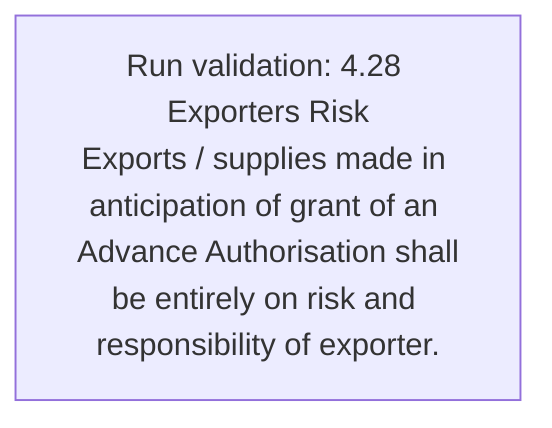
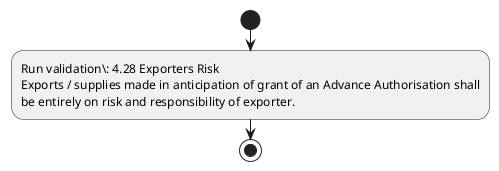

# Chapter 4 / Section 4.28: Exporters Risk

**Chapter Title:** Duty Exemption / Remission Schemes

**Pages:** 14

**Purpose:** 4.28 Exporters Risk
Exports / supplies made in anticipation of grant of an Advance Authorisation shall
be entirely on risk and responsibility of exporter.

**Purpose Thanglish:** Indha Exporters Risk section-la, 4.28 Exporters Risk
Exports / supplies made in anticipation of grant of an Advance Authorisation kandippa
be entirely on risk and responsibility of exporter.

**Summary:** 4.28 Exporters Risk
Exports / supplies made in anticipation of grant of an Advance Authorisation shall
be entirely on risk and responsibility of exporter.

**Business Meaning:** Exporters Risk governs how DGFT business controls should be applied, validated, and enforced.

**Business Explanation:** Exporters Risk explains the operating rule set that DEKAI should enforce. Key control points include 4.28 Exporters Risk
Exports / supplies made in anticipation of grant of an Advance Authorisation shall
be entirely on risk and responsibility of exporter.

**Business Explanation Thanglish:** Indha Exporters Risk section-la, Exporters Risk explains the operating rule set that DEKAI should enforce. Key control points include 4.28 Exporters Risk
Exports / supplies made in anticipation of grant of an Advance Authorisation kandippa
be entirely on risk and responsibility of exporter.

## Business Logic
- 4.28 Exporters Risk
Exports / supplies made in anticipation of grant of an Advance Authorisation shall
be entirely on risk and responsibility of exporter.

## Business Rules
- rule_id=CH4-SEC4_28-R001, rule_description=4.28 Exporters Risk
Exports / supplies made in anticipation of grant of an Advance Authorisation shall
be entirely on risk and responsibility of exporter., trigger=Exporters Risk, condition=Not explicitly covered in uploaded documents., validation=4.28 Exporters Risk
Exports / supplies made in anticipation of grant of an Advance Authorisation shall
be entirely on risk and responsibility of exporter., action=Manual review required., exception=No explicit exception found in uploaded documents., output=DEKAI should produce a compliance decision for 4.28 - Exporters Risk.

## Conditions
- None identified

## Condition Logic
- None identified

## Validations
- 4.28 Exporters Risk
Exports / supplies made in anticipation of grant of an Advance Authorisation shall
be entirely on risk and responsibility of exporter.

## Exceptions
- None identified

## Dependencies
- None identified

## Authorities
- None identified

## Required Documents
- None identified

## Timelines
- None identified

## Actions
- None identified

## Workflow
- Run validation: 4.28 Exporters Risk
Exports / supplies made in anticipation of grant of an Advance Authorisation shall
be entirely on risk and responsibility of exporter.

## Workflow ASCII
```text
Exporters Risk
Run validation: 4.28 Exporters Risk
Exports / supplies made in anticipation of grant of an Advance Authorisation shall
be entirely on risk and responsibility of exporter.
```

## Decision Tree
- IF section 4.28 applies THEN proceed with standard DGFT workflow

## Decision Tree ASCII
```text
Exporters Risk Decision
IF section 4.28 applies THEN proceed with standard DGFT workflow
```

## Examples
- User asks to process Exporters Risk; the platform checks conditions, validations, and documents before action.

**Real-world Example:** Example: an importer or exporter invokes Exporters Risk, submits the prescribed DGFT records, and DEKAI uses the extracted rules to follow the exporters risk process.

**Real-world Example Thanglish:** Indha Exporters Risk section-la, Example: an importer or exporter invokes Exporters Risk, submits the prescribed DGFT records, and DEKAI uses the extracted rules to follow the exporters risk process.

## AI Rules
- IF detected context matches section rule THEN enforce: 4.28 Exporters Risk
Exports / supplies made in anticipation of grant of an Advance Authorisation shall
be entirely on risk and responsibility of exporter.

## Database Fields
- name=section_code, type=string, required=True, source=parsed_section_heading
- name=section_title, type=string, required=True, source=parsed_section_heading
- name=and_flag, type=boolean, required=False, source=keyword:and
- name=risk_flag, type=boolean, required=False, source=keyword:Risk
- name=made_flag, type=boolean, required=False, source=keyword:made
- name=grant_flag, type=boolean, required=False, source=keyword:grant
- name=shall_flag, type=boolean, required=False, source=keyword:shall
- name=exports_flag, type=boolean, required=False, source=keyword:Exports
- name=advance_flag, type=boolean, required=False, source=keyword:Advance
- name=supplies_flag, type=boolean, required=False, source=keyword:supplies

## API Requirements
- method=GET, path=/api/dgft/sections/4.28, purpose=Retrieve knowledge payload for section 4.28, query_params=['include=workflow,decision_tree,validations'], response_fields=['section', 'title', 'summary', 'conditions', 'validations', 'exceptions', 'workflow', 'decision_tree']
- method=POST, path=/api/dgft/Exporters-Risk/validate, purpose=Validate inputs and documents for Exporters Risk, request_fields=['section_code', 'section_title'], response_fields=['status', 'errors', 'warnings', 'next_actions']

## UI Screens
- screen_id=Exporters_Risk_overview, name=Exporters Risk Overview, purpose=Show section summary, authority, timeline, and eligibility cues., widgets=['summary_card', 'conditions_table', 'authority_badges', 'timeline_panel']
- screen_id=Exporters_Risk_submission, name=Exporters Risk Submission, purpose=Capture applicant data and supporting documents., widgets=['dynamic_form', 'document_uploader', 'validation_panel', 'next_action_footer'], fields=['section_code', 'section_title', 'and_flag', 'risk_flag', 'made_flag', 'grant_flag', 'shall_flag', 'exports_flag']

## Error Messages
- Validation failed because the section requirements were not fully met.

## FAQ
- question_en=What is the purpose of section 4.28?, answer_en=Exporters Risk explains the operating rule set that DEKAI should enforce. Key control points include 4.28 Exporters Risk
Exports / supplies made in anticipation of grant of an Advance Authorisation shall
be entirely on risk and responsibility of exporter., question_thanglish=Indha Exporters Risk section-la, What is the purpose of section 4.28?, answer_thanglish=Indha Exporters Risk section-la, Exporters Risk explains the operating rule set that DEKAI should enforce. Key control points include 4.28 Exporters Risk
Exports / supplies made in anticipation of grant of an Advance Authorisation kandippa
be entirely on risk and responsibility of exporter.
- question_en=What documents are required under Exporters Risk?, answer_en=Not explicitly covered in uploaded documents., question_thanglish=Indha Exporters Risk section-la, What documents are required under Exporters Risk?, answer_thanglish=Indha Exporters Risk section-la, Not explicitly covered in uploaded documents.
- question_en=Which authority handles Exporters Risk?, answer_en=Not explicitly covered in uploaded documents., question_thanglish=Indha Exporters Risk section-la, Which authority handles Exporters Risk?, answer_thanglish=Indha Exporters Risk section-la, Not explicitly covered in uploaded documents.

## Questions Users May Ask
- What does Exporters Risk require?
- Which documents are needed for Exporters Risk?
- How does DEKAI validate Exporters Risk requests?

## Expected AI Answers
- Exporters Risk requires the platform to interpret the section text, apply the extracted business rules, and present the correct next action.
- Required documents are inferred from the section text: no explicit documents were detected.
- DEKAI validates Exporters Risk by checking conditions, required documents, authority references, and exception clauses before recommending an outcome.

## AI Q&A Examples
- question_en=User asks: How do I comply with Exporters Risk?, answer_en=AI answers: DEKAI should evaluate section 4.28, apply the extracted rules, and guide the user through Run validation: 4.28 Exporters Risk
Exports / supplies made in anticipation of grant of an Advance Authorisation shall
be entirely on risk and responsibility of exporter.., question_thanglish=Indha Exporters Risk section-la, User asks: How do I comply with Exporters Risk?, answer_thanglish=Indha Exporters Risk section-la, AI answers: DEKAI should evaluate section 4.28, apply the extracted rules, and guide the user through Run validation: 4.28 Exporters Risk
Exports / supplies made in anticipation of grant of an Advance Authorisation kandippa
be entirely on risk and responsibility of exporter..
- question_en=User asks: Which validations apply to Exporters Risk?, answer_en=AI answers: Applicable validations are 4.28 Exporters Risk
Exports / supplies made in anticipation of grant of an Advance Authorisation shall
be entirely on risk and responsibility of exporter., question_thanglish=Indha Exporters Risk section-la, User asks: Which validations apply to Exporters Risk?, answer_thanglish=Indha Exporters Risk section-la, AI answers: Applicable validations are 4.28 Exporters Risk
Exports / supplies made in anticipation of grant of an Advance Authorisation kandippa
be entirely on risk and responsibility of exporter.

## DEKAI AI Implementation Notes
- Capture chapter 4, section 4.28, title, and page references as immutable knowledge metadata.
- Bind validations for Exporters Risk into a rule engine keyed by the rule IDs extracted for this section.

## DEKAI AI Implementation Notes Thanglish
- Indha Exporters Risk section-la, Capture chapter 4, section 4.28, title, and page references as immutable knowledge metadata.
- Indha Exporters Risk section-la, Bind validations for Exporters Risk into a rule engine keyed by the rule IDs extracted for this section.

## AI Metadata
- Keywords: and, Risk, made, grant, shall, Exports, Advance, supplies, entirely, exporter, Exporters, anticipation, Authorisation, responsibility
- Search Keywords: and, Risk, made, grant, shall, Exports, Advance, supplies, entirely, exporter, Exporters, anticipation, Authorisation, responsibility
- Intent: Provide knowledge guidance for Exporters Risk.
- Tags: 4.28, Exporters Risk, business-rule, dgft
- Related Sections: 
- Related Chapters: 
- Related Rules: 4.28 Exporters Risk
Exports / supplies made in anticipation of grant of an Advance Authorisation shall
be entirely on risk and responsibility of exporter.

## Mermaid


## PlantUML

