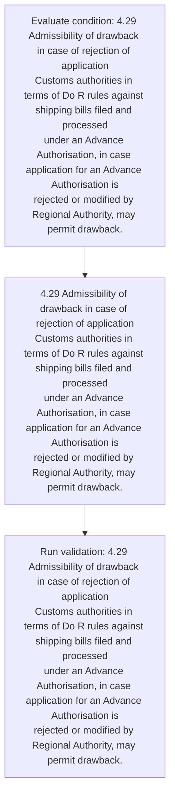
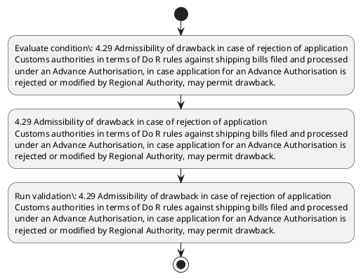

# Chapter 4 / Section 4.29: Admissibility of drawback in case of rejection of application

**Chapter Title:** Duty Exemption / Remission Schemes

**Pages:** 14

**Purpose:** 4.29 Admissibility of drawback in case of rejection of application
Customs authorities in terms of Do R rules against shipping bills filed and processed
under an Advance Authorisation, in case application for an Advance Authorisation is
rejected or modified by Regional Authority, may permit drawback.

**Purpose Thanglish:** Indha Admissibility of drawback in case of rejection of application section-la, 4.29 Admissibility of drawback in case of rejection of application
Customs authorities in terms of Do R rules against shipping bills filed and processed
under an Advance Authorisation, in case application for an Advance Authorisation is
rejected or modified by Regional authority, may permit drawback.

**Summary:** 4.29 Admissibility of drawback in case of rejection of application
Customs authorities in terms of Do R rules against shipping bills filed and processed
under an Advance Authorisation, in case application for an Advance Authorisation is
rejected or modified by Regional Authority, may permit drawback.

**Business Meaning:** 4.29 Admissibility of drawback in case of rejection of application
Customs authorities in terms of Do R rules against shipping bills filed and processed
under an Advance Authorisation, in case application for an Advance Authorisation is
rejected or modified by Regional Authority, may permit drawback.

**Business Explanation:** 4.29 Admissibility of drawback in case of rejection of application
Customs authorities in terms of Do R rules against shipping bills filed and processed
under an Advance Authorisation, in case application for an Advance Authorisation is
rejected or modified by Regional Authority, may permit drawback.

**Business Explanation Thanglish:** Indha Admissibility of drawback in case of rejection of application section-la, 4.29 Admissibility of drawback in case of rejection of application
Customs authorities in terms of Do R rules against shipping bills filed and processed
under an Advance Authorisation, in case application for an Advance Authorisation is
rejected or modified by Regional authority, may permit drawback.

## Business Logic
- None identified

## Business Rules
- rule_id=CH4-SEC4_29-R001, rule_description=IF validations pass THEN recommend action: 4.29 Admissibility of drawback in case of rejection of application
Customs authorities in terms of Do R rules against shipping bills filed and processed
under an Advance Authorisation, in case application for an Advance Authorisation is
rejected or modified by Regional Authority, may permit drawback., trigger=Admissibility of drawback in case of rejection of application, condition=4.29 Admissibility of drawback in case of rejection of application
Customs authorities in terms of Do R rules against shipping bills filed and processed
under an Advance Authorisation, in case application for an Advance Authorisation is
rejected or modified by Regional Authority, may permit drawback., validation=4.29 Admissibility of drawback in case of rejection of application
Customs authorities in terms of Do R rules against shipping bills filed and processed
under an Advance Authorisation, in case application for an Advance Authorisation is
rejected or modified by Regional Authority, may permit drawback., action=4.29 Admissibility of drawback in case of rejection of application
Customs authorities in terms of Do R rules against shipping bills filed and processed
under an Advance Authorisation, in case application for an Advance Authorisation is
rejected or modified by Regional Authority, may permit drawback., exception=No explicit exception found in uploaded documents., output=DEKAI should produce a compliance decision for 4.29 - Admissibility of drawback in case of rejection of application.

## Conditions
- 4.29 Admissibility of drawback in case of rejection of application
Customs authorities in terms of Do R rules against shipping bills filed and processed
under an Advance Authorisation, in case application for an Advance Authorisation is
rejected or modified by Regional Authority, may permit drawback.

## Condition Logic
- id=4.4.29.1, if=4.29 Admissibility of drawback in case of rejection of application
Customs authorities in terms of Do R rules against shipping bills filed and processed
under an Advance Authorisation, in case application for an Advance Authorisation is
rejected or modified by Regional Authority, may permit drawback., then=4.29 Admissibility of drawback in case of rejection of application
Customs authorities in terms of Do R rules against shipping bills filed and processed
under an Advance Authorisation, in case application for an Advance Authorisation is
rejected or modified by Regional Authority, may permit drawback., source=4.29 Admissibility of drawback in case of rejection of application
Customs authorities in terms of Do R rules against shipping bills filed and processed
under an Advance Authorisation, in case application for an Advance Authorisation is
rejected or modified by Regional Authority, may permit drawback.

## Validations
- 4.29 Admissibility of drawback in case of rejection of application
Customs authorities in terms of Do R rules against shipping bills filed and processed
under an Advance Authorisation, in case application for an Advance Authorisation is
rejected or modified by Regional Authority, may permit drawback.

## Exceptions
- None identified

## Dependencies
- None identified

## Authorities
- Regional Authority
- Customs

## Required Documents
- 4.29 Admissibility of drawback in case of rejection of application
Customs authorities in terms of Do R rules against shipping bills filed and processed
under an Advance Authorisation, in case application for an Advance Authorisation is
rejected or modified by Regional Authority, may permit drawback.

## Timelines
- None identified

## Actions
- 4.29 Admissibility of drawback in case of rejection of application
Customs authorities in terms of Do R rules against shipping bills filed and processed
under an Advance Authorisation, in case application for an Advance Authorisation is
rejected or modified by Regional Authority, may permit drawback.

## Workflow
- Evaluate condition: 4.29 Admissibility of drawback in case of rejection of application
Customs authorities in terms of Do R rules against shipping bills filed and processed
under an Advance Authorisation, in case application for an Advance Authorisation is
rejected or modified by Regional Authority, may permit drawback.
- 4.29 Admissibility of drawback in case of rejection of application
Customs authorities in terms of Do R rules against shipping bills filed and processed
under an Advance Authorisation, in case application for an Advance Authorisation is
rejected or modified by Regional Authority, may permit drawback.
- Run validation: 4.29 Admissibility of drawback in case of rejection of application
Customs authorities in terms of Do R rules against shipping bills filed and processed
under an Advance Authorisation, in case application for an Advance Authorisation is
rejected or modified by Regional Authority, may permit drawback.

## Workflow ASCII
```text
Admissibility of drawback in case of rejection of application
Evaluate condition: 4.29 Admissibility of drawback in case of rejection of application
Customs authorities in terms of Do R rules against shipping bills filed and processed
under an Advance Authorisation, in case application for an Advance Authorisation is
rejected or modified by Regional Authority, may permit drawback.
   |
   v
4.29 Admissibility of drawback in case of rejection of application
Customs authorities in terms of Do R rules against shipping bills filed and processed
under an Advance Authorisation, in case application for an Advance Authorisation is
rejected or modified by Regional Authority, may permit drawback.
   |
   v
Run validation: 4.29 Admissibility of drawback in case of rejection of application
Customs authorities in terms of Do R rules against shipping bills filed and processed
under an Advance Authorisation, in case application for an Advance Authorisation is
rejected or modified by Regional Authority, may permit drawback.
```

## Decision Tree
- IF 4.29 Admissibility of drawback in case of rejection of application
Customs authorities in terms of Do R rules against shipping bills filed and processed
under an Advance Authorisation, in case application for an Advance Authorisation is
rejected or modified by Regional Authority, may permit drawback. THEN 4.29 Admissibility of drawback in case of rejection of application
Customs authorities in terms of Do R rules against shipping bills filed and processed
under an Advance Authorisation, in case application for an Advance Authorisation is
rejected or modified by Regional Authority, may permit drawback.

## Decision Tree ASCII
```text
Admissibility of drawback in case of rejection of application Decision
IF 4.29 Admissibility of drawback in case of rejection of application
Customs authorities in terms of Do R rules against shipping bills filed and processed
under an Advance Authorisation, in case application for an Advance Authorisation is
rejected or modified by Regional Authority, may permit drawback. THEN 4.29 Admissibility of drawback in case of rejection of application
Customs authorities in terms of Do R rules against shipping bills filed and processed
under an Advance Authorisation, in case application for an Advance Authorisation is
rejected or modified by Regional Authority, may permit drawback.
```

## Examples
- User asks to process Admissibility of drawback in case of rejection of application; the platform checks conditions, validations, and documents before action.

**Real-world Example:** Example: an importer or exporter invokes Admissibility of drawback in case of rejection of application, submits 4.29 Admissibility of drawback in case of rejection of application
Customs authorities in terms of Do R rules against shipping bills filed and processed
under an Advance Authorisation, in case application for an Advance Authorisation is
rejected or modified by Regional Authority, may permit drawback., and DEKAI uses the extracted rules to 4.29 admissibility of drawback in case of rejection of application
customs authorities in terms of do r rules against shipping bills filed and processed
under an advance authorisation, in case application for an advance authorisation is
rejected or modified by regional authority, may permit drawback..

**Real-world Example Thanglish:** Indha Admissibility of drawback in case of rejection of application section-la, Example: an importer or exporter invokes Admissibility of drawback in case of rejection of application, submits 4.29 Admissibility of drawback in case of rejection of application
Customs authorities in terms of Do R rules against shipping bills filed and processed
under an Advance Authorisation, in case application for an Advance Authorisation is
rejected or modified by Regional authority, may permit drawback., and DEKAI uses the extracted rules to 4.29 admissibility of drawback in case of rejection of application
customs authorities in terms of do r rules against shipping bills filed and processed
under an advance authorisation, in case application for an advance authorisation is
rejected or modified by regional authority, may permit drawback..

## AI Rules
- IF validations pass THEN recommend action: 4.29 Admissibility of drawback in case of rejection of application
Customs authorities in terms of Do R rules against shipping bills filed and processed
under an Advance Authorisation, in case application for an Advance Authorisation is
rejected or modified by Regional Authority, may permit drawback.

## Database Fields
- name=section_code, type=string, required=True, source=parsed_section_heading
- name=section_title, type=string, required=True, source=parsed_section_heading
- name=and_flag, type=boolean, required=False, source=keyword:and
- name=for_flag, type=boolean, required=False, source=keyword:for
- name=may_flag, type=boolean, required=False, source=keyword:may
- name=case_flag, type=boolean, required=False, source=keyword:case
- name=terms_flag, type=boolean, required=False, source=keyword:terms
- name=rules_flag, type=boolean, required=False, source=keyword:rules
- name=bills_flag, type=boolean, required=False, source=keyword:bills
- name=filed_flag, type=boolean, required=False, source=keyword:filed
- name=document_1_submitted, type=boolean, required=True, source=4.29 Admissibility of drawback in case of rejection of application
Customs authorities in terms of Do R rules against shipping bills filed and processed
under an Advance Authorisation, in case application for an Advance Authorisation is
rejected or modified by Regional Authority, may permit drawback.

## API Requirements
- method=GET, path=/api/dgft/sections/4.29, purpose=Retrieve knowledge payload for section 4.29, query_params=['include=workflow,decision_tree,validations'], response_fields=['section', 'title', 'summary', 'conditions', 'validations', 'exceptions', 'workflow', 'decision_tree']
- method=POST, path=/api/dgft/Admissibility-of-drawback-in-case-of-rejection-of-application/validate, purpose=Validate inputs and documents for Admissibility of drawback in case of rejection of application, request_fields=['section_code', 'section_title', 'document_1_submitted'], response_fields=['status', 'errors', 'warnings', 'next_actions']
- method=POST, path=/api/dgft/Admissibility-of-drawback-in-case-of-rejection-of-application/execute, purpose=Trigger business action for 4.29 Admissibility of drawback in case of rejection of application
Customs authorities in terms of Do R rules against shipping bills filed and processed
under an Advance Authorisation, in case application for an Advance Authorisation is
rejected or modified by Regional Authority, may permit drawback., request_fields=['section_code', 'section_title', 'document_1_submitted'], response_fields=['reference_id', 'status', 'authority', 'timeline']

## UI Screens
- screen_id=Admissibility_of_drawback_in_case_of_rejection_of_application_overview, name=Admissibility of drawback in case of rejection of application Overview, purpose=Show section summary, authority, timeline, and eligibility cues., widgets=['summary_card', 'conditions_table', 'authority_badges', 'timeline_panel']
- screen_id=Admissibility_of_drawback_in_case_of_rejection_of_application_submission, name=Admissibility of drawback in case of rejection of application Submission, purpose=Capture applicant data and supporting documents., widgets=['dynamic_form', 'document_uploader', 'validation_panel', 'next_action_footer'], fields=['section_code', 'section_title', 'and_flag', 'for_flag', 'may_flag', 'case_flag', 'terms_flag', 'rules_flag']

## Error Messages
- Validation failed because the section requirements were not fully met.

## FAQ
- question_en=What is the purpose of section 4.29?, answer_en=4.29 Admissibility of drawback in case of rejection of application
Customs authorities in terms of Do R rules against shipping bills filed and processed
under an Advance Authorisation, in case application for an Advance Authorisation is
rejected or modified by Regional Authority, may permit drawback., question_thanglish=Indha Admissibility of drawback in case of rejection of application section-la, What is the purpose of section 4.29?, answer_thanglish=Indha Admissibility of drawback in case of rejection of application section-la, 4.29 Admissibility of drawback in case of rejection of application
Customs authorities in terms of Do R rules against shipping bills filed and processed
under an Advance Authorisation, in case application for an Advance Authorisation is
rejected or modified by Regional authority, may permit drawback.
- question_en=What documents are required under Admissibility of drawback in case of rejection of application?, answer_en=4.29 Admissibility of drawback in case of rejection of application
Customs authorities in terms of Do R rules against shipping bills filed and processed
under an Advance Authorisation, in case application for an Advance Authorisation is
rejected or modified by Regional Authority, may permit drawback., question_thanglish=Indha Admissibility of drawback in case of rejection of application section-la, What documents are required under Admissibility of drawback in case of rejection of application?, answer_thanglish=Indha Admissibility of drawback in case of rejection of application section-la, 4.29 Admissibility of drawback in case of rejection of application
Customs authorities in terms of Do R rules against shipping bills filed and processed
under an Advance Authorisation, in case application for an Advance Authorisation is
rejected or modified by Regional authority, may permit drawback.
- question_en=Which authority handles Admissibility of drawback in case of rejection of application?, answer_en=Regional Authority, Customs, question_thanglish=Indha Admissibility of drawback in case of rejection of application section-la, Which authority handles Admissibility of drawback in case of rejection of application?, answer_thanglish=Indha Admissibility of drawback in case of rejection of application section-la, Regional authority, Customs

## Questions Users May Ask
- What does Admissibility of drawback in case of rejection of application require?
- Which documents are needed for Admissibility of drawback in case of rejection of application?
- How does DEKAI validate Admissibility of drawback in case of rejection of application requests?
- What action should be taken for Admissibility of drawback in case of rejection of application?

## Expected AI Answers
- Admissibility of drawback in case of rejection of application requires the platform to interpret the section text, apply the extracted business rules, and present the correct next action.
- Required documents are inferred from the section text: 4.29 Admissibility of drawback in case of rejection of application
Customs authorities in terms of Do R rules against shipping bills filed and processed
under an Advance Authorisation, in case application for an Advance Authorisation is
rejected or modified by Regional Authority, may permit drawback.
- DEKAI validates Admissibility of drawback in case of rejection of application by checking conditions, required documents, authority references, and exception clauses before recommending an outcome.
- The primary extracted action is: 4.29 Admissibility of drawback in case of rejection of application
Customs authorities in terms of Do R rules against shipping bills filed and processed
under an Advance Authorisation, in case application for an Advance Authorisation is
rejected or modified by Regional Authority, may permit drawback.

## AI Q&A Examples
- question_en=User asks: How do I comply with Admissibility of drawback in case of rejection of application?, answer_en=AI answers: DEKAI should evaluate section 4.29, apply the extracted rules, and guide the user through Evaluate condition: 4.29 Admissibility of drawback in case of rejection of application
Customs authorities in terms of Do R rules against shipping bills filed and processed
under an Advance Authorisation, in case application for an Advance Authorisation is
rejected or modified by Regional Authority, may permit drawback.., question_thanglish=Indha Admissibility of drawback in case of rejection of application section-la, User asks: How do I comply with Admissibility of drawback in case of rejection of application?, answer_thanglish=Indha Admissibility of drawback in case of rejection of application section-la, AI answers: DEKAI should evaluate section 4.29, apply the extracted rules, and guide the user through Evaluate condition: 4.29 Admissibility of drawback in case of rejection of application
Customs authorities in terms of Do R rules against shipping bills filed and processed
under an Advance Authorisation, in case application for an Advance Authorisation is
rejected or modified by Regional authority, may permit drawback..
- question_en=User asks: Which validations apply to Admissibility of drawback in case of rejection of application?, answer_en=AI answers: Applicable validations are 4.29 Admissibility of drawback in case of rejection of application
Customs authorities in terms of Do R rules against shipping bills filed and processed
under an Advance Authorisation, in case application for an Advance Authorisation is
rejected or modified by Regional Authority, may permit drawback., question_thanglish=Indha Admissibility of drawback in case of rejection of application section-la, User asks: Which validations apply to Admissibility of drawback in case of rejection of application?, answer_thanglish=Indha Admissibility of drawback in case of rejection of application section-la, AI answers: Applicable validations are 4.29 Admissibility of drawback in case of rejection of application
Customs authorities in terms of Do R rules against shipping bills filed and processed
under an Advance Authorisation, in case application for an Advance Authorisation is
rejected or modified by Regional authority, may permit drawback.

## DEKAI AI Implementation Notes
- Capture chapter 4, section 4.29, title, and page references as immutable knowledge metadata.
- Bind validations for Admissibility of drawback in case of rejection of application into a rule engine keyed by the rule IDs extracted for this section.
- Expose document upload controls for: 4.29 Admissibility of drawback in case of rejection of application
Customs authorities in terms of Do R rules against shipping bills filed and processed
under an Advance Authorisation, in case application for an Advance Authorisation is
rejected or modified by Regional Authority, may permit drawback..
- Route escalations or approvals to: Regional Authority, Customs.

## DEKAI AI Implementation Notes Thanglish
- Indha Admissibility of drawback in case of rejection of application section-la, Capture chapter 4, section 4.29, title, and page references as immutable knowledge metadata.
- Indha Admissibility of drawback in case of rejection of application section-la, Bind validations for Admissibility of drawback in case of rejection of application into a rule engine keyed by the rule IDs extracted for this section.
- Indha Admissibility of drawback in case of rejection of application section-la, Expose document upload controls for: 4.29 Admissibility of drawback in case of rejection of application
Customs authorities in terms of Do R rules against shipping bills filed and processed
under an Advance Authorisation, in case application for an Advance Authorisation is
rejected or modified by Regional authority, may permit drawback..
- Indha Admissibility of drawback in case of rejection of application section-la, Route escalations or approvals to: Regional authority, Customs.

## AI Metadata
- Keywords: and, for, may, case, terms, rules, bills, filed, under, permit, Customs, against, Advance, drawback, shipping, rejected, modified, Regional, rejection, processed
- Search Keywords: and, for, may, case, terms, rules, bills, filed, under, permit, Customs, against, Advance, drawback, shipping, rejected, modified, Regional, rejection, processed
- Intent: Support Admissibility of drawback in case of rejection of application processing and compliance validation.
- Tags: 4.29, Admissibility of drawback in case of rejection of application, document-driven, dgft
- Related Sections: 
- Related Chapters: 
- Related Rules: 

## Mermaid


## PlantUML

