# Chapter 4 / Section 4.30: Advance Authorisation or DFIA for Intermediate Supplies

**Chapter Title:** Duty Exemption / Remission Schemes

**Pages:** 14, 15

**Purpose:** 4.30 Advance Authorisation or DFIA for Intermediate Supplies
(a) Application for grant of Advance Authorisation or DFIA for Intermediate
supply may be made on the basis of a tie-up arrangement with an ultimate
exporter (physical/deemed) holding an Advance Authorisation or DFIA.

**Purpose Thanglish:** Indha Advance Authorisation or DFIA for Intermediate Supplies section-la, 4.30 Advance Authorisation or DFIA for Intermediate Supplies
(a) application for grant of Advance Authorisation or DFIA for Intermediate
supply may be made on the basis of a tie-up arrangement with an ultimate
exporter (physical/deemed) holding an Advance Authorisation or DFIA.

**Summary:** 4.30 Advance Authorisation or DFIA for Intermediate Supplies
(a) Application for grant of Advance Authorisation or DFIA for Intermediate
supply may be made on the basis of a tie-up arrangement with an ultimate
exporter (physical/deemed) holding an Advance Authorisation or DFIA. Regional Authority concerned shall consider such requests. pg.

**Business Meaning:** Advance Authorisation or DFIA for Intermediate Supplies governs how DGFT business controls should be applied, validated, and enforced.

**Business Explanation:** Advance Authorisation or DFIA for Intermediate Supplies explains the operating rule set that DEKAI should enforce. Key control points include Regional Authority concerned shall consider such requests. The section also drives actions such as 89
issue of an Authorisation..

**Business Explanation Thanglish:** Indha Advance Authorisation or DFIA for Intermediate Supplies section-la, Advance Authorisation or DFIA for Intermediate Supplies explains the operating rule set that DEKAI should enforce. Key control points include Regional authority concerned kandippa consider such requests. The section also drives actions such as 89
issue of an Authorisation..

## Business Logic
- Regional Authority concerned shall consider such requests.
- Shipping Bills / Tax Invoices should be endorsed with File Number or
Authorisation Number to establish co-relation of exports / Deemed Export
supplies with Authorisation issued.
- Export/Deemed Export supply
document(s) should also contain details of exempted materials/inputs
consumed and technical characteristics of export and import items, as the
case may be.
- (b)
If application is approved, authorisation shall be issued based on input/
output norms in force on the date of receipt of application by Regional
Authority.
- For remaining exports,
Policy / Procedures in force on date of issue of authorisation shall be
applicable.
- (c)
The export of SCOMET items shall not be permitted against an Authorisation
until and unless the requisite SCOMET Authorisation is obtained by the
applicant.
- (d)
Inputs with pre-import condition shall not be considered for replenishment
against Exports/Deemed Export supplies made before import of such inputs.
- (b) Advance Authorisation or DFIA for Intermediate supply shall be issued after
making Authorisation of ultimate exporter invalid for direct import of item,
to be supplied by intermediate manufacturer.
- In such cases, shipping bill shall be in the name of the ultimate exporter
with the name of intermediate supplier endorsed on it.
- (c) A suitable documentary evidence indicating the available quantity under
Advance Authorisation shall be submitted along-with the application for
invalidation.
- (d) Facility of Advance Authorisation shall be available even in cases where
intermediate supplier has supplied or intend to supply material subsequent to
fulfilment of EO by exporter holding Advance Authorisation / DFIA from
where invalidation letter was issued.
- (e) The invalidation letter shall specify the following:
(i) Name, Address and GSTIN of supplier;
(ii) GSTIN & Address of recipient unit of Advance
Authorisation/DFIA holder where inputs would be processed;
(iii) Name, description including specifications, where applicable, and
quantity of items; and
(iv) Individual value of items to be procured.

## Business Rules
- rule_id=CH4-SEC4_30-R001, rule_description=Regional Authority concerned shall consider such requests., trigger=Advance Authorisation or DFIA for Intermediate Supplies, condition=application is approved, validation=Regional Authority concerned shall consider such requests., action=89
issue of an Authorisation., exception=Export/Deemed Export supply
document(s) should also contain details of exempted materials/inputs
consumed and technical characteristics of export and import items, as the
case may be., output=DEKAI should produce a compliance decision for 4.30 - Advance Authorisation or DFIA for Intermediate Supplies.
- rule_id=CH4-SEC4_30-R002, rule_description=Shipping Bills / Tax Invoices should be endorsed with File Number or
Authorisation Number to establish co-relation of exports / Deemed Export
supplies with Authorisation issued., trigger=Advance Authorisation or DFIA for Intermediate Supplies, condition=If in the intervening period (i.e., validation=(a)
Exports / Deemed Export supplies made from the date of EDI generated file
number for an Advance Authorisation, may be accepted towards discharge
of EO., action=Shipping Bills / Tax Invoices should be endorsed with File Number or
Authorisation Number to establish co-relation of exports / Deemed Export
supplies with Authorisation issued., exception=(c)
The export of SCOMET items shall not be permitted against an Authorisation
until and unless the requisite SCOMET Authorisation is obtained by the
applicant., output=DEKAI should produce a compliance decision for 4.30 - Advance Authorisation or DFIA for Intermediate Supplies.
- rule_id=CH4-SEC4_30-R003, rule_description=Export/Deemed Export supply
document(s) should also contain details of exempted materials/inputs
consumed and technical characteristics of export and import items, as the
case may be., trigger=Advance Authorisation or DFIA for Intermediate Supplies, condition=from date of filing of application
and date of issue of authorisation) the norms get changed, the authorisation
will be issued in proportion to provisional exports / Deemed Export supplies
already made till any amendment in norms is notified., validation=(b)
If application is approved, authorisation shall be issued based on input/
output norms in force on the date of receipt of application by Regional
Authority., action=(b)
If application is approved, authorisation shall be issued based on input/
output norms in force on the date of receipt of application by Regional
Authority., exception=(c)
The export of SCOMET items shall not be permitted against an Authorisation
until and unless the requisite SCOMET Authorisation is obtained by the
applicant., output=DEKAI should produce a compliance decision for 4.30 - Advance Authorisation or DFIA for Intermediate Supplies.
- rule_id=CH4-SEC4_30-R004, rule_description=(b)
If application is approved, authorisation shall be issued based on input/
output norms in force on the date of receipt of application by Regional
Authority., trigger=Advance Authorisation or DFIA for Intermediate Supplies, condition=(c)
The export of SCOMET items shall not be permitted against an Authorisation
until and unless the requisite SCOMET Authorisation is obtained by the
applicant., validation=For remaining exports,
Policy / Procedures in force on date of issue of authorisation shall be
applicable., action=from date of filing of application
and date of issue of authorisation) the norms get changed, the authorisation
will be issued in proportion to provisional exports / Deemed Export supplies
already made till any amendment in norms is notified., exception=(c)
The export of SCOMET items shall not be permitted against an Authorisation
until and unless the requisite SCOMET Authorisation is obtained by the
applicant., output=DEKAI should produce a compliance decision for 4.30 - Advance Authorisation or DFIA for Intermediate Supplies.
- rule_id=CH4-SEC4_30-R005, rule_description=For remaining exports,
Policy / Procedures in force on date of issue of authorisation shall be
applicable., trigger=Advance Authorisation or DFIA for Intermediate Supplies, condition=(d)
Inputs with pre-import condition shall not be considered for replenishment
against Exports/Deemed Export supplies made before import of such inputs., validation=(c)
The export of SCOMET items shall not be permitted against an Authorisation
until and unless the requisite SCOMET Authorisation is obtained by the
applicant., action=For remaining exports,
Policy / Procedures in force on date of issue of authorisation shall be
applicable., exception=(c)
The export of SCOMET items shall not be permitted against an Authorisation
until and unless the requisite SCOMET Authorisation is obtained by the
applicant., output=DEKAI should produce a compliance decision for 4.30 - Advance Authorisation or DFIA for Intermediate Supplies.
- rule_id=CH4-SEC4_30-R006, rule_description=(c)
The export of SCOMET items shall not be permitted against an Authorisation
until and unless the requisite SCOMET Authorisation is obtained by the
applicant., trigger=Advance Authorisation or DFIA for Intermediate Supplies, condition=(b) Advance Authorisation or DFIA for Intermediate supply shall be issued after
making Authorisation of ultimate exporter invalid for direct import of item,
to be supplied by intermediate manufacturer., validation=(d)
Inputs with pre-import condition shall not be considered for replenishment
against Exports/Deemed Export supplies made before import of such inputs., action=(c)
The export of SCOMET items shall not be permitted against an Authorisation
until and unless the requisite SCOMET Authorisation is obtained by the
applicant., exception=(c)
The export of SCOMET items shall not be permitted against an Authorisation
until and unless the requisite SCOMET Authorisation is obtained by the
applicant., output=DEKAI should produce a compliance decision for 4.30 - Advance Authorisation or DFIA for Intermediate Supplies.
- rule_id=CH4-SEC4_30-R007, rule_description=(d)
Inputs with pre-import condition shall not be considered for replenishment
against Exports/Deemed Export supplies made before import of such inputs., trigger=Advance Authorisation or DFIA for Intermediate Supplies, condition=The above stated evidence is not required if invalidation is
applied along with the application of Advance Authorisation., validation=(b) Advance Authorisation or DFIA for Intermediate supply shall be issued after
making Authorisation of ultimate exporter invalid for direct import of item,
to be supplied by intermediate manufacturer., action=(b) Advance Authorisation or DFIA for Intermediate supply shall be issued after
making Authorisation of ultimate exporter invalid for direct import of item,
to be supplied by intermediate manufacturer., exception=(c)
The export of SCOMET items shall not be permitted against an Authorisation
until and unless the requisite SCOMET Authorisation is obtained by the
applicant., output=DEKAI should produce a compliance decision for 4.30 - Advance Authorisation or DFIA for Intermediate Supplies.
- rule_id=CH4-SEC4_30-R008, rule_description=(b) Advance Authorisation or DFIA for Intermediate supply shall be issued after
making Authorisation of ultimate exporter invalid for direct import of item,
to be supplied by intermediate manufacturer., trigger=Advance Authorisation or DFIA for Intermediate Supplies, condition=(d) Facility of Advance Authorisation shall be available even in cases where
intermediate supplier has supplied or intend to supply material subsequent to
fulfilment of EO by exporter holding Advance Authorisation / DFIA from
where invalidation letter was issued., validation=In such cases, shipping bill shall be in the name of the ultimate exporter
with the name of intermediate supplier endorsed on it., action=(c) A suitable documentary evidence indicating the available quantity under
Advance Authorisation shall be submitted along-with the application for
invalidation., exception=(c)
The export of SCOMET items shall not be permitted against an Authorisation
until and unless the requisite SCOMET Authorisation is obtained by the
applicant., output=DEKAI should produce a compliance decision for 4.30 - Advance Authorisation or DFIA for Intermediate Supplies.
- rule_id=CH4-SEC4_30-R009, rule_description=In such cases, shipping bill shall be in the name of the ultimate exporter
with the name of intermediate supplier endorsed on it., trigger=Advance Authorisation or DFIA for Intermediate Supplies, condition=(e) The invalidation letter shall specify the following:
(i) Name, Address and GSTIN of supplier;
(ii) GSTIN & Address of recipient unit of Advance
Authorisation/DFIA holder where inputs would be processed;
(iii) Name, description including specifications, where applicable, and
quantity of items; and
(iv) Individual value of items to be procured., validation=(c) A suitable documentary evidence indicating the available quantity under
Advance Authorisation shall be submitted along-with the application for
invalidation., action=(d) Facility of Advance Authorisation shall be available even in cases where
intermediate supplier has supplied or intend to supply material subsequent to
fulfilment of EO by exporter holding Advance Authorisation / DFIA from
where invalidation letter was issued., exception=(c)
The export of SCOMET items shall not be permitted against an Authorisation
until and unless the requisite SCOMET Authorisation is obtained by the
applicant., output=DEKAI should produce a compliance decision for 4.30 - Advance Authorisation or DFIA for Intermediate Supplies.
- rule_id=CH4-SEC4_30-R010, rule_description=(c) A suitable documentary evidence indicating the available quantity under
Advance Authorisation shall be submitted along-with the application for
invalidation., trigger=Advance Authorisation or DFIA for Intermediate Supplies, condition=(e) The invalidation letter shall specify the following:
(i) Name, Address and GSTIN of supplier;
(ii) GSTIN & Address of recipient unit of Advance
Authorisation/DFIA holder where inputs would be processed;
(iii) Name, description including specifications, where applicable, and
quantity of items; and
(iv) Individual value of items to be procured., validation=The above stated evidence is not required if invalidation is
applied along with the application of Advance Authorisation., action=(d) Facility of Advance Authorisation shall be available even in cases where
intermediate supplier has supplied or intend to supply material subsequent to
fulfilment of EO by exporter holding Advance Authorisation / DFIA from
where invalidation letter was issued., exception=(c)
The export of SCOMET items shall not be permitted against an Authorisation
until and unless the requisite SCOMET Authorisation is obtained by the
applicant., output=DEKAI should produce a compliance decision for 4.30 - Advance Authorisation or DFIA for Intermediate Supplies.
- rule_id=CH4-SEC4_30-R011, rule_description=(d) Facility of Advance Authorisation shall be available even in cases where
intermediate supplier has supplied or intend to supply material subsequent to
fulfilment of EO by exporter holding Advance Authorisation / DFIA from
where invalidation letter was issued., trigger=Advance Authorisation or DFIA for Intermediate Supplies, condition=(e) The invalidation letter shall specify the following:
(i) Name, Address and GSTIN of supplier;
(ii) GSTIN & Address of recipient unit of Advance
Authorisation/DFIA holder where inputs would be processed;
(iii) Name, description including specifications, where applicable, and
quantity of items; and
(iv) Individual value of items to be procured., validation=(d) Facility of Advance Authorisation shall be available even in cases where
intermediate supplier has supplied or intend to supply material subsequent to
fulfilment of EO by exporter holding Advance Authorisation / DFIA from
where invalidation letter was issued., action=(d) Facility of Advance Authorisation shall be available even in cases where
intermediate supplier has supplied or intend to supply material subsequent to
fulfilment of EO by exporter holding Advance Authorisation / DFIA from
where invalidation letter was issued., exception=(c)
The export of SCOMET items shall not be permitted against an Authorisation
until and unless the requisite SCOMET Authorisation is obtained by the
applicant., output=DEKAI should produce a compliance decision for 4.30 - Advance Authorisation or DFIA for Intermediate Supplies.
- rule_id=CH4-SEC4_30-R012, rule_description=(e) The invalidation letter shall specify the following:
(i) Name, Address and GSTIN of supplier;
(ii) GSTIN & Address of recipient unit of Advance
Authorisation/DFIA holder where inputs would be processed;
(iii) Name, description including specifications, where applicable, and
quantity of items; and
(iv) Individual value of items to be procured., trigger=Advance Authorisation or DFIA for Intermediate Supplies, condition=(e) The invalidation letter shall specify the following:
(i) Name, Address and GSTIN of supplier;
(ii) GSTIN & Address of recipient unit of Advance
Authorisation/DFIA holder where inputs would be processed;
(iii) Name, description including specifications, where applicable, and
quantity of items; and
(iv) Individual value of items to be procured., validation=(e) The invalidation letter shall specify the following:
(i) Name, Address and GSTIN of supplier;
(ii) GSTIN & Address of recipient unit of Advance
Authorisation/DFIA holder where inputs would be processed;
(iii) Name, description including specifications, where applicable, and
quantity of items; and
(iv) Individual value of items to be procured., action=(d) Facility of Advance Authorisation shall be available even in cases where
intermediate supplier has supplied or intend to supply material subsequent to
fulfilment of EO by exporter holding Advance Authorisation / DFIA from
where invalidation letter was issued., exception=(c)
The export of SCOMET items shall not be permitted against an Authorisation
until and unless the requisite SCOMET Authorisation is obtained by the
applicant., output=DEKAI should produce a compliance decision for 4.30 - Advance Authorisation or DFIA for Intermediate Supplies.

## Conditions
- (b)
If application is approved, authorisation shall be issued based on input/
output norms in force on the date of receipt of application by Regional
Authority.
- If in the intervening period (i.e.
- from date of filing of application
and date of issue of authorisation) the norms get changed, the authorisation
will be issued in proportion to provisional exports / Deemed Export supplies
already made till any amendment in norms is notified.
- (c)
The export of SCOMET items shall not be permitted against an Authorisation
until and unless the requisite SCOMET Authorisation is obtained by the
applicant.
- (d)
Inputs with pre-import condition shall not be considered for replenishment
against Exports/Deemed Export supplies made before import of such inputs.
- (b) Advance Authorisation or DFIA for Intermediate supply shall be issued after
making Authorisation of ultimate exporter invalid for direct import of item,
to be supplied by intermediate manufacturer.
- The above stated evidence is not required if invalidation is
applied along with the application of Advance Authorisation.
- (d) Facility of Advance Authorisation shall be available even in cases where
intermediate supplier has supplied or intend to supply material subsequent to
fulfilment of EO by exporter holding Advance Authorisation / DFIA from
where invalidation letter was issued.
- (e) The invalidation letter shall specify the following:
(i) Name, Address and GSTIN of supplier;
(ii) GSTIN & Address of recipient unit of Advance
Authorisation/DFIA holder where inputs would be processed;
(iii) Name, description including specifications, where applicable, and
quantity of items; and
(iv) Individual value of items to be procured.

## Condition Logic
- id=4.4.30.1, if=application is approved, then=89
issue of an Authorisation., source=(b)
If application is approved, authorisation shall be issued based on input/
output norms in force on the date of receipt of application by Regional
Authority.
- id=4.4.30.2, if=If in the intervening period (i.e., then=89
issue of an Authorisation., source=If in the intervening period (i.e.
- id=4.4.30.3, if=from date of filing of application
and date of issue of authorisation) the norms get changed, the authorisation
will be issued in proportion to provisional exports / Deemed Export supplies
already made till any amendment in norms is notified., then=89
issue of an Authorisation., source=from date of filing of application
and date of issue of authorisation) the norms get changed, the authorisation
will be issued in proportion to provisional exports / Deemed Export supplies
already made till any amendment in norms is notified.
- id=4.4.30.4, if=(c)
The export of SCOMET items shall not be permitted against an Authorisation
until and unless the requisite SCOMET Authorisation is obtained by the
applicant., then=89
issue of an Authorisation., source=(c)
The export of SCOMET items shall not be permitted against an Authorisation
until and unless the requisite SCOMET Authorisation is obtained by the
applicant.
- id=4.4.30.5, if=(d)
Inputs with pre-import condition shall not be considered for replenishment
against Exports/Deemed Export supplies made before import of such inputs., then=89
issue of an Authorisation., source=(d)
Inputs with pre-import condition shall not be considered for replenishment
against Exports/Deemed Export supplies made before import of such inputs.
- id=4.4.30.6, if=(b) Advance Authorisation or DFIA for Intermediate supply shall be issued after
making Authorisation of ultimate exporter invalid for direct import of item,
to be supplied by intermediate manufacturer., then=89
issue of an Authorisation., source=(b) Advance Authorisation or DFIA for Intermediate supply shall be issued after
making Authorisation of ultimate exporter invalid for direct import of item,
to be supplied by intermediate manufacturer.
- id=4.4.30.7, if=The above stated evidence is not required if invalidation is
applied along with the application of Advance Authorisation., then=89
issue of an Authorisation., source=The above stated evidence is not required if invalidation is
applied along with the application of Advance Authorisation.
- id=4.4.30.8, if=(d) Facility of Advance Authorisation shall be available even in cases where
intermediate supplier has supplied or intend to supply material subsequent to
fulfilment of EO by exporter holding Advance Authorisation / DFIA from
where invalidation letter was issued., then=89
issue of an Authorisation., source=(d) Facility of Advance Authorisation shall be available even in cases where
intermediate supplier has supplied or intend to supply material subsequent to
fulfilment of EO by exporter holding Advance Authorisation / DFIA from
where invalidation letter was issued.
- id=4.4.30.9, if=(e) The invalidation letter shall specify the following:
(i) Name, Address and GSTIN of supplier;
(ii) GSTIN & Address of recipient unit of Advance
Authorisation/DFIA holder where inputs would be processed;
(iii) Name, description including specifications, where applicable, and
quantity of items; and
(iv) Individual value of items to be procured., then=89
issue of an Authorisation., source=(e) The invalidation letter shall specify the following:
(i) Name, Address and GSTIN of supplier;
(ii) GSTIN & Address of recipient unit of Advance
Authorisation/DFIA holder where inputs would be processed;
(iii) Name, description including specifications, where applicable, and
quantity of items; and
(iv) Individual value of items to be procured.

## Validations
- Regional Authority concerned shall consider such requests.
- (a)
Exports / Deemed Export supplies made from the date of EDI generated file
number for an Advance Authorisation, may be accepted towards discharge
of EO.
- (b)
If application is approved, authorisation shall be issued based on input/
output norms in force on the date of receipt of application by Regional
Authority.
- For remaining exports,
Policy / Procedures in force on date of issue of authorisation shall be
applicable.
- (c)
The export of SCOMET items shall not be permitted against an Authorisation
until and unless the requisite SCOMET Authorisation is obtained by the
applicant.
- (d)
Inputs with pre-import condition shall not be considered for replenishment
against Exports/Deemed Export supplies made before import of such inputs.
- (b) Advance Authorisation or DFIA for Intermediate supply shall be issued after
making Authorisation of ultimate exporter invalid for direct import of item,
to be supplied by intermediate manufacturer.
- In such cases, shipping bill shall be in the name of the ultimate exporter
with the name of intermediate supplier endorsed on it.
- (c) A suitable documentary evidence indicating the available quantity under
Advance Authorisation shall be submitted along-with the application for
invalidation.
- The above stated evidence is not required if invalidation is
applied along with the application of Advance Authorisation.
- (d) Facility of Advance Authorisation shall be available even in cases where
intermediate supplier has supplied or intend to supply material subsequent to
fulfilment of EO by exporter holding Advance Authorisation / DFIA from
where invalidation letter was issued.
- (e) The invalidation letter shall specify the following:
(i) Name, Address and GSTIN of supplier;
(ii) GSTIN & Address of recipient unit of Advance
Authorisation/DFIA holder where inputs would be processed;
(iii) Name, description including specifications, where applicable, and
quantity of items; and
(iv) Individual value of items to be procured.

## Exceptions
- Export/Deemed Export supply
document(s) should also contain details of exempted materials/inputs
consumed and technical characteristics of export and import items, as the
case may be.
- (c)
The export of SCOMET items shall not be permitted against an Authorisation
until and unless the requisite SCOMET Authorisation is obtained by the
applicant.

## Dependencies
- 3
- 4

## Authorities
- Regional Authority

## Required Documents
- 4.30 Advance Authorisation or DFIA for Intermediate Supplies
(a) Application for grant of Advance Authorisation or DFIA for Intermediate
supply may be made on the basis of a tie-up arrangement with an ultimate
exporter (physical/deemed) holding an Advance Authorisation or DFIA.
- Shipping Bills / Tax Invoices should be endorsed with File Number or
Authorisation Number to establish co-relation of exports / Deemed Export
supplies with Authorisation issued.
- Export/Deemed Export supply
document(s) should also contain details of exempted materials/inputs
consumed and technical characteristics of export and import items, as the
case may be.
- (b)
If application is approved, authorisation shall be issued based on input/
output norms in force on the date of receipt of application by Regional
Authority.
- from date of filing of application
and date of issue of authorisation) the norms get changed, the authorisation
will be issued in proportion to provisional exports / Deemed Export supplies
already made till any amendment in norms is notified.
- 4.30 Advance Authorisation or DFIA for Intermediate Supplies
(a)
Application for grant of Advance Authorisation or DFIA for Intermediate
supply may be made on the basis of a tie-up arrangement with an ultimate
exporter (physical/deemed) holding an Advance Authorisation or DFIA.
- In such case, a copy of the
invalidation letter will be given to ultimate exporter holding Authorisation and
copy thereof will be sent to intermediate supplier as well as Regional Authority
of intermediate supplier.
- In such cases, shipping bill shall be in the name of the ultimate exporter
with the name of intermediate supplier endorsed on it.
- (c) A suitable documentary evidence indicating the available quantity under
Advance Authorisation shall be submitted along-with the application for
invalidation.
- The above stated evidence is not required if invalidation is
applied along with the application of Advance Authorisation.

## Timelines
- (d)
Inputs with pre-import condition shall not be considered for replenishment
against Exports/Deemed Export supplies made before import of such inputs.
- (b) Advance Authorisation or DFIA for Intermediate supply shall be issued after
making Authorisation of ultimate exporter invalid for direct import of item,
to be supplied by intermediate manufacturer.

## Actions
- 89
issue of an Authorisation.
- Shipping Bills / Tax Invoices should be endorsed with File Number or
Authorisation Number to establish co-relation of exports / Deemed Export
supplies with Authorisation issued.
- (b)
If application is approved, authorisation shall be issued based on input/
output norms in force on the date of receipt of application by Regional
Authority.
- from date of filing of application
and date of issue of authorisation) the norms get changed, the authorisation
will be issued in proportion to provisional exports / Deemed Export supplies
already made till any amendment in norms is notified.
- For remaining exports,
Policy / Procedures in force on date of issue of authorisation shall be
applicable.
- (c)
The export of SCOMET items shall not be permitted against an Authorisation
until and unless the requisite SCOMET Authorisation is obtained by the
applicant.
- (b) Advance Authorisation or DFIA for Intermediate supply shall be issued after
making Authorisation of ultimate exporter invalid for direct import of item,
to be supplied by intermediate manufacturer.
- (c) A suitable documentary evidence indicating the available quantity under
Advance Authorisation shall be submitted along-with the application for
invalidation.
- (d) Facility of Advance Authorisation shall be available even in cases where
intermediate supplier has supplied or intend to supply material subsequent to
fulfilment of EO by exporter holding Advance Authorisation / DFIA from
where invalidation letter was issued.

## Workflow
- Evaluate condition: (b)
If application is approved, authorisation shall be issued based on input/
output norms in force on the date of receipt of application by Regional
Authority.
- Evaluate condition: If in the intervening period (i.e.
- Evaluate condition: from date of filing of application
and date of issue of authorisation) the norms get changed, the authorisation
will be issued in proportion to provisional exports / Deemed Export supplies
already made till any amendment in norms is notified.
- 89
issue of an Authorisation.
- Shipping Bills / Tax Invoices should be endorsed with File Number or
Authorisation Number to establish co-relation of exports / Deemed Export
supplies with Authorisation issued.
- (b)
If application is approved, authorisation shall be issued based on input/
output norms in force on the date of receipt of application by Regional
Authority.
- from date of filing of application
and date of issue of authorisation) the norms get changed, the authorisation
will be issued in proportion to provisional exports / Deemed Export supplies
already made till any amendment in norms is notified.
- For remaining exports,
Policy / Procedures in force on date of issue of authorisation shall be
applicable.
- (c)
The export of SCOMET items shall not be permitted against an Authorisation
until and unless the requisite SCOMET Authorisation is obtained by the
applicant.
- Run validation: Regional Authority concerned shall consider such requests.
- Run validation: (a)
Exports / Deemed Export supplies made from the date of EDI generated file
number for an Advance Authorisation, may be accepted towards discharge
of EO.
- Run validation: (b)
If application is approved, authorisation shall be issued based on input/
output norms in force on the date of receipt of application by Regional
Authority.
- Handle exception: Export/Deemed Export supply
document(s) should also contain details of exempted materials/inputs
consumed and technical characteristics of export and import items, as the
case may be.

## Workflow ASCII
```text
Advance Authorisation or DFIA for Intermediate Supplies
Evaluate condition: (b)
If application is approved, authorisation shall be issued based on input/
output norms in force on the date of receipt of application by Regional
Authority.
   |
   v
Evaluate condition: If in the intervening period (i.e.
   |
   v
Evaluate condition: from date of filing of application
and date of issue of authorisation) the norms get changed, the authorisation
will be issued in proportion to provisional exports / Deemed Export supplies
already made till any amendment in norms is notified.
   |
   v
89
issue of an Authorisation.
   |
   v
Shipping Bills / Tax Invoices should be endorsed with File Number or
Authorisation Number to establish co-relation of exports / Deemed Export
supplies with Authorisation issued.
   |
   v
(b)
If application is approved, authorisation shall be issued based on input/
output norms in force on the date of receipt of application by Regional
Authority.
   |
   v
from date of filing of application
and date of issue of authorisation) the norms get changed, the authorisation
will be issued in proportion to provisional exports / Deemed Export supplies
already made till any amendment in norms is notified.
   |
   v
For remaining exports,
Policy / Procedures in force on date of issue of authorisation shall be
applicable.
   |
   v
(c)
The export of SCOMET items shall not be permitted against an Authorisation
until and unless the requisite SCOMET Authorisation is obtained by the
applicant.
   |
   v
Run validation: Regional Authority concerned shall consider such requests.
   |
   v
Run validation: (a)
Exports / Deemed Export supplies made from the date of EDI generated file
number for an Advance Authorisation, may be accepted towards discharge
of EO.
   |
   v
Run validation: (b)
If application is approved, authorisation shall be issued based on input/
output norms in force on the date of receipt of application by Regional
Authority.
   |
   v
Handle exception: Export/Deemed Export supply
document(s) should also contain details of exempted materials/inputs
consumed and technical characteristics of export and import items, as the
case may be.
```

## Decision Tree
- IF (b)
If application is approved, authorisation shall be issued based on input/
output norms in force on the date of receipt of application by Regional
Authority. THEN 89
issue of an Authorisation.
- IF If in the intervening period (i.e. THEN 89
issue of an Authorisation.
- IF from date of filing of application
and date of issue of authorisation) the norms get changed, the authorisation
will be issued in proportion to provisional exports / Deemed Export supplies
already made till any amendment in norms is notified. THEN 89
issue of an Authorisation.
- IF (c)
The export of SCOMET items shall not be permitted against an Authorisation
until and unless the requisite SCOMET Authorisation is obtained by the
applicant. THEN 89
issue of an Authorisation.
- IF (d)
Inputs with pre-import condition shall not be considered for replenishment
against Exports/Deemed Export supplies made before import of such inputs. THEN 89
issue of an Authorisation.
- IF exception applies (Export/Deemed Export supply
document(s) should also contain details of exempted materials/inputs
consumed and technical characteristics of export and import items, as the
case may be.) THEN route to manual review
- IF exception applies ((c)
The export of SCOMET items shall not be permitted against an Authorisation
until and unless the requisite SCOMET Authorisation is obtained by the
applicant.) THEN route to manual review

## Decision Tree ASCII
```text
Advance Authorisation or DFIA for Intermediate Supplies Decision
IF (b)
If application is approved, authorisation shall be issued based on input/
output norms in force on the date of receipt of application by Regional
Authority. THEN 89
issue of an Authorisation.
   |
   v
IF If in the intervening period (i.e. THEN 89
issue of an Authorisation.
   |
   v
IF from date of filing of application
and date of issue of authorisation) the norms get changed, the authorisation
will be issued in proportion to provisional exports / Deemed Export supplies
already made till any amendment in norms is notified. THEN 89
issue of an Authorisation.
   |
   v
IF (c)
The export of SCOMET items shall not be permitted against an Authorisation
until and unless the requisite SCOMET Authorisation is obtained by the
applicant. THEN 89
issue of an Authorisation.
   |
   v
IF (d)
Inputs with pre-import condition shall not be considered for replenishment
against Exports/Deemed Export supplies made before import of such inputs. THEN 89
issue of an Authorisation.
   |
   v
IF exception applies (Export/Deemed Export supply
document(s) should also contain details of exempted materials/inputs
consumed and technical characteristics of export and import items, as the
case may be.) THEN route to manual review
   |
   v
IF exception applies ((c)
The export of SCOMET items shall not be permitted against an Authorisation
until and unless the requisite SCOMET Authorisation is obtained by the
applicant.) THEN route to manual review
```

## Examples
- User asks to process Advance Authorisation or DFIA for Intermediate Supplies; the platform checks conditions, validations, and documents before action.

**Real-world Example:** Example: an importer or exporter invokes Advance Authorisation or DFIA for Intermediate Supplies, submits 4.30 Advance Authorisation or DFIA for Intermediate Supplies
(a) Application for grant of Advance Authorisation or DFIA for Intermediate
supply may be made on the basis of a tie-up arrangement with an ultimate
exporter (physical/deemed) holding an Advance Authorisation or DFIA., Shipping Bills / Tax Invoices should be endorsed with File Number or
Authorisation Number to establish co-relation of exports / Deemed Export
supplies with Authorisation issued., Export/Deemed Export supply
document(s) should also contain details of exempted materials/inputs
consumed and technical characteristics of export and import items, as the
case may be., and DEKAI uses the extracted rules to 89
issue of an authorisation..

**Real-world Example Thanglish:** Indha Advance Authorisation or DFIA for Intermediate Supplies section-la, Example: an importer or exporter invokes Advance Authorisation or DFIA for Intermediate Supplies, submits 4.30 Advance Authorisation or DFIA for Intermediate Supplies
(a) application for grant of Advance Authorisation or DFIA for Intermediate
supply may be made on the basis of a tie-up arrangement with an ultimate
exporter (physical/deemed) holding an Advance Authorisation or DFIA., Shipping Bills / Tax Invoices should be endorsed with File Number or
Authorisation Number to establish co-relation of exports / Deemed export
supplies with Authorisation issued., export/Deemed export supply
document(s) should also contain details of exempted materials/inputs
consumed and technical characteristics of export and import items, as the
case may be., and DEKAI uses the extracted rules to 89
issue of an authorisation..

## AI Rules
- IF detected context matches section rule THEN enforce: Regional Authority concerned shall consider such requests.
- IF detected context matches section rule THEN enforce: Shipping Bills / Tax Invoices should be endorsed with File Number or
Authorisation Number to establish co-relation of exports / Deemed Export
supplies with Authorisation issued.
- IF detected context matches section rule THEN enforce: Export/Deemed Export supply
document(s) should also contain details of exempted materials/inputs
consumed and technical characteristics of export and import items, as the
case may be.
- IF detected context matches section rule THEN enforce: (b)
If application is approved, authorisation shall be issued based on input/
output norms in force on the date of receipt of application by Regional
Authority.
- IF detected context matches section rule THEN enforce: For remaining exports,
Policy / Procedures in force on date of issue of authorisation shall be
applicable.
- IF detected context matches section rule THEN enforce: (c)
The export of SCOMET items shall not be permitted against an Authorisation
until and unless the requisite SCOMET Authorisation is obtained by the
applicant.
- IF validations pass THEN recommend action: 89
issue of an Authorisation.

## Database Fields
- name=section_code, type=string, required=True, source=parsed_section_heading
- name=section_title, type=string, required=True, source=parsed_section_heading
- name=for_flag, type=boolean, required=False, source=keyword:for
- name=may_flag, type=boolean, required=False, source=keyword:may
- name=the_flag, type=boolean, required=False, source=keyword:the
- name=edi_flag, type=boolean, required=False, source=keyword:EDI
- name=tax_flag, type=boolean, required=False, source=keyword:Tax
- name=and_flag, type=boolean, required=False, source=keyword:and
- name=get_flag, type=boolean, required=False, source=keyword:get
- name=any_flag, type=boolean, required=False, source=keyword:any
- name=document_1_submitted, type=boolean, required=True, source=4.30 Advance Authorisation or DFIA for Intermediate Supplies
(a) Application for grant of Advance Authorisation or DFIA for Intermediate
supply may be made on the basis of a tie-up arrangement with an ultimate
exporter (physical/deemed) holding an Advance Authorisation or DFIA.
- name=document_2_submitted, type=boolean, required=True, source=Shipping Bills / Tax Invoices should be endorsed with File Number or
Authorisation Number to establish co-relation of exports / Deemed Export
supplies with Authorisation issued.
- name=document_3_submitted, type=boolean, required=True, source=Export/Deemed Export supply
document(s) should also contain details of exempted materials/inputs
consumed and technical characteristics of export and import items, as the
case may be.
- name=document_4_submitted, type=boolean, required=True, source=(b)
If application is approved, authorisation shall be issued based on input/
output norms in force on the date of receipt of application by Regional
Authority.
- name=document_5_submitted, type=boolean, required=True, source=from date of filing of application
and date of issue of authorisation) the norms get changed, the authorisation
will be issued in proportion to provisional exports / Deemed Export supplies
already made till any amendment in norms is notified.
- name=document_6_submitted, type=boolean, required=True, source=4.30 Advance Authorisation or DFIA for Intermediate Supplies
(a)
Application for grant of Advance Authorisation or DFIA for Intermediate
supply may be made on the basis of a tie-up arrangement with an ultimate
exporter (physical/deemed) holding an Advance Authorisation or DFIA.

## API Requirements
- method=GET, path=/api/dgft/sections/4.30, purpose=Retrieve knowledge payload for section 4.30, query_params=['include=workflow,decision_tree,validations'], response_fields=['section', 'title', 'summary', 'conditions', 'validations', 'exceptions', 'workflow', 'decision_tree']
- method=POST, path=/api/dgft/Advance-Authorisation-or-DFIA-for-Intermediate-Supplies/validate, purpose=Validate inputs and documents for Advance Authorisation or DFIA for Intermediate Supplies, request_fields=['section_code', 'section_title', 'document_1_submitted', 'document_2_submitted', 'document_3_submitted', 'document_4_submitted', 'document_5_submitted', 'document_6_submitted'], response_fields=['status', 'errors', 'warnings', 'next_actions']
- method=POST, path=/api/dgft/Advance-Authorisation-or-DFIA-for-Intermediate-Supplies/execute, purpose=Trigger business action for 89
issue of an Authorisation., request_fields=['section_code', 'section_title', 'document_1_submitted', 'document_2_submitted', 'document_3_submitted', 'document_4_submitted', 'document_5_submitted', 'document_6_submitted'], response_fields=['reference_id', 'status', 'authority', 'timeline']

## UI Screens
- screen_id=Advance_Authorisation_or_DFIA_for_Intermediate_Supplies_overview, name=Advance Authorisation or DFIA for Intermediate Supplies Overview, purpose=Show section summary, authority, timeline, and eligibility cues., widgets=['summary_card', 'conditions_table', 'authority_badges', 'timeline_panel']
- screen_id=Advance_Authorisation_or_DFIA_for_Intermediate_Supplies_submission, name=Advance Authorisation or DFIA for Intermediate Supplies Submission, purpose=Capture applicant data and supporting documents., widgets=['dynamic_form', 'document_uploader', 'validation_panel', 'next_action_footer'], fields=['section_code', 'section_title', 'for_flag', 'may_flag', 'the_flag', 'edi_flag', 'tax_flag', 'and_flag']
- screen_id=Advance_Authorisation_or_DFIA_for_Intermediate_Supplies_exceptions, name=Advance Authorisation or DFIA for Intermediate Supplies Exception Review, purpose=Explain exception handling and manual review triggers., widgets=['exception_banner', 'decision_tree', 'case_notes']

## Error Messages
- (b) Advance Authorisation or DFIA for Intermediate supply shall be issued after
making Authorisation of ultimate exporter invalid for direct import of item,
to be supplied by intermediate manufacturer.

## FAQ
- question_en=What is the purpose of section 4.30?, answer_en=Advance Authorisation or DFIA for Intermediate Supplies explains the operating rule set that DEKAI should enforce. Key control points include Regional Authority concerned shall consider such requests. The section also drives actions such as 89
issue of an Authorisation.., question_thanglish=Indha Advance Authorisation or DFIA for Intermediate Supplies section-la, What is the purpose of section 4.30?, answer_thanglish=Indha Advance Authorisation or DFIA for Intermediate Supplies section-la, Advance Authorisation or DFIA for Intermediate Supplies explains the operating rule set that DEKAI should enforce. Key control points include Regional authority concerned kandippa consider such requests. The section also drives actions such as 89
issue of an Authorisation..
- question_en=What documents are required under Advance Authorisation or DFIA for Intermediate Supplies?, answer_en=4.30 Advance Authorisation or DFIA for Intermediate Supplies
(a) Application for grant of Advance Authorisation or DFIA for Intermediate
supply may be made on the basis of a tie-up arrangement with an ultimate
exporter (physical/deemed) holding an Advance Authorisation or DFIA., Shipping Bills / Tax Invoices should be endorsed with File Number or
Authorisation Number to establish co-relation of exports / Deemed Export
supplies with Authorisation issued., Export/Deemed Export supply
document(s) should also contain details of exempted materials/inputs
consumed and technical characteristics of export and import items, as the
case may be., (b)
If application is approved, authorisation shall be issued based on input/
output norms in force on the date of receipt of application by Regional
Authority., from date of filing of application
and date of issue of authorisation) the norms get changed, the authorisation
will be issued in proportion to provisional exports / Deemed Export supplies
already made till any amendment in norms is notified., 4.30 Advance Authorisation or DFIA for Intermediate Supplies
(a)
Application for grant of Advance Authorisation or DFIA for Intermediate
supply may be made on the basis of a tie-up arrangement with an ultimate
exporter (physical/deemed) holding an Advance Authorisation or DFIA., In such case, a copy of the
invalidation letter will be given to ultimate exporter holding Authorisation and
copy thereof will be sent to intermediate supplier as well as Regional Authority
of intermediate supplier., In such cases, shipping bill shall be in the name of the ultimate exporter
with the name of intermediate supplier endorsed on it., (c) A suitable documentary evidence indicating the available quantity under
Advance Authorisation shall be submitted along-with the application for
invalidation., The above stated evidence is not required if invalidation is
applied along with the application of Advance Authorisation., question_thanglish=Indha Advance Authorisation or DFIA for Intermediate Supplies section-la, What documents are required under Advance Authorisation or DFIA for Intermediate Supplies?, answer_thanglish=Indha Advance Authorisation or DFIA for Intermediate Supplies section-la, 4.30 Advance Authorisation or DFIA for Intermediate Supplies
(a) application for grant of Advance Authorisation or DFIA for Intermediate
supply may be made on the basis of a tie-up arrangement with an ultimate
exporter (physical/deemed) holding an Advance Authorisation or DFIA., Shipping Bills / Tax Invoices should be endorsed with File Number or
Authorisation Number to establish co-relation of exports / Deemed export
supplies with Authorisation issued., export/Deemed export supply
document(s) should also contain details of exempted materials/inputs
consumed and technical characteristics of export and import items, as the
case may be., (b)
If application is approved, authorisation kandippa be issued based on input/
output norms in force on the date of receipt of application by Regional
authority., from date of filing of application
and date of issue of authorisation) the norms get changed, the authorisation
will be issued in proportion to provisional exports / Deemed export supplies
already made till any amendment in norms is notified., 4.30 Advance Authorisation or DFIA for Intermediate Supplies
(a)
application for grant of Advance Authorisation or DFIA for Intermediate
supply may be made on the basis of a tie-up arrangement with an ultimate
exporter (physical/deemed) holding an Advance Authorisation or DFIA., In such case, a copy of the
invalidation letter will be given to ultimate exporter holding Authorisation and
copy thereof will be sent to intermediate supplier as well as Regional authority
of intermediate supplier., In such cases, shipping bill kandippa be in the name of the ultimate exporter
with the name of intermediate supplier endorsed on it., (c) A suitable documentary evidence indicating the available quantity under
Advance Authorisation kandippa be submitted along-with the application for
invalidation., The above stated evidence is not required if invalidation is
applied along with the application of Advance Authorisation.
- question_en=Which authority handles Advance Authorisation or DFIA for Intermediate Supplies?, answer_en=Regional Authority, question_thanglish=Indha Advance Authorisation or DFIA for Intermediate Supplies section-la, Which authority handles Advance Authorisation or DFIA for Intermediate Supplies?, answer_thanglish=Indha Advance Authorisation or DFIA for Intermediate Supplies section-la, Regional authority

## Questions Users May Ask
- What does Advance Authorisation or DFIA for Intermediate Supplies require?
- Which documents are needed for Advance Authorisation or DFIA for Intermediate Supplies?
- How does DEKAI validate Advance Authorisation or DFIA for Intermediate Supplies requests?
- What action should be taken for Advance Authorisation or DFIA for Intermediate Supplies?

## Expected AI Answers
- Advance Authorisation or DFIA for Intermediate Supplies requires the platform to interpret the section text, apply the extracted business rules, and present the correct next action.
- Required documents are inferred from the section text: 4.30 Advance Authorisation or DFIA for Intermediate Supplies
(a) Application for grant of Advance Authorisation or DFIA for Intermediate
supply may be made on the basis of a tie-up arrangement with an ultimate
exporter (physical/deemed) holding an Advance Authorisation or DFIA., Shipping Bills / Tax Invoices should be endorsed with File Number or
Authorisation Number to establish co-relation of exports / Deemed Export
supplies with Authorisation issued., Export/Deemed Export supply
document(s) should also contain details of exempted materials/inputs
consumed and technical characteristics of export and import items, as the
case may be., (b)
If application is approved, authorisation shall be issued based on input/
output norms in force on the date of receipt of application by Regional
Authority., from date of filing of application
and date of issue of authorisation) the norms get changed, the authorisation
will be issued in proportion to provisional exports / Deemed Export supplies
already made till any amendment in norms is notified.
- DEKAI validates Advance Authorisation or DFIA for Intermediate Supplies by checking conditions, required documents, authority references, and exception clauses before recommending an outcome.
- The primary extracted action is: 89
issue of an Authorisation.

## AI Q&A Examples
- question_en=User asks: How do I comply with Advance Authorisation or DFIA for Intermediate Supplies?, answer_en=AI answers: DEKAI should evaluate section 4.30, apply the extracted rules, and guide the user through Evaluate condition: (b)
If application is approved, authorisation shall be issued based on input/
output norms in force on the date of receipt of application by Regional
Authority.., question_thanglish=Indha Advance Authorisation or DFIA for Intermediate Supplies section-la, User asks: How do I comply with Advance Authorisation or DFIA for Intermediate Supplies?, answer_thanglish=Indha Advance Authorisation or DFIA for Intermediate Supplies section-la, AI answers: DEKAI should evaluate section 4.30, apply the extracted rules, and guide the user through Evaluate condition: (b)
If application is approved, authorisation kandippa be issued based on input/
output norms in force on the date of receipt of application by Regional
authority..
- question_en=User asks: Which validations apply to Advance Authorisation or DFIA for Intermediate Supplies?, answer_en=AI answers: Applicable validations are Regional Authority concerned shall consider such requests., (a)
Exports / Deemed Export supplies made from the date of EDI generated file
number for an Advance Authorisation, may be accepted towards discharge
of EO., (b)
If application is approved, authorisation shall be issued based on input/
output norms in force on the date of receipt of application by Regional
Authority., question_thanglish=Indha Advance Authorisation or DFIA for Intermediate Supplies section-la, User asks: Which validations apply to Advance Authorisation or DFIA for Intermediate Supplies?, answer_thanglish=Indha Advance Authorisation or DFIA for Intermediate Supplies section-la, AI answers: Applicable validations are Regional authority concerned kandippa consider such requests., (a)
Exports / Deemed export supplies made from the date of EDI generated file
number for an Advance Authorisation, may be accepted towards discharge
of EO., (b)
If application is approved, authorisation kandippa be issued based on input/
output norms in force on the date of receipt of application by Regional
authority.

## DEKAI AI Implementation Notes
- Capture chapter 4, section 4.30, title, and page references as immutable knowledge metadata.
- Bind validations for Advance Authorisation or DFIA for Intermediate Supplies into a rule engine keyed by the rule IDs extracted for this section.
- Expose document upload controls for: 4.30 Advance Authorisation or DFIA for Intermediate Supplies
(a) Application for grant of Advance Authorisation or DFIA for Intermediate
supply may be made on the basis of a tie-up arrangement with an ultimate
exporter (physical/deemed) holding an Advance Authorisation or DFIA., Shipping Bills / Tax Invoices should be endorsed with File Number or
Authorisation Number to establish co-relation of exports / Deemed Export
supplies with Authorisation issued., Export/Deemed Export supply
document(s) should also contain details of exempted materials/inputs
consumed and technical characteristics of export and import items, as the
case may be., (b)
If application is approved, authorisation shall be issued based on input/
output norms in force on the date of receipt of application by Regional
Authority., from date of filing of application
and date of issue of authorisation) the norms get changed, the authorisation
will be issued in proportion to provisional exports / Deemed Export supplies
already made till any amendment in norms is notified., 4.30 Advance Authorisation or DFIA for Intermediate Supplies
(a)
Application for grant of Advance Authorisation or DFIA for Intermediate
supply may be made on the basis of a tie-up arrangement with an ultimate
exporter (physical/deemed) holding an Advance Authorisation or DFIA..
- Route escalations or approvals to: Regional Authority.
- Trigger manual review when exception clauses are detected.
- Show contextual links to related sections: 3, 4.

## DEKAI AI Implementation Notes Thanglish
- Indha Advance Authorisation or DFIA for Intermediate Supplies section-la, Capture chapter 4, section 4.30, title, and page references as immutable knowledge metadata.
- Indha Advance Authorisation or DFIA for Intermediate Supplies section-la, Bind validations for Advance Authorisation or DFIA for Intermediate Supplies into a rule engine keyed by the rule IDs extracted for this section.
- Indha Advance Authorisation or DFIA for Intermediate Supplies section-la, Expose document upload controls for: 4.30 Advance Authorisation or DFIA for Intermediate Supplies
(a) application for grant of Advance Authorisation or DFIA for Intermediate
supply may be made on the basis of a tie-up arrangement with an ultimate
exporter (physical/deemed) holding an Advance Authorisation or DFIA., Shipping Bills / Tax Invoices should be endorsed with File Number or
Authorisation Number to establish co-relation of exports / Deemed export
supplies with Authorisation issued., export/Deemed export supply
document(s) should also contain details of exempted materials/inputs
consumed and technical characteristics of export and import items, as the
case may be., (b)
If application is approved, authorisation kandippa be issued based on input/
output norms in force on the date of receipt of application by Regional
authority., from date of filing of application
and date of issue of authorisation) the norms get changed, the authorisation
will be issued in proportion to provisional exports / Deemed export supplies
already made till any amendment in norms is notified., 4.30 Advance Authorisation or DFIA for Intermediate Supplies
(a)
application for grant of Advance Authorisation or DFIA for Intermediate
supply may be made on the basis of a tie-up arrangement with an ultimate
exporter (physical/deemed) holding an Advance Authorisation or DFIA..
- Indha Advance Authorisation or DFIA for Intermediate Supplies section-la, Route escalations or approvals to: Regional authority.
- Indha Advance Authorisation or DFIA for Intermediate Supplies section-la, Trigger manual review when exception clauses are detected.
- Indha Advance Authorisation or DFIA for Intermediate Supplies section-la, Show contextual links to related sections: 3, 4.

## AI Metadata
- Keywords: for, may, the, EDI, Tax, and, get, any, not, has, can, was, iii, DFIA, made, with, such, from, date, file
- Search Keywords: for, may, the, EDI, Tax, and, get, any, not, has, can, was, iii, DFIA, made, with, such, from, date, file
- Intent: Support Advance Authorisation or DFIA for Intermediate Supplies processing and compliance validation.
- Tags: 4.30, Advance Authorisation or DFIA for Intermediate Supplies, business-rule, document-driven, dgft
- Related Sections: 3, 4
- Related Chapters: 
- Related Rules: Regional Authority concerned shall consider such requests., Shipping Bills / Tax Invoices should be endorsed with File Number or
Authorisation Number to establish co-relation of exports / Deemed Export
supplies with Authorisation issued., Export/Deemed Export supply
document(s) should also contain details of exempted materials/inputs
consumed and technical characteristics of export and import items, as the
case may be., (b)
If application is approved, authorisation shall be issued based on input/
output norms in force on the date of receipt of application by Regional
Authority., For remaining exports,
Policy / Procedures in force on date of issue of authorisation shall be
applicable.

## Mermaid

```mermaid
flowchart TD
    S1["Evaluate condition: (b)
If application is approved, authorisation shall be issued based on input/
output norms in force on the date of receipt of application by Regional
Authority."]
    S2["Evaluate condition: If in the intervening period (i.e."]
    S1 --> S2
    S3["Evaluate condition: from date of filing of application
and date of issue of authorisation) the norms get changed, the authorisation
will be issued in proportion to provisional exports / Deemed Export supplies
already made till any amendment in norms is notified."]
    S2 --> S3
    S4["89
issue of an Authorisation."]
    S3 --> S4
    S5["Shipping Bills / Tax Invoices should be endorsed with File Number or
Authorisation Number to establish co-relation of exports / Deemed Export
supplies with Authorisation issued."]
    S4 --> S5
    S6["(b)
If application is approved, authorisation shall be issued based on input/
output norms in force on the date of receipt of application by Regional
Authority."]
    S5 --> S6
    S7["from date of filing of application
and date of issue of authorisation) the norms get changed, the authorisation
will be issued in proportion to provisional exports / Deemed Export supplies
already made till any amendment in norms is notified."]
    S6 --> S7
    S8["For remaining exports,
Policy / Procedures in force on date of issue of authorisation shall be
applicable."]
    S7 --> S8
    S9["(c)
The export of SCOMET items shall not be permitted against an Authorisation
until and unless the requisite SCOMET Authorisation is obtained by the
applicant."]
    S8 --> S9
    S10["Run validation: Regional Authority concerned shall consider such requests."]
    S9 --> S10
    S11["Run validation: (a)
Exports / Deemed Export supplies made from the date of EDI generated file
number for an Advance Authorisation, may be accepted towards discharge
of EO."]
    S10 --> S11
    S12["Run validation: (b)
If application is approved, authorisation shall be issued based on input/
output norms in force on the date of receipt of application by Regional
Authority."]
    S11 --> S12
    S13["Handle exception: Export/Deemed Export supply
document(s) should also contain details of exempted materials/inputs
consumed and technical characteristics of export and import items, as the
case may be."]
    S12 --> S13
```


## PlantUML
```plantuml
@startuml
start
:Evaluate condition\: (b)
If application is approved, authorisation shall be issued based on input/
output norms in force on the date of receipt of application by Regional
Authority.;
:Evaluate condition\: If in the intervening period (i.e.;
:Evaluate condition\: from date of filing of application
and date of issue of authorisation) the norms get changed, the authorisation
will be issued in proportion to provisional exports / Deemed Export supplies
already made till any amendment in norms is notified.;
:89
issue of an Authorisation.;
:Shipping Bills / Tax Invoices should be endorsed with File Number or
Authorisation Number to establish co-relation of exports / Deemed Export
supplies with Authorisation issued.;
:(b)
If application is approved, authorisation shall be issued based on input/
output norms in force on the date of receipt of application by Regional
Authority.;
:from date of filing of application
and date of issue of authorisation) the norms get changed, the authorisation
will be issued in proportion to provisional exports / Deemed Export supplies
already made till any amendment in norms is notified.;
:For remaining exports,
Policy / Procedures in force on date of issue of authorisation shall be
applicable.;
:(c)
The export of SCOMET items shall not be permitted against an Authorisation
until and unless the requisite SCOMET Authorisation is obtained by the
applicant.;
:Run validation\: Regional Authority concerned shall consider such requests.;
:Run validation\: (a)
Exports / Deemed Export supplies made from the date of EDI generated file
number for an Advance Authorisation, may be accepted towards discharge
of EO.;
:Run validation\: (b)
If application is approved, authorisation shall be issued based on input/
output norms in force on the date of receipt of application by Regional
Authority.;
:Handle exception\: Export/Deemed Export supply
document(s) should also contain details of exempted materials/inputs
consumed and technical characteristics of export and import items, as the
case may be.;
stop
@enduml
```
