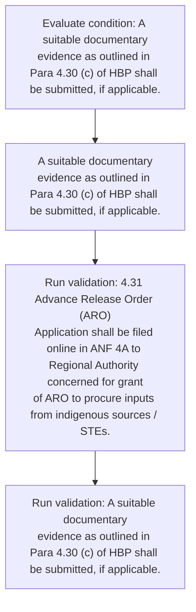
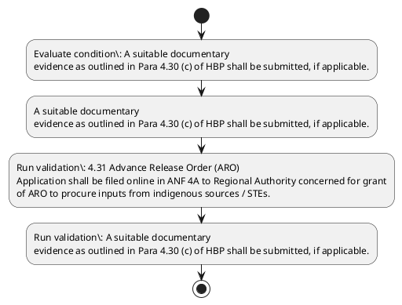

# Chapter 4 / Section 4.31: Advance Release Order (ARO)

**Chapter Title:** Duty Exemption / Remission Schemes

**Pages:** 15

**Purpose:** 4.31 Advance Release Order (ARO)
Application shall be filed online in ANF 4A to Regional Authority concerned for grant
of ARO to procure inputs from indigenous sources / STEs.

**Purpose Thanglish:** Indha Advance Release Order (ARO) section-la, 4.31 Advance Release Order (ARO)
application kandippa be filed online in ANF 4A to Regional authority concerned for grant
of ARO to procure inputs from indigenous sources / STEs.

**Summary:** 4.31 Advance Release Order (ARO)
Application shall be filed online in ANF 4A to Regional Authority concerned for grant
of ARO to procure inputs from indigenous sources / STEs. A suitable documentary
evidence as outlined in Para 4.30 (c) of HBP shall be submitted, if applicable.

**Business Meaning:** Advance Release Order (ARO) governs how DGFT business controls should be applied, validated, and enforced.

**Business Explanation:** Advance Release Order (ARO) explains the operating rule set that DEKAI should enforce. Key control points include 4.31 Advance Release Order (ARO)
Application shall be filed online in ANF 4A to Regional Authority concerned for grant
of ARO to procure inputs from indigenous sources / STEs. The section also drives actions such as A suitable documentary
evidence as outlined in Para 4.30 (c) of HBP shall be submitted, if applicable..

**Business Explanation Thanglish:** Indha Advance Release Order (ARO) section-la, Advance Release Order (ARO) explains the operating rule set that DEKAI should enforce. Key control points include 4.31 Advance Release Order (ARO)
application kandippa be filed online in ANF 4A to Regional authority concerned for grant
of ARO to procure inputs from indigenous sources / STEs. The section also drives actions such as A suitable documentary
evidence as outlined in Para 4.30 (c) of HBP kandippa be submitted, if applicable..

## Business Logic
- 4.31 Advance Release Order (ARO)
Application shall be filed online in ANF 4A to Regional Authority concerned for grant
of ARO to procure inputs from indigenous sources / STEs.
- A suitable documentary
evidence as outlined in Para 4.30 (c) of HBP shall be submitted, if applicable.

## Business Rules
- rule_id=CH4-SEC4_31-R001, rule_description=4.31 Advance Release Order (ARO)
Application shall be filed online in ANF 4A to Regional Authority concerned for grant
of ARO to procure inputs from indigenous sources / STEs., trigger=Advance Release Order (ARO), condition=A suitable documentary
evidence as outlined in Para 4.30 (c) of HBP shall be submitted, if applicable., validation=4.31 Advance Release Order (ARO)
Application shall be filed online in ANF 4A to Regional Authority concerned for grant
of ARO to procure inputs from indigenous sources / STEs., action=A suitable documentary
evidence as outlined in Para 4.30 (c) of HBP shall be submitted, if applicable., exception=No explicit exception found in uploaded documents., output=DEKAI should produce a compliance decision for 4.31 - Advance Release Order (ARO).
- rule_id=CH4-SEC4_31-R002, rule_description=A suitable documentary
evidence as outlined in Para 4.30 (c) of HBP shall be submitted, if applicable., trigger=Advance Release Order (ARO), condition=A suitable documentary
evidence as outlined in Para 4.30 (c) of HBP shall be submitted, if applicable., validation=A suitable documentary
evidence as outlined in Para 4.30 (c) of HBP shall be submitted, if applicable., action=A suitable documentary
evidence as outlined in Para 4.30 (c) of HBP shall be submitted, if applicable., exception=No explicit exception found in uploaded documents., output=DEKAI should produce a compliance decision for 4.31 - Advance Release Order (ARO).

## Conditions
- A suitable documentary
evidence as outlined in Para 4.30 (c) of HBP shall be submitted, if applicable.

## Condition Logic
- id=4.4.31.1, if=A suitable documentary
evidence as outlined in Para 4.30 (c) of HBP shall be submitted, if applicable., then=A suitable documentary
evidence as outlined in Para 4.30 (c) of HBP shall be submitted, if applicable., source=A suitable documentary
evidence as outlined in Para 4.30 (c) of HBP shall be submitted, if applicable.

## Validations
- 4.31 Advance Release Order (ARO)
Application shall be filed online in ANF 4A to Regional Authority concerned for grant
of ARO to procure inputs from indigenous sources / STEs.
- A suitable documentary
evidence as outlined in Para 4.30 (c) of HBP shall be submitted, if applicable.

## Exceptions
- None identified

## Dependencies
- 4.30
- 1
- 3
- 4

## Authorities
- Regional Authority

## Required Documents
- 4.31 Advance Release Order (ARO)
Application shall be filed online in ANF 4A to Regional Authority concerned for grant
of ARO to procure inputs from indigenous sources / STEs.
- A suitable documentary
evidence as outlined in Para 4.30 (c) of HBP shall be submitted, if applicable.

## Timelines
- None identified

## Actions
- A suitable documentary
evidence as outlined in Para 4.30 (c) of HBP shall be submitted, if applicable.

## Workflow
- Evaluate condition: A suitable documentary
evidence as outlined in Para 4.30 (c) of HBP shall be submitted, if applicable.
- A suitable documentary
evidence as outlined in Para 4.30 (c) of HBP shall be submitted, if applicable.
- Run validation: 4.31 Advance Release Order (ARO)
Application shall be filed online in ANF 4A to Regional Authority concerned for grant
of ARO to procure inputs from indigenous sources / STEs.
- Run validation: A suitable documentary
evidence as outlined in Para 4.30 (c) of HBP shall be submitted, if applicable.

## Workflow ASCII
```text
Advance Release Order (ARO)
Evaluate condition: A suitable documentary
evidence as outlined in Para 4.30 (c) of HBP shall be submitted, if applicable.
   |
   v
A suitable documentary
evidence as outlined in Para 4.30 (c) of HBP shall be submitted, if applicable.
   |
   v
Run validation: 4.31 Advance Release Order (ARO)
Application shall be filed online in ANF 4A to Regional Authority concerned for grant
of ARO to procure inputs from indigenous sources / STEs.
   |
   v
Run validation: A suitable documentary
evidence as outlined in Para 4.30 (c) of HBP shall be submitted, if applicable.
```

## Decision Tree
- IF A suitable documentary
evidence as outlined in Para 4.30 (c) of HBP shall be submitted, if applicable. THEN A suitable documentary
evidence as outlined in Para 4.30 (c) of HBP shall be submitted, if applicable.

## Decision Tree ASCII
```text
Advance Release Order (ARO) Decision
IF A suitable documentary
evidence as outlined in Para 4.30 (c) of HBP shall be submitted, if applicable. THEN A suitable documentary
evidence as outlined in Para 4.30 (c) of HBP shall be submitted, if applicable.
```

## Examples
- User asks to process Advance Release Order (ARO); the platform checks conditions, validations, and documents before action.

**Real-world Example:** Example: an importer or exporter invokes Advance Release Order (ARO), submits 4.31 Advance Release Order (ARO)
Application shall be filed online in ANF 4A to Regional Authority concerned for grant
of ARO to procure inputs from indigenous sources / STEs., A suitable documentary
evidence as outlined in Para 4.30 (c) of HBP shall be submitted, if applicable., and DEKAI uses the extracted rules to a suitable documentary
evidence as outlined in para 4.30 (c) of hbp shall be submitted, if applicable..

**Real-world Example Thanglish:** Indha Advance Release Order (ARO) section-la, Example: an importer or exporter invokes Advance Release Order (ARO), submits 4.31 Advance Release Order (ARO)
application kandippa be filed online in ANF 4A to Regional authority concerned for grant
of ARO to procure inputs from indigenous sources / STEs., A suitable documentary
evidence as outlined in Para 4.30 (c) of HBP kandippa be submitted, if applicable., and DEKAI uses the extracted rules to a suitable documentary
evidence as outlined in para 4.30 (c) of hbp kandippa be submitted, if applicable..

## AI Rules
- IF detected context matches section rule THEN enforce: 4.31 Advance Release Order (ARO)
Application shall be filed online in ANF 4A to Regional Authority concerned for grant
of ARO to procure inputs from indigenous sources / STEs.
- IF detected context matches section rule THEN enforce: A suitable documentary
evidence as outlined in Para 4.30 (c) of HBP shall be submitted, if applicable.
- IF validations pass THEN recommend action: A suitable documentary
evidence as outlined in Para 4.30 (c) of HBP shall be submitted, if applicable.

## Database Fields
- name=section_code, type=string, required=True, source=parsed_section_heading
- name=section_title, type=string, required=True, source=parsed_section_heading
- name=aro_flag, type=boolean, required=False, source=keyword:ARO
- name=anf_flag, type=boolean, required=False, source=keyword:ANF
- name=for_flag, type=boolean, required=False, source=keyword:for
- name=hbp_flag, type=boolean, required=False, source=keyword:HBP
- name=from_flag, type=boolean, required=False, source=keyword:from
- name=stes_flag, type=boolean, required=False, source=keyword:STEs
- name=para_flag, type=boolean, required=False, source=keyword:Para
- name=order_flag, type=boolean, required=False, source=keyword:Order
- name=document_1_submitted, type=boolean, required=True, source=4.31 Advance Release Order (ARO)
Application shall be filed online in ANF 4A to Regional Authority concerned for grant
of ARO to procure inputs from indigenous sources / STEs.
- name=document_2_submitted, type=boolean, required=True, source=A suitable documentary
evidence as outlined in Para 4.30 (c) of HBP shall be submitted, if applicable.

## API Requirements
- method=GET, path=/api/dgft/sections/4.31, purpose=Retrieve knowledge payload for section 4.31, query_params=['include=workflow,decision_tree,validations'], response_fields=['section', 'title', 'summary', 'conditions', 'validations', 'exceptions', 'workflow', 'decision_tree']
- method=POST, path=/api/dgft/Advance-Release-Order-ARO/validate, purpose=Validate inputs and documents for Advance Release Order (ARO), request_fields=['section_code', 'section_title', 'document_1_submitted', 'document_2_submitted'], response_fields=['status', 'errors', 'warnings', 'next_actions']
- method=POST, path=/api/dgft/Advance-Release-Order-ARO/execute, purpose=Trigger business action for A suitable documentary
evidence as outlined in Para 4.30 (c) of HBP shall be submitted, if applicable., request_fields=['section_code', 'section_title', 'document_1_submitted', 'document_2_submitted'], response_fields=['reference_id', 'status', 'authority', 'timeline']

## UI Screens
- screen_id=Advance_Release_Order_ARO_overview, name=Advance Release Order (ARO) Overview, purpose=Show section summary, authority, timeline, and eligibility cues., widgets=['summary_card', 'conditions_table', 'authority_badges', 'timeline_panel']
- screen_id=Advance_Release_Order_ARO_submission, name=Advance Release Order (ARO) Submission, purpose=Capture applicant data and supporting documents., widgets=['dynamic_form', 'document_uploader', 'validation_panel', 'next_action_footer'], fields=['section_code', 'section_title', 'aro_flag', 'anf_flag', 'for_flag', 'hbp_flag', 'from_flag', 'stes_flag']

## Error Messages
- Validation failed because the section requirements were not fully met.

## FAQ
- question_en=What is the purpose of section 4.31?, answer_en=Advance Release Order (ARO) explains the operating rule set that DEKAI should enforce. Key control points include 4.31 Advance Release Order (ARO)
Application shall be filed online in ANF 4A to Regional Authority concerned for grant
of ARO to procure inputs from indigenous sources / STEs. The section also drives actions such as A suitable documentary
evidence as outlined in Para 4.30 (c) of HBP shall be submitted, if applicable.., question_thanglish=Indha Advance Release Order (ARO) section-la, What is the purpose of section 4.31?, answer_thanglish=Indha Advance Release Order (ARO) section-la, Advance Release Order (ARO) explains the operating rule set that DEKAI should enforce. Key control points include 4.31 Advance Release Order (ARO)
application kandippa be filed online in ANF 4A to Regional authority concerned for grant
of ARO to procure inputs from indigenous sources / STEs. The section also drives actions such as A suitable documentary
evidence as outlined in Para 4.30 (c) of HBP kandippa be submitted, if applicable..
- question_en=What documents are required under Advance Release Order (ARO)?, answer_en=4.31 Advance Release Order (ARO)
Application shall be filed online in ANF 4A to Regional Authority concerned for grant
of ARO to procure inputs from indigenous sources / STEs., A suitable documentary
evidence as outlined in Para 4.30 (c) of HBP shall be submitted, if applicable., question_thanglish=Indha Advance Release Order (ARO) section-la, What documents are required under Advance Release Order (ARO)?, answer_thanglish=Indha Advance Release Order (ARO) section-la, 4.31 Advance Release Order (ARO)
application kandippa be filed online in ANF 4A to Regional authority concerned for grant
of ARO to procure inputs from indigenous sources / STEs., A suitable documentary
evidence as outlined in Para 4.30 (c) of HBP kandippa be submitted, if applicable.
- question_en=Which authority handles Advance Release Order (ARO)?, answer_en=Regional Authority, question_thanglish=Indha Advance Release Order (ARO) section-la, Which authority handles Advance Release Order (ARO)?, answer_thanglish=Indha Advance Release Order (ARO) section-la, Regional authority

## Questions Users May Ask
- What does Advance Release Order (ARO) require?
- Which documents are needed for Advance Release Order (ARO)?
- How does DEKAI validate Advance Release Order (ARO) requests?
- What action should be taken for Advance Release Order (ARO)?

## Expected AI Answers
- Advance Release Order (ARO) requires the platform to interpret the section text, apply the extracted business rules, and present the correct next action.
- Required documents are inferred from the section text: 4.31 Advance Release Order (ARO)
Application shall be filed online in ANF 4A to Regional Authority concerned for grant
of ARO to procure inputs from indigenous sources / STEs., A suitable documentary
evidence as outlined in Para 4.30 (c) of HBP shall be submitted, if applicable.
- DEKAI validates Advance Release Order (ARO) by checking conditions, required documents, authority references, and exception clauses before recommending an outcome.
- The primary extracted action is: A suitable documentary
evidence as outlined in Para 4.30 (c) of HBP shall be submitted, if applicable.

## AI Q&A Examples
- question_en=User asks: How do I comply with Advance Release Order (ARO)?, answer_en=AI answers: DEKAI should evaluate section 4.31, apply the extracted rules, and guide the user through Evaluate condition: A suitable documentary
evidence as outlined in Para 4.30 (c) of HBP shall be submitted, if applicable.., question_thanglish=Indha Advance Release Order (ARO) section-la, User asks: How do I comply with Advance Release Order (ARO)?, answer_thanglish=Indha Advance Release Order (ARO) section-la, AI answers: DEKAI should evaluate section 4.31, apply the extracted rules, and guide the user through Evaluate condition: A suitable documentary
evidence as outlined in Para 4.30 (c) of HBP kandippa be submitted, if applicable..
- question_en=User asks: Which validations apply to Advance Release Order (ARO)?, answer_en=AI answers: Applicable validations are 4.31 Advance Release Order (ARO)
Application shall be filed online in ANF 4A to Regional Authority concerned for grant
of ARO to procure inputs from indigenous sources / STEs., A suitable documentary
evidence as outlined in Para 4.30 (c) of HBP shall be submitted, if applicable., question_thanglish=Indha Advance Release Order (ARO) section-la, User asks: Which validations apply to Advance Release Order (ARO)?, answer_thanglish=Indha Advance Release Order (ARO) section-la, AI answers: Applicable validations are 4.31 Advance Release Order (ARO)
application kandippa be filed online in ANF 4A to Regional authority concerned for grant
of ARO to procure inputs from indigenous sources / STEs., A suitable documentary
evidence as outlined in Para 4.30 (c) of HBP kandippa be submitted, if applicable.

## DEKAI AI Implementation Notes
- Capture chapter 4, section 4.31, title, and page references as immutable knowledge metadata.
- Bind validations for Advance Release Order (ARO) into a rule engine keyed by the rule IDs extracted for this section.
- Expose document upload controls for: 4.31 Advance Release Order (ARO)
Application shall be filed online in ANF 4A to Regional Authority concerned for grant
of ARO to procure inputs from indigenous sources / STEs., A suitable documentary
evidence as outlined in Para 4.30 (c) of HBP shall be submitted, if applicable..
- Route escalations or approvals to: Regional Authority.
- Show contextual links to related sections: 4.30, 1, 3, 4.

## DEKAI AI Implementation Notes Thanglish
- Indha Advance Release Order (ARO) section-la, Capture chapter 4, section 4.31, title, and page references as immutable knowledge metadata.
- Indha Advance Release Order (ARO) section-la, Bind validations for Advance Release Order (ARO) into a rule engine keyed by the rule IDs extracted for this section.
- Indha Advance Release Order (ARO) section-la, Expose document upload controls for: 4.31 Advance Release Order (ARO)
application kandippa be filed online in ANF 4A to Regional authority concerned for grant
of ARO to procure inputs from indigenous sources / STEs., A suitable documentary
evidence as outlined in Para 4.30 (c) of HBP kandippa be submitted, if applicable..
- Indha Advance Release Order (ARO) section-la, Route escalations or approvals to: Regional authority.
- Indha Advance Release Order (ARO) section-la, Show contextual links to related sections: 4.30, 1, 3, 4.

## AI Metadata
- Keywords: ARO, ANF, for, HBP, from, STEs, Para, Order, shall, filed, grant, online, inputs, Advance, Release, procure, sources, Regional, suitable, evidence
- Search Keywords: ARO, ANF, for, HBP, from, STEs, Para, Order, shall, filed, grant, online, inputs, Advance, Release, procure, sources, Regional, suitable, evidence
- Intent: Support Advance Release Order (ARO) processing and compliance validation.
- Tags: 4.31, Advance Release Order (ARO), business-rule, document-driven, dgft
- Related Sections: 4.30, 1, 3, 4
- Related Chapters: 
- Related Rules: 4.31 Advance Release Order (ARO)
Application shall be filed online in ANF 4A to Regional Authority concerned for grant
of ARO to procure inputs from indigenous sources / STEs., A suitable documentary
evidence as outlined in Para 4.30 (c) of HBP shall be submitted, if applicable.

## Mermaid


## PlantUML

