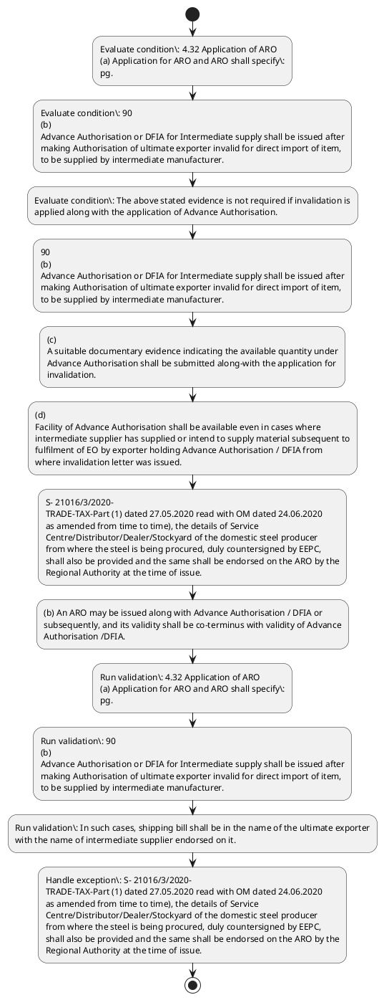

# Chapter 4 / Section 4.32: Application of ARO

**Chapter Title:** Duty Exemption / Remission Schemes

**Pages:** 15, 16

**Purpose:** 4.32 Application of ARO
(a) Application for ARO and ARO shall specify:
pg.

**Purpose Thanglish:** Indha Application of ARO section-la, 4.32 application of ARO
(a) application for ARO and ARO kandippa specify:
pg.

**Summary:** 4.32 Application of ARO
(a) Application for ARO and ARO shall specify:
pg. 90
pg. 90
(b)
Advance Authorisation or DFIA for Intermediate supply shall be issued after
making Authorisation of ultimate exporter invalid for direct import of item,
to be supplied by intermediate manufacturer.

**Business Meaning:** Application of ARO governs how DGFT business controls should be applied, validated, and enforced.

**Business Explanation:** Application of ARO explains the operating rule set that DEKAI should enforce. Key control points include 4.32 Application of ARO
(a) Application for ARO and ARO shall specify:
pg. The section also drives actions such as 90
(b)
Advance Authorisation or DFIA for Intermediate supply shall be issued after
making Authorisation of ultimate exporter invalid for direct import of item,
to be supplied by intermediate manufacturer..

**Business Explanation Thanglish:** Indha Application of ARO section-la, application of ARO explains the operating rule set that DEKAI should enforce. Key control points include 4.32 application of ARO
(a) application for ARO and ARO kandippa specify:
pg. The section also drives actions such as 90
(b)
Advance Authorisation or DFIA for Intermediate supply kandippa be issued after
making Authorisation of ultimate exporter invalid for direct import of item,
to be supplied by intermediate manufacturer..

## Business Logic
- 4.32 Application of ARO
(a) Application for ARO and ARO shall specify:
pg.
- 90
(b)
Advance Authorisation or DFIA for Intermediate supply shall be issued after
making Authorisation of ultimate exporter invalid for direct import of item,
to be supplied by intermediate manufacturer.
- In such cases, shipping bill shall be in the name of the ultimate exporter
with the name of intermediate supplier endorsed on it.
- (c)
A suitable documentary evidence indicating the available quantity under
Advance Authorisation shall be submitted along-with the application for
invalidation.
- (d)
Facility of Advance Authorisation shall be available even in cases where
intermediate supplier has supplied or intend to supply material subsequent to
fulfilment of EO by exporter holding Advance Authorisation / DFIA from
where invalidation letter was issued.
- (e)
The invalidation letter shall specify the following:
(i)
Name, Address and GSTIN of supplier;
(ii)
GSTIN
&
Address
of
recipient
unit
of
Advance
Authorisation/DFIA holder where inputs would be processed;
(iii)
Name, description including specifications, where applicable, and
quantity of items; and
(iv)
Individual value of items to be procured.
- 4.32 Application of ARO
(a)
Application for ARO and ARO shall specify:
(i) Name, Address and GSTIN of supplier;
(ii) GSTIN & Address of recipient unit of Advance Authorisation/DFIA
holder where inputs would be processed;
(iii) Name, description including specifications, where applicable, and
quantity of items and
(iv) Individual value of items to be procured.
- S- 21016/3/2020-
TRADE-TAX-Part (1) dated 27.05.2020 read with OM dated 24.06.2020
as amended from time to time), the details of Service
Centre/Distributor/Dealer/Stockyard of the domestic steel producer
from where the steel is being procured, duly countersigned by EEPC,
shall also be provided and the same shall be endorsed on the ARO by the
Regional Authority at the time of issue.
- (b) An ARO may be issued along with Advance Authorisation / DFIA or
subsequently, and its validity shall be co-terminus with validity of Advance
Authorisation /DFIA.

## Business Rules
- rule_id=CH4-SEC4_32-R001, rule_description=4.32 Application of ARO
(a) Application for ARO and ARO shall specify:
pg., trigger=Application of ARO, condition=4.32 Application of ARO
(a) Application for ARO and ARO shall specify:
pg., validation=4.32 Application of ARO
(a) Application for ARO and ARO shall specify:
pg., action=90
(b)
Advance Authorisation or DFIA for Intermediate supply shall be issued after
making Authorisation of ultimate exporter invalid for direct import of item,
to be supplied by intermediate manufacturer., exception=S- 21016/3/2020-
TRADE-TAX-Part (1) dated 27.05.2020 read with OM dated 24.06.2020
as amended from time to time), the details of Service
Centre/Distributor/Dealer/Stockyard of the domestic steel producer
from where the steel is being procured, duly countersigned by EEPC,
shall also be provided and the same shall be endorsed on the ARO by the
Regional Authority at the time of issue., output=DEKAI should produce a compliance decision for 4.32 - Application of ARO.
- rule_id=CH4-SEC4_32-R002, rule_description=90
(b)
Advance Authorisation or DFIA for Intermediate supply shall be issued after
making Authorisation of ultimate exporter invalid for direct import of item,
to be supplied by intermediate manufacturer., trigger=Application of ARO, condition=90
(b)
Advance Authorisation or DFIA for Intermediate supply shall be issued after
making Authorisation of ultimate exporter invalid for direct import of item,
to be supplied by intermediate manufacturer., validation=90
(b)
Advance Authorisation or DFIA for Intermediate supply shall be issued after
making Authorisation of ultimate exporter invalid for direct import of item,
to be supplied by intermediate manufacturer., action=(c)
A suitable documentary evidence indicating the available quantity under
Advance Authorisation shall be submitted along-with the application for
invalidation., exception=S- 21016/3/2020-
TRADE-TAX-Part (1) dated 27.05.2020 read with OM dated 24.06.2020
as amended from time to time), the details of Service
Centre/Distributor/Dealer/Stockyard of the domestic steel producer
from where the steel is being procured, duly countersigned by EEPC,
shall also be provided and the same shall be endorsed on the ARO by the
Regional Authority at the time of issue., output=DEKAI should produce a compliance decision for 4.32 - Application of ARO.
- rule_id=CH4-SEC4_32-R003, rule_description=In such cases, shipping bill shall be in the name of the ultimate exporter
with the name of intermediate supplier endorsed on it., trigger=Application of ARO, condition=The above stated evidence is not required if invalidation is
applied along with the application of Advance Authorisation., validation=In such cases, shipping bill shall be in the name of the ultimate exporter
with the name of intermediate supplier endorsed on it., action=(d)
Facility of Advance Authorisation shall be available even in cases where
intermediate supplier has supplied or intend to supply material subsequent to
fulfilment of EO by exporter holding Advance Authorisation / DFIA from
where invalidation letter was issued., exception=S- 21016/3/2020-
TRADE-TAX-Part (1) dated 27.05.2020 read with OM dated 24.06.2020
as amended from time to time), the details of Service
Centre/Distributor/Dealer/Stockyard of the domestic steel producer
from where the steel is being procured, duly countersigned by EEPC,
shall also be provided and the same shall be endorsed on the ARO by the
Regional Authority at the time of issue., output=DEKAI should produce a compliance decision for 4.32 - Application of ARO.
- rule_id=CH4-SEC4_32-R004, rule_description=(c)
A suitable documentary evidence indicating the available quantity under
Advance Authorisation shall be submitted along-with the application for
invalidation., trigger=Application of ARO, condition=(d)
Facility of Advance Authorisation shall be available even in cases where
intermediate supplier has supplied or intend to supply material subsequent to
fulfilment of EO by exporter holding Advance Authorisation / DFIA from
where invalidation letter was issued., validation=(c)
A suitable documentary evidence indicating the available quantity under
Advance Authorisation shall be submitted along-with the application for
invalidation., action=S- 21016/3/2020-
TRADE-TAX-Part (1) dated 27.05.2020 read with OM dated 24.06.2020
as amended from time to time), the details of Service
Centre/Distributor/Dealer/Stockyard of the domestic steel producer
from where the steel is being procured, duly countersigned by EEPC,
shall also be provided and the same shall be endorsed on the ARO by the
Regional Authority at the time of issue., exception=S- 21016/3/2020-
TRADE-TAX-Part (1) dated 27.05.2020 read with OM dated 24.06.2020
as amended from time to time), the details of Service
Centre/Distributor/Dealer/Stockyard of the domestic steel producer
from where the steel is being procured, duly countersigned by EEPC,
shall also be provided and the same shall be endorsed on the ARO by the
Regional Authority at the time of issue., output=DEKAI should produce a compliance decision for 4.32 - Application of ARO.
- rule_id=CH4-SEC4_32-R005, rule_description=(d)
Facility of Advance Authorisation shall be available even in cases where
intermediate supplier has supplied or intend to supply material subsequent to
fulfilment of EO by exporter holding Advance Authorisation / DFIA from
where invalidation letter was issued., trigger=Application of ARO, condition=(e)
The invalidation letter shall specify the following:
(i)
Name, Address and GSTIN of supplier;
(ii)
GSTIN
&
Address
of
recipient
unit
of
Advance
Authorisation/DFIA holder where inputs would be processed;
(iii)
Name, description including specifications, where applicable, and
quantity of items; and
(iv)
Individual value of items to be procured., validation=The above stated evidence is not required if invalidation is
applied along with the application of Advance Authorisation., action=(b) An ARO may be issued along with Advance Authorisation / DFIA or
subsequently, and its validity shall be co-terminus with validity of Advance
Authorisation /DFIA., exception=S- 21016/3/2020-
TRADE-TAX-Part (1) dated 27.05.2020 read with OM dated 24.06.2020
as amended from time to time), the details of Service
Centre/Distributor/Dealer/Stockyard of the domestic steel producer
from where the steel is being procured, duly countersigned by EEPC,
shall also be provided and the same shall be endorsed on the ARO by the
Regional Authority at the time of issue., output=DEKAI should produce a compliance decision for 4.32 - Application of ARO.
- rule_id=CH4-SEC4_32-R006, rule_description=(e)
The invalidation letter shall specify the following:
(i)
Name, Address and GSTIN of supplier;
(ii)
GSTIN
&
Address
of
recipient
unit
of
Advance
Authorisation/DFIA holder where inputs would be processed;
(iii)
Name, description including specifications, where applicable, and
quantity of items; and
(iv)
Individual value of items to be procured., trigger=Application of ARO, condition=4.32 Application of ARO
(a)
Application for ARO and ARO shall specify:
(i) Name, Address and GSTIN of supplier;
(ii) GSTIN & Address of recipient unit of Advance Authorisation/DFIA
holder where inputs would be processed;
(iii) Name, description including specifications, where applicable, and
quantity of items and
(iv) Individual value of items to be procured., validation=(d)
Facility of Advance Authorisation shall be available even in cases where
intermediate supplier has supplied or intend to supply material subsequent to
fulfilment of EO by exporter holding Advance Authorisation / DFIA from
where invalidation letter was issued., action=(b) An ARO may be issued along with Advance Authorisation / DFIA or
subsequently, and its validity shall be co-terminus with validity of Advance
Authorisation /DFIA., exception=S- 21016/3/2020-
TRADE-TAX-Part (1) dated 27.05.2020 read with OM dated 24.06.2020
as amended from time to time), the details of Service
Centre/Distributor/Dealer/Stockyard of the domestic steel producer
from where the steel is being procured, duly countersigned by EEPC,
shall also be provided and the same shall be endorsed on the ARO by the
Regional Authority at the time of issue., output=DEKAI should produce a compliance decision for 4.32 - Application of ARO.
- rule_id=CH4-SEC4_32-R007, rule_description=4.32 Application of ARO
(a)
Application for ARO and ARO shall specify:
(i) Name, Address and GSTIN of supplier;
(ii) GSTIN & Address of recipient unit of Advance Authorisation/DFIA
holder where inputs would be processed;
(iii) Name, description including specifications, where applicable, and
quantity of items and
(iv) Individual value of items to be procured., trigger=Application of ARO, condition=S- 21016/3/2020-
TRADE-TAX-Part (1) dated 27.05.2020 read with OM dated 24.06.2020
as amended from time to time), the details of Service
Centre/Distributor/Dealer/Stockyard of the domestic steel producer
from where the steel is being procured, duly countersigned by EEPC,
shall also be provided and the same shall be endorsed on the ARO by the
Regional Authority at the time of issue., validation=(e)
The invalidation letter shall specify the following:
(i)
Name, Address and GSTIN of supplier;
(ii)
GSTIN
&
Address
of
recipient
unit
of
Advance
Authorisation/DFIA holder where inputs would be processed;
(iii)
Name, description including specifications, where applicable, and
quantity of items; and
(iv)
Individual value of items to be procured., action=(b) An ARO may be issued along with Advance Authorisation / DFIA or
subsequently, and its validity shall be co-terminus with validity of Advance
Authorisation /DFIA., exception=S- 21016/3/2020-
TRADE-TAX-Part (1) dated 27.05.2020 read with OM dated 24.06.2020
as amended from time to time), the details of Service
Centre/Distributor/Dealer/Stockyard of the domestic steel producer
from where the steel is being procured, duly countersigned by EEPC,
shall also be provided and the same shall be endorsed on the ARO by the
Regional Authority at the time of issue., output=DEKAI should produce a compliance decision for 4.32 - Application of ARO.
- rule_id=CH4-SEC4_32-R008, rule_description=S- 21016/3/2020-
TRADE-TAX-Part (1) dated 27.05.2020 read with OM dated 24.06.2020
as amended from time to time), the details of Service
Centre/Distributor/Dealer/Stockyard of the domestic steel producer
from where the steel is being procured, duly countersigned by EEPC,
shall also be provided and the same shall be endorsed on the ARO by the
Regional Authority at the time of issue., trigger=Application of ARO, condition=S- 21016/3/2020-
TRADE-TAX-Part (1) dated 27.05.2020 read with OM dated 24.06.2020
as amended from time to time), the details of Service
Centre/Distributor/Dealer/Stockyard of the domestic steel producer
from where the steel is being procured, duly countersigned by EEPC,
shall also be provided and the same shall be endorsed on the ARO by the
Regional Authority at the time of issue., validation=4.32 Application of ARO
(a)
Application for ARO and ARO shall specify:
(i) Name, Address and GSTIN of supplier;
(ii) GSTIN & Address of recipient unit of Advance Authorisation/DFIA
holder where inputs would be processed;
(iii) Name, description including specifications, where applicable, and
quantity of items and
(iv) Individual value of items to be procured., action=(b) An ARO may be issued along with Advance Authorisation / DFIA or
subsequently, and its validity shall be co-terminus with validity of Advance
Authorisation /DFIA., exception=S- 21016/3/2020-
TRADE-TAX-Part (1) dated 27.05.2020 read with OM dated 24.06.2020
as amended from time to time), the details of Service
Centre/Distributor/Dealer/Stockyard of the domestic steel producer
from where the steel is being procured, duly countersigned by EEPC,
shall also be provided and the same shall be endorsed on the ARO by the
Regional Authority at the time of issue., output=DEKAI should produce a compliance decision for 4.32 - Application of ARO.
- rule_id=CH4-SEC4_32-R009, rule_description=(b) An ARO may be issued along with Advance Authorisation / DFIA or
subsequently, and its validity shall be co-terminus with validity of Advance
Authorisation /DFIA., trigger=Application of ARO, condition=S- 21016/3/2020-
TRADE-TAX-Part (1) dated 27.05.2020 read with OM dated 24.06.2020
as amended from time to time), the details of Service
Centre/Distributor/Dealer/Stockyard of the domestic steel producer
from where the steel is being procured, duly countersigned by EEPC,
shall also be provided and the same shall be endorsed on the ARO by the
Regional Authority at the time of issue., validation=S- 21016/3/2020-
TRADE-TAX-Part (1) dated 27.05.2020 read with OM dated 24.06.2020
as amended from time to time), the details of Service
Centre/Distributor/Dealer/Stockyard of the domestic steel producer
from where the steel is being procured, duly countersigned by EEPC,
shall also be provided and the same shall be endorsed on the ARO by the
Regional Authority at the time of issue., action=(b) An ARO may be issued along with Advance Authorisation / DFIA or
subsequently, and its validity shall be co-terminus with validity of Advance
Authorisation /DFIA., exception=S- 21016/3/2020-
TRADE-TAX-Part (1) dated 27.05.2020 read with OM dated 24.06.2020
as amended from time to time), the details of Service
Centre/Distributor/Dealer/Stockyard of the domestic steel producer
from where the steel is being procured, duly countersigned by EEPC,
shall also be provided and the same shall be endorsed on the ARO by the
Regional Authority at the time of issue., output=DEKAI should produce a compliance decision for 4.32 - Application of ARO.

## Conditions
- 4.32 Application of ARO
(a) Application for ARO and ARO shall specify:
pg.
- 90
(b)
Advance Authorisation or DFIA for Intermediate supply shall be issued after
making Authorisation of ultimate exporter invalid for direct import of item,
to be supplied by intermediate manufacturer.
- The above stated evidence is not required if invalidation is
applied along with the application of Advance Authorisation.
- (d)
Facility of Advance Authorisation shall be available even in cases where
intermediate supplier has supplied or intend to supply material subsequent to
fulfilment of EO by exporter holding Advance Authorisation / DFIA from
where invalidation letter was issued.
- (e)
The invalidation letter shall specify the following:
(i)
Name, Address and GSTIN of supplier;
(ii)
GSTIN
&
Address
of
recipient
unit
of
Advance
Authorisation/DFIA holder where inputs would be processed;
(iii)
Name, description including specifications, where applicable, and
quantity of items; and
(iv)
Individual value of items to be procured.
- 4.32 Application of ARO
(a)
Application for ARO and ARO shall specify:
(i) Name, Address and GSTIN of supplier;
(ii) GSTIN & Address of recipient unit of Advance Authorisation/DFIA
holder where inputs would be processed;
(iii) Name, description including specifications, where applicable, and
quantity of items and
(iv) Individual value of items to be procured.
- S- 21016/3/2020-
TRADE-TAX-Part (1) dated 27.05.2020 read with OM dated 24.06.2020
as amended from time to time), the details of Service
Centre/Distributor/Dealer/Stockyard of the domestic steel producer
from where the steel is being procured, duly countersigned by EEPC,
shall also be provided and the same shall be endorsed on the ARO by the
Regional Authority at the time of issue.

## Condition Logic
- id=4.4.32.1, if=4.32 Application of ARO
(a) Application for ARO and ARO shall specify:
pg., then=90
(b)
Advance Authorisation or DFIA for Intermediate supply shall be issued after
making Authorisation of ultimate exporter invalid for direct import of item,
to be supplied by intermediate manufacturer., source=4.32 Application of ARO
(a) Application for ARO and ARO shall specify:
pg.
- id=4.4.32.2, if=90
(b)
Advance Authorisation or DFIA for Intermediate supply shall be issued after
making Authorisation of ultimate exporter invalid for direct import of item,
to be supplied by intermediate manufacturer., then=90
(b)
Advance Authorisation or DFIA for Intermediate supply shall be issued after
making Authorisation of ultimate exporter invalid for direct import of item,
to be supplied by intermediate manufacturer., source=90
(b)
Advance Authorisation or DFIA for Intermediate supply shall be issued after
making Authorisation of ultimate exporter invalid for direct import of item,
to be supplied by intermediate manufacturer.
- id=4.4.32.3, if=The above stated evidence is not required if invalidation is
applied along with the application of Advance Authorisation., then=90
(b)
Advance Authorisation or DFIA for Intermediate supply shall be issued after
making Authorisation of ultimate exporter invalid for direct import of item,
to be supplied by intermediate manufacturer., source=The above stated evidence is not required if invalidation is
applied along with the application of Advance Authorisation.
- id=4.4.32.4, if=(d)
Facility of Advance Authorisation shall be available even in cases where
intermediate supplier has supplied or intend to supply material subsequent to
fulfilment of EO by exporter holding Advance Authorisation / DFIA from
where invalidation letter was issued., then=90
(b)
Advance Authorisation or DFIA for Intermediate supply shall be issued after
making Authorisation of ultimate exporter invalid for direct import of item,
to be supplied by intermediate manufacturer., source=(d)
Facility of Advance Authorisation shall be available even in cases where
intermediate supplier has supplied or intend to supply material subsequent to
fulfilment of EO by exporter holding Advance Authorisation / DFIA from
where invalidation letter was issued.
- id=4.4.32.5, if=(e)
The invalidation letter shall specify the following:
(i)
Name, Address and GSTIN of supplier;
(ii)
GSTIN
&
Address
of
recipient
unit
of
Advance
Authorisation/DFIA holder where inputs would be processed;
(iii)
Name, description including specifications, where applicable, and
quantity of items; and
(iv)
Individual value of items to be procured., then=90
(b)
Advance Authorisation or DFIA for Intermediate supply shall be issued after
making Authorisation of ultimate exporter invalid for direct import of item,
to be supplied by intermediate manufacturer., source=(e)
The invalidation letter shall specify the following:
(i)
Name, Address and GSTIN of supplier;
(ii)
GSTIN
&
Address
of
recipient
unit
of
Advance
Authorisation/DFIA holder where inputs would be processed;
(iii)
Name, description including specifications, where applicable, and
quantity of items; and
(iv)
Individual value of items to be procured.
- id=4.4.32.6, if=4.32 Application of ARO
(a)
Application for ARO and ARO shall specify:
(i) Name, Address and GSTIN of supplier;
(ii) GSTIN & Address of recipient unit of Advance Authorisation/DFIA
holder where inputs would be processed;
(iii) Name, description including specifications, where applicable, and
quantity of items and
(iv) Individual value of items to be procured., then=90
(b)
Advance Authorisation or DFIA for Intermediate supply shall be issued after
making Authorisation of ultimate exporter invalid for direct import of item,
to be supplied by intermediate manufacturer., source=4.32 Application of ARO
(a)
Application for ARO and ARO shall specify:
(i) Name, Address and GSTIN of supplier;
(ii) GSTIN & Address of recipient unit of Advance Authorisation/DFIA
holder where inputs would be processed;
(iii) Name, description including specifications, where applicable, and
quantity of items and
(iv) Individual value of items to be procured.
- id=4.4.32.7, if=S- 21016/3/2020-
TRADE-TAX-Part (1) dated 27.05.2020 read with OM dated 24.06.2020
as amended from time to time), the details of Service
Centre/Distributor/Dealer/Stockyard of the domestic steel producer
from where the steel is being procured, duly countersigned by EEPC,
shall also be provided and the same shall be endorsed on the ARO by the
Regional Authority at the time of issue., then=90
(b)
Advance Authorisation or DFIA for Intermediate supply shall be issued after
making Authorisation of ultimate exporter invalid for direct import of item,
to be supplied by intermediate manufacturer., source=S- 21016/3/2020-
TRADE-TAX-Part (1) dated 27.05.2020 read with OM dated 24.06.2020
as amended from time to time), the details of Service
Centre/Distributor/Dealer/Stockyard of the domestic steel producer
from where the steel is being procured, duly countersigned by EEPC,
shall also be provided and the same shall be endorsed on the ARO by the
Regional Authority at the time of issue.

## Validations
- 4.32 Application of ARO
(a) Application for ARO and ARO shall specify:
pg.
- 90
(b)
Advance Authorisation or DFIA for Intermediate supply shall be issued after
making Authorisation of ultimate exporter invalid for direct import of item,
to be supplied by intermediate manufacturer.
- In such cases, shipping bill shall be in the name of the ultimate exporter
with the name of intermediate supplier endorsed on it.
- (c)
A suitable documentary evidence indicating the available quantity under
Advance Authorisation shall be submitted along-with the application for
invalidation.
- The above stated evidence is not required if invalidation is
applied along with the application of Advance Authorisation.
- (d)
Facility of Advance Authorisation shall be available even in cases where
intermediate supplier has supplied or intend to supply material subsequent to
fulfilment of EO by exporter holding Advance Authorisation / DFIA from
where invalidation letter was issued.
- (e)
The invalidation letter shall specify the following:
(i)
Name, Address and GSTIN of supplier;
(ii)
GSTIN
&
Address
of
recipient
unit
of
Advance
Authorisation/DFIA holder where inputs would be processed;
(iii)
Name, description including specifications, where applicable, and
quantity of items; and
(iv)
Individual value of items to be procured.
- 4.32 Application of ARO
(a)
Application for ARO and ARO shall specify:
(i) Name, Address and GSTIN of supplier;
(ii) GSTIN & Address of recipient unit of Advance Authorisation/DFIA
holder where inputs would be processed;
(iii) Name, description including specifications, where applicable, and
quantity of items and
(iv) Individual value of items to be procured.
- S- 21016/3/2020-
TRADE-TAX-Part (1) dated 27.05.2020 read with OM dated 24.06.2020
as amended from time to time), the details of Service
Centre/Distributor/Dealer/Stockyard of the domestic steel producer
from where the steel is being procured, duly countersigned by EEPC,
shall also be provided and the same shall be endorsed on the ARO by the
Regional Authority at the time of issue.
- (b) An ARO may be issued along with Advance Authorisation / DFIA or
subsequently, and its validity shall be co-terminus with validity of Advance
Authorisation /DFIA.

## Exceptions
- S- 21016/3/2020-
TRADE-TAX-Part (1) dated 27.05.2020 read with OM dated 24.06.2020
as amended from time to time), the details of Service
Centre/Distributor/Dealer/Stockyard of the domestic steel producer
from where the steel is being procured, duly countersigned by EEPC,
shall also be provided and the same shall be endorsed on the ARO by the
Regional Authority at the time of issue.

## Dependencies
- 4.06
- 1
- 2
- 3
- 4
- 5
- 6

## Authorities
- Regional Authority

## Required Documents
- 4.32 Application of ARO
(a) Application for ARO and ARO shall specify:
pg.
- In such case, a copy of the
invalidation letter will be given to ultimate exporter holding Authorisation and
copy thereof will be sent to intermediate supplier as well as Regional Authority
of intermediate supplier.
- In such cases, shipping bill shall be in the name of the ultimate exporter
with the name of intermediate supplier endorsed on it.
- (c)
A suitable documentary evidence indicating the available quantity under
Advance Authorisation shall be submitted along-with the application for
invalidation.
- The above stated evidence is not required if invalidation is
applied along with the application of Advance Authorisation.
- 4.32 Application of ARO
(a)
Application for ARO and ARO shall specify:
(i) Name, Address and GSTIN of supplier;
(ii) GSTIN & Address of recipient unit of Advance Authorisation/DFIA
holder where inputs would be processed;
(iii) Name, description including specifications, where applicable, and
quantity of items and
(iv) Individual value of items to be procured.

## Timelines
- 90
(b)
Advance Authorisation or DFIA for Intermediate supply shall be issued after
making Authorisation of ultimate exporter invalid for direct import of item,
to be supplied by intermediate manufacturer.

## Actions
- 90
(b)
Advance Authorisation or DFIA for Intermediate supply shall be issued after
making Authorisation of ultimate exporter invalid for direct import of item,
to be supplied by intermediate manufacturer.
- (c)
A suitable documentary evidence indicating the available quantity under
Advance Authorisation shall be submitted along-with the application for
invalidation.
- (d)
Facility of Advance Authorisation shall be available even in cases where
intermediate supplier has supplied or intend to supply material subsequent to
fulfilment of EO by exporter holding Advance Authorisation / DFIA from
where invalidation letter was issued.
- S- 21016/3/2020-
TRADE-TAX-Part (1) dated 27.05.2020 read with OM dated 24.06.2020
as amended from time to time), the details of Service
Centre/Distributor/Dealer/Stockyard of the domestic steel producer
from where the steel is being procured, duly countersigned by EEPC,
shall also be provided and the same shall be endorsed on the ARO by the
Regional Authority at the time of issue.
- (b) An ARO may be issued along with Advance Authorisation / DFIA or
subsequently, and its validity shall be co-terminus with validity of Advance
Authorisation /DFIA.

## Workflow
- Evaluate condition: 4.32 Application of ARO
(a) Application for ARO and ARO shall specify:
pg.
- Evaluate condition: 90
(b)
Advance Authorisation or DFIA for Intermediate supply shall be issued after
making Authorisation of ultimate exporter invalid for direct import of item,
to be supplied by intermediate manufacturer.
- Evaluate condition: The above stated evidence is not required if invalidation is
applied along with the application of Advance Authorisation.
- 90
(b)
Advance Authorisation or DFIA for Intermediate supply shall be issued after
making Authorisation of ultimate exporter invalid for direct import of item,
to be supplied by intermediate manufacturer.
- (c)
A suitable documentary evidence indicating the available quantity under
Advance Authorisation shall be submitted along-with the application for
invalidation.
- (d)
Facility of Advance Authorisation shall be available even in cases where
intermediate supplier has supplied or intend to supply material subsequent to
fulfilment of EO by exporter holding Advance Authorisation / DFIA from
where invalidation letter was issued.
- S- 21016/3/2020-
TRADE-TAX-Part (1) dated 27.05.2020 read with OM dated 24.06.2020
as amended from time to time), the details of Service
Centre/Distributor/Dealer/Stockyard of the domestic steel producer
from where the steel is being procured, duly countersigned by EEPC,
shall also be provided and the same shall be endorsed on the ARO by the
Regional Authority at the time of issue.
- (b) An ARO may be issued along with Advance Authorisation / DFIA or
subsequently, and its validity shall be co-terminus with validity of Advance
Authorisation /DFIA.
- Run validation: 4.32 Application of ARO
(a) Application for ARO and ARO shall specify:
pg.
- Run validation: 90
(b)
Advance Authorisation or DFIA for Intermediate supply shall be issued after
making Authorisation of ultimate exporter invalid for direct import of item,
to be supplied by intermediate manufacturer.
- Run validation: In such cases, shipping bill shall be in the name of the ultimate exporter
with the name of intermediate supplier endorsed on it.
- Handle exception: S- 21016/3/2020-
TRADE-TAX-Part (1) dated 27.05.2020 read with OM dated 24.06.2020
as amended from time to time), the details of Service
Centre/Distributor/Dealer/Stockyard of the domestic steel producer
from where the steel is being procured, duly countersigned by EEPC,
shall also be provided and the same shall be endorsed on the ARO by the
Regional Authority at the time of issue.

## Workflow ASCII
```text
Application of ARO
Evaluate condition: 4.32 Application of ARO
(a) Application for ARO and ARO shall specify:
pg.
   |
   v
Evaluate condition: 90
(b)
Advance Authorisation or DFIA for Intermediate supply shall be issued after
making Authorisation of ultimate exporter invalid for direct import of item,
to be supplied by intermediate manufacturer.
   |
   v
Evaluate condition: The above stated evidence is not required if invalidation is
applied along with the application of Advance Authorisation.
   |
   v
90
(b)
Advance Authorisation or DFIA for Intermediate supply shall be issued after
making Authorisation of ultimate exporter invalid for direct import of item,
to be supplied by intermediate manufacturer.
   |
   v
(c)
A suitable documentary evidence indicating the available quantity under
Advance Authorisation shall be submitted along-with the application for
invalidation.
   |
   v
(d)
Facility of Advance Authorisation shall be available even in cases where
intermediate supplier has supplied or intend to supply material subsequent to
fulfilment of EO by exporter holding Advance Authorisation / DFIA from
where invalidation letter was issued.
   |
   v
S- 21016/3/2020-
TRADE-TAX-Part (1) dated 27.05.2020 read with OM dated 24.06.2020
as amended from time to time), the details of Service
Centre/Distributor/Dealer/Stockyard of the domestic steel producer
from where the steel is being procured, duly countersigned by EEPC,
shall also be provided and the same shall be endorsed on the ARO by the
Regional Authority at the time of issue.
   |
   v
(b) An ARO may be issued along with Advance Authorisation / DFIA or
subsequently, and its validity shall be co-terminus with validity of Advance
Authorisation /DFIA.
   |
   v
Run validation: 4.32 Application of ARO
(a) Application for ARO and ARO shall specify:
pg.
   |
   v
Run validation: 90
(b)
Advance Authorisation or DFIA for Intermediate supply shall be issued after
making Authorisation of ultimate exporter invalid for direct import of item,
to be supplied by intermediate manufacturer.
   |
   v
Run validation: In such cases, shipping bill shall be in the name of the ultimate exporter
with the name of intermediate supplier endorsed on it.
   |
   v
Handle exception: S- 21016/3/2020-
TRADE-TAX-Part (1) dated 27.05.2020 read with OM dated 24.06.2020
as amended from time to time), the details of Service
Centre/Distributor/Dealer/Stockyard of the domestic steel producer
from where the steel is being procured, duly countersigned by EEPC,
shall also be provided and the same shall be endorsed on the ARO by the
Regional Authority at the time of issue.
```

## Decision Tree
- IF 4.32 Application of ARO
(a) Application for ARO and ARO shall specify:
pg. THEN 90
(b)
Advance Authorisation or DFIA for Intermediate supply shall be issued after
making Authorisation of ultimate exporter invalid for direct import of item,
to be supplied by intermediate manufacturer.
- IF 90
(b)
Advance Authorisation or DFIA for Intermediate supply shall be issued after
making Authorisation of ultimate exporter invalid for direct import of item,
to be supplied by intermediate manufacturer. THEN 90
(b)
Advance Authorisation or DFIA for Intermediate supply shall be issued after
making Authorisation of ultimate exporter invalid for direct import of item,
to be supplied by intermediate manufacturer.
- IF The above stated evidence is not required if invalidation is
applied along with the application of Advance Authorisation. THEN 90
(b)
Advance Authorisation or DFIA for Intermediate supply shall be issued after
making Authorisation of ultimate exporter invalid for direct import of item,
to be supplied by intermediate manufacturer.
- IF (d)
Facility of Advance Authorisation shall be available even in cases where
intermediate supplier has supplied or intend to supply material subsequent to
fulfilment of EO by exporter holding Advance Authorisation / DFIA from
where invalidation letter was issued. THEN 90
(b)
Advance Authorisation or DFIA for Intermediate supply shall be issued after
making Authorisation of ultimate exporter invalid for direct import of item,
to be supplied by intermediate manufacturer.
- IF (e)
The invalidation letter shall specify the following:
(i)
Name, Address and GSTIN of supplier;
(ii)
GSTIN
&
Address
of
recipient
unit
of
Advance
Authorisation/DFIA holder where inputs would be processed;
(iii)
Name, description including specifications, where applicable, and
quantity of items; and
(iv)
Individual value of items to be procured. THEN 90
(b)
Advance Authorisation or DFIA for Intermediate supply shall be issued after
making Authorisation of ultimate exporter invalid for direct import of item,
to be supplied by intermediate manufacturer.
- IF exception applies (S- 21016/3/2020-
TRADE-TAX-Part (1) dated 27.05.2020 read with OM dated 24.06.2020
as amended from time to time), the details of Service
Centre/Distributor/Dealer/Stockyard of the domestic steel producer
from where the steel is being procured, duly countersigned by EEPC,
shall also be provided and the same shall be endorsed on the ARO by the
Regional Authority at the time of issue.) THEN route to manual review

## Decision Tree ASCII
```text
Application of ARO Decision
IF 4.32 Application of ARO
(a) Application for ARO and ARO shall specify:
pg. THEN 90
(b)
Advance Authorisation or DFIA for Intermediate supply shall be issued after
making Authorisation of ultimate exporter invalid for direct import of item,
to be supplied by intermediate manufacturer.
   |
   v
IF 90
(b)
Advance Authorisation or DFIA for Intermediate supply shall be issued after
making Authorisation of ultimate exporter invalid for direct import of item,
to be supplied by intermediate manufacturer. THEN 90
(b)
Advance Authorisation or DFIA for Intermediate supply shall be issued after
making Authorisation of ultimate exporter invalid for direct import of item,
to be supplied by intermediate manufacturer.
   |
   v
IF The above stated evidence is not required if invalidation is
applied along with the application of Advance Authorisation. THEN 90
(b)
Advance Authorisation or DFIA for Intermediate supply shall be issued after
making Authorisation of ultimate exporter invalid for direct import of item,
to be supplied by intermediate manufacturer.
   |
   v
IF (d)
Facility of Advance Authorisation shall be available even in cases where
intermediate supplier has supplied or intend to supply material subsequent to
fulfilment of EO by exporter holding Advance Authorisation / DFIA from
where invalidation letter was issued. THEN 90
(b)
Advance Authorisation or DFIA for Intermediate supply shall be issued after
making Authorisation of ultimate exporter invalid for direct import of item,
to be supplied by intermediate manufacturer.
   |
   v
IF (e)
The invalidation letter shall specify the following:
(i)
Name, Address and GSTIN of supplier;
(ii)
GSTIN
&
Address
of
recipient
unit
of
Advance
Authorisation/DFIA holder where inputs would be processed;
(iii)
Name, description including specifications, where applicable, and
quantity of items; and
(iv)
Individual value of items to be procured. THEN 90
(b)
Advance Authorisation or DFIA for Intermediate supply shall be issued after
making Authorisation of ultimate exporter invalid for direct import of item,
to be supplied by intermediate manufacturer.
   |
   v
IF exception applies (S- 21016/3/2020-
TRADE-TAX-Part (1) dated 27.05.2020 read with OM dated 24.06.2020
as amended from time to time), the details of Service
Centre/Distributor/Dealer/Stockyard of the domestic steel producer
from where the steel is being procured, duly countersigned by EEPC,
shall also be provided and the same shall be endorsed on the ARO by the
Regional Authority at the time of issue.) THEN route to manual review
```

## Examples
- User asks to process Application of ARO; the platform checks conditions, validations, and documents before action.

**Real-world Example:** Example: an importer or exporter invokes Application of ARO, submits 4.32 Application of ARO
(a) Application for ARO and ARO shall specify:
pg., In such case, a copy of the
invalidation letter will be given to ultimate exporter holding Authorisation and
copy thereof will be sent to intermediate supplier as well as Regional Authority
of intermediate supplier., In such cases, shipping bill shall be in the name of the ultimate exporter
with the name of intermediate supplier endorsed on it., and DEKAI uses the extracted rules to 90
(b)
advance authorisation or dfia for intermediate supply shall be issued after
making authorisation of ultimate exporter invalid for direct import of item,
to be supplied by intermediate manufacturer..

**Real-world Example Thanglish:** Indha Application of ARO section-la, Example: an importer or exporter invokes application of ARO, submits 4.32 application of ARO
(a) application for ARO and ARO kandippa specify:
pg., In such case, a copy of the
invalidation letter will be given to ultimate exporter holding Authorisation and
copy thereof will be sent to intermediate supplier as well as Regional authority
of intermediate supplier., In such cases, shipping bill kandippa be in the name of the ultimate exporter
with the name of intermediate supplier endorsed on it., and DEKAI uses the extracted rules to 90
(b)
advance authorisation or dfia for intermediate supply kandippa be issued after
making authorisation of ultimate exporter invalid for direct import of item,
to be supplied by intermediate manufacturer..

## AI Rules
- IF detected context matches section rule THEN enforce: 4.32 Application of ARO
(a) Application for ARO and ARO shall specify:
pg.
- IF detected context matches section rule THEN enforce: 90
(b)
Advance Authorisation or DFIA for Intermediate supply shall be issued after
making Authorisation of ultimate exporter invalid for direct import of item,
to be supplied by intermediate manufacturer.
- IF detected context matches section rule THEN enforce: In such cases, shipping bill shall be in the name of the ultimate exporter
with the name of intermediate supplier endorsed on it.
- IF detected context matches section rule THEN enforce: (c)
A suitable documentary evidence indicating the available quantity under
Advance Authorisation shall be submitted along-with the application for
invalidation.
- IF detected context matches section rule THEN enforce: (d)
Facility of Advance Authorisation shall be available even in cases where
intermediate supplier has supplied or intend to supply material subsequent to
fulfilment of EO by exporter holding Advance Authorisation / DFIA from
where invalidation letter was issued.
- IF detected context matches section rule THEN enforce: (e)
The invalidation letter shall specify the following:
(i)
Name, Address and GSTIN of supplier;
(ii)
GSTIN
&
Address
of
recipient
unit
of
Advance
Authorisation/DFIA holder where inputs would be processed;
(iii)
Name, description including specifications, where applicable, and
quantity of items; and
(iv)
Individual value of items to be procured.
- IF validations pass THEN recommend action: 90
(b)
Advance Authorisation or DFIA for Intermediate supply shall be issued after
making Authorisation of ultimate exporter invalid for direct import of item,
to be supplied by intermediate manufacturer.

## Database Fields
- name=section_code, type=string, required=True, source=parsed_section_heading
- name=section_title, type=string, required=True, source=parsed_section_heading
- name=aro_flag, type=boolean, required=False, source=keyword:ARO
- name=for_flag, type=boolean, required=False, source=keyword:for
- name=and_flag, type=boolean, required=False, source=keyword:and
- name=the_flag, type=boolean, required=False, source=keyword:the
- name=has_flag, type=boolean, required=False, source=keyword:has
- name=can_flag, type=boolean, required=False, source=keyword:can
- name=not_flag, type=boolean, required=False, source=keyword:not
- name=was_flag, type=boolean, required=False, source=keyword:was
- name=document_1_submitted, type=boolean, required=True, source=4.32 Application of ARO
(a) Application for ARO and ARO shall specify:
pg.
- name=document_2_submitted, type=boolean, required=True, source=In such case, a copy of the
invalidation letter will be given to ultimate exporter holding Authorisation and
copy thereof will be sent to intermediate supplier as well as Regional Authority
of intermediate supplier.
- name=document_3_submitted, type=boolean, required=True, source=In such cases, shipping bill shall be in the name of the ultimate exporter
with the name of intermediate supplier endorsed on it.
- name=document_4_submitted, type=boolean, required=True, source=(c)
A suitable documentary evidence indicating the available quantity under
Advance Authorisation shall be submitted along-with the application for
invalidation.
- name=document_5_submitted, type=boolean, required=True, source=The above stated evidence is not required if invalidation is
applied along with the application of Advance Authorisation.
- name=document_6_submitted, type=boolean, required=True, source=4.32 Application of ARO
(a)
Application for ARO and ARO shall specify:
(i) Name, Address and GSTIN of supplier;
(ii) GSTIN & Address of recipient unit of Advance Authorisation/DFIA
holder where inputs would be processed;
(iii) Name, description including specifications, where applicable, and
quantity of items and
(iv) Individual value of items to be procured.

## API Requirements
- method=GET, path=/api/dgft/sections/4.32, purpose=Retrieve knowledge payload for section 4.32, query_params=['include=workflow,decision_tree,validations'], response_fields=['section', 'title', 'summary', 'conditions', 'validations', 'exceptions', 'workflow', 'decision_tree']
- method=POST, path=/api/dgft/Application-of-ARO/validate, purpose=Validate inputs and documents for Application of ARO, request_fields=['section_code', 'section_title', 'document_1_submitted', 'document_2_submitted', 'document_3_submitted', 'document_4_submitted', 'document_5_submitted', 'document_6_submitted'], response_fields=['status', 'errors', 'warnings', 'next_actions']
- method=POST, path=/api/dgft/Application-of-ARO/execute, purpose=Trigger business action for 90
(b)
Advance Authorisation or DFIA for Intermediate supply shall be issued after
making Authorisation of ultimate exporter invalid for direct import of item,
to be supplied by intermediate manufacturer., request_fields=['section_code', 'section_title', 'document_1_submitted', 'document_2_submitted', 'document_3_submitted', 'document_4_submitted', 'document_5_submitted', 'document_6_submitted'], response_fields=['reference_id', 'status', 'authority', 'timeline']

## UI Screens
- screen_id=Application_of_ARO_overview, name=Application of ARO Overview, purpose=Show section summary, authority, timeline, and eligibility cues., widgets=['summary_card', 'conditions_table', 'authority_badges', 'timeline_panel']
- screen_id=Application_of_ARO_submission, name=Application of ARO Submission, purpose=Capture applicant data and supporting documents., widgets=['dynamic_form', 'document_uploader', 'validation_panel', 'next_action_footer'], fields=['section_code', 'section_title', 'aro_flag', 'for_flag', 'and_flag', 'the_flag', 'has_flag', 'can_flag']
- screen_id=Application_of_ARO_exceptions, name=Application of ARO Exception Review, purpose=Explain exception handling and manual review triggers., widgets=['exception_banner', 'decision_tree', 'case_notes']

## Error Messages
- 90
(b)
Advance Authorisation or DFIA for Intermediate supply shall be issued after
making Authorisation of ultimate exporter invalid for direct import of item,
to be supplied by intermediate manufacturer.

## FAQ
- question_en=What is the purpose of section 4.32?, answer_en=Application of ARO explains the operating rule set that DEKAI should enforce. Key control points include 4.32 Application of ARO
(a) Application for ARO and ARO shall specify:
pg. The section also drives actions such as 90
(b)
Advance Authorisation or DFIA for Intermediate supply shall be issued after
making Authorisation of ultimate exporter invalid for direct import of item,
to be supplied by intermediate manufacturer.., question_thanglish=Indha Application of ARO section-la, What is the purpose of section 4.32?, answer_thanglish=Indha Application of ARO section-la, application of ARO explains the operating rule set that DEKAI should enforce. Key control points include 4.32 application of ARO
(a) application for ARO and ARO kandippa specify:
pg. The section also drives actions such as 90
(b)
Advance Authorisation or DFIA for Intermediate supply kandippa be issued after
making Authorisation of ultimate exporter invalid for direct import of item,
to be supplied by intermediate manufacturer..
- question_en=What documents are required under Application of ARO?, answer_en=4.32 Application of ARO
(a) Application for ARO and ARO shall specify:
pg., In such case, a copy of the
invalidation letter will be given to ultimate exporter holding Authorisation and
copy thereof will be sent to intermediate supplier as well as Regional Authority
of intermediate supplier., In such cases, shipping bill shall be in the name of the ultimate exporter
with the name of intermediate supplier endorsed on it., (c)
A suitable documentary evidence indicating the available quantity under
Advance Authorisation shall be submitted along-with the application for
invalidation., The above stated evidence is not required if invalidation is
applied along with the application of Advance Authorisation., 4.32 Application of ARO
(a)
Application for ARO and ARO shall specify:
(i) Name, Address and GSTIN of supplier;
(ii) GSTIN & Address of recipient unit of Advance Authorisation/DFIA
holder where inputs would be processed;
(iii) Name, description including specifications, where applicable, and
quantity of items and
(iv) Individual value of items to be procured., question_thanglish=Indha Application of ARO section-la, What documents are required under application of ARO?, answer_thanglish=Indha Application of ARO section-la, 4.32 application of ARO
(a) application for ARO and ARO kandippa specify:
pg., In such case, a copy of the
invalidation letter will be given to ultimate exporter holding Authorisation and
copy thereof will be sent to intermediate supplier as well as Regional authority
of intermediate supplier., In such cases, shipping bill kandippa be in the name of the ultimate exporter
with the name of intermediate supplier endorsed on it., (c)
A suitable documentary evidence indicating the available quantity under
Advance Authorisation kandippa be submitted along-with the application for
invalidation., The above stated evidence is not required if invalidation is
applied along with the application of Advance Authorisation., 4.32 application of ARO
(a)
application for ARO and ARO kandippa specify:
(i) Name, Address and GSTIN of supplier;
(ii) GSTIN & Address of recipient unit of Advance Authorisation/DFIA
holder where inputs would be processed;
(iii) Name, description including specifications, where applicable, and
quantity of items and
(iv) Individual value of items to be procured.
- question_en=Which authority handles Application of ARO?, answer_en=Regional Authority, question_thanglish=Indha Application of ARO section-la, Which authority handles application of ARO?, answer_thanglish=Indha Application of ARO section-la, Regional authority

## Questions Users May Ask
- What does Application of ARO require?
- Which documents are needed for Application of ARO?
- How does DEKAI validate Application of ARO requests?
- What action should be taken for Application of ARO?

## Expected AI Answers
- Application of ARO requires the platform to interpret the section text, apply the extracted business rules, and present the correct next action.
- Required documents are inferred from the section text: 4.32 Application of ARO
(a) Application for ARO and ARO shall specify:
pg., In such case, a copy of the
invalidation letter will be given to ultimate exporter holding Authorisation and
copy thereof will be sent to intermediate supplier as well as Regional Authority
of intermediate supplier., In such cases, shipping bill shall be in the name of the ultimate exporter
with the name of intermediate supplier endorsed on it., (c)
A suitable documentary evidence indicating the available quantity under
Advance Authorisation shall be submitted along-with the application for
invalidation., The above stated evidence is not required if invalidation is
applied along with the application of Advance Authorisation.
- DEKAI validates Application of ARO by checking conditions, required documents, authority references, and exception clauses before recommending an outcome.
- The primary extracted action is: 90
(b)
Advance Authorisation or DFIA for Intermediate supply shall be issued after
making Authorisation of ultimate exporter invalid for direct import of item,
to be supplied by intermediate manufacturer.

## AI Q&A Examples
- question_en=User asks: How do I comply with Application of ARO?, answer_en=AI answers: DEKAI should evaluate section 4.32, apply the extracted rules, and guide the user through Evaluate condition: 4.32 Application of ARO
(a) Application for ARO and ARO shall specify:
pg.., question_thanglish=Indha Application of ARO section-la, User asks: How do I comply with application of ARO?, answer_thanglish=Indha Application of ARO section-la, AI answers: DEKAI should evaluate section 4.32, apply the extracted rules, and guide the user through Evaluate condition: 4.32 application of ARO
(a) application for ARO and ARO kandippa specify:
pg..
- question_en=User asks: Which validations apply to Application of ARO?, answer_en=AI answers: Applicable validations are 4.32 Application of ARO
(a) Application for ARO and ARO shall specify:
pg., 90
(b)
Advance Authorisation or DFIA for Intermediate supply shall be issued after
making Authorisation of ultimate exporter invalid for direct import of item,
to be supplied by intermediate manufacturer., In such cases, shipping bill shall be in the name of the ultimate exporter
with the name of intermediate supplier endorsed on it., question_thanglish=Indha Application of ARO section-la, User asks: Which validations apply to application of ARO?, answer_thanglish=Indha Application of ARO section-la, AI answers: Applicable validations are 4.32 application of ARO
(a) application for ARO and ARO kandippa specify:
pg., 90
(b)
Advance Authorisation or DFIA for Intermediate supply kandippa be issued after
making Authorisation of ultimate exporter invalid for direct import of item,
to be supplied by intermediate manufacturer., In such cases, shipping bill kandippa be in the name of the ultimate exporter
with the name of intermediate supplier endorsed on it.

## DEKAI AI Implementation Notes
- Capture chapter 4, section 4.32, title, and page references as immutable knowledge metadata.
- Bind validations for Application of ARO into a rule engine keyed by the rule IDs extracted for this section.
- Expose document upload controls for: 4.32 Application of ARO
(a) Application for ARO and ARO shall specify:
pg., In such case, a copy of the
invalidation letter will be given to ultimate exporter holding Authorisation and
copy thereof will be sent to intermediate supplier as well as Regional Authority
of intermediate supplier., In such cases, shipping bill shall be in the name of the ultimate exporter
with the name of intermediate supplier endorsed on it., (c)
A suitable documentary evidence indicating the available quantity under
Advance Authorisation shall be submitted along-with the application for
invalidation., The above stated evidence is not required if invalidation is
applied along with the application of Advance Authorisation., 4.32 Application of ARO
(a)
Application for ARO and ARO shall specify:
(i) Name, Address and GSTIN of supplier;
(ii) GSTIN & Address of recipient unit of Advance Authorisation/DFIA
holder where inputs would be processed;
(iii) Name, description including specifications, where applicable, and
quantity of items and
(iv) Individual value of items to be procured..
- Route escalations or approvals to: Regional Authority.
- Trigger manual review when exception clauses are detected.
- Show contextual links to related sections: 4.06, 1, 2, 3, 4, 5, 6.

## DEKAI AI Implementation Notes Thanglish
- Indha Application of ARO section-la, Capture chapter 4, section 4.32, title, and page references as immutable knowledge metadata.
- Indha Application of ARO section-la, Bind validations for application of ARO into a rule engine keyed by the rule IDs extracted for this section.
- Indha Application of ARO section-la, Expose document upload controls for: 4.32 application of ARO
(a) application for ARO and ARO kandippa specify:
pg., In such case, a copy of the
invalidation letter will be given to ultimate exporter holding Authorisation and
copy thereof will be sent to intermediate supplier as well as Regional authority
of intermediate supplier., In such cases, shipping bill kandippa be in the name of the ultimate exporter
with the name of intermediate supplier endorsed on it., (c)
A suitable documentary evidence indicating the available quantity under
Advance Authorisation kandippa be submitted along-with the application for
invalidation., The above stated evidence is not required if invalidation is
applied along with the application of Advance Authorisation., 4.32 application of ARO
(a)
application for ARO and ARO kandippa specify:
(i) Name, Address and GSTIN of supplier;
(ii) GSTIN & Address of recipient unit of Advance Authorisation/DFIA
holder where inputs would be processed;
(iii) Name, description including specifications, where applicable, and
quantity of items and
(iv) Individual value of items to be procured..
- Indha Application of ARO section-la, Route escalations or approvals to: Regional authority.
- Indha Application of ARO section-la, Trigger manual review when exception clauses are detected.
- Indha Application of ARO section-la, Show contextual links to related sections: 4.06, 1, 2, 3, 4, 5, 6.

## AI Metadata
- Keywords: ARO, for, and, the, has, can, not, was, iii, per, may, its, DFIA, item, such, case, copy, will, sent, well
- Search Keywords: ARO, for, and, the, has, can, not, was, iii, per, may, its, DFIA, item, such, case, copy, will, sent, well
- Intent: Support Application of ARO processing and compliance validation.
- Tags: 4.32, Application of ARO, business-rule, document-driven, dgft
- Related Sections: 4.06, 1, 2, 3, 4, 5, 6
- Related Chapters: 
- Related Rules: 4.32 Application of ARO
(a) Application for ARO and ARO shall specify:
pg., 90
(b)
Advance Authorisation or DFIA for Intermediate supply shall be issued after
making Authorisation of ultimate exporter invalid for direct import of item,
to be supplied by intermediate manufacturer., In such cases, shipping bill shall be in the name of the ultimate exporter
with the name of intermediate supplier endorsed on it., (c)
A suitable documentary evidence indicating the available quantity under
Advance Authorisation shall be submitted along-with the application for
invalidation., (d)
Facility of Advance Authorisation shall be available even in cases where
intermediate supplier has supplied or intend to supply material subsequent to
fulfilment of EO by exporter holding Advance Authorisation / DFIA from
where invalidation letter was issued.

## Mermaid

```mermaid
flowchart TD
    S1["Evaluate condition: 4.32 Application of ARO
(a) Application for ARO and ARO shall specify:
pg."]
    S2["Evaluate condition: 90
(b)
Advance Authorisation or DFIA for Intermediate supply shall be issued after
making Authorisation of ultimate exporter invalid for direct import of item,
to be supplied by intermediate manufacturer."]
    S1 --> S2
    S3["Evaluate condition: The above stated evidence is not required if invalidation is
applied along with the application of Advance Authorisation."]
    S2 --> S3
    S4["90
(b)
Advance Authorisation or DFIA for Intermediate supply shall be issued after
making Authorisation of ultimate exporter invalid for direct import of item,
to be supplied by intermediate manufacturer."]
    S3 --> S4
    S5["(c)
A suitable documentary evidence indicating the available quantity under
Advance Authorisation shall be submitted along-with the application for
invalidation."]
    S4 --> S5
    S6["(d)
Facility of Advance Authorisation shall be available even in cases where
intermediate supplier has supplied or intend to supply material subsequent to
fulfilment of EO by exporter holding Advance Authorisation / DFIA from
where invalidation letter was issued."]
    S5 --> S6
    S7["S- 21016/3/2020-
TRADE-TAX-Part (1) dated 27.05.2020 read with OM dated 24.06.2020
as amended from time to time), the details of Service
Centre/Distributor/Dealer/Stockyard of the domestic steel producer
from where the steel is being procured, duly countersigned by EEPC,
shall also be provided and the same shall be endorsed on the ARO by the
Regional Authority at the time of issue."]
    S6 --> S7
    S8["(b) An ARO may be issued along with Advance Authorisation / DFIA or
subsequently, and its validity shall be co-terminus with validity of Advance
Authorisation /DFIA."]
    S7 --> S8
    S9["Run validation: 4.32 Application of ARO
(a) Application for ARO and ARO shall specify:
pg."]
    S8 --> S9
    S10["Run validation: 90
(b)
Advance Authorisation or DFIA for Intermediate supply shall be issued after
making Authorisation of ultimate exporter invalid for direct import of item,
to be supplied by intermediate manufacturer."]
    S9 --> S10
    S11["Run validation: In such cases, shipping bill shall be in the name of the ultimate exporter
with the name of intermediate supplier endorsed on it."]
    S10 --> S11
    S12["Handle exception: S- 21016/3/2020-
TRADE-TAX-Part (1) dated 27.05.2020 read with OM dated 24.06.2020
as amended from time to time), the details of Service
Centre/Distributor/Dealer/Stockyard of the domestic steel producer
from where the steel is being procured, duly countersigned by EEPC,
shall also be provided and the same shall be endorsed on the ARO by the
Regional Authority at the time of issue."]
    S11 --> S12
```


## PlantUML

