# Chapter 4 / Section 4.33: Facility of Supporting Manufacturer/Jobber/co-licensee

**Chapter Title:** Duty Exemption / Remission Schemes

**Pages:** 16, 17

**Purpose:** 4.33 Facility of Supporting Manufacturer/Jobber/co-licensee
(a) Imported material may be used in any unit of holder of Advance Authorisation
subject to condition of paragraph 4.10 of this Handbook or jobber /
supporting manufacturer, provided same is endorsed on authorisation by
Regional Authority.

**Purpose Thanglish:** Indha Facility of Supporting Manufacturer/Jobber/co-licensee section-la, 4.33 Facility of Supporting Manufacturer/Jobber/co-licensee
(a) Imported material may be used in any unit of holder of Advance Authorisation
subject to condition of paragraph 4.10 of this Handbook or jobber /
supporting manufacturer, provided same is endorsed on authorisation by
Regional authority.

**Summary:** 4.33 Facility of Supporting Manufacturer/Jobber/co-licensee
(a) Imported material may be used in any unit of holder of Advance Authorisation
subject to condition of paragraph 4.10 of this Handbook or jobber /
supporting manufacturer, provided same is endorsed on authorisation by
Regional Authority. If applicant desires to have name of any manufacturer or
jobber added to authorisation, he may apply. Such endorsement shall be
mandatory where prior import before export is a condition for availing
Advance Authorisation scheme and authorisation holder desires to have
material processed through any other manufacturer or jobber.

**Business Meaning:** Facility of Supporting Manufacturer/Jobber/co-licensee governs how DGFT business controls should be applied, validated, and enforced.

**Business Explanation:** Facility of Supporting Manufacturer/Jobber/co-licensee explains the operating rule set that DEKAI should enforce. Key control points include 4.33 Facility of Supporting Manufacturer/Jobber/co-licensee
(a) Imported material may be used in any unit of holder of Advance Authorisation
subject to condition of paragraph 4.10 of this Handbook or jobber /
supporting manufacturer, provided same is endorsed on authorisation by
Regional Authority. The section also drives actions such as If applicant desires to have name of any manufacturer or
jobber added to authorisation, he may apply..

**Business Explanation Thanglish:** Indha Facility of Supporting Manufacturer/Jobber/co-licensee section-la, Facility of Supporting Manufacturer/Jobber/co-licensee explains the operating rule set that DEKAI should enforce. Key control points include 4.33 Facility of Supporting Manufacturer/Jobber/co-licensee
(a) Imported material may be used in any unit of holder of Advance Authorisation
subject to condition of paragraph 4.10 of this Handbook or jobber /
supporting manufacturer, provided same is endorsed on authorisation by
Regional authority. The section also drives actions such as If applicant desires to have name of any manufacturer or
jobber added to authorisation, he may apply..

## Business Logic
- 4.33 Facility of Supporting Manufacturer/Jobber/co-licensee
(a) Imported material may be used in any unit of holder of Advance Authorisation
subject to condition of paragraph 4.10 of this Handbook or jobber /
supporting manufacturer, provided same is endorsed on authorisation by
Regional Authority.
- Such endorsement shall be
mandatory where prior import before export is a condition for availing
Advance Authorisation scheme and authorisation holder desires to have
material processed through any other manufacturer or jobber.
- (b) Upon such endorsement made by Regional Authority, authorisation holder
and co-authorisation holder shall jointly and severally be liable for
completion of EO.
- BG/LUT shall also be furnished in their joint
names.
- In
case manufacturer exporter holding authorisation is not registered / not
required to be registered under GST Act, job work may be allowed after
endorsement of supporting manufacturer’s name in the authorisation from
pg.
- S- 21016/3/2020-
TRADE-TAX-Part (1) dated 27.05.2020 read with OM dated 24.06.2020
as
amended
from
time
to
time),
the
details
of
Service
Centre/Distributor/Dealer/Stockyard of the domestic steel producer
from where the steel is being procured, duly countersigned by EEPC,
shall also be provided and the same shall be endorsed on the ARO by the
Regional Authority at the time of issue.
- (b)
An ARO may be issued along with Advance Authorisation / DFIA or
subsequently, and its validity shall be co-terminus with validity of Advance
Authorisation /DFIA.
- 4.33 Facility of Supporting Manufacturer/Jobber/co-licensee
(a)
Imported material may be used in any unit of holder of Advance Authorisation
subject to condition of paragraph 4.10 of this Handbook or jobber /
supporting manufacturer, provided same is endorsed on authorisation by
Regional Authority.
- (b)
Upon such endorsement made by Regional Authority, authorisation holder
and co-authorisation holder shall jointly and severally be liable for
completion of EO.
- In
case manufacturer exporter holding authorisation is not registered / not
required to be registered under GST Act, job work may be allowed after
endorsement of supporting manufacturer’s name in the authorisation from
Regional Authority concerned.
- However, authorisation holder shall be solely
responsible for imported items and fulfilment of Export Obligation.

## Business Rules
- rule_id=CH4-SEC4_33-R001, rule_description=4.33 Facility of Supporting Manufacturer/Jobber/co-licensee
(a) Imported material may be used in any unit of holder of Advance Authorisation
subject to condition of paragraph 4.10 of this Handbook or jobber /
supporting manufacturer, provided same is endorsed on authorisation by
Regional Authority., trigger=Facility of Supporting Manufacturer/Jobber/co-licensee, condition=4.33 Facility of Supporting Manufacturer/Jobber/co-licensee
(a) Imported material may be used in any unit of holder of Advance Authorisation
subject to condition of paragraph 4.10 of this Handbook or jobber /
supporting manufacturer, provided same is endorsed on authorisation by
Regional Authority., validation=Such endorsement shall be
mandatory where prior import before export is a condition for availing
Advance Authorisation scheme and authorisation holder desires to have
material processed through any other manufacturer or jobber., action=If applicant desires to have name of any manufacturer or
jobber added to authorisation, he may apply., exception=S- 21016/3/2020-
TRADE-TAX-Part (1) dated 27.05.2020 read with OM dated 24.06.2020
as
amended
from
time
to
time),
the
details
of
Service
Centre/Distributor/Dealer/Stockyard of the domestic steel producer
from where the steel is being procured, duly countersigned by EEPC,
shall also be provided and the same shall be endorsed on the ARO by the
Regional Authority at the time of issue., output=DEKAI should produce a compliance decision for 4.33 - Facility of Supporting Manufacturer/Jobber/co-licensee.
- rule_id=CH4-SEC4_33-R002, rule_description=Such endorsement shall be
mandatory where prior import before export is a condition for availing
Advance Authorisation scheme and authorisation holder desires to have
material processed through any other manufacturer or jobber., trigger=Facility of Supporting Manufacturer/Jobber/co-licensee, condition=If applicant desires to have name of any manufacturer or
jobber added to authorisation, he may apply., validation=(b) Upon such endorsement made by Regional Authority, authorisation holder
and co-authorisation holder shall jointly and severally be liable for
completion of EO., action=BG/LUT shall also be furnished in their joint
names., exception=However, authorisation holder shall be solely
responsible for imported items and fulfilment of Export Obligation., output=DEKAI should produce a compliance decision for 4.33 - Facility of Supporting Manufacturer/Jobber/co-licensee.
- rule_id=CH4-SEC4_33-R003, rule_description=(b) Upon such endorsement made by Regional Authority, authorisation holder
and co-authorisation holder shall jointly and severally be liable for
completion of EO., trigger=Facility of Supporting Manufacturer/Jobber/co-licensee, condition=Such endorsement shall be
mandatory where prior import before export is a condition for availing
Advance Authorisation scheme and authorisation holder desires to have
material processed through any other manufacturer or jobber., validation=BG/LUT shall also be furnished in their joint
names., action=(c) If authorisation holder is registered under GST Act, he has an option of getting
names of jobber endorsed by jurisdictional Customs authority as per
CGST/SGST/UT GST Rules in lieu of Regional Authority’s endorsement., exception=However, authorisation holder shall be solely
responsible for imported items and fulfilment of Export Obligation., output=DEKAI should produce a compliance decision for 4.33 - Facility of Supporting Manufacturer/Jobber/co-licensee.
- rule_id=CH4-SEC4_33-R004, rule_description=BG/LUT shall also be furnished in their joint
names., trigger=Facility of Supporting Manufacturer/Jobber/co-licensee, condition=(b) Upon such endorsement made by Regional Authority, authorisation holder
and co-authorisation holder shall jointly and severally be liable for
completion of EO., validation=In
case manufacturer exporter holding authorisation is not registered / not
required to be registered under GST Act, job work may be allowed after
endorsement of supporting manufacturer’s name in the authorisation from
pg., action=In
case manufacturer exporter holding authorisation is not registered / not
required to be registered under GST Act, job work may be allowed after
endorsement of supporting manufacturer’s name in the authorisation from
pg., exception=However, authorisation holder shall be solely
responsible for imported items and fulfilment of Export Obligation., output=DEKAI should produce a compliance decision for 4.33 - Facility of Supporting Manufacturer/Jobber/co-licensee.
- rule_id=CH4-SEC4_33-R005, rule_description=In
case manufacturer exporter holding authorisation is not registered / not
required to be registered under GST Act, job work may be allowed after
endorsement of supporting manufacturer’s name in the authorisation from
pg., trigger=Facility of Supporting Manufacturer/Jobber/co-licensee, condition=authorisation holder is registered under GST Act, validation=S- 21016/3/2020-
TRADE-TAX-Part (1) dated 27.05.2020 read with OM dated 24.06.2020
as
amended
from
time
to
time),
the
details
of
Service
Centre/Distributor/Dealer/Stockyard of the domestic steel producer
from where the steel is being procured, duly countersigned by EEPC,
shall also be provided and the same shall be endorsed on the ARO by the
Regional Authority at the time of issue., action=S- 21016/3/2020-
TRADE-TAX-Part (1) dated 27.05.2020 read with OM dated 24.06.2020
as
amended
from
time
to
time),
the
details
of
Service
Centre/Distributor/Dealer/Stockyard of the domestic steel producer
from where the steel is being procured, duly countersigned by EEPC,
shall also be provided and the same shall be endorsed on the ARO by the
Regional Authority at the time of issue., exception=However, authorisation holder shall be solely
responsible for imported items and fulfilment of Export Obligation., output=DEKAI should produce a compliance decision for 4.33 - Facility of Supporting Manufacturer/Jobber/co-licensee.
- rule_id=CH4-SEC4_33-R006, rule_description=S- 21016/3/2020-
TRADE-TAX-Part (1) dated 27.05.2020 read with OM dated 24.06.2020
as
amended
from
time
to
time),
the
details
of
Service
Centre/Distributor/Dealer/Stockyard of the domestic steel producer
from where the steel is being procured, duly countersigned by EEPC,
shall also be provided and the same shall be endorsed on the ARO by the
Regional Authority at the time of issue., trigger=Facility of Supporting Manufacturer/Jobber/co-licensee, condition=In
case manufacturer exporter holding authorisation is not registered / not
required to be registered under GST Act, job work may be allowed after
endorsement of supporting manufacturer’s name in the authorisation from
pg., validation=(b)
An ARO may be issued along with Advance Authorisation / DFIA or
subsequently, and its validity shall be co-terminus with validity of Advance
Authorisation /DFIA., action=(b)
An ARO may be issued along with Advance Authorisation / DFIA or
subsequently, and its validity shall be co-terminus with validity of Advance
Authorisation /DFIA., exception=However, authorisation holder shall be solely
responsible for imported items and fulfilment of Export Obligation., output=DEKAI should produce a compliance decision for 4.33 - Facility of Supporting Manufacturer/Jobber/co-licensee.
- rule_id=CH4-SEC4_33-R007, rule_description=(b)
An ARO may be issued along with Advance Authorisation / DFIA or
subsequently, and its validity shall be co-terminus with validity of Advance
Authorisation /DFIA., trigger=Facility of Supporting Manufacturer/Jobber/co-licensee, condition=91
(i)
Name, Address and GSTIN of supplier;
(ii) GSTIN & Address of recipient unit of Advance Authorisation/DFIA
holder where inputs would be processed;
(iii) Name, description including specifications, where applicable, and
quantity of items and
(iv) Individual value of items to be procured., validation=(b)
Upon such endorsement made by Regional Authority, authorisation holder
and co-authorisation holder shall jointly and severally be liable for
completion of EO., action=(c)
If authorisation holder is registered under GST Act, he has an option of getting
names of jobber endorsed by jurisdictional Customs authority as per
CGST/SGST/UT GST Rules in lieu of Regional Authority’s endorsement., exception=However, authorisation holder shall be solely
responsible for imported items and fulfilment of Export Obligation., output=DEKAI should produce a compliance decision for 4.33 - Facility of Supporting Manufacturer/Jobber/co-licensee.
- rule_id=CH4-SEC4_33-R008, rule_description=4.33 Facility of Supporting Manufacturer/Jobber/co-licensee
(a)
Imported material may be used in any unit of holder of Advance Authorisation
subject to condition of paragraph 4.10 of this Handbook or jobber /
supporting manufacturer, provided same is endorsed on authorisation by
Regional Authority., trigger=Facility of Supporting Manufacturer/Jobber/co-licensee, condition=S- 21016/3/2020-
TRADE-TAX-Part (1) dated 27.05.2020 read with OM dated 24.06.2020
as
amended
from
time
to
time),
the
details
of
Service
Centre/Distributor/Dealer/Stockyard of the domestic steel producer
from where the steel is being procured, duly countersigned by EEPC,
shall also be provided and the same shall be endorsed on the ARO by the
Regional Authority at the time of issue., validation=In
case manufacturer exporter holding authorisation is not registered / not
required to be registered under GST Act, job work may be allowed after
endorsement of supporting manufacturer’s name in the authorisation from
Regional Authority concerned., action=In
case manufacturer exporter holding authorisation is not registered / not
required to be registered under GST Act, job work may be allowed after
endorsement of supporting manufacturer’s name in the authorisation from
Regional Authority concerned., exception=However, authorisation holder shall be solely
responsible for imported items and fulfilment of Export Obligation., output=DEKAI should produce a compliance decision for 4.33 - Facility of Supporting Manufacturer/Jobber/co-licensee.
- rule_id=CH4-SEC4_33-R009, rule_description=(b)
Upon such endorsement made by Regional Authority, authorisation holder
and co-authorisation holder shall jointly and severally be liable for
completion of EO., trigger=Facility of Supporting Manufacturer/Jobber/co-licensee, condition=4.33 Facility of Supporting Manufacturer/Jobber/co-licensee
(a)
Imported material may be used in any unit of holder of Advance Authorisation
subject to condition of paragraph 4.10 of this Handbook or jobber /
supporting manufacturer, provided same is endorsed on authorisation by
Regional Authority., validation=However, authorisation holder shall be solely
responsible for imported items and fulfilment of Export Obligation., action=In
case manufacturer exporter holding authorisation is not registered / not
required to be registered under GST Act, job work may be allowed after
endorsement of supporting manufacturer’s name in the authorisation from
Regional Authority concerned., exception=However, authorisation holder shall be solely
responsible for imported items and fulfilment of Export Obligation., output=DEKAI should produce a compliance decision for 4.33 - Facility of Supporting Manufacturer/Jobber/co-licensee.
- rule_id=CH4-SEC4_33-R010, rule_description=In
case manufacturer exporter holding authorisation is not registered / not
required to be registered under GST Act, job work may be allowed after
endorsement of supporting manufacturer’s name in the authorisation from
Regional Authority concerned., trigger=Facility of Supporting Manufacturer/Jobber/co-licensee, condition=(b)
Upon such endorsement made by Regional Authority, authorisation holder
and co-authorisation holder shall jointly and severally be liable for
completion of EO., validation=However, authorisation holder shall be solely
responsible for imported items and fulfilment of Export Obligation., action=In
case manufacturer exporter holding authorisation is not registered / not
required to be registered under GST Act, job work may be allowed after
endorsement of supporting manufacturer’s name in the authorisation from
Regional Authority concerned., exception=However, authorisation holder shall be solely
responsible for imported items and fulfilment of Export Obligation., output=DEKAI should produce a compliance decision for 4.33 - Facility of Supporting Manufacturer/Jobber/co-licensee.
- rule_id=CH4-SEC4_33-R011, rule_description=However, authorisation holder shall be solely
responsible for imported items and fulfilment of Export Obligation., trigger=Facility of Supporting Manufacturer/Jobber/co-licensee, condition=authorisation holder is registered under GST Act, validation=However, authorisation holder shall be solely
responsible for imported items and fulfilment of Export Obligation., action=In
case manufacturer exporter holding authorisation is not registered / not
required to be registered under GST Act, job work may be allowed after
endorsement of supporting manufacturer’s name in the authorisation from
Regional Authority concerned., exception=However, authorisation holder shall be solely
responsible for imported items and fulfilment of Export Obligation., output=DEKAI should produce a compliance decision for 4.33 - Facility of Supporting Manufacturer/Jobber/co-licensee.

## Conditions
- 4.33 Facility of Supporting Manufacturer/Jobber/co-licensee
(a) Imported material may be used in any unit of holder of Advance Authorisation
subject to condition of paragraph 4.10 of this Handbook or jobber /
supporting manufacturer, provided same is endorsed on authorisation by
Regional Authority.
- If applicant desires to have name of any manufacturer or
jobber added to authorisation, he may apply.
- Such endorsement shall be
mandatory where prior import before export is a condition for availing
Advance Authorisation scheme and authorisation holder desires to have
material processed through any other manufacturer or jobber.
- (b) Upon such endorsement made by Regional Authority, authorisation holder
and co-authorisation holder shall jointly and severally be liable for
completion of EO.
- (c) If authorisation holder is registered under GST Act, he has an option of getting
names of jobber endorsed by jurisdictional Customs authority as per
CGST/SGST/UT GST Rules in lieu of Regional Authority’s endorsement.
- In
case manufacturer exporter holding authorisation is not registered / not
required to be registered under GST Act, job work may be allowed after
endorsement of supporting manufacturer’s name in the authorisation from
pg.
- 91
(i)
Name, Address and GSTIN of supplier;
(ii) GSTIN & Address of recipient unit of Advance Authorisation/DFIA
holder where inputs would be processed;
(iii) Name, description including specifications, where applicable, and
quantity of items and
(iv) Individual value of items to be procured.
- S- 21016/3/2020-
TRADE-TAX-Part (1) dated 27.05.2020 read with OM dated 24.06.2020
as
amended
from
time
to
time),
the
details
of
Service
Centre/Distributor/Dealer/Stockyard of the domestic steel producer
from where the steel is being procured, duly countersigned by EEPC,
shall also be provided and the same shall be endorsed on the ARO by the
Regional Authority at the time of issue.
- 4.33 Facility of Supporting Manufacturer/Jobber/co-licensee
(a)
Imported material may be used in any unit of holder of Advance Authorisation
subject to condition of paragraph 4.10 of this Handbook or jobber /
supporting manufacturer, provided same is endorsed on authorisation by
Regional Authority.
- (b)
Upon such endorsement made by Regional Authority, authorisation holder
and co-authorisation holder shall jointly and severally be liable for
completion of EO.
- (c)
If authorisation holder is registered under GST Act, he has an option of getting
names of jobber endorsed by jurisdictional Customs authority as per
CGST/SGST/UT GST Rules in lieu of Regional Authority’s endorsement.
- In
case manufacturer exporter holding authorisation is not registered / not
required to be registered under GST Act, job work may be allowed after
endorsement of supporting manufacturer’s name in the authorisation from
Regional Authority concerned.

## Condition Logic
- id=4.4.33.1, if=4.33 Facility of Supporting Manufacturer/Jobber/co-licensee
(a) Imported material may be used in any unit of holder of Advance Authorisation
subject to condition of paragraph 4.10 of this Handbook or jobber /
supporting manufacturer, provided same is endorsed on authorisation by
Regional Authority., then=If applicant desires to have name of any manufacturer or
jobber added to authorisation, he may apply., source=4.33 Facility of Supporting Manufacturer/Jobber/co-licensee
(a) Imported material may be used in any unit of holder of Advance Authorisation
subject to condition of paragraph 4.10 of this Handbook or jobber /
supporting manufacturer, provided same is endorsed on authorisation by
Regional Authority.
- id=4.4.33.2, if=If applicant desires to have name of any manufacturer or
jobber added to authorisation, he may apply., then=If applicant desires to have name of any manufacturer or
jobber added to authorisation, he may apply., source=If applicant desires to have name of any manufacturer or
jobber added to authorisation, he may apply.
- id=4.4.33.3, if=Such endorsement shall be
mandatory where prior import before export is a condition for availing
Advance Authorisation scheme and authorisation holder desires to have
material processed through any other manufacturer or jobber., then=If applicant desires to have name of any manufacturer or
jobber added to authorisation, he may apply., source=Such endorsement shall be
mandatory where prior import before export is a condition for availing
Advance Authorisation scheme and authorisation holder desires to have
material processed through any other manufacturer or jobber.
- id=4.4.33.4, if=(b) Upon such endorsement made by Regional Authority, authorisation holder
and co-authorisation holder shall jointly and severally be liable for
completion of EO., then=If applicant desires to have name of any manufacturer or
jobber added to authorisation, he may apply., source=(b) Upon such endorsement made by Regional Authority, authorisation holder
and co-authorisation holder shall jointly and severally be liable for
completion of EO.
- id=4.4.33.5, if=authorisation holder is registered under GST Act, then=If applicant desires to have name of any manufacturer or
jobber added to authorisation, he may apply., source=(c) If authorisation holder is registered under GST Act, he has an option of getting
names of jobber endorsed by jurisdictional Customs authority as per
CGST/SGST/UT GST Rules in lieu of Regional Authority’s endorsement.
- id=4.4.33.6, if=In
case manufacturer exporter holding authorisation is not registered / not
required to be registered under GST Act, job work may be allowed after
endorsement of supporting manufacturer’s name in the authorisation from
pg., then=If applicant desires to have name of any manufacturer or
jobber added to authorisation, he may apply., source=In
case manufacturer exporter holding authorisation is not registered / not
required to be registered under GST Act, job work may be allowed after
endorsement of supporting manufacturer’s name in the authorisation from
pg.
- id=4.4.33.7, if=91
(i)
Name, Address and GSTIN of supplier;
(ii) GSTIN & Address of recipient unit of Advance Authorisation/DFIA
holder where inputs would be processed;
(iii) Name, description including specifications, where applicable, and
quantity of items and
(iv) Individual value of items to be procured., then=If applicant desires to have name of any manufacturer or
jobber added to authorisation, he may apply., source=91
(i)
Name, Address and GSTIN of supplier;
(ii) GSTIN & Address of recipient unit of Advance Authorisation/DFIA
holder where inputs would be processed;
(iii) Name, description including specifications, where applicable, and
quantity of items and
(iv) Individual value of items to be procured.
- id=4.4.33.8, if=S- 21016/3/2020-
TRADE-TAX-Part (1) dated 27.05.2020 read with OM dated 24.06.2020
as
amended
from
time
to
time),
the
details
of
Service
Centre/Distributor/Dealer/Stockyard of the domestic steel producer
from where the steel is being procured, duly countersigned by EEPC,
shall also be provided and the same shall be endorsed on the ARO by the
Regional Authority at the time of issue., then=If applicant desires to have name of any manufacturer or
jobber added to authorisation, he may apply., source=S- 21016/3/2020-
TRADE-TAX-Part (1) dated 27.05.2020 read with OM dated 24.06.2020
as
amended
from
time
to
time),
the
details
of
Service
Centre/Distributor/Dealer/Stockyard of the domestic steel producer
from where the steel is being procured, duly countersigned by EEPC,
shall also be provided and the same shall be endorsed on the ARO by the
Regional Authority at the time of issue.
- id=4.4.33.9, if=4.33 Facility of Supporting Manufacturer/Jobber/co-licensee
(a)
Imported material may be used in any unit of holder of Advance Authorisation
subject to condition of paragraph 4.10 of this Handbook or jobber /
supporting manufacturer, provided same is endorsed on authorisation by
Regional Authority., then=If applicant desires to have name of any manufacturer or
jobber added to authorisation, he may apply., source=4.33 Facility of Supporting Manufacturer/Jobber/co-licensee
(a)
Imported material may be used in any unit of holder of Advance Authorisation
subject to condition of paragraph 4.10 of this Handbook or jobber /
supporting manufacturer, provided same is endorsed on authorisation by
Regional Authority.
- id=4.4.33.10, if=(b)
Upon such endorsement made by Regional Authority, authorisation holder
and co-authorisation holder shall jointly and severally be liable for
completion of EO., then=If applicant desires to have name of any manufacturer or
jobber added to authorisation, he may apply., source=(b)
Upon such endorsement made by Regional Authority, authorisation holder
and co-authorisation holder shall jointly and severally be liable for
completion of EO.
- id=4.4.33.11, if=authorisation holder is registered under GST Act, then=If applicant desires to have name of any manufacturer or
jobber added to authorisation, he may apply., source=(c)
If authorisation holder is registered under GST Act, he has an option of getting
names of jobber endorsed by jurisdictional Customs authority as per
CGST/SGST/UT GST Rules in lieu of Regional Authority’s endorsement.
- id=4.4.33.12, if=In
case manufacturer exporter holding authorisation is not registered / not
required to be registered under GST Act, job work may be allowed after
endorsement of supporting manufacturer’s name in the authorisation from
Regional Authority concerned., then=If applicant desires to have name of any manufacturer or
jobber added to authorisation, he may apply., source=In
case manufacturer exporter holding authorisation is not registered / not
required to be registered under GST Act, job work may be allowed after
endorsement of supporting manufacturer’s name in the authorisation from
Regional Authority concerned.

## Validations
- Such endorsement shall be
mandatory where prior import before export is a condition for availing
Advance Authorisation scheme and authorisation holder desires to have
material processed through any other manufacturer or jobber.
- (b) Upon such endorsement made by Regional Authority, authorisation holder
and co-authorisation holder shall jointly and severally be liable for
completion of EO.
- BG/LUT shall also be furnished in their joint
names.
- In
case manufacturer exporter holding authorisation is not registered / not
required to be registered under GST Act, job work may be allowed after
endorsement of supporting manufacturer’s name in the authorisation from
pg.
- S- 21016/3/2020-
TRADE-TAX-Part (1) dated 27.05.2020 read with OM dated 24.06.2020
as
amended
from
time
to
time),
the
details
of
Service
Centre/Distributor/Dealer/Stockyard of the domestic steel producer
from where the steel is being procured, duly countersigned by EEPC,
shall also be provided and the same shall be endorsed on the ARO by the
Regional Authority at the time of issue.
- (b)
An ARO may be issued along with Advance Authorisation / DFIA or
subsequently, and its validity shall be co-terminus with validity of Advance
Authorisation /DFIA.
- (b)
Upon such endorsement made by Regional Authority, authorisation holder
and co-authorisation holder shall jointly and severally be liable for
completion of EO.
- In
case manufacturer exporter holding authorisation is not registered / not
required to be registered under GST Act, job work may be allowed after
endorsement of supporting manufacturer’s name in the authorisation from
Regional Authority concerned.
- However, authorisation holder shall be solely
responsible for imported items and fulfilment of Export Obligation.

## Exceptions
- S- 21016/3/2020-
TRADE-TAX-Part (1) dated 27.05.2020 read with OM dated 24.06.2020
as
amended
from
time
to
time),
the
details
of
Service
Centre/Distributor/Dealer/Stockyard of the domestic steel producer
from where the steel is being procured, duly countersigned by EEPC,
shall also be provided and the same shall be endorsed on the ARO by the
Regional Authority at the time of issue.
- However, authorisation holder shall be solely
responsible for imported items and fulfilment of Export Obligation.

## Dependencies
- 4.10
- 4.06

## Authorities
- Regional Authority
- Upon such endorsement made by Regional Authority
- Customs
- Customs authority
- CGST/SGST/UT GST Rules in lieu of Regional Authority

## Required Documents
- 4.33 Facility of Supporting Manufacturer/Jobber/co-licensee
(a) Imported material may be used in any unit of holder of Advance Authorisation
subject to condition of paragraph 4.10 of this Handbook or jobber /
supporting manufacturer, provided same is endorsed on authorisation by
Regional Authority.
- 4.33 Facility of Supporting Manufacturer/Jobber/co-licensee
(a)
Imported material may be used in any unit of holder of Advance Authorisation
subject to condition of paragraph 4.10 of this Handbook or jobber /
supporting manufacturer, provided same is endorsed on authorisation by
Regional Authority.

## Timelines
- Such endorsement shall be
mandatory where prior import before export is a condition for availing
Advance Authorisation scheme and authorisation holder desires to have
material processed through any other manufacturer or jobber.
- In
case manufacturer exporter holding authorisation is not registered / not
required to be registered under GST Act, job work may be allowed after
endorsement of supporting manufacturer’s name in the authorisation from
pg.
- In
case manufacturer exporter holding authorisation is not registered / not
required to be registered under GST Act, job work may be allowed after
endorsement of supporting manufacturer’s name in the authorisation from
Regional Authority concerned.

## Actions
- If applicant desires to have name of any manufacturer or
jobber added to authorisation, he may apply.
- BG/LUT shall also be furnished in their joint
names.
- (c) If authorisation holder is registered under GST Act, he has an option of getting
names of jobber endorsed by jurisdictional Customs authority as per
CGST/SGST/UT GST Rules in lieu of Regional Authority’s endorsement.
- In
case manufacturer exporter holding authorisation is not registered / not
required to be registered under GST Act, job work may be allowed after
endorsement of supporting manufacturer’s name in the authorisation from
pg.
- S- 21016/3/2020-
TRADE-TAX-Part (1) dated 27.05.2020 read with OM dated 24.06.2020
as
amended
from
time
to
time),
the
details
of
Service
Centre/Distributor/Dealer/Stockyard of the domestic steel producer
from where the steel is being procured, duly countersigned by EEPC,
shall also be provided and the same shall be endorsed on the ARO by the
Regional Authority at the time of issue.
- (b)
An ARO may be issued along with Advance Authorisation / DFIA or
subsequently, and its validity shall be co-terminus with validity of Advance
Authorisation /DFIA.
- (c)
If authorisation holder is registered under GST Act, he has an option of getting
names of jobber endorsed by jurisdictional Customs authority as per
CGST/SGST/UT GST Rules in lieu of Regional Authority’s endorsement.
- In
case manufacturer exporter holding authorisation is not registered / not
required to be registered under GST Act, job work may be allowed after
endorsement of supporting manufacturer’s name in the authorisation from
Regional Authority concerned.

## Workflow
- Evaluate condition: 4.33 Facility of Supporting Manufacturer/Jobber/co-licensee
(a) Imported material may be used in any unit of holder of Advance Authorisation
subject to condition of paragraph 4.10 of this Handbook or jobber /
supporting manufacturer, provided same is endorsed on authorisation by
Regional Authority.
- Evaluate condition: If applicant desires to have name of any manufacturer or
jobber added to authorisation, he may apply.
- Evaluate condition: Such endorsement shall be
mandatory where prior import before export is a condition for availing
Advance Authorisation scheme and authorisation holder desires to have
material processed through any other manufacturer or jobber.
- If applicant desires to have name of any manufacturer or
jobber added to authorisation, he may apply.
- BG/LUT shall also be furnished in their joint
names.
- (c) If authorisation holder is registered under GST Act, he has an option of getting
names of jobber endorsed by jurisdictional Customs authority as per
CGST/SGST/UT GST Rules in lieu of Regional Authority’s endorsement.
- In
case manufacturer exporter holding authorisation is not registered / not
required to be registered under GST Act, job work may be allowed after
endorsement of supporting manufacturer’s name in the authorisation from
pg.
- S- 21016/3/2020-
TRADE-TAX-Part (1) dated 27.05.2020 read with OM dated 24.06.2020
as
amended
from
time
to
time),
the
details
of
Service
Centre/Distributor/Dealer/Stockyard of the domestic steel producer
from where the steel is being procured, duly countersigned by EEPC,
shall also be provided and the same shall be endorsed on the ARO by the
Regional Authority at the time of issue.
- (b)
An ARO may be issued along with Advance Authorisation / DFIA or
subsequently, and its validity shall be co-terminus with validity of Advance
Authorisation /DFIA.
- Run validation: Such endorsement shall be
mandatory where prior import before export is a condition for availing
Advance Authorisation scheme and authorisation holder desires to have
material processed through any other manufacturer or jobber.
- Run validation: (b) Upon such endorsement made by Regional Authority, authorisation holder
and co-authorisation holder shall jointly and severally be liable for
completion of EO.
- Run validation: BG/LUT shall also be furnished in their joint
names.
- Handle exception: S- 21016/3/2020-
TRADE-TAX-Part (1) dated 27.05.2020 read with OM dated 24.06.2020
as
amended
from
time
to
time),
the
details
of
Service
Centre/Distributor/Dealer/Stockyard of the domestic steel producer
from where the steel is being procured, duly countersigned by EEPC,
shall also be provided and the same shall be endorsed on the ARO by the
Regional Authority at the time of issue.

## Workflow ASCII
```text
Facility of Supporting Manufacturer/Jobber/co-licensee
Evaluate condition: 4.33 Facility of Supporting Manufacturer/Jobber/co-licensee
(a) Imported material may be used in any unit of holder of Advance Authorisation
subject to condition of paragraph 4.10 of this Handbook or jobber /
supporting manufacturer, provided same is endorsed on authorisation by
Regional Authority.
   |
   v
Evaluate condition: If applicant desires to have name of any manufacturer or
jobber added to authorisation, he may apply.
   |
   v
Evaluate condition: Such endorsement shall be
mandatory where prior import before export is a condition for availing
Advance Authorisation scheme and authorisation holder desires to have
material processed through any other manufacturer or jobber.
   |
   v
If applicant desires to have name of any manufacturer or
jobber added to authorisation, he may apply.
   |
   v
BG/LUT shall also be furnished in their joint
names.
   |
   v
(c) If authorisation holder is registered under GST Act, he has an option of getting
names of jobber endorsed by jurisdictional Customs authority as per
CGST/SGST/UT GST Rules in lieu of Regional Authority’s endorsement.
   |
   v
In
case manufacturer exporter holding authorisation is not registered / not
required to be registered under GST Act, job work may be allowed after
endorsement of supporting manufacturer’s name in the authorisation from
pg.
   |
   v
S- 21016/3/2020-
TRADE-TAX-Part (1) dated 27.05.2020 read with OM dated 24.06.2020
as
amended
from
time
to
time),
the
details
of
Service
Centre/Distributor/Dealer/Stockyard of the domestic steel producer
from where the steel is being procured, duly countersigned by EEPC,
shall also be provided and the same shall be endorsed on the ARO by the
Regional Authority at the time of issue.
   |
   v
(b)
An ARO may be issued along with Advance Authorisation / DFIA or
subsequently, and its validity shall be co-terminus with validity of Advance
Authorisation /DFIA.
   |
   v
Run validation: Such endorsement shall be
mandatory where prior import before export is a condition for availing
Advance Authorisation scheme and authorisation holder desires to have
material processed through any other manufacturer or jobber.
   |
   v
Run validation: (b) Upon such endorsement made by Regional Authority, authorisation holder
and co-authorisation holder shall jointly and severally be liable for
completion of EO.
   |
   v
Run validation: BG/LUT shall also be furnished in their joint
names.
   |
   v
Handle exception: S- 21016/3/2020-
TRADE-TAX-Part (1) dated 27.05.2020 read with OM dated 24.06.2020
as
amended
from
time
to
time),
the
details
of
Service
Centre/Distributor/Dealer/Stockyard of the domestic steel producer
from where the steel is being procured, duly countersigned by EEPC,
shall also be provided and the same shall be endorsed on the ARO by the
Regional Authority at the time of issue.
```

## Decision Tree
- IF 4.33 Facility of Supporting Manufacturer/Jobber/co-licensee
(a) Imported material may be used in any unit of holder of Advance Authorisation
subject to condition of paragraph 4.10 of this Handbook or jobber /
supporting manufacturer, provided same is endorsed on authorisation by
Regional Authority. THEN If applicant desires to have name of any manufacturer or
jobber added to authorisation, he may apply.
- IF If applicant desires to have name of any manufacturer or
jobber added to authorisation, he may apply. THEN If applicant desires to have name of any manufacturer or
jobber added to authorisation, he may apply.
- IF Such endorsement shall be
mandatory where prior import before export is a condition for availing
Advance Authorisation scheme and authorisation holder desires to have
material processed through any other manufacturer or jobber. THEN If applicant desires to have name of any manufacturer or
jobber added to authorisation, he may apply.
- IF (b) Upon such endorsement made by Regional Authority, authorisation holder
and co-authorisation holder shall jointly and severally be liable for
completion of EO. THEN If applicant desires to have name of any manufacturer or
jobber added to authorisation, he may apply.
- IF (c) If authorisation holder is registered under GST Act, he has an option of getting
names of jobber endorsed by jurisdictional Customs authority as per
CGST/SGST/UT GST Rules in lieu of Regional Authority’s endorsement. THEN If applicant desires to have name of any manufacturer or
jobber added to authorisation, he may apply.
- IF exception applies (S- 21016/3/2020-
TRADE-TAX-Part (1) dated 27.05.2020 read with OM dated 24.06.2020
as
amended
from
time
to
time),
the
details
of
Service
Centre/Distributor/Dealer/Stockyard of the domestic steel producer
from where the steel is being procured, duly countersigned by EEPC,
shall also be provided and the same shall be endorsed on the ARO by the
Regional Authority at the time of issue.) THEN route to manual review
- IF exception applies (However, authorisation holder shall be solely
responsible for imported items and fulfilment of Export Obligation.) THEN route to manual review

## Decision Tree ASCII
```text
Facility of Supporting Manufacturer/Jobber/co-licensee Decision
IF 4.33 Facility of Supporting Manufacturer/Jobber/co-licensee
(a) Imported material may be used in any unit of holder of Advance Authorisation
subject to condition of paragraph 4.10 of this Handbook or jobber /
supporting manufacturer, provided same is endorsed on authorisation by
Regional Authority. THEN If applicant desires to have name of any manufacturer or
jobber added to authorisation, he may apply.
   |
   v
IF If applicant desires to have name of any manufacturer or
jobber added to authorisation, he may apply. THEN If applicant desires to have name of any manufacturer or
jobber added to authorisation, he may apply.
   |
   v
IF Such endorsement shall be
mandatory where prior import before export is a condition for availing
Advance Authorisation scheme and authorisation holder desires to have
material processed through any other manufacturer or jobber. THEN If applicant desires to have name of any manufacturer or
jobber added to authorisation, he may apply.
   |
   v
IF (b) Upon such endorsement made by Regional Authority, authorisation holder
and co-authorisation holder shall jointly and severally be liable for
completion of EO. THEN If applicant desires to have name of any manufacturer or
jobber added to authorisation, he may apply.
   |
   v
IF (c) If authorisation holder is registered under GST Act, he has an option of getting
names of jobber endorsed by jurisdictional Customs authority as per
CGST/SGST/UT GST Rules in lieu of Regional Authority’s endorsement. THEN If applicant desires to have name of any manufacturer or
jobber added to authorisation, he may apply.
   |
   v
IF exception applies (S- 21016/3/2020-
TRADE-TAX-Part (1) dated 27.05.2020 read with OM dated 24.06.2020
as
amended
from
time
to
time),
the
details
of
Service
Centre/Distributor/Dealer/Stockyard of the domestic steel producer
from where the steel is being procured, duly countersigned by EEPC,
shall also be provided and the same shall be endorsed on the ARO by the
Regional Authority at the time of issue.) THEN route to manual review
   |
   v
IF exception applies (However, authorisation holder shall be solely
responsible for imported items and fulfilment of Export Obligation.) THEN route to manual review
```

## Examples
- User asks to process Facility of Supporting Manufacturer/Jobber/co-licensee; the platform checks conditions, validations, and documents before action.

**Real-world Example:** Example: an importer or exporter invokes Facility of Supporting Manufacturer/Jobber/co-licensee, submits 4.33 Facility of Supporting Manufacturer/Jobber/co-licensee
(a) Imported material may be used in any unit of holder of Advance Authorisation
subject to condition of paragraph 4.10 of this Handbook or jobber /
supporting manufacturer, provided same is endorsed on authorisation by
Regional Authority., 4.33 Facility of Supporting Manufacturer/Jobber/co-licensee
(a)
Imported material may be used in any unit of holder of Advance Authorisation
subject to condition of paragraph 4.10 of this Handbook or jobber /
supporting manufacturer, provided same is endorsed on authorisation by
Regional Authority., and DEKAI uses the extracted rules to if applicant desires to have name of any manufacturer or
jobber added to authorisation, he may apply..

**Real-world Example Thanglish:** Indha Facility of Supporting Manufacturer/Jobber/co-licensee section-la, Example: an importer or exporter invokes Facility of Supporting Manufacturer/Jobber/co-licensee, submits 4.33 Facility of Supporting Manufacturer/Jobber/co-licensee
(a) Imported material may be used in any unit of holder of Advance Authorisation
subject to condition of paragraph 4.10 of this Handbook or jobber /
supporting manufacturer, provided same is endorsed on authorisation by
Regional authority., 4.33 Facility of Supporting Manufacturer/Jobber/co-licensee
(a)
Imported material may be used in any unit of holder of Advance Authorisation
subject to condition of paragraph 4.10 of this Handbook or jobber /
supporting manufacturer, provided same is endorsed on authorisation by
Regional authority., and DEKAI uses the extracted rules to if applicant desires to have name of any manufacturer or
jobber added to authorisation, he may apply..

## AI Rules
- IF detected context matches section rule THEN enforce: 4.33 Facility of Supporting Manufacturer/Jobber/co-licensee
(a) Imported material may be used in any unit of holder of Advance Authorisation
subject to condition of paragraph 4.10 of this Handbook or jobber /
supporting manufacturer, provided same is endorsed on authorisation by
Regional Authority.
- IF detected context matches section rule THEN enforce: Such endorsement shall be
mandatory where prior import before export is a condition for availing
Advance Authorisation scheme and authorisation holder desires to have
material processed through any other manufacturer or jobber.
- IF detected context matches section rule THEN enforce: (b) Upon such endorsement made by Regional Authority, authorisation holder
and co-authorisation holder shall jointly and severally be liable for
completion of EO.
- IF detected context matches section rule THEN enforce: BG/LUT shall also be furnished in their joint
names.
- IF detected context matches section rule THEN enforce: In
case manufacturer exporter holding authorisation is not registered / not
required to be registered under GST Act, job work may be allowed after
endorsement of supporting manufacturer’s name in the authorisation from
pg.
- IF detected context matches section rule THEN enforce: S- 21016/3/2020-
TRADE-TAX-Part (1) dated 27.05.2020 read with OM dated 24.06.2020
as
amended
from
time
to
time),
the
details
of
Service
Centre/Distributor/Dealer/Stockyard of the domestic steel producer
from where the steel is being procured, duly countersigned by EEPC,
shall also be provided and the same shall be endorsed on the ARO by the
Regional Authority at the time of issue.
- IF validations pass THEN recommend action: If applicant desires to have name of any manufacturer or
jobber added to authorisation, he may apply.

## Database Fields
- name=section_code, type=string, required=True, source=parsed_section_heading
- name=section_title, type=string, required=True, source=parsed_section_heading
- name=may_flag, type=boolean, required=False, source=keyword:may
- name=any_flag, type=boolean, required=False, source=keyword:any
- name=for_flag, type=boolean, required=False, source=keyword:for
- name=and_flag, type=boolean, required=False, source=keyword:and
- name=one_flag, type=boolean, required=False, source=keyword:one
- name=his_flag, type=boolean, required=False, source=keyword:his
- name=gst_flag, type=boolean, required=False, source=keyword:GST
- name=act_flag, type=boolean, required=False, source=keyword:Act
- name=document_1_submitted, type=boolean, required=True, source=4.33 Facility of Supporting Manufacturer/Jobber/co-licensee
(a) Imported material may be used in any unit of holder of Advance Authorisation
subject to condition of paragraph 4.10 of this Handbook or jobber /
supporting manufacturer, provided same is endorsed on authorisation by
Regional Authority.
- name=document_2_submitted, type=boolean, required=True, source=4.33 Facility of Supporting Manufacturer/Jobber/co-licensee
(a)
Imported material may be used in any unit of holder of Advance Authorisation
subject to condition of paragraph 4.10 of this Handbook or jobber /
supporting manufacturer, provided same is endorsed on authorisation by
Regional Authority.

## API Requirements
- method=GET, path=/api/dgft/sections/4.33, purpose=Retrieve knowledge payload for section 4.33, query_params=['include=workflow,decision_tree,validations'], response_fields=['section', 'title', 'summary', 'conditions', 'validations', 'exceptions', 'workflow', 'decision_tree']
- method=POST, path=/api/dgft/Facility-of-Supporting-Manufacturer-Jobber-co-licensee/validate, purpose=Validate inputs and documents for Facility of Supporting Manufacturer/Jobber/co-licensee, request_fields=['section_code', 'section_title', 'document_1_submitted', 'document_2_submitted'], response_fields=['status', 'errors', 'warnings', 'next_actions']
- method=POST, path=/api/dgft/Facility-of-Supporting-Manufacturer-Jobber-co-licensee/execute, purpose=Trigger business action for If applicant desires to have name of any manufacturer or
jobber added to authorisation, he may apply., request_fields=['section_code', 'section_title', 'document_1_submitted', 'document_2_submitted'], response_fields=['reference_id', 'status', 'authority', 'timeline']

## UI Screens
- screen_id=Facility_of_Supporting_Manufacturer_Jobber_co_licensee_overview, name=Facility of Supporting Manufacturer/Jobber/co-licensee Overview, purpose=Show section summary, authority, timeline, and eligibility cues., widgets=['summary_card', 'conditions_table', 'authority_badges', 'timeline_panel']
- screen_id=Facility_of_Supporting_Manufacturer_Jobber_co_licensee_submission, name=Facility of Supporting Manufacturer/Jobber/co-licensee Submission, purpose=Capture applicant data and supporting documents., widgets=['dynamic_form', 'document_uploader', 'validation_panel', 'next_action_footer'], fields=['section_code', 'section_title', 'may_flag', 'any_flag', 'for_flag', 'and_flag', 'one_flag', 'his_flag']
- screen_id=Facility_of_Supporting_Manufacturer_Jobber_co_licensee_exceptions, name=Facility of Supporting Manufacturer/Jobber/co-licensee Exception Review, purpose=Explain exception handling and manual review triggers., widgets=['exception_banner', 'decision_tree', 'case_notes']

## Error Messages
- Validation failed because the section requirements were not fully met.

## FAQ
- question_en=What is the purpose of section 4.33?, answer_en=Facility of Supporting Manufacturer/Jobber/co-licensee explains the operating rule set that DEKAI should enforce. Key control points include 4.33 Facility of Supporting Manufacturer/Jobber/co-licensee
(a) Imported material may be used in any unit of holder of Advance Authorisation
subject to condition of paragraph 4.10 of this Handbook or jobber /
supporting manufacturer, provided same is endorsed on authorisation by
Regional Authority. The section also drives actions such as If applicant desires to have name of any manufacturer or
jobber added to authorisation, he may apply.., question_thanglish=Indha Facility of Supporting Manufacturer/Jobber/co-licensee section-la, What is the purpose of section 4.33?, answer_thanglish=Indha Facility of Supporting Manufacturer/Jobber/co-licensee section-la, Facility of Supporting Manufacturer/Jobber/co-licensee explains the operating rule set that DEKAI should enforce. Key control points include 4.33 Facility of Supporting Manufacturer/Jobber/co-licensee
(a) Imported material may be used in any unit of holder of Advance Authorisation
subject to condition of paragraph 4.10 of this Handbook or jobber /
supporting manufacturer, provided same is endorsed on authorisation by
Regional authority. The section also drives actions such as If applicant desires to have name of any manufacturer or
jobber added to authorisation, he may apply..
- question_en=What documents are required under Facility of Supporting Manufacturer/Jobber/co-licensee?, answer_en=4.33 Facility of Supporting Manufacturer/Jobber/co-licensee
(a) Imported material may be used in any unit of holder of Advance Authorisation
subject to condition of paragraph 4.10 of this Handbook or jobber /
supporting manufacturer, provided same is endorsed on authorisation by
Regional Authority., 4.33 Facility of Supporting Manufacturer/Jobber/co-licensee
(a)
Imported material may be used in any unit of holder of Advance Authorisation
subject to condition of paragraph 4.10 of this Handbook or jobber /
supporting manufacturer, provided same is endorsed on authorisation by
Regional Authority., question_thanglish=Indha Facility of Supporting Manufacturer/Jobber/co-licensee section-la, What documents are required under Facility of Supporting Manufacturer/Jobber/co-licensee?, answer_thanglish=Indha Facility of Supporting Manufacturer/Jobber/co-licensee section-la, 4.33 Facility of Supporting Manufacturer/Jobber/co-licensee
(a) Imported material may be used in any unit of holder of Advance Authorisation
subject to condition of paragraph 4.10 of this Handbook or jobber /
supporting manufacturer, provided same is endorsed on authorisation by
Regional authority., 4.33 Facility of Supporting Manufacturer/Jobber/co-licensee
(a)
Imported material may be used in any unit of holder of Advance Authorisation
subject to condition of paragraph 4.10 of this Handbook or jobber /
supporting manufacturer, provided same is endorsed on authorisation by
Regional authority.
- question_en=Which authority handles Facility of Supporting Manufacturer/Jobber/co-licensee?, answer_en=Regional Authority, Upon such endorsement made by Regional Authority, Customs, Customs authority, CGST/SGST/UT GST Rules in lieu of Regional Authority, question_thanglish=Indha Facility of Supporting Manufacturer/Jobber/co-licensee section-la, Which authority handles Facility of Supporting Manufacturer/Jobber/co-licensee?, answer_thanglish=Indha Facility of Supporting Manufacturer/Jobber/co-licensee section-la, Regional authority, Upon such endorsement made by Regional authority, Customs, Customs authority, CGST/SGST/UT GST Rules in lieu of Regional authority

## Questions Users May Ask
- What does Facility of Supporting Manufacturer/Jobber/co-licensee require?
- Which documents are needed for Facility of Supporting Manufacturer/Jobber/co-licensee?
- How does DEKAI validate Facility of Supporting Manufacturer/Jobber/co-licensee requests?
- What action should be taken for Facility of Supporting Manufacturer/Jobber/co-licensee?

## Expected AI Answers
- Facility of Supporting Manufacturer/Jobber/co-licensee requires the platform to interpret the section text, apply the extracted business rules, and present the correct next action.
- Required documents are inferred from the section text: 4.33 Facility of Supporting Manufacturer/Jobber/co-licensee
(a) Imported material may be used in any unit of holder of Advance Authorisation
subject to condition of paragraph 4.10 of this Handbook or jobber /
supporting manufacturer, provided same is endorsed on authorisation by
Regional Authority., 4.33 Facility of Supporting Manufacturer/Jobber/co-licensee
(a)
Imported material may be used in any unit of holder of Advance Authorisation
subject to condition of paragraph 4.10 of this Handbook or jobber /
supporting manufacturer, provided same is endorsed on authorisation by
Regional Authority.
- DEKAI validates Facility of Supporting Manufacturer/Jobber/co-licensee by checking conditions, required documents, authority references, and exception clauses before recommending an outcome.
- The primary extracted action is: If applicant desires to have name of any manufacturer or
jobber added to authorisation, he may apply.

## AI Q&A Examples
- question_en=User asks: How do I comply with Facility of Supporting Manufacturer/Jobber/co-licensee?, answer_en=AI answers: DEKAI should evaluate section 4.33, apply the extracted rules, and guide the user through Evaluate condition: 4.33 Facility of Supporting Manufacturer/Jobber/co-licensee
(a) Imported material may be used in any unit of holder of Advance Authorisation
subject to condition of paragraph 4.10 of this Handbook or jobber /
supporting manufacturer, provided same is endorsed on authorisation by
Regional Authority.., question_thanglish=Indha Facility of Supporting Manufacturer/Jobber/co-licensee section-la, User asks: How do I comply with Facility of Supporting Manufacturer/Jobber/co-licensee?, answer_thanglish=Indha Facility of Supporting Manufacturer/Jobber/co-licensee section-la, AI answers: DEKAI should evaluate section 4.33, apply the extracted rules, and guide the user through Evaluate condition: 4.33 Facility of Supporting Manufacturer/Jobber/co-licensee
(a) Imported material may be used in any unit of holder of Advance Authorisation
subject to condition of paragraph 4.10 of this Handbook or jobber /
supporting manufacturer, provided same is endorsed on authorisation by
Regional authority..
- question_en=User asks: Which validations apply to Facility of Supporting Manufacturer/Jobber/co-licensee?, answer_en=AI answers: Applicable validations are Such endorsement shall be
mandatory where prior import before export is a condition for availing
Advance Authorisation scheme and authorisation holder desires to have
material processed through any other manufacturer or jobber., (b) Upon such endorsement made by Regional Authority, authorisation holder
and co-authorisation holder shall jointly and severally be liable for
completion of EO., BG/LUT shall also be furnished in their joint
names., question_thanglish=Indha Facility of Supporting Manufacturer/Jobber/co-licensee section-la, User asks: Which validations apply to Facility of Supporting Manufacturer/Jobber/co-licensee?, answer_thanglish=Indha Facility of Supporting Manufacturer/Jobber/co-licensee section-la, AI answers: Applicable validations are Such endorsement kandippa be
mandatory where prior import before export is a condition for availing
Advance Authorisation scheme and authorisation holder desires to have
material processed through any other manufacturer or jobber., (b) Upon such endorsement made by Regional authority, authorisation holder
and co-authorisation holder kandippa jointly and severally be liable for
completion of EO., BG/LUT kandippa also be furnished in their joint
names.

## DEKAI AI Implementation Notes
- Capture chapter 4, section 4.33, title, and page references as immutable knowledge metadata.
- Bind validations for Facility of Supporting Manufacturer/Jobber/co-licensee into a rule engine keyed by the rule IDs extracted for this section.
- Expose document upload controls for: 4.33 Facility of Supporting Manufacturer/Jobber/co-licensee
(a) Imported material may be used in any unit of holder of Advance Authorisation
subject to condition of paragraph 4.10 of this Handbook or jobber /
supporting manufacturer, provided same is endorsed on authorisation by
Regional Authority., 4.33 Facility of Supporting Manufacturer/Jobber/co-licensee
(a)
Imported material may be used in any unit of holder of Advance Authorisation
subject to condition of paragraph 4.10 of this Handbook or jobber /
supporting manufacturer, provided same is endorsed on authorisation by
Regional Authority..
- Route escalations or approvals to: Regional Authority, Upon such endorsement made by Regional Authority, Customs, Customs authority.
- Trigger manual review when exception clauses are detected.
- Show contextual links to related sections: 4.06, 4.10.

## DEKAI AI Implementation Notes Thanglish
- Indha Facility of Supporting Manufacturer/Jobber/co-licensee section-la, Capture chapter 4, section 4.33, title, and page references as immutable knowledge metadata.
- Indha Facility of Supporting Manufacturer/Jobber/co-licensee section-la, Bind validations for Facility of Supporting Manufacturer/Jobber/co-licensee into a rule engine keyed by the rule IDs extracted for this section.
- Indha Facility of Supporting Manufacturer/Jobber/co-licensee section-la, Expose document upload controls for: 4.33 Facility of Supporting Manufacturer/Jobber/co-licensee
(a) Imported material may be used in any unit of holder of Advance Authorisation
subject to condition of paragraph 4.10 of this Handbook or jobber /
supporting manufacturer, provided same is endorsed on authorisation by
Regional authority., 4.33 Facility of Supporting Manufacturer/Jobber/co-licensee
(a)
Imported material may be used in any unit of holder of Advance Authorisation
subject to condition of paragraph 4.10 of this Handbook or jobber /
supporting manufacturer, provided same is endorsed on authorisation by
Regional authority..
- Indha Facility of Supporting Manufacturer/Jobber/co-licensee section-la, Route escalations or approvals to: Regional authority, Upon such endorsement made by Regional authority, Customs, Customs authority.
- Indha Facility of Supporting Manufacturer/Jobber/co-licensee section-la, Trigger manual review when exception clauses are detected.
- Indha Facility of Supporting Manufacturer/Jobber/co-licensee section-la, Show contextual links to related sections: 4.06, 4.10.

## AI Metadata
- Keywords: may, any, for, and, one, his, GST, Act, has, per, not, job, the, iii, ARO, its, used, unit, this, same
- Search Keywords: may, any, for, and, one, his, GST, Act, has, per, not, job, the, iii, ARO, its, used, unit, this, same
- Intent: Support Facility of Supporting Manufacturer/Jobber/co-licensee processing and compliance validation.
- Tags: 4.33, Facility of Supporting Manufacturer/Jobber/co-licensee, business-rule, document-driven, dgft
- Related Sections: 4.06, 4.10
- Related Chapters: 
- Related Rules: 4.33 Facility of Supporting Manufacturer/Jobber/co-licensee
(a) Imported material may be used in any unit of holder of Advance Authorisation
subject to condition of paragraph 4.10 of this Handbook or jobber /
supporting manufacturer, provided same is endorsed on authorisation by
Regional Authority., Such endorsement shall be
mandatory where prior import before export is a condition for availing
Advance Authorisation scheme and authorisation holder desires to have
material processed through any other manufacturer or jobber., (b) Upon such endorsement made by Regional Authority, authorisation holder
and co-authorisation holder shall jointly and severally be liable for
completion of EO., BG/LUT shall also be furnished in their joint
names., In
case manufacturer exporter holding authorisation is not registered / not
required to be registered under GST Act, job work may be allowed after
endorsement of supporting manufacturer’s name in the authorisation from
pg.

## Mermaid

```mermaid
flowchart TD
    S1["Evaluate condition: 4.33 Facility of Supporting Manufacturer/Jobber/co-licensee
(a) Imported material may be used in any unit of holder of Advance Authorisation
subject to condition of paragraph 4.10 of this Handbook or jobber /
supporting manufacturer, provided same is endorsed on authorisation by
Regional Authority."]
    S2["Evaluate condition: If applicant desires to have name of any manufacturer or
jobber added to authorisation, he may apply."]
    S1 --> S2
    S3["Evaluate condition: Such endorsement shall be
mandatory where prior import before export is a condition for availing
Advance Authorisation scheme and authorisation holder desires to have
material processed through any other manufacturer or jobber."]
    S2 --> S3
    S4["If applicant desires to have name of any manufacturer or
jobber added to authorisation, he may apply."]
    S3 --> S4
    S5["BG/LUT shall also be furnished in their joint
names."]
    S4 --> S5
    S6["(c) If authorisation holder is registered under GST Act, he has an option of getting
names of jobber endorsed by jurisdictional Customs authority as per
CGST/SGST/UT GST Rules in lieu of Regional Authority’s endorsement."]
    S5 --> S6
    S7["In
case manufacturer exporter holding authorisation is not registered / not
required to be registered under GST Act, job work may be allowed after
endorsement of supporting manufacturer’s name in the authorisation from
pg."]
    S6 --> S7
    S8["S- 21016/3/2020-
TRADE-TAX-Part (1) dated 27.05.2020 read with OM dated 24.06.2020
as
amended
from
time
to
time),
the
details
of
Service
Centre/Distributor/Dealer/Stockyard of the domestic steel producer
from where the steel is being procured, duly countersigned by EEPC,
shall also be provided and the same shall be endorsed on the ARO by the
Regional Authority at the time of issue."]
    S7 --> S8
    S9["(b)
An ARO may be issued along with Advance Authorisation / DFIA or
subsequently, and its validity shall be co-terminus with validity of Advance
Authorisation /DFIA."]
    S8 --> S9
    S10["Run validation: Such endorsement shall be
mandatory where prior import before export is a condition for availing
Advance Authorisation scheme and authorisation holder desires to have
material processed through any other manufacturer or jobber."]
    S9 --> S10
    S11["Run validation: (b) Upon such endorsement made by Regional Authority, authorisation holder
and co-authorisation holder shall jointly and severally be liable for
completion of EO."]
    S10 --> S11
    S12["Run validation: BG/LUT shall also be furnished in their joint
names."]
    S11 --> S12
    S13["Handle exception: S- 21016/3/2020-
TRADE-TAX-Part (1) dated 27.05.2020 read with OM dated 24.06.2020
as
amended
from
time
to
time),
the
details
of
Service
Centre/Distributor/Dealer/Stockyard of the domestic steel producer
from where the steel is being procured, duly countersigned by EEPC,
shall also be provided and the same shall be endorsed on the ARO by the
Regional Authority at the time of issue."]
    S12 --> S13
```


## PlantUML
```plantuml
@startuml
start
:Evaluate condition\: 4.33 Facility of Supporting Manufacturer/Jobber/co-licensee
(a) Imported material may be used in any unit of holder of Advance Authorisation
subject to condition of paragraph 4.10 of this Handbook or jobber /
supporting manufacturer, provided same is endorsed on authorisation by
Regional Authority.;
:Evaluate condition\: If applicant desires to have name of any manufacturer or
jobber added to authorisation, he may apply.;
:Evaluate condition\: Such endorsement shall be
mandatory where prior import before export is a condition for availing
Advance Authorisation scheme and authorisation holder desires to have
material processed through any other manufacturer or jobber.;
:If applicant desires to have name of any manufacturer or
jobber added to authorisation, he may apply.;
:BG/LUT shall also be furnished in their joint
names.;
:(c) If authorisation holder is registered under GST Act, he has an option of getting
names of jobber endorsed by jurisdictional Customs authority as per
CGST/SGST/UT GST Rules in lieu of Regional Authority’s endorsement.;
:In
case manufacturer exporter holding authorisation is not registered / not
required to be registered under GST Act, job work may be allowed after
endorsement of supporting manufacturer’s name in the authorisation from
pg.;
:S- 21016/3/2020-
TRADE-TAX-Part (1) dated 27.05.2020 read with OM dated 24.06.2020
as
amended
from
time
to
time),
the
details
of
Service
Centre/Distributor/Dealer/Stockyard of the domestic steel producer
from where the steel is being procured, duly countersigned by EEPC,
shall also be provided and the same shall be endorsed on the ARO by the
Regional Authority at the time of issue.;
:(b)
An ARO may be issued along with Advance Authorisation / DFIA or
subsequently, and its validity shall be co-terminus with validity of Advance
Authorisation /DFIA.;
:Run validation\: Such endorsement shall be
mandatory where prior import before export is a condition for availing
Advance Authorisation scheme and authorisation holder desires to have
material processed through any other manufacturer or jobber.;
:Run validation\: (b) Upon such endorsement made by Regional Authority, authorisation holder
and co-authorisation holder shall jointly and severally be liable for
completion of EO.;
:Run validation\: BG/LUT shall also be furnished in their joint
names.;
:Handle exception\: S- 21016/3/2020-
TRADE-TAX-Part (1) dated 27.05.2020 read with OM dated 24.06.2020
as
amended
from
time
to
time),
the
details
of
Service
Centre/Distributor/Dealer/Stockyard of the domestic steel producer
from where the steel is being procured, duly countersigned by EEPC,
shall also be provided and the same shall be endorsed on the ARO by the
Regional Authority at the time of issue.;
stop
@enduml
```
