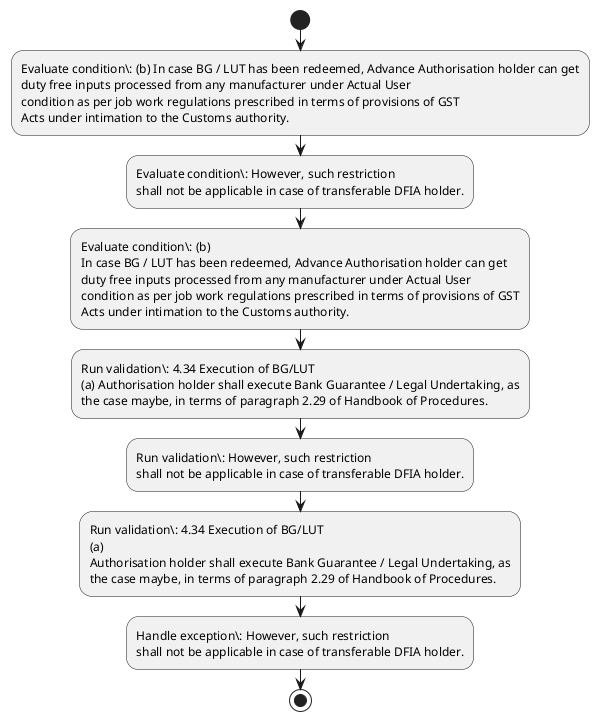

# Chapter 4 / Section 4.34: Execution of BG/LUT

**Chapter Title:** Duty Exemption / Remission Schemes

**Pages:** 17

**Purpose:** 4.34 Execution of BG/LUT
(a) Authorisation holder shall execute Bank Guarantee / Legal Undertaking, as
the case maybe, in terms of paragraph 2.29 of Handbook of Procedures.

**Purpose Thanglish:** Indha Execution of BG/LUT section-la, 4.34 Execution of BG/LUT
(a) Authorisation holder kandippa execute Bank Guarantee / Legal Undertaking, as
the case maybe, in terms of paragraph 2.29 of Handbook of Procedures.

**Summary:** 4.34 Execution of BG/LUT
(a) Authorisation holder shall execute Bank Guarantee / Legal Undertaking, as
the case maybe, in terms of paragraph 2.29 of Handbook of Procedures. (b) In case BG / LUT has been redeemed, Advance Authorisation holder can get
duty free inputs processed from any manufacturer under Actual User
condition as per job work regulations prescribed in terms of provisions of GST
Acts under intimation to the Customs authority. However, such restriction
shall not be applicable in case of transferable DFIA holder.

**Business Meaning:** Execution of BG/LUT governs how DGFT business controls should be applied, validated, and enforced.

**Business Explanation:** Execution of BG/LUT explains the operating rule set that DEKAI should enforce. Key control points include 4.34 Execution of BG/LUT
(a) Authorisation holder shall execute Bank Guarantee / Legal Undertaking, as
the case maybe, in terms of paragraph 2.29 of Handbook of Procedures.

**Business Explanation Thanglish:** Indha Execution of BG/LUT section-la, Execution of BG/LUT explains the operating rule set that DEKAI should enforce. Key control points include 4.34 Execution of BG/LUT
(a) Authorisation holder kandippa execute Bank Guarantee / Legal Undertaking, as
the case maybe, in terms of paragraph 2.29 of Handbook of Procedures.

## Business Logic
- 4.34 Execution of BG/LUT
(a) Authorisation holder shall execute Bank Guarantee / Legal Undertaking, as
the case maybe, in terms of paragraph 2.29 of Handbook of Procedures.
- However, such restriction
shall not be applicable in case of transferable DFIA holder.
- 4.34 Execution of BG/LUT
(a)
Authorisation holder shall execute Bank Guarantee / Legal Undertaking, as
the case maybe, in terms of paragraph 2.29 of Handbook of Procedures.

## Business Rules
- rule_id=CH4-SEC4_34-R001, rule_description=4.34 Execution of BG/LUT
(a) Authorisation holder shall execute Bank Guarantee / Legal Undertaking, as
the case maybe, in terms of paragraph 2.29 of Handbook of Procedures., trigger=Execution of BG/LUT, condition=(b) In case BG / LUT has been redeemed, Advance Authorisation holder can get
duty free inputs processed from any manufacturer under Actual User
condition as per job work regulations prescribed in terms of provisions of GST
Acts under intimation to the Customs authority., validation=4.34 Execution of BG/LUT
(a) Authorisation holder shall execute Bank Guarantee / Legal Undertaking, as
the case maybe, in terms of paragraph 2.29 of Handbook of Procedures., action=Manual review required., exception=However, such restriction
shall not be applicable in case of transferable DFIA holder., output=DEKAI should produce a compliance decision for 4.34 - Execution of BG/LUT.
- rule_id=CH4-SEC4_34-R002, rule_description=However, such restriction
shall not be applicable in case of transferable DFIA holder., trigger=Execution of BG/LUT, condition=However, such restriction
shall not be applicable in case of transferable DFIA holder., validation=However, such restriction
shall not be applicable in case of transferable DFIA holder., action=Manual review required., exception=However, such restriction
shall not be applicable in case of transferable DFIA holder., output=DEKAI should produce a compliance decision for 4.34 - Execution of BG/LUT.
- rule_id=CH4-SEC4_34-R003, rule_description=4.34 Execution of BG/LUT
(a)
Authorisation holder shall execute Bank Guarantee / Legal Undertaking, as
the case maybe, in terms of paragraph 2.29 of Handbook of Procedures., trigger=Execution of BG/LUT, condition=(b)
In case BG / LUT has been redeemed, Advance Authorisation holder can get
duty free inputs processed from any manufacturer under Actual User
condition as per job work regulations prescribed in terms of provisions of GST
Acts under intimation to the Customs authority., validation=4.34 Execution of BG/LUT
(a)
Authorisation holder shall execute Bank Guarantee / Legal Undertaking, as
the case maybe, in terms of paragraph 2.29 of Handbook of Procedures., action=Manual review required., exception=However, such restriction
shall not be applicable in case of transferable DFIA holder., output=DEKAI should produce a compliance decision for 4.34 - Execution of BG/LUT.

## Conditions
- (b) In case BG / LUT has been redeemed, Advance Authorisation holder can get
duty free inputs processed from any manufacturer under Actual User
condition as per job work regulations prescribed in terms of provisions of GST
Acts under intimation to the Customs authority.
- However, such restriction
shall not be applicable in case of transferable DFIA holder.
- (b)
In case BG / LUT has been redeemed, Advance Authorisation holder can get
duty free inputs processed from any manufacturer under Actual User
condition as per job work regulations prescribed in terms of provisions of GST
Acts under intimation to the Customs authority.

## Condition Logic
- id=4.4.34.1, if=(b) In case BG / LUT has been redeemed, Advance Authorisation holder can get
duty free inputs processed from any manufacturer under Actual User
condition as per job work regulations prescribed in terms of provisions of GST
Acts under intimation to the Customs authority., then=Route for review, source=(b) In case BG / LUT has been redeemed, Advance Authorisation holder can get
duty free inputs processed from any manufacturer under Actual User
condition as per job work regulations prescribed in terms of provisions of GST
Acts under intimation to the Customs authority.
- id=4.4.34.2, if=However, such restriction
shall not be applicable in case of transferable DFIA holder., then=Route for review, source=However, such restriction
shall not be applicable in case of transferable DFIA holder.
- id=4.4.34.3, if=(b)
In case BG / LUT has been redeemed, Advance Authorisation holder can get
duty free inputs processed from any manufacturer under Actual User
condition as per job work regulations prescribed in terms of provisions of GST
Acts under intimation to the Customs authority., then=Route for review, source=(b)
In case BG / LUT has been redeemed, Advance Authorisation holder can get
duty free inputs processed from any manufacturer under Actual User
condition as per job work regulations prescribed in terms of provisions of GST
Acts under intimation to the Customs authority.

## Validations
- 4.34 Execution of BG/LUT
(a) Authorisation holder shall execute Bank Guarantee / Legal Undertaking, as
the case maybe, in terms of paragraph 2.29 of Handbook of Procedures.
- However, such restriction
shall not be applicable in case of transferable DFIA holder.
- 4.34 Execution of BG/LUT
(a)
Authorisation holder shall execute Bank Guarantee / Legal Undertaking, as
the case maybe, in terms of paragraph 2.29 of Handbook of Procedures.

## Exceptions
- However, such restriction
shall not be applicable in case of transferable DFIA holder.

## Dependencies
- 2.29
- 2
- 3
- 4

## Authorities
- Customs
- Customs authority
- Acts under intimation to the Customs

## Required Documents
- 4.34 Execution of BG/LUT
(a) Authorisation holder shall execute Bank Guarantee / Legal Undertaking, as
the case maybe, in terms of paragraph 2.29 of Handbook of Procedures.
- 4.34 Execution of BG/LUT
(a)
Authorisation holder shall execute Bank Guarantee / Legal Undertaking, as
the case maybe, in terms of paragraph 2.29 of Handbook of Procedures.

## Timelines
- None identified

## Actions
- None identified

## Workflow
- Evaluate condition: (b) In case BG / LUT has been redeemed, Advance Authorisation holder can get
duty free inputs processed from any manufacturer under Actual User
condition as per job work regulations prescribed in terms of provisions of GST
Acts under intimation to the Customs authority.
- Evaluate condition: However, such restriction
shall not be applicable in case of transferable DFIA holder.
- Evaluate condition: (b)
In case BG / LUT has been redeemed, Advance Authorisation holder can get
duty free inputs processed from any manufacturer under Actual User
condition as per job work regulations prescribed in terms of provisions of GST
Acts under intimation to the Customs authority.
- Run validation: 4.34 Execution of BG/LUT
(a) Authorisation holder shall execute Bank Guarantee / Legal Undertaking, as
the case maybe, in terms of paragraph 2.29 of Handbook of Procedures.
- Run validation: However, such restriction
shall not be applicable in case of transferable DFIA holder.
- Run validation: 4.34 Execution of BG/LUT
(a)
Authorisation holder shall execute Bank Guarantee / Legal Undertaking, as
the case maybe, in terms of paragraph 2.29 of Handbook of Procedures.
- Handle exception: However, such restriction
shall not be applicable in case of transferable DFIA holder.

## Workflow ASCII
```text
Execution of BG/LUT
Evaluate condition: (b) In case BG / LUT has been redeemed, Advance Authorisation holder can get
duty free inputs processed from any manufacturer under Actual User
condition as per job work regulations prescribed in terms of provisions of GST
Acts under intimation to the Customs authority.
   |
   v
Evaluate condition: However, such restriction
shall not be applicable in case of transferable DFIA holder.
   |
   v
Evaluate condition: (b)
In case BG / LUT has been redeemed, Advance Authorisation holder can get
duty free inputs processed from any manufacturer under Actual User
condition as per job work regulations prescribed in terms of provisions of GST
Acts under intimation to the Customs authority.
   |
   v
Run validation: 4.34 Execution of BG/LUT
(a) Authorisation holder shall execute Bank Guarantee / Legal Undertaking, as
the case maybe, in terms of paragraph 2.29 of Handbook of Procedures.
   |
   v
Run validation: However, such restriction
shall not be applicable in case of transferable DFIA holder.
   |
   v
Run validation: 4.34 Execution of BG/LUT
(a)
Authorisation holder shall execute Bank Guarantee / Legal Undertaking, as
the case maybe, in terms of paragraph 2.29 of Handbook of Procedures.
   |
   v
Handle exception: However, such restriction
shall not be applicable in case of transferable DFIA holder.
```

## Decision Tree
- IF exception applies (However, such restriction
shall not be applicable in case of transferable DFIA holder.) THEN route to manual review

## Decision Tree ASCII
```text
Execution of BG/LUT Decision
IF exception applies (However, such restriction
shall not be applicable in case of transferable DFIA holder.) THEN route to manual review
```

## Examples
- User asks to process Execution of BG/LUT; the platform checks conditions, validations, and documents before action.

**Real-world Example:** Example: an importer or exporter invokes Execution of BG/LUT, submits 4.34 Execution of BG/LUT
(a) Authorisation holder shall execute Bank Guarantee / Legal Undertaking, as
the case maybe, in terms of paragraph 2.29 of Handbook of Procedures., 4.34 Execution of BG/LUT
(a)
Authorisation holder shall execute Bank Guarantee / Legal Undertaking, as
the case maybe, in terms of paragraph 2.29 of Handbook of Procedures., and DEKAI uses the extracted rules to follow the execution of bg/lut process.

**Real-world Example Thanglish:** Indha Execution of BG/LUT section-la, Example: an importer or exporter invokes Execution of BG/LUT, submits 4.34 Execution of BG/LUT
(a) Authorisation holder kandippa execute Bank Guarantee / Legal Undertaking, as
the case maybe, in terms of paragraph 2.29 of Handbook of Procedures., 4.34 Execution of BG/LUT
(a)
Authorisation holder kandippa execute Bank Guarantee / Legal Undertaking, as
the case maybe, in terms of paragraph 2.29 of Handbook of Procedures., and DEKAI uses the extracted rules to follow the execution of bg/lut process.

## AI Rules
- IF detected context matches section rule THEN enforce: 4.34 Execution of BG/LUT
(a) Authorisation holder shall execute Bank Guarantee / Legal Undertaking, as
the case maybe, in terms of paragraph 2.29 of Handbook of Procedures.
- IF detected context matches section rule THEN enforce: However, such restriction
shall not be applicable in case of transferable DFIA holder.
- IF detected context matches section rule THEN enforce: 4.34 Execution of BG/LUT
(a)
Authorisation holder shall execute Bank Guarantee / Legal Undertaking, as
the case maybe, in terms of paragraph 2.29 of Handbook of Procedures.

## Database Fields
- name=section_code, type=string, required=True, source=parsed_section_heading
- name=section_title, type=string, required=True, source=parsed_section_heading
- name=the_flag, type=boolean, required=False, source=keyword:the
- name=lut_flag, type=boolean, required=False, source=keyword:LUT
- name=has_flag, type=boolean, required=False, source=keyword:has
- name=can_flag, type=boolean, required=False, source=keyword:can
- name=get_flag, type=boolean, required=False, source=keyword:get
- name=any_flag, type=boolean, required=False, source=keyword:any
- name=per_flag, type=boolean, required=False, source=keyword:per
- name=job_flag, type=boolean, required=False, source=keyword:job
- name=document_1_submitted, type=boolean, required=True, source=4.34 Execution of BG/LUT
(a) Authorisation holder shall execute Bank Guarantee / Legal Undertaking, as
the case maybe, in terms of paragraph 2.29 of Handbook of Procedures.
- name=document_2_submitted, type=boolean, required=True, source=4.34 Execution of BG/LUT
(a)
Authorisation holder shall execute Bank Guarantee / Legal Undertaking, as
the case maybe, in terms of paragraph 2.29 of Handbook of Procedures.

## API Requirements
- method=GET, path=/api/dgft/sections/4.34, purpose=Retrieve knowledge payload for section 4.34, query_params=['include=workflow,decision_tree,validations'], response_fields=['section', 'title', 'summary', 'conditions', 'validations', 'exceptions', 'workflow', 'decision_tree']
- method=POST, path=/api/dgft/Execution-of-BG-LUT/validate, purpose=Validate inputs and documents for Execution of BG/LUT, request_fields=['section_code', 'section_title', 'document_1_submitted', 'document_2_submitted'], response_fields=['status', 'errors', 'warnings', 'next_actions']

## UI Screens
- screen_id=Execution_of_BG_LUT_overview, name=Execution of BG/LUT Overview, purpose=Show section summary, authority, timeline, and eligibility cues., widgets=['summary_card', 'conditions_table', 'authority_badges', 'timeline_panel']
- screen_id=Execution_of_BG_LUT_submission, name=Execution of BG/LUT Submission, purpose=Capture applicant data and supporting documents., widgets=['dynamic_form', 'document_uploader', 'validation_panel', 'next_action_footer'], fields=['section_code', 'section_title', 'the_flag', 'lut_flag', 'has_flag', 'can_flag', 'get_flag', 'any_flag']
- screen_id=Execution_of_BG_LUT_exceptions, name=Execution of BG/LUT Exception Review, purpose=Explain exception handling and manual review triggers., widgets=['exception_banner', 'decision_tree', 'case_notes']

## Error Messages
- Validation failed because the section requirements were not fully met.

## FAQ
- question_en=What is the purpose of section 4.34?, answer_en=Execution of BG/LUT explains the operating rule set that DEKAI should enforce. Key control points include 4.34 Execution of BG/LUT
(a) Authorisation holder shall execute Bank Guarantee / Legal Undertaking, as
the case maybe, in terms of paragraph 2.29 of Handbook of Procedures., question_thanglish=Indha Execution of BG/LUT section-la, What is the purpose of section 4.34?, answer_thanglish=Indha Execution of BG/LUT section-la, Execution of BG/LUT explains the operating rule set that DEKAI should enforce. Key control points include 4.34 Execution of BG/LUT
(a) Authorisation holder kandippa execute Bank Guarantee / Legal Undertaking, as
the case maybe, in terms of paragraph 2.29 of Handbook of Procedures.
- question_en=What documents are required under Execution of BG/LUT?, answer_en=4.34 Execution of BG/LUT
(a) Authorisation holder shall execute Bank Guarantee / Legal Undertaking, as
the case maybe, in terms of paragraph 2.29 of Handbook of Procedures., 4.34 Execution of BG/LUT
(a)
Authorisation holder shall execute Bank Guarantee / Legal Undertaking, as
the case maybe, in terms of paragraph 2.29 of Handbook of Procedures., question_thanglish=Indha Execution of BG/LUT section-la, What documents are required under Execution of BG/LUT?, answer_thanglish=Indha Execution of BG/LUT section-la, 4.34 Execution of BG/LUT
(a) Authorisation holder kandippa execute Bank Guarantee / Legal Undertaking, as
the case maybe, in terms of paragraph 2.29 of Handbook of Procedures., 4.34 Execution of BG/LUT
(a)
Authorisation holder kandippa execute Bank Guarantee / Legal Undertaking, as
the case maybe, in terms of paragraph 2.29 of Handbook of Procedures.
- question_en=Which authority handles Execution of BG/LUT?, answer_en=Customs, Customs authority, Acts under intimation to the Customs, question_thanglish=Indha Execution of BG/LUT section-la, Which authority handles Execution of BG/LUT?, answer_thanglish=Indha Execution of BG/LUT section-la, Customs, Customs authority, Acts under intimation to the Customs

## Questions Users May Ask
- What does Execution of BG/LUT require?
- Which documents are needed for Execution of BG/LUT?
- How does DEKAI validate Execution of BG/LUT requests?

## Expected AI Answers
- Execution of BG/LUT requires the platform to interpret the section text, apply the extracted business rules, and present the correct next action.
- Required documents are inferred from the section text: 4.34 Execution of BG/LUT
(a) Authorisation holder shall execute Bank Guarantee / Legal Undertaking, as
the case maybe, in terms of paragraph 2.29 of Handbook of Procedures., 4.34 Execution of BG/LUT
(a)
Authorisation holder shall execute Bank Guarantee / Legal Undertaking, as
the case maybe, in terms of paragraph 2.29 of Handbook of Procedures.
- DEKAI validates Execution of BG/LUT by checking conditions, required documents, authority references, and exception clauses before recommending an outcome.

## AI Q&A Examples
- question_en=User asks: How do I comply with Execution of BG/LUT?, answer_en=AI answers: DEKAI should evaluate section 4.34, apply the extracted rules, and guide the user through Evaluate condition: (b) In case BG / LUT has been redeemed, Advance Authorisation holder can get
duty free inputs processed from any manufacturer under Actual User
condition as per job work regulations prescribed in terms of provisions of GST
Acts under intimation to the Customs authority.., question_thanglish=Indha Execution of BG/LUT section-la, User asks: How do I comply with Execution of BG/LUT?, answer_thanglish=Indha Execution of BG/LUT section-la, AI answers: DEKAI should evaluate section 4.34, apply the extracted rules, and guide the user through Evaluate condition: (b) In case BG / LUT has been redeemed, Advance Authorisation holder can get
duty free inputs processed from any manufacturer under Actual User
condition as per job work regulations prescribed in terms of provisions of GST
Acts under intimation to the Customs authority..
- question_en=User asks: Which validations apply to Execution of BG/LUT?, answer_en=AI answers: Applicable validations are 4.34 Execution of BG/LUT
(a) Authorisation holder shall execute Bank Guarantee / Legal Undertaking, as
the case maybe, in terms of paragraph 2.29 of Handbook of Procedures., However, such restriction
shall not be applicable in case of transferable DFIA holder., 4.34 Execution of BG/LUT
(a)
Authorisation holder shall execute Bank Guarantee / Legal Undertaking, as
the case maybe, in terms of paragraph 2.29 of Handbook of Procedures., question_thanglish=Indha Execution of BG/LUT section-la, User asks: Which validations apply to Execution of BG/LUT?, answer_thanglish=Indha Execution of BG/LUT section-la, AI answers: Applicable validations are 4.34 Execution of BG/LUT
(a) Authorisation holder kandippa execute Bank Guarantee / Legal Undertaking, as
the case maybe, in terms of paragraph 2.29 of Handbook of Procedures., However, such restriction
kandippa not be applicable in case of transferable DFIA holder., 4.34 Execution of BG/LUT
(a)
Authorisation holder kandippa execute Bank Guarantee / Legal Undertaking, as
the case maybe, in terms of paragraph 2.29 of Handbook of Procedures.

## DEKAI AI Implementation Notes
- Capture chapter 4, section 4.34, title, and page references as immutable knowledge metadata.
- Bind validations for Execution of BG/LUT into a rule engine keyed by the rule IDs extracted for this section.
- Expose document upload controls for: 4.34 Execution of BG/LUT
(a) Authorisation holder shall execute Bank Guarantee / Legal Undertaking, as
the case maybe, in terms of paragraph 2.29 of Handbook of Procedures., 4.34 Execution of BG/LUT
(a)
Authorisation holder shall execute Bank Guarantee / Legal Undertaking, as
the case maybe, in terms of paragraph 2.29 of Handbook of Procedures..
- Route escalations or approvals to: Customs, Customs authority, Acts under intimation to the Customs.
- Trigger manual review when exception clauses are detected.
- Show contextual links to related sections: 2, 3, 4.

## DEKAI AI Implementation Notes Thanglish
- Indha Execution of BG/LUT section-la, Capture chapter 4, section 4.34, title, and page references as immutable knowledge metadata.
- Indha Execution of BG/LUT section-la, Bind validations for Execution of BG/LUT into a rule engine keyed by the rule IDs extracted for this section.
- Indha Execution of BG/LUT section-la, Expose document upload controls for: 4.34 Execution of BG/LUT
(a) Authorisation holder kandippa execute Bank Guarantee / Legal Undertaking, as
the case maybe, in terms of paragraph 2.29 of Handbook of Procedures., 4.34 Execution of BG/LUT
(a)
Authorisation holder kandippa execute Bank Guarantee / Legal Undertaking, as
the case maybe, in terms of paragraph 2.29 of Handbook of Procedures..
- Indha Execution of BG/LUT section-la, Route escalations or approvals to: Customs, Customs authority, Acts under intimation to the Customs.
- Indha Execution of BG/LUT section-la, Trigger manual review when exception clauses are detected.
- Indha Execution of BG/LUT section-la, Show contextual links to related sections: 2, 3, 4.

## AI Metadata
- Keywords: the, LUT, has, can, get, any, per, job, GST, not, Bank, case, been, duty, free, from, User, work, Acts, such
- Search Keywords: the, LUT, has, can, get, any, per, job, GST, not, Bank, case, been, duty, free, from, User, work, Acts, such
- Intent: Provide knowledge guidance for Execution of BG/LUT.
- Tags: 4.34, Execution of BG/LUT, business-rule, document-driven, dgft
- Related Sections: 2, 3, 4
- Related Chapters: 
- Related Rules: 4.34 Execution of BG/LUT
(a) Authorisation holder shall execute Bank Guarantee / Legal Undertaking, as
the case maybe, in terms of paragraph 2.29 of Handbook of Procedures., However, such restriction
shall not be applicable in case of transferable DFIA holder., 4.34 Execution of BG/LUT
(a)
Authorisation holder shall execute Bank Guarantee / Legal Undertaking, as
the case maybe, in terms of paragraph 2.29 of Handbook of Procedures.

## Mermaid

```mermaid
flowchart TD
    S1["Evaluate condition: (b) In case BG / LUT has been redeemed, Advance Authorisation holder can get
duty free inputs processed from any manufacturer under Actual User
condition as per job work regulations prescribed in terms of provisions of GST
Acts under intimation to the Customs authority."]
    S2["Evaluate condition: However, such restriction
shall not be applicable in case of transferable DFIA holder."]
    S1 --> S2
    S3["Evaluate condition: (b)
In case BG / LUT has been redeemed, Advance Authorisation holder can get
duty free inputs processed from any manufacturer under Actual User
condition as per job work regulations prescribed in terms of provisions of GST
Acts under intimation to the Customs authority."]
    S2 --> S3
    S4["Run validation: 4.34 Execution of BG/LUT
(a) Authorisation holder shall execute Bank Guarantee / Legal Undertaking, as
the case maybe, in terms of paragraph 2.29 of Handbook of Procedures."]
    S3 --> S4
    S5["Run validation: However, such restriction
shall not be applicable in case of transferable DFIA holder."]
    S4 --> S5
    S6["Run validation: 4.34 Execution of BG/LUT
(a)
Authorisation holder shall execute Bank Guarantee / Legal Undertaking, as
the case maybe, in terms of paragraph 2.29 of Handbook of Procedures."]
    S5 --> S6
    S7["Handle exception: However, such restriction
shall not be applicable in case of transferable DFIA holder."]
    S6 --> S7
```


## PlantUML

