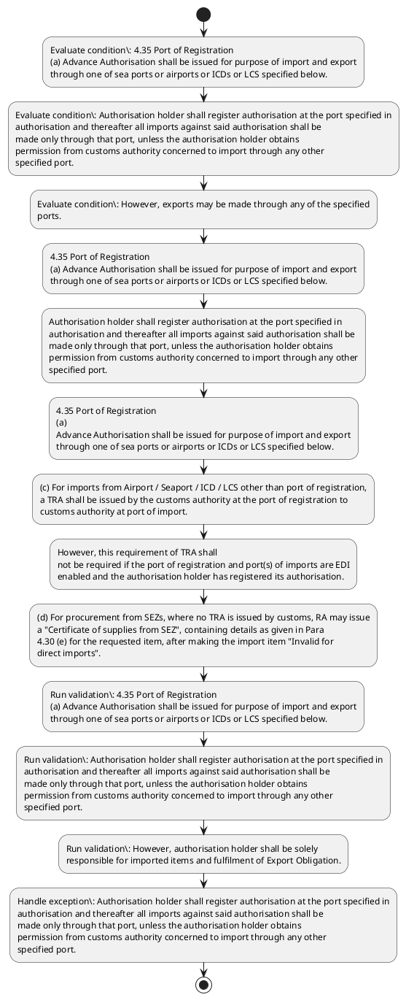

# Chapter 4 / Section 4.35: Port of Registration

**Chapter Title:** Duty Exemption / Remission Schemes

**Pages:** 17, 18, 19

**Purpose:** 4.35 Port of Registration
(a) Advance Authorisation shall be issued for purpose of import and export
through one of sea ports or airports or ICDs or LCS specified below.

**Purpose Thanglish:** Indha Port of Registration section-la, 4.35 Port of Registration
(a) Advance Authorisation kandippa be issued for purpose of import and export
through one of sea ports or airports or ICDs or LCS specified below.

**Summary:** 4.35 Port of Registration
(a) Advance Authorisation shall be issued for purpose of import and export
through one of sea ports or airports or ICDs or LCS specified below. Authorisation holder shall register authorisation at the port specified in
authorisation and thereafter all imports against said authorisation shall be
made only through that port, unless the authorisation holder obtains
permission from customs authority concerned to import through any other
specified port. However, exports may be made through any of the specified
ports.

**Business Meaning:** Port of Registration governs how DGFT business controls should be applied, validated, and enforced.

**Business Explanation:** Port of Registration explains the operating rule set that DEKAI should enforce. Key control points include 4.35 Port of Registration
(a) Advance Authorisation shall be issued for purpose of import and export
through one of sea ports or airports or ICDs or LCS specified below. The section also drives actions such as 4.35 Port of Registration
(a) Advance Authorisation shall be issued for purpose of import and export
through one of sea ports or airports or ICDs or LCS specified below..

**Business Explanation Thanglish:** Indha Port of Registration section-la, Port of Registration explains the operating rule set that DEKAI should enforce. Key control points include 4.35 Port of Registration
(a) Advance Authorisation kandippa be issued for purpose of import and export
through one of sea ports or airports or ICDs or LCS specified below. The section also drives actions such as 4.35 Port of Registration
(a) Advance Authorisation kandippa be issued for purpose of import and export
through one of sea ports or airports or ICDs or LCS specified below..

## Business Logic
- 4.35 Port of Registration
(a) Advance Authorisation shall be issued for purpose of import and export
through one of sea ports or airports or ICDs or LCS specified below.
- Authorisation holder shall register authorisation at the port specified in
authorisation and thereafter all imports against said authorisation shall be
made only through that port, unless the authorisation holder obtains
permission from customs authority concerned to import through any other
specified port.
- However, authorisation holder shall be solely
responsible for imported items and fulfilment of Export Obligation.
- 4.35 Port of Registration
(a)
Advance Authorisation shall be issued for purpose of import and export
through one of sea ports or airports or ICDs or LCS specified below.
- (c) For imports from Airport / Seaport / ICD / LCS other than port of registration,
a TRA shall be issued by the customs authority at the port of registration to
customs authority at port of import.
- However, this requirement of TRA shall
not be required if the port of registration and port(s) of imports are EDI
enabled and the authorisation holder has registered its authorisation.
- The "Certificate of supplies from SEZ" shall be marked in
quadruplicate with a copy each to the authorisation holder, SEZ supplier unit,
designated officer at SEZ, and the relevant port customs authorities.
- The
above certificate shall be issued as an online amendment to the authorisation
and has to be transmitted after verifying usage of issued authorisation in case
it is already registered with customs at the time of application for the
certificate.
- (c)
For imports from Airport / Seaport / ICD / LCS other than port of registration,
a TRA shall be issued by the customs authority at the port of registration to
customs authority at port of import.

## Business Rules
- rule_id=CH4-SEC4_35-R001, rule_description=4.35 Port of Registration
(a) Advance Authorisation shall be issued for purpose of import and export
through one of sea ports or airports or ICDs or LCS specified below., trigger=Port of Registration, condition=4.35 Port of Registration
(a) Advance Authorisation shall be issued for purpose of import and export
through one of sea ports or airports or ICDs or LCS specified below., validation=4.35 Port of Registration
(a) Advance Authorisation shall be issued for purpose of import and export
through one of sea ports or airports or ICDs or LCS specified below., action=4.35 Port of Registration
(a) Advance Authorisation shall be issued for purpose of import and export
through one of sea ports or airports or ICDs or LCS specified below., exception=Authorisation holder shall register authorisation at the port specified in
authorisation and thereafter all imports against said authorisation shall be
made only through that port, unless the authorisation holder obtains
permission from customs authority concerned to import through any other
specified port., output=DEKAI should produce a compliance decision for 4.35 - Port of Registration.
- rule_id=CH4-SEC4_35-R002, rule_description=Authorisation holder shall register authorisation at the port specified in
authorisation and thereafter all imports against said authorisation shall be
made only through that port, unless the authorisation holder obtains
permission from customs authority concerned to import through any other
specified port., trigger=Port of Registration, condition=Authorisation holder shall register authorisation at the port specified in
authorisation and thereafter all imports against said authorisation shall be
made only through that port, unless the authorisation holder obtains
permission from customs authority concerned to import through any other
specified port., validation=Authorisation holder shall register authorisation at the port specified in
authorisation and thereafter all imports against said authorisation shall be
made only through that port, unless the authorisation holder obtains
permission from customs authority concerned to import through any other
specified port., action=Authorisation holder shall register authorisation at the port specified in
authorisation and thereafter all imports against said authorisation shall be
made only through that port, unless the authorisation holder obtains
permission from customs authority concerned to import through any other
specified port., exception=However, exports may be made through any of the specified
ports., output=DEKAI should produce a compliance decision for 4.35 - Port of Registration.
- rule_id=CH4-SEC4_35-R003, rule_description=However, authorisation holder shall be solely
responsible for imported items and fulfilment of Export Obligation., trigger=Port of Registration, condition=However, exports may be made through any of the specified
ports., validation=However, authorisation holder shall be solely
responsible for imported items and fulfilment of Export Obligation., action=4.35 Port of Registration
(a)
Advance Authorisation shall be issued for purpose of import and export
through one of sea ports or airports or ICDs or LCS specified below., exception=However, authorisation holder shall be solely
responsible for imported items and fulfilment of Export Obligation., output=DEKAI should produce a compliance decision for 4.35 - Port of Registration.
- rule_id=CH4-SEC4_35-R004, rule_description=4.35 Port of Registration
(a)
Advance Authorisation shall be issued for purpose of import and export
through one of sea ports or airports or ICDs or LCS specified below., trigger=Port of Registration, condition=4.35 Port of Registration
(a)
Advance Authorisation shall be issued for purpose of import and export
through one of sea ports or airports or ICDs or LCS specified below., validation=4.35 Port of Registration
(a)
Advance Authorisation shall be issued for purpose of import and export
through one of sea ports or airports or ICDs or LCS specified below., action=(c) For imports from Airport / Seaport / ICD / LCS other than port of registration,
a TRA shall be issued by the customs authority at the port of registration to
customs authority at port of import., exception=However, this requirement of TRA shall
not be required if the port of registration and port(s) of imports are EDI
enabled and the authorisation holder has registered its authorisation., output=DEKAI should produce a compliance decision for 4.35 - Port of Registration.
- rule_id=CH4-SEC4_35-R005, rule_description=(c) For imports from Airport / Seaport / ICD / LCS other than port of registration,
a TRA shall be issued by the customs authority at the port of registration to
customs authority at port of import., trigger=Port of Registration, condition=SEZ:
As notified by Central Government any SEZ can be a specified port for import
and export., validation=(c) For imports from Airport / Seaport / ICD / LCS other than port of registration,
a TRA shall be issued by the customs authority at the port of registration to
customs authority at port of import., action=However, this requirement of TRA shall
not be required if the port of registration and port(s) of imports are EDI
enabled and the authorisation holder has registered its authorisation., exception=However, this requirement of TRA shall
not be required if the port of registration and port(s) of imports are EDI
enabled and the authorisation holder has registered its authorisation., output=DEKAI should produce a compliance decision for 4.35 - Port of Registration.
- rule_id=CH4-SEC4_35-R006, rule_description=However, this requirement of TRA shall
not be required if the port of registration and port(s) of imports are EDI
enabled and the authorisation holder has registered its authorisation., trigger=Port of Registration, condition=However, this requirement of TRA shall
not be required if the port of registration and port(s) of imports are EDI
enabled and the authorisation holder has registered its authorisation., validation=However, this requirement of TRA shall
not be required if the port of registration and port(s) of imports are EDI
enabled and the authorisation holder has registered its authorisation., action=(d) For procurement from SEZs, where no TRA is issued by customs, RA may issue
a "Certificate of supplies from SEZ", containing details as given in Para
4.30 (e) for the requested item, after making the import item "Invalid for
direct imports"., exception=However, this requirement of TRA shall
not be required if the port of registration and port(s) of imports are EDI
enabled and the authorisation holder has registered its authorisation., output=DEKAI should produce a compliance decision for 4.35 - Port of Registration.
- rule_id=CH4-SEC4_35-R007, rule_description=The "Certificate of supplies from SEZ" shall be marked in
quadruplicate with a copy each to the authorisation holder, SEZ supplier unit,
designated officer at SEZ, and the relevant port customs authorities., trigger=Port of Registration, condition=(d) For procurement from SEZs, where no TRA is issued by customs, RA may issue
a "Certificate of supplies from SEZ", containing details as given in Para
4.30 (e) for the requested item, after making the import item "Invalid for
direct imports"., validation=(d) For procurement from SEZs, where no TRA is issued by customs, RA may issue
a "Certificate of supplies from SEZ", containing details as given in Para
4.30 (e) for the requested item, after making the import item "Invalid for
direct imports"., action=The
above certificate shall be issued as an online amendment to the authorisation
and has to be transmitted after verifying usage of issued authorisation in case
it is already registered with customs at the time of application for the
certificate., exception=However, this requirement of TRA shall
not be required if the port of registration and port(s) of imports are EDI
enabled and the authorisation holder has registered its authorisation., output=DEKAI should produce a compliance decision for 4.35 - Port of Registration.
- rule_id=CH4-SEC4_35-R008, rule_description=The
above certificate shall be issued as an online amendment to the authorisation
and has to be transmitted after verifying usage of issued authorisation in case
it is already registered with customs at the time of application for the
certificate., trigger=Port of Registration, condition=The "Certificate of supplies from SEZ" shall be marked in
quadruplicate with a copy each to the authorisation holder, SEZ supplier unit,
designated officer at SEZ, and the relevant port customs authorities., validation=The "Certificate of supplies from SEZ" shall be marked in
quadruplicate with a copy each to the authorisation holder, SEZ supplier unit,
designated officer at SEZ, and the relevant port customs authorities., action=(c)
For imports from Airport / Seaport / ICD / LCS other than port of registration,
a TRA shall be issued by the customs authority at the port of registration to
customs authority at port of import., exception=However, this requirement of TRA shall
not be required if the port of registration and port(s) of imports are EDI
enabled and the authorisation holder has registered its authorisation., output=DEKAI should produce a compliance decision for 4.35 - Port of Registration.
- rule_id=CH4-SEC4_35-R009, rule_description=(c)
For imports from Airport / Seaport / ICD / LCS other than port of registration,
a TRA shall be issued by the customs authority at the port of registration to
customs authority at port of import., trigger=Port of Registration, condition=The
above certificate shall be issued as an online amendment to the authorisation
and has to be transmitted after verifying usage of issued authorisation in case
it is already registered with customs at the time of application for the
certificate., validation=The
above certificate shall be issued as an online amendment to the authorisation
and has to be transmitted after verifying usage of issued authorisation in case
it is already registered with customs at the time of application for the
certificate., action=(d)
For procurement from SEZs, where no TRA is issued by customs, RA may issue
a "Certificate of supplies from SEZ", containing details as given in Para
4.30 (e) for the requested item, after making the import item "Invalid for
direct imports"., exception=However, this requirement of TRA shall
not be required if the port of registration and port(s) of imports are EDI
enabled and the authorisation holder has registered its authorisation., output=DEKAI should produce a compliance decision for 4.35 - Port of Registration.

## Conditions
- 4.35 Port of Registration
(a) Advance Authorisation shall be issued for purpose of import and export
through one of sea ports or airports or ICDs or LCS specified below.
- Authorisation holder shall register authorisation at the port specified in
authorisation and thereafter all imports against said authorisation shall be
made only through that port, unless the authorisation holder obtains
permission from customs authority concerned to import through any other
specified port.
- However, exports may be made through any of the specified
ports.
- 4.35 Port of Registration
(a)
Advance Authorisation shall be issued for purpose of import and export
through one of sea ports or airports or ICDs or LCS specified below.
- SEZ:
As notified by Central Government any SEZ can be a specified port for import
and export.
- However, this requirement of TRA shall
not be required if the port of registration and port(s) of imports are EDI
enabled and the authorisation holder has registered its authorisation.
- (d) For procurement from SEZs, where no TRA is issued by customs, RA may issue
a "Certificate of supplies from SEZ", containing details as given in Para
4.30 (e) for the requested item, after making the import item "Invalid for
direct imports".
- The "Certificate of supplies from SEZ" shall be marked in
quadruplicate with a copy each to the authorisation holder, SEZ supplier unit,
designated officer at SEZ, and the relevant port customs authorities.
- The
above certificate shall be issued as an online amendment to the authorisation
and has to be transmitted after verifying usage of issued authorisation in case
it is already registered with customs at the time of application for the
certificate.
- The application is to be made to the concerned RA from where
pg.
- (d)
For procurement from SEZs, where no TRA is issued by customs, RA may issue
a "Certificate of supplies from SEZ", containing details as given in Para
4.30 (e) for the requested item, after making the import item "Invalid for
direct imports".
- The application is to be made to the concerned RA from where
authorisation is issued in the manner as prescribed under Para 4.30(c) and
Para 4.34 of this Handbook.

## Condition Logic
- id=4.4.35.1, if=4.35 Port of Registration
(a) Advance Authorisation shall be issued for purpose of import and export
through one of sea ports or airports or ICDs or LCS specified below., then=4.35 Port of Registration
(a) Advance Authorisation shall be issued for purpose of import and export
through one of sea ports or airports or ICDs or LCS specified below., source=4.35 Port of Registration
(a) Advance Authorisation shall be issued for purpose of import and export
through one of sea ports or airports or ICDs or LCS specified below.
- id=4.4.35.2, if=Authorisation holder shall register authorisation at the port specified in
authorisation and thereafter all imports against said authorisation shall be
made only through that port, unless the authorisation holder obtains
permission from customs authority concerned to import through any other
specified port., then=4.35 Port of Registration
(a) Advance Authorisation shall be issued for purpose of import and export
through one of sea ports or airports or ICDs or LCS specified below., source=Authorisation holder shall register authorisation at the port specified in
authorisation and thereafter all imports against said authorisation shall be
made only through that port, unless the authorisation holder obtains
permission from customs authority concerned to import through any other
specified port.
- id=4.4.35.3, if=However, exports may be made through any of the specified
ports., then=4.35 Port of Registration
(a) Advance Authorisation shall be issued for purpose of import and export
through one of sea ports or airports or ICDs or LCS specified below., source=However, exports may be made through any of the specified
ports.
- id=4.4.35.4, if=4.35 Port of Registration
(a)
Advance Authorisation shall be issued for purpose of import and export
through one of sea ports or airports or ICDs or LCS specified below., then=4.35 Port of Registration
(a) Advance Authorisation shall be issued for purpose of import and export
through one of sea ports or airports or ICDs or LCS specified below., source=4.35 Port of Registration
(a)
Advance Authorisation shall be issued for purpose of import and export
through one of sea ports or airports or ICDs or LCS specified below.
- id=4.4.35.5, if=SEZ:
As notified by Central Government any SEZ can be a specified port for import
and export., then=4.35 Port of Registration
(a) Advance Authorisation shall be issued for purpose of import and export
through one of sea ports or airports or ICDs or LCS specified below., source=SEZ:
As notified by Central Government any SEZ can be a specified port for import
and export.
- id=4.4.35.6, if=However, this requirement of TRA shall
not be required if the port of registration and port(s) of imports are EDI
enabled and the authorisation holder has registered its authorisation., then=4.35 Port of Registration
(a) Advance Authorisation shall be issued for purpose of import and export
through one of sea ports or airports or ICDs or LCS specified below., source=However, this requirement of TRA shall
not be required if the port of registration and port(s) of imports are EDI
enabled and the authorisation holder has registered its authorisation.
- id=4.4.35.7, if=(d) For procurement from SEZs, where no TRA is issued by customs, RA may issue
a "Certificate of supplies from SEZ", containing details as given in Para
4.30 (e) for the requested item, after making the import item "Invalid for
direct imports"., then=4.35 Port of Registration
(a) Advance Authorisation shall be issued for purpose of import and export
through one of sea ports or airports or ICDs or LCS specified below., source=(d) For procurement from SEZs, where no TRA is issued by customs, RA may issue
a "Certificate of supplies from SEZ", containing details as given in Para
4.30 (e) for the requested item, after making the import item "Invalid for
direct imports".
- id=4.4.35.8, if=The "Certificate of supplies from SEZ" shall be marked in
quadruplicate with a copy each to the authorisation holder, SEZ supplier unit,
designated officer at SEZ, and the relevant port customs authorities., then=4.35 Port of Registration
(a) Advance Authorisation shall be issued for purpose of import and export
through one of sea ports or airports or ICDs or LCS specified below., source=The "Certificate of supplies from SEZ" shall be marked in
quadruplicate with a copy each to the authorisation holder, SEZ supplier unit,
designated officer at SEZ, and the relevant port customs authorities.
- id=4.4.35.9, if=The
above certificate shall be issued as an online amendment to the authorisation
and has to be transmitted after verifying usage of issued authorisation in case
it is already registered with customs at the time of application for the
certificate., then=4.35 Port of Registration
(a) Advance Authorisation shall be issued for purpose of import and export
through one of sea ports or airports or ICDs or LCS specified below., source=The
above certificate shall be issued as an online amendment to the authorisation
and has to be transmitted after verifying usage of issued authorisation in case
it is already registered with customs at the time of application for the
certificate.
- id=4.4.35.10, if=The application is to be made to the concerned RA from where
pg., then=4.35 Port of Registration
(a) Advance Authorisation shall be issued for purpose of import and export
through one of sea ports or airports or ICDs or LCS specified below., source=The application is to be made to the concerned RA from where
pg.
- id=4.4.35.11, if=(d)
For procurement from SEZs, where no TRA is issued by customs, RA may issue
a "Certificate of supplies from SEZ", containing details as given in Para
4.30 (e) for the requested item, after making the import item "Invalid for
direct imports"., then=4.35 Port of Registration
(a) Advance Authorisation shall be issued for purpose of import and export
through one of sea ports or airports or ICDs or LCS specified below., source=(d)
For procurement from SEZs, where no TRA is issued by customs, RA may issue
a "Certificate of supplies from SEZ", containing details as given in Para
4.30 (e) for the requested item, after making the import item "Invalid for
direct imports".
- id=4.4.35.12, if=The application is to be made to the concerned RA from where
authorisation is issued in the manner as prescribed under Para 4.30(c) and
Para 4.34 of this Handbook., then=4.35 Port of Registration
(a) Advance Authorisation shall be issued for purpose of import and export
through one of sea ports or airports or ICDs or LCS specified below., source=The application is to be made to the concerned RA from where
authorisation is issued in the manner as prescribed under Para 4.30(c) and
Para 4.34 of this Handbook.

## Validations
- 4.35 Port of Registration
(a) Advance Authorisation shall be issued for purpose of import and export
through one of sea ports or airports or ICDs or LCS specified below.
- Authorisation holder shall register authorisation at the port specified in
authorisation and thereafter all imports against said authorisation shall be
made only through that port, unless the authorisation holder obtains
permission from customs authority concerned to import through any other
specified port.
- However, authorisation holder shall be solely
responsible for imported items and fulfilment of Export Obligation.
- 4.35 Port of Registration
(a)
Advance Authorisation shall be issued for purpose of import and export
through one of sea ports or airports or ICDs or LCS specified below.
- (c) For imports from Airport / Seaport / ICD / LCS other than port of registration,
a TRA shall be issued by the customs authority at the port of registration to
customs authority at port of import.
- However, this requirement of TRA shall
not be required if the port of registration and port(s) of imports are EDI
enabled and the authorisation holder has registered its authorisation.
- (d) For procurement from SEZs, where no TRA is issued by customs, RA may issue
a "Certificate of supplies from SEZ", containing details as given in Para
4.30 (e) for the requested item, after making the import item "Invalid for
direct imports".
- The "Certificate of supplies from SEZ" shall be marked in
quadruplicate with a copy each to the authorisation holder, SEZ supplier unit,
designated officer at SEZ, and the relevant port customs authorities.
- The
above certificate shall be issued as an online amendment to the authorisation
and has to be transmitted after verifying usage of issued authorisation in case
it is already registered with customs at the time of application for the
certificate.
- (c)
For imports from Airport / Seaport / ICD / LCS other than port of registration,
a TRA shall be issued by the customs authority at the port of registration to
customs authority at port of import.
- (d)
For procurement from SEZs, where no TRA is issued by customs, RA may issue
a "Certificate of supplies from SEZ", containing details as given in Para
4.30 (e) for the requested item, after making the import item "Invalid for
direct imports".

## Exceptions
- Authorisation holder shall register authorisation at the port specified in
authorisation and thereafter all imports against said authorisation shall be
made only through that port, unless the authorisation holder obtains
permission from customs authority concerned to import through any other
specified port.
- However, exports may be made through any of the specified
ports.
- However, authorisation holder shall be solely
responsible for imported items and fulfilment of Export Obligation.
- However, this requirement of TRA shall
not be required if the port of registration and port(s) of imports are EDI
enabled and the authorisation holder has registered its authorisation.

## Dependencies
- 4.30
- 4.34
- 2
- 3
- 4
- 5

## Authorities
- customs
- customs authority
- Regional Authority
- Central Government
- As notified by Central Government
- Commissioner of Customs
- RA
- The application is to be made to the concerned RA

## Required Documents
- (d) For procurement from SEZs, where no TRA is issued by customs, RA may issue
a "Certificate of supplies from SEZ", containing details as given in Para
4.30 (e) for the requested item, after making the import item "Invalid for
direct imports".
- The "Certificate of supplies from SEZ" shall be marked in
quadruplicate with a copy each to the authorisation holder, SEZ supplier unit,
designated officer at SEZ, and the relevant port customs authorities.
- The
above certificate shall be issued as an online amendment to the authorisation
and has to be transmitted after verifying usage of issued authorisation in case
it is already registered with customs at the time of application for the
certificate.
- The application is to be made to the concerned RA from where
pg.
- (d)
For procurement from SEZs, where no TRA is issued by customs, RA may issue
a "Certificate of supplies from SEZ", containing details as given in Para
4.30 (e) for the requested item, after making the import item "Invalid for
direct imports".
- The application is to be made to the concerned RA from where
authorisation is issued in the manner as prescribed under Para 4.30(c) and
Para 4.34 of this Handbook.

## Timelines
- Authorisation holder shall register authorisation at the port specified in
authorisation and thereafter all imports against said authorisation shall be
made only through that port, unless the authorisation holder obtains
permission from customs authority concerned to import through any other
specified port.
- (d) For procurement from SEZs, where no TRA is issued by customs, RA may issue
a "Certificate of supplies from SEZ", containing details as given in Para
4.30 (e) for the requested item, after making the import item "Invalid for
direct imports".
- The
above certificate shall be issued as an online amendment to the authorisation
and has to be transmitted after verifying usage of issued authorisation in case
it is already registered with customs at the time of application for the
certificate.
- (d)
For procurement from SEZs, where no TRA is issued by customs, RA may issue
a "Certificate of supplies from SEZ", containing details as given in Para
4.30 (e) for the requested item, after making the import item "Invalid for
direct imports".

## Actions
- 4.35 Port of Registration
(a) Advance Authorisation shall be issued for purpose of import and export
through one of sea ports or airports or ICDs or LCS specified below.
- Authorisation holder shall register authorisation at the port specified in
authorisation and thereafter all imports against said authorisation shall be
made only through that port, unless the authorisation holder obtains
permission from customs authority concerned to import through any other
specified port.
- 4.35 Port of Registration
(a)
Advance Authorisation shall be issued for purpose of import and export
through one of sea ports or airports or ICDs or LCS specified below.
- (c) For imports from Airport / Seaport / ICD / LCS other than port of registration,
a TRA shall be issued by the customs authority at the port of registration to
customs authority at port of import.
- However, this requirement of TRA shall
not be required if the port of registration and port(s) of imports are EDI
enabled and the authorisation holder has registered its authorisation.
- (d) For procurement from SEZs, where no TRA is issued by customs, RA may issue
a "Certificate of supplies from SEZ", containing details as given in Para
4.30 (e) for the requested item, after making the import item "Invalid for
direct imports".
- The
above certificate shall be issued as an online amendment to the authorisation
and has to be transmitted after verifying usage of issued authorisation in case
it is already registered with customs at the time of application for the
certificate.
- (c)
For imports from Airport / Seaport / ICD / LCS other than port of registration,
a TRA shall be issued by the customs authority at the port of registration to
customs authority at port of import.
- (d)
For procurement from SEZs, where no TRA is issued by customs, RA may issue
a "Certificate of supplies from SEZ", containing details as given in Para
4.30 (e) for the requested item, after making the import item "Invalid for
direct imports".
- The application is to be made to the concerned RA from where
authorisation is issued in the manner as prescribed under Para 4.30(c) and
Para 4.34 of this Handbook.

## Workflow
- Evaluate condition: 4.35 Port of Registration
(a) Advance Authorisation shall be issued for purpose of import and export
through one of sea ports or airports or ICDs or LCS specified below.
- Evaluate condition: Authorisation holder shall register authorisation at the port specified in
authorisation and thereafter all imports against said authorisation shall be
made only through that port, unless the authorisation holder obtains
permission from customs authority concerned to import through any other
specified port.
- Evaluate condition: However, exports may be made through any of the specified
ports.
- 4.35 Port of Registration
(a) Advance Authorisation shall be issued for purpose of import and export
through one of sea ports or airports or ICDs or LCS specified below.
- Authorisation holder shall register authorisation at the port specified in
authorisation and thereafter all imports against said authorisation shall be
made only through that port, unless the authorisation holder obtains
permission from customs authority concerned to import through any other
specified port.
- 4.35 Port of Registration
(a)
Advance Authorisation shall be issued for purpose of import and export
through one of sea ports or airports or ICDs or LCS specified below.
- (c) For imports from Airport / Seaport / ICD / LCS other than port of registration,
a TRA shall be issued by the customs authority at the port of registration to
customs authority at port of import.
- However, this requirement of TRA shall
not be required if the port of registration and port(s) of imports are EDI
enabled and the authorisation holder has registered its authorisation.
- (d) For procurement from SEZs, where no TRA is issued by customs, RA may issue
a "Certificate of supplies from SEZ", containing details as given in Para
4.30 (e) for the requested item, after making the import item "Invalid for
direct imports".
- Run validation: 4.35 Port of Registration
(a) Advance Authorisation shall be issued for purpose of import and export
through one of sea ports or airports or ICDs or LCS specified below.
- Run validation: Authorisation holder shall register authorisation at the port specified in
authorisation and thereafter all imports against said authorisation shall be
made only through that port, unless the authorisation holder obtains
permission from customs authority concerned to import through any other
specified port.
- Run validation: However, authorisation holder shall be solely
responsible for imported items and fulfilment of Export Obligation.
- Handle exception: Authorisation holder shall register authorisation at the port specified in
authorisation and thereafter all imports against said authorisation shall be
made only through that port, unless the authorisation holder obtains
permission from customs authority concerned to import through any other
specified port.

## Workflow ASCII
```text
Port of Registration
Evaluate condition: 4.35 Port of Registration
(a) Advance Authorisation shall be issued for purpose of import and export
through one of sea ports or airports or ICDs or LCS specified below.
   |
   v
Evaluate condition: Authorisation holder shall register authorisation at the port specified in
authorisation and thereafter all imports against said authorisation shall be
made only through that port, unless the authorisation holder obtains
permission from customs authority concerned to import through any other
specified port.
   |
   v
Evaluate condition: However, exports may be made through any of the specified
ports.
   |
   v
4.35 Port of Registration
(a) Advance Authorisation shall be issued for purpose of import and export
through one of sea ports or airports or ICDs or LCS specified below.
   |
   v
Authorisation holder shall register authorisation at the port specified in
authorisation and thereafter all imports against said authorisation shall be
made only through that port, unless the authorisation holder obtains
permission from customs authority concerned to import through any other
specified port.
   |
   v
4.35 Port of Registration
(a)
Advance Authorisation shall be issued for purpose of import and export
through one of sea ports or airports or ICDs or LCS specified below.
   |
   v
(c) For imports from Airport / Seaport / ICD / LCS other than port of registration,
a TRA shall be issued by the customs authority at the port of registration to
customs authority at port of import.
   |
   v
However, this requirement of TRA shall
not be required if the port of registration and port(s) of imports are EDI
enabled and the authorisation holder has registered its authorisation.
   |
   v
(d) For procurement from SEZs, where no TRA is issued by customs, RA may issue
a "Certificate of supplies from SEZ", containing details as given in Para
4.30 (e) for the requested item, after making the import item "Invalid for
direct imports".
   |
   v
Run validation: 4.35 Port of Registration
(a) Advance Authorisation shall be issued for purpose of import and export
through one of sea ports or airports or ICDs or LCS specified below.
   |
   v
Run validation: Authorisation holder shall register authorisation at the port specified in
authorisation and thereafter all imports against said authorisation shall be
made only through that port, unless the authorisation holder obtains
permission from customs authority concerned to import through any other
specified port.
   |
   v
Run validation: However, authorisation holder shall be solely
responsible for imported items and fulfilment of Export Obligation.
   |
   v
Handle exception: Authorisation holder shall register authorisation at the port specified in
authorisation and thereafter all imports against said authorisation shall be
made only through that port, unless the authorisation holder obtains
permission from customs authority concerned to import through any other
specified port.
```

## Decision Tree
- IF 4.35 Port of Registration
(a) Advance Authorisation shall be issued for purpose of import and export
through one of sea ports or airports or ICDs or LCS specified below. THEN 4.35 Port of Registration
(a) Advance Authorisation shall be issued for purpose of import and export
through one of sea ports or airports or ICDs or LCS specified below.
- IF Authorisation holder shall register authorisation at the port specified in
authorisation and thereafter all imports against said authorisation shall be
made only through that port, unless the authorisation holder obtains
permission from customs authority concerned to import through any other
specified port. THEN 4.35 Port of Registration
(a) Advance Authorisation shall be issued for purpose of import and export
through one of sea ports or airports or ICDs or LCS specified below.
- IF However, exports may be made through any of the specified
ports. THEN 4.35 Port of Registration
(a) Advance Authorisation shall be issued for purpose of import and export
through one of sea ports or airports or ICDs or LCS specified below.
- IF 4.35 Port of Registration
(a)
Advance Authorisation shall be issued for purpose of import and export
through one of sea ports or airports or ICDs or LCS specified below. THEN 4.35 Port of Registration
(a) Advance Authorisation shall be issued for purpose of import and export
through one of sea ports or airports or ICDs or LCS specified below.
- IF SEZ:
As notified by Central Government any SEZ can be a specified port for import
and export. THEN 4.35 Port of Registration
(a) Advance Authorisation shall be issued for purpose of import and export
through one of sea ports or airports or ICDs or LCS specified below.
- IF exception applies (Authorisation holder shall register authorisation at the port specified in
authorisation and thereafter all imports against said authorisation shall be
made only through that port, unless the authorisation holder obtains
permission from customs authority concerned to import through any other
specified port.) THEN route to manual review
- IF exception applies (However, exports may be made through any of the specified
ports.) THEN route to manual review
- IF exception applies (However, authorisation holder shall be solely
responsible for imported items and fulfilment of Export Obligation.) THEN route to manual review

## Decision Tree ASCII
```text
Port of Registration Decision
IF 4.35 Port of Registration
(a) Advance Authorisation shall be issued for purpose of import and export
through one of sea ports or airports or ICDs or LCS specified below. THEN 4.35 Port of Registration
(a) Advance Authorisation shall be issued for purpose of import and export
through one of sea ports or airports or ICDs or LCS specified below.
   |
   v
IF Authorisation holder shall register authorisation at the port specified in
authorisation and thereafter all imports against said authorisation shall be
made only through that port, unless the authorisation holder obtains
permission from customs authority concerned to import through any other
specified port. THEN 4.35 Port of Registration
(a) Advance Authorisation shall be issued for purpose of import and export
through one of sea ports or airports or ICDs or LCS specified below.
   |
   v
IF However, exports may be made through any of the specified
ports. THEN 4.35 Port of Registration
(a) Advance Authorisation shall be issued for purpose of import and export
through one of sea ports or airports or ICDs or LCS specified below.
   |
   v
IF 4.35 Port of Registration
(a)
Advance Authorisation shall be issued for purpose of import and export
through one of sea ports or airports or ICDs or LCS specified below. THEN 4.35 Port of Registration
(a) Advance Authorisation shall be issued for purpose of import and export
through one of sea ports or airports or ICDs or LCS specified below.
   |
   v
IF SEZ:
As notified by Central Government any SEZ can be a specified port for import
and export. THEN 4.35 Port of Registration
(a) Advance Authorisation shall be issued for purpose of import and export
through one of sea ports or airports or ICDs or LCS specified below.
   |
   v
IF exception applies (Authorisation holder shall register authorisation at the port specified in
authorisation and thereafter all imports against said authorisation shall be
made only through that port, unless the authorisation holder obtains
permission from customs authority concerned to import through any other
specified port.) THEN route to manual review
   |
   v
IF exception applies (However, exports may be made through any of the specified
ports.) THEN route to manual review
   |
   v
IF exception applies (However, authorisation holder shall be solely
responsible for imported items and fulfilment of Export Obligation.) THEN route to manual review
```

## Examples
- User asks to process Port of Registration; the platform checks conditions, validations, and documents before action.

**Real-world Example:** Example: an importer or exporter invokes Port of Registration, submits (d) For procurement from SEZs, where no TRA is issued by customs, RA may issue
a "Certificate of supplies from SEZ", containing details as given in Para
4.30 (e) for the requested item, after making the import item "Invalid for
direct imports"., The "Certificate of supplies from SEZ" shall be marked in
quadruplicate with a copy each to the authorisation holder, SEZ supplier unit,
designated officer at SEZ, and the relevant port customs authorities., The
above certificate shall be issued as an online amendment to the authorisation
and has to be transmitted after verifying usage of issued authorisation in case
it is already registered with customs at the time of application for the
certificate., and DEKAI uses the extracted rules to 4.35 port of registration
(a) advance authorisation shall be issued for purpose of import and export
through one of sea ports or airports or icds or lcs specified below..

**Real-world Example Thanglish:** Indha Port of Registration section-la, Example: an importer or exporter invokes Port of Registration, submits (d) For procurement from SEZs, where no TRA is issued by customs, RA may issue
a "Certificate of supplies from SEZ", containing details as given in Para
4.30 (e) for the requested item, after making the import item "Invalid for
direct imports"., The "Certificate of supplies from SEZ" kandippa be marked in
quadruplicate with a copy each to the authorisation holder, SEZ supplier unit,
designated officer at SEZ, and the relevant port customs authorities., The
above certificate kandippa be issued as an online amendment to the authorisation
and has to be transmitted after verifying usage of issued authorisation in case
it is already registered with customs at the time of application for the
certificate., and DEKAI uses the extracted rules to 4.35 port of registration
(a) advance authorisation kandippa be issued for purpose of import and export
through one of sea ports or airports or icds or lcs specified below..

## AI Rules
- IF detected context matches section rule THEN enforce: 4.35 Port of Registration
(a) Advance Authorisation shall be issued for purpose of import and export
through one of sea ports or airports or ICDs or LCS specified below.
- IF detected context matches section rule THEN enforce: Authorisation holder shall register authorisation at the port specified in
authorisation and thereafter all imports against said authorisation shall be
made only through that port, unless the authorisation holder obtains
permission from customs authority concerned to import through any other
specified port.
- IF detected context matches section rule THEN enforce: However, authorisation holder shall be solely
responsible for imported items and fulfilment of Export Obligation.
- IF detected context matches section rule THEN enforce: 4.35 Port of Registration
(a)
Advance Authorisation shall be issued for purpose of import and export
through one of sea ports or airports or ICDs or LCS specified below.
- IF detected context matches section rule THEN enforce: (c) For imports from Airport / Seaport / ICD / LCS other than port of registration,
a TRA shall be issued by the customs authority at the port of registration to
customs authority at port of import.
- IF detected context matches section rule THEN enforce: However, this requirement of TRA shall
not be required if the port of registration and port(s) of imports are EDI
enabled and the authorisation holder has registered its authorisation.
- IF validations pass THEN recommend action: 4.35 Port of Registration
(a) Advance Authorisation shall be issued for purpose of import and export
through one of sea ports or airports or ICDs or LCS specified below.

## Database Fields
- name=section_code, type=string, required=True, source=parsed_section_heading
- name=section_title, type=string, required=True, source=parsed_section_heading
- name=for_flag, type=boolean, required=False, source=keyword:for
- name=and_flag, type=boolean, required=False, source=keyword:and
- name=one_flag, type=boolean, required=False, source=keyword:one
- name=sea_flag, type=boolean, required=False, source=keyword:sea
- name=lcs_flag, type=boolean, required=False, source=keyword:LCS
- name=the_flag, type=boolean, required=False, source=keyword:the
- name=all_flag, type=boolean, required=False, source=keyword:all
- name=any_flag, type=boolean, required=False, source=keyword:any
- name=document_1_submitted, type=boolean, required=True, source=(d) For procurement from SEZs, where no TRA is issued by customs, RA may issue
a "Certificate of supplies from SEZ", containing details as given in Para
4.30 (e) for the requested item, after making the import item "Invalid for
direct imports".
- name=document_2_submitted, type=boolean, required=True, source=The "Certificate of supplies from SEZ" shall be marked in
quadruplicate with a copy each to the authorisation holder, SEZ supplier unit,
designated officer at SEZ, and the relevant port customs authorities.
- name=document_3_submitted, type=boolean, required=True, source=The
above certificate shall be issued as an online amendment to the authorisation
and has to be transmitted after verifying usage of issued authorisation in case
it is already registered with customs at the time of application for the
certificate.
- name=document_4_submitted, type=boolean, required=True, source=The application is to be made to the concerned RA from where
pg.
- name=document_5_submitted, type=boolean, required=True, source=(d)
For procurement from SEZs, where no TRA is issued by customs, RA may issue
a "Certificate of supplies from SEZ", containing details as given in Para
4.30 (e) for the requested item, after making the import item "Invalid for
direct imports".
- name=document_6_submitted, type=boolean, required=True, source=The application is to be made to the concerned RA from where
authorisation is issued in the manner as prescribed under Para 4.30(c) and
Para 4.34 of this Handbook.

## API Requirements
- method=GET, path=/api/dgft/sections/4.35, purpose=Retrieve knowledge payload for section 4.35, query_params=['include=workflow,decision_tree,validations'], response_fields=['section', 'title', 'summary', 'conditions', 'validations', 'exceptions', 'workflow', 'decision_tree']
- method=POST, path=/api/dgft/Port-of-Registration/validate, purpose=Validate inputs and documents for Port of Registration, request_fields=['section_code', 'section_title', 'document_1_submitted', 'document_2_submitted', 'document_3_submitted', 'document_4_submitted', 'document_5_submitted', 'document_6_submitted'], response_fields=['status', 'errors', 'warnings', 'next_actions']
- method=POST, path=/api/dgft/Port-of-Registration/execute, purpose=Trigger business action for 4.35 Port of Registration
(a) Advance Authorisation shall be issued for purpose of import and export
through one of sea ports or airports or ICDs or LCS specified below., request_fields=['section_code', 'section_title', 'document_1_submitted', 'document_2_submitted', 'document_3_submitted', 'document_4_submitted', 'document_5_submitted', 'document_6_submitted'], response_fields=['reference_id', 'status', 'authority', 'timeline']

## UI Screens
- screen_id=Port_of_Registration_overview, name=Port of Registration Overview, purpose=Show section summary, authority, timeline, and eligibility cues., widgets=['summary_card', 'conditions_table', 'authority_badges', 'timeline_panel']
- screen_id=Port_of_Registration_submission, name=Port of Registration Submission, purpose=Capture applicant data and supporting documents., widgets=['dynamic_form', 'document_uploader', 'validation_panel', 'next_action_footer'], fields=['section_code', 'section_title', 'for_flag', 'and_flag', 'one_flag', 'sea_flag', 'lcs_flag', 'the_flag']
- screen_id=Port_of_Registration_exceptions, name=Port of Registration Exception Review, purpose=Explain exception handling and manual review triggers., widgets=['exception_banner', 'decision_tree', 'case_notes']

## Error Messages
- (d) For procurement from SEZs, where no TRA is issued by customs, RA may issue
a "Certificate of supplies from SEZ", containing details as given in Para
4.30 (e) for the requested item, after making the import item "Invalid for
direct imports".
- (d)
For procurement from SEZs, where no TRA is issued by customs, RA may issue
a "Certificate of supplies from SEZ", containing details as given in Para
4.30 (e) for the requested item, after making the import item "Invalid for
direct imports".

## FAQ
- question_en=What is the purpose of section 4.35?, answer_en=Port of Registration explains the operating rule set that DEKAI should enforce. Key control points include 4.35 Port of Registration
(a) Advance Authorisation shall be issued for purpose of import and export
through one of sea ports or airports or ICDs or LCS specified below. The section also drives actions such as 4.35 Port of Registration
(a) Advance Authorisation shall be issued for purpose of import and export
through one of sea ports or airports or ICDs or LCS specified below.., question_thanglish=Indha Port of Registration section-la, What is the purpose of section 4.35?, answer_thanglish=Indha Port of Registration section-la, Port of Registration explains the operating rule set that DEKAI should enforce. Key control points include 4.35 Port of Registration
(a) Advance Authorisation kandippa be issued for purpose of import and export
through one of sea ports or airports or ICDs or LCS specified below. The section also drives actions such as 4.35 Port of Registration
(a) Advance Authorisation kandippa be issued for purpose of import and export
through one of sea ports or airports or ICDs or LCS specified below..
- question_en=What documents are required under Port of Registration?, answer_en=(d) For procurement from SEZs, where no TRA is issued by customs, RA may issue
a "Certificate of supplies from SEZ", containing details as given in Para
4.30 (e) for the requested item, after making the import item "Invalid for
direct imports"., The "Certificate of supplies from SEZ" shall be marked in
quadruplicate with a copy each to the authorisation holder, SEZ supplier unit,
designated officer at SEZ, and the relevant port customs authorities., The
above certificate shall be issued as an online amendment to the authorisation
and has to be transmitted after verifying usage of issued authorisation in case
it is already registered with customs at the time of application for the
certificate., The application is to be made to the concerned RA from where
pg., (d)
For procurement from SEZs, where no TRA is issued by customs, RA may issue
a "Certificate of supplies from SEZ", containing details as given in Para
4.30 (e) for the requested item, after making the import item "Invalid for
direct imports"., The application is to be made to the concerned RA from where
authorisation is issued in the manner as prescribed under Para 4.30(c) and
Para 4.34 of this Handbook., question_thanglish=Indha Port of Registration section-la, What documents are required under Port of Registration?, answer_thanglish=Indha Port of Registration section-la, (d) For procurement from SEZs, where no TRA is issued by customs, RA may issue
a "Certificate of supplies from SEZ", containing details as given in Para
4.30 (e) for the requested item, after making the import item "Invalid for
direct imports"., The "Certificate of supplies from SEZ" kandippa be marked in
quadruplicate with a copy each to the authorisation holder, SEZ supplier unit,
designated officer at SEZ, and the relevant port customs authorities., The
above certificate kandippa be issued as an online amendment to the authorisation
and has to be transmitted after verifying usage of issued authorisation in case
it is already registered with customs at the time of application for the
certificate., The application is to be made to the concerned RA from where
pg., (d)
For procurement from SEZs, where no TRA is issued by customs, RA may issue
a "Certificate of supplies from SEZ", containing details as given in Para
4.30 (e) for the requested item, after making the import item "Invalid for
direct imports"., The application is to be made to the concerned RA from where
authorisation is issued in the manner as prescribed under Para 4.30(c) and
Para 4.34 of this Handbook.
- question_en=Which authority handles Port of Registration?, answer_en=customs, customs authority, Regional Authority, Central Government, As notified by Central Government, Commissioner of Customs, RA, The application is to be made to the concerned RA, question_thanglish=Indha Port of Registration section-la, Which authority handles Port of Registration?, answer_thanglish=Indha Port of Registration section-la, customs, customs authority, Regional authority, Central Government, As notified by Central Government, Commissioner of Customs, RA, The application is to be made to the concerned RA

## Questions Users May Ask
- What does Port of Registration require?
- Which documents are needed for Port of Registration?
- How does DEKAI validate Port of Registration requests?
- What action should be taken for Port of Registration?

## Expected AI Answers
- Port of Registration requires the platform to interpret the section text, apply the extracted business rules, and present the correct next action.
- Required documents are inferred from the section text: (d) For procurement from SEZs, where no TRA is issued by customs, RA may issue
a "Certificate of supplies from SEZ", containing details as given in Para
4.30 (e) for the requested item, after making the import item "Invalid for
direct imports"., The "Certificate of supplies from SEZ" shall be marked in
quadruplicate with a copy each to the authorisation holder, SEZ supplier unit,
designated officer at SEZ, and the relevant port customs authorities., The
above certificate shall be issued as an online amendment to the authorisation
and has to be transmitted after verifying usage of issued authorisation in case
it is already registered with customs at the time of application for the
certificate., The application is to be made to the concerned RA from where
pg., (d)
For procurement from SEZs, where no TRA is issued by customs, RA may issue
a "Certificate of supplies from SEZ", containing details as given in Para
4.30 (e) for the requested item, after making the import item "Invalid for
direct imports".
- DEKAI validates Port of Registration by checking conditions, required documents, authority references, and exception clauses before recommending an outcome.
- The primary extracted action is: 4.35 Port of Registration
(a) Advance Authorisation shall be issued for purpose of import and export
through one of sea ports or airports or ICDs or LCS specified below.

## AI Q&A Examples
- question_en=User asks: How do I comply with Port of Registration?, answer_en=AI answers: DEKAI should evaluate section 4.35, apply the extracted rules, and guide the user through Evaluate condition: 4.35 Port of Registration
(a) Advance Authorisation shall be issued for purpose of import and export
through one of sea ports or airports or ICDs or LCS specified below.., question_thanglish=Indha Port of Registration section-la, User asks: How do I comply with Port of Registration?, answer_thanglish=Indha Port of Registration section-la, AI answers: DEKAI should evaluate section 4.35, apply the extracted rules, and guide the user through Evaluate condition: 4.35 Port of Registration
(a) Advance Authorisation kandippa be issued for purpose of import and export
through one of sea ports or airports or ICDs or LCS specified below..
- question_en=User asks: Which validations apply to Port of Registration?, answer_en=AI answers: Applicable validations are 4.35 Port of Registration
(a) Advance Authorisation shall be issued for purpose of import and export
through one of sea ports or airports or ICDs or LCS specified below., Authorisation holder shall register authorisation at the port specified in
authorisation and thereafter all imports against said authorisation shall be
made only through that port, unless the authorisation holder obtains
permission from customs authority concerned to import through any other
specified port., However, authorisation holder shall be solely
responsible for imported items and fulfilment of Export Obligation., question_thanglish=Indha Port of Registration section-la, User asks: Which validations apply to Port of Registration?, answer_thanglish=Indha Port of Registration section-la, AI answers: Applicable validations are 4.35 Port of Registration
(a) Advance Authorisation kandippa be issued for purpose of import and export
through one of sea ports or airports or ICDs or LCS specified below., Authorisation holder kandippa register authorisation at the port specified in
authorisation and thereafter all imports against said authorisation kandippa be
made only through that port, unless the authorisation holder obtains
permission from customs authority concerned to import through any other
specified port., However, authorisation holder kandippa be solely
responsible for imported items and fulfilment of export Obligation.

## DEKAI AI Implementation Notes
- Capture chapter 4, section 4.35, title, and page references as immutable knowledge metadata.
- Bind validations for Port of Registration into a rule engine keyed by the rule IDs extracted for this section.
- Expose document upload controls for: (d) For procurement from SEZs, where no TRA is issued by customs, RA may issue
a "Certificate of supplies from SEZ", containing details as given in Para
4.30 (e) for the requested item, after making the import item "Invalid for
direct imports"., The "Certificate of supplies from SEZ" shall be marked in
quadruplicate with a copy each to the authorisation holder, SEZ supplier unit,
designated officer at SEZ, and the relevant port customs authorities., The
above certificate shall be issued as an online amendment to the authorisation
and has to be transmitted after verifying usage of issued authorisation in case
it is already registered with customs at the time of application for the
certificate., The application is to be made to the concerned RA from where
pg., (d)
For procurement from SEZs, where no TRA is issued by customs, RA may issue
a "Certificate of supplies from SEZ", containing details as given in Para
4.30 (e) for the requested item, after making the import item "Invalid for
direct imports"., The application is to be made to the concerned RA from where
authorisation is issued in the manner as prescribed under Para 4.30(c) and
Para 4.34 of this Handbook..
- Route escalations or approvals to: customs, customs authority, Regional Authority, Central Government.
- Trigger manual review when exception clauses are detected.
- Show contextual links to related sections: 4.30, 4.34, 2, 3, 4, 5.

## DEKAI AI Implementation Notes Thanglish
- Indha Port of Registration section-la, Capture chapter 4, section 4.35, title, and page references as immutable knowledge metadata.
- Indha Port of Registration section-la, Bind validations for Port of Registration into a rule engine keyed by the rule IDs extracted for this section.
- Indha Port of Registration section-la, Expose document upload controls for: (d) For procurement from SEZs, where no TRA is issued by customs, RA may issue
a "Certificate of supplies from SEZ", containing details as given in Para
4.30 (e) for the requested item, after making the import item "Invalid for
direct imports"., The "Certificate of supplies from SEZ" kandippa be marked in
quadruplicate with a copy each to the authorisation holder, SEZ supplier unit,
designated officer at SEZ, and the relevant port customs authorities., The
above certificate kandippa be issued as an online amendment to the authorisation
and has to be transmitted after verifying usage of issued authorisation in case
it is already registered with customs at the time of application for the
certificate., The application is to be made to the concerned RA from where
pg., (d)
For procurement from SEZs, where no TRA is issued by customs, RA may issue
a "Certificate of supplies from SEZ", containing details as given in Para
4.30 (e) for the requested item, after making the import item "Invalid for
direct imports"., The application is to be made to the concerned RA from where
authorisation is issued in the manner as prescribed under Para 4.30(c) and
Para 4.34 of this Handbook..
- Indha Port of Registration section-la, Route escalations or approvals to: customs, customs authority, Regional authority, Central Government.
- Indha Port of Registration section-la, Trigger manual review when exception clauses are detected.
- Indha Port of Registration section-la, Show contextual links to related sections: 4.30, 4.34, 2, 3, 4, 5.

## AI Metadata
- Keywords: for, and, one, sea, LCS, the, all, any, may, Air, Goa, Rau, SEZ, can, ICD, TRA, not, are, EDI, has
- Search Keywords: for, and, one, sea, LCS, the, all, any, may, Air, Goa, Rau, SEZ, can, ICD, TRA, not, are, EDI, has
- Intent: Support Port of Registration processing and compliance validation.
- Tags: 4.35, Port of Registration, business-rule, document-driven, dgft
- Related Sections: 4.30, 4.34, 2, 3, 4, 5
- Related Chapters: 
- Related Rules: 4.35 Port of Registration
(a) Advance Authorisation shall be issued for purpose of import and export
through one of sea ports or airports or ICDs or LCS specified below., Authorisation holder shall register authorisation at the port specified in
authorisation and thereafter all imports against said authorisation shall be
made only through that port, unless the authorisation holder obtains
permission from customs authority concerned to import through any other
specified port., However, authorisation holder shall be solely
responsible for imported items and fulfilment of Export Obligation., 4.35 Port of Registration
(a)
Advance Authorisation shall be issued for purpose of import and export
through one of sea ports or airports or ICDs or LCS specified below., (c) For imports from Airport / Seaport / ICD / LCS other than port of registration,
a TRA shall be issued by the customs authority at the port of registration to
customs authority at port of import.

## Mermaid

```mermaid
flowchart TD
    S1["Evaluate condition: 4.35 Port of Registration
(a) Advance Authorisation shall be issued for purpose of import and export
through one of sea ports or airports or ICDs or LCS specified below."]
    S2["Evaluate condition: Authorisation holder shall register authorisation at the port specified in
authorisation and thereafter all imports against said authorisation shall be
made only through that port, unless the authorisation holder obtains
permission from customs authority concerned to import through any other
specified port."]
    S1 --> S2
    S3["Evaluate condition: However, exports may be made through any of the specified
ports."]
    S2 --> S3
    S4["4.35 Port of Registration
(a) Advance Authorisation shall be issued for purpose of import and export
through one of sea ports or airports or ICDs or LCS specified below."]
    S3 --> S4
    S5["Authorisation holder shall register authorisation at the port specified in
authorisation and thereafter all imports against said authorisation shall be
made only through that port, unless the authorisation holder obtains
permission from customs authority concerned to import through any other
specified port."]
    S4 --> S5
    S6["4.35 Port of Registration
(a)
Advance Authorisation shall be issued for purpose of import and export
through one of sea ports or airports or ICDs or LCS specified below."]
    S5 --> S6
    S7["(c) For imports from Airport / Seaport / ICD / LCS other than port of registration,
a TRA shall be issued by the customs authority at the port of registration to
customs authority at port of import."]
    S6 --> S7
    S8["However, this requirement of TRA shall
not be required if the port of registration and port(s) of imports are EDI
enabled and the authorisation holder has registered its authorisation."]
    S7 --> S8
    S9["(d) For procurement from SEZs, where no TRA is issued by customs, RA may issue
a 'Certificate of supplies from SEZ', containing details as given in Para
4.30 (e) for the requested item, after making the import item 'Invalid for
direct imports'."]
    S8 --> S9
    S10["Run validation: 4.35 Port of Registration
(a) Advance Authorisation shall be issued for purpose of import and export
through one of sea ports or airports or ICDs or LCS specified below."]
    S9 --> S10
    S11["Run validation: Authorisation holder shall register authorisation at the port specified in
authorisation and thereafter all imports against said authorisation shall be
made only through that port, unless the authorisation holder obtains
permission from customs authority concerned to import through any other
specified port."]
    S10 --> S11
    S12["Run validation: However, authorisation holder shall be solely
responsible for imported items and fulfilment of Export Obligation."]
    S11 --> S12
    S13["Handle exception: Authorisation holder shall register authorisation at the port specified in
authorisation and thereafter all imports against said authorisation shall be
made only through that port, unless the authorisation holder obtains
permission from customs authority concerned to import through any other
specified port."]
    S12 --> S13
```


## PlantUML

