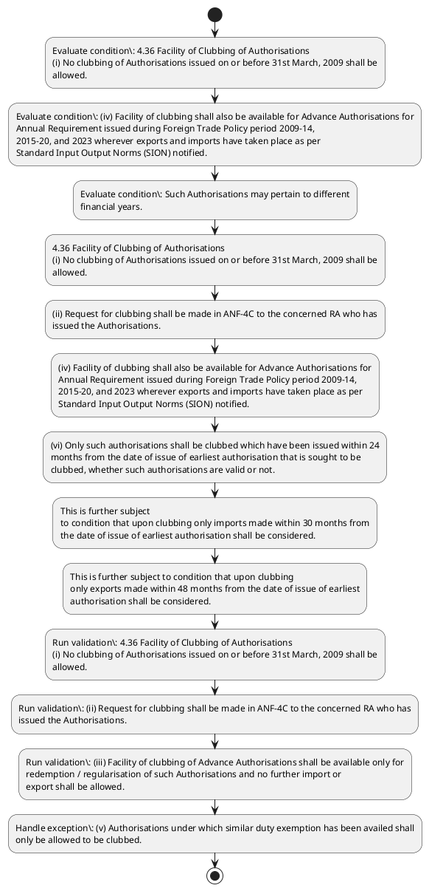

# Chapter 4 / Section 4.36: Facility of Clubbing of Authorisations

**Chapter Title:** Duty Exemption / Remission Schemes

**Pages:** 19, 20

**Purpose:** 4.36 Facility of Clubbing of Authorisations
(i) No clubbing of Authorisations issued on or before 31st March, 2009 shall be
allowed.

**Purpose Thanglish:** Indha Facility of Clubbing of Authorisations section-la, 4.36 Facility of Clubbing of Authorisations
(i) No clubbing of Authorisations issued on or before 31st March, 2009 kandippa be
allowed.

**Summary:** 4.36 Facility of Clubbing of Authorisations
(i) No clubbing of Authorisations issued on or before 31st March, 2009 shall be
allowed. (ii) Request for clubbing shall be made in ANF-4C to the concerned RA who has
issued the Authorisations. (iii) Facility of clubbing of Advance Authorisations shall be available only for
redemption / regularisation of such Authorisations and no further import or
export shall be allowed.

**Business Meaning:** Facility of Clubbing of Authorisations governs how DGFT business controls should be applied, validated, and enforced.

**Business Explanation:** Facility of Clubbing of Authorisations explains the operating rule set that DEKAI should enforce. Key control points include 4.36 Facility of Clubbing of Authorisations
(i) No clubbing of Authorisations issued on or before 31st March, 2009 shall be
allowed. The section also drives actions such as 4.36 Facility of Clubbing of Authorisations
(i) No clubbing of Authorisations issued on or before 31st March, 2009 shall be
allowed..

**Business Explanation Thanglish:** Indha Facility of Clubbing of Authorisations section-la, Facility of Clubbing of Authorisations explains the operating rule set that DEKAI should enforce. Key control points include 4.36 Facility of Clubbing of Authorisations
(i) No clubbing of Authorisations issued on or before 31st March, 2009 kandippa be
allowed. The section also drives actions such as 4.36 Facility of Clubbing of Authorisations
(i) No clubbing of Authorisations issued on or before 31st March, 2009 kandippa be
allowed..

## Business Logic
- 4.36 Facility of Clubbing of Authorisations
(i) No clubbing of Authorisations issued on or before 31st March, 2009 shall be
allowed.
- (ii) Request for clubbing shall be made in ANF-4C to the concerned RA who has
issued the Authorisations.
- (iii) Facility of clubbing of Advance Authorisations shall be available only for
redemption / regularisation of such Authorisations and no further import or
export shall be allowed.
- (iv) Facility of clubbing shall also be available for Advance Authorisations for
Annual Requirement issued during Foreign Trade Policy period 2009-14,
2015-20, and 2023 wherever exports and imports have taken place as per
Standard Input Output Norms (SION) notified.
- (v) Authorisations under which similar duty exemption has been availed shall
only be allowed to be clubbed.
- (vi) Only such authorisations shall be clubbed which have been issued within 24
months from the date of issue of earliest authorisation that is sought to be
clubbed, whether such authorisations are valid or not.
- This is further subject
to condition that upon clubbing only imports made within 30 months from
the date of issue of earliest authorisation shall be considered.
- Any imports
made beyond 30 months of earliest authorisation shall be regularized under
Para 4.49 of the HBP.
- This is further subject to condition that upon clubbing
only exports made within 48 months from the date of issue of earliest
authorisation shall be considered.
- Any exports made beyond 48 months of
earliest authorisation shall not be acceptable for clubbing.iv
(vii) Exports made during initial or extended EO period of individual
authorisations (after payment of composition fee as per provisions of Para
4.40 of HBP) shall be clubbed.
- (viii) Upon clubbing, if shortfall in value or quantity is noticed, the same shall be
regularized under the provisions of Para 4.49 of HBP.
- (ix) Clubbing of Authorisations issued with different EO periods shall also be
allowed.
- (x) Inputs which are common in all Authorisations shall be clubbed and duty free
pg.
- 4.36 Facility of Clubbing of Authorisations
(i)
No clubbing of Authorisations issued on or before 31st March, 2009 shall be
allowed.
- (ii)
Request for clubbing shall be made in ANF-4C to the concerned RA who has
issued the Authorisations.
- (iii)
Facility of clubbing of Advance Authorisations shall be available only for
redemption / regularisation of such Authorisations and no further import or
export shall be allowed.
- (iv)
Facility of clubbing shall also be available for Advance Authorisations for
Annual Requirement issued during Foreign Trade Policy period 2009-14,
2015-20, and 2023 wherever exports and imports have taken place as per
Standard Input Output Norms (SION) notified.
- (v)
Authorisations under which similar duty exemption has been availed shall
only be allowed to be clubbed.
- (vi)
Only such authorisations shall be clubbed which have been issued within 24
months from the date of issue of earliest authorisation that is sought to be
clubbed, whether such authorisations are valid or not.
- Any exports made beyond 48 months of
earliest authorisation shall not be acceptable for clubbing.iv
(vii)
Exports made during initial or extended EO period of individual
authorisations (after payment of composition fee as per provisions of Para
4.40 of HBP) shall be clubbed.
- (ix)
Clubbing of Authorisations issued with different EO periods shall also be
allowed.
- (x)
Inputs which are common in all Authorisations shall be clubbed and duty free
inputs shall be accounted for as per SION/Ad-Hoc Norms fixed by NC.
- (xi) Minimum value addition as prescribed in FTP and Procedures for the export
product will be required to be maintained on clubbing.
- (xii) After clubbing, Authorisations shall for all purposes, be deemed to be one
Authorisation.
- (xiv) No clubbing shall be permitted in respect of Authorisations where
misrepresentation / fraud have come to the notice of RA.
- Further, no clubbing
of Authorisations, where EODC/redemption letter has already been issued or
adjudication orders have already been passed by RA/Customs Authority, shall
be permitted.
- (xv) Additional provisions for clubbing of Authorisations covered under
Appendix-30A (issued under FTP 2009-14) / Appendix-4J (issued under FTP
2015-20 and FTP 2023) and Authorisations issued with Export Obligation
Period less than 18 months:
(a) Export obligation period of clubbed Authorisations shall be reckoned
from the date of earliest import in any of the Authorisations proposed to
be clubbed.
- (b) Clubbing of such Authorisations shall be allowed provided all exports
are completed within initial/extended Export Obligation period
reckoned from date of earliest import in any of the Authorisations
proposed to be clubbed.

## Business Rules
- rule_id=CH4-SEC4_36-R001, rule_description=4.36 Facility of Clubbing of Authorisations
(i) No clubbing of Authorisations issued on or before 31st March, 2009 shall be
allowed., trigger=Facility of Clubbing of Authorisations, condition=4.36 Facility of Clubbing of Authorisations
(i) No clubbing of Authorisations issued on or before 31st March, 2009 shall be
allowed., validation=4.36 Facility of Clubbing of Authorisations
(i) No clubbing of Authorisations issued on or before 31st March, 2009 shall be
allowed., action=4.36 Facility of Clubbing of Authorisations
(i) No clubbing of Authorisations issued on or before 31st March, 2009 shall be
allowed., exception=(v) Authorisations under which similar duty exemption has been availed shall
only be allowed to be clubbed., output=DEKAI should produce a compliance decision for 4.36 - Facility of Clubbing of Authorisations.
- rule_id=CH4-SEC4_36-R002, rule_description=(ii) Request for clubbing shall be made in ANF-4C to the concerned RA who has
issued the Authorisations., trigger=Facility of Clubbing of Authorisations, condition=(iv) Facility of clubbing shall also be available for Advance Authorisations for
Annual Requirement issued during Foreign Trade Policy period 2009-14,
2015-20, and 2023 wherever exports and imports have taken place as per
Standard Input Output Norms (SION) notified., validation=(ii) Request for clubbing shall be made in ANF-4C to the concerned RA who has
issued the Authorisations., action=(ii) Request for clubbing shall be made in ANF-4C to the concerned RA who has
issued the Authorisations., exception=(v)
Authorisations under which similar duty exemption has been availed shall
only be allowed to be clubbed., output=DEKAI should produce a compliance decision for 4.36 - Facility of Clubbing of Authorisations.
- rule_id=CH4-SEC4_36-R003, rule_description=(iii) Facility of clubbing of Advance Authorisations shall be available only for
redemption / regularisation of such Authorisations and no further import or
export shall be allowed., trigger=Facility of Clubbing of Authorisations, condition=Such Authorisations may pertain to different
financial years., validation=(iii) Facility of clubbing of Advance Authorisations shall be available only for
redemption / regularisation of such Authorisations and no further import or
export shall be allowed., action=(iv) Facility of clubbing shall also be available for Advance Authorisations for
Annual Requirement issued during Foreign Trade Policy period 2009-14,
2015-20, and 2023 wherever exports and imports have taken place as per
Standard Input Output Norms (SION) notified., exception=(v)
Authorisations under which similar duty exemption has been availed shall
only be allowed to be clubbed., output=DEKAI should produce a compliance decision for 4.36 - Facility of Clubbing of Authorisations.
- rule_id=CH4-SEC4_36-R004, rule_description=(iv) Facility of clubbing shall also be available for Advance Authorisations for
Annual Requirement issued during Foreign Trade Policy period 2009-14,
2015-20, and 2023 wherever exports and imports have taken place as per
Standard Input Output Norms (SION) notified., trigger=Facility of Clubbing of Authorisations, condition=This is further subject
to condition that upon clubbing only imports made within 30 months from
the date of issue of earliest authorisation shall be considered., validation=(iv) Facility of clubbing shall also be available for Advance Authorisations for
Annual Requirement issued during Foreign Trade Policy period 2009-14,
2015-20, and 2023 wherever exports and imports have taken place as per
Standard Input Output Norms (SION) notified., action=(vi) Only such authorisations shall be clubbed which have been issued within 24
months from the date of issue of earliest authorisation that is sought to be
clubbed, whether such authorisations are valid or not., exception=(v)
Authorisations under which similar duty exemption has been availed shall
only be allowed to be clubbed., output=DEKAI should produce a compliance decision for 4.36 - Facility of Clubbing of Authorisations.
- rule_id=CH4-SEC4_36-R005, rule_description=(v) Authorisations under which similar duty exemption has been availed shall
only be allowed to be clubbed., trigger=Facility of Clubbing of Authorisations, condition=This is further subject to condition that upon clubbing
only exports made within 48 months from the date of issue of earliest
authorisation shall be considered., validation=(v) Authorisations under which similar duty exemption has been availed shall
only be allowed to be clubbed., action=This is further subject
to condition that upon clubbing only imports made within 30 months from
the date of issue of earliest authorisation shall be considered., exception=(v)
Authorisations under which similar duty exemption has been availed shall
only be allowed to be clubbed., output=DEKAI should produce a compliance decision for 4.36 - Facility of Clubbing of Authorisations.
- rule_id=CH4-SEC4_36-R006, rule_description=(vi) Only such authorisations shall be clubbed which have been issued within 24
months from the date of issue of earliest authorisation that is sought to be
clubbed, whether such authorisations are valid or not., trigger=Facility of Clubbing of Authorisations, condition=Any exports made beyond 48 months of
earliest authorisation shall not be acceptable for clubbing.iv
(vii) Exports made during initial or extended EO period of individual
authorisations (after payment of composition fee as per provisions of Para
4.40 of HBP) shall be clubbed., validation=(vi) Only such authorisations shall be clubbed which have been issued within 24
months from the date of issue of earliest authorisation that is sought to be
clubbed, whether such authorisations are valid or not., action=This is further subject to condition that upon clubbing
only exports made within 48 months from the date of issue of earliest
authorisation shall be considered., exception=(v)
Authorisations under which similar duty exemption has been availed shall
only be allowed to be clubbed., output=DEKAI should produce a compliance decision for 4.36 - Facility of Clubbing of Authorisations.
- rule_id=CH4-SEC4_36-R007, rule_description=This is further subject
to condition that upon clubbing only imports made within 30 months from
the date of issue of earliest authorisation shall be considered., trigger=Facility of Clubbing of Authorisations, condition=shortfall in value or quantity is noticed, validation=This is further subject
to condition that upon clubbing only imports made within 30 months from
the date of issue of earliest authorisation shall be considered., action=Any exports made beyond 48 months of
earliest authorisation shall not be acceptable for clubbing.iv
(vii) Exports made during initial or extended EO period of individual
authorisations (after payment of composition fee as per provisions of Para
4.40 of HBP) shall be clubbed., exception=(v)
Authorisations under which similar duty exemption has been availed shall
only be allowed to be clubbed., output=DEKAI should produce a compliance decision for 4.36 - Facility of Clubbing of Authorisations.
- rule_id=CH4-SEC4_36-R008, rule_description=Any imports
made beyond 30 months of earliest authorisation shall be regularized under
Para 4.49 of the HBP., trigger=Facility of Clubbing of Authorisations, condition=(ix) Clubbing of Authorisations issued with different EO periods shall also be
allowed., validation=Any imports
made beyond 30 months of earliest authorisation shall be regularized under
Para 4.49 of the HBP., action=(ix) Clubbing of Authorisations issued with different EO periods shall also be
allowed., exception=(v)
Authorisations under which similar duty exemption has been availed shall
only be allowed to be clubbed., output=DEKAI should produce a compliance decision for 4.36 - Facility of Clubbing of Authorisations.
- rule_id=CH4-SEC4_36-R009, rule_description=This is further subject to condition that upon clubbing
only exports made within 48 months from the date of issue of earliest
authorisation shall be considered., trigger=Facility of Clubbing of Authorisations, condition=4.36 Facility of Clubbing of Authorisations
(i)
No clubbing of Authorisations issued on or before 31st March, 2009 shall be
allowed., validation=This is further subject to condition that upon clubbing
only exports made within 48 months from the date of issue of earliest
authorisation shall be considered., action=94
authorisation is issued in the manner as prescribed under Para 4.30(c) and
Para 4.34 of this Handbook., exception=(v)
Authorisations under which similar duty exemption has been availed shall
only be allowed to be clubbed., output=DEKAI should produce a compliance decision for 4.36 - Facility of Clubbing of Authorisations.
- rule_id=CH4-SEC4_36-R010, rule_description=Any exports made beyond 48 months of
earliest authorisation shall not be acceptable for clubbing.iv
(vii) Exports made during initial or extended EO period of individual
authorisations (after payment of composition fee as per provisions of Para
4.40 of HBP) shall be clubbed., trigger=Facility of Clubbing of Authorisations, condition=(iv)
Facility of clubbing shall also be available for Advance Authorisations for
Annual Requirement issued during Foreign Trade Policy period 2009-14,
2015-20, and 2023 wherever exports and imports have taken place as per
Standard Input Output Norms (SION) notified., validation=Any exports made beyond 48 months of
earliest authorisation shall not be acceptable for clubbing.iv
(vii) Exports made during initial or extended EO period of individual
authorisations (after payment of composition fee as per provisions of Para
4.40 of HBP) shall be clubbed., action=4.36 Facility of Clubbing of Authorisations
(i)
No clubbing of Authorisations issued on or before 31st March, 2009 shall be
allowed., exception=(v)
Authorisations under which similar duty exemption has been availed shall
only be allowed to be clubbed., output=DEKAI should produce a compliance decision for 4.36 - Facility of Clubbing of Authorisations.
- rule_id=CH4-SEC4_36-R011, rule_description=(viii) Upon clubbing, if shortfall in value or quantity is noticed, the same shall be
regularized under the provisions of Para 4.49 of HBP., trigger=Facility of Clubbing of Authorisations, condition=Any exports made beyond 48 months of
earliest authorisation shall not be acceptable for clubbing.iv
(vii)
Exports made during initial or extended EO period of individual
authorisations (after payment of composition fee as per provisions of Para
4.40 of HBP) shall be clubbed., validation=(viii) Upon clubbing, if shortfall in value or quantity is noticed, the same shall be
regularized under the provisions of Para 4.49 of HBP., action=(ii)
Request for clubbing shall be made in ANF-4C to the concerned RA who has
issued the Authorisations., exception=(v)
Authorisations under which similar duty exemption has been availed shall
only be allowed to be clubbed., output=DEKAI should produce a compliance decision for 4.36 - Facility of Clubbing of Authorisations.
- rule_id=CH4-SEC4_36-R012, rule_description=(ix) Clubbing of Authorisations issued with different EO periods shall also be
allowed., trigger=Facility of Clubbing of Authorisations, condition=(ix)
Clubbing of Authorisations issued with different EO periods shall also be
allowed., validation=(ix) Clubbing of Authorisations issued with different EO periods shall also be
allowed., action=(iv)
Facility of clubbing shall also be available for Advance Authorisations for
Annual Requirement issued during Foreign Trade Policy period 2009-14,
2015-20, and 2023 wherever exports and imports have taken place as per
Standard Input Output Norms (SION) notified., exception=(v)
Authorisations under which similar duty exemption has been availed shall
only be allowed to be clubbed., output=DEKAI should produce a compliance decision for 4.36 - Facility of Clubbing of Authorisations.
- rule_id=CH4-SEC4_36-R013, rule_description=(x) Inputs which are common in all Authorisations shall be clubbed and duty free
pg., trigger=Facility of Clubbing of Authorisations, condition=(xii) After clubbing, Authorisations shall for all purposes, be deemed to be one
Authorisation., validation=(x) Inputs which are common in all Authorisations shall be clubbed and duty free
pg., action=(vi)
Only such authorisations shall be clubbed which have been issued within 24
months from the date of issue of earliest authorisation that is sought to be
clubbed, whether such authorisations are valid or not., exception=(v)
Authorisations under which similar duty exemption has been availed shall
only be allowed to be clubbed., output=DEKAI should produce a compliance decision for 4.36 - Facility of Clubbing of Authorisations.
- rule_id=CH4-SEC4_36-R014, rule_description=4.36 Facility of Clubbing of Authorisations
(i)
No clubbing of Authorisations issued on or before 31st March, 2009 shall be
allowed., trigger=Facility of Clubbing of Authorisations, condition=The value addition would be calculated on the basis of total CIF
and total FOB arrived at after clubbing the Authorisations., validation=4.36 Facility of Clubbing of Authorisations
(i)
No clubbing of Authorisations issued on or before 31st March, 2009 shall be
allowed., action=Any exports made beyond 48 months of
earliest authorisation shall not be acceptable for clubbing.iv
(vii)
Exports made during initial or extended EO period of individual
authorisations (after payment of composition fee as per provisions of Para
4.40 of HBP) shall be clubbed., exception=(v)
Authorisations under which similar duty exemption has been availed shall
only be allowed to be clubbed., output=DEKAI should produce a compliance decision for 4.36 - Facility of Clubbing of Authorisations.
- rule_id=CH4-SEC4_36-R015, rule_description=(ii)
Request for clubbing shall be made in ANF-4C to the concerned RA who has
issued the Authorisations., trigger=Facility of Clubbing of Authorisations, condition=(xiv) No clubbing shall be permitted in respect of Authorisations where
misrepresentation / fraud have come to the notice of RA., validation=(ii)
Request for clubbing shall be made in ANF-4C to the concerned RA who has
issued the Authorisations., action=(ix)
Clubbing of Authorisations issued with different EO periods shall also be
allowed., exception=(v)
Authorisations under which similar duty exemption has been availed shall
only be allowed to be clubbed., output=DEKAI should produce a compliance decision for 4.36 - Facility of Clubbing of Authorisations.
- rule_id=CH4-SEC4_36-R016, rule_description=(iii)
Facility of clubbing of Advance Authorisations shall be available only for
redemption / regularisation of such Authorisations and no further import or
export shall be allowed., trigger=Facility of Clubbing of Authorisations, condition=Further, no clubbing
of Authorisations, where EODC/redemption letter has already been issued or
adjudication orders have already been passed by RA/Customs Authority, shall
be permitted., validation=(iii)
Facility of clubbing of Advance Authorisations shall be available only for
redemption / regularisation of such Authorisations and no further import or
export shall be allowed., action=(xi) Minimum value addition as prescribed in FTP and Procedures for the export
product will be required to be maintained on clubbing., exception=(v)
Authorisations under which similar duty exemption has been availed shall
only be allowed to be clubbed., output=DEKAI should produce a compliance decision for 4.36 - Facility of Clubbing of Authorisations.
- rule_id=CH4-SEC4_36-R017, rule_description=(iv)
Facility of clubbing shall also be available for Advance Authorisations for
Annual Requirement issued during Foreign Trade Policy period 2009-14,
2015-20, and 2023 wherever exports and imports have taken place as per
Standard Input Output Norms (SION) notified., trigger=Facility of Clubbing of Authorisations, condition=Further, no clubbing
of Authorisations, where EODC/redemption letter has already been issued or
adjudication orders have already been passed by RA/Customs Authority, shall
be permitted., validation=(iv)
Facility of clubbing shall also be available for Advance Authorisations for
Annual Requirement issued during Foreign Trade Policy period 2009-14,
2015-20, and 2023 wherever exports and imports have taken place as per
Standard Input Output Norms (SION) notified., action=Further, no clubbing
of Authorisations, where EODC/redemption letter has already been issued or
adjudication orders have already been passed by RA/Customs Authority, shall
be permitted., exception=(v)
Authorisations under which similar duty exemption has been availed shall
only be allowed to be clubbed., output=DEKAI should produce a compliance decision for 4.36 - Facility of Clubbing of Authorisations.
- rule_id=CH4-SEC4_36-R018, rule_description=(v)
Authorisations under which similar duty exemption has been availed shall
only be allowed to be clubbed., trigger=Facility of Clubbing of Authorisations, condition=Further, no clubbing
of Authorisations, where EODC/redemption letter has already been issued or
adjudication orders have already been passed by RA/Customs Authority, shall
be permitted., validation=(v)
Authorisations under which similar duty exemption has been availed shall
only be allowed to be clubbed., action=(xv) Additional provisions for clubbing of Authorisations covered under
Appendix-30A (issued under FTP 2009-14) / Appendix-4J (issued under FTP
2015-20 and FTP 2023) and Authorisations issued with Export Obligation
Period less than 18 months:
(a) Export obligation period of clubbed Authorisations shall be reckoned
from the date of earliest import in any of the Authorisations proposed to
be clubbed., exception=(v)
Authorisations under which similar duty exemption has been availed shall
only be allowed to be clubbed., output=DEKAI should produce a compliance decision for 4.36 - Facility of Clubbing of Authorisations.
- rule_id=CH4-SEC4_36-R019, rule_description=(vi)
Only such authorisations shall be clubbed which have been issued within 24
months from the date of issue of earliest authorisation that is sought to be
clubbed, whether such authorisations are valid or not., trigger=Facility of Clubbing of Authorisations, condition=Further, no clubbing
of Authorisations, where EODC/redemption letter has already been issued or
adjudication orders have already been passed by RA/Customs Authority, shall
be permitted., validation=(vi)
Only such authorisations shall be clubbed which have been issued within 24
months from the date of issue of earliest authorisation that is sought to be
clubbed, whether such authorisations are valid or not., action=(xv) Additional provisions for clubbing of Authorisations covered under
Appendix-30A (issued under FTP 2009-14) / Appendix-4J (issued under FTP
2015-20 and FTP 2023) and Authorisations issued with Export Obligation
Period less than 18 months:
(a) Export obligation period of clubbed Authorisations shall be reckoned
from the date of earliest import in any of the Authorisations proposed to
be clubbed., exception=(v)
Authorisations under which similar duty exemption has been availed shall
only be allowed to be clubbed., output=DEKAI should produce a compliance decision for 4.36 - Facility of Clubbing of Authorisations.
- rule_id=CH4-SEC4_36-R020, rule_description=Any exports made beyond 48 months of
earliest authorisation shall not be acceptable for clubbing.iv
(vii)
Exports made during initial or extended EO period of individual
authorisations (after payment of composition fee as per provisions of Para
4.40 of HBP) shall be clubbed., trigger=Facility of Clubbing of Authorisations, condition=Further, no clubbing
of Authorisations, where EODC/redemption letter has already been issued or
adjudication orders have already been passed by RA/Customs Authority, shall
be permitted., validation=Any exports made beyond 48 months of
earliest authorisation shall not be acceptable for clubbing.iv
(vii)
Exports made during initial or extended EO period of individual
authorisations (after payment of composition fee as per provisions of Para
4.40 of HBP) shall be clubbed., action=(xv) Additional provisions for clubbing of Authorisations covered under
Appendix-30A (issued under FTP 2009-14) / Appendix-4J (issued under FTP
2015-20 and FTP 2023) and Authorisations issued with Export Obligation
Period less than 18 months:
(a) Export obligation period of clubbed Authorisations shall be reckoned
from the date of earliest import in any of the Authorisations proposed to
be clubbed., exception=(v)
Authorisations under which similar duty exemption has been availed shall
only be allowed to be clubbed., output=DEKAI should produce a compliance decision for 4.36 - Facility of Clubbing of Authorisations.
- rule_id=CH4-SEC4_36-R021, rule_description=(ix)
Clubbing of Authorisations issued with different EO periods shall also be
allowed., trigger=Facility of Clubbing of Authorisations, condition=Further, no clubbing
of Authorisations, where EODC/redemption letter has already been issued or
adjudication orders have already been passed by RA/Customs Authority, shall
be permitted., validation=(ix)
Clubbing of Authorisations issued with different EO periods shall also be
allowed., action=(xv) Additional provisions for clubbing of Authorisations covered under
Appendix-30A (issued under FTP 2009-14) / Appendix-4J (issued under FTP
2015-20 and FTP 2023) and Authorisations issued with Export Obligation
Period less than 18 months:
(a) Export obligation period of clubbed Authorisations shall be reckoned
from the date of earliest import in any of the Authorisations proposed to
be clubbed., exception=(v)
Authorisations under which similar duty exemption has been availed shall
only be allowed to be clubbed., output=DEKAI should produce a compliance decision for 4.36 - Facility of Clubbing of Authorisations.
- rule_id=CH4-SEC4_36-R022, rule_description=(x)
Inputs which are common in all Authorisations shall be clubbed and duty free
inputs shall be accounted for as per SION/Ad-Hoc Norms fixed by NC., trigger=Facility of Clubbing of Authorisations, condition=Further, no clubbing
of Authorisations, where EODC/redemption letter has already been issued or
adjudication orders have already been passed by RA/Customs Authority, shall
be permitted., validation=(x)
Inputs which are common in all Authorisations shall be clubbed and duty free
inputs shall be accounted for as per SION/Ad-Hoc Norms fixed by NC., action=(xv) Additional provisions for clubbing of Authorisations covered under
Appendix-30A (issued under FTP 2009-14) / Appendix-4J (issued under FTP
2015-20 and FTP 2023) and Authorisations issued with Export Obligation
Period less than 18 months:
(a) Export obligation period of clubbed Authorisations shall be reckoned
from the date of earliest import in any of the Authorisations proposed to
be clubbed., exception=(v)
Authorisations under which similar duty exemption has been availed shall
only be allowed to be clubbed., output=DEKAI should produce a compliance decision for 4.36 - Facility of Clubbing of Authorisations.
- rule_id=CH4-SEC4_36-R023, rule_description=(xi) Minimum value addition as prescribed in FTP and Procedures for the export
product will be required to be maintained on clubbing., trigger=Facility of Clubbing of Authorisations, condition=Further, no clubbing
of Authorisations, where EODC/redemption letter has already been issued or
adjudication orders have already been passed by RA/Customs Authority, shall
be permitted., validation=(xi) Minimum value addition as prescribed in FTP and Procedures for the export
product will be required to be maintained on clubbing., action=(xv) Additional provisions for clubbing of Authorisations covered under
Appendix-30A (issued under FTP 2009-14) / Appendix-4J (issued under FTP
2015-20 and FTP 2023) and Authorisations issued with Export Obligation
Period less than 18 months:
(a) Export obligation period of clubbed Authorisations shall be reckoned
from the date of earliest import in any of the Authorisations proposed to
be clubbed., exception=(v)
Authorisations under which similar duty exemption has been availed shall
only be allowed to be clubbed., output=DEKAI should produce a compliance decision for 4.36 - Facility of Clubbing of Authorisations.
- rule_id=CH4-SEC4_36-R024, rule_description=(xii) After clubbing, Authorisations shall for all purposes, be deemed to be one
Authorisation., trigger=Facility of Clubbing of Authorisations, condition=Further, no clubbing
of Authorisations, where EODC/redemption letter has already been issued or
adjudication orders have already been passed by RA/Customs Authority, shall
be permitted., validation=(xii) After clubbing, Authorisations shall for all purposes, be deemed to be one
Authorisation., action=(xv) Additional provisions for clubbing of Authorisations covered under
Appendix-30A (issued under FTP 2009-14) / Appendix-4J (issued under FTP
2015-20 and FTP 2023) and Authorisations issued with Export Obligation
Period less than 18 months:
(a) Export obligation period of clubbed Authorisations shall be reckoned
from the date of earliest import in any of the Authorisations proposed to
be clubbed., exception=(v)
Authorisations under which similar duty exemption has been availed shall
only be allowed to be clubbed., output=DEKAI should produce a compliance decision for 4.36 - Facility of Clubbing of Authorisations.
- rule_id=CH4-SEC4_36-R025, rule_description=(xiv) No clubbing shall be permitted in respect of Authorisations where
misrepresentation / fraud have come to the notice of RA., trigger=Facility of Clubbing of Authorisations, condition=Further, no clubbing
of Authorisations, where EODC/redemption letter has already been issued or
adjudication orders have already been passed by RA/Customs Authority, shall
be permitted., validation=(xiv) No clubbing shall be permitted in respect of Authorisations where
misrepresentation / fraud have come to the notice of RA., action=(xv) Additional provisions for clubbing of Authorisations covered under
Appendix-30A (issued under FTP 2009-14) / Appendix-4J (issued under FTP
2015-20 and FTP 2023) and Authorisations issued with Export Obligation
Period less than 18 months:
(a) Export obligation period of clubbed Authorisations shall be reckoned
from the date of earliest import in any of the Authorisations proposed to
be clubbed., exception=(v)
Authorisations under which similar duty exemption has been availed shall
only be allowed to be clubbed., output=DEKAI should produce a compliance decision for 4.36 - Facility of Clubbing of Authorisations.
- rule_id=CH4-SEC4_36-R026, rule_description=Further, no clubbing
of Authorisations, where EODC/redemption letter has already been issued or
adjudication orders have already been passed by RA/Customs Authority, shall
be permitted., trigger=Facility of Clubbing of Authorisations, condition=Further, no clubbing
of Authorisations, where EODC/redemption letter has already been issued or
adjudication orders have already been passed by RA/Customs Authority, shall
be permitted., validation=Further, no clubbing
of Authorisations, where EODC/redemption letter has already been issued or
adjudication orders have already been passed by RA/Customs Authority, shall
be permitted., action=(xv) Additional provisions for clubbing of Authorisations covered under
Appendix-30A (issued under FTP 2009-14) / Appendix-4J (issued under FTP
2015-20 and FTP 2023) and Authorisations issued with Export Obligation
Period less than 18 months:
(a) Export obligation period of clubbed Authorisations shall be reckoned
from the date of earliest import in any of the Authorisations proposed to
be clubbed., exception=(v)
Authorisations under which similar duty exemption has been availed shall
only be allowed to be clubbed., output=DEKAI should produce a compliance decision for 4.36 - Facility of Clubbing of Authorisations.
- rule_id=CH4-SEC4_36-R027, rule_description=(xv) Additional provisions for clubbing of Authorisations covered under
Appendix-30A (issued under FTP 2009-14) / Appendix-4J (issued under FTP
2015-20 and FTP 2023) and Authorisations issued with Export Obligation
Period less than 18 months:
(a) Export obligation period of clubbed Authorisations shall be reckoned
from the date of earliest import in any of the Authorisations proposed to
be clubbed., trigger=Facility of Clubbing of Authorisations, condition=Further, no clubbing
of Authorisations, where EODC/redemption letter has already been issued or
adjudication orders have already been passed by RA/Customs Authority, shall
be permitted., validation=(xv) Additional provisions for clubbing of Authorisations covered under
Appendix-30A (issued under FTP 2009-14) / Appendix-4J (issued under FTP
2015-20 and FTP 2023) and Authorisations issued with Export Obligation
Period less than 18 months:
(a) Export obligation period of clubbed Authorisations shall be reckoned
from the date of earliest import in any of the Authorisations proposed to
be clubbed., action=(xv) Additional provisions for clubbing of Authorisations covered under
Appendix-30A (issued under FTP 2009-14) / Appendix-4J (issued under FTP
2015-20 and FTP 2023) and Authorisations issued with Export Obligation
Period less than 18 months:
(a) Export obligation period of clubbed Authorisations shall be reckoned
from the date of earliest import in any of the Authorisations proposed to
be clubbed., exception=(v)
Authorisations under which similar duty exemption has been availed shall
only be allowed to be clubbed., output=DEKAI should produce a compliance decision for 4.36 - Facility of Clubbing of Authorisations.
- rule_id=CH4-SEC4_36-R028, rule_description=(b) Clubbing of such Authorisations shall be allowed provided all exports
are completed within initial/extended Export Obligation period
reckoned from date of earliest import in any of the Authorisations
proposed to be clubbed., trigger=Facility of Clubbing of Authorisations, condition=Further, no clubbing
of Authorisations, where EODC/redemption letter has already been issued or
adjudication orders have already been passed by RA/Customs Authority, shall
be permitted., validation=(b) Clubbing of such Authorisations shall be allowed provided all exports
are completed within initial/extended Export Obligation period
reckoned from date of earliest import in any of the Authorisations
proposed to be clubbed., action=(xv) Additional provisions for clubbing of Authorisations covered under
Appendix-30A (issued under FTP 2009-14) / Appendix-4J (issued under FTP
2015-20 and FTP 2023) and Authorisations issued with Export Obligation
Period less than 18 months:
(a) Export obligation period of clubbed Authorisations shall be reckoned
from the date of earliest import in any of the Authorisations proposed to
be clubbed., exception=(v)
Authorisations under which similar duty exemption has been availed shall
only be allowed to be clubbed., output=DEKAI should produce a compliance decision for 4.36 - Facility of Clubbing of Authorisations.

## Conditions
- 4.36 Facility of Clubbing of Authorisations
(i) No clubbing of Authorisations issued on or before 31st March, 2009 shall be
allowed.
- (iv) Facility of clubbing shall also be available for Advance Authorisations for
Annual Requirement issued during Foreign Trade Policy period 2009-14,
2015-20, and 2023 wherever exports and imports have taken place as per
Standard Input Output Norms (SION) notified.
- Such Authorisations may pertain to different
financial years.
- This is further subject
to condition that upon clubbing only imports made within 30 months from
the date of issue of earliest authorisation shall be considered.
- This is further subject to condition that upon clubbing
only exports made within 48 months from the date of issue of earliest
authorisation shall be considered.
- Any exports made beyond 48 months of
earliest authorisation shall not be acceptable for clubbing.iv
(vii) Exports made during initial or extended EO period of individual
authorisations (after payment of composition fee as per provisions of Para
4.40 of HBP) shall be clubbed.
- (viii) Upon clubbing, if shortfall in value or quantity is noticed, the same shall be
regularized under the provisions of Para 4.49 of HBP.
- (ix) Clubbing of Authorisations issued with different EO periods shall also be
allowed.
- 4.36 Facility of Clubbing of Authorisations
(i)
No clubbing of Authorisations issued on or before 31st March, 2009 shall be
allowed.
- (iv)
Facility of clubbing shall also be available for Advance Authorisations for
Annual Requirement issued during Foreign Trade Policy period 2009-14,
2015-20, and 2023 wherever exports and imports have taken place as per
Standard Input Output Norms (SION) notified.
- Any exports made beyond 48 months of
earliest authorisation shall not be acceptable for clubbing.iv
(vii)
Exports made during initial or extended EO period of individual
authorisations (after payment of composition fee as per provisions of Para
4.40 of HBP) shall be clubbed.
- (ix)
Clubbing of Authorisations issued with different EO periods shall also be
allowed.
- (xii) After clubbing, Authorisations shall for all purposes, be deemed to be one
Authorisation.
- The value addition would be calculated on the basis of total CIF
and total FOB arrived at after clubbing the Authorisations.
- (xiv) No clubbing shall be permitted in respect of Authorisations where
misrepresentation / fraud have come to the notice of RA.
- Further, no clubbing
of Authorisations, where EODC/redemption letter has already been issued or
adjudication orders have already been passed by RA/Customs Authority, shall
be permitted.

## Condition Logic
- id=4.4.36.1, if=4.36 Facility of Clubbing of Authorisations
(i) No clubbing of Authorisations issued on or before 31st March, 2009 shall be
allowed., then=4.36 Facility of Clubbing of Authorisations
(i) No clubbing of Authorisations issued on or before 31st March, 2009 shall be
allowed., source=4.36 Facility of Clubbing of Authorisations
(i) No clubbing of Authorisations issued on or before 31st March, 2009 shall be
allowed.
- id=4.4.36.2, if=(iv) Facility of clubbing shall also be available for Advance Authorisations for
Annual Requirement issued during Foreign Trade Policy period 2009-14,
2015-20, and 2023 wherever exports and imports have taken place as per
Standard Input Output Norms (SION) notified., then=4.36 Facility of Clubbing of Authorisations
(i) No clubbing of Authorisations issued on or before 31st March, 2009 shall be
allowed., source=(iv) Facility of clubbing shall also be available for Advance Authorisations for
Annual Requirement issued during Foreign Trade Policy period 2009-14,
2015-20, and 2023 wherever exports and imports have taken place as per
Standard Input Output Norms (SION) notified.
- id=4.4.36.3, if=Such Authorisations may pertain to different
financial years., then=4.36 Facility of Clubbing of Authorisations
(i) No clubbing of Authorisations issued on or before 31st March, 2009 shall be
allowed., source=Such Authorisations may pertain to different
financial years.
- id=4.4.36.4, if=This is further subject
to condition that upon clubbing only imports made within 30 months from
the date of issue of earliest authorisation shall be considered., then=4.36 Facility of Clubbing of Authorisations
(i) No clubbing of Authorisations issued on or before 31st March, 2009 shall be
allowed., source=This is further subject
to condition that upon clubbing only imports made within 30 months from
the date of issue of earliest authorisation shall be considered.
- id=4.4.36.5, if=This is further subject to condition that upon clubbing
only exports made within 48 months from the date of issue of earliest
authorisation shall be considered., then=4.36 Facility of Clubbing of Authorisations
(i) No clubbing of Authorisations issued on or before 31st March, 2009 shall be
allowed., source=This is further subject to condition that upon clubbing
only exports made within 48 months from the date of issue of earliest
authorisation shall be considered.
- id=4.4.36.6, if=Any exports made beyond 48 months of
earliest authorisation shall not be acceptable for clubbing.iv
(vii) Exports made during initial or extended EO period of individual
authorisations (after payment of composition fee as per provisions of Para
4.40 of HBP) shall be clubbed., then=4.36 Facility of Clubbing of Authorisations
(i) No clubbing of Authorisations issued on or before 31st March, 2009 shall be
allowed., source=Any exports made beyond 48 months of
earliest authorisation shall not be acceptable for clubbing.iv
(vii) Exports made during initial or extended EO period of individual
authorisations (after payment of composition fee as per provisions of Para
4.40 of HBP) shall be clubbed.
- id=4.4.36.7, if=shortfall in value or quantity is noticed, then=4.36 Facility of Clubbing of Authorisations
(i) No clubbing of Authorisations issued on or before 31st March, 2009 shall be
allowed., source=(viii) Upon clubbing, if shortfall in value or quantity is noticed, the same shall be
regularized under the provisions of Para 4.49 of HBP.
- id=4.4.36.8, if=(ix) Clubbing of Authorisations issued with different EO periods shall also be
allowed., then=4.36 Facility of Clubbing of Authorisations
(i) No clubbing of Authorisations issued on or before 31st March, 2009 shall be
allowed., source=(ix) Clubbing of Authorisations issued with different EO periods shall also be
allowed.
- id=4.4.36.9, if=4.36 Facility of Clubbing of Authorisations
(i)
No clubbing of Authorisations issued on or before 31st March, 2009 shall be
allowed., then=4.36 Facility of Clubbing of Authorisations
(i) No clubbing of Authorisations issued on or before 31st March, 2009 shall be
allowed., source=4.36 Facility of Clubbing of Authorisations
(i)
No clubbing of Authorisations issued on or before 31st March, 2009 shall be
allowed.
- id=4.4.36.10, if=(iv)
Facility of clubbing shall also be available for Advance Authorisations for
Annual Requirement issued during Foreign Trade Policy period 2009-14,
2015-20, and 2023 wherever exports and imports have taken place as per
Standard Input Output Norms (SION) notified., then=4.36 Facility of Clubbing of Authorisations
(i) No clubbing of Authorisations issued on or before 31st March, 2009 shall be
allowed., source=(iv)
Facility of clubbing shall also be available for Advance Authorisations for
Annual Requirement issued during Foreign Trade Policy period 2009-14,
2015-20, and 2023 wherever exports and imports have taken place as per
Standard Input Output Norms (SION) notified.
- id=4.4.36.11, if=Any exports made beyond 48 months of
earliest authorisation shall not be acceptable for clubbing.iv
(vii)
Exports made during initial or extended EO period of individual
authorisations (after payment of composition fee as per provisions of Para
4.40 of HBP) shall be clubbed., then=4.36 Facility of Clubbing of Authorisations
(i) No clubbing of Authorisations issued on or before 31st March, 2009 shall be
allowed., source=Any exports made beyond 48 months of
earliest authorisation shall not be acceptable for clubbing.iv
(vii)
Exports made during initial or extended EO period of individual
authorisations (after payment of composition fee as per provisions of Para
4.40 of HBP) shall be clubbed.
- id=4.4.36.12, if=(ix)
Clubbing of Authorisations issued with different EO periods shall also be
allowed., then=4.36 Facility of Clubbing of Authorisations
(i) No clubbing of Authorisations issued on or before 31st March, 2009 shall be
allowed., source=(ix)
Clubbing of Authorisations issued with different EO periods shall also be
allowed.
- id=4.4.36.13, if=(xii) After clubbing, Authorisations shall for all purposes, be deemed to be one
Authorisation., then=4.36 Facility of Clubbing of Authorisations
(i) No clubbing of Authorisations issued on or before 31st March, 2009 shall be
allowed., source=(xii) After clubbing, Authorisations shall for all purposes, be deemed to be one
Authorisation.
- id=4.4.36.14, if=The value addition would be calculated on the basis of total CIF
and total FOB arrived at after clubbing the Authorisations., then=4.36 Facility of Clubbing of Authorisations
(i) No clubbing of Authorisations issued on or before 31st March, 2009 shall be
allowed., source=The value addition would be calculated on the basis of total CIF
and total FOB arrived at after clubbing the Authorisations.
- id=4.4.36.15, if=(xiv) No clubbing shall be permitted in respect of Authorisations where
misrepresentation / fraud have come to the notice of RA., then=4.36 Facility of Clubbing of Authorisations
(i) No clubbing of Authorisations issued on or before 31st March, 2009 shall be
allowed., source=(xiv) No clubbing shall be permitted in respect of Authorisations where
misrepresentation / fraud have come to the notice of RA.
- id=4.4.36.16, if=Further, no clubbing
of Authorisations, where EODC/redemption letter has already been issued or
adjudication orders have already been passed by RA/Customs Authority, shall
be permitted., then=4.36 Facility of Clubbing of Authorisations
(i) No clubbing of Authorisations issued on or before 31st March, 2009 shall be
allowed., source=Further, no clubbing
of Authorisations, where EODC/redemption letter has already been issued or
adjudication orders have already been passed by RA/Customs Authority, shall
be permitted.

## Validations
- 4.36 Facility of Clubbing of Authorisations
(i) No clubbing of Authorisations issued on or before 31st March, 2009 shall be
allowed.
- (ii) Request for clubbing shall be made in ANF-4C to the concerned RA who has
issued the Authorisations.
- (iii) Facility of clubbing of Advance Authorisations shall be available only for
redemption / regularisation of such Authorisations and no further import or
export shall be allowed.
- (iv) Facility of clubbing shall also be available for Advance Authorisations for
Annual Requirement issued during Foreign Trade Policy period 2009-14,
2015-20, and 2023 wherever exports and imports have taken place as per
Standard Input Output Norms (SION) notified.
- (v) Authorisations under which similar duty exemption has been availed shall
only be allowed to be clubbed.
- (vi) Only such authorisations shall be clubbed which have been issued within 24
months from the date of issue of earliest authorisation that is sought to be
clubbed, whether such authorisations are valid or not.
- This is further subject
to condition that upon clubbing only imports made within 30 months from
the date of issue of earliest authorisation shall be considered.
- Any imports
made beyond 30 months of earliest authorisation shall be regularized under
Para 4.49 of the HBP.
- This is further subject to condition that upon clubbing
only exports made within 48 months from the date of issue of earliest
authorisation shall be considered.
- Any exports made beyond 48 months of
earliest authorisation shall not be acceptable for clubbing.iv
(vii) Exports made during initial or extended EO period of individual
authorisations (after payment of composition fee as per provisions of Para
4.40 of HBP) shall be clubbed.
- (viii) Upon clubbing, if shortfall in value or quantity is noticed, the same shall be
regularized under the provisions of Para 4.49 of HBP.
- (ix) Clubbing of Authorisations issued with different EO periods shall also be
allowed.
- (x) Inputs which are common in all Authorisations shall be clubbed and duty free
pg.
- 4.36 Facility of Clubbing of Authorisations
(i)
No clubbing of Authorisations issued on or before 31st March, 2009 shall be
allowed.
- (ii)
Request for clubbing shall be made in ANF-4C to the concerned RA who has
issued the Authorisations.
- (iii)
Facility of clubbing of Advance Authorisations shall be available only for
redemption / regularisation of such Authorisations and no further import or
export shall be allowed.
- (iv)
Facility of clubbing shall also be available for Advance Authorisations for
Annual Requirement issued during Foreign Trade Policy period 2009-14,
2015-20, and 2023 wherever exports and imports have taken place as per
Standard Input Output Norms (SION) notified.
- (v)
Authorisations under which similar duty exemption has been availed shall
only be allowed to be clubbed.
- (vi)
Only such authorisations shall be clubbed which have been issued within 24
months from the date of issue of earliest authorisation that is sought to be
clubbed, whether such authorisations are valid or not.
- Any exports made beyond 48 months of
earliest authorisation shall not be acceptable for clubbing.iv
(vii)
Exports made during initial or extended EO period of individual
authorisations (after payment of composition fee as per provisions of Para
4.40 of HBP) shall be clubbed.
- (ix)
Clubbing of Authorisations issued with different EO periods shall also be
allowed.
- (x)
Inputs which are common in all Authorisations shall be clubbed and duty free
inputs shall be accounted for as per SION/Ad-Hoc Norms fixed by NC.
- (xi) Minimum value addition as prescribed in FTP and Procedures for the export
product will be required to be maintained on clubbing.
- (xii) After clubbing, Authorisations shall for all purposes, be deemed to be one
Authorisation.
- (xiv) No clubbing shall be permitted in respect of Authorisations where
misrepresentation / fraud have come to the notice of RA.
- Further, no clubbing
of Authorisations, where EODC/redemption letter has already been issued or
adjudication orders have already been passed by RA/Customs Authority, shall
be permitted.
- (xv) Additional provisions for clubbing of Authorisations covered under
Appendix-30A (issued under FTP 2009-14) / Appendix-4J (issued under FTP
2015-20 and FTP 2023) and Authorisations issued with Export Obligation
Period less than 18 months:
(a) Export obligation period of clubbed Authorisations shall be reckoned
from the date of earliest import in any of the Authorisations proposed to
be clubbed.
- (b) Clubbing of such Authorisations shall be allowed provided all exports
are completed within initial/extended Export Obligation period
reckoned from date of earliest import in any of the Authorisations
proposed to be clubbed.

## Exceptions
- (v) Authorisations under which similar duty exemption has been availed shall
only be allowed to be clubbed.
- (v)
Authorisations under which similar duty exemption has been availed shall
only be allowed to be clubbed.

## Dependencies
- 4.49
- 4.40
- 4.30
- 4.34

## Authorities
- RA
- Customs
- Customs Authority
- RA/Customs Authority

## Required Documents
- None identified

## Timelines
- 4.36 Facility of Clubbing of Authorisations
(i) No clubbing of Authorisations issued on or before 31st March, 2009 shall be
allowed.
- Such Authorisations may pertain to different
financial years.
- (vi) Only such authorisations shall be clubbed which have been issued within 24
months from the date of issue of earliest authorisation that is sought to be
clubbed, whether such authorisations are valid or not.
- This is further subject
to condition that upon clubbing only imports made within 30 months from
the date of issue of earliest authorisation shall be considered.
- Any imports
made beyond 30 months of earliest authorisation shall be regularized under
Para 4.49 of the HBP.
- This is further subject to condition that upon clubbing
only exports made within 48 months from the date of issue of earliest
authorisation shall be considered.
- Any exports made beyond 48 months of
earliest authorisation shall not be acceptable for clubbing.iv
(vii) Exports made during initial or extended EO period of individual
authorisations (after payment of composition fee as per provisions of Para
4.40 of HBP) shall be clubbed.
- 4.36 Facility of Clubbing of Authorisations
(i)
No clubbing of Authorisations issued on or before 31st March, 2009 shall be
allowed.
- (vi)
Only such authorisations shall be clubbed which have been issued within 24
months from the date of issue of earliest authorisation that is sought to be
clubbed, whether such authorisations are valid or not.
- Any exports made beyond 48 months of
earliest authorisation shall not be acceptable for clubbing.iv
(vii)
Exports made during initial or extended EO period of individual
authorisations (after payment of composition fee as per provisions of Para
4.40 of HBP) shall be clubbed.
- (xii) After clubbing, Authorisations shall for all purposes, be deemed to be one
Authorisation.
- The value addition would be calculated on the basis of total CIF
and total FOB arrived at after clubbing the Authorisations.
- (xv) Additional provisions for clubbing of Authorisations covered under
Appendix-30A (issued under FTP 2009-14) / Appendix-4J (issued under FTP
2015-20 and FTP 2023) and Authorisations issued with Export Obligation
Period less than 18 months:
(a) Export obligation period of clubbed Authorisations shall be reckoned
from the date of earliest import in any of the Authorisations proposed to
be clubbed.
- (b) Clubbing of such Authorisations shall be allowed provided all exports
are completed within initial/extended Export Obligation period
reckoned from date of earliest import in any of the Authorisations
proposed to be clubbed.

## Actions
- 4.36 Facility of Clubbing of Authorisations
(i) No clubbing of Authorisations issued on or before 31st March, 2009 shall be
allowed.
- (ii) Request for clubbing shall be made in ANF-4C to the concerned RA who has
issued the Authorisations.
- (iv) Facility of clubbing shall also be available for Advance Authorisations for
Annual Requirement issued during Foreign Trade Policy period 2009-14,
2015-20, and 2023 wherever exports and imports have taken place as per
Standard Input Output Norms (SION) notified.
- (vi) Only such authorisations shall be clubbed which have been issued within 24
months from the date of issue of earliest authorisation that is sought to be
clubbed, whether such authorisations are valid or not.
- This is further subject
to condition that upon clubbing only imports made within 30 months from
the date of issue of earliest authorisation shall be considered.
- This is further subject to condition that upon clubbing
only exports made within 48 months from the date of issue of earliest
authorisation shall be considered.
- Any exports made beyond 48 months of
earliest authorisation shall not be acceptable for clubbing.iv
(vii) Exports made during initial or extended EO period of individual
authorisations (after payment of composition fee as per provisions of Para
4.40 of HBP) shall be clubbed.
- (ix) Clubbing of Authorisations issued with different EO periods shall also be
allowed.
- 94
authorisation is issued in the manner as prescribed under Para 4.30(c) and
Para 4.34 of this Handbook.
- 4.36 Facility of Clubbing of Authorisations
(i)
No clubbing of Authorisations issued on or before 31st March, 2009 shall be
allowed.
- (ii)
Request for clubbing shall be made in ANF-4C to the concerned RA who has
issued the Authorisations.
- (iv)
Facility of clubbing shall also be available for Advance Authorisations for
Annual Requirement issued during Foreign Trade Policy period 2009-14,
2015-20, and 2023 wherever exports and imports have taken place as per
Standard Input Output Norms (SION) notified.
- (vi)
Only such authorisations shall be clubbed which have been issued within 24
months from the date of issue of earliest authorisation that is sought to be
clubbed, whether such authorisations are valid or not.
- Any exports made beyond 48 months of
earliest authorisation shall not be acceptable for clubbing.iv
(vii)
Exports made during initial or extended EO period of individual
authorisations (after payment of composition fee as per provisions of Para
4.40 of HBP) shall be clubbed.
- (ix)
Clubbing of Authorisations issued with different EO periods shall also be
allowed.
- (xi) Minimum value addition as prescribed in FTP and Procedures for the export
product will be required to be maintained on clubbing.
- Further, no clubbing
of Authorisations, where EODC/redemption letter has already been issued or
adjudication orders have already been passed by RA/Customs Authority, shall
be permitted.
- (xv) Additional provisions for clubbing of Authorisations covered under
Appendix-30A (issued under FTP 2009-14) / Appendix-4J (issued under FTP
2015-20 and FTP 2023) and Authorisations issued with Export Obligation
Period less than 18 months:
(a) Export obligation period of clubbed Authorisations shall be reckoned
from the date of earliest import in any of the Authorisations proposed to
be clubbed.

## Workflow
- Evaluate condition: 4.36 Facility of Clubbing of Authorisations
(i) No clubbing of Authorisations issued on or before 31st March, 2009 shall be
allowed.
- Evaluate condition: (iv) Facility of clubbing shall also be available for Advance Authorisations for
Annual Requirement issued during Foreign Trade Policy period 2009-14,
2015-20, and 2023 wherever exports and imports have taken place as per
Standard Input Output Norms (SION) notified.
- Evaluate condition: Such Authorisations may pertain to different
financial years.
- 4.36 Facility of Clubbing of Authorisations
(i) No clubbing of Authorisations issued on or before 31st March, 2009 shall be
allowed.
- (ii) Request for clubbing shall be made in ANF-4C to the concerned RA who has
issued the Authorisations.
- (iv) Facility of clubbing shall also be available for Advance Authorisations for
Annual Requirement issued during Foreign Trade Policy period 2009-14,
2015-20, and 2023 wherever exports and imports have taken place as per
Standard Input Output Norms (SION) notified.
- (vi) Only such authorisations shall be clubbed which have been issued within 24
months from the date of issue of earliest authorisation that is sought to be
clubbed, whether such authorisations are valid or not.
- This is further subject
to condition that upon clubbing only imports made within 30 months from
the date of issue of earliest authorisation shall be considered.
- This is further subject to condition that upon clubbing
only exports made within 48 months from the date of issue of earliest
authorisation shall be considered.
- Run validation: 4.36 Facility of Clubbing of Authorisations
(i) No clubbing of Authorisations issued on or before 31st March, 2009 shall be
allowed.
- Run validation: (ii) Request for clubbing shall be made in ANF-4C to the concerned RA who has
issued the Authorisations.
- Run validation: (iii) Facility of clubbing of Advance Authorisations shall be available only for
redemption / regularisation of such Authorisations and no further import or
export shall be allowed.
- Handle exception: (v) Authorisations under which similar duty exemption has been availed shall
only be allowed to be clubbed.

## Workflow ASCII
```text
Facility of Clubbing of Authorisations
Evaluate condition: 4.36 Facility of Clubbing of Authorisations
(i) No clubbing of Authorisations issued on or before 31st March, 2009 shall be
allowed.
   |
   v
Evaluate condition: (iv) Facility of clubbing shall also be available for Advance Authorisations for
Annual Requirement issued during Foreign Trade Policy period 2009-14,
2015-20, and 2023 wherever exports and imports have taken place as per
Standard Input Output Norms (SION) notified.
   |
   v
Evaluate condition: Such Authorisations may pertain to different
financial years.
   |
   v
4.36 Facility of Clubbing of Authorisations
(i) No clubbing of Authorisations issued on or before 31st March, 2009 shall be
allowed.
   |
   v
(ii) Request for clubbing shall be made in ANF-4C to the concerned RA who has
issued the Authorisations.
   |
   v
(iv) Facility of clubbing shall also be available for Advance Authorisations for
Annual Requirement issued during Foreign Trade Policy period 2009-14,
2015-20, and 2023 wherever exports and imports have taken place as per
Standard Input Output Norms (SION) notified.
   |
   v
(vi) Only such authorisations shall be clubbed which have been issued within 24
months from the date of issue of earliest authorisation that is sought to be
clubbed, whether such authorisations are valid or not.
   |
   v
This is further subject
to condition that upon clubbing only imports made within 30 months from
the date of issue of earliest authorisation shall be considered.
   |
   v
This is further subject to condition that upon clubbing
only exports made within 48 months from the date of issue of earliest
authorisation shall be considered.
   |
   v
Run validation: 4.36 Facility of Clubbing of Authorisations
(i) No clubbing of Authorisations issued on or before 31st March, 2009 shall be
allowed.
   |
   v
Run validation: (ii) Request for clubbing shall be made in ANF-4C to the concerned RA who has
issued the Authorisations.
   |
   v
Run validation: (iii) Facility of clubbing of Advance Authorisations shall be available only for
redemption / regularisation of such Authorisations and no further import or
export shall be allowed.
   |
   v
Handle exception: (v) Authorisations under which similar duty exemption has been availed shall
only be allowed to be clubbed.
```

## Decision Tree
- IF 4.36 Facility of Clubbing of Authorisations
(i) No clubbing of Authorisations issued on or before 31st March, 2009 shall be
allowed. THEN 4.36 Facility of Clubbing of Authorisations
(i) No clubbing of Authorisations issued on or before 31st March, 2009 shall be
allowed.
- IF (iv) Facility of clubbing shall also be available for Advance Authorisations for
Annual Requirement issued during Foreign Trade Policy period 2009-14,
2015-20, and 2023 wherever exports and imports have taken place as per
Standard Input Output Norms (SION) notified. THEN 4.36 Facility of Clubbing of Authorisations
(i) No clubbing of Authorisations issued on or before 31st March, 2009 shall be
allowed.
- IF Such Authorisations may pertain to different
financial years. THEN 4.36 Facility of Clubbing of Authorisations
(i) No clubbing of Authorisations issued on or before 31st March, 2009 shall be
allowed.
- IF This is further subject
to condition that upon clubbing only imports made within 30 months from
the date of issue of earliest authorisation shall be considered. THEN 4.36 Facility of Clubbing of Authorisations
(i) No clubbing of Authorisations issued on or before 31st March, 2009 shall be
allowed.
- IF This is further subject to condition that upon clubbing
only exports made within 48 months from the date of issue of earliest
authorisation shall be considered. THEN 4.36 Facility of Clubbing of Authorisations
(i) No clubbing of Authorisations issued on or before 31st March, 2009 shall be
allowed.
- IF exception applies ((v) Authorisations under which similar duty exemption has been availed shall
only be allowed to be clubbed.) THEN route to manual review
- IF exception applies ((v)
Authorisations under which similar duty exemption has been availed shall
only be allowed to be clubbed.) THEN route to manual review

## Decision Tree ASCII
```text
Facility of Clubbing of Authorisations Decision
IF 4.36 Facility of Clubbing of Authorisations
(i) No clubbing of Authorisations issued on or before 31st March, 2009 shall be
allowed. THEN 4.36 Facility of Clubbing of Authorisations
(i) No clubbing of Authorisations issued on or before 31st March, 2009 shall be
allowed.
   |
   v
IF (iv) Facility of clubbing shall also be available for Advance Authorisations for
Annual Requirement issued during Foreign Trade Policy period 2009-14,
2015-20, and 2023 wherever exports and imports have taken place as per
Standard Input Output Norms (SION) notified. THEN 4.36 Facility of Clubbing of Authorisations
(i) No clubbing of Authorisations issued on or before 31st March, 2009 shall be
allowed.
   |
   v
IF Such Authorisations may pertain to different
financial years. THEN 4.36 Facility of Clubbing of Authorisations
(i) No clubbing of Authorisations issued on or before 31st March, 2009 shall be
allowed.
   |
   v
IF This is further subject
to condition that upon clubbing only imports made within 30 months from
the date of issue of earliest authorisation shall be considered. THEN 4.36 Facility of Clubbing of Authorisations
(i) No clubbing of Authorisations issued on or before 31st March, 2009 shall be
allowed.
   |
   v
IF This is further subject to condition that upon clubbing
only exports made within 48 months from the date of issue of earliest
authorisation shall be considered. THEN 4.36 Facility of Clubbing of Authorisations
(i) No clubbing of Authorisations issued on or before 31st March, 2009 shall be
allowed.
   |
   v
IF exception applies ((v) Authorisations under which similar duty exemption has been availed shall
only be allowed to be clubbed.) THEN route to manual review
   |
   v
IF exception applies ((v)
Authorisations under which similar duty exemption has been availed shall
only be allowed to be clubbed.) THEN route to manual review
```

## Examples
- User asks to process Facility of Clubbing of Authorisations; the platform checks conditions, validations, and documents before action.

**Real-world Example:** Example: an importer or exporter invokes Facility of Clubbing of Authorisations, submits the prescribed DGFT records, and DEKAI uses the extracted rules to 4.36 facility of clubbing of authorisations
(i) no clubbing of authorisations issued on or before 31st march, 2009 shall be
allowed..

**Real-world Example Thanglish:** Indha Facility of Clubbing of Authorisations section-la, Example: an importer or exporter invokes Facility of Clubbing of Authorisations, submits the prescribed DGFT records, and DEKAI uses the extracted rules to 4.36 facility of clubbing of authorisations
(i) no clubbing of authorisations issued on or before 31st march, 2009 kandippa be
allowed..

## AI Rules
- IF detected context matches section rule THEN enforce: 4.36 Facility of Clubbing of Authorisations
(i) No clubbing of Authorisations issued on or before 31st March, 2009 shall be
allowed.
- IF detected context matches section rule THEN enforce: (ii) Request for clubbing shall be made in ANF-4C to the concerned RA who has
issued the Authorisations.
- IF detected context matches section rule THEN enforce: (iii) Facility of clubbing of Advance Authorisations shall be available only for
redemption / regularisation of such Authorisations and no further import or
export shall be allowed.
- IF detected context matches section rule THEN enforce: (iv) Facility of clubbing shall also be available for Advance Authorisations for
Annual Requirement issued during Foreign Trade Policy period 2009-14,
2015-20, and 2023 wherever exports and imports have taken place as per
Standard Input Output Norms (SION) notified.
- IF detected context matches section rule THEN enforce: (v) Authorisations under which similar duty exemption has been availed shall
only be allowed to be clubbed.
- IF detected context matches section rule THEN enforce: (vi) Only such authorisations shall be clubbed which have been issued within 24
months from the date of issue of earliest authorisation that is sought to be
clubbed, whether such authorisations are valid or not.
- IF validations pass THEN recommend action: 4.36 Facility of Clubbing of Authorisations
(i) No clubbing of Authorisations issued on or before 31st March, 2009 shall be
allowed.

## Database Fields
- name=section_code, type=string, required=True, source=parsed_section_heading
- name=section_title, type=string, required=True, source=parsed_section_heading
- name=for_flag, type=boolean, required=False, source=keyword:for
- name=the_flag, type=boolean, required=False, source=keyword:the
- name=who_flag, type=boolean, required=False, source=keyword:who
- name=has_flag, type=boolean, required=False, source=keyword:has
- name=iii_flag, type=boolean, required=False, source=keyword:iii
- name=and_flag, type=boolean, required=False, source=keyword:and
- name=per_flag, type=boolean, required=False, source=keyword:per
- name=may_flag, type=boolean, required=False, source=keyword:may

## API Requirements
- method=GET, path=/api/dgft/sections/4.36, purpose=Retrieve knowledge payload for section 4.36, query_params=['include=workflow,decision_tree,validations'], response_fields=['section', 'title', 'summary', 'conditions', 'validations', 'exceptions', 'workflow', 'decision_tree']
- method=POST, path=/api/dgft/Facility-of-Clubbing-of-Authorisations/validate, purpose=Validate inputs and documents for Facility of Clubbing of Authorisations, request_fields=['section_code', 'section_title'], response_fields=['status', 'errors', 'warnings', 'next_actions']
- method=POST, path=/api/dgft/Facility-of-Clubbing-of-Authorisations/execute, purpose=Trigger business action for 4.36 Facility of Clubbing of Authorisations
(i) No clubbing of Authorisations issued on or before 31st March, 2009 shall be
allowed., request_fields=['section_code', 'section_title'], response_fields=['reference_id', 'status', 'authority', 'timeline']

## UI Screens
- screen_id=Facility_of_Clubbing_of_Authorisations_overview, name=Facility of Clubbing of Authorisations Overview, purpose=Show section summary, authority, timeline, and eligibility cues., widgets=['summary_card', 'conditions_table', 'authority_badges', 'timeline_panel']
- screen_id=Facility_of_Clubbing_of_Authorisations_submission, name=Facility of Clubbing of Authorisations Submission, purpose=Capture applicant data and supporting documents., widgets=['dynamic_form', 'document_uploader', 'validation_panel', 'next_action_footer'], fields=['section_code', 'section_title', 'for_flag', 'the_flag', 'who_flag', 'has_flag', 'iii_flag', 'and_flag']
- screen_id=Facility_of_Clubbing_of_Authorisations_exceptions, name=Facility of Clubbing of Authorisations Exception Review, purpose=Explain exception handling and manual review triggers., widgets=['exception_banner', 'decision_tree', 'case_notes']

## Error Messages
- Validation failed because the section requirements were not fully met.

## FAQ
- question_en=What is the purpose of section 4.36?, answer_en=Facility of Clubbing of Authorisations explains the operating rule set that DEKAI should enforce. Key control points include 4.36 Facility of Clubbing of Authorisations
(i) No clubbing of Authorisations issued on or before 31st March, 2009 shall be
allowed. The section also drives actions such as 4.36 Facility of Clubbing of Authorisations
(i) No clubbing of Authorisations issued on or before 31st March, 2009 shall be
allowed.., question_thanglish=Indha Facility of Clubbing of Authorisations section-la, What is the purpose of section 4.36?, answer_thanglish=Indha Facility of Clubbing of Authorisations section-la, Facility of Clubbing of Authorisations explains the operating rule set that DEKAI should enforce. Key control points include 4.36 Facility of Clubbing of Authorisations
(i) No clubbing of Authorisations issued on or before 31st March, 2009 kandippa be
allowed. The section also drives actions such as 4.36 Facility of Clubbing of Authorisations
(i) No clubbing of Authorisations issued on or before 31st March, 2009 kandippa be
allowed..
- question_en=What documents are required under Facility of Clubbing of Authorisations?, answer_en=Not explicitly covered in uploaded documents., question_thanglish=Indha Facility of Clubbing of Authorisations section-la, What documents are required under Facility of Clubbing of Authorisations?, answer_thanglish=Indha Facility of Clubbing of Authorisations section-la, Not explicitly covered in uploaded documents.
- question_en=Which authority handles Facility of Clubbing of Authorisations?, answer_en=RA, Customs, Customs Authority, RA/Customs Authority, question_thanglish=Indha Facility of Clubbing of Authorisations section-la, Which authority handles Facility of Clubbing of Authorisations?, answer_thanglish=Indha Facility of Clubbing of Authorisations section-la, RA, Customs, Customs authority, RA/Customs authority

## Questions Users May Ask
- What does Facility of Clubbing of Authorisations require?
- Which documents are needed for Facility of Clubbing of Authorisations?
- How does DEKAI validate Facility of Clubbing of Authorisations requests?
- What action should be taken for Facility of Clubbing of Authorisations?

## Expected AI Answers
- Facility of Clubbing of Authorisations requires the platform to interpret the section text, apply the extracted business rules, and present the correct next action.
- Required documents are inferred from the section text: no explicit documents were detected.
- DEKAI validates Facility of Clubbing of Authorisations by checking conditions, required documents, authority references, and exception clauses before recommending an outcome.
- The primary extracted action is: 4.36 Facility of Clubbing of Authorisations
(i) No clubbing of Authorisations issued on or before 31st March, 2009 shall be
allowed.

## AI Q&A Examples
- question_en=User asks: How do I comply with Facility of Clubbing of Authorisations?, answer_en=AI answers: DEKAI should evaluate section 4.36, apply the extracted rules, and guide the user through Evaluate condition: 4.36 Facility of Clubbing of Authorisations
(i) No clubbing of Authorisations issued on or before 31st March, 2009 shall be
allowed.., question_thanglish=Indha Facility of Clubbing of Authorisations section-la, User asks: How do I comply with Facility of Clubbing of Authorisations?, answer_thanglish=Indha Facility of Clubbing of Authorisations section-la, AI answers: DEKAI should evaluate section 4.36, apply the extracted rules, and guide the user through Evaluate condition: 4.36 Facility of Clubbing of Authorisations
(i) No clubbing of Authorisations issued on or before 31st March, 2009 kandippa be
allowed..
- question_en=User asks: Which validations apply to Facility of Clubbing of Authorisations?, answer_en=AI answers: Applicable validations are 4.36 Facility of Clubbing of Authorisations
(i) No clubbing of Authorisations issued on or before 31st March, 2009 shall be
allowed., (ii) Request for clubbing shall be made in ANF-4C to the concerned RA who has
issued the Authorisations., (iii) Facility of clubbing of Advance Authorisations shall be available only for
redemption / regularisation of such Authorisations and no further import or
export shall be allowed., question_thanglish=Indha Facility of Clubbing of Authorisations section-la, User asks: Which validations apply to Facility of Clubbing of Authorisations?, answer_thanglish=Indha Facility of Clubbing of Authorisations section-la, AI answers: Applicable validations are 4.36 Facility of Clubbing of Authorisations
(i) No clubbing of Authorisations issued on or before 31st March, 2009 kandippa be
allowed., (ii) Request for clubbing kandippa be made in ANF-4C to the concerned RA who has
issued the Authorisations., (iii) Facility of clubbing of Advance Authorisations kandippa be available only for
redemption / regularisation of such Authorisations and no further import or
export kandippa be allowed.

## DEKAI AI Implementation Notes
- Capture chapter 4, section 4.36, title, and page references as immutable knowledge metadata.
- Bind validations for Facility of Clubbing of Authorisations into a rule engine keyed by the rule IDs extracted for this section.
- Route escalations or approvals to: RA, Customs, Customs Authority, RA/Customs Authority.
- Trigger manual review when exception clauses are detected.
- Show contextual links to related sections: 4.30, 4.34, 4.40, 4.49.

## DEKAI AI Implementation Notes Thanglish
- Indha Facility of Clubbing of Authorisations section-la, Capture chapter 4, section 4.36, title, and page references as immutable knowledge metadata.
- Indha Facility of Clubbing of Authorisations section-la, Bind validations for Facility of Clubbing of Authorisations into a rule engine keyed by the rule IDs extracted for this section.
- Indha Facility of Clubbing of Authorisations section-la, Route escalations or approvals to: RA, Customs, Customs authority, RA/Customs authority.
- Indha Facility of Clubbing of Authorisations section-la, Trigger manual review when exception clauses are detected.
- Indha Facility of Clubbing of Authorisations section-la, Show contextual links to related sections: 4.30, 4.34, 4.40, 4.49.

## AI Metadata
- Keywords: for, the, who, has, iii, and, per, may, are, not, Any, HBP, vii, fee, all, FTP, xii, one, CIF, FOB
- Search Keywords: for, the, who, has, iii, and, per, may, are, not, Any, HBP, vii, fee, all, FTP, xii, one, CIF, FOB
- Intent: Support Facility of Clubbing of Authorisations processing and compliance validation.
- Tags: 4.36, Facility of Clubbing of Authorisations, business-rule, dgft
- Related Sections: 4.30, 4.34, 4.40, 4.49
- Related Chapters: 
- Related Rules: 4.36 Facility of Clubbing of Authorisations
(i) No clubbing of Authorisations issued on or before 31st March, 2009 shall be
allowed., (ii) Request for clubbing shall be made in ANF-4C to the concerned RA who has
issued the Authorisations., (iii) Facility of clubbing of Advance Authorisations shall be available only for
redemption / regularisation of such Authorisations and no further import or
export shall be allowed., (iv) Facility of clubbing shall also be available for Advance Authorisations for
Annual Requirement issued during Foreign Trade Policy period 2009-14,
2015-20, and 2023 wherever exports and imports have taken place as per
Standard Input Output Norms (SION) notified., (v) Authorisations under which similar duty exemption has been availed shall
only be allowed to be clubbed.

## Mermaid

```mermaid
flowchart TD
    S1["Evaluate condition: 4.36 Facility of Clubbing of Authorisations
(i) No clubbing of Authorisations issued on or before 31st March, 2009 shall be
allowed."]
    S2["Evaluate condition: (iv) Facility of clubbing shall also be available for Advance Authorisations for
Annual Requirement issued during Foreign Trade Policy period 2009-14,
2015-20, and 2023 wherever exports and imports have taken place as per
Standard Input Output Norms (SION) notified."]
    S1 --> S2
    S3["Evaluate condition: Such Authorisations may pertain to different
financial years."]
    S2 --> S3
    S4["4.36 Facility of Clubbing of Authorisations
(i) No clubbing of Authorisations issued on or before 31st March, 2009 shall be
allowed."]
    S3 --> S4
    S5["(ii) Request for clubbing shall be made in ANF-4C to the concerned RA who has
issued the Authorisations."]
    S4 --> S5
    S6["(iv) Facility of clubbing shall also be available for Advance Authorisations for
Annual Requirement issued during Foreign Trade Policy period 2009-14,
2015-20, and 2023 wherever exports and imports have taken place as per
Standard Input Output Norms (SION) notified."]
    S5 --> S6
    S7["(vi) Only such authorisations shall be clubbed which have been issued within 24
months from the date of issue of earliest authorisation that is sought to be
clubbed, whether such authorisations are valid or not."]
    S6 --> S7
    S8["This is further subject
to condition that upon clubbing only imports made within 30 months from
the date of issue of earliest authorisation shall be considered."]
    S7 --> S8
    S9["This is further subject to condition that upon clubbing
only exports made within 48 months from the date of issue of earliest
authorisation shall be considered."]
    S8 --> S9
    S10["Run validation: 4.36 Facility of Clubbing of Authorisations
(i) No clubbing of Authorisations issued on or before 31st March, 2009 shall be
allowed."]
    S9 --> S10
    S11["Run validation: (ii) Request for clubbing shall be made in ANF-4C to the concerned RA who has
issued the Authorisations."]
    S10 --> S11
    S12["Run validation: (iii) Facility of clubbing of Advance Authorisations shall be available only for
redemption / regularisation of such Authorisations and no further import or
export shall be allowed."]
    S11 --> S12
    S13["Handle exception: (v) Authorisations under which similar duty exemption has been availed shall
only be allowed to be clubbed."]
    S12 --> S13
```


## PlantUML

