# Chapter 4 / Section 4.37: Enhancement/Reduction in the value of Advance Authorisation

**Chapter Title:** Duty Exemption / Remission Schemes

**Pages:** 20, 21

**Purpose:** 4.37 Enhancement/Reduction in the value of Advance Authorisation
(a) In respect of an Advance Authorisation, Regional Authority concerned (as per
their financial powers) may consider a request:
(i) for enhancement / reduction in CIF value of Advance Authorisation;
(ii) Enhancement/ reduction in CIF value, quantity of inputs, FOB value and
quantity of exports of an Advance Authorisation.

**Purpose Thanglish:** Indha Enhancement/Reduction in the value of Advance Authorisation section-la, 4.37 Enhancement/Reduction in the value of Advance Authorisation
(a) In respect of an Advance Authorisation, Regional authority concerned (as per
their financial powers) may consider a request:
(i) for enhancement / reduction in CIF value of Advance Authorisation;
(ii) Enhancement/ reduction in CIF value, quantity of inputs, FOB value and
quantity of exports of an Advance Authorisation.

**Summary:** 4.37 Enhancement/Reduction in the value of Advance Authorisation
(a) In respect of an Advance Authorisation, Regional Authority concerned (as per
their financial powers) may consider a request:
(i) for enhancement / reduction in CIF value of Advance Authorisation;
(ii) Enhancement/ reduction in CIF value, quantity of inputs, FOB value and
quantity of exports of an Advance Authorisation. However, Value
Addition after such enhancement does not fall below minimum Value
Addition stipulated (for the export product) in FTP and Handbook of
Procedures laid there under and there is no change in input-output
norms and FTP under which Advance Authorisation was issued. pg.

**Business Meaning:** Enhancement/Reduction in the value of Advance Authorisation governs how DGFT business controls should be applied, validated, and enforced.

**Business Explanation:** Enhancement/Reduction in the value of Advance Authorisation explains the operating rule set that DEKAI should enforce. Key control points include 95
inputs shall be accounted for as per SION/Ad-Hoc Norms fixed by NC. The section also drives actions such as However, Value
Addition after such enhancement does not fall below minimum Value
Addition stipulated (for the export product) in FTP and Handbook of
Procedures laid there under and there is no change in input-output
norms and FTP under which Advance Authorisation was issued..

**Business Explanation Thanglish:** Indha Enhancement/Reduction in the value of Advance Authorisation section-la, Enhancement/Reduction in the value of Advance Authorisation explains the operating rule set that DEKAI should enforce. Key control points include 95
inputs kandippa be accounted for as per SION/Ad-Hoc Norms fixed by NC. The section also drives actions such as However, Value
Addition after such enhancement does not fall below minimum Value
Addition stipulated (for the export product) in FTP and Handbook of
Procedures laid there under and there is no change in input-output
norms and FTP under which Advance Authorisation was issued..

## Business Logic
- 95
inputs shall be accounted for as per SION/Ad-Hoc Norms fixed by NC.
- (xi)
Minimum value addition as prescribed in FTP and Procedures for the export
product will be required to be maintained on clubbing.
- (xii)
After clubbing, Authorisations shall for all purposes, be deemed to be one
Authorisation.
- (xiv)
No clubbing shall be permitted in respect of Authorisations where
misrepresentation / fraud have come to the notice of RA.
- Further, no clubbing
of Authorisations, where EODC/redemption letter has already been issued or
adjudication orders have already been passed by RA/Customs Authority, shall
be permitted.
- (xv)
Additional provisions for clubbing of Authorisations covered under
Appendix-30A (issued under FTP 2009-14) / Appendix-4J (issued under FTP
2015-20 and FTP 2023) and Authorisations issued with Export Obligation
Period less than 18 months:
(a) Export obligation period of clubbed Authorisations shall be reckoned
from the date of earliest import in any of the Authorisations proposed to
be clubbed.
- (b) Clubbing of such Authorisations shall be allowed provided all exports
are completed within initial/extended Export Obligation period
reckoned from date of earliest import in any of the Authorisations
proposed to be clubbed.
- In such cases where there is a change in SION prior to
export of said product, pro-rata enhancement shall be given after calculating
entitlement on revised SION.
- (c) Application for the enhancement in CIF or FOB value of Authorisation
/reduction in the value of Authorisation / EOP Extension / Revalidation of
Authorisation shall be filed online in ANF 4D to concerned Regional
Authority.

## Business Rules
- rule_id=CH4-SEC4_37-R001, rule_description=95
inputs shall be accounted for as per SION/Ad-Hoc Norms fixed by NC., trigger=Enhancement/Reduction in the value of Advance Authorisation, condition=4.37 Enhancement/Reduction in the value of Advance Authorisation
(a) In respect of an Advance Authorisation, Regional Authority concerned (as per
their financial powers) may consider a request:
(i) for enhancement / reduction in CIF value of Advance Authorisation;
(ii) Enhancement/ reduction in CIF value, quantity of inputs, FOB value and
quantity of exports of an Advance Authorisation., validation=95
inputs shall be accounted for as per SION/Ad-Hoc Norms fixed by NC., action=However, Value
Addition after such enhancement does not fall below minimum Value
Addition stipulated (for the export product) in FTP and Handbook of
Procedures laid there under and there is no change in input-output
norms and FTP under which Advance Authorisation was issued., exception=However, Value
Addition after such enhancement does not fall below minimum Value
Addition stipulated (for the export product) in FTP and Handbook of
Procedures laid there under and there is no change in input-output
norms and FTP under which Advance Authorisation was issued., output=DEKAI should produce a compliance decision for 4.37 - Enhancement/Reduction in the value of Advance Authorisation.
- rule_id=CH4-SEC4_37-R002, rule_description=(xi)
Minimum value addition as prescribed in FTP and Procedures for the export
product will be required to be maintained on clubbing., trigger=Enhancement/Reduction in the value of Advance Authorisation, condition=However, Value
Addition after such enhancement does not fall below minimum Value
Addition stipulated (for the export product) in FTP and Handbook of
Procedures laid there under and there is no change in input-output
norms and FTP under which Advance Authorisation was issued., validation=(xi)
Minimum value addition as prescribed in FTP and Procedures for the export
product will be required to be maintained on clubbing., action=(xi)
Minimum value addition as prescribed in FTP and Procedures for the export
product will be required to be maintained on clubbing., exception=However, Value
Addition after such enhancement does not fall below minimum Value
Addition stipulated (for the export product) in FTP and Handbook of
Procedures laid there under and there is no change in input-output
norms and FTP under which Advance Authorisation was issued., output=DEKAI should produce a compliance decision for 4.37 - Enhancement/Reduction in the value of Advance Authorisation.
- rule_id=CH4-SEC4_37-R003, rule_description=(xii)
After clubbing, Authorisations shall for all purposes, be deemed to be one
Authorisation., trigger=Enhancement/Reduction in the value of Advance Authorisation, condition=(xii)
After clubbing, Authorisations shall for all purposes, be deemed to be one
Authorisation., validation=(xii)
After clubbing, Authorisations shall for all purposes, be deemed to be one
Authorisation., action=Further, no clubbing
of Authorisations, where EODC/redemption letter has already been issued or
adjudication orders have already been passed by RA/Customs Authority, shall
be permitted., exception=However, Value
Addition after such enhancement does not fall below minimum Value
Addition stipulated (for the export product) in FTP and Handbook of
Procedures laid there under and there is no change in input-output
norms and FTP under which Advance Authorisation was issued., output=DEKAI should produce a compliance decision for 4.37 - Enhancement/Reduction in the value of Advance Authorisation.
- rule_id=CH4-SEC4_37-R004, rule_description=(xiv)
No clubbing shall be permitted in respect of Authorisations where
misrepresentation / fraud have come to the notice of RA., trigger=Enhancement/Reduction in the value of Advance Authorisation, condition=The value addition would be calculated on the basis of total CIF
and total FOB arrived at after clubbing the Authorisations., validation=(xiv)
No clubbing shall be permitted in respect of Authorisations where
misrepresentation / fraud have come to the notice of RA., action=(xv)
Additional provisions for clubbing of Authorisations covered under
Appendix-30A (issued under FTP 2009-14) / Appendix-4J (issued under FTP
2015-20 and FTP 2023) and Authorisations issued with Export Obligation
Period less than 18 months:
(a) Export obligation period of clubbed Authorisations shall be reckoned
from the date of earliest import in any of the Authorisations proposed to
be clubbed., exception=However, Value
Addition after such enhancement does not fall below minimum Value
Addition stipulated (for the export product) in FTP and Handbook of
Procedures laid there under and there is no change in input-output
norms and FTP under which Advance Authorisation was issued., output=DEKAI should produce a compliance decision for 4.37 - Enhancement/Reduction in the value of Advance Authorisation.
- rule_id=CH4-SEC4_37-R005, rule_description=Further, no clubbing
of Authorisations, where EODC/redemption letter has already been issued or
adjudication orders have already been passed by RA/Customs Authority, shall
be permitted., trigger=Enhancement/Reduction in the value of Advance Authorisation, condition=(xiv)
No clubbing shall be permitted in respect of Authorisations where
misrepresentation / fraud have come to the notice of RA., validation=Further, no clubbing
of Authorisations, where EODC/redemption letter has already been issued or
adjudication orders have already been passed by RA/Customs Authority, shall
be permitted., action=(xv)
Additional provisions for clubbing of Authorisations covered under
Appendix-30A (issued under FTP 2009-14) / Appendix-4J (issued under FTP
2015-20 and FTP 2023) and Authorisations issued with Export Obligation
Period less than 18 months:
(a) Export obligation period of clubbed Authorisations shall be reckoned
from the date of earliest import in any of the Authorisations proposed to
be clubbed., exception=However, Value
Addition after such enhancement does not fall below minimum Value
Addition stipulated (for the export product) in FTP and Handbook of
Procedures laid there under and there is no change in input-output
norms and FTP under which Advance Authorisation was issued., output=DEKAI should produce a compliance decision for 4.37 - Enhancement/Reduction in the value of Advance Authorisation.
- rule_id=CH4-SEC4_37-R006, rule_description=(xv)
Additional provisions for clubbing of Authorisations covered under
Appendix-30A (issued under FTP 2009-14) / Appendix-4J (issued under FTP
2015-20 and FTP 2023) and Authorisations issued with Export Obligation
Period less than 18 months:
(a) Export obligation period of clubbed Authorisations shall be reckoned
from the date of earliest import in any of the Authorisations proposed to
be clubbed., trigger=Enhancement/Reduction in the value of Advance Authorisation, condition=Further, no clubbing
of Authorisations, where EODC/redemption letter has already been issued or
adjudication orders have already been passed by RA/Customs Authority, shall
be permitted., validation=(xv)
Additional provisions for clubbing of Authorisations covered under
Appendix-30A (issued under FTP 2009-14) / Appendix-4J (issued under FTP
2015-20 and FTP 2023) and Authorisations issued with Export Obligation
Period less than 18 months:
(a) Export obligation period of clubbed Authorisations shall be reckoned
from the date of earliest import in any of the Authorisations proposed to
be clubbed., action=(xv)
Additional provisions for clubbing of Authorisations covered under
Appendix-30A (issued under FTP 2009-14) / Appendix-4J (issued under FTP
2015-20 and FTP 2023) and Authorisations issued with Export Obligation
Period less than 18 months:
(a) Export obligation period of clubbed Authorisations shall be reckoned
from the date of earliest import in any of the Authorisations proposed to
be clubbed., exception=However, Value
Addition after such enhancement does not fall below minimum Value
Addition stipulated (for the export product) in FTP and Handbook of
Procedures laid there under and there is no change in input-output
norms and FTP under which Advance Authorisation was issued., output=DEKAI should produce a compliance decision for 4.37 - Enhancement/Reduction in the value of Advance Authorisation.
- rule_id=CH4-SEC4_37-R007, rule_description=(b) Clubbing of such Authorisations shall be allowed provided all exports
are completed within initial/extended Export Obligation period
reckoned from date of earliest import in any of the Authorisations
proposed to be clubbed., trigger=Enhancement/Reduction in the value of Advance Authorisation, condition=4.37 Enhancement/Reduction in the value of Advance Authorisation
(a)
In respect of an Advance Authorisation, Regional Authority concerned (as per
their financial powers) may consider a request:
(i)
for enhancement / reduction in CIF value of Advance Authorisation;
(ii)
Enhancement/ reduction in CIF value, quantity of inputs, FOB value and
quantity of exports of an Advance Authorisation., validation=(b) Clubbing of such Authorisations shall be allowed provided all exports
are completed within initial/extended Export Obligation period
reckoned from date of earliest import in any of the Authorisations
proposed to be clubbed., action=(xv)
Additional provisions for clubbing of Authorisations covered under
Appendix-30A (issued under FTP 2009-14) / Appendix-4J (issued under FTP
2015-20 and FTP 2023) and Authorisations issued with Export Obligation
Period less than 18 months:
(a) Export obligation period of clubbed Authorisations shall be reckoned
from the date of earliest import in any of the Authorisations proposed to
be clubbed., exception=However, Value
Addition after such enhancement does not fall below minimum Value
Addition stipulated (for the export product) in FTP and Handbook of
Procedures laid there under and there is no change in input-output
norms and FTP under which Advance Authorisation was issued., output=DEKAI should produce a compliance decision for 4.37 - Enhancement/Reduction in the value of Advance Authorisation.
- rule_id=CH4-SEC4_37-R008, rule_description=In such cases where there is a change in SION prior to
export of said product, pro-rata enhancement shall be given after calculating
entitlement on revised SION., trigger=Enhancement/Reduction in the value of Advance Authorisation, condition=(b) Request for pro-rata enhancement in value and quantity may be made either
before or after exports., validation=In such cases where there is a change in SION prior to
export of said product, pro-rata enhancement shall be given after calculating
entitlement on revised SION., action=(xv)
Additional provisions for clubbing of Authorisations covered under
Appendix-30A (issued under FTP 2009-14) / Appendix-4J (issued under FTP
2015-20 and FTP 2023) and Authorisations issued with Export Obligation
Period less than 18 months:
(a) Export obligation period of clubbed Authorisations shall be reckoned
from the date of earliest import in any of the Authorisations proposed to
be clubbed., exception=However, Value
Addition after such enhancement does not fall below minimum Value
Addition stipulated (for the export product) in FTP and Handbook of
Procedures laid there under and there is no change in input-output
norms and FTP under which Advance Authorisation was issued., output=DEKAI should produce a compliance decision for 4.37 - Enhancement/Reduction in the value of Advance Authorisation.
- rule_id=CH4-SEC4_37-R009, rule_description=(c) Application for the enhancement in CIF or FOB value of Authorisation
/reduction in the value of Authorisation / EOP Extension / Revalidation of
Authorisation shall be filed online in ANF 4D to concerned Regional
Authority., trigger=Enhancement/Reduction in the value of Advance Authorisation, condition=In such cases where there is a change in SION prior to
export of said product, pro-rata enhancement shall be given after calculating
entitlement on revised SION., validation=(c) Application for the enhancement in CIF or FOB value of Authorisation
/reduction in the value of Authorisation / EOP Extension / Revalidation of
Authorisation shall be filed online in ANF 4D to concerned Regional
Authority., action=(xv)
Additional provisions for clubbing of Authorisations covered under
Appendix-30A (issued under FTP 2009-14) / Appendix-4J (issued under FTP
2015-20 and FTP 2023) and Authorisations issued with Export Obligation
Period less than 18 months:
(a) Export obligation period of clubbed Authorisations shall be reckoned
from the date of earliest import in any of the Authorisations proposed to
be clubbed., exception=However, Value
Addition after such enhancement does not fall below minimum Value
Addition stipulated (for the export product) in FTP and Handbook of
Procedures laid there under and there is no change in input-output
norms and FTP under which Advance Authorisation was issued., output=DEKAI should produce a compliance decision for 4.37 - Enhancement/Reduction in the value of Advance Authorisation.

## Conditions
- 4.37 Enhancement/Reduction in the value of Advance Authorisation
(a) In respect of an Advance Authorisation, Regional Authority concerned (as per
their financial powers) may consider a request:
(i) for enhancement / reduction in CIF value of Advance Authorisation;
(ii) Enhancement/ reduction in CIF value, quantity of inputs, FOB value and
quantity of exports of an Advance Authorisation.
- However, Value
Addition after such enhancement does not fall below minimum Value
Addition stipulated (for the export product) in FTP and Handbook of
Procedures laid there under and there is no change in input-output
norms and FTP under which Advance Authorisation was issued.
- (xii)
After clubbing, Authorisations shall for all purposes, be deemed to be one
Authorisation.
- The value addition would be calculated on the basis of total CIF
and total FOB arrived at after clubbing the Authorisations.
- (xiv)
No clubbing shall be permitted in respect of Authorisations where
misrepresentation / fraud have come to the notice of RA.
- Further, no clubbing
of Authorisations, where EODC/redemption letter has already been issued or
adjudication orders have already been passed by RA/Customs Authority, shall
be permitted.
- 4.37 Enhancement/Reduction in the value of Advance Authorisation
(a)
In respect of an Advance Authorisation, Regional Authority concerned (as per
their financial powers) may consider a request:
(i)
for enhancement / reduction in CIF value of Advance Authorisation;
(ii)
Enhancement/ reduction in CIF value, quantity of inputs, FOB value and
quantity of exports of an Advance Authorisation.
- (b) Request for pro-rata enhancement in value and quantity may be made either
before or after exports.
- In such cases where there is a change in SION prior to
export of said product, pro-rata enhancement shall be given after calculating
entitlement on revised SION.
- (c) Application for the enhancement in CIF or FOB value of Authorisation
/reduction in the value of Authorisation / EOP Extension / Revalidation of
Authorisation shall be filed online in ANF 4D to concerned Regional
Authority.

## Condition Logic
- id=4.4.37.1, if=4.37 Enhancement/Reduction in the value of Advance Authorisation
(a) In respect of an Advance Authorisation, Regional Authority concerned (as per
their financial powers) may consider a request:
(i) for enhancement / reduction in CIF value of Advance Authorisation;
(ii) Enhancement/ reduction in CIF value, quantity of inputs, FOB value and
quantity of exports of an Advance Authorisation., then=However, Value
Addition after such enhancement does not fall below minimum Value
Addition stipulated (for the export product) in FTP and Handbook of
Procedures laid there under and there is no change in input-output
norms and FTP under which Advance Authorisation was issued., source=4.37 Enhancement/Reduction in the value of Advance Authorisation
(a) In respect of an Advance Authorisation, Regional Authority concerned (as per
their financial powers) may consider a request:
(i) for enhancement / reduction in CIF value of Advance Authorisation;
(ii) Enhancement/ reduction in CIF value, quantity of inputs, FOB value and
quantity of exports of an Advance Authorisation.
- id=4.4.37.2, if=However, Value
Addition after such enhancement does not fall below minimum Value
Addition stipulated (for the export product) in FTP and Handbook of
Procedures laid there under and there is no change in input-output
norms and FTP under which Advance Authorisation was issued., then=However, Value
Addition after such enhancement does not fall below minimum Value
Addition stipulated (for the export product) in FTP and Handbook of
Procedures laid there under and there is no change in input-output
norms and FTP under which Advance Authorisation was issued., source=However, Value
Addition after such enhancement does not fall below minimum Value
Addition stipulated (for the export product) in FTP and Handbook of
Procedures laid there under and there is no change in input-output
norms and FTP under which Advance Authorisation was issued.
- id=4.4.37.3, if=(xii)
After clubbing, Authorisations shall for all purposes, be deemed to be one
Authorisation., then=However, Value
Addition after such enhancement does not fall below minimum Value
Addition stipulated (for the export product) in FTP and Handbook of
Procedures laid there under and there is no change in input-output
norms and FTP under which Advance Authorisation was issued., source=(xii)
After clubbing, Authorisations shall for all purposes, be deemed to be one
Authorisation.
- id=4.4.37.4, if=The value addition would be calculated on the basis of total CIF
and total FOB arrived at after clubbing the Authorisations., then=However, Value
Addition after such enhancement does not fall below minimum Value
Addition stipulated (for the export product) in FTP and Handbook of
Procedures laid there under and there is no change in input-output
norms and FTP under which Advance Authorisation was issued., source=The value addition would be calculated on the basis of total CIF
and total FOB arrived at after clubbing the Authorisations.
- id=4.4.37.5, if=(xiv)
No clubbing shall be permitted in respect of Authorisations where
misrepresentation / fraud have come to the notice of RA., then=However, Value
Addition after such enhancement does not fall below minimum Value
Addition stipulated (for the export product) in FTP and Handbook of
Procedures laid there under and there is no change in input-output
norms and FTP under which Advance Authorisation was issued., source=(xiv)
No clubbing shall be permitted in respect of Authorisations where
misrepresentation / fraud have come to the notice of RA.
- id=4.4.37.6, if=Further, no clubbing
of Authorisations, where EODC/redemption letter has already been issued or
adjudication orders have already been passed by RA/Customs Authority, shall
be permitted., then=However, Value
Addition after such enhancement does not fall below minimum Value
Addition stipulated (for the export product) in FTP and Handbook of
Procedures laid there under and there is no change in input-output
norms and FTP under which Advance Authorisation was issued., source=Further, no clubbing
of Authorisations, where EODC/redemption letter has already been issued or
adjudication orders have already been passed by RA/Customs Authority, shall
be permitted.
- id=4.4.37.7, if=4.37 Enhancement/Reduction in the value of Advance Authorisation
(a)
In respect of an Advance Authorisation, Regional Authority concerned (as per
their financial powers) may consider a request:
(i)
for enhancement / reduction in CIF value of Advance Authorisation;
(ii)
Enhancement/ reduction in CIF value, quantity of inputs, FOB value and
quantity of exports of an Advance Authorisation., then=However, Value
Addition after such enhancement does not fall below minimum Value
Addition stipulated (for the export product) in FTP and Handbook of
Procedures laid there under and there is no change in input-output
norms and FTP under which Advance Authorisation was issued., source=4.37 Enhancement/Reduction in the value of Advance Authorisation
(a)
In respect of an Advance Authorisation, Regional Authority concerned (as per
their financial powers) may consider a request:
(i)
for enhancement / reduction in CIF value of Advance Authorisation;
(ii)
Enhancement/ reduction in CIF value, quantity of inputs, FOB value and
quantity of exports of an Advance Authorisation.
- id=4.4.37.8, if=(b) Request for pro-rata enhancement in value and quantity may be made either
before or after exports., then=However, Value
Addition after such enhancement does not fall below minimum Value
Addition stipulated (for the export product) in FTP and Handbook of
Procedures laid there under and there is no change in input-output
norms and FTP under which Advance Authorisation was issued., source=(b) Request for pro-rata enhancement in value and quantity may be made either
before or after exports.
- id=4.4.37.9, if=In such cases where there is a change in SION prior to
export of said product, pro-rata enhancement shall be given after calculating
entitlement on revised SION., then=However, Value
Addition after such enhancement does not fall below minimum Value
Addition stipulated (for the export product) in FTP and Handbook of
Procedures laid there under and there is no change in input-output
norms and FTP under which Advance Authorisation was issued., source=In such cases where there is a change in SION prior to
export of said product, pro-rata enhancement shall be given after calculating
entitlement on revised SION.
- id=4.4.37.10, if=(c) Application for the enhancement in CIF or FOB value of Authorisation
/reduction in the value of Authorisation / EOP Extension / Revalidation of
Authorisation shall be filed online in ANF 4D to concerned Regional
Authority., then=However, Value
Addition after such enhancement does not fall below minimum Value
Addition stipulated (for the export product) in FTP and Handbook of
Procedures laid there under and there is no change in input-output
norms and FTP under which Advance Authorisation was issued., source=(c) Application for the enhancement in CIF or FOB value of Authorisation
/reduction in the value of Authorisation / EOP Extension / Revalidation of
Authorisation shall be filed online in ANF 4D to concerned Regional
Authority.

## Validations
- 95
inputs shall be accounted for as per SION/Ad-Hoc Norms fixed by NC.
- (xi)
Minimum value addition as prescribed in FTP and Procedures for the export
product will be required to be maintained on clubbing.
- (xii)
After clubbing, Authorisations shall for all purposes, be deemed to be one
Authorisation.
- (xiv)
No clubbing shall be permitted in respect of Authorisations where
misrepresentation / fraud have come to the notice of RA.
- Further, no clubbing
of Authorisations, where EODC/redemption letter has already been issued or
adjudication orders have already been passed by RA/Customs Authority, shall
be permitted.
- (xv)
Additional provisions for clubbing of Authorisations covered under
Appendix-30A (issued under FTP 2009-14) / Appendix-4J (issued under FTP
2015-20 and FTP 2023) and Authorisations issued with Export Obligation
Period less than 18 months:
(a) Export obligation period of clubbed Authorisations shall be reckoned
from the date of earliest import in any of the Authorisations proposed to
be clubbed.
- (b) Clubbing of such Authorisations shall be allowed provided all exports
are completed within initial/extended Export Obligation period
reckoned from date of earliest import in any of the Authorisations
proposed to be clubbed.
- In such cases where there is a change in SION prior to
export of said product, pro-rata enhancement shall be given after calculating
entitlement on revised SION.
- (c) Application for the enhancement in CIF or FOB value of Authorisation
/reduction in the value of Authorisation / EOP Extension / Revalidation of
Authorisation shall be filed online in ANF 4D to concerned Regional
Authority.

## Exceptions
- However, Value
Addition after such enhancement does not fall below minimum Value
Addition stipulated (for the export product) in FTP and Handbook of
Procedures laid there under and there is no change in input-output
norms and FTP under which Advance Authorisation was issued.

## Dependencies
- 1
- 2
- 3
- 4
- 5

## Authorities
- Regional Authority
- RA
- Customs
- Customs Authority
- RA/Customs Authority

## Required Documents
- (c) Application for the enhancement in CIF or FOB value of Authorisation
/reduction in the value of Authorisation / EOP Extension / Revalidation of
Authorisation shall be filed online in ANF 4D to concerned Regional
Authority.

## Timelines
- However, Value
Addition after such enhancement does not fall below minimum Value
Addition stipulated (for the export product) in FTP and Handbook of
Procedures laid there under and there is no change in input-output
norms and FTP under which Advance Authorisation was issued.
- (xii)
After clubbing, Authorisations shall for all purposes, be deemed to be one
Authorisation.
- The value addition would be calculated on the basis of total CIF
and total FOB arrived at after clubbing the Authorisations.
- (xv)
Additional provisions for clubbing of Authorisations covered under
Appendix-30A (issued under FTP 2009-14) / Appendix-4J (issued under FTP
2015-20 and FTP 2023) and Authorisations issued with Export Obligation
Period less than 18 months:
(a) Export obligation period of clubbed Authorisations shall be reckoned
from the date of earliest import in any of the Authorisations proposed to
be clubbed.
- (b) Clubbing of such Authorisations shall be allowed provided all exports
are completed within initial/extended Export Obligation period
reckoned from date of earliest import in any of the Authorisations
proposed to be clubbed.
- (b) Request for pro-rata enhancement in value and quantity may be made either
before or after exports.
- In such cases where there is a change in SION prior to
export of said product, pro-rata enhancement shall be given after calculating
entitlement on revised SION.

## Actions
- However, Value
Addition after such enhancement does not fall below minimum Value
Addition stipulated (for the export product) in FTP and Handbook of
Procedures laid there under and there is no change in input-output
norms and FTP under which Advance Authorisation was issued.
- (xi)
Minimum value addition as prescribed in FTP and Procedures for the export
product will be required to be maintained on clubbing.
- Further, no clubbing
of Authorisations, where EODC/redemption letter has already been issued or
adjudication orders have already been passed by RA/Customs Authority, shall
be permitted.
- (xv)
Additional provisions for clubbing of Authorisations covered under
Appendix-30A (issued under FTP 2009-14) / Appendix-4J (issued under FTP
2015-20 and FTP 2023) and Authorisations issued with Export Obligation
Period less than 18 months:
(a) Export obligation period of clubbed Authorisations shall be reckoned
from the date of earliest import in any of the Authorisations proposed to
be clubbed.

## Workflow
- Evaluate condition: 4.37 Enhancement/Reduction in the value of Advance Authorisation
(a) In respect of an Advance Authorisation, Regional Authority concerned (as per
their financial powers) may consider a request:
(i) for enhancement / reduction in CIF value of Advance Authorisation;
(ii) Enhancement/ reduction in CIF value, quantity of inputs, FOB value and
quantity of exports of an Advance Authorisation.
- Evaluate condition: However, Value
Addition after such enhancement does not fall below minimum Value
Addition stipulated (for the export product) in FTP and Handbook of
Procedures laid there under and there is no change in input-output
norms and FTP under which Advance Authorisation was issued.
- Evaluate condition: (xii)
After clubbing, Authorisations shall for all purposes, be deemed to be one
Authorisation.
- However, Value
Addition after such enhancement does not fall below minimum Value
Addition stipulated (for the export product) in FTP and Handbook of
Procedures laid there under and there is no change in input-output
norms and FTP under which Advance Authorisation was issued.
- (xi)
Minimum value addition as prescribed in FTP and Procedures for the export
product will be required to be maintained on clubbing.
- Further, no clubbing
of Authorisations, where EODC/redemption letter has already been issued or
adjudication orders have already been passed by RA/Customs Authority, shall
be permitted.
- (xv)
Additional provisions for clubbing of Authorisations covered under
Appendix-30A (issued under FTP 2009-14) / Appendix-4J (issued under FTP
2015-20 and FTP 2023) and Authorisations issued with Export Obligation
Period less than 18 months:
(a) Export obligation period of clubbed Authorisations shall be reckoned
from the date of earliest import in any of the Authorisations proposed to
be clubbed.
- Run validation: 95
inputs shall be accounted for as per SION/Ad-Hoc Norms fixed by NC.
- Run validation: (xi)
Minimum value addition as prescribed in FTP and Procedures for the export
product will be required to be maintained on clubbing.
- Run validation: (xii)
After clubbing, Authorisations shall for all purposes, be deemed to be one
Authorisation.
- Handle exception: However, Value
Addition after such enhancement does not fall below minimum Value
Addition stipulated (for the export product) in FTP and Handbook of
Procedures laid there under and there is no change in input-output
norms and FTP under which Advance Authorisation was issued.

## Workflow ASCII
```text
Enhancement/Reduction in the value of Advance Authorisation
Evaluate condition: 4.37 Enhancement/Reduction in the value of Advance Authorisation
(a) In respect of an Advance Authorisation, Regional Authority concerned (as per
their financial powers) may consider a request:
(i) for enhancement / reduction in CIF value of Advance Authorisation;
(ii) Enhancement/ reduction in CIF value, quantity of inputs, FOB value and
quantity of exports of an Advance Authorisation.
   |
   v
Evaluate condition: However, Value
Addition after such enhancement does not fall below minimum Value
Addition stipulated (for the export product) in FTP and Handbook of
Procedures laid there under and there is no change in input-output
norms and FTP under which Advance Authorisation was issued.
   |
   v
Evaluate condition: (xii)
After clubbing, Authorisations shall for all purposes, be deemed to be one
Authorisation.
   |
   v
However, Value
Addition after such enhancement does not fall below minimum Value
Addition stipulated (for the export product) in FTP and Handbook of
Procedures laid there under and there is no change in input-output
norms and FTP under which Advance Authorisation was issued.
   |
   v
(xi)
Minimum value addition as prescribed in FTP and Procedures for the export
product will be required to be maintained on clubbing.
   |
   v
Further, no clubbing
of Authorisations, where EODC/redemption letter has already been issued or
adjudication orders have already been passed by RA/Customs Authority, shall
be permitted.
   |
   v
(xv)
Additional provisions for clubbing of Authorisations covered under
Appendix-30A (issued under FTP 2009-14) / Appendix-4J (issued under FTP
2015-20 and FTP 2023) and Authorisations issued with Export Obligation
Period less than 18 months:
(a) Export obligation period of clubbed Authorisations shall be reckoned
from the date of earliest import in any of the Authorisations proposed to
be clubbed.
   |
   v
Run validation: 95
inputs shall be accounted for as per SION/Ad-Hoc Norms fixed by NC.
   |
   v
Run validation: (xi)
Minimum value addition as prescribed in FTP and Procedures for the export
product will be required to be maintained on clubbing.
   |
   v
Run validation: (xii)
After clubbing, Authorisations shall for all purposes, be deemed to be one
Authorisation.
   |
   v
Handle exception: However, Value
Addition after such enhancement does not fall below minimum Value
Addition stipulated (for the export product) in FTP and Handbook of
Procedures laid there under and there is no change in input-output
norms and FTP under which Advance Authorisation was issued.
```

## Decision Tree
- IF 4.37 Enhancement/Reduction in the value of Advance Authorisation
(a) In respect of an Advance Authorisation, Regional Authority concerned (as per
their financial powers) may consider a request:
(i) for enhancement / reduction in CIF value of Advance Authorisation;
(ii) Enhancement/ reduction in CIF value, quantity of inputs, FOB value and
quantity of exports of an Advance Authorisation. THEN However, Value
Addition after such enhancement does not fall below minimum Value
Addition stipulated (for the export product) in FTP and Handbook of
Procedures laid there under and there is no change in input-output
norms and FTP under which Advance Authorisation was issued.
- IF However, Value
Addition after such enhancement does not fall below minimum Value
Addition stipulated (for the export product) in FTP and Handbook of
Procedures laid there under and there is no change in input-output
norms and FTP under which Advance Authorisation was issued. THEN However, Value
Addition after such enhancement does not fall below minimum Value
Addition stipulated (for the export product) in FTP and Handbook of
Procedures laid there under and there is no change in input-output
norms and FTP under which Advance Authorisation was issued.
- IF (xii)
After clubbing, Authorisations shall for all purposes, be deemed to be one
Authorisation. THEN However, Value
Addition after such enhancement does not fall below minimum Value
Addition stipulated (for the export product) in FTP and Handbook of
Procedures laid there under and there is no change in input-output
norms and FTP under which Advance Authorisation was issued.
- IF The value addition would be calculated on the basis of total CIF
and total FOB arrived at after clubbing the Authorisations. THEN However, Value
Addition after such enhancement does not fall below minimum Value
Addition stipulated (for the export product) in FTP and Handbook of
Procedures laid there under and there is no change in input-output
norms and FTP under which Advance Authorisation was issued.
- IF (xiv)
No clubbing shall be permitted in respect of Authorisations where
misrepresentation / fraud have come to the notice of RA. THEN However, Value
Addition after such enhancement does not fall below minimum Value
Addition stipulated (for the export product) in FTP and Handbook of
Procedures laid there under and there is no change in input-output
norms and FTP under which Advance Authorisation was issued.
- IF exception applies (However, Value
Addition after such enhancement does not fall below minimum Value
Addition stipulated (for the export product) in FTP and Handbook of
Procedures laid there under and there is no change in input-output
norms and FTP under which Advance Authorisation was issued.) THEN route to manual review

## Decision Tree ASCII
```text
Enhancement/Reduction in the value of Advance Authorisation Decision
IF 4.37 Enhancement/Reduction in the value of Advance Authorisation
(a) In respect of an Advance Authorisation, Regional Authority concerned (as per
their financial powers) may consider a request:
(i) for enhancement / reduction in CIF value of Advance Authorisation;
(ii) Enhancement/ reduction in CIF value, quantity of inputs, FOB value and
quantity of exports of an Advance Authorisation. THEN However, Value
Addition after such enhancement does not fall below minimum Value
Addition stipulated (for the export product) in FTP and Handbook of
Procedures laid there under and there is no change in input-output
norms and FTP under which Advance Authorisation was issued.
   |
   v
IF However, Value
Addition after such enhancement does not fall below minimum Value
Addition stipulated (for the export product) in FTP and Handbook of
Procedures laid there under and there is no change in input-output
norms and FTP under which Advance Authorisation was issued. THEN However, Value
Addition after such enhancement does not fall below minimum Value
Addition stipulated (for the export product) in FTP and Handbook of
Procedures laid there under and there is no change in input-output
norms and FTP under which Advance Authorisation was issued.
   |
   v
IF (xii)
After clubbing, Authorisations shall for all purposes, be deemed to be one
Authorisation. THEN However, Value
Addition after such enhancement does not fall below minimum Value
Addition stipulated (for the export product) in FTP and Handbook of
Procedures laid there under and there is no change in input-output
norms and FTP under which Advance Authorisation was issued.
   |
   v
IF The value addition would be calculated on the basis of total CIF
and total FOB arrived at after clubbing the Authorisations. THEN However, Value
Addition after such enhancement does not fall below minimum Value
Addition stipulated (for the export product) in FTP and Handbook of
Procedures laid there under and there is no change in input-output
norms and FTP under which Advance Authorisation was issued.
   |
   v
IF (xiv)
No clubbing shall be permitted in respect of Authorisations where
misrepresentation / fraud have come to the notice of RA. THEN However, Value
Addition after such enhancement does not fall below minimum Value
Addition stipulated (for the export product) in FTP and Handbook of
Procedures laid there under and there is no change in input-output
norms and FTP under which Advance Authorisation was issued.
   |
   v
IF exception applies (However, Value
Addition after such enhancement does not fall below minimum Value
Addition stipulated (for the export product) in FTP and Handbook of
Procedures laid there under and there is no change in input-output
norms and FTP under which Advance Authorisation was issued.) THEN route to manual review
```

## Examples
- User asks to process Enhancement/Reduction in the value of Advance Authorisation; the platform checks conditions, validations, and documents before action.

**Real-world Example:** Example: an importer or exporter invokes Enhancement/Reduction in the value of Advance Authorisation, submits (c) Application for the enhancement in CIF or FOB value of Authorisation
/reduction in the value of Authorisation / EOP Extension / Revalidation of
Authorisation shall be filed online in ANF 4D to concerned Regional
Authority., and DEKAI uses the extracted rules to however, value
addition after such enhancement does not fall below minimum value
addition stipulated (for the export product) in ftp and handbook of
procedures laid there under and there is no change in input-output
norms and ftp under which advance authorisation was issued..

**Real-world Example Thanglish:** Indha Enhancement/Reduction in the value of Advance Authorisation section-la, Example: an importer or exporter invokes Enhancement/Reduction in the value of Advance Authorisation, submits (c) application for the enhancement in CIF or FOB value of Authorisation
/reduction in the value of Authorisation / EOP Extension / Revalidation of
Authorisation kandippa be filed online in ANF 4D to concerned Regional
authority., and DEKAI uses the extracted rules to however, value
addition after such enhancement does not fall below minimum value
addition stipulated (for the export product) in ftp and handbook of
procedures laid there under and there is no change in input-output
norms and ftp under which advance authorisation was issued..

## AI Rules
- IF detected context matches section rule THEN enforce: 95
inputs shall be accounted for as per SION/Ad-Hoc Norms fixed by NC.
- IF detected context matches section rule THEN enforce: (xi)
Minimum value addition as prescribed in FTP and Procedures for the export
product will be required to be maintained on clubbing.
- IF detected context matches section rule THEN enforce: (xii)
After clubbing, Authorisations shall for all purposes, be deemed to be one
Authorisation.
- IF detected context matches section rule THEN enforce: (xiv)
No clubbing shall be permitted in respect of Authorisations where
misrepresentation / fraud have come to the notice of RA.
- IF detected context matches section rule THEN enforce: Further, no clubbing
of Authorisations, where EODC/redemption letter has already been issued or
adjudication orders have already been passed by RA/Customs Authority, shall
be permitted.
- IF detected context matches section rule THEN enforce: (xv)
Additional provisions for clubbing of Authorisations covered under
Appendix-30A (issued under FTP 2009-14) / Appendix-4J (issued under FTP
2015-20 and FTP 2023) and Authorisations issued with Export Obligation
Period less than 18 months:
(a) Export obligation period of clubbed Authorisations shall be reckoned
from the date of earliest import in any of the Authorisations proposed to
be clubbed.
- IF validations pass THEN recommend action: However, Value
Addition after such enhancement does not fall below minimum Value
Addition stipulated (for the export product) in FTP and Handbook of
Procedures laid there under and there is no change in input-output
norms and FTP under which Advance Authorisation was issued.

## Database Fields
- name=section_code, type=string, required=True, source=parsed_section_heading
- name=section_title, type=string, required=True, source=parsed_section_heading
- name=the_flag, type=boolean, required=False, source=keyword:the
- name=per_flag, type=boolean, required=False, source=keyword:per
- name=may_flag, type=boolean, required=False, source=keyword:may
- name=for_flag, type=boolean, required=False, source=keyword:for
- name=cif_flag, type=boolean, required=False, source=keyword:CIF
- name=fob_flag, type=boolean, required=False, source=keyword:FOB
- name=and_flag, type=boolean, required=False, source=keyword:and
- name=not_flag, type=boolean, required=False, source=keyword:not
- name=document_1_submitted, type=boolean, required=True, source=(c) Application for the enhancement in CIF or FOB value of Authorisation
/reduction in the value of Authorisation / EOP Extension / Revalidation of
Authorisation shall be filed online in ANF 4D to concerned Regional
Authority.

## API Requirements
- method=GET, path=/api/dgft/sections/4.37, purpose=Retrieve knowledge payload for section 4.37, query_params=['include=workflow,decision_tree,validations'], response_fields=['section', 'title', 'summary', 'conditions', 'validations', 'exceptions', 'workflow', 'decision_tree']
- method=POST, path=/api/dgft/Enhancement-Reduction-in-the-value-of-Advance-Authorisation/validate, purpose=Validate inputs and documents for Enhancement/Reduction in the value of Advance Authorisation, request_fields=['section_code', 'section_title', 'document_1_submitted'], response_fields=['status', 'errors', 'warnings', 'next_actions']
- method=POST, path=/api/dgft/Enhancement-Reduction-in-the-value-of-Advance-Authorisation/execute, purpose=Trigger business action for However, Value
Addition after such enhancement does not fall below minimum Value
Addition stipulated (for the export product) in FTP and Handbook of
Procedures laid there under and there is no change in input-output
norms and FTP under which Advance Authorisation was issued., request_fields=['section_code', 'section_title', 'document_1_submitted'], response_fields=['reference_id', 'status', 'authority', 'timeline']

## UI Screens
- screen_id=Enhancement_Reduction_in_the_value_of_Advance_Authorisation_overview, name=Enhancement/Reduction in the value of Advance Authorisation Overview, purpose=Show section summary, authority, timeline, and eligibility cues., widgets=['summary_card', 'conditions_table', 'authority_badges', 'timeline_panel']
- screen_id=Enhancement_Reduction_in_the_value_of_Advance_Authorisation_submission, name=Enhancement/Reduction in the value of Advance Authorisation Submission, purpose=Capture applicant data and supporting documents., widgets=['dynamic_form', 'document_uploader', 'validation_panel', 'next_action_footer'], fields=['section_code', 'section_title', 'the_flag', 'per_flag', 'may_flag', 'for_flag', 'cif_flag', 'fob_flag']
- screen_id=Enhancement_Reduction_in_the_value_of_Advance_Authorisation_exceptions, name=Enhancement/Reduction in the value of Advance Authorisation Exception Review, purpose=Explain exception handling and manual review triggers., widgets=['exception_banner', 'decision_tree', 'case_notes']

## Error Messages
- Validation failed because the section requirements were not fully met.

## FAQ
- question_en=What is the purpose of section 4.37?, answer_en=Enhancement/Reduction in the value of Advance Authorisation explains the operating rule set that DEKAI should enforce. Key control points include 95
inputs shall be accounted for as per SION/Ad-Hoc Norms fixed by NC. The section also drives actions such as However, Value
Addition after such enhancement does not fall below minimum Value
Addition stipulated (for the export product) in FTP and Handbook of
Procedures laid there under and there is no change in input-output
norms and FTP under which Advance Authorisation was issued.., question_thanglish=Indha Enhancement/Reduction in the value of Advance Authorisation section-la, What is the purpose of section 4.37?, answer_thanglish=Indha Enhancement/Reduction in the value of Advance Authorisation section-la, Enhancement/Reduction in the value of Advance Authorisation explains the operating rule set that DEKAI should enforce. Key control points include 95
inputs kandippa be accounted for as per SION/Ad-Hoc Norms fixed by NC. The section also drives actions such as However, Value
Addition after such enhancement does not fall below minimum Value
Addition stipulated (for the export product) in FTP and Handbook of
Procedures laid there under and there is no change in input-output
norms and FTP under which Advance Authorisation was issued..
- question_en=What documents are required under Enhancement/Reduction in the value of Advance Authorisation?, answer_en=(c) Application for the enhancement in CIF or FOB value of Authorisation
/reduction in the value of Authorisation / EOP Extension / Revalidation of
Authorisation shall be filed online in ANF 4D to concerned Regional
Authority., question_thanglish=Indha Enhancement/Reduction in the value of Advance Authorisation section-la, What documents are required under Enhancement/Reduction in the value of Advance Authorisation?, answer_thanglish=Indha Enhancement/Reduction in the value of Advance Authorisation section-la, (c) application for the enhancement in CIF or FOB value of Authorisation
/reduction in the value of Authorisation / EOP Extension / Revalidation of
Authorisation kandippa be filed online in ANF 4D to concerned Regional
authority.
- question_en=Which authority handles Enhancement/Reduction in the value of Advance Authorisation?, answer_en=Regional Authority, RA, Customs, Customs Authority, RA/Customs Authority, question_thanglish=Indha Enhancement/Reduction in the value of Advance Authorisation section-la, Which authority handles Enhancement/Reduction in the value of Advance Authorisation?, answer_thanglish=Indha Enhancement/Reduction in the value of Advance Authorisation section-la, Regional authority, RA, Customs, Customs authority, RA/Customs authority

## Questions Users May Ask
- What does Enhancement/Reduction in the value of Advance Authorisation require?
- Which documents are needed for Enhancement/Reduction in the value of Advance Authorisation?
- How does DEKAI validate Enhancement/Reduction in the value of Advance Authorisation requests?
- What action should be taken for Enhancement/Reduction in the value of Advance Authorisation?

## Expected AI Answers
- Enhancement/Reduction in the value of Advance Authorisation requires the platform to interpret the section text, apply the extracted business rules, and present the correct next action.
- Required documents are inferred from the section text: (c) Application for the enhancement in CIF or FOB value of Authorisation
/reduction in the value of Authorisation / EOP Extension / Revalidation of
Authorisation shall be filed online in ANF 4D to concerned Regional
Authority.
- DEKAI validates Enhancement/Reduction in the value of Advance Authorisation by checking conditions, required documents, authority references, and exception clauses before recommending an outcome.
- The primary extracted action is: However, Value
Addition after such enhancement does not fall below minimum Value
Addition stipulated (for the export product) in FTP and Handbook of
Procedures laid there under and there is no change in input-output
norms and FTP under which Advance Authorisation was issued.

## AI Q&A Examples
- question_en=User asks: How do I comply with Enhancement/Reduction in the value of Advance Authorisation?, answer_en=AI answers: DEKAI should evaluate section 4.37, apply the extracted rules, and guide the user through Evaluate condition: 4.37 Enhancement/Reduction in the value of Advance Authorisation
(a) In respect of an Advance Authorisation, Regional Authority concerned (as per
their financial powers) may consider a request:
(i) for enhancement / reduction in CIF value of Advance Authorisation;
(ii) Enhancement/ reduction in CIF value, quantity of inputs, FOB value and
quantity of exports of an Advance Authorisation.., question_thanglish=Indha Enhancement/Reduction in the value of Advance Authorisation section-la, User asks: How do I comply with Enhancement/Reduction in the value of Advance Authorisation?, answer_thanglish=Indha Enhancement/Reduction in the value of Advance Authorisation section-la, AI answers: DEKAI should evaluate section 4.37, apply the extracted rules, and guide the user through Evaluate condition: 4.37 Enhancement/Reduction in the value of Advance Authorisation
(a) In respect of an Advance Authorisation, Regional authority concerned (as per
their financial powers) may consider a request:
(i) for enhancement / reduction in CIF value of Advance Authorisation;
(ii) Enhancement/ reduction in CIF value, quantity of inputs, FOB value and
quantity of exports of an Advance Authorisation..
- question_en=User asks: Which validations apply to Enhancement/Reduction in the value of Advance Authorisation?, answer_en=AI answers: Applicable validations are 95
inputs shall be accounted for as per SION/Ad-Hoc Norms fixed by NC., (xi)
Minimum value addition as prescribed in FTP and Procedures for the export
product will be required to be maintained on clubbing., (xii)
After clubbing, Authorisations shall for all purposes, be deemed to be one
Authorisation., question_thanglish=Indha Enhancement/Reduction in the value of Advance Authorisation section-la, User asks: Which validations apply to Enhancement/Reduction in the value of Advance Authorisation?, answer_thanglish=Indha Enhancement/Reduction in the value of Advance Authorisation section-la, AI answers: Applicable validations are 95
inputs kandippa be accounted for as per SION/Ad-Hoc Norms fixed by NC., (xi)
Minimum value addition as prescribed in FTP and Procedures for the export
product will be required to be maintained on clubbing., (xii)
After clubbing, Authorisations kandippa for all purposes, be deemed to be one
Authorisation.

## DEKAI AI Implementation Notes
- Capture chapter 4, section 4.37, title, and page references as immutable knowledge metadata.
- Bind validations for Enhancement/Reduction in the value of Advance Authorisation into a rule engine keyed by the rule IDs extracted for this section.
- Expose document upload controls for: (c) Application for the enhancement in CIF or FOB value of Authorisation
/reduction in the value of Authorisation / EOP Extension / Revalidation of
Authorisation shall be filed online in ANF 4D to concerned Regional
Authority..
- Route escalations or approvals to: Regional Authority, RA, Customs, Customs Authority.
- Trigger manual review when exception clauses are detected.
- Show contextual links to related sections: 1, 2, 3, 4, 5.

## DEKAI AI Implementation Notes Thanglish
- Indha Enhancement/Reduction in the value of Advance Authorisation section-la, Capture chapter 4, section 4.37, title, and page references as immutable knowledge metadata.
- Indha Enhancement/Reduction in the value of Advance Authorisation section-la, Bind validations for Enhancement/Reduction in the value of Advance Authorisation into a rule engine keyed by the rule IDs extracted for this section.
- Indha Enhancement/Reduction in the value of Advance Authorisation section-la, Expose document upload controls for: (c) application for the enhancement in CIF or FOB value of Authorisation
/reduction in the value of Authorisation / EOP Extension / Revalidation of
Authorisation kandippa be filed online in ANF 4D to concerned Regional
authority..
- Indha Enhancement/Reduction in the value of Advance Authorisation section-la, Route escalations or approvals to: Regional authority, RA, Customs, Customs authority.
- Indha Enhancement/Reduction in the value of Advance Authorisation section-la, Trigger manual review when exception clauses are detected.
- Indha Enhancement/Reduction in the value of Advance Authorisation section-la, Show contextual links to related sections: 1, 2, 3, 4, 5.

## AI Metadata
- Keywords: the, per, may, for, CIF, FOB, and, not, FTP, was, all, xii, one, xiv, has, any, are, EOP, ANF, such
- Search Keywords: the, per, may, for, CIF, FOB, and, not, FTP, was, all, xii, one, xiv, has, any, are, EOP, ANF, such
- Intent: Support Enhancement/Reduction in the value of Advance Authorisation processing and compliance validation.
- Tags: 4.37, Enhancement/Reduction in the value of Advance Authorisation, business-rule, document-driven, dgft
- Related Sections: 1, 2, 3, 4, 5
- Related Chapters: 
- Related Rules: 95
inputs shall be accounted for as per SION/Ad-Hoc Norms fixed by NC., (xi)
Minimum value addition as prescribed in FTP and Procedures for the export
product will be required to be maintained on clubbing., (xii)
After clubbing, Authorisations shall for all purposes, be deemed to be one
Authorisation., (xiv)
No clubbing shall be permitted in respect of Authorisations where
misrepresentation / fraud have come to the notice of RA., Further, no clubbing
of Authorisations, where EODC/redemption letter has already been issued or
adjudication orders have already been passed by RA/Customs Authority, shall
be permitted.

## Mermaid

```mermaid
flowchart TD
    S1["Evaluate condition: 4.37 Enhancement/Reduction in the value of Advance Authorisation
(a) In respect of an Advance Authorisation, Regional Authority concerned (as per
their financial powers) may consider a request:
(i) for enhancement / reduction in CIF value of Advance Authorisation;
(ii) Enhancement/ reduction in CIF value, quantity of inputs, FOB value and
quantity of exports of an Advance Authorisation."]
    S2["Evaluate condition: However, Value
Addition after such enhancement does not fall below minimum Value
Addition stipulated (for the export product) in FTP and Handbook of
Procedures laid there under and there is no change in input-output
norms and FTP under which Advance Authorisation was issued."]
    S1 --> S2
    S3["Evaluate condition: (xii)
After clubbing, Authorisations shall for all purposes, be deemed to be one
Authorisation."]
    S2 --> S3
    S4["However, Value
Addition after such enhancement does not fall below minimum Value
Addition stipulated (for the export product) in FTP and Handbook of
Procedures laid there under and there is no change in input-output
norms and FTP under which Advance Authorisation was issued."]
    S3 --> S4
    S5["(xi)
Minimum value addition as prescribed in FTP and Procedures for the export
product will be required to be maintained on clubbing."]
    S4 --> S5
    S6["Further, no clubbing
of Authorisations, where EODC/redemption letter has already been issued or
adjudication orders have already been passed by RA/Customs Authority, shall
be permitted."]
    S5 --> S6
    S7["(xv)
Additional provisions for clubbing of Authorisations covered under
Appendix-30A (issued under FTP 2009-14) / Appendix-4J (issued under FTP
2015-20 and FTP 2023) and Authorisations issued with Export Obligation
Period less than 18 months:
(a) Export obligation period of clubbed Authorisations shall be reckoned
from the date of earliest import in any of the Authorisations proposed to
be clubbed."]
    S6 --> S7
    S8["Run validation: 95
inputs shall be accounted for as per SION/Ad-Hoc Norms fixed by NC."]
    S7 --> S8
    S9["Run validation: (xi)
Minimum value addition as prescribed in FTP and Procedures for the export
product will be required to be maintained on clubbing."]
    S8 --> S9
    S10["Run validation: (xii)
After clubbing, Authorisations shall for all purposes, be deemed to be one
Authorisation."]
    S9 --> S10
    S11["Handle exception: However, Value
Addition after such enhancement does not fall below minimum Value
Addition stipulated (for the export product) in FTP and Handbook of
Procedures laid there under and there is no change in input-output
norms and FTP under which Advance Authorisation was issued."]
    S10 --> S11
```


## PlantUML
```plantuml
@startuml
start
:Evaluate condition\: 4.37 Enhancement/Reduction in the value of Advance Authorisation
(a) In respect of an Advance Authorisation, Regional Authority concerned (as per
their financial powers) may consider a request\:
(i) for enhancement / reduction in CIF value of Advance Authorisation;
(ii) Enhancement/ reduction in CIF value, quantity of inputs, FOB value and
quantity of exports of an Advance Authorisation.;
:Evaluate condition\: However, Value
Addition after such enhancement does not fall below minimum Value
Addition stipulated (for the export product) in FTP and Handbook of
Procedures laid there under and there is no change in input-output
norms and FTP under which Advance Authorisation was issued.;
:Evaluate condition\: (xii)
After clubbing, Authorisations shall for all purposes, be deemed to be one
Authorisation.;
:However, Value
Addition after such enhancement does not fall below minimum Value
Addition stipulated (for the export product) in FTP and Handbook of
Procedures laid there under and there is no change in input-output
norms and FTP under which Advance Authorisation was issued.;
:(xi)
Minimum value addition as prescribed in FTP and Procedures for the export
product will be required to be maintained on clubbing.;
:Further, no clubbing
of Authorisations, where EODC/redemption letter has already been issued or
adjudication orders have already been passed by RA/Customs Authority, shall
be permitted.;
:(xv)
Additional provisions for clubbing of Authorisations covered under
Appendix-30A (issued under FTP 2009-14) / Appendix-4J (issued under FTP
2015-20 and FTP 2023) and Authorisations issued with Export Obligation
Period less than 18 months\:
(a) Export obligation period of clubbed Authorisations shall be reckoned
from the date of earliest import in any of the Authorisations proposed to
be clubbed.;
:Run validation\: 95
inputs shall be accounted for as per SION/Ad-Hoc Norms fixed by NC.;
:Run validation\: (xi)
Minimum value addition as prescribed in FTP and Procedures for the export
product will be required to be maintained on clubbing.;
:Run validation\: (xii)
After clubbing, Authorisations shall for all purposes, be deemed to be one
Authorisation.;
:Handle exception\: However, Value
Addition after such enhancement does not fall below minimum Value
Addition stipulated (for the export product) in FTP and Handbook of
Procedures laid there under and there is no change in input-output
norms and FTP under which Advance Authorisation was issued.;
stop
@enduml
```
