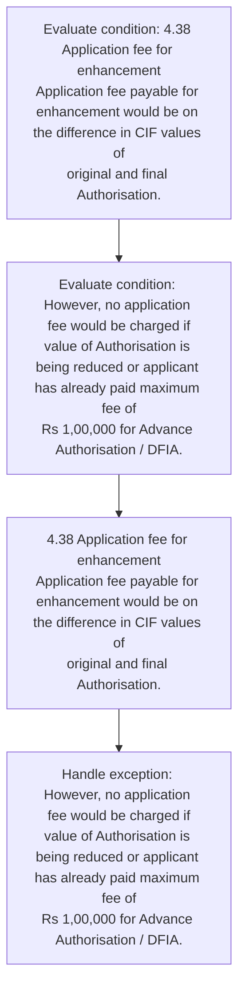
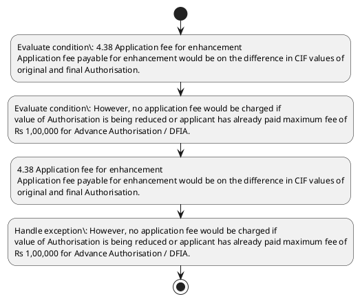

# Chapter 4 / Section 4.38: Application fee for enhancement

**Chapter Title:** Duty Exemption / Remission Schemes

**Pages:** 21

**Purpose:** 4.38 Application fee for enhancement
Application fee payable for enhancement would be on the difference in CIF values of
original and final Authorisation.

**Purpose Thanglish:** Indha Application fee for enhancement section-la, 4.38 application fee for enhancement
application fee payable for enhancement would be on the difference in CIF values of
original and final Authorisation.

**Summary:** 4.38 Application fee for enhancement
Application fee payable for enhancement would be on the difference in CIF values of
original and final Authorisation. However, no application fee would be charged if
value of Authorisation is being reduced or applicant has already paid maximum fee of
Rs 1,00,000 for Advance Authorisation / DFIA.

**Business Meaning:** 4.38 Application fee for enhancement
Application fee payable for enhancement would be on the difference in CIF values of
original and final Authorisation.

**Business Explanation:** 4.38 Application fee for enhancement
Application fee payable for enhancement would be on the difference in CIF values of
original and final Authorisation. However, no application fee would be charged if
value of Authorisation is being reduced or applicant has already paid maximum fee of
Rs 1,00,000 for Advance Authorisation / DFIA.

**Business Explanation Thanglish:** Indha Application fee for enhancement section-la, 4.38 application fee for enhancement
application fee payable for enhancement would be on the difference in CIF values of
original and final Authorisation. However, no application fee would be charged if
value of Authorisation is being reduced or applicant has already paid maximum fee of
Rs 1,00,000 for Advance Authorisation / DFIA.

## Business Logic
- None identified

## Business Rules
- rule_id=CH4-SEC4_38-R001, rule_description=IF validations pass THEN recommend action: 4.38 Application fee for enhancement
Application fee payable for enhancement would be on the difference in CIF values of
original and final Authorisation., trigger=Application fee for enhancement, condition=4.38 Application fee for enhancement
Application fee payable for enhancement would be on the difference in CIF values of
original and final Authorisation., validation=Not explicitly covered in uploaded documents., action=4.38 Application fee for enhancement
Application fee payable for enhancement would be on the difference in CIF values of
original and final Authorisation., exception=However, no application fee would be charged if
value of Authorisation is being reduced or applicant has already paid maximum fee of
Rs 1,00,000 for Advance Authorisation / DFIA., output=DEKAI should produce a compliance decision for 4.38 - Application fee for enhancement.

## Conditions
- 4.38 Application fee for enhancement
Application fee payable for enhancement would be on the difference in CIF values of
original and final Authorisation.
- However, no application fee would be charged if
value of Authorisation is being reduced or applicant has already paid maximum fee of
Rs 1,00,000 for Advance Authorisation / DFIA.

## Condition Logic
- id=4.4.38.1, if=4.38 Application fee for enhancement
Application fee payable for enhancement would be on the difference in CIF values of
original and final Authorisation., then=4.38 Application fee for enhancement
Application fee payable for enhancement would be on the difference in CIF values of
original and final Authorisation., source=4.38 Application fee for enhancement
Application fee payable for enhancement would be on the difference in CIF values of
original and final Authorisation.
- id=4.4.38.2, if=However, no application fee would be charged if
value of Authorisation is being reduced or applicant has already paid maximum fee of
Rs 1,00,000 for Advance Authorisation / DFIA., then=4.38 Application fee for enhancement
Application fee payable for enhancement would be on the difference in CIF values of
original and final Authorisation., source=However, no application fee would be charged if
value of Authorisation is being reduced or applicant has already paid maximum fee of
Rs 1,00,000 for Advance Authorisation / DFIA.

## Validations
- None identified

## Exceptions
- However, no application fee would be charged if
value of Authorisation is being reduced or applicant has already paid maximum fee of
Rs 1,00,000 for Advance Authorisation / DFIA.

## Dependencies
- None identified

## Authorities
- None identified

## Required Documents
- 4.38 Application fee for enhancement
Application fee payable for enhancement would be on the difference in CIF values of
original and final Authorisation.
- However, no application fee would be charged if
value of Authorisation is being reduced or applicant has already paid maximum fee of
Rs 1,00,000 for Advance Authorisation / DFIA.

## Timelines
- None identified

## Actions
- 4.38 Application fee for enhancement
Application fee payable for enhancement would be on the difference in CIF values of
original and final Authorisation.

## Workflow
- Evaluate condition: 4.38 Application fee for enhancement
Application fee payable for enhancement would be on the difference in CIF values of
original and final Authorisation.
- Evaluate condition: However, no application fee would be charged if
value of Authorisation is being reduced or applicant has already paid maximum fee of
Rs 1,00,000 for Advance Authorisation / DFIA.
- 4.38 Application fee for enhancement
Application fee payable for enhancement would be on the difference in CIF values of
original and final Authorisation.
- Handle exception: However, no application fee would be charged if
value of Authorisation is being reduced or applicant has already paid maximum fee of
Rs 1,00,000 for Advance Authorisation / DFIA.

## Workflow ASCII
```text
Application fee for enhancement
Evaluate condition: 4.38 Application fee for enhancement
Application fee payable for enhancement would be on the difference in CIF values of
original and final Authorisation.
   |
   v
Evaluate condition: However, no application fee would be charged if
value of Authorisation is being reduced or applicant has already paid maximum fee of
Rs 1,00,000 for Advance Authorisation / DFIA.
   |
   v
4.38 Application fee for enhancement
Application fee payable for enhancement would be on the difference in CIF values of
original and final Authorisation.
   |
   v
Handle exception: However, no application fee would be charged if
value of Authorisation is being reduced or applicant has already paid maximum fee of
Rs 1,00,000 for Advance Authorisation / DFIA.
```

## Decision Tree
- IF 4.38 Application fee for enhancement
Application fee payable for enhancement would be on the difference in CIF values of
original and final Authorisation. THEN 4.38 Application fee for enhancement
Application fee payable for enhancement would be on the difference in CIF values of
original and final Authorisation.
- IF However, no application fee would be charged if
value of Authorisation is being reduced or applicant has already paid maximum fee of
Rs 1,00,000 for Advance Authorisation / DFIA. THEN 4.38 Application fee for enhancement
Application fee payable for enhancement would be on the difference in CIF values of
original and final Authorisation.
- IF exception applies (However, no application fee would be charged if
value of Authorisation is being reduced or applicant has already paid maximum fee of
Rs 1,00,000 for Advance Authorisation / DFIA.) THEN route to manual review

## Decision Tree ASCII
```text
Application fee for enhancement Decision
IF 4.38 Application fee for enhancement
Application fee payable for enhancement would be on the difference in CIF values of
original and final Authorisation. THEN 4.38 Application fee for enhancement
Application fee payable for enhancement would be on the difference in CIF values of
original and final Authorisation.
   |
   v
IF However, no application fee would be charged if
value of Authorisation is being reduced or applicant has already paid maximum fee of
Rs 1,00,000 for Advance Authorisation / DFIA. THEN 4.38 Application fee for enhancement
Application fee payable for enhancement would be on the difference in CIF values of
original and final Authorisation.
   |
   v
IF exception applies (However, no application fee would be charged if
value of Authorisation is being reduced or applicant has already paid maximum fee of
Rs 1,00,000 for Advance Authorisation / DFIA.) THEN route to manual review
```

## Examples
- User asks to process Application fee for enhancement; the platform checks conditions, validations, and documents before action.

**Real-world Example:** Example: an importer or exporter invokes Application fee for enhancement, submits 4.38 Application fee for enhancement
Application fee payable for enhancement would be on the difference in CIF values of
original and final Authorisation., However, no application fee would be charged if
value of Authorisation is being reduced or applicant has already paid maximum fee of
Rs 1,00,000 for Advance Authorisation / DFIA., and DEKAI uses the extracted rules to 4.38 application fee for enhancement
application fee payable for enhancement would be on the difference in cif values of
original and final authorisation..

**Real-world Example Thanglish:** Indha Application fee for enhancement section-la, Example: an importer or exporter invokes application fee for enhancement, submits 4.38 application fee for enhancement
application fee payable for enhancement would be on the difference in CIF values of
original and final Authorisation., However, no application fee would be charged if
value of Authorisation is being reduced or applicant has already paid maximum fee of
Rs 1,00,000 for Advance Authorisation / DFIA., and DEKAI uses the extracted rules to 4.38 application fee for enhancement
application fee payable for enhancement would be on the difference in cif values of
original and final authorisation..

## AI Rules
- IF validations pass THEN recommend action: 4.38 Application fee for enhancement
Application fee payable for enhancement would be on the difference in CIF values of
original and final Authorisation.

## Database Fields
- name=section_code, type=string, required=True, source=parsed_section_heading
- name=section_title, type=string, required=True, source=parsed_section_heading
- name=fee_flag, type=boolean, required=False, source=keyword:fee
- name=for_flag, type=boolean, required=False, source=keyword:for
- name=the_flag, type=boolean, required=False, source=keyword:the
- name=cif_flag, type=boolean, required=False, source=keyword:CIF
- name=and_flag, type=boolean, required=False, source=keyword:and
- name=has_flag, type=boolean, required=False, source=keyword:has
- name=paid_flag, type=boolean, required=False, source=keyword:paid
- name=dfia_flag, type=boolean, required=False, source=keyword:DFIA
- name=document_1_submitted, type=boolean, required=True, source=4.38 Application fee for enhancement
Application fee payable for enhancement would be on the difference in CIF values of
original and final Authorisation.
- name=document_2_submitted, type=boolean, required=True, source=However, no application fee would be charged if
value of Authorisation is being reduced or applicant has already paid maximum fee of
Rs 1,00,000 for Advance Authorisation / DFIA.

## API Requirements
- method=GET, path=/api/dgft/sections/4.38, purpose=Retrieve knowledge payload for section 4.38, query_params=['include=workflow,decision_tree,validations'], response_fields=['section', 'title', 'summary', 'conditions', 'validations', 'exceptions', 'workflow', 'decision_tree']
- method=POST, path=/api/dgft/Application-fee-for-enhancement/validate, purpose=Validate inputs and documents for Application fee for enhancement, request_fields=['section_code', 'section_title', 'document_1_submitted', 'document_2_submitted'], response_fields=['status', 'errors', 'warnings', 'next_actions']
- method=POST, path=/api/dgft/Application-fee-for-enhancement/execute, purpose=Trigger business action for 4.38 Application fee for enhancement
Application fee payable for enhancement would be on the difference in CIF values of
original and final Authorisation., request_fields=['section_code', 'section_title', 'document_1_submitted', 'document_2_submitted'], response_fields=['reference_id', 'status', 'authority', 'timeline']

## UI Screens
- screen_id=Application_fee_for_enhancement_overview, name=Application fee for enhancement Overview, purpose=Show section summary, authority, timeline, and eligibility cues., widgets=['summary_card', 'conditions_table', 'authority_badges', 'timeline_panel']
- screen_id=Application_fee_for_enhancement_submission, name=Application fee for enhancement Submission, purpose=Capture applicant data and supporting documents., widgets=['dynamic_form', 'document_uploader', 'validation_panel', 'next_action_footer'], fields=['section_code', 'section_title', 'fee_flag', 'for_flag', 'the_flag', 'cif_flag', 'and_flag', 'has_flag']
- screen_id=Application_fee_for_enhancement_exceptions, name=Application fee for enhancement Exception Review, purpose=Explain exception handling and manual review triggers., widgets=['exception_banner', 'decision_tree', 'case_notes']

## Error Messages
- Validation failed because the section requirements were not fully met.

## FAQ
- question_en=What is the purpose of section 4.38?, answer_en=4.38 Application fee for enhancement
Application fee payable for enhancement would be on the difference in CIF values of
original and final Authorisation. However, no application fee would be charged if
value of Authorisation is being reduced or applicant has already paid maximum fee of
Rs 1,00,000 for Advance Authorisation / DFIA., question_thanglish=Indha Application fee for enhancement section-la, What is the purpose of section 4.38?, answer_thanglish=Indha Application fee for enhancement section-la, 4.38 application fee for enhancement
application fee payable for enhancement would be on the difference in CIF values of
original and final Authorisation. However, no application fee would be charged if
value of Authorisation is being reduced or applicant has already paid maximum fee of
Rs 1,00,000 for Advance Authorisation / DFIA.
- question_en=What documents are required under Application fee for enhancement?, answer_en=4.38 Application fee for enhancement
Application fee payable for enhancement would be on the difference in CIF values of
original and final Authorisation., However, no application fee would be charged if
value of Authorisation is being reduced or applicant has already paid maximum fee of
Rs 1,00,000 for Advance Authorisation / DFIA., question_thanglish=Indha Application fee for enhancement section-la, What documents are required under application fee for enhancement?, answer_thanglish=Indha Application fee for enhancement section-la, 4.38 application fee for enhancement
application fee payable for enhancement would be on the difference in CIF values of
original and final Authorisation., However, no application fee would be charged if
value of Authorisation is being reduced or applicant has already paid maximum fee of
Rs 1,00,000 for Advance Authorisation / DFIA.
- question_en=Which authority handles Application fee for enhancement?, answer_en=Not explicitly covered in uploaded documents., question_thanglish=Indha Application fee for enhancement section-la, Which authority handles application fee for enhancement?, answer_thanglish=Indha Application fee for enhancement section-la, Not explicitly covered in uploaded documents.

## Questions Users May Ask
- What does Application fee for enhancement require?
- Which documents are needed for Application fee for enhancement?
- How does DEKAI validate Application fee for enhancement requests?
- What action should be taken for Application fee for enhancement?

## Expected AI Answers
- Application fee for enhancement requires the platform to interpret the section text, apply the extracted business rules, and present the correct next action.
- Required documents are inferred from the section text: 4.38 Application fee for enhancement
Application fee payable for enhancement would be on the difference in CIF values of
original and final Authorisation., However, no application fee would be charged if
value of Authorisation is being reduced or applicant has already paid maximum fee of
Rs 1,00,000 for Advance Authorisation / DFIA.
- DEKAI validates Application fee for enhancement by checking conditions, required documents, authority references, and exception clauses before recommending an outcome.
- The primary extracted action is: 4.38 Application fee for enhancement
Application fee payable for enhancement would be on the difference in CIF values of
original and final Authorisation.

## AI Q&A Examples
- question_en=User asks: How do I comply with Application fee for enhancement?, answer_en=AI answers: DEKAI should evaluate section 4.38, apply the extracted rules, and guide the user through Evaluate condition: 4.38 Application fee for enhancement
Application fee payable for enhancement would be on the difference in CIF values of
original and final Authorisation.., question_thanglish=Indha Application fee for enhancement section-la, User asks: How do I comply with application fee for enhancement?, answer_thanglish=Indha Application fee for enhancement section-la, AI answers: DEKAI should evaluate section 4.38, apply the extracted rules, and guide the user through Evaluate condition: 4.38 application fee for enhancement
application fee payable for enhancement would be on the difference in CIF values of
original and final Authorisation..
- question_en=User asks: Which validations apply to Application fee for enhancement?, answer_en=AI answers: Applicable validations are not explicitly covered in the uploaded documents., question_thanglish=Indha Application fee for enhancement section-la, User asks: Which validations apply to application fee for enhancement?, answer_thanglish=Indha Application fee for enhancement section-la, AI answers: Applicable validations are not explicitly covered in the uploaded documents.

## DEKAI AI Implementation Notes
- Capture chapter 4, section 4.38, title, and page references as immutable knowledge metadata.
- Bind validations for Application fee for enhancement into a rule engine keyed by the rule IDs extracted for this section.
- Expose document upload controls for: 4.38 Application fee for enhancement
Application fee payable for enhancement would be on the difference in CIF values of
original and final Authorisation., However, no application fee would be charged if
value of Authorisation is being reduced or applicant has already paid maximum fee of
Rs 1,00,000 for Advance Authorisation / DFIA..
- Trigger manual review when exception clauses are detected.

## DEKAI AI Implementation Notes Thanglish
- Indha Application fee for enhancement section-la, Capture chapter 4, section 4.38, title, and page references as immutable knowledge metadata.
- Indha Application fee for enhancement section-la, Bind validations for application fee for enhancement into a rule engine keyed by the rule IDs extracted for this section.
- Indha Application fee for enhancement section-la, Expose document upload controls for: 4.38 application fee for enhancement
application fee payable for enhancement would be on the difference in CIF values of
original and final Authorisation., However, no application fee would be charged if
value of Authorisation is being reduced or applicant has already paid maximum fee of
Rs 1,00,000 for Advance Authorisation / DFIA..
- Indha Application fee for enhancement section-la, Trigger manual review when exception clauses are detected.

## AI Metadata
- Keywords: fee, for, the, CIF, and, has, paid, DFIA, would, final, value, being, values, payable, However, charged, reduced, already, maximum, Advance
- Search Keywords: fee, for, the, CIF, and, has, paid, DFIA, would, final, value, being, values, payable, However, charged, reduced, already, maximum, Advance
- Intent: Support Application fee for enhancement processing and compliance validation.
- Tags: 4.38, Application fee for enhancement, document-driven, dgft
- Related Sections: 
- Related Chapters: 
- Related Rules: 

## Mermaid


## PlantUML

