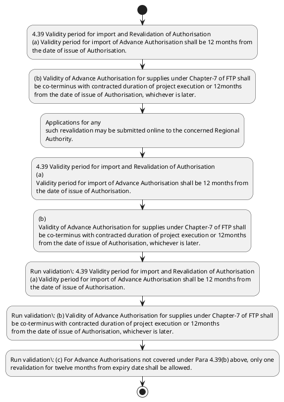

# Chapter 4 / Section 4.39: Validity period for import and Revalidation of Authorisation

**Chapter Title:** Duty Exemption / Remission Schemes

**Pages:** 21

**Purpose:** 4.39 Validity period for import and Revalidation of Authorisation
(a) Validity period for import of Advance Authorisation shall be 12 months from
the date of issue of Authorisation.

**Purpose Thanglish:** Indha Validity period for import and Revalidation of Authorisation section-la, 4.39 Validity period for import and Revalidation of Authorisation
(a) Validity period for import of Advance Authorisation kandippa be 12 months from
the date of issue of Authorisation.

**Summary:** 4.39 Validity period for import and Revalidation of Authorisation
(a) Validity period for import of Advance Authorisation shall be 12 months from
the date of issue of Authorisation. (b) Validity of Advance Authorisation for supplies under Chapter-7 of FTP shall
be co-terminus with contracted duration of project execution or 12months
from the date of issue of Authorisation, whichever is later. (c) For Advance Authorisations not covered under Para 4.39(b) above, only one
revalidation for twelve months from expiry date shall be allowed.

**Business Meaning:** Validity period for import and Revalidation of Authorisation governs how DGFT business controls should be applied, validated, and enforced.

**Business Explanation:** Validity period for import and Revalidation of Authorisation explains the operating rule set that DEKAI should enforce. Key control points include 4.39 Validity period for import and Revalidation of Authorisation
(a) Validity period for import of Advance Authorisation shall be 12 months from
the date of issue of Authorisation. The section also drives actions such as 4.39 Validity period for import and Revalidation of Authorisation
(a) Validity period for import of Advance Authorisation shall be 12 months from
the date of issue of Authorisation..

**Business Explanation Thanglish:** Indha Validity period for import and Revalidation of Authorisation section-la, Validity period for import and Revalidation of Authorisation explains the operating rule set that DEKAI should enforce. Key control points include 4.39 Validity period for import and Revalidation of Authorisation
(a) Validity period for import of Advance Authorisation kandippa be 12 months from
the date of issue of Authorisation. The section also drives actions such as 4.39 Validity period for import and Revalidation of Authorisation
(a) Validity period for import of Advance Authorisation kandippa be 12 months from
the date of issue of Authorisation..

## Business Logic
- 4.39 Validity period for import and Revalidation of Authorisation
(a) Validity period for import of Advance Authorisation shall be 12 months from
the date of issue of Authorisation.
- (b) Validity of Advance Authorisation for supplies under Chapter-7 of FTP shall
be co-terminus with contracted duration of project execution or 12months
from the date of issue of Authorisation, whichever is later.
- (c) For Advance Authorisations not covered under Para 4.39(b) above, only one
revalidation for twelve months from expiry date shall be allowed.
- 4.39 Validity period for import and Revalidation of Authorisation
(a)
Validity period for import of Advance Authorisation shall be 12 months from
the date of issue of Authorisation.
- (b)
Validity of Advance Authorisation for supplies under Chapter-7 of FTP shall
be co-terminus with contracted duration of project execution or 12months
from the date of issue of Authorisation, whichever is later.
- (c)
For Advance Authorisations not covered under Para 4.39(b) above, only one
revalidation for twelve months from expiry date shall be allowed.

## Business Rules
- rule_id=CH4-SEC4_39-R001, rule_description=4.39 Validity period for import and Revalidation of Authorisation
(a) Validity period for import of Advance Authorisation shall be 12 months from
the date of issue of Authorisation., trigger=Validity period for import and Revalidation of Authorisation, condition=Section 4.39 is applicable, validation=4.39 Validity period for import and Revalidation of Authorisation
(a) Validity period for import of Advance Authorisation shall be 12 months from
the date of issue of Authorisation., action=4.39 Validity period for import and Revalidation of Authorisation
(a) Validity period for import of Advance Authorisation shall be 12 months from
the date of issue of Authorisation., exception=No explicit exception found in uploaded documents., output=DEKAI should produce a compliance decision for 4.39 - Validity period for import and Revalidation of Authorisation.
- rule_id=CH4-SEC4_39-R002, rule_description=(b) Validity of Advance Authorisation for supplies under Chapter-7 of FTP shall
be co-terminus with contracted duration of project execution or 12months
from the date of issue of Authorisation, whichever is later., trigger=Validity period for import and Revalidation of Authorisation, condition=Section 4.39 is applicable, validation=(b) Validity of Advance Authorisation for supplies under Chapter-7 of FTP shall
be co-terminus with contracted duration of project execution or 12months
from the date of issue of Authorisation, whichever is later., action=(b) Validity of Advance Authorisation for supplies under Chapter-7 of FTP shall
be co-terminus with contracted duration of project execution or 12months
from the date of issue of Authorisation, whichever is later., exception=No explicit exception found in uploaded documents., output=DEKAI should produce a compliance decision for 4.39 - Validity period for import and Revalidation of Authorisation.
- rule_id=CH4-SEC4_39-R003, rule_description=(c) For Advance Authorisations not covered under Para 4.39(b) above, only one
revalidation for twelve months from expiry date shall be allowed., trigger=Validity period for import and Revalidation of Authorisation, condition=Section 4.39 is applicable, validation=(c) For Advance Authorisations not covered under Para 4.39(b) above, only one
revalidation for twelve months from expiry date shall be allowed., action=Applications for any
such revalidation may be submitted online to the concerned Regional
Authority., exception=No explicit exception found in uploaded documents., output=DEKAI should produce a compliance decision for 4.39 - Validity period for import and Revalidation of Authorisation.
- rule_id=CH4-SEC4_39-R004, rule_description=4.39 Validity period for import and Revalidation of Authorisation
(a)
Validity period for import of Advance Authorisation shall be 12 months from
the date of issue of Authorisation., trigger=Validity period for import and Revalidation of Authorisation, condition=Section 4.39 is applicable, validation=4.39 Validity period for import and Revalidation of Authorisation
(a)
Validity period for import of Advance Authorisation shall be 12 months from
the date of issue of Authorisation., action=4.39 Validity period for import and Revalidation of Authorisation
(a)
Validity period for import of Advance Authorisation shall be 12 months from
the date of issue of Authorisation., exception=No explicit exception found in uploaded documents., output=DEKAI should produce a compliance decision for 4.39 - Validity period for import and Revalidation of Authorisation.
- rule_id=CH4-SEC4_39-R005, rule_description=(b)
Validity of Advance Authorisation for supplies under Chapter-7 of FTP shall
be co-terminus with contracted duration of project execution or 12months
from the date of issue of Authorisation, whichever is later., trigger=Validity period for import and Revalidation of Authorisation, condition=Section 4.39 is applicable, validation=(b)
Validity of Advance Authorisation for supplies under Chapter-7 of FTP shall
be co-terminus with contracted duration of project execution or 12months
from the date of issue of Authorisation, whichever is later., action=(b)
Validity of Advance Authorisation for supplies under Chapter-7 of FTP shall
be co-terminus with contracted duration of project execution or 12months
from the date of issue of Authorisation, whichever is later., exception=No explicit exception found in uploaded documents., output=DEKAI should produce a compliance decision for 4.39 - Validity period for import and Revalidation of Authorisation.
- rule_id=CH4-SEC4_39-R006, rule_description=(c)
For Advance Authorisations not covered under Para 4.39(b) above, only one
revalidation for twelve months from expiry date shall be allowed., trigger=Validity period for import and Revalidation of Authorisation, condition=Section 4.39 is applicable, validation=(c)
For Advance Authorisations not covered under Para 4.39(b) above, only one
revalidation for twelve months from expiry date shall be allowed., action=(b)
Validity of Advance Authorisation for supplies under Chapter-7 of FTP shall
be co-terminus with contracted duration of project execution or 12months
from the date of issue of Authorisation, whichever is later., exception=No explicit exception found in uploaded documents., output=DEKAI should produce a compliance decision for 4.39 - Validity period for import and Revalidation of Authorisation.

## Conditions
- None identified

## Condition Logic
- id=4.4.39.1, if=Section 4.39 is applicable, then=4.39 Validity period for import and Revalidation of Authorisation
(a) Validity period for import of Advance Authorisation shall be 12 months from
the date of issue of Authorisation., source=Derived from uploaded documents

## Validations
- 4.39 Validity period for import and Revalidation of Authorisation
(a) Validity period for import of Advance Authorisation shall be 12 months from
the date of issue of Authorisation.
- (b) Validity of Advance Authorisation for supplies under Chapter-7 of FTP shall
be co-terminus with contracted duration of project execution or 12months
from the date of issue of Authorisation, whichever is later.
- (c) For Advance Authorisations not covered under Para 4.39(b) above, only one
revalidation for twelve months from expiry date shall be allowed.
- 4.39 Validity period for import and Revalidation of Authorisation
(a)
Validity period for import of Advance Authorisation shall be 12 months from
the date of issue of Authorisation.
- (b)
Validity of Advance Authorisation for supplies under Chapter-7 of FTP shall
be co-terminus with contracted duration of project execution or 12months
from the date of issue of Authorisation, whichever is later.
- (c)
For Advance Authorisations not covered under Para 4.39(b) above, only one
revalidation for twelve months from expiry date shall be allowed.

## Exceptions
- None identified

## Dependencies
- None identified

## Authorities
- None identified

## Required Documents
- Applications for any
such revalidation may be submitted online to the concerned Regional
Authority.

## Timelines
- 4.39 Validity period for import and Revalidation of Authorisation
(a) Validity period for import of Advance Authorisation shall be 12 months from
the date of issue of Authorisation.
- (b) Validity of Advance Authorisation for supplies under Chapter-7 of FTP shall
be co-terminus with contracted duration of project execution or 12months
from the date of issue of Authorisation, whichever is later.
- (c) For Advance Authorisations not covered under Para 4.39(b) above, only one
revalidation for twelve months from expiry date shall be allowed.
- 4.39 Validity period for import and Revalidation of Authorisation
(a)
Validity period for import of Advance Authorisation shall be 12 months from
the date of issue of Authorisation.
- (b)
Validity of Advance Authorisation for supplies under Chapter-7 of FTP shall
be co-terminus with contracted duration of project execution or 12months
from the date of issue of Authorisation, whichever is later.
- (c)
For Advance Authorisations not covered under Para 4.39(b) above, only one
revalidation for twelve months from expiry date shall be allowed.

## Actions
- 4.39 Validity period for import and Revalidation of Authorisation
(a) Validity period for import of Advance Authorisation shall be 12 months from
the date of issue of Authorisation.
- (b) Validity of Advance Authorisation for supplies under Chapter-7 of FTP shall
be co-terminus with contracted duration of project execution or 12months
from the date of issue of Authorisation, whichever is later.
- Applications for any
such revalidation may be submitted online to the concerned Regional
Authority.
- 4.39 Validity period for import and Revalidation of Authorisation
(a)
Validity period for import of Advance Authorisation shall be 12 months from
the date of issue of Authorisation.
- (b)
Validity of Advance Authorisation for supplies under Chapter-7 of FTP shall
be co-terminus with contracted duration of project execution or 12months
from the date of issue of Authorisation, whichever is later.

## Workflow
- 4.39 Validity period for import and Revalidation of Authorisation
(a) Validity period for import of Advance Authorisation shall be 12 months from
the date of issue of Authorisation.
- (b) Validity of Advance Authorisation for supplies under Chapter-7 of FTP shall
be co-terminus with contracted duration of project execution or 12months
from the date of issue of Authorisation, whichever is later.
- Applications for any
such revalidation may be submitted online to the concerned Regional
Authority.
- 4.39 Validity period for import and Revalidation of Authorisation
(a)
Validity period for import of Advance Authorisation shall be 12 months from
the date of issue of Authorisation.
- (b)
Validity of Advance Authorisation for supplies under Chapter-7 of FTP shall
be co-terminus with contracted duration of project execution or 12months
from the date of issue of Authorisation, whichever is later.
- Run validation: 4.39 Validity period for import and Revalidation of Authorisation
(a) Validity period for import of Advance Authorisation shall be 12 months from
the date of issue of Authorisation.
- Run validation: (b) Validity of Advance Authorisation for supplies under Chapter-7 of FTP shall
be co-terminus with contracted duration of project execution or 12months
from the date of issue of Authorisation, whichever is later.
- Run validation: (c) For Advance Authorisations not covered under Para 4.39(b) above, only one
revalidation for twelve months from expiry date shall be allowed.

## Workflow ASCII
```text
Validity period for import and Revalidation of Authorisation
4.39 Validity period for import and Revalidation of Authorisation
(a) Validity period for import of Advance Authorisation shall be 12 months from
the date of issue of Authorisation.
   |
   v
(b) Validity of Advance Authorisation for supplies under Chapter-7 of FTP shall
be co-terminus with contracted duration of project execution or 12months
from the date of issue of Authorisation, whichever is later.
   |
   v
Applications for any
such revalidation may be submitted online to the concerned Regional
Authority.
   |
   v
4.39 Validity period for import and Revalidation of Authorisation
(a)
Validity period for import of Advance Authorisation shall be 12 months from
the date of issue of Authorisation.
   |
   v
(b)
Validity of Advance Authorisation for supplies under Chapter-7 of FTP shall
be co-terminus with contracted duration of project execution or 12months
from the date of issue of Authorisation, whichever is later.
   |
   v
Run validation: 4.39 Validity period for import and Revalidation of Authorisation
(a) Validity period for import of Advance Authorisation shall be 12 months from
the date of issue of Authorisation.
   |
   v
Run validation: (b) Validity of Advance Authorisation for supplies under Chapter-7 of FTP shall
be co-terminus with contracted duration of project execution or 12months
from the date of issue of Authorisation, whichever is later.
   |
   v
Run validation: (c) For Advance Authorisations not covered under Para 4.39(b) above, only one
revalidation for twelve months from expiry date shall be allowed.
```

## Decision Tree
- IF section 4.39 applies THEN 4.39 Validity period for import and Revalidation of Authorisation
(a) Validity period for import of Advance Authorisation shall be 12 months from
the date of issue of Authorisation.

## Decision Tree ASCII
```text
Validity period for import and Revalidation of Authorisation Decision
IF section 4.39 applies THEN 4.39 Validity period for import and Revalidation of Authorisation
(a) Validity period for import of Advance Authorisation shall be 12 months from
the date of issue of Authorisation.
```

## Examples
- User asks to process Validity period for import and Revalidation of Authorisation; the platform checks conditions, validations, and documents before action.

**Real-world Example:** Example: an importer or exporter invokes Validity period for import and Revalidation of Authorisation, submits Applications for any
such revalidation may be submitted online to the concerned Regional
Authority., and DEKAI uses the extracted rules to 4.39 validity period for import and revalidation of authorisation
(a) validity period for import of advance authorisation shall be 12 months from
the date of issue of authorisation..

**Real-world Example Thanglish:** Indha Validity period for import and Revalidation of Authorisation section-la, Example: an importer or exporter invokes Validity period for import and Revalidation of Authorisation, submits Applications for any
such revalidation may be submitted online to the concerned Regional
authority., and DEKAI uses the extracted rules to 4.39 validity period for import and revalidation of authorisation
(a) validity period for import of advance authorisation kandippa be 12 months from
the date of issue of authorisation..

## AI Rules
- IF detected context matches section rule THEN enforce: 4.39 Validity period for import and Revalidation of Authorisation
(a) Validity period for import of Advance Authorisation shall be 12 months from
the date of issue of Authorisation.
- IF detected context matches section rule THEN enforce: (b) Validity of Advance Authorisation for supplies under Chapter-7 of FTP shall
be co-terminus with contracted duration of project execution or 12months
from the date of issue of Authorisation, whichever is later.
- IF detected context matches section rule THEN enforce: (c) For Advance Authorisations not covered under Para 4.39(b) above, only one
revalidation for twelve months from expiry date shall be allowed.
- IF detected context matches section rule THEN enforce: 4.39 Validity period for import and Revalidation of Authorisation
(a)
Validity period for import of Advance Authorisation shall be 12 months from
the date of issue of Authorisation.
- IF detected context matches section rule THEN enforce: (b)
Validity of Advance Authorisation for supplies under Chapter-7 of FTP shall
be co-terminus with contracted duration of project execution or 12months
from the date of issue of Authorisation, whichever is later.
- IF detected context matches section rule THEN enforce: (c)
For Advance Authorisations not covered under Para 4.39(b) above, only one
revalidation for twelve months from expiry date shall be allowed.
- IF validations pass THEN recommend action: 4.39 Validity period for import and Revalidation of Authorisation
(a) Validity period for import of Advance Authorisation shall be 12 months from
the date of issue of Authorisation.

## Database Fields
- name=section_code, type=string, required=True, source=parsed_section_heading
- name=section_title, type=string, required=True, source=parsed_section_heading
- name=for_flag, type=boolean, required=False, source=keyword:for
- name=and_flag, type=boolean, required=False, source=keyword:and
- name=the_flag, type=boolean, required=False, source=keyword:the
- name=ftp_flag, type=boolean, required=False, source=keyword:FTP
- name=not_flag, type=boolean, required=False, source=keyword:not
- name=one_flag, type=boolean, required=False, source=keyword:one
- name=any_flag, type=boolean, required=False, source=keyword:any
- name=may_flag, type=boolean, required=False, source=keyword:may
- name=document_1_submitted, type=boolean, required=True, source=Applications for any
such revalidation may be submitted online to the concerned Regional
Authority.

## API Requirements
- method=GET, path=/api/dgft/sections/4.39, purpose=Retrieve knowledge payload for section 4.39, query_params=['include=workflow,decision_tree,validations'], response_fields=['section', 'title', 'summary', 'conditions', 'validations', 'exceptions', 'workflow', 'decision_tree']
- method=POST, path=/api/dgft/Validity-period-for-import-and-Revalidation-of-Authorisation/validate, purpose=Validate inputs and documents for Validity period for import and Revalidation of Authorisation, request_fields=['section_code', 'section_title', 'document_1_submitted'], response_fields=['status', 'errors', 'warnings', 'next_actions']
- method=POST, path=/api/dgft/Validity-period-for-import-and-Revalidation-of-Authorisation/execute, purpose=Trigger business action for 4.39 Validity period for import and Revalidation of Authorisation
(a) Validity period for import of Advance Authorisation shall be 12 months from
the date of issue of Authorisation., request_fields=['section_code', 'section_title', 'document_1_submitted'], response_fields=['reference_id', 'status', 'authority', 'timeline']

## UI Screens
- screen_id=Validity_period_for_import_and_Revalidation_of_Authorisation_overview, name=Validity period for import and Revalidation of Authorisation Overview, purpose=Show section summary, authority, timeline, and eligibility cues., widgets=['summary_card', 'conditions_table', 'authority_badges', 'timeline_panel']
- screen_id=Validity_period_for_import_and_Revalidation_of_Authorisation_submission, name=Validity period for import and Revalidation of Authorisation Submission, purpose=Capture applicant data and supporting documents., widgets=['dynamic_form', 'document_uploader', 'validation_panel', 'next_action_footer'], fields=['section_code', 'section_title', 'for_flag', 'and_flag', 'the_flag', 'ftp_flag', 'not_flag', 'one_flag']

## Error Messages
- Validation failed because the section requirements were not fully met.

## FAQ
- question_en=What is the purpose of section 4.39?, answer_en=Validity period for import and Revalidation of Authorisation explains the operating rule set that DEKAI should enforce. Key control points include 4.39 Validity period for import and Revalidation of Authorisation
(a) Validity period for import of Advance Authorisation shall be 12 months from
the date of issue of Authorisation. The section also drives actions such as 4.39 Validity period for import and Revalidation of Authorisation
(a) Validity period for import of Advance Authorisation shall be 12 months from
the date of issue of Authorisation.., question_thanglish=Indha Validity period for import and Revalidation of Authorisation section-la, What is the purpose of section 4.39?, answer_thanglish=Indha Validity period for import and Revalidation of Authorisation section-la, Validity period for import and Revalidation of Authorisation explains the operating rule set that DEKAI should enforce. Key control points include 4.39 Validity period for import and Revalidation of Authorisation
(a) Validity period for import of Advance Authorisation kandippa be 12 months from
the date of issue of Authorisation. The section also drives actions such as 4.39 Validity period for import and Revalidation of Authorisation
(a) Validity period for import of Advance Authorisation kandippa be 12 months from
the date of issue of Authorisation..
- question_en=What documents are required under Validity period for import and Revalidation of Authorisation?, answer_en=Applications for any
such revalidation may be submitted online to the concerned Regional
Authority., question_thanglish=Indha Validity period for import and Revalidation of Authorisation section-la, What documents are required under Validity period for import and Revalidation of Authorisation?, answer_thanglish=Indha Validity period for import and Revalidation of Authorisation section-la, Applications for any
such revalidation may be submitted online to the concerned Regional
authority.
- question_en=Which authority handles Validity period for import and Revalidation of Authorisation?, answer_en=Not explicitly covered in uploaded documents., question_thanglish=Indha Validity period for import and Revalidation of Authorisation section-la, Which authority handles Validity period for import and Revalidation of Authorisation?, answer_thanglish=Indha Validity period for import and Revalidation of Authorisation section-la, Not explicitly covered in uploaded documents.

## Questions Users May Ask
- What does Validity period for import and Revalidation of Authorisation require?
- Which documents are needed for Validity period for import and Revalidation of Authorisation?
- How does DEKAI validate Validity period for import and Revalidation of Authorisation requests?
- What action should be taken for Validity period for import and Revalidation of Authorisation?

## Expected AI Answers
- Validity period for import and Revalidation of Authorisation requires the platform to interpret the section text, apply the extracted business rules, and present the correct next action.
- Required documents are inferred from the section text: Applications for any
such revalidation may be submitted online to the concerned Regional
Authority.
- DEKAI validates Validity period for import and Revalidation of Authorisation by checking conditions, required documents, authority references, and exception clauses before recommending an outcome.
- The primary extracted action is: 4.39 Validity period for import and Revalidation of Authorisation
(a) Validity period for import of Advance Authorisation shall be 12 months from
the date of issue of Authorisation.

## AI Q&A Examples
- question_en=User asks: How do I comply with Validity period for import and Revalidation of Authorisation?, answer_en=AI answers: DEKAI should evaluate section 4.39, apply the extracted rules, and guide the user through 4.39 Validity period for import and Revalidation of Authorisation
(a) Validity period for import of Advance Authorisation shall be 12 months from
the date of issue of Authorisation.., question_thanglish=Indha Validity period for import and Revalidation of Authorisation section-la, User asks: How do I comply with Validity period for import and Revalidation of Authorisation?, answer_thanglish=Indha Validity period for import and Revalidation of Authorisation section-la, AI answers: DEKAI should evaluate section 4.39, apply the extracted rules, and guide the user through 4.39 Validity period for import and Revalidation of Authorisation
(a) Validity period for import of Advance Authorisation kandippa be 12 months from
the date of issue of Authorisation..
- question_en=User asks: Which validations apply to Validity period for import and Revalidation of Authorisation?, answer_en=AI answers: Applicable validations are 4.39 Validity period for import and Revalidation of Authorisation
(a) Validity period for import of Advance Authorisation shall be 12 months from
the date of issue of Authorisation., (b) Validity of Advance Authorisation for supplies under Chapter-7 of FTP shall
be co-terminus with contracted duration of project execution or 12months
from the date of issue of Authorisation, whichever is later., (c) For Advance Authorisations not covered under Para 4.39(b) above, only one
revalidation for twelve months from expiry date shall be allowed., question_thanglish=Indha Validity period for import and Revalidation of Authorisation section-la, User asks: Which validations apply to Validity period for import and Revalidation of Authorisation?, answer_thanglish=Indha Validity period for import and Revalidation of Authorisation section-la, AI answers: Applicable validations are 4.39 Validity period for import and Revalidation of Authorisation
(a) Validity period for import of Advance Authorisation kandippa be 12 months from
the date of issue of Authorisation., (b) Validity of Advance Authorisation for supplies under Chapter-7 of FTP kandippa
be co-terminus with contracted duration of project execution or 12months
from the date of issue of Authorisation, whichever is later., (c) For Advance Authorisations not covered under Para 4.39(b) above, only one
revalidation for twelve months from expiry date kandippa be allowed.

## DEKAI AI Implementation Notes
- Capture chapter 4, section 4.39, title, and page references as immutable knowledge metadata.
- Bind validations for Validity period for import and Revalidation of Authorisation into a rule engine keyed by the rule IDs extracted for this section.
- Expose document upload controls for: Applications for any
such revalidation may be submitted online to the concerned Regional
Authority..

## DEKAI AI Implementation Notes Thanglish
- Indha Validity period for import and Revalidation of Authorisation section-la, Capture chapter 4, section 4.39, title, and page references as immutable knowledge metadata.
- Indha Validity period for import and Revalidation of Authorisation section-la, Bind validations for Validity period for import and Revalidation of Authorisation into a rule engine keyed by the rule IDs extracted for this section.
- Indha Validity period for import and Revalidation of Authorisation section-la, Expose document upload controls for: Applications for any
such revalidation may be submitted online to the concerned Regional
authority..

## AI Metadata
- Keywords: for, and, the, FTP, not, one, any, may, from, date, with, Para, only, such, shall, issue, under, later, above, would
- Search Keywords: for, and, the, FTP, not, one, any, may, from, date, with, Para, only, such, shall, issue, under, later, above, would
- Intent: Support Validity period for import and Revalidation of Authorisation processing and compliance validation.
- Tags: 4.39, Validity period for import and Revalidation of Authorisation, business-rule, document-driven, dgft
- Related Sections: 
- Related Chapters: 
- Related Rules: 4.39 Validity period for import and Revalidation of Authorisation
(a) Validity period for import of Advance Authorisation shall be 12 months from
the date of issue of Authorisation., (b) Validity of Advance Authorisation for supplies under Chapter-7 of FTP shall
be co-terminus with contracted duration of project execution or 12months
from the date of issue of Authorisation, whichever is later., (c) For Advance Authorisations not covered under Para 4.39(b) above, only one
revalidation for twelve months from expiry date shall be allowed., 4.39 Validity period for import and Revalidation of Authorisation
(a)
Validity period for import of Advance Authorisation shall be 12 months from
the date of issue of Authorisation., (b)
Validity of Advance Authorisation for supplies under Chapter-7 of FTP shall
be co-terminus with contracted duration of project execution or 12months
from the date of issue of Authorisation, whichever is later.

## Mermaid

```mermaid
flowchart TD
    S1["4.39 Validity period for import and Revalidation of Authorisation
(a) Validity period for import of Advance Authorisation shall be 12 months from
the date of issue of Authorisation."]
    S2["(b) Validity of Advance Authorisation for supplies under Chapter-7 of FTP shall
be co-terminus with contracted duration of project execution or 12months
from the date of issue of Authorisation, whichever is later."]
    S1 --> S2
    S3["Applications for any
such revalidation may be submitted online to the concerned Regional
Authority."]
    S2 --> S3
    S4["4.39 Validity period for import and Revalidation of Authorisation
(a)
Validity period for import of Advance Authorisation shall be 12 months from
the date of issue of Authorisation."]
    S3 --> S4
    S5["(b)
Validity of Advance Authorisation for supplies under Chapter-7 of FTP shall
be co-terminus with contracted duration of project execution or 12months
from the date of issue of Authorisation, whichever is later."]
    S4 --> S5
    S6["Run validation: 4.39 Validity period for import and Revalidation of Authorisation
(a) Validity period for import of Advance Authorisation shall be 12 months from
the date of issue of Authorisation."]
    S5 --> S6
    S7["Run validation: (b) Validity of Advance Authorisation for supplies under Chapter-7 of FTP shall
be co-terminus with contracted duration of project execution or 12months
from the date of issue of Authorisation, whichever is later."]
    S6 --> S7
    S8["Run validation: (c) For Advance Authorisations not covered under Para 4.39(b) above, only one
revalidation for twelve months from expiry date shall be allowed."]
    S7 --> S8
```


## PlantUML

