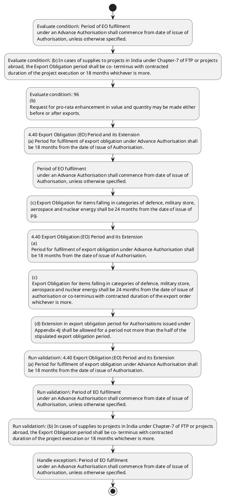

# Chapter 4 / Section 4.40: Export Obligation (EO) Period and its Extension

**Chapter Title:** Duty Exemption / Remission Schemes

**Pages:** 21, 22, 23, 24

**Purpose:** 4.40 Export Obligation (EO) Period and its Extension
(a) Period for fulfilment of export obligation under Advance Authorisation shall
be 18 months from the date of issue of Authorisation.

**Purpose Thanglish:** Indha Export Obligation (EO) Period and its Extension section-la, 4.40 export Obligation (EO) Period and its Extension
(a) Period for fulfilment of export obligation under Advance Authorisation kandippa
be 18 months from the date of issue of Authorisation.

**Summary:** 4.40 Export Obligation (EO) Period and its Extension
(a) Period for fulfilment of export obligation under Advance Authorisation shall
be 18 months from the date of issue of Authorisation. Period of EO fulfilment
under an Advance Authorisation shall commence from date of issue of
Authorisation, unless otherwise specified. (b) In cases of supplies to projects in India under Chapter-7 of FTP or projects
abroad, the Export Obligation period shall be co- terminus with contracted
duration of the project execution or 18 months whichever is more.

**Business Meaning:** Export Obligation (EO) Period and its Extension governs how DGFT business controls should be applied, validated, and enforced.

**Business Explanation:** Export Obligation (EO) Period and its Extension explains the operating rule set that DEKAI should enforce. Key control points include 4.40 Export Obligation (EO) Period and its Extension
(a) Period for fulfilment of export obligation under Advance Authorisation shall
be 18 months from the date of issue of Authorisation. The section also drives actions such as 4.40 Export Obligation (EO) Period and its Extension
(a) Period for fulfilment of export obligation under Advance Authorisation shall
be 18 months from the date of issue of Authorisation..

**Business Explanation Thanglish:** Indha Export Obligation (EO) Period and its Extension section-la, export Obligation (EO) Period and its Extension explains the operating rule set that DEKAI should enforce. Key control points include 4.40 export Obligation (EO) Period and its Extension
(a) Period for fulfilment of export obligation under Advance Authorisation kandippa
be 18 months from the date of issue of Authorisation. The section also drives actions such as 4.40 export Obligation (EO) Period and its Extension
(a) Period for fulfilment of export obligation under Advance Authorisation kandippa
be 18 months from the date of issue of Authorisation..

## Business Logic
- 4.40 Export Obligation (EO) Period and its Extension
(a) Period for fulfilment of export obligation under Advance Authorisation shall
be 18 months from the date of issue of Authorisation.
- Period of EO fulfilment
under an Advance Authorisation shall commence from date of issue of
Authorisation, unless otherwise specified.
- (b) In cases of supplies to projects in India under Chapter-7 of FTP or projects
abroad, the Export Obligation period shall be co- terminus with contracted
duration of the project execution or 18 months whichever is more.
- (c) Export Obligation for items falling in categories of defence, military store,
aerospace and nuclear energy shall be 24 months from the date of issue of
pg.
- In such cases where there is a change in SION prior to
export of said product, pro-rata enhancement shall be given after calculating
entitlement on revised SION.
- (c)
Application for the enhancement in CIF or FOB value of Authorisation
/reduction in the value of Authorisation / EOP Extension / Revalidation of
Authorisation shall be filed online in ANF 4D to concerned Regional
Authority.
- 4.40 Export Obligation (EO) Period and its Extension
(a)
Period for fulfilment of export obligation under Advance Authorisation shall
be 18 months from the date of issue of Authorisation.
- (b)
In cases of supplies to projects in India under Chapter-7 of FTP or projects
abroad, the Export Obligation period shall be co- terminus with contracted
duration of the project execution or 18 months whichever is more.
- (c)
Export Obligation for items falling in categories of defence, military store,
aerospace and nuclear energy shall be 24 months from the date of issue of
authorisation or co-terminus with contracted duration of the export order
whichever is more.
- (d) Extension in export obligation period for Authorisations issued under
Appendix-4J shall be allowed for a period not more than the half of the
stipulated export obligation period.
- In such cases, composition fee shall be
levied in such a manner as prescribed hereunder:
CIF VALUE OF ADVANCE COMPOSITION FEE TO BE LEVIED
(In AUTHORISATION (AA) Rupees)
LICENSES ISSUED
Up to ₹2Crores 5,000
More than ₹2 Crores to 10 10,000
Crores
Above ₹10Crores 15,000
(e) Regional Authority may consider a request of Advance Authorisation holder
for one extension of EO period upto six months from the date of expiry of
EO period subject to the payment of composition fee as prescribed
hereunder:
CIF VALUE OF ADVANCE COMPOSITION FEE TO BE
LEVIED AUTHORISATION (AA) (In Rupees)
LICENSES ISSUED
Up to ₹2Crores 5,000
More than ₹2 Crores to 10 10,000
Crores
Above ₹10Crores 15,000
Authorisation holder will have to submit a self - declaration to RA stating
that unutilised imported/domestically procured inputs are available with
the applicant.
- (f) Request for further extension of six months after first extension as in
(e) above can be considered by Regional Authority, subject to the payment
of composition fee as prescribed hereunder:
CIF VALUE OF ADVANCE COMPOSITION FEE TO BE
LEVIED AUTHORISATION (AA) (In Rupees)
LICENSES ISSUED
Up to ₹2Crores 10,000
pg.
- (d)
Extension in export obligation period for Authorisations issued under
Appendix-4J shall be allowed for a period not more than the half of the
stipulated export obligation period.
- In such cases, composition fee shall be
levied in such a manner as prescribed hereunder:
CIF VALUE OF ADVANCE
COMPOSITION FEE TO BE LEVIED
(In AUTHORISATION (AA)
Rupees)
LICENSES ISSUED
Up to ₹2Crores
5,000
More than ₹2 Crores to 10
10,000
Crores
Above ₹10Crores
15,000
(e)
Regional Authority may consider a request of Advance Authorisation holder
for one extension of EO period upto six months from the date of expiry of
EO period subject to the payment of composition fee as prescribed
hereunder:
Authorisation holder will have to submit a self - declaration to RA stating
that unutilised imported/domestically procured inputs are available with
the applicant.
- (f)
Request for further extension of six months after first extension as in
(e) above can be considered by Regional Authority, subject to the payment
of composition fee as prescribed hereunder:
CIF VALUE OF ADVANCE
COMPOSITION FEE TO BE
LEVIED AUTHORISATION (AA)
(In Rupees)
LICENSES ISSUED
Up to ₹2Crores
10,000
CIF VALUE OF ADVANCE
COMPOSITION FEE TO BE
LEVIED AUTHORISATION (AA)
(In Rupees)
LICENSES ISSUED
Up to ₹2Crores
5,000
More than ₹2 Crores to 10
10,000
Crores
Above ₹10Crores
15,000
More than ₹2 Crores to 10 20,000
Crores
Above ₹10Crores 30,000
No further extension shall be allowed by Regional Authority.
- However, only
two extensions of six months each as mentioned above can be allowed
subject to payment of composition fee and under no circumstance Regional
Authority shall allow any extension beyond 12 months from date of expiry
of EO period.
- However, existing/pending applications shall be governed by the earlier
provision of HBP (2015-20).
- However, this extension is
subject to 5% additional export obligation in value terms (in free Foreign
Exchange) on the balance Export Obligation on the date of expiry of the
original/extended export obligation period.
- 98
More than ₹2 Crores to 10
20,000
Crores
Above ₹10Crores
30,000
No further extension shall be allowed by Regional Authority.
- (k) For implementation of all PRC decisions involving levy of Composition
Fee while allowing extension in EOP and/or regularisation of exports
already made, the applicable Composition Fee shall be as prescribed
hereunder:
CIF VALUE OF ADVANCE COMPOSITION FEE TO BE
AUTHORISATION LEVIED (In Rupees)
Up to ₹2Crores 25,000
More than ₹2 Crores to 10
50,000
Crores
Above ₹10Crores 100,000
No refund of earlier paid Composition Fee shall be admissible.
- (l) Notwithstanding the provisions contained in Para 4.40 of the
Handbook of Procedures (HBP), 2023, in respect of all Advance
Authorisations, including Advance Authorisation for Annual
Requirement and Special Advance Authorisation, where the Export
Obligation Period (EOP) (whether original or as extended) is
expiring during the period 01.03.2026 to 31.05.2026, the EOP shall
stand automatically extended up to 31.08.2026.xviii

## Business Rules
- rule_id=CH4-SEC4_40-R001, rule_description=4.40 Export Obligation (EO) Period and its Extension
(a) Period for fulfilment of export obligation under Advance Authorisation shall
be 18 months from the date of issue of Authorisation., trigger=Export Obligation (EO) Period and its Extension, condition=Period of EO fulfilment
under an Advance Authorisation shall commence from date of issue of
Authorisation, unless otherwise specified., validation=4.40 Export Obligation (EO) Period and its Extension
(a) Period for fulfilment of export obligation under Advance Authorisation shall
be 18 months from the date of issue of Authorisation., action=4.40 Export Obligation (EO) Period and its Extension
(a) Period for fulfilment of export obligation under Advance Authorisation shall
be 18 months from the date of issue of Authorisation., exception=Period of EO fulfilment
under an Advance Authorisation shall commence from date of issue of
Authorisation, unless otherwise specified., output=DEKAI should produce a compliance decision for 4.40 - Export Obligation (EO) Period and its Extension.
- rule_id=CH4-SEC4_40-R002, rule_description=Period of EO fulfilment
under an Advance Authorisation shall commence from date of issue of
Authorisation, unless otherwise specified., trigger=Export Obligation (EO) Period and its Extension, condition=(b) In cases of supplies to projects in India under Chapter-7 of FTP or projects
abroad, the Export Obligation period shall be co- terminus with contracted
duration of the project execution or 18 months whichever is more., validation=Period of EO fulfilment
under an Advance Authorisation shall commence from date of issue of
Authorisation, unless otherwise specified., action=Period of EO fulfilment
under an Advance Authorisation shall commence from date of issue of
Authorisation, unless otherwise specified., exception=However, only
two extensions of six months each as mentioned above can be allowed
subject to payment of composition fee and under no circumstance Regional
Authority shall allow any extension beyond 12 months from date of expiry
of EO period., output=DEKAI should produce a compliance decision for 4.40 - Export Obligation (EO) Period and its Extension.
- rule_id=CH4-SEC4_40-R003, rule_description=(b) In cases of supplies to projects in India under Chapter-7 of FTP or projects
abroad, the Export Obligation period shall be co- terminus with contracted
duration of the project execution or 18 months whichever is more., trigger=Export Obligation (EO) Period and its Extension, condition=96
(b)
Request for pro-rata enhancement in value and quantity may be made either
before or after exports., validation=(b) In cases of supplies to projects in India under Chapter-7 of FTP or projects
abroad, the Export Obligation period shall be co- terminus with contracted
duration of the project execution or 18 months whichever is more., action=(c) Export Obligation for items falling in categories of defence, military store,
aerospace and nuclear energy shall be 24 months from the date of issue of
pg., exception=However, existing/pending applications shall be governed by the earlier
provision of HBP (2015-20)., output=DEKAI should produce a compliance decision for 4.40 - Export Obligation (EO) Period and its Extension.
- rule_id=CH4-SEC4_40-R004, rule_description=(c) Export Obligation for items falling in categories of defence, military store,
aerospace and nuclear energy shall be 24 months from the date of issue of
pg., trigger=Export Obligation (EO) Period and its Extension, condition=In such cases where there is a change in SION prior to
export of said product, pro-rata enhancement shall be given after calculating
entitlement on revised SION., validation=(c) Export Obligation for items falling in categories of defence, military store,
aerospace and nuclear energy shall be 24 months from the date of issue of
pg., action=4.40 Export Obligation (EO) Period and its Extension
(a)
Period for fulfilment of export obligation under Advance Authorisation shall
be 18 months from the date of issue of Authorisation., exception=However, this extension is
subject to 5% additional export obligation in value terms (in free Foreign
Exchange) on the balance Export Obligation on the date of expiry of the
original/extended export obligation period., output=DEKAI should produce a compliance decision for 4.40 - Export Obligation (EO) Period and its Extension.
- rule_id=CH4-SEC4_40-R005, rule_description=In such cases where there is a change in SION prior to
export of said product, pro-rata enhancement shall be given after calculating
entitlement on revised SION., trigger=Export Obligation (EO) Period and its Extension, condition=(c)
Application for the enhancement in CIF or FOB value of Authorisation
/reduction in the value of Authorisation / EOP Extension / Revalidation of
Authorisation shall be filed online in ANF 4D to concerned Regional
Authority., validation=In such cases where there is a change in SION prior to
export of said product, pro-rata enhancement shall be given after calculating
entitlement on revised SION., action=(c)
Export Obligation for items falling in categories of defence, military store,
aerospace and nuclear energy shall be 24 months from the date of issue of
authorisation or co-terminus with contracted duration of the export order
whichever is more., exception=(l) Notwithstanding the provisions contained in Para 4.40 of the
Handbook of Procedures (HBP), 2023, in respect of all Advance
Authorisations, including Advance Authorisation for Annual
Requirement and Special Advance Authorisation, where the Export
Obligation Period (EOP) (whether original or as extended) is
expiring during the period 01.03.2026 to 31.05.2026, the EOP shall
stand automatically extended up to 31.08.2026.xviii, output=DEKAI should produce a compliance decision for 4.40 - Export Obligation (EO) Period and its Extension.
- rule_id=CH4-SEC4_40-R006, rule_description=(c)
Application for the enhancement in CIF or FOB value of Authorisation
/reduction in the value of Authorisation / EOP Extension / Revalidation of
Authorisation shall be filed online in ANF 4D to concerned Regional
Authority., trigger=Export Obligation (EO) Period and its Extension, condition=(b)
In cases of supplies to projects in India under Chapter-7 of FTP or projects
abroad, the Export Obligation period shall be co- terminus with contracted
duration of the project execution or 18 months whichever is more., validation=(c)
Application for the enhancement in CIF or FOB value of Authorisation
/reduction in the value of Authorisation / EOP Extension / Revalidation of
Authorisation shall be filed online in ANF 4D to concerned Regional
Authority., action=(d) Extension in export obligation period for Authorisations issued under
Appendix-4J shall be allowed for a period not more than the half of the
stipulated export obligation period., exception=(l) Notwithstanding the provisions contained in Para 4.40 of the
Handbook of Procedures (HBP), 2023, in respect of all Advance
Authorisations, including Advance Authorisation for Annual
Requirement and Special Advance Authorisation, where the Export
Obligation Period (EOP) (whether original or as extended) is
expiring during the period 01.03.2026 to 31.05.2026, the EOP shall
stand automatically extended up to 31.08.2026.xviii, output=DEKAI should produce a compliance decision for 4.40 - Export Obligation (EO) Period and its Extension.
- rule_id=CH4-SEC4_40-R007, rule_description=4.40 Export Obligation (EO) Period and its Extension
(a)
Period for fulfilment of export obligation under Advance Authorisation shall
be 18 months from the date of issue of Authorisation., trigger=Export Obligation (EO) Period and its Extension, condition=In such cases, composition fee shall be
levied in such a manner as prescribed hereunder:
CIF VALUE OF ADVANCE COMPOSITION FEE TO BE LEVIED
(In AUTHORISATION (AA) Rupees)
LICENSES ISSUED
Up to ₹2Crores 5,000
More than ₹2 Crores to 10 10,000
Crores
Above ₹10Crores 15,000
(e) Regional Authority may consider a request of Advance Authorisation holder
for one extension of EO period upto six months from the date of expiry of
EO period subject to the payment of composition fee as prescribed
hereunder:
CIF VALUE OF ADVANCE COMPOSITION FEE TO BE
LEVIED AUTHORISATION (AA) (In Rupees)
LICENSES ISSUED
Up to ₹2Crores 5,000
More than ₹2 Crores to 10 10,000
Crores
Above ₹10Crores 15,000
Authorisation holder will have to submit a self - declaration to RA stating
that unutilised imported/domestically procured inputs are available with
the applicant., validation=4.40 Export Obligation (EO) Period and its Extension
(a)
Period for fulfilment of export obligation under Advance Authorisation shall
be 18 months from the date of issue of Authorisation., action=In such cases, composition fee shall be
levied in such a manner as prescribed hereunder:
CIF VALUE OF ADVANCE COMPOSITION FEE TO BE LEVIED
(In AUTHORISATION (AA) Rupees)
LICENSES ISSUED
Up to ₹2Crores 5,000
More than ₹2 Crores to 10 10,000
Crores
Above ₹10Crores 15,000
(e) Regional Authority may consider a request of Advance Authorisation holder
for one extension of EO period upto six months from the date of expiry of
EO period subject to the payment of composition fee as prescribed
hereunder:
CIF VALUE OF ADVANCE COMPOSITION FEE TO BE
LEVIED AUTHORISATION (AA) (In Rupees)
LICENSES ISSUED
Up to ₹2Crores 5,000
More than ₹2 Crores to 10 10,000
Crores
Above ₹10Crores 15,000
Authorisation holder will have to submit a self - declaration to RA stating
that unutilised imported/domestically procured inputs are available with
the applicant., exception=(l) Notwithstanding the provisions contained in Para 4.40 of the
Handbook of Procedures (HBP), 2023, in respect of all Advance
Authorisations, including Advance Authorisation for Annual
Requirement and Special Advance Authorisation, where the Export
Obligation Period (EOP) (whether original or as extended) is
expiring during the period 01.03.2026 to 31.05.2026, the EOP shall
stand automatically extended up to 31.08.2026.xviii, output=DEKAI should produce a compliance decision for 4.40 - Export Obligation (EO) Period and its Extension.
- rule_id=CH4-SEC4_40-R008, rule_description=(b)
In cases of supplies to projects in India under Chapter-7 of FTP or projects
abroad, the Export Obligation period shall be co- terminus with contracted
duration of the project execution or 18 months whichever is more., trigger=Export Obligation (EO) Period and its Extension, condition=(f) Request for further extension of six months after first extension as in
(e) above can be considered by Regional Authority, subject to the payment
of composition fee as prescribed hereunder:
CIF VALUE OF ADVANCE COMPOSITION FEE TO BE
LEVIED AUTHORISATION (AA) (In Rupees)
LICENSES ISSUED
Up to ₹2Crores 10,000
pg., validation=(b)
In cases of supplies to projects in India under Chapter-7 of FTP or projects
abroad, the Export Obligation period shall be co- terminus with contracted
duration of the project execution or 18 months whichever is more., action=(f) Request for further extension of six months after first extension as in
(e) above can be considered by Regional Authority, subject to the payment
of composition fee as prescribed hereunder:
CIF VALUE OF ADVANCE COMPOSITION FEE TO BE
LEVIED AUTHORISATION (AA) (In Rupees)
LICENSES ISSUED
Up to ₹2Crores 10,000
pg., exception=(l) Notwithstanding the provisions contained in Para 4.40 of the
Handbook of Procedures (HBP), 2023, in respect of all Advance
Authorisations, including Advance Authorisation for Annual
Requirement and Special Advance Authorisation, where the Export
Obligation Period (EOP) (whether original or as extended) is
expiring during the period 01.03.2026 to 31.05.2026, the EOP shall
stand automatically extended up to 31.08.2026.xviii, output=DEKAI should produce a compliance decision for 4.40 - Export Obligation (EO) Period and its Extension.
- rule_id=CH4-SEC4_40-R009, rule_description=(c)
Export Obligation for items falling in categories of defence, military store,
aerospace and nuclear energy shall be 24 months from the date of issue of
authorisation or co-terminus with contracted duration of the export order
whichever is more., trigger=Export Obligation (EO) Period and its Extension, condition=97
More than ₹2 Crores to 10 10,000
Crores
Above ₹10Crores 15,000
CIF VALUE OF ADVANCE COMPOSITION FEE TO BE
LEVIED AUTHORISATION (AA) (In Rupees)
LICENSES ISSUED
Up to ₹2Crores 5,000
More than ₹2 Crores to 10 10,000
Crores
Above ₹10Crores 15,000
CIF VALUE OF ADVANCE COMPOSITION FEE TO BE
LEVIED AUTHORISATION (AA) (In Rupees)
LICENSES ISSUED
Up to ₹2Crores 10,000
pg., validation=(c)
Export Obligation for items falling in categories of defence, military store,
aerospace and nuclear energy shall be 24 months from the date of issue of
authorisation or co-terminus with contracted duration of the export order
whichever is more., action=97
More than ₹2 Crores to 10 10,000
Crores
Above ₹10Crores 15,000
CIF VALUE OF ADVANCE COMPOSITION FEE TO BE
LEVIED AUTHORISATION (AA) (In Rupees)
LICENSES ISSUED
Up to ₹2Crores 5,000
More than ₹2 Crores to 10 10,000
Crores
Above ₹10Crores 15,000
CIF VALUE OF ADVANCE COMPOSITION FEE TO BE
LEVIED AUTHORISATION (AA) (In Rupees)
LICENSES ISSUED
Up to ₹2Crores 10,000
pg., exception=(l) Notwithstanding the provisions contained in Para 4.40 of the
Handbook of Procedures (HBP), 2023, in respect of all Advance
Authorisations, including Advance Authorisation for Annual
Requirement and Special Advance Authorisation, where the Export
Obligation Period (EOP) (whether original or as extended) is
expiring during the period 01.03.2026 to 31.05.2026, the EOP shall
stand automatically extended up to 31.08.2026.xviii, output=DEKAI should produce a compliance decision for 4.40 - Export Obligation (EO) Period and its Extension.
- rule_id=CH4-SEC4_40-R010, rule_description=(d) Extension in export obligation period for Authorisations issued under
Appendix-4J shall be allowed for a period not more than the half of the
stipulated export obligation period., trigger=Export Obligation (EO) Period and its Extension, condition=In such cases, composition fee shall be
levied in such a manner as prescribed hereunder:
CIF VALUE OF ADVANCE
COMPOSITION FEE TO BE LEVIED
(In AUTHORISATION (AA)
Rupees)
LICENSES ISSUED
Up to ₹2Crores
5,000
More than ₹2 Crores to 10
10,000
Crores
Above ₹10Crores
15,000
(e)
Regional Authority may consider a request of Advance Authorisation holder
for one extension of EO period upto six months from the date of expiry of
EO period subject to the payment of composition fee as prescribed
hereunder:
Authorisation holder will have to submit a self - declaration to RA stating
that unutilised imported/domestically procured inputs are available with
the applicant., validation=(d) Extension in export obligation period for Authorisations issued under
Appendix-4J shall be allowed for a period not more than the half of the
stipulated export obligation period., action=(d)
Extension in export obligation period for Authorisations issued under
Appendix-4J shall be allowed for a period not more than the half of the
stipulated export obligation period., exception=(l) Notwithstanding the provisions contained in Para 4.40 of the
Handbook of Procedures (HBP), 2023, in respect of all Advance
Authorisations, including Advance Authorisation for Annual
Requirement and Special Advance Authorisation, where the Export
Obligation Period (EOP) (whether original or as extended) is
expiring during the period 01.03.2026 to 31.05.2026, the EOP shall
stand automatically extended up to 31.08.2026.xviii, output=DEKAI should produce a compliance decision for 4.40 - Export Obligation (EO) Period and its Extension.
- rule_id=CH4-SEC4_40-R011, rule_description=In such cases, composition fee shall be
levied in such a manner as prescribed hereunder:
CIF VALUE OF ADVANCE COMPOSITION FEE TO BE LEVIED
(In AUTHORISATION (AA) Rupees)
LICENSES ISSUED
Up to ₹2Crores 5,000
More than ₹2 Crores to 10 10,000
Crores
Above ₹10Crores 15,000
(e) Regional Authority may consider a request of Advance Authorisation holder
for one extension of EO period upto six months from the date of expiry of
EO period subject to the payment of composition fee as prescribed
hereunder:
CIF VALUE OF ADVANCE COMPOSITION FEE TO BE
LEVIED AUTHORISATION (AA) (In Rupees)
LICENSES ISSUED
Up to ₹2Crores 5,000
More than ₹2 Crores to 10 10,000
Crores
Above ₹10Crores 15,000
Authorisation holder will have to submit a self - declaration to RA stating
that unutilised imported/domestically procured inputs are available with
the applicant., trigger=Export Obligation (EO) Period and its Extension, condition=(f)
Request for further extension of six months after first extension as in
(e) above can be considered by Regional Authority, subject to the payment
of composition fee as prescribed hereunder:
CIF VALUE OF ADVANCE
COMPOSITION FEE TO BE
LEVIED AUTHORISATION (AA)
(In Rupees)
LICENSES ISSUED
Up to ₹2Crores
10,000
CIF VALUE OF ADVANCE
COMPOSITION FEE TO BE
LEVIED AUTHORISATION (AA)
(In Rupees)
LICENSES ISSUED
Up to ₹2Crores
5,000
More than ₹2 Crores to 10
10,000
Crores
Above ₹10Crores
15,000
More than ₹2 Crores to 10 20,000
Crores
Above ₹10Crores 30,000
No further extension shall be allowed by Regional Authority., validation=In such cases, composition fee shall be
levied in such a manner as prescribed hereunder:
CIF VALUE OF ADVANCE COMPOSITION FEE TO BE LEVIED
(In AUTHORISATION (AA) Rupees)
LICENSES ISSUED
Up to ₹2Crores 5,000
More than ₹2 Crores to 10 10,000
Crores
Above ₹10Crores 15,000
(e) Regional Authority may consider a request of Advance Authorisation holder
for one extension of EO period upto six months from the date of expiry of
EO period subject to the payment of composition fee as prescribed
hereunder:
CIF VALUE OF ADVANCE COMPOSITION FEE TO BE
LEVIED AUTHORISATION (AA) (In Rupees)
LICENSES ISSUED
Up to ₹2Crores 5,000
More than ₹2 Crores to 10 10,000
Crores
Above ₹10Crores 15,000
Authorisation holder will have to submit a self - declaration to RA stating
that unutilised imported/domestically procured inputs are available with
the applicant., action=In such cases, composition fee shall be
levied in such a manner as prescribed hereunder:
CIF VALUE OF ADVANCE
COMPOSITION FEE TO BE LEVIED
(In AUTHORISATION (AA)
Rupees)
LICENSES ISSUED
Up to ₹2Crores
5,000
More than ₹2 Crores to 10
10,000
Crores
Above ₹10Crores
15,000
(e)
Regional Authority may consider a request of Advance Authorisation holder
for one extension of EO period upto six months from the date of expiry of
EO period subject to the payment of composition fee as prescribed
hereunder:
Authorisation holder will have to submit a self - declaration to RA stating
that unutilised imported/domestically procured inputs are available with
the applicant., exception=(l) Notwithstanding the provisions contained in Para 4.40 of the
Handbook of Procedures (HBP), 2023, in respect of all Advance
Authorisations, including Advance Authorisation for Annual
Requirement and Special Advance Authorisation, where the Export
Obligation Period (EOP) (whether original or as extended) is
expiring during the period 01.03.2026 to 31.05.2026, the EOP shall
stand automatically extended up to 31.08.2026.xviii, output=DEKAI should produce a compliance decision for 4.40 - Export Obligation (EO) Period and its Extension.
- rule_id=CH4-SEC4_40-R012, rule_description=(f) Request for further extension of six months after first extension as in
(e) above can be considered by Regional Authority, subject to the payment
of composition fee as prescribed hereunder:
CIF VALUE OF ADVANCE COMPOSITION FEE TO BE
LEVIED AUTHORISATION (AA) (In Rupees)
LICENSES ISSUED
Up to ₹2Crores 10,000
pg., trigger=Export Obligation (EO) Period and its Extension, condition=However, only
two extensions of six months each as mentioned above can be allowed
subject to payment of composition fee and under no circumstance Regional
Authority shall allow any extension beyond 12 months from date of expiry
of EO period., validation=(d)
Extension in export obligation period for Authorisations issued under
Appendix-4J shall be allowed for a period not more than the half of the
stipulated export obligation period., action=(f)
Request for further extension of six months after first extension as in
(e) above can be considered by Regional Authority, subject to the payment
of composition fee as prescribed hereunder:
CIF VALUE OF ADVANCE
COMPOSITION FEE TO BE
LEVIED AUTHORISATION (AA)
(In Rupees)
LICENSES ISSUED
Up to ₹2Crores
10,000
CIF VALUE OF ADVANCE
COMPOSITION FEE TO BE
LEVIED AUTHORISATION (AA)
(In Rupees)
LICENSES ISSUED
Up to ₹2Crores
5,000
More than ₹2 Crores to 10
10,000
Crores
Above ₹10Crores
15,000
More than ₹2 Crores to 10 20,000
Crores
Above ₹10Crores 30,000
No further extension shall be allowed by Regional Authority., exception=(l) Notwithstanding the provisions contained in Para 4.40 of the
Handbook of Procedures (HBP), 2023, in respect of all Advance
Authorisations, including Advance Authorisation for Annual
Requirement and Special Advance Authorisation, where the Export
Obligation Period (EOP) (whether original or as extended) is
expiring during the period 01.03.2026 to 31.05.2026, the EOP shall
stand automatically extended up to 31.08.2026.xviii, output=DEKAI should produce a compliance decision for 4.40 - Export Obligation (EO) Period and its Extension.
- rule_id=CH4-SEC4_40-R013, rule_description=(d)
Extension in export obligation period for Authorisations issued under
Appendix-4J shall be allowed for a period not more than the half of the
stipulated export obligation period., trigger=Export Obligation (EO) Period and its Extension, condition=(g) Whenever a ban / restriction is imposed on export of any product, export
obligation period in respect of Advance Authorisation already issued prior
to imposition of ban, would stand automatically extended for a period
equivalent to the duration of ban, without any composition fee., validation=In such cases, composition fee shall be
levied in such a manner as prescribed hereunder:
CIF VALUE OF ADVANCE
COMPOSITION FEE TO BE LEVIED
(In AUTHORISATION (AA)
Rupees)
LICENSES ISSUED
Up to ₹2Crores
5,000
More than ₹2 Crores to 10
10,000
Crores
Above ₹10Crores
15,000
(e)
Regional Authority may consider a request of Advance Authorisation holder
for one extension of EO period upto six months from the date of expiry of
EO period subject to the payment of composition fee as prescribed
hereunder:
Authorisation holder will have to submit a self - declaration to RA stating
that unutilised imported/domestically procured inputs are available with
the applicant., action=However, only
two extensions of six months each as mentioned above can be allowed
subject to payment of composition fee and under no circumstance Regional
Authority shall allow any extension beyond 12 months from date of expiry
of EO period., exception=(l) Notwithstanding the provisions contained in Para 4.40 of the
Handbook of Procedures (HBP), 2023, in respect of all Advance
Authorisations, including Advance Authorisation for Annual
Requirement and Special Advance Authorisation, where the Export
Obligation Period (EOP) (whether original or as extended) is
expiring during the period 01.03.2026 to 31.05.2026, the EOP shall
stand automatically extended up to 31.08.2026.xviii, output=DEKAI should produce a compliance decision for 4.40 - Export Obligation (EO) Period and its Extension.
- rule_id=CH4-SEC4_40-R014, rule_description=In such cases, composition fee shall be
levied in such a manner as prescribed hereunder:
CIF VALUE OF ADVANCE
COMPOSITION FEE TO BE LEVIED
(In AUTHORISATION (AA)
Rupees)
LICENSES ISSUED
Up to ₹2Crores
5,000
More than ₹2 Crores to 10
10,000
Crores
Above ₹10Crores
15,000
(e)
Regional Authority may consider a request of Advance Authorisation holder
for one extension of EO period upto six months from the date of expiry of
EO period subject to the payment of composition fee as prescribed
hereunder:
Authorisation holder will have to submit a self - declaration to RA stating
that unutilised imported/domestically procured inputs are available with
the applicant., trigger=Export Obligation (EO) Period and its Extension, condition=(h) The revised composition fee for EOP extension under para 4.40 of HBP
(2023) will only be applicable for the requests made on or after 01.01.2023., validation=(f)
Request for further extension of six months after first extension as in
(e) above can be considered by Regional Authority, subject to the payment
of composition fee as prescribed hereunder:
CIF VALUE OF ADVANCE
COMPOSITION FEE TO BE
LEVIED AUTHORISATION (AA)
(In Rupees)
LICENSES ISSUED
Up to ₹2Crores
10,000
CIF VALUE OF ADVANCE
COMPOSITION FEE TO BE
LEVIED AUTHORISATION (AA)
(In Rupees)
LICENSES ISSUED
Up to ₹2Crores
5,000
More than ₹2 Crores to 10
10,000
Crores
Above ₹10Crores
15,000
More than ₹2 Crores to 10 20,000
Crores
Above ₹10Crores 30,000
No further extension shall be allowed by Regional Authority., action=At the time of filing application for second EO extension, the
Authorisation holder will have to submit a self - declaration to RA stating
that unutilised imported/domestically procured inputs are available with
the applicant., exception=(l) Notwithstanding the provisions contained in Para 4.40 of the
Handbook of Procedures (HBP), 2023, in respect of all Advance
Authorisations, including Advance Authorisation for Annual
Requirement and Special Advance Authorisation, where the Export
Obligation Period (EOP) (whether original or as extended) is
expiring during the period 01.03.2026 to 31.05.2026, the EOP shall
stand automatically extended up to 31.08.2026.xviii, output=DEKAI should produce a compliance decision for 4.40 - Export Obligation (EO) Period and its Extension.
- rule_id=CH4-SEC4_40-R015, rule_description=(f)
Request for further extension of six months after first extension as in
(e) above can be considered by Regional Authority, subject to the payment
of composition fee as prescribed hereunder:
CIF VALUE OF ADVANCE
COMPOSITION FEE TO BE
LEVIED AUTHORISATION (AA)
(In Rupees)
LICENSES ISSUED
Up to ₹2Crores
10,000
CIF VALUE OF ADVANCE
COMPOSITION FEE TO BE
LEVIED AUTHORISATION (AA)
(In Rupees)
LICENSES ISSUED
Up to ₹2Crores
5,000
More than ₹2 Crores to 10
10,000
Crores
Above ₹10Crores
15,000
More than ₹2 Crores to 10 20,000
Crores
Above ₹10Crores 30,000
No further extension shall be allowed by Regional Authority., trigger=Export Obligation (EO) Period and its Extension, condition=(i) For all Advance Authorisations where the Export Obligation Period is
expiring between 01.02.2020 and 31.07.2020, the Export Obligation Period
stands automatically extended by six months from the date of expiry., validation=However, only
two extensions of six months each as mentioned above can be allowed
subject to payment of composition fee and under no circumstance Regional
Authority shall allow any extension beyond 12 months from date of expiry
of EO period., action=(g) Whenever a ban / restriction is imposed on export of any product, export
obligation period in respect of Advance Authorisation already issued prior
to imposition of ban, would stand automatically extended for a period
equivalent to the duration of ban, without any composition fee., exception=(l) Notwithstanding the provisions contained in Para 4.40 of the
Handbook of Procedures (HBP), 2023, in respect of all Advance
Authorisations, including Advance Authorisation for Annual
Requirement and Special Advance Authorisation, where the Export
Obligation Period (EOP) (whether original or as extended) is
expiring during the period 01.03.2026 to 31.05.2026, the EOP shall
stand automatically extended up to 31.08.2026.xviii, output=DEKAI should produce a compliance decision for 4.40 - Export Obligation (EO) Period and its Extension.
- rule_id=CH4-SEC4_40-R016, rule_description=However, only
two extensions of six months each as mentioned above can be allowed
subject to payment of composition fee and under no circumstance Regional
Authority shall allow any extension beyond 12 months from date of expiry
of EO period., trigger=Export Obligation (EO) Period and its Extension, condition=(j) (a) For Advance Authorisations, where original or extended Export
Obligation (EO) period is expiring during the period between 01.08.2020
and 31.07.2021, the Export Obligation period would be extended till
31.12.2021 without any composition fees., validation=However, existing/pending applications shall be governed by the earlier
provision of HBP (2015-20)., action=No
separate application with composition fee, amendment/endorsement is
required for this purpose., exception=(l) Notwithstanding the provisions contained in Para 4.40 of the
Handbook of Procedures (HBP), 2023, in respect of all Advance
Authorisations, including Advance Authorisation for Annual
Requirement and Special Advance Authorisation, where the Export
Obligation Period (EOP) (whether original or as extended) is
expiring during the period 01.03.2026 to 31.05.2026, the EOP shall
stand automatically extended up to 31.08.2026.xviii, output=DEKAI should produce a compliance decision for 4.40 - Export Obligation (EO) Period and its Extension.
- rule_id=CH4-SEC4_40-R017, rule_description=However, existing/pending applications shall be governed by the earlier
provision of HBP (2015-20)., trigger=Export Obligation (EO) Period and its Extension, condition=However, this extension is
subject to 5% additional export obligation in value terms (in free Foreign
Exchange) on the balance Export Obligation on the date of expiry of the
original/extended export obligation period., validation=No
separate application with composition fee, amendment/endorsement is
required for this purpose., action=(b) The option to avail EO extensions with payment of composition fees
under this para (4.40(d), (e) (f)) would remain available for these
authorisations as per eligibility., exception=(l) Notwithstanding the provisions contained in Para 4.40 of the
Handbook of Procedures (HBP), 2023, in respect of all Advance
Authorisations, including Advance Authorisation for Annual
Requirement and Special Advance Authorisation, where the Export
Obligation Period (EOP) (whether original or as extended) is
expiring during the period 01.03.2026 to 31.05.2026, the EOP shall
stand automatically extended up to 31.08.2026.xviii, output=DEKAI should produce a compliance decision for 4.40 - Export Obligation (EO) Period and its Extension.
- rule_id=CH4-SEC4_40-R018, rule_description=However, this extension is
subject to 5% additional export obligation in value terms (in free Foreign
Exchange) on the balance Export Obligation on the date of expiry of the
original/extended export obligation period., trigger=Export Obligation (EO) Period and its Extension, condition=(c) In cases where Advance Authorisation Holder has already obtained EO
extension upon the payment of composition fee, the refund of the
pg., validation=98
More than ₹2 Crores to 10
20,000
Crores
Above ₹10Crores
30,000
No further extension shall be allowed by Regional Authority., action=(c) In cases where Advance Authorisation Holder has already obtained EO
extension upon the payment of composition fee, the refund of the
pg., exception=(l) Notwithstanding the provisions contained in Para 4.40 of the
Handbook of Procedures (HBP), 2023, in respect of all Advance
Authorisations, including Advance Authorisation for Annual
Requirement and Special Advance Authorisation, where the Export
Obligation Period (EOP) (whether original or as extended) is
expiring during the period 01.03.2026 to 31.05.2026, the EOP shall
stand automatically extended up to 31.08.2026.xviii, output=DEKAI should produce a compliance decision for 4.40 - Export Obligation (EO) Period and its Extension.
- rule_id=CH4-SEC4_40-R019, rule_description=98
More than ₹2 Crores to 10
20,000
Crores
Above ₹10Crores
30,000
No further extension shall be allowed by Regional Authority., trigger=Export Obligation (EO) Period and its Extension, condition=(g)
Whenever a ban / restriction is imposed on export of any product, export
obligation period in respect of Advance Authorisation already issued prior
to imposition of ban, would stand automatically extended for a period
equivalent to the duration of ban, without any composition fee., validation=(k) For implementation of all PRC decisions involving levy of Composition
Fee while allowing extension in EOP and/or regularisation of exports
already made, the applicable Composition Fee shall be as prescribed
hereunder:
CIF VALUE OF ADVANCE COMPOSITION FEE TO BE
AUTHORISATION LEVIED (In Rupees)
Up to ₹2Crores 25,000
More than ₹2 Crores to 10
50,000
Crores
Above ₹10Crores 100,000
No refund of earlier paid Composition Fee shall be admissible., action=(g)
Whenever a ban / restriction is imposed on export of any product, export
obligation period in respect of Advance Authorisation already issued prior
to imposition of ban, would stand automatically extended for a period
equivalent to the duration of ban, without any composition fee., exception=(l) Notwithstanding the provisions contained in Para 4.40 of the
Handbook of Procedures (HBP), 2023, in respect of all Advance
Authorisations, including Advance Authorisation for Annual
Requirement and Special Advance Authorisation, where the Export
Obligation Period (EOP) (whether original or as extended) is
expiring during the period 01.03.2026 to 31.05.2026, the EOP shall
stand automatically extended up to 31.08.2026.xviii, output=DEKAI should produce a compliance decision for 4.40 - Export Obligation (EO) Period and its Extension.
- rule_id=CH4-SEC4_40-R020, rule_description=(k) For implementation of all PRC decisions involving levy of Composition
Fee while allowing extension in EOP and/or regularisation of exports
already made, the applicable Composition Fee shall be as prescribed
hereunder:
CIF VALUE OF ADVANCE COMPOSITION FEE TO BE
AUTHORISATION LEVIED (In Rupees)
Up to ₹2Crores 25,000
More than ₹2 Crores to 10
50,000
Crores
Above ₹10Crores 100,000
No refund of earlier paid Composition Fee shall be admissible., trigger=Export Obligation (EO) Period and its Extension, condition=(h)
The revised composition fee for EOP extension under para 4.40 of HBP
(2023) will only be applicable for the requests made on or after 01.01.2023., validation=(l) Notwithstanding the provisions contained in Para 4.40 of the
Handbook of Procedures (HBP), 2023, in respect of all Advance
Authorisations, including Advance Authorisation for Annual
Requirement and Special Advance Authorisation, where the Export
Obligation Period (EOP) (whether original or as extended) is
expiring during the period 01.03.2026 to 31.05.2026, the EOP shall
stand automatically extended up to 31.08.2026.xviii, action=(c) In cases where Advance Authorisation Holder has already obtained EO
extension upon the payment of composition fee, the refund of the
composition fee will not be permitted., exception=(l) Notwithstanding the provisions contained in Para 4.40 of the
Handbook of Procedures (HBP), 2023, in respect of all Advance
Authorisations, including Advance Authorisation for Annual
Requirement and Special Advance Authorisation, where the Export
Obligation Period (EOP) (whether original or as extended) is
expiring during the period 01.03.2026 to 31.05.2026, the EOP shall
stand automatically extended up to 31.08.2026.xviii, output=DEKAI should produce a compliance decision for 4.40 - Export Obligation (EO) Period and its Extension.
- rule_id=CH4-SEC4_40-R021, rule_description=(l) Notwithstanding the provisions contained in Para 4.40 of the
Handbook of Procedures (HBP), 2023, in respect of all Advance
Authorisations, including Advance Authorisation for Annual
Requirement and Special Advance Authorisation, where the Export
Obligation Period (EOP) (whether original or as extended) is
expiring during the period 01.03.2026 to 31.05.2026, the EOP shall
stand automatically extended up to 31.08.2026.xviii, trigger=Export Obligation (EO) Period and its Extension, condition=(i)
For all Advance Authorisations where the Export Obligation Period is
expiring between 01.02.2020 and 31.07.2020, the Export Obligation Period
stands automatically extended by six months from the date of expiry., validation=(l) Notwithstanding the provisions contained in Para 4.40 of the
Handbook of Procedures (HBP), 2023, in respect of all Advance
Authorisations, including Advance Authorisation for Annual
Requirement and Special Advance Authorisation, where the Export
Obligation Period (EOP) (whether original or as extended) is
expiring during the period 01.03.2026 to 31.05.2026, the EOP shall
stand automatically extended up to 31.08.2026.xviii, action=(c) In cases where Advance Authorisation Holder has already obtained EO
extension upon the payment of composition fee, the refund of the
composition fee will not be permitted., exception=(l) Notwithstanding the provisions contained in Para 4.40 of the
Handbook of Procedures (HBP), 2023, in respect of all Advance
Authorisations, including Advance Authorisation for Annual
Requirement and Special Advance Authorisation, where the Export
Obligation Period (EOP) (whether original or as extended) is
expiring during the period 01.03.2026 to 31.05.2026, the EOP shall
stand automatically extended up to 31.08.2026.xviii, output=DEKAI should produce a compliance decision for 4.40 - Export Obligation (EO) Period and its Extension.

## Conditions
- Period of EO fulfilment
under an Advance Authorisation shall commence from date of issue of
Authorisation, unless otherwise specified.
- (b) In cases of supplies to projects in India under Chapter-7 of FTP or projects
abroad, the Export Obligation period shall be co- terminus with contracted
duration of the project execution or 18 months whichever is more.
- 96
(b)
Request for pro-rata enhancement in value and quantity may be made either
before or after exports.
- In such cases where there is a change in SION prior to
export of said product, pro-rata enhancement shall be given after calculating
entitlement on revised SION.
- (c)
Application for the enhancement in CIF or FOB value of Authorisation
/reduction in the value of Authorisation / EOP Extension / Revalidation of
Authorisation shall be filed online in ANF 4D to concerned Regional
Authority.
- (b)
In cases of supplies to projects in India under Chapter-7 of FTP or projects
abroad, the Export Obligation period shall be co- terminus with contracted
duration of the project execution or 18 months whichever is more.
- In such cases, composition fee shall be
levied in such a manner as prescribed hereunder:
CIF VALUE OF ADVANCE COMPOSITION FEE TO BE LEVIED
(In AUTHORISATION (AA) Rupees)
LICENSES ISSUED
Up to ₹2Crores 5,000
More than ₹2 Crores to 10 10,000
Crores
Above ₹10Crores 15,000
(e) Regional Authority may consider a request of Advance Authorisation holder
for one extension of EO period upto six months from the date of expiry of
EO period subject to the payment of composition fee as prescribed
hereunder:
CIF VALUE OF ADVANCE COMPOSITION FEE TO BE
LEVIED AUTHORISATION (AA) (In Rupees)
LICENSES ISSUED
Up to ₹2Crores 5,000
More than ₹2 Crores to 10 10,000
Crores
Above ₹10Crores 15,000
Authorisation holder will have to submit a self - declaration to RA stating
that unutilised imported/domestically procured inputs are available with
the applicant.
- (f) Request for further extension of six months after first extension as in
(e) above can be considered by Regional Authority, subject to the payment
of composition fee as prescribed hereunder:
CIF VALUE OF ADVANCE COMPOSITION FEE TO BE
LEVIED AUTHORISATION (AA) (In Rupees)
LICENSES ISSUED
Up to ₹2Crores 10,000
pg.
- 97
More than ₹2 Crores to 10 10,000
Crores
Above ₹10Crores 15,000
CIF VALUE OF ADVANCE COMPOSITION FEE TO BE
LEVIED AUTHORISATION (AA) (In Rupees)
LICENSES ISSUED
Up to ₹2Crores 5,000
More than ₹2 Crores to 10 10,000
Crores
Above ₹10Crores 15,000
CIF VALUE OF ADVANCE COMPOSITION FEE TO BE
LEVIED AUTHORISATION (AA) (In Rupees)
LICENSES ISSUED
Up to ₹2Crores 10,000
pg.
- In such cases, composition fee shall be
levied in such a manner as prescribed hereunder:
CIF VALUE OF ADVANCE
COMPOSITION FEE TO BE LEVIED
(In AUTHORISATION (AA)
Rupees)
LICENSES ISSUED
Up to ₹2Crores
5,000
More than ₹2 Crores to 10
10,000
Crores
Above ₹10Crores
15,000
(e)
Regional Authority may consider a request of Advance Authorisation holder
for one extension of EO period upto six months from the date of expiry of
EO period subject to the payment of composition fee as prescribed
hereunder:
Authorisation holder will have to submit a self - declaration to RA stating
that unutilised imported/domestically procured inputs are available with
the applicant.
- (f)
Request for further extension of six months after first extension as in
(e) above can be considered by Regional Authority, subject to the payment
of composition fee as prescribed hereunder:
CIF VALUE OF ADVANCE
COMPOSITION FEE TO BE
LEVIED AUTHORISATION (AA)
(In Rupees)
LICENSES ISSUED
Up to ₹2Crores
10,000
CIF VALUE OF ADVANCE
COMPOSITION FEE TO BE
LEVIED AUTHORISATION (AA)
(In Rupees)
LICENSES ISSUED
Up to ₹2Crores
5,000
More than ₹2 Crores to 10
10,000
Crores
Above ₹10Crores
15,000
More than ₹2 Crores to 10 20,000
Crores
Above ₹10Crores 30,000
No further extension shall be allowed by Regional Authority.
- However, only
two extensions of six months each as mentioned above can be allowed
subject to payment of composition fee and under no circumstance Regional
Authority shall allow any extension beyond 12 months from date of expiry
of EO period.
- (g) Whenever a ban / restriction is imposed on export of any product, export
obligation period in respect of Advance Authorisation already issued prior
to imposition of ban, would stand automatically extended for a period
equivalent to the duration of ban, without any composition fee.
- (h) The revised composition fee for EOP extension under para 4.40 of HBP
(2023) will only be applicable for the requests made on or after 01.01.2023.
- (i) For all Advance Authorisations where the Export Obligation Period is
expiring between 01.02.2020 and 31.07.2020, the Export Obligation Period
stands automatically extended by six months from the date of expiry.
- (j) (a) For Advance Authorisations, where original or extended Export
Obligation (EO) period is expiring during the period between 01.08.2020
and 31.07.2021, the Export Obligation period would be extended till
31.12.2021 without any composition fees.
- However, this extension is
subject to 5% additional export obligation in value terms (in free Foreign
Exchange) on the balance Export Obligation on the date of expiry of the
original/extended export obligation period.
- (c) In cases where Advance Authorisation Holder has already obtained EO
extension upon the payment of composition fee, the refund of the
pg.
- (g)
Whenever a ban / restriction is imposed on export of any product, export
obligation period in respect of Advance Authorisation already issued prior
to imposition of ban, would stand automatically extended for a period
equivalent to the duration of ban, without any composition fee.
- (h)
The revised composition fee for EOP extension under para 4.40 of HBP
(2023) will only be applicable for the requests made on or after 01.01.2023.
- (i)
For all Advance Authorisations where the Export Obligation Period is
expiring between 01.02.2020 and 31.07.2020, the Export Obligation Period
stands automatically extended by six months from the date of expiry.
- (j)
(a) For Advance Authorisations, where original or extended Export
Obligation (EO) period is expiring during the period between 01.08.2020
and 31.07.2021, the Export Obligation period would be extended till
31.12.2021 without any composition fees.
- (c) In cases where Advance Authorisation Holder has already obtained EO
extension upon the payment of composition fee, the refund of the
composition fee will not be permitted.
- (k) For implementation of all PRC decisions involving levy of Composition
Fee while allowing extension in EOP and/or regularisation of exports
already made, the applicable Composition Fee shall be as prescribed
hereunder:
CIF VALUE OF ADVANCE COMPOSITION FEE TO BE
AUTHORISATION LEVIED (In Rupees)
Up to ₹2Crores 25,000
More than ₹2 Crores to 10
50,000
Crores
Above ₹10Crores 100,000
No refund of earlier paid Composition Fee shall be admissible.
- (l) Notwithstanding the provisions contained in Para 4.40 of the
Handbook of Procedures (HBP), 2023, in respect of all Advance
Authorisations, including Advance Authorisation for Annual
Requirement and Special Advance Authorisation, where the Export
Obligation Period (EOP) (whether original or as extended) is
expiring during the period 01.03.2026 to 31.05.2026, the EOP shall
stand automatically extended up to 31.08.2026.xviii

## Condition Logic
- id=4.4.40.1, if=Period of EO fulfilment
under an Advance Authorisation shall commence from date of issue of
Authorisation, unless otherwise specified., then=4.40 Export Obligation (EO) Period and its Extension
(a) Period for fulfilment of export obligation under Advance Authorisation shall
be 18 months from the date of issue of Authorisation., source=Period of EO fulfilment
under an Advance Authorisation shall commence from date of issue of
Authorisation, unless otherwise specified.
- id=4.4.40.2, if=(b) In cases of supplies to projects in India under Chapter-7 of FTP or projects
abroad, the Export Obligation period shall be co- terminus with contracted
duration of the project execution or 18 months whichever is more., then=4.40 Export Obligation (EO) Period and its Extension
(a) Period for fulfilment of export obligation under Advance Authorisation shall
be 18 months from the date of issue of Authorisation., source=(b) In cases of supplies to projects in India under Chapter-7 of FTP or projects
abroad, the Export Obligation period shall be co- terminus with contracted
duration of the project execution or 18 months whichever is more.
- id=4.4.40.3, if=96
(b)
Request for pro-rata enhancement in value and quantity may be made either
before or after exports., then=4.40 Export Obligation (EO) Period and its Extension
(a) Period for fulfilment of export obligation under Advance Authorisation shall
be 18 months from the date of issue of Authorisation., source=96
(b)
Request for pro-rata enhancement in value and quantity may be made either
before or after exports.
- id=4.4.40.4, if=In such cases where there is a change in SION prior to
export of said product, pro-rata enhancement shall be given after calculating
entitlement on revised SION., then=4.40 Export Obligation (EO) Period and its Extension
(a) Period for fulfilment of export obligation under Advance Authorisation shall
be 18 months from the date of issue of Authorisation., source=In such cases where there is a change in SION prior to
export of said product, pro-rata enhancement shall be given after calculating
entitlement on revised SION.
- id=4.4.40.5, if=(c)
Application for the enhancement in CIF or FOB value of Authorisation
/reduction in the value of Authorisation / EOP Extension / Revalidation of
Authorisation shall be filed online in ANF 4D to concerned Regional
Authority., then=4.40 Export Obligation (EO) Period and its Extension
(a) Period for fulfilment of export obligation under Advance Authorisation shall
be 18 months from the date of issue of Authorisation., source=(c)
Application for the enhancement in CIF or FOB value of Authorisation
/reduction in the value of Authorisation / EOP Extension / Revalidation of
Authorisation shall be filed online in ANF 4D to concerned Regional
Authority.
- id=4.4.40.6, if=(b)
In cases of supplies to projects in India under Chapter-7 of FTP or projects
abroad, the Export Obligation period shall be co- terminus with contracted
duration of the project execution or 18 months whichever is more., then=4.40 Export Obligation (EO) Period and its Extension
(a) Period for fulfilment of export obligation under Advance Authorisation shall
be 18 months from the date of issue of Authorisation., source=(b)
In cases of supplies to projects in India under Chapter-7 of FTP or projects
abroad, the Export Obligation period shall be co- terminus with contracted
duration of the project execution or 18 months whichever is more.
- id=4.4.40.7, if=In such cases, composition fee shall be
levied in such a manner as prescribed hereunder:
CIF VALUE OF ADVANCE COMPOSITION FEE TO BE LEVIED
(In AUTHORISATION (AA) Rupees)
LICENSES ISSUED
Up to ₹2Crores 5,000
More than ₹2 Crores to 10 10,000
Crores
Above ₹10Crores 15,000
(e) Regional Authority may consider a request of Advance Authorisation holder
for one extension of EO period upto six months from the date of expiry of
EO period subject to the payment of composition fee as prescribed
hereunder:
CIF VALUE OF ADVANCE COMPOSITION FEE TO BE
LEVIED AUTHORISATION (AA) (In Rupees)
LICENSES ISSUED
Up to ₹2Crores 5,000
More than ₹2 Crores to 10 10,000
Crores
Above ₹10Crores 15,000
Authorisation holder will have to submit a self - declaration to RA stating
that unutilised imported/domestically procured inputs are available with
the applicant., then=4.40 Export Obligation (EO) Period and its Extension
(a) Period for fulfilment of export obligation under Advance Authorisation shall
be 18 months from the date of issue of Authorisation., source=In such cases, composition fee shall be
levied in such a manner as prescribed hereunder:
CIF VALUE OF ADVANCE COMPOSITION FEE TO BE LEVIED
(In AUTHORISATION (AA) Rupees)
LICENSES ISSUED
Up to ₹2Crores 5,000
More than ₹2 Crores to 10 10,000
Crores
Above ₹10Crores 15,000
(e) Regional Authority may consider a request of Advance Authorisation holder
for one extension of EO period upto six months from the date of expiry of
EO period subject to the payment of composition fee as prescribed
hereunder:
CIF VALUE OF ADVANCE COMPOSITION FEE TO BE
LEVIED AUTHORISATION (AA) (In Rupees)
LICENSES ISSUED
Up to ₹2Crores 5,000
More than ₹2 Crores to 10 10,000
Crores
Above ₹10Crores 15,000
Authorisation holder will have to submit a self - declaration to RA stating
that unutilised imported/domestically procured inputs are available with
the applicant.
- id=4.4.40.8, if=(f) Request for further extension of six months after first extension as in
(e) above can be considered by Regional Authority, subject to the payment
of composition fee as prescribed hereunder:
CIF VALUE OF ADVANCE COMPOSITION FEE TO BE
LEVIED AUTHORISATION (AA) (In Rupees)
LICENSES ISSUED
Up to ₹2Crores 10,000
pg., then=4.40 Export Obligation (EO) Period and its Extension
(a) Period for fulfilment of export obligation under Advance Authorisation shall
be 18 months from the date of issue of Authorisation., source=(f) Request for further extension of six months after first extension as in
(e) above can be considered by Regional Authority, subject to the payment
of composition fee as prescribed hereunder:
CIF VALUE OF ADVANCE COMPOSITION FEE TO BE
LEVIED AUTHORISATION (AA) (In Rupees)
LICENSES ISSUED
Up to ₹2Crores 10,000
pg.
- id=4.4.40.9, if=97
More than ₹2 Crores to 10 10,000
Crores
Above ₹10Crores 15,000
CIF VALUE OF ADVANCE COMPOSITION FEE TO BE
LEVIED AUTHORISATION (AA) (In Rupees)
LICENSES ISSUED
Up to ₹2Crores 5,000
More than ₹2 Crores to 10 10,000
Crores
Above ₹10Crores 15,000
CIF VALUE OF ADVANCE COMPOSITION FEE TO BE
LEVIED AUTHORISATION (AA) (In Rupees)
LICENSES ISSUED
Up to ₹2Crores 10,000
pg., then=4.40 Export Obligation (EO) Period and its Extension
(a) Period for fulfilment of export obligation under Advance Authorisation shall
be 18 months from the date of issue of Authorisation., source=97
More than ₹2 Crores to 10 10,000
Crores
Above ₹10Crores 15,000
CIF VALUE OF ADVANCE COMPOSITION FEE TO BE
LEVIED AUTHORISATION (AA) (In Rupees)
LICENSES ISSUED
Up to ₹2Crores 5,000
More than ₹2 Crores to 10 10,000
Crores
Above ₹10Crores 15,000
CIF VALUE OF ADVANCE COMPOSITION FEE TO BE
LEVIED AUTHORISATION (AA) (In Rupees)
LICENSES ISSUED
Up to ₹2Crores 10,000
pg.
- id=4.4.40.10, if=In such cases, composition fee shall be
levied in such a manner as prescribed hereunder:
CIF VALUE OF ADVANCE
COMPOSITION FEE TO BE LEVIED
(In AUTHORISATION (AA)
Rupees)
LICENSES ISSUED
Up to ₹2Crores
5,000
More than ₹2 Crores to 10
10,000
Crores
Above ₹10Crores
15,000
(e)
Regional Authority may consider a request of Advance Authorisation holder
for one extension of EO period upto six months from the date of expiry of
EO period subject to the payment of composition fee as prescribed
hereunder:
Authorisation holder will have to submit a self - declaration to RA stating
that unutilised imported/domestically procured inputs are available with
the applicant., then=4.40 Export Obligation (EO) Period and its Extension
(a) Period for fulfilment of export obligation under Advance Authorisation shall
be 18 months from the date of issue of Authorisation., source=In such cases, composition fee shall be
levied in such a manner as prescribed hereunder:
CIF VALUE OF ADVANCE
COMPOSITION FEE TO BE LEVIED
(In AUTHORISATION (AA)
Rupees)
LICENSES ISSUED
Up to ₹2Crores
5,000
More than ₹2 Crores to 10
10,000
Crores
Above ₹10Crores
15,000
(e)
Regional Authority may consider a request of Advance Authorisation holder
for one extension of EO period upto six months from the date of expiry of
EO period subject to the payment of composition fee as prescribed
hereunder:
Authorisation holder will have to submit a self - declaration to RA stating
that unutilised imported/domestically procured inputs are available with
the applicant.
- id=4.4.40.11, if=(f)
Request for further extension of six months after first extension as in
(e) above can be considered by Regional Authority, subject to the payment
of composition fee as prescribed hereunder:
CIF VALUE OF ADVANCE
COMPOSITION FEE TO BE
LEVIED AUTHORISATION (AA)
(In Rupees)
LICENSES ISSUED
Up to ₹2Crores
10,000
CIF VALUE OF ADVANCE
COMPOSITION FEE TO BE
LEVIED AUTHORISATION (AA)
(In Rupees)
LICENSES ISSUED
Up to ₹2Crores
5,000
More than ₹2 Crores to 10
10,000
Crores
Above ₹10Crores
15,000
More than ₹2 Crores to 10 20,000
Crores
Above ₹10Crores 30,000
No further extension shall be allowed by Regional Authority., then=4.40 Export Obligation (EO) Period and its Extension
(a) Period for fulfilment of export obligation under Advance Authorisation shall
be 18 months from the date of issue of Authorisation., source=(f)
Request for further extension of six months after first extension as in
(e) above can be considered by Regional Authority, subject to the payment
of composition fee as prescribed hereunder:
CIF VALUE OF ADVANCE
COMPOSITION FEE TO BE
LEVIED AUTHORISATION (AA)
(In Rupees)
LICENSES ISSUED
Up to ₹2Crores
10,000
CIF VALUE OF ADVANCE
COMPOSITION FEE TO BE
LEVIED AUTHORISATION (AA)
(In Rupees)
LICENSES ISSUED
Up to ₹2Crores
5,000
More than ₹2 Crores to 10
10,000
Crores
Above ₹10Crores
15,000
More than ₹2 Crores to 10 20,000
Crores
Above ₹10Crores 30,000
No further extension shall be allowed by Regional Authority.
- id=4.4.40.12, if=However, only
two extensions of six months each as mentioned above can be allowed
subject to payment of composition fee and under no circumstance Regional
Authority shall allow any extension beyond 12 months from date of expiry
of EO period., then=4.40 Export Obligation (EO) Period and its Extension
(a) Period for fulfilment of export obligation under Advance Authorisation shall
be 18 months from the date of issue of Authorisation., source=However, only
two extensions of six months each as mentioned above can be allowed
subject to payment of composition fee and under no circumstance Regional
Authority shall allow any extension beyond 12 months from date of expiry
of EO period.
- id=4.4.40.13, if=(g) Whenever a ban / restriction is imposed on export of any product, export
obligation period in respect of Advance Authorisation already issued prior
to imposition of ban, would stand automatically extended for a period
equivalent to the duration of ban, without any composition fee., then=4.40 Export Obligation (EO) Period and its Extension
(a) Period for fulfilment of export obligation under Advance Authorisation shall
be 18 months from the date of issue of Authorisation., source=(g) Whenever a ban / restriction is imposed on export of any product, export
obligation period in respect of Advance Authorisation already issued prior
to imposition of ban, would stand automatically extended for a period
equivalent to the duration of ban, without any composition fee.
- id=4.4.40.14, if=(h) The revised composition fee for EOP extension under para 4.40 of HBP
(2023) will only be applicable for the requests made on or after 01.01.2023., then=4.40 Export Obligation (EO) Period and its Extension
(a) Period for fulfilment of export obligation under Advance Authorisation shall
be 18 months from the date of issue of Authorisation., source=(h) The revised composition fee for EOP extension under para 4.40 of HBP
(2023) will only be applicable for the requests made on or after 01.01.2023.
- id=4.4.40.15, if=(i) For all Advance Authorisations where the Export Obligation Period is
expiring between 01.02.2020 and 31.07.2020, the Export Obligation Period
stands automatically extended by six months from the date of expiry., then=4.40 Export Obligation (EO) Period and its Extension
(a) Period for fulfilment of export obligation under Advance Authorisation shall
be 18 months from the date of issue of Authorisation., source=(i) For all Advance Authorisations where the Export Obligation Period is
expiring between 01.02.2020 and 31.07.2020, the Export Obligation Period
stands automatically extended by six months from the date of expiry.
- id=4.4.40.16, if=(j) (a) For Advance Authorisations, where original or extended Export
Obligation (EO) period is expiring during the period between 01.08.2020
and 31.07.2021, the Export Obligation period would be extended till
31.12.2021 without any composition fees., then=4.40 Export Obligation (EO) Period and its Extension
(a) Period for fulfilment of export obligation under Advance Authorisation shall
be 18 months from the date of issue of Authorisation., source=(j) (a) For Advance Authorisations, where original or extended Export
Obligation (EO) period is expiring during the period between 01.08.2020
and 31.07.2021, the Export Obligation period would be extended till
31.12.2021 without any composition fees.
- id=4.4.40.17, if=However, this extension is
subject to 5% additional export obligation in value terms (in free Foreign
Exchange) on the balance Export Obligation on the date of expiry of the
original/extended export obligation period., then=4.40 Export Obligation (EO) Period and its Extension
(a) Period for fulfilment of export obligation under Advance Authorisation shall
be 18 months from the date of issue of Authorisation., source=However, this extension is
subject to 5% additional export obligation in value terms (in free Foreign
Exchange) on the balance Export Obligation on the date of expiry of the
original/extended export obligation period.
- id=4.4.40.18, if=(c) In cases where Advance Authorisation Holder has already obtained EO
extension upon the payment of composition fee, the refund of the
pg., then=4.40 Export Obligation (EO) Period and its Extension
(a) Period for fulfilment of export obligation under Advance Authorisation shall
be 18 months from the date of issue of Authorisation., source=(c) In cases where Advance Authorisation Holder has already obtained EO
extension upon the payment of composition fee, the refund of the
pg.
- id=4.4.40.19, if=(g)
Whenever a ban / restriction is imposed on export of any product, export
obligation period in respect of Advance Authorisation already issued prior
to imposition of ban, would stand automatically extended for a period
equivalent to the duration of ban, without any composition fee., then=4.40 Export Obligation (EO) Period and its Extension
(a) Period for fulfilment of export obligation under Advance Authorisation shall
be 18 months from the date of issue of Authorisation., source=(g)
Whenever a ban / restriction is imposed on export of any product, export
obligation period in respect of Advance Authorisation already issued prior
to imposition of ban, would stand automatically extended for a period
equivalent to the duration of ban, without any composition fee.
- id=4.4.40.20, if=(h)
The revised composition fee for EOP extension under para 4.40 of HBP
(2023) will only be applicable for the requests made on or after 01.01.2023., then=4.40 Export Obligation (EO) Period and its Extension
(a) Period for fulfilment of export obligation under Advance Authorisation shall
be 18 months from the date of issue of Authorisation., source=(h)
The revised composition fee for EOP extension under para 4.40 of HBP
(2023) will only be applicable for the requests made on or after 01.01.2023.
- id=4.4.40.21, if=(i)
For all Advance Authorisations where the Export Obligation Period is
expiring between 01.02.2020 and 31.07.2020, the Export Obligation Period
stands automatically extended by six months from the date of expiry., then=4.40 Export Obligation (EO) Period and its Extension
(a) Period for fulfilment of export obligation under Advance Authorisation shall
be 18 months from the date of issue of Authorisation., source=(i)
For all Advance Authorisations where the Export Obligation Period is
expiring between 01.02.2020 and 31.07.2020, the Export Obligation Period
stands automatically extended by six months from the date of expiry.
- id=4.4.40.22, if=(j)
(a) For Advance Authorisations, where original or extended Export
Obligation (EO) period is expiring during the period between 01.08.2020
and 31.07.2021, the Export Obligation period would be extended till
31.12.2021 without any composition fees., then=4.40 Export Obligation (EO) Period and its Extension
(a) Period for fulfilment of export obligation under Advance Authorisation shall
be 18 months from the date of issue of Authorisation., source=(j)
(a) For Advance Authorisations, where original or extended Export
Obligation (EO) period is expiring during the period between 01.08.2020
and 31.07.2021, the Export Obligation period would be extended till
31.12.2021 without any composition fees.
- id=4.4.40.23, if=(c) In cases where Advance Authorisation Holder has already obtained EO
extension upon the payment of composition fee, the refund of the
composition fee will not be permitted., then=4.40 Export Obligation (EO) Period and its Extension
(a) Period for fulfilment of export obligation under Advance Authorisation shall
be 18 months from the date of issue of Authorisation., source=(c) In cases where Advance Authorisation Holder has already obtained EO
extension upon the payment of composition fee, the refund of the
composition fee will not be permitted.
- id=4.4.40.24, if=(k) For implementation of all PRC decisions involving levy of Composition
Fee while allowing extension in EOP and/or regularisation of exports
already made, the applicable Composition Fee shall be as prescribed
hereunder:
CIF VALUE OF ADVANCE COMPOSITION FEE TO BE
AUTHORISATION LEVIED (In Rupees)
Up to ₹2Crores 25,000
More than ₹2 Crores to 10
50,000
Crores
Above ₹10Crores 100,000
No refund of earlier paid Composition Fee shall be admissible., then=4.40 Export Obligation (EO) Period and its Extension
(a) Period for fulfilment of export obligation under Advance Authorisation shall
be 18 months from the date of issue of Authorisation., source=(k) For implementation of all PRC decisions involving levy of Composition
Fee while allowing extension in EOP and/or regularisation of exports
already made, the applicable Composition Fee shall be as prescribed
hereunder:
CIF VALUE OF ADVANCE COMPOSITION FEE TO BE
AUTHORISATION LEVIED (In Rupees)
Up to ₹2Crores 25,000
More than ₹2 Crores to 10
50,000
Crores
Above ₹10Crores 100,000
No refund of earlier paid Composition Fee shall be admissible.
- id=4.4.40.25, if=(l) Notwithstanding the provisions contained in Para 4.40 of the
Handbook of Procedures (HBP), 2023, in respect of all Advance
Authorisations, including Advance Authorisation for Annual
Requirement and Special Advance Authorisation, where the Export
Obligation Period (EOP) (whether original or as extended) is
expiring during the period 01.03.2026 to 31.05.2026, the EOP shall
stand automatically extended up to 31.08.2026.xviii, then=4.40 Export Obligation (EO) Period and its Extension
(a) Period for fulfilment of export obligation under Advance Authorisation shall
be 18 months from the date of issue of Authorisation., source=(l) Notwithstanding the provisions contained in Para 4.40 of the
Handbook of Procedures (HBP), 2023, in respect of all Advance
Authorisations, including Advance Authorisation for Annual
Requirement and Special Advance Authorisation, where the Export
Obligation Period (EOP) (whether original or as extended) is
expiring during the period 01.03.2026 to 31.05.2026, the EOP shall
stand automatically extended up to 31.08.2026.xviii

## Validations
- 4.40 Export Obligation (EO) Period and its Extension
(a) Period for fulfilment of export obligation under Advance Authorisation shall
be 18 months from the date of issue of Authorisation.
- Period of EO fulfilment
under an Advance Authorisation shall commence from date of issue of
Authorisation, unless otherwise specified.
- (b) In cases of supplies to projects in India under Chapter-7 of FTP or projects
abroad, the Export Obligation period shall be co- terminus with contracted
duration of the project execution or 18 months whichever is more.
- (c) Export Obligation for items falling in categories of defence, military store,
aerospace and nuclear energy shall be 24 months from the date of issue of
pg.
- In such cases where there is a change in SION prior to
export of said product, pro-rata enhancement shall be given after calculating
entitlement on revised SION.
- (c)
Application for the enhancement in CIF or FOB value of Authorisation
/reduction in the value of Authorisation / EOP Extension / Revalidation of
Authorisation shall be filed online in ANF 4D to concerned Regional
Authority.
- 4.40 Export Obligation (EO) Period and its Extension
(a)
Period for fulfilment of export obligation under Advance Authorisation shall
be 18 months from the date of issue of Authorisation.
- (b)
In cases of supplies to projects in India under Chapter-7 of FTP or projects
abroad, the Export Obligation period shall be co- terminus with contracted
duration of the project execution or 18 months whichever is more.
- (c)
Export Obligation for items falling in categories of defence, military store,
aerospace and nuclear energy shall be 24 months from the date of issue of
authorisation or co-terminus with contracted duration of the export order
whichever is more.
- (d) Extension in export obligation period for Authorisations issued under
Appendix-4J shall be allowed for a period not more than the half of the
stipulated export obligation period.
- In such cases, composition fee shall be
levied in such a manner as prescribed hereunder:
CIF VALUE OF ADVANCE COMPOSITION FEE TO BE LEVIED
(In AUTHORISATION (AA) Rupees)
LICENSES ISSUED
Up to ₹2Crores 5,000
More than ₹2 Crores to 10 10,000
Crores
Above ₹10Crores 15,000
(e) Regional Authority may consider a request of Advance Authorisation holder
for one extension of EO period upto six months from the date of expiry of
EO period subject to the payment of composition fee as prescribed
hereunder:
CIF VALUE OF ADVANCE COMPOSITION FEE TO BE
LEVIED AUTHORISATION (AA) (In Rupees)
LICENSES ISSUED
Up to ₹2Crores 5,000
More than ₹2 Crores to 10 10,000
Crores
Above ₹10Crores 15,000
Authorisation holder will have to submit a self - declaration to RA stating
that unutilised imported/domestically procured inputs are available with
the applicant.
- (d)
Extension in export obligation period for Authorisations issued under
Appendix-4J shall be allowed for a period not more than the half of the
stipulated export obligation period.
- In such cases, composition fee shall be
levied in such a manner as prescribed hereunder:
CIF VALUE OF ADVANCE
COMPOSITION FEE TO BE LEVIED
(In AUTHORISATION (AA)
Rupees)
LICENSES ISSUED
Up to ₹2Crores
5,000
More than ₹2 Crores to 10
10,000
Crores
Above ₹10Crores
15,000
(e)
Regional Authority may consider a request of Advance Authorisation holder
for one extension of EO period upto six months from the date of expiry of
EO period subject to the payment of composition fee as prescribed
hereunder:
Authorisation holder will have to submit a self - declaration to RA stating
that unutilised imported/domestically procured inputs are available with
the applicant.
- (f)
Request for further extension of six months after first extension as in
(e) above can be considered by Regional Authority, subject to the payment
of composition fee as prescribed hereunder:
CIF VALUE OF ADVANCE
COMPOSITION FEE TO BE
LEVIED AUTHORISATION (AA)
(In Rupees)
LICENSES ISSUED
Up to ₹2Crores
10,000
CIF VALUE OF ADVANCE
COMPOSITION FEE TO BE
LEVIED AUTHORISATION (AA)
(In Rupees)
LICENSES ISSUED
Up to ₹2Crores
5,000
More than ₹2 Crores to 10
10,000
Crores
Above ₹10Crores
15,000
More than ₹2 Crores to 10 20,000
Crores
Above ₹10Crores 30,000
No further extension shall be allowed by Regional Authority.
- However, only
two extensions of six months each as mentioned above can be allowed
subject to payment of composition fee and under no circumstance Regional
Authority shall allow any extension beyond 12 months from date of expiry
of EO period.
- However, existing/pending applications shall be governed by the earlier
provision of HBP (2015-20).
- No
separate application with composition fee, amendment/endorsement is
required for this purpose.
- 98
More than ₹2 Crores to 10
20,000
Crores
Above ₹10Crores
30,000
No further extension shall be allowed by Regional Authority.
- (k) For implementation of all PRC decisions involving levy of Composition
Fee while allowing extension in EOP and/or regularisation of exports
already made, the applicable Composition Fee shall be as prescribed
hereunder:
CIF VALUE OF ADVANCE COMPOSITION FEE TO BE
AUTHORISATION LEVIED (In Rupees)
Up to ₹2Crores 25,000
More than ₹2 Crores to 10
50,000
Crores
Above ₹10Crores 100,000
No refund of earlier paid Composition Fee shall be admissible.
- (l) Notwithstanding the provisions contained in Para 4.40 of the
Handbook of Procedures (HBP), 2023, in respect of all Advance
Authorisations, including Advance Authorisation for Annual
Requirement and Special Advance Authorisation, where the Export
Obligation Period (EOP) (whether original or as extended) is
expiring during the period 01.03.2026 to 31.05.2026, the EOP shall
stand automatically extended up to 31.08.2026.xviii

## Exceptions
- Period of EO fulfilment
under an Advance Authorisation shall commence from date of issue of
Authorisation, unless otherwise specified.
- However, only
two extensions of six months each as mentioned above can be allowed
subject to payment of composition fee and under no circumstance Regional
Authority shall allow any extension beyond 12 months from date of expiry
of EO period.
- However, existing/pending applications shall be governed by the earlier
provision of HBP (2015-20).
- However, this extension is
subject to 5% additional export obligation in value terms (in free Foreign
Exchange) on the balance Export Obligation on the date of expiry of the
original/extended export obligation period.
- (l) Notwithstanding the provisions contained in Para 4.40 of the
Handbook of Procedures (HBP), 2023, in respect of all Advance
Authorisations, including Advance Authorisation for Annual
Requirement and Special Advance Authorisation, where the Export
Obligation Period (EOP) (whether original or as extended) is
expiring during the period 01.03.2026 to 31.05.2026, the EOP shall
stand automatically extended up to 31.08.2026.xviii

## Dependencies
- None identified

## Authorities
- RA
- Regional Authority
- Authorisation holder will have to submit a self - declaration to RA
- No further extension shall be allowed by Regional Authority

## Required Documents
- (c)
Application for the enhancement in CIF or FOB value of Authorisation
/reduction in the value of Authorisation / EOP Extension / Revalidation of
Authorisation shall be filed online in ANF 4D to concerned Regional
Authority.
- In such cases, composition fee shall be
levied in such a manner as prescribed hereunder:
CIF VALUE OF ADVANCE COMPOSITION FEE TO BE LEVIED
(In AUTHORISATION (AA) Rupees)
LICENSES ISSUED
Up to ₹2Crores 5,000
More than ₹2 Crores to 10 10,000
Crores
Above ₹10Crores 15,000
(e) Regional Authority may consider a request of Advance Authorisation holder
for one extension of EO period upto six months from the date of expiry of
EO period subject to the payment of composition fee as prescribed
hereunder:
CIF VALUE OF ADVANCE COMPOSITION FEE TO BE
LEVIED AUTHORISATION (AA) (In Rupees)
LICENSES ISSUED
Up to ₹2Crores 5,000
More than ₹2 Crores to 10 10,000
Crores
Above ₹10Crores 15,000
Authorisation holder will have to submit a self - declaration to RA stating
that unutilised imported/domestically procured inputs are available with
the applicant.
- (f) Request for further extension of six months after first extension as in
(e) above can be considered by Regional Authority, subject to the payment
of composition fee as prescribed hereunder:
CIF VALUE OF ADVANCE COMPOSITION FEE TO BE
LEVIED AUTHORISATION (AA) (In Rupees)
LICENSES ISSUED
Up to ₹2Crores 10,000
pg.
- 97
More than ₹2 Crores to 10 10,000
Crores
Above ₹10Crores 15,000
CIF VALUE OF ADVANCE COMPOSITION FEE TO BE
LEVIED AUTHORISATION (AA) (In Rupees)
LICENSES ISSUED
Up to ₹2Crores 5,000
More than ₹2 Crores to 10 10,000
Crores
Above ₹10Crores 15,000
CIF VALUE OF ADVANCE COMPOSITION FEE TO BE
LEVIED AUTHORISATION (AA) (In Rupees)
LICENSES ISSUED
Up to ₹2Crores 10,000
pg.
- In such cases, composition fee shall be
levied in such a manner as prescribed hereunder:
CIF VALUE OF ADVANCE
COMPOSITION FEE TO BE LEVIED
(In AUTHORISATION (AA)
Rupees)
LICENSES ISSUED
Up to ₹2Crores
5,000
More than ₹2 Crores to 10
10,000
Crores
Above ₹10Crores
15,000
(e)
Regional Authority may consider a request of Advance Authorisation holder
for one extension of EO period upto six months from the date of expiry of
EO period subject to the payment of composition fee as prescribed
hereunder:
Authorisation holder will have to submit a self - declaration to RA stating
that unutilised imported/domestically procured inputs are available with
the applicant.
- (f)
Request for further extension of six months after first extension as in
(e) above can be considered by Regional Authority, subject to the payment
of composition fee as prescribed hereunder:
CIF VALUE OF ADVANCE
COMPOSITION FEE TO BE
LEVIED AUTHORISATION (AA)
(In Rupees)
LICENSES ISSUED
Up to ₹2Crores
10,000
CIF VALUE OF ADVANCE
COMPOSITION FEE TO BE
LEVIED AUTHORISATION (AA)
(In Rupees)
LICENSES ISSUED
Up to ₹2Crores
5,000
More than ₹2 Crores to 10
10,000
Crores
Above ₹10Crores
15,000
More than ₹2 Crores to 10 20,000
Crores
Above ₹10Crores 30,000
No further extension shall be allowed by Regional Authority.
- At the time of filing application for second EO extension, the
Authorisation holder will have to submit a self - declaration to RA stating
that unutilised imported/domestically procured inputs are available with
the applicant.
- However, existing/pending applications shall be governed by the earlier
provision of HBP (2015-20).
- No
separate application with composition fee, amendment/endorsement is
required for this purpose.

## Timelines
- 4.40 Export Obligation (EO) Period and its Extension
(a) Period for fulfilment of export obligation under Advance Authorisation shall
be 18 months from the date of issue of Authorisation.
- (b) In cases of supplies to projects in India under Chapter-7 of FTP or projects
abroad, the Export Obligation period shall be co- terminus with contracted
duration of the project execution or 18 months whichever is more.
- (c) Export Obligation for items falling in categories of defence, military store,
aerospace and nuclear energy shall be 24 months from the date of issue of
pg.
- 96
(b)
Request for pro-rata enhancement in value and quantity may be made either
before or after exports.
- In such cases where there is a change in SION prior to
export of said product, pro-rata enhancement shall be given after calculating
entitlement on revised SION.
- 4.40 Export Obligation (EO) Period and its Extension
(a)
Period for fulfilment of export obligation under Advance Authorisation shall
be 18 months from the date of issue of Authorisation.
- (b)
In cases of supplies to projects in India under Chapter-7 of FTP or projects
abroad, the Export Obligation period shall be co- terminus with contracted
duration of the project execution or 18 months whichever is more.
- (c)
Export Obligation for items falling in categories of defence, military store,
aerospace and nuclear energy shall be 24 months from the date of issue of
authorisation or co-terminus with contracted duration of the export order
whichever is more.
- In such cases, composition fee shall be
levied in such a manner as prescribed hereunder:
CIF VALUE OF ADVANCE COMPOSITION FEE TO BE LEVIED
(In AUTHORISATION (AA) Rupees)
LICENSES ISSUED
Up to ₹2Crores 5,000
More than ₹2 Crores to 10 10,000
Crores
Above ₹10Crores 15,000
(e) Regional Authority may consider a request of Advance Authorisation holder
for one extension of EO period upto six months from the date of expiry of
EO period subject to the payment of composition fee as prescribed
hereunder:
CIF VALUE OF ADVANCE COMPOSITION FEE TO BE
LEVIED AUTHORISATION (AA) (In Rupees)
LICENSES ISSUED
Up to ₹2Crores 5,000
More than ₹2 Crores to 10 10,000
Crores
Above ₹10Crores 15,000
Authorisation holder will have to submit a self - declaration to RA stating
that unutilised imported/domestically procured inputs are available with
the applicant.
- (f) Request for further extension of six months after first extension as in
(e) above can be considered by Regional Authority, subject to the payment
of composition fee as prescribed hereunder:
CIF VALUE OF ADVANCE COMPOSITION FEE TO BE
LEVIED AUTHORISATION (AA) (In Rupees)
LICENSES ISSUED
Up to ₹2Crores 10,000
pg.
- In such cases, composition fee shall be
levied in such a manner as prescribed hereunder:
CIF VALUE OF ADVANCE
COMPOSITION FEE TO BE LEVIED
(In AUTHORISATION (AA)
Rupees)
LICENSES ISSUED
Up to ₹2Crores
5,000
More than ₹2 Crores to 10
10,000
Crores
Above ₹10Crores
15,000
(e)
Regional Authority may consider a request of Advance Authorisation holder
for one extension of EO period upto six months from the date of expiry of
EO period subject to the payment of composition fee as prescribed
hereunder:
Authorisation holder will have to submit a self - declaration to RA stating
that unutilised imported/domestically procured inputs are available with
the applicant.
- (f)
Request for further extension of six months after first extension as in
(e) above can be considered by Regional Authority, subject to the payment
of composition fee as prescribed hereunder:
CIF VALUE OF ADVANCE
COMPOSITION FEE TO BE
LEVIED AUTHORISATION (AA)
(In Rupees)
LICENSES ISSUED
Up to ₹2Crores
10,000
CIF VALUE OF ADVANCE
COMPOSITION FEE TO BE
LEVIED AUTHORISATION (AA)
(In Rupees)
LICENSES ISSUED
Up to ₹2Crores
5,000
More than ₹2 Crores to 10
10,000
Crores
Above ₹10Crores
15,000
More than ₹2 Crores to 10 20,000
Crores
Above ₹10Crores 30,000
No further extension shall be allowed by Regional Authority.
- However, only
two extensions of six months each as mentioned above can be allowed
subject to payment of composition fee and under no circumstance Regional
Authority shall allow any extension beyond 12 months from date of expiry
of EO period.
- (h) The revised composition fee for EOP extension under para 4.40 of HBP
(2023) will only be applicable for the requests made on or after 01.01.2023.
- (i) For all Advance Authorisations where the Export Obligation Period is
expiring between 01.02.2020 and 31.07.2020, the Export Obligation Period
stands automatically extended by six months from the date of expiry.
- (h)
The revised composition fee for EOP extension under para 4.40 of HBP
(2023) will only be applicable for the requests made on or after 01.01.2023.
- (i)
For all Advance Authorisations where the Export Obligation Period is
expiring between 01.02.2020 and 31.07.2020, the Export Obligation Period
stands automatically extended by six months from the date of expiry.

## Actions
- 4.40 Export Obligation (EO) Period and its Extension
(a) Period for fulfilment of export obligation under Advance Authorisation shall
be 18 months from the date of issue of Authorisation.
- Period of EO fulfilment
under an Advance Authorisation shall commence from date of issue of
Authorisation, unless otherwise specified.
- (c) Export Obligation for items falling in categories of defence, military store,
aerospace and nuclear energy shall be 24 months from the date of issue of
pg.
- 4.40 Export Obligation (EO) Period and its Extension
(a)
Period for fulfilment of export obligation under Advance Authorisation shall
be 18 months from the date of issue of Authorisation.
- (c)
Export Obligation for items falling in categories of defence, military store,
aerospace and nuclear energy shall be 24 months from the date of issue of
authorisation or co-terminus with contracted duration of the export order
whichever is more.
- (d) Extension in export obligation period for Authorisations issued under
Appendix-4J shall be allowed for a period not more than the half of the
stipulated export obligation period.
- In such cases, composition fee shall be
levied in such a manner as prescribed hereunder:
CIF VALUE OF ADVANCE COMPOSITION FEE TO BE LEVIED
(In AUTHORISATION (AA) Rupees)
LICENSES ISSUED
Up to ₹2Crores 5,000
More than ₹2 Crores to 10 10,000
Crores
Above ₹10Crores 15,000
(e) Regional Authority may consider a request of Advance Authorisation holder
for one extension of EO period upto six months from the date of expiry of
EO period subject to the payment of composition fee as prescribed
hereunder:
CIF VALUE OF ADVANCE COMPOSITION FEE TO BE
LEVIED AUTHORISATION (AA) (In Rupees)
LICENSES ISSUED
Up to ₹2Crores 5,000
More than ₹2 Crores to 10 10,000
Crores
Above ₹10Crores 15,000
Authorisation holder will have to submit a self - declaration to RA stating
that unutilised imported/domestically procured inputs are available with
the applicant.
- (f) Request for further extension of six months after first extension as in
(e) above can be considered by Regional Authority, subject to the payment
of composition fee as prescribed hereunder:
CIF VALUE OF ADVANCE COMPOSITION FEE TO BE
LEVIED AUTHORISATION (AA) (In Rupees)
LICENSES ISSUED
Up to ₹2Crores 10,000
pg.
- 97
More than ₹2 Crores to 10 10,000
Crores
Above ₹10Crores 15,000
CIF VALUE OF ADVANCE COMPOSITION FEE TO BE
LEVIED AUTHORISATION (AA) (In Rupees)
LICENSES ISSUED
Up to ₹2Crores 5,000
More than ₹2 Crores to 10 10,000
Crores
Above ₹10Crores 15,000
CIF VALUE OF ADVANCE COMPOSITION FEE TO BE
LEVIED AUTHORISATION (AA) (In Rupees)
LICENSES ISSUED
Up to ₹2Crores 10,000
pg.
- (d)
Extension in export obligation period for Authorisations issued under
Appendix-4J shall be allowed for a period not more than the half of the
stipulated export obligation period.
- In such cases, composition fee shall be
levied in such a manner as prescribed hereunder:
CIF VALUE OF ADVANCE
COMPOSITION FEE TO BE LEVIED
(In AUTHORISATION (AA)
Rupees)
LICENSES ISSUED
Up to ₹2Crores
5,000
More than ₹2 Crores to 10
10,000
Crores
Above ₹10Crores
15,000
(e)
Regional Authority may consider a request of Advance Authorisation holder
for one extension of EO period upto six months from the date of expiry of
EO period subject to the payment of composition fee as prescribed
hereunder:
Authorisation holder will have to submit a self - declaration to RA stating
that unutilised imported/domestically procured inputs are available with
the applicant.
- (f)
Request for further extension of six months after first extension as in
(e) above can be considered by Regional Authority, subject to the payment
of composition fee as prescribed hereunder:
CIF VALUE OF ADVANCE
COMPOSITION FEE TO BE
LEVIED AUTHORISATION (AA)
(In Rupees)
LICENSES ISSUED
Up to ₹2Crores
10,000
CIF VALUE OF ADVANCE
COMPOSITION FEE TO BE
LEVIED AUTHORISATION (AA)
(In Rupees)
LICENSES ISSUED
Up to ₹2Crores
5,000
More than ₹2 Crores to 10
10,000
Crores
Above ₹10Crores
15,000
More than ₹2 Crores to 10 20,000
Crores
Above ₹10Crores 30,000
No further extension shall be allowed by Regional Authority.
- However, only
two extensions of six months each as mentioned above can be allowed
subject to payment of composition fee and under no circumstance Regional
Authority shall allow any extension beyond 12 months from date of expiry
of EO period.
- At the time of filing application for second EO extension, the
Authorisation holder will have to submit a self - declaration to RA stating
that unutilised imported/domestically procured inputs are available with
the applicant.
- (g) Whenever a ban / restriction is imposed on export of any product, export
obligation period in respect of Advance Authorisation already issued prior
to imposition of ban, would stand automatically extended for a period
equivalent to the duration of ban, without any composition fee.
- No
separate application with composition fee, amendment/endorsement is
required for this purpose.
- (b) The option to avail EO extensions with payment of composition fees
under this para (4.40(d), (e) (f)) would remain available for these
authorisations as per eligibility.
- (c) In cases where Advance Authorisation Holder has already obtained EO
extension upon the payment of composition fee, the refund of the
pg.
- (g)
Whenever a ban / restriction is imposed on export of any product, export
obligation period in respect of Advance Authorisation already issued prior
to imposition of ban, would stand automatically extended for a period
equivalent to the duration of ban, without any composition fee.
- (c) In cases where Advance Authorisation Holder has already obtained EO
extension upon the payment of composition fee, the refund of the
composition fee will not be permitted.

## Workflow
- Evaluate condition: Period of EO fulfilment
under an Advance Authorisation shall commence from date of issue of
Authorisation, unless otherwise specified.
- Evaluate condition: (b) In cases of supplies to projects in India under Chapter-7 of FTP or projects
abroad, the Export Obligation period shall be co- terminus with contracted
duration of the project execution or 18 months whichever is more.
- Evaluate condition: 96
(b)
Request for pro-rata enhancement in value and quantity may be made either
before or after exports.
- 4.40 Export Obligation (EO) Period and its Extension
(a) Period for fulfilment of export obligation under Advance Authorisation shall
be 18 months from the date of issue of Authorisation.
- Period of EO fulfilment
under an Advance Authorisation shall commence from date of issue of
Authorisation, unless otherwise specified.
- (c) Export Obligation for items falling in categories of defence, military store,
aerospace and nuclear energy shall be 24 months from the date of issue of
pg.
- 4.40 Export Obligation (EO) Period and its Extension
(a)
Period for fulfilment of export obligation under Advance Authorisation shall
be 18 months from the date of issue of Authorisation.
- (c)
Export Obligation for items falling in categories of defence, military store,
aerospace and nuclear energy shall be 24 months from the date of issue of
authorisation or co-terminus with contracted duration of the export order
whichever is more.
- (d) Extension in export obligation period for Authorisations issued under
Appendix-4J shall be allowed for a period not more than the half of the
stipulated export obligation period.
- Run validation: 4.40 Export Obligation (EO) Period and its Extension
(a) Period for fulfilment of export obligation under Advance Authorisation shall
be 18 months from the date of issue of Authorisation.
- Run validation: Period of EO fulfilment
under an Advance Authorisation shall commence from date of issue of
Authorisation, unless otherwise specified.
- Run validation: (b) In cases of supplies to projects in India under Chapter-7 of FTP or projects
abroad, the Export Obligation period shall be co- terminus with contracted
duration of the project execution or 18 months whichever is more.
- Handle exception: Period of EO fulfilment
under an Advance Authorisation shall commence from date of issue of
Authorisation, unless otherwise specified.

## Workflow ASCII
```text
Export Obligation (EO) Period and its Extension
Evaluate condition: Period of EO fulfilment
under an Advance Authorisation shall commence from date of issue of
Authorisation, unless otherwise specified.
   |
   v
Evaluate condition: (b) In cases of supplies to projects in India under Chapter-7 of FTP or projects
abroad, the Export Obligation period shall be co- terminus with contracted
duration of the project execution or 18 months whichever is more.
   |
   v
Evaluate condition: 96
(b)
Request for pro-rata enhancement in value and quantity may be made either
before or after exports.
   |
   v
4.40 Export Obligation (EO) Period and its Extension
(a) Period for fulfilment of export obligation under Advance Authorisation shall
be 18 months from the date of issue of Authorisation.
   |
   v
Period of EO fulfilment
under an Advance Authorisation shall commence from date of issue of
Authorisation, unless otherwise specified.
   |
   v
(c) Export Obligation for items falling in categories of defence, military store,
aerospace and nuclear energy shall be 24 months from the date of issue of
pg.
   |
   v
4.40 Export Obligation (EO) Period and its Extension
(a)
Period for fulfilment of export obligation under Advance Authorisation shall
be 18 months from the date of issue of Authorisation.
   |
   v
(c)
Export Obligation for items falling in categories of defence, military store,
aerospace and nuclear energy shall be 24 months from the date of issue of
authorisation or co-terminus with contracted duration of the export order
whichever is more.
   |
   v
(d) Extension in export obligation period for Authorisations issued under
Appendix-4J shall be allowed for a period not more than the half of the
stipulated export obligation period.
   |
   v
Run validation: 4.40 Export Obligation (EO) Period and its Extension
(a) Period for fulfilment of export obligation under Advance Authorisation shall
be 18 months from the date of issue of Authorisation.
   |
   v
Run validation: Period of EO fulfilment
under an Advance Authorisation shall commence from date of issue of
Authorisation, unless otherwise specified.
   |
   v
Run validation: (b) In cases of supplies to projects in India under Chapter-7 of FTP or projects
abroad, the Export Obligation period shall be co- terminus with contracted
duration of the project execution or 18 months whichever is more.
   |
   v
Handle exception: Period of EO fulfilment
under an Advance Authorisation shall commence from date of issue of
Authorisation, unless otherwise specified.
```

## Decision Tree
- IF Period of EO fulfilment
under an Advance Authorisation shall commence from date of issue of
Authorisation, unless otherwise specified. THEN 4.40 Export Obligation (EO) Period and its Extension
(a) Period for fulfilment of export obligation under Advance Authorisation shall
be 18 months from the date of issue of Authorisation.
- IF (b) In cases of supplies to projects in India under Chapter-7 of FTP or projects
abroad, the Export Obligation period shall be co- terminus with contracted
duration of the project execution or 18 months whichever is more. THEN 4.40 Export Obligation (EO) Period and its Extension
(a) Period for fulfilment of export obligation under Advance Authorisation shall
be 18 months from the date of issue of Authorisation.
- IF 96
(b)
Request for pro-rata enhancement in value and quantity may be made either
before or after exports. THEN 4.40 Export Obligation (EO) Period and its Extension
(a) Period for fulfilment of export obligation under Advance Authorisation shall
be 18 months from the date of issue of Authorisation.
- IF In such cases where there is a change in SION prior to
export of said product, pro-rata enhancement shall be given after calculating
entitlement on revised SION. THEN 4.40 Export Obligation (EO) Period and its Extension
(a) Period for fulfilment of export obligation under Advance Authorisation shall
be 18 months from the date of issue of Authorisation.
- IF (c)
Application for the enhancement in CIF or FOB value of Authorisation
/reduction in the value of Authorisation / EOP Extension / Revalidation of
Authorisation shall be filed online in ANF 4D to concerned Regional
Authority. THEN 4.40 Export Obligation (EO) Period and its Extension
(a) Period for fulfilment of export obligation under Advance Authorisation shall
be 18 months from the date of issue of Authorisation.
- IF exception applies (Period of EO fulfilment
under an Advance Authorisation shall commence from date of issue of
Authorisation, unless otherwise specified.) THEN route to manual review
- IF exception applies (However, only
two extensions of six months each as mentioned above can be allowed
subject to payment of composition fee and under no circumstance Regional
Authority shall allow any extension beyond 12 months from date of expiry
of EO period.) THEN route to manual review
- IF exception applies (However, existing/pending applications shall be governed by the earlier
provision of HBP (2015-20).) THEN route to manual review

## Decision Tree ASCII
```text
Export Obligation (EO) Period and its Extension Decision
IF Period of EO fulfilment
under an Advance Authorisation shall commence from date of issue of
Authorisation, unless otherwise specified. THEN 4.40 Export Obligation (EO) Period and its Extension
(a) Period for fulfilment of export obligation under Advance Authorisation shall
be 18 months from the date of issue of Authorisation.
   |
   v
IF (b) In cases of supplies to projects in India under Chapter-7 of FTP or projects
abroad, the Export Obligation period shall be co- terminus with contracted
duration of the project execution or 18 months whichever is more. THEN 4.40 Export Obligation (EO) Period and its Extension
(a) Period for fulfilment of export obligation under Advance Authorisation shall
be 18 months from the date of issue of Authorisation.
   |
   v
IF 96
(b)
Request for pro-rata enhancement in value and quantity may be made either
before or after exports. THEN 4.40 Export Obligation (EO) Period and its Extension
(a) Period for fulfilment of export obligation under Advance Authorisation shall
be 18 months from the date of issue of Authorisation.
   |
   v
IF In such cases where there is a change in SION prior to
export of said product, pro-rata enhancement shall be given after calculating
entitlement on revised SION. THEN 4.40 Export Obligation (EO) Period and its Extension
(a) Period for fulfilment of export obligation under Advance Authorisation shall
be 18 months from the date of issue of Authorisation.
   |
   v
IF (c)
Application for the enhancement in CIF or FOB value of Authorisation
/reduction in the value of Authorisation / EOP Extension / Revalidation of
Authorisation shall be filed online in ANF 4D to concerned Regional
Authority. THEN 4.40 Export Obligation (EO) Period and its Extension
(a) Period for fulfilment of export obligation under Advance Authorisation shall
be 18 months from the date of issue of Authorisation.
   |
   v
IF exception applies (Period of EO fulfilment
under an Advance Authorisation shall commence from date of issue of
Authorisation, unless otherwise specified.) THEN route to manual review
   |
   v
IF exception applies (However, only
two extensions of six months each as mentioned above can be allowed
subject to payment of composition fee and under no circumstance Regional
Authority shall allow any extension beyond 12 months from date of expiry
of EO period.) THEN route to manual review
   |
   v
IF exception applies (However, existing/pending applications shall be governed by the earlier
provision of HBP (2015-20).) THEN route to manual review
```

## Examples
- User asks to process Export Obligation (EO) Period and its Extension; the platform checks conditions, validations, and documents before action.

**Real-world Example:** Example: an importer or exporter invokes Export Obligation (EO) Period and its Extension, submits (c)
Application for the enhancement in CIF or FOB value of Authorisation
/reduction in the value of Authorisation / EOP Extension / Revalidation of
Authorisation shall be filed online in ANF 4D to concerned Regional
Authority., In such cases, composition fee shall be
levied in such a manner as prescribed hereunder:
CIF VALUE OF ADVANCE COMPOSITION FEE TO BE LEVIED
(In AUTHORISATION (AA) Rupees)
LICENSES ISSUED
Up to ₹2Crores 5,000
More than ₹2 Crores to 10 10,000
Crores
Above ₹10Crores 15,000
(e) Regional Authority may consider a request of Advance Authorisation holder
for one extension of EO period upto six months from the date of expiry of
EO period subject to the payment of composition fee as prescribed
hereunder:
CIF VALUE OF ADVANCE COMPOSITION FEE TO BE
LEVIED AUTHORISATION (AA) (In Rupees)
LICENSES ISSUED
Up to ₹2Crores 5,000
More than ₹2 Crores to 10 10,000
Crores
Above ₹10Crores 15,000
Authorisation holder will have to submit a self - declaration to RA stating
that unutilised imported/domestically procured inputs are available with
the applicant., (f) Request for further extension of six months after first extension as in
(e) above can be considered by Regional Authority, subject to the payment
of composition fee as prescribed hereunder:
CIF VALUE OF ADVANCE COMPOSITION FEE TO BE
LEVIED AUTHORISATION (AA) (In Rupees)
LICENSES ISSUED
Up to ₹2Crores 10,000
pg., and DEKAI uses the extracted rules to 4.40 export obligation (eo) period and its extension
(a) period for fulfilment of export obligation under advance authorisation shall
be 18 months from the date of issue of authorisation..

**Real-world Example Thanglish:** Indha Export Obligation (EO) Period and its Extension section-la, Example: an importer or exporter invokes export Obligation (EO) Period and its Extension, submits (c)
application for the enhancement in CIF or FOB value of Authorisation
/reduction in the value of Authorisation / EOP Extension / Revalidation of
Authorisation kandippa be filed online in ANF 4D to concerned Regional
authority., In such cases, composition fee kandippa be
levied in such a manner as prescribed hereunder:
CIF VALUE OF ADVANCE COMPOSITION FEE TO BE LEVIED
(In AUTHORISATION (AA) Rupees)
LICENSES ISSUED
Up to ₹2Crores 5,000
More than ₹2 Crores to 10 10,000
Crores
Above ₹10Crores 15,000
(e) Regional authority may consider a request of Advance Authorisation holder
for one extension of EO period upto six months from the date of expiry of
EO period subject to the payment of composition fee as prescribed
hereunder:
CIF VALUE OF ADVANCE COMPOSITION FEE TO BE
LEVIED AUTHORISATION (AA) (In Rupees)
LICENSES ISSUED
Up to ₹2Crores 5,000
More than ₹2 Crores to 10 10,000
Crores
Above ₹10Crores 15,000
Authorisation holder will have to submit a self - declaration to RA stating
that unutilised imported/domestically procured inputs are available with
the applicant., (f) Request for further extension of six months after first extension as in
(e) above can be considered by Regional authority, subject to the payment
of composition fee as prescribed hereunder:
CIF VALUE OF ADVANCE COMPOSITION FEE TO BE
LEVIED AUTHORISATION (AA) (In Rupees)
LICENSES ISSUED
Up to ₹2Crores 10,000
pg., and DEKAI uses the extracted rules to 4.40 export obligation (eo) period and its extension
(a) period for fulfilment of export obligation under advance authorisation kandippa
be 18 months from the date of issue of authorisation..

## AI Rules
- IF detected context matches section rule THEN enforce: 4.40 Export Obligation (EO) Period and its Extension
(a) Period for fulfilment of export obligation under Advance Authorisation shall
be 18 months from the date of issue of Authorisation.
- IF detected context matches section rule THEN enforce: Period of EO fulfilment
under an Advance Authorisation shall commence from date of issue of
Authorisation, unless otherwise specified.
- IF detected context matches section rule THEN enforce: (b) In cases of supplies to projects in India under Chapter-7 of FTP or projects
abroad, the Export Obligation period shall be co- terminus with contracted
duration of the project execution or 18 months whichever is more.
- IF detected context matches section rule THEN enforce: (c) Export Obligation for items falling in categories of defence, military store,
aerospace and nuclear energy shall be 24 months from the date of issue of
pg.
- IF detected context matches section rule THEN enforce: In such cases where there is a change in SION prior to
export of said product, pro-rata enhancement shall be given after calculating
entitlement on revised SION.
- IF detected context matches section rule THEN enforce: (c)
Application for the enhancement in CIF or FOB value of Authorisation
/reduction in the value of Authorisation / EOP Extension / Revalidation of
Authorisation shall be filed online in ANF 4D to concerned Regional
Authority.
- IF validations pass THEN recommend action: 4.40 Export Obligation (EO) Period and its Extension
(a) Period for fulfilment of export obligation under Advance Authorisation shall
be 18 months from the date of issue of Authorisation.

## Database Fields
- name=section_code, type=string, required=True, source=parsed_section_heading
- name=section_title, type=string, required=True, source=parsed_section_heading
- name=and_flag, type=boolean, required=False, source=keyword:and
- name=its_flag, type=boolean, required=False, source=keyword:its
- name=for_flag, type=boolean, required=False, source=keyword:for
- name=the_flag, type=boolean, required=False, source=keyword:the
- name=ftp_flag, type=boolean, required=False, source=keyword:FTP
- name=may_flag, type=boolean, required=False, source=keyword:may
- name=cif_flag, type=boolean, required=False, source=keyword:CIF
- name=fob_flag, type=boolean, required=False, source=keyword:FOB
- name=document_1_submitted, type=boolean, required=True, source=(c)
Application for the enhancement in CIF or FOB value of Authorisation
/reduction in the value of Authorisation / EOP Extension / Revalidation of
Authorisation shall be filed online in ANF 4D to concerned Regional
Authority.
- name=document_2_submitted, type=boolean, required=True, source=In such cases, composition fee shall be
levied in such a manner as prescribed hereunder:
CIF VALUE OF ADVANCE COMPOSITION FEE TO BE LEVIED
(In AUTHORISATION (AA) Rupees)
LICENSES ISSUED
Up to ₹2Crores 5,000
More than ₹2 Crores to 10 10,000
Crores
Above ₹10Crores 15,000
(e) Regional Authority may consider a request of Advance Authorisation holder
for one extension of EO period upto six months from the date of expiry of
EO period subject to the payment of composition fee as prescribed
hereunder:
CIF VALUE OF ADVANCE COMPOSITION FEE TO BE
LEVIED AUTHORISATION (AA) (In Rupees)
LICENSES ISSUED
Up to ₹2Crores 5,000
More than ₹2 Crores to 10 10,000
Crores
Above ₹10Crores 15,000
Authorisation holder will have to submit a self - declaration to RA stating
that unutilised imported/domestically procured inputs are available with
the applicant.
- name=document_3_submitted, type=boolean, required=True, source=(f) Request for further extension of six months after first extension as in
(e) above can be considered by Regional Authority, subject to the payment
of composition fee as prescribed hereunder:
CIF VALUE OF ADVANCE COMPOSITION FEE TO BE
LEVIED AUTHORISATION (AA) (In Rupees)
LICENSES ISSUED
Up to ₹2Crores 10,000
pg.
- name=document_4_submitted, type=boolean, required=True, source=97
More than ₹2 Crores to 10 10,000
Crores
Above ₹10Crores 15,000
CIF VALUE OF ADVANCE COMPOSITION FEE TO BE
LEVIED AUTHORISATION (AA) (In Rupees)
LICENSES ISSUED
Up to ₹2Crores 5,000
More than ₹2 Crores to 10 10,000
Crores
Above ₹10Crores 15,000
CIF VALUE OF ADVANCE COMPOSITION FEE TO BE
LEVIED AUTHORISATION (AA) (In Rupees)
LICENSES ISSUED
Up to ₹2Crores 10,000
pg.
- name=document_5_submitted, type=boolean, required=True, source=In such cases, composition fee shall be
levied in such a manner as prescribed hereunder:
CIF VALUE OF ADVANCE
COMPOSITION FEE TO BE LEVIED
(In AUTHORISATION (AA)
Rupees)
LICENSES ISSUED
Up to ₹2Crores
5,000
More than ₹2 Crores to 10
10,000
Crores
Above ₹10Crores
15,000
(e)
Regional Authority may consider a request of Advance Authorisation holder
for one extension of EO period upto six months from the date of expiry of
EO period subject to the payment of composition fee as prescribed
hereunder:
Authorisation holder will have to submit a self - declaration to RA stating
that unutilised imported/domestically procured inputs are available with
the applicant.
- name=document_6_submitted, type=boolean, required=True, source=(f)
Request for further extension of six months after first extension as in
(e) above can be considered by Regional Authority, subject to the payment
of composition fee as prescribed hereunder:
CIF VALUE OF ADVANCE
COMPOSITION FEE TO BE
LEVIED AUTHORISATION (AA)
(In Rupees)
LICENSES ISSUED
Up to ₹2Crores
10,000
CIF VALUE OF ADVANCE
COMPOSITION FEE TO BE
LEVIED AUTHORISATION (AA)
(In Rupees)
LICENSES ISSUED
Up to ₹2Crores
5,000
More than ₹2 Crores to 10
10,000
Crores
Above ₹10Crores
15,000
More than ₹2 Crores to 10 20,000
Crores
Above ₹10Crores 30,000
No further extension shall be allowed by Regional Authority.

## API Requirements
- method=GET, path=/api/dgft/sections/4.40, purpose=Retrieve knowledge payload for section 4.40, query_params=['include=workflow,decision_tree,validations'], response_fields=['section', 'title', 'summary', 'conditions', 'validations', 'exceptions', 'workflow', 'decision_tree']
- method=POST, path=/api/dgft/Export-Obligation-EO-Period-and-its-Extension/validate, purpose=Validate inputs and documents for Export Obligation (EO) Period and its Extension, request_fields=['section_code', 'section_title', 'document_1_submitted', 'document_2_submitted', 'document_3_submitted', 'document_4_submitted', 'document_5_submitted', 'document_6_submitted'], response_fields=['status', 'errors', 'warnings', 'next_actions']
- method=POST, path=/api/dgft/Export-Obligation-EO-Period-and-its-Extension/execute, purpose=Trigger business action for 4.40 Export Obligation (EO) Period and its Extension
(a) Period for fulfilment of export obligation under Advance Authorisation shall
be 18 months from the date of issue of Authorisation., request_fields=['section_code', 'section_title', 'document_1_submitted', 'document_2_submitted', 'document_3_submitted', 'document_4_submitted', 'document_5_submitted', 'document_6_submitted'], response_fields=['reference_id', 'status', 'authority', 'timeline']

## UI Screens
- screen_id=Export_Obligation_EO_Period_and_its_Extension_overview, name=Export Obligation (EO) Period and its Extension Overview, purpose=Show section summary, authority, timeline, and eligibility cues., widgets=['summary_card', 'conditions_table', 'authority_badges', 'timeline_panel']
- screen_id=Export_Obligation_EO_Period_and_its_Extension_submission, name=Export Obligation (EO) Period and its Extension Submission, purpose=Capture applicant data and supporting documents., widgets=['dynamic_form', 'document_uploader', 'validation_panel', 'next_action_footer'], fields=['section_code', 'section_title', 'and_flag', 'its_flag', 'for_flag', 'the_flag', 'ftp_flag', 'may_flag']
- screen_id=Export_Obligation_EO_Period_and_its_Extension_exceptions, name=Export Obligation (EO) Period and its Extension Exception Review, purpose=Explain exception handling and manual review triggers., widgets=['exception_banner', 'decision_tree', 'case_notes']

## Error Messages
- Validation failed because the section requirements were not fully met.

## FAQ
- question_en=What is the purpose of section 4.40?, answer_en=Export Obligation (EO) Period and its Extension explains the operating rule set that DEKAI should enforce. Key control points include 4.40 Export Obligation (EO) Period and its Extension
(a) Period for fulfilment of export obligation under Advance Authorisation shall
be 18 months from the date of issue of Authorisation. The section also drives actions such as 4.40 Export Obligation (EO) Period and its Extension
(a) Period for fulfilment of export obligation under Advance Authorisation shall
be 18 months from the date of issue of Authorisation.., question_thanglish=Indha Export Obligation (EO) Period and its Extension section-la, What is the purpose of section 4.40?, answer_thanglish=Indha Export Obligation (EO) Period and its Extension section-la, export Obligation (EO) Period and its Extension explains the operating rule set that DEKAI should enforce. Key control points include 4.40 export Obligation (EO) Period and its Extension
(a) Period for fulfilment of export obligation under Advance Authorisation kandippa
be 18 months from the date of issue of Authorisation. The section also drives actions such as 4.40 export Obligation (EO) Period and its Extension
(a) Period for fulfilment of export obligation under Advance Authorisation kandippa
be 18 months from the date of issue of Authorisation..
- question_en=What documents are required under Export Obligation (EO) Period and its Extension?, answer_en=(c)
Application for the enhancement in CIF or FOB value of Authorisation
/reduction in the value of Authorisation / EOP Extension / Revalidation of
Authorisation shall be filed online in ANF 4D to concerned Regional
Authority., In such cases, composition fee shall be
levied in such a manner as prescribed hereunder:
CIF VALUE OF ADVANCE COMPOSITION FEE TO BE LEVIED
(In AUTHORISATION (AA) Rupees)
LICENSES ISSUED
Up to ₹2Crores 5,000
More than ₹2 Crores to 10 10,000
Crores
Above ₹10Crores 15,000
(e) Regional Authority may consider a request of Advance Authorisation holder
for one extension of EO period upto six months from the date of expiry of
EO period subject to the payment of composition fee as prescribed
hereunder:
CIF VALUE OF ADVANCE COMPOSITION FEE TO BE
LEVIED AUTHORISATION (AA) (In Rupees)
LICENSES ISSUED
Up to ₹2Crores 5,000
More than ₹2 Crores to 10 10,000
Crores
Above ₹10Crores 15,000
Authorisation holder will have to submit a self - declaration to RA stating
that unutilised imported/domestically procured inputs are available with
the applicant., (f) Request for further extension of six months after first extension as in
(e) above can be considered by Regional Authority, subject to the payment
of composition fee as prescribed hereunder:
CIF VALUE OF ADVANCE COMPOSITION FEE TO BE
LEVIED AUTHORISATION (AA) (In Rupees)
LICENSES ISSUED
Up to ₹2Crores 10,000
pg., 97
More than ₹2 Crores to 10 10,000
Crores
Above ₹10Crores 15,000
CIF VALUE OF ADVANCE COMPOSITION FEE TO BE
LEVIED AUTHORISATION (AA) (In Rupees)
LICENSES ISSUED
Up to ₹2Crores 5,000
More than ₹2 Crores to 10 10,000
Crores
Above ₹10Crores 15,000
CIF VALUE OF ADVANCE COMPOSITION FEE TO BE
LEVIED AUTHORISATION (AA) (In Rupees)
LICENSES ISSUED
Up to ₹2Crores 10,000
pg., In such cases, composition fee shall be
levied in such a manner as prescribed hereunder:
CIF VALUE OF ADVANCE
COMPOSITION FEE TO BE LEVIED
(In AUTHORISATION (AA)
Rupees)
LICENSES ISSUED
Up to ₹2Crores
5,000
More than ₹2 Crores to 10
10,000
Crores
Above ₹10Crores
15,000
(e)
Regional Authority may consider a request of Advance Authorisation holder
for one extension of EO period upto six months from the date of expiry of
EO period subject to the payment of composition fee as prescribed
hereunder:
Authorisation holder will have to submit a self - declaration to RA stating
that unutilised imported/domestically procured inputs are available with
the applicant., (f)
Request for further extension of six months after first extension as in
(e) above can be considered by Regional Authority, subject to the payment
of composition fee as prescribed hereunder:
CIF VALUE OF ADVANCE
COMPOSITION FEE TO BE
LEVIED AUTHORISATION (AA)
(In Rupees)
LICENSES ISSUED
Up to ₹2Crores
10,000
CIF VALUE OF ADVANCE
COMPOSITION FEE TO BE
LEVIED AUTHORISATION (AA)
(In Rupees)
LICENSES ISSUED
Up to ₹2Crores
5,000
More than ₹2 Crores to 10
10,000
Crores
Above ₹10Crores
15,000
More than ₹2 Crores to 10 20,000
Crores
Above ₹10Crores 30,000
No further extension shall be allowed by Regional Authority., At the time of filing application for second EO extension, the
Authorisation holder will have to submit a self - declaration to RA stating
that unutilised imported/domestically procured inputs are available with
the applicant., However, existing/pending applications shall be governed by the earlier
provision of HBP (2015-20)., No
separate application with composition fee, amendment/endorsement is
required for this purpose., question_thanglish=Indha Export Obligation (EO) Period and its Extension section-la, What documents are required under export Obligation (EO) Period and its Extension?, answer_thanglish=Indha Export Obligation (EO) Period and its Extension section-la, (c)
application for the enhancement in CIF or FOB value of Authorisation
/reduction in the value of Authorisation / EOP Extension / Revalidation of
Authorisation kandippa be filed online in ANF 4D to concerned Regional
authority., In such cases, composition fee kandippa be
levied in such a manner as prescribed hereunder:
CIF VALUE OF ADVANCE COMPOSITION FEE TO BE LEVIED
(In AUTHORISATION (AA) Rupees)
LICENSES ISSUED
Up to ₹2Crores 5,000
More than ₹2 Crores to 10 10,000
Crores
Above ₹10Crores 15,000
(e) Regional authority may consider a request of Advance Authorisation holder
for one extension of EO period upto six months from the date of expiry of
EO period subject to the payment of composition fee as prescribed
hereunder:
CIF VALUE OF ADVANCE COMPOSITION FEE TO BE
LEVIED AUTHORISATION (AA) (In Rupees)
LICENSES ISSUED
Up to ₹2Crores 5,000
More than ₹2 Crores to 10 10,000
Crores
Above ₹10Crores 15,000
Authorisation holder will have to submit a self - declaration to RA stating
that unutilised imported/domestically procured inputs are available with
the applicant., (f) Request for further extension of six months after first extension as in
(e) above can be considered by Regional authority, subject to the payment
of composition fee as prescribed hereunder:
CIF VALUE OF ADVANCE COMPOSITION FEE TO BE
LEVIED AUTHORISATION (AA) (In Rupees)
LICENSES ISSUED
Up to ₹2Crores 10,000
pg., 97
More than ₹2 Crores to 10 10,000
Crores
Above ₹10Crores 15,000
CIF VALUE OF ADVANCE COMPOSITION FEE TO BE
LEVIED AUTHORISATION (AA) (In Rupees)
LICENSES ISSUED
Up to ₹2Crores 5,000
More than ₹2 Crores to 10 10,000
Crores
Above ₹10Crores 15,000
CIF VALUE OF ADVANCE COMPOSITION FEE TO BE
LEVIED AUTHORISATION (AA) (In Rupees)
LICENSES ISSUED
Up to ₹2Crores 10,000
pg., In such cases, composition fee kandippa be
levied in such a manner as prescribed hereunder:
CIF VALUE OF ADVANCE
COMPOSITION FEE TO BE LEVIED
(In AUTHORISATION (AA)
Rupees)
LICENSES ISSUED
Up to ₹2Crores
5,000
More than ₹2 Crores to 10
10,000
Crores
Above ₹10Crores
15,000
(e)
Regional authority may consider a request of Advance Authorisation holder
for one extension of EO period upto six months from the date of expiry of
EO period subject to the payment of composition fee as prescribed
hereunder:
Authorisation holder will have to submit a self - declaration to RA stating
that unutilised imported/domestically procured inputs are available with
the applicant., (f)
Request for further extension of six months after first extension as in
(e) above can be considered by Regional authority, subject to the payment
of composition fee as prescribed hereunder:
CIF VALUE OF ADVANCE
COMPOSITION FEE TO BE
LEVIED AUTHORISATION (AA)
(In Rupees)
LICENSES ISSUED
Up to ₹2Crores
10,000
CIF VALUE OF ADVANCE
COMPOSITION FEE TO BE
LEVIED AUTHORISATION (AA)
(In Rupees)
LICENSES ISSUED
Up to ₹2Crores
5,000
More than ₹2 Crores to 10
10,000
Crores
Above ₹10Crores
15,000
More than ₹2 Crores to 10 20,000
Crores
Above ₹10Crores 30,000
No further extension kandippa be allowed by Regional authority., At the time of filing application for second EO extension, the
Authorisation holder will have to submit a self - declaration to RA stating
that unutilised imported/domestically procured inputs are available with
the applicant., However, existing/pending applications kandippa be governed by the earlier
provision of HBP (2015-20)., No
separate application with composition fee, amendment/endorsement is
required for this purpose.
- question_en=Which authority handles Export Obligation (EO) Period and its Extension?, answer_en=RA, Regional Authority, Authorisation holder will have to submit a self - declaration to RA, No further extension shall be allowed by Regional Authority, question_thanglish=Indha Export Obligation (EO) Period and its Extension section-la, Which authority handles export Obligation (EO) Period and its Extension?, answer_thanglish=Indha Export Obligation (EO) Period and its Extension section-la, RA, Regional authority, Authorisation holder will have to submit a self - declaration to RA, No further extension kandippa be allowed by Regional authority

## Questions Users May Ask
- What does Export Obligation (EO) Period and its Extension require?
- Which documents are needed for Export Obligation (EO) Period and its Extension?
- How does DEKAI validate Export Obligation (EO) Period and its Extension requests?
- What action should be taken for Export Obligation (EO) Period and its Extension?

## Expected AI Answers
- Export Obligation (EO) Period and its Extension requires the platform to interpret the section text, apply the extracted business rules, and present the correct next action.
- Required documents are inferred from the section text: (c)
Application for the enhancement in CIF or FOB value of Authorisation
/reduction in the value of Authorisation / EOP Extension / Revalidation of
Authorisation shall be filed online in ANF 4D to concerned Regional
Authority., In such cases, composition fee shall be
levied in such a manner as prescribed hereunder:
CIF VALUE OF ADVANCE COMPOSITION FEE TO BE LEVIED
(In AUTHORISATION (AA) Rupees)
LICENSES ISSUED
Up to ₹2Crores 5,000
More than ₹2 Crores to 10 10,000
Crores
Above ₹10Crores 15,000
(e) Regional Authority may consider a request of Advance Authorisation holder
for one extension of EO period upto six months from the date of expiry of
EO period subject to the payment of composition fee as prescribed
hereunder:
CIF VALUE OF ADVANCE COMPOSITION FEE TO BE
LEVIED AUTHORISATION (AA) (In Rupees)
LICENSES ISSUED
Up to ₹2Crores 5,000
More than ₹2 Crores to 10 10,000
Crores
Above ₹10Crores 15,000
Authorisation holder will have to submit a self - declaration to RA stating
that unutilised imported/domestically procured inputs are available with
the applicant., (f) Request for further extension of six months after first extension as in
(e) above can be considered by Regional Authority, subject to the payment
of composition fee as prescribed hereunder:
CIF VALUE OF ADVANCE COMPOSITION FEE TO BE
LEVIED AUTHORISATION (AA) (In Rupees)
LICENSES ISSUED
Up to ₹2Crores 10,000
pg., 97
More than ₹2 Crores to 10 10,000
Crores
Above ₹10Crores 15,000
CIF VALUE OF ADVANCE COMPOSITION FEE TO BE
LEVIED AUTHORISATION (AA) (In Rupees)
LICENSES ISSUED
Up to ₹2Crores 5,000
More than ₹2 Crores to 10 10,000
Crores
Above ₹10Crores 15,000
CIF VALUE OF ADVANCE COMPOSITION FEE TO BE
LEVIED AUTHORISATION (AA) (In Rupees)
LICENSES ISSUED
Up to ₹2Crores 10,000
pg., In such cases, composition fee shall be
levied in such a manner as prescribed hereunder:
CIF VALUE OF ADVANCE
COMPOSITION FEE TO BE LEVIED
(In AUTHORISATION (AA)
Rupees)
LICENSES ISSUED
Up to ₹2Crores
5,000
More than ₹2 Crores to 10
10,000
Crores
Above ₹10Crores
15,000
(e)
Regional Authority may consider a request of Advance Authorisation holder
for one extension of EO period upto six months from the date of expiry of
EO period subject to the payment of composition fee as prescribed
hereunder:
Authorisation holder will have to submit a self - declaration to RA stating
that unutilised imported/domestically procured inputs are available with
the applicant.
- DEKAI validates Export Obligation (EO) Period and its Extension by checking conditions, required documents, authority references, and exception clauses before recommending an outcome.
- The primary extracted action is: 4.40 Export Obligation (EO) Period and its Extension
(a) Period for fulfilment of export obligation under Advance Authorisation shall
be 18 months from the date of issue of Authorisation.

## AI Q&A Examples
- question_en=User asks: How do I comply with Export Obligation (EO) Period and its Extension?, answer_en=AI answers: DEKAI should evaluate section 4.40, apply the extracted rules, and guide the user through Evaluate condition: Period of EO fulfilment
under an Advance Authorisation shall commence from date of issue of
Authorisation, unless otherwise specified.., question_thanglish=Indha Export Obligation (EO) Period and its Extension section-la, User asks: How do I comply with export Obligation (EO) Period and its Extension?, answer_thanglish=Indha Export Obligation (EO) Period and its Extension section-la, AI answers: DEKAI should evaluate section 4.40, apply the extracted rules, and guide the user through Evaluate condition: Period of EO fulfilment
under an Advance Authorisation kandippa commence from date of issue of
Authorisation, unless otherwise specified..
- question_en=User asks: Which validations apply to Export Obligation (EO) Period and its Extension?, answer_en=AI answers: Applicable validations are 4.40 Export Obligation (EO) Period and its Extension
(a) Period for fulfilment of export obligation under Advance Authorisation shall
be 18 months from the date of issue of Authorisation., Period of EO fulfilment
under an Advance Authorisation shall commence from date of issue of
Authorisation, unless otherwise specified., (b) In cases of supplies to projects in India under Chapter-7 of FTP or projects
abroad, the Export Obligation period shall be co- terminus with contracted
duration of the project execution or 18 months whichever is more., question_thanglish=Indha Export Obligation (EO) Period and its Extension section-la, User asks: Which validations apply to export Obligation (EO) Period and its Extension?, answer_thanglish=Indha Export Obligation (EO) Period and its Extension section-la, AI answers: Applicable validations are 4.40 export Obligation (EO) Period and its Extension
(a) Period for fulfilment of export obligation under Advance Authorisation kandippa
be 18 months from the date of issue of Authorisation., Period of EO fulfilment
under an Advance Authorisation kandippa commence from date of issue of
Authorisation, unless otherwise specified., (b) In cases of supplies to projects in India under Chapter-7 of FTP or projects
abroad, the export Obligation period kandippa be co- terminus with contracted
duration of the project execution or 18 months whichever is more.

## DEKAI AI Implementation Notes
- Capture chapter 4, section 4.40, title, and page references as immutable knowledge metadata.
- Bind validations for Export Obligation (EO) Period and its Extension into a rule engine keyed by the rule IDs extracted for this section.
- Expose document upload controls for: (c)
Application for the enhancement in CIF or FOB value of Authorisation
/reduction in the value of Authorisation / EOP Extension / Revalidation of
Authorisation shall be filed online in ANF 4D to concerned Regional
Authority., In such cases, composition fee shall be
levied in such a manner as prescribed hereunder:
CIF VALUE OF ADVANCE COMPOSITION FEE TO BE LEVIED
(In AUTHORISATION (AA) Rupees)
LICENSES ISSUED
Up to ₹2Crores 5,000
More than ₹2 Crores to 10 10,000
Crores
Above ₹10Crores 15,000
(e) Regional Authority may consider a request of Advance Authorisation holder
for one extension of EO period upto six months from the date of expiry of
EO period subject to the payment of composition fee as prescribed
hereunder:
CIF VALUE OF ADVANCE COMPOSITION FEE TO BE
LEVIED AUTHORISATION (AA) (In Rupees)
LICENSES ISSUED
Up to ₹2Crores 5,000
More than ₹2 Crores to 10 10,000
Crores
Above ₹10Crores 15,000
Authorisation holder will have to submit a self - declaration to RA stating
that unutilised imported/domestically procured inputs are available with
the applicant., (f) Request for further extension of six months after first extension as in
(e) above can be considered by Regional Authority, subject to the payment
of composition fee as prescribed hereunder:
CIF VALUE OF ADVANCE COMPOSITION FEE TO BE
LEVIED AUTHORISATION (AA) (In Rupees)
LICENSES ISSUED
Up to ₹2Crores 10,000
pg., 97
More than ₹2 Crores to 10 10,000
Crores
Above ₹10Crores 15,000
CIF VALUE OF ADVANCE COMPOSITION FEE TO BE
LEVIED AUTHORISATION (AA) (In Rupees)
LICENSES ISSUED
Up to ₹2Crores 5,000
More than ₹2 Crores to 10 10,000
Crores
Above ₹10Crores 15,000
CIF VALUE OF ADVANCE COMPOSITION FEE TO BE
LEVIED AUTHORISATION (AA) (In Rupees)
LICENSES ISSUED
Up to ₹2Crores 10,000
pg., In such cases, composition fee shall be
levied in such a manner as prescribed hereunder:
CIF VALUE OF ADVANCE
COMPOSITION FEE TO BE LEVIED
(In AUTHORISATION (AA)
Rupees)
LICENSES ISSUED
Up to ₹2Crores
5,000
More than ₹2 Crores to 10
10,000
Crores
Above ₹10Crores
15,000
(e)
Regional Authority may consider a request of Advance Authorisation holder
for one extension of EO period upto six months from the date of expiry of
EO period subject to the payment of composition fee as prescribed
hereunder:
Authorisation holder will have to submit a self - declaration to RA stating
that unutilised imported/domestically procured inputs are available with
the applicant., (f)
Request for further extension of six months after first extension as in
(e) above can be considered by Regional Authority, subject to the payment
of composition fee as prescribed hereunder:
CIF VALUE OF ADVANCE
COMPOSITION FEE TO BE
LEVIED AUTHORISATION (AA)
(In Rupees)
LICENSES ISSUED
Up to ₹2Crores
10,000
CIF VALUE OF ADVANCE
COMPOSITION FEE TO BE
LEVIED AUTHORISATION (AA)
(In Rupees)
LICENSES ISSUED
Up to ₹2Crores
5,000
More than ₹2 Crores to 10
10,000
Crores
Above ₹10Crores
15,000
More than ₹2 Crores to 10 20,000
Crores
Above ₹10Crores 30,000
No further extension shall be allowed by Regional Authority..
- Route escalations or approvals to: RA, Regional Authority, Authorisation holder will have to submit a self - declaration to RA, No further extension shall be allowed by Regional Authority.
- Trigger manual review when exception clauses are detected.

## DEKAI AI Implementation Notes Thanglish
- Indha Export Obligation (EO) Period and its Extension section-la, Capture chapter 4, section 4.40, title, and page references as immutable knowledge metadata.
- Indha Export Obligation (EO) Period and its Extension section-la, Bind validations for export Obligation (EO) Period and its Extension into a rule engine keyed by the rule IDs extracted for this section.
- Indha Export Obligation (EO) Period and its Extension section-la, Expose document upload controls for: (c)
application for the enhancement in CIF or FOB value of Authorisation
/reduction in the value of Authorisation / EOP Extension / Revalidation of
Authorisation kandippa be filed online in ANF 4D to concerned Regional
authority., In such cases, composition fee kandippa be
levied in such a manner as prescribed hereunder:
CIF VALUE OF ADVANCE COMPOSITION FEE TO BE LEVIED
(In AUTHORISATION (AA) Rupees)
LICENSES ISSUED
Up to ₹2Crores 5,000
More than ₹2 Crores to 10 10,000
Crores
Above ₹10Crores 15,000
(e) Regional authority may consider a request of Advance Authorisation holder
for one extension of EO period upto six months from the date of expiry of
EO period subject to the payment of composition fee as prescribed
hereunder:
CIF VALUE OF ADVANCE COMPOSITION FEE TO BE
LEVIED AUTHORISATION (AA) (In Rupees)
LICENSES ISSUED
Up to ₹2Crores 5,000
More than ₹2 Crores to 10 10,000
Crores
Above ₹10Crores 15,000
Authorisation holder will have to submit a self - declaration to RA stating
that unutilised imported/domestically procured inputs are available with
the applicant., (f) Request for further extension of six months after first extension as in
(e) above can be considered by Regional authority, subject to the payment
of composition fee as prescribed hereunder:
CIF VALUE OF ADVANCE COMPOSITION FEE TO BE
LEVIED AUTHORISATION (AA) (In Rupees)
LICENSES ISSUED
Up to ₹2Crores 10,000
pg., 97
More than ₹2 Crores to 10 10,000
Crores
Above ₹10Crores 15,000
CIF VALUE OF ADVANCE COMPOSITION FEE TO BE
LEVIED AUTHORISATION (AA) (In Rupees)
LICENSES ISSUED
Up to ₹2Crores 5,000
More than ₹2 Crores to 10 10,000
Crores
Above ₹10Crores 15,000
CIF VALUE OF ADVANCE COMPOSITION FEE TO BE
LEVIED AUTHORISATION (AA) (In Rupees)
LICENSES ISSUED
Up to ₹2Crores 10,000
pg., In such cases, composition fee kandippa be
levied in such a manner as prescribed hereunder:
CIF VALUE OF ADVANCE
COMPOSITION FEE TO BE LEVIED
(In AUTHORISATION (AA)
Rupees)
LICENSES ISSUED
Up to ₹2Crores
5,000
More than ₹2 Crores to 10
10,000
Crores
Above ₹10Crores
15,000
(e)
Regional authority may consider a request of Advance Authorisation holder
for one extension of EO period upto six months from the date of expiry of
EO period subject to the payment of composition fee as prescribed
hereunder:
Authorisation holder will have to submit a self - declaration to RA stating
that unutilised imported/domestically procured inputs are available with
the applicant., (f)
Request for further extension of six months after first extension as in
(e) above can be considered by Regional authority, subject to the payment
of composition fee as prescribed hereunder:
CIF VALUE OF ADVANCE
COMPOSITION FEE TO BE
LEVIED AUTHORISATION (AA)
(In Rupees)
LICENSES ISSUED
Up to ₹2Crores
10,000
CIF VALUE OF ADVANCE
COMPOSITION FEE TO BE
LEVIED AUTHORISATION (AA)
(In Rupees)
LICENSES ISSUED
Up to ₹2Crores
5,000
More than ₹2 Crores to 10
10,000
Crores
Above ₹10Crores
15,000
More than ₹2 Crores to 10 20,000
Crores
Above ₹10Crores 30,000
No further extension kandippa be allowed by Regional authority..
- Indha Export Obligation (EO) Period and its Extension section-la, Route escalations or approvals to: RA, Regional authority, Authorisation holder will have to submit a self - declaration to RA, No further extension kandippa be allowed by Regional authority.
- Indha Export Obligation (EO) Period and its Extension section-la, Trigger manual review when exception clauses are detected.

## AI Metadata
- Keywords: and, its, for, the, FTP, may, CIF, FOB, EOP, ANF, not, fee, one, six, are, can, two, any, ban, HBP
- Search Keywords: and, its, for, the, FTP, may, CIF, FOB, EOP, ANF, not, fee, one, six, are, can, two, any, ban, HBP
- Intent: Support Export Obligation (EO) Period and its Extension processing and compliance validation.
- Tags: 4.40, Export Obligation (EO) Period and its Extension, business-rule, document-driven, dgft
- Related Sections: 
- Related Chapters: 
- Related Rules: 4.40 Export Obligation (EO) Period and its Extension
(a) Period for fulfilment of export obligation under Advance Authorisation shall
be 18 months from the date of issue of Authorisation., Period of EO fulfilment
under an Advance Authorisation shall commence from date of issue of
Authorisation, unless otherwise specified., (b) In cases of supplies to projects in India under Chapter-7 of FTP or projects
abroad, the Export Obligation period shall be co- terminus with contracted
duration of the project execution or 18 months whichever is more., (c) Export Obligation for items falling in categories of defence, military store,
aerospace and nuclear energy shall be 24 months from the date of issue of
pg., In such cases where there is a change in SION prior to
export of said product, pro-rata enhancement shall be given after calculating
entitlement on revised SION.

## Mermaid

```mermaid
flowchart TD
    S1["Evaluate condition: Period of EO fulfilment
under an Advance Authorisation shall commence from date of issue of
Authorisation, unless otherwise specified."]
    S2["Evaluate condition: (b) In cases of supplies to projects in India under Chapter-7 of FTP or projects
abroad, the Export Obligation period shall be co- terminus with contracted
duration of the project execution or 18 months whichever is more."]
    S1 --> S2
    S3["Evaluate condition: 96
(b)
Request for pro-rata enhancement in value and quantity may be made either
before or after exports."]
    S2 --> S3
    S4["4.40 Export Obligation (EO) Period and its Extension
(a) Period for fulfilment of export obligation under Advance Authorisation shall
be 18 months from the date of issue of Authorisation."]
    S3 --> S4
    S5["Period of EO fulfilment
under an Advance Authorisation shall commence from date of issue of
Authorisation, unless otherwise specified."]
    S4 --> S5
    S6["(c) Export Obligation for items falling in categories of defence, military store,
aerospace and nuclear energy shall be 24 months from the date of issue of
pg."]
    S5 --> S6
    S7["4.40 Export Obligation (EO) Period and its Extension
(a)
Period for fulfilment of export obligation under Advance Authorisation shall
be 18 months from the date of issue of Authorisation."]
    S6 --> S7
    S8["(c)
Export Obligation for items falling in categories of defence, military store,
aerospace and nuclear energy shall be 24 months from the date of issue of
authorisation or co-terminus with contracted duration of the export order
whichever is more."]
    S7 --> S8
    S9["(d) Extension in export obligation period for Authorisations issued under
Appendix-4J shall be allowed for a period not more than the half of the
stipulated export obligation period."]
    S8 --> S9
    S10["Run validation: 4.40 Export Obligation (EO) Period and its Extension
(a) Period for fulfilment of export obligation under Advance Authorisation shall
be 18 months from the date of issue of Authorisation."]
    S9 --> S10
    S11["Run validation: Period of EO fulfilment
under an Advance Authorisation shall commence from date of issue of
Authorisation, unless otherwise specified."]
    S10 --> S11
    S12["Run validation: (b) In cases of supplies to projects in India under Chapter-7 of FTP or projects
abroad, the Export Obligation period shall be co- terminus with contracted
duration of the project execution or 18 months whichever is more."]
    S11 --> S12
    S13["Handle exception: Period of EO fulfilment
under an Advance Authorisation shall commence from date of issue of
Authorisation, unless otherwise specified."]
    S12 --> S13
```


## PlantUML

