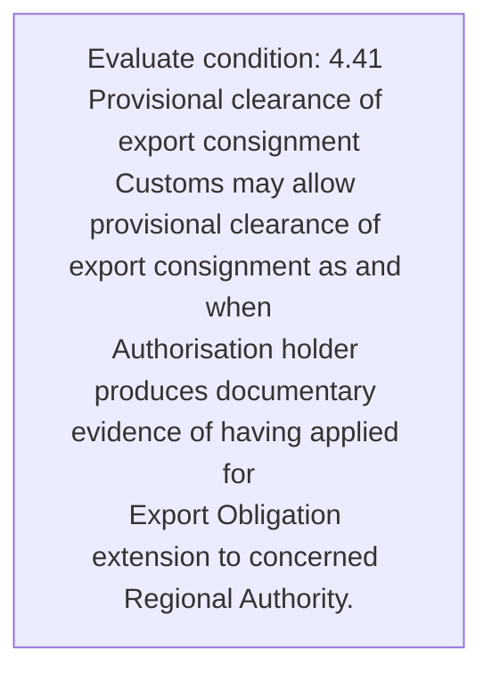
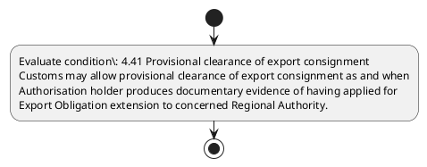

# Chapter 4 / Section 4.41: Provisional clearance of export consignment

**Chapter Title:** Duty Exemption / Remission Schemes

**Pages:** 24

**Purpose:** 4.41 Provisional clearance of export consignment
Customs may allow provisional clearance of export consignment as and when
Authorisation holder produces documentary evidence of having applied for
Export Obligation extension to concerned Regional Authority.

**Purpose Thanglish:** Indha Provisional clearance of export consignment section-la, 4.41 Provisional clearance of export consignment
Customs may allow provisional clearance of export consignment as and when
Authorisation holder produces documentary evidence of having applied for
export Obligation extension to concerned Regional authority.

**Summary:** 4.41 Provisional clearance of export consignment
Customs may allow provisional clearance of export consignment as and when
Authorisation holder produces documentary evidence of having applied for
Export Obligation extension to concerned Regional Authority.

**Business Meaning:** 4.41 Provisional clearance of export consignment
Customs may allow provisional clearance of export consignment as and when
Authorisation holder produces documentary evidence of having applied for
Export Obligation extension to concerned Regional Authority.

**Business Explanation:** 4.41 Provisional clearance of export consignment
Customs may allow provisional clearance of export consignment as and when
Authorisation holder produces documentary evidence of having applied for
Export Obligation extension to concerned Regional Authority.

**Business Explanation Thanglish:** Indha Provisional clearance of export consignment section-la, 4.41 Provisional clearance of export consignment
Customs may allow provisional clearance of export consignment as and when
Authorisation holder produces documentary evidence of having applied for
export Obligation extension to concerned Regional authority.

## Business Logic
- None identified

## Business Rules
- rule_id=CH4-SEC4_41-R001, rule_description=4.41 Provisional clearance of export consignment
Customs may allow provisional clearance of export consignment as and when
Authorisation holder produces documentary evidence of having applied for
Export Obligation extension to concerned Regional Authority., trigger=Provisional clearance of export consignment, condition=4.41 Provisional clearance of export consignment
Customs may allow provisional clearance of export consignment as and when
Authorisation holder produces documentary evidence of having applied for
Export Obligation extension to concerned Regional Authority., validation=Not explicitly covered in uploaded documents., action=Manual review required., exception=No explicit exception found in uploaded documents., output=DEKAI should produce a compliance decision for 4.41 - Provisional clearance of export consignment.

## Conditions
- 4.41 Provisional clearance of export consignment
Customs may allow provisional clearance of export consignment as and when
Authorisation holder produces documentary evidence of having applied for
Export Obligation extension to concerned Regional Authority.

## Condition Logic
- id=4.4.41.1, if=4.41 Provisional clearance of export consignment
Customs may allow provisional clearance of export consignment as and when
Authorisation holder produces documentary evidence of having applied for
Export Obligation extension to concerned Regional Authority., then=Route for review, source=4.41 Provisional clearance of export consignment
Customs may allow provisional clearance of export consignment as and when
Authorisation holder produces documentary evidence of having applied for
Export Obligation extension to concerned Regional Authority.

## Validations
- None identified

## Exceptions
- None identified

## Dependencies
- 1
- 4

## Authorities
- Regional Authority
- Customs
- Export Obligation extension to concerned Regional Authority

## Required Documents
- 4.41 Provisional clearance of export consignment
Customs may allow provisional clearance of export consignment as and when
Authorisation holder produces documentary evidence of having applied for
Export Obligation extension to concerned Regional Authority.

## Timelines
- None identified

## Actions
- None identified

## Workflow
- Evaluate condition: 4.41 Provisional clearance of export consignment
Customs may allow provisional clearance of export consignment as and when
Authorisation holder produces documentary evidence of having applied for
Export Obligation extension to concerned Regional Authority.

## Workflow ASCII
```text
Provisional clearance of export consignment
Evaluate condition: 4.41 Provisional clearance of export consignment
Customs may allow provisional clearance of export consignment as and when
Authorisation holder produces documentary evidence of having applied for
Export Obligation extension to concerned Regional Authority.
```

## Decision Tree
- IF section 4.41 applies THEN proceed with standard DGFT workflow

## Decision Tree ASCII
```text
Provisional clearance of export consignment Decision
IF section 4.41 applies THEN proceed with standard DGFT workflow
```

## Examples
- User asks to process Provisional clearance of export consignment; the platform checks conditions, validations, and documents before action.

**Real-world Example:** Example: an importer or exporter invokes Provisional clearance of export consignment, submits 4.41 Provisional clearance of export consignment
Customs may allow provisional clearance of export consignment as and when
Authorisation holder produces documentary evidence of having applied for
Export Obligation extension to concerned Regional Authority., and DEKAI uses the extracted rules to follow the provisional clearance of export consignment process.

**Real-world Example Thanglish:** Indha Provisional clearance of export consignment section-la, Example: an importer or exporter invokes Provisional clearance of export consignment, submits 4.41 Provisional clearance of export consignment
Customs may allow provisional clearance of export consignment as and when
Authorisation holder produces documentary evidence of having applied for
export Obligation extension to concerned Regional authority., and DEKAI uses the extracted rules to follow the provisional clearance of export consignment process.

## AI Rules
- None identified

## Database Fields
- name=section_code, type=string, required=True, source=parsed_section_heading
- name=section_title, type=string, required=True, source=parsed_section_heading
- name=may_flag, type=boolean, required=False, source=keyword:may
- name=and_flag, type=boolean, required=False, source=keyword:and
- name=for_flag, type=boolean, required=False, source=keyword:for
- name=when_flag, type=boolean, required=False, source=keyword:when
- name=allow_flag, type=boolean, required=False, source=keyword:allow
- name=export_flag, type=boolean, required=False, source=keyword:export
- name=holder_flag, type=boolean, required=False, source=keyword:holder
- name=having_flag, type=boolean, required=False, source=keyword:having
- name=document_1_submitted, type=boolean, required=True, source=4.41 Provisional clearance of export consignment
Customs may allow provisional clearance of export consignment as and when
Authorisation holder produces documentary evidence of having applied for
Export Obligation extension to concerned Regional Authority.

## API Requirements
- method=GET, path=/api/dgft/sections/4.41, purpose=Retrieve knowledge payload for section 4.41, query_params=['include=workflow,decision_tree,validations'], response_fields=['section', 'title', 'summary', 'conditions', 'validations', 'exceptions', 'workflow', 'decision_tree']
- method=POST, path=/api/dgft/Provisional-clearance-of-export-consignment/validate, purpose=Validate inputs and documents for Provisional clearance of export consignment, request_fields=['section_code', 'section_title', 'document_1_submitted'], response_fields=['status', 'errors', 'warnings', 'next_actions']

## UI Screens
- screen_id=Provisional_clearance_of_export_consignment_overview, name=Provisional clearance of export consignment Overview, purpose=Show section summary, authority, timeline, and eligibility cues., widgets=['summary_card', 'conditions_table', 'authority_badges', 'timeline_panel']
- screen_id=Provisional_clearance_of_export_consignment_submission, name=Provisional clearance of export consignment Submission, purpose=Capture applicant data and supporting documents., widgets=['dynamic_form', 'document_uploader', 'validation_panel', 'next_action_footer'], fields=['section_code', 'section_title', 'may_flag', 'and_flag', 'for_flag', 'when_flag', 'allow_flag', 'export_flag']

## Error Messages
- Validation failed because the section requirements were not fully met.

## FAQ
- question_en=What is the purpose of section 4.41?, answer_en=4.41 Provisional clearance of export consignment
Customs may allow provisional clearance of export consignment as and when
Authorisation holder produces documentary evidence of having applied for
Export Obligation extension to concerned Regional Authority., question_thanglish=Indha Provisional clearance of export consignment section-la, What is the purpose of section 4.41?, answer_thanglish=Indha Provisional clearance of export consignment section-la, 4.41 Provisional clearance of export consignment
Customs may allow provisional clearance of export consignment as and when
Authorisation holder produces documentary evidence of having applied for
export Obligation extension to concerned Regional authority.
- question_en=What documents are required under Provisional clearance of export consignment?, answer_en=4.41 Provisional clearance of export consignment
Customs may allow provisional clearance of export consignment as and when
Authorisation holder produces documentary evidence of having applied for
Export Obligation extension to concerned Regional Authority., question_thanglish=Indha Provisional clearance of export consignment section-la, What documents are required under Provisional clearance of export consignment?, answer_thanglish=Indha Provisional clearance of export consignment section-la, 4.41 Provisional clearance of export consignment
Customs may allow provisional clearance of export consignment as and when
Authorisation holder produces documentary evidence of having applied for
export Obligation extension to concerned Regional authority.
- question_en=Which authority handles Provisional clearance of export consignment?, answer_en=Regional Authority, Customs, Export Obligation extension to concerned Regional Authority, question_thanglish=Indha Provisional clearance of export consignment section-la, Which authority handles Provisional clearance of export consignment?, answer_thanglish=Indha Provisional clearance of export consignment section-la, Regional authority, Customs, export Obligation extension to concerned Regional authority

## Questions Users May Ask
- What does Provisional clearance of export consignment require?
- Which documents are needed for Provisional clearance of export consignment?
- How does DEKAI validate Provisional clearance of export consignment requests?

## Expected AI Answers
- Provisional clearance of export consignment requires the platform to interpret the section text, apply the extracted business rules, and present the correct next action.
- Required documents are inferred from the section text: 4.41 Provisional clearance of export consignment
Customs may allow provisional clearance of export consignment as and when
Authorisation holder produces documentary evidence of having applied for
Export Obligation extension to concerned Regional Authority.
- DEKAI validates Provisional clearance of export consignment by checking conditions, required documents, authority references, and exception clauses before recommending an outcome.

## AI Q&A Examples
- question_en=User asks: How do I comply with Provisional clearance of export consignment?, answer_en=AI answers: DEKAI should evaluate section 4.41, apply the extracted rules, and guide the user through Evaluate condition: 4.41 Provisional clearance of export consignment
Customs may allow provisional clearance of export consignment as and when
Authorisation holder produces documentary evidence of having applied for
Export Obligation extension to concerned Regional Authority.., question_thanglish=Indha Provisional clearance of export consignment section-la, User asks: How do I comply with Provisional clearance of export consignment?, answer_thanglish=Indha Provisional clearance of export consignment section-la, AI answers: DEKAI should evaluate section 4.41, apply the extracted rules, and guide the user through Evaluate condition: 4.41 Provisional clearance of export consignment
Customs may allow provisional clearance of export consignment as and when
Authorisation holder produces documentary evidence of having applied for
export Obligation extension to concerned Regional authority..
- question_en=User asks: Which validations apply to Provisional clearance of export consignment?, answer_en=AI answers: Applicable validations are not explicitly covered in the uploaded documents., question_thanglish=Indha Provisional clearance of export consignment section-la, User asks: Which validations apply to Provisional clearance of export consignment?, answer_thanglish=Indha Provisional clearance of export consignment section-la, AI answers: Applicable validations are not explicitly covered in the uploaded documents.

## DEKAI AI Implementation Notes
- Capture chapter 4, section 4.41, title, and page references as immutable knowledge metadata.
- Bind validations for Provisional clearance of export consignment into a rule engine keyed by the rule IDs extracted for this section.
- Expose document upload controls for: 4.41 Provisional clearance of export consignment
Customs may allow provisional clearance of export consignment as and when
Authorisation holder produces documentary evidence of having applied for
Export Obligation extension to concerned Regional Authority..
- Route escalations or approvals to: Regional Authority, Customs, Export Obligation extension to concerned Regional Authority.
- Show contextual links to related sections: 1, 4.

## DEKAI AI Implementation Notes Thanglish
- Indha Provisional clearance of export consignment section-la, Capture chapter 4, section 4.41, title, and page references as immutable knowledge metadata.
- Indha Provisional clearance of export consignment section-la, Bind validations for Provisional clearance of export consignment into a rule engine keyed by the rule IDs extracted for this section.
- Indha Provisional clearance of export consignment section-la, Expose document upload controls for: 4.41 Provisional clearance of export consignment
Customs may allow provisional clearance of export consignment as and when
Authorisation holder produces documentary evidence of having applied for
export Obligation extension to concerned Regional authority..
- Indha Provisional clearance of export consignment section-la, Route escalations or approvals to: Regional authority, Customs, export Obligation extension to concerned Regional authority.
- Indha Provisional clearance of export consignment section-la, Show contextual links to related sections: 1, 4.

## AI Metadata
- Keywords: may, and, for, when, allow, export, holder, having, Customs, applied, produces, evidence, Regional, clearance, extension, concerned, Authority, Obligation, Provisional, consignment
- Search Keywords: may, and, for, when, allow, export, holder, having, Customs, applied, produces, evidence, Regional, clearance, extension, concerned, Authority, Obligation, Provisional, consignment
- Intent: Provide knowledge guidance for Provisional clearance of export consignment.
- Tags: 4.41, Provisional clearance of export consignment, document-driven, dgft
- Related Sections: 1, 4
- Related Chapters: 
- Related Rules: 

## Mermaid


## PlantUML

