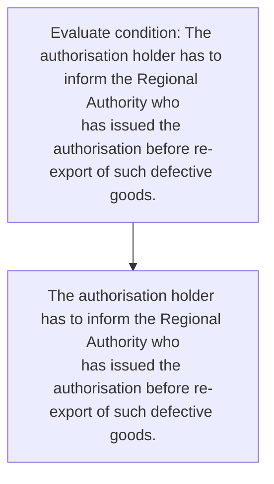
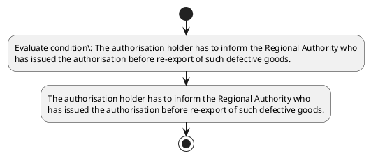

# Chapter 4 / Section 4.42: Re-export of goods imported under Advance Authorisation

**Chapter Title:** Duty Exemption / Remission Schemes

**Pages:** 24

**Purpose:** 4.42 Re-export of goods imported under Advance Authorisation
Scheme
Goods imported against Advance Authorisation Scheme, which are found
defective or unfit for use, may be re-exported, as per Department of Revenue
guidelines.

**Purpose Thanglish:** Indha Re-export of goods imported under Advance Authorisation section-la, 4.42 Re-export of goods imported under Advance Authorisation
Scheme
Goods imported against Advance Authorisation Scheme, which are found
defective or unfit for use, may be re-exported, as per Department of Revenue
guidelines.

**Summary:** 4.42 Re-export of goods imported under Advance Authorisation
Scheme
Goods imported against Advance Authorisation Scheme, which are found
defective or unfit for use, may be re-exported, as per Department of Revenue
guidelines. The authorisation holder has to inform the Regional Authority who
has issued the authorisation before re-export of such defective goods.

**Business Meaning:** 4.42 Re-export of goods imported under Advance Authorisation
Scheme
Goods imported against Advance Authorisation Scheme, which are found
defective or unfit for use, may be re-exported, as per Department of Revenue
guidelines.

**Business Explanation:** 4.42 Re-export of goods imported under Advance Authorisation
Scheme
Goods imported against Advance Authorisation Scheme, which are found
defective or unfit for use, may be re-exported, as per Department of Revenue
guidelines. The authorisation holder has to inform the Regional Authority who
has issued the authorisation before re-export of such defective goods.

**Business Explanation Thanglish:** Indha Re-export of goods imported under Advance Authorisation section-la, 4.42 Re-export of goods imported under Advance Authorisation
Scheme
Goods imported against Advance Authorisation Scheme, which are found
defective or unfit for use, may be re-exported, as per Department of Revenue
guidelines. The authorisation holder has to inform the Regional authority who
has issued the authorisation before re-export of such defective goods.

## Business Logic
- None identified

## Business Rules
- rule_id=CH4-SEC4_42-R001, rule_description=IF validations pass THEN recommend action: The authorisation holder has to inform the Regional Authority who
has issued the authorisation before re-export of such defective goods., trigger=Re-export of goods imported under Advance Authorisation, condition=The authorisation holder has to inform the Regional Authority who
has issued the authorisation before re-export of such defective goods., validation=Not explicitly covered in uploaded documents., action=The authorisation holder has to inform the Regional Authority who
has issued the authorisation before re-export of such defective goods., exception=No explicit exception found in uploaded documents., output=DEKAI should produce a compliance decision for 4.42 - Re-export of goods imported under Advance Authorisation.

## Conditions
- The authorisation holder has to inform the Regional Authority who
has issued the authorisation before re-export of such defective goods.

## Condition Logic
- id=4.4.42.1, if=The authorisation holder has to inform the Regional Authority who
has issued the authorisation before re-export of such defective goods., then=The authorisation holder has to inform the Regional Authority who
has issued the authorisation before re-export of such defective goods., source=The authorisation holder has to inform the Regional Authority who
has issued the authorisation before re-export of such defective goods.

## Validations
- None identified

## Exceptions
- None identified

## Dependencies
- None identified

## Authorities
- Regional Authority
- The authorisation holder has to inform the Regional Authority

## Required Documents
- None identified

## Timelines
- The authorisation holder has to inform the Regional Authority who
has issued the authorisation before re-export of such defective goods.

## Actions
- The authorisation holder has to inform the Regional Authority who
has issued the authorisation before re-export of such defective goods.

## Workflow
- Evaluate condition: The authorisation holder has to inform the Regional Authority who
has issued the authorisation before re-export of such defective goods.
- The authorisation holder has to inform the Regional Authority who
has issued the authorisation before re-export of such defective goods.

## Workflow ASCII
```text
Re-export of goods imported under Advance Authorisation
Evaluate condition: The authorisation holder has to inform the Regional Authority who
has issued the authorisation before re-export of such defective goods.
   |
   v
The authorisation holder has to inform the Regional Authority who
has issued the authorisation before re-export of such defective goods.
```

## Decision Tree
- IF The authorisation holder has to inform the Regional Authority who
has issued the authorisation before re-export of such defective goods. THEN The authorisation holder has to inform the Regional Authority who
has issued the authorisation before re-export of such defective goods.

## Decision Tree ASCII
```text
Re-export of goods imported under Advance Authorisation Decision
IF The authorisation holder has to inform the Regional Authority who
has issued the authorisation before re-export of such defective goods. THEN The authorisation holder has to inform the Regional Authority who
has issued the authorisation before re-export of such defective goods.
```

## Examples
- User asks to process Re-export of goods imported under Advance Authorisation; the platform checks conditions, validations, and documents before action.

**Real-world Example:** Example: an importer or exporter invokes Re-export of goods imported under Advance Authorisation, submits the prescribed DGFT records, and DEKAI uses the extracted rules to the authorisation holder has to inform the regional authority who
has issued the authorisation before re-export of such defective goods..

**Real-world Example Thanglish:** Indha Re-export of goods imported under Advance Authorisation section-la, Example: an importer or exporter invokes Re-export of goods imported under Advance Authorisation, submits the prescribed DGFT records, and DEKAI uses the extracted rules to the authorisation holder has to inform the regional authority who
has issued the authorisation before re-export of such defective goods..

## AI Rules
- IF validations pass THEN recommend action: The authorisation holder has to inform the Regional Authority who
has issued the authorisation before re-export of such defective goods.

## Database Fields
- name=section_code, type=string, required=True, source=parsed_section_heading
- name=section_title, type=string, required=True, source=parsed_section_heading
- name=are_flag, type=boolean, required=False, source=keyword:are
- name=for_flag, type=boolean, required=False, source=keyword:for
- name=use_flag, type=boolean, required=False, source=keyword:use
- name=may_flag, type=boolean, required=False, source=keyword:may
- name=per_flag, type=boolean, required=False, source=keyword:per
- name=the_flag, type=boolean, required=False, source=keyword:The
- name=has_flag, type=boolean, required=False, source=keyword:has
- name=who_flag, type=boolean, required=False, source=keyword:who

## API Requirements
- method=GET, path=/api/dgft/sections/4.42, purpose=Retrieve knowledge payload for section 4.42, query_params=['include=workflow,decision_tree,validations'], response_fields=['section', 'title', 'summary', 'conditions', 'validations', 'exceptions', 'workflow', 'decision_tree']
- method=POST, path=/api/dgft/Re-export-of-goods-imported-under-Advance-Authorisation/validate, purpose=Validate inputs and documents for Re-export of goods imported under Advance Authorisation, request_fields=['section_code', 'section_title'], response_fields=['status', 'errors', 'warnings', 'next_actions']
- method=POST, path=/api/dgft/Re-export-of-goods-imported-under-Advance-Authorisation/execute, purpose=Trigger business action for The authorisation holder has to inform the Regional Authority who
has issued the authorisation before re-export of such defective goods., request_fields=['section_code', 'section_title'], response_fields=['reference_id', 'status', 'authority', 'timeline']

## UI Screens
- screen_id=Re_export_of_goods_imported_under_Advance_Authorisation_overview, name=Re-export of goods imported under Advance Authorisation Overview, purpose=Show section summary, authority, timeline, and eligibility cues., widgets=['summary_card', 'conditions_table', 'authority_badges', 'timeline_panel']
- screen_id=Re_export_of_goods_imported_under_Advance_Authorisation_submission, name=Re-export of goods imported under Advance Authorisation Submission, purpose=Capture applicant data and supporting documents., widgets=['dynamic_form', 'document_uploader', 'validation_panel', 'next_action_footer'], fields=['section_code', 'section_title', 'are_flag', 'for_flag', 'use_flag', 'may_flag', 'per_flag', 'the_flag']

## Error Messages
- Validation failed because the section requirements were not fully met.

## FAQ
- question_en=What is the purpose of section 4.42?, answer_en=4.42 Re-export of goods imported under Advance Authorisation
Scheme
Goods imported against Advance Authorisation Scheme, which are found
defective or unfit for use, may be re-exported, as per Department of Revenue
guidelines. The authorisation holder has to inform the Regional Authority who
has issued the authorisation before re-export of such defective goods., question_thanglish=Indha Re-export of goods imported under Advance Authorisation section-la, What is the purpose of section 4.42?, answer_thanglish=Indha Re-export of goods imported under Advance Authorisation section-la, 4.42 Re-export of goods imported under Advance Authorisation
Scheme
Goods imported against Advance Authorisation Scheme, which are found
defective or unfit for use, may be re-exported, as per Department of Revenue
guidelines. The authorisation holder has to inform the Regional authority who
has issued the authorisation before re-export of such defective goods.
- question_en=What documents are required under Re-export of goods imported under Advance Authorisation?, answer_en=Not explicitly covered in uploaded documents., question_thanglish=Indha Re-export of goods imported under Advance Authorisation section-la, What documents are required under Re-export of goods imported under Advance Authorisation?, answer_thanglish=Indha Re-export of goods imported under Advance Authorisation section-la, Not explicitly covered in uploaded documents.
- question_en=Which authority handles Re-export of goods imported under Advance Authorisation?, answer_en=Regional Authority, The authorisation holder has to inform the Regional Authority, question_thanglish=Indha Re-export of goods imported under Advance Authorisation section-la, Which authority handles Re-export of goods imported under Advance Authorisation?, answer_thanglish=Indha Re-export of goods imported under Advance Authorisation section-la, Regional authority, The authorisation holder has to inform the Regional authority

## Questions Users May Ask
- What does Re-export of goods imported under Advance Authorisation require?
- Which documents are needed for Re-export of goods imported under Advance Authorisation?
- How does DEKAI validate Re-export of goods imported under Advance Authorisation requests?
- What action should be taken for Re-export of goods imported under Advance Authorisation?

## Expected AI Answers
- Re-export of goods imported under Advance Authorisation requires the platform to interpret the section text, apply the extracted business rules, and present the correct next action.
- Required documents are inferred from the section text: no explicit documents were detected.
- DEKAI validates Re-export of goods imported under Advance Authorisation by checking conditions, required documents, authority references, and exception clauses before recommending an outcome.
- The primary extracted action is: The authorisation holder has to inform the Regional Authority who
has issued the authorisation before re-export of such defective goods.

## AI Q&A Examples
- question_en=User asks: How do I comply with Re-export of goods imported under Advance Authorisation?, answer_en=AI answers: DEKAI should evaluate section 4.42, apply the extracted rules, and guide the user through Evaluate condition: The authorisation holder has to inform the Regional Authority who
has issued the authorisation before re-export of such defective goods.., question_thanglish=Indha Re-export of goods imported under Advance Authorisation section-la, User asks: How do I comply with Re-export of goods imported under Advance Authorisation?, answer_thanglish=Indha Re-export of goods imported under Advance Authorisation section-la, AI answers: DEKAI should evaluate section 4.42, apply the extracted rules, and guide the user through Evaluate condition: The authorisation holder has to inform the Regional authority who
has issued the authorisation before re-export of such defective goods..
- question_en=User asks: Which validations apply to Re-export of goods imported under Advance Authorisation?, answer_en=AI answers: Applicable validations are not explicitly covered in the uploaded documents., question_thanglish=Indha Re-export of goods imported under Advance Authorisation section-la, User asks: Which validations apply to Re-export of goods imported under Advance Authorisation?, answer_thanglish=Indha Re-export of goods imported under Advance Authorisation section-la, AI answers: Applicable validations are not explicitly covered in the uploaded documents.

## DEKAI AI Implementation Notes
- Capture chapter 4, section 4.42, title, and page references as immutable knowledge metadata.
- Bind validations for Re-export of goods imported under Advance Authorisation into a rule engine keyed by the rule IDs extracted for this section.
- Route escalations or approvals to: Regional Authority, The authorisation holder has to inform the Regional Authority.

## DEKAI AI Implementation Notes Thanglish
- Indha Re-export of goods imported under Advance Authorisation section-la, Capture chapter 4, section 4.42, title, and page references as immutable knowledge metadata.
- Indha Re-export of goods imported under Advance Authorisation section-la, Bind validations for Re-export of goods imported under Advance Authorisation into a rule engine keyed by the rule IDs extracted for this section.
- Indha Re-export of goods imported under Advance Authorisation section-la, Route escalations or approvals to: Regional authority, The authorisation holder has to inform the Regional authority.

## AI Metadata
- Keywords: are, for, use, may, per, The, has, who, such, goods, under, which, found, unfit, Scheme, holder, inform, issued, before, Advance
- Search Keywords: are, for, use, may, per, The, has, who, such, goods, under, which, found, unfit, Scheme, holder, inform, issued, before, Advance
- Intent: Support Re-export of goods imported under Advance Authorisation processing and compliance validation.
- Tags: 4.42, Re-export of goods imported under Advance Authorisation, dgft
- Related Sections: 
- Related Chapters: 
- Related Rules: 

## Mermaid


## PlantUML

