# Chapter 4 / Section 4.43: Monitoring of Export Obligation

**Chapter Title:** Duty Exemption / Remission Schemes

**Pages:** 24, 25

**Purpose:** 4.43 Monitoring of Export Obligation
(a) Regional Authority, with whom undertaking is executed by Advance
Authorisation holder, shall maintain a proper record in a master register
pg.

**Purpose Thanglish:** Indha Monitoring of Export Obligation section-la, 4.43 Monitoring of export Obligation
(a) Regional authority, with whom undertaking is executed by Advance
Authorisation holder, kandippa maintain a proper record in a master register
pg.

**Summary:** 4.43 Monitoring of Export Obligation
(a) Regional Authority, with whom undertaking is executed by Advance
Authorisation holder, shall maintain a proper record in a master register
pg. 99
| CIF VALUE OF ADVANCE | | | COMPOSITION FEE TO BE |
| AUTHORISATION | | | LEVIED (In Rupees) |
Up to ₹2Crores | | | 25,000 | |
More than ₹2 Crores to 10
Crores | | | 50,000 | |
Above ₹10Crores | | | 100,000 | |
pg. 99
composition fee will not be permitted.

**Business Meaning:** Monitoring of Export Obligation governs how DGFT business controls should be applied, validated, and enforced.

**Business Explanation:** Monitoring of Export Obligation explains the operating rule set that DEKAI should enforce. Key control points include 4.43 Monitoring of Export Obligation
(a) Regional Authority, with whom undertaking is executed by Advance
Authorisation holder, shall maintain a proper record in a master register
pg. The section also drives actions such as 4.43 Monitoring of Export Obligation
(a) Regional Authority, with whom undertaking is executed by Advance
Authorisation holder, shall maintain a proper record in a master register
pg..

**Business Explanation Thanglish:** Indha Monitoring of Export Obligation section-la, Monitoring of export Obligation explains the operating rule set that DEKAI should enforce. Key control points include 4.43 Monitoring of export Obligation
(a) Regional authority, with whom undertaking is executed by Advance
Authorisation holder, kandippa maintain a proper record in a master register
pg. The section also drives actions such as 4.43 Monitoring of export Obligation
(a) Regional authority, with whom undertaking is executed by Advance
Authorisation holder, kandippa maintain a proper record in a master register
pg..

## Business Logic
- 4.43 Monitoring of Export Obligation
(a) Regional Authority, with whom undertaking is executed by Advance
Authorisation holder, shall maintain a proper record in a master register
pg.
- (k)
For implementation of all PRC decisions involving levy of Composition
Fee while allowing extension in EOP and/or regularisation of exports
already made, the applicable Composition Fee shall be as prescribed
hereunder:
CIF VALUE OF ADVANCE
AUTHORISATION
COMPOSITION FEE TO BE
LEVIED (In Rupees)
Up to ₹2Crores
25,000
More than ₹2 Crores to 10
Crores
50,000
Above ₹10Crores
100,000
No refund of earlier paid Composition Fee shall be admissible.
- (l)
Notwithstanding the provisions contained in Para 4.40 of the
Handbook of Procedures (HBP), 2023, in respect of all Advance
Authorisations, including Advance Authorisation for Annual
Requirement and Special Advance Authorisation, where the Export
Obligation Period (EOP) (whether original or as extended) is
expiring during the period 01.03.2026 to 31.05.2026, the EOP shall
stand automatically extended up to 31.08.2026.xviii
4.43 Monitoring of Export Obligation
(a)
Regional Authority, with whom undertaking is executed by Advance
Authorisation holder, shall maintain a proper record in a master register
indicating starting and closing dates of obligation period and other
particulars to monitor EO.
- (b) Within six months from the date of expiry of Export Obligation period,
Authorisation holder shall file application online by linking details of
shipping bills against the authorisation, failing which Regional Authority
may initiate action as per FT (DR) Act by way of issuing Show-Cause
Notice.
- (c) In case of online filing of EODC application, Exporters shall link all
exports online on DGFT system by linking file number / authorisation
number with the relevant shipping bill numbers / bill of exports /
invoices in case of deemed exports/Tax invoices for supplies prescribed
under CGST/SGST/UT GST rules.
- (d) In case of non EDI shipping bills and supplies under Chapter-7 of FTP,
exporter shall file relevant details manually on the website of the DGFT
within two months from the date of expiry of Export Obligation period.
- Copies of shipping bills shall be submitted to Regional Authority
concerned for verification within two months from date of expiry of
export obligation period.
- (e) e-BRC/ export realisations from RBI's EDPMS wherever available in
DGFT IT system shall be linked with these shipping bills within six
months from the date of expiry of export obligation/realisation or as per
the time period prescribed for realization of foreign exchange by RBI.
- Regional Authority shall not take action for non linking/ submission of
e-BRC/ export realisations from RBI's EDPMS wherever available in
DGFT IT system before expiry of said period, provided other documents
substantiating fulfilment of Export Obligation have been furnished by the
exporter.
- (f) In case Authorisation holder fails to complete Export Obligation or fails
to submit relevant information / documents, Regional Authority shall
enforce condition of Authorisation and Undertaking and also initiate
penal action as per law including refusal of further authorisation to the
defaulting exporter.

## Business Rules
- rule_id=CH4-SEC4_43-R001, rule_description=4.43 Monitoring of Export Obligation
(a) Regional Authority, with whom undertaking is executed by Advance
Authorisation holder, shall maintain a proper record in a master register
pg., trigger=Monitoring of Export Obligation, condition=99
| CIF VALUE OF ADVANCE | | | COMPOSITION FEE TO BE |
| AUTHORISATION | | | LEVIED (In Rupees) |
Up to ₹2Crores | | | 25,000 | |
More than ₹2 Crores to 10
Crores | | | 50,000 | |
Above ₹10Crores | | | 100,000 | |
pg., validation=4.43 Monitoring of Export Obligation
(a) Regional Authority, with whom undertaking is executed by Advance
Authorisation holder, shall maintain a proper record in a master register
pg., action=4.43 Monitoring of Export Obligation
(a) Regional Authority, with whom undertaking is executed by Advance
Authorisation holder, shall maintain a proper record in a master register
pg., exception=(l)
Notwithstanding the provisions contained in Para 4.40 of the
Handbook of Procedures (HBP), 2023, in respect of all Advance
Authorisations, including Advance Authorisation for Annual
Requirement and Special Advance Authorisation, where the Export
Obligation Period (EOP) (whether original or as extended) is
expiring during the period 01.03.2026 to 31.05.2026, the EOP shall
stand automatically extended up to 31.08.2026.xviii
4.43 Monitoring of Export Obligation
(a)
Regional Authority, with whom undertaking is executed by Advance
Authorisation holder, shall maintain a proper record in a master register
indicating starting and closing dates of obligation period and other
particulars to monitor EO., output=DEKAI should produce a compliance decision for 4.43 - Monitoring of Export Obligation.
- rule_id=CH4-SEC4_43-R002, rule_description=(k)
For implementation of all PRC decisions involving levy of Composition
Fee while allowing extension in EOP and/or regularisation of exports
already made, the applicable Composition Fee shall be as prescribed
hereunder:
CIF VALUE OF ADVANCE
AUTHORISATION
COMPOSITION FEE TO BE
LEVIED (In Rupees)
Up to ₹2Crores
25,000
More than ₹2 Crores to 10
Crores
50,000
Above ₹10Crores
100,000
No refund of earlier paid Composition Fee shall be admissible., trigger=Monitoring of Export Obligation, condition=(k)
For implementation of all PRC decisions involving levy of Composition
Fee while allowing extension in EOP and/or regularisation of exports
already made, the applicable Composition Fee shall be as prescribed
hereunder:
CIF VALUE OF ADVANCE
AUTHORISATION
COMPOSITION FEE TO BE
LEVIED (In Rupees)
Up to ₹2Crores
25,000
More than ₹2 Crores to 10
Crores
50,000
Above ₹10Crores
100,000
No refund of earlier paid Composition Fee shall be admissible., validation=(k)
For implementation of all PRC decisions involving levy of Composition
Fee while allowing extension in EOP and/or regularisation of exports
already made, the applicable Composition Fee shall be as prescribed
hereunder:
CIF VALUE OF ADVANCE
AUTHORISATION
COMPOSITION FEE TO BE
LEVIED (In Rupees)
Up to ₹2Crores
25,000
More than ₹2 Crores to 10
Crores
50,000
Above ₹10Crores
100,000
No refund of earlier paid Composition Fee shall be admissible., action=(l)
Notwithstanding the provisions contained in Para 4.40 of the
Handbook of Procedures (HBP), 2023, in respect of all Advance
Authorisations, including Advance Authorisation for Annual
Requirement and Special Advance Authorisation, where the Export
Obligation Period (EOP) (whether original or as extended) is
expiring during the period 01.03.2026 to 31.05.2026, the EOP shall
stand automatically extended up to 31.08.2026.xviii
4.43 Monitoring of Export Obligation
(a)
Regional Authority, with whom undertaking is executed by Advance
Authorisation holder, shall maintain a proper record in a master register
indicating starting and closing dates of obligation period and other
particulars to monitor EO., exception=(l)
Notwithstanding the provisions contained in Para 4.40 of the
Handbook of Procedures (HBP), 2023, in respect of all Advance
Authorisations, including Advance Authorisation for Annual
Requirement and Special Advance Authorisation, where the Export
Obligation Period (EOP) (whether original or as extended) is
expiring during the period 01.03.2026 to 31.05.2026, the EOP shall
stand automatically extended up to 31.08.2026.xviii
4.43 Monitoring of Export Obligation
(a)
Regional Authority, with whom undertaking is executed by Advance
Authorisation holder, shall maintain a proper record in a master register
indicating starting and closing dates of obligation period and other
particulars to monitor EO., output=DEKAI should produce a compliance decision for 4.43 - Monitoring of Export Obligation.
- rule_id=CH4-SEC4_43-R003, rule_description=(l)
Notwithstanding the provisions contained in Para 4.40 of the
Handbook of Procedures (HBP), 2023, in respect of all Advance
Authorisations, including Advance Authorisation for Annual
Requirement and Special Advance Authorisation, where the Export
Obligation Period (EOP) (whether original or as extended) is
expiring during the period 01.03.2026 to 31.05.2026, the EOP shall
stand automatically extended up to 31.08.2026.xviii
4.43 Monitoring of Export Obligation
(a)
Regional Authority, with whom undertaking is executed by Advance
Authorisation holder, shall maintain a proper record in a master register
indicating starting and closing dates of obligation period and other
particulars to monitor EO., trigger=Monitoring of Export Obligation, condition=(l)
Notwithstanding the provisions contained in Para 4.40 of the
Handbook of Procedures (HBP), 2023, in respect of all Advance
Authorisations, including Advance Authorisation for Annual
Requirement and Special Advance Authorisation, where the Export
Obligation Period (EOP) (whether original or as extended) is
expiring during the period 01.03.2026 to 31.05.2026, the EOP shall
stand automatically extended up to 31.08.2026.xviii
4.43 Monitoring of Export Obligation
(a)
Regional Authority, with whom undertaking is executed by Advance
Authorisation holder, shall maintain a proper record in a master register
indicating starting and closing dates of obligation period and other
particulars to monitor EO., validation=(l)
Notwithstanding the provisions contained in Para 4.40 of the
Handbook of Procedures (HBP), 2023, in respect of all Advance
Authorisations, including Advance Authorisation for Annual
Requirement and Special Advance Authorisation, where the Export
Obligation Period (EOP) (whether original or as extended) is
expiring during the period 01.03.2026 to 31.05.2026, the EOP shall
stand automatically extended up to 31.08.2026.xviii
4.43 Monitoring of Export Obligation
(a)
Regional Authority, with whom undertaking is executed by Advance
Authorisation holder, shall maintain a proper record in a master register
indicating starting and closing dates of obligation period and other
particulars to monitor EO., action=In addition, this information may be generated
from Computer System and maintained in a book form., exception=(l)
Notwithstanding the provisions contained in Para 4.40 of the
Handbook of Procedures (HBP), 2023, in respect of all Advance
Authorisations, including Advance Authorisation for Annual
Requirement and Special Advance Authorisation, where the Export
Obligation Period (EOP) (whether original or as extended) is
expiring during the period 01.03.2026 to 31.05.2026, the EOP shall
stand automatically extended up to 31.08.2026.xviii
4.43 Monitoring of Export Obligation
(a)
Regional Authority, with whom undertaking is executed by Advance
Authorisation holder, shall maintain a proper record in a master register
indicating starting and closing dates of obligation period and other
particulars to monitor EO., output=DEKAI should produce a compliance decision for 4.43 - Monitoring of Export Obligation.
- rule_id=CH4-SEC4_43-R004, rule_description=(b) Within six months from the date of expiry of Export Obligation period,
Authorisation holder shall file application online by linking details of
shipping bills against the authorisation, failing which Regional Authority
may initiate action as per FT (DR) Act by way of issuing Show-Cause
Notice., trigger=Monitoring of Export Obligation, condition=(c) In case of online filing of EODC application, Exporters shall link all
exports online on DGFT system by linking file number / authorisation
number with the relevant shipping bill numbers / bill of exports /
invoices in case of deemed exports/Tax invoices for supplies prescribed
under CGST/SGST/UT GST rules., validation=(b) Within six months from the date of expiry of Export Obligation period,
Authorisation holder shall file application online by linking details of
shipping bills against the authorisation, failing which Regional Authority
may initiate action as per FT (DR) Act by way of issuing Show-Cause
Notice., action=Copies of shipping bills shall be submitted to Regional Authority
concerned for verification within two months from date of expiry of
export obligation period., exception=(l)
Notwithstanding the provisions contained in Para 4.40 of the
Handbook of Procedures (HBP), 2023, in respect of all Advance
Authorisations, including Advance Authorisation for Annual
Requirement and Special Advance Authorisation, where the Export
Obligation Period (EOP) (whether original or as extended) is
expiring during the period 01.03.2026 to 31.05.2026, the EOP shall
stand automatically extended up to 31.08.2026.xviii
4.43 Monitoring of Export Obligation
(a)
Regional Authority, with whom undertaking is executed by Advance
Authorisation holder, shall maintain a proper record in a master register
indicating starting and closing dates of obligation period and other
particulars to monitor EO., output=DEKAI should produce a compliance decision for 4.43 - Monitoring of Export Obligation.
- rule_id=CH4-SEC4_43-R005, rule_description=(c) In case of online filing of EODC application, Exporters shall link all
exports online on DGFT system by linking file number / authorisation
number with the relevant shipping bill numbers / bill of exports /
invoices in case of deemed exports/Tax invoices for supplies prescribed
under CGST/SGST/UT GST rules., trigger=Monitoring of Export Obligation, condition=(d) In case of non EDI shipping bills and supplies under Chapter-7 of FTP,
exporter shall file relevant details manually on the website of the DGFT
within two months from the date of expiry of Export Obligation period., validation=(c) In case of online filing of EODC application, Exporters shall link all
exports online on DGFT system by linking file number / authorisation
number with the relevant shipping bill numbers / bill of exports /
invoices in case of deemed exports/Tax invoices for supplies prescribed
under CGST/SGST/UT GST rules., action=In case an applicant is not able to upload any
prescribed document then such documents may be submitted in physical
form to the concerned authority., exception=(l)
Notwithstanding the provisions contained in Para 4.40 of the
Handbook of Procedures (HBP), 2023, in respect of all Advance
Authorisations, including Advance Authorisation for Annual
Requirement and Special Advance Authorisation, where the Export
Obligation Period (EOP) (whether original or as extended) is
expiring during the period 01.03.2026 to 31.05.2026, the EOP shall
stand automatically extended up to 31.08.2026.xviii
4.43 Monitoring of Export Obligation
(a)
Regional Authority, with whom undertaking is executed by Advance
Authorisation holder, shall maintain a proper record in a master register
indicating starting and closing dates of obligation period and other
particulars to monitor EO., output=DEKAI should produce a compliance decision for 4.43 - Monitoring of Export Obligation.
- rule_id=CH4-SEC4_43-R006, rule_description=(d) In case of non EDI shipping bills and supplies under Chapter-7 of FTP,
exporter shall file relevant details manually on the website of the DGFT
within two months from the date of expiry of Export Obligation period., trigger=Monitoring of Export Obligation, condition=Copies of shipping bills shall be submitted to Regional Authority
concerned for verification within two months from date of expiry of
export obligation period., validation=(d) In case of non EDI shipping bills and supplies under Chapter-7 of FTP,
exporter shall file relevant details manually on the website of the DGFT
within two months from the date of expiry of Export Obligation period., action=Regional Authority shall not take action for non linking/ submission of
e-BRC/ export realisations from RBI's EDPMS wherever available in
DGFT IT system before expiry of said period, provided other documents
substantiating fulfilment of Export Obligation have been furnished by the
exporter., exception=(l)
Notwithstanding the provisions contained in Para 4.40 of the
Handbook of Procedures (HBP), 2023, in respect of all Advance
Authorisations, including Advance Authorisation for Annual
Requirement and Special Advance Authorisation, where the Export
Obligation Period (EOP) (whether original or as extended) is
expiring during the period 01.03.2026 to 31.05.2026, the EOP shall
stand automatically extended up to 31.08.2026.xviii
4.43 Monitoring of Export Obligation
(a)
Regional Authority, with whom undertaking is executed by Advance
Authorisation holder, shall maintain a proper record in a master register
indicating starting and closing dates of obligation period and other
particulars to monitor EO., output=DEKAI should produce a compliance decision for 4.43 - Monitoring of Export Obligation.
- rule_id=CH4-SEC4_43-R007, rule_description=Copies of shipping bills shall be submitted to Regional Authority
concerned for verification within two months from date of expiry of
export obligation period., trigger=Monitoring of Export Obligation, condition=In case an applicant is not able to upload any
prescribed document then such documents may be submitted in physical
form to the concerned authority., validation=Copies of shipping bills shall be submitted to Regional Authority
concerned for verification within two months from date of expiry of
export obligation period., action=(f) In case Authorisation holder fails to complete Export Obligation or fails
to submit relevant information / documents, Regional Authority shall
enforce condition of Authorisation and Undertaking and also initiate
penal action as per law including refusal of further authorisation to the
defaulting exporter., exception=(l)
Notwithstanding the provisions contained in Para 4.40 of the
Handbook of Procedures (HBP), 2023, in respect of all Advance
Authorisations, including Advance Authorisation for Annual
Requirement and Special Advance Authorisation, where the Export
Obligation Period (EOP) (whether original or as extended) is
expiring during the period 01.03.2026 to 31.05.2026, the EOP shall
stand automatically extended up to 31.08.2026.xviii
4.43 Monitoring of Export Obligation
(a)
Regional Authority, with whom undertaking is executed by Advance
Authorisation holder, shall maintain a proper record in a master register
indicating starting and closing dates of obligation period and other
particulars to monitor EO., output=DEKAI should produce a compliance decision for 4.43 - Monitoring of Export Obligation.
- rule_id=CH4-SEC4_43-R008, rule_description=(e) e-BRC/ export realisations from RBI's EDPMS wherever available in
DGFT IT system shall be linked with these shipping bills within six
months from the date of expiry of export obligation/realisation or as per
the time period prescribed for realization of foreign exchange by RBI., trigger=Monitoring of Export Obligation, condition=(e) e-BRC/ export realisations from RBI's EDPMS wherever available in
DGFT IT system shall be linked with these shipping bills within six
months from the date of expiry of export obligation/realisation or as per
the time period prescribed for realization of foreign exchange by RBI., validation=(e) e-BRC/ export realisations from RBI's EDPMS wherever available in
DGFT IT system shall be linked with these shipping bills within six
months from the date of expiry of export obligation/realisation or as per
the time period prescribed for realization of foreign exchange by RBI., action=(f) In case Authorisation holder fails to complete Export Obligation or fails
to submit relevant information / documents, Regional Authority shall
enforce condition of Authorisation and Undertaking and also initiate
penal action as per law including refusal of further authorisation to the
defaulting exporter., exception=(l)
Notwithstanding the provisions contained in Para 4.40 of the
Handbook of Procedures (HBP), 2023, in respect of all Advance
Authorisations, including Advance Authorisation for Annual
Requirement and Special Advance Authorisation, where the Export
Obligation Period (EOP) (whether original or as extended) is
expiring during the period 01.03.2026 to 31.05.2026, the EOP shall
stand automatically extended up to 31.08.2026.xviii
4.43 Monitoring of Export Obligation
(a)
Regional Authority, with whom undertaking is executed by Advance
Authorisation holder, shall maintain a proper record in a master register
indicating starting and closing dates of obligation period and other
particulars to monitor EO., output=DEKAI should produce a compliance decision for 4.43 - Monitoring of Export Obligation.
- rule_id=CH4-SEC4_43-R009, rule_description=Regional Authority shall not take action for non linking/ submission of
e-BRC/ export realisations from RBI's EDPMS wherever available in
DGFT IT system before expiry of said period, provided other documents
substantiating fulfilment of Export Obligation have been furnished by the
exporter., trigger=Monitoring of Export Obligation, condition=Regional Authority shall not take action for non linking/ submission of
e-BRC/ export realisations from RBI's EDPMS wherever available in
DGFT IT system before expiry of said period, provided other documents
substantiating fulfilment of Export Obligation have been furnished by the
exporter., validation=Regional Authority shall not take action for non linking/ submission of
e-BRC/ export realisations from RBI's EDPMS wherever available in
DGFT IT system before expiry of said period, provided other documents
substantiating fulfilment of Export Obligation have been furnished by the
exporter., action=(f) In case Authorisation holder fails to complete Export Obligation or fails
to submit relevant information / documents, Regional Authority shall
enforce condition of Authorisation and Undertaking and also initiate
penal action as per law including refusal of further authorisation to the
defaulting exporter., exception=(l)
Notwithstanding the provisions contained in Para 4.40 of the
Handbook of Procedures (HBP), 2023, in respect of all Advance
Authorisations, including Advance Authorisation for Annual
Requirement and Special Advance Authorisation, where the Export
Obligation Period (EOP) (whether original or as extended) is
expiring during the period 01.03.2026 to 31.05.2026, the EOP shall
stand automatically extended up to 31.08.2026.xviii
4.43 Monitoring of Export Obligation
(a)
Regional Authority, with whom undertaking is executed by Advance
Authorisation holder, shall maintain a proper record in a master register
indicating starting and closing dates of obligation period and other
particulars to monitor EO., output=DEKAI should produce a compliance decision for 4.43 - Monitoring of Export Obligation.
- rule_id=CH4-SEC4_43-R010, rule_description=(f) In case Authorisation holder fails to complete Export Obligation or fails
to submit relevant information / documents, Regional Authority shall
enforce condition of Authorisation and Undertaking and also initiate
penal action as per law including refusal of further authorisation to the
defaulting exporter., trigger=Monitoring of Export Obligation, condition=(f) In case Authorisation holder fails to complete Export Obligation or fails
to submit relevant information / documents, Regional Authority shall
enforce condition of Authorisation and Undertaking and also initiate
penal action as per law including refusal of further authorisation to the
defaulting exporter., validation=(f) In case Authorisation holder fails to complete Export Obligation or fails
to submit relevant information / documents, Regional Authority shall
enforce condition of Authorisation and Undertaking and also initiate
penal action as per law including refusal of further authorisation to the
defaulting exporter., action=(f) In case Authorisation holder fails to complete Export Obligation or fails
to submit relevant information / documents, Regional Authority shall
enforce condition of Authorisation and Undertaking and also initiate
penal action as per law including refusal of further authorisation to the
defaulting exporter., exception=(l)
Notwithstanding the provisions contained in Para 4.40 of the
Handbook of Procedures (HBP), 2023, in respect of all Advance
Authorisations, including Advance Authorisation for Annual
Requirement and Special Advance Authorisation, where the Export
Obligation Period (EOP) (whether original or as extended) is
expiring during the period 01.03.2026 to 31.05.2026, the EOP shall
stand automatically extended up to 31.08.2026.xviii
4.43 Monitoring of Export Obligation
(a)
Regional Authority, with whom undertaking is executed by Advance
Authorisation holder, shall maintain a proper record in a master register
indicating starting and closing dates of obligation period and other
particulars to monitor EO., output=DEKAI should produce a compliance decision for 4.43 - Monitoring of Export Obligation.

## Conditions
- 99
| CIF VALUE OF ADVANCE | | | COMPOSITION FEE TO BE |
| AUTHORISATION | | | LEVIED (In Rupees) |
Up to ₹2Crores | | | 25,000 | |
More than ₹2 Crores to 10
Crores | | | 50,000 | |
Above ₹10Crores | | | 100,000 | |
pg.
- (k)
For implementation of all PRC decisions involving levy of Composition
Fee while allowing extension in EOP and/or regularisation of exports
already made, the applicable Composition Fee shall be as prescribed
hereunder:
CIF VALUE OF ADVANCE
AUTHORISATION
COMPOSITION FEE TO BE
LEVIED (In Rupees)
Up to ₹2Crores
25,000
More than ₹2 Crores to 10
Crores
50,000
Above ₹10Crores
100,000
No refund of earlier paid Composition Fee shall be admissible.
- (l)
Notwithstanding the provisions contained in Para 4.40 of the
Handbook of Procedures (HBP), 2023, in respect of all Advance
Authorisations, including Advance Authorisation for Annual
Requirement and Special Advance Authorisation, where the Export
Obligation Period (EOP) (whether original or as extended) is
expiring during the period 01.03.2026 to 31.05.2026, the EOP shall
stand automatically extended up to 31.08.2026.xviii
4.43 Monitoring of Export Obligation
(a)
Regional Authority, with whom undertaking is executed by Advance
Authorisation holder, shall maintain a proper record in a master register
indicating starting and closing dates of obligation period and other
particulars to monitor EO.
- (c) In case of online filing of EODC application, Exporters shall link all
exports online on DGFT system by linking file number / authorisation
number with the relevant shipping bill numbers / bill of exports /
invoices in case of deemed exports/Tax invoices for supplies prescribed
under CGST/SGST/UT GST rules.
- (d) In case of non EDI shipping bills and supplies under Chapter-7 of FTP,
exporter shall file relevant details manually on the website of the DGFT
within two months from the date of expiry of Export Obligation period.
- Copies of shipping bills shall be submitted to Regional Authority
concerned for verification within two months from date of expiry of
export obligation period.
- In case an applicant is not able to upload any
prescribed document then such documents may be submitted in physical
form to the concerned authority.
- (e) e-BRC/ export realisations from RBI's EDPMS wherever available in
DGFT IT system shall be linked with these shipping bills within six
months from the date of expiry of export obligation/realisation or as per
the time period prescribed for realization of foreign exchange by RBI.
- Regional Authority shall not take action for non linking/ submission of
e-BRC/ export realisations from RBI's EDPMS wherever available in
DGFT IT system before expiry of said period, provided other documents
substantiating fulfilment of Export Obligation have been furnished by the
exporter.
- (f) In case Authorisation holder fails to complete Export Obligation or fails
to submit relevant information / documents, Regional Authority shall
enforce condition of Authorisation and Undertaking and also initiate
penal action as per law including refusal of further authorisation to the
defaulting exporter.

## Condition Logic
- id=4.4.43.1, if=99
| CIF VALUE OF ADVANCE | | | COMPOSITION FEE TO BE |
| AUTHORISATION | | | LEVIED (In Rupees) |
Up to ₹2Crores | | | 25,000 | |
More than ₹2 Crores to 10
Crores | | | 50,000 | |
Above ₹10Crores | | | 100,000 | |
pg., then=4.43 Monitoring of Export Obligation
(a) Regional Authority, with whom undertaking is executed by Advance
Authorisation holder, shall maintain a proper record in a master register
pg., source=99
| CIF VALUE OF ADVANCE | | | COMPOSITION FEE TO BE |
| AUTHORISATION | | | LEVIED (In Rupees) |
Up to ₹2Crores | | | 25,000 | |
More than ₹2 Crores to 10
Crores | | | 50,000 | |
Above ₹10Crores | | | 100,000 | |
pg.
- id=4.4.43.2, if=(k)
For implementation of all PRC decisions involving levy of Composition
Fee while allowing extension in EOP and/or regularisation of exports
already made, the applicable Composition Fee shall be as prescribed
hereunder:
CIF VALUE OF ADVANCE
AUTHORISATION
COMPOSITION FEE TO BE
LEVIED (In Rupees)
Up to ₹2Crores
25,000
More than ₹2 Crores to 10
Crores
50,000
Above ₹10Crores
100,000
No refund of earlier paid Composition Fee shall be admissible., then=4.43 Monitoring of Export Obligation
(a) Regional Authority, with whom undertaking is executed by Advance
Authorisation holder, shall maintain a proper record in a master register
pg., source=(k)
For implementation of all PRC decisions involving levy of Composition
Fee while allowing extension in EOP and/or regularisation of exports
already made, the applicable Composition Fee shall be as prescribed
hereunder:
CIF VALUE OF ADVANCE
AUTHORISATION
COMPOSITION FEE TO BE
LEVIED (In Rupees)
Up to ₹2Crores
25,000
More than ₹2 Crores to 10
Crores
50,000
Above ₹10Crores
100,000
No refund of earlier paid Composition Fee shall be admissible.
- id=4.4.43.3, if=(l)
Notwithstanding the provisions contained in Para 4.40 of the
Handbook of Procedures (HBP), 2023, in respect of all Advance
Authorisations, including Advance Authorisation for Annual
Requirement and Special Advance Authorisation, where the Export
Obligation Period (EOP) (whether original or as extended) is
expiring during the period 01.03.2026 to 31.05.2026, the EOP shall
stand automatically extended up to 31.08.2026.xviii
4.43 Monitoring of Export Obligation
(a)
Regional Authority, with whom undertaking is executed by Advance
Authorisation holder, shall maintain a proper record in a master register
indicating starting and closing dates of obligation period and other
particulars to monitor EO., then=4.43 Monitoring of Export Obligation
(a) Regional Authority, with whom undertaking is executed by Advance
Authorisation holder, shall maintain a proper record in a master register
pg., source=(l)
Notwithstanding the provisions contained in Para 4.40 of the
Handbook of Procedures (HBP), 2023, in respect of all Advance
Authorisations, including Advance Authorisation for Annual
Requirement and Special Advance Authorisation, where the Export
Obligation Period (EOP) (whether original or as extended) is
expiring during the period 01.03.2026 to 31.05.2026, the EOP shall
stand automatically extended up to 31.08.2026.xviii
4.43 Monitoring of Export Obligation
(a)
Regional Authority, with whom undertaking is executed by Advance
Authorisation holder, shall maintain a proper record in a master register
indicating starting and closing dates of obligation period and other
particulars to monitor EO.
- id=4.4.43.4, if=(c) In case of online filing of EODC application, Exporters shall link all
exports online on DGFT system by linking file number / authorisation
number with the relevant shipping bill numbers / bill of exports /
invoices in case of deemed exports/Tax invoices for supplies prescribed
under CGST/SGST/UT GST rules., then=4.43 Monitoring of Export Obligation
(a) Regional Authority, with whom undertaking is executed by Advance
Authorisation holder, shall maintain a proper record in a master register
pg., source=(c) In case of online filing of EODC application, Exporters shall link all
exports online on DGFT system by linking file number / authorisation
number with the relevant shipping bill numbers / bill of exports /
invoices in case of deemed exports/Tax invoices for supplies prescribed
under CGST/SGST/UT GST rules.
- id=4.4.43.5, if=(d) In case of non EDI shipping bills and supplies under Chapter-7 of FTP,
exporter shall file relevant details manually on the website of the DGFT
within two months from the date of expiry of Export Obligation period., then=4.43 Monitoring of Export Obligation
(a) Regional Authority, with whom undertaking is executed by Advance
Authorisation holder, shall maintain a proper record in a master register
pg., source=(d) In case of non EDI shipping bills and supplies under Chapter-7 of FTP,
exporter shall file relevant details manually on the website of the DGFT
within two months from the date of expiry of Export Obligation period.
- id=4.4.43.6, if=Copies of shipping bills shall be submitted to Regional Authority
concerned for verification within two months from date of expiry of
export obligation period., then=4.43 Monitoring of Export Obligation
(a) Regional Authority, with whom undertaking is executed by Advance
Authorisation holder, shall maintain a proper record in a master register
pg., source=Copies of shipping bills shall be submitted to Regional Authority
concerned for verification within two months from date of expiry of
export obligation period.
- id=4.4.43.7, if=In case an applicant is not able to upload any
prescribed document then such documents may be submitted in physical
form to the concerned authority., then=4.43 Monitoring of Export Obligation
(a) Regional Authority, with whom undertaking is executed by Advance
Authorisation holder, shall maintain a proper record in a master register
pg., source=In case an applicant is not able to upload any
prescribed document then such documents may be submitted in physical
form to the concerned authority.
- id=4.4.43.8, if=(e) e-BRC/ export realisations from RBI's EDPMS wherever available in
DGFT IT system shall be linked with these shipping bills within six
months from the date of expiry of export obligation/realisation or as per
the time period prescribed for realization of foreign exchange by RBI., then=4.43 Monitoring of Export Obligation
(a) Regional Authority, with whom undertaking is executed by Advance
Authorisation holder, shall maintain a proper record in a master register
pg., source=(e) e-BRC/ export realisations from RBI's EDPMS wherever available in
DGFT IT system shall be linked with these shipping bills within six
months from the date of expiry of export obligation/realisation or as per
the time period prescribed for realization of foreign exchange by RBI.
- id=4.4.43.9, if=Regional Authority shall not take action for non linking/ submission of
e-BRC/ export realisations from RBI's EDPMS wherever available in
DGFT IT system before expiry of said period, provided other documents
substantiating fulfilment of Export Obligation have been furnished by the
exporter., then=4.43 Monitoring of Export Obligation
(a) Regional Authority, with whom undertaking is executed by Advance
Authorisation holder, shall maintain a proper record in a master register
pg., source=Regional Authority shall not take action for non linking/ submission of
e-BRC/ export realisations from RBI's EDPMS wherever available in
DGFT IT system before expiry of said period, provided other documents
substantiating fulfilment of Export Obligation have been furnished by the
exporter.
- id=4.4.43.10, if=(f) In case Authorisation holder fails to complete Export Obligation or fails
to submit relevant information / documents, Regional Authority shall
enforce condition of Authorisation and Undertaking and also initiate
penal action as per law including refusal of further authorisation to the
defaulting exporter., then=4.43 Monitoring of Export Obligation
(a) Regional Authority, with whom undertaking is executed by Advance
Authorisation holder, shall maintain a proper record in a master register
pg., source=(f) In case Authorisation holder fails to complete Export Obligation or fails
to submit relevant information / documents, Regional Authority shall
enforce condition of Authorisation and Undertaking and also initiate
penal action as per law including refusal of further authorisation to the
defaulting exporter.

## Validations
- 4.43 Monitoring of Export Obligation
(a) Regional Authority, with whom undertaking is executed by Advance
Authorisation holder, shall maintain a proper record in a master register
pg.
- (k)
For implementation of all PRC decisions involving levy of Composition
Fee while allowing extension in EOP and/or regularisation of exports
already made, the applicable Composition Fee shall be as prescribed
hereunder:
CIF VALUE OF ADVANCE
AUTHORISATION
COMPOSITION FEE TO BE
LEVIED (In Rupees)
Up to ₹2Crores
25,000
More than ₹2 Crores to 10
Crores
50,000
Above ₹10Crores
100,000
No refund of earlier paid Composition Fee shall be admissible.
- (l)
Notwithstanding the provisions contained in Para 4.40 of the
Handbook of Procedures (HBP), 2023, in respect of all Advance
Authorisations, including Advance Authorisation for Annual
Requirement and Special Advance Authorisation, where the Export
Obligation Period (EOP) (whether original or as extended) is
expiring during the period 01.03.2026 to 31.05.2026, the EOP shall
stand automatically extended up to 31.08.2026.xviii
4.43 Monitoring of Export Obligation
(a)
Regional Authority, with whom undertaking is executed by Advance
Authorisation holder, shall maintain a proper record in a master register
indicating starting and closing dates of obligation period and other
particulars to monitor EO.
- (b) Within six months from the date of expiry of Export Obligation period,
Authorisation holder shall file application online by linking details of
shipping bills against the authorisation, failing which Regional Authority
may initiate action as per FT (DR) Act by way of issuing Show-Cause
Notice.
- (c) In case of online filing of EODC application, Exporters shall link all
exports online on DGFT system by linking file number / authorisation
number with the relevant shipping bill numbers / bill of exports /
invoices in case of deemed exports/Tax invoices for supplies prescribed
under CGST/SGST/UT GST rules.
- (d) In case of non EDI shipping bills and supplies under Chapter-7 of FTP,
exporter shall file relevant details manually on the website of the DGFT
within two months from the date of expiry of Export Obligation period.
- Copies of shipping bills shall be submitted to Regional Authority
concerned for verification within two months from date of expiry of
export obligation period.
- (e) e-BRC/ export realisations from RBI's EDPMS wherever available in
DGFT IT system shall be linked with these shipping bills within six
months from the date of expiry of export obligation/realisation or as per
the time period prescribed for realization of foreign exchange by RBI.
- Regional Authority shall not take action for non linking/ submission of
e-BRC/ export realisations from RBI's EDPMS wherever available in
DGFT IT system before expiry of said period, provided other documents
substantiating fulfilment of Export Obligation have been furnished by the
exporter.
- (f) In case Authorisation holder fails to complete Export Obligation or fails
to submit relevant information / documents, Regional Authority shall
enforce condition of Authorisation and Undertaking and also initiate
penal action as per law including refusal of further authorisation to the
defaulting exporter.

## Exceptions
- (l)
Notwithstanding the provisions contained in Para 4.40 of the
Handbook of Procedures (HBP), 2023, in respect of all Advance
Authorisations, including Advance Authorisation for Annual
Requirement and Special Advance Authorisation, where the Export
Obligation Period (EOP) (whether original or as extended) is
expiring during the period 01.03.2026 to 31.05.2026, the EOP shall
stand automatically extended up to 31.08.2026.xviii
4.43 Monitoring of Export Obligation
(a)
Regional Authority, with whom undertaking is executed by Advance
Authorisation holder, shall maintain a proper record in a master register
indicating starting and closing dates of obligation period and other
particulars to monitor EO.

## Dependencies
- 4.40

## Authorities
- Regional Authority
- DGFT
- Copies of shipping bills shall be submitted to Regional Authority

## Required Documents
- 4.43 Monitoring of Export Obligation
(a) Regional Authority, with whom undertaking is executed by Advance
Authorisation holder, shall maintain a proper record in a master register
pg.
- (l)
Notwithstanding the provisions contained in Para 4.40 of the
Handbook of Procedures (HBP), 2023, in respect of all Advance
Authorisations, including Advance Authorisation for Annual
Requirement and Special Advance Authorisation, where the Export
Obligation Period (EOP) (whether original or as extended) is
expiring during the period 01.03.2026 to 31.05.2026, the EOP shall
stand automatically extended up to 31.08.2026.xviii
4.43 Monitoring of Export Obligation
(a)
Regional Authority, with whom undertaking is executed by Advance
Authorisation holder, shall maintain a proper record in a master register
indicating starting and closing dates of obligation period and other
particulars to monitor EO.
- (b) Within six months from the date of expiry of Export Obligation period,
Authorisation holder shall file application online by linking details of
shipping bills against the authorisation, failing which Regional Authority
may initiate action as per FT (DR) Act by way of issuing Show-Cause
Notice.
- (c) In case of online filing of EODC application, Exporters shall link all
exports online on DGFT system by linking file number / authorisation
number with the relevant shipping bill numbers / bill of exports /
invoices in case of deemed exports/Tax invoices for supplies prescribed
under CGST/SGST/UT GST rules.
- (d) In case of non EDI shipping bills and supplies under Chapter-7 of FTP,
exporter shall file relevant details manually on the website of the DGFT
within two months from the date of expiry of Export Obligation period.
- Copies of shipping bills shall be submitted to Regional Authority
concerned for verification within two months from date of expiry of
export obligation period.
- In case an applicant is not able to upload any
prescribed document then such documents may be submitted in physical
form to the concerned authority.
- (e) e-BRC/ export realisations from RBI's EDPMS wherever available in
DGFT IT system shall be linked with these shipping bills within six
months from the date of expiry of export obligation/realisation or as per
the time period prescribed for realization of foreign exchange by RBI.
- Regional Authority shall not take action for non linking/ submission of
e-BRC/ export realisations from RBI's EDPMS wherever available in
DGFT IT system before expiry of said period, provided other documents
substantiating fulfilment of Export Obligation have been furnished by the
exporter.
- (f) In case Authorisation holder fails to complete Export Obligation or fails
to submit relevant information / documents, Regional Authority shall
enforce condition of Authorisation and Undertaking and also initiate
penal action as per law including refusal of further authorisation to the
defaulting exporter.

## Timelines
- (b) Within six months from the date of expiry of Export Obligation period,
Authorisation holder shall file application online by linking details of
shipping bills against the authorisation, failing which Regional Authority
may initiate action as per FT (DR) Act by way of issuing Show-Cause
Notice.
- (d) In case of non EDI shipping bills and supplies under Chapter-7 of FTP,
exporter shall file relevant details manually on the website of the DGFT
within two months from the date of expiry of Export Obligation period.
- Copies of shipping bills shall be submitted to Regional Authority
concerned for verification within two months from date of expiry of
export obligation period.
- (e) e-BRC/ export realisations from RBI's EDPMS wherever available in
DGFT IT system shall be linked with these shipping bills within six
months from the date of expiry of export obligation/realisation or as per
the time period prescribed for realization of foreign exchange by RBI.
- Regional Authority shall not take action for non linking/ submission of
e-BRC/ export realisations from RBI's EDPMS wherever available in
DGFT IT system before expiry of said period, provided other documents
substantiating fulfilment of Export Obligation have been furnished by the
exporter.

## Actions
- 4.43 Monitoring of Export Obligation
(a) Regional Authority, with whom undertaking is executed by Advance
Authorisation holder, shall maintain a proper record in a master register
pg.
- (l)
Notwithstanding the provisions contained in Para 4.40 of the
Handbook of Procedures (HBP), 2023, in respect of all Advance
Authorisations, including Advance Authorisation for Annual
Requirement and Special Advance Authorisation, where the Export
Obligation Period (EOP) (whether original or as extended) is
expiring during the period 01.03.2026 to 31.05.2026, the EOP shall
stand automatically extended up to 31.08.2026.xviii
4.43 Monitoring of Export Obligation
(a)
Regional Authority, with whom undertaking is executed by Advance
Authorisation holder, shall maintain a proper record in a master register
indicating starting and closing dates of obligation period and other
particulars to monitor EO.
- In addition, this information may be generated
from Computer System and maintained in a book form.
- Copies of shipping bills shall be submitted to Regional Authority
concerned for verification within two months from date of expiry of
export obligation period.
- In case an applicant is not able to upload any
prescribed document then such documents may be submitted in physical
form to the concerned authority.
- Regional Authority shall not take action for non linking/ submission of
e-BRC/ export realisations from RBI's EDPMS wherever available in
DGFT IT system before expiry of said period, provided other documents
substantiating fulfilment of Export Obligation have been furnished by the
exporter.
- (f) In case Authorisation holder fails to complete Export Obligation or fails
to submit relevant information / documents, Regional Authority shall
enforce condition of Authorisation and Undertaking and also initiate
penal action as per law including refusal of further authorisation to the
defaulting exporter.

## Workflow
- Evaluate condition: 99
| CIF VALUE OF ADVANCE | | | COMPOSITION FEE TO BE |
| AUTHORISATION | | | LEVIED (In Rupees) |
Up to ₹2Crores | | | 25,000 | |
More than ₹2 Crores to 10
Crores | | | 50,000 | |
Above ₹10Crores | | | 100,000 | |
pg.
- Evaluate condition: (k)
For implementation of all PRC decisions involving levy of Composition
Fee while allowing extension in EOP and/or regularisation of exports
already made, the applicable Composition Fee shall be as prescribed
hereunder:
CIF VALUE OF ADVANCE
AUTHORISATION
COMPOSITION FEE TO BE
LEVIED (In Rupees)
Up to ₹2Crores
25,000
More than ₹2 Crores to 10
Crores
50,000
Above ₹10Crores
100,000
No refund of earlier paid Composition Fee shall be admissible.
- Evaluate condition: (l)
Notwithstanding the provisions contained in Para 4.40 of the
Handbook of Procedures (HBP), 2023, in respect of all Advance
Authorisations, including Advance Authorisation for Annual
Requirement and Special Advance Authorisation, where the Export
Obligation Period (EOP) (whether original or as extended) is
expiring during the period 01.03.2026 to 31.05.2026, the EOP shall
stand automatically extended up to 31.08.2026.xviii
4.43 Monitoring of Export Obligation
(a)
Regional Authority, with whom undertaking is executed by Advance
Authorisation holder, shall maintain a proper record in a master register
indicating starting and closing dates of obligation period and other
particulars to monitor EO.
- 4.43 Monitoring of Export Obligation
(a) Regional Authority, with whom undertaking is executed by Advance
Authorisation holder, shall maintain a proper record in a master register
pg.
- (l)
Notwithstanding the provisions contained in Para 4.40 of the
Handbook of Procedures (HBP), 2023, in respect of all Advance
Authorisations, including Advance Authorisation for Annual
Requirement and Special Advance Authorisation, where the Export
Obligation Period (EOP) (whether original or as extended) is
expiring during the period 01.03.2026 to 31.05.2026, the EOP shall
stand automatically extended up to 31.08.2026.xviii
4.43 Monitoring of Export Obligation
(a)
Regional Authority, with whom undertaking is executed by Advance
Authorisation holder, shall maintain a proper record in a master register
indicating starting and closing dates of obligation period and other
particulars to monitor EO.
- In addition, this information may be generated
from Computer System and maintained in a book form.
- Copies of shipping bills shall be submitted to Regional Authority
concerned for verification within two months from date of expiry of
export obligation period.
- In case an applicant is not able to upload any
prescribed document then such documents may be submitted in physical
form to the concerned authority.
- Regional Authority shall not take action for non linking/ submission of
e-BRC/ export realisations from RBI's EDPMS wherever available in
DGFT IT system before expiry of said period, provided other documents
substantiating fulfilment of Export Obligation have been furnished by the
exporter.
- Run validation: 4.43 Monitoring of Export Obligation
(a) Regional Authority, with whom undertaking is executed by Advance
Authorisation holder, shall maintain a proper record in a master register
pg.
- Run validation: (k)
For implementation of all PRC decisions involving levy of Composition
Fee while allowing extension in EOP and/or regularisation of exports
already made, the applicable Composition Fee shall be as prescribed
hereunder:
CIF VALUE OF ADVANCE
AUTHORISATION
COMPOSITION FEE TO BE
LEVIED (In Rupees)
Up to ₹2Crores
25,000
More than ₹2 Crores to 10
Crores
50,000
Above ₹10Crores
100,000
No refund of earlier paid Composition Fee shall be admissible.
- Run validation: (l)
Notwithstanding the provisions contained in Para 4.40 of the
Handbook of Procedures (HBP), 2023, in respect of all Advance
Authorisations, including Advance Authorisation for Annual
Requirement and Special Advance Authorisation, where the Export
Obligation Period (EOP) (whether original or as extended) is
expiring during the period 01.03.2026 to 31.05.2026, the EOP shall
stand automatically extended up to 31.08.2026.xviii
4.43 Monitoring of Export Obligation
(a)
Regional Authority, with whom undertaking is executed by Advance
Authorisation holder, shall maintain a proper record in a master register
indicating starting and closing dates of obligation period and other
particulars to monitor EO.
- Handle exception: (l)
Notwithstanding the provisions contained in Para 4.40 of the
Handbook of Procedures (HBP), 2023, in respect of all Advance
Authorisations, including Advance Authorisation for Annual
Requirement and Special Advance Authorisation, where the Export
Obligation Period (EOP) (whether original or as extended) is
expiring during the period 01.03.2026 to 31.05.2026, the EOP shall
stand automatically extended up to 31.08.2026.xviii
4.43 Monitoring of Export Obligation
(a)
Regional Authority, with whom undertaking is executed by Advance
Authorisation holder, shall maintain a proper record in a master register
indicating starting and closing dates of obligation period and other
particulars to monitor EO.

## Workflow ASCII
```text
Monitoring of Export Obligation
Evaluate condition: 99
| CIF VALUE OF ADVANCE | | | COMPOSITION FEE TO BE |
| AUTHORISATION | | | LEVIED (In Rupees) |
Up to ₹2Crores | | | 25,000 | |
More than ₹2 Crores to 10
Crores | | | 50,000 | |
Above ₹10Crores | | | 100,000 | |
pg.
   |
   v
Evaluate condition: (k)
For implementation of all PRC decisions involving levy of Composition
Fee while allowing extension in EOP and/or regularisation of exports
already made, the applicable Composition Fee shall be as prescribed
hereunder:
CIF VALUE OF ADVANCE
AUTHORISATION
COMPOSITION FEE TO BE
LEVIED (In Rupees)
Up to ₹2Crores
25,000
More than ₹2 Crores to 10
Crores
50,000
Above ₹10Crores
100,000
No refund of earlier paid Composition Fee shall be admissible.
   |
   v
Evaluate condition: (l)
Notwithstanding the provisions contained in Para 4.40 of the
Handbook of Procedures (HBP), 2023, in respect of all Advance
Authorisations, including Advance Authorisation for Annual
Requirement and Special Advance Authorisation, where the Export
Obligation Period (EOP) (whether original or as extended) is
expiring during the period 01.03.2026 to 31.05.2026, the EOP shall
stand automatically extended up to 31.08.2026.xviii
4.43 Monitoring of Export Obligation
(a)
Regional Authority, with whom undertaking is executed by Advance
Authorisation holder, shall maintain a proper record in a master register
indicating starting and closing dates of obligation period and other
particulars to monitor EO.
   |
   v
4.43 Monitoring of Export Obligation
(a) Regional Authority, with whom undertaking is executed by Advance
Authorisation holder, shall maintain a proper record in a master register
pg.
   |
   v
(l)
Notwithstanding the provisions contained in Para 4.40 of the
Handbook of Procedures (HBP), 2023, in respect of all Advance
Authorisations, including Advance Authorisation for Annual
Requirement and Special Advance Authorisation, where the Export
Obligation Period (EOP) (whether original or as extended) is
expiring during the period 01.03.2026 to 31.05.2026, the EOP shall
stand automatically extended up to 31.08.2026.xviii
4.43 Monitoring of Export Obligation
(a)
Regional Authority, with whom undertaking is executed by Advance
Authorisation holder, shall maintain a proper record in a master register
indicating starting and closing dates of obligation period and other
particulars to monitor EO.
   |
   v
In addition, this information may be generated
from Computer System and maintained in a book form.
   |
   v
Copies of shipping bills shall be submitted to Regional Authority
concerned for verification within two months from date of expiry of
export obligation period.
   |
   v
In case an applicant is not able to upload any
prescribed document then such documents may be submitted in physical
form to the concerned authority.
   |
   v
Regional Authority shall not take action for non linking/ submission of
e-BRC/ export realisations from RBI's EDPMS wherever available in
DGFT IT system before expiry of said period, provided other documents
substantiating fulfilment of Export Obligation have been furnished by the
exporter.
   |
   v
Run validation: 4.43 Monitoring of Export Obligation
(a) Regional Authority, with whom undertaking is executed by Advance
Authorisation holder, shall maintain a proper record in a master register
pg.
   |
   v
Run validation: (k)
For implementation of all PRC decisions involving levy of Composition
Fee while allowing extension in EOP and/or regularisation of exports
already made, the applicable Composition Fee shall be as prescribed
hereunder:
CIF VALUE OF ADVANCE
AUTHORISATION
COMPOSITION FEE TO BE
LEVIED (In Rupees)
Up to ₹2Crores
25,000
More than ₹2 Crores to 10
Crores
50,000
Above ₹10Crores
100,000
No refund of earlier paid Composition Fee shall be admissible.
   |
   v
Run validation: (l)
Notwithstanding the provisions contained in Para 4.40 of the
Handbook of Procedures (HBP), 2023, in respect of all Advance
Authorisations, including Advance Authorisation for Annual
Requirement and Special Advance Authorisation, where the Export
Obligation Period (EOP) (whether original or as extended) is
expiring during the period 01.03.2026 to 31.05.2026, the EOP shall
stand automatically extended up to 31.08.2026.xviii
4.43 Monitoring of Export Obligation
(a)
Regional Authority, with whom undertaking is executed by Advance
Authorisation holder, shall maintain a proper record in a master register
indicating starting and closing dates of obligation period and other
particulars to monitor EO.
   |
   v
Handle exception: (l)
Notwithstanding the provisions contained in Para 4.40 of the
Handbook of Procedures (HBP), 2023, in respect of all Advance
Authorisations, including Advance Authorisation for Annual
Requirement and Special Advance Authorisation, where the Export
Obligation Period (EOP) (whether original or as extended) is
expiring during the period 01.03.2026 to 31.05.2026, the EOP shall
stand automatically extended up to 31.08.2026.xviii
4.43 Monitoring of Export Obligation
(a)
Regional Authority, with whom undertaking is executed by Advance
Authorisation holder, shall maintain a proper record in a master register
indicating starting and closing dates of obligation period and other
particulars to monitor EO.
```

## Decision Tree
- IF 99
| CIF VALUE OF ADVANCE | | | COMPOSITION FEE TO BE |
| AUTHORISATION | | | LEVIED (In Rupees) |
Up to ₹2Crores | | | 25,000 | |
More than ₹2 Crores to 10
Crores | | | 50,000 | |
Above ₹10Crores | | | 100,000 | |
pg. THEN 4.43 Monitoring of Export Obligation
(a) Regional Authority, with whom undertaking is executed by Advance
Authorisation holder, shall maintain a proper record in a master register
pg.
- IF (k)
For implementation of all PRC decisions involving levy of Composition
Fee while allowing extension in EOP and/or regularisation of exports
already made, the applicable Composition Fee shall be as prescribed
hereunder:
CIF VALUE OF ADVANCE
AUTHORISATION
COMPOSITION FEE TO BE
LEVIED (In Rupees)
Up to ₹2Crores
25,000
More than ₹2 Crores to 10
Crores
50,000
Above ₹10Crores
100,000
No refund of earlier paid Composition Fee shall be admissible. THEN 4.43 Monitoring of Export Obligation
(a) Regional Authority, with whom undertaking is executed by Advance
Authorisation holder, shall maintain a proper record in a master register
pg.
- IF (l)
Notwithstanding the provisions contained in Para 4.40 of the
Handbook of Procedures (HBP), 2023, in respect of all Advance
Authorisations, including Advance Authorisation for Annual
Requirement and Special Advance Authorisation, where the Export
Obligation Period (EOP) (whether original or as extended) is
expiring during the period 01.03.2026 to 31.05.2026, the EOP shall
stand automatically extended up to 31.08.2026.xviii
4.43 Monitoring of Export Obligation
(a)
Regional Authority, with whom undertaking is executed by Advance
Authorisation holder, shall maintain a proper record in a master register
indicating starting and closing dates of obligation period and other
particulars to monitor EO. THEN 4.43 Monitoring of Export Obligation
(a) Regional Authority, with whom undertaking is executed by Advance
Authorisation holder, shall maintain a proper record in a master register
pg.
- IF (c) In case of online filing of EODC application, Exporters shall link all
exports online on DGFT system by linking file number / authorisation
number with the relevant shipping bill numbers / bill of exports /
invoices in case of deemed exports/Tax invoices for supplies prescribed
under CGST/SGST/UT GST rules. THEN 4.43 Monitoring of Export Obligation
(a) Regional Authority, with whom undertaking is executed by Advance
Authorisation holder, shall maintain a proper record in a master register
pg.
- IF (d) In case of non EDI shipping bills and supplies under Chapter-7 of FTP,
exporter shall file relevant details manually on the website of the DGFT
within two months from the date of expiry of Export Obligation period. THEN 4.43 Monitoring of Export Obligation
(a) Regional Authority, with whom undertaking is executed by Advance
Authorisation holder, shall maintain a proper record in a master register
pg.
- IF exception applies ((l)
Notwithstanding the provisions contained in Para 4.40 of the
Handbook of Procedures (HBP), 2023, in respect of all Advance
Authorisations, including Advance Authorisation for Annual
Requirement and Special Advance Authorisation, where the Export
Obligation Period (EOP) (whether original or as extended) is
expiring during the period 01.03.2026 to 31.05.2026, the EOP shall
stand automatically extended up to 31.08.2026.xviii
4.43 Monitoring of Export Obligation
(a)
Regional Authority, with whom undertaking is executed by Advance
Authorisation holder, shall maintain a proper record in a master register
indicating starting and closing dates of obligation period and other
particulars to monitor EO.) THEN route to manual review

## Decision Tree ASCII
```text
Monitoring of Export Obligation Decision
IF 99
| CIF VALUE OF ADVANCE | | | COMPOSITION FEE TO BE |
| AUTHORISATION | | | LEVIED (In Rupees) |
Up to ₹2Crores | | | 25,000 | |
More than ₹2 Crores to 10
Crores | | | 50,000 | |
Above ₹10Crores | | | 100,000 | |
pg. THEN 4.43 Monitoring of Export Obligation
(a) Regional Authority, with whom undertaking is executed by Advance
Authorisation holder, shall maintain a proper record in a master register
pg.
   |
   v
IF (k)
For implementation of all PRC decisions involving levy of Composition
Fee while allowing extension in EOP and/or regularisation of exports
already made, the applicable Composition Fee shall be as prescribed
hereunder:
CIF VALUE OF ADVANCE
AUTHORISATION
COMPOSITION FEE TO BE
LEVIED (In Rupees)
Up to ₹2Crores
25,000
More than ₹2 Crores to 10
Crores
50,000
Above ₹10Crores
100,000
No refund of earlier paid Composition Fee shall be admissible. THEN 4.43 Monitoring of Export Obligation
(a) Regional Authority, with whom undertaking is executed by Advance
Authorisation holder, shall maintain a proper record in a master register
pg.
   |
   v
IF (l)
Notwithstanding the provisions contained in Para 4.40 of the
Handbook of Procedures (HBP), 2023, in respect of all Advance
Authorisations, including Advance Authorisation for Annual
Requirement and Special Advance Authorisation, where the Export
Obligation Period (EOP) (whether original or as extended) is
expiring during the period 01.03.2026 to 31.05.2026, the EOP shall
stand automatically extended up to 31.08.2026.xviii
4.43 Monitoring of Export Obligation
(a)
Regional Authority, with whom undertaking is executed by Advance
Authorisation holder, shall maintain a proper record in a master register
indicating starting and closing dates of obligation period and other
particulars to monitor EO. THEN 4.43 Monitoring of Export Obligation
(a) Regional Authority, with whom undertaking is executed by Advance
Authorisation holder, shall maintain a proper record in a master register
pg.
   |
   v
IF (c) In case of online filing of EODC application, Exporters shall link all
exports online on DGFT system by linking file number / authorisation
number with the relevant shipping bill numbers / bill of exports /
invoices in case of deemed exports/Tax invoices for supplies prescribed
under CGST/SGST/UT GST rules. THEN 4.43 Monitoring of Export Obligation
(a) Regional Authority, with whom undertaking is executed by Advance
Authorisation holder, shall maintain a proper record in a master register
pg.
   |
   v
IF (d) In case of non EDI shipping bills and supplies under Chapter-7 of FTP,
exporter shall file relevant details manually on the website of the DGFT
within two months from the date of expiry of Export Obligation period. THEN 4.43 Monitoring of Export Obligation
(a) Regional Authority, with whom undertaking is executed by Advance
Authorisation holder, shall maintain a proper record in a master register
pg.
   |
   v
IF exception applies ((l)
Notwithstanding the provisions contained in Para 4.40 of the
Handbook of Procedures (HBP), 2023, in respect of all Advance
Authorisations, including Advance Authorisation for Annual
Requirement and Special Advance Authorisation, where the Export
Obligation Period (EOP) (whether original or as extended) is
expiring during the period 01.03.2026 to 31.05.2026, the EOP shall
stand automatically extended up to 31.08.2026.xviii
4.43 Monitoring of Export Obligation
(a)
Regional Authority, with whom undertaking is executed by Advance
Authorisation holder, shall maintain a proper record in a master register
indicating starting and closing dates of obligation period and other
particulars to monitor EO.) THEN route to manual review
```

## Examples
- User asks to process Monitoring of Export Obligation; the platform checks conditions, validations, and documents before action.

**Real-world Example:** Example: an importer or exporter invokes Monitoring of Export Obligation, submits 4.43 Monitoring of Export Obligation
(a) Regional Authority, with whom undertaking is executed by Advance
Authorisation holder, shall maintain a proper record in a master register
pg., (l)
Notwithstanding the provisions contained in Para 4.40 of the
Handbook of Procedures (HBP), 2023, in respect of all Advance
Authorisations, including Advance Authorisation for Annual
Requirement and Special Advance Authorisation, where the Export
Obligation Period (EOP) (whether original or as extended) is
expiring during the period 01.03.2026 to 31.05.2026, the EOP shall
stand automatically extended up to 31.08.2026.xviii
4.43 Monitoring of Export Obligation
(a)
Regional Authority, with whom undertaking is executed by Advance
Authorisation holder, shall maintain a proper record in a master register
indicating starting and closing dates of obligation period and other
particulars to monitor EO., (b) Within six months from the date of expiry of Export Obligation period,
Authorisation holder shall file application online by linking details of
shipping bills against the authorisation, failing which Regional Authority
may initiate action as per FT (DR) Act by way of issuing Show-Cause
Notice., and DEKAI uses the extracted rules to 4.43 monitoring of export obligation
(a) regional authority, with whom undertaking is executed by advance
authorisation holder, shall maintain a proper record in a master register
pg..

**Real-world Example Thanglish:** Indha Monitoring of Export Obligation section-la, Example: an importer or exporter invokes Monitoring of export Obligation, submits 4.43 Monitoring of export Obligation
(a) Regional authority, with whom undertaking is executed by Advance
Authorisation holder, kandippa maintain a proper record in a master register
pg., (l)
Notwithstanding the provisions contained in Para 4.40 of the
Handbook of Procedures (HBP), 2023, in respect of all Advance
Authorisations, including Advance Authorisation for Annual
Requirement and Special Advance Authorisation, where the export
Obligation Period (EOP) (whether original or as extended) is
expiring during the period 01.03.2026 to 31.05.2026, the EOP kandippa
stand automatically extended up to 31.08.2026.xviii
4.43 Monitoring of export Obligation
(a)
Regional authority, with whom undertaking is executed by Advance
Authorisation holder, kandippa maintain a proper record in a master register
indicating starting and closing dates of obligation period and other
particulars to monitor EO., (b) Within six months from the date of expiry of export Obligation period,
Authorisation holder kandippa file application online by linking details of
shipping bills against the authorisation, failing which Regional authority
may initiate action as per FT (DR) Act by way of issuing Show-Cause
Notice., and DEKAI uses the extracted rules to 4.43 monitoring of export obligation
(a) regional authority, with whom undertaking is executed by advance
authorisation holder, kandippa maintain a proper record in a master register
pg..

## AI Rules
- IF detected context matches section rule THEN enforce: 4.43 Monitoring of Export Obligation
(a) Regional Authority, with whom undertaking is executed by Advance
Authorisation holder, shall maintain a proper record in a master register
pg.
- IF detected context matches section rule THEN enforce: (k)
For implementation of all PRC decisions involving levy of Composition
Fee while allowing extension in EOP and/or regularisation of exports
already made, the applicable Composition Fee shall be as prescribed
hereunder:
CIF VALUE OF ADVANCE
AUTHORISATION
COMPOSITION FEE TO BE
LEVIED (In Rupees)
Up to ₹2Crores
25,000
More than ₹2 Crores to 10
Crores
50,000
Above ₹10Crores
100,000
No refund of earlier paid Composition Fee shall be admissible.
- IF detected context matches section rule THEN enforce: (l)
Notwithstanding the provisions contained in Para 4.40 of the
Handbook of Procedures (HBP), 2023, in respect of all Advance
Authorisations, including Advance Authorisation for Annual
Requirement and Special Advance Authorisation, where the Export
Obligation Period (EOP) (whether original or as extended) is
expiring during the period 01.03.2026 to 31.05.2026, the EOP shall
stand automatically extended up to 31.08.2026.xviii
4.43 Monitoring of Export Obligation
(a)
Regional Authority, with whom undertaking is executed by Advance
Authorisation holder, shall maintain a proper record in a master register
indicating starting and closing dates of obligation period and other
particulars to monitor EO.
- IF detected context matches section rule THEN enforce: (b) Within six months from the date of expiry of Export Obligation period,
Authorisation holder shall file application online by linking details of
shipping bills against the authorisation, failing which Regional Authority
may initiate action as per FT (DR) Act by way of issuing Show-Cause
Notice.
- IF detected context matches section rule THEN enforce: (c) In case of online filing of EODC application, Exporters shall link all
exports online on DGFT system by linking file number / authorisation
number with the relevant shipping bill numbers / bill of exports /
invoices in case of deemed exports/Tax invoices for supplies prescribed
under CGST/SGST/UT GST rules.
- IF detected context matches section rule THEN enforce: (d) In case of non EDI shipping bills and supplies under Chapter-7 of FTP,
exporter shall file relevant details manually on the website of the DGFT
within two months from the date of expiry of Export Obligation period.
- IF validations pass THEN recommend action: 4.43 Monitoring of Export Obligation
(a) Regional Authority, with whom undertaking is executed by Advance
Authorisation holder, shall maintain a proper record in a master register
pg.

## Database Fields
- name=section_code, type=string, required=True, source=parsed_section_heading
- name=section_title, type=string, required=True, source=parsed_section_heading
- name=cif_flag, type=boolean, required=False, source=keyword:CIF
- name=fee_flag, type=boolean, required=False, source=keyword:FEE
- name=not_flag, type=boolean, required=False, source=keyword:not
- name=for_flag, type=boolean, required=False, source=keyword:For
- name=all_flag, type=boolean, required=False, source=keyword:all
- name=prc_flag, type=boolean, required=False, source=keyword:PRC
- name=eop_flag, type=boolean, required=False, source=keyword:EOP
- name=the_flag, type=boolean, required=False, source=keyword:the
- name=document_1_submitted, type=boolean, required=True, source=4.43 Monitoring of Export Obligation
(a) Regional Authority, with whom undertaking is executed by Advance
Authorisation holder, shall maintain a proper record in a master register
pg.
- name=document_2_submitted, type=boolean, required=True, source=(l)
Notwithstanding the provisions contained in Para 4.40 of the
Handbook of Procedures (HBP), 2023, in respect of all Advance
Authorisations, including Advance Authorisation for Annual
Requirement and Special Advance Authorisation, where the Export
Obligation Period (EOP) (whether original or as extended) is
expiring during the period 01.03.2026 to 31.05.2026, the EOP shall
stand automatically extended up to 31.08.2026.xviii
4.43 Monitoring of Export Obligation
(a)
Regional Authority, with whom undertaking is executed by Advance
Authorisation holder, shall maintain a proper record in a master register
indicating starting and closing dates of obligation period and other
particulars to monitor EO.
- name=document_3_submitted, type=boolean, required=True, source=(b) Within six months from the date of expiry of Export Obligation period,
Authorisation holder shall file application online by linking details of
shipping bills against the authorisation, failing which Regional Authority
may initiate action as per FT (DR) Act by way of issuing Show-Cause
Notice.
- name=document_4_submitted, type=boolean, required=True, source=(c) In case of online filing of EODC application, Exporters shall link all
exports online on DGFT system by linking file number / authorisation
number with the relevant shipping bill numbers / bill of exports /
invoices in case of deemed exports/Tax invoices for supplies prescribed
under CGST/SGST/UT GST rules.
- name=document_5_submitted, type=boolean, required=True, source=(d) In case of non EDI shipping bills and supplies under Chapter-7 of FTP,
exporter shall file relevant details manually on the website of the DGFT
within two months from the date of expiry of Export Obligation period.
- name=document_6_submitted, type=boolean, required=True, source=Copies of shipping bills shall be submitted to Regional Authority
concerned for verification within two months from date of expiry of
export obligation period.

## API Requirements
- method=GET, path=/api/dgft/sections/4.43, purpose=Retrieve knowledge payload for section 4.43, query_params=['include=workflow,decision_tree,validations'], response_fields=['section', 'title', 'summary', 'conditions', 'validations', 'exceptions', 'workflow', 'decision_tree']
- method=POST, path=/api/dgft/Monitoring-of-Export-Obligation/validate, purpose=Validate inputs and documents for Monitoring of Export Obligation, request_fields=['section_code', 'section_title', 'document_1_submitted', 'document_2_submitted', 'document_3_submitted', 'document_4_submitted', 'document_5_submitted', 'document_6_submitted'], response_fields=['status', 'errors', 'warnings', 'next_actions']
- method=POST, path=/api/dgft/Monitoring-of-Export-Obligation/execute, purpose=Trigger business action for 4.43 Monitoring of Export Obligation
(a) Regional Authority, with whom undertaking is executed by Advance
Authorisation holder, shall maintain a proper record in a master register
pg., request_fields=['section_code', 'section_title', 'document_1_submitted', 'document_2_submitted', 'document_3_submitted', 'document_4_submitted', 'document_5_submitted', 'document_6_submitted'], response_fields=['reference_id', 'status', 'authority', 'timeline']

## UI Screens
- screen_id=Monitoring_of_Export_Obligation_overview, name=Monitoring of Export Obligation Overview, purpose=Show section summary, authority, timeline, and eligibility cues., widgets=['summary_card', 'conditions_table', 'authority_badges', 'timeline_panel']
- screen_id=Monitoring_of_Export_Obligation_submission, name=Monitoring of Export Obligation Submission, purpose=Capture applicant data and supporting documents., widgets=['dynamic_form', 'document_uploader', 'validation_panel', 'next_action_footer'], fields=['section_code', 'section_title', 'cif_flag', 'fee_flag', 'not_flag', 'for_flag', 'all_flag', 'prc_flag']
- screen_id=Monitoring_of_Export_Obligation_exceptions, name=Monitoring of Export Obligation Exception Review, purpose=Explain exception handling and manual review triggers., widgets=['exception_banner', 'decision_tree', 'case_notes']

## Error Messages
- Validation failed because the section requirements were not fully met.

## FAQ
- question_en=What is the purpose of section 4.43?, answer_en=Monitoring of Export Obligation explains the operating rule set that DEKAI should enforce. Key control points include 4.43 Monitoring of Export Obligation
(a) Regional Authority, with whom undertaking is executed by Advance
Authorisation holder, shall maintain a proper record in a master register
pg. The section also drives actions such as 4.43 Monitoring of Export Obligation
(a) Regional Authority, with whom undertaking is executed by Advance
Authorisation holder, shall maintain a proper record in a master register
pg.., question_thanglish=Indha Monitoring of Export Obligation section-la, What is the purpose of section 4.43?, answer_thanglish=Indha Monitoring of Export Obligation section-la, Monitoring of export Obligation explains the operating rule set that DEKAI should enforce. Key control points include 4.43 Monitoring of export Obligation
(a) Regional authority, with whom undertaking is executed by Advance
Authorisation holder, kandippa maintain a proper record in a master register
pg. The section also drives actions such as 4.43 Monitoring of export Obligation
(a) Regional authority, with whom undertaking is executed by Advance
Authorisation holder, kandippa maintain a proper record in a master register
pg..
- question_en=What documents are required under Monitoring of Export Obligation?, answer_en=4.43 Monitoring of Export Obligation
(a) Regional Authority, with whom undertaking is executed by Advance
Authorisation holder, shall maintain a proper record in a master register
pg., (l)
Notwithstanding the provisions contained in Para 4.40 of the
Handbook of Procedures (HBP), 2023, in respect of all Advance
Authorisations, including Advance Authorisation for Annual
Requirement and Special Advance Authorisation, where the Export
Obligation Period (EOP) (whether original or as extended) is
expiring during the period 01.03.2026 to 31.05.2026, the EOP shall
stand automatically extended up to 31.08.2026.xviii
4.43 Monitoring of Export Obligation
(a)
Regional Authority, with whom undertaking is executed by Advance
Authorisation holder, shall maintain a proper record in a master register
indicating starting and closing dates of obligation period and other
particulars to monitor EO., (b) Within six months from the date of expiry of Export Obligation period,
Authorisation holder shall file application online by linking details of
shipping bills against the authorisation, failing which Regional Authority
may initiate action as per FT (DR) Act by way of issuing Show-Cause
Notice., (c) In case of online filing of EODC application, Exporters shall link all
exports online on DGFT system by linking file number / authorisation
number with the relevant shipping bill numbers / bill of exports /
invoices in case of deemed exports/Tax invoices for supplies prescribed
under CGST/SGST/UT GST rules., (d) In case of non EDI shipping bills and supplies under Chapter-7 of FTP,
exporter shall file relevant details manually on the website of the DGFT
within two months from the date of expiry of Export Obligation period., Copies of shipping bills shall be submitted to Regional Authority
concerned for verification within two months from date of expiry of
export obligation period., In case an applicant is not able to upload any
prescribed document then such documents may be submitted in physical
form to the concerned authority., (e) e-BRC/ export realisations from RBI's EDPMS wherever available in
DGFT IT system shall be linked with these shipping bills within six
months from the date of expiry of export obligation/realisation or as per
the time period prescribed for realization of foreign exchange by RBI., Regional Authority shall not take action for non linking/ submission of
e-BRC/ export realisations from RBI's EDPMS wherever available in
DGFT IT system before expiry of said period, provided other documents
substantiating fulfilment of Export Obligation have been furnished by the
exporter., (f) In case Authorisation holder fails to complete Export Obligation or fails
to submit relevant information / documents, Regional Authority shall
enforce condition of Authorisation and Undertaking and also initiate
penal action as per law including refusal of further authorisation to the
defaulting exporter., question_thanglish=Indha Monitoring of Export Obligation section-la, What documents are required under Monitoring of export Obligation?, answer_thanglish=Indha Monitoring of Export Obligation section-la, 4.43 Monitoring of export Obligation
(a) Regional authority, with whom undertaking is executed by Advance
Authorisation holder, kandippa maintain a proper record in a master register
pg., (l)
Notwithstanding the provisions contained in Para 4.40 of the
Handbook of Procedures (HBP), 2023, in respect of all Advance
Authorisations, including Advance Authorisation for Annual
Requirement and Special Advance Authorisation, where the export
Obligation Period (EOP) (whether original or as extended) is
expiring during the period 01.03.2026 to 31.05.2026, the EOP kandippa
stand automatically extended up to 31.08.2026.xviii
4.43 Monitoring of export Obligation
(a)
Regional authority, with whom undertaking is executed by Advance
Authorisation holder, kandippa maintain a proper record in a master register
indicating starting and closing dates of obligation period and other
particulars to monitor EO., (b) Within six months from the date of expiry of export Obligation period,
Authorisation holder kandippa file application online by linking details of
shipping bills against the authorisation, failing which Regional authority
may initiate action as per FT (DR) Act by way of issuing Show-Cause
Notice., (c) In case of online filing of EODC application, Exporters kandippa link all
exports online on DGFT system by linking file number / authorisation
number with the relevant shipping bill numbers / bill of exports /
invoices in case of deemed exports/Tax invoices for supplies prescribed
under CGST/SGST/UT GST rules., (d) In case of non EDI shipping bills and supplies under Chapter-7 of FTP,
exporter kandippa file relevant details manually on the website of the DGFT
within two months from the date of expiry of export Obligation period., Copies of shipping bills kandippa be submitted to Regional authority
concerned for verification within two months from date of expiry of
export obligation period., In case an applicant is not able to upload any
prescribed document then such documents may be submitted in physical
form to the concerned authority., (e) e-BRC/ export realisations from RBI's EDPMS wherever available in
DGFT IT system kandippa be linked with these shipping bills within six
months from the date of expiry of export obligation/realisation or as per
the time period prescribed for realization of foreign exchange by RBI., Regional authority kandippa not take action for non linking/ submission of
e-BRC/ export realisations from RBI's EDPMS wherever available in
DGFT IT system before expiry of said period, provided other documents
substantiating fulfilment of export Obligation have been furnished by the
exporter., (f) In case Authorisation holder fails to complete export Obligation or fails
to submit relevant information / documents, Regional authority kandippa
enforce condition of Authorisation and Undertaking and also initiate
penal action as per law including refusal of further authorisation to the
defaulting exporter.
- question_en=Which authority handles Monitoring of Export Obligation?, answer_en=Regional Authority, DGFT, Copies of shipping bills shall be submitted to Regional Authority, question_thanglish=Indha Monitoring of Export Obligation section-la, Which authority handles Monitoring of export Obligation?, answer_thanglish=Indha Monitoring of Export Obligation section-la, Regional authority, DGFT, Copies of shipping bills kandippa be submitted to Regional authority

## Questions Users May Ask
- What does Monitoring of Export Obligation require?
- Which documents are needed for Monitoring of Export Obligation?
- How does DEKAI validate Monitoring of Export Obligation requests?
- What action should be taken for Monitoring of Export Obligation?

## Expected AI Answers
- Monitoring of Export Obligation requires the platform to interpret the section text, apply the extracted business rules, and present the correct next action.
- Required documents are inferred from the section text: 4.43 Monitoring of Export Obligation
(a) Regional Authority, with whom undertaking is executed by Advance
Authorisation holder, shall maintain a proper record in a master register
pg., (l)
Notwithstanding the provisions contained in Para 4.40 of the
Handbook of Procedures (HBP), 2023, in respect of all Advance
Authorisations, including Advance Authorisation for Annual
Requirement and Special Advance Authorisation, where the Export
Obligation Period (EOP) (whether original or as extended) is
expiring during the period 01.03.2026 to 31.05.2026, the EOP shall
stand automatically extended up to 31.08.2026.xviii
4.43 Monitoring of Export Obligation
(a)
Regional Authority, with whom undertaking is executed by Advance
Authorisation holder, shall maintain a proper record in a master register
indicating starting and closing dates of obligation period and other
particulars to monitor EO., (b) Within six months from the date of expiry of Export Obligation period,
Authorisation holder shall file application online by linking details of
shipping bills against the authorisation, failing which Regional Authority
may initiate action as per FT (DR) Act by way of issuing Show-Cause
Notice., (c) In case of online filing of EODC application, Exporters shall link all
exports online on DGFT system by linking file number / authorisation
number with the relevant shipping bill numbers / bill of exports /
invoices in case of deemed exports/Tax invoices for supplies prescribed
under CGST/SGST/UT GST rules., (d) In case of non EDI shipping bills and supplies under Chapter-7 of FTP,
exporter shall file relevant details manually on the website of the DGFT
within two months from the date of expiry of Export Obligation period.
- DEKAI validates Monitoring of Export Obligation by checking conditions, required documents, authority references, and exception clauses before recommending an outcome.
- The primary extracted action is: 4.43 Monitoring of Export Obligation
(a) Regional Authority, with whom undertaking is executed by Advance
Authorisation holder, shall maintain a proper record in a master register
pg.

## AI Q&A Examples
- question_en=User asks: How do I comply with Monitoring of Export Obligation?, answer_en=AI answers: DEKAI should evaluate section 4.43, apply the extracted rules, and guide the user through Evaluate condition: 99
| CIF VALUE OF ADVANCE | | | COMPOSITION FEE TO BE |
| AUTHORISATION | | | LEVIED (In Rupees) |
Up to ₹2Crores | | | 25,000 | |
More than ₹2 Crores to 10
Crores | | | 50,000 | |
Above ₹10Crores | | | 100,000 | |
pg.., question_thanglish=Indha Monitoring of Export Obligation section-la, User asks: How do I comply with Monitoring of export Obligation?, answer_thanglish=Indha Monitoring of Export Obligation section-la, AI answers: DEKAI should evaluate section 4.43, apply the extracted rules, and guide the user through Evaluate condition: 99
| CIF VALUE OF ADVANCE | | | COMPOSITION FEE TO BE |
| AUTHORISATION | | | LEVIED (In Rupees) |
Up to ₹2Crores | | | 25,000 | |
More than ₹2 Crores to 10
Crores | | | 50,000 | |
Above ₹10Crores | | | 100,000 | |
pg..
- question_en=User asks: Which validations apply to Monitoring of Export Obligation?, answer_en=AI answers: Applicable validations are 4.43 Monitoring of Export Obligation
(a) Regional Authority, with whom undertaking is executed by Advance
Authorisation holder, shall maintain a proper record in a master register
pg., (k)
For implementation of all PRC decisions involving levy of Composition
Fee while allowing extension in EOP and/or regularisation of exports
already made, the applicable Composition Fee shall be as prescribed
hereunder:
CIF VALUE OF ADVANCE
AUTHORISATION
COMPOSITION FEE TO BE
LEVIED (In Rupees)
Up to ₹2Crores
25,000
More than ₹2 Crores to 10
Crores
50,000
Above ₹10Crores
100,000
No refund of earlier paid Composition Fee shall be admissible., (l)
Notwithstanding the provisions contained in Para 4.40 of the
Handbook of Procedures (HBP), 2023, in respect of all Advance
Authorisations, including Advance Authorisation for Annual
Requirement and Special Advance Authorisation, where the Export
Obligation Period (EOP) (whether original or as extended) is
expiring during the period 01.03.2026 to 31.05.2026, the EOP shall
stand automatically extended up to 31.08.2026.xviii
4.43 Monitoring of Export Obligation
(a)
Regional Authority, with whom undertaking is executed by Advance
Authorisation holder, shall maintain a proper record in a master register
indicating starting and closing dates of obligation period and other
particulars to monitor EO., question_thanglish=Indha Monitoring of Export Obligation section-la, User asks: Which validations apply to Monitoring of export Obligation?, answer_thanglish=Indha Monitoring of Export Obligation section-la, AI answers: Applicable validations are 4.43 Monitoring of export Obligation
(a) Regional authority, with whom undertaking is executed by Advance
Authorisation holder, kandippa maintain a proper record in a master register
pg., (k)
For implementation of all PRC decisions involving levy of Composition
Fee while allowing extension in EOP and/or regularisation of exports
already made, the applicable Composition Fee kandippa be as prescribed
hereunder:
CIF VALUE OF ADVANCE
AUTHORISATION
COMPOSITION FEE TO BE
LEVIED (In Rupees)
Up to ₹2Crores
25,000
More than ₹2 Crores to 10
Crores
50,000
Above ₹10Crores
100,000
No refund of earlier paid Composition Fee kandippa be admissible., (l)
Notwithstanding the provisions contained in Para 4.40 of the
Handbook of Procedures (HBP), 2023, in respect of all Advance
Authorisations, including Advance Authorisation for Annual
Requirement and Special Advance Authorisation, where the export
Obligation Period (EOP) (whether original or as extended) is
expiring during the period 01.03.2026 to 31.05.2026, the EOP kandippa
stand automatically extended up to 31.08.2026.xviii
4.43 Monitoring of export Obligation
(a)
Regional authority, with whom undertaking is executed by Advance
Authorisation holder, kandippa maintain a proper record in a master register
indicating starting and closing dates of obligation period and other
particulars to monitor EO.

## DEKAI AI Implementation Notes
- Capture chapter 4, section 4.43, title, and page references as immutable knowledge metadata.
- Bind validations for Monitoring of Export Obligation into a rule engine keyed by the rule IDs extracted for this section.
- Expose document upload controls for: 4.43 Monitoring of Export Obligation
(a) Regional Authority, with whom undertaking is executed by Advance
Authorisation holder, shall maintain a proper record in a master register
pg., (l)
Notwithstanding the provisions contained in Para 4.40 of the
Handbook of Procedures (HBP), 2023, in respect of all Advance
Authorisations, including Advance Authorisation for Annual
Requirement and Special Advance Authorisation, where the Export
Obligation Period (EOP) (whether original or as extended) is
expiring during the period 01.03.2026 to 31.05.2026, the EOP shall
stand automatically extended up to 31.08.2026.xviii
4.43 Monitoring of Export Obligation
(a)
Regional Authority, with whom undertaking is executed by Advance
Authorisation holder, shall maintain a proper record in a master register
indicating starting and closing dates of obligation period and other
particulars to monitor EO., (b) Within six months from the date of expiry of Export Obligation period,
Authorisation holder shall file application online by linking details of
shipping bills against the authorisation, failing which Regional Authority
may initiate action as per FT (DR) Act by way of issuing Show-Cause
Notice., (c) In case of online filing of EODC application, Exporters shall link all
exports online on DGFT system by linking file number / authorisation
number with the relevant shipping bill numbers / bill of exports /
invoices in case of deemed exports/Tax invoices for supplies prescribed
under CGST/SGST/UT GST rules., (d) In case of non EDI shipping bills and supplies under Chapter-7 of FTP,
exporter shall file relevant details manually on the website of the DGFT
within two months from the date of expiry of Export Obligation period., Copies of shipping bills shall be submitted to Regional Authority
concerned for verification within two months from date of expiry of
export obligation period..
- Route escalations or approvals to: Regional Authority, DGFT, Copies of shipping bills shall be submitted to Regional Authority.
- Trigger manual review when exception clauses are detected.
- Show contextual links to related sections: 4.40.

## DEKAI AI Implementation Notes Thanglish
- Indha Monitoring of Export Obligation section-la, Capture chapter 4, section 4.43, title, and page references as immutable knowledge metadata.
- Indha Monitoring of Export Obligation section-la, Bind validations for Monitoring of export Obligation into a rule engine keyed by the rule IDs extracted for this section.
- Indha Monitoring of Export Obligation section-la, Expose document upload controls for: 4.43 Monitoring of export Obligation
(a) Regional authority, with whom undertaking is executed by Advance
Authorisation holder, kandippa maintain a proper record in a master register
pg., (l)
Notwithstanding the provisions contained in Para 4.40 of the
Handbook of Procedures (HBP), 2023, in respect of all Advance
Authorisations, including Advance Authorisation for Annual
Requirement and Special Advance Authorisation, where the export
Obligation Period (EOP) (whether original or as extended) is
expiring during the period 01.03.2026 to 31.05.2026, the EOP kandippa
stand automatically extended up to 31.08.2026.xviii
4.43 Monitoring of export Obligation
(a)
Regional authority, with whom undertaking is executed by Advance
Authorisation holder, kandippa maintain a proper record in a master register
indicating starting and closing dates of obligation period and other
particulars to monitor EO., (b) Within six months from the date of expiry of export Obligation period,
Authorisation holder kandippa file application online by linking details of
shipping bills against the authorisation, failing which Regional authority
may initiate action as per FT (DR) Act by way of issuing Show-Cause
Notice., (c) In case of online filing of EODC application, Exporters kandippa link all
exports online on DGFT system by linking file number / authorisation
number with the relevant shipping bill numbers / bill of exports /
invoices in case of deemed exports/Tax invoices for supplies prescribed
under CGST/SGST/UT GST rules., (d) In case of non EDI shipping bills and supplies under Chapter-7 of FTP,
exporter kandippa file relevant details manually on the website of the DGFT
within two months from the date of expiry of export Obligation period., Copies of shipping bills kandippa be submitted to Regional authority
concerned for verification within two months from date of expiry of
export obligation period..
- Indha Monitoring of Export Obligation section-la, Route escalations or approvals to: Regional authority, DGFT, Copies of shipping bills kandippa be submitted to Regional authority.
- Indha Monitoring of Export Obligation section-la, Trigger manual review when exception clauses are detected.
- Indha Monitoring of Export Obligation section-la, Show contextual links to related sections: 4.40.

## AI Metadata
- Keywords: CIF, FEE, not, For, all, PRC, EOP, the, HBP, and, may, six, per, Act, way, GST, non, EDI, FTP, two
- Search Keywords: CIF, FEE, not, For, all, PRC, EOP, the, HBP, and, may, six, per, Act, way, GST, non, EDI, FTP, two
- Intent: Support Monitoring of Export Obligation processing and compliance validation.
- Tags: 4.43, Monitoring of Export Obligation, business-rule, document-driven, dgft
- Related Sections: 4.40
- Related Chapters: 
- Related Rules: 4.43 Monitoring of Export Obligation
(a) Regional Authority, with whom undertaking is executed by Advance
Authorisation holder, shall maintain a proper record in a master register
pg., (k)
For implementation of all PRC decisions involving levy of Composition
Fee while allowing extension in EOP and/or regularisation of exports
already made, the applicable Composition Fee shall be as prescribed
hereunder:
CIF VALUE OF ADVANCE
AUTHORISATION
COMPOSITION FEE TO BE
LEVIED (In Rupees)
Up to ₹2Crores
25,000
More than ₹2 Crores to 10
Crores
50,000
Above ₹10Crores
100,000
No refund of earlier paid Composition Fee shall be admissible., (l)
Notwithstanding the provisions contained in Para 4.40 of the
Handbook of Procedures (HBP), 2023, in respect of all Advance
Authorisations, including Advance Authorisation for Annual
Requirement and Special Advance Authorisation, where the Export
Obligation Period (EOP) (whether original or as extended) is
expiring during the period 01.03.2026 to 31.05.2026, the EOP shall
stand automatically extended up to 31.08.2026.xviii
4.43 Monitoring of Export Obligation
(a)
Regional Authority, with whom undertaking is executed by Advance
Authorisation holder, shall maintain a proper record in a master register
indicating starting and closing dates of obligation period and other
particulars to monitor EO., (b) Within six months from the date of expiry of Export Obligation period,
Authorisation holder shall file application online by linking details of
shipping bills against the authorisation, failing which Regional Authority
may initiate action as per FT (DR) Act by way of issuing Show-Cause
Notice., (c) In case of online filing of EODC application, Exporters shall link all
exports online on DGFT system by linking file number / authorisation
number with the relevant shipping bill numbers / bill of exports /
invoices in case of deemed exports/Tax invoices for supplies prescribed
under CGST/SGST/UT GST rules.

## Mermaid

```mermaid
flowchart TD
    S1["Evaluate condition: 99
| CIF VALUE OF ADVANCE | | | COMPOSITION FEE TO BE |
| AUTHORISATION | | | LEVIED (In Rupees) |
Up to ₹2Crores | | | 25,000 | |
More than ₹2 Crores to 10
Crores | | | 50,000 | |
Above ₹10Crores | | | 100,000 | |
pg."]
    S2["Evaluate condition: (k)
For implementation of all PRC decisions involving levy of Composition
Fee while allowing extension in EOP and/or regularisation of exports
already made, the applicable Composition Fee shall be as prescribed
hereunder:
CIF VALUE OF ADVANCE
AUTHORISATION
COMPOSITION FEE TO BE
LEVIED (In Rupees)
Up to ₹2Crores
25,000
More than ₹2 Crores to 10
Crores
50,000
Above ₹10Crores
100,000
No refund of earlier paid Composition Fee shall be admissible."]
    S1 --> S2
    S3["Evaluate condition: (l)
Notwithstanding the provisions contained in Para 4.40 of the
Handbook of Procedures (HBP), 2023, in respect of all Advance
Authorisations, including Advance Authorisation for Annual
Requirement and Special Advance Authorisation, where the Export
Obligation Period (EOP) (whether original or as extended) is
expiring during the period 01.03.2026 to 31.05.2026, the EOP shall
stand automatically extended up to 31.08.2026.xviii
4.43 Monitoring of Export Obligation
(a)
Regional Authority, with whom undertaking is executed by Advance
Authorisation holder, shall maintain a proper record in a master register
indicating starting and closing dates of obligation period and other
particulars to monitor EO."]
    S2 --> S3
    S4["4.43 Monitoring of Export Obligation
(a) Regional Authority, with whom undertaking is executed by Advance
Authorisation holder, shall maintain a proper record in a master register
pg."]
    S3 --> S4
    S5["(l)
Notwithstanding the provisions contained in Para 4.40 of the
Handbook of Procedures (HBP), 2023, in respect of all Advance
Authorisations, including Advance Authorisation for Annual
Requirement and Special Advance Authorisation, where the Export
Obligation Period (EOP) (whether original or as extended) is
expiring during the period 01.03.2026 to 31.05.2026, the EOP shall
stand automatically extended up to 31.08.2026.xviii
4.43 Monitoring of Export Obligation
(a)
Regional Authority, with whom undertaking is executed by Advance
Authorisation holder, shall maintain a proper record in a master register
indicating starting and closing dates of obligation period and other
particulars to monitor EO."]
    S4 --> S5
    S6["In addition, this information may be generated
from Computer System and maintained in a book form."]
    S5 --> S6
    S7["Copies of shipping bills shall be submitted to Regional Authority
concerned for verification within two months from date of expiry of
export obligation period."]
    S6 --> S7
    S8["In case an applicant is not able to upload any
prescribed document then such documents may be submitted in physical
form to the concerned authority."]
    S7 --> S8
    S9["Regional Authority shall not take action for non linking/ submission of
e-BRC/ export realisations from RBI's EDPMS wherever available in
DGFT IT system before expiry of said period, provided other documents
substantiating fulfilment of Export Obligation have been furnished by the
exporter."]
    S8 --> S9
    S10["Run validation: 4.43 Monitoring of Export Obligation
(a) Regional Authority, with whom undertaking is executed by Advance
Authorisation holder, shall maintain a proper record in a master register
pg."]
    S9 --> S10
    S11["Run validation: (k)
For implementation of all PRC decisions involving levy of Composition
Fee while allowing extension in EOP and/or regularisation of exports
already made, the applicable Composition Fee shall be as prescribed
hereunder:
CIF VALUE OF ADVANCE
AUTHORISATION
COMPOSITION FEE TO BE
LEVIED (In Rupees)
Up to ₹2Crores
25,000
More than ₹2 Crores to 10
Crores
50,000
Above ₹10Crores
100,000
No refund of earlier paid Composition Fee shall be admissible."]
    S10 --> S11
    S12["Run validation: (l)
Notwithstanding the provisions contained in Para 4.40 of the
Handbook of Procedures (HBP), 2023, in respect of all Advance
Authorisations, including Advance Authorisation for Annual
Requirement and Special Advance Authorisation, where the Export
Obligation Period (EOP) (whether original or as extended) is
expiring during the period 01.03.2026 to 31.05.2026, the EOP shall
stand automatically extended up to 31.08.2026.xviii
4.43 Monitoring of Export Obligation
(a)
Regional Authority, with whom undertaking is executed by Advance
Authorisation holder, shall maintain a proper record in a master register
indicating starting and closing dates of obligation period and other
particulars to monitor EO."]
    S11 --> S12
    S13["Handle exception: (l)
Notwithstanding the provisions contained in Para 4.40 of the
Handbook of Procedures (HBP), 2023, in respect of all Advance
Authorisations, including Advance Authorisation for Annual
Requirement and Special Advance Authorisation, where the Export
Obligation Period (EOP) (whether original or as extended) is
expiring during the period 01.03.2026 to 31.05.2026, the EOP shall
stand automatically extended up to 31.08.2026.xviii
4.43 Monitoring of Export Obligation
(a)
Regional Authority, with whom undertaking is executed by Advance
Authorisation holder, shall maintain a proper record in a master register
indicating starting and closing dates of obligation period and other
particulars to monitor EO."]
    S12 --> S13
```


## PlantUML

```plantuml
@startuml
start
:Evaluate condition\: 99
| CIF VALUE OF ADVANCE | | | COMPOSITION FEE TO BE |
| AUTHORISATION | | | LEVIED (In Rupees) |
Up to ₹2Crores | | | 25,000 | |
More than ₹2 Crores to 10
Crores | | | 50,000 | |
Above ₹10Crores | | | 100,000 | |
pg.;
:Evaluate condition\: (k)
For implementation of all PRC decisions involving levy of Composition
Fee while allowing extension in EOP and/or regularisation of exports
already made, the applicable Composition Fee shall be as prescribed
hereunder\:
CIF VALUE OF ADVANCE
AUTHORISATION
COMPOSITION FEE TO BE
LEVIED (In Rupees)
Up to ₹2Crores
25,000
More than ₹2 Crores to 10
Crores
50,000
Above ₹10Crores
100,000
No refund of earlier paid Composition Fee shall be admissible.;
:Evaluate condition\: (l)
Notwithstanding the provisions contained in Para 4.40 of the
Handbook of Procedures (HBP), 2023, in respect of all Advance
Authorisations, including Advance Authorisation for Annual
Requirement and Special Advance Authorisation, where the Export
Obligation Period (EOP) (whether original or as extended) is
expiring during the period 01.03.2026 to 31.05.2026, the EOP shall
stand automatically extended up to 31.08.2026.xviii
4.43 Monitoring of Export Obligation
(a)
Regional Authority, with whom undertaking is executed by Advance
Authorisation holder, shall maintain a proper record in a master register
indicating starting and closing dates of obligation period and other
particulars to monitor EO.;
:4.43 Monitoring of Export Obligation
(a) Regional Authority, with whom undertaking is executed by Advance
Authorisation holder, shall maintain a proper record in a master register
pg.;
:(l)
Notwithstanding the provisions contained in Para 4.40 of the
Handbook of Procedures (HBP), 2023, in respect of all Advance
Authorisations, including Advance Authorisation for Annual
Requirement and Special Advance Authorisation, where the Export
Obligation Period (EOP) (whether original or as extended) is
expiring during the period 01.03.2026 to 31.05.2026, the EOP shall
stand automatically extended up to 31.08.2026.xviii
4.43 Monitoring of Export Obligation
(a)
Regional Authority, with whom undertaking is executed by Advance
Authorisation holder, shall maintain a proper record in a master register
indicating starting and closing dates of obligation period and other
particulars to monitor EO.;
:In addition, this information may be generated
from Computer System and maintained in a book form.;
:Copies of shipping bills shall be submitted to Regional Authority
concerned for verification within two months from date of expiry of
export obligation period.;
:In case an applicant is not able to upload any
prescribed document then such documents may be submitted in physical
form to the concerned authority.;
:Regional Authority shall not take action for non linking/ submission of
e-BRC/ export realisations from RBI's EDPMS wherever available in
DGFT IT system before expiry of said period, provided other documents
substantiating fulfilment of Export Obligation have been furnished by the
exporter.;
:Run validation\: 4.43 Monitoring of Export Obligation
(a) Regional Authority, with whom undertaking is executed by Advance
Authorisation holder, shall maintain a proper record in a master register
pg.;
:Run validation\: (k)
For implementation of all PRC decisions involving levy of Composition
Fee while allowing extension in EOP and/or regularisation of exports
already made, the applicable Composition Fee shall be as prescribed
hereunder\:
CIF VALUE OF ADVANCE
AUTHORISATION
COMPOSITION FEE TO BE
LEVIED (In Rupees)
Up to ₹2Crores
25,000
More than ₹2 Crores to 10
Crores
50,000
Above ₹10Crores
100,000
No refund of earlier paid Composition Fee shall be admissible.;
:Run validation\: (l)
Notwithstanding the provisions contained in Para 4.40 of the
Handbook of Procedures (HBP), 2023, in respect of all Advance
Authorisations, including Advance Authorisation for Annual
Requirement and Special Advance Authorisation, where the Export
Obligation Period (EOP) (whether original or as extended) is
expiring during the period 01.03.2026 to 31.05.2026, the EOP shall
stand automatically extended up to 31.08.2026.xviii
4.43 Monitoring of Export Obligation
(a)
Regional Authority, with whom undertaking is executed by Advance
Authorisation holder, shall maintain a proper record in a master register
indicating starting and closing dates of obligation period and other
particulars to monitor EO.;
:Handle exception\: (l)
Notwithstanding the provisions contained in Para 4.40 of the
Handbook of Procedures (HBP), 2023, in respect of all Advance
Authorisations, including Advance Authorisation for Annual
Requirement and Special Advance Authorisation, where the Export
Obligation Period (EOP) (whether original or as extended) is
expiring during the period 01.03.2026 to 31.05.2026, the EOP shall
stand automatically extended up to 31.08.2026.xviii
4.43 Monitoring of Export Obligation
(a)
Regional Authority, with whom undertaking is executed by Advance
Authorisation holder, shall maintain a proper record in a master register
indicating starting and closing dates of obligation period and other
particulars to monitor EO.;
stop
@enduml
```

