# Chapter 4 / Section 4.44: Advance Authorisation for Annual Requirement

**Chapter Title:** Duty Exemption / Remission Schemes

**Pages:** 25, 26

**Purpose:** 4.44 Advance Authorisation for Annual Requirement
(a) Exporters eligible for such Authorisations shall file online application in
ANF 4A to Regional Authority concerned.

**Purpose Thanglish:** Indha Advance Authorisation for Annual Requirement section-la, 4.44 Advance Authorisation for Annual Requirement
(a) Exporters eligible for such Authorisations kandippa file online application in
ANF 4A to Regional authority concerned.

**Summary:** 4.44 Advance Authorisation for Annual Requirement
(a) Exporters eligible for such Authorisations shall file online application in
ANF 4A to Regional Authority concerned. All provisions applicable to
pg. 100
pg.

**Business Meaning:** Advance Authorisation for Annual Requirement governs how DGFT business controls should be applied, validated, and enforced.

**Business Explanation:** Advance Authorisation for Annual Requirement explains the operating rule set that DEKAI should enforce. Key control points include 4.44 Advance Authorisation for Annual Requirement
(a) Exporters eligible for such Authorisations shall file online application in
ANF 4A to Regional Authority concerned. The section also drives actions such as In addition, this information may be generated
from Computer System and maintained in a book form..

**Business Explanation Thanglish:** Indha Advance Authorisation for Annual Requirement section-la, Advance Authorisation for Annual Requirement explains the operating rule set that DEKAI should enforce. Key control points include 4.44 Advance Authorisation for Annual Requirement
(a) Exporters eligible for such Authorisations kandippa file online application in
ANF 4A to Regional authority concerned. The section also drives actions such as In addition, this information may be generated
from Computer System and maintained in a book form..

## Business Logic
- 4.44 Advance Authorisation for Annual Requirement
(a) Exporters eligible for such Authorisations shall file online application in
ANF 4A to Regional Authority concerned.
- (b)
Within six months from the date of expiry of Export Obligation period,
Authorisation holder shall file application online by linking details of
shipping bills against the authorisation, failing which Regional Authority
may initiate action as per FT (DR) Act by way of issuing Show-Cause
Notice.
- (c)
In case of online filing of EODC application, Exporters shall link all
exports online on DGFT system by linking file number / authorisation
number with the relevant shipping bill numbers / bill of exports /
invoices in case of deemed exports/Tax invoices for supplies prescribed
under CGST/SGST/UT GST rules.
- (d)
In case of non EDI shipping bills and supplies under Chapter-7 of FTP,
exporter shall file relevant details manually on the website of the DGFT
within two months from the date of expiry of Export Obligation period.
- Copies of shipping bills shall be submitted to Regional Authority
concerned for verification within two months from date of expiry of
export obligation period.
- (e)
e-BRC/ export realisations from RBI's EDPMS wherever available in
DGFT IT system shall be linked with these shipping bills within six
months from the date of expiry of export obligation/realisation or as per
the time period prescribed for realization of foreign exchange by RBI.
- Regional Authority shall not take action for non linking/ submission of
e-BRC/ export realisations from RBI's EDPMS wherever available in
DGFT IT system before expiry of said period, provided other documents
substantiating fulfilment of Export Obligation have been furnished by the
exporter.
- (f)
In case Authorisation holder fails to complete Export Obligation or fails
to submit relevant information / documents, Regional Authority shall
enforce condition of Authorisation and Undertaking and also initiate
penal action as per law including refusal of further authorisation to the
defaulting exporter.
- 4.44 Advance Authorisation for Annual Requirement
(a)
Exporters eligible for such Authorisations shall file online application in
ANF 4A to Regional Authority concerned.
- All provisions applicable to
Advance Authorisation given above would apply except the following:
(i) Authorisation holder shall have flexibility to export any product
falling under export product group using duty exempted material.
- (ii) Within eligible entitlement, an exporter may apply for one or more
than one authorisation in a licensing year, subject to the condition
that against one Port of registration, not more than five
authorisations can be issued for same product group.
- One time
enhancement / reduction of the authorisation shall be available.
- (iii) On completion of Export Obligation against one or more
authorisations, all issued in same licensing year, entitlement of an
exporter for that licensing year shall be deemed to be revived by
an amount equivalent to Export Obligation completed against
authorisation(s).
- (iv) Authorisation for Annual Requirement shall be issued only where
SIONs or valid Adhoc norms exists on the date of issue of
Authorisation.
- However, no Authorisation for Annual
Requirement shall be issued where input is listed in Appendix-4J.
- (b) At the time of clearance of the import consignment against the
authorisation, exporter shall mention technical characteristics, quality
and specifications which shall be endorsed in the Bill of Entry / invoice,
duly attested by the Customs authority, in respect of following inputs:
“Alloy steel including stainless steel, copper alloy, synthetic rubber,
bearings, solvents, perfumes/ essential oils/aromatic chemicals,
surfactants, relevant fabrics and marble.”

## Business Rules
- rule_id=CH4-SEC4_44-R001, rule_description=4.44 Advance Authorisation for Annual Requirement
(a) Exporters eligible for such Authorisations shall file online application in
ANF 4A to Regional Authority concerned., trigger=Advance Authorisation for Annual Requirement, condition=(c)
In case of online filing of EODC application, Exporters shall link all
exports online on DGFT system by linking file number / authorisation
number with the relevant shipping bill numbers / bill of exports /
invoices in case of deemed exports/Tax invoices for supplies prescribed
under CGST/SGST/UT GST rules., validation=4.44 Advance Authorisation for Annual Requirement
(a) Exporters eligible for such Authorisations shall file online application in
ANF 4A to Regional Authority concerned., action=In addition, this information may be generated
from Computer System and maintained in a book form., exception=All provisions applicable to
Advance Authorisation given above would apply except the following:
(i) Authorisation holder shall have flexibility to export any product
falling under export product group using duty exempted material., output=DEKAI should produce a compliance decision for 4.44 - Advance Authorisation for Annual Requirement.
- rule_id=CH4-SEC4_44-R002, rule_description=(b)
Within six months from the date of expiry of Export Obligation period,
Authorisation holder shall file application online by linking details of
shipping bills against the authorisation, failing which Regional Authority
may initiate action as per FT (DR) Act by way of issuing Show-Cause
Notice., trigger=Advance Authorisation for Annual Requirement, condition=(d)
In case of non EDI shipping bills and supplies under Chapter-7 of FTP,
exporter shall file relevant details manually on the website of the DGFT
within two months from the date of expiry of Export Obligation period., validation=(b)
Within six months from the date of expiry of Export Obligation period,
Authorisation holder shall file application online by linking details of
shipping bills against the authorisation, failing which Regional Authority
may initiate action as per FT (DR) Act by way of issuing Show-Cause
Notice., action=Copies of shipping bills shall be submitted to Regional Authority
concerned for verification within two months from date of expiry of
export obligation period., exception=However, no Authorisation for Annual
Requirement shall be issued where input is listed in Appendix-4J., output=DEKAI should produce a compliance decision for 4.44 - Advance Authorisation for Annual Requirement.
- rule_id=CH4-SEC4_44-R003, rule_description=(c)
In case of online filing of EODC application, Exporters shall link all
exports online on DGFT system by linking file number / authorisation
number with the relevant shipping bill numbers / bill of exports /
invoices in case of deemed exports/Tax invoices for supplies prescribed
under CGST/SGST/UT GST rules., trigger=Advance Authorisation for Annual Requirement, condition=Copies of shipping bills shall be submitted to Regional Authority
concerned for verification within two months from date of expiry of
export obligation period., validation=(c)
In case of online filing of EODC application, Exporters shall link all
exports online on DGFT system by linking file number / authorisation
number with the relevant shipping bill numbers / bill of exports /
invoices in case of deemed exports/Tax invoices for supplies prescribed
under CGST/SGST/UT GST rules., action=In case an applicant is not able to upload any
prescribed document then such documents may be submitted in physical
form to the concerned authority., exception=However, no Authorisation for Annual
Requirement shall be issued where input is listed in Appendix-4J., output=DEKAI should produce a compliance decision for 4.44 - Advance Authorisation for Annual Requirement.
- rule_id=CH4-SEC4_44-R004, rule_description=(d)
In case of non EDI shipping bills and supplies under Chapter-7 of FTP,
exporter shall file relevant details manually on the website of the DGFT
within two months from the date of expiry of Export Obligation period., trigger=Advance Authorisation for Annual Requirement, condition=In case an applicant is not able to upload any
prescribed document then such documents may be submitted in physical
form to the concerned authority., validation=(d)
In case of non EDI shipping bills and supplies under Chapter-7 of FTP,
exporter shall file relevant details manually on the website of the DGFT
within two months from the date of expiry of Export Obligation period., action=Regional Authority shall not take action for non linking/ submission of
e-BRC/ export realisations from RBI's EDPMS wherever available in
DGFT IT system before expiry of said period, provided other documents
substantiating fulfilment of Export Obligation have been furnished by the
exporter., exception=However, no Authorisation for Annual
Requirement shall be issued where input is listed in Appendix-4J., output=DEKAI should produce a compliance decision for 4.44 - Advance Authorisation for Annual Requirement.
- rule_id=CH4-SEC4_44-R005, rule_description=Copies of shipping bills shall be submitted to Regional Authority
concerned for verification within two months from date of expiry of
export obligation period., trigger=Advance Authorisation for Annual Requirement, condition=(e)
e-BRC/ export realisations from RBI's EDPMS wherever available in
DGFT IT system shall be linked with these shipping bills within six
months from the date of expiry of export obligation/realisation or as per
the time period prescribed for realization of foreign exchange by RBI., validation=Copies of shipping bills shall be submitted to Regional Authority
concerned for verification within two months from date of expiry of
export obligation period., action=(f)
In case Authorisation holder fails to complete Export Obligation or fails
to submit relevant information / documents, Regional Authority shall
enforce condition of Authorisation and Undertaking and also initiate
penal action as per law including refusal of further authorisation to the
defaulting exporter., exception=However, no Authorisation for Annual
Requirement shall be issued where input is listed in Appendix-4J., output=DEKAI should produce a compliance decision for 4.44 - Advance Authorisation for Annual Requirement.
- rule_id=CH4-SEC4_44-R006, rule_description=(e)
e-BRC/ export realisations from RBI's EDPMS wherever available in
DGFT IT system shall be linked with these shipping bills within six
months from the date of expiry of export obligation/realisation or as per
the time period prescribed for realization of foreign exchange by RBI., trigger=Advance Authorisation for Annual Requirement, condition=Regional Authority shall not take action for non linking/ submission of
e-BRC/ export realisations from RBI's EDPMS wherever available in
DGFT IT system before expiry of said period, provided other documents
substantiating fulfilment of Export Obligation have been furnished by the
exporter., validation=(e)
e-BRC/ export realisations from RBI's EDPMS wherever available in
DGFT IT system shall be linked with these shipping bills within six
months from the date of expiry of export obligation/realisation or as per
the time period prescribed for realization of foreign exchange by RBI., action=All provisions applicable to
Advance Authorisation given above would apply except the following:
(i) Authorisation holder shall have flexibility to export any product
falling under export product group using duty exempted material., exception=However, no Authorisation for Annual
Requirement shall be issued where input is listed in Appendix-4J., output=DEKAI should produce a compliance decision for 4.44 - Advance Authorisation for Annual Requirement.
- rule_id=CH4-SEC4_44-R007, rule_description=Regional Authority shall not take action for non linking/ submission of
e-BRC/ export realisations from RBI's EDPMS wherever available in
DGFT IT system before expiry of said period, provided other documents
substantiating fulfilment of Export Obligation have been furnished by the
exporter., trigger=Advance Authorisation for Annual Requirement, condition=(f)
In case Authorisation holder fails to complete Export Obligation or fails
to submit relevant information / documents, Regional Authority shall
enforce condition of Authorisation and Undertaking and also initiate
penal action as per law including refusal of further authorisation to the
defaulting exporter., validation=Regional Authority shall not take action for non linking/ submission of
e-BRC/ export realisations from RBI's EDPMS wherever available in
DGFT IT system before expiry of said period, provided other documents
substantiating fulfilment of Export Obligation have been furnished by the
exporter., action=(ii) Within eligible entitlement, an exporter may apply for one or more
than one authorisation in a licensing year, subject to the condition
that against one Port of registration, not more than five
authorisations can be issued for same product group., exception=However, no Authorisation for Annual
Requirement shall be issued where input is listed in Appendix-4J., output=DEKAI should produce a compliance decision for 4.44 - Advance Authorisation for Annual Requirement.
- rule_id=CH4-SEC4_44-R008, rule_description=(f)
In case Authorisation holder fails to complete Export Obligation or fails
to submit relevant information / documents, Regional Authority shall
enforce condition of Authorisation and Undertaking and also initiate
penal action as per law including refusal of further authorisation to the
defaulting exporter., trigger=Advance Authorisation for Annual Requirement, condition=(ii) Within eligible entitlement, an exporter may apply for one or more
than one authorisation in a licensing year, subject to the condition
that against one Port of registration, not more than five
authorisations can be issued for same product group., validation=(f)
In case Authorisation holder fails to complete Export Obligation or fails
to submit relevant information / documents, Regional Authority shall
enforce condition of Authorisation and Undertaking and also initiate
penal action as per law including refusal of further authorisation to the
defaulting exporter., action=(iii) On completion of Export Obligation against one or more
authorisations, all issued in same licensing year, entitlement of an
exporter for that licensing year shall be deemed to be revived by
an amount equivalent to Export Obligation completed against
authorisation(s)., exception=However, no Authorisation for Annual
Requirement shall be issued where input is listed in Appendix-4J., output=DEKAI should produce a compliance decision for 4.44 - Advance Authorisation for Annual Requirement.
- rule_id=CH4-SEC4_44-R009, rule_description=4.44 Advance Authorisation for Annual Requirement
(a)
Exporters eligible for such Authorisations shall file online application in
ANF 4A to Regional Authority concerned., trigger=Advance Authorisation for Annual Requirement, condition=(iv) Authorisation for Annual Requirement shall be issued only where
SIONs or valid Adhoc norms exists on the date of issue of
Authorisation., validation=4.44 Advance Authorisation for Annual Requirement
(a)
Exporters eligible for such Authorisations shall file online application in
ANF 4A to Regional Authority concerned., action=(iv) Authorisation for Annual Requirement shall be issued only where
SIONs or valid Adhoc norms exists on the date of issue of
Authorisation., exception=However, no Authorisation for Annual
Requirement shall be issued where input is listed in Appendix-4J., output=DEKAI should produce a compliance decision for 4.44 - Advance Authorisation for Annual Requirement.
- rule_id=CH4-SEC4_44-R010, rule_description=All provisions applicable to
Advance Authorisation given above would apply except the following:
(i) Authorisation holder shall have flexibility to export any product
falling under export product group using duty exempted material., trigger=Advance Authorisation for Annual Requirement, condition=However, no Authorisation for Annual
Requirement shall be issued where input is listed in Appendix-4J., validation=All provisions applicable to
Advance Authorisation given above would apply except the following:
(i) Authorisation holder shall have flexibility to export any product
falling under export product group using duty exempted material., action=However, no Authorisation for Annual
Requirement shall be issued where input is listed in Appendix-4J., exception=However, no Authorisation for Annual
Requirement shall be issued where input is listed in Appendix-4J., output=DEKAI should produce a compliance decision for 4.44 - Advance Authorisation for Annual Requirement.
- rule_id=CH4-SEC4_44-R011, rule_description=(ii) Within eligible entitlement, an exporter may apply for one or more
than one authorisation in a licensing year, subject to the condition
that against one Port of registration, not more than five
authorisations can be issued for same product group., trigger=Advance Authorisation for Annual Requirement, condition=(b) At the time of clearance of the import consignment against the
authorisation, exporter shall mention technical characteristics, quality
and specifications which shall be endorsed in the Bill of Entry / invoice,
duly attested by the Customs authority, in respect of following inputs:
“Alloy steel including stainless steel, copper alloy, synthetic rubber,
bearings, solvents, perfumes/ essential oils/aromatic chemicals,
surfactants, relevant fabrics and marble.”, validation=(ii) Within eligible entitlement, an exporter may apply for one or more
than one authorisation in a licensing year, subject to the condition
that against one Port of registration, not more than five
authorisations can be issued for same product group., action=However, no Authorisation for Annual
Requirement shall be issued where input is listed in Appendix-4J., exception=However, no Authorisation for Annual
Requirement shall be issued where input is listed in Appendix-4J., output=DEKAI should produce a compliance decision for 4.44 - Advance Authorisation for Annual Requirement.
- rule_id=CH4-SEC4_44-R012, rule_description=One time
enhancement / reduction of the authorisation shall be available., trigger=Advance Authorisation for Annual Requirement, condition=(b) At the time of clearance of the import consignment against the
authorisation, exporter shall mention technical characteristics, quality
and specifications which shall be endorsed in the Bill of Entry / invoice,
duly attested by the Customs authority, in respect of following inputs:
“Alloy steel including stainless steel, copper alloy, synthetic rubber,
bearings, solvents, perfumes/ essential oils/aromatic chemicals,
surfactants, relevant fabrics and marble.”, validation=One time
enhancement / reduction of the authorisation shall be available., action=However, no Authorisation for Annual
Requirement shall be issued where input is listed in Appendix-4J., exception=However, no Authorisation for Annual
Requirement shall be issued where input is listed in Appendix-4J., output=DEKAI should produce a compliance decision for 4.44 - Advance Authorisation for Annual Requirement.
- rule_id=CH4-SEC4_44-R013, rule_description=(iii) On completion of Export Obligation against one or more
authorisations, all issued in same licensing year, entitlement of an
exporter for that licensing year shall be deemed to be revived by
an amount equivalent to Export Obligation completed against
authorisation(s)., trigger=Advance Authorisation for Annual Requirement, condition=(b) At the time of clearance of the import consignment against the
authorisation, exporter shall mention technical characteristics, quality
and specifications which shall be endorsed in the Bill of Entry / invoice,
duly attested by the Customs authority, in respect of following inputs:
“Alloy steel including stainless steel, copper alloy, synthetic rubber,
bearings, solvents, perfumes/ essential oils/aromatic chemicals,
surfactants, relevant fabrics and marble.”, validation=(iii) On completion of Export Obligation against one or more
authorisations, all issued in same licensing year, entitlement of an
exporter for that licensing year shall be deemed to be revived by
an amount equivalent to Export Obligation completed against
authorisation(s)., action=However, no Authorisation for Annual
Requirement shall be issued where input is listed in Appendix-4J., exception=However, no Authorisation for Annual
Requirement shall be issued where input is listed in Appendix-4J., output=DEKAI should produce a compliance decision for 4.44 - Advance Authorisation for Annual Requirement.
- rule_id=CH4-SEC4_44-R014, rule_description=(iv) Authorisation for Annual Requirement shall be issued only where
SIONs or valid Adhoc norms exists on the date of issue of
Authorisation., trigger=Advance Authorisation for Annual Requirement, condition=(b) At the time of clearance of the import consignment against the
authorisation, exporter shall mention technical characteristics, quality
and specifications which shall be endorsed in the Bill of Entry / invoice,
duly attested by the Customs authority, in respect of following inputs:
“Alloy steel including stainless steel, copper alloy, synthetic rubber,
bearings, solvents, perfumes/ essential oils/aromatic chemicals,
surfactants, relevant fabrics and marble.”, validation=(iv) Authorisation for Annual Requirement shall be issued only where
SIONs or valid Adhoc norms exists on the date of issue of
Authorisation., action=However, no Authorisation for Annual
Requirement shall be issued where input is listed in Appendix-4J., exception=However, no Authorisation for Annual
Requirement shall be issued where input is listed in Appendix-4J., output=DEKAI should produce a compliance decision for 4.44 - Advance Authorisation for Annual Requirement.
- rule_id=CH4-SEC4_44-R015, rule_description=However, no Authorisation for Annual
Requirement shall be issued where input is listed in Appendix-4J., trigger=Advance Authorisation for Annual Requirement, condition=(b) At the time of clearance of the import consignment against the
authorisation, exporter shall mention technical characteristics, quality
and specifications which shall be endorsed in the Bill of Entry / invoice,
duly attested by the Customs authority, in respect of following inputs:
“Alloy steel including stainless steel, copper alloy, synthetic rubber,
bearings, solvents, perfumes/ essential oils/aromatic chemicals,
surfactants, relevant fabrics and marble.”, validation=However, no Authorisation for Annual
Requirement shall be issued where input is listed in Appendix-4J., action=However, no Authorisation for Annual
Requirement shall be issued where input is listed in Appendix-4J., exception=However, no Authorisation for Annual
Requirement shall be issued where input is listed in Appendix-4J., output=DEKAI should produce a compliance decision for 4.44 - Advance Authorisation for Annual Requirement.
- rule_id=CH4-SEC4_44-R016, rule_description=(b) At the time of clearance of the import consignment against the
authorisation, exporter shall mention technical characteristics, quality
and specifications which shall be endorsed in the Bill of Entry / invoice,
duly attested by the Customs authority, in respect of following inputs:
“Alloy steel including stainless steel, copper alloy, synthetic rubber,
bearings, solvents, perfumes/ essential oils/aromatic chemicals,
surfactants, relevant fabrics and marble.”, trigger=Advance Authorisation for Annual Requirement, condition=(b) At the time of clearance of the import consignment against the
authorisation, exporter shall mention technical characteristics, quality
and specifications which shall be endorsed in the Bill of Entry / invoice,
duly attested by the Customs authority, in respect of following inputs:
“Alloy steel including stainless steel, copper alloy, synthetic rubber,
bearings, solvents, perfumes/ essential oils/aromatic chemicals,
surfactants, relevant fabrics and marble.”, validation=(b) At the time of clearance of the import consignment against the
authorisation, exporter shall mention technical characteristics, quality
and specifications which shall be endorsed in the Bill of Entry / invoice,
duly attested by the Customs authority, in respect of following inputs:
“Alloy steel including stainless steel, copper alloy, synthetic rubber,
bearings, solvents, perfumes/ essential oils/aromatic chemicals,
surfactants, relevant fabrics and marble.”, action=However, no Authorisation for Annual
Requirement shall be issued where input is listed in Appendix-4J., exception=However, no Authorisation for Annual
Requirement shall be issued where input is listed in Appendix-4J., output=DEKAI should produce a compliance decision for 4.44 - Advance Authorisation for Annual Requirement.

## Conditions
- (c)
In case of online filing of EODC application, Exporters shall link all
exports online on DGFT system by linking file number / authorisation
number with the relevant shipping bill numbers / bill of exports /
invoices in case of deemed exports/Tax invoices for supplies prescribed
under CGST/SGST/UT GST rules.
- (d)
In case of non EDI shipping bills and supplies under Chapter-7 of FTP,
exporter shall file relevant details manually on the website of the DGFT
within two months from the date of expiry of Export Obligation period.
- Copies of shipping bills shall be submitted to Regional Authority
concerned for verification within two months from date of expiry of
export obligation period.
- In case an applicant is not able to upload any
prescribed document then such documents may be submitted in physical
form to the concerned authority.
- (e)
e-BRC/ export realisations from RBI's EDPMS wherever available in
DGFT IT system shall be linked with these shipping bills within six
months from the date of expiry of export obligation/realisation or as per
the time period prescribed for realization of foreign exchange by RBI.
- Regional Authority shall not take action for non linking/ submission of
e-BRC/ export realisations from RBI's EDPMS wherever available in
DGFT IT system before expiry of said period, provided other documents
substantiating fulfilment of Export Obligation have been furnished by the
exporter.
- (f)
In case Authorisation holder fails to complete Export Obligation or fails
to submit relevant information / documents, Regional Authority shall
enforce condition of Authorisation and Undertaking and also initiate
penal action as per law including refusal of further authorisation to the
defaulting exporter.
- (ii) Within eligible entitlement, an exporter may apply for one or more
than one authorisation in a licensing year, subject to the condition
that against one Port of registration, not more than five
authorisations can be issued for same product group.
- (iv) Authorisation for Annual Requirement shall be issued only where
SIONs or valid Adhoc norms exists on the date of issue of
Authorisation.
- However, no Authorisation for Annual
Requirement shall be issued where input is listed in Appendix-4J.
- (b) At the time of clearance of the import consignment against the
authorisation, exporter shall mention technical characteristics, quality
and specifications which shall be endorsed in the Bill of Entry / invoice,
duly attested by the Customs authority, in respect of following inputs:
“Alloy steel including stainless steel, copper alloy, synthetic rubber,
bearings, solvents, perfumes/ essential oils/aromatic chemicals,
surfactants, relevant fabrics and marble.”

## Condition Logic
- id=4.4.44.1, if=(c)
In case of online filing of EODC application, Exporters shall link all
exports online on DGFT system by linking file number / authorisation
number with the relevant shipping bill numbers / bill of exports /
invoices in case of deemed exports/Tax invoices for supplies prescribed
under CGST/SGST/UT GST rules., then=In addition, this information may be generated
from Computer System and maintained in a book form., source=(c)
In case of online filing of EODC application, Exporters shall link all
exports online on DGFT system by linking file number / authorisation
number with the relevant shipping bill numbers / bill of exports /
invoices in case of deemed exports/Tax invoices for supplies prescribed
under CGST/SGST/UT GST rules.
- id=4.4.44.2, if=(d)
In case of non EDI shipping bills and supplies under Chapter-7 of FTP,
exporter shall file relevant details manually on the website of the DGFT
within two months from the date of expiry of Export Obligation period., then=In addition, this information may be generated
from Computer System and maintained in a book form., source=(d)
In case of non EDI shipping bills and supplies under Chapter-7 of FTP,
exporter shall file relevant details manually on the website of the DGFT
within two months from the date of expiry of Export Obligation period.
- id=4.4.44.3, if=Copies of shipping bills shall be submitted to Regional Authority
concerned for verification within two months from date of expiry of
export obligation period., then=In addition, this information may be generated
from Computer System and maintained in a book form., source=Copies of shipping bills shall be submitted to Regional Authority
concerned for verification within two months from date of expiry of
export obligation period.
- id=4.4.44.4, if=In case an applicant is not able to upload any
prescribed document then such documents may be submitted in physical
form to the concerned authority., then=In addition, this information may be generated
from Computer System and maintained in a book form., source=In case an applicant is not able to upload any
prescribed document then such documents may be submitted in physical
form to the concerned authority.
- id=4.4.44.5, if=(e)
e-BRC/ export realisations from RBI's EDPMS wherever available in
DGFT IT system shall be linked with these shipping bills within six
months from the date of expiry of export obligation/realisation or as per
the time period prescribed for realization of foreign exchange by RBI., then=In addition, this information may be generated
from Computer System and maintained in a book form., source=(e)
e-BRC/ export realisations from RBI's EDPMS wherever available in
DGFT IT system shall be linked with these shipping bills within six
months from the date of expiry of export obligation/realisation or as per
the time period prescribed for realization of foreign exchange by RBI.
- id=4.4.44.6, if=Regional Authority shall not take action for non linking/ submission of
e-BRC/ export realisations from RBI's EDPMS wherever available in
DGFT IT system before expiry of said period, provided other documents
substantiating fulfilment of Export Obligation have been furnished by the
exporter., then=In addition, this information may be generated
from Computer System and maintained in a book form., source=Regional Authority shall not take action for non linking/ submission of
e-BRC/ export realisations from RBI's EDPMS wherever available in
DGFT IT system before expiry of said period, provided other documents
substantiating fulfilment of Export Obligation have been furnished by the
exporter.
- id=4.4.44.7, if=(f)
In case Authorisation holder fails to complete Export Obligation or fails
to submit relevant information / documents, Regional Authority shall
enforce condition of Authorisation and Undertaking and also initiate
penal action as per law including refusal of further authorisation to the
defaulting exporter., then=In addition, this information may be generated
from Computer System and maintained in a book form., source=(f)
In case Authorisation holder fails to complete Export Obligation or fails
to submit relevant information / documents, Regional Authority shall
enforce condition of Authorisation and Undertaking and also initiate
penal action as per law including refusal of further authorisation to the
defaulting exporter.
- id=4.4.44.8, if=(ii) Within eligible entitlement, an exporter may apply for one or more
than one authorisation in a licensing year, subject to the condition
that against one Port of registration, not more than five
authorisations can be issued for same product group., then=In addition, this information may be generated
from Computer System and maintained in a book form., source=(ii) Within eligible entitlement, an exporter may apply for one or more
than one authorisation in a licensing year, subject to the condition
that against one Port of registration, not more than five
authorisations can be issued for same product group.
- id=4.4.44.9, if=(iv) Authorisation for Annual Requirement shall be issued only where
SIONs or valid Adhoc norms exists on the date of issue of
Authorisation., then=In addition, this information may be generated
from Computer System and maintained in a book form., source=(iv) Authorisation for Annual Requirement shall be issued only where
SIONs or valid Adhoc norms exists on the date of issue of
Authorisation.
- id=4.4.44.10, if=However, no Authorisation for Annual
Requirement shall be issued where input is listed in Appendix-4J., then=In addition, this information may be generated
from Computer System and maintained in a book form., source=However, no Authorisation for Annual
Requirement shall be issued where input is listed in Appendix-4J.
- id=4.4.44.11, if=(b) At the time of clearance of the import consignment against the
authorisation, exporter shall mention technical characteristics, quality
and specifications which shall be endorsed in the Bill of Entry / invoice,
duly attested by the Customs authority, in respect of following inputs:
“Alloy steel including stainless steel, copper alloy, synthetic rubber,
bearings, solvents, perfumes/ essential oils/aromatic chemicals,
surfactants, relevant fabrics and marble.”, then=In addition, this information may be generated
from Computer System and maintained in a book form., source=(b) At the time of clearance of the import consignment against the
authorisation, exporter shall mention technical characteristics, quality
and specifications which shall be endorsed in the Bill of Entry / invoice,
duly attested by the Customs authority, in respect of following inputs:
“Alloy steel including stainless steel, copper alloy, synthetic rubber,
bearings, solvents, perfumes/ essential oils/aromatic chemicals,
surfactants, relevant fabrics and marble.”

## Validations
- 4.44 Advance Authorisation for Annual Requirement
(a) Exporters eligible for such Authorisations shall file online application in
ANF 4A to Regional Authority concerned.
- (b)
Within six months from the date of expiry of Export Obligation period,
Authorisation holder shall file application online by linking details of
shipping bills against the authorisation, failing which Regional Authority
may initiate action as per FT (DR) Act by way of issuing Show-Cause
Notice.
- (c)
In case of online filing of EODC application, Exporters shall link all
exports online on DGFT system by linking file number / authorisation
number with the relevant shipping bill numbers / bill of exports /
invoices in case of deemed exports/Tax invoices for supplies prescribed
under CGST/SGST/UT GST rules.
- (d)
In case of non EDI shipping bills and supplies under Chapter-7 of FTP,
exporter shall file relevant details manually on the website of the DGFT
within two months from the date of expiry of Export Obligation period.
- Copies of shipping bills shall be submitted to Regional Authority
concerned for verification within two months from date of expiry of
export obligation period.
- (e)
e-BRC/ export realisations from RBI's EDPMS wherever available in
DGFT IT system shall be linked with these shipping bills within six
months from the date of expiry of export obligation/realisation or as per
the time period prescribed for realization of foreign exchange by RBI.
- Regional Authority shall not take action for non linking/ submission of
e-BRC/ export realisations from RBI's EDPMS wherever available in
DGFT IT system before expiry of said period, provided other documents
substantiating fulfilment of Export Obligation have been furnished by the
exporter.
- (f)
In case Authorisation holder fails to complete Export Obligation or fails
to submit relevant information / documents, Regional Authority shall
enforce condition of Authorisation and Undertaking and also initiate
penal action as per law including refusal of further authorisation to the
defaulting exporter.
- 4.44 Advance Authorisation for Annual Requirement
(a)
Exporters eligible for such Authorisations shall file online application in
ANF 4A to Regional Authority concerned.
- All provisions applicable to
Advance Authorisation given above would apply except the following:
(i) Authorisation holder shall have flexibility to export any product
falling under export product group using duty exempted material.
- (ii) Within eligible entitlement, an exporter may apply for one or more
than one authorisation in a licensing year, subject to the condition
that against one Port of registration, not more than five
authorisations can be issued for same product group.
- One time
enhancement / reduction of the authorisation shall be available.
- (iii) On completion of Export Obligation against one or more
authorisations, all issued in same licensing year, entitlement of an
exporter for that licensing year shall be deemed to be revived by
an amount equivalent to Export Obligation completed against
authorisation(s).
- (iv) Authorisation for Annual Requirement shall be issued only where
SIONs or valid Adhoc norms exists on the date of issue of
Authorisation.
- However, no Authorisation for Annual
Requirement shall be issued where input is listed in Appendix-4J.
- (b) At the time of clearance of the import consignment against the
authorisation, exporter shall mention technical characteristics, quality
and specifications which shall be endorsed in the Bill of Entry / invoice,
duly attested by the Customs authority, in respect of following inputs:
“Alloy steel including stainless steel, copper alloy, synthetic rubber,
bearings, solvents, perfumes/ essential oils/aromatic chemicals,
surfactants, relevant fabrics and marble.”

## Exceptions
- All provisions applicable to
Advance Authorisation given above would apply except the following:
(i) Authorisation holder shall have flexibility to export any product
falling under export product group using duty exempted material.
- However, no Authorisation for Annual
Requirement shall be issued where input is listed in Appendix-4J.

## Dependencies
- None identified

## Authorities
- Regional Authority
- DGFT
- Copies of shipping bills shall be submitted to Regional Authority
- Customs
- Customs authority

## Required Documents
- 4.44 Advance Authorisation for Annual Requirement
(a) Exporters eligible for such Authorisations shall file online application in
ANF 4A to Regional Authority concerned.
- (b)
Within six months from the date of expiry of Export Obligation period,
Authorisation holder shall file application online by linking details of
shipping bills against the authorisation, failing which Regional Authority
may initiate action as per FT (DR) Act by way of issuing Show-Cause
Notice.
- (c)
In case of online filing of EODC application, Exporters shall link all
exports online on DGFT system by linking file number / authorisation
number with the relevant shipping bill numbers / bill of exports /
invoices in case of deemed exports/Tax invoices for supplies prescribed
under CGST/SGST/UT GST rules.
- (d)
In case of non EDI shipping bills and supplies under Chapter-7 of FTP,
exporter shall file relevant details manually on the website of the DGFT
within two months from the date of expiry of Export Obligation period.
- Copies of shipping bills shall be submitted to Regional Authority
concerned for verification within two months from date of expiry of
export obligation period.
- In case an applicant is not able to upload any
prescribed document then such documents may be submitted in physical
form to the concerned authority.
- (e)
e-BRC/ export realisations from RBI's EDPMS wherever available in
DGFT IT system shall be linked with these shipping bills within six
months from the date of expiry of export obligation/realisation or as per
the time period prescribed for realization of foreign exchange by RBI.
- Regional Authority shall not take action for non linking/ submission of
e-BRC/ export realisations from RBI's EDPMS wherever available in
DGFT IT system before expiry of said period, provided other documents
substantiating fulfilment of Export Obligation have been furnished by the
exporter.
- (f)
In case Authorisation holder fails to complete Export Obligation or fails
to submit relevant information / documents, Regional Authority shall
enforce condition of Authorisation and Undertaking and also initiate
penal action as per law including refusal of further authorisation to the
defaulting exporter.
- 4.44 Advance Authorisation for Annual Requirement
(a)
Exporters eligible for such Authorisations shall file online application in
ANF 4A to Regional Authority concerned.
- (b) At the time of clearance of the import consignment against the
authorisation, exporter shall mention technical characteristics, quality
and specifications which shall be endorsed in the Bill of Entry / invoice,
duly attested by the Customs authority, in respect of following inputs:
“Alloy steel including stainless steel, copper alloy, synthetic rubber,
bearings, solvents, perfumes/ essential oils/aromatic chemicals,
surfactants, relevant fabrics and marble.”

## Timelines
- (b)
Within six months from the date of expiry of Export Obligation period,
Authorisation holder shall file application online by linking details of
shipping bills against the authorisation, failing which Regional Authority
may initiate action as per FT (DR) Act by way of issuing Show-Cause
Notice.
- (d)
In case of non EDI shipping bills and supplies under Chapter-7 of FTP,
exporter shall file relevant details manually on the website of the DGFT
within two months from the date of expiry of Export Obligation period.
- Copies of shipping bills shall be submitted to Regional Authority
concerned for verification within two months from date of expiry of
export obligation period.
- (e)
e-BRC/ export realisations from RBI's EDPMS wherever available in
DGFT IT system shall be linked with these shipping bills within six
months from the date of expiry of export obligation/realisation or as per
the time period prescribed for realization of foreign exchange by RBI.
- Regional Authority shall not take action for non linking/ submission of
e-BRC/ export realisations from RBI's EDPMS wherever available in
DGFT IT system before expiry of said period, provided other documents
substantiating fulfilment of Export Obligation have been furnished by the
exporter.
- (ii) Within eligible entitlement, an exporter may apply for one or more
than one authorisation in a licensing year, subject to the condition
that against one Port of registration, not more than five
authorisations can be issued for same product group.

## Actions
- In addition, this information may be generated
from Computer System and maintained in a book form.
- Copies of shipping bills shall be submitted to Regional Authority
concerned for verification within two months from date of expiry of
export obligation period.
- In case an applicant is not able to upload any
prescribed document then such documents may be submitted in physical
form to the concerned authority.
- Regional Authority shall not take action for non linking/ submission of
e-BRC/ export realisations from RBI's EDPMS wherever available in
DGFT IT system before expiry of said period, provided other documents
substantiating fulfilment of Export Obligation have been furnished by the
exporter.
- (f)
In case Authorisation holder fails to complete Export Obligation or fails
to submit relevant information / documents, Regional Authority shall
enforce condition of Authorisation and Undertaking and also initiate
penal action as per law including refusal of further authorisation to the
defaulting exporter.
- All provisions applicable to
Advance Authorisation given above would apply except the following:
(i) Authorisation holder shall have flexibility to export any product
falling under export product group using duty exempted material.
- (ii) Within eligible entitlement, an exporter may apply for one or more
than one authorisation in a licensing year, subject to the condition
that against one Port of registration, not more than five
authorisations can be issued for same product group.
- (iii) On completion of Export Obligation against one or more
authorisations, all issued in same licensing year, entitlement of an
exporter for that licensing year shall be deemed to be revived by
an amount equivalent to Export Obligation completed against
authorisation(s).
- (iv) Authorisation for Annual Requirement shall be issued only where
SIONs or valid Adhoc norms exists on the date of issue of
Authorisation.
- However, no Authorisation for Annual
Requirement shall be issued where input is listed in Appendix-4J.

## Workflow
- Evaluate condition: (c)
In case of online filing of EODC application, Exporters shall link all
exports online on DGFT system by linking file number / authorisation
number with the relevant shipping bill numbers / bill of exports /
invoices in case of deemed exports/Tax invoices for supplies prescribed
under CGST/SGST/UT GST rules.
- Evaluate condition: (d)
In case of non EDI shipping bills and supplies under Chapter-7 of FTP,
exporter shall file relevant details manually on the website of the DGFT
within two months from the date of expiry of Export Obligation period.
- Evaluate condition: Copies of shipping bills shall be submitted to Regional Authority
concerned for verification within two months from date of expiry of
export obligation period.
- In addition, this information may be generated
from Computer System and maintained in a book form.
- Copies of shipping bills shall be submitted to Regional Authority
concerned for verification within two months from date of expiry of
export obligation period.
- In case an applicant is not able to upload any
prescribed document then such documents may be submitted in physical
form to the concerned authority.
- Regional Authority shall not take action for non linking/ submission of
e-BRC/ export realisations from RBI's EDPMS wherever available in
DGFT IT system before expiry of said period, provided other documents
substantiating fulfilment of Export Obligation have been furnished by the
exporter.
- (f)
In case Authorisation holder fails to complete Export Obligation or fails
to submit relevant information / documents, Regional Authority shall
enforce condition of Authorisation and Undertaking and also initiate
penal action as per law including refusal of further authorisation to the
defaulting exporter.
- All provisions applicable to
Advance Authorisation given above would apply except the following:
(i) Authorisation holder shall have flexibility to export any product
falling under export product group using duty exempted material.
- Run validation: 4.44 Advance Authorisation for Annual Requirement
(a) Exporters eligible for such Authorisations shall file online application in
ANF 4A to Regional Authority concerned.
- Run validation: (b)
Within six months from the date of expiry of Export Obligation period,
Authorisation holder shall file application online by linking details of
shipping bills against the authorisation, failing which Regional Authority
may initiate action as per FT (DR) Act by way of issuing Show-Cause
Notice.
- Run validation: (c)
In case of online filing of EODC application, Exporters shall link all
exports online on DGFT system by linking file number / authorisation
number with the relevant shipping bill numbers / bill of exports /
invoices in case of deemed exports/Tax invoices for supplies prescribed
under CGST/SGST/UT GST rules.
- Handle exception: All provisions applicable to
Advance Authorisation given above would apply except the following:
(i) Authorisation holder shall have flexibility to export any product
falling under export product group using duty exempted material.

## Workflow ASCII
```text
Advance Authorisation for Annual Requirement
Evaluate condition: (c)
In case of online filing of EODC application, Exporters shall link all
exports online on DGFT system by linking file number / authorisation
number with the relevant shipping bill numbers / bill of exports /
invoices in case of deemed exports/Tax invoices for supplies prescribed
under CGST/SGST/UT GST rules.
   |
   v
Evaluate condition: (d)
In case of non EDI shipping bills and supplies under Chapter-7 of FTP,
exporter shall file relevant details manually on the website of the DGFT
within two months from the date of expiry of Export Obligation period.
   |
   v
Evaluate condition: Copies of shipping bills shall be submitted to Regional Authority
concerned for verification within two months from date of expiry of
export obligation period.
   |
   v
In addition, this information may be generated
from Computer System and maintained in a book form.
   |
   v
Copies of shipping bills shall be submitted to Regional Authority
concerned for verification within two months from date of expiry of
export obligation period.
   |
   v
In case an applicant is not able to upload any
prescribed document then such documents may be submitted in physical
form to the concerned authority.
   |
   v
Regional Authority shall not take action for non linking/ submission of
e-BRC/ export realisations from RBI's EDPMS wherever available in
DGFT IT system before expiry of said period, provided other documents
substantiating fulfilment of Export Obligation have been furnished by the
exporter.
   |
   v
(f)
In case Authorisation holder fails to complete Export Obligation or fails
to submit relevant information / documents, Regional Authority shall
enforce condition of Authorisation and Undertaking and also initiate
penal action as per law including refusal of further authorisation to the
defaulting exporter.
   |
   v
All provisions applicable to
Advance Authorisation given above would apply except the following:
(i) Authorisation holder shall have flexibility to export any product
falling under export product group using duty exempted material.
   |
   v
Run validation: 4.44 Advance Authorisation for Annual Requirement
(a) Exporters eligible for such Authorisations shall file online application in
ANF 4A to Regional Authority concerned.
   |
   v
Run validation: (b)
Within six months from the date of expiry of Export Obligation period,
Authorisation holder shall file application online by linking details of
shipping bills against the authorisation, failing which Regional Authority
may initiate action as per FT (DR) Act by way of issuing Show-Cause
Notice.
   |
   v
Run validation: (c)
In case of online filing of EODC application, Exporters shall link all
exports online on DGFT system by linking file number / authorisation
number with the relevant shipping bill numbers / bill of exports /
invoices in case of deemed exports/Tax invoices for supplies prescribed
under CGST/SGST/UT GST rules.
   |
   v
Handle exception: All provisions applicable to
Advance Authorisation given above would apply except the following:
(i) Authorisation holder shall have flexibility to export any product
falling under export product group using duty exempted material.
```

## Decision Tree
- IF (c)
In case of online filing of EODC application, Exporters shall link all
exports online on DGFT system by linking file number / authorisation
number with the relevant shipping bill numbers / bill of exports /
invoices in case of deemed exports/Tax invoices for supplies prescribed
under CGST/SGST/UT GST rules. THEN In addition, this information may be generated
from Computer System and maintained in a book form.
- IF (d)
In case of non EDI shipping bills and supplies under Chapter-7 of FTP,
exporter shall file relevant details manually on the website of the DGFT
within two months from the date of expiry of Export Obligation period. THEN In addition, this information may be generated
from Computer System and maintained in a book form.
- IF Copies of shipping bills shall be submitted to Regional Authority
concerned for verification within two months from date of expiry of
export obligation period. THEN In addition, this information may be generated
from Computer System and maintained in a book form.
- IF In case an applicant is not able to upload any
prescribed document then such documents may be submitted in physical
form to the concerned authority. THEN In addition, this information may be generated
from Computer System and maintained in a book form.
- IF (e)
e-BRC/ export realisations from RBI's EDPMS wherever available in
DGFT IT system shall be linked with these shipping bills within six
months from the date of expiry of export obligation/realisation or as per
the time period prescribed for realization of foreign exchange by RBI. THEN In addition, this information may be generated
from Computer System and maintained in a book form.
- IF exception applies (All provisions applicable to
Advance Authorisation given above would apply except the following:
(i) Authorisation holder shall have flexibility to export any product
falling under export product group using duty exempted material.) THEN route to manual review
- IF exception applies (However, no Authorisation for Annual
Requirement shall be issued where input is listed in Appendix-4J.) THEN route to manual review

## Decision Tree ASCII
```text
Advance Authorisation for Annual Requirement Decision
IF (c)
In case of online filing of EODC application, Exporters shall link all
exports online on DGFT system by linking file number / authorisation
number with the relevant shipping bill numbers / bill of exports /
invoices in case of deemed exports/Tax invoices for supplies prescribed
under CGST/SGST/UT GST rules. THEN In addition, this information may be generated
from Computer System and maintained in a book form.
   |
   v
IF (d)
In case of non EDI shipping bills and supplies under Chapter-7 of FTP,
exporter shall file relevant details manually on the website of the DGFT
within two months from the date of expiry of Export Obligation period. THEN In addition, this information may be generated
from Computer System and maintained in a book form.
   |
   v
IF Copies of shipping bills shall be submitted to Regional Authority
concerned for verification within two months from date of expiry of
export obligation period. THEN In addition, this information may be generated
from Computer System and maintained in a book form.
   |
   v
IF In case an applicant is not able to upload any
prescribed document then such documents may be submitted in physical
form to the concerned authority. THEN In addition, this information may be generated
from Computer System and maintained in a book form.
   |
   v
IF (e)
e-BRC/ export realisations from RBI's EDPMS wherever available in
DGFT IT system shall be linked with these shipping bills within six
months from the date of expiry of export obligation/realisation or as per
the time period prescribed for realization of foreign exchange by RBI. THEN In addition, this information may be generated
from Computer System and maintained in a book form.
   |
   v
IF exception applies (All provisions applicable to
Advance Authorisation given above would apply except the following:
(i) Authorisation holder shall have flexibility to export any product
falling under export product group using duty exempted material.) THEN route to manual review
   |
   v
IF exception applies (However, no Authorisation for Annual
Requirement shall be issued where input is listed in Appendix-4J.) THEN route to manual review
```

## Examples
- User asks to process Advance Authorisation for Annual Requirement; the platform checks conditions, validations, and documents before action.

**Real-world Example:** Example: an importer or exporter invokes Advance Authorisation for Annual Requirement, submits 4.44 Advance Authorisation for Annual Requirement
(a) Exporters eligible for such Authorisations shall file online application in
ANF 4A to Regional Authority concerned., (b)
Within six months from the date of expiry of Export Obligation period,
Authorisation holder shall file application online by linking details of
shipping bills against the authorisation, failing which Regional Authority
may initiate action as per FT (DR) Act by way of issuing Show-Cause
Notice., (c)
In case of online filing of EODC application, Exporters shall link all
exports online on DGFT system by linking file number / authorisation
number with the relevant shipping bill numbers / bill of exports /
invoices in case of deemed exports/Tax invoices for supplies prescribed
under CGST/SGST/UT GST rules., and DEKAI uses the extracted rules to in addition, this information may be generated
from computer system and maintained in a book form..

**Real-world Example Thanglish:** Indha Advance Authorisation for Annual Requirement section-la, Example: an importer or exporter invokes Advance Authorisation for Annual Requirement, submits 4.44 Advance Authorisation for Annual Requirement
(a) Exporters eligible for such Authorisations kandippa file online application in
ANF 4A to Regional authority concerned., (b)
Within six months from the date of expiry of export Obligation period,
Authorisation holder kandippa file application online by linking details of
shipping bills against the authorisation, failing which Regional authority
may initiate action as per FT (DR) Act by way of issuing Show-Cause
Notice., (c)
In case of online filing of EODC application, Exporters kandippa link all
exports online on DGFT system by linking file number / authorisation
number with the relevant shipping bill numbers / bill of exports /
invoices in case of deemed exports/Tax invoices for supplies prescribed
under CGST/SGST/UT GST rules., and DEKAI uses the extracted rules to in addition, this information may be generated
from computer system and maintained in a book form..

## AI Rules
- IF detected context matches section rule THEN enforce: 4.44 Advance Authorisation for Annual Requirement
(a) Exporters eligible for such Authorisations shall file online application in
ANF 4A to Regional Authority concerned.
- IF detected context matches section rule THEN enforce: (b)
Within six months from the date of expiry of Export Obligation period,
Authorisation holder shall file application online by linking details of
shipping bills against the authorisation, failing which Regional Authority
may initiate action as per FT (DR) Act by way of issuing Show-Cause
Notice.
- IF detected context matches section rule THEN enforce: (c)
In case of online filing of EODC application, Exporters shall link all
exports online on DGFT system by linking file number / authorisation
number with the relevant shipping bill numbers / bill of exports /
invoices in case of deemed exports/Tax invoices for supplies prescribed
under CGST/SGST/UT GST rules.
- IF detected context matches section rule THEN enforce: (d)
In case of non EDI shipping bills and supplies under Chapter-7 of FTP,
exporter shall file relevant details manually on the website of the DGFT
within two months from the date of expiry of Export Obligation period.
- IF detected context matches section rule THEN enforce: Copies of shipping bills shall be submitted to Regional Authority
concerned for verification within two months from date of expiry of
export obligation period.
- IF detected context matches section rule THEN enforce: (e)
e-BRC/ export realisations from RBI's EDPMS wherever available in
DGFT IT system shall be linked with these shipping bills within six
months from the date of expiry of export obligation/realisation or as per
the time period prescribed for realization of foreign exchange by RBI.
- IF validations pass THEN recommend action: In addition, this information may be generated
from Computer System and maintained in a book form.

## Database Fields
- name=section_code, type=string, required=True, source=parsed_section_heading
- name=section_title, type=string, required=True, source=parsed_section_heading
- name=for_flag, type=boolean, required=False, source=keyword:for
- name=anf_flag, type=boolean, required=False, source=keyword:ANF
- name=all_flag, type=boolean, required=False, source=keyword:All
- name=and_flag, type=boolean, required=False, source=keyword:and
- name=may_flag, type=boolean, required=False, source=keyword:may
- name=six_flag, type=boolean, required=False, source=keyword:six
- name=the_flag, type=boolean, required=False, source=keyword:the
- name=per_flag, type=boolean, required=False, source=keyword:per
- name=document_1_submitted, type=boolean, required=True, source=4.44 Advance Authorisation for Annual Requirement
(a) Exporters eligible for such Authorisations shall file online application in
ANF 4A to Regional Authority concerned.
- name=document_2_submitted, type=boolean, required=True, source=(b)
Within six months from the date of expiry of Export Obligation period,
Authorisation holder shall file application online by linking details of
shipping bills against the authorisation, failing which Regional Authority
may initiate action as per FT (DR) Act by way of issuing Show-Cause
Notice.
- name=document_3_submitted, type=boolean, required=True, source=(c)
In case of online filing of EODC application, Exporters shall link all
exports online on DGFT system by linking file number / authorisation
number with the relevant shipping bill numbers / bill of exports /
invoices in case of deemed exports/Tax invoices for supplies prescribed
under CGST/SGST/UT GST rules.
- name=document_4_submitted, type=boolean, required=True, source=(d)
In case of non EDI shipping bills and supplies under Chapter-7 of FTP,
exporter shall file relevant details manually on the website of the DGFT
within two months from the date of expiry of Export Obligation period.
- name=document_5_submitted, type=boolean, required=True, source=Copies of shipping bills shall be submitted to Regional Authority
concerned for verification within two months from date of expiry of
export obligation period.
- name=document_6_submitted, type=boolean, required=True, source=In case an applicant is not able to upload any
prescribed document then such documents may be submitted in physical
form to the concerned authority.

## API Requirements
- method=GET, path=/api/dgft/sections/4.44, purpose=Retrieve knowledge payload for section 4.44, query_params=['include=workflow,decision_tree,validations'], response_fields=['section', 'title', 'summary', 'conditions', 'validations', 'exceptions', 'workflow', 'decision_tree']
- method=POST, path=/api/dgft/Advance-Authorisation-for-Annual-Requirement/validate, purpose=Validate inputs and documents for Advance Authorisation for Annual Requirement, request_fields=['section_code', 'section_title', 'document_1_submitted', 'document_2_submitted', 'document_3_submitted', 'document_4_submitted', 'document_5_submitted', 'document_6_submitted'], response_fields=['status', 'errors', 'warnings', 'next_actions']
- method=POST, path=/api/dgft/Advance-Authorisation-for-Annual-Requirement/execute, purpose=Trigger business action for In addition, this information may be generated
from Computer System and maintained in a book form., request_fields=['section_code', 'section_title', 'document_1_submitted', 'document_2_submitted', 'document_3_submitted', 'document_4_submitted', 'document_5_submitted', 'document_6_submitted'], response_fields=['reference_id', 'status', 'authority', 'timeline']

## UI Screens
- screen_id=Advance_Authorisation_for_Annual_Requirement_overview, name=Advance Authorisation for Annual Requirement Overview, purpose=Show section summary, authority, timeline, and eligibility cues., widgets=['summary_card', 'conditions_table', 'authority_badges', 'timeline_panel']
- screen_id=Advance_Authorisation_for_Annual_Requirement_submission, name=Advance Authorisation for Annual Requirement Submission, purpose=Capture applicant data and supporting documents., widgets=['dynamic_form', 'document_uploader', 'validation_panel', 'next_action_footer'], fields=['section_code', 'section_title', 'for_flag', 'anf_flag', 'all_flag', 'and_flag', 'may_flag', 'six_flag']
- screen_id=Advance_Authorisation_for_Annual_Requirement_exceptions, name=Advance Authorisation for Annual Requirement Exception Review, purpose=Explain exception handling and manual review triggers., widgets=['exception_banner', 'decision_tree', 'case_notes']

## Error Messages
- Validation failed because the section requirements were not fully met.

## FAQ
- question_en=What is the purpose of section 4.44?, answer_en=Advance Authorisation for Annual Requirement explains the operating rule set that DEKAI should enforce. Key control points include 4.44 Advance Authorisation for Annual Requirement
(a) Exporters eligible for such Authorisations shall file online application in
ANF 4A to Regional Authority concerned. The section also drives actions such as In addition, this information may be generated
from Computer System and maintained in a book form.., question_thanglish=Indha Advance Authorisation for Annual Requirement section-la, What is the purpose of section 4.44?, answer_thanglish=Indha Advance Authorisation for Annual Requirement section-la, Advance Authorisation for Annual Requirement explains the operating rule set that DEKAI should enforce. Key control points include 4.44 Advance Authorisation for Annual Requirement
(a) Exporters eligible for such Authorisations kandippa file online application in
ANF 4A to Regional authority concerned. The section also drives actions such as In addition, this information may be generated
from Computer System and maintained in a book form..
- question_en=What documents are required under Advance Authorisation for Annual Requirement?, answer_en=4.44 Advance Authorisation for Annual Requirement
(a) Exporters eligible for such Authorisations shall file online application in
ANF 4A to Regional Authority concerned., (b)
Within six months from the date of expiry of Export Obligation period,
Authorisation holder shall file application online by linking details of
shipping bills against the authorisation, failing which Regional Authority
may initiate action as per FT (DR) Act by way of issuing Show-Cause
Notice., (c)
In case of online filing of EODC application, Exporters shall link all
exports online on DGFT system by linking file number / authorisation
number with the relevant shipping bill numbers / bill of exports /
invoices in case of deemed exports/Tax invoices for supplies prescribed
under CGST/SGST/UT GST rules., (d)
In case of non EDI shipping bills and supplies under Chapter-7 of FTP,
exporter shall file relevant details manually on the website of the DGFT
within two months from the date of expiry of Export Obligation period., Copies of shipping bills shall be submitted to Regional Authority
concerned for verification within two months from date of expiry of
export obligation period., In case an applicant is not able to upload any
prescribed document then such documents may be submitted in physical
form to the concerned authority., (e)
e-BRC/ export realisations from RBI's EDPMS wherever available in
DGFT IT system shall be linked with these shipping bills within six
months from the date of expiry of export obligation/realisation or as per
the time period prescribed for realization of foreign exchange by RBI., Regional Authority shall not take action for non linking/ submission of
e-BRC/ export realisations from RBI's EDPMS wherever available in
DGFT IT system before expiry of said period, provided other documents
substantiating fulfilment of Export Obligation have been furnished by the
exporter., (f)
In case Authorisation holder fails to complete Export Obligation or fails
to submit relevant information / documents, Regional Authority shall
enforce condition of Authorisation and Undertaking and also initiate
penal action as per law including refusal of further authorisation to the
defaulting exporter., 4.44 Advance Authorisation for Annual Requirement
(a)
Exporters eligible for such Authorisations shall file online application in
ANF 4A to Regional Authority concerned., (b) At the time of clearance of the import consignment against the
authorisation, exporter shall mention technical characteristics, quality
and specifications which shall be endorsed in the Bill of Entry / invoice,
duly attested by the Customs authority, in respect of following inputs:
“Alloy steel including stainless steel, copper alloy, synthetic rubber,
bearings, solvents, perfumes/ essential oils/aromatic chemicals,
surfactants, relevant fabrics and marble.”, question_thanglish=Indha Advance Authorisation for Annual Requirement section-la, What documents are required under Advance Authorisation for Annual Requirement?, answer_thanglish=Indha Advance Authorisation for Annual Requirement section-la, 4.44 Advance Authorisation for Annual Requirement
(a) Exporters eligible for such Authorisations kandippa file online application in
ANF 4A to Regional authority concerned., (b)
Within six months from the date of expiry of export Obligation period,
Authorisation holder kandippa file application online by linking details of
shipping bills against the authorisation, failing which Regional authority
may initiate action as per FT (DR) Act by way of issuing Show-Cause
Notice., (c)
In case of online filing of EODC application, Exporters kandippa link all
exports online on DGFT system by linking file number / authorisation
number with the relevant shipping bill numbers / bill of exports /
invoices in case of deemed exports/Tax invoices for supplies prescribed
under CGST/SGST/UT GST rules., (d)
In case of non EDI shipping bills and supplies under Chapter-7 of FTP,
exporter kandippa file relevant details manually on the website of the DGFT
within two months from the date of expiry of export Obligation period., Copies of shipping bills kandippa be submitted to Regional authority
concerned for verification within two months from date of expiry of
export obligation period., In case an applicant is not able to upload any
prescribed document then such documents may be submitted in physical
form to the concerned authority., (e)
e-BRC/ export realisations from RBI's EDPMS wherever available in
DGFT IT system kandippa be linked with these shipping bills within six
months from the date of expiry of export obligation/realisation or as per
the time period prescribed for realization of foreign exchange by RBI., Regional authority kandippa not take action for non linking/ submission of
e-BRC/ export realisations from RBI's EDPMS wherever available in
DGFT IT system before expiry of said period, provided other documents
substantiating fulfilment of export Obligation have been furnished by the
exporter., (f)
In case Authorisation holder fails to complete export Obligation or fails
to submit relevant information / documents, Regional authority kandippa
enforce condition of Authorisation and Undertaking and also initiate
penal action as per law including refusal of further authorisation to the
defaulting exporter., 4.44 Advance Authorisation for Annual Requirement
(a)
Exporters eligible for such Authorisations kandippa file online application in
ANF 4A to Regional authority concerned., (b) At the time of clearance of the import consignment against the
authorisation, exporter kandippa mention technical characteristics, quality
and specifications which kandippa be endorsed in the Bill of Entry / invoice,
duly attested by the Customs authority, in respect of following inputs:
“Alloy steel including stainless steel, copper alloy, synthetic rubber,
bearings, solvents, perfumes/ essential oils/aromatic chemicals,
surfactants, relevant fabrics and marble.”
- question_en=Which authority handles Advance Authorisation for Annual Requirement?, answer_en=Regional Authority, DGFT, Copies of shipping bills shall be submitted to Regional Authority, Customs, Customs authority, question_thanglish=Indha Advance Authorisation for Annual Requirement section-la, Which authority handles Advance Authorisation for Annual Requirement?, answer_thanglish=Indha Advance Authorisation for Annual Requirement section-la, Regional authority, DGFT, Copies of shipping bills kandippa be submitted to Regional authority, Customs, Customs authority

## Questions Users May Ask
- What does Advance Authorisation for Annual Requirement require?
- Which documents are needed for Advance Authorisation for Annual Requirement?
- How does DEKAI validate Advance Authorisation for Annual Requirement requests?
- What action should be taken for Advance Authorisation for Annual Requirement?

## Expected AI Answers
- Advance Authorisation for Annual Requirement requires the platform to interpret the section text, apply the extracted business rules, and present the correct next action.
- Required documents are inferred from the section text: 4.44 Advance Authorisation for Annual Requirement
(a) Exporters eligible for such Authorisations shall file online application in
ANF 4A to Regional Authority concerned., (b)
Within six months from the date of expiry of Export Obligation period,
Authorisation holder shall file application online by linking details of
shipping bills against the authorisation, failing which Regional Authority
may initiate action as per FT (DR) Act by way of issuing Show-Cause
Notice., (c)
In case of online filing of EODC application, Exporters shall link all
exports online on DGFT system by linking file number / authorisation
number with the relevant shipping bill numbers / bill of exports /
invoices in case of deemed exports/Tax invoices for supplies prescribed
under CGST/SGST/UT GST rules., (d)
In case of non EDI shipping bills and supplies under Chapter-7 of FTP,
exporter shall file relevant details manually on the website of the DGFT
within two months from the date of expiry of Export Obligation period., Copies of shipping bills shall be submitted to Regional Authority
concerned for verification within two months from date of expiry of
export obligation period.
- DEKAI validates Advance Authorisation for Annual Requirement by checking conditions, required documents, authority references, and exception clauses before recommending an outcome.
- The primary extracted action is: In addition, this information may be generated
from Computer System and maintained in a book form.

## AI Q&A Examples
- question_en=User asks: How do I comply with Advance Authorisation for Annual Requirement?, answer_en=AI answers: DEKAI should evaluate section 4.44, apply the extracted rules, and guide the user through Evaluate condition: (c)
In case of online filing of EODC application, Exporters shall link all
exports online on DGFT system by linking file number / authorisation
number with the relevant shipping bill numbers / bill of exports /
invoices in case of deemed exports/Tax invoices for supplies prescribed
under CGST/SGST/UT GST rules.., question_thanglish=Indha Advance Authorisation for Annual Requirement section-la, User asks: How do I comply with Advance Authorisation for Annual Requirement?, answer_thanglish=Indha Advance Authorisation for Annual Requirement section-la, AI answers: DEKAI should evaluate section 4.44, apply the extracted rules, and guide the user through Evaluate condition: (c)
In case of online filing of EODC application, Exporters kandippa link all
exports online on DGFT system by linking file number / authorisation
number with the relevant shipping bill numbers / bill of exports /
invoices in case of deemed exports/Tax invoices for supplies prescribed
under CGST/SGST/UT GST rules..
- question_en=User asks: Which validations apply to Advance Authorisation for Annual Requirement?, answer_en=AI answers: Applicable validations are 4.44 Advance Authorisation for Annual Requirement
(a) Exporters eligible for such Authorisations shall file online application in
ANF 4A to Regional Authority concerned., (b)
Within six months from the date of expiry of Export Obligation period,
Authorisation holder shall file application online by linking details of
shipping bills against the authorisation, failing which Regional Authority
may initiate action as per FT (DR) Act by way of issuing Show-Cause
Notice., (c)
In case of online filing of EODC application, Exporters shall link all
exports online on DGFT system by linking file number / authorisation
number with the relevant shipping bill numbers / bill of exports /
invoices in case of deemed exports/Tax invoices for supplies prescribed
under CGST/SGST/UT GST rules., question_thanglish=Indha Advance Authorisation for Annual Requirement section-la, User asks: Which validations apply to Advance Authorisation for Annual Requirement?, answer_thanglish=Indha Advance Authorisation for Annual Requirement section-la, AI answers: Applicable validations are 4.44 Advance Authorisation for Annual Requirement
(a) Exporters eligible for such Authorisations kandippa file online application in
ANF 4A to Regional authority concerned., (b)
Within six months from the date of expiry of export Obligation period,
Authorisation holder kandippa file application online by linking details of
shipping bills against the authorisation, failing which Regional authority
may initiate action as per FT (DR) Act by way of issuing Show-Cause
Notice., (c)
In case of online filing of EODC application, Exporters kandippa link all
exports online on DGFT system by linking file number / authorisation
number with the relevant shipping bill numbers / bill of exports /
invoices in case of deemed exports/Tax invoices for supplies prescribed
under CGST/SGST/UT GST rules.

## DEKAI AI Implementation Notes
- Capture chapter 4, section 4.44, title, and page references as immutable knowledge metadata.
- Bind validations for Advance Authorisation for Annual Requirement into a rule engine keyed by the rule IDs extracted for this section.
- Expose document upload controls for: 4.44 Advance Authorisation for Annual Requirement
(a) Exporters eligible for such Authorisations shall file online application in
ANF 4A to Regional Authority concerned., (b)
Within six months from the date of expiry of Export Obligation period,
Authorisation holder shall file application online by linking details of
shipping bills against the authorisation, failing which Regional Authority
may initiate action as per FT (DR) Act by way of issuing Show-Cause
Notice., (c)
In case of online filing of EODC application, Exporters shall link all
exports online on DGFT system by linking file number / authorisation
number with the relevant shipping bill numbers / bill of exports /
invoices in case of deemed exports/Tax invoices for supplies prescribed
under CGST/SGST/UT GST rules., (d)
In case of non EDI shipping bills and supplies under Chapter-7 of FTP,
exporter shall file relevant details manually on the website of the DGFT
within two months from the date of expiry of Export Obligation period., Copies of shipping bills shall be submitted to Regional Authority
concerned for verification within two months from date of expiry of
export obligation period., In case an applicant is not able to upload any
prescribed document then such documents may be submitted in physical
form to the concerned authority..
- Route escalations or approvals to: Regional Authority, DGFT, Copies of shipping bills shall be submitted to Regional Authority, Customs.
- Trigger manual review when exception clauses are detected.

## DEKAI AI Implementation Notes Thanglish
- Indha Advance Authorisation for Annual Requirement section-la, Capture chapter 4, section 4.44, title, and page references as immutable knowledge metadata.
- Indha Advance Authorisation for Annual Requirement section-la, Bind validations for Advance Authorisation for Annual Requirement into a rule engine keyed by the rule IDs extracted for this section.
- Indha Advance Authorisation for Annual Requirement section-la, Expose document upload controls for: 4.44 Advance Authorisation for Annual Requirement
(a) Exporters eligible for such Authorisations kandippa file online application in
ANF 4A to Regional authority concerned., (b)
Within six months from the date of expiry of export Obligation period,
Authorisation holder kandippa file application online by linking details of
shipping bills against the authorisation, failing which Regional authority
may initiate action as per FT (DR) Act by way of issuing Show-Cause
Notice., (c)
In case of online filing of EODC application, Exporters kandippa link all
exports online on DGFT system by linking file number / authorisation
number with the relevant shipping bill numbers / bill of exports /
invoices in case of deemed exports/Tax invoices for supplies prescribed
under CGST/SGST/UT GST rules., (d)
In case of non EDI shipping bills and supplies under Chapter-7 of FTP,
exporter kandippa file relevant details manually on the website of the DGFT
within two months from the date of expiry of export Obligation period., Copies of shipping bills kandippa be submitted to Regional authority
concerned for verification within two months from date of expiry of
export obligation period., In case an applicant is not able to upload any
prescribed document then such documents may be submitted in physical
form to the concerned authority..
- Indha Advance Authorisation for Annual Requirement section-la, Route escalations or approvals to: Regional authority, DGFT, Copies of shipping bills kandippa be submitted to Regional authority, Customs.
- Indha Advance Authorisation for Annual Requirement section-la, Trigger manual review when exception clauses are detected.

## AI Metadata
- Keywords: for, ANF, All, and, may, six, the, per, Act, way, GST, non, EDI, FTP, two, not, any, RBI, law, one
- Search Keywords: for, ANF, All, and, may, six, the, per, Act, way, GST, non, EDI, FTP, two, not, any, RBI, law, one
- Intent: Support Advance Authorisation for Annual Requirement processing and compliance validation.
- Tags: 4.44, Advance Authorisation for Annual Requirement, business-rule, document-driven, dgft
- Related Sections: 
- Related Chapters: 
- Related Rules: 4.44 Advance Authorisation for Annual Requirement
(a) Exporters eligible for such Authorisations shall file online application in
ANF 4A to Regional Authority concerned., (b)
Within six months from the date of expiry of Export Obligation period,
Authorisation holder shall file application online by linking details of
shipping bills against the authorisation, failing which Regional Authority
may initiate action as per FT (DR) Act by way of issuing Show-Cause
Notice., (c)
In case of online filing of EODC application, Exporters shall link all
exports online on DGFT system by linking file number / authorisation
number with the relevant shipping bill numbers / bill of exports /
invoices in case of deemed exports/Tax invoices for supplies prescribed
under CGST/SGST/UT GST rules., (d)
In case of non EDI shipping bills and supplies under Chapter-7 of FTP,
exporter shall file relevant details manually on the website of the DGFT
within two months from the date of expiry of Export Obligation period., Copies of shipping bills shall be submitted to Regional Authority
concerned for verification within two months from date of expiry of
export obligation period.

## Mermaid

```mermaid
flowchart TD
    S1["Evaluate condition: (c)
In case of online filing of EODC application, Exporters shall link all
exports online on DGFT system by linking file number / authorisation
number with the relevant shipping bill numbers / bill of exports /
invoices in case of deemed exports/Tax invoices for supplies prescribed
under CGST/SGST/UT GST rules."]
    S2["Evaluate condition: (d)
In case of non EDI shipping bills and supplies under Chapter-7 of FTP,
exporter shall file relevant details manually on the website of the DGFT
within two months from the date of expiry of Export Obligation period."]
    S1 --> S2
    S3["Evaluate condition: Copies of shipping bills shall be submitted to Regional Authority
concerned for verification within two months from date of expiry of
export obligation period."]
    S2 --> S3
    S4["In addition, this information may be generated
from Computer System and maintained in a book form."]
    S3 --> S4
    S5["Copies of shipping bills shall be submitted to Regional Authority
concerned for verification within two months from date of expiry of
export obligation period."]
    S4 --> S5
    S6["In case an applicant is not able to upload any
prescribed document then such documents may be submitted in physical
form to the concerned authority."]
    S5 --> S6
    S7["Regional Authority shall not take action for non linking/ submission of
e-BRC/ export realisations from RBI's EDPMS wherever available in
DGFT IT system before expiry of said period, provided other documents
substantiating fulfilment of Export Obligation have been furnished by the
exporter."]
    S6 --> S7
    S8["(f)
In case Authorisation holder fails to complete Export Obligation or fails
to submit relevant information / documents, Regional Authority shall
enforce condition of Authorisation and Undertaking and also initiate
penal action as per law including refusal of further authorisation to the
defaulting exporter."]
    S7 --> S8
    S9["All provisions applicable to
Advance Authorisation given above would apply except the following:
(i) Authorisation holder shall have flexibility to export any product
falling under export product group using duty exempted material."]
    S8 --> S9
    S10["Run validation: 4.44 Advance Authorisation for Annual Requirement
(a) Exporters eligible for such Authorisations shall file online application in
ANF 4A to Regional Authority concerned."]
    S9 --> S10
    S11["Run validation: (b)
Within six months from the date of expiry of Export Obligation period,
Authorisation holder shall file application online by linking details of
shipping bills against the authorisation, failing which Regional Authority
may initiate action as per FT (DR) Act by way of issuing Show-Cause
Notice."]
    S10 --> S11
    S12["Run validation: (c)
In case of online filing of EODC application, Exporters shall link all
exports online on DGFT system by linking file number / authorisation
number with the relevant shipping bill numbers / bill of exports /
invoices in case of deemed exports/Tax invoices for supplies prescribed
under CGST/SGST/UT GST rules."]
    S11 --> S12
    S13["Handle exception: All provisions applicable to
Advance Authorisation given above would apply except the following:
(i) Authorisation holder shall have flexibility to export any product
falling under export product group using duty exempted material."]
    S12 --> S13
```


## PlantUML
```plantuml
@startuml
start
:Evaluate condition\: (c)
In case of online filing of EODC application, Exporters shall link all
exports online on DGFT system by linking file number / authorisation
number with the relevant shipping bill numbers / bill of exports /
invoices in case of deemed exports/Tax invoices for supplies prescribed
under CGST/SGST/UT GST rules.;
:Evaluate condition\: (d)
In case of non EDI shipping bills and supplies under Chapter-7 of FTP,
exporter shall file relevant details manually on the website of the DGFT
within two months from the date of expiry of Export Obligation period.;
:Evaluate condition\: Copies of shipping bills shall be submitted to Regional Authority
concerned for verification within two months from date of expiry of
export obligation period.;
:In addition, this information may be generated
from Computer System and maintained in a book form.;
:Copies of shipping bills shall be submitted to Regional Authority
concerned for verification within two months from date of expiry of
export obligation period.;
:In case an applicant is not able to upload any
prescribed document then such documents may be submitted in physical
form to the concerned authority.;
:Regional Authority shall not take action for non linking/ submission of
e-BRC/ export realisations from RBI's EDPMS wherever available in
DGFT IT system before expiry of said period, provided other documents
substantiating fulfilment of Export Obligation have been furnished by the
exporter.;
:(f)
In case Authorisation holder fails to complete Export Obligation or fails
to submit relevant information / documents, Regional Authority shall
enforce condition of Authorisation and Undertaking and also initiate
penal action as per law including refusal of further authorisation to the
defaulting exporter.;
:All provisions applicable to
Advance Authorisation given above would apply except the following\:
(i) Authorisation holder shall have flexibility to export any product
falling under export product group using duty exempted material.;
:Run validation\: 4.44 Advance Authorisation for Annual Requirement
(a) Exporters eligible for such Authorisations shall file online application in
ANF 4A to Regional Authority concerned.;
:Run validation\: (b)
Within six months from the date of expiry of Export Obligation period,
Authorisation holder shall file application online by linking details of
shipping bills against the authorisation, failing which Regional Authority
may initiate action as per FT (DR) Act by way of issuing Show-Cause
Notice.;
:Run validation\: (c)
In case of online filing of EODC application, Exporters shall link all
exports online on DGFT system by linking file number / authorisation
number with the relevant shipping bill numbers / bill of exports /
invoices in case of deemed exports/Tax invoices for supplies prescribed
under CGST/SGST/UT GST rules.;
:Handle exception\: All provisions applicable to
Advance Authorisation given above would apply except the following\:
(i) Authorisation holder shall have flexibility to export any product
falling under export product group using duty exempted material.;
stop
@enduml
```
