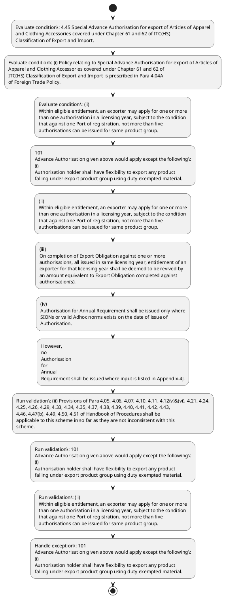

# Chapter 4 / Section 4.45: Special Advance Authorisation for export of Articles of Apparel

**Chapter Title:** Duty Exemption / Remission Schemes

**Pages:** 26

**Purpose:** 4.45 Special Advance Authorisation for export of Articles of Apparel
and Clothing Accessories covered under Chapter 61 and 62 of ITC(HS)
Classification of Export and Import.

**Purpose Thanglish:** Indha Special Advance Authorisation for export of Articles of Apparel section-la, 4.45 Special Advance Authorisation for export of Articles of Apparel
and Clothing Accessories covered under Chapter 61 and 62 of ITC(HS)
Classification of export and import.

**Summary:** 4.45 Special Advance Authorisation for export of Articles of Apparel
and Clothing Accessories covered under Chapter 61 and 62 of ITC(HS)
Classification of Export and Import. (i) Policy relating to Special Advance Authorisation for export of Articles of
Apparel and Clothing Accessories covered under Chapter 61 and 62 of
ITC(HS) Classification of Export and Import is prescribed in Para 4.04A
of Foreign Trade Policy. (ii) Provisions of Para 4.05, 4.06, 4.07, 4.10, 4.11, 4.12(v)&(vi), 4.21, 4.24,
4.25, 4.26, 4.29, 4.33, 4.34, 4.35, 4.37, 4.38, 4.39, 4.40, 4.41, 4.42, 4.43,
4.46, 4.47(b), 4.49, 4.50, 4.51 of Handbook of Procedures shall be
applicable to this scheme in so far as they are not inconsistent with this
scheme.

**Business Meaning:** Special Advance Authorisation for export of Articles of Apparel governs how DGFT business controls should be applied, validated, and enforced.

**Business Explanation:** Special Advance Authorisation for export of Articles of Apparel explains the operating rule set that DEKAI should enforce. Key control points include (ii) Provisions of Para 4.05, 4.06, 4.07, 4.10, 4.11, 4.12(v)&(vi), 4.21, 4.24,
4.25, 4.26, 4.29, 4.33, 4.34, 4.35, 4.37, 4.38, 4.39, 4.40, 4.41, 4.42, 4.43,
4.46, 4.47(b), 4.49, 4.50, 4.51 of Handbook of Procedures shall be
applicable to this scheme in so far as they are not inconsistent with this
scheme. The section also drives actions such as 101
Advance Authorisation given above would apply except the following:
(i)
Authorisation holder shall have flexibility to export any product
falling under export product group using duty exempted material..

**Business Explanation Thanglish:** Indha Special Advance Authorisation for export of Articles of Apparel section-la, Special Advance Authorisation for export of Articles of Apparel explains the operating rule set that DEKAI should enforce. Key control points include (ii) Provisions of Para 4.05, 4.06, 4.07, 4.10, 4.11, 4.12(v)&(vi), 4.21, 4.24,
4.25, 4.26, 4.29, 4.33, 4.34, 4.35, 4.37, 4.38, 4.39, 4.40, 4.41, 4.42, 4.43,
4.46, 4.47(b), 4.49, 4.50, 4.51 of Handbook of Procedures kandippa be
applicable to this scheme in so far as they are not inconsistent with this
scheme. The section also drives actions such as 101
Advance Authorisation given above would apply except the following:
(i)
Authorisation holder kandippa have flexibility to export any product
falling under export product group using duty exempted material..

## Business Logic
- (ii) Provisions of Para 4.05, 4.06, 4.07, 4.10, 4.11, 4.12(v)&(vi), 4.21, 4.24,
4.25, 4.26, 4.29, 4.33, 4.34, 4.35, 4.37, 4.38, 4.39, 4.40, 4.41, 4.42, 4.43,
4.46, 4.47(b), 4.49, 4.50, 4.51 of Handbook of Procedures shall be
applicable to this scheme in so far as they are not inconsistent with this
scheme.
- 101
Advance Authorisation given above would apply except the following:
(i)
Authorisation holder shall have flexibility to export any product
falling under export product group using duty exempted material.
- (ii)
Within eligible entitlement, an exporter may apply for one or more
than one authorisation in a licensing year, subject to the condition
that against one Port of registration, not more than five
authorisations can be issued for same product group.
- One time
enhancement / reduction of the authorisation shall be available.
- (iii)
On completion of Export Obligation against one or more
authorisations, all issued in same licensing year, entitlement of an
exporter for that licensing year shall be deemed to be revived by
an amount equivalent to Export Obligation completed against
authorisation(s).
- (iv)
Authorisation for Annual Requirement shall be issued only where
SIONs or valid Adhoc norms exists on the date of issue of
Authorisation.
- However,
no
Authorisation
for
Annual
Requirement shall be issued where input is listed in Appendix-4J.
- (b)
At the time of clearance of the import consignment against the
authorisation, exporter shall mention technical characteristics, quality
and specifications which shall be endorsed in the Bill of Entry / invoice,
duly attested by the Customs authority, in respect of following inputs:
“Alloy steel including stainless steel, copper alloy, synthetic rubber,
bearings, solvents, perfumes/ essential oils/aromatic chemicals,
surfactants, relevant fabrics and marble.”
4.45 Special Advance Authorisation for export of Articles of Apparel
and Clothing Accessories covered under Chapter 61 and 62 of ITC(HS)
Classification of Export and Import.
- (ii)
Provisions of Para 4.05, 4.06, 4.07, 4.10, 4.11, 4.12(v)&(vi), 4.21, 4.24,
4.25, 4.26, 4.29, 4.33, 4.34, 4.35, 4.37, 4.38, 4.39, 4.40, 4.41, 4.42, 4.43,
4.46, 4.47(b), 4.49, 4.50, 4.51 of Handbook of Procedures shall be
applicable to this scheme in so far as they are not inconsistent with this
scheme.

## Business Rules
- rule_id=CH4-SEC4_45-R001, rule_description=(ii) Provisions of Para 4.05, 4.06, 4.07, 4.10, 4.11, 4.12(v)&(vi), 4.21, 4.24,
4.25, 4.26, 4.29, 4.33, 4.34, 4.35, 4.37, 4.38, 4.39, 4.40, 4.41, 4.42, 4.43,
4.46, 4.47(b), 4.49, 4.50, 4.51 of Handbook of Procedures shall be
applicable to this scheme in so far as they are not inconsistent with this
scheme., trigger=Special Advance Authorisation for export of Articles of Apparel, condition=4.45 Special Advance Authorisation for export of Articles of Apparel
and Clothing Accessories covered under Chapter 61 and 62 of ITC(HS)
Classification of Export and Import., validation=(ii) Provisions of Para 4.05, 4.06, 4.07, 4.10, 4.11, 4.12(v)&(vi), 4.21, 4.24,
4.25, 4.26, 4.29, 4.33, 4.34, 4.35, 4.37, 4.38, 4.39, 4.40, 4.41, 4.42, 4.43,
4.46, 4.47(b), 4.49, 4.50, 4.51 of Handbook of Procedures shall be
applicable to this scheme in so far as they are not inconsistent with this
scheme., action=101
Advance Authorisation given above would apply except the following:
(i)
Authorisation holder shall have flexibility to export any product
falling under export product group using duty exempted material., exception=101
Advance Authorisation given above would apply except the following:
(i)
Authorisation holder shall have flexibility to export any product
falling under export product group using duty exempted material., output=DEKAI should produce a compliance decision for 4.45 - Special Advance Authorisation for export of Articles of Apparel.
- rule_id=CH4-SEC4_45-R002, rule_description=101
Advance Authorisation given above would apply except the following:
(i)
Authorisation holder shall have flexibility to export any product
falling under export product group using duty exempted material., trigger=Special Advance Authorisation for export of Articles of Apparel, condition=(i) Policy relating to Special Advance Authorisation for export of Articles of
Apparel and Clothing Accessories covered under Chapter 61 and 62 of
ITC(HS) Classification of Export and Import is prescribed in Para 4.04A
of Foreign Trade Policy., validation=101
Advance Authorisation given above would apply except the following:
(i)
Authorisation holder shall have flexibility to export any product
falling under export product group using duty exempted material., action=(ii)
Within eligible entitlement, an exporter may apply for one or more
than one authorisation in a licensing year, subject to the condition
that against one Port of registration, not more than five
authorisations can be issued for same product group., exception=However,
no
Authorisation
for
Annual
Requirement shall be issued where input is listed in Appendix-4J., output=DEKAI should produce a compliance decision for 4.45 - Special Advance Authorisation for export of Articles of Apparel.
- rule_id=CH4-SEC4_45-R003, rule_description=(ii)
Within eligible entitlement, an exporter may apply for one or more
than one authorisation in a licensing year, subject to the condition
that against one Port of registration, not more than five
authorisations can be issued for same product group., trigger=Special Advance Authorisation for export of Articles of Apparel, condition=(ii)
Within eligible entitlement, an exporter may apply for one or more
than one authorisation in a licensing year, subject to the condition
that against one Port of registration, not more than five
authorisations can be issued for same product group., validation=(ii)
Within eligible entitlement, an exporter may apply for one or more
than one authorisation in a licensing year, subject to the condition
that against one Port of registration, not more than five
authorisations can be issued for same product group., action=(iii)
On completion of Export Obligation against one or more
authorisations, all issued in same licensing year, entitlement of an
exporter for that licensing year shall be deemed to be revived by
an amount equivalent to Export Obligation completed against
authorisation(s)., exception=However,
no
Authorisation
for
Annual
Requirement shall be issued where input is listed in Appendix-4J., output=DEKAI should produce a compliance decision for 4.45 - Special Advance Authorisation for export of Articles of Apparel.
- rule_id=CH4-SEC4_45-R004, rule_description=One time
enhancement / reduction of the authorisation shall be available., trigger=Special Advance Authorisation for export of Articles of Apparel, condition=(iv)
Authorisation for Annual Requirement shall be issued only where
SIONs or valid Adhoc norms exists on the date of issue of
Authorisation., validation=One time
enhancement / reduction of the authorisation shall be available., action=(iv)
Authorisation for Annual Requirement shall be issued only where
SIONs or valid Adhoc norms exists on the date of issue of
Authorisation., exception=However,
no
Authorisation
for
Annual
Requirement shall be issued where input is listed in Appendix-4J., output=DEKAI should produce a compliance decision for 4.45 - Special Advance Authorisation for export of Articles of Apparel.
- rule_id=CH4-SEC4_45-R005, rule_description=(iii)
On completion of Export Obligation against one or more
authorisations, all issued in same licensing year, entitlement of an
exporter for that licensing year shall be deemed to be revived by
an amount equivalent to Export Obligation completed against
authorisation(s)., trigger=Special Advance Authorisation for export of Articles of Apparel, condition=However,
no
Authorisation
for
Annual
Requirement shall be issued where input is listed in Appendix-4J., validation=(iii)
On completion of Export Obligation against one or more
authorisations, all issued in same licensing year, entitlement of an
exporter for that licensing year shall be deemed to be revived by
an amount equivalent to Export Obligation completed against
authorisation(s)., action=However,
no
Authorisation
for
Annual
Requirement shall be issued where input is listed in Appendix-4J., exception=However,
no
Authorisation
for
Annual
Requirement shall be issued where input is listed in Appendix-4J., output=DEKAI should produce a compliance decision for 4.45 - Special Advance Authorisation for export of Articles of Apparel.
- rule_id=CH4-SEC4_45-R006, rule_description=(iv)
Authorisation for Annual Requirement shall be issued only where
SIONs or valid Adhoc norms exists on the date of issue of
Authorisation., trigger=Special Advance Authorisation for export of Articles of Apparel, condition=(b)
At the time of clearance of the import consignment against the
authorisation, exporter shall mention technical characteristics, quality
and specifications which shall be endorsed in the Bill of Entry / invoice,
duly attested by the Customs authority, in respect of following inputs:
“Alloy steel including stainless steel, copper alloy, synthetic rubber,
bearings, solvents, perfumes/ essential oils/aromatic chemicals,
surfactants, relevant fabrics and marble.”
4.45 Special Advance Authorisation for export of Articles of Apparel
and Clothing Accessories covered under Chapter 61 and 62 of ITC(HS)
Classification of Export and Import., validation=(iv)
Authorisation for Annual Requirement shall be issued only where
SIONs or valid Adhoc norms exists on the date of issue of
Authorisation., action=However,
no
Authorisation
for
Annual
Requirement shall be issued where input is listed in Appendix-4J., exception=However,
no
Authorisation
for
Annual
Requirement shall be issued where input is listed in Appendix-4J., output=DEKAI should produce a compliance decision for 4.45 - Special Advance Authorisation for export of Articles of Apparel.
- rule_id=CH4-SEC4_45-R007, rule_description=However,
no
Authorisation
for
Annual
Requirement shall be issued where input is listed in Appendix-4J., trigger=Special Advance Authorisation for export of Articles of Apparel, condition=(i)
Policy relating to Special Advance Authorisation for export of Articles of
Apparel and Clothing Accessories covered under Chapter 61 and 62 of
ITC(HS) Classification of Export and Import is prescribed in Para 4.04A
of Foreign Trade Policy., validation=However,
no
Authorisation
for
Annual
Requirement shall be issued where input is listed in Appendix-4J., action=However,
no
Authorisation
for
Annual
Requirement shall be issued where input is listed in Appendix-4J., exception=However,
no
Authorisation
for
Annual
Requirement shall be issued where input is listed in Appendix-4J., output=DEKAI should produce a compliance decision for 4.45 - Special Advance Authorisation for export of Articles of Apparel.
- rule_id=CH4-SEC4_45-R008, rule_description=(b)
At the time of clearance of the import consignment against the
authorisation, exporter shall mention technical characteristics, quality
and specifications which shall be endorsed in the Bill of Entry / invoice,
duly attested by the Customs authority, in respect of following inputs:
“Alloy steel including stainless steel, copper alloy, synthetic rubber,
bearings, solvents, perfumes/ essential oils/aromatic chemicals,
surfactants, relevant fabrics and marble.”
4.45 Special Advance Authorisation for export of Articles of Apparel
and Clothing Accessories covered under Chapter 61 and 62 of ITC(HS)
Classification of Export and Import., trigger=Special Advance Authorisation for export of Articles of Apparel, condition=(i)
Policy relating to Special Advance Authorisation for export of Articles of
Apparel and Clothing Accessories covered under Chapter 61 and 62 of
ITC(HS) Classification of Export and Import is prescribed in Para 4.04A
of Foreign Trade Policy., validation=(b)
At the time of clearance of the import consignment against the
authorisation, exporter shall mention technical characteristics, quality
and specifications which shall be endorsed in the Bill of Entry / invoice,
duly attested by the Customs authority, in respect of following inputs:
“Alloy steel including stainless steel, copper alloy, synthetic rubber,
bearings, solvents, perfumes/ essential oils/aromatic chemicals,
surfactants, relevant fabrics and marble.”
4.45 Special Advance Authorisation for export of Articles of Apparel
and Clothing Accessories covered under Chapter 61 and 62 of ITC(HS)
Classification of Export and Import., action=However,
no
Authorisation
for
Annual
Requirement shall be issued where input is listed in Appendix-4J., exception=However,
no
Authorisation
for
Annual
Requirement shall be issued where input is listed in Appendix-4J., output=DEKAI should produce a compliance decision for 4.45 - Special Advance Authorisation for export of Articles of Apparel.
- rule_id=CH4-SEC4_45-R009, rule_description=(ii)
Provisions of Para 4.05, 4.06, 4.07, 4.10, 4.11, 4.12(v)&(vi), 4.21, 4.24,
4.25, 4.26, 4.29, 4.33, 4.34, 4.35, 4.37, 4.38, 4.39, 4.40, 4.41, 4.42, 4.43,
4.46, 4.47(b), 4.49, 4.50, 4.51 of Handbook of Procedures shall be
applicable to this scheme in so far as they are not inconsistent with this
scheme., trigger=Special Advance Authorisation for export of Articles of Apparel, condition=(i)
Policy relating to Special Advance Authorisation for export of Articles of
Apparel and Clothing Accessories covered under Chapter 61 and 62 of
ITC(HS) Classification of Export and Import is prescribed in Para 4.04A
of Foreign Trade Policy., validation=(ii)
Provisions of Para 4.05, 4.06, 4.07, 4.10, 4.11, 4.12(v)&(vi), 4.21, 4.24,
4.25, 4.26, 4.29, 4.33, 4.34, 4.35, 4.37, 4.38, 4.39, 4.40, 4.41, 4.42, 4.43,
4.46, 4.47(b), 4.49, 4.50, 4.51 of Handbook of Procedures shall be
applicable to this scheme in so far as they are not inconsistent with this
scheme., action=However,
no
Authorisation
for
Annual
Requirement shall be issued where input is listed in Appendix-4J., exception=However,
no
Authorisation
for
Annual
Requirement shall be issued where input is listed in Appendix-4J., output=DEKAI should produce a compliance decision for 4.45 - Special Advance Authorisation for export of Articles of Apparel.

## Conditions
- 4.45 Special Advance Authorisation for export of Articles of Apparel
and Clothing Accessories covered under Chapter 61 and 62 of ITC(HS)
Classification of Export and Import.
- (i) Policy relating to Special Advance Authorisation for export of Articles of
Apparel and Clothing Accessories covered under Chapter 61 and 62 of
ITC(HS) Classification of Export and Import is prescribed in Para 4.04A
of Foreign Trade Policy.
- (ii)
Within eligible entitlement, an exporter may apply for one or more
than one authorisation in a licensing year, subject to the condition
that against one Port of registration, not more than five
authorisations can be issued for same product group.
- (iv)
Authorisation for Annual Requirement shall be issued only where
SIONs or valid Adhoc norms exists on the date of issue of
Authorisation.
- However,
no
Authorisation
for
Annual
Requirement shall be issued where input is listed in Appendix-4J.
- (b)
At the time of clearance of the import consignment against the
authorisation, exporter shall mention technical characteristics, quality
and specifications which shall be endorsed in the Bill of Entry / invoice,
duly attested by the Customs authority, in respect of following inputs:
“Alloy steel including stainless steel, copper alloy, synthetic rubber,
bearings, solvents, perfumes/ essential oils/aromatic chemicals,
surfactants, relevant fabrics and marble.”
4.45 Special Advance Authorisation for export of Articles of Apparel
and Clothing Accessories covered under Chapter 61 and 62 of ITC(HS)
Classification of Export and Import.
- (i)
Policy relating to Special Advance Authorisation for export of Articles of
Apparel and Clothing Accessories covered under Chapter 61 and 62 of
ITC(HS) Classification of Export and Import is prescribed in Para 4.04A
of Foreign Trade Policy.

## Condition Logic
- id=4.4.45.1, if=4.45 Special Advance Authorisation for export of Articles of Apparel
and Clothing Accessories covered under Chapter 61 and 62 of ITC(HS)
Classification of Export and Import., then=101
Advance Authorisation given above would apply except the following:
(i)
Authorisation holder shall have flexibility to export any product
falling under export product group using duty exempted material., source=4.45 Special Advance Authorisation for export of Articles of Apparel
and Clothing Accessories covered under Chapter 61 and 62 of ITC(HS)
Classification of Export and Import.
- id=4.4.45.2, if=(i) Policy relating to Special Advance Authorisation for export of Articles of
Apparel and Clothing Accessories covered under Chapter 61 and 62 of
ITC(HS) Classification of Export and Import is prescribed in Para 4.04A
of Foreign Trade Policy., then=101
Advance Authorisation given above would apply except the following:
(i)
Authorisation holder shall have flexibility to export any product
falling under export product group using duty exempted material., source=(i) Policy relating to Special Advance Authorisation for export of Articles of
Apparel and Clothing Accessories covered under Chapter 61 and 62 of
ITC(HS) Classification of Export and Import is prescribed in Para 4.04A
of Foreign Trade Policy.
- id=4.4.45.3, if=(ii)
Within eligible entitlement, an exporter may apply for one or more
than one authorisation in a licensing year, subject to the condition
that against one Port of registration, not more than five
authorisations can be issued for same product group., then=101
Advance Authorisation given above would apply except the following:
(i)
Authorisation holder shall have flexibility to export any product
falling under export product group using duty exempted material., source=(ii)
Within eligible entitlement, an exporter may apply for one or more
than one authorisation in a licensing year, subject to the condition
that against one Port of registration, not more than five
authorisations can be issued for same product group.
- id=4.4.45.4, if=(iv)
Authorisation for Annual Requirement shall be issued only where
SIONs or valid Adhoc norms exists on the date of issue of
Authorisation., then=101
Advance Authorisation given above would apply except the following:
(i)
Authorisation holder shall have flexibility to export any product
falling under export product group using duty exempted material., source=(iv)
Authorisation for Annual Requirement shall be issued only where
SIONs or valid Adhoc norms exists on the date of issue of
Authorisation.
- id=4.4.45.5, if=However,
no
Authorisation
for
Annual
Requirement shall be issued where input is listed in Appendix-4J., then=101
Advance Authorisation given above would apply except the following:
(i)
Authorisation holder shall have flexibility to export any product
falling under export product group using duty exempted material., source=However,
no
Authorisation
for
Annual
Requirement shall be issued where input is listed in Appendix-4J.
- id=4.4.45.6, if=(b)
At the time of clearance of the import consignment against the
authorisation, exporter shall mention technical characteristics, quality
and specifications which shall be endorsed in the Bill of Entry / invoice,
duly attested by the Customs authority, in respect of following inputs:
“Alloy steel including stainless steel, copper alloy, synthetic rubber,
bearings, solvents, perfumes/ essential oils/aromatic chemicals,
surfactants, relevant fabrics and marble.”
4.45 Special Advance Authorisation for export of Articles of Apparel
and Clothing Accessories covered under Chapter 61 and 62 of ITC(HS)
Classification of Export and Import., then=101
Advance Authorisation given above would apply except the following:
(i)
Authorisation holder shall have flexibility to export any product
falling under export product group using duty exempted material., source=(b)
At the time of clearance of the import consignment against the
authorisation, exporter shall mention technical characteristics, quality
and specifications which shall be endorsed in the Bill of Entry / invoice,
duly attested by the Customs authority, in respect of following inputs:
“Alloy steel including stainless steel, copper alloy, synthetic rubber,
bearings, solvents, perfumes/ essential oils/aromatic chemicals,
surfactants, relevant fabrics and marble.”
4.45 Special Advance Authorisation for export of Articles of Apparel
and Clothing Accessories covered under Chapter 61 and 62 of ITC(HS)
Classification of Export and Import.
- id=4.4.45.7, if=(i)
Policy relating to Special Advance Authorisation for export of Articles of
Apparel and Clothing Accessories covered under Chapter 61 and 62 of
ITC(HS) Classification of Export and Import is prescribed in Para 4.04A
of Foreign Trade Policy., then=101
Advance Authorisation given above would apply except the following:
(i)
Authorisation holder shall have flexibility to export any product
falling under export product group using duty exempted material., source=(i)
Policy relating to Special Advance Authorisation for export of Articles of
Apparel and Clothing Accessories covered under Chapter 61 and 62 of
ITC(HS) Classification of Export and Import is prescribed in Para 4.04A
of Foreign Trade Policy.

## Validations
- (ii) Provisions of Para 4.05, 4.06, 4.07, 4.10, 4.11, 4.12(v)&(vi), 4.21, 4.24,
4.25, 4.26, 4.29, 4.33, 4.34, 4.35, 4.37, 4.38, 4.39, 4.40, 4.41, 4.42, 4.43,
4.46, 4.47(b), 4.49, 4.50, 4.51 of Handbook of Procedures shall be
applicable to this scheme in so far as they are not inconsistent with this
scheme.
- 101
Advance Authorisation given above would apply except the following:
(i)
Authorisation holder shall have flexibility to export any product
falling under export product group using duty exempted material.
- (ii)
Within eligible entitlement, an exporter may apply for one or more
than one authorisation in a licensing year, subject to the condition
that against one Port of registration, not more than five
authorisations can be issued for same product group.
- One time
enhancement / reduction of the authorisation shall be available.
- (iii)
On completion of Export Obligation against one or more
authorisations, all issued in same licensing year, entitlement of an
exporter for that licensing year shall be deemed to be revived by
an amount equivalent to Export Obligation completed against
authorisation(s).
- (iv)
Authorisation for Annual Requirement shall be issued only where
SIONs or valid Adhoc norms exists on the date of issue of
Authorisation.
- However,
no
Authorisation
for
Annual
Requirement shall be issued where input is listed in Appendix-4J.
- (b)
At the time of clearance of the import consignment against the
authorisation, exporter shall mention technical characteristics, quality
and specifications which shall be endorsed in the Bill of Entry / invoice,
duly attested by the Customs authority, in respect of following inputs:
“Alloy steel including stainless steel, copper alloy, synthetic rubber,
bearings, solvents, perfumes/ essential oils/aromatic chemicals,
surfactants, relevant fabrics and marble.”
4.45 Special Advance Authorisation for export of Articles of Apparel
and Clothing Accessories covered under Chapter 61 and 62 of ITC(HS)
Classification of Export and Import.
- (ii)
Provisions of Para 4.05, 4.06, 4.07, 4.10, 4.11, 4.12(v)&(vi), 4.21, 4.24,
4.25, 4.26, 4.29, 4.33, 4.34, 4.35, 4.37, 4.38, 4.39, 4.40, 4.41, 4.42, 4.43,
4.46, 4.47(b), 4.49, 4.50, 4.51 of Handbook of Procedures shall be
applicable to this scheme in so far as they are not inconsistent with this
scheme.

## Exceptions
- 101
Advance Authorisation given above would apply except the following:
(i)
Authorisation holder shall have flexibility to export any product
falling under export product group using duty exempted material.
- However,
no
Authorisation
for
Annual
Requirement shall be issued where input is listed in Appendix-4J.

## Dependencies
- 61
- 4
- 4.05
- 4.04
- 4.06
- 4.07
- 4.10
- 4.11
- 4.12
- 4.21
- 4.24
- 4.25
- 4.26
- 4.29
- 4.33
- 4.34
- 4.35
- 4.37
- 4.38
- 4.39
- 4.40
- 4.41
- 4.42
- 4.43
- 4.46
- 4.47
- 4.49
- 4.50
- 4.51
- 1
- 2
- 3
- 5
- 6

## Authorities
- Customs
- Customs authority

## Required Documents
- (b)
At the time of clearance of the import consignment against the
authorisation, exporter shall mention technical characteristics, quality
and specifications which shall be endorsed in the Bill of Entry / invoice,
duly attested by the Customs authority, in respect of following inputs:
“Alloy steel including stainless steel, copper alloy, synthetic rubber,
bearings, solvents, perfumes/ essential oils/aromatic chemicals,
surfactants, relevant fabrics and marble.”
4.45 Special Advance Authorisation for export of Articles of Apparel
and Clothing Accessories covered under Chapter 61 and 62 of ITC(HS)
Classification of Export and Import.

## Timelines
- (ii)
Within eligible entitlement, an exporter may apply for one or more
than one authorisation in a licensing year, subject to the condition
that against one Port of registration, not more than five
authorisations can be issued for same product group.

## Actions
- 101
Advance Authorisation given above would apply except the following:
(i)
Authorisation holder shall have flexibility to export any product
falling under export product group using duty exempted material.
- (ii)
Within eligible entitlement, an exporter may apply for one or more
than one authorisation in a licensing year, subject to the condition
that against one Port of registration, not more than five
authorisations can be issued for same product group.
- (iii)
On completion of Export Obligation against one or more
authorisations, all issued in same licensing year, entitlement of an
exporter for that licensing year shall be deemed to be revived by
an amount equivalent to Export Obligation completed against
authorisation(s).
- (iv)
Authorisation for Annual Requirement shall be issued only where
SIONs or valid Adhoc norms exists on the date of issue of
Authorisation.
- However,
no
Authorisation
for
Annual
Requirement shall be issued where input is listed in Appendix-4J.

## Workflow
- Evaluate condition: 4.45 Special Advance Authorisation for export of Articles of Apparel
and Clothing Accessories covered under Chapter 61 and 62 of ITC(HS)
Classification of Export and Import.
- Evaluate condition: (i) Policy relating to Special Advance Authorisation for export of Articles of
Apparel and Clothing Accessories covered under Chapter 61 and 62 of
ITC(HS) Classification of Export and Import is prescribed in Para 4.04A
of Foreign Trade Policy.
- Evaluate condition: (ii)
Within eligible entitlement, an exporter may apply for one or more
than one authorisation in a licensing year, subject to the condition
that against one Port of registration, not more than five
authorisations can be issued for same product group.
- 101
Advance Authorisation given above would apply except the following:
(i)
Authorisation holder shall have flexibility to export any product
falling under export product group using duty exempted material.
- (ii)
Within eligible entitlement, an exporter may apply for one or more
than one authorisation in a licensing year, subject to the condition
that against one Port of registration, not more than five
authorisations can be issued for same product group.
- (iii)
On completion of Export Obligation against one or more
authorisations, all issued in same licensing year, entitlement of an
exporter for that licensing year shall be deemed to be revived by
an amount equivalent to Export Obligation completed against
authorisation(s).
- (iv)
Authorisation for Annual Requirement shall be issued only where
SIONs or valid Adhoc norms exists on the date of issue of
Authorisation.
- However,
no
Authorisation
for
Annual
Requirement shall be issued where input is listed in Appendix-4J.
- Run validation: (ii) Provisions of Para 4.05, 4.06, 4.07, 4.10, 4.11, 4.12(v)&(vi), 4.21, 4.24,
4.25, 4.26, 4.29, 4.33, 4.34, 4.35, 4.37, 4.38, 4.39, 4.40, 4.41, 4.42, 4.43,
4.46, 4.47(b), 4.49, 4.50, 4.51 of Handbook of Procedures shall be
applicable to this scheme in so far as they are not inconsistent with this
scheme.
- Run validation: 101
Advance Authorisation given above would apply except the following:
(i)
Authorisation holder shall have flexibility to export any product
falling under export product group using duty exempted material.
- Run validation: (ii)
Within eligible entitlement, an exporter may apply for one or more
than one authorisation in a licensing year, subject to the condition
that against one Port of registration, not more than five
authorisations can be issued for same product group.
- Handle exception: 101
Advance Authorisation given above would apply except the following:
(i)
Authorisation holder shall have flexibility to export any product
falling under export product group using duty exempted material.

## Workflow ASCII
```text
Special Advance Authorisation for export of Articles of Apparel
Evaluate condition: 4.45 Special Advance Authorisation for export of Articles of Apparel
and Clothing Accessories covered under Chapter 61 and 62 of ITC(HS)
Classification of Export and Import.
   |
   v
Evaluate condition: (i) Policy relating to Special Advance Authorisation for export of Articles of
Apparel and Clothing Accessories covered under Chapter 61 and 62 of
ITC(HS) Classification of Export and Import is prescribed in Para 4.04A
of Foreign Trade Policy.
   |
   v
Evaluate condition: (ii)
Within eligible entitlement, an exporter may apply for one or more
than one authorisation in a licensing year, subject to the condition
that against one Port of registration, not more than five
authorisations can be issued for same product group.
   |
   v
101
Advance Authorisation given above would apply except the following:
(i)
Authorisation holder shall have flexibility to export any product
falling under export product group using duty exempted material.
   |
   v
(ii)
Within eligible entitlement, an exporter may apply for one or more
than one authorisation in a licensing year, subject to the condition
that against one Port of registration, not more than five
authorisations can be issued for same product group.
   |
   v
(iii)
On completion of Export Obligation against one or more
authorisations, all issued in same licensing year, entitlement of an
exporter for that licensing year shall be deemed to be revived by
an amount equivalent to Export Obligation completed against
authorisation(s).
   |
   v
(iv)
Authorisation for Annual Requirement shall be issued only where
SIONs or valid Adhoc norms exists on the date of issue of
Authorisation.
   |
   v
However,
no
Authorisation
for
Annual
Requirement shall be issued where input is listed in Appendix-4J.
   |
   v
Run validation: (ii) Provisions of Para 4.05, 4.06, 4.07, 4.10, 4.11, 4.12(v)&(vi), 4.21, 4.24,
4.25, 4.26, 4.29, 4.33, 4.34, 4.35, 4.37, 4.38, 4.39, 4.40, 4.41, 4.42, 4.43,
4.46, 4.47(b), 4.49, 4.50, 4.51 of Handbook of Procedures shall be
applicable to this scheme in so far as they are not inconsistent with this
scheme.
   |
   v
Run validation: 101
Advance Authorisation given above would apply except the following:
(i)
Authorisation holder shall have flexibility to export any product
falling under export product group using duty exempted material.
   |
   v
Run validation: (ii)
Within eligible entitlement, an exporter may apply for one or more
than one authorisation in a licensing year, subject to the condition
that against one Port of registration, not more than five
authorisations can be issued for same product group.
   |
   v
Handle exception: 101
Advance Authorisation given above would apply except the following:
(i)
Authorisation holder shall have flexibility to export any product
falling under export product group using duty exempted material.
```

## Decision Tree
- IF 4.45 Special Advance Authorisation for export of Articles of Apparel
and Clothing Accessories covered under Chapter 61 and 62 of ITC(HS)
Classification of Export and Import. THEN 101
Advance Authorisation given above would apply except the following:
(i)
Authorisation holder shall have flexibility to export any product
falling under export product group using duty exempted material.
- IF (i) Policy relating to Special Advance Authorisation for export of Articles of
Apparel and Clothing Accessories covered under Chapter 61 and 62 of
ITC(HS) Classification of Export and Import is prescribed in Para 4.04A
of Foreign Trade Policy. THEN 101
Advance Authorisation given above would apply except the following:
(i)
Authorisation holder shall have flexibility to export any product
falling under export product group using duty exempted material.
- IF (ii)
Within eligible entitlement, an exporter may apply for one or more
than one authorisation in a licensing year, subject to the condition
that against one Port of registration, not more than five
authorisations can be issued for same product group. THEN 101
Advance Authorisation given above would apply except the following:
(i)
Authorisation holder shall have flexibility to export any product
falling under export product group using duty exempted material.
- IF (iv)
Authorisation for Annual Requirement shall be issued only where
SIONs or valid Adhoc norms exists on the date of issue of
Authorisation. THEN 101
Advance Authorisation given above would apply except the following:
(i)
Authorisation holder shall have flexibility to export any product
falling under export product group using duty exempted material.
- IF However,
no
Authorisation
for
Annual
Requirement shall be issued where input is listed in Appendix-4J. THEN 101
Advance Authorisation given above would apply except the following:
(i)
Authorisation holder shall have flexibility to export any product
falling under export product group using duty exempted material.
- IF exception applies (101
Advance Authorisation given above would apply except the following:
(i)
Authorisation holder shall have flexibility to export any product
falling under export product group using duty exempted material.) THEN route to manual review
- IF exception applies (However,
no
Authorisation
for
Annual
Requirement shall be issued where input is listed in Appendix-4J.) THEN route to manual review

## Decision Tree ASCII
```text
Special Advance Authorisation for export of Articles of Apparel Decision
IF 4.45 Special Advance Authorisation for export of Articles of Apparel
and Clothing Accessories covered under Chapter 61 and 62 of ITC(HS)
Classification of Export and Import. THEN 101
Advance Authorisation given above would apply except the following:
(i)
Authorisation holder shall have flexibility to export any product
falling under export product group using duty exempted material.
   |
   v
IF (i) Policy relating to Special Advance Authorisation for export of Articles of
Apparel and Clothing Accessories covered under Chapter 61 and 62 of
ITC(HS) Classification of Export and Import is prescribed in Para 4.04A
of Foreign Trade Policy. THEN 101
Advance Authorisation given above would apply except the following:
(i)
Authorisation holder shall have flexibility to export any product
falling under export product group using duty exempted material.
   |
   v
IF (ii)
Within eligible entitlement, an exporter may apply for one or more
than one authorisation in a licensing year, subject to the condition
that against one Port of registration, not more than five
authorisations can be issued for same product group. THEN 101
Advance Authorisation given above would apply except the following:
(i)
Authorisation holder shall have flexibility to export any product
falling under export product group using duty exempted material.
   |
   v
IF (iv)
Authorisation for Annual Requirement shall be issued only where
SIONs or valid Adhoc norms exists on the date of issue of
Authorisation. THEN 101
Advance Authorisation given above would apply except the following:
(i)
Authorisation holder shall have flexibility to export any product
falling under export product group using duty exempted material.
   |
   v
IF However,
no
Authorisation
for
Annual
Requirement shall be issued where input is listed in Appendix-4J. THEN 101
Advance Authorisation given above would apply except the following:
(i)
Authorisation holder shall have flexibility to export any product
falling under export product group using duty exempted material.
   |
   v
IF exception applies (101
Advance Authorisation given above would apply except the following:
(i)
Authorisation holder shall have flexibility to export any product
falling under export product group using duty exempted material.) THEN route to manual review
   |
   v
IF exception applies (However,
no
Authorisation
for
Annual
Requirement shall be issued where input is listed in Appendix-4J.) THEN route to manual review
```

## Examples
- User asks to process Special Advance Authorisation for export of Articles of Apparel; the platform checks conditions, validations, and documents before action.

**Real-world Example:** Example: an importer or exporter invokes Special Advance Authorisation for export of Articles of Apparel, submits (b)
At the time of clearance of the import consignment against the
authorisation, exporter shall mention technical characteristics, quality
and specifications which shall be endorsed in the Bill of Entry / invoice,
duly attested by the Customs authority, in respect of following inputs:
“Alloy steel including stainless steel, copper alloy, synthetic rubber,
bearings, solvents, perfumes/ essential oils/aromatic chemicals,
surfactants, relevant fabrics and marble.”
4.45 Special Advance Authorisation for export of Articles of Apparel
and Clothing Accessories covered under Chapter 61 and 62 of ITC(HS)
Classification of Export and Import., and DEKAI uses the extracted rules to 101
advance authorisation given above would apply except the following:
(i)
authorisation holder shall have flexibility to export any product
falling under export product group using duty exempted material..

**Real-world Example Thanglish:** Indha Special Advance Authorisation for export of Articles of Apparel section-la, Example: an importer or exporter invokes Special Advance Authorisation for export of Articles of Apparel, submits (b)
At the time of clearance of the import consignment against the
authorisation, exporter kandippa mention technical characteristics, quality
and specifications which kandippa be endorsed in the Bill of Entry / invoice,
duly attested by the Customs authority, in respect of following inputs:
“Alloy steel including stainless steel, copper alloy, synthetic rubber,
bearings, solvents, perfumes/ essential oils/aromatic chemicals,
surfactants, relevant fabrics and marble.”
4.45 Special Advance Authorisation for export of Articles of Apparel
and Clothing Accessories covered under Chapter 61 and 62 of ITC(HS)
Classification of export and import., and DEKAI uses the extracted rules to 101
advance authorisation given above would apply except the following:
(i)
authorisation holder kandippa have flexibility to export any product
falling under export product group using duty exempted material..

## AI Rules
- IF detected context matches section rule THEN enforce: (ii) Provisions of Para 4.05, 4.06, 4.07, 4.10, 4.11, 4.12(v)&(vi), 4.21, 4.24,
4.25, 4.26, 4.29, 4.33, 4.34, 4.35, 4.37, 4.38, 4.39, 4.40, 4.41, 4.42, 4.43,
4.46, 4.47(b), 4.49, 4.50, 4.51 of Handbook of Procedures shall be
applicable to this scheme in so far as they are not inconsistent with this
scheme.
- IF detected context matches section rule THEN enforce: 101
Advance Authorisation given above would apply except the following:
(i)
Authorisation holder shall have flexibility to export any product
falling under export product group using duty exempted material.
- IF detected context matches section rule THEN enforce: (ii)
Within eligible entitlement, an exporter may apply for one or more
than one authorisation in a licensing year, subject to the condition
that against one Port of registration, not more than five
authorisations can be issued for same product group.
- IF detected context matches section rule THEN enforce: One time
enhancement / reduction of the authorisation shall be available.
- IF detected context matches section rule THEN enforce: (iii)
On completion of Export Obligation against one or more
authorisations, all issued in same licensing year, entitlement of an
exporter for that licensing year shall be deemed to be revived by
an amount equivalent to Export Obligation completed against
authorisation(s).
- IF detected context matches section rule THEN enforce: (iv)
Authorisation for Annual Requirement shall be issued only where
SIONs or valid Adhoc norms exists on the date of issue of
Authorisation.
- IF validations pass THEN recommend action: 101
Advance Authorisation given above would apply except the following:
(i)
Authorisation holder shall have flexibility to export any product
falling under export product group using duty exempted material.

## Database Fields
- name=section_code, type=string, required=True, source=parsed_section_heading
- name=section_title, type=string, required=True, source=parsed_section_heading
- name=for_flag, type=boolean, required=False, source=keyword:for
- name=and_flag, type=boolean, required=False, source=keyword:and
- name=itc_flag, type=boolean, required=False, source=keyword:ITC
- name=far_flag, type=boolean, required=False, source=keyword:far
- name=are_flag, type=boolean, required=False, source=keyword:are
- name=not_flag, type=boolean, required=False, source=keyword:not
- name=the_flag, type=boolean, required=False, source=keyword:the
- name=any_flag, type=boolean, required=False, source=keyword:any
- name=document_1_submitted, type=boolean, required=True, source=(b)
At the time of clearance of the import consignment against the
authorisation, exporter shall mention technical characteristics, quality
and specifications which shall be endorsed in the Bill of Entry / invoice,
duly attested by the Customs authority, in respect of following inputs:
“Alloy steel including stainless steel, copper alloy, synthetic rubber,
bearings, solvents, perfumes/ essential oils/aromatic chemicals,
surfactants, relevant fabrics and marble.”
4.45 Special Advance Authorisation for export of Articles of Apparel
and Clothing Accessories covered under Chapter 61 and 62 of ITC(HS)
Classification of Export and Import.

## API Requirements
- method=GET, path=/api/dgft/sections/4.45, purpose=Retrieve knowledge payload for section 4.45, query_params=['include=workflow,decision_tree,validations'], response_fields=['section', 'title', 'summary', 'conditions', 'validations', 'exceptions', 'workflow', 'decision_tree']
- method=POST, path=/api/dgft/Special-Advance-Authorisation-for-export-of-Articles-of-Apparel/validate, purpose=Validate inputs and documents for Special Advance Authorisation for export of Articles of Apparel, request_fields=['section_code', 'section_title', 'document_1_submitted'], response_fields=['status', 'errors', 'warnings', 'next_actions']
- method=POST, path=/api/dgft/Special-Advance-Authorisation-for-export-of-Articles-of-Apparel/execute, purpose=Trigger business action for 101
Advance Authorisation given above would apply except the following:
(i)
Authorisation holder shall have flexibility to export any product
falling under export product group using duty exempted material., request_fields=['section_code', 'section_title', 'document_1_submitted'], response_fields=['reference_id', 'status', 'authority', 'timeline']

## UI Screens
- screen_id=Special_Advance_Authorisation_for_export_of_Articles_of_Apparel_overview, name=Special Advance Authorisation for export of Articles of Apparel Overview, purpose=Show section summary, authority, timeline, and eligibility cues., widgets=['summary_card', 'conditions_table', 'authority_badges', 'timeline_panel']
- screen_id=Special_Advance_Authorisation_for_export_of_Articles_of_Apparel_submission, name=Special Advance Authorisation for export of Articles of Apparel Submission, purpose=Capture applicant data and supporting documents., widgets=['dynamic_form', 'document_uploader', 'validation_panel', 'next_action_footer'], fields=['section_code', 'section_title', 'for_flag', 'and_flag', 'itc_flag', 'far_flag', 'are_flag', 'not_flag']
- screen_id=Special_Advance_Authorisation_for_export_of_Articles_of_Apparel_exceptions, name=Special Advance Authorisation for export of Articles of Apparel Exception Review, purpose=Explain exception handling and manual review triggers., widgets=['exception_banner', 'decision_tree', 'case_notes']

## Error Messages
- Validation failed because the section requirements were not fully met.

## FAQ
- question_en=What is the purpose of section 4.45?, answer_en=Special Advance Authorisation for export of Articles of Apparel explains the operating rule set that DEKAI should enforce. Key control points include (ii) Provisions of Para 4.05, 4.06, 4.07, 4.10, 4.11, 4.12(v)&(vi), 4.21, 4.24,
4.25, 4.26, 4.29, 4.33, 4.34, 4.35, 4.37, 4.38, 4.39, 4.40, 4.41, 4.42, 4.43,
4.46, 4.47(b), 4.49, 4.50, 4.51 of Handbook of Procedures shall be
applicable to this scheme in so far as they are not inconsistent with this
scheme. The section also drives actions such as 101
Advance Authorisation given above would apply except the following:
(i)
Authorisation holder shall have flexibility to export any product
falling under export product group using duty exempted material.., question_thanglish=Indha Special Advance Authorisation for export of Articles of Apparel section-la, What is the purpose of section 4.45?, answer_thanglish=Indha Special Advance Authorisation for export of Articles of Apparel section-la, Special Advance Authorisation for export of Articles of Apparel explains the operating rule set that DEKAI should enforce. Key control points include (ii) Provisions of Para 4.05, 4.06, 4.07, 4.10, 4.11, 4.12(v)&(vi), 4.21, 4.24,
4.25, 4.26, 4.29, 4.33, 4.34, 4.35, 4.37, 4.38, 4.39, 4.40, 4.41, 4.42, 4.43,
4.46, 4.47(b), 4.49, 4.50, 4.51 of Handbook of Procedures kandippa be
applicable to this scheme in so far as they are not inconsistent with this
scheme. The section also drives actions such as 101
Advance Authorisation given above would apply except the following:
(i)
Authorisation holder kandippa have flexibility to export any product
falling under export product group using duty exempted material..
- question_en=What documents are required under Special Advance Authorisation for export of Articles of Apparel?, answer_en=(b)
At the time of clearance of the import consignment against the
authorisation, exporter shall mention technical characteristics, quality
and specifications which shall be endorsed in the Bill of Entry / invoice,
duly attested by the Customs authority, in respect of following inputs:
“Alloy steel including stainless steel, copper alloy, synthetic rubber,
bearings, solvents, perfumes/ essential oils/aromatic chemicals,
surfactants, relevant fabrics and marble.”
4.45 Special Advance Authorisation for export of Articles of Apparel
and Clothing Accessories covered under Chapter 61 and 62 of ITC(HS)
Classification of Export and Import., question_thanglish=Indha Special Advance Authorisation for export of Articles of Apparel section-la, What documents are required under Special Advance Authorisation for export of Articles of Apparel?, answer_thanglish=Indha Special Advance Authorisation for export of Articles of Apparel section-la, (b)
At the time of clearance of the import consignment against the
authorisation, exporter kandippa mention technical characteristics, quality
and specifications which kandippa be endorsed in the Bill of Entry / invoice,
duly attested by the Customs authority, in respect of following inputs:
“Alloy steel including stainless steel, copper alloy, synthetic rubber,
bearings, solvents, perfumes/ essential oils/aromatic chemicals,
surfactants, relevant fabrics and marble.”
4.45 Special Advance Authorisation for export of Articles of Apparel
and Clothing Accessories covered under Chapter 61 and 62 of ITC(HS)
Classification of export and import.
- question_en=Which authority handles Special Advance Authorisation for export of Articles of Apparel?, answer_en=Customs, Customs authority, question_thanglish=Indha Special Advance Authorisation for export of Articles of Apparel section-la, Which authority handles Special Advance Authorisation for export of Articles of Apparel?, answer_thanglish=Indha Special Advance Authorisation for export of Articles of Apparel section-la, Customs, Customs authority

## Questions Users May Ask
- What does Special Advance Authorisation for export of Articles of Apparel require?
- Which documents are needed for Special Advance Authorisation for export of Articles of Apparel?
- How does DEKAI validate Special Advance Authorisation for export of Articles of Apparel requests?
- What action should be taken for Special Advance Authorisation for export of Articles of Apparel?

## Expected AI Answers
- Special Advance Authorisation for export of Articles of Apparel requires the platform to interpret the section text, apply the extracted business rules, and present the correct next action.
- Required documents are inferred from the section text: (b)
At the time of clearance of the import consignment against the
authorisation, exporter shall mention technical characteristics, quality
and specifications which shall be endorsed in the Bill of Entry / invoice,
duly attested by the Customs authority, in respect of following inputs:
“Alloy steel including stainless steel, copper alloy, synthetic rubber,
bearings, solvents, perfumes/ essential oils/aromatic chemicals,
surfactants, relevant fabrics and marble.”
4.45 Special Advance Authorisation for export of Articles of Apparel
and Clothing Accessories covered under Chapter 61 and 62 of ITC(HS)
Classification of Export and Import.
- DEKAI validates Special Advance Authorisation for export of Articles of Apparel by checking conditions, required documents, authority references, and exception clauses before recommending an outcome.
- The primary extracted action is: 101
Advance Authorisation given above would apply except the following:
(i)
Authorisation holder shall have flexibility to export any product
falling under export product group using duty exempted material.

## AI Q&A Examples
- question_en=User asks: How do I comply with Special Advance Authorisation for export of Articles of Apparel?, answer_en=AI answers: DEKAI should evaluate section 4.45, apply the extracted rules, and guide the user through Evaluate condition: 4.45 Special Advance Authorisation for export of Articles of Apparel
and Clothing Accessories covered under Chapter 61 and 62 of ITC(HS)
Classification of Export and Import.., question_thanglish=Indha Special Advance Authorisation for export of Articles of Apparel section-la, User asks: How do I comply with Special Advance Authorisation for export of Articles of Apparel?, answer_thanglish=Indha Special Advance Authorisation for export of Articles of Apparel section-la, AI answers: DEKAI should evaluate section 4.45, apply the extracted rules, and guide the user through Evaluate condition: 4.45 Special Advance Authorisation for export of Articles of Apparel
and Clothing Accessories covered under Chapter 61 and 62 of ITC(HS)
Classification of export and import..
- question_en=User asks: Which validations apply to Special Advance Authorisation for export of Articles of Apparel?, answer_en=AI answers: Applicable validations are (ii) Provisions of Para 4.05, 4.06, 4.07, 4.10, 4.11, 4.12(v)&(vi), 4.21, 4.24,
4.25, 4.26, 4.29, 4.33, 4.34, 4.35, 4.37, 4.38, 4.39, 4.40, 4.41, 4.42, 4.43,
4.46, 4.47(b), 4.49, 4.50, 4.51 of Handbook of Procedures shall be
applicable to this scheme in so far as they are not inconsistent with this
scheme., 101
Advance Authorisation given above would apply except the following:
(i)
Authorisation holder shall have flexibility to export any product
falling under export product group using duty exempted material., (ii)
Within eligible entitlement, an exporter may apply for one or more
than one authorisation in a licensing year, subject to the condition
that against one Port of registration, not more than five
authorisations can be issued for same product group., question_thanglish=Indha Special Advance Authorisation for export of Articles of Apparel section-la, User asks: Which validations apply to Special Advance Authorisation for export of Articles of Apparel?, answer_thanglish=Indha Special Advance Authorisation for export of Articles of Apparel section-la, AI answers: Applicable validations are (ii) Provisions of Para 4.05, 4.06, 4.07, 4.10, 4.11, 4.12(v)&(vi), 4.21, 4.24,
4.25, 4.26, 4.29, 4.33, 4.34, 4.35, 4.37, 4.38, 4.39, 4.40, 4.41, 4.42, 4.43,
4.46, 4.47(b), 4.49, 4.50, 4.51 of Handbook of Procedures kandippa be
applicable to this scheme in so far as they are not inconsistent with this
scheme., 101
Advance Authorisation given above would apply except the following:
(i)
Authorisation holder kandippa have flexibility to export any product
falling under export product group using duty exempted material., (ii)
Within eligible entitlement, an exporter may apply for one or more
than one authorisation in a licensing year, subject to the condition
that against one Port of registration, not more than five
authorisations can be issued for same product group.

## DEKAI AI Implementation Notes
- Capture chapter 4, section 4.45, title, and page references as immutable knowledge metadata.
- Bind validations for Special Advance Authorisation for export of Articles of Apparel into a rule engine keyed by the rule IDs extracted for this section.
- Expose document upload controls for: (b)
At the time of clearance of the import consignment against the
authorisation, exporter shall mention technical characteristics, quality
and specifications which shall be endorsed in the Bill of Entry / invoice,
duly attested by the Customs authority, in respect of following inputs:
“Alloy steel including stainless steel, copper alloy, synthetic rubber,
bearings, solvents, perfumes/ essential oils/aromatic chemicals,
surfactants, relevant fabrics and marble.”
4.45 Special Advance Authorisation for export of Articles of Apparel
and Clothing Accessories covered under Chapter 61 and 62 of ITC(HS)
Classification of Export and Import..
- Route escalations or approvals to: Customs, Customs authority.
- Trigger manual review when exception clauses are detected.
- Show contextual links to related sections: 4.04, 4.05, 4.06, 4.07, 4.10, 4.11, 4.12, 4.21, 4.24, 4.25, 4.26, 4.29, 4.33, 4.34, 4.35, 4.37, 4.38, 4.39, 4.40, 4.41, 4.42, 4.43, 4.46, 4.47, 4.49, 4.50, 4.51, 1, 2, 3, 4, 5, 6.

## DEKAI AI Implementation Notes Thanglish
- Indha Special Advance Authorisation for export of Articles of Apparel section-la, Capture chapter 4, section 4.45, title, and page references as immutable knowledge metadata.
- Indha Special Advance Authorisation for export of Articles of Apparel section-la, Bind validations for Special Advance Authorisation for export of Articles of Apparel into a rule engine keyed by the rule IDs extracted for this section.
- Indha Special Advance Authorisation for export of Articles of Apparel section-la, Expose document upload controls for: (b)
At the time of clearance of the import consignment against the
authorisation, exporter kandippa mention technical characteristics, quality
and specifications which kandippa be endorsed in the Bill of Entry / invoice,
duly attested by the Customs authority, in respect of following inputs:
“Alloy steel including stainless steel, copper alloy, synthetic rubber,
bearings, solvents, perfumes/ essential oils/aromatic chemicals,
surfactants, relevant fabrics and marble.”
4.45 Special Advance Authorisation for export of Articles of Apparel
and Clothing Accessories covered under Chapter 61 and 62 of ITC(HS)
Classification of export and import..
- Indha Special Advance Authorisation for export of Articles of Apparel section-la, Route escalations or approvals to: Customs, Customs authority.
- Indha Special Advance Authorisation for export of Articles of Apparel section-la, Trigger manual review when exception clauses are detected.
- Indha Special Advance Authorisation for export of Articles of Apparel section-la, Show contextual links to related sections: 4.04, 4.05, 4.06, 4.07, 4.10, 4.11, 4.12, 4.21, 4.24, 4.25, 4.26, 4.29, 4.33, 4.34, 4.35, 4.37, 4.38, 4.39, 4.40, 4.41, 4.42, 4.43, 4.46, 4.47, 4.49, 4.50, 4.51, 1, 2, 3, 4, 5, 6.

## AI Metadata
- Keywords: for, and, ITC, far, are, not, the, any, may, one, can, iii, all, Para, this, they, with, have, duty, more
- Search Keywords: for, and, ITC, far, are, not, the, any, may, one, can, iii, all, Para, this, they, with, have, duty, more
- Intent: Support Special Advance Authorisation for export of Articles of Apparel processing and compliance validation.
- Tags: 4.45, Special Advance Authorisation for export of Articles of Apparel, business-rule, document-driven, dgft
- Related Sections: 4.04, 4.05, 4.06, 4.07, 4.10, 4.11, 4.12, 4.21, 4.24, 4.25, 4.26, 4.29, 4.33, 4.34, 4.35, 4.37, 4.38, 4.39, 4.40, 4.41, 4.42, 4.43, 4.46, 4.47, 4.49, 4.50, 4.51, 1, 2, 3, 4, 5, 6
- Related Chapters: 
- Related Rules: (ii) Provisions of Para 4.05, 4.06, 4.07, 4.10, 4.11, 4.12(v)&(vi), 4.21, 4.24,
4.25, 4.26, 4.29, 4.33, 4.34, 4.35, 4.37, 4.38, 4.39, 4.40, 4.41, 4.42, 4.43,
4.46, 4.47(b), 4.49, 4.50, 4.51 of Handbook of Procedures shall be
applicable to this scheme in so far as they are not inconsistent with this
scheme., 101
Advance Authorisation given above would apply except the following:
(i)
Authorisation holder shall have flexibility to export any product
falling under export product group using duty exempted material., (ii)
Within eligible entitlement, an exporter may apply for one or more
than one authorisation in a licensing year, subject to the condition
that against one Port of registration, not more than five
authorisations can be issued for same product group., One time
enhancement / reduction of the authorisation shall be available., (iii)
On completion of Export Obligation against one or more
authorisations, all issued in same licensing year, entitlement of an
exporter for that licensing year shall be deemed to be revived by
an amount equivalent to Export Obligation completed against
authorisation(s).

## Mermaid

```mermaid
flowchart TD
    S1["Evaluate condition: 4.45 Special Advance Authorisation for export of Articles of Apparel
and Clothing Accessories covered under Chapter 61 and 62 of ITC(HS)
Classification of Export and Import."]
    S2["Evaluate condition: (i) Policy relating to Special Advance Authorisation for export of Articles of
Apparel and Clothing Accessories covered under Chapter 61 and 62 of
ITC(HS) Classification of Export and Import is prescribed in Para 4.04A
of Foreign Trade Policy."]
    S1 --> S2
    S3["Evaluate condition: (ii)
Within eligible entitlement, an exporter may apply for one or more
than one authorisation in a licensing year, subject to the condition
that against one Port of registration, not more than five
authorisations can be issued for same product group."]
    S2 --> S3
    S4["101
Advance Authorisation given above would apply except the following:
(i)
Authorisation holder shall have flexibility to export any product
falling under export product group using duty exempted material."]
    S3 --> S4
    S5["(ii)
Within eligible entitlement, an exporter may apply for one or more
than one authorisation in a licensing year, subject to the condition
that against one Port of registration, not more than five
authorisations can be issued for same product group."]
    S4 --> S5
    S6["(iii)
On completion of Export Obligation against one or more
authorisations, all issued in same licensing year, entitlement of an
exporter for that licensing year shall be deemed to be revived by
an amount equivalent to Export Obligation completed against
authorisation(s)."]
    S5 --> S6
    S7["(iv)
Authorisation for Annual Requirement shall be issued only where
SIONs or valid Adhoc norms exists on the date of issue of
Authorisation."]
    S6 --> S7
    S8["However,
no
Authorisation
for
Annual
Requirement shall be issued where input is listed in Appendix-4J."]
    S7 --> S8
    S9["Run validation: (ii) Provisions of Para 4.05, 4.06, 4.07, 4.10, 4.11, 4.12(v)&(vi), 4.21, 4.24,
4.25, 4.26, 4.29, 4.33, 4.34, 4.35, 4.37, 4.38, 4.39, 4.40, 4.41, 4.42, 4.43,
4.46, 4.47(b), 4.49, 4.50, 4.51 of Handbook of Procedures shall be
applicable to this scheme in so far as they are not inconsistent with this
scheme."]
    S8 --> S9
    S10["Run validation: 101
Advance Authorisation given above would apply except the following:
(i)
Authorisation holder shall have flexibility to export any product
falling under export product group using duty exempted material."]
    S9 --> S10
    S11["Run validation: (ii)
Within eligible entitlement, an exporter may apply for one or more
than one authorisation in a licensing year, subject to the condition
that against one Port of registration, not more than five
authorisations can be issued for same product group."]
    S10 --> S11
    S12["Handle exception: 101
Advance Authorisation given above would apply except the following:
(i)
Authorisation holder shall have flexibility to export any product
falling under export product group using duty exempted material."]
    S11 --> S12
```


## PlantUML

