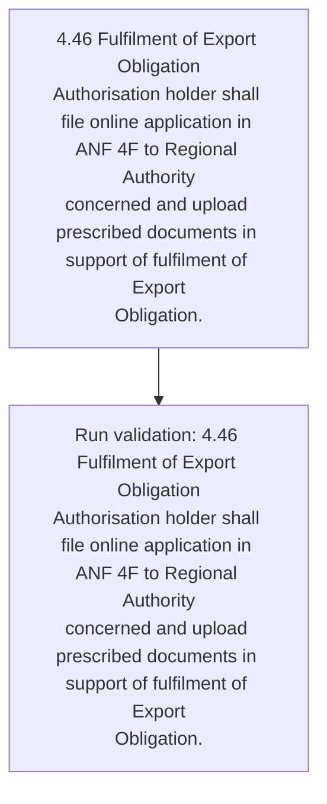
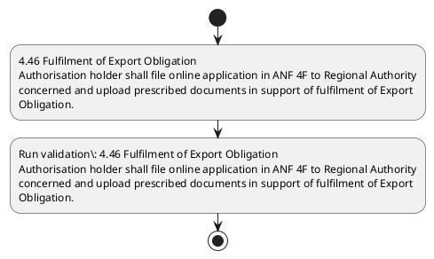

# Chapter 4 / Section 4.46: Fulfilment of Export Obligation

**Chapter Title:** Duty Exemption / Remission Schemes

**Pages:** 27

**Purpose:** 4.46 Fulfilment of Export Obligation
Authorisation holder shall file online application in ANF 4F to Regional Authority
concerned and upload prescribed documents in support of fulfilment of Export
Obligation.

**Purpose Thanglish:** Indha Fulfilment of Export Obligation section-la, 4.46 Fulfilment of export Obligation
Authorisation holder kandippa file online application in ANF 4F to Regional authority
concerned and upload prescribed documents in support of fulfilment of export
Obligation.

**Summary:** 4.46 Fulfilment of Export Obligation
Authorisation holder shall file online application in ANF 4F to Regional Authority
concerned and upload prescribed documents in support of fulfilment of Export
Obligation.

**Business Meaning:** Fulfilment of Export Obligation governs how DGFT business controls should be applied, validated, and enforced.

**Business Explanation:** Fulfilment of Export Obligation explains the operating rule set that DEKAI should enforce. Key control points include 4.46 Fulfilment of Export Obligation
Authorisation holder shall file online application in ANF 4F to Regional Authority
concerned and upload prescribed documents in support of fulfilment of Export
Obligation. The section also drives actions such as 4.46 Fulfilment of Export Obligation
Authorisation holder shall file online application in ANF 4F to Regional Authority
concerned and upload prescribed documents in support of fulfilment of Export
Obligation..

**Business Explanation Thanglish:** Indha Fulfilment of Export Obligation section-la, Fulfilment of export Obligation explains the operating rule set that DEKAI should enforce. Key control points include 4.46 Fulfilment of export Obligation
Authorisation holder kandippa file online application in ANF 4F to Regional authority
concerned and upload prescribed documents in support of fulfilment of export
Obligation. The section also drives actions such as 4.46 Fulfilment of export Obligation
Authorisation holder kandippa file online application in ANF 4F to Regional authority
concerned and upload prescribed documents in support of fulfilment of export
Obligation..

## Business Logic
- 4.46 Fulfilment of Export Obligation
Authorisation holder shall file online application in ANF 4F to Regional Authority
concerned and upload prescribed documents in support of fulfilment of Export
Obligation.

## Business Rules
- rule_id=CH4-SEC4_46-R001, rule_description=4.46 Fulfilment of Export Obligation
Authorisation holder shall file online application in ANF 4F to Regional Authority
concerned and upload prescribed documents in support of fulfilment of Export
Obligation., trigger=Fulfilment of Export Obligation, condition=Section 4.46 is applicable, validation=4.46 Fulfilment of Export Obligation
Authorisation holder shall file online application in ANF 4F to Regional Authority
concerned and upload prescribed documents in support of fulfilment of Export
Obligation., action=4.46 Fulfilment of Export Obligation
Authorisation holder shall file online application in ANF 4F to Regional Authority
concerned and upload prescribed documents in support of fulfilment of Export
Obligation., exception=No explicit exception found in uploaded documents., output=DEKAI should produce a compliance decision for 4.46 - Fulfilment of Export Obligation.

## Conditions
- None identified

## Condition Logic
- id=4.4.46.1, if=Section 4.46 is applicable, then=4.46 Fulfilment of Export Obligation
Authorisation holder shall file online application in ANF 4F to Regional Authority
concerned and upload prescribed documents in support of fulfilment of Export
Obligation., source=Derived from uploaded documents

## Validations
- 4.46 Fulfilment of Export Obligation
Authorisation holder shall file online application in ANF 4F to Regional Authority
concerned and upload prescribed documents in support of fulfilment of Export
Obligation.

## Exceptions
- None identified

## Dependencies
- None identified

## Authorities
- Regional Authority

## Required Documents
- 4.46 Fulfilment of Export Obligation
Authorisation holder shall file online application in ANF 4F to Regional Authority
concerned and upload prescribed documents in support of fulfilment of Export
Obligation.

## Timelines
- None identified

## Actions
- 4.46 Fulfilment of Export Obligation
Authorisation holder shall file online application in ANF 4F to Regional Authority
concerned and upload prescribed documents in support of fulfilment of Export
Obligation.

## Workflow
- 4.46 Fulfilment of Export Obligation
Authorisation holder shall file online application in ANF 4F to Regional Authority
concerned and upload prescribed documents in support of fulfilment of Export
Obligation.
- Run validation: 4.46 Fulfilment of Export Obligation
Authorisation holder shall file online application in ANF 4F to Regional Authority
concerned and upload prescribed documents in support of fulfilment of Export
Obligation.

## Workflow ASCII
```text
Fulfilment of Export Obligation
4.46 Fulfilment of Export Obligation
Authorisation holder shall file online application in ANF 4F to Regional Authority
concerned and upload prescribed documents in support of fulfilment of Export
Obligation.
   |
   v
Run validation: 4.46 Fulfilment of Export Obligation
Authorisation holder shall file online application in ANF 4F to Regional Authority
concerned and upload prescribed documents in support of fulfilment of Export
Obligation.
```

## Decision Tree
- IF section 4.46 applies THEN 4.46 Fulfilment of Export Obligation
Authorisation holder shall file online application in ANF 4F to Regional Authority
concerned and upload prescribed documents in support of fulfilment of Export
Obligation.

## Decision Tree ASCII
```text
Fulfilment of Export Obligation Decision
IF section 4.46 applies THEN 4.46 Fulfilment of Export Obligation
Authorisation holder shall file online application in ANF 4F to Regional Authority
concerned and upload prescribed documents in support of fulfilment of Export
Obligation.
```

## Examples
- User asks to process Fulfilment of Export Obligation; the platform checks conditions, validations, and documents before action.

**Real-world Example:** Example: an importer or exporter invokes Fulfilment of Export Obligation, submits 4.46 Fulfilment of Export Obligation
Authorisation holder shall file online application in ANF 4F to Regional Authority
concerned and upload prescribed documents in support of fulfilment of Export
Obligation., and DEKAI uses the extracted rules to 4.46 fulfilment of export obligation
authorisation holder shall file online application in anf 4f to regional authority
concerned and upload prescribed documents in support of fulfilment of export
obligation..

**Real-world Example Thanglish:** Indha Fulfilment of Export Obligation section-la, Example: an importer or exporter invokes Fulfilment of export Obligation, submits 4.46 Fulfilment of export Obligation
Authorisation holder kandippa file online application in ANF 4F to Regional authority
concerned and upload prescribed documents in support of fulfilment of export
Obligation., and DEKAI uses the extracted rules to 4.46 fulfilment of export obligation
authorisation holder kandippa file online application in anf 4f to regional authority
concerned and upload prescribed documents in support of fulfilment of export
obligation..

## AI Rules
- IF detected context matches section rule THEN enforce: 4.46 Fulfilment of Export Obligation
Authorisation holder shall file online application in ANF 4F to Regional Authority
concerned and upload prescribed documents in support of fulfilment of Export
Obligation.
- IF validations pass THEN recommend action: 4.46 Fulfilment of Export Obligation
Authorisation holder shall file online application in ANF 4F to Regional Authority
concerned and upload prescribed documents in support of fulfilment of Export
Obligation.

## Database Fields
- name=section_code, type=string, required=True, source=parsed_section_heading
- name=section_title, type=string, required=True, source=parsed_section_heading
- name=anf_flag, type=boolean, required=False, source=keyword:ANF
- name=and_flag, type=boolean, required=False, source=keyword:and
- name=file_flag, type=boolean, required=False, source=keyword:file
- name=shall_flag, type=boolean, required=False, source=keyword:shall
- name=export_flag, type=boolean, required=False, source=keyword:Export
- name=holder_flag, type=boolean, required=False, source=keyword:holder
- name=online_flag, type=boolean, required=False, source=keyword:online
- name=upload_flag, type=boolean, required=False, source=keyword:upload
- name=document_1_submitted, type=boolean, required=True, source=4.46 Fulfilment of Export Obligation
Authorisation holder shall file online application in ANF 4F to Regional Authority
concerned and upload prescribed documents in support of fulfilment of Export
Obligation.

## API Requirements
- method=GET, path=/api/dgft/sections/4.46, purpose=Retrieve knowledge payload for section 4.46, query_params=['include=workflow,decision_tree,validations'], response_fields=['section', 'title', 'summary', 'conditions', 'validations', 'exceptions', 'workflow', 'decision_tree']
- method=POST, path=/api/dgft/Fulfilment-of-Export-Obligation/validate, purpose=Validate inputs and documents for Fulfilment of Export Obligation, request_fields=['section_code', 'section_title', 'document_1_submitted'], response_fields=['status', 'errors', 'warnings', 'next_actions']
- method=POST, path=/api/dgft/Fulfilment-of-Export-Obligation/execute, purpose=Trigger business action for 4.46 Fulfilment of Export Obligation
Authorisation holder shall file online application in ANF 4F to Regional Authority
concerned and upload prescribed documents in support of fulfilment of Export
Obligation., request_fields=['section_code', 'section_title', 'document_1_submitted'], response_fields=['reference_id', 'status', 'authority', 'timeline']

## UI Screens
- screen_id=Fulfilment_of_Export_Obligation_overview, name=Fulfilment of Export Obligation Overview, purpose=Show section summary, authority, timeline, and eligibility cues., widgets=['summary_card', 'conditions_table', 'authority_badges', 'timeline_panel']
- screen_id=Fulfilment_of_Export_Obligation_submission, name=Fulfilment of Export Obligation Submission, purpose=Capture applicant data and supporting documents., widgets=['dynamic_form', 'document_uploader', 'validation_panel', 'next_action_footer'], fields=['section_code', 'section_title', 'anf_flag', 'and_flag', 'file_flag', 'shall_flag', 'export_flag', 'holder_flag']

## Error Messages
- Validation failed because the section requirements were not fully met.

## FAQ
- question_en=What is the purpose of section 4.46?, answer_en=Fulfilment of Export Obligation explains the operating rule set that DEKAI should enforce. Key control points include 4.46 Fulfilment of Export Obligation
Authorisation holder shall file online application in ANF 4F to Regional Authority
concerned and upload prescribed documents in support of fulfilment of Export
Obligation. The section also drives actions such as 4.46 Fulfilment of Export Obligation
Authorisation holder shall file online application in ANF 4F to Regional Authority
concerned and upload prescribed documents in support of fulfilment of Export
Obligation.., question_thanglish=Indha Fulfilment of Export Obligation section-la, What is the purpose of section 4.46?, answer_thanglish=Indha Fulfilment of Export Obligation section-la, Fulfilment of export Obligation explains the operating rule set that DEKAI should enforce. Key control points include 4.46 Fulfilment of export Obligation
Authorisation holder kandippa file online application in ANF 4F to Regional authority
concerned and upload prescribed documents in support of fulfilment of export
Obligation. The section also drives actions such as 4.46 Fulfilment of export Obligation
Authorisation holder kandippa file online application in ANF 4F to Regional authority
concerned and upload prescribed documents in support of fulfilment of export
Obligation..
- question_en=What documents are required under Fulfilment of Export Obligation?, answer_en=4.46 Fulfilment of Export Obligation
Authorisation holder shall file online application in ANF 4F to Regional Authority
concerned and upload prescribed documents in support of fulfilment of Export
Obligation., question_thanglish=Indha Fulfilment of Export Obligation section-la, What documents are required under Fulfilment of export Obligation?, answer_thanglish=Indha Fulfilment of Export Obligation section-la, 4.46 Fulfilment of export Obligation
Authorisation holder kandippa file online application in ANF 4F to Regional authority
concerned and upload prescribed documents in support of fulfilment of export
Obligation.
- question_en=Which authority handles Fulfilment of Export Obligation?, answer_en=Regional Authority, question_thanglish=Indha Fulfilment of Export Obligation section-la, Which authority handles Fulfilment of export Obligation?, answer_thanglish=Indha Fulfilment of Export Obligation section-la, Regional authority

## Questions Users May Ask
- What does Fulfilment of Export Obligation require?
- Which documents are needed for Fulfilment of Export Obligation?
- How does DEKAI validate Fulfilment of Export Obligation requests?
- What action should be taken for Fulfilment of Export Obligation?

## Expected AI Answers
- Fulfilment of Export Obligation requires the platform to interpret the section text, apply the extracted business rules, and present the correct next action.
- Required documents are inferred from the section text: 4.46 Fulfilment of Export Obligation
Authorisation holder shall file online application in ANF 4F to Regional Authority
concerned and upload prescribed documents in support of fulfilment of Export
Obligation.
- DEKAI validates Fulfilment of Export Obligation by checking conditions, required documents, authority references, and exception clauses before recommending an outcome.
- The primary extracted action is: 4.46 Fulfilment of Export Obligation
Authorisation holder shall file online application in ANF 4F to Regional Authority
concerned and upload prescribed documents in support of fulfilment of Export
Obligation.

## AI Q&A Examples
- question_en=User asks: How do I comply with Fulfilment of Export Obligation?, answer_en=AI answers: DEKAI should evaluate section 4.46, apply the extracted rules, and guide the user through 4.46 Fulfilment of Export Obligation
Authorisation holder shall file online application in ANF 4F to Regional Authority
concerned and upload prescribed documents in support of fulfilment of Export
Obligation.., question_thanglish=Indha Fulfilment of Export Obligation section-la, User asks: How do I comply with Fulfilment of export Obligation?, answer_thanglish=Indha Fulfilment of Export Obligation section-la, AI answers: DEKAI should evaluate section 4.46, apply the extracted rules, and guide the user through 4.46 Fulfilment of export Obligation
Authorisation holder kandippa file online application in ANF 4F to Regional authority
concerned and upload prescribed documents in support of fulfilment of export
Obligation..
- question_en=User asks: Which validations apply to Fulfilment of Export Obligation?, answer_en=AI answers: Applicable validations are 4.46 Fulfilment of Export Obligation
Authorisation holder shall file online application in ANF 4F to Regional Authority
concerned and upload prescribed documents in support of fulfilment of Export
Obligation., question_thanglish=Indha Fulfilment of Export Obligation section-la, User asks: Which validations apply to Fulfilment of export Obligation?, answer_thanglish=Indha Fulfilment of Export Obligation section-la, AI answers: Applicable validations are 4.46 Fulfilment of export Obligation
Authorisation holder kandippa file online application in ANF 4F to Regional authority
concerned and upload prescribed documents in support of fulfilment of export
Obligation.

## DEKAI AI Implementation Notes
- Capture chapter 4, section 4.46, title, and page references as immutable knowledge metadata.
- Bind validations for Fulfilment of Export Obligation into a rule engine keyed by the rule IDs extracted for this section.
- Expose document upload controls for: 4.46 Fulfilment of Export Obligation
Authorisation holder shall file online application in ANF 4F to Regional Authority
concerned and upload prescribed documents in support of fulfilment of Export
Obligation..
- Route escalations or approvals to: Regional Authority.

## DEKAI AI Implementation Notes Thanglish
- Indha Fulfilment of Export Obligation section-la, Capture chapter 4, section 4.46, title, and page references as immutable knowledge metadata.
- Indha Fulfilment of Export Obligation section-la, Bind validations for Fulfilment of export Obligation into a rule engine keyed by the rule IDs extracted for this section.
- Indha Fulfilment of Export Obligation section-la, Expose document upload controls for: 4.46 Fulfilment of export Obligation
Authorisation holder kandippa file online application in ANF 4F to Regional authority
concerned and upload prescribed documents in support of fulfilment of export
Obligation..
- Indha Fulfilment of Export Obligation section-la, Route escalations or approvals to: Regional authority.

## AI Metadata
- Keywords: ANF, and, file, shall, Export, holder, online, upload, support, Regional, Authority, concerned, documents, Fulfilment, Obligation, prescribed, application, Authorisation
- Search Keywords: ANF, and, file, shall, Export, holder, online, upload, support, Regional, Authority, concerned, documents, Fulfilment, Obligation, prescribed, application, Authorisation
- Intent: Support Fulfilment of Export Obligation processing and compliance validation.
- Tags: 4.46, Fulfilment of Export Obligation, business-rule, document-driven, dgft
- Related Sections: 
- Related Chapters: 
- Related Rules: 4.46 Fulfilment of Export Obligation
Authorisation holder shall file online application in ANF 4F to Regional Authority
concerned and upload prescribed documents in support of fulfilment of Export
Obligation.

## Mermaid


## PlantUML

