# Chapter 4 / Section 4.47: Redemption/No Bond Certificate

**Chapter Title:** Duty Exemption / Remission Schemes

**Pages:** 27, 28

**Purpose:** 4.47 Redemption/No Bond Certificate
(a) Bond Waiver:
In case Authorisation holder exports first (before effecting imports) by using
imported inputs/indigenously procured inputs, in that case the
Authorisation holder can seek waiver of Bond condition by submitting
evidence of export made and payment realised to that extent.

**Purpose Thanglish:** Indha Redemption/No Bond Certificate section-la, 4.47 Redemption/No Bond Certificate
(a) Bond Waiver:
In case Authorisation holder exports first (before effecting imports) by using
imported inputs/indigenously procured inputs, in that case the
Authorisation holder can seek waiver of Bond condition by submitting
evidence of export made and payment realised to that extent.

**Summary:** 4.47 Redemption/No Bond Certificate
(a) Bond Waiver:
In case Authorisation holder exports first (before effecting imports) by using
imported inputs/indigenously procured inputs, in that case the
Authorisation holder can seek waiver of Bond condition by submitting
evidence of export made and payment realised to that extent. If exports
made are less than the export obligation stipulated in the Authorisation,
request for waiver of bond condition, on pro-rata basis, can also be
considered. (i) For such a request, an applicant has to file online application
attaching Shipping Bills and e-BRC/ export realisations from RBI's
EDPMS wherever available in DGFT IT system.

**Business Meaning:** Redemption/No Bond Certificate governs how DGFT business controls should be applied, validated, and enforced.

**Business Explanation:** Redemption/No Bond Certificate explains the operating rule set that DEKAI should enforce. Key control points include Scanned copy of
other documents as prescribed in the ANF 4F shall also be
uploaded. The section also drives actions such as 4.47 Redemption/No Bond Certificate
(a) Bond Waiver:
In case Authorisation holder exports first (before effecting imports) by using
imported inputs/indigenously procured inputs, in that case the
Authorisation holder can seek waiver of Bond condition by submitting
evidence of export made and payment realised to that extent..

**Business Explanation Thanglish:** Indha Redemption/No Bond Certificate section-la, Redemption/No Bond Certificate explains the operating rule set that DEKAI should enforce. Key control points include Scanned copy of
other documents as prescribed in the ANF 4F kandippa also be
uploaded. The section also drives actions such as 4.47 Redemption/No Bond Certificate
(a) Bond Waiver:
In case Authorisation holder exports first (before effecting imports) by using
imported inputs/indigenously procured inputs, in that case the
Authorisation holder can seek waiver of Bond condition by submitting
evidence of export made and payment realised to that extent..

## Business Logic
- Scanned copy of
other documents as prescribed in the ANF 4F shall also be
uploaded.
- In case of deemed exports or export from non-EDI ports,
the documents evidencing proof of export/supply shall be
submitted at the counter of Regional Authority concerned giving
reference of online application in physical form except e- BRC/
export realisations from RBI's EDPMS wherever available in DGFT
IT system.
- (ii) In case Export Obligation has been fulfilled, Regional Authority
shall issue Bond Waiver Certificate (BWC) and forward a copy to
the Customs authority at the port of registration of Authorisation
enclosing details of shipping bill number(s), date(s), FOB value in
Indian Rupees as per shipping bill(s) and description of export
products in respect of shipment taken into account for allowing
waiver of Bond condition.
- Such bond waiver shall not preclude the
Customs Authority from taking bond in terms of the Customs
notification.
- It will be further subject to condition that
the applicant had not obtained revalidation earlier in terms of Para
4.39 (c) of HBP.
- Maximum period of validity of the Authorisation
including revalidation allowed under this para shall not exceed 24
months from the date of issue of Authorisation.
- (b) Export Obligation Discharge Certificate (EODC):
(i) On completion of exports and imports, the Authorisation holder
shall submit online application in ANF-4F as in (a) (i) above.
- (c) Ordinarily, redemption of BG / LUT shall not preclude customs authority
from conducting random checks and from taking action against
Authorisation holder for any misrepresentation, mis- declaration and
default detected subsequently as per the Customs Act.
- (d) Regional Authority shall take action against Authorisation holder in case
of non-submission of Appendix 4H & 4-I duly filled in, as stipulated in
paragraph 4.51 below or for any misrepresentation, mis- declaration
and default detected subsequently in details declared and furnished in
Appendix 4H & 4-I.
- An endorsement to this effect shall be made by
Regional Authority in the redemption certificate.

## Business Rules
- rule_id=CH4-SEC4_47-R001, rule_description=Scanned copy of
other documents as prescribed in the ANF 4F shall also be
uploaded., trigger=Redemption/No Bond Certificate, condition=4.47 Redemption/No Bond Certificate
(a) Bond Waiver:
In case Authorisation holder exports first (before effecting imports) by using
imported inputs/indigenously procured inputs, in that case the
Authorisation holder can seek waiver of Bond condition by submitting
evidence of export made and payment realised to that extent., validation=Scanned copy of
other documents as prescribed in the ANF 4F shall also be
uploaded., action=4.47 Redemption/No Bond Certificate
(a) Bond Waiver:
In case Authorisation holder exports first (before effecting imports) by using
imported inputs/indigenously procured inputs, in that case the
Authorisation holder can seek waiver of Bond condition by submitting
evidence of export made and payment realised to that extent., exception=In case of deemed exports or export from non-EDI ports,
the documents evidencing proof of export/supply shall be
submitted at the counter of Regional Authority concerned giving
reference of online application in physical form except e- BRC/
export realisations from RBI's EDPMS wherever available in DGFT
IT system., output=DEKAI should produce a compliance decision for 4.47 - Redemption/No Bond Certificate.
- rule_id=CH4-SEC4_47-R002, rule_description=In case of deemed exports or export from non-EDI ports,
the documents evidencing proof of export/supply shall be
submitted at the counter of Regional Authority concerned giving
reference of online application in physical form except e- BRC/
export realisations from RBI's EDPMS wherever available in DGFT
IT system., trigger=Redemption/No Bond Certificate, condition=If exports
made are less than the export obligation stipulated in the Authorisation,
request for waiver of bond condition, on pro-rata basis, can also be
considered., validation=In case of deemed exports or export from non-EDI ports,
the documents evidencing proof of export/supply shall be
submitted at the counter of Regional Authority concerned giving
reference of online application in physical form except e- BRC/
export realisations from RBI's EDPMS wherever available in DGFT
IT system., action=Scanned copy of
other documents as prescribed in the ANF 4F shall also be
uploaded., exception=In case of deemed exports or export from non-EDI ports,
the documents evidencing proof of export/supply shall be
submitted at the counter of Regional Authority concerned giving
reference of online application in physical form except e- BRC/
export realisations from RBI's EDPMS wherever available in DGFT
IT system., output=DEKAI should produce a compliance decision for 4.47 - Redemption/No Bond Certificate.
- rule_id=CH4-SEC4_47-R003, rule_description=(ii) In case Export Obligation has been fulfilled, Regional Authority
shall issue Bond Waiver Certificate (BWC) and forward a copy to
the Customs authority at the port of registration of Authorisation
enclosing details of shipping bill number(s), date(s), FOB value in
Indian Rupees as per shipping bill(s) and description of export
products in respect of shipment taken into account for allowing
waiver of Bond condition., trigger=Redemption/No Bond Certificate, condition=(i) For such a request, an applicant has to file online application
attaching Shipping Bills and e-BRC/ export realisations from RBI's
EDPMS wherever available in DGFT IT system., validation=(ii) In case Export Obligation has been fulfilled, Regional Authority
shall issue Bond Waiver Certificate (BWC) and forward a copy to
the Customs authority at the port of registration of Authorisation
enclosing details of shipping bill number(s), date(s), FOB value in
Indian Rupees as per shipping bill(s) and description of export
products in respect of shipment taken into account for allowing
waiver of Bond condition., action=In case of deemed exports or export from non-EDI ports,
the documents evidencing proof of export/supply shall be
submitted at the counter of Regional Authority concerned giving
reference of online application in physical form except e- BRC/
export realisations from RBI's EDPMS wherever available in DGFT
IT system., exception=In case of deemed exports or export from non-EDI ports,
the documents evidencing proof of export/supply shall be
submitted at the counter of Regional Authority concerned giving
reference of online application in physical form except e- BRC/
export realisations from RBI's EDPMS wherever available in DGFT
IT system., output=DEKAI should produce a compliance decision for 4.47 - Redemption/No Bond Certificate.
- rule_id=CH4-SEC4_47-R004, rule_description=Such bond waiver shall not preclude the
Customs Authority from taking bond in terms of the Customs
notification., trigger=Redemption/No Bond Certificate, condition=In case of deemed exports or export from non-EDI ports,
the documents evidencing proof of export/supply shall be
submitted at the counter of Regional Authority concerned giving
reference of online application in physical form except e- BRC/
export realisations from RBI's EDPMS wherever available in DGFT
IT system., validation=Such bond waiver shall not preclude the
Customs Authority from taking bond in terms of the Customs
notification., action=(ii) In case Export Obligation has been fulfilled, Regional Authority
shall issue Bond Waiver Certificate (BWC) and forward a copy to
the Customs authority at the port of registration of Authorisation
enclosing details of shipping bill number(s), date(s), FOB value in
Indian Rupees as per shipping bill(s) and description of export
products in respect of shipment taken into account for allowing
waiver of Bond condition., exception=In case of deemed exports or export from non-EDI ports,
the documents evidencing proof of export/supply shall be
submitted at the counter of Regional Authority concerned giving
reference of online application in physical form except e- BRC/
export realisations from RBI's EDPMS wherever available in DGFT
IT system., output=DEKAI should produce a compliance decision for 4.47 - Redemption/No Bond Certificate.
- rule_id=CH4-SEC4_47-R005, rule_description=It will be further subject to condition that
the applicant had not obtained revalidation earlier in terms of Para
4.39 (c) of HBP., trigger=Redemption/No Bond Certificate, condition=(ii) In case Export Obligation has been fulfilled, Regional Authority
shall issue Bond Waiver Certificate (BWC) and forward a copy to
the Customs authority at the port of registration of Authorisation
enclosing details of shipping bill number(s), date(s), FOB value in
Indian Rupees as per shipping bill(s) and description of export
products in respect of shipment taken into account for allowing
waiver of Bond condition., validation=Maximum period of validity of the Authorisation
including revalidation allowed under this para shall not exceed 24
months from the date of issue of Authorisation., action=102
4.47 Redemption/No Bond Certificate
(a)
Bond Waiver:
In case Authorisation holder exports first (before effecting imports) by using
imported inputs/indigenously procured inputs, in that case the
Authorisation holder can seek waiver of Bond condition by submitting
evidence of export made and payment realised to that extent., exception=In case of deemed exports or export from non-EDI ports,
the documents evidencing proof of export/supply shall be
submitted at the counter of Regional Authority concerned giving
reference of online application in physical form except e- BRC/
export realisations from RBI's EDPMS wherever available in DGFT
IT system., output=DEKAI should produce a compliance decision for 4.47 - Redemption/No Bond Certificate.
- rule_id=CH4-SEC4_47-R006, rule_description=Maximum period of validity of the Authorisation
including revalidation allowed under this para shall not exceed 24
months from the date of issue of Authorisation., trigger=Redemption/No Bond Certificate, condition=Such bond waiver shall not preclude the
Customs Authority from taking bond in terms of the Customs
notification., validation=(b) Export Obligation Discharge Certificate (EODC):
(i) On completion of exports and imports, the Authorisation holder
shall submit online application in ANF-4F as in (a) (i) above., action=It will be further subject to condition that
the applicant had not obtained revalidation earlier in terms of Para
4.39 (c) of HBP., exception=In case of deemed exports or export from non-EDI ports,
the documents evidencing proof of export/supply shall be
submitted at the counter of Regional Authority concerned giving
reference of online application in physical form except e- BRC/
export realisations from RBI's EDPMS wherever available in DGFT
IT system., output=DEKAI should produce a compliance decision for 4.47 - Redemption/No Bond Certificate.
- rule_id=CH4-SEC4_47-R007, rule_description=(b) Export Obligation Discharge Certificate (EODC):
(i) On completion of exports and imports, the Authorisation holder
shall submit online application in ANF-4F as in (a) (i) above., trigger=Redemption/No Bond Certificate, condition=(iii) While allowing waiver of Bond for such exports, Regional Authority
may revalidate the Authorisation in continuation for further six
months for replenishment of inputs consumed in the production of
exported product, from the date of endorsement provided
applicant has made a specific request in ANF 4D and paid requisite
pg., validation=(c) Ordinarily, redemption of BG / LUT shall not preclude customs authority
from conducting random checks and from taking action against
Authorisation holder for any misrepresentation, mis- declaration and
default detected subsequently as per the Customs Act., action=Maximum period of validity of the Authorisation
including revalidation allowed under this para shall not exceed 24
months from the date of issue of Authorisation., exception=In case of deemed exports or export from non-EDI ports,
the documents evidencing proof of export/supply shall be
submitted at the counter of Regional Authority concerned giving
reference of online application in physical form except e- BRC/
export realisations from RBI's EDPMS wherever available in DGFT
IT system., output=DEKAI should produce a compliance decision for 4.47 - Redemption/No Bond Certificate.
- rule_id=CH4-SEC4_47-R008, rule_description=(c) Ordinarily, redemption of BG / LUT shall not preclude customs authority
from conducting random checks and from taking action against
Authorisation holder for any misrepresentation, mis- declaration and
default detected subsequently as per the Customs Act., trigger=Redemption/No Bond Certificate, condition=102
4.47 Redemption/No Bond Certificate
(a)
Bond Waiver:
In case Authorisation holder exports first (before effecting imports) by using
imported inputs/indigenously procured inputs, in that case the
Authorisation holder can seek waiver of Bond condition by submitting
evidence of export made and payment realised to that extent., validation=(d) Regional Authority shall take action against Authorisation holder in case
of non-submission of Appendix 4H & 4-I duly filled in, as stipulated in
paragraph 4.51 below or for any misrepresentation, mis- declaration
and default detected subsequently in details declared and furnished in
Appendix 4H & 4-I., action=(b) Export Obligation Discharge Certificate (EODC):
(i) On completion of exports and imports, the Authorisation holder
shall submit online application in ANF-4F as in (a) (i) above., exception=In case of deemed exports or export from non-EDI ports,
the documents evidencing proof of export/supply shall be
submitted at the counter of Regional Authority concerned giving
reference of online application in physical form except e- BRC/
export realisations from RBI's EDPMS wherever available in DGFT
IT system., output=DEKAI should produce a compliance decision for 4.47 - Redemption/No Bond Certificate.
- rule_id=CH4-SEC4_47-R009, rule_description=(d) Regional Authority shall take action against Authorisation holder in case
of non-submission of Appendix 4H & 4-I duly filled in, as stipulated in
paragraph 4.51 below or for any misrepresentation, mis- declaration
and default detected subsequently in details declared and furnished in
Appendix 4H & 4-I., trigger=Redemption/No Bond Certificate, condition=(i)
For such a request, an applicant has to file online application
attaching Shipping Bills and e-BRC/ export realisations from RBI's
EDPMS wherever available in DGFT IT system., validation=An endorsement to this effect shall be made by
Regional Authority in the redemption certificate., action=In such
cases, if Export Obligation has been fulfilled, the Regional Authority
may issue EODC / Redemption Certificate to Authorisation holder
and forward a copy to the Customs authority at the port of
registration of Authorisation indicating the same details of proof of
fulfilment of Export Obligation as stated in paragraph(a) above
evidencing fulfilment of Export Obligation., exception=In case of deemed exports or export from non-EDI ports,
the documents evidencing proof of export/supply shall be
submitted at the counter of Regional Authority concerned giving
reference of online application in physical form except e- BRC/
export realisations from RBI's EDPMS wherever available in DGFT
IT system., output=DEKAI should produce a compliance decision for 4.47 - Redemption/No Bond Certificate.
- rule_id=CH4-SEC4_47-R010, rule_description=An endorsement to this effect shall be made by
Regional Authority in the redemption certificate., trigger=Redemption/No Bond Certificate, condition=(iii) While allowing waiver of Bond for such exports, Regional Authority
may revalidate the Authorisation in continuation for further six
months for replenishment of inputs consumed in the production of
exported product, from the date of endorsement provided
applicant has made a specific request in ANF 4D and paid requisite
fee for revalidation., validation=An endorsement to this effect shall be made by
Regional Authority in the redemption certificate., action=(d) Regional Authority shall take action against Authorisation holder in case
of non-submission of Appendix 4H & 4-I duly filled in, as stipulated in
paragraph 4.51 below or for any misrepresentation, mis- declaration
and default detected subsequently in details declared and furnished in
Appendix 4H & 4-I., exception=In case of deemed exports or export from non-EDI ports,
the documents evidencing proof of export/supply shall be
submitted at the counter of Regional Authority concerned giving
reference of online application in physical form except e- BRC/
export realisations from RBI's EDPMS wherever available in DGFT
IT system., output=DEKAI should produce a compliance decision for 4.47 - Redemption/No Bond Certificate.

## Conditions
- 4.47 Redemption/No Bond Certificate
(a) Bond Waiver:
In case Authorisation holder exports first (before effecting imports) by using
imported inputs/indigenously procured inputs, in that case the
Authorisation holder can seek waiver of Bond condition by submitting
evidence of export made and payment realised to that extent.
- If exports
made are less than the export obligation stipulated in the Authorisation,
request for waiver of bond condition, on pro-rata basis, can also be
considered.
- (i) For such a request, an applicant has to file online application
attaching Shipping Bills and e-BRC/ export realisations from RBI's
EDPMS wherever available in DGFT IT system.
- In case of deemed exports or export from non-EDI ports,
the documents evidencing proof of export/supply shall be
submitted at the counter of Regional Authority concerned giving
reference of online application in physical form except e- BRC/
export realisations from RBI's EDPMS wherever available in DGFT
IT system.
- (ii) In case Export Obligation has been fulfilled, Regional Authority
shall issue Bond Waiver Certificate (BWC) and forward a copy to
the Customs authority at the port of registration of Authorisation
enclosing details of shipping bill number(s), date(s), FOB value in
Indian Rupees as per shipping bill(s) and description of export
products in respect of shipment taken into account for allowing
waiver of Bond condition.
- Such bond waiver shall not preclude the
Customs Authority from taking bond in terms of the Customs
notification.
- (iii) While allowing waiver of Bond for such exports, Regional Authority
may revalidate the Authorisation in continuation for further six
months for replenishment of inputs consumed in the production of
exported product, from the date of endorsement provided
applicant has made a specific request in ANF 4D and paid requisite
pg.
- 102
4.47 Redemption/No Bond Certificate
(a)
Bond Waiver:
In case Authorisation holder exports first (before effecting imports) by using
imported inputs/indigenously procured inputs, in that case the
Authorisation holder can seek waiver of Bond condition by submitting
evidence of export made and payment realised to that extent.
- (i)
For such a request, an applicant has to file online application
attaching Shipping Bills and e-BRC/ export realisations from RBI's
EDPMS wherever available in DGFT IT system.
- (iii) While allowing waiver of Bond for such exports, Regional Authority
may revalidate the Authorisation in continuation for further six
months for replenishment of inputs consumed in the production of
exported product, from the date of endorsement provided
applicant has made a specific request in ANF 4D and paid requisite
fee for revalidation.
- It will be further subject to condition that
the applicant had not obtained revalidation earlier in terms of Para
4.39 (c) of HBP.
- (iv) Copy of the Bond Waiver Certificate will also be endorsed by the
Regional Authority to the Customs at the Port of Registration
eventually through EDI mode.
- (b) Export Obligation Discharge Certificate (EODC):
(i) On completion of exports and imports, the Authorisation holder
shall submit online application in ANF-4F as in (a) (i) above.
- In such
cases, if Export Obligation has been fulfilled, the Regional Authority
may issue EODC / Redemption Certificate to Authorisation holder
and forward a copy to the Customs authority at the port of
registration of Authorisation indicating the same details of proof of
fulfilment of Export Obligation as stated in paragraph(a) above
evidencing fulfilment of Export Obligation.
- (d) Regional Authority shall take action against Authorisation holder in case
of non-submission of Appendix 4H & 4-I duly filled in, as stipulated in
paragraph 4.51 below or for any misrepresentation, mis- declaration
and default detected subsequently in details declared and furnished in
Appendix 4H & 4-I.
- An endorsement to this effect shall be made by
Regional Authority in the redemption certificate.

## Condition Logic
- id=4.4.47.1, if=4.47 Redemption/No Bond Certificate
(a) Bond Waiver:
In case Authorisation holder exports first (before effecting imports) by using
imported inputs/indigenously procured inputs, in that case the
Authorisation holder can seek waiver of Bond condition by submitting
evidence of export made and payment realised to that extent., then=4.47 Redemption/No Bond Certificate
(a) Bond Waiver:
In case Authorisation holder exports first (before effecting imports) by using
imported inputs/indigenously procured inputs, in that case the
Authorisation holder can seek waiver of Bond condition by submitting
evidence of export made and payment realised to that extent., source=4.47 Redemption/No Bond Certificate
(a) Bond Waiver:
In case Authorisation holder exports first (before effecting imports) by using
imported inputs/indigenously procured inputs, in that case the
Authorisation holder can seek waiver of Bond condition by submitting
evidence of export made and payment realised to that extent.
- id=4.4.47.2, if=If exports
made are less than the export obligation stipulated in the Authorisation,
request for waiver of bond condition, on pro-rata basis, can also be
considered., then=4.47 Redemption/No Bond Certificate
(a) Bond Waiver:
In case Authorisation holder exports first (before effecting imports) by using
imported inputs/indigenously procured inputs, in that case the
Authorisation holder can seek waiver of Bond condition by submitting
evidence of export made and payment realised to that extent., source=If exports
made are less than the export obligation stipulated in the Authorisation,
request for waiver of bond condition, on pro-rata basis, can also be
considered.
- id=4.4.47.3, if=(i) For such a request, an applicant has to file online application
attaching Shipping Bills and e-BRC/ export realisations from RBI's
EDPMS wherever available in DGFT IT system., then=4.47 Redemption/No Bond Certificate
(a) Bond Waiver:
In case Authorisation holder exports first (before effecting imports) by using
imported inputs/indigenously procured inputs, in that case the
Authorisation holder can seek waiver of Bond condition by submitting
evidence of export made and payment realised to that extent., source=(i) For such a request, an applicant has to file online application
attaching Shipping Bills and e-BRC/ export realisations from RBI's
EDPMS wherever available in DGFT IT system.
- id=4.4.47.4, if=In case of deemed exports or export from non-EDI ports,
the documents evidencing proof of export/supply shall be
submitted at the counter of Regional Authority concerned giving
reference of online application in physical form except e- BRC/
export realisations from RBI's EDPMS wherever available in DGFT
IT system., then=4.47 Redemption/No Bond Certificate
(a) Bond Waiver:
In case Authorisation holder exports first (before effecting imports) by using
imported inputs/indigenously procured inputs, in that case the
Authorisation holder can seek waiver of Bond condition by submitting
evidence of export made and payment realised to that extent., source=In case of deemed exports or export from non-EDI ports,
the documents evidencing proof of export/supply shall be
submitted at the counter of Regional Authority concerned giving
reference of online application in physical form except e- BRC/
export realisations from RBI's EDPMS wherever available in DGFT
IT system.
- id=4.4.47.5, if=(ii) In case Export Obligation has been fulfilled, Regional Authority
shall issue Bond Waiver Certificate (BWC) and forward a copy to
the Customs authority at the port of registration of Authorisation
enclosing details of shipping bill number(s), date(s), FOB value in
Indian Rupees as per shipping bill(s) and description of export
products in respect of shipment taken into account for allowing
waiver of Bond condition., then=4.47 Redemption/No Bond Certificate
(a) Bond Waiver:
In case Authorisation holder exports first (before effecting imports) by using
imported inputs/indigenously procured inputs, in that case the
Authorisation holder can seek waiver of Bond condition by submitting
evidence of export made and payment realised to that extent., source=(ii) In case Export Obligation has been fulfilled, Regional Authority
shall issue Bond Waiver Certificate (BWC) and forward a copy to
the Customs authority at the port of registration of Authorisation
enclosing details of shipping bill number(s), date(s), FOB value in
Indian Rupees as per shipping bill(s) and description of export
products in respect of shipment taken into account for allowing
waiver of Bond condition.
- id=4.4.47.6, if=Such bond waiver shall not preclude the
Customs Authority from taking bond in terms of the Customs
notification., then=4.47 Redemption/No Bond Certificate
(a) Bond Waiver:
In case Authorisation holder exports first (before effecting imports) by using
imported inputs/indigenously procured inputs, in that case the
Authorisation holder can seek waiver of Bond condition by submitting
evidence of export made and payment realised to that extent., source=Such bond waiver shall not preclude the
Customs Authority from taking bond in terms of the Customs
notification.
- id=4.4.47.7, if=(iii) While allowing waiver of Bond for such exports, Regional Authority
may revalidate the Authorisation in continuation for further six
months for replenishment of inputs consumed in the production of
exported product, from the date of endorsement provided
applicant has made a specific request in ANF 4D and paid requisite
pg., then=4.47 Redemption/No Bond Certificate
(a) Bond Waiver:
In case Authorisation holder exports first (before effecting imports) by using
imported inputs/indigenously procured inputs, in that case the
Authorisation holder can seek waiver of Bond condition by submitting
evidence of export made and payment realised to that extent., source=(iii) While allowing waiver of Bond for such exports, Regional Authority
may revalidate the Authorisation in continuation for further six
months for replenishment of inputs consumed in the production of
exported product, from the date of endorsement provided
applicant has made a specific request in ANF 4D and paid requisite
pg.
- id=4.4.47.8, if=102
4.47 Redemption/No Bond Certificate
(a)
Bond Waiver:
In case Authorisation holder exports first (before effecting imports) by using
imported inputs/indigenously procured inputs, in that case the
Authorisation holder can seek waiver of Bond condition by submitting
evidence of export made and payment realised to that extent., then=4.47 Redemption/No Bond Certificate
(a) Bond Waiver:
In case Authorisation holder exports first (before effecting imports) by using
imported inputs/indigenously procured inputs, in that case the
Authorisation holder can seek waiver of Bond condition by submitting
evidence of export made and payment realised to that extent., source=102
4.47 Redemption/No Bond Certificate
(a)
Bond Waiver:
In case Authorisation holder exports first (before effecting imports) by using
imported inputs/indigenously procured inputs, in that case the
Authorisation holder can seek waiver of Bond condition by submitting
evidence of export made and payment realised to that extent.
- id=4.4.47.9, if=(i)
For such a request, an applicant has to file online application
attaching Shipping Bills and e-BRC/ export realisations from RBI's
EDPMS wherever available in DGFT IT system., then=4.47 Redemption/No Bond Certificate
(a) Bond Waiver:
In case Authorisation holder exports first (before effecting imports) by using
imported inputs/indigenously procured inputs, in that case the
Authorisation holder can seek waiver of Bond condition by submitting
evidence of export made and payment realised to that extent., source=(i)
For such a request, an applicant has to file online application
attaching Shipping Bills and e-BRC/ export realisations from RBI's
EDPMS wherever available in DGFT IT system.
- id=4.4.47.10, if=(iii) While allowing waiver of Bond for such exports, Regional Authority
may revalidate the Authorisation in continuation for further six
months for replenishment of inputs consumed in the production of
exported product, from the date of endorsement provided
applicant has made a specific request in ANF 4D and paid requisite
fee for revalidation., then=4.47 Redemption/No Bond Certificate
(a) Bond Waiver:
In case Authorisation holder exports first (before effecting imports) by using
imported inputs/indigenously procured inputs, in that case the
Authorisation holder can seek waiver of Bond condition by submitting
evidence of export made and payment realised to that extent., source=(iii) While allowing waiver of Bond for such exports, Regional Authority
may revalidate the Authorisation in continuation for further six
months for replenishment of inputs consumed in the production of
exported product, from the date of endorsement provided
applicant has made a specific request in ANF 4D and paid requisite
fee for revalidation.
- id=4.4.47.11, if=It will be further subject to condition that
the applicant had not obtained revalidation earlier in terms of Para
4.39 (c) of HBP., then=4.47 Redemption/No Bond Certificate
(a) Bond Waiver:
In case Authorisation holder exports first (before effecting imports) by using
imported inputs/indigenously procured inputs, in that case the
Authorisation holder can seek waiver of Bond condition by submitting
evidence of export made and payment realised to that extent., source=It will be further subject to condition that
the applicant had not obtained revalidation earlier in terms of Para
4.39 (c) of HBP.
- id=4.4.47.12, if=(iv) Copy of the Bond Waiver Certificate will also be endorsed by the
Regional Authority to the Customs at the Port of Registration
eventually through EDI mode., then=4.47 Redemption/No Bond Certificate
(a) Bond Waiver:
In case Authorisation holder exports first (before effecting imports) by using
imported inputs/indigenously procured inputs, in that case the
Authorisation holder can seek waiver of Bond condition by submitting
evidence of export made and payment realised to that extent., source=(iv) Copy of the Bond Waiver Certificate will also be endorsed by the
Regional Authority to the Customs at the Port of Registration
eventually through EDI mode.
- id=4.4.47.13, if=(b) Export Obligation Discharge Certificate (EODC):
(i) On completion of exports and imports, the Authorisation holder
shall submit online application in ANF-4F as in (a) (i) above., then=4.47 Redemption/No Bond Certificate
(a) Bond Waiver:
In case Authorisation holder exports first (before effecting imports) by using
imported inputs/indigenously procured inputs, in that case the
Authorisation holder can seek waiver of Bond condition by submitting
evidence of export made and payment realised to that extent., source=(b) Export Obligation Discharge Certificate (EODC):
(i) On completion of exports and imports, the Authorisation holder
shall submit online application in ANF-4F as in (a) (i) above.
- id=4.4.47.14, if=Export Obligation has been fulfilled, then=4.47 Redemption/No Bond Certificate
(a) Bond Waiver:
In case Authorisation holder exports first (before effecting imports) by using
imported inputs/indigenously procured inputs, in that case the
Authorisation holder can seek waiver of Bond condition by submitting
evidence of export made and payment realised to that extent., source=In such
cases, if Export Obligation has been fulfilled, the Regional Authority
may issue EODC / Redemption Certificate to Authorisation holder
and forward a copy to the Customs authority at the port of
registration of Authorisation indicating the same details of proof of
fulfilment of Export Obligation as stated in paragraph(a) above
evidencing fulfilment of Export Obligation.
- id=4.4.47.15, if=(d) Regional Authority shall take action against Authorisation holder in case
of non-submission of Appendix 4H & 4-I duly filled in, as stipulated in
paragraph 4.51 below or for any misrepresentation, mis- declaration
and default detected subsequently in details declared and furnished in
Appendix 4H & 4-I., then=4.47 Redemption/No Bond Certificate
(a) Bond Waiver:
In case Authorisation holder exports first (before effecting imports) by using
imported inputs/indigenously procured inputs, in that case the
Authorisation holder can seek waiver of Bond condition by submitting
evidence of export made and payment realised to that extent., source=(d) Regional Authority shall take action against Authorisation holder in case
of non-submission of Appendix 4H & 4-I duly filled in, as stipulated in
paragraph 4.51 below or for any misrepresentation, mis- declaration
and default detected subsequently in details declared and furnished in
Appendix 4H & 4-I.
- id=4.4.47.16, if=An endorsement to this effect shall be made by
Regional Authority in the redemption certificate., then=4.47 Redemption/No Bond Certificate
(a) Bond Waiver:
In case Authorisation holder exports first (before effecting imports) by using
imported inputs/indigenously procured inputs, in that case the
Authorisation holder can seek waiver of Bond condition by submitting
evidence of export made and payment realised to that extent., source=An endorsement to this effect shall be made by
Regional Authority in the redemption certificate.

## Validations
- Scanned copy of
other documents as prescribed in the ANF 4F shall also be
uploaded.
- In case of deemed exports or export from non-EDI ports,
the documents evidencing proof of export/supply shall be
submitted at the counter of Regional Authority concerned giving
reference of online application in physical form except e- BRC/
export realisations from RBI's EDPMS wherever available in DGFT
IT system.
- (ii) In case Export Obligation has been fulfilled, Regional Authority
shall issue Bond Waiver Certificate (BWC) and forward a copy to
the Customs authority at the port of registration of Authorisation
enclosing details of shipping bill number(s), date(s), FOB value in
Indian Rupees as per shipping bill(s) and description of export
products in respect of shipment taken into account for allowing
waiver of Bond condition.
- Such bond waiver shall not preclude the
Customs Authority from taking bond in terms of the Customs
notification.
- Maximum period of validity of the Authorisation
including revalidation allowed under this para shall not exceed 24
months from the date of issue of Authorisation.
- (b) Export Obligation Discharge Certificate (EODC):
(i) On completion of exports and imports, the Authorisation holder
shall submit online application in ANF-4F as in (a) (i) above.
- (c) Ordinarily, redemption of BG / LUT shall not preclude customs authority
from conducting random checks and from taking action against
Authorisation holder for any misrepresentation, mis- declaration and
default detected subsequently as per the Customs Act.
- (d) Regional Authority shall take action against Authorisation holder in case
of non-submission of Appendix 4H & 4-I duly filled in, as stipulated in
paragraph 4.51 below or for any misrepresentation, mis- declaration
and default detected subsequently in details declared and furnished in
Appendix 4H & 4-I.
- An endorsement to this effect shall be made by
Regional Authority in the redemption certificate.

## Exceptions
- In case of deemed exports or export from non-EDI ports,
the documents evidencing proof of export/supply shall be
submitted at the counter of Regional Authority concerned giving
reference of online application in physical form except e- BRC/
export realisations from RBI's EDPMS wherever available in DGFT
IT system.

## Dependencies
- 4.39
- 4.51
- 1
- 2
- 3
- 4
- 5

## Authorities
- DGFT
- EDPMS wherever available in DGFT
- Regional Authority
- Customs
- Customs authority
- Customs Authority from taking bond in terms of the Customs
- Regional Authority to the Customs
- Copy of EODC will also be endorsed by Regional Authority

## Required Documents
- Redemption/No Bond Certificate
- (i) For such a request, an applicant has to file online application
attaching Shipping Bills and e-BRC/ export realisations from RBI's
EDPMS wherever available in DGFT IT system.
- Scanned copy of
other documents as prescribed in the ANF 4F shall also be
uploaded.
- In case of deemed exports or export from non-EDI ports,
the documents evidencing proof of export/supply shall be
submitted at the counter of Regional Authority concerned giving
reference of online application in physical form except e- BRC/
export realisations from RBI's EDPMS wherever available in DGFT
IT system.
- Bond Waiver Certificate
- (i)
For such a request, an applicant has to file online application
attaching Shipping Bills and e-BRC/ export realisations from RBI's
EDPMS wherever available in DGFT IT system.
- Copy of the Bond Waiver Certificate
- Export Obligation Discharge Certificate
- EODC / Redemption Certificate
- (ii) Copy of EODC will also be endorsed by Regional Authority to
Customs at the Port of Registration eventually through EDI mode
thereby obviating the need for further calling of documents and its
examination by concerned Customs Authority.
- (c) Ordinarily, redemption of BG / LUT shall not preclude customs authority
from conducting random checks and from taking action against
Authorisation holder for any misrepresentation, mis- declaration and
default detected subsequently as per the Customs Act.
- (d) Regional Authority shall take action against Authorisation holder in case
of non-submission of Appendix 4H & 4-I duly filled in, as stipulated in
paragraph 4.51 below or for any misrepresentation, mis- declaration
and default detected subsequently in details declared and furnished in
Appendix 4H & 4-I.
- An endorsement to this effect shall be made by
Regional Authority in the redemption certificate.

## Timelines
- 4.47 Redemption/No Bond Certificate
(a) Bond Waiver:
In case Authorisation holder exports first (before effecting imports) by using
imported inputs/indigenously procured inputs, in that case the
Authorisation holder can seek waiver of Bond condition by submitting
evidence of export made and payment realised to that extent.
- (iii) While allowing waiver of Bond for such exports, Regional Authority
may revalidate the Authorisation in continuation for further six
months for replenishment of inputs consumed in the production of
exported product, from the date of endorsement provided
applicant has made a specific request in ANF 4D and paid requisite
pg.
- 102
4.47 Redemption/No Bond Certificate
(a)
Bond Waiver:
In case Authorisation holder exports first (before effecting imports) by using
imported inputs/indigenously procured inputs, in that case the
Authorisation holder can seek waiver of Bond condition by submitting
evidence of export made and payment realised to that extent.
- (iii) While allowing waiver of Bond for such exports, Regional Authority
may revalidate the Authorisation in continuation for further six
months for replenishment of inputs consumed in the production of
exported product, from the date of endorsement provided
applicant has made a specific request in ANF 4D and paid requisite
fee for revalidation.
- Maximum period of validity of the Authorisation
including revalidation allowed under this para shall not exceed 24
months from the date of issue of Authorisation.

## Actions
- 4.47 Redemption/No Bond Certificate
(a) Bond Waiver:
In case Authorisation holder exports first (before effecting imports) by using
imported inputs/indigenously procured inputs, in that case the
Authorisation holder can seek waiver of Bond condition by submitting
evidence of export made and payment realised to that extent.
- Scanned copy of
other documents as prescribed in the ANF 4F shall also be
uploaded.
- In case of deemed exports or export from non-EDI ports,
the documents evidencing proof of export/supply shall be
submitted at the counter of Regional Authority concerned giving
reference of online application in physical form except e- BRC/
export realisations from RBI's EDPMS wherever available in DGFT
IT system.
- (ii) In case Export Obligation has been fulfilled, Regional Authority
shall issue Bond Waiver Certificate (BWC) and forward a copy to
the Customs authority at the port of registration of Authorisation
enclosing details of shipping bill number(s), date(s), FOB value in
Indian Rupees as per shipping bill(s) and description of export
products in respect of shipment taken into account for allowing
waiver of Bond condition.
- 102
4.47 Redemption/No Bond Certificate
(a)
Bond Waiver:
In case Authorisation holder exports first (before effecting imports) by using
imported inputs/indigenously procured inputs, in that case the
Authorisation holder can seek waiver of Bond condition by submitting
evidence of export made and payment realised to that extent.
- It will be further subject to condition that
the applicant had not obtained revalidation earlier in terms of Para
4.39 (c) of HBP.
- Maximum period of validity of the Authorisation
including revalidation allowed under this para shall not exceed 24
months from the date of issue of Authorisation.
- (b) Export Obligation Discharge Certificate (EODC):
(i) On completion of exports and imports, the Authorisation holder
shall submit online application in ANF-4F as in (a) (i) above.
- In such
cases, if Export Obligation has been fulfilled, the Regional Authority
may issue EODC / Redemption Certificate to Authorisation holder
and forward a copy to the Customs authority at the port of
registration of Authorisation indicating the same details of proof of
fulfilment of Export Obligation as stated in paragraph(a) above
evidencing fulfilment of Export Obligation.
- (d) Regional Authority shall take action against Authorisation holder in case
of non-submission of Appendix 4H & 4-I duly filled in, as stipulated in
paragraph 4.51 below or for any misrepresentation, mis- declaration
and default detected subsequently in details declared and furnished in
Appendix 4H & 4-I.

## Workflow
- Evaluate condition: 4.47 Redemption/No Bond Certificate
(a) Bond Waiver:
In case Authorisation holder exports first (before effecting imports) by using
imported inputs/indigenously procured inputs, in that case the
Authorisation holder can seek waiver of Bond condition by submitting
evidence of export made and payment realised to that extent.
- Evaluate condition: If exports
made are less than the export obligation stipulated in the Authorisation,
request for waiver of bond condition, on pro-rata basis, can also be
considered.
- Evaluate condition: (i) For such a request, an applicant has to file online application
attaching Shipping Bills and e-BRC/ export realisations from RBI's
EDPMS wherever available in DGFT IT system.
- 4.47 Redemption/No Bond Certificate
(a) Bond Waiver:
In case Authorisation holder exports first (before effecting imports) by using
imported inputs/indigenously procured inputs, in that case the
Authorisation holder can seek waiver of Bond condition by submitting
evidence of export made and payment realised to that extent.
- Scanned copy of
other documents as prescribed in the ANF 4F shall also be
uploaded.
- In case of deemed exports or export from non-EDI ports,
the documents evidencing proof of export/supply shall be
submitted at the counter of Regional Authority concerned giving
reference of online application in physical form except e- BRC/
export realisations from RBI's EDPMS wherever available in DGFT
IT system.
- (ii) In case Export Obligation has been fulfilled, Regional Authority
shall issue Bond Waiver Certificate (BWC) and forward a copy to
the Customs authority at the port of registration of Authorisation
enclosing details of shipping bill number(s), date(s), FOB value in
Indian Rupees as per shipping bill(s) and description of export
products in respect of shipment taken into account for allowing
waiver of Bond condition.
- 102
4.47 Redemption/No Bond Certificate
(a)
Bond Waiver:
In case Authorisation holder exports first (before effecting imports) by using
imported inputs/indigenously procured inputs, in that case the
Authorisation holder can seek waiver of Bond condition by submitting
evidence of export made and payment realised to that extent.
- It will be further subject to condition that
the applicant had not obtained revalidation earlier in terms of Para
4.39 (c) of HBP.
- Run validation: Scanned copy of
other documents as prescribed in the ANF 4F shall also be
uploaded.
- Run validation: In case of deemed exports or export from non-EDI ports,
the documents evidencing proof of export/supply shall be
submitted at the counter of Regional Authority concerned giving
reference of online application in physical form except e- BRC/
export realisations from RBI's EDPMS wherever available in DGFT
IT system.
- Run validation: (ii) In case Export Obligation has been fulfilled, Regional Authority
shall issue Bond Waiver Certificate (BWC) and forward a copy to
the Customs authority at the port of registration of Authorisation
enclosing details of shipping bill number(s), date(s), FOB value in
Indian Rupees as per shipping bill(s) and description of export
products in respect of shipment taken into account for allowing
waiver of Bond condition.
- Handle exception: In case of deemed exports or export from non-EDI ports,
the documents evidencing proof of export/supply shall be
submitted at the counter of Regional Authority concerned giving
reference of online application in physical form except e- BRC/
export realisations from RBI's EDPMS wherever available in DGFT
IT system.

## Workflow ASCII
```text
Redemption/No Bond Certificate
Evaluate condition: 4.47 Redemption/No Bond Certificate
(a) Bond Waiver:
In case Authorisation holder exports first (before effecting imports) by using
imported inputs/indigenously procured inputs, in that case the
Authorisation holder can seek waiver of Bond condition by submitting
evidence of export made and payment realised to that extent.
   |
   v
Evaluate condition: If exports
made are less than the export obligation stipulated in the Authorisation,
request for waiver of bond condition, on pro-rata basis, can also be
considered.
   |
   v
Evaluate condition: (i) For such a request, an applicant has to file online application
attaching Shipping Bills and e-BRC/ export realisations from RBI's
EDPMS wherever available in DGFT IT system.
   |
   v
4.47 Redemption/No Bond Certificate
(a) Bond Waiver:
In case Authorisation holder exports first (before effecting imports) by using
imported inputs/indigenously procured inputs, in that case the
Authorisation holder can seek waiver of Bond condition by submitting
evidence of export made and payment realised to that extent.
   |
   v
Scanned copy of
other documents as prescribed in the ANF 4F shall also be
uploaded.
   |
   v
In case of deemed exports or export from non-EDI ports,
the documents evidencing proof of export/supply shall be
submitted at the counter of Regional Authority concerned giving
reference of online application in physical form except e- BRC/
export realisations from RBI's EDPMS wherever available in DGFT
IT system.
   |
   v
(ii) In case Export Obligation has been fulfilled, Regional Authority
shall issue Bond Waiver Certificate (BWC) and forward a copy to
the Customs authority at the port of registration of Authorisation
enclosing details of shipping bill number(s), date(s), FOB value in
Indian Rupees as per shipping bill(s) and description of export
products in respect of shipment taken into account for allowing
waiver of Bond condition.
   |
   v
102
4.47 Redemption/No Bond Certificate
(a)
Bond Waiver:
In case Authorisation holder exports first (before effecting imports) by using
imported inputs/indigenously procured inputs, in that case the
Authorisation holder can seek waiver of Bond condition by submitting
evidence of export made and payment realised to that extent.
   |
   v
It will be further subject to condition that
the applicant had not obtained revalidation earlier in terms of Para
4.39 (c) of HBP.
   |
   v
Run validation: Scanned copy of
other documents as prescribed in the ANF 4F shall also be
uploaded.
   |
   v
Run validation: In case of deemed exports or export from non-EDI ports,
the documents evidencing proof of export/supply shall be
submitted at the counter of Regional Authority concerned giving
reference of online application in physical form except e- BRC/
export realisations from RBI's EDPMS wherever available in DGFT
IT system.
   |
   v
Run validation: (ii) In case Export Obligation has been fulfilled, Regional Authority
shall issue Bond Waiver Certificate (BWC) and forward a copy to
the Customs authority at the port of registration of Authorisation
enclosing details of shipping bill number(s), date(s), FOB value in
Indian Rupees as per shipping bill(s) and description of export
products in respect of shipment taken into account for allowing
waiver of Bond condition.
   |
   v
Handle exception: In case of deemed exports or export from non-EDI ports,
the documents evidencing proof of export/supply shall be
submitted at the counter of Regional Authority concerned giving
reference of online application in physical form except e- BRC/
export realisations from RBI's EDPMS wherever available in DGFT
IT system.
```

## Decision Tree
- IF 4.47 Redemption/No Bond Certificate
(a) Bond Waiver:
In case Authorisation holder exports first (before effecting imports) by using
imported inputs/indigenously procured inputs, in that case the
Authorisation holder can seek waiver of Bond condition by submitting
evidence of export made and payment realised to that extent. THEN 4.47 Redemption/No Bond Certificate
(a) Bond Waiver:
In case Authorisation holder exports first (before effecting imports) by using
imported inputs/indigenously procured inputs, in that case the
Authorisation holder can seek waiver of Bond condition by submitting
evidence of export made and payment realised to that extent.
- IF If exports
made are less than the export obligation stipulated in the Authorisation,
request for waiver of bond condition, on pro-rata basis, can also be
considered. THEN 4.47 Redemption/No Bond Certificate
(a) Bond Waiver:
In case Authorisation holder exports first (before effecting imports) by using
imported inputs/indigenously procured inputs, in that case the
Authorisation holder can seek waiver of Bond condition by submitting
evidence of export made and payment realised to that extent.
- IF (i) For such a request, an applicant has to file online application
attaching Shipping Bills and e-BRC/ export realisations from RBI's
EDPMS wherever available in DGFT IT system. THEN 4.47 Redemption/No Bond Certificate
(a) Bond Waiver:
In case Authorisation holder exports first (before effecting imports) by using
imported inputs/indigenously procured inputs, in that case the
Authorisation holder can seek waiver of Bond condition by submitting
evidence of export made and payment realised to that extent.
- IF In case of deemed exports or export from non-EDI ports,
the documents evidencing proof of export/supply shall be
submitted at the counter of Regional Authority concerned giving
reference of online application in physical form except e- BRC/
export realisations from RBI's EDPMS wherever available in DGFT
IT system. THEN 4.47 Redemption/No Bond Certificate
(a) Bond Waiver:
In case Authorisation holder exports first (before effecting imports) by using
imported inputs/indigenously procured inputs, in that case the
Authorisation holder can seek waiver of Bond condition by submitting
evidence of export made and payment realised to that extent.
- IF (ii) In case Export Obligation has been fulfilled, Regional Authority
shall issue Bond Waiver Certificate (BWC) and forward a copy to
the Customs authority at the port of registration of Authorisation
enclosing details of shipping bill number(s), date(s), FOB value in
Indian Rupees as per shipping bill(s) and description of export
products in respect of shipment taken into account for allowing
waiver of Bond condition. THEN 4.47 Redemption/No Bond Certificate
(a) Bond Waiver:
In case Authorisation holder exports first (before effecting imports) by using
imported inputs/indigenously procured inputs, in that case the
Authorisation holder can seek waiver of Bond condition by submitting
evidence of export made and payment realised to that extent.
- IF exception applies (In case of deemed exports or export from non-EDI ports,
the documents evidencing proof of export/supply shall be
submitted at the counter of Regional Authority concerned giving
reference of online application in physical form except e- BRC/
export realisations from RBI's EDPMS wherever available in DGFT
IT system.) THEN route to manual review

## Decision Tree ASCII
```text
Redemption/No Bond Certificate Decision
IF 4.47 Redemption/No Bond Certificate
(a) Bond Waiver:
In case Authorisation holder exports first (before effecting imports) by using
imported inputs/indigenously procured inputs, in that case the
Authorisation holder can seek waiver of Bond condition by submitting
evidence of export made and payment realised to that extent. THEN 4.47 Redemption/No Bond Certificate
(a) Bond Waiver:
In case Authorisation holder exports first (before effecting imports) by using
imported inputs/indigenously procured inputs, in that case the
Authorisation holder can seek waiver of Bond condition by submitting
evidence of export made and payment realised to that extent.
   |
   v
IF If exports
made are less than the export obligation stipulated in the Authorisation,
request for waiver of bond condition, on pro-rata basis, can also be
considered. THEN 4.47 Redemption/No Bond Certificate
(a) Bond Waiver:
In case Authorisation holder exports first (before effecting imports) by using
imported inputs/indigenously procured inputs, in that case the
Authorisation holder can seek waiver of Bond condition by submitting
evidence of export made and payment realised to that extent.
   |
   v
IF (i) For such a request, an applicant has to file online application
attaching Shipping Bills and e-BRC/ export realisations from RBI's
EDPMS wherever available in DGFT IT system. THEN 4.47 Redemption/No Bond Certificate
(a) Bond Waiver:
In case Authorisation holder exports first (before effecting imports) by using
imported inputs/indigenously procured inputs, in that case the
Authorisation holder can seek waiver of Bond condition by submitting
evidence of export made and payment realised to that extent.
   |
   v
IF In case of deemed exports or export from non-EDI ports,
the documents evidencing proof of export/supply shall be
submitted at the counter of Regional Authority concerned giving
reference of online application in physical form except e- BRC/
export realisations from RBI's EDPMS wherever available in DGFT
IT system. THEN 4.47 Redemption/No Bond Certificate
(a) Bond Waiver:
In case Authorisation holder exports first (before effecting imports) by using
imported inputs/indigenously procured inputs, in that case the
Authorisation holder can seek waiver of Bond condition by submitting
evidence of export made and payment realised to that extent.
   |
   v
IF (ii) In case Export Obligation has been fulfilled, Regional Authority
shall issue Bond Waiver Certificate (BWC) and forward a copy to
the Customs authority at the port of registration of Authorisation
enclosing details of shipping bill number(s), date(s), FOB value in
Indian Rupees as per shipping bill(s) and description of export
products in respect of shipment taken into account for allowing
waiver of Bond condition. THEN 4.47 Redemption/No Bond Certificate
(a) Bond Waiver:
In case Authorisation holder exports first (before effecting imports) by using
imported inputs/indigenously procured inputs, in that case the
Authorisation holder can seek waiver of Bond condition by submitting
evidence of export made and payment realised to that extent.
   |
   v
IF exception applies (In case of deemed exports or export from non-EDI ports,
the documents evidencing proof of export/supply shall be
submitted at the counter of Regional Authority concerned giving
reference of online application in physical form except e- BRC/
export realisations from RBI's EDPMS wherever available in DGFT
IT system.) THEN route to manual review
```

## Examples
- User asks to process Redemption/No Bond Certificate; the platform checks conditions, validations, and documents before action.

**Real-world Example:** Example: an importer or exporter invokes Redemption/No Bond Certificate, submits Redemption/No Bond Certificate, (i) For such a request, an applicant has to file online application
attaching Shipping Bills and e-BRC/ export realisations from RBI's
EDPMS wherever available in DGFT IT system., Scanned copy of
other documents as prescribed in the ANF 4F shall also be
uploaded., and DEKAI uses the extracted rules to 4.47 redemption/no bond certificate
(a) bond waiver:
in case authorisation holder exports first (before effecting imports) by using
imported inputs/indigenously procured inputs, in that case the
authorisation holder can seek waiver of bond condition by submitting
evidence of export made and payment realised to that extent..

**Real-world Example Thanglish:** Indha Redemption/No Bond Certificate section-la, Example: an importer or exporter invokes Redemption/No Bond Certificate, submits Redemption/No Bond Certificate, (i) For such a request, an applicant has to file online application
attaching Shipping Bills and e-BRC/ export realisations from RBI's
EDPMS wherever available in DGFT IT system., Scanned copy of
other documents as prescribed in the ANF 4F kandippa also be
uploaded., and DEKAI uses the extracted rules to 4.47 redemption/no bond certificate
(a) bond waiver:
in case authorisation holder exports first (before effecting imports) by using
imported inputs/indigenously procured inputs, in that case the
authorisation holder can seek waiver of bond condition by submitting
evidence of export made and payment realised to that extent..

## AI Rules
- IF detected context matches section rule THEN enforce: Scanned copy of
other documents as prescribed in the ANF 4F shall also be
uploaded.
- IF detected context matches section rule THEN enforce: In case of deemed exports or export from non-EDI ports,
the documents evidencing proof of export/supply shall be
submitted at the counter of Regional Authority concerned giving
reference of online application in physical form except e- BRC/
export realisations from RBI's EDPMS wherever available in DGFT
IT system.
- IF detected context matches section rule THEN enforce: (ii) In case Export Obligation has been fulfilled, Regional Authority
shall issue Bond Waiver Certificate (BWC) and forward a copy to
the Customs authority at the port of registration of Authorisation
enclosing details of shipping bill number(s), date(s), FOB value in
Indian Rupees as per shipping bill(s) and description of export
products in respect of shipment taken into account for allowing
waiver of Bond condition.
- IF detected context matches section rule THEN enforce: Such bond waiver shall not preclude the
Customs Authority from taking bond in terms of the Customs
notification.
- IF detected context matches section rule THEN enforce: It will be further subject to condition that
the applicant had not obtained revalidation earlier in terms of Para
4.39 (c) of HBP.
- IF detected context matches section rule THEN enforce: Maximum period of validity of the Authorisation
including revalidation allowed under this para shall not exceed 24
months from the date of issue of Authorisation.
- IF validations pass THEN recommend action: 4.47 Redemption/No Bond Certificate
(a) Bond Waiver:
In case Authorisation holder exports first (before effecting imports) by using
imported inputs/indigenously procured inputs, in that case the
Authorisation holder can seek waiver of Bond condition by submitting
evidence of export made and payment realised to that extent.

## Database Fields
- name=section_code, type=string, required=True, source=parsed_section_heading
- name=section_title, type=string, required=True, source=parsed_section_heading
- name=the_flag, type=boolean, required=False, source=keyword:the
- name=can_flag, type=boolean, required=False, source=keyword:can
- name=and_flag, type=boolean, required=False, source=keyword:and
- name=are_flag, type=boolean, required=False, source=keyword:are
- name=for_flag, type=boolean, required=False, source=keyword:for
- name=has_flag, type=boolean, required=False, source=keyword:has
- name=rbi_flag, type=boolean, required=False, source=keyword:RBI
- name=anf_flag, type=boolean, required=False, source=keyword:ANF
- name=document_1_submitted, type=boolean, required=True, source=Redemption/No Bond Certificate
- name=document_2_submitted, type=boolean, required=True, source=(i) For such a request, an applicant has to file online application
attaching Shipping Bills and e-BRC/ export realisations from RBI's
EDPMS wherever available in DGFT IT system.
- name=document_3_submitted, type=boolean, required=True, source=Scanned copy of
other documents as prescribed in the ANF 4F shall also be
uploaded.
- name=document_4_submitted, type=boolean, required=True, source=In case of deemed exports or export from non-EDI ports,
the documents evidencing proof of export/supply shall be
submitted at the counter of Regional Authority concerned giving
reference of online application in physical form except e- BRC/
export realisations from RBI's EDPMS wherever available in DGFT
IT system.
- name=document_5_submitted, type=boolean, required=True, source=Bond Waiver Certificate
- name=document_6_submitted, type=boolean, required=True, source=(i)
For such a request, an applicant has to file online application
attaching Shipping Bills and e-BRC/ export realisations from RBI's
EDPMS wherever available in DGFT IT system.

## API Requirements
- method=GET, path=/api/dgft/sections/4.47, purpose=Retrieve knowledge payload for section 4.47, query_params=['include=workflow,decision_tree,validations'], response_fields=['section', 'title', 'summary', 'conditions', 'validations', 'exceptions', 'workflow', 'decision_tree']
- method=POST, path=/api/dgft/Redemption-No-Bond-Certificate/validate, purpose=Validate inputs and documents for Redemption/No Bond Certificate, request_fields=['section_code', 'section_title', 'document_1_submitted', 'document_2_submitted', 'document_3_submitted', 'document_4_submitted', 'document_5_submitted', 'document_6_submitted'], response_fields=['status', 'errors', 'warnings', 'next_actions']
- method=POST, path=/api/dgft/Redemption-No-Bond-Certificate/execute, purpose=Trigger business action for 4.47 Redemption/No Bond Certificate
(a) Bond Waiver:
In case Authorisation holder exports first (before effecting imports) by using
imported inputs/indigenously procured inputs, in that case the
Authorisation holder can seek waiver of Bond condition by submitting
evidence of export made and payment realised to that extent., request_fields=['section_code', 'section_title', 'document_1_submitted', 'document_2_submitted', 'document_3_submitted', 'document_4_submitted', 'document_5_submitted', 'document_6_submitted'], response_fields=['reference_id', 'status', 'authority', 'timeline']

## UI Screens
- screen_id=Redemption_No_Bond_Certificate_overview, name=Redemption/No Bond Certificate Overview, purpose=Show section summary, authority, timeline, and eligibility cues., widgets=['summary_card', 'conditions_table', 'authority_badges', 'timeline_panel']
- screen_id=Redemption_No_Bond_Certificate_submission, name=Redemption/No Bond Certificate Submission, purpose=Capture applicant data and supporting documents., widgets=['dynamic_form', 'document_uploader', 'validation_panel', 'next_action_footer'], fields=['section_code', 'section_title', 'the_flag', 'can_flag', 'and_flag', 'are_flag', 'for_flag', 'has_flag']
- screen_id=Redemption_No_Bond_Certificate_exceptions, name=Redemption/No Bond Certificate Exception Review, purpose=Explain exception handling and manual review triggers., widgets=['exception_banner', 'decision_tree', 'case_notes']

## Error Messages
- Validation failed because the section requirements were not fully met.

## FAQ
- question_en=What is the purpose of section 4.47?, answer_en=Redemption/No Bond Certificate explains the operating rule set that DEKAI should enforce. Key control points include Scanned copy of
other documents as prescribed in the ANF 4F shall also be
uploaded. The section also drives actions such as 4.47 Redemption/No Bond Certificate
(a) Bond Waiver:
In case Authorisation holder exports first (before effecting imports) by using
imported inputs/indigenously procured inputs, in that case the
Authorisation holder can seek waiver of Bond condition by submitting
evidence of export made and payment realised to that extent.., question_thanglish=Indha Redemption/No Bond Certificate section-la, What is the purpose of section 4.47?, answer_thanglish=Indha Redemption/No Bond Certificate section-la, Redemption/No Bond Certificate explains the operating rule set that DEKAI should enforce. Key control points include Scanned copy of
other documents as prescribed in the ANF 4F kandippa also be
uploaded. The section also drives actions such as 4.47 Redemption/No Bond Certificate
(a) Bond Waiver:
In case Authorisation holder exports first (before effecting imports) by using
imported inputs/indigenously procured inputs, in that case the
Authorisation holder can seek waiver of Bond condition by submitting
evidence of export made and payment realised to that extent..
- question_en=What documents are required under Redemption/No Bond Certificate?, answer_en=Redemption/No Bond Certificate, (i) For such a request, an applicant has to file online application
attaching Shipping Bills and e-BRC/ export realisations from RBI's
EDPMS wherever available in DGFT IT system., Scanned copy of
other documents as prescribed in the ANF 4F shall also be
uploaded., In case of deemed exports or export from non-EDI ports,
the documents evidencing proof of export/supply shall be
submitted at the counter of Regional Authority concerned giving
reference of online application in physical form except e- BRC/
export realisations from RBI's EDPMS wherever available in DGFT
IT system., Bond Waiver Certificate, (i)
For such a request, an applicant has to file online application
attaching Shipping Bills and e-BRC/ export realisations from RBI's
EDPMS wherever available in DGFT IT system., Copy of the Bond Waiver Certificate, Export Obligation Discharge Certificate, EODC / Redemption Certificate, (ii) Copy of EODC will also be endorsed by Regional Authority to
Customs at the Port of Registration eventually through EDI mode
thereby obviating the need for further calling of documents and its
examination by concerned Customs Authority., (c) Ordinarily, redemption of BG / LUT shall not preclude customs authority
from conducting random checks and from taking action against
Authorisation holder for any misrepresentation, mis- declaration and
default detected subsequently as per the Customs Act., (d) Regional Authority shall take action against Authorisation holder in case
of non-submission of Appendix 4H & 4-I duly filled in, as stipulated in
paragraph 4.51 below or for any misrepresentation, mis- declaration
and default detected subsequently in details declared and furnished in
Appendix 4H & 4-I., An endorsement to this effect shall be made by
Regional Authority in the redemption certificate., question_thanglish=Indha Redemption/No Bond Certificate section-la, What documents are required under Redemption/No Bond Certificate?, answer_thanglish=Indha Redemption/No Bond Certificate section-la, Redemption/No Bond Certificate, (i) For such a request, an applicant has to file online application
attaching Shipping Bills and e-BRC/ export realisations from RBI's
EDPMS wherever available in DGFT IT system., Scanned copy of
other documents as prescribed in the ANF 4F kandippa also be
uploaded., In case of deemed exports or export from non-EDI ports,
the documents evidencing proof of export/supply kandippa be
submitted at the counter of Regional authority concerned giving
reference of online application in physical form except e- BRC/
export realisations from RBI's EDPMS wherever available in DGFT
IT system., Bond Waiver Certificate, (i)
For such a request, an applicant has to file online application
attaching Shipping Bills and e-BRC/ export realisations from RBI's
EDPMS wherever available in DGFT IT system., Copy of the Bond Waiver Certificate, export Obligation Discharge Certificate, EODC / Redemption Certificate, (ii) Copy of EODC will also be endorsed by Regional authority to
Customs at the Port of Registration eventually through EDI mode
thereby obviating the need for further calling of documents and its
examination by concerned Customs authority., (c) Ordinarily, redemption of BG / LUT kandippa not preclude customs authority
from conducting random checks and from taking action against
Authorisation holder for any misrepresentation, mis- declaration and
default detected subsequently as per the Customs Act., (d) Regional authority kandippa take action against Authorisation holder in case
of non-submission of Appendix 4H & 4-I duly filled in, as stipulated in
paragraph 4.51 below or for any misrepresentation, mis- declaration
and default detected subsequently in details declared and furnished in
Appendix 4H & 4-I., An endorsement to this effect kandippa be made by
Regional authority in the redemption certificate.
- question_en=Which authority handles Redemption/No Bond Certificate?, answer_en=DGFT, EDPMS wherever available in DGFT, Regional Authority, Customs, Customs authority, Customs Authority from taking bond in terms of the Customs, Regional Authority to the Customs, Copy of EODC will also be endorsed by Regional Authority, question_thanglish=Indha Redemption/No Bond Certificate section-la, Which authority handles Redemption/No Bond Certificate?, answer_thanglish=Indha Redemption/No Bond Certificate section-la, DGFT, EDPMS wherever available in DGFT, Regional authority, Customs, Customs authority, Customs authority from taking bond in terms of the Customs, Regional authority to the Customs, Copy of EODC will also be endorsed by Regional authority

## Questions Users May Ask
- What does Redemption/No Bond Certificate require?
- Which documents are needed for Redemption/No Bond Certificate?
- How does DEKAI validate Redemption/No Bond Certificate requests?
- What action should be taken for Redemption/No Bond Certificate?

## Expected AI Answers
- Redemption/No Bond Certificate requires the platform to interpret the section text, apply the extracted business rules, and present the correct next action.
- Required documents are inferred from the section text: Redemption/No Bond Certificate, (i) For such a request, an applicant has to file online application
attaching Shipping Bills and e-BRC/ export realisations from RBI's
EDPMS wherever available in DGFT IT system., Scanned copy of
other documents as prescribed in the ANF 4F shall also be
uploaded., In case of deemed exports or export from non-EDI ports,
the documents evidencing proof of export/supply shall be
submitted at the counter of Regional Authority concerned giving
reference of online application in physical form except e- BRC/
export realisations from RBI's EDPMS wherever available in DGFT
IT system., Bond Waiver Certificate
- DEKAI validates Redemption/No Bond Certificate by checking conditions, required documents, authority references, and exception clauses before recommending an outcome.
- The primary extracted action is: 4.47 Redemption/No Bond Certificate
(a) Bond Waiver:
In case Authorisation holder exports first (before effecting imports) by using
imported inputs/indigenously procured inputs, in that case the
Authorisation holder can seek waiver of Bond condition by submitting
evidence of export made and payment realised to that extent.

## AI Q&A Examples
- question_en=User asks: How do I comply with Redemption/No Bond Certificate?, answer_en=AI answers: DEKAI should evaluate section 4.47, apply the extracted rules, and guide the user through Evaluate condition: 4.47 Redemption/No Bond Certificate
(a) Bond Waiver:
In case Authorisation holder exports first (before effecting imports) by using
imported inputs/indigenously procured inputs, in that case the
Authorisation holder can seek waiver of Bond condition by submitting
evidence of export made and payment realised to that extent.., question_thanglish=Indha Redemption/No Bond Certificate section-la, User asks: How do I comply with Redemption/No Bond Certificate?, answer_thanglish=Indha Redemption/No Bond Certificate section-la, AI answers: DEKAI should evaluate section 4.47, apply the extracted rules, and guide the user through Evaluate condition: 4.47 Redemption/No Bond Certificate
(a) Bond Waiver:
In case Authorisation holder exports first (before effecting imports) by using
imported inputs/indigenously procured inputs, in that case the
Authorisation holder can seek waiver of Bond condition by submitting
evidence of export made and payment realised to that extent..
- question_en=User asks: Which validations apply to Redemption/No Bond Certificate?, answer_en=AI answers: Applicable validations are Scanned copy of
other documents as prescribed in the ANF 4F shall also be
uploaded., In case of deemed exports or export from non-EDI ports,
the documents evidencing proof of export/supply shall be
submitted at the counter of Regional Authority concerned giving
reference of online application in physical form except e- BRC/
export realisations from RBI's EDPMS wherever available in DGFT
IT system., (ii) In case Export Obligation has been fulfilled, Regional Authority
shall issue Bond Waiver Certificate (BWC) and forward a copy to
the Customs authority at the port of registration of Authorisation
enclosing details of shipping bill number(s), date(s), FOB value in
Indian Rupees as per shipping bill(s) and description of export
products in respect of shipment taken into account for allowing
waiver of Bond condition., question_thanglish=Indha Redemption/No Bond Certificate section-la, User asks: Which validations apply to Redemption/No Bond Certificate?, answer_thanglish=Indha Redemption/No Bond Certificate section-la, AI answers: Applicable validations are Scanned copy of
other documents as prescribed in the ANF 4F kandippa also be
uploaded., In case of deemed exports or export from non-EDI ports,
the documents evidencing proof of export/supply kandippa be
submitted at the counter of Regional authority concerned giving
reference of online application in physical form except e- BRC/
export realisations from RBI's EDPMS wherever available in DGFT
IT system., (ii) In case export Obligation has been fulfilled, Regional authority
kandippa issue Bond Waiver Certificate (BWC) and forward a copy to
the Customs authority at the port of registration of Authorisation
enclosing details of shipping bill number(s), date(s), FOB value in
Indian Rupees as per shipping bill(s) and description of export
products in respect of shipment taken into account for allowing
waiver of Bond condition.

## DEKAI AI Implementation Notes
- Capture chapter 4, section 4.47, title, and page references as immutable knowledge metadata.
- Bind validations for Redemption/No Bond Certificate into a rule engine keyed by the rule IDs extracted for this section.
- Expose document upload controls for: Redemption/No Bond Certificate, (i) For such a request, an applicant has to file online application
attaching Shipping Bills and e-BRC/ export realisations from RBI's
EDPMS wherever available in DGFT IT system., Scanned copy of
other documents as prescribed in the ANF 4F shall also be
uploaded., In case of deemed exports or export from non-EDI ports,
the documents evidencing proof of export/supply shall be
submitted at the counter of Regional Authority concerned giving
reference of online application in physical form except e- BRC/
export realisations from RBI's EDPMS wherever available in DGFT
IT system., Bond Waiver Certificate, (i)
For such a request, an applicant has to file online application
attaching Shipping Bills and e-BRC/ export realisations from RBI's
EDPMS wherever available in DGFT IT system..
- Route escalations or approvals to: DGFT, EDPMS wherever available in DGFT, Regional Authority, Customs.
- Trigger manual review when exception clauses are detected.
- Show contextual links to related sections: 4.39, 4.51, 1, 2, 3, 4, 5.

## DEKAI AI Implementation Notes Thanglish
- Indha Redemption/No Bond Certificate section-la, Capture chapter 4, section 4.47, title, and page references as immutable knowledge metadata.
- Indha Redemption/No Bond Certificate section-la, Bind validations for Redemption/No Bond Certificate into a rule engine keyed by the rule IDs extracted for this section.
- Indha Redemption/No Bond Certificate section-la, Expose document upload controls for: Redemption/No Bond Certificate, (i) For such a request, an applicant has to file online application
attaching Shipping Bills and e-BRC/ export realisations from RBI's
EDPMS wherever available in DGFT IT system., Scanned copy of
other documents as prescribed in the ANF 4F kandippa also be
uploaded., In case of deemed exports or export from non-EDI ports,
the documents evidencing proof of export/supply kandippa be
submitted at the counter of Regional authority concerned giving
reference of online application in physical form except e- BRC/
export realisations from RBI's EDPMS wherever available in DGFT
IT system., Bond Waiver Certificate, (i)
For such a request, an applicant has to file online application
attaching Shipping Bills and e-BRC/ export realisations from RBI's
EDPMS wherever available in DGFT IT system..
- Indha Redemption/No Bond Certificate section-la, Route escalations or approvals to: DGFT, EDPMS wherever available in DGFT, Regional authority, Customs.
- Indha Redemption/No Bond Certificate section-la, Trigger manual review when exception clauses are detected.
- Indha Redemption/No Bond Certificate section-la, Show contextual links to related sections: 4.39, 4.51, 1, 2, 3, 4, 5.

## AI Metadata
- Keywords: the, can, and, are, for, has, RBI, ANF, BRC, BWC, FOB, per, not, iii, may, six, fee, had, HBP, EDI
- Search Keywords: the, can, and, are, for, has, RBI, ANF, BRC, BWC, FOB, per, not, iii, may, six, fee, had, HBP, EDI
- Intent: Support Redemption/No Bond Certificate processing and compliance validation.
- Tags: 4.47, Redemption/No Bond Certificate, business-rule, document-driven, dgft
- Related Sections: 4.39, 4.51, 1, 2, 3, 4, 5
- Related Chapters: 
- Related Rules: Scanned copy of
other documents as prescribed in the ANF 4F shall also be
uploaded., In case of deemed exports or export from non-EDI ports,
the documents evidencing proof of export/supply shall be
submitted at the counter of Regional Authority concerned giving
reference of online application in physical form except e- BRC/
export realisations from RBI's EDPMS wherever available in DGFT
IT system., (ii) In case Export Obligation has been fulfilled, Regional Authority
shall issue Bond Waiver Certificate (BWC) and forward a copy to
the Customs authority at the port of registration of Authorisation
enclosing details of shipping bill number(s), date(s), FOB value in
Indian Rupees as per shipping bill(s) and description of export
products in respect of shipment taken into account for allowing
waiver of Bond condition., Such bond waiver shall not preclude the
Customs Authority from taking bond in terms of the Customs
notification., It will be further subject to condition that
the applicant had not obtained revalidation earlier in terms of Para
4.39 (c) of HBP.

## Mermaid

```mermaid
flowchart TD
    S1["Evaluate condition: 4.47 Redemption/No Bond Certificate
(a) Bond Waiver:
In case Authorisation holder exports first (before effecting imports) by using
imported inputs/indigenously procured inputs, in that case the
Authorisation holder can seek waiver of Bond condition by submitting
evidence of export made and payment realised to that extent."]
    S2["Evaluate condition: If exports
made are less than the export obligation stipulated in the Authorisation,
request for waiver of bond condition, on pro-rata basis, can also be
considered."]
    S1 --> S2
    S3["Evaluate condition: (i) For such a request, an applicant has to file online application
attaching Shipping Bills and e-BRC/ export realisations from RBI's
EDPMS wherever available in DGFT IT system."]
    S2 --> S3
    S4["4.47 Redemption/No Bond Certificate
(a) Bond Waiver:
In case Authorisation holder exports first (before effecting imports) by using
imported inputs/indigenously procured inputs, in that case the
Authorisation holder can seek waiver of Bond condition by submitting
evidence of export made and payment realised to that extent."]
    S3 --> S4
    S5["Scanned copy of
other documents as prescribed in the ANF 4F shall also be
uploaded."]
    S4 --> S5
    S6["In case of deemed exports or export from non-EDI ports,
the documents evidencing proof of export/supply shall be
submitted at the counter of Regional Authority concerned giving
reference of online application in physical form except e- BRC/
export realisations from RBI's EDPMS wherever available in DGFT
IT system."]
    S5 --> S6
    S7["(ii) In case Export Obligation has been fulfilled, Regional Authority
shall issue Bond Waiver Certificate (BWC) and forward a copy to
the Customs authority at the port of registration of Authorisation
enclosing details of shipping bill number(s), date(s), FOB value in
Indian Rupees as per shipping bill(s) and description of export
products in respect of shipment taken into account for allowing
waiver of Bond condition."]
    S6 --> S7
    S8["102
4.47 Redemption/No Bond Certificate
(a)
Bond Waiver:
In case Authorisation holder exports first (before effecting imports) by using
imported inputs/indigenously procured inputs, in that case the
Authorisation holder can seek waiver of Bond condition by submitting
evidence of export made and payment realised to that extent."]
    S7 --> S8
    S9["It will be further subject to condition that
the applicant had not obtained revalidation earlier in terms of Para
4.39 (c) of HBP."]
    S8 --> S9
    S10["Run validation: Scanned copy of
other documents as prescribed in the ANF 4F shall also be
uploaded."]
    S9 --> S10
    S11["Run validation: In case of deemed exports or export from non-EDI ports,
the documents evidencing proof of export/supply shall be
submitted at the counter of Regional Authority concerned giving
reference of online application in physical form except e- BRC/
export realisations from RBI's EDPMS wherever available in DGFT
IT system."]
    S10 --> S11
    S12["Run validation: (ii) In case Export Obligation has been fulfilled, Regional Authority
shall issue Bond Waiver Certificate (BWC) and forward a copy to
the Customs authority at the port of registration of Authorisation
enclosing details of shipping bill number(s), date(s), FOB value in
Indian Rupees as per shipping bill(s) and description of export
products in respect of shipment taken into account for allowing
waiver of Bond condition."]
    S11 --> S12
    S13["Handle exception: In case of deemed exports or export from non-EDI ports,
the documents evidencing proof of export/supply shall be
submitted at the counter of Regional Authority concerned giving
reference of online application in physical form except e- BRC/
export realisations from RBI's EDPMS wherever available in DGFT
IT system."]
    S12 --> S13
```


## PlantUML
```plantuml
@startuml
start
:Evaluate condition\: 4.47 Redemption/No Bond Certificate
(a) Bond Waiver\:
In case Authorisation holder exports first (before effecting imports) by using
imported inputs/indigenously procured inputs, in that case the
Authorisation holder can seek waiver of Bond condition by submitting
evidence of export made and payment realised to that extent.;
:Evaluate condition\: If exports
made are less than the export obligation stipulated in the Authorisation,
request for waiver of bond condition, on pro-rata basis, can also be
considered.;
:Evaluate condition\: (i) For such a request, an applicant has to file online application
attaching Shipping Bills and e-BRC/ export realisations from RBI's
EDPMS wherever available in DGFT IT system.;
:4.47 Redemption/No Bond Certificate
(a) Bond Waiver\:
In case Authorisation holder exports first (before effecting imports) by using
imported inputs/indigenously procured inputs, in that case the
Authorisation holder can seek waiver of Bond condition by submitting
evidence of export made and payment realised to that extent.;
:Scanned copy of
other documents as prescribed in the ANF 4F shall also be
uploaded.;
:In case of deemed exports or export from non-EDI ports,
the documents evidencing proof of export/supply shall be
submitted at the counter of Regional Authority concerned giving
reference of online application in physical form except e- BRC/
export realisations from RBI's EDPMS wherever available in DGFT
IT system.;
:(ii) In case Export Obligation has been fulfilled, Regional Authority
shall issue Bond Waiver Certificate (BWC) and forward a copy to
the Customs authority at the port of registration of Authorisation
enclosing details of shipping bill number(s), date(s), FOB value in
Indian Rupees as per shipping bill(s) and description of export
products in respect of shipment taken into account for allowing
waiver of Bond condition.;
:102
4.47 Redemption/No Bond Certificate
(a)
Bond Waiver\:
In case Authorisation holder exports first (before effecting imports) by using
imported inputs/indigenously procured inputs, in that case the
Authorisation holder can seek waiver of Bond condition by submitting
evidence of export made and payment realised to that extent.;
:It will be further subject to condition that
the applicant had not obtained revalidation earlier in terms of Para
4.39 (c) of HBP.;
:Run validation\: Scanned copy of
other documents as prescribed in the ANF 4F shall also be
uploaded.;
:Run validation\: In case of deemed exports or export from non-EDI ports,
the documents evidencing proof of export/supply shall be
submitted at the counter of Regional Authority concerned giving
reference of online application in physical form except e- BRC/
export realisations from RBI's EDPMS wherever available in DGFT
IT system.;
:Run validation\: (ii) In case Export Obligation has been fulfilled, Regional Authority
shall issue Bond Waiver Certificate (BWC) and forward a copy to
the Customs authority at the port of registration of Authorisation
enclosing details of shipping bill number(s), date(s), FOB value in
Indian Rupees as per shipping bill(s) and description of export
products in respect of shipment taken into account for allowing
waiver of Bond condition.;
:Handle exception\: In case of deemed exports or export from non-EDI ports,
the documents evidencing proof of export/supply shall be
submitted at the counter of Regional Authority concerned giving
reference of online application in physical form except e- BRC/
export realisations from RBI's EDPMS wherever available in DGFT
IT system.;
stop
@enduml
```
