# Chapter 4 / Section 4.48: Transitional Arrangement for Authorisations issued upto

**Chapter Title:** Duty Exemption / Remission Schemes

**Pages:** 28, 29

**Purpose:** 4.48 Transitional Arrangement for Authorisations issued upto
31.03.2023
(a) Advance Licences including Advance Licence for Annual Requirement
issued up to 31.03.2023 shall be governed by respective provisions
contained in Chapter-7 of HBP v1(RE-2001), Chapter 4 of HBP v1 (2002-
2007) as Notified on 31.03.2002, Chapter 4 of HBP v1 (2004- 2009) as
notified on 31.08.2004, Chapter 4 of HBP v1 (2009-14) as notified on
pg.

**Purpose Thanglish:** Indha Transitional Arrangement for Authorisations issued upto section-la, 4.48 Transitional Arrangement for Authorisations issued upto
31.03.2023
(a) Advance Licences including Advance licence for Annual Requirement
issued up to 31.03.2023 kandippa be governed by respective provisions
contained in Chapter-7 of HBP v1(RE-2001), Chapter 4 of HBP v1 (2002-
2007) as Notified on 31.03.2002, Chapter 4 of HBP v1 (2004- 2009) as
notified on 31.08.2004, Chapter 4 of HBP v1 (2009-14) as notified on
pg.

**Summary:** 4.48 Transitional Arrangement for Authorisations issued upto
31.03.2023
(a) Advance Licences including Advance Licence for Annual Requirement
issued up to 31.03.2023 shall be governed by respective provisions
contained in Chapter-7 of HBP v1(RE-2001), Chapter 4 of HBP v1 (2002-
2007) as Notified on 31.03.2002, Chapter 4 of HBP v1 (2004- 2009) as
notified on 31.08.2004, Chapter 4 of HBP v1 (2009-14) as notified on
pg. 103
pg. 103
fee for revalidation.

**Business Meaning:** Transitional Arrangement for Authorisations issued upto governs how DGFT business controls should be applied, validated, and enforced.

**Business Explanation:** Transitional Arrangement for Authorisations issued upto explains the operating rule set that DEKAI should enforce. Key control points include 4.48 Transitional Arrangement for Authorisations issued upto
31.03.2023
(a) Advance Licences including Advance Licence for Annual Requirement
issued up to 31.03.2023 shall be governed by respective provisions
contained in Chapter-7 of HBP v1(RE-2001), Chapter 4 of HBP v1 (2002-
2007) as Notified on 31.03.2002, Chapter 4 of HBP v1 (2004- 2009) as
notified on 31.08.2004, Chapter 4 of HBP v1 (2009-14) as notified on
pg. The section also drives actions such as 4.48 Transitional Arrangement for Authorisations issued upto
31.03.2023
(a) Advance Licences including Advance Licence for Annual Requirement
issued up to 31.03.2023 shall be governed by respective provisions
contained in Chapter-7 of HBP v1(RE-2001), Chapter 4 of HBP v1 (2002-
2007) as Notified on 31.03.2002, Chapter 4 of HBP v1 (2004- 2009) as
notified on 31.08.2004, Chapter 4 of HBP v1 (2009-14) as notified on
pg..

**Business Explanation Thanglish:** Indha Transitional Arrangement for Authorisations issued upto section-la, Transitional Arrangement for Authorisations issued upto explains the operating rule set that DEKAI should enforce. Key control points include 4.48 Transitional Arrangement for Authorisations issued upto
31.03.2023
(a) Advance Licences including Advance licence for Annual Requirement
issued up to 31.03.2023 kandippa be governed by respective provisions
contained in Chapter-7 of HBP v1(RE-2001), Chapter 4 of HBP v1 (2002-
2007) as Notified on 31.03.2002, Chapter 4 of HBP v1 (2004- 2009) as
notified on 31.08.2004, Chapter 4 of HBP v1 (2009-14) as notified on
pg. The section also drives actions such as 4.48 Transitional Arrangement for Authorisations issued upto
31.03.2023
(a) Advance Licences including Advance licence for Annual Requirement
issued up to 31.03.2023 kandippa be governed by respective provisions
contained in Chapter-7 of HBP v1(RE-2001), Chapter 4 of HBP v1 (2002-
2007) as Notified on 31.03.2002, Chapter 4 of HBP v1 (2004- 2009) as
notified on 31.08.2004, Chapter 4 of HBP v1 (2009-14) as notified on
pg..

## Business Logic
- 4.48 Transitional Arrangement for Authorisations issued upto
31.03.2023
(a) Advance Licences including Advance Licence for Annual Requirement
issued up to 31.03.2023 shall be governed by respective provisions
contained in Chapter-7 of HBP v1(RE-2001), Chapter 4 of HBP v1 (2002-
2007) as Notified on 31.03.2002, Chapter 4 of HBP v1 (2004- 2009) as
notified on 31.08.2004, Chapter 4 of HBP v1 (2009-14) as notified on
pg.
- It will be further subject to condition that
the applicant had not obtained revalidation earlier in terms of Para
4.39 (c) of HBP.
- Maximum period of validity of the Authorisation
including revalidation allowed under this para shall not exceed 24
months from the date of issue of Authorisation.
- (b)
Export Obligation Discharge Certificate (EODC):
(i)
On completion of exports and imports, the Authorisation holder
shall submit online application in ANF-4F as in (a) (i) above.
- (c)
Ordinarily, redemption of BG / LUT shall not preclude customs authority
from conducting random checks and from taking action against
Authorisation holder for any misrepresentation, mis- declaration and
default detected subsequently as per the Customs Act.
- (d)
Regional Authority shall take action against Authorisation holder in case
of non-submission of Appendix 4H & 4-I duly filled in, as stipulated in
paragraph 4.51 below or for any misrepresentation, mis- declaration
and default detected subsequently in details declared and furnished in
Appendix 4H & 4-I.
- An endorsement to this effect shall be made by
Regional Authority in the redemption certificate.
- 4.48 Transitional Arrangement for Authorisations issued upto
31.03.2023
(a)
Advance Licences including Advance Licence for Annual Requirement
issued up to 31.03.2023 shall be governed by respective provisions
contained in Chapter-7 of HBP v1(RE-2001), Chapter 4 of HBP v1 (2002-
2007) as Notified on 31.03.2002, Chapter 4 of HBP v1 (2004- 2009) as
notified on 31.08.2004, Chapter 4 of HBP v1 (2009-14) as notified on
27.08.2009 and Chapter 4 of HBP (2015-20) as notified on 01.04.2015
as amended from time to time, excepting provisions relating to clubbing
and extension in Export Obligation period which shall be governed by
provisions of paragraphs 4.36 and 4.40 respectively and any other
provision, as notified by DGFT.
- (b) Wherever Customs duty is to be paid on unutilised material, same shall
be paid along with interest there on as notified by Do R.

## Business Rules
- rule_id=CH4-SEC4_48-R001, rule_description=4.48 Transitional Arrangement for Authorisations issued upto
31.03.2023
(a) Advance Licences including Advance Licence for Annual Requirement
issued up to 31.03.2023 shall be governed by respective provisions
contained in Chapter-7 of HBP v1(RE-2001), Chapter 4 of HBP v1 (2002-
2007) as Notified on 31.03.2002, Chapter 4 of HBP v1 (2004- 2009) as
notified on 31.08.2004, Chapter 4 of HBP v1 (2009-14) as notified on
pg., trigger=Transitional Arrangement for Authorisations issued upto, condition=4.48 Transitional Arrangement for Authorisations issued upto
31.03.2023
(a) Advance Licences including Advance Licence for Annual Requirement
issued up to 31.03.2023 shall be governed by respective provisions
contained in Chapter-7 of HBP v1(RE-2001), Chapter 4 of HBP v1 (2002-
2007) as Notified on 31.03.2002, Chapter 4 of HBP v1 (2004- 2009) as
notified on 31.08.2004, Chapter 4 of HBP v1 (2009-14) as notified on
pg., validation=4.48 Transitional Arrangement for Authorisations issued upto
31.03.2023
(a) Advance Licences including Advance Licence for Annual Requirement
issued up to 31.03.2023 shall be governed by respective provisions
contained in Chapter-7 of HBP v1(RE-2001), Chapter 4 of HBP v1 (2002-
2007) as Notified on 31.03.2002, Chapter 4 of HBP v1 (2004- 2009) as
notified on 31.08.2004, Chapter 4 of HBP v1 (2009-14) as notified on
pg., action=4.48 Transitional Arrangement for Authorisations issued upto
31.03.2023
(a) Advance Licences including Advance Licence for Annual Requirement
issued up to 31.03.2023 shall be governed by respective provisions
contained in Chapter-7 of HBP v1(RE-2001), Chapter 4 of HBP v1 (2002-
2007) as Notified on 31.03.2002, Chapter 4 of HBP v1 (2004- 2009) as
notified on 31.08.2004, Chapter 4 of HBP v1 (2009-14) as notified on
pg., exception=4.48 Transitional Arrangement for Authorisations issued upto
31.03.2023
(a)
Advance Licences including Advance Licence for Annual Requirement
issued up to 31.03.2023 shall be governed by respective provisions
contained in Chapter-7 of HBP v1(RE-2001), Chapter 4 of HBP v1 (2002-
2007) as Notified on 31.03.2002, Chapter 4 of HBP v1 (2004- 2009) as
notified on 31.08.2004, Chapter 4 of HBP v1 (2009-14) as notified on
27.08.2009 and Chapter 4 of HBP (2015-20) as notified on 01.04.2015
as amended from time to time, excepting provisions relating to clubbing
and extension in Export Obligation period which shall be governed by
provisions of paragraphs 4.36 and 4.40 respectively and any other
provision, as notified by DGFT., output=DEKAI should produce a compliance decision for 4.48 - Transitional Arrangement for Authorisations issued upto.
- rule_id=CH4-SEC4_48-R002, rule_description=It will be further subject to condition that
the applicant had not obtained revalidation earlier in terms of Para
4.39 (c) of HBP., trigger=Transitional Arrangement for Authorisations issued upto, condition=It will be further subject to condition that
the applicant had not obtained revalidation earlier in terms of Para
4.39 (c) of HBP., validation=Maximum period of validity of the Authorisation
including revalidation allowed under this para shall not exceed 24
months from the date of issue of Authorisation., action=It will be further subject to condition that
the applicant had not obtained revalidation earlier in terms of Para
4.39 (c) of HBP., exception=4.48 Transitional Arrangement for Authorisations issued upto
31.03.2023
(a)
Advance Licences including Advance Licence for Annual Requirement
issued up to 31.03.2023 shall be governed by respective provisions
contained in Chapter-7 of HBP v1(RE-2001), Chapter 4 of HBP v1 (2002-
2007) as Notified on 31.03.2002, Chapter 4 of HBP v1 (2004- 2009) as
notified on 31.08.2004, Chapter 4 of HBP v1 (2009-14) as notified on
27.08.2009 and Chapter 4 of HBP (2015-20) as notified on 01.04.2015
as amended from time to time, excepting provisions relating to clubbing
and extension in Export Obligation period which shall be governed by
provisions of paragraphs 4.36 and 4.40 respectively and any other
provision, as notified by DGFT., output=DEKAI should produce a compliance decision for 4.48 - Transitional Arrangement for Authorisations issued upto.
- rule_id=CH4-SEC4_48-R003, rule_description=Maximum period of validity of the Authorisation
including revalidation allowed under this para shall not exceed 24
months from the date of issue of Authorisation., trigger=Transitional Arrangement for Authorisations issued upto, condition=(iv) Copy of the Bond Waiver Certificate will also be endorsed by the
Regional Authority to the Customs at the Port of Registration
eventually through EDI mode., validation=(b)
Export Obligation Discharge Certificate (EODC):
(i)
On completion of exports and imports, the Authorisation holder
shall submit online application in ANF-4F as in (a) (i) above., action=Maximum period of validity of the Authorisation
including revalidation allowed under this para shall not exceed 24
months from the date of issue of Authorisation., exception=4.48 Transitional Arrangement for Authorisations issued upto
31.03.2023
(a)
Advance Licences including Advance Licence for Annual Requirement
issued up to 31.03.2023 shall be governed by respective provisions
contained in Chapter-7 of HBP v1(RE-2001), Chapter 4 of HBP v1 (2002-
2007) as Notified on 31.03.2002, Chapter 4 of HBP v1 (2004- 2009) as
notified on 31.08.2004, Chapter 4 of HBP v1 (2009-14) as notified on
27.08.2009 and Chapter 4 of HBP (2015-20) as notified on 01.04.2015
as amended from time to time, excepting provisions relating to clubbing
and extension in Export Obligation period which shall be governed by
provisions of paragraphs 4.36 and 4.40 respectively and any other
provision, as notified by DGFT., output=DEKAI should produce a compliance decision for 4.48 - Transitional Arrangement for Authorisations issued upto.
- rule_id=CH4-SEC4_48-R004, rule_description=(b)
Export Obligation Discharge Certificate (EODC):
(i)
On completion of exports and imports, the Authorisation holder
shall submit online application in ANF-4F as in (a) (i) above., trigger=Transitional Arrangement for Authorisations issued upto, condition=(b)
Export Obligation Discharge Certificate (EODC):
(i)
On completion of exports and imports, the Authorisation holder
shall submit online application in ANF-4F as in (a) (i) above., validation=(c)
Ordinarily, redemption of BG / LUT shall not preclude customs authority
from conducting random checks and from taking action against
Authorisation holder for any misrepresentation, mis- declaration and
default detected subsequently as per the Customs Act., action=(b)
Export Obligation Discharge Certificate (EODC):
(i)
On completion of exports and imports, the Authorisation holder
shall submit online application in ANF-4F as in (a) (i) above., exception=4.48 Transitional Arrangement for Authorisations issued upto
31.03.2023
(a)
Advance Licences including Advance Licence for Annual Requirement
issued up to 31.03.2023 shall be governed by respective provisions
contained in Chapter-7 of HBP v1(RE-2001), Chapter 4 of HBP v1 (2002-
2007) as Notified on 31.03.2002, Chapter 4 of HBP v1 (2004- 2009) as
notified on 31.08.2004, Chapter 4 of HBP v1 (2009-14) as notified on
27.08.2009 and Chapter 4 of HBP (2015-20) as notified on 01.04.2015
as amended from time to time, excepting provisions relating to clubbing
and extension in Export Obligation period which shall be governed by
provisions of paragraphs 4.36 and 4.40 respectively and any other
provision, as notified by DGFT., output=DEKAI should produce a compliance decision for 4.48 - Transitional Arrangement for Authorisations issued upto.
- rule_id=CH4-SEC4_48-R005, rule_description=(c)
Ordinarily, redemption of BG / LUT shall not preclude customs authority
from conducting random checks and from taking action against
Authorisation holder for any misrepresentation, mis- declaration and
default detected subsequently as per the Customs Act., trigger=Transitional Arrangement for Authorisations issued upto, condition=Export Obligation has been fulfilled, validation=(d)
Regional Authority shall take action against Authorisation holder in case
of non-submission of Appendix 4H & 4-I duly filled in, as stipulated in
paragraph 4.51 below or for any misrepresentation, mis- declaration
and default detected subsequently in details declared and furnished in
Appendix 4H & 4-I., action=In such
cases, if Export Obligation has been fulfilled, the Regional Authority
may issue EODC / Redemption Certificate to Authorisation holder
and forward a copy to the Customs authority at the port of
registration of Authorisation indicating the same details of proof of
fulfilment of Export Obligation as stated in paragraph(a) above
evidencing fulfilment of Export Obligation., exception=4.48 Transitional Arrangement for Authorisations issued upto
31.03.2023
(a)
Advance Licences including Advance Licence for Annual Requirement
issued up to 31.03.2023 shall be governed by respective provisions
contained in Chapter-7 of HBP v1(RE-2001), Chapter 4 of HBP v1 (2002-
2007) as Notified on 31.03.2002, Chapter 4 of HBP v1 (2004- 2009) as
notified on 31.08.2004, Chapter 4 of HBP v1 (2009-14) as notified on
27.08.2009 and Chapter 4 of HBP (2015-20) as notified on 01.04.2015
as amended from time to time, excepting provisions relating to clubbing
and extension in Export Obligation period which shall be governed by
provisions of paragraphs 4.36 and 4.40 respectively and any other
provision, as notified by DGFT., output=DEKAI should produce a compliance decision for 4.48 - Transitional Arrangement for Authorisations issued upto.
- rule_id=CH4-SEC4_48-R006, rule_description=(d)
Regional Authority shall take action against Authorisation holder in case
of non-submission of Appendix 4H & 4-I duly filled in, as stipulated in
paragraph 4.51 below or for any misrepresentation, mis- declaration
and default detected subsequently in details declared and furnished in
Appendix 4H & 4-I., trigger=Transitional Arrangement for Authorisations issued upto, condition=(d)
Regional Authority shall take action against Authorisation holder in case
of non-submission of Appendix 4H & 4-I duly filled in, as stipulated in
paragraph 4.51 below or for any misrepresentation, mis- declaration
and default detected subsequently in details declared and furnished in
Appendix 4H & 4-I., validation=An endorsement to this effect shall be made by
Regional Authority in the redemption certificate., action=(d)
Regional Authority shall take action against Authorisation holder in case
of non-submission of Appendix 4H & 4-I duly filled in, as stipulated in
paragraph 4.51 below or for any misrepresentation, mis- declaration
and default detected subsequently in details declared and furnished in
Appendix 4H & 4-I., exception=4.48 Transitional Arrangement for Authorisations issued upto
31.03.2023
(a)
Advance Licences including Advance Licence for Annual Requirement
issued up to 31.03.2023 shall be governed by respective provisions
contained in Chapter-7 of HBP v1(RE-2001), Chapter 4 of HBP v1 (2002-
2007) as Notified on 31.03.2002, Chapter 4 of HBP v1 (2004- 2009) as
notified on 31.08.2004, Chapter 4 of HBP v1 (2009-14) as notified on
27.08.2009 and Chapter 4 of HBP (2015-20) as notified on 01.04.2015
as amended from time to time, excepting provisions relating to clubbing
and extension in Export Obligation period which shall be governed by
provisions of paragraphs 4.36 and 4.40 respectively and any other
provision, as notified by DGFT., output=DEKAI should produce a compliance decision for 4.48 - Transitional Arrangement for Authorisations issued upto.
- rule_id=CH4-SEC4_48-R007, rule_description=An endorsement to this effect shall be made by
Regional Authority in the redemption certificate., trigger=Transitional Arrangement for Authorisations issued upto, condition=An endorsement to this effect shall be made by
Regional Authority in the redemption certificate., validation=4.48 Transitional Arrangement for Authorisations issued upto
31.03.2023
(a)
Advance Licences including Advance Licence for Annual Requirement
issued up to 31.03.2023 shall be governed by respective provisions
contained in Chapter-7 of HBP v1(RE-2001), Chapter 4 of HBP v1 (2002-
2007) as Notified on 31.03.2002, Chapter 4 of HBP v1 (2004- 2009) as
notified on 31.08.2004, Chapter 4 of HBP v1 (2009-14) as notified on
27.08.2009 and Chapter 4 of HBP (2015-20) as notified on 01.04.2015
as amended from time to time, excepting provisions relating to clubbing
and extension in Export Obligation period which shall be governed by
provisions of paragraphs 4.36 and 4.40 respectively and any other
provision, as notified by DGFT., action=4.48 Transitional Arrangement for Authorisations issued upto
31.03.2023
(a)
Advance Licences including Advance Licence for Annual Requirement
issued up to 31.03.2023 shall be governed by respective provisions
contained in Chapter-7 of HBP v1(RE-2001), Chapter 4 of HBP v1 (2002-
2007) as Notified on 31.03.2002, Chapter 4 of HBP v1 (2004- 2009) as
notified on 31.08.2004, Chapter 4 of HBP v1 (2009-14) as notified on
27.08.2009 and Chapter 4 of HBP (2015-20) as notified on 01.04.2015
as amended from time to time, excepting provisions relating to clubbing
and extension in Export Obligation period which shall be governed by
provisions of paragraphs 4.36 and 4.40 respectively and any other
provision, as notified by DGFT., exception=4.48 Transitional Arrangement for Authorisations issued upto
31.03.2023
(a)
Advance Licences including Advance Licence for Annual Requirement
issued up to 31.03.2023 shall be governed by respective provisions
contained in Chapter-7 of HBP v1(RE-2001), Chapter 4 of HBP v1 (2002-
2007) as Notified on 31.03.2002, Chapter 4 of HBP v1 (2004- 2009) as
notified on 31.08.2004, Chapter 4 of HBP v1 (2009-14) as notified on
27.08.2009 and Chapter 4 of HBP (2015-20) as notified on 01.04.2015
as amended from time to time, excepting provisions relating to clubbing
and extension in Export Obligation period which shall be governed by
provisions of paragraphs 4.36 and 4.40 respectively and any other
provision, as notified by DGFT., output=DEKAI should produce a compliance decision for 4.48 - Transitional Arrangement for Authorisations issued upto.
- rule_id=CH4-SEC4_48-R008, rule_description=4.48 Transitional Arrangement for Authorisations issued upto
31.03.2023
(a)
Advance Licences including Advance Licence for Annual Requirement
issued up to 31.03.2023 shall be governed by respective provisions
contained in Chapter-7 of HBP v1(RE-2001), Chapter 4 of HBP v1 (2002-
2007) as Notified on 31.03.2002, Chapter 4 of HBP v1 (2004- 2009) as
notified on 31.08.2004, Chapter 4 of HBP v1 (2009-14) as notified on
27.08.2009 and Chapter 4 of HBP (2015-20) as notified on 01.04.2015
as amended from time to time, excepting provisions relating to clubbing
and extension in Export Obligation period which shall be governed by
provisions of paragraphs 4.36 and 4.40 respectively and any other
provision, as notified by DGFT., trigger=Transitional Arrangement for Authorisations issued upto, condition=4.48 Transitional Arrangement for Authorisations issued upto
31.03.2023
(a)
Advance Licences including Advance Licence for Annual Requirement
issued up to 31.03.2023 shall be governed by respective provisions
contained in Chapter-7 of HBP v1(RE-2001), Chapter 4 of HBP v1 (2002-
2007) as Notified on 31.03.2002, Chapter 4 of HBP v1 (2004- 2009) as
notified on 31.08.2004, Chapter 4 of HBP v1 (2009-14) as notified on
27.08.2009 and Chapter 4 of HBP (2015-20) as notified on 01.04.2015
as amended from time to time, excepting provisions relating to clubbing
and extension in Export Obligation period which shall be governed by
provisions of paragraphs 4.36 and 4.40 respectively and any other
provision, as notified by DGFT., validation=(b) Wherever Customs duty is to be paid on unutilised material, same shall
be paid along with interest there on as notified by Do R., action=4.48 Transitional Arrangement for Authorisations issued upto
31.03.2023
(a)
Advance Licences including Advance Licence for Annual Requirement
issued up to 31.03.2023 shall be governed by respective provisions
contained in Chapter-7 of HBP v1(RE-2001), Chapter 4 of HBP v1 (2002-
2007) as Notified on 31.03.2002, Chapter 4 of HBP v1 (2004- 2009) as
notified on 31.08.2004, Chapter 4 of HBP v1 (2009-14) as notified on
27.08.2009 and Chapter 4 of HBP (2015-20) as notified on 01.04.2015
as amended from time to time, excepting provisions relating to clubbing
and extension in Export Obligation period which shall be governed by
provisions of paragraphs 4.36 and 4.40 respectively and any other
provision, as notified by DGFT., exception=4.48 Transitional Arrangement for Authorisations issued upto
31.03.2023
(a)
Advance Licences including Advance Licence for Annual Requirement
issued up to 31.03.2023 shall be governed by respective provisions
contained in Chapter-7 of HBP v1(RE-2001), Chapter 4 of HBP v1 (2002-
2007) as Notified on 31.03.2002, Chapter 4 of HBP v1 (2004- 2009) as
notified on 31.08.2004, Chapter 4 of HBP v1 (2009-14) as notified on
27.08.2009 and Chapter 4 of HBP (2015-20) as notified on 01.04.2015
as amended from time to time, excepting provisions relating to clubbing
and extension in Export Obligation period which shall be governed by
provisions of paragraphs 4.36 and 4.40 respectively and any other
provision, as notified by DGFT., output=DEKAI should produce a compliance decision for 4.48 - Transitional Arrangement for Authorisations issued upto.
- rule_id=CH4-SEC4_48-R009, rule_description=(b) Wherever Customs duty is to be paid on unutilised material, same shall
be paid along with interest there on as notified by Do R., trigger=Transitional Arrangement for Authorisations issued upto, condition=(b) Wherever Customs duty is to be paid on unutilised material, same shall
be paid along with interest there on as notified by Do R., validation=(b) Wherever Customs duty is to be paid on unutilised material, same shall
be paid along with interest there on as notified by Do R., action=4.48 Transitional Arrangement for Authorisations issued upto
31.03.2023
(a)
Advance Licences including Advance Licence for Annual Requirement
issued up to 31.03.2023 shall be governed by respective provisions
contained in Chapter-7 of HBP v1(RE-2001), Chapter 4 of HBP v1 (2002-
2007) as Notified on 31.03.2002, Chapter 4 of HBP v1 (2004- 2009) as
notified on 31.08.2004, Chapter 4 of HBP v1 (2009-14) as notified on
27.08.2009 and Chapter 4 of HBP (2015-20) as notified on 01.04.2015
as amended from time to time, excepting provisions relating to clubbing
and extension in Export Obligation period which shall be governed by
provisions of paragraphs 4.36 and 4.40 respectively and any other
provision, as notified by DGFT., exception=4.48 Transitional Arrangement for Authorisations issued upto
31.03.2023
(a)
Advance Licences including Advance Licence for Annual Requirement
issued up to 31.03.2023 shall be governed by respective provisions
contained in Chapter-7 of HBP v1(RE-2001), Chapter 4 of HBP v1 (2002-
2007) as Notified on 31.03.2002, Chapter 4 of HBP v1 (2004- 2009) as
notified on 31.08.2004, Chapter 4 of HBP v1 (2009-14) as notified on
27.08.2009 and Chapter 4 of HBP (2015-20) as notified on 01.04.2015
as amended from time to time, excepting provisions relating to clubbing
and extension in Export Obligation period which shall be governed by
provisions of paragraphs 4.36 and 4.40 respectively and any other
provision, as notified by DGFT., output=DEKAI should produce a compliance decision for 4.48 - Transitional Arrangement for Authorisations issued upto.

## Conditions
- 4.48 Transitional Arrangement for Authorisations issued upto
31.03.2023
(a) Advance Licences including Advance Licence for Annual Requirement
issued up to 31.03.2023 shall be governed by respective provisions
contained in Chapter-7 of HBP v1(RE-2001), Chapter 4 of HBP v1 (2002-
2007) as Notified on 31.03.2002, Chapter 4 of HBP v1 (2004- 2009) as
notified on 31.08.2004, Chapter 4 of HBP v1 (2009-14) as notified on
pg.
- It will be further subject to condition that
the applicant had not obtained revalidation earlier in terms of Para
4.39 (c) of HBP.
- (iv) Copy of the Bond Waiver Certificate will also be endorsed by the
Regional Authority to the Customs at the Port of Registration
eventually through EDI mode.
- (b)
Export Obligation Discharge Certificate (EODC):
(i)
On completion of exports and imports, the Authorisation holder
shall submit online application in ANF-4F as in (a) (i) above.
- In such
cases, if Export Obligation has been fulfilled, the Regional Authority
may issue EODC / Redemption Certificate to Authorisation holder
and forward a copy to the Customs authority at the port of
registration of Authorisation indicating the same details of proof of
fulfilment of Export Obligation as stated in paragraph(a) above
evidencing fulfilment of Export Obligation.
- (d)
Regional Authority shall take action against Authorisation holder in case
of non-submission of Appendix 4H & 4-I duly filled in, as stipulated in
paragraph 4.51 below or for any misrepresentation, mis- declaration
and default detected subsequently in details declared and furnished in
Appendix 4H & 4-I.
- An endorsement to this effect shall be made by
Regional Authority in the redemption certificate.
- 4.48 Transitional Arrangement for Authorisations issued upto
31.03.2023
(a)
Advance Licences including Advance Licence for Annual Requirement
issued up to 31.03.2023 shall be governed by respective provisions
contained in Chapter-7 of HBP v1(RE-2001), Chapter 4 of HBP v1 (2002-
2007) as Notified on 31.03.2002, Chapter 4 of HBP v1 (2004- 2009) as
notified on 31.08.2004, Chapter 4 of HBP v1 (2009-14) as notified on
27.08.2009 and Chapter 4 of HBP (2015-20) as notified on 01.04.2015
as amended from time to time, excepting provisions relating to clubbing
and extension in Export Obligation period which shall be governed by
provisions of paragraphs 4.36 and 4.40 respectively and any other
provision, as notified by DGFT.
- (b) Wherever Customs duty is to be paid on unutilised material, same shall
be paid along with interest there on as notified by Do R.

## Condition Logic
- id=4.4.48.1, if=4.48 Transitional Arrangement for Authorisations issued upto
31.03.2023
(a) Advance Licences including Advance Licence for Annual Requirement
issued up to 31.03.2023 shall be governed by respective provisions
contained in Chapter-7 of HBP v1(RE-2001), Chapter 4 of HBP v1 (2002-
2007) as Notified on 31.03.2002, Chapter 4 of HBP v1 (2004- 2009) as
notified on 31.08.2004, Chapter 4 of HBP v1 (2009-14) as notified on
pg., then=4.48 Transitional Arrangement for Authorisations issued upto
31.03.2023
(a) Advance Licences including Advance Licence for Annual Requirement
issued up to 31.03.2023 shall be governed by respective provisions
contained in Chapter-7 of HBP v1(RE-2001), Chapter 4 of HBP v1 (2002-
2007) as Notified on 31.03.2002, Chapter 4 of HBP v1 (2004- 2009) as
notified on 31.08.2004, Chapter 4 of HBP v1 (2009-14) as notified on
pg., source=4.48 Transitional Arrangement for Authorisations issued upto
31.03.2023
(a) Advance Licences including Advance Licence for Annual Requirement
issued up to 31.03.2023 shall be governed by respective provisions
contained in Chapter-7 of HBP v1(RE-2001), Chapter 4 of HBP v1 (2002-
2007) as Notified on 31.03.2002, Chapter 4 of HBP v1 (2004- 2009) as
notified on 31.08.2004, Chapter 4 of HBP v1 (2009-14) as notified on
pg.
- id=4.4.48.2, if=It will be further subject to condition that
the applicant had not obtained revalidation earlier in terms of Para
4.39 (c) of HBP., then=4.48 Transitional Arrangement for Authorisations issued upto
31.03.2023
(a) Advance Licences including Advance Licence for Annual Requirement
issued up to 31.03.2023 shall be governed by respective provisions
contained in Chapter-7 of HBP v1(RE-2001), Chapter 4 of HBP v1 (2002-
2007) as Notified on 31.03.2002, Chapter 4 of HBP v1 (2004- 2009) as
notified on 31.08.2004, Chapter 4 of HBP v1 (2009-14) as notified on
pg., source=It will be further subject to condition that
the applicant had not obtained revalidation earlier in terms of Para
4.39 (c) of HBP.
- id=4.4.48.3, if=(iv) Copy of the Bond Waiver Certificate will also be endorsed by the
Regional Authority to the Customs at the Port of Registration
eventually through EDI mode., then=4.48 Transitional Arrangement for Authorisations issued upto
31.03.2023
(a) Advance Licences including Advance Licence for Annual Requirement
issued up to 31.03.2023 shall be governed by respective provisions
contained in Chapter-7 of HBP v1(RE-2001), Chapter 4 of HBP v1 (2002-
2007) as Notified on 31.03.2002, Chapter 4 of HBP v1 (2004- 2009) as
notified on 31.08.2004, Chapter 4 of HBP v1 (2009-14) as notified on
pg., source=(iv) Copy of the Bond Waiver Certificate will also be endorsed by the
Regional Authority to the Customs at the Port of Registration
eventually through EDI mode.
- id=4.4.48.4, if=(b)
Export Obligation Discharge Certificate (EODC):
(i)
On completion of exports and imports, the Authorisation holder
shall submit online application in ANF-4F as in (a) (i) above., then=4.48 Transitional Arrangement for Authorisations issued upto
31.03.2023
(a) Advance Licences including Advance Licence for Annual Requirement
issued up to 31.03.2023 shall be governed by respective provisions
contained in Chapter-7 of HBP v1(RE-2001), Chapter 4 of HBP v1 (2002-
2007) as Notified on 31.03.2002, Chapter 4 of HBP v1 (2004- 2009) as
notified on 31.08.2004, Chapter 4 of HBP v1 (2009-14) as notified on
pg., source=(b)
Export Obligation Discharge Certificate (EODC):
(i)
On completion of exports and imports, the Authorisation holder
shall submit online application in ANF-4F as in (a) (i) above.
- id=4.4.48.5, if=Export Obligation has been fulfilled, then=4.48 Transitional Arrangement for Authorisations issued upto
31.03.2023
(a) Advance Licences including Advance Licence for Annual Requirement
issued up to 31.03.2023 shall be governed by respective provisions
contained in Chapter-7 of HBP v1(RE-2001), Chapter 4 of HBP v1 (2002-
2007) as Notified on 31.03.2002, Chapter 4 of HBP v1 (2004- 2009) as
notified on 31.08.2004, Chapter 4 of HBP v1 (2009-14) as notified on
pg., source=In such
cases, if Export Obligation has been fulfilled, the Regional Authority
may issue EODC / Redemption Certificate to Authorisation holder
and forward a copy to the Customs authority at the port of
registration of Authorisation indicating the same details of proof of
fulfilment of Export Obligation as stated in paragraph(a) above
evidencing fulfilment of Export Obligation.
- id=4.4.48.6, if=(d)
Regional Authority shall take action against Authorisation holder in case
of non-submission of Appendix 4H & 4-I duly filled in, as stipulated in
paragraph 4.51 below or for any misrepresentation, mis- declaration
and default detected subsequently in details declared and furnished in
Appendix 4H & 4-I., then=4.48 Transitional Arrangement for Authorisations issued upto
31.03.2023
(a) Advance Licences including Advance Licence for Annual Requirement
issued up to 31.03.2023 shall be governed by respective provisions
contained in Chapter-7 of HBP v1(RE-2001), Chapter 4 of HBP v1 (2002-
2007) as Notified on 31.03.2002, Chapter 4 of HBP v1 (2004- 2009) as
notified on 31.08.2004, Chapter 4 of HBP v1 (2009-14) as notified on
pg., source=(d)
Regional Authority shall take action against Authorisation holder in case
of non-submission of Appendix 4H & 4-I duly filled in, as stipulated in
paragraph 4.51 below or for any misrepresentation, mis- declaration
and default detected subsequently in details declared and furnished in
Appendix 4H & 4-I.
- id=4.4.48.7, if=An endorsement to this effect shall be made by
Regional Authority in the redemption certificate., then=4.48 Transitional Arrangement for Authorisations issued upto
31.03.2023
(a) Advance Licences including Advance Licence for Annual Requirement
issued up to 31.03.2023 shall be governed by respective provisions
contained in Chapter-7 of HBP v1(RE-2001), Chapter 4 of HBP v1 (2002-
2007) as Notified on 31.03.2002, Chapter 4 of HBP v1 (2004- 2009) as
notified on 31.08.2004, Chapter 4 of HBP v1 (2009-14) as notified on
pg., source=An endorsement to this effect shall be made by
Regional Authority in the redemption certificate.
- id=4.4.48.8, if=4.48 Transitional Arrangement for Authorisations issued upto
31.03.2023
(a)
Advance Licences including Advance Licence for Annual Requirement
issued up to 31.03.2023 shall be governed by respective provisions
contained in Chapter-7 of HBP v1(RE-2001), Chapter 4 of HBP v1 (2002-
2007) as Notified on 31.03.2002, Chapter 4 of HBP v1 (2004- 2009) as
notified on 31.08.2004, Chapter 4 of HBP v1 (2009-14) as notified on
27.08.2009 and Chapter 4 of HBP (2015-20) as notified on 01.04.2015
as amended from time to time, excepting provisions relating to clubbing
and extension in Export Obligation period which shall be governed by
provisions of paragraphs 4.36 and 4.40 respectively and any other
provision, as notified by DGFT., then=4.48 Transitional Arrangement for Authorisations issued upto
31.03.2023
(a) Advance Licences including Advance Licence for Annual Requirement
issued up to 31.03.2023 shall be governed by respective provisions
contained in Chapter-7 of HBP v1(RE-2001), Chapter 4 of HBP v1 (2002-
2007) as Notified on 31.03.2002, Chapter 4 of HBP v1 (2004- 2009) as
notified on 31.08.2004, Chapter 4 of HBP v1 (2009-14) as notified on
pg., source=4.48 Transitional Arrangement for Authorisations issued upto
31.03.2023
(a)
Advance Licences including Advance Licence for Annual Requirement
issued up to 31.03.2023 shall be governed by respective provisions
contained in Chapter-7 of HBP v1(RE-2001), Chapter 4 of HBP v1 (2002-
2007) as Notified on 31.03.2002, Chapter 4 of HBP v1 (2004- 2009) as
notified on 31.08.2004, Chapter 4 of HBP v1 (2009-14) as notified on
27.08.2009 and Chapter 4 of HBP (2015-20) as notified on 01.04.2015
as amended from time to time, excepting provisions relating to clubbing
and extension in Export Obligation period which shall be governed by
provisions of paragraphs 4.36 and 4.40 respectively and any other
provision, as notified by DGFT.
- id=4.4.48.9, if=(b) Wherever Customs duty is to be paid on unutilised material, same shall
be paid along with interest there on as notified by Do R., then=4.48 Transitional Arrangement for Authorisations issued upto
31.03.2023
(a) Advance Licences including Advance Licence for Annual Requirement
issued up to 31.03.2023 shall be governed by respective provisions
contained in Chapter-7 of HBP v1(RE-2001), Chapter 4 of HBP v1 (2002-
2007) as Notified on 31.03.2002, Chapter 4 of HBP v1 (2004- 2009) as
notified on 31.08.2004, Chapter 4 of HBP v1 (2009-14) as notified on
pg., source=(b) Wherever Customs duty is to be paid on unutilised material, same shall
be paid along with interest there on as notified by Do R.

## Validations
- 4.48 Transitional Arrangement for Authorisations issued upto
31.03.2023
(a) Advance Licences including Advance Licence for Annual Requirement
issued up to 31.03.2023 shall be governed by respective provisions
contained in Chapter-7 of HBP v1(RE-2001), Chapter 4 of HBP v1 (2002-
2007) as Notified on 31.03.2002, Chapter 4 of HBP v1 (2004- 2009) as
notified on 31.08.2004, Chapter 4 of HBP v1 (2009-14) as notified on
pg.
- Maximum period of validity of the Authorisation
including revalidation allowed under this para shall not exceed 24
months from the date of issue of Authorisation.
- (b)
Export Obligation Discharge Certificate (EODC):
(i)
On completion of exports and imports, the Authorisation holder
shall submit online application in ANF-4F as in (a) (i) above.
- (c)
Ordinarily, redemption of BG / LUT shall not preclude customs authority
from conducting random checks and from taking action against
Authorisation holder for any misrepresentation, mis- declaration and
default detected subsequently as per the Customs Act.
- (d)
Regional Authority shall take action against Authorisation holder in case
of non-submission of Appendix 4H & 4-I duly filled in, as stipulated in
paragraph 4.51 below or for any misrepresentation, mis- declaration
and default detected subsequently in details declared and furnished in
Appendix 4H & 4-I.
- An endorsement to this effect shall be made by
Regional Authority in the redemption certificate.
- 4.48 Transitional Arrangement for Authorisations issued upto
31.03.2023
(a)
Advance Licences including Advance Licence for Annual Requirement
issued up to 31.03.2023 shall be governed by respective provisions
contained in Chapter-7 of HBP v1(RE-2001), Chapter 4 of HBP v1 (2002-
2007) as Notified on 31.03.2002, Chapter 4 of HBP v1 (2004- 2009) as
notified on 31.08.2004, Chapter 4 of HBP v1 (2009-14) as notified on
27.08.2009 and Chapter 4 of HBP (2015-20) as notified on 01.04.2015
as amended from time to time, excepting provisions relating to clubbing
and extension in Export Obligation period which shall be governed by
provisions of paragraphs 4.36 and 4.40 respectively and any other
provision, as notified by DGFT.
- (b) Wherever Customs duty is to be paid on unutilised material, same shall
be paid along with interest there on as notified by Do R.

## Exceptions
- 4.48 Transitional Arrangement for Authorisations issued upto
31.03.2023
(a)
Advance Licences including Advance Licence for Annual Requirement
issued up to 31.03.2023 shall be governed by respective provisions
contained in Chapter-7 of HBP v1(RE-2001), Chapter 4 of HBP v1 (2002-
2007) as Notified on 31.03.2002, Chapter 4 of HBP v1 (2004- 2009) as
notified on 31.08.2004, Chapter 4 of HBP v1 (2009-14) as notified on
27.08.2009 and Chapter 4 of HBP (2015-20) as notified on 01.04.2015
as amended from time to time, excepting provisions relating to clubbing
and extension in Export Obligation period which shall be governed by
provisions of paragraphs 4.36 and 4.40 respectively and any other
provision, as notified by DGFT.

## Dependencies
- 4
- 4.39
- 4.51
- 4.20
- 4.36
- 4.40

## Authorities
- Regional Authority
- Customs
- Regional Authority to the Customs
- Customs authority
- Copy of EODC will also be endorsed by Regional Authority
- DGFT
- Wherever Customs

## Required Documents
- Advance Licences including Advance Licence
- Copy of the Bond Waiver Certificate
- Export Obligation Discharge Certificate
- EODC / Redemption Certificate
- (ii) Copy of EODC will also be endorsed by Regional Authority to
Customs at the Port of Registration eventually through EDI mode
thereby obviating the need for further calling of documents and its
examination by concerned Customs Authority.
- (c)
Ordinarily, redemption of BG / LUT shall not preclude customs authority
from conducting random checks and from taking action against
Authorisation holder for any misrepresentation, mis- declaration and
default detected subsequently as per the Customs Act.
- (d)
Regional Authority shall take action against Authorisation holder in case
of non-submission of Appendix 4H & 4-I duly filled in, as stipulated in
paragraph 4.51 below or for any misrepresentation, mis- declaration
and default detected subsequently in details declared and furnished in
Appendix 4H & 4-I.
- An endorsement to this effect shall be made by
Regional Authority in the redemption certificate.

## Timelines
- Maximum period of validity of the Authorisation
including revalidation allowed under this para shall not exceed 24
months from the date of issue of Authorisation.

## Actions
- 4.48 Transitional Arrangement for Authorisations issued upto
31.03.2023
(a) Advance Licences including Advance Licence for Annual Requirement
issued up to 31.03.2023 shall be governed by respective provisions
contained in Chapter-7 of HBP v1(RE-2001), Chapter 4 of HBP v1 (2002-
2007) as Notified on 31.03.2002, Chapter 4 of HBP v1 (2004- 2009) as
notified on 31.08.2004, Chapter 4 of HBP v1 (2009-14) as notified on
pg.
- It will be further subject to condition that
the applicant had not obtained revalidation earlier in terms of Para
4.39 (c) of HBP.
- Maximum period of validity of the Authorisation
including revalidation allowed under this para shall not exceed 24
months from the date of issue of Authorisation.
- (b)
Export Obligation Discharge Certificate (EODC):
(i)
On completion of exports and imports, the Authorisation holder
shall submit online application in ANF-4F as in (a) (i) above.
- In such
cases, if Export Obligation has been fulfilled, the Regional Authority
may issue EODC / Redemption Certificate to Authorisation holder
and forward a copy to the Customs authority at the port of
registration of Authorisation indicating the same details of proof of
fulfilment of Export Obligation as stated in paragraph(a) above
evidencing fulfilment of Export Obligation.
- (d)
Regional Authority shall take action against Authorisation holder in case
of non-submission of Appendix 4H & 4-I duly filled in, as stipulated in
paragraph 4.51 below or for any misrepresentation, mis- declaration
and default detected subsequently in details declared and furnished in
Appendix 4H & 4-I.
- 4.48 Transitional Arrangement for Authorisations issued upto
31.03.2023
(a)
Advance Licences including Advance Licence for Annual Requirement
issued up to 31.03.2023 shall be governed by respective provisions
contained in Chapter-7 of HBP v1(RE-2001), Chapter 4 of HBP v1 (2002-
2007) as Notified on 31.03.2002, Chapter 4 of HBP v1 (2004- 2009) as
notified on 31.08.2004, Chapter 4 of HBP v1 (2009-14) as notified on
27.08.2009 and Chapter 4 of HBP (2015-20) as notified on 01.04.2015
as amended from time to time, excepting provisions relating to clubbing
and extension in Export Obligation period which shall be governed by
provisions of paragraphs 4.36 and 4.40 respectively and any other
provision, as notified by DGFT.

## Workflow
- Evaluate condition: 4.48 Transitional Arrangement for Authorisations issued upto
31.03.2023
(a) Advance Licences including Advance Licence for Annual Requirement
issued up to 31.03.2023 shall be governed by respective provisions
contained in Chapter-7 of HBP v1(RE-2001), Chapter 4 of HBP v1 (2002-
2007) as Notified on 31.03.2002, Chapter 4 of HBP v1 (2004- 2009) as
notified on 31.08.2004, Chapter 4 of HBP v1 (2009-14) as notified on
pg.
- Evaluate condition: It will be further subject to condition that
the applicant had not obtained revalidation earlier in terms of Para
4.39 (c) of HBP.
- Evaluate condition: (iv) Copy of the Bond Waiver Certificate will also be endorsed by the
Regional Authority to the Customs at the Port of Registration
eventually through EDI mode.
- 4.48 Transitional Arrangement for Authorisations issued upto
31.03.2023
(a) Advance Licences including Advance Licence for Annual Requirement
issued up to 31.03.2023 shall be governed by respective provisions
contained in Chapter-7 of HBP v1(RE-2001), Chapter 4 of HBP v1 (2002-
2007) as Notified on 31.03.2002, Chapter 4 of HBP v1 (2004- 2009) as
notified on 31.08.2004, Chapter 4 of HBP v1 (2009-14) as notified on
pg.
- It will be further subject to condition that
the applicant had not obtained revalidation earlier in terms of Para
4.39 (c) of HBP.
- Maximum period of validity of the Authorisation
including revalidation allowed under this para shall not exceed 24
months from the date of issue of Authorisation.
- (b)
Export Obligation Discharge Certificate (EODC):
(i)
On completion of exports and imports, the Authorisation holder
shall submit online application in ANF-4F as in (a) (i) above.
- In such
cases, if Export Obligation has been fulfilled, the Regional Authority
may issue EODC / Redemption Certificate to Authorisation holder
and forward a copy to the Customs authority at the port of
registration of Authorisation indicating the same details of proof of
fulfilment of Export Obligation as stated in paragraph(a) above
evidencing fulfilment of Export Obligation.
- (d)
Regional Authority shall take action against Authorisation holder in case
of non-submission of Appendix 4H & 4-I duly filled in, as stipulated in
paragraph 4.51 below or for any misrepresentation, mis- declaration
and default detected subsequently in details declared and furnished in
Appendix 4H & 4-I.
- Run validation: 4.48 Transitional Arrangement for Authorisations issued upto
31.03.2023
(a) Advance Licences including Advance Licence for Annual Requirement
issued up to 31.03.2023 shall be governed by respective provisions
contained in Chapter-7 of HBP v1(RE-2001), Chapter 4 of HBP v1 (2002-
2007) as Notified on 31.03.2002, Chapter 4 of HBP v1 (2004- 2009) as
notified on 31.08.2004, Chapter 4 of HBP v1 (2009-14) as notified on
pg.
- Run validation: Maximum period of validity of the Authorisation
including revalidation allowed under this para shall not exceed 24
months from the date of issue of Authorisation.
- Run validation: (b)
Export Obligation Discharge Certificate (EODC):
(i)
On completion of exports and imports, the Authorisation holder
shall submit online application in ANF-4F as in (a) (i) above.
- Handle exception: 4.48 Transitional Arrangement for Authorisations issued upto
31.03.2023
(a)
Advance Licences including Advance Licence for Annual Requirement
issued up to 31.03.2023 shall be governed by respective provisions
contained in Chapter-7 of HBP v1(RE-2001), Chapter 4 of HBP v1 (2002-
2007) as Notified on 31.03.2002, Chapter 4 of HBP v1 (2004- 2009) as
notified on 31.08.2004, Chapter 4 of HBP v1 (2009-14) as notified on
27.08.2009 and Chapter 4 of HBP (2015-20) as notified on 01.04.2015
as amended from time to time, excepting provisions relating to clubbing
and extension in Export Obligation period which shall be governed by
provisions of paragraphs 4.36 and 4.40 respectively and any other
provision, as notified by DGFT.

## Workflow ASCII
```text
Transitional Arrangement for Authorisations issued upto
Evaluate condition: 4.48 Transitional Arrangement for Authorisations issued upto
31.03.2023
(a) Advance Licences including Advance Licence for Annual Requirement
issued up to 31.03.2023 shall be governed by respective provisions
contained in Chapter-7 of HBP v1(RE-2001), Chapter 4 of HBP v1 (2002-
2007) as Notified on 31.03.2002, Chapter 4 of HBP v1 (2004- 2009) as
notified on 31.08.2004, Chapter 4 of HBP v1 (2009-14) as notified on
pg.
   |
   v
Evaluate condition: It will be further subject to condition that
the applicant had not obtained revalidation earlier in terms of Para
4.39 (c) of HBP.
   |
   v
Evaluate condition: (iv) Copy of the Bond Waiver Certificate will also be endorsed by the
Regional Authority to the Customs at the Port of Registration
eventually through EDI mode.
   |
   v
4.48 Transitional Arrangement for Authorisations issued upto
31.03.2023
(a) Advance Licences including Advance Licence for Annual Requirement
issued up to 31.03.2023 shall be governed by respective provisions
contained in Chapter-7 of HBP v1(RE-2001), Chapter 4 of HBP v1 (2002-
2007) as Notified on 31.03.2002, Chapter 4 of HBP v1 (2004- 2009) as
notified on 31.08.2004, Chapter 4 of HBP v1 (2009-14) as notified on
pg.
   |
   v
It will be further subject to condition that
the applicant had not obtained revalidation earlier in terms of Para
4.39 (c) of HBP.
   |
   v
Maximum period of validity of the Authorisation
including revalidation allowed under this para shall not exceed 24
months from the date of issue of Authorisation.
   |
   v
(b)
Export Obligation Discharge Certificate (EODC):
(i)
On completion of exports and imports, the Authorisation holder
shall submit online application in ANF-4F as in (a) (i) above.
   |
   v
In such
cases, if Export Obligation has been fulfilled, the Regional Authority
may issue EODC / Redemption Certificate to Authorisation holder
and forward a copy to the Customs authority at the port of
registration of Authorisation indicating the same details of proof of
fulfilment of Export Obligation as stated in paragraph(a) above
evidencing fulfilment of Export Obligation.
   |
   v
(d)
Regional Authority shall take action against Authorisation holder in case
of non-submission of Appendix 4H & 4-I duly filled in, as stipulated in
paragraph 4.51 below or for any misrepresentation, mis- declaration
and default detected subsequently in details declared and furnished in
Appendix 4H & 4-I.
   |
   v
Run validation: 4.48 Transitional Arrangement for Authorisations issued upto
31.03.2023
(a) Advance Licences including Advance Licence for Annual Requirement
issued up to 31.03.2023 shall be governed by respective provisions
contained in Chapter-7 of HBP v1(RE-2001), Chapter 4 of HBP v1 (2002-
2007) as Notified on 31.03.2002, Chapter 4 of HBP v1 (2004- 2009) as
notified on 31.08.2004, Chapter 4 of HBP v1 (2009-14) as notified on
pg.
   |
   v
Run validation: Maximum period of validity of the Authorisation
including revalidation allowed under this para shall not exceed 24
months from the date of issue of Authorisation.
   |
   v
Run validation: (b)
Export Obligation Discharge Certificate (EODC):
(i)
On completion of exports and imports, the Authorisation holder
shall submit online application in ANF-4F as in (a) (i) above.
   |
   v
Handle exception: 4.48 Transitional Arrangement for Authorisations issued upto
31.03.2023
(a)
Advance Licences including Advance Licence for Annual Requirement
issued up to 31.03.2023 shall be governed by respective provisions
contained in Chapter-7 of HBP v1(RE-2001), Chapter 4 of HBP v1 (2002-
2007) as Notified on 31.03.2002, Chapter 4 of HBP v1 (2004- 2009) as
notified on 31.08.2004, Chapter 4 of HBP v1 (2009-14) as notified on
27.08.2009 and Chapter 4 of HBP (2015-20) as notified on 01.04.2015
as amended from time to time, excepting provisions relating to clubbing
and extension in Export Obligation period which shall be governed by
provisions of paragraphs 4.36 and 4.40 respectively and any other
provision, as notified by DGFT.
```

## Decision Tree
- IF 4.48 Transitional Arrangement for Authorisations issued upto
31.03.2023
(a) Advance Licences including Advance Licence for Annual Requirement
issued up to 31.03.2023 shall be governed by respective provisions
contained in Chapter-7 of HBP v1(RE-2001), Chapter 4 of HBP v1 (2002-
2007) as Notified on 31.03.2002, Chapter 4 of HBP v1 (2004- 2009) as
notified on 31.08.2004, Chapter 4 of HBP v1 (2009-14) as notified on
pg. THEN 4.48 Transitional Arrangement for Authorisations issued upto
31.03.2023
(a) Advance Licences including Advance Licence for Annual Requirement
issued up to 31.03.2023 shall be governed by respective provisions
contained in Chapter-7 of HBP v1(RE-2001), Chapter 4 of HBP v1 (2002-
2007) as Notified on 31.03.2002, Chapter 4 of HBP v1 (2004- 2009) as
notified on 31.08.2004, Chapter 4 of HBP v1 (2009-14) as notified on
pg.
- IF It will be further subject to condition that
the applicant had not obtained revalidation earlier in terms of Para
4.39 (c) of HBP. THEN 4.48 Transitional Arrangement for Authorisations issued upto
31.03.2023
(a) Advance Licences including Advance Licence for Annual Requirement
issued up to 31.03.2023 shall be governed by respective provisions
contained in Chapter-7 of HBP v1(RE-2001), Chapter 4 of HBP v1 (2002-
2007) as Notified on 31.03.2002, Chapter 4 of HBP v1 (2004- 2009) as
notified on 31.08.2004, Chapter 4 of HBP v1 (2009-14) as notified on
pg.
- IF (iv) Copy of the Bond Waiver Certificate will also be endorsed by the
Regional Authority to the Customs at the Port of Registration
eventually through EDI mode. THEN 4.48 Transitional Arrangement for Authorisations issued upto
31.03.2023
(a) Advance Licences including Advance Licence for Annual Requirement
issued up to 31.03.2023 shall be governed by respective provisions
contained in Chapter-7 of HBP v1(RE-2001), Chapter 4 of HBP v1 (2002-
2007) as Notified on 31.03.2002, Chapter 4 of HBP v1 (2004- 2009) as
notified on 31.08.2004, Chapter 4 of HBP v1 (2009-14) as notified on
pg.
- IF (b)
Export Obligation Discharge Certificate (EODC):
(i)
On completion of exports and imports, the Authorisation holder
shall submit online application in ANF-4F as in (a) (i) above. THEN 4.48 Transitional Arrangement for Authorisations issued upto
31.03.2023
(a) Advance Licences including Advance Licence for Annual Requirement
issued up to 31.03.2023 shall be governed by respective provisions
contained in Chapter-7 of HBP v1(RE-2001), Chapter 4 of HBP v1 (2002-
2007) as Notified on 31.03.2002, Chapter 4 of HBP v1 (2004- 2009) as
notified on 31.08.2004, Chapter 4 of HBP v1 (2009-14) as notified on
pg.
- IF In such
cases, if Export Obligation has been fulfilled, the Regional Authority
may issue EODC / Redemption Certificate to Authorisation holder
and forward a copy to the Customs authority at the port of
registration of Authorisation indicating the same details of proof of
fulfilment of Export Obligation as stated in paragraph(a) above
evidencing fulfilment of Export Obligation. THEN 4.48 Transitional Arrangement for Authorisations issued upto
31.03.2023
(a) Advance Licences including Advance Licence for Annual Requirement
issued up to 31.03.2023 shall be governed by respective provisions
contained in Chapter-7 of HBP v1(RE-2001), Chapter 4 of HBP v1 (2002-
2007) as Notified on 31.03.2002, Chapter 4 of HBP v1 (2004- 2009) as
notified on 31.08.2004, Chapter 4 of HBP v1 (2009-14) as notified on
pg.
- IF exception applies (4.48 Transitional Arrangement for Authorisations issued upto
31.03.2023
(a)
Advance Licences including Advance Licence for Annual Requirement
issued up to 31.03.2023 shall be governed by respective provisions
contained in Chapter-7 of HBP v1(RE-2001), Chapter 4 of HBP v1 (2002-
2007) as Notified on 31.03.2002, Chapter 4 of HBP v1 (2004- 2009) as
notified on 31.08.2004, Chapter 4 of HBP v1 (2009-14) as notified on
27.08.2009 and Chapter 4 of HBP (2015-20) as notified on 01.04.2015
as amended from time to time, excepting provisions relating to clubbing
and extension in Export Obligation period which shall be governed by
provisions of paragraphs 4.36 and 4.40 respectively and any other
provision, as notified by DGFT.) THEN route to manual review

## Decision Tree ASCII
```text
Transitional Arrangement for Authorisations issued upto Decision
IF 4.48 Transitional Arrangement for Authorisations issued upto
31.03.2023
(a) Advance Licences including Advance Licence for Annual Requirement
issued up to 31.03.2023 shall be governed by respective provisions
contained in Chapter-7 of HBP v1(RE-2001), Chapter 4 of HBP v1 (2002-
2007) as Notified on 31.03.2002, Chapter 4 of HBP v1 (2004- 2009) as
notified on 31.08.2004, Chapter 4 of HBP v1 (2009-14) as notified on
pg. THEN 4.48 Transitional Arrangement for Authorisations issued upto
31.03.2023
(a) Advance Licences including Advance Licence for Annual Requirement
issued up to 31.03.2023 shall be governed by respective provisions
contained in Chapter-7 of HBP v1(RE-2001), Chapter 4 of HBP v1 (2002-
2007) as Notified on 31.03.2002, Chapter 4 of HBP v1 (2004- 2009) as
notified on 31.08.2004, Chapter 4 of HBP v1 (2009-14) as notified on
pg.
   |
   v
IF It will be further subject to condition that
the applicant had not obtained revalidation earlier in terms of Para
4.39 (c) of HBP. THEN 4.48 Transitional Arrangement for Authorisations issued upto
31.03.2023
(a) Advance Licences including Advance Licence for Annual Requirement
issued up to 31.03.2023 shall be governed by respective provisions
contained in Chapter-7 of HBP v1(RE-2001), Chapter 4 of HBP v1 (2002-
2007) as Notified on 31.03.2002, Chapter 4 of HBP v1 (2004- 2009) as
notified on 31.08.2004, Chapter 4 of HBP v1 (2009-14) as notified on
pg.
   |
   v
IF (iv) Copy of the Bond Waiver Certificate will also be endorsed by the
Regional Authority to the Customs at the Port of Registration
eventually through EDI mode. THEN 4.48 Transitional Arrangement for Authorisations issued upto
31.03.2023
(a) Advance Licences including Advance Licence for Annual Requirement
issued up to 31.03.2023 shall be governed by respective provisions
contained in Chapter-7 of HBP v1(RE-2001), Chapter 4 of HBP v1 (2002-
2007) as Notified on 31.03.2002, Chapter 4 of HBP v1 (2004- 2009) as
notified on 31.08.2004, Chapter 4 of HBP v1 (2009-14) as notified on
pg.
   |
   v
IF (b)
Export Obligation Discharge Certificate (EODC):
(i)
On completion of exports and imports, the Authorisation holder
shall submit online application in ANF-4F as in (a) (i) above. THEN 4.48 Transitional Arrangement for Authorisations issued upto
31.03.2023
(a) Advance Licences including Advance Licence for Annual Requirement
issued up to 31.03.2023 shall be governed by respective provisions
contained in Chapter-7 of HBP v1(RE-2001), Chapter 4 of HBP v1 (2002-
2007) as Notified on 31.03.2002, Chapter 4 of HBP v1 (2004- 2009) as
notified on 31.08.2004, Chapter 4 of HBP v1 (2009-14) as notified on
pg.
   |
   v
IF In such
cases, if Export Obligation has been fulfilled, the Regional Authority
may issue EODC / Redemption Certificate to Authorisation holder
and forward a copy to the Customs authority at the port of
registration of Authorisation indicating the same details of proof of
fulfilment of Export Obligation as stated in paragraph(a) above
evidencing fulfilment of Export Obligation. THEN 4.48 Transitional Arrangement for Authorisations issued upto
31.03.2023
(a) Advance Licences including Advance Licence for Annual Requirement
issued up to 31.03.2023 shall be governed by respective provisions
contained in Chapter-7 of HBP v1(RE-2001), Chapter 4 of HBP v1 (2002-
2007) as Notified on 31.03.2002, Chapter 4 of HBP v1 (2004- 2009) as
notified on 31.08.2004, Chapter 4 of HBP v1 (2009-14) as notified on
pg.
   |
   v
IF exception applies (4.48 Transitional Arrangement for Authorisations issued upto
31.03.2023
(a)
Advance Licences including Advance Licence for Annual Requirement
issued up to 31.03.2023 shall be governed by respective provisions
contained in Chapter-7 of HBP v1(RE-2001), Chapter 4 of HBP v1 (2002-
2007) as Notified on 31.03.2002, Chapter 4 of HBP v1 (2004- 2009) as
notified on 31.08.2004, Chapter 4 of HBP v1 (2009-14) as notified on
27.08.2009 and Chapter 4 of HBP (2015-20) as notified on 01.04.2015
as amended from time to time, excepting provisions relating to clubbing
and extension in Export Obligation period which shall be governed by
provisions of paragraphs 4.36 and 4.40 respectively and any other
provision, as notified by DGFT.) THEN route to manual review
```

## Examples
- User asks to process Transitional Arrangement for Authorisations issued upto; the platform checks conditions, validations, and documents before action.

**Real-world Example:** Example: an importer or exporter invokes Transitional Arrangement for Authorisations issued upto, submits Advance Licences including Advance Licence, Copy of the Bond Waiver Certificate, Export Obligation Discharge Certificate, and DEKAI uses the extracted rules to 4.48 transitional arrangement for authorisations issued upto
31.03.2023
(a) advance licences including advance licence for annual requirement
issued up to 31.03.2023 shall be governed by respective provisions
contained in chapter-7 of hbp v1(re-2001), chapter 4 of hbp v1 (2002-
2007) as notified on 31.03.2002, chapter 4 of hbp v1 (2004- 2009) as
notified on 31.08.2004, chapter 4 of hbp v1 (2009-14) as notified on
pg..

**Real-world Example Thanglish:** Indha Transitional Arrangement for Authorisations issued upto section-la, Example: an importer or exporter invokes Transitional Arrangement for Authorisations issued upto, submits Advance Licences including Advance licence, Copy of the Bond Waiver Certificate, export Obligation Discharge Certificate, and DEKAI uses the extracted rules to 4.48 transitional arrangement for authorisations issued upto
31.03.2023
(a) advance licences including advance licence for annual requirement
issued up to 31.03.2023 kandippa be governed by respective provisions
contained in chapter-7 of hbp v1(re-2001), chapter 4 of hbp v1 (2002-
2007) as notified on 31.03.2002, chapter 4 of hbp v1 (2004- 2009) as
notified on 31.08.2004, chapter 4 of hbp v1 (2009-14) as notified on
pg..

## AI Rules
- IF detected context matches section rule THEN enforce: 4.48 Transitional Arrangement for Authorisations issued upto
31.03.2023
(a) Advance Licences including Advance Licence for Annual Requirement
issued up to 31.03.2023 shall be governed by respective provisions
contained in Chapter-7 of HBP v1(RE-2001), Chapter 4 of HBP v1 (2002-
2007) as Notified on 31.03.2002, Chapter 4 of HBP v1 (2004- 2009) as
notified on 31.08.2004, Chapter 4 of HBP v1 (2009-14) as notified on
pg.
- IF detected context matches section rule THEN enforce: It will be further subject to condition that
the applicant had not obtained revalidation earlier in terms of Para
4.39 (c) of HBP.
- IF detected context matches section rule THEN enforce: Maximum period of validity of the Authorisation
including revalidation allowed under this para shall not exceed 24
months from the date of issue of Authorisation.
- IF detected context matches section rule THEN enforce: (b)
Export Obligation Discharge Certificate (EODC):
(i)
On completion of exports and imports, the Authorisation holder
shall submit online application in ANF-4F as in (a) (i) above.
- IF detected context matches section rule THEN enforce: (c)
Ordinarily, redemption of BG / LUT shall not preclude customs authority
from conducting random checks and from taking action against
Authorisation holder for any misrepresentation, mis- declaration and
default detected subsequently as per the Customs Act.
- IF detected context matches section rule THEN enforce: (d)
Regional Authority shall take action against Authorisation holder in case
of non-submission of Appendix 4H & 4-I duly filled in, as stipulated in
paragraph 4.51 below or for any misrepresentation, mis- declaration
and default detected subsequently in details declared and furnished in
Appendix 4H & 4-I.
- IF validations pass THEN recommend action: 4.48 Transitional Arrangement for Authorisations issued upto
31.03.2023
(a) Advance Licences including Advance Licence for Annual Requirement
issued up to 31.03.2023 shall be governed by respective provisions
contained in Chapter-7 of HBP v1(RE-2001), Chapter 4 of HBP v1 (2002-
2007) as Notified on 31.03.2002, Chapter 4 of HBP v1 (2004- 2009) as
notified on 31.08.2004, Chapter 4 of HBP v1 (2009-14) as notified on
pg.

## Database Fields
- name=section_code, type=string, required=True, source=parsed_section_heading
- name=section_title, type=string, required=True, source=parsed_section_heading
- name=for_flag, type=boolean, required=False, source=keyword:for
- name=hbp_flag, type=boolean, required=False, source=keyword:HBP
- name=re__flag, type=boolean, required=False, source=keyword:RE-
- name=fee_flag, type=boolean, required=False, source=keyword:fee
- name=the_flag, type=boolean, required=False, source=keyword:the
- name=had_flag, type=boolean, required=False, source=keyword:had
- name=not_flag, type=boolean, required=False, source=keyword:not
- name=edi_flag, type=boolean, required=False, source=keyword:EDI
- name=document_1_submitted, type=boolean, required=True, source=Advance Licences including Advance Licence
- name=document_2_submitted, type=boolean, required=True, source=Copy of the Bond Waiver Certificate
- name=document_3_submitted, type=boolean, required=True, source=Export Obligation Discharge Certificate
- name=document_4_submitted, type=boolean, required=True, source=EODC / Redemption Certificate
- name=document_5_submitted, type=boolean, required=True, source=(ii) Copy of EODC will also be endorsed by Regional Authority to
Customs at the Port of Registration eventually through EDI mode
thereby obviating the need for further calling of documents and its
examination by concerned Customs Authority.
- name=document_6_submitted, type=boolean, required=True, source=(c)
Ordinarily, redemption of BG / LUT shall not preclude customs authority
from conducting random checks and from taking action against
Authorisation holder for any misrepresentation, mis- declaration and
default detected subsequently as per the Customs Act.

## API Requirements
- method=GET, path=/api/dgft/sections/4.48, purpose=Retrieve knowledge payload for section 4.48, query_params=['include=workflow,decision_tree,validations'], response_fields=['section', 'title', 'summary', 'conditions', 'validations', 'exceptions', 'workflow', 'decision_tree']
- method=POST, path=/api/dgft/Transitional-Arrangement-for-Authorisations-issued-upto/validate, purpose=Validate inputs and documents for Transitional Arrangement for Authorisations issued upto, request_fields=['section_code', 'section_title', 'document_1_submitted', 'document_2_submitted', 'document_3_submitted', 'document_4_submitted', 'document_5_submitted', 'document_6_submitted'], response_fields=['status', 'errors', 'warnings', 'next_actions']
- method=POST, path=/api/dgft/Transitional-Arrangement-for-Authorisations-issued-upto/execute, purpose=Trigger business action for 4.48 Transitional Arrangement for Authorisations issued upto
31.03.2023
(a) Advance Licences including Advance Licence for Annual Requirement
issued up to 31.03.2023 shall be governed by respective provisions
contained in Chapter-7 of HBP v1(RE-2001), Chapter 4 of HBP v1 (2002-
2007) as Notified on 31.03.2002, Chapter 4 of HBP v1 (2004- 2009) as
notified on 31.08.2004, Chapter 4 of HBP v1 (2009-14) as notified on
pg., request_fields=['section_code', 'section_title', 'document_1_submitted', 'document_2_submitted', 'document_3_submitted', 'document_4_submitted', 'document_5_submitted', 'document_6_submitted'], response_fields=['reference_id', 'status', 'authority', 'timeline']

## UI Screens
- screen_id=Transitional_Arrangement_for_Authorisations_issued_upto_overview, name=Transitional Arrangement for Authorisations issued upto Overview, purpose=Show section summary, authority, timeline, and eligibility cues., widgets=['summary_card', 'conditions_table', 'authority_badges', 'timeline_panel']
- screen_id=Transitional_Arrangement_for_Authorisations_issued_upto_submission, name=Transitional Arrangement for Authorisations issued upto Submission, purpose=Capture applicant data and supporting documents., widgets=['dynamic_form', 'document_uploader', 'validation_panel', 'next_action_footer'], fields=['section_code', 'section_title', 'for_flag', 'hbp_flag', 're__flag', 'fee_flag', 'the_flag', 'had_flag']
- screen_id=Transitional_Arrangement_for_Authorisations_issued_upto_exceptions, name=Transitional Arrangement for Authorisations issued upto Exception Review, purpose=Explain exception handling and manual review triggers., widgets=['exception_banner', 'decision_tree', 'case_notes']

## Error Messages
- Validation failed because the section requirements were not fully met.

## FAQ
- question_en=What is the purpose of section 4.48?, answer_en=Transitional Arrangement for Authorisations issued upto explains the operating rule set that DEKAI should enforce. Key control points include 4.48 Transitional Arrangement for Authorisations issued upto
31.03.2023
(a) Advance Licences including Advance Licence for Annual Requirement
issued up to 31.03.2023 shall be governed by respective provisions
contained in Chapter-7 of HBP v1(RE-2001), Chapter 4 of HBP v1 (2002-
2007) as Notified on 31.03.2002, Chapter 4 of HBP v1 (2004- 2009) as
notified on 31.08.2004, Chapter 4 of HBP v1 (2009-14) as notified on
pg. The section also drives actions such as 4.48 Transitional Arrangement for Authorisations issued upto
31.03.2023
(a) Advance Licences including Advance Licence for Annual Requirement
issued up to 31.03.2023 shall be governed by respective provisions
contained in Chapter-7 of HBP v1(RE-2001), Chapter 4 of HBP v1 (2002-
2007) as Notified on 31.03.2002, Chapter 4 of HBP v1 (2004- 2009) as
notified on 31.08.2004, Chapter 4 of HBP v1 (2009-14) as notified on
pg.., question_thanglish=Indha Transitional Arrangement for Authorisations issued upto section-la, What is the purpose of section 4.48?, answer_thanglish=Indha Transitional Arrangement for Authorisations issued upto section-la, Transitional Arrangement for Authorisations issued upto explains the operating rule set that DEKAI should enforce. Key control points include 4.48 Transitional Arrangement for Authorisations issued upto
31.03.2023
(a) Advance Licences including Advance licence for Annual Requirement
issued up to 31.03.2023 kandippa be governed by respective provisions
contained in Chapter-7 of HBP v1(RE-2001), Chapter 4 of HBP v1 (2002-
2007) as Notified on 31.03.2002, Chapter 4 of HBP v1 (2004- 2009) as
notified on 31.08.2004, Chapter 4 of HBP v1 (2009-14) as notified on
pg. The section also drives actions such as 4.48 Transitional Arrangement for Authorisations issued upto
31.03.2023
(a) Advance Licences including Advance licence for Annual Requirement
issued up to 31.03.2023 kandippa be governed by respective provisions
contained in Chapter-7 of HBP v1(RE-2001), Chapter 4 of HBP v1 (2002-
2007) as Notified on 31.03.2002, Chapter 4 of HBP v1 (2004- 2009) as
notified on 31.08.2004, Chapter 4 of HBP v1 (2009-14) as notified on
pg..
- question_en=What documents are required under Transitional Arrangement for Authorisations issued upto?, answer_en=Advance Licences including Advance Licence, Copy of the Bond Waiver Certificate, Export Obligation Discharge Certificate, EODC / Redemption Certificate, (ii) Copy of EODC will also be endorsed by Regional Authority to
Customs at the Port of Registration eventually through EDI mode
thereby obviating the need for further calling of documents and its
examination by concerned Customs Authority., (c)
Ordinarily, redemption of BG / LUT shall not preclude customs authority
from conducting random checks and from taking action against
Authorisation holder for any misrepresentation, mis- declaration and
default detected subsequently as per the Customs Act., (d)
Regional Authority shall take action against Authorisation holder in case
of non-submission of Appendix 4H & 4-I duly filled in, as stipulated in
paragraph 4.51 below or for any misrepresentation, mis- declaration
and default detected subsequently in details declared and furnished in
Appendix 4H & 4-I., An endorsement to this effect shall be made by
Regional Authority in the redemption certificate., question_thanglish=Indha Transitional Arrangement for Authorisations issued upto section-la, What documents are required under Transitional Arrangement for Authorisations issued upto?, answer_thanglish=Indha Transitional Arrangement for Authorisations issued upto section-la, Advance Licences including Advance licence, Copy of the Bond Waiver Certificate, export Obligation Discharge Certificate, EODC / Redemption Certificate, (ii) Copy of EODC will also be endorsed by Regional authority to
Customs at the Port of Registration eventually through EDI mode
thereby obviating the need for further calling of documents and its
examination by concerned Customs authority., (c)
Ordinarily, redemption of BG / LUT kandippa not preclude customs authority
from conducting random checks and from taking action against
Authorisation holder for any misrepresentation, mis- declaration and
default detected subsequently as per the Customs Act., (d)
Regional authority kandippa take action against Authorisation holder in case
of non-submission of Appendix 4H & 4-I duly filled in, as stipulated in
paragraph 4.51 below or for any misrepresentation, mis- declaration
and default detected subsequently in details declared and furnished in
Appendix 4H & 4-I., An endorsement to this effect kandippa be made by
Regional authority in the redemption certificate.
- question_en=Which authority handles Transitional Arrangement for Authorisations issued upto?, answer_en=Regional Authority, Customs, Regional Authority to the Customs, Customs authority, Copy of EODC will also be endorsed by Regional Authority, DGFT, Wherever Customs, question_thanglish=Indha Transitional Arrangement for Authorisations issued upto section-la, Which authority handles Transitional Arrangement for Authorisations issued upto?, answer_thanglish=Indha Transitional Arrangement for Authorisations issued upto section-la, Regional authority, Customs, Regional authority to the Customs, Customs authority, Copy of EODC will also be endorsed by Regional authority, DGFT, Wherever Customs

## Questions Users May Ask
- What does Transitional Arrangement for Authorisations issued upto require?
- Which documents are needed for Transitional Arrangement for Authorisations issued upto?
- How does DEKAI validate Transitional Arrangement for Authorisations issued upto requests?
- What action should be taken for Transitional Arrangement for Authorisations issued upto?

## Expected AI Answers
- Transitional Arrangement for Authorisations issued upto requires the platform to interpret the section text, apply the extracted business rules, and present the correct next action.
- Required documents are inferred from the section text: Advance Licences including Advance Licence, Copy of the Bond Waiver Certificate, Export Obligation Discharge Certificate, EODC / Redemption Certificate, (ii) Copy of EODC will also be endorsed by Regional Authority to
Customs at the Port of Registration eventually through EDI mode
thereby obviating the need for further calling of documents and its
examination by concerned Customs Authority.
- DEKAI validates Transitional Arrangement for Authorisations issued upto by checking conditions, required documents, authority references, and exception clauses before recommending an outcome.
- The primary extracted action is: 4.48 Transitional Arrangement for Authorisations issued upto
31.03.2023
(a) Advance Licences including Advance Licence for Annual Requirement
issued up to 31.03.2023 shall be governed by respective provisions
contained in Chapter-7 of HBP v1(RE-2001), Chapter 4 of HBP v1 (2002-
2007) as Notified on 31.03.2002, Chapter 4 of HBP v1 (2004- 2009) as
notified on 31.08.2004, Chapter 4 of HBP v1 (2009-14) as notified on
pg.

## AI Q&A Examples
- question_en=User asks: How do I comply with Transitional Arrangement for Authorisations issued upto?, answer_en=AI answers: DEKAI should evaluate section 4.48, apply the extracted rules, and guide the user through Evaluate condition: 4.48 Transitional Arrangement for Authorisations issued upto
31.03.2023
(a) Advance Licences including Advance Licence for Annual Requirement
issued up to 31.03.2023 shall be governed by respective provisions
contained in Chapter-7 of HBP v1(RE-2001), Chapter 4 of HBP v1 (2002-
2007) as Notified on 31.03.2002, Chapter 4 of HBP v1 (2004- 2009) as
notified on 31.08.2004, Chapter 4 of HBP v1 (2009-14) as notified on
pg.., question_thanglish=Indha Transitional Arrangement for Authorisations issued upto section-la, User asks: How do I comply with Transitional Arrangement for Authorisations issued upto?, answer_thanglish=Indha Transitional Arrangement for Authorisations issued upto section-la, AI answers: DEKAI should evaluate section 4.48, apply the extracted rules, and guide the user through Evaluate condition: 4.48 Transitional Arrangement for Authorisations issued upto
31.03.2023
(a) Advance Licences including Advance licence for Annual Requirement
issued up to 31.03.2023 kandippa be governed by respective provisions
contained in Chapter-7 of HBP v1(RE-2001), Chapter 4 of HBP v1 (2002-
2007) as Notified on 31.03.2002, Chapter 4 of HBP v1 (2004- 2009) as
notified on 31.08.2004, Chapter 4 of HBP v1 (2009-14) as notified on
pg..
- question_en=User asks: Which validations apply to Transitional Arrangement for Authorisations issued upto?, answer_en=AI answers: Applicable validations are 4.48 Transitional Arrangement for Authorisations issued upto
31.03.2023
(a) Advance Licences including Advance Licence for Annual Requirement
issued up to 31.03.2023 shall be governed by respective provisions
contained in Chapter-7 of HBP v1(RE-2001), Chapter 4 of HBP v1 (2002-
2007) as Notified on 31.03.2002, Chapter 4 of HBP v1 (2004- 2009) as
notified on 31.08.2004, Chapter 4 of HBP v1 (2009-14) as notified on
pg., Maximum period of validity of the Authorisation
including revalidation allowed under this para shall not exceed 24
months from the date of issue of Authorisation., (b)
Export Obligation Discharge Certificate (EODC):
(i)
On completion of exports and imports, the Authorisation holder
shall submit online application in ANF-4F as in (a) (i) above., question_thanglish=Indha Transitional Arrangement for Authorisations issued upto section-la, User asks: Which validations apply to Transitional Arrangement for Authorisations issued upto?, answer_thanglish=Indha Transitional Arrangement for Authorisations issued upto section-la, AI answers: Applicable validations are 4.48 Transitional Arrangement for Authorisations issued upto
31.03.2023
(a) Advance Licences including Advance licence for Annual Requirement
issued up to 31.03.2023 kandippa be governed by respective provisions
contained in Chapter-7 of HBP v1(RE-2001), Chapter 4 of HBP v1 (2002-
2007) as Notified on 31.03.2002, Chapter 4 of HBP v1 (2004- 2009) as
notified on 31.08.2004, Chapter 4 of HBP v1 (2009-14) as notified on
pg., Maximum period of validity of the Authorisation
including revalidation allowed under this para kandippa not exceed 24
months from the date of issue of Authorisation., (b)
export Obligation Discharge Certificate (EODC):
(i)
On completion of exports and imports, the Authorisation holder
kandippa submit online application in ANF-4F as in (a) (i) above.

## DEKAI AI Implementation Notes
- Capture chapter 4, section 4.48, title, and page references as immutable knowledge metadata.
- Bind validations for Transitional Arrangement for Authorisations issued upto into a rule engine keyed by the rule IDs extracted for this section.
- Expose document upload controls for: Advance Licences including Advance Licence, Copy of the Bond Waiver Certificate, Export Obligation Discharge Certificate, EODC / Redemption Certificate, (ii) Copy of EODC will also be endorsed by Regional Authority to
Customs at the Port of Registration eventually through EDI mode
thereby obviating the need for further calling of documents and its
examination by concerned Customs Authority., (c)
Ordinarily, redemption of BG / LUT shall not preclude customs authority
from conducting random checks and from taking action against
Authorisation holder for any misrepresentation, mis- declaration and
default detected subsequently as per the Customs Act..
- Route escalations or approvals to: Regional Authority, Customs, Regional Authority to the Customs, Customs authority.
- Trigger manual review when exception clauses are detected.
- Show contextual links to related sections: 4.20, 4.36, 4.39, 4.40, 4.51.

## DEKAI AI Implementation Notes Thanglish
- Indha Transitional Arrangement for Authorisations issued upto section-la, Capture chapter 4, section 4.48, title, and page references as immutable knowledge metadata.
- Indha Transitional Arrangement for Authorisations issued upto section-la, Bind validations for Transitional Arrangement for Authorisations issued upto into a rule engine keyed by the rule IDs extracted for this section.
- Indha Transitional Arrangement for Authorisations issued upto section-la, Expose document upload controls for: Advance Licences including Advance licence, Copy of the Bond Waiver Certificate, export Obligation Discharge Certificate, EODC / Redemption Certificate, (ii) Copy of EODC will also be endorsed by Regional authority to
Customs at the Port of Registration eventually through EDI mode
thereby obviating the need for further calling of documents and its
examination by concerned Customs authority., (c)
Ordinarily, redemption of BG / LUT kandippa not preclude customs authority
from conducting random checks and from taking action against
Authorisation holder for any misrepresentation, mis- declaration and
default detected subsequently as per the Customs Act..
- Indha Transitional Arrangement for Authorisations issued upto section-la, Route escalations or approvals to: Regional authority, Customs, Regional authority to the Customs, Customs authority.
- Indha Transitional Arrangement for Authorisations issued upto section-la, Trigger manual review when exception clauses are detected.
- Indha Transitional Arrangement for Authorisations issued upto section-la, Show contextual links to related sections: 4.20, 4.36, 4.39, 4.40, 4.51.

## AI Metadata
- Keywords: for, HBP, RE-, fee, the, had, not, EDI, and, has, may, its, LUT, any, mis, per, Act, upto, will, that
- Search Keywords: for, HBP, RE-, fee, the, had, not, EDI, and, has, may, its, LUT, any, mis, per, Act, upto, will, that
- Intent: Support Transitional Arrangement for Authorisations issued upto processing and compliance validation.
- Tags: 4.48, Transitional Arrangement for Authorisations issued upto, business-rule, document-driven, dgft
- Related Sections: 4.20, 4.36, 4.39, 4.40, 4.51
- Related Chapters: 
- Related Rules: 4.48 Transitional Arrangement for Authorisations issued upto
31.03.2023
(a) Advance Licences including Advance Licence for Annual Requirement
issued up to 31.03.2023 shall be governed by respective provisions
contained in Chapter-7 of HBP v1(RE-2001), Chapter 4 of HBP v1 (2002-
2007) as Notified on 31.03.2002, Chapter 4 of HBP v1 (2004- 2009) as
notified on 31.08.2004, Chapter 4 of HBP v1 (2009-14) as notified on
pg., It will be further subject to condition that
the applicant had not obtained revalidation earlier in terms of Para
4.39 (c) of HBP., Maximum period of validity of the Authorisation
including revalidation allowed under this para shall not exceed 24
months from the date of issue of Authorisation., (b)
Export Obligation Discharge Certificate (EODC):
(i)
On completion of exports and imports, the Authorisation holder
shall submit online application in ANF-4F as in (a) (i) above., (c)
Ordinarily, redemption of BG / LUT shall not preclude customs authority
from conducting random checks and from taking action against
Authorisation holder for any misrepresentation, mis- declaration and
default detected subsequently as per the Customs Act.

## Mermaid

```mermaid
flowchart TD
    S1["Evaluate condition: 4.48 Transitional Arrangement for Authorisations issued upto
31.03.2023
(a) Advance Licences including Advance Licence for Annual Requirement
issued up to 31.03.2023 shall be governed by respective provisions
contained in Chapter-7 of HBP v1(RE-2001), Chapter 4 of HBP v1 (2002-
2007) as Notified on 31.03.2002, Chapter 4 of HBP v1 (2004- 2009) as
notified on 31.08.2004, Chapter 4 of HBP v1 (2009-14) as notified on
pg."]
    S2["Evaluate condition: It will be further subject to condition that
the applicant had not obtained revalidation earlier in terms of Para
4.39 (c) of HBP."]
    S1 --> S2
    S3["Evaluate condition: (iv) Copy of the Bond Waiver Certificate will also be endorsed by the
Regional Authority to the Customs at the Port of Registration
eventually through EDI mode."]
    S2 --> S3
    S4["4.48 Transitional Arrangement for Authorisations issued upto
31.03.2023
(a) Advance Licences including Advance Licence for Annual Requirement
issued up to 31.03.2023 shall be governed by respective provisions
contained in Chapter-7 of HBP v1(RE-2001), Chapter 4 of HBP v1 (2002-
2007) as Notified on 31.03.2002, Chapter 4 of HBP v1 (2004- 2009) as
notified on 31.08.2004, Chapter 4 of HBP v1 (2009-14) as notified on
pg."]
    S3 --> S4
    S5["It will be further subject to condition that
the applicant had not obtained revalidation earlier in terms of Para
4.39 (c) of HBP."]
    S4 --> S5
    S6["Maximum period of validity of the Authorisation
including revalidation allowed under this para shall not exceed 24
months from the date of issue of Authorisation."]
    S5 --> S6
    S7["(b)
Export Obligation Discharge Certificate (EODC):
(i)
On completion of exports and imports, the Authorisation holder
shall submit online application in ANF-4F as in (a) (i) above."]
    S6 --> S7
    S8["In such
cases, if Export Obligation has been fulfilled, the Regional Authority
may issue EODC / Redemption Certificate to Authorisation holder
and forward a copy to the Customs authority at the port of
registration of Authorisation indicating the same details of proof of
fulfilment of Export Obligation as stated in paragraph(a) above
evidencing fulfilment of Export Obligation."]
    S7 --> S8
    S9["(d)
Regional Authority shall take action against Authorisation holder in case
of non-submission of Appendix 4H & 4-I duly filled in, as stipulated in
paragraph 4.51 below or for any misrepresentation, mis- declaration
and default detected subsequently in details declared and furnished in
Appendix 4H & 4-I."]
    S8 --> S9
    S10["Run validation: 4.48 Transitional Arrangement for Authorisations issued upto
31.03.2023
(a) Advance Licences including Advance Licence for Annual Requirement
issued up to 31.03.2023 shall be governed by respective provisions
contained in Chapter-7 of HBP v1(RE-2001), Chapter 4 of HBP v1 (2002-
2007) as Notified on 31.03.2002, Chapter 4 of HBP v1 (2004- 2009) as
notified on 31.08.2004, Chapter 4 of HBP v1 (2009-14) as notified on
pg."]
    S9 --> S10
    S11["Run validation: Maximum period of validity of the Authorisation
including revalidation allowed under this para shall not exceed 24
months from the date of issue of Authorisation."]
    S10 --> S11
    S12["Run validation: (b)
Export Obligation Discharge Certificate (EODC):
(i)
On completion of exports and imports, the Authorisation holder
shall submit online application in ANF-4F as in (a) (i) above."]
    S11 --> S12
    S13["Handle exception: 4.48 Transitional Arrangement for Authorisations issued upto
31.03.2023
(a)
Advance Licences including Advance Licence for Annual Requirement
issued up to 31.03.2023 shall be governed by respective provisions
contained in Chapter-7 of HBP v1(RE-2001), Chapter 4 of HBP v1 (2002-
2007) as Notified on 31.03.2002, Chapter 4 of HBP v1 (2004- 2009) as
notified on 31.08.2004, Chapter 4 of HBP v1 (2009-14) as notified on
27.08.2009 and Chapter 4 of HBP (2015-20) as notified on 01.04.2015
as amended from time to time, excepting provisions relating to clubbing
and extension in Export Obligation period which shall be governed by
provisions of paragraphs 4.36 and 4.40 respectively and any other
provision, as notified by DGFT."]
    S12 --> S13
```


## PlantUML

```plantuml
@startuml
start
:Evaluate condition\: 4.48 Transitional Arrangement for Authorisations issued upto
31.03.2023
(a) Advance Licences including Advance Licence for Annual Requirement
issued up to 31.03.2023 shall be governed by respective provisions
contained in Chapter-7 of HBP v1(RE-2001), Chapter 4 of HBP v1 (2002-
2007) as Notified on 31.03.2002, Chapter 4 of HBP v1 (2004- 2009) as
notified on 31.08.2004, Chapter 4 of HBP v1 (2009-14) as notified on
pg.;
:Evaluate condition\: It will be further subject to condition that
the applicant had not obtained revalidation earlier in terms of Para
4.39 (c) of HBP.;
:Evaluate condition\: (iv) Copy of the Bond Waiver Certificate will also be endorsed by the
Regional Authority to the Customs at the Port of Registration
eventually through EDI mode.;
:4.48 Transitional Arrangement for Authorisations issued upto
31.03.2023
(a) Advance Licences including Advance Licence for Annual Requirement
issued up to 31.03.2023 shall be governed by respective provisions
contained in Chapter-7 of HBP v1(RE-2001), Chapter 4 of HBP v1 (2002-
2007) as Notified on 31.03.2002, Chapter 4 of HBP v1 (2004- 2009) as
notified on 31.08.2004, Chapter 4 of HBP v1 (2009-14) as notified on
pg.;
:It will be further subject to condition that
the applicant had not obtained revalidation earlier in terms of Para
4.39 (c) of HBP.;
:Maximum period of validity of the Authorisation
including revalidation allowed under this para shall not exceed 24
months from the date of issue of Authorisation.;
:(b)
Export Obligation Discharge Certificate (EODC)\:
(i)
On completion of exports and imports, the Authorisation holder
shall submit online application in ANF-4F as in (a) (i) above.;
:In such
cases, if Export Obligation has been fulfilled, the Regional Authority
may issue EODC / Redemption Certificate to Authorisation holder
and forward a copy to the Customs authority at the port of
registration of Authorisation indicating the same details of proof of
fulfilment of Export Obligation as stated in paragraph(a) above
evidencing fulfilment of Export Obligation.;
:(d)
Regional Authority shall take action against Authorisation holder in case
of non-submission of Appendix 4H & 4-I duly filled in, as stipulated in
paragraph 4.51 below or for any misrepresentation, mis- declaration
and default detected subsequently in details declared and furnished in
Appendix 4H & 4-I.;
:Run validation\: 4.48 Transitional Arrangement for Authorisations issued upto
31.03.2023
(a) Advance Licences including Advance Licence for Annual Requirement
issued up to 31.03.2023 shall be governed by respective provisions
contained in Chapter-7 of HBP v1(RE-2001), Chapter 4 of HBP v1 (2002-
2007) as Notified on 31.03.2002, Chapter 4 of HBP v1 (2004- 2009) as
notified on 31.08.2004, Chapter 4 of HBP v1 (2009-14) as notified on
pg.;
:Run validation\: Maximum period of validity of the Authorisation
including revalidation allowed under this para shall not exceed 24
months from the date of issue of Authorisation.;
:Run validation\: (b)
Export Obligation Discharge Certificate (EODC)\:
(i)
On completion of exports and imports, the Authorisation holder
shall submit online application in ANF-4F as in (a) (i) above.;
:Handle exception\: 4.48 Transitional Arrangement for Authorisations issued upto
31.03.2023
(a)
Advance Licences including Advance Licence for Annual Requirement
issued up to 31.03.2023 shall be governed by respective provisions
contained in Chapter-7 of HBP v1(RE-2001), Chapter 4 of HBP v1 (2002-
2007) as Notified on 31.03.2002, Chapter 4 of HBP v1 (2004- 2009) as
notified on 31.08.2004, Chapter 4 of HBP v1 (2009-14) as notified on
27.08.2009 and Chapter 4 of HBP (2015-20) as notified on 01.04.2015
as amended from time to time, excepting provisions relating to clubbing
and extension in Export Obligation period which shall be governed by
provisions of paragraphs 4.36 and 4.40 respectively and any other
provision, as notified by DGFT.;
stop
@enduml
```

