# Chapter 4 / Section 4.49: Regularisation of Bonafide Default

**Chapter Title:** Duty Exemption / Remission Schemes

**Pages:** 29, 30, 31

**Purpose:** 4.49 Regularisation of Bonafide Default
Cases of bonafide default in fulfilment of Export Obligation may be regularised
by Regional Authority as under:
(a) If Export Obligation is fulfilled in terms of value, but there is a shortfall
in terms of quantity, the Authorisation holder shall, for regularisation,
pay:
(i) To customs authorities, customs duty on unutilized value of
imported / indigenously procured material along with interest as
notified by Do R.

**Purpose Thanglish:** Indha Regularisation of Bonafide Default section-la, 4.49 Regularisation of Bonafide Default
Cases of bonafide default in fulfilment of export Obligation may be regularised
by Regional authority as under:
(a) If export Obligation is fulfilled in terms of value, but there is a shortfall
in terms of quantity, the Authorisation holder kandippa, for regularisation,
pay:
(i) To customs authorities, customs duty on unutilized value of
imported / indigenously procured material along with interest as
notified by Do R.

**Summary:** 4.49 Regularisation of Bonafide Default
Cases of bonafide default in fulfilment of Export Obligation may be regularised
by Regional Authority as under:
(a) If Export Obligation is fulfilled in terms of value, but there is a shortfall
in terms of quantity, the Authorisation holder shall, for regularisation,
pay:
(i) To customs authorities, customs duty on unutilized value of
imported / indigenously procured material along with interest as
notified by Do R. Exporter shall pay Customs Duty along-with
applicable interest online through ICEGATE Payment Gateway. (ii) An amount equivalent to 10% of the CIF value of unutilised
imported material, if the item of import is restricted, into "Head
Account: 1453, Foreign Trade and Export Promotion and Minor
Head 102".

**Business Meaning:** Regularisation of Bonafide Default governs how DGFT business controls should be applied, validated, and enforced.

**Business Explanation:** Regularisation of Bonafide Default explains the operating rule set that DEKAI should enforce. Key control points include 4.49 Regularisation of Bonafide Default
Cases of bonafide default in fulfilment of Export Obligation may be regularised
by Regional Authority as under:
(a) If Export Obligation is fulfilled in terms of value, but there is a shortfall
in terms of quantity, the Authorisation holder shall, for regularisation,
pay:
(i) To customs authorities, customs duty on unutilized value of
imported / indigenously procured material along with interest as
notified by Do R. The section also drives actions such as 4.49 Regularisation of Bonafide Default
Cases of bonafide default in fulfilment of Export Obligation may be regularised
by Regional Authority as under:
(a) If Export Obligation is fulfilled in terms of value, but there is a shortfall
in terms of quantity, the Authorisation holder shall, for regularisation,
pay:
(i) To customs authorities, customs duty on unutilized value of
imported / indigenously procured material along with interest as
notified by Do R..

**Business Explanation Thanglish:** Indha Regularisation of Bonafide Default section-la, Regularisation of Bonafide Default explains the operating rule set that DEKAI should enforce. Key control points include 4.49 Regularisation of Bonafide Default
Cases of bonafide default in fulfilment of export Obligation may be regularised
by Regional authority as under:
(a) If export Obligation is fulfilled in terms of value, but there is a shortfall
in terms of quantity, the Authorisation holder kandippa, for regularisation,
pay:
(i) To customs authorities, customs duty on unutilized value of
imported / indigenously procured material along with interest as
notified by Do R. The section also drives actions such as 4.49 Regularisation of Bonafide Default
Cases of bonafide default in fulfilment of export Obligation may be regularised
by Regional authority as under:
(a) If export Obligation is fulfilled in terms of value, but there is a shortfall
in terms of quantity, the Authorisation holder kandippa, for regularisation,
pay:
(i) To customs authorities, customs duty on unutilized value of
imported / indigenously procured material along with interest as
notified by Do R..

## Business Logic
- 4.49 Regularisation of Bonafide Default
Cases of bonafide default in fulfilment of Export Obligation may be regularised
by Regional Authority as under:
(a) If Export Obligation is fulfilled in terms of value, but there is a shortfall
in terms of quantity, the Authorisation holder shall, for regularisation,
pay:
(i) To customs authorities, customs duty on unutilized value of
imported / indigenously procured material along with interest as
notified by Do R.
- Exporter shall pay Customs Duty along-with
applicable interest online through ICEGATE Payment Gateway.
- (b) If the Export Obligation is fulfilled in quantity but there is shortfall in
value, no penalty shall be imposed if Authorisation holder has achieved
minimum Value Addition prescribed.
- However, if Value Addition falls
below the minimum Value Addition prescribed, Authorisation holder
shall be required to deposit an amount equal to 1% of shortfall in FOB
value in Indian Rupee, online through DGFT website.viii
(c) Value wise shortfall shall be calculated with reference to actual quantity
of exports and FOB value of realisation with reference to pro- rata
quantity of imports and CIF value.
- This would,
accordingly, imply that where Authorisation holder is unable to export,
no penalty on value wise shortfall shall be imposed.
- 104
27.08.2009 and Chapter 4 of HBP (2015-20) as notified on 01.04.2015
as amended from time to time, excepting provisions relating to clubbing
and extension in Export Obligation period which shall be governed by
provisions of paragraphs 4.36 and 4.40 respectively and any other
provision, as notified by DGFT.
- (b)
Wherever Customs duty is to be paid on unutilised material, same shall
be paid along with interest there on as notified by Do R.
- 4.49 Regularisation of Bonafide Default
Cases of bonafide default in fulfilment of Export Obligation may be regularised
by Regional Authority as under:
(a)
If Export Obligation is fulfilled in terms of value, but there is a shortfall
in terms of quantity, the Authorisation holder shall, for regularisation,
pay:
(i)
To customs authorities, customs duty on unutilized value of
imported / indigenously procured material along with interest as
notified by Do R.
- (b)
If the Export Obligation is fulfilled in quantity but there is shortfall in
value, no penalty shall be imposed if Authorisation holder has achieved
minimum Value Addition prescribed.
- However, if Value Addition falls
below the minimum Value Addition prescribed, Authorisation holder
shall be required to deposit an amount equal to 1% of shortfall in FOB
value in Indian Rupee, online through DGFT website.viii
(c)
Value wise shortfall shall be calculated with reference to actual quantity
of exports and FOB value of realisation with reference to pro- rata
quantity of imports and CIF value.
- (d) If Export Obligation is not fulfilled both in terms of quantity and value,
the Authorisation holder shall, for the regularisation, pay as per a), b)
and c) above.
- (f) Regional Authority shall compare relevant portion of Appendix 4H duly
verified and certified by Chartered Accountant / Cost Accountants with
that of norms allowed in Authorisation(s) and actual quantity imported
against Authorisation(s) in the beginning of licensing year for all such
Authorisations redeemed in preceding licensing year.
- In this verification
process, in case it is found that Authorisation holder has consumed
lesser quantity of inputs than imported, Authorisation holder shall be
liable to pay customs duty on unutilized value of imported material,
along with interest thereon as notified, or affect additional export within
the Export Obligation period.
- Import of drugs from unregistered sources issued with pre import
condition shall be regularised in the following manner:
(i) The Authorisation holder shall submit documents showing
consumption of full imported quantity as per norms.
- In case, there
is shortfall in fulfilment of Export Obligation and unutilized
imported quantity remains with the authorisation holder, the
Authorisation holder shall submit a self-declaration along with the
Charted Accountant’s certificate regarding destruction of the
unutilized duty free imported material accompanied by an
affidavit-cum-indemnity bond indemnifying the Government for
any harm or loss occurring due to diversion of such imported
material from unregistered sources into domestic market that may
be detected in future by any authority, or proof of re-export of the
same in terms of Para 4.42 of HBP.ix
(ii) Exports made under any shipping bills /under the same
authorisation after expiry of Export Obligation period using
unutilized quantity of drugs shall also be accepted in-lieu of
submission of destruction certificate as stated in para (i) above,
provided the exact description and technical characteristics of the
pg.
- 105
(d)
If Export Obligation is not fulfilled both in terms of quantity and value,
the Authorisation holder shall, for the regularisation, pay as per a), b)
and c) above.
- (f)
Regional Authority shall compare relevant portion of Appendix 4H duly
verified and certified by Chartered Accountant / Cost Accountants with
that of norms allowed in Authorisation(s) and actual quantity imported
against Authorisation(s) in the beginning of licensing year for all such
Authorisations redeemed in preceding licensing year.
- Import of drugs from unregistered sources issued with pre import
condition shall be regularised in the following manner:
(i)
The Authorisation holder shall submit documents showing
consumption of full imported quantity as per norms.
- In case, there
is shortfall in fulfilment of Export Obligation and unutilized
imported quantity remains with the authorisation holder, the
Authorisation holder shall submit a self-declaration along with the
Charted Accountant’s certificate regarding destruction of the
unutilized duty free imported material accompanied by an
affidavit-cum-indemnity bond indemnifying the Government for
any harm or loss occurring due to diversion of such imported
material from unregistered sources into domestic market that may
be detected in future by any authority, or proof of re-export of the
same in terms of Para 4.42 of HBP.ix
(ii)
Exports made under any shipping bills /under the same
authorisation after expiry of Export Obligation period using
unutilized quantity of drugs shall also be accepted in-lieu of
submission of destruction certificate as stated in para (i) above,
provided the exact description and technical characteristics of the
drug exported matches with that of export item described in the
Advance Authorisation.
- However, the Authorisation holder shall
pay customs duty with applicable interest to the Custom Authority
on unutilized quantity imported under Advance Authorisation.
- Such exports shall only be considered for waiver of destruction
certificate and not for waiver of liability of applicable duties and
interest.ix

## Business Rules
- rule_id=CH4-SEC4_49-R001, rule_description=4.49 Regularisation of Bonafide Default
Cases of bonafide default in fulfilment of Export Obligation may be regularised
by Regional Authority as under:
(a) If Export Obligation is fulfilled in terms of value, but there is a shortfall
in terms of quantity, the Authorisation holder shall, for regularisation,
pay:
(i) To customs authorities, customs duty on unutilized value of
imported / indigenously procured material along with interest as
notified by Do R., trigger=Regularisation of Bonafide Default, condition=Export Obligation is fulfilled in terms of value, validation=4.49 Regularisation of Bonafide Default
Cases of bonafide default in fulfilment of Export Obligation may be regularised
by Regional Authority as under:
(a) If Export Obligation is fulfilled in terms of value, but there is a shortfall
in terms of quantity, the Authorisation holder shall, for regularisation,
pay:
(i) To customs authorities, customs duty on unutilized value of
imported / indigenously procured material along with interest as
notified by Do R., action=4.49 Regularisation of Bonafide Default
Cases of bonafide default in fulfilment of Export Obligation may be regularised
by Regional Authority as under:
(a) If Export Obligation is fulfilled in terms of value, but there is a shortfall
in terms of quantity, the Authorisation holder shall, for regularisation,
pay:
(i) To customs authorities, customs duty on unutilized value of
imported / indigenously procured material along with interest as
notified by Do R., exception=4.49 Regularisation of Bonafide Default
Cases of bonafide default in fulfilment of Export Obligation may be regularised
by Regional Authority as under:
(a) If Export Obligation is fulfilled in terms of value, but there is a shortfall
in terms of quantity, the Authorisation holder shall, for regularisation,
pay:
(i) To customs authorities, customs duty on unutilized value of
imported / indigenously procured material along with interest as
notified by Do R., output=DEKAI should produce a compliance decision for 4.49 - Regularisation of Bonafide Default.
- rule_id=CH4-SEC4_49-R002, rule_description=Exporter shall pay Customs Duty along-with
applicable interest online through ICEGATE Payment Gateway., trigger=Regularisation of Bonafide Default, condition=the item of import is restricted, validation=Exporter shall pay Customs Duty along-with
applicable interest online through ICEGATE Payment Gateway., action=Exporter shall pay Customs Duty along-with
applicable interest online through ICEGATE Payment Gateway., exception=(b) If the Export Obligation is fulfilled in quantity but there is shortfall in
value, no penalty shall be imposed if Authorisation holder has achieved
minimum Value Addition prescribed., output=DEKAI should produce a compliance decision for 4.49 - Regularisation of Bonafide Default.
- rule_id=CH4-SEC4_49-R003, rule_description=(b) If the Export Obligation is fulfilled in quantity but there is shortfall in
value, no penalty shall be imposed if Authorisation holder has achieved
minimum Value Addition prescribed., trigger=Regularisation of Bonafide Default, condition=Provisions of this sub paragraph will not be applicable
if unutilized material was freely importable on date of
import/domestic procurement., validation=(b) If the Export Obligation is fulfilled in quantity but there is shortfall in
value, no penalty shall be imposed if Authorisation holder has achieved
minimum Value Addition prescribed., action=104
27.08.2009 and Chapter 4 of HBP (2015-20) as notified on 01.04.2015
as amended from time to time, excepting provisions relating to clubbing
and extension in Export Obligation period which shall be governed by
provisions of paragraphs 4.36 and 4.40 respectively and any other
provision, as notified by DGFT., exception=However, if Value Addition falls
below the minimum Value Addition prescribed, Authorisation holder
shall be required to deposit an amount equal to 1% of shortfall in FOB
value in Indian Rupee, online through DGFT website.viii
(c) Value wise shortfall shall be calculated with reference to actual quantity
of exports and FOB value of realisation with reference to pro- rata
quantity of imports and CIF value., output=DEKAI should produce a compliance decision for 4.49 - Regularisation of Bonafide Default.
- rule_id=CH4-SEC4_49-R004, rule_description=However, if Value Addition falls
below the minimum Value Addition prescribed, Authorisation holder
shall be required to deposit an amount equal to 1% of shortfall in FOB
value in Indian Rupee, online through DGFT website.viii
(c) Value wise shortfall shall be calculated with reference to actual quantity
of exports and FOB value of realisation with reference to pro- rata
quantity of imports and CIF value., trigger=Regularisation of Bonafide Default, condition=(b) If the Export Obligation is fulfilled in quantity but there is shortfall in
value, no penalty shall be imposed if Authorisation holder has achieved
minimum Value Addition prescribed., validation=However, if Value Addition falls
below the minimum Value Addition prescribed, Authorisation holder
shall be required to deposit an amount equal to 1% of shortfall in FOB
value in Indian Rupee, online through DGFT website.viii
(c) Value wise shortfall shall be calculated with reference to actual quantity
of exports and FOB value of realisation with reference to pro- rata
quantity of imports and CIF value., action=4.49 Regularisation of Bonafide Default
Cases of bonafide default in fulfilment of Export Obligation may be regularised
by Regional Authority as under:
(a)
If Export Obligation is fulfilled in terms of value, but there is a shortfall
in terms of quantity, the Authorisation holder shall, for regularisation,
pay:
(i)
To customs authorities, customs duty on unutilized value of
imported / indigenously procured material along with interest as
notified by Do R., exception=For example, if export performance is
only 50% quantity wise but import has been for complete CIF value
permitted, then Value Addition would be calculated on a pro- rata basis,
i.e., with reference to 50% of CIF value of imports., output=DEKAI should produce a compliance decision for 4.49 - Regularisation of Bonafide Default.
- rule_id=CH4-SEC4_49-R005, rule_description=This would,
accordingly, imply that where Authorisation holder is unable to export,
no penalty on value wise shortfall shall be imposed., trigger=Regularisation of Bonafide Default, condition=However, if Value Addition falls
below the minimum Value Addition prescribed, Authorisation holder
shall be required to deposit an amount equal to 1% of shortfall in FOB
value in Indian Rupee, online through DGFT website.viii
(c) Value wise shortfall shall be calculated with reference to actual quantity
of exports and FOB value of realisation with reference to pro- rata
quantity of imports and CIF value., validation=For example, if export performance is
only 50% quantity wise but import has been for complete CIF value
permitted, then Value Addition would be calculated on a pro- rata basis,
i.e., with reference to 50% of CIF value of imports., action=(d) If Export Obligation is not fulfilled both in terms of quantity and value,
the Authorisation holder shall, for the regularisation, pay as per a), b)
and c) above., exception=104
27.08.2009 and Chapter 4 of HBP (2015-20) as notified on 01.04.2015
as amended from time to time, excepting provisions relating to clubbing
and extension in Export Obligation period which shall be governed by
provisions of paragraphs 4.36 and 4.40 respectively and any other
provision, as notified by DGFT., output=DEKAI should produce a compliance decision for 4.49 - Regularisation of Bonafide Default.
- rule_id=CH4-SEC4_49-R006, rule_description=104
27.08.2009 and Chapter 4 of HBP (2015-20) as notified on 01.04.2015
as amended from time to time, excepting provisions relating to clubbing
and extension in Export Obligation period which shall be governed by
provisions of paragraphs 4.36 and 4.40 respectively and any other
provision, as notified by DGFT., trigger=Regularisation of Bonafide Default, condition=For example, if export performance is
only 50% quantity wise but import has been for complete CIF value
permitted, then Value Addition would be calculated on a pro- rata basis,
i.e., with reference to 50% of CIF value of imports., validation=This would,
accordingly, imply that where Authorisation holder is unable to export,
no penalty on value wise shortfall shall be imposed., action=(e) In case an exporter is unable to complete Export Obligation undertaken
in full and he has not made any import under Authorisation,
Authorisation holder will also have an option to get the Authorisation
cancelled and apply for drawback after obtaining permission from
Customs authorities for conversion of shipping bills to Drawback
Shipping Bills., exception=4.49 Regularisation of Bonafide Default
Cases of bonafide default in fulfilment of Export Obligation may be regularised
by Regional Authority as under:
(a)
If Export Obligation is fulfilled in terms of value, but there is a shortfall
in terms of quantity, the Authorisation holder shall, for regularisation,
pay:
(i)
To customs authorities, customs duty on unutilized value of
imported / indigenously procured material along with interest as
notified by Do R., output=DEKAI should produce a compliance decision for 4.49 - Regularisation of Bonafide Default.
- rule_id=CH4-SEC4_49-R007, rule_description=(b)
Wherever Customs duty is to be paid on unutilised material, same shall
be paid along with interest there on as notified by Do R., trigger=Regularisation of Bonafide Default, condition=This would,
accordingly, imply that where Authorisation holder is unable to export,
no penalty on value wise shortfall shall be imposed., validation=104
27.08.2009 and Chapter 4 of HBP (2015-20) as notified on 01.04.2015
as amended from time to time, excepting provisions relating to clubbing
and extension in Export Obligation period which shall be governed by
provisions of paragraphs 4.36 and 4.40 respectively and any other
provision, as notified by DGFT., action=In this verification
process, in case it is found that Authorisation holder has consumed
lesser quantity of inputs than imported, Authorisation holder shall be
liable to pay customs duty on unutilized value of imported material,
along with interest thereon as notified, or affect additional export within
the Export Obligation period., exception=(b)
If the Export Obligation is fulfilled in quantity but there is shortfall in
value, no penalty shall be imposed if Authorisation holder has achieved
minimum Value Addition prescribed., output=DEKAI should produce a compliance decision for 4.49 - Regularisation of Bonafide Default.
- rule_id=CH4-SEC4_49-R008, rule_description=4.49 Regularisation of Bonafide Default
Cases of bonafide default in fulfilment of Export Obligation may be regularised
by Regional Authority as under:
(a)
If Export Obligation is fulfilled in terms of value, but there is a shortfall
in terms of quantity, the Authorisation holder shall, for regularisation,
pay:
(i)
To customs authorities, customs duty on unutilized value of
imported / indigenously procured material along with interest as
notified by Do R., trigger=Regularisation of Bonafide Default, condition=104
27.08.2009 and Chapter 4 of HBP (2015-20) as notified on 01.04.2015
as amended from time to time, excepting provisions relating to clubbing
and extension in Export Obligation period which shall be governed by
provisions of paragraphs 4.36 and 4.40 respectively and any other
provision, as notified by DGFT., validation=(b)
Wherever Customs duty is to be paid on unutilised material, same shall
be paid along with interest there on as notified by Do R., action=(g) Regularization of Bona fide default in the cases where Authorisation was
issued for import of drugs from unregistered sources with pre import
condition., exception=However, if Value Addition falls
below the minimum Value Addition prescribed, Authorisation holder
shall be required to deposit an amount equal to 1% of shortfall in FOB
value in Indian Rupee, online through DGFT website.viii
(c)
Value wise shortfall shall be calculated with reference to actual quantity
of exports and FOB value of realisation with reference to pro- rata
quantity of imports and CIF value., output=DEKAI should produce a compliance decision for 4.49 - Regularisation of Bonafide Default.
- rule_id=CH4-SEC4_49-R009, rule_description=(b)
If the Export Obligation is fulfilled in quantity but there is shortfall in
value, no penalty shall be imposed if Authorisation holder has achieved
minimum Value Addition prescribed., trigger=Regularisation of Bonafide Default, condition=(b)
Wherever Customs duty is to be paid on unutilised material, same shall
be paid along with interest there on as notified by Do R., validation=4.49 Regularisation of Bonafide Default
Cases of bonafide default in fulfilment of Export Obligation may be regularised
by Regional Authority as under:
(a)
If Export Obligation is fulfilled in terms of value, but there is a shortfall
in terms of quantity, the Authorisation holder shall, for regularisation,
pay:
(i)
To customs authorities, customs duty on unutilized value of
imported / indigenously procured material along with interest as
notified by Do R., action=Import of drugs from unregistered sources issued with pre import
condition shall be regularised in the following manner:
(i) The Authorisation holder shall submit documents showing
consumption of full imported quantity as per norms., exception=However, the Authorisation holder shall
pay customs duty with applicable interest to the Custom Authority
on unutilized quantity imported under Advance Authorisation., output=DEKAI should produce a compliance decision for 4.49 - Regularisation of Bonafide Default.
- rule_id=CH4-SEC4_49-R010, rule_description=However, if Value Addition falls
below the minimum Value Addition prescribed, Authorisation holder
shall be required to deposit an amount equal to 1% of shortfall in FOB
value in Indian Rupee, online through DGFT website.viii
(c)
Value wise shortfall shall be calculated with reference to actual quantity
of exports and FOB value of realisation with reference to pro- rata
quantity of imports and CIF value., trigger=Regularisation of Bonafide Default, condition=Export Obligation is fulfilled in terms of value, validation=(b)
If the Export Obligation is fulfilled in quantity but there is shortfall in
value, no penalty shall be imposed if Authorisation holder has achieved
minimum Value Addition prescribed., action=In case, there
is shortfall in fulfilment of Export Obligation and unutilized
imported quantity remains with the authorisation holder, the
Authorisation holder shall submit a self-declaration along with the
Charted Accountant’s certificate regarding destruction of the
unutilized duty free imported material accompanied by an
affidavit-cum-indemnity bond indemnifying the Government for
any harm or loss occurring due to diversion of such imported
material from unregistered sources into domestic market that may
be detected in future by any authority, or proof of re-export of the
same in terms of Para 4.42 of HBP.ix
(ii) Exports made under any shipping bills /under the same
authorisation after expiry of Export Obligation period using
unutilized quantity of drugs shall also be accepted in-lieu of
submission of destruction certificate as stated in para (i) above,
provided the exact description and technical characteristics of the
pg., exception=However, the Authorisation holder shall
pay customs duty with applicable interest to the Custom Authority
on unutilized quantity imported under Advance Authorisation., output=DEKAI should produce a compliance decision for 4.49 - Regularisation of Bonafide Default.
- rule_id=CH4-SEC4_49-R011, rule_description=(d) If Export Obligation is not fulfilled both in terms of quantity and value,
the Authorisation holder shall, for the regularisation, pay as per a), b)
and c) above., trigger=Regularisation of Bonafide Default, condition=(b)
If the Export Obligation is fulfilled in quantity but there is shortfall in
value, no penalty shall be imposed if Authorisation holder has achieved
minimum Value Addition prescribed., validation=However, if Value Addition falls
below the minimum Value Addition prescribed, Authorisation holder
shall be required to deposit an amount equal to 1% of shortfall in FOB
value in Indian Rupee, online through DGFT website.viii
(c)
Value wise shortfall shall be calculated with reference to actual quantity
of exports and FOB value of realisation with reference to pro- rata
quantity of imports and CIF value., action=105
(d)
If Export Obligation is not fulfilled both in terms of quantity and value,
the Authorisation holder shall, for the regularisation, pay as per a), b)
and c) above., exception=However, the Authorisation holder shall
pay customs duty with applicable interest to the Custom Authority
on unutilized quantity imported under Advance Authorisation., output=DEKAI should produce a compliance decision for 4.49 - Regularisation of Bonafide Default.
- rule_id=CH4-SEC4_49-R012, rule_description=(f) Regional Authority shall compare relevant portion of Appendix 4H duly
verified and certified by Chartered Accountant / Cost Accountants with
that of norms allowed in Authorisation(s) and actual quantity imported
against Authorisation(s) in the beginning of licensing year for all such
Authorisations redeemed in preceding licensing year., trigger=Regularisation of Bonafide Default, condition=However, if Value Addition falls
below the minimum Value Addition prescribed, Authorisation holder
shall be required to deposit an amount equal to 1% of shortfall in FOB
value in Indian Rupee, online through DGFT website.viii
(c)
Value wise shortfall shall be calculated with reference to actual quantity
of exports and FOB value of realisation with reference to pro- rata
quantity of imports and CIF value., validation=(d) If Export Obligation is not fulfilled both in terms of quantity and value,
the Authorisation holder shall, for the regularisation, pay as per a), b)
and c) above., action=(e)
In case an exporter is unable to complete Export Obligation undertaken
in full and he has not made any import under Authorisation,
Authorisation holder will also have an option to get the Authorisation
cancelled and apply for drawback after obtaining permission from
Customs authorities for conversion of shipping bills to Drawback
Shipping Bills., exception=However, the Authorisation holder shall
pay customs duty with applicable interest to the Custom Authority
on unutilized quantity imported under Advance Authorisation., output=DEKAI should produce a compliance decision for 4.49 - Regularisation of Bonafide Default.
- rule_id=CH4-SEC4_49-R013, rule_description=In this verification
process, in case it is found that Authorisation holder has consumed
lesser quantity of inputs than imported, Authorisation holder shall be
liable to pay customs duty on unutilized value of imported material,
along with interest thereon as notified, or affect additional export within
the Export Obligation period., trigger=Regularisation of Bonafide Default, condition=Export Obligation is not fulfilled both in terms of quantity and value, validation=(e) In case an exporter is unable to complete Export Obligation undertaken
in full and he has not made any import under Authorisation,
Authorisation holder will also have an option to get the Authorisation
cancelled and apply for drawback after obtaining permission from
Customs authorities for conversion of shipping bills to Drawback
Shipping Bills., action=(g)
Regularization of Bona fide default in the cases where Authorisation was
issued for import of drugs from unregistered sources with pre import
condition., exception=However, the Authorisation holder shall
pay customs duty with applicable interest to the Custom Authority
on unutilized quantity imported under Advance Authorisation., output=DEKAI should produce a compliance decision for 4.49 - Regularisation of Bonafide Default.
- rule_id=CH4-SEC4_49-R014, rule_description=Import of drugs from unregistered sources issued with pre import
condition shall be regularised in the following manner:
(i) The Authorisation holder shall submit documents showing
consumption of full imported quantity as per norms., trigger=Regularisation of Bonafide Default, condition=(e) In case an exporter is unable to complete Export Obligation undertaken
in full and he has not made any import under Authorisation,
Authorisation holder will also have an option to get the Authorisation
cancelled and apply for drawback after obtaining permission from
Customs authorities for conversion of shipping bills to Drawback
Shipping Bills., validation=(f) Regional Authority shall compare relevant portion of Appendix 4H duly
verified and certified by Chartered Accountant / Cost Accountants with
that of norms allowed in Authorisation(s) and actual quantity imported
against Authorisation(s) in the beginning of licensing year for all such
Authorisations redeemed in preceding licensing year., action=Import of drugs from unregistered sources issued with pre import
condition shall be regularised in the following manner:
(i)
The Authorisation holder shall submit documents showing
consumption of full imported quantity as per norms., exception=However, the Authorisation holder shall
pay customs duty with applicable interest to the Custom Authority
on unutilized quantity imported under Advance Authorisation., output=DEKAI should produce a compliance decision for 4.49 - Regularisation of Bonafide Default.
- rule_id=CH4-SEC4_49-R015, rule_description=In case, there
is shortfall in fulfilment of Export Obligation and unutilized
imported quantity remains with the authorisation holder, the
Authorisation holder shall submit a self-declaration along with the
Charted Accountant’s certificate regarding destruction of the
unutilized duty free imported material accompanied by an
affidavit-cum-indemnity bond indemnifying the Government for
any harm or loss occurring due to diversion of such imported
material from unregistered sources into domestic market that may
be detected in future by any authority, or proof of re-export of the
same in terms of Para 4.42 of HBP.ix
(ii) Exports made under any shipping bills /under the same
authorisation after expiry of Export Obligation period using
unutilized quantity of drugs shall also be accepted in-lieu of
submission of destruction certificate as stated in para (i) above,
provided the exact description and technical characteristics of the
pg., trigger=Regularisation of Bonafide Default, condition=(f) Regional Authority shall compare relevant portion of Appendix 4H duly
verified and certified by Chartered Accountant / Cost Accountants with
that of norms allowed in Authorisation(s) and actual quantity imported
against Authorisation(s) in the beginning of licensing year for all such
Authorisations redeemed in preceding licensing year., validation=In this verification
process, in case it is found that Authorisation holder has consumed
lesser quantity of inputs than imported, Authorisation holder shall be
liable to pay customs duty on unutilized value of imported material,
along with interest thereon as notified, or affect additional export within
the Export Obligation period., action=In case, there
is shortfall in fulfilment of Export Obligation and unutilized
imported quantity remains with the authorisation holder, the
Authorisation holder shall submit a self-declaration along with the
Charted Accountant’s certificate regarding destruction of the
unutilized duty free imported material accompanied by an
affidavit-cum-indemnity bond indemnifying the Government for
any harm or loss occurring due to diversion of such imported
material from unregistered sources into domestic market that may
be detected in future by any authority, or proof of re-export of the
same in terms of Para 4.42 of HBP.ix
(ii)
Exports made under any shipping bills /under the same
authorisation after expiry of Export Obligation period using
unutilized quantity of drugs shall also be accepted in-lieu of
submission of destruction certificate as stated in para (i) above,
provided the exact description and technical characteristics of the
drug exported matches with that of export item described in the
Advance Authorisation., exception=However, the Authorisation holder shall
pay customs duty with applicable interest to the Custom Authority
on unutilized quantity imported under Advance Authorisation., output=DEKAI should produce a compliance decision for 4.49 - Regularisation of Bonafide Default.
- rule_id=CH4-SEC4_49-R016, rule_description=105
(d)
If Export Obligation is not fulfilled both in terms of quantity and value,
the Authorisation holder shall, for the regularisation, pay as per a), b)
and c) above., trigger=Regularisation of Bonafide Default, condition=In this verification
process, in case it is found that Authorisation holder has consumed
lesser quantity of inputs than imported, Authorisation holder shall be
liable to pay customs duty on unutilized value of imported material,
along with interest thereon as notified, or affect additional export within
the Export Obligation period., validation=Import of drugs from unregistered sources issued with pre import
condition shall be regularised in the following manner:
(i) The Authorisation holder shall submit documents showing
consumption of full imported quantity as per norms., action=However, the Authorisation holder shall
pay customs duty with applicable interest to the Custom Authority
on unutilized quantity imported under Advance Authorisation., exception=However, the Authorisation holder shall
pay customs duty with applicable interest to the Custom Authority
on unutilized quantity imported under Advance Authorisation., output=DEKAI should produce a compliance decision for 4.49 - Regularisation of Bonafide Default.
- rule_id=CH4-SEC4_49-R017, rule_description=(f)
Regional Authority shall compare relevant portion of Appendix 4H duly
verified and certified by Chartered Accountant / Cost Accountants with
that of norms allowed in Authorisation(s) and actual quantity imported
against Authorisation(s) in the beginning of licensing year for all such
Authorisations redeemed in preceding licensing year., trigger=Regularisation of Bonafide Default, condition=(g) Regularization of Bona fide default in the cases where Authorisation was
issued for import of drugs from unregistered sources with pre import
condition., validation=In case, there
is shortfall in fulfilment of Export Obligation and unutilized
imported quantity remains with the authorisation holder, the
Authorisation holder shall submit a self-declaration along with the
Charted Accountant’s certificate regarding destruction of the
unutilized duty free imported material accompanied by an
affidavit-cum-indemnity bond indemnifying the Government for
any harm or loss occurring due to diversion of such imported
material from unregistered sources into domestic market that may
be detected in future by any authority, or proof of re-export of the
same in terms of Para 4.42 of HBP.ix
(ii) Exports made under any shipping bills /under the same
authorisation after expiry of Export Obligation period using
unutilized quantity of drugs shall also be accepted in-lieu of
submission of destruction certificate as stated in para (i) above,
provided the exact description and technical characteristics of the
pg., action=However, the Authorisation holder shall
pay customs duty with applicable interest to the Custom Authority
on unutilized quantity imported under Advance Authorisation., exception=However, the Authorisation holder shall
pay customs duty with applicable interest to the Custom Authority
on unutilized quantity imported under Advance Authorisation., output=DEKAI should produce a compliance decision for 4.49 - Regularisation of Bonafide Default.
- rule_id=CH4-SEC4_49-R018, rule_description=Import of drugs from unregistered sources issued with pre import
condition shall be regularised in the following manner:
(i)
The Authorisation holder shall submit documents showing
consumption of full imported quantity as per norms., trigger=Regularisation of Bonafide Default, condition=In case, there
is shortfall in fulfilment of Export Obligation and unutilized
imported quantity remains with the authorisation holder, the
Authorisation holder shall submit a self-declaration along with the
Charted Accountant’s certificate regarding destruction of the
unutilized duty free imported material accompanied by an
affidavit-cum-indemnity bond indemnifying the Government for
any harm or loss occurring due to diversion of such imported
material from unregistered sources into domestic market that may
be detected in future by any authority, or proof of re-export of the
same in terms of Para 4.42 of HBP.ix
(ii) Exports made under any shipping bills /under the same
authorisation after expiry of Export Obligation period using
unutilized quantity of drugs shall also be accepted in-lieu of
submission of destruction certificate as stated in para (i) above,
provided the exact description and technical characteristics of the
pg., validation=105
(d)
If Export Obligation is not fulfilled both in terms of quantity and value,
the Authorisation holder shall, for the regularisation, pay as per a), b)
and c) above., action=However, the Authorisation holder shall
pay customs duty with applicable interest to the Custom Authority
on unutilized quantity imported under Advance Authorisation., exception=However, the Authorisation holder shall
pay customs duty with applicable interest to the Custom Authority
on unutilized quantity imported under Advance Authorisation., output=DEKAI should produce a compliance decision for 4.49 - Regularisation of Bonafide Default.
- rule_id=CH4-SEC4_49-R019, rule_description=In case, there
is shortfall in fulfilment of Export Obligation and unutilized
imported quantity remains with the authorisation holder, the
Authorisation holder shall submit a self-declaration along with the
Charted Accountant’s certificate regarding destruction of the
unutilized duty free imported material accompanied by an
affidavit-cum-indemnity bond indemnifying the Government for
any harm or loss occurring due to diversion of such imported
material from unregistered sources into domestic market that may
be detected in future by any authority, or proof of re-export of the
same in terms of Para 4.42 of HBP.ix
(ii)
Exports made under any shipping bills /under the same
authorisation after expiry of Export Obligation period using
unutilized quantity of drugs shall also be accepted in-lieu of
submission of destruction certificate as stated in para (i) above,
provided the exact description and technical characteristics of the
drug exported matches with that of export item described in the
Advance Authorisation., trigger=Regularisation of Bonafide Default, condition=Export Obligation is not fulfilled both in terms of quantity and value, validation=(e)
In case an exporter is unable to complete Export Obligation undertaken
in full and he has not made any import under Authorisation,
Authorisation holder will also have an option to get the Authorisation
cancelled and apply for drawback after obtaining permission from
Customs authorities for conversion of shipping bills to Drawback
Shipping Bills., action=However, the Authorisation holder shall
pay customs duty with applicable interest to the Custom Authority
on unutilized quantity imported under Advance Authorisation., exception=However, the Authorisation holder shall
pay customs duty with applicable interest to the Custom Authority
on unutilized quantity imported under Advance Authorisation., output=DEKAI should produce a compliance decision for 4.49 - Regularisation of Bonafide Default.
- rule_id=CH4-SEC4_49-R020, rule_description=However, the Authorisation holder shall
pay customs duty with applicable interest to the Custom Authority
on unutilized quantity imported under Advance Authorisation., trigger=Regularisation of Bonafide Default, condition=(e)
In case an exporter is unable to complete Export Obligation undertaken
in full and he has not made any import under Authorisation,
Authorisation holder will also have an option to get the Authorisation
cancelled and apply for drawback after obtaining permission from
Customs authorities for conversion of shipping bills to Drawback
Shipping Bills., validation=(f)
Regional Authority shall compare relevant portion of Appendix 4H duly
verified and certified by Chartered Accountant / Cost Accountants with
that of norms allowed in Authorisation(s) and actual quantity imported
against Authorisation(s) in the beginning of licensing year for all such
Authorisations redeemed in preceding licensing year., action=However, the Authorisation holder shall
pay customs duty with applicable interest to the Custom Authority
on unutilized quantity imported under Advance Authorisation., exception=However, the Authorisation holder shall
pay customs duty with applicable interest to the Custom Authority
on unutilized quantity imported under Advance Authorisation., output=DEKAI should produce a compliance decision for 4.49 - Regularisation of Bonafide Default.
- rule_id=CH4-SEC4_49-R021, rule_description=Such exports shall only be considered for waiver of destruction
certificate and not for waiver of liability of applicable duties and
interest.ix, trigger=Regularisation of Bonafide Default, condition=(f)
Regional Authority shall compare relevant portion of Appendix 4H duly
verified and certified by Chartered Accountant / Cost Accountants with
that of norms allowed in Authorisation(s) and actual quantity imported
against Authorisation(s) in the beginning of licensing year for all such
Authorisations redeemed in preceding licensing year., validation=Import of drugs from unregistered sources issued with pre import
condition shall be regularised in the following manner:
(i)
The Authorisation holder shall submit documents showing
consumption of full imported quantity as per norms., action=However, the Authorisation holder shall
pay customs duty with applicable interest to the Custom Authority
on unutilized quantity imported under Advance Authorisation., exception=However, the Authorisation holder shall
pay customs duty with applicable interest to the Custom Authority
on unutilized quantity imported under Advance Authorisation., output=DEKAI should produce a compliance decision for 4.49 - Regularisation of Bonafide Default.

## Conditions
- 4.49 Regularisation of Bonafide Default
Cases of bonafide default in fulfilment of Export Obligation may be regularised
by Regional Authority as under:
(a) If Export Obligation is fulfilled in terms of value, but there is a shortfall
in terms of quantity, the Authorisation holder shall, for regularisation,
pay:
(i) To customs authorities, customs duty on unutilized value of
imported / indigenously procured material along with interest as
notified by Do R.
- (ii) An amount equivalent to 10% of the CIF value of unutilised
imported material, if the item of import is restricted, into "Head
Account: 1453, Foreign Trade and Export Promotion and Minor
Head 102".
- Provisions of this sub paragraph will not be applicable
if unutilized material was freely importable on date of
import/domestic procurement.
- (b) If the Export Obligation is fulfilled in quantity but there is shortfall in
value, no penalty shall be imposed if Authorisation holder has achieved
minimum Value Addition prescribed.
- However, if Value Addition falls
below the minimum Value Addition prescribed, Authorisation holder
shall be required to deposit an amount equal to 1% of shortfall in FOB
value in Indian Rupee, online through DGFT website.viii
(c) Value wise shortfall shall be calculated with reference to actual quantity
of exports and FOB value of realisation with reference to pro- rata
quantity of imports and CIF value.
- For example, if export performance is
only 50% quantity wise but import has been for complete CIF value
permitted, then Value Addition would be calculated on a pro- rata basis,
i.e., with reference to 50% of CIF value of imports.
- This would,
accordingly, imply that where Authorisation holder is unable to export,
no penalty on value wise shortfall shall be imposed.
- 104
27.08.2009 and Chapter 4 of HBP (2015-20) as notified on 01.04.2015
as amended from time to time, excepting provisions relating to clubbing
and extension in Export Obligation period which shall be governed by
provisions of paragraphs 4.36 and 4.40 respectively and any other
provision, as notified by DGFT.
- (b)
Wherever Customs duty is to be paid on unutilised material, same shall
be paid along with interest there on as notified by Do R.
- 4.49 Regularisation of Bonafide Default
Cases of bonafide default in fulfilment of Export Obligation may be regularised
by Regional Authority as under:
(a)
If Export Obligation is fulfilled in terms of value, but there is a shortfall
in terms of quantity, the Authorisation holder shall, for regularisation,
pay:
(i)
To customs authorities, customs duty on unutilized value of
imported / indigenously procured material along with interest as
notified by Do R.
- (b)
If the Export Obligation is fulfilled in quantity but there is shortfall in
value, no penalty shall be imposed if Authorisation holder has achieved
minimum Value Addition prescribed.
- However, if Value Addition falls
below the minimum Value Addition prescribed, Authorisation holder
shall be required to deposit an amount equal to 1% of shortfall in FOB
value in Indian Rupee, online through DGFT website.viii
(c)
Value wise shortfall shall be calculated with reference to actual quantity
of exports and FOB value of realisation with reference to pro- rata
quantity of imports and CIF value.
- (d) If Export Obligation is not fulfilled both in terms of quantity and value,
the Authorisation holder shall, for the regularisation, pay as per a), b)
and c) above.
- (e) In case an exporter is unable to complete Export Obligation undertaken
in full and he has not made any import under Authorisation,
Authorisation holder will also have an option to get the Authorisation
cancelled and apply for drawback after obtaining permission from
Customs authorities for conversion of shipping bills to Drawback
Shipping Bills.
- (f) Regional Authority shall compare relevant portion of Appendix 4H duly
verified and certified by Chartered Accountant / Cost Accountants with
that of norms allowed in Authorisation(s) and actual quantity imported
against Authorisation(s) in the beginning of licensing year for all such
Authorisations redeemed in preceding licensing year.
- In this verification
process, in case it is found that Authorisation holder has consumed
lesser quantity of inputs than imported, Authorisation holder shall be
liable to pay customs duty on unutilized value of imported material,
along with interest thereon as notified, or affect additional export within
the Export Obligation period.
- (g) Regularization of Bona fide default in the cases where Authorisation was
issued for import of drugs from unregistered sources with pre import
condition.
- In case, there
is shortfall in fulfilment of Export Obligation and unutilized
imported quantity remains with the authorisation holder, the
Authorisation holder shall submit a self-declaration along with the
Charted Accountant’s certificate regarding destruction of the
unutilized duty free imported material accompanied by an
affidavit-cum-indemnity bond indemnifying the Government for
any harm or loss occurring due to diversion of such imported
material from unregistered sources into domestic market that may
be detected in future by any authority, or proof of re-export of the
same in terms of Para 4.42 of HBP.ix
(ii) Exports made under any shipping bills /under the same
authorisation after expiry of Export Obligation period using
unutilized quantity of drugs shall also be accepted in-lieu of
submission of destruction certificate as stated in para (i) above,
provided the exact description and technical characteristics of the
pg.
- 105
(d)
If Export Obligation is not fulfilled both in terms of quantity and value,
the Authorisation holder shall, for the regularisation, pay as per a), b)
and c) above.
- (e)
In case an exporter is unable to complete Export Obligation undertaken
in full and he has not made any import under Authorisation,
Authorisation holder will also have an option to get the Authorisation
cancelled and apply for drawback after obtaining permission from
Customs authorities for conversion of shipping bills to Drawback
Shipping Bills.
- (f)
Regional Authority shall compare relevant portion of Appendix 4H duly
verified and certified by Chartered Accountant / Cost Accountants with
that of norms allowed in Authorisation(s) and actual quantity imported
against Authorisation(s) in the beginning of licensing year for all such
Authorisations redeemed in preceding licensing year.
- (g)
Regularization of Bona fide default in the cases where Authorisation was
issued for import of drugs from unregistered sources with pre import
condition.
- In case, there
is shortfall in fulfilment of Export Obligation and unutilized
imported quantity remains with the authorisation holder, the
Authorisation holder shall submit a self-declaration along with the
Charted Accountant’s certificate regarding destruction of the
unutilized duty free imported material accompanied by an
affidavit-cum-indemnity bond indemnifying the Government for
any harm or loss occurring due to diversion of such imported
material from unregistered sources into domestic market that may
be detected in future by any authority, or proof of re-export of the
same in terms of Para 4.42 of HBP.ix
(ii)
Exports made under any shipping bills /under the same
authorisation after expiry of Export Obligation period using
unutilized quantity of drugs shall also be accepted in-lieu of
submission of destruction certificate as stated in para (i) above,
provided the exact description and technical characteristics of the
drug exported matches with that of export item described in the
Advance Authorisation.
- Such exports shall only be considered for waiver of destruction
certificate and not for waiver of liability of applicable duties and
interest.ix

## Condition Logic
- id=4.4.49.1, if=Export Obligation is fulfilled in terms of value, then=4.49 Regularisation of Bonafide Default
Cases of bonafide default in fulfilment of Export Obligation may be regularised
by Regional Authority as under:
(a) If Export Obligation is fulfilled in terms of value, but there is a shortfall
in terms of quantity, the Authorisation holder shall, for regularisation,
pay:
(i) To customs authorities, customs duty on unutilized value of
imported / indigenously procured material along with interest as
notified by Do R., source=4.49 Regularisation of Bonafide Default
Cases of bonafide default in fulfilment of Export Obligation may be regularised
by Regional Authority as under:
(a) If Export Obligation is fulfilled in terms of value, but there is a shortfall
in terms of quantity, the Authorisation holder shall, for regularisation,
pay:
(i) To customs authorities, customs duty on unutilized value of
imported / indigenously procured material along with interest as
notified by Do R.
- id=4.4.49.2, if=the item of import is restricted, then=4.49 Regularisation of Bonafide Default
Cases of bonafide default in fulfilment of Export Obligation may be regularised
by Regional Authority as under:
(a) If Export Obligation is fulfilled in terms of value, but there is a shortfall
in terms of quantity, the Authorisation holder shall, for regularisation,
pay:
(i) To customs authorities, customs duty on unutilized value of
imported / indigenously procured material along with interest as
notified by Do R., source=(ii) An amount equivalent to 10% of the CIF value of unutilised
imported material, if the item of import is restricted, into "Head
Account: 1453, Foreign Trade and Export Promotion and Minor
Head 102".
- id=4.4.49.3, if=Provisions of this sub paragraph will not be applicable
if unutilized material was freely importable on date of
import/domestic procurement., then=4.49 Regularisation of Bonafide Default
Cases of bonafide default in fulfilment of Export Obligation may be regularised
by Regional Authority as under:
(a) If Export Obligation is fulfilled in terms of value, but there is a shortfall
in terms of quantity, the Authorisation holder shall, for regularisation,
pay:
(i) To customs authorities, customs duty on unutilized value of
imported / indigenously procured material along with interest as
notified by Do R., source=Provisions of this sub paragraph will not be applicable
if unutilized material was freely importable on date of
import/domestic procurement.
- id=4.4.49.4, if=(b) If the Export Obligation is fulfilled in quantity but there is shortfall in
value, no penalty shall be imposed if Authorisation holder has achieved
minimum Value Addition prescribed., then=4.49 Regularisation of Bonafide Default
Cases of bonafide default in fulfilment of Export Obligation may be regularised
by Regional Authority as under:
(a) If Export Obligation is fulfilled in terms of value, but there is a shortfall
in terms of quantity, the Authorisation holder shall, for regularisation,
pay:
(i) To customs authorities, customs duty on unutilized value of
imported / indigenously procured material along with interest as
notified by Do R., source=(b) If the Export Obligation is fulfilled in quantity but there is shortfall in
value, no penalty shall be imposed if Authorisation holder has achieved
minimum Value Addition prescribed.
- id=4.4.49.5, if=However, if Value Addition falls
below the minimum Value Addition prescribed, Authorisation holder
shall be required to deposit an amount equal to 1% of shortfall in FOB
value in Indian Rupee, online through DGFT website.viii
(c) Value wise shortfall shall be calculated with reference to actual quantity
of exports and FOB value of realisation with reference to pro- rata
quantity of imports and CIF value., then=4.49 Regularisation of Bonafide Default
Cases of bonafide default in fulfilment of Export Obligation may be regularised
by Regional Authority as under:
(a) If Export Obligation is fulfilled in terms of value, but there is a shortfall
in terms of quantity, the Authorisation holder shall, for regularisation,
pay:
(i) To customs authorities, customs duty on unutilized value of
imported / indigenously procured material along with interest as
notified by Do R., source=However, if Value Addition falls
below the minimum Value Addition prescribed, Authorisation holder
shall be required to deposit an amount equal to 1% of shortfall in FOB
value in Indian Rupee, online through DGFT website.viii
(c) Value wise shortfall shall be calculated with reference to actual quantity
of exports and FOB value of realisation with reference to pro- rata
quantity of imports and CIF value.
- id=4.4.49.6, if=For example, if export performance is
only 50% quantity wise but import has been for complete CIF value
permitted, then Value Addition would be calculated on a pro- rata basis,
i.e., with reference to 50% of CIF value of imports., then=4.49 Regularisation of Bonafide Default
Cases of bonafide default in fulfilment of Export Obligation may be regularised
by Regional Authority as under:
(a) If Export Obligation is fulfilled in terms of value, but there is a shortfall
in terms of quantity, the Authorisation holder shall, for regularisation,
pay:
(i) To customs authorities, customs duty on unutilized value of
imported / indigenously procured material along with interest as
notified by Do R., source=For example, if export performance is
only 50% quantity wise but import has been for complete CIF value
permitted, then Value Addition would be calculated on a pro- rata basis,
i.e., with reference to 50% of CIF value of imports.
- id=4.4.49.7, if=This would,
accordingly, imply that where Authorisation holder is unable to export,
no penalty on value wise shortfall shall be imposed., then=4.49 Regularisation of Bonafide Default
Cases of bonafide default in fulfilment of Export Obligation may be regularised
by Regional Authority as under:
(a) If Export Obligation is fulfilled in terms of value, but there is a shortfall
in terms of quantity, the Authorisation holder shall, for regularisation,
pay:
(i) To customs authorities, customs duty on unutilized value of
imported / indigenously procured material along with interest as
notified by Do R., source=This would,
accordingly, imply that where Authorisation holder is unable to export,
no penalty on value wise shortfall shall be imposed.
- id=4.4.49.8, if=104
27.08.2009 and Chapter 4 of HBP (2015-20) as notified on 01.04.2015
as amended from time to time, excepting provisions relating to clubbing
and extension in Export Obligation period which shall be governed by
provisions of paragraphs 4.36 and 4.40 respectively and any other
provision, as notified by DGFT., then=4.49 Regularisation of Bonafide Default
Cases of bonafide default in fulfilment of Export Obligation may be regularised
by Regional Authority as under:
(a) If Export Obligation is fulfilled in terms of value, but there is a shortfall
in terms of quantity, the Authorisation holder shall, for regularisation,
pay:
(i) To customs authorities, customs duty on unutilized value of
imported / indigenously procured material along with interest as
notified by Do R., source=104
27.08.2009 and Chapter 4 of HBP (2015-20) as notified on 01.04.2015
as amended from time to time, excepting provisions relating to clubbing
and extension in Export Obligation period which shall be governed by
provisions of paragraphs 4.36 and 4.40 respectively and any other
provision, as notified by DGFT.
- id=4.4.49.9, if=(b)
Wherever Customs duty is to be paid on unutilised material, same shall
be paid along with interest there on as notified by Do R., then=4.49 Regularisation of Bonafide Default
Cases of bonafide default in fulfilment of Export Obligation may be regularised
by Regional Authority as under:
(a) If Export Obligation is fulfilled in terms of value, but there is a shortfall
in terms of quantity, the Authorisation holder shall, for regularisation,
pay:
(i) To customs authorities, customs duty on unutilized value of
imported / indigenously procured material along with interest as
notified by Do R., source=(b)
Wherever Customs duty is to be paid on unutilised material, same shall
be paid along with interest there on as notified by Do R.
- id=4.4.49.10, if=Export Obligation is fulfilled in terms of value, then=4.49 Regularisation of Bonafide Default
Cases of bonafide default in fulfilment of Export Obligation may be regularised
by Regional Authority as under:
(a) If Export Obligation is fulfilled in terms of value, but there is a shortfall
in terms of quantity, the Authorisation holder shall, for regularisation,
pay:
(i) To customs authorities, customs duty on unutilized value of
imported / indigenously procured material along with interest as
notified by Do R., source=4.49 Regularisation of Bonafide Default
Cases of bonafide default in fulfilment of Export Obligation may be regularised
by Regional Authority as under:
(a)
If Export Obligation is fulfilled in terms of value, but there is a shortfall
in terms of quantity, the Authorisation holder shall, for regularisation,
pay:
(i)
To customs authorities, customs duty on unutilized value of
imported / indigenously procured material along with interest as
notified by Do R.
- id=4.4.49.11, if=(b)
If the Export Obligation is fulfilled in quantity but there is shortfall in
value, no penalty shall be imposed if Authorisation holder has achieved
minimum Value Addition prescribed., then=4.49 Regularisation of Bonafide Default
Cases of bonafide default in fulfilment of Export Obligation may be regularised
by Regional Authority as under:
(a) If Export Obligation is fulfilled in terms of value, but there is a shortfall
in terms of quantity, the Authorisation holder shall, for regularisation,
pay:
(i) To customs authorities, customs duty on unutilized value of
imported / indigenously procured material along with interest as
notified by Do R., source=(b)
If the Export Obligation is fulfilled in quantity but there is shortfall in
value, no penalty shall be imposed if Authorisation holder has achieved
minimum Value Addition prescribed.
- id=4.4.49.12, if=However, if Value Addition falls
below the minimum Value Addition prescribed, Authorisation holder
shall be required to deposit an amount equal to 1% of shortfall in FOB
value in Indian Rupee, online through DGFT website.viii
(c)
Value wise shortfall shall be calculated with reference to actual quantity
of exports and FOB value of realisation with reference to pro- rata
quantity of imports and CIF value., then=4.49 Regularisation of Bonafide Default
Cases of bonafide default in fulfilment of Export Obligation may be regularised
by Regional Authority as under:
(a) If Export Obligation is fulfilled in terms of value, but there is a shortfall
in terms of quantity, the Authorisation holder shall, for regularisation,
pay:
(i) To customs authorities, customs duty on unutilized value of
imported / indigenously procured material along with interest as
notified by Do R., source=However, if Value Addition falls
below the minimum Value Addition prescribed, Authorisation holder
shall be required to deposit an amount equal to 1% of shortfall in FOB
value in Indian Rupee, online through DGFT website.viii
(c)
Value wise shortfall shall be calculated with reference to actual quantity
of exports and FOB value of realisation with reference to pro- rata
quantity of imports and CIF value.
- id=4.4.49.13, if=Export Obligation is not fulfilled both in terms of quantity and value, then=4.49 Regularisation of Bonafide Default
Cases of bonafide default in fulfilment of Export Obligation may be regularised
by Regional Authority as under:
(a) If Export Obligation is fulfilled in terms of value, but there is a shortfall
in terms of quantity, the Authorisation holder shall, for regularisation,
pay:
(i) To customs authorities, customs duty on unutilized value of
imported / indigenously procured material along with interest as
notified by Do R., source=(d) If Export Obligation is not fulfilled both in terms of quantity and value,
the Authorisation holder shall, for the regularisation, pay as per a), b)
and c) above.
- id=4.4.49.14, if=(e) In case an exporter is unable to complete Export Obligation undertaken
in full and he has not made any import under Authorisation,
Authorisation holder will also have an option to get the Authorisation
cancelled and apply for drawback after obtaining permission from
Customs authorities for conversion of shipping bills to Drawback
Shipping Bills., then=4.49 Regularisation of Bonafide Default
Cases of bonafide default in fulfilment of Export Obligation may be regularised
by Regional Authority as under:
(a) If Export Obligation is fulfilled in terms of value, but there is a shortfall
in terms of quantity, the Authorisation holder shall, for regularisation,
pay:
(i) To customs authorities, customs duty on unutilized value of
imported / indigenously procured material along with interest as
notified by Do R., source=(e) In case an exporter is unable to complete Export Obligation undertaken
in full and he has not made any import under Authorisation,
Authorisation holder will also have an option to get the Authorisation
cancelled and apply for drawback after obtaining permission from
Customs authorities for conversion of shipping bills to Drawback
Shipping Bills.
- id=4.4.49.15, if=(f) Regional Authority shall compare relevant portion of Appendix 4H duly
verified and certified by Chartered Accountant / Cost Accountants with
that of norms allowed in Authorisation(s) and actual quantity imported
against Authorisation(s) in the beginning of licensing year for all such
Authorisations redeemed in preceding licensing year., then=4.49 Regularisation of Bonafide Default
Cases of bonafide default in fulfilment of Export Obligation may be regularised
by Regional Authority as under:
(a) If Export Obligation is fulfilled in terms of value, but there is a shortfall
in terms of quantity, the Authorisation holder shall, for regularisation,
pay:
(i) To customs authorities, customs duty on unutilized value of
imported / indigenously procured material along with interest as
notified by Do R., source=(f) Regional Authority shall compare relevant portion of Appendix 4H duly
verified and certified by Chartered Accountant / Cost Accountants with
that of norms allowed in Authorisation(s) and actual quantity imported
against Authorisation(s) in the beginning of licensing year for all such
Authorisations redeemed in preceding licensing year.
- id=4.4.49.16, if=In this verification
process, in case it is found that Authorisation holder has consumed
lesser quantity of inputs than imported, Authorisation holder shall be
liable to pay customs duty on unutilized value of imported material,
along with interest thereon as notified, or affect additional export within
the Export Obligation period., then=4.49 Regularisation of Bonafide Default
Cases of bonafide default in fulfilment of Export Obligation may be regularised
by Regional Authority as under:
(a) If Export Obligation is fulfilled in terms of value, but there is a shortfall
in terms of quantity, the Authorisation holder shall, for regularisation,
pay:
(i) To customs authorities, customs duty on unutilized value of
imported / indigenously procured material along with interest as
notified by Do R., source=In this verification
process, in case it is found that Authorisation holder has consumed
lesser quantity of inputs than imported, Authorisation holder shall be
liable to pay customs duty on unutilized value of imported material,
along with interest thereon as notified, or affect additional export within
the Export Obligation period.
- id=4.4.49.17, if=(g) Regularization of Bona fide default in the cases where Authorisation was
issued for import of drugs from unregistered sources with pre import
condition., then=4.49 Regularisation of Bonafide Default
Cases of bonafide default in fulfilment of Export Obligation may be regularised
by Regional Authority as under:
(a) If Export Obligation is fulfilled in terms of value, but there is a shortfall
in terms of quantity, the Authorisation holder shall, for regularisation,
pay:
(i) To customs authorities, customs duty on unutilized value of
imported / indigenously procured material along with interest as
notified by Do R., source=(g) Regularization of Bona fide default in the cases where Authorisation was
issued for import of drugs from unregistered sources with pre import
condition.
- id=4.4.49.18, if=In case, there
is shortfall in fulfilment of Export Obligation and unutilized
imported quantity remains with the authorisation holder, the
Authorisation holder shall submit a self-declaration along with the
Charted Accountant’s certificate regarding destruction of the
unutilized duty free imported material accompanied by an
affidavit-cum-indemnity bond indemnifying the Government for
any harm or loss occurring due to diversion of such imported
material from unregistered sources into domestic market that may
be detected in future by any authority, or proof of re-export of the
same in terms of Para 4.42 of HBP.ix
(ii) Exports made under any shipping bills /under the same
authorisation after expiry of Export Obligation period using
unutilized quantity of drugs shall also be accepted in-lieu of
submission of destruction certificate as stated in para (i) above,
provided the exact description and technical characteristics of the
pg., then=4.49 Regularisation of Bonafide Default
Cases of bonafide default in fulfilment of Export Obligation may be regularised
by Regional Authority as under:
(a) If Export Obligation is fulfilled in terms of value, but there is a shortfall
in terms of quantity, the Authorisation holder shall, for regularisation,
pay:
(i) To customs authorities, customs duty on unutilized value of
imported / indigenously procured material along with interest as
notified by Do R., source=In case, there
is shortfall in fulfilment of Export Obligation and unutilized
imported quantity remains with the authorisation holder, the
Authorisation holder shall submit a self-declaration along with the
Charted Accountant’s certificate regarding destruction of the
unutilized duty free imported material accompanied by an
affidavit-cum-indemnity bond indemnifying the Government for
any harm or loss occurring due to diversion of such imported
material from unregistered sources into domestic market that may
be detected in future by any authority, or proof of re-export of the
same in terms of Para 4.42 of HBP.ix
(ii) Exports made under any shipping bills /under the same
authorisation after expiry of Export Obligation period using
unutilized quantity of drugs shall also be accepted in-lieu of
submission of destruction certificate as stated in para (i) above,
provided the exact description and technical characteristics of the
pg.
- id=4.4.49.19, if=Export Obligation is not fulfilled both in terms of quantity and value, then=4.49 Regularisation of Bonafide Default
Cases of bonafide default in fulfilment of Export Obligation may be regularised
by Regional Authority as under:
(a) If Export Obligation is fulfilled in terms of value, but there is a shortfall
in terms of quantity, the Authorisation holder shall, for regularisation,
pay:
(i) To customs authorities, customs duty on unutilized value of
imported / indigenously procured material along with interest as
notified by Do R., source=105
(d)
If Export Obligation is not fulfilled both in terms of quantity and value,
the Authorisation holder shall, for the regularisation, pay as per a), b)
and c) above.
- id=4.4.49.20, if=(e)
In case an exporter is unable to complete Export Obligation undertaken
in full and he has not made any import under Authorisation,
Authorisation holder will also have an option to get the Authorisation
cancelled and apply for drawback after obtaining permission from
Customs authorities for conversion of shipping bills to Drawback
Shipping Bills., then=4.49 Regularisation of Bonafide Default
Cases of bonafide default in fulfilment of Export Obligation may be regularised
by Regional Authority as under:
(a) If Export Obligation is fulfilled in terms of value, but there is a shortfall
in terms of quantity, the Authorisation holder shall, for regularisation,
pay:
(i) To customs authorities, customs duty on unutilized value of
imported / indigenously procured material along with interest as
notified by Do R., source=(e)
In case an exporter is unable to complete Export Obligation undertaken
in full and he has not made any import under Authorisation,
Authorisation holder will also have an option to get the Authorisation
cancelled and apply for drawback after obtaining permission from
Customs authorities for conversion of shipping bills to Drawback
Shipping Bills.
- id=4.4.49.21, if=(f)
Regional Authority shall compare relevant portion of Appendix 4H duly
verified and certified by Chartered Accountant / Cost Accountants with
that of norms allowed in Authorisation(s) and actual quantity imported
against Authorisation(s) in the beginning of licensing year for all such
Authorisations redeemed in preceding licensing year., then=4.49 Regularisation of Bonafide Default
Cases of bonafide default in fulfilment of Export Obligation may be regularised
by Regional Authority as under:
(a) If Export Obligation is fulfilled in terms of value, but there is a shortfall
in terms of quantity, the Authorisation holder shall, for regularisation,
pay:
(i) To customs authorities, customs duty on unutilized value of
imported / indigenously procured material along with interest as
notified by Do R., source=(f)
Regional Authority shall compare relevant portion of Appendix 4H duly
verified and certified by Chartered Accountant / Cost Accountants with
that of norms allowed in Authorisation(s) and actual quantity imported
against Authorisation(s) in the beginning of licensing year for all such
Authorisations redeemed in preceding licensing year.
- id=4.4.49.22, if=(g)
Regularization of Bona fide default in the cases where Authorisation was
issued for import of drugs from unregistered sources with pre import
condition., then=4.49 Regularisation of Bonafide Default
Cases of bonafide default in fulfilment of Export Obligation may be regularised
by Regional Authority as under:
(a) If Export Obligation is fulfilled in terms of value, but there is a shortfall
in terms of quantity, the Authorisation holder shall, for regularisation,
pay:
(i) To customs authorities, customs duty on unutilized value of
imported / indigenously procured material along with interest as
notified by Do R., source=(g)
Regularization of Bona fide default in the cases where Authorisation was
issued for import of drugs from unregistered sources with pre import
condition.
- id=4.4.49.23, if=In case, there
is shortfall in fulfilment of Export Obligation and unutilized
imported quantity remains with the authorisation holder, the
Authorisation holder shall submit a self-declaration along with the
Charted Accountant’s certificate regarding destruction of the
unutilized duty free imported material accompanied by an
affidavit-cum-indemnity bond indemnifying the Government for
any harm or loss occurring due to diversion of such imported
material from unregistered sources into domestic market that may
be detected in future by any authority, or proof of re-export of the
same in terms of Para 4.42 of HBP.ix
(ii)
Exports made under any shipping bills /under the same
authorisation after expiry of Export Obligation period using
unutilized quantity of drugs shall also be accepted in-lieu of
submission of destruction certificate as stated in para (i) above,
provided the exact description and technical characteristics of the
drug exported matches with that of export item described in the
Advance Authorisation., then=4.49 Regularisation of Bonafide Default
Cases of bonafide default in fulfilment of Export Obligation may be regularised
by Regional Authority as under:
(a) If Export Obligation is fulfilled in terms of value, but there is a shortfall
in terms of quantity, the Authorisation holder shall, for regularisation,
pay:
(i) To customs authorities, customs duty on unutilized value of
imported / indigenously procured material along with interest as
notified by Do R., source=In case, there
is shortfall in fulfilment of Export Obligation and unutilized
imported quantity remains with the authorisation holder, the
Authorisation holder shall submit a self-declaration along with the
Charted Accountant’s certificate regarding destruction of the
unutilized duty free imported material accompanied by an
affidavit-cum-indemnity bond indemnifying the Government for
any harm or loss occurring due to diversion of such imported
material from unregistered sources into domestic market that may
be detected in future by any authority, or proof of re-export of the
same in terms of Para 4.42 of HBP.ix
(ii)
Exports made under any shipping bills /under the same
authorisation after expiry of Export Obligation period using
unutilized quantity of drugs shall also be accepted in-lieu of
submission of destruction certificate as stated in para (i) above,
provided the exact description and technical characteristics of the
drug exported matches with that of export item described in the
Advance Authorisation.
- id=4.4.49.24, if=Such exports shall only be considered for waiver of destruction
certificate and not for waiver of liability of applicable duties and
interest.ix, then=4.49 Regularisation of Bonafide Default
Cases of bonafide default in fulfilment of Export Obligation may be regularised
by Regional Authority as under:
(a) If Export Obligation is fulfilled in terms of value, but there is a shortfall
in terms of quantity, the Authorisation holder shall, for regularisation,
pay:
(i) To customs authorities, customs duty on unutilized value of
imported / indigenously procured material along with interest as
notified by Do R., source=Such exports shall only be considered for waiver of destruction
certificate and not for waiver of liability of applicable duties and
interest.ix

## Validations
- 4.49 Regularisation of Bonafide Default
Cases of bonafide default in fulfilment of Export Obligation may be regularised
by Regional Authority as under:
(a) If Export Obligation is fulfilled in terms of value, but there is a shortfall
in terms of quantity, the Authorisation holder shall, for regularisation,
pay:
(i) To customs authorities, customs duty on unutilized value of
imported / indigenously procured material along with interest as
notified by Do R.
- Exporter shall pay Customs Duty along-with
applicable interest online through ICEGATE Payment Gateway.
- (b) If the Export Obligation is fulfilled in quantity but there is shortfall in
value, no penalty shall be imposed if Authorisation holder has achieved
minimum Value Addition prescribed.
- However, if Value Addition falls
below the minimum Value Addition prescribed, Authorisation holder
shall be required to deposit an amount equal to 1% of shortfall in FOB
value in Indian Rupee, online through DGFT website.viii
(c) Value wise shortfall shall be calculated with reference to actual quantity
of exports and FOB value of realisation with reference to pro- rata
quantity of imports and CIF value.
- For example, if export performance is
only 50% quantity wise but import has been for complete CIF value
permitted, then Value Addition would be calculated on a pro- rata basis,
i.e., with reference to 50% of CIF value of imports.
- This would,
accordingly, imply that where Authorisation holder is unable to export,
no penalty on value wise shortfall shall be imposed.
- 104
27.08.2009 and Chapter 4 of HBP (2015-20) as notified on 01.04.2015
as amended from time to time, excepting provisions relating to clubbing
and extension in Export Obligation period which shall be governed by
provisions of paragraphs 4.36 and 4.40 respectively and any other
provision, as notified by DGFT.
- (b)
Wherever Customs duty is to be paid on unutilised material, same shall
be paid along with interest there on as notified by Do R.
- 4.49 Regularisation of Bonafide Default
Cases of bonafide default in fulfilment of Export Obligation may be regularised
by Regional Authority as under:
(a)
If Export Obligation is fulfilled in terms of value, but there is a shortfall
in terms of quantity, the Authorisation holder shall, for regularisation,
pay:
(i)
To customs authorities, customs duty on unutilized value of
imported / indigenously procured material along with interest as
notified by Do R.
- (b)
If the Export Obligation is fulfilled in quantity but there is shortfall in
value, no penalty shall be imposed if Authorisation holder has achieved
minimum Value Addition prescribed.
- However, if Value Addition falls
below the minimum Value Addition prescribed, Authorisation holder
shall be required to deposit an amount equal to 1% of shortfall in FOB
value in Indian Rupee, online through DGFT website.viii
(c)
Value wise shortfall shall be calculated with reference to actual quantity
of exports and FOB value of realisation with reference to pro- rata
quantity of imports and CIF value.
- (d) If Export Obligation is not fulfilled both in terms of quantity and value,
the Authorisation holder shall, for the regularisation, pay as per a), b)
and c) above.
- (e) In case an exporter is unable to complete Export Obligation undertaken
in full and he has not made any import under Authorisation,
Authorisation holder will also have an option to get the Authorisation
cancelled and apply for drawback after obtaining permission from
Customs authorities for conversion of shipping bills to Drawback
Shipping Bills.
- (f) Regional Authority shall compare relevant portion of Appendix 4H duly
verified and certified by Chartered Accountant / Cost Accountants with
that of norms allowed in Authorisation(s) and actual quantity imported
against Authorisation(s) in the beginning of licensing year for all such
Authorisations redeemed in preceding licensing year.
- In this verification
process, in case it is found that Authorisation holder has consumed
lesser quantity of inputs than imported, Authorisation holder shall be
liable to pay customs duty on unutilized value of imported material,
along with interest thereon as notified, or affect additional export within
the Export Obligation period.
- Import of drugs from unregistered sources issued with pre import
condition shall be regularised in the following manner:
(i) The Authorisation holder shall submit documents showing
consumption of full imported quantity as per norms.
- In case, there
is shortfall in fulfilment of Export Obligation and unutilized
imported quantity remains with the authorisation holder, the
Authorisation holder shall submit a self-declaration along with the
Charted Accountant’s certificate regarding destruction of the
unutilized duty free imported material accompanied by an
affidavit-cum-indemnity bond indemnifying the Government for
any harm or loss occurring due to diversion of such imported
material from unregistered sources into domestic market that may
be detected in future by any authority, or proof of re-export of the
same in terms of Para 4.42 of HBP.ix
(ii) Exports made under any shipping bills /under the same
authorisation after expiry of Export Obligation period using
unutilized quantity of drugs shall also be accepted in-lieu of
submission of destruction certificate as stated in para (i) above,
provided the exact description and technical characteristics of the
pg.
- 105
(d)
If Export Obligation is not fulfilled both in terms of quantity and value,
the Authorisation holder shall, for the regularisation, pay as per a), b)
and c) above.
- (e)
In case an exporter is unable to complete Export Obligation undertaken
in full and he has not made any import under Authorisation,
Authorisation holder will also have an option to get the Authorisation
cancelled and apply for drawback after obtaining permission from
Customs authorities for conversion of shipping bills to Drawback
Shipping Bills.
- (f)
Regional Authority shall compare relevant portion of Appendix 4H duly
verified and certified by Chartered Accountant / Cost Accountants with
that of norms allowed in Authorisation(s) and actual quantity imported
against Authorisation(s) in the beginning of licensing year for all such
Authorisations redeemed in preceding licensing year.
- Import of drugs from unregistered sources issued with pre import
condition shall be regularised in the following manner:
(i)
The Authorisation holder shall submit documents showing
consumption of full imported quantity as per norms.
- In case, there
is shortfall in fulfilment of Export Obligation and unutilized
imported quantity remains with the authorisation holder, the
Authorisation holder shall submit a self-declaration along with the
Charted Accountant’s certificate regarding destruction of the
unutilized duty free imported material accompanied by an
affidavit-cum-indemnity bond indemnifying the Government for
any harm or loss occurring due to diversion of such imported
material from unregistered sources into domestic market that may
be detected in future by any authority, or proof of re-export of the
same in terms of Para 4.42 of HBP.ix
(ii)
Exports made under any shipping bills /under the same
authorisation after expiry of Export Obligation period using
unutilized quantity of drugs shall also be accepted in-lieu of
submission of destruction certificate as stated in para (i) above,
provided the exact description and technical characteristics of the
drug exported matches with that of export item described in the
Advance Authorisation.
- However, the Authorisation holder shall
pay customs duty with applicable interest to the Custom Authority
on unutilized quantity imported under Advance Authorisation.
- Such exports shall only be considered for waiver of destruction
certificate and not for waiver of liability of applicable duties and
interest.ix

## Exceptions
- 4.49 Regularisation of Bonafide Default
Cases of bonafide default in fulfilment of Export Obligation may be regularised
by Regional Authority as under:
(a) If Export Obligation is fulfilled in terms of value, but there is a shortfall
in terms of quantity, the Authorisation holder shall, for regularisation,
pay:
(i) To customs authorities, customs duty on unutilized value of
imported / indigenously procured material along with interest as
notified by Do R.
- (b) If the Export Obligation is fulfilled in quantity but there is shortfall in
value, no penalty shall be imposed if Authorisation holder has achieved
minimum Value Addition prescribed.
- However, if Value Addition falls
below the minimum Value Addition prescribed, Authorisation holder
shall be required to deposit an amount equal to 1% of shortfall in FOB
value in Indian Rupee, online through DGFT website.viii
(c) Value wise shortfall shall be calculated with reference to actual quantity
of exports and FOB value of realisation with reference to pro- rata
quantity of imports and CIF value.
- For example, if export performance is
only 50% quantity wise but import has been for complete CIF value
permitted, then Value Addition would be calculated on a pro- rata basis,
i.e., with reference to 50% of CIF value of imports.
- 104
27.08.2009 and Chapter 4 of HBP (2015-20) as notified on 01.04.2015
as amended from time to time, excepting provisions relating to clubbing
and extension in Export Obligation period which shall be governed by
provisions of paragraphs 4.36 and 4.40 respectively and any other
provision, as notified by DGFT.
- 4.49 Regularisation of Bonafide Default
Cases of bonafide default in fulfilment of Export Obligation may be regularised
by Regional Authority as under:
(a)
If Export Obligation is fulfilled in terms of value, but there is a shortfall
in terms of quantity, the Authorisation holder shall, for regularisation,
pay:
(i)
To customs authorities, customs duty on unutilized value of
imported / indigenously procured material along with interest as
notified by Do R.
- (b)
If the Export Obligation is fulfilled in quantity but there is shortfall in
value, no penalty shall be imposed if Authorisation holder has achieved
minimum Value Addition prescribed.
- However, if Value Addition falls
below the minimum Value Addition prescribed, Authorisation holder
shall be required to deposit an amount equal to 1% of shortfall in FOB
value in Indian Rupee, online through DGFT website.viii
(c)
Value wise shortfall shall be calculated with reference to actual quantity
of exports and FOB value of realisation with reference to pro- rata
quantity of imports and CIF value.
- However, the Authorisation holder shall
pay customs duty with applicable interest to the Custom Authority
on unutilized quantity imported under Advance Authorisation.

## Dependencies
- 4
- 4.42
- 4.20
- 4.36
- 4.40

## Authorities
- Regional Authority
- customs
- Exporter shall pay Customs
- DGFT
- Wherever Customs
- Custom Authority

## Required Documents
- (e) In case an exporter is unable to complete Export Obligation undertaken
in full and he has not made any import under Authorisation,
Authorisation holder will also have an option to get the Authorisation
cancelled and apply for drawback after obtaining permission from
Customs authorities for conversion of shipping bills to Drawback
Shipping Bills.
- Import of drugs from unregistered sources issued with pre import
condition shall be regularised in the following manner:
(i) The Authorisation holder shall submit documents showing
consumption of full imported quantity as per norms.
- In case, there
is shortfall in fulfilment of Export Obligation and unutilized
imported quantity remains with the authorisation holder, the
Authorisation holder shall submit a self-declaration along with the
Charted Accountant’s certificate regarding destruction of the
unutilized duty free imported material accompanied by an
affidavit-cum-indemnity bond indemnifying the Government for
any harm or loss occurring due to diversion of such imported
material from unregistered sources into domestic market that may
be detected in future by any authority, or proof of re-export of the
same in terms of Para 4.42 of HBP.ix
(ii) Exports made under any shipping bills /under the same
authorisation after expiry of Export Obligation period using
unutilized quantity of drugs shall also be accepted in-lieu of
submission of destruction certificate as stated in para (i) above,
provided the exact description and technical characteristics of the
pg.
- (e)
In case an exporter is unable to complete Export Obligation undertaken
in full and he has not made any import under Authorisation,
Authorisation holder will also have an option to get the Authorisation
cancelled and apply for drawback after obtaining permission from
Customs authorities for conversion of shipping bills to Drawback
Shipping Bills.
- Import of drugs from unregistered sources issued with pre import
condition shall be regularised in the following manner:
(i)
The Authorisation holder shall submit documents showing
consumption of full imported quantity as per norms.
- In case, there
is shortfall in fulfilment of Export Obligation and unutilized
imported quantity remains with the authorisation holder, the
Authorisation holder shall submit a self-declaration along with the
Charted Accountant’s certificate regarding destruction of the
unutilized duty free imported material accompanied by an
affidavit-cum-indemnity bond indemnifying the Government for
any harm or loss occurring due to diversion of such imported
material from unregistered sources into domestic market that may
be detected in future by any authority, or proof of re-export of the
same in terms of Para 4.42 of HBP.ix
(ii)
Exports made under any shipping bills /under the same
authorisation after expiry of Export Obligation period using
unutilized quantity of drugs shall also be accepted in-lieu of
submission of destruction certificate as stated in para (i) above,
provided the exact description and technical characteristics of the
drug exported matches with that of export item described in the
Advance Authorisation.
- Such exports shall only be considered for waiver of destruction
certificate and not for waiver of liability of applicable duties and
interest.ix

## Timelines
- (e) In case an exporter is unable to complete Export Obligation undertaken
in full and he has not made any import under Authorisation,
Authorisation holder will also have an option to get the Authorisation
cancelled and apply for drawback after obtaining permission from
Customs authorities for conversion of shipping bills to Drawback
Shipping Bills.
- In this verification
process, in case it is found that Authorisation holder has consumed
lesser quantity of inputs than imported, Authorisation holder shall be
liable to pay customs duty on unutilized value of imported material,
along with interest thereon as notified, or affect additional export within
the Export Obligation period.
- In case, there
is shortfall in fulfilment of Export Obligation and unutilized
imported quantity remains with the authorisation holder, the
Authorisation holder shall submit a self-declaration along with the
Charted Accountant’s certificate regarding destruction of the
unutilized duty free imported material accompanied by an
affidavit-cum-indemnity bond indemnifying the Government for
any harm or loss occurring due to diversion of such imported
material from unregistered sources into domestic market that may
be detected in future by any authority, or proof of re-export of the
same in terms of Para 4.42 of HBP.ix
(ii) Exports made under any shipping bills /under the same
authorisation after expiry of Export Obligation period using
unutilized quantity of drugs shall also be accepted in-lieu of
submission of destruction certificate as stated in para (i) above,
provided the exact description and technical characteristics of the
pg.
- (e)
In case an exporter is unable to complete Export Obligation undertaken
in full and he has not made any import under Authorisation,
Authorisation holder will also have an option to get the Authorisation
cancelled and apply for drawback after obtaining permission from
Customs authorities for conversion of shipping bills to Drawback
Shipping Bills.
- In case, there
is shortfall in fulfilment of Export Obligation and unutilized
imported quantity remains with the authorisation holder, the
Authorisation holder shall submit a self-declaration along with the
Charted Accountant’s certificate regarding destruction of the
unutilized duty free imported material accompanied by an
affidavit-cum-indemnity bond indemnifying the Government for
any harm or loss occurring due to diversion of such imported
material from unregistered sources into domestic market that may
be detected in future by any authority, or proof of re-export of the
same in terms of Para 4.42 of HBP.ix
(ii)
Exports made under any shipping bills /under the same
authorisation after expiry of Export Obligation period using
unutilized quantity of drugs shall also be accepted in-lieu of
submission of destruction certificate as stated in para (i) above,
provided the exact description and technical characteristics of the
drug exported matches with that of export item described in the
Advance Authorisation.

## Actions
- 4.49 Regularisation of Bonafide Default
Cases of bonafide default in fulfilment of Export Obligation may be regularised
by Regional Authority as under:
(a) If Export Obligation is fulfilled in terms of value, but there is a shortfall
in terms of quantity, the Authorisation holder shall, for regularisation,
pay:
(i) To customs authorities, customs duty on unutilized value of
imported / indigenously procured material along with interest as
notified by Do R.
- Exporter shall pay Customs Duty along-with
applicable interest online through ICEGATE Payment Gateway.
- 104
27.08.2009 and Chapter 4 of HBP (2015-20) as notified on 01.04.2015
as amended from time to time, excepting provisions relating to clubbing
and extension in Export Obligation period which shall be governed by
provisions of paragraphs 4.36 and 4.40 respectively and any other
provision, as notified by DGFT.
- 4.49 Regularisation of Bonafide Default
Cases of bonafide default in fulfilment of Export Obligation may be regularised
by Regional Authority as under:
(a)
If Export Obligation is fulfilled in terms of value, but there is a shortfall
in terms of quantity, the Authorisation holder shall, for regularisation,
pay:
(i)
To customs authorities, customs duty on unutilized value of
imported / indigenously procured material along with interest as
notified by Do R.
- (d) If Export Obligation is not fulfilled both in terms of quantity and value,
the Authorisation holder shall, for the regularisation, pay as per a), b)
and c) above.
- (e) In case an exporter is unable to complete Export Obligation undertaken
in full and he has not made any import under Authorisation,
Authorisation holder will also have an option to get the Authorisation
cancelled and apply for drawback after obtaining permission from
Customs authorities for conversion of shipping bills to Drawback
Shipping Bills.
- In this verification
process, in case it is found that Authorisation holder has consumed
lesser quantity of inputs than imported, Authorisation holder shall be
liable to pay customs duty on unutilized value of imported material,
along with interest thereon as notified, or affect additional export within
the Export Obligation period.
- (g) Regularization of Bona fide default in the cases where Authorisation was
issued for import of drugs from unregistered sources with pre import
condition.
- Import of drugs from unregistered sources issued with pre import
condition shall be regularised in the following manner:
(i) The Authorisation holder shall submit documents showing
consumption of full imported quantity as per norms.
- In case, there
is shortfall in fulfilment of Export Obligation and unutilized
imported quantity remains with the authorisation holder, the
Authorisation holder shall submit a self-declaration along with the
Charted Accountant’s certificate regarding destruction of the
unutilized duty free imported material accompanied by an
affidavit-cum-indemnity bond indemnifying the Government for
any harm or loss occurring due to diversion of such imported
material from unregistered sources into domestic market that may
be detected in future by any authority, or proof of re-export of the
same in terms of Para 4.42 of HBP.ix
(ii) Exports made under any shipping bills /under the same
authorisation after expiry of Export Obligation period using
unutilized quantity of drugs shall also be accepted in-lieu of
submission of destruction certificate as stated in para (i) above,
provided the exact description and technical characteristics of the
pg.
- 105
(d)
If Export Obligation is not fulfilled both in terms of quantity and value,
the Authorisation holder shall, for the regularisation, pay as per a), b)
and c) above.
- (e)
In case an exporter is unable to complete Export Obligation undertaken
in full and he has not made any import under Authorisation,
Authorisation holder will also have an option to get the Authorisation
cancelled and apply for drawback after obtaining permission from
Customs authorities for conversion of shipping bills to Drawback
Shipping Bills.
- (g)
Regularization of Bona fide default in the cases where Authorisation was
issued for import of drugs from unregistered sources with pre import
condition.
- Import of drugs from unregistered sources issued with pre import
condition shall be regularised in the following manner:
(i)
The Authorisation holder shall submit documents showing
consumption of full imported quantity as per norms.
- In case, there
is shortfall in fulfilment of Export Obligation and unutilized
imported quantity remains with the authorisation holder, the
Authorisation holder shall submit a self-declaration along with the
Charted Accountant’s certificate regarding destruction of the
unutilized duty free imported material accompanied by an
affidavit-cum-indemnity bond indemnifying the Government for
any harm or loss occurring due to diversion of such imported
material from unregistered sources into domestic market that may
be detected in future by any authority, or proof of re-export of the
same in terms of Para 4.42 of HBP.ix
(ii)
Exports made under any shipping bills /under the same
authorisation after expiry of Export Obligation period using
unutilized quantity of drugs shall also be accepted in-lieu of
submission of destruction certificate as stated in para (i) above,
provided the exact description and technical characteristics of the
drug exported matches with that of export item described in the
Advance Authorisation.
- However, the Authorisation holder shall
pay customs duty with applicable interest to the Custom Authority
on unutilized quantity imported under Advance Authorisation.

## Workflow
- Evaluate condition: 4.49 Regularisation of Bonafide Default
Cases of bonafide default in fulfilment of Export Obligation may be regularised
by Regional Authority as under:
(a) If Export Obligation is fulfilled in terms of value, but there is a shortfall
in terms of quantity, the Authorisation holder shall, for regularisation,
pay:
(i) To customs authorities, customs duty on unutilized value of
imported / indigenously procured material along with interest as
notified by Do R.
- Evaluate condition: (ii) An amount equivalent to 10% of the CIF value of unutilised
imported material, if the item of import is restricted, into "Head
Account: 1453, Foreign Trade and Export Promotion and Minor
Head 102".
- Evaluate condition: Provisions of this sub paragraph will not be applicable
if unutilized material was freely importable on date of
import/domestic procurement.
- 4.49 Regularisation of Bonafide Default
Cases of bonafide default in fulfilment of Export Obligation may be regularised
by Regional Authority as under:
(a) If Export Obligation is fulfilled in terms of value, but there is a shortfall
in terms of quantity, the Authorisation holder shall, for regularisation,
pay:
(i) To customs authorities, customs duty on unutilized value of
imported / indigenously procured material along with interest as
notified by Do R.
- Exporter shall pay Customs Duty along-with
applicable interest online through ICEGATE Payment Gateway.
- 104
27.08.2009 and Chapter 4 of HBP (2015-20) as notified on 01.04.2015
as amended from time to time, excepting provisions relating to clubbing
and extension in Export Obligation period which shall be governed by
provisions of paragraphs 4.36 and 4.40 respectively and any other
provision, as notified by DGFT.
- 4.49 Regularisation of Bonafide Default
Cases of bonafide default in fulfilment of Export Obligation may be regularised
by Regional Authority as under:
(a)
If Export Obligation is fulfilled in terms of value, but there is a shortfall
in terms of quantity, the Authorisation holder shall, for regularisation,
pay:
(i)
To customs authorities, customs duty on unutilized value of
imported / indigenously procured material along with interest as
notified by Do R.
- (d) If Export Obligation is not fulfilled both in terms of quantity and value,
the Authorisation holder shall, for the regularisation, pay as per a), b)
and c) above.
- (e) In case an exporter is unable to complete Export Obligation undertaken
in full and he has not made any import under Authorisation,
Authorisation holder will also have an option to get the Authorisation
cancelled and apply for drawback after obtaining permission from
Customs authorities for conversion of shipping bills to Drawback
Shipping Bills.
- Run validation: 4.49 Regularisation of Bonafide Default
Cases of bonafide default in fulfilment of Export Obligation may be regularised
by Regional Authority as under:
(a) If Export Obligation is fulfilled in terms of value, but there is a shortfall
in terms of quantity, the Authorisation holder shall, for regularisation,
pay:
(i) To customs authorities, customs duty on unutilized value of
imported / indigenously procured material along with interest as
notified by Do R.
- Run validation: Exporter shall pay Customs Duty along-with
applicable interest online through ICEGATE Payment Gateway.
- Run validation: (b) If the Export Obligation is fulfilled in quantity but there is shortfall in
value, no penalty shall be imposed if Authorisation holder has achieved
minimum Value Addition prescribed.
- Handle exception: 4.49 Regularisation of Bonafide Default
Cases of bonafide default in fulfilment of Export Obligation may be regularised
by Regional Authority as under:
(a) If Export Obligation is fulfilled in terms of value, but there is a shortfall
in terms of quantity, the Authorisation holder shall, for regularisation,
pay:
(i) To customs authorities, customs duty on unutilized value of
imported / indigenously procured material along with interest as
notified by Do R.

## Workflow ASCII
```text
Regularisation of Bonafide Default
Evaluate condition: 4.49 Regularisation of Bonafide Default
Cases of bonafide default in fulfilment of Export Obligation may be regularised
by Regional Authority as under:
(a) If Export Obligation is fulfilled in terms of value, but there is a shortfall
in terms of quantity, the Authorisation holder shall, for regularisation,
pay:
(i) To customs authorities, customs duty on unutilized value of
imported / indigenously procured material along with interest as
notified by Do R.
   |
   v
Evaluate condition: (ii) An amount equivalent to 10% of the CIF value of unutilised
imported material, if the item of import is restricted, into "Head
Account: 1453, Foreign Trade and Export Promotion and Minor
Head 102".
   |
   v
Evaluate condition: Provisions of this sub paragraph will not be applicable
if unutilized material was freely importable on date of
import/domestic procurement.
   |
   v
4.49 Regularisation of Bonafide Default
Cases of bonafide default in fulfilment of Export Obligation may be regularised
by Regional Authority as under:
(a) If Export Obligation is fulfilled in terms of value, but there is a shortfall
in terms of quantity, the Authorisation holder shall, for regularisation,
pay:
(i) To customs authorities, customs duty on unutilized value of
imported / indigenously procured material along with interest as
notified by Do R.
   |
   v
Exporter shall pay Customs Duty along-with
applicable interest online through ICEGATE Payment Gateway.
   |
   v
104
27.08.2009 and Chapter 4 of HBP (2015-20) as notified on 01.04.2015
as amended from time to time, excepting provisions relating to clubbing
and extension in Export Obligation period which shall be governed by
provisions of paragraphs 4.36 and 4.40 respectively and any other
provision, as notified by DGFT.
   |
   v
4.49 Regularisation of Bonafide Default
Cases of bonafide default in fulfilment of Export Obligation may be regularised
by Regional Authority as under:
(a)
If Export Obligation is fulfilled in terms of value, but there is a shortfall
in terms of quantity, the Authorisation holder shall, for regularisation,
pay:
(i)
To customs authorities, customs duty on unutilized value of
imported / indigenously procured material along with interest as
notified by Do R.
   |
   v
(d) If Export Obligation is not fulfilled both in terms of quantity and value,
the Authorisation holder shall, for the regularisation, pay as per a), b)
and c) above.
   |
   v
(e) In case an exporter is unable to complete Export Obligation undertaken
in full and he has not made any import under Authorisation,
Authorisation holder will also have an option to get the Authorisation
cancelled and apply for drawback after obtaining permission from
Customs authorities for conversion of shipping bills to Drawback
Shipping Bills.
   |
   v
Run validation: 4.49 Regularisation of Bonafide Default
Cases of bonafide default in fulfilment of Export Obligation may be regularised
by Regional Authority as under:
(a) If Export Obligation is fulfilled in terms of value, but there is a shortfall
in terms of quantity, the Authorisation holder shall, for regularisation,
pay:
(i) To customs authorities, customs duty on unutilized value of
imported / indigenously procured material along with interest as
notified by Do R.
   |
   v
Run validation: Exporter shall pay Customs Duty along-with
applicable interest online through ICEGATE Payment Gateway.
   |
   v
Run validation: (b) If the Export Obligation is fulfilled in quantity but there is shortfall in
value, no penalty shall be imposed if Authorisation holder has achieved
minimum Value Addition prescribed.
   |
   v
Handle exception: 4.49 Regularisation of Bonafide Default
Cases of bonafide default in fulfilment of Export Obligation may be regularised
by Regional Authority as under:
(a) If Export Obligation is fulfilled in terms of value, but there is a shortfall
in terms of quantity, the Authorisation holder shall, for regularisation,
pay:
(i) To customs authorities, customs duty on unutilized value of
imported / indigenously procured material along with interest as
notified by Do R.
```

## Decision Tree
- IF 4.49 Regularisation of Bonafide Default
Cases of bonafide default in fulfilment of Export Obligation may be regularised
by Regional Authority as under:
(a) If Export Obligation is fulfilled in terms of value, but there is a shortfall
in terms of quantity, the Authorisation holder shall, for regularisation,
pay:
(i) To customs authorities, customs duty on unutilized value of
imported / indigenously procured material along with interest as
notified by Do R. THEN 4.49 Regularisation of Bonafide Default
Cases of bonafide default in fulfilment of Export Obligation may be regularised
by Regional Authority as under:
(a) If Export Obligation is fulfilled in terms of value, but there is a shortfall
in terms of quantity, the Authorisation holder shall, for regularisation,
pay:
(i) To customs authorities, customs duty on unutilized value of
imported / indigenously procured material along with interest as
notified by Do R.
- IF (ii) An amount equivalent to 10% of the CIF value of unutilised
imported material, if the item of import is restricted, into "Head
Account: 1453, Foreign Trade and Export Promotion and Minor
Head 102". THEN 4.49 Regularisation of Bonafide Default
Cases of bonafide default in fulfilment of Export Obligation may be regularised
by Regional Authority as under:
(a) If Export Obligation is fulfilled in terms of value, but there is a shortfall
in terms of quantity, the Authorisation holder shall, for regularisation,
pay:
(i) To customs authorities, customs duty on unutilized value of
imported / indigenously procured material along with interest as
notified by Do R.
- IF Provisions of this sub paragraph will not be applicable
if unutilized material was freely importable on date of
import/domestic procurement. THEN 4.49 Regularisation of Bonafide Default
Cases of bonafide default in fulfilment of Export Obligation may be regularised
by Regional Authority as under:
(a) If Export Obligation is fulfilled in terms of value, but there is a shortfall
in terms of quantity, the Authorisation holder shall, for regularisation,
pay:
(i) To customs authorities, customs duty on unutilized value of
imported / indigenously procured material along with interest as
notified by Do R.
- IF (b) If the Export Obligation is fulfilled in quantity but there is shortfall in
value, no penalty shall be imposed if Authorisation holder has achieved
minimum Value Addition prescribed. THEN 4.49 Regularisation of Bonafide Default
Cases of bonafide default in fulfilment of Export Obligation may be regularised
by Regional Authority as under:
(a) If Export Obligation is fulfilled in terms of value, but there is a shortfall
in terms of quantity, the Authorisation holder shall, for regularisation,
pay:
(i) To customs authorities, customs duty on unutilized value of
imported / indigenously procured material along with interest as
notified by Do R.
- IF However, if Value Addition falls
below the minimum Value Addition prescribed, Authorisation holder
shall be required to deposit an amount equal to 1% of shortfall in FOB
value in Indian Rupee, online through DGFT website.viii
(c) Value wise shortfall shall be calculated with reference to actual quantity
of exports and FOB value of realisation with reference to pro- rata
quantity of imports and CIF value. THEN 4.49 Regularisation of Bonafide Default
Cases of bonafide default in fulfilment of Export Obligation may be regularised
by Regional Authority as under:
(a) If Export Obligation is fulfilled in terms of value, but there is a shortfall
in terms of quantity, the Authorisation holder shall, for regularisation,
pay:
(i) To customs authorities, customs duty on unutilized value of
imported / indigenously procured material along with interest as
notified by Do R.
- IF exception applies (4.49 Regularisation of Bonafide Default
Cases of bonafide default in fulfilment of Export Obligation may be regularised
by Regional Authority as under:
(a) If Export Obligation is fulfilled in terms of value, but there is a shortfall
in terms of quantity, the Authorisation holder shall, for regularisation,
pay:
(i) To customs authorities, customs duty on unutilized value of
imported / indigenously procured material along with interest as
notified by Do R.) THEN route to manual review
- IF exception applies ((b) If the Export Obligation is fulfilled in quantity but there is shortfall in
value, no penalty shall be imposed if Authorisation holder has achieved
minimum Value Addition prescribed.) THEN route to manual review
- IF exception applies (However, if Value Addition falls
below the minimum Value Addition prescribed, Authorisation holder
shall be required to deposit an amount equal to 1% of shortfall in FOB
value in Indian Rupee, online through DGFT website.viii
(c) Value wise shortfall shall be calculated with reference to actual quantity
of exports and FOB value of realisation with reference to pro- rata
quantity of imports and CIF value.) THEN route to manual review

## Decision Tree ASCII
```text
Regularisation of Bonafide Default Decision
IF 4.49 Regularisation of Bonafide Default
Cases of bonafide default in fulfilment of Export Obligation may be regularised
by Regional Authority as under:
(a) If Export Obligation is fulfilled in terms of value, but there is a shortfall
in terms of quantity, the Authorisation holder shall, for regularisation,
pay:
(i) To customs authorities, customs duty on unutilized value of
imported / indigenously procured material along with interest as
notified by Do R. THEN 4.49 Regularisation of Bonafide Default
Cases of bonafide default in fulfilment of Export Obligation may be regularised
by Regional Authority as under:
(a) If Export Obligation is fulfilled in terms of value, but there is a shortfall
in terms of quantity, the Authorisation holder shall, for regularisation,
pay:
(i) To customs authorities, customs duty on unutilized value of
imported / indigenously procured material along with interest as
notified by Do R.
   |
   v
IF (ii) An amount equivalent to 10% of the CIF value of unutilised
imported material, if the item of import is restricted, into "Head
Account: 1453, Foreign Trade and Export Promotion and Minor
Head 102". THEN 4.49 Regularisation of Bonafide Default
Cases of bonafide default in fulfilment of Export Obligation may be regularised
by Regional Authority as under:
(a) If Export Obligation is fulfilled in terms of value, but there is a shortfall
in terms of quantity, the Authorisation holder shall, for regularisation,
pay:
(i) To customs authorities, customs duty on unutilized value of
imported / indigenously procured material along with interest as
notified by Do R.
   |
   v
IF Provisions of this sub paragraph will not be applicable
if unutilized material was freely importable on date of
import/domestic procurement. THEN 4.49 Regularisation of Bonafide Default
Cases of bonafide default in fulfilment of Export Obligation may be regularised
by Regional Authority as under:
(a) If Export Obligation is fulfilled in terms of value, but there is a shortfall
in terms of quantity, the Authorisation holder shall, for regularisation,
pay:
(i) To customs authorities, customs duty on unutilized value of
imported / indigenously procured material along with interest as
notified by Do R.
   |
   v
IF (b) If the Export Obligation is fulfilled in quantity but there is shortfall in
value, no penalty shall be imposed if Authorisation holder has achieved
minimum Value Addition prescribed. THEN 4.49 Regularisation of Bonafide Default
Cases of bonafide default in fulfilment of Export Obligation may be regularised
by Regional Authority as under:
(a) If Export Obligation is fulfilled in terms of value, but there is a shortfall
in terms of quantity, the Authorisation holder shall, for regularisation,
pay:
(i) To customs authorities, customs duty on unutilized value of
imported / indigenously procured material along with interest as
notified by Do R.
   |
   v
IF However, if Value Addition falls
below the minimum Value Addition prescribed, Authorisation holder
shall be required to deposit an amount equal to 1% of shortfall in FOB
value in Indian Rupee, online through DGFT website.viii
(c) Value wise shortfall shall be calculated with reference to actual quantity
of exports and FOB value of realisation with reference to pro- rata
quantity of imports and CIF value. THEN 4.49 Regularisation of Bonafide Default
Cases of bonafide default in fulfilment of Export Obligation may be regularised
by Regional Authority as under:
(a) If Export Obligation is fulfilled in terms of value, but there is a shortfall
in terms of quantity, the Authorisation holder shall, for regularisation,
pay:
(i) To customs authorities, customs duty on unutilized value of
imported / indigenously procured material along with interest as
notified by Do R.
   |
   v
IF exception applies (4.49 Regularisation of Bonafide Default
Cases of bonafide default in fulfilment of Export Obligation may be regularised
by Regional Authority as under:
(a) If Export Obligation is fulfilled in terms of value, but there is a shortfall
in terms of quantity, the Authorisation holder shall, for regularisation,
pay:
(i) To customs authorities, customs duty on unutilized value of
imported / indigenously procured material along with interest as
notified by Do R.) THEN route to manual review
   |
   v
IF exception applies ((b) If the Export Obligation is fulfilled in quantity but there is shortfall in
value, no penalty shall be imposed if Authorisation holder has achieved
minimum Value Addition prescribed.) THEN route to manual review
   |
   v
IF exception applies (However, if Value Addition falls
below the minimum Value Addition prescribed, Authorisation holder
shall be required to deposit an amount equal to 1% of shortfall in FOB
value in Indian Rupee, online through DGFT website.viii
(c) Value wise shortfall shall be calculated with reference to actual quantity
of exports and FOB value of realisation with reference to pro- rata
quantity of imports and CIF value.) THEN route to manual review
```

## Examples
- For example, if export performance is
only 50% quantity wise but import has been for complete CIF value
permitted, then Value Addition would be calculated on a pro- rata basis,
i.e., with reference to 50% of CIF value of imports.

**Real-world Example:** Example: an importer or exporter invokes Regularisation of Bonafide Default, submits (e) In case an exporter is unable to complete Export Obligation undertaken
in full and he has not made any import under Authorisation,
Authorisation holder will also have an option to get the Authorisation
cancelled and apply for drawback after obtaining permission from
Customs authorities for conversion of shipping bills to Drawback
Shipping Bills., Import of drugs from unregistered sources issued with pre import
condition shall be regularised in the following manner:
(i) The Authorisation holder shall submit documents showing
consumption of full imported quantity as per norms., In case, there
is shortfall in fulfilment of Export Obligation and unutilized
imported quantity remains with the authorisation holder, the
Authorisation holder shall submit a self-declaration along with the
Charted Accountant’s certificate regarding destruction of the
unutilized duty free imported material accompanied by an
affidavit-cum-indemnity bond indemnifying the Government for
any harm or loss occurring due to diversion of such imported
material from unregistered sources into domestic market that may
be detected in future by any authority, or proof of re-export of the
same in terms of Para 4.42 of HBP.ix
(ii) Exports made under any shipping bills /under the same
authorisation after expiry of Export Obligation period using
unutilized quantity of drugs shall also be accepted in-lieu of
submission of destruction certificate as stated in para (i) above,
provided the exact description and technical characteristics of the
pg., and DEKAI uses the extracted rules to 4.49 regularisation of bonafide default
cases of bonafide default in fulfilment of export obligation may be regularised
by regional authority as under:
(a) if export obligation is fulfilled in terms of value, but there is a shortfall
in terms of quantity, the authorisation holder shall, for regularisation,
pay:
(i) to customs authorities, customs duty on unutilized value of
imported / indigenously procured material along with interest as
notified by do r..

**Real-world Example Thanglish:** Indha Regularisation of Bonafide Default section-la, Example: an importer or exporter invokes Regularisation of Bonafide Default, submits (e) In case an exporter is unable to complete export Obligation undertaken
in full and he has not made any import under Authorisation,
Authorisation holder will also have an option to get the Authorisation
cancelled and apply for drawback after obtaining permission from
Customs authorities for conversion of shipping bills to Drawback
Shipping Bills., import of drugs from unregistered sources issued with pre import
condition kandippa be regularised in the following manner:
(i) The Authorisation holder kandippa submit documents showing
consumption of full imported quantity as per norms., In case, there
is shortfall in fulfilment of export Obligation and unutilized
imported quantity remains with the authorisation holder, the
Authorisation holder kandippa submit a self-declaration along with the
Charted Accountant’s certificate regarding destruction of the
unutilized duty free imported material accompanied by an
affidavit-cum-indemnity bond indemnifying the Government for
any harm or loss occurring due to diversion of such imported
material from unregistered sources into domestic market that may
be detected in future by any authority, or proof of re-export of the
same in terms of Para 4.42 of HBP.ix
(ii) Exports made under any shipping bills /under the same
authorisation after expiry of export Obligation period using
unutilized quantity of drugs kandippa also be accepted in-lieu of
submission of destruction certificate as stated in para (i) above,
provided the exact description and technical characteristics of the
pg., and DEKAI uses the extracted rules to 4.49 regularisation of bonafide default
cases of bonafide default in fulfilment of export obligation may be regularised
by regional authority as under:
(a) if export obligation is fulfilled in terms of value, but there is a shortfall
in terms of quantity, the authorisation holder kandippa, for regularisation,
pay:
(i) to customs authorities, customs duty on unutilized value of
imported / indigenously procured material along with interest as
notified by do r..

## AI Rules
- IF detected context matches section rule THEN enforce: 4.49 Regularisation of Bonafide Default
Cases of bonafide default in fulfilment of Export Obligation may be regularised
by Regional Authority as under:
(a) If Export Obligation is fulfilled in terms of value, but there is a shortfall
in terms of quantity, the Authorisation holder shall, for regularisation,
pay:
(i) To customs authorities, customs duty on unutilized value of
imported / indigenously procured material along with interest as
notified by Do R.
- IF detected context matches section rule THEN enforce: Exporter shall pay Customs Duty along-with
applicable interest online through ICEGATE Payment Gateway.
- IF detected context matches section rule THEN enforce: (b) If the Export Obligation is fulfilled in quantity but there is shortfall in
value, no penalty shall be imposed if Authorisation holder has achieved
minimum Value Addition prescribed.
- IF detected context matches section rule THEN enforce: However, if Value Addition falls
below the minimum Value Addition prescribed, Authorisation holder
shall be required to deposit an amount equal to 1% of shortfall in FOB
value in Indian Rupee, online through DGFT website.viii
(c) Value wise shortfall shall be calculated with reference to actual quantity
of exports and FOB value of realisation with reference to pro- rata
quantity of imports and CIF value.
- IF detected context matches section rule THEN enforce: This would,
accordingly, imply that where Authorisation holder is unable to export,
no penalty on value wise shortfall shall be imposed.
- IF detected context matches section rule THEN enforce: 104
27.08.2009 and Chapter 4 of HBP (2015-20) as notified on 01.04.2015
as amended from time to time, excepting provisions relating to clubbing
and extension in Export Obligation period which shall be governed by
provisions of paragraphs 4.36 and 4.40 respectively and any other
provision, as notified by DGFT.
- IF validations pass THEN recommend action: 4.49 Regularisation of Bonafide Default
Cases of bonafide default in fulfilment of Export Obligation may be regularised
by Regional Authority as under:
(a) If Export Obligation is fulfilled in terms of value, but there is a shortfall
in terms of quantity, the Authorisation holder shall, for regularisation,
pay:
(i) To customs authorities, customs duty on unutilized value of
imported / indigenously procured material along with interest as
notified by Do R.

## Database Fields
- name=section_code, type=string, required=True, source=parsed_section_heading
- name=section_title, type=string, required=True, source=parsed_section_heading
- name=may_flag, type=boolean, required=False, source=keyword:may
- name=but_flag, type=boolean, required=False, source=keyword:but
- name=the_flag, type=boolean, required=False, source=keyword:the
- name=for_flag, type=boolean, required=False, source=keyword:for
- name=pay_flag, type=boolean, required=False, source=keyword:pay
- name=cif_flag, type=boolean, required=False, source=keyword:CIF
- name=and_flag, type=boolean, required=False, source=keyword:and
- name=sub_flag, type=boolean, required=False, source=keyword:sub
- name=document_1_submitted, type=boolean, required=True, source=(e) In case an exporter is unable to complete Export Obligation undertaken
in full and he has not made any import under Authorisation,
Authorisation holder will also have an option to get the Authorisation
cancelled and apply for drawback after obtaining permission from
Customs authorities for conversion of shipping bills to Drawback
Shipping Bills.
- name=document_2_submitted, type=boolean, required=True, source=Import of drugs from unregistered sources issued with pre import
condition shall be regularised in the following manner:
(i) The Authorisation holder shall submit documents showing
consumption of full imported quantity as per norms.
- name=document_3_submitted, type=boolean, required=True, source=In case, there
is shortfall in fulfilment of Export Obligation and unutilized
imported quantity remains with the authorisation holder, the
Authorisation holder shall submit a self-declaration along with the
Charted Accountant’s certificate regarding destruction of the
unutilized duty free imported material accompanied by an
affidavit-cum-indemnity bond indemnifying the Government for
any harm or loss occurring due to diversion of such imported
material from unregistered sources into domestic market that may
be detected in future by any authority, or proof of re-export of the
same in terms of Para 4.42 of HBP.ix
(ii) Exports made under any shipping bills /under the same
authorisation after expiry of Export Obligation period using
unutilized quantity of drugs shall also be accepted in-lieu of
submission of destruction certificate as stated in para (i) above,
provided the exact description and technical characteristics of the
pg.
- name=document_4_submitted, type=boolean, required=True, source=(e)
In case an exporter is unable to complete Export Obligation undertaken
in full and he has not made any import under Authorisation,
Authorisation holder will also have an option to get the Authorisation
cancelled and apply for drawback after obtaining permission from
Customs authorities for conversion of shipping bills to Drawback
Shipping Bills.
- name=document_5_submitted, type=boolean, required=True, source=Import of drugs from unregistered sources issued with pre import
condition shall be regularised in the following manner:
(i)
The Authorisation holder shall submit documents showing
consumption of full imported quantity as per norms.
- name=document_6_submitted, type=boolean, required=True, source=In case, there
is shortfall in fulfilment of Export Obligation and unutilized
imported quantity remains with the authorisation holder, the
Authorisation holder shall submit a self-declaration along with the
Charted Accountant’s certificate regarding destruction of the
unutilized duty free imported material accompanied by an
affidavit-cum-indemnity bond indemnifying the Government for
any harm or loss occurring due to diversion of such imported
material from unregistered sources into domestic market that may
be detected in future by any authority, or proof of re-export of the
same in terms of Para 4.42 of HBP.ix
(ii)
Exports made under any shipping bills /under the same
authorisation after expiry of Export Obligation period using
unutilized quantity of drugs shall also be accepted in-lieu of
submission of destruction certificate as stated in para (i) above,
provided the exact description and technical characteristics of the
drug exported matches with that of export item described in the
Advance Authorisation.

## API Requirements
- method=GET, path=/api/dgft/sections/4.49, purpose=Retrieve knowledge payload for section 4.49, query_params=['include=workflow,decision_tree,validations'], response_fields=['section', 'title', 'summary', 'conditions', 'validations', 'exceptions', 'workflow', 'decision_tree']
- method=POST, path=/api/dgft/Regularisation-of-Bonafide-Default/validate, purpose=Validate inputs and documents for Regularisation of Bonafide Default, request_fields=['section_code', 'section_title', 'document_1_submitted', 'document_2_submitted', 'document_3_submitted', 'document_4_submitted', 'document_5_submitted', 'document_6_submitted'], response_fields=['status', 'errors', 'warnings', 'next_actions']
- method=POST, path=/api/dgft/Regularisation-of-Bonafide-Default/execute, purpose=Trigger business action for 4.49 Regularisation of Bonafide Default
Cases of bonafide default in fulfilment of Export Obligation may be regularised
by Regional Authority as under:
(a) If Export Obligation is fulfilled in terms of value, but there is a shortfall
in terms of quantity, the Authorisation holder shall, for regularisation,
pay:
(i) To customs authorities, customs duty on unutilized value of
imported / indigenously procured material along with interest as
notified by Do R., request_fields=['section_code', 'section_title', 'document_1_submitted', 'document_2_submitted', 'document_3_submitted', 'document_4_submitted', 'document_5_submitted', 'document_6_submitted'], response_fields=['reference_id', 'status', 'authority', 'timeline']

## UI Screens
- screen_id=Regularisation_of_Bonafide_Default_overview, name=Regularisation of Bonafide Default Overview, purpose=Show section summary, authority, timeline, and eligibility cues., widgets=['summary_card', 'conditions_table', 'authority_badges', 'timeline_panel']
- screen_id=Regularisation_of_Bonafide_Default_submission, name=Regularisation of Bonafide Default Submission, purpose=Capture applicant data and supporting documents., widgets=['dynamic_form', 'document_uploader', 'validation_panel', 'next_action_footer'], fields=['section_code', 'section_title', 'may_flag', 'but_flag', 'the_flag', 'for_flag', 'pay_flag', 'cif_flag']
- screen_id=Regularisation_of_Bonafide_Default_exceptions, name=Regularisation of Bonafide Default Exception Review, purpose=Explain exception handling and manual review triggers., widgets=['exception_banner', 'decision_tree', 'case_notes']

## Error Messages
- Validation failed because the section requirements were not fully met.

## FAQ
- question_en=What is the purpose of section 4.49?, answer_en=Regularisation of Bonafide Default explains the operating rule set that DEKAI should enforce. Key control points include 4.49 Regularisation of Bonafide Default
Cases of bonafide default in fulfilment of Export Obligation may be regularised
by Regional Authority as under:
(a) If Export Obligation is fulfilled in terms of value, but there is a shortfall
in terms of quantity, the Authorisation holder shall, for regularisation,
pay:
(i) To customs authorities, customs duty on unutilized value of
imported / indigenously procured material along with interest as
notified by Do R. The section also drives actions such as 4.49 Regularisation of Bonafide Default
Cases of bonafide default in fulfilment of Export Obligation may be regularised
by Regional Authority as under:
(a) If Export Obligation is fulfilled in terms of value, but there is a shortfall
in terms of quantity, the Authorisation holder shall, for regularisation,
pay:
(i) To customs authorities, customs duty on unutilized value of
imported / indigenously procured material along with interest as
notified by Do R.., question_thanglish=Indha Regularisation of Bonafide Default section-la, What is the purpose of section 4.49?, answer_thanglish=Indha Regularisation of Bonafide Default section-la, Regularisation of Bonafide Default explains the operating rule set that DEKAI should enforce. Key control points include 4.49 Regularisation of Bonafide Default
Cases of bonafide default in fulfilment of export Obligation may be regularised
by Regional authority as under:
(a) If export Obligation is fulfilled in terms of value, but there is a shortfall
in terms of quantity, the Authorisation holder kandippa, for regularisation,
pay:
(i) To customs authorities, customs duty on unutilized value of
imported / indigenously procured material along with interest as
notified by Do R. The section also drives actions such as 4.49 Regularisation of Bonafide Default
Cases of bonafide default in fulfilment of export Obligation may be regularised
by Regional authority as under:
(a) If export Obligation is fulfilled in terms of value, but there is a shortfall
in terms of quantity, the Authorisation holder kandippa, for regularisation,
pay:
(i) To customs authorities, customs duty on unutilized value of
imported / indigenously procured material along with interest as
notified by Do R..
- question_en=What documents are required under Regularisation of Bonafide Default?, answer_en=(e) In case an exporter is unable to complete Export Obligation undertaken
in full and he has not made any import under Authorisation,
Authorisation holder will also have an option to get the Authorisation
cancelled and apply for drawback after obtaining permission from
Customs authorities for conversion of shipping bills to Drawback
Shipping Bills., Import of drugs from unregistered sources issued with pre import
condition shall be regularised in the following manner:
(i) The Authorisation holder shall submit documents showing
consumption of full imported quantity as per norms., In case, there
is shortfall in fulfilment of Export Obligation and unutilized
imported quantity remains with the authorisation holder, the
Authorisation holder shall submit a self-declaration along with the
Charted Accountant’s certificate regarding destruction of the
unutilized duty free imported material accompanied by an
affidavit-cum-indemnity bond indemnifying the Government for
any harm or loss occurring due to diversion of such imported
material from unregistered sources into domestic market that may
be detected in future by any authority, or proof of re-export of the
same in terms of Para 4.42 of HBP.ix
(ii) Exports made under any shipping bills /under the same
authorisation after expiry of Export Obligation period using
unutilized quantity of drugs shall also be accepted in-lieu of
submission of destruction certificate as stated in para (i) above,
provided the exact description and technical characteristics of the
pg., (e)
In case an exporter is unable to complete Export Obligation undertaken
in full and he has not made any import under Authorisation,
Authorisation holder will also have an option to get the Authorisation
cancelled and apply for drawback after obtaining permission from
Customs authorities for conversion of shipping bills to Drawback
Shipping Bills., Import of drugs from unregistered sources issued with pre import
condition shall be regularised in the following manner:
(i)
The Authorisation holder shall submit documents showing
consumption of full imported quantity as per norms., In case, there
is shortfall in fulfilment of Export Obligation and unutilized
imported quantity remains with the authorisation holder, the
Authorisation holder shall submit a self-declaration along with the
Charted Accountant’s certificate regarding destruction of the
unutilized duty free imported material accompanied by an
affidavit-cum-indemnity bond indemnifying the Government for
any harm or loss occurring due to diversion of such imported
material from unregistered sources into domestic market that may
be detected in future by any authority, or proof of re-export of the
same in terms of Para 4.42 of HBP.ix
(ii)
Exports made under any shipping bills /under the same
authorisation after expiry of Export Obligation period using
unutilized quantity of drugs shall also be accepted in-lieu of
submission of destruction certificate as stated in para (i) above,
provided the exact description and technical characteristics of the
drug exported matches with that of export item described in the
Advance Authorisation., Such exports shall only be considered for waiver of destruction
certificate and not for waiver of liability of applicable duties and
interest.ix, question_thanglish=Indha Regularisation of Bonafide Default section-la, What documents are required under Regularisation of Bonafide Default?, answer_thanglish=Indha Regularisation of Bonafide Default section-la, (e) In case an exporter is unable to complete export Obligation undertaken
in full and he has not made any import under Authorisation,
Authorisation holder will also have an option to get the Authorisation
cancelled and apply for drawback after obtaining permission from
Customs authorities for conversion of shipping bills to Drawback
Shipping Bills., import of drugs from unregistered sources issued with pre import
condition kandippa be regularised in the following manner:
(i) The Authorisation holder kandippa submit documents showing
consumption of full imported quantity as per norms., In case, there
is shortfall in fulfilment of export Obligation and unutilized
imported quantity remains with the authorisation holder, the
Authorisation holder kandippa submit a self-declaration along with the
Charted Accountant’s certificate regarding destruction of the
unutilized duty free imported material accompanied by an
affidavit-cum-indemnity bond indemnifying the Government for
any harm or loss occurring due to diversion of such imported
material from unregistered sources into domestic market that may
be detected in future by any authority, or proof of re-export of the
same in terms of Para 4.42 of HBP.ix
(ii) Exports made under any shipping bills /under the same
authorisation after expiry of export Obligation period using
unutilized quantity of drugs kandippa also be accepted in-lieu of
submission of destruction certificate as stated in para (i) above,
provided the exact description and technical characteristics of the
pg., (e)
In case an exporter is unable to complete export Obligation undertaken
in full and he has not made any import under Authorisation,
Authorisation holder will also have an option to get the Authorisation
cancelled and apply for drawback after obtaining permission from
Customs authorities for conversion of shipping bills to Drawback
Shipping Bills., import of drugs from unregistered sources issued with pre import
condition kandippa be regularised in the following manner:
(i)
The Authorisation holder kandippa submit documents showing
consumption of full imported quantity as per norms., In case, there
is shortfall in fulfilment of export Obligation and unutilized
imported quantity remains with the authorisation holder, the
Authorisation holder kandippa submit a self-declaration along with the
Charted Accountant’s certificate regarding destruction of the
unutilized duty free imported material accompanied by an
affidavit-cum-indemnity bond indemnifying the Government for
any harm or loss occurring due to diversion of such imported
material from unregistered sources into domestic market that may
be detected in future by any authority, or proof of re-export of the
same in terms of Para 4.42 of HBP.ix
(ii)
Exports made under any shipping bills /under the same
authorisation after expiry of export Obligation period using
unutilized quantity of drugs kandippa also be accepted in-lieu of
submission of destruction certificate as stated in para (i) above,
provided the exact description and technical characteristics of the
drug exported matches with that of export item described in the
Advance Authorisation., Such exports kandippa only be considered for waiver of destruction
certificate and not for waiver of liability of applicable duties and
interest.ix
- question_en=Which authority handles Regularisation of Bonafide Default?, answer_en=Regional Authority, customs, Exporter shall pay Customs, DGFT, Wherever Customs, Custom Authority, question_thanglish=Indha Regularisation of Bonafide Default section-la, Which authority handles Regularisation of Bonafide Default?, answer_thanglish=Indha Regularisation of Bonafide Default section-la, Regional authority, customs, Exporter kandippa pay Customs, DGFT, Wherever Customs, Custom authority

## Questions Users May Ask
- What does Regularisation of Bonafide Default require?
- Which documents are needed for Regularisation of Bonafide Default?
- How does DEKAI validate Regularisation of Bonafide Default requests?
- What action should be taken for Regularisation of Bonafide Default?

## Expected AI Answers
- Regularisation of Bonafide Default requires the platform to interpret the section text, apply the extracted business rules, and present the correct next action.
- Required documents are inferred from the section text: (e) In case an exporter is unable to complete Export Obligation undertaken
in full and he has not made any import under Authorisation,
Authorisation holder will also have an option to get the Authorisation
cancelled and apply for drawback after obtaining permission from
Customs authorities for conversion of shipping bills to Drawback
Shipping Bills., Import of drugs from unregistered sources issued with pre import
condition shall be regularised in the following manner:
(i) The Authorisation holder shall submit documents showing
consumption of full imported quantity as per norms., In case, there
is shortfall in fulfilment of Export Obligation and unutilized
imported quantity remains with the authorisation holder, the
Authorisation holder shall submit a self-declaration along with the
Charted Accountant’s certificate regarding destruction of the
unutilized duty free imported material accompanied by an
affidavit-cum-indemnity bond indemnifying the Government for
any harm or loss occurring due to diversion of such imported
material from unregistered sources into domestic market that may
be detected in future by any authority, or proof of re-export of the
same in terms of Para 4.42 of HBP.ix
(ii) Exports made under any shipping bills /under the same
authorisation after expiry of Export Obligation period using
unutilized quantity of drugs shall also be accepted in-lieu of
submission of destruction certificate as stated in para (i) above,
provided the exact description and technical characteristics of the
pg., (e)
In case an exporter is unable to complete Export Obligation undertaken
in full and he has not made any import under Authorisation,
Authorisation holder will also have an option to get the Authorisation
cancelled and apply for drawback after obtaining permission from
Customs authorities for conversion of shipping bills to Drawback
Shipping Bills., Import of drugs from unregistered sources issued with pre import
condition shall be regularised in the following manner:
(i)
The Authorisation holder shall submit documents showing
consumption of full imported quantity as per norms.
- DEKAI validates Regularisation of Bonafide Default by checking conditions, required documents, authority references, and exception clauses before recommending an outcome.
- The primary extracted action is: 4.49 Regularisation of Bonafide Default
Cases of bonafide default in fulfilment of Export Obligation may be regularised
by Regional Authority as under:
(a) If Export Obligation is fulfilled in terms of value, but there is a shortfall
in terms of quantity, the Authorisation holder shall, for regularisation,
pay:
(i) To customs authorities, customs duty on unutilized value of
imported / indigenously procured material along with interest as
notified by Do R.

## AI Q&A Examples
- question_en=User asks: How do I comply with Regularisation of Bonafide Default?, answer_en=AI answers: DEKAI should evaluate section 4.49, apply the extracted rules, and guide the user through Evaluate condition: 4.49 Regularisation of Bonafide Default
Cases of bonafide default in fulfilment of Export Obligation may be regularised
by Regional Authority as under:
(a) If Export Obligation is fulfilled in terms of value, but there is a shortfall
in terms of quantity, the Authorisation holder shall, for regularisation,
pay:
(i) To customs authorities, customs duty on unutilized value of
imported / indigenously procured material along with interest as
notified by Do R.., question_thanglish=Indha Regularisation of Bonafide Default section-la, User asks: How do I comply with Regularisation of Bonafide Default?, answer_thanglish=Indha Regularisation of Bonafide Default section-la, AI answers: DEKAI should evaluate section 4.49, apply the extracted rules, and guide the user through Evaluate condition: 4.49 Regularisation of Bonafide Default
Cases of bonafide default in fulfilment of export Obligation may be regularised
by Regional authority as under:
(a) If export Obligation is fulfilled in terms of value, but there is a shortfall
in terms of quantity, the Authorisation holder kandippa, for regularisation,
pay:
(i) To customs authorities, customs duty on unutilized value of
imported / indigenously procured material along with interest as
notified by Do R..
- question_en=User asks: Which validations apply to Regularisation of Bonafide Default?, answer_en=AI answers: Applicable validations are 4.49 Regularisation of Bonafide Default
Cases of bonafide default in fulfilment of Export Obligation may be regularised
by Regional Authority as under:
(a) If Export Obligation is fulfilled in terms of value, but there is a shortfall
in terms of quantity, the Authorisation holder shall, for regularisation,
pay:
(i) To customs authorities, customs duty on unutilized value of
imported / indigenously procured material along with interest as
notified by Do R., Exporter shall pay Customs Duty along-with
applicable interest online through ICEGATE Payment Gateway., (b) If the Export Obligation is fulfilled in quantity but there is shortfall in
value, no penalty shall be imposed if Authorisation holder has achieved
minimum Value Addition prescribed., question_thanglish=Indha Regularisation of Bonafide Default section-la, User asks: Which validations apply to Regularisation of Bonafide Default?, answer_thanglish=Indha Regularisation of Bonafide Default section-la, AI answers: Applicable validations are 4.49 Regularisation of Bonafide Default
Cases of bonafide default in fulfilment of export Obligation may be regularised
by Regional authority as under:
(a) If export Obligation is fulfilled in terms of value, but there is a shortfall
in terms of quantity, the Authorisation holder kandippa, for regularisation,
pay:
(i) To customs authorities, customs duty on unutilized value of
imported / indigenously procured material along with interest as
notified by Do R., Exporter kandippa pay Customs Duty along-with
applicable interest online through ICEGATE Payment Gateway., (b) If the export Obligation is fulfilled in quantity but there is shortfall in
value, no penalty kandippa be imposed if Authorisation holder has achieved
minimum Value Addition prescribed.

## DEKAI AI Implementation Notes
- Capture chapter 4, section 4.49, title, and page references as immutable knowledge metadata.
- Bind validations for Regularisation of Bonafide Default into a rule engine keyed by the rule IDs extracted for this section.
- Expose document upload controls for: (e) In case an exporter is unable to complete Export Obligation undertaken
in full and he has not made any import under Authorisation,
Authorisation holder will also have an option to get the Authorisation
cancelled and apply for drawback after obtaining permission from
Customs authorities for conversion of shipping bills to Drawback
Shipping Bills., Import of drugs from unregistered sources issued with pre import
condition shall be regularised in the following manner:
(i) The Authorisation holder shall submit documents showing
consumption of full imported quantity as per norms., In case, there
is shortfall in fulfilment of Export Obligation and unutilized
imported quantity remains with the authorisation holder, the
Authorisation holder shall submit a self-declaration along with the
Charted Accountant’s certificate regarding destruction of the
unutilized duty free imported material accompanied by an
affidavit-cum-indemnity bond indemnifying the Government for
any harm or loss occurring due to diversion of such imported
material from unregistered sources into domestic market that may
be detected in future by any authority, or proof of re-export of the
same in terms of Para 4.42 of HBP.ix
(ii) Exports made under any shipping bills /under the same
authorisation after expiry of Export Obligation period using
unutilized quantity of drugs shall also be accepted in-lieu of
submission of destruction certificate as stated in para (i) above,
provided the exact description and technical characteristics of the
pg., (e)
In case an exporter is unable to complete Export Obligation undertaken
in full and he has not made any import under Authorisation,
Authorisation holder will also have an option to get the Authorisation
cancelled and apply for drawback after obtaining permission from
Customs authorities for conversion of shipping bills to Drawback
Shipping Bills., Import of drugs from unregistered sources issued with pre import
condition shall be regularised in the following manner:
(i)
The Authorisation holder shall submit documents showing
consumption of full imported quantity as per norms., In case, there
is shortfall in fulfilment of Export Obligation and unutilized
imported quantity remains with the authorisation holder, the
Authorisation holder shall submit a self-declaration along with the
Charted Accountant’s certificate regarding destruction of the
unutilized duty free imported material accompanied by an
affidavit-cum-indemnity bond indemnifying the Government for
any harm or loss occurring due to diversion of such imported
material from unregistered sources into domestic market that may
be detected in future by any authority, or proof of re-export of the
same in terms of Para 4.42 of HBP.ix
(ii)
Exports made under any shipping bills /under the same
authorisation after expiry of Export Obligation period using
unutilized quantity of drugs shall also be accepted in-lieu of
submission of destruction certificate as stated in para (i) above,
provided the exact description and technical characteristics of the
drug exported matches with that of export item described in the
Advance Authorisation..
- Route escalations or approvals to: Regional Authority, customs, Exporter shall pay Customs, DGFT.
- Trigger manual review when exception clauses are detected.
- Show contextual links to related sections: 4.20, 4.36, 4.40, 4.42.

## DEKAI AI Implementation Notes Thanglish
- Indha Regularisation of Bonafide Default section-la, Capture chapter 4, section 4.49, title, and page references as immutable knowledge metadata.
- Indha Regularisation of Bonafide Default section-la, Bind validations for Regularisation of Bonafide Default into a rule engine keyed by the rule IDs extracted for this section.
- Indha Regularisation of Bonafide Default section-la, Expose document upload controls for: (e) In case an exporter is unable to complete export Obligation undertaken
in full and he has not made any import under Authorisation,
Authorisation holder will also have an option to get the Authorisation
cancelled and apply for drawback after obtaining permission from
Customs authorities for conversion of shipping bills to Drawback
Shipping Bills., import of drugs from unregistered sources issued with pre import
condition kandippa be regularised in the following manner:
(i) The Authorisation holder kandippa submit documents showing
consumption of full imported quantity as per norms., In case, there
is shortfall in fulfilment of export Obligation and unutilized
imported quantity remains with the authorisation holder, the
Authorisation holder kandippa submit a self-declaration along with the
Charted Accountant’s certificate regarding destruction of the
unutilized duty free imported material accompanied by an
affidavit-cum-indemnity bond indemnifying the Government for
any harm or loss occurring due to diversion of such imported
material from unregistered sources into domestic market that may
be detected in future by any authority, or proof of re-export of the
same in terms of Para 4.42 of HBP.ix
(ii) Exports made under any shipping bills /under the same
authorisation after expiry of export Obligation period using
unutilized quantity of drugs kandippa also be accepted in-lieu of
submission of destruction certificate as stated in para (i) above,
provided the exact description and technical characteristics of the
pg., (e)
In case an exporter is unable to complete export Obligation undertaken
in full and he has not made any import under Authorisation,
Authorisation holder will also have an option to get the Authorisation
cancelled and apply for drawback after obtaining permission from
Customs authorities for conversion of shipping bills to Drawback
Shipping Bills., import of drugs from unregistered sources issued with pre import
condition kandippa be regularised in the following manner:
(i)
The Authorisation holder kandippa submit documents showing
consumption of full imported quantity as per norms., In case, there
is shortfall in fulfilment of export Obligation and unutilized
imported quantity remains with the authorisation holder, the
Authorisation holder kandippa submit a self-declaration along with the
Charted Accountant’s certificate regarding destruction of the
unutilized duty free imported material accompanied by an
affidavit-cum-indemnity bond indemnifying the Government for
any harm or loss occurring due to diversion of such imported
material from unregistered sources into domestic market that may
be detected in future by any authority, or proof of re-export of the
same in terms of Para 4.42 of HBP.ix
(ii)
Exports made under any shipping bills /under the same
authorisation after expiry of export Obligation period using
unutilized quantity of drugs kandippa also be accepted in-lieu of
submission of destruction certificate as stated in para (i) above,
provided the exact description and technical characteristics of the
drug exported matches with that of export item described in the
Advance Authorisation..
- Indha Regularisation of Bonafide Default section-la, Route escalations or approvals to: Regional authority, customs, Exporter kandippa pay Customs, DGFT.
- Indha Regularisation of Bonafide Default section-la, Trigger manual review when exception clauses are detected.
- Indha Regularisation of Bonafide Default section-la, Show contextual links to related sections: 4.20, 4.36, 4.40, 4.42.

## AI Metadata
- Keywords: may, but, the, for, pay, CIF, and, sub, not, was, has, FOB, pro, HBP, any, per, get, all, pre, due
- Search Keywords: may, but, the, for, pay, CIF, and, sub, not, was, has, FOB, pro, HBP, any, per, get, all, pre, due
- Intent: Support Regularisation of Bonafide Default processing and compliance validation.
- Tags: 4.49, Regularisation of Bonafide Default, business-rule, document-driven, dgft
- Related Sections: 4.20, 4.36, 4.40, 4.42
- Related Chapters: 
- Related Rules: 4.49 Regularisation of Bonafide Default
Cases of bonafide default in fulfilment of Export Obligation may be regularised
by Regional Authority as under:
(a) If Export Obligation is fulfilled in terms of value, but there is a shortfall
in terms of quantity, the Authorisation holder shall, for regularisation,
pay:
(i) To customs authorities, customs duty on unutilized value of
imported / indigenously procured material along with interest as
notified by Do R., Exporter shall pay Customs Duty along-with
applicable interest online through ICEGATE Payment Gateway., (b) If the Export Obligation is fulfilled in quantity but there is shortfall in
value, no penalty shall be imposed if Authorisation holder has achieved
minimum Value Addition prescribed., However, if Value Addition falls
below the minimum Value Addition prescribed, Authorisation holder
shall be required to deposit an amount equal to 1% of shortfall in FOB
value in Indian Rupee, online through DGFT website.viii
(c) Value wise shortfall shall be calculated with reference to actual quantity
of exports and FOB value of realisation with reference to pro- rata
quantity of imports and CIF value., This would,
accordingly, imply that where Authorisation holder is unable to export,
no penalty on value wise shortfall shall be imposed.

## Mermaid

```mermaid
flowchart TD
    S1["Evaluate condition: 4.49 Regularisation of Bonafide Default
Cases of bonafide default in fulfilment of Export Obligation may be regularised
by Regional Authority as under:
(a) If Export Obligation is fulfilled in terms of value, but there is a shortfall
in terms of quantity, the Authorisation holder shall, for regularisation,
pay:
(i) To customs authorities, customs duty on unutilized value of
imported / indigenously procured material along with interest as
notified by Do R."]
    S2["Evaluate condition: (ii) An amount equivalent to 10% of the CIF value of unutilised
imported material, if the item of import is restricted, into 'Head
Account: 1453, Foreign Trade and Export Promotion and Minor
Head 102'."]
    S1 --> S2
    S3["Evaluate condition: Provisions of this sub paragraph will not be applicable
if unutilized material was freely importable on date of
import/domestic procurement."]
    S2 --> S3
    S4["4.49 Regularisation of Bonafide Default
Cases of bonafide default in fulfilment of Export Obligation may be regularised
by Regional Authority as under:
(a) If Export Obligation is fulfilled in terms of value, but there is a shortfall
in terms of quantity, the Authorisation holder shall, for regularisation,
pay:
(i) To customs authorities, customs duty on unutilized value of
imported / indigenously procured material along with interest as
notified by Do R."]
    S3 --> S4
    S5["Exporter shall pay Customs Duty along-with
applicable interest online through ICEGATE Payment Gateway."]
    S4 --> S5
    S6["104
27.08.2009 and Chapter 4 of HBP (2015-20) as notified on 01.04.2015
as amended from time to time, excepting provisions relating to clubbing
and extension in Export Obligation period which shall be governed by
provisions of paragraphs 4.36 and 4.40 respectively and any other
provision, as notified by DGFT."]
    S5 --> S6
    S7["4.49 Regularisation of Bonafide Default
Cases of bonafide default in fulfilment of Export Obligation may be regularised
by Regional Authority as under:
(a)
If Export Obligation is fulfilled in terms of value, but there is a shortfall
in terms of quantity, the Authorisation holder shall, for regularisation,
pay:
(i)
To customs authorities, customs duty on unutilized value of
imported / indigenously procured material along with interest as
notified by Do R."]
    S6 --> S7
    S8["(d) If Export Obligation is not fulfilled both in terms of quantity and value,
the Authorisation holder shall, for the regularisation, pay as per a), b)
and c) above."]
    S7 --> S8
    S9["(e) In case an exporter is unable to complete Export Obligation undertaken
in full and he has not made any import under Authorisation,
Authorisation holder will also have an option to get the Authorisation
cancelled and apply for drawback after obtaining permission from
Customs authorities for conversion of shipping bills to Drawback
Shipping Bills."]
    S8 --> S9
    S10["Run validation: 4.49 Regularisation of Bonafide Default
Cases of bonafide default in fulfilment of Export Obligation may be regularised
by Regional Authority as under:
(a) If Export Obligation is fulfilled in terms of value, but there is a shortfall
in terms of quantity, the Authorisation holder shall, for regularisation,
pay:
(i) To customs authorities, customs duty on unutilized value of
imported / indigenously procured material along with interest as
notified by Do R."]
    S9 --> S10
    S11["Run validation: Exporter shall pay Customs Duty along-with
applicable interest online through ICEGATE Payment Gateway."]
    S10 --> S11
    S12["Run validation: (b) If the Export Obligation is fulfilled in quantity but there is shortfall in
value, no penalty shall be imposed if Authorisation holder has achieved
minimum Value Addition prescribed."]
    S11 --> S12
    S13["Handle exception: 4.49 Regularisation of Bonafide Default
Cases of bonafide default in fulfilment of Export Obligation may be regularised
by Regional Authority as under:
(a) If Export Obligation is fulfilled in terms of value, but there is a shortfall
in terms of quantity, the Authorisation holder shall, for regularisation,
pay:
(i) To customs authorities, customs duty on unutilized value of
imported / indigenously procured material along with interest as
notified by Do R."]
    S12 --> S13
```


## PlantUML

```plantuml
@startuml
start
:Evaluate condition\: 4.49 Regularisation of Bonafide Default
Cases of bonafide default in fulfilment of Export Obligation may be regularised
by Regional Authority as under\:
(a) If Export Obligation is fulfilled in terms of value, but there is a shortfall
in terms of quantity, the Authorisation holder shall, for regularisation,
pay\:
(i) To customs authorities, customs duty on unutilized value of
imported / indigenously procured material along with interest as
notified by Do R.;
:Evaluate condition\: (ii) An amount equivalent to 10% of the CIF value of unutilised
imported material, if the item of import is restricted, into "Head
Account\: 1453, Foreign Trade and Export Promotion and Minor
Head 102".;
:Evaluate condition\: Provisions of this sub paragraph will not be applicable
if unutilized material was freely importable on date of
import/domestic procurement.;
:4.49 Regularisation of Bonafide Default
Cases of bonafide default in fulfilment of Export Obligation may be regularised
by Regional Authority as under\:
(a) If Export Obligation is fulfilled in terms of value, but there is a shortfall
in terms of quantity, the Authorisation holder shall, for regularisation,
pay\:
(i) To customs authorities, customs duty on unutilized value of
imported / indigenously procured material along with interest as
notified by Do R.;
:Exporter shall pay Customs Duty along-with
applicable interest online through ICEGATE Payment Gateway.;
:104
27.08.2009 and Chapter 4 of HBP (2015-20) as notified on 01.04.2015
as amended from time to time, excepting provisions relating to clubbing
and extension in Export Obligation period which shall be governed by
provisions of paragraphs 4.36 and 4.40 respectively and any other
provision, as notified by DGFT.;
:4.49 Regularisation of Bonafide Default
Cases of bonafide default in fulfilment of Export Obligation may be regularised
by Regional Authority as under\:
(a)
If Export Obligation is fulfilled in terms of value, but there is a shortfall
in terms of quantity, the Authorisation holder shall, for regularisation,
pay\:
(i)
To customs authorities, customs duty on unutilized value of
imported / indigenously procured material along with interest as
notified by Do R.;
:(d) If Export Obligation is not fulfilled both in terms of quantity and value,
the Authorisation holder shall, for the regularisation, pay as per a), b)
and c) above.;
:(e) In case an exporter is unable to complete Export Obligation undertaken
in full and he has not made any import under Authorisation,
Authorisation holder will also have an option to get the Authorisation
cancelled and apply for drawback after obtaining permission from
Customs authorities for conversion of shipping bills to Drawback
Shipping Bills.;
:Run validation\: 4.49 Regularisation of Bonafide Default
Cases of bonafide default in fulfilment of Export Obligation may be regularised
by Regional Authority as under\:
(a) If Export Obligation is fulfilled in terms of value, but there is a shortfall
in terms of quantity, the Authorisation holder shall, for regularisation,
pay\:
(i) To customs authorities, customs duty on unutilized value of
imported / indigenously procured material along with interest as
notified by Do R.;
:Run validation\: Exporter shall pay Customs Duty along-with
applicable interest online through ICEGATE Payment Gateway.;
:Run validation\: (b) If the Export Obligation is fulfilled in quantity but there is shortfall in
value, no penalty shall be imposed if Authorisation holder has achieved
minimum Value Addition prescribed.;
:Handle exception\: 4.49 Regularisation of Bonafide Default
Cases of bonafide default in fulfilment of Export Obligation may be regularised
by Regional Authority as under\:
(a) If Export Obligation is fulfilled in terms of value, but there is a shortfall
in terms of quantity, the Authorisation holder shall, for regularisation,
pay\:
(i) To customs authorities, customs duty on unutilized value of
imported / indigenously procured material along with interest as
notified by Do R.;
stop
@enduml
```

