# Chapter 4 / Section 4.50: Payment of Customs Duty and Interest in case of bonafide default

**Chapter Title:** Duty Exemption / Remission Schemes

**Pages:** 31, 32

**Purpose:** 4.50 Payment of Customs Duty and Interest in case of bonafide default
in Export Obligation
(a) Customs duty with interest as notified by Do R to be recovered from
Authorisation holder on account of regularisation or enforcement of
BG/LUT, shall be deposited by Authorisation holder in relevant Head of
Account of Customs Revenue i.e., "Major Head 0037 - Customs and minor
head 001-Import Duties” Online through ICEGATE Payment Gateway
within 30 days of demand raised by Regional / Customs Authority and
documentary evidence shall be produced to this effect to Regional
Authority / Customs Authority immediately.

**Purpose Thanglish:** Indha Payment of Customs Duty and Interest in case of bonafide default section-la, 4.50 Payment of Customs Duty and Interest in case of bonafide default
in export Obligation
(a) Customs duty with interest as notified by Do R to be recovered from
Authorisation holder on account of regularisation or enforcement of
BG/LUT, kandippa be deposited by Authorisation holder in relevant Head of
Account of Customs Revenue i.e., "Major Head 0037 - Customs and minor
head 001-import Duties” Online through ICEGATE Payment Gateway
within 30 days of demand raised by Regional / Customs authority and
documentary evidence kandippa be produced to this effect to Regional
authority / Customs authority immediately.

**Summary:** 4.50 Payment of Customs Duty and Interest in case of bonafide default
in Export Obligation
(a) Customs duty with interest as notified by Do R to be recovered from
Authorisation holder on account of regularisation or enforcement of
BG/LUT, shall be deposited by Authorisation holder in relevant Head of
Account of Customs Revenue i.e., "Major Head 0037 - Customs and minor
head 001-Import Duties” Online through ICEGATE Payment Gateway
within 30 days of demand raised by Regional / Customs Authority and
documentary evidence shall be produced to this effect to Regional
Authority / Customs Authority immediately. Exporter can also make
suo motu payment of customs duty and interest based on self/own
calculation as per procedure laid down by Do R, which would be adjusted
at the time of closure of the case. (b) Mode of payment: Online through ICEGATE Payment Gateway
(c) Exporter shall produce documentary evidence of online payment to
Regional Authority along-with duty calculation sheet at the time of
regularization of their case.

**Business Meaning:** Payment of Customs Duty and Interest in case of bonafide default governs how DGFT business controls should be applied, validated, and enforced.

**Business Explanation:** Payment of Customs Duty and Interest in case of bonafide default explains the operating rule set that DEKAI should enforce. Key control points include 4.50 Payment of Customs Duty and Interest in case of bonafide default
in Export Obligation
(a) Customs duty with interest as notified by Do R to be recovered from
Authorisation holder on account of regularisation or enforcement of
BG/LUT, shall be deposited by Authorisation holder in relevant Head of
Account of Customs Revenue i.e., "Major Head 0037 - Customs and minor
head 001-Import Duties” Online through ICEGATE Payment Gateway
within 30 days of demand raised by Regional / Customs Authority and
documentary evidence shall be produced to this effect to Regional
Authority / Customs Authority immediately. The section also drives actions such as 4.50 Payment of Customs Duty and Interest in case of bonafide default
in Export Obligation
(a) Customs duty with interest as notified by Do R to be recovered from
Authorisation holder on account of regularisation or enforcement of
BG/LUT, shall be deposited by Authorisation holder in relevant Head of
Account of Customs Revenue i.e., "Major Head 0037 - Customs and minor
head 001-Import Duties” Online through ICEGATE Payment Gateway
within 30 days of demand raised by Regional / Customs Authority and
documentary evidence shall be produced to this effect to Regional
Authority / Customs Authority immediately..

**Business Explanation Thanglish:** Indha Payment of Customs Duty and Interest in case of bonafide default section-la, Payment of Customs Duty and Interest in case of bonafide default explains the operating rule set that DEKAI should enforce. Key control points include 4.50 Payment of Customs Duty and Interest in case of bonafide default
in export Obligation
(a) Customs duty with interest as notified by Do R to be recovered from
Authorisation holder on account of regularisation or enforcement of
BG/LUT, kandippa be deposited by Authorisation holder in relevant Head of
Account of Customs Revenue i.e., "Major Head 0037 - Customs and minor
head 001-import Duties” Online through ICEGATE Payment Gateway
within 30 days of demand raised by Regional / Customs authority and
documentary evidence kandippa be produced to this effect to Regional
authority / Customs authority immediately. The section also drives actions such as 4.50 Payment of Customs Duty and Interest in case of bonafide default
in export Obligation
(a) Customs duty with interest as notified by Do R to be recovered from
Authorisation holder on account of regularisation or enforcement of
BG/LUT, kandippa be deposited by Authorisation holder in relevant Head of
Account of Customs Revenue i.e., "Major Head 0037 - Customs and minor
head 001-import Duties” Online through ICEGATE Payment Gateway
within 30 days of demand raised by Regional / Customs authority and
documentary evidence kandippa be produced to this effect to Regional
authority / Customs authority immediately..

## Business Logic
- 4.50 Payment of Customs Duty and Interest in case of bonafide default
in Export Obligation
(a) Customs duty with interest as notified by Do R to be recovered from
Authorisation holder on account of regularisation or enforcement of
BG/LUT, shall be deposited by Authorisation holder in relevant Head of
Account of Customs Revenue i.e., "Major Head 0037 - Customs and minor
head 001-Import Duties” Online through ICEGATE Payment Gateway
within 30 days of demand raised by Regional / Customs Authority and
documentary evidence shall be produced to this effect to Regional
Authority / Customs Authority immediately.
- (b) Mode of payment: Online through ICEGATE Payment Gateway
(c) Exporter shall produce documentary evidence of online payment to
Regional Authority along-with duty calculation sheet at the time of
regularization of their case.
- (d) Regional Authority shall verify the quantity of excess import before
redeeming the case.
- In such case, the balance amount of
duty and interest, if any shall be paid by Authorisation holder within
30 days, for regularization of the matter.
- (e) The interest shall be paid Online through ICEGATE Payment Gateway
at the rate applicable on the date of payment of delayed duty amount to
the Customs Authority.
- (f) On receipt of said documentary evidence from Authorisation holder,
Regional Authority shall redeem the case, and endorse details of duty
paid on the EODC/Redemption Letter and inform details of recovery/
deposits made to the Customs Authority at the port of registration or the
Commissioner of Customs having jurisdiction over the factory of the
pg.
- However, the Authorisation holder shall
pay customs duty with applicable interest to the Custom Authority
on unutilized quantity imported under Advance Authorisation.
- Such exports shall only be considered for waiver of destruction
certificate and not for waiver of liability of applicable duties and
interest.ix
4.50 Payment of Customs Duty and Interest in case of bonafide default
in Export Obligation
(a)
Customs duty with interest as notified by Do R to be recovered from
Authorisation holder on account of regularisation or enforcement of
BG/LUT, shall be deposited by Authorisation holder in relevant Head of
Account of Customs Revenue i.e., "Major Head 0037 - Customs and minor
head 001-Import Duties” Online through ICEGATE Payment Gateway
within 30 days of demand raised by Regional / Customs Authority and
documentary evidence shall be produced to this effect to Regional
Authority / Customs Authority immediately.
- (b)
Mode of payment: Online through ICEGATE Payment Gateway
(c)
Exporter shall produce documentary evidence of online payment to
Regional Authority along-with duty calculation sheet at the time of
regularization of their case.
- (d)
Regional Authority shall verify the quantity of excess import before
redeeming the case.
- (e)
The interest shall be paid Online through ICEGATE Payment Gateway
at the rate applicable on the date of payment of delayed duty amount to
the Customs Authority.
- (f)
On receipt of said documentary evidence from Authorisation holder,
Regional Authority shall redeem the case, and endorse details of duty
paid on the EODC/Redemption Letter and inform details of recovery/
deposits made to the Customs Authority at the port of registration or the
Commissioner of Customs having jurisdiction over the factory of the
Authorisation holder, as the case may be.
- (g) Payment of duty, interest and any dues for regularisation shall, however,
be without prejudice to any other action that may be taken by Customs
Authorities at any stage under Customs Act, 1962.

## Business Rules
- rule_id=CH4-SEC4_50-R001, rule_description=4.50 Payment of Customs Duty and Interest in case of bonafide default
in Export Obligation
(a) Customs duty with interest as notified by Do R to be recovered from
Authorisation holder on account of regularisation or enforcement of
BG/LUT, shall be deposited by Authorisation holder in relevant Head of
Account of Customs Revenue i.e., "Major Head 0037 - Customs and minor
head 001-Import Duties” Online through ICEGATE Payment Gateway
within 30 days of demand raised by Regional / Customs Authority and
documentary evidence shall be produced to this effect to Regional
Authority / Customs Authority immediately., trigger=Payment of Customs Duty and Interest in case of bonafide default, condition=4.50 Payment of Customs Duty and Interest in case of bonafide default
in Export Obligation
(a) Customs duty with interest as notified by Do R to be recovered from
Authorisation holder on account of regularisation or enforcement of
BG/LUT, shall be deposited by Authorisation holder in relevant Head of
Account of Customs Revenue i.e., "Major Head 0037 - Customs and minor
head 001-Import Duties” Online through ICEGATE Payment Gateway
within 30 days of demand raised by Regional / Customs Authority and
documentary evidence shall be produced to this effect to Regional
Authority / Customs Authority immediately., validation=4.50 Payment of Customs Duty and Interest in case of bonafide default
in Export Obligation
(a) Customs duty with interest as notified by Do R to be recovered from
Authorisation holder on account of regularisation or enforcement of
BG/LUT, shall be deposited by Authorisation holder in relevant Head of
Account of Customs Revenue i.e., "Major Head 0037 - Customs and minor
head 001-Import Duties” Online through ICEGATE Payment Gateway
within 30 days of demand raised by Regional / Customs Authority and
documentary evidence shall be produced to this effect to Regional
Authority / Customs Authority immediately., action=4.50 Payment of Customs Duty and Interest in case of bonafide default
in Export Obligation
(a) Customs duty with interest as notified by Do R to be recovered from
Authorisation holder on account of regularisation or enforcement of
BG/LUT, shall be deposited by Authorisation holder in relevant Head of
Account of Customs Revenue i.e., "Major Head 0037 - Customs and minor
head 001-Import Duties” Online through ICEGATE Payment Gateway
within 30 days of demand raised by Regional / Customs Authority and
documentary evidence shall be produced to this effect to Regional
Authority / Customs Authority immediately., exception=However, the Authorisation holder shall
pay customs duty with applicable interest to the Custom Authority
on unutilized quantity imported under Advance Authorisation., output=DEKAI should produce a compliance decision for 4.50 - Payment of Customs Duty and Interest in case of bonafide default.
- rule_id=CH4-SEC4_50-R002, rule_description=(b) Mode of payment: Online through ICEGATE Payment Gateway
(c) Exporter shall produce documentary evidence of online payment to
Regional Authority along-with duty calculation sheet at the time of
regularization of their case., trigger=Payment of Customs Duty and Interest in case of bonafide default, condition=(d) Regional Authority shall verify the quantity of excess import before
redeeming the case., validation=(b) Mode of payment: Online through ICEGATE Payment Gateway
(c) Exporter shall produce documentary evidence of online payment to
Regional Authority along-with duty calculation sheet at the time of
regularization of their case., action=Exporter can also make
suo motu payment of customs duty and interest based on self/own
calculation as per procedure laid down by Do R, which would be adjusted
at the time of closure of the case., exception=(g) Payment of duty, interest and any dues for regularisation shall, however,
be without prejudice to any other action that may be taken by Customs
Authorities at any stage under Customs Act, 1962., output=DEKAI should produce a compliance decision for 4.50 - Payment of Customs Duty and Interest in case of bonafide default.
- rule_id=CH4-SEC4_50-R003, rule_description=(d) Regional Authority shall verify the quantity of excess import before
redeeming the case., trigger=Payment of Customs Duty and Interest in case of bonafide default, condition=Regional Authority may direct license holders to
pay balance amount of customs duty after informing the reasons of the
difference in the liability worked out by Authorisation holder and the
calculations by Regional Authority., validation=(d) Regional Authority shall verify the quantity of excess import before
redeeming the case., action=(b) Mode of payment: Online through ICEGATE Payment Gateway
(c) Exporter shall produce documentary evidence of online payment to
Regional Authority along-with duty calculation sheet at the time of
regularization of their case., exception=(g) Payment of duty, interest and any dues for regularisation shall, however,
be without prejudice to any other action that may be taken by Customs
Authorities at any stage under Customs Act, 1962., output=DEKAI should produce a compliance decision for 4.50 - Payment of Customs Duty and Interest in case of bonafide default.
- rule_id=CH4-SEC4_50-R004, rule_description=In such case, the balance amount of
duty and interest, if any shall be paid by Authorisation holder within
30 days, for regularization of the matter., trigger=Payment of Customs Duty and Interest in case of bonafide default, condition=any, validation=In such case, the balance amount of
duty and interest, if any shall be paid by Authorisation holder within
30 days, for regularization of the matter., action=(d) Regional Authority shall verify the quantity of excess import before
redeeming the case., exception=(g) Payment of duty, interest and any dues for regularisation shall, however,
be without prejudice to any other action that may be taken by Customs
Authorities at any stage under Customs Act, 1962., output=DEKAI should produce a compliance decision for 4.50 - Payment of Customs Duty and Interest in case of bonafide default.
- rule_id=CH4-SEC4_50-R005, rule_description=(e) The interest shall be paid Online through ICEGATE Payment Gateway
at the rate applicable on the date of payment of delayed duty amount to
the Customs Authority., trigger=Payment of Customs Duty and Interest in case of bonafide default, condition=Such exports shall only be considered for waiver of destruction
certificate and not for waiver of liability of applicable duties and
interest.ix
4.50 Payment of Customs Duty and Interest in case of bonafide default
in Export Obligation
(a)
Customs duty with interest as notified by Do R to be recovered from
Authorisation holder on account of regularisation or enforcement of
BG/LUT, shall be deposited by Authorisation holder in relevant Head of
Account of Customs Revenue i.e., "Major Head 0037 - Customs and minor
head 001-Import Duties” Online through ICEGATE Payment Gateway
within 30 days of demand raised by Regional / Customs Authority and
documentary evidence shall be produced to this effect to Regional
Authority / Customs Authority immediately., validation=(e) The interest shall be paid Online through ICEGATE Payment Gateway
at the rate applicable on the date of payment of delayed duty amount to
the Customs Authority., action=Regional Authority may direct license holders to
pay balance amount of customs duty after informing the reasons of the
difference in the liability worked out by Authorisation holder and the
calculations by Regional Authority., exception=(g) Payment of duty, interest and any dues for regularisation shall, however,
be without prejudice to any other action that may be taken by Customs
Authorities at any stage under Customs Act, 1962., output=DEKAI should produce a compliance decision for 4.50 - Payment of Customs Duty and Interest in case of bonafide default.
- rule_id=CH4-SEC4_50-R006, rule_description=(f) On receipt of said documentary evidence from Authorisation holder,
Regional Authority shall redeem the case, and endorse details of duty
paid on the EODC/Redemption Letter and inform details of recovery/
deposits made to the Customs Authority at the port of registration or the
Commissioner of Customs having jurisdiction over the factory of the
pg., trigger=Payment of Customs Duty and Interest in case of bonafide default, condition=(d)
Regional Authority shall verify the quantity of excess import before
redeeming the case., validation=(f) On receipt of said documentary evidence from Authorisation holder,
Regional Authority shall redeem the case, and endorse details of duty
paid on the EODC/Redemption Letter and inform details of recovery/
deposits made to the Customs Authority at the port of registration or the
Commissioner of Customs having jurisdiction over the factory of the
pg., action=(e) The interest shall be paid Online through ICEGATE Payment Gateway
at the rate applicable on the date of payment of delayed duty amount to
the Customs Authority., exception=(g) Payment of duty, interest and any dues for regularisation shall, however,
be without prejudice to any other action that may be taken by Customs
Authorities at any stage under Customs Act, 1962., output=DEKAI should produce a compliance decision for 4.50 - Payment of Customs Duty and Interest in case of bonafide default.
- rule_id=CH4-SEC4_50-R007, rule_description=However, the Authorisation holder shall
pay customs duty with applicable interest to the Custom Authority
on unutilized quantity imported under Advance Authorisation., trigger=Payment of Customs Duty and Interest in case of bonafide default, condition=(d)
Regional Authority shall verify the quantity of excess import before
redeeming the case., validation=However, the Authorisation holder shall
pay customs duty with applicable interest to the Custom Authority
on unutilized quantity imported under Advance Authorisation., action=However, the Authorisation holder shall
pay customs duty with applicable interest to the Custom Authority
on unutilized quantity imported under Advance Authorisation., exception=(g) Payment of duty, interest and any dues for regularisation shall, however,
be without prejudice to any other action that may be taken by Customs
Authorities at any stage under Customs Act, 1962., output=DEKAI should produce a compliance decision for 4.50 - Payment of Customs Duty and Interest in case of bonafide default.
- rule_id=CH4-SEC4_50-R008, rule_description=Such exports shall only be considered for waiver of destruction
certificate and not for waiver of liability of applicable duties and
interest.ix
4.50 Payment of Customs Duty and Interest in case of bonafide default
in Export Obligation
(a)
Customs duty with interest as notified by Do R to be recovered from
Authorisation holder on account of regularisation or enforcement of
BG/LUT, shall be deposited by Authorisation holder in relevant Head of
Account of Customs Revenue i.e., "Major Head 0037 - Customs and minor
head 001-Import Duties” Online through ICEGATE Payment Gateway
within 30 days of demand raised by Regional / Customs Authority and
documentary evidence shall be produced to this effect to Regional
Authority / Customs Authority immediately., trigger=Payment of Customs Duty and Interest in case of bonafide default, condition=(d)
Regional Authority shall verify the quantity of excess import before
redeeming the case., validation=Such exports shall only be considered for waiver of destruction
certificate and not for waiver of liability of applicable duties and
interest.ix
4.50 Payment of Customs Duty and Interest in case of bonafide default
in Export Obligation
(a)
Customs duty with interest as notified by Do R to be recovered from
Authorisation holder on account of regularisation or enforcement of
BG/LUT, shall be deposited by Authorisation holder in relevant Head of
Account of Customs Revenue i.e., "Major Head 0037 - Customs and minor
head 001-Import Duties” Online through ICEGATE Payment Gateway
within 30 days of demand raised by Regional / Customs Authority and
documentary evidence shall be produced to this effect to Regional
Authority / Customs Authority immediately., action=Such exports shall only be considered for waiver of destruction
certificate and not for waiver of liability of applicable duties and
interest.ix
4.50 Payment of Customs Duty and Interest in case of bonafide default
in Export Obligation
(a)
Customs duty with interest as notified by Do R to be recovered from
Authorisation holder on account of regularisation or enforcement of
BG/LUT, shall be deposited by Authorisation holder in relevant Head of
Account of Customs Revenue i.e., "Major Head 0037 - Customs and minor
head 001-Import Duties” Online through ICEGATE Payment Gateway
within 30 days of demand raised by Regional / Customs Authority and
documentary evidence shall be produced to this effect to Regional
Authority / Customs Authority immediately., exception=(g) Payment of duty, interest and any dues for regularisation shall, however,
be without prejudice to any other action that may be taken by Customs
Authorities at any stage under Customs Act, 1962., output=DEKAI should produce a compliance decision for 4.50 - Payment of Customs Duty and Interest in case of bonafide default.
- rule_id=CH4-SEC4_50-R009, rule_description=(b)
Mode of payment: Online through ICEGATE Payment Gateway
(c)
Exporter shall produce documentary evidence of online payment to
Regional Authority along-with duty calculation sheet at the time of
regularization of their case., trigger=Payment of Customs Duty and Interest in case of bonafide default, condition=(d)
Regional Authority shall verify the quantity of excess import before
redeeming the case., validation=(b)
Mode of payment: Online through ICEGATE Payment Gateway
(c)
Exporter shall produce documentary evidence of online payment to
Regional Authority along-with duty calculation sheet at the time of
regularization of their case., action=(b)
Mode of payment: Online through ICEGATE Payment Gateway
(c)
Exporter shall produce documentary evidence of online payment to
Regional Authority along-with duty calculation sheet at the time of
regularization of their case., exception=(g) Payment of duty, interest and any dues for regularisation shall, however,
be without prejudice to any other action that may be taken by Customs
Authorities at any stage under Customs Act, 1962., output=DEKAI should produce a compliance decision for 4.50 - Payment of Customs Duty and Interest in case of bonafide default.
- rule_id=CH4-SEC4_50-R010, rule_description=(d)
Regional Authority shall verify the quantity of excess import before
redeeming the case., trigger=Payment of Customs Duty and Interest in case of bonafide default, condition=(d)
Regional Authority shall verify the quantity of excess import before
redeeming the case., validation=(d)
Regional Authority shall verify the quantity of excess import before
redeeming the case., action=(d)
Regional Authority shall verify the quantity of excess import before
redeeming the case., exception=(g) Payment of duty, interest and any dues for regularisation shall, however,
be without prejudice to any other action that may be taken by Customs
Authorities at any stage under Customs Act, 1962., output=DEKAI should produce a compliance decision for 4.50 - Payment of Customs Duty and Interest in case of bonafide default.
- rule_id=CH4-SEC4_50-R011, rule_description=(e)
The interest shall be paid Online through ICEGATE Payment Gateway
at the rate applicable on the date of payment of delayed duty amount to
the Customs Authority., trigger=Payment of Customs Duty and Interest in case of bonafide default, condition=(d)
Regional Authority shall verify the quantity of excess import before
redeeming the case., validation=(e)
The interest shall be paid Online through ICEGATE Payment Gateway
at the rate applicable on the date of payment of delayed duty amount to
the Customs Authority., action=(e)
The interest shall be paid Online through ICEGATE Payment Gateway
at the rate applicable on the date of payment of delayed duty amount to
the Customs Authority., exception=(g) Payment of duty, interest and any dues for regularisation shall, however,
be without prejudice to any other action that may be taken by Customs
Authorities at any stage under Customs Act, 1962., output=DEKAI should produce a compliance decision for 4.50 - Payment of Customs Duty and Interest in case of bonafide default.
- rule_id=CH4-SEC4_50-R012, rule_description=(f)
On receipt of said documentary evidence from Authorisation holder,
Regional Authority shall redeem the case, and endorse details of duty
paid on the EODC/Redemption Letter and inform details of recovery/
deposits made to the Customs Authority at the port of registration or the
Commissioner of Customs having jurisdiction over the factory of the
Authorisation holder, as the case may be., trigger=Payment of Customs Duty and Interest in case of bonafide default, condition=(d)
Regional Authority shall verify the quantity of excess import before
redeeming the case., validation=(f)
On receipt of said documentary evidence from Authorisation holder,
Regional Authority shall redeem the case, and endorse details of duty
paid on the EODC/Redemption Letter and inform details of recovery/
deposits made to the Customs Authority at the port of registration or the
Commissioner of Customs having jurisdiction over the factory of the
Authorisation holder, as the case may be., action=(g) Payment of duty, interest and any dues for regularisation shall, however,
be without prejudice to any other action that may be taken by Customs
Authorities at any stage under Customs Act, 1962., exception=(g) Payment of duty, interest and any dues for regularisation shall, however,
be without prejudice to any other action that may be taken by Customs
Authorities at any stage under Customs Act, 1962., output=DEKAI should produce a compliance decision for 4.50 - Payment of Customs Duty and Interest in case of bonafide default.
- rule_id=CH4-SEC4_50-R013, rule_description=(g) Payment of duty, interest and any dues for regularisation shall, however,
be without prejudice to any other action that may be taken by Customs
Authorities at any stage under Customs Act, 1962., trigger=Payment of Customs Duty and Interest in case of bonafide default, condition=(d)
Regional Authority shall verify the quantity of excess import before
redeeming the case., validation=(g) Payment of duty, interest and any dues for regularisation shall, however,
be without prejudice to any other action that may be taken by Customs
Authorities at any stage under Customs Act, 1962., action=(g) Payment of duty, interest and any dues for regularisation shall, however,
be without prejudice to any other action that may be taken by Customs
Authorities at any stage under Customs Act, 1962., exception=(g) Payment of duty, interest and any dues for regularisation shall, however,
be without prejudice to any other action that may be taken by Customs
Authorities at any stage under Customs Act, 1962., output=DEKAI should produce a compliance decision for 4.50 - Payment of Customs Duty and Interest in case of bonafide default.

## Conditions
- 4.50 Payment of Customs Duty and Interest in case of bonafide default
in Export Obligation
(a) Customs duty with interest as notified by Do R to be recovered from
Authorisation holder on account of regularisation or enforcement of
BG/LUT, shall be deposited by Authorisation holder in relevant Head of
Account of Customs Revenue i.e., "Major Head 0037 - Customs and minor
head 001-Import Duties” Online through ICEGATE Payment Gateway
within 30 days of demand raised by Regional / Customs Authority and
documentary evidence shall be produced to this effect to Regional
Authority / Customs Authority immediately.
- (d) Regional Authority shall verify the quantity of excess import before
redeeming the case.
- Regional Authority may direct license holders to
pay balance amount of customs duty after informing the reasons of the
difference in the liability worked out by Authorisation holder and the
calculations by Regional Authority.
- In such case, the balance amount of
duty and interest, if any shall be paid by Authorisation holder within
30 days, for regularization of the matter.
- Such exports shall only be considered for waiver of destruction
certificate and not for waiver of liability of applicable duties and
interest.ix
4.50 Payment of Customs Duty and Interest in case of bonafide default
in Export Obligation
(a)
Customs duty with interest as notified by Do R to be recovered from
Authorisation holder on account of regularisation or enforcement of
BG/LUT, shall be deposited by Authorisation holder in relevant Head of
Account of Customs Revenue i.e., "Major Head 0037 - Customs and minor
head 001-Import Duties” Online through ICEGATE Payment Gateway
within 30 days of demand raised by Regional / Customs Authority and
documentary evidence shall be produced to this effect to Regional
Authority / Customs Authority immediately.
- (d)
Regional Authority shall verify the quantity of excess import before
redeeming the case.

## Condition Logic
- id=4.4.50.1, if=4.50 Payment of Customs Duty and Interest in case of bonafide default
in Export Obligation
(a) Customs duty with interest as notified by Do R to be recovered from
Authorisation holder on account of regularisation or enforcement of
BG/LUT, shall be deposited by Authorisation holder in relevant Head of
Account of Customs Revenue i.e., "Major Head 0037 - Customs and minor
head 001-Import Duties” Online through ICEGATE Payment Gateway
within 30 days of demand raised by Regional / Customs Authority and
documentary evidence shall be produced to this effect to Regional
Authority / Customs Authority immediately., then=4.50 Payment of Customs Duty and Interest in case of bonafide default
in Export Obligation
(a) Customs duty with interest as notified by Do R to be recovered from
Authorisation holder on account of regularisation or enforcement of
BG/LUT, shall be deposited by Authorisation holder in relevant Head of
Account of Customs Revenue i.e., "Major Head 0037 - Customs and minor
head 001-Import Duties” Online through ICEGATE Payment Gateway
within 30 days of demand raised by Regional / Customs Authority and
documentary evidence shall be produced to this effect to Regional
Authority / Customs Authority immediately., source=4.50 Payment of Customs Duty and Interest in case of bonafide default
in Export Obligation
(a) Customs duty with interest as notified by Do R to be recovered from
Authorisation holder on account of regularisation or enforcement of
BG/LUT, shall be deposited by Authorisation holder in relevant Head of
Account of Customs Revenue i.e., "Major Head 0037 - Customs and minor
head 001-Import Duties” Online through ICEGATE Payment Gateway
within 30 days of demand raised by Regional / Customs Authority and
documentary evidence shall be produced to this effect to Regional
Authority / Customs Authority immediately.
- id=4.4.50.2, if=(d) Regional Authority shall verify the quantity of excess import before
redeeming the case., then=4.50 Payment of Customs Duty and Interest in case of bonafide default
in Export Obligation
(a) Customs duty with interest as notified by Do R to be recovered from
Authorisation holder on account of regularisation or enforcement of
BG/LUT, shall be deposited by Authorisation holder in relevant Head of
Account of Customs Revenue i.e., "Major Head 0037 - Customs and minor
head 001-Import Duties” Online through ICEGATE Payment Gateway
within 30 days of demand raised by Regional / Customs Authority and
documentary evidence shall be produced to this effect to Regional
Authority / Customs Authority immediately., source=(d) Regional Authority shall verify the quantity of excess import before
redeeming the case.
- id=4.4.50.3, if=Regional Authority may direct license holders to
pay balance amount of customs duty after informing the reasons of the
difference in the liability worked out by Authorisation holder and the
calculations by Regional Authority., then=4.50 Payment of Customs Duty and Interest in case of bonafide default
in Export Obligation
(a) Customs duty with interest as notified by Do R to be recovered from
Authorisation holder on account of regularisation or enforcement of
BG/LUT, shall be deposited by Authorisation holder in relevant Head of
Account of Customs Revenue i.e., "Major Head 0037 - Customs and minor
head 001-Import Duties” Online through ICEGATE Payment Gateway
within 30 days of demand raised by Regional / Customs Authority and
documentary evidence shall be produced to this effect to Regional
Authority / Customs Authority immediately., source=Regional Authority may direct license holders to
pay balance amount of customs duty after informing the reasons of the
difference in the liability worked out by Authorisation holder and the
calculations by Regional Authority.
- id=4.4.50.4, if=any, then=4.50 Payment of Customs Duty and Interest in case of bonafide default
in Export Obligation
(a) Customs duty with interest as notified by Do R to be recovered from
Authorisation holder on account of regularisation or enforcement of
BG/LUT, shall be deposited by Authorisation holder in relevant Head of
Account of Customs Revenue i.e., "Major Head 0037 - Customs and minor
head 001-Import Duties” Online through ICEGATE Payment Gateway
within 30 days of demand raised by Regional / Customs Authority and
documentary evidence shall be produced to this effect to Regional
Authority / Customs Authority immediately., source=In such case, the balance amount of
duty and interest, if any shall be paid by Authorisation holder within
30 days, for regularization of the matter.
- id=4.4.50.5, if=Such exports shall only be considered for waiver of destruction
certificate and not for waiver of liability of applicable duties and
interest.ix
4.50 Payment of Customs Duty and Interest in case of bonafide default
in Export Obligation
(a)
Customs duty with interest as notified by Do R to be recovered from
Authorisation holder on account of regularisation or enforcement of
BG/LUT, shall be deposited by Authorisation holder in relevant Head of
Account of Customs Revenue i.e., "Major Head 0037 - Customs and minor
head 001-Import Duties” Online through ICEGATE Payment Gateway
within 30 days of demand raised by Regional / Customs Authority and
documentary evidence shall be produced to this effect to Regional
Authority / Customs Authority immediately., then=4.50 Payment of Customs Duty and Interest in case of bonafide default
in Export Obligation
(a) Customs duty with interest as notified by Do R to be recovered from
Authorisation holder on account of regularisation or enforcement of
BG/LUT, shall be deposited by Authorisation holder in relevant Head of
Account of Customs Revenue i.e., "Major Head 0037 - Customs and minor
head 001-Import Duties” Online through ICEGATE Payment Gateway
within 30 days of demand raised by Regional / Customs Authority and
documentary evidence shall be produced to this effect to Regional
Authority / Customs Authority immediately., source=Such exports shall only be considered for waiver of destruction
certificate and not for waiver of liability of applicable duties and
interest.ix
4.50 Payment of Customs Duty and Interest in case of bonafide default
in Export Obligation
(a)
Customs duty with interest as notified by Do R to be recovered from
Authorisation holder on account of regularisation or enforcement of
BG/LUT, shall be deposited by Authorisation holder in relevant Head of
Account of Customs Revenue i.e., "Major Head 0037 - Customs and minor
head 001-Import Duties” Online through ICEGATE Payment Gateway
within 30 days of demand raised by Regional / Customs Authority and
documentary evidence shall be produced to this effect to Regional
Authority / Customs Authority immediately.
- id=4.4.50.6, if=(d)
Regional Authority shall verify the quantity of excess import before
redeeming the case., then=4.50 Payment of Customs Duty and Interest in case of bonafide default
in Export Obligation
(a) Customs duty with interest as notified by Do R to be recovered from
Authorisation holder on account of regularisation or enforcement of
BG/LUT, shall be deposited by Authorisation holder in relevant Head of
Account of Customs Revenue i.e., "Major Head 0037 - Customs and minor
head 001-Import Duties” Online through ICEGATE Payment Gateway
within 30 days of demand raised by Regional / Customs Authority and
documentary evidence shall be produced to this effect to Regional
Authority / Customs Authority immediately., source=(d)
Regional Authority shall verify the quantity of excess import before
redeeming the case.

## Validations
- 4.50 Payment of Customs Duty and Interest in case of bonafide default
in Export Obligation
(a) Customs duty with interest as notified by Do R to be recovered from
Authorisation holder on account of regularisation or enforcement of
BG/LUT, shall be deposited by Authorisation holder in relevant Head of
Account of Customs Revenue i.e., "Major Head 0037 - Customs and minor
head 001-Import Duties” Online through ICEGATE Payment Gateway
within 30 days of demand raised by Regional / Customs Authority and
documentary evidence shall be produced to this effect to Regional
Authority / Customs Authority immediately.
- (b) Mode of payment: Online through ICEGATE Payment Gateway
(c) Exporter shall produce documentary evidence of online payment to
Regional Authority along-with duty calculation sheet at the time of
regularization of their case.
- (d) Regional Authority shall verify the quantity of excess import before
redeeming the case.
- In such case, the balance amount of
duty and interest, if any shall be paid by Authorisation holder within
30 days, for regularization of the matter.
- (e) The interest shall be paid Online through ICEGATE Payment Gateway
at the rate applicable on the date of payment of delayed duty amount to
the Customs Authority.
- (f) On receipt of said documentary evidence from Authorisation holder,
Regional Authority shall redeem the case, and endorse details of duty
paid on the EODC/Redemption Letter and inform details of recovery/
deposits made to the Customs Authority at the port of registration or the
Commissioner of Customs having jurisdiction over the factory of the
pg.
- However, the Authorisation holder shall
pay customs duty with applicable interest to the Custom Authority
on unutilized quantity imported under Advance Authorisation.
- Such exports shall only be considered for waiver of destruction
certificate and not for waiver of liability of applicable duties and
interest.ix
4.50 Payment of Customs Duty and Interest in case of bonafide default
in Export Obligation
(a)
Customs duty with interest as notified by Do R to be recovered from
Authorisation holder on account of regularisation or enforcement of
BG/LUT, shall be deposited by Authorisation holder in relevant Head of
Account of Customs Revenue i.e., "Major Head 0037 - Customs and minor
head 001-Import Duties” Online through ICEGATE Payment Gateway
within 30 days of demand raised by Regional / Customs Authority and
documentary evidence shall be produced to this effect to Regional
Authority / Customs Authority immediately.
- (b)
Mode of payment: Online through ICEGATE Payment Gateway
(c)
Exporter shall produce documentary evidence of online payment to
Regional Authority along-with duty calculation sheet at the time of
regularization of their case.
- (d)
Regional Authority shall verify the quantity of excess import before
redeeming the case.
- (e)
The interest shall be paid Online through ICEGATE Payment Gateway
at the rate applicable on the date of payment of delayed duty amount to
the Customs Authority.
- (f)
On receipt of said documentary evidence from Authorisation holder,
Regional Authority shall redeem the case, and endorse details of duty
paid on the EODC/Redemption Letter and inform details of recovery/
deposits made to the Customs Authority at the port of registration or the
Commissioner of Customs having jurisdiction over the factory of the
Authorisation holder, as the case may be.
- (g) Payment of duty, interest and any dues for regularisation shall, however,
be without prejudice to any other action that may be taken by Customs
Authorities at any stage under Customs Act, 1962.

## Exceptions
- However, the Authorisation holder shall
pay customs duty with applicable interest to the Custom Authority
on unutilized quantity imported under Advance Authorisation.
- (g) Payment of duty, interest and any dues for regularisation shall, however,
be without prejudice to any other action that may be taken by Customs
Authorities at any stage under Customs Act, 1962.

## Dependencies
- None identified

## Authorities
- Customs
- Customs Authority
- Payment of Customs
- Account of Customs
- Regional / Customs Authority
- Authority / Customs Authority
- Regional Authority
- Commissioner of Customs
- Custom Authority
- Authorities at any stage under Customs

## Required Documents
- 4.50 Payment of Customs Duty and Interest in case of bonafide default
in Export Obligation
(a) Customs duty with interest as notified by Do R to be recovered from
Authorisation holder on account of regularisation or enforcement of
BG/LUT, shall be deposited by Authorisation holder in relevant Head of
Account of Customs Revenue i.e., "Major Head 0037 - Customs and minor
head 001-Import Duties” Online through ICEGATE Payment Gateway
within 30 days of demand raised by Regional / Customs Authority and
documentary evidence shall be produced to this effect to Regional
Authority / Customs Authority immediately.
- (b) Mode of payment: Online through ICEGATE Payment Gateway
(c) Exporter shall produce documentary evidence of online payment to
Regional Authority along-with duty calculation sheet at the time of
regularization of their case.
- Regional Authority may direct license holders to
pay balance amount of customs duty after informing the reasons of the
difference in the liability worked out by Authorisation holder and the
calculations by Regional Authority.
- (f) On receipt of said documentary evidence from Authorisation holder,
Regional Authority shall redeem the case, and endorse details of duty
paid on the EODC/Redemption Letter and inform details of recovery/
deposits made to the Customs Authority at the port of registration or the
Commissioner of Customs having jurisdiction over the factory of the
pg.
- Such exports shall only be considered for waiver of destruction
certificate and not for waiver of liability of applicable duties and
interest.ix
4.50 Payment of Customs Duty and Interest in case of bonafide default
in Export Obligation
(a)
Customs duty with interest as notified by Do R to be recovered from
Authorisation holder on account of regularisation or enforcement of
BG/LUT, shall be deposited by Authorisation holder in relevant Head of
Account of Customs Revenue i.e., "Major Head 0037 - Customs and minor
head 001-Import Duties” Online through ICEGATE Payment Gateway
within 30 days of demand raised by Regional / Customs Authority and
documentary evidence shall be produced to this effect to Regional
Authority / Customs Authority immediately.
- (b)
Mode of payment: Online through ICEGATE Payment Gateway
(c)
Exporter shall produce documentary evidence of online payment to
Regional Authority along-with duty calculation sheet at the time of
regularization of their case.
- (f)
On receipt of said documentary evidence from Authorisation holder,
Regional Authority shall redeem the case, and endorse details of duty
paid on the EODC/Redemption Letter and inform details of recovery/
deposits made to the Customs Authority at the port of registration or the
Commissioner of Customs having jurisdiction over the factory of the
Authorisation holder, as the case may be.

## Timelines
- 4.50 Payment of Customs Duty and Interest in case of bonafide default
in Export Obligation
(a) Customs duty with interest as notified by Do R to be recovered from
Authorisation holder on account of regularisation or enforcement of
BG/LUT, shall be deposited by Authorisation holder in relevant Head of
Account of Customs Revenue i.e., "Major Head 0037 - Customs and minor
head 001-Import Duties” Online through ICEGATE Payment Gateway
within 30 days of demand raised by Regional / Customs Authority and
documentary evidence shall be produced to this effect to Regional
Authority / Customs Authority immediately.
- (d) Regional Authority shall verify the quantity of excess import before
redeeming the case.
- Regional Authority may direct license holders to
pay balance amount of customs duty after informing the reasons of the
difference in the liability worked out by Authorisation holder and the
calculations by Regional Authority.
- In such case, the balance amount of
duty and interest, if any shall be paid by Authorisation holder within
30 days, for regularization of the matter.
- Such exports shall only be considered for waiver of destruction
certificate and not for waiver of liability of applicable duties and
interest.ix
4.50 Payment of Customs Duty and Interest in case of bonafide default
in Export Obligation
(a)
Customs duty with interest as notified by Do R to be recovered from
Authorisation holder on account of regularisation or enforcement of
BG/LUT, shall be deposited by Authorisation holder in relevant Head of
Account of Customs Revenue i.e., "Major Head 0037 - Customs and minor
head 001-Import Duties” Online through ICEGATE Payment Gateway
within 30 days of demand raised by Regional / Customs Authority and
documentary evidence shall be produced to this effect to Regional
Authority / Customs Authority immediately.
- (d)
Regional Authority shall verify the quantity of excess import before
redeeming the case.

## Actions
- 4.50 Payment of Customs Duty and Interest in case of bonafide default
in Export Obligation
(a) Customs duty with interest as notified by Do R to be recovered from
Authorisation holder on account of regularisation or enforcement of
BG/LUT, shall be deposited by Authorisation holder in relevant Head of
Account of Customs Revenue i.e., "Major Head 0037 - Customs and minor
head 001-Import Duties” Online through ICEGATE Payment Gateway
within 30 days of demand raised by Regional / Customs Authority and
documentary evidence shall be produced to this effect to Regional
Authority / Customs Authority immediately.
- Exporter can also make
suo motu payment of customs duty and interest based on self/own
calculation as per procedure laid down by Do R, which would be adjusted
at the time of closure of the case.
- (b) Mode of payment: Online through ICEGATE Payment Gateway
(c) Exporter shall produce documentary evidence of online payment to
Regional Authority along-with duty calculation sheet at the time of
regularization of their case.
- (d) Regional Authority shall verify the quantity of excess import before
redeeming the case.
- Regional Authority may direct license holders to
pay balance amount of customs duty after informing the reasons of the
difference in the liability worked out by Authorisation holder and the
calculations by Regional Authority.
- (e) The interest shall be paid Online through ICEGATE Payment Gateway
at the rate applicable on the date of payment of delayed duty amount to
the Customs Authority.
- However, the Authorisation holder shall
pay customs duty with applicable interest to the Custom Authority
on unutilized quantity imported under Advance Authorisation.
- Such exports shall only be considered for waiver of destruction
certificate and not for waiver of liability of applicable duties and
interest.ix
4.50 Payment of Customs Duty and Interest in case of bonafide default
in Export Obligation
(a)
Customs duty with interest as notified by Do R to be recovered from
Authorisation holder on account of regularisation or enforcement of
BG/LUT, shall be deposited by Authorisation holder in relevant Head of
Account of Customs Revenue i.e., "Major Head 0037 - Customs and minor
head 001-Import Duties” Online through ICEGATE Payment Gateway
within 30 days of demand raised by Regional / Customs Authority and
documentary evidence shall be produced to this effect to Regional
Authority / Customs Authority immediately.
- (b)
Mode of payment: Online through ICEGATE Payment Gateway
(c)
Exporter shall produce documentary evidence of online payment to
Regional Authority along-with duty calculation sheet at the time of
regularization of their case.
- (d)
Regional Authority shall verify the quantity of excess import before
redeeming the case.
- (e)
The interest shall be paid Online through ICEGATE Payment Gateway
at the rate applicable on the date of payment of delayed duty amount to
the Customs Authority.
- (g) Payment of duty, interest and any dues for regularisation shall, however,
be without prejudice to any other action that may be taken by Customs
Authorities at any stage under Customs Act, 1962.

## Workflow
- Evaluate condition: 4.50 Payment of Customs Duty and Interest in case of bonafide default
in Export Obligation
(a) Customs duty with interest as notified by Do R to be recovered from
Authorisation holder on account of regularisation or enforcement of
BG/LUT, shall be deposited by Authorisation holder in relevant Head of
Account of Customs Revenue i.e., "Major Head 0037 - Customs and minor
head 001-Import Duties” Online through ICEGATE Payment Gateway
within 30 days of demand raised by Regional / Customs Authority and
documentary evidence shall be produced to this effect to Regional
Authority / Customs Authority immediately.
- Evaluate condition: (d) Regional Authority shall verify the quantity of excess import before
redeeming the case.
- Evaluate condition: Regional Authority may direct license holders to
pay balance amount of customs duty after informing the reasons of the
difference in the liability worked out by Authorisation holder and the
calculations by Regional Authority.
- 4.50 Payment of Customs Duty and Interest in case of bonafide default
in Export Obligation
(a) Customs duty with interest as notified by Do R to be recovered from
Authorisation holder on account of regularisation or enforcement of
BG/LUT, shall be deposited by Authorisation holder in relevant Head of
Account of Customs Revenue i.e., "Major Head 0037 - Customs and minor
head 001-Import Duties” Online through ICEGATE Payment Gateway
within 30 days of demand raised by Regional / Customs Authority and
documentary evidence shall be produced to this effect to Regional
Authority / Customs Authority immediately.
- Exporter can also make
suo motu payment of customs duty and interest based on self/own
calculation as per procedure laid down by Do R, which would be adjusted
at the time of closure of the case.
- (b) Mode of payment: Online through ICEGATE Payment Gateway
(c) Exporter shall produce documentary evidence of online payment to
Regional Authority along-with duty calculation sheet at the time of
regularization of their case.
- (d) Regional Authority shall verify the quantity of excess import before
redeeming the case.
- Regional Authority may direct license holders to
pay balance amount of customs duty after informing the reasons of the
difference in the liability worked out by Authorisation holder and the
calculations by Regional Authority.
- (e) The interest shall be paid Online through ICEGATE Payment Gateway
at the rate applicable on the date of payment of delayed duty amount to
the Customs Authority.
- Run validation: 4.50 Payment of Customs Duty and Interest in case of bonafide default
in Export Obligation
(a) Customs duty with interest as notified by Do R to be recovered from
Authorisation holder on account of regularisation or enforcement of
BG/LUT, shall be deposited by Authorisation holder in relevant Head of
Account of Customs Revenue i.e., "Major Head 0037 - Customs and minor
head 001-Import Duties” Online through ICEGATE Payment Gateway
within 30 days of demand raised by Regional / Customs Authority and
documentary evidence shall be produced to this effect to Regional
Authority / Customs Authority immediately.
- Run validation: (b) Mode of payment: Online through ICEGATE Payment Gateway
(c) Exporter shall produce documentary evidence of online payment to
Regional Authority along-with duty calculation sheet at the time of
regularization of their case.
- Run validation: (d) Regional Authority shall verify the quantity of excess import before
redeeming the case.
- Handle exception: However, the Authorisation holder shall
pay customs duty with applicable interest to the Custom Authority
on unutilized quantity imported under Advance Authorisation.

## Workflow ASCII
```text
Payment of Customs Duty and Interest in case of bonafide default
Evaluate condition: 4.50 Payment of Customs Duty and Interest in case of bonafide default
in Export Obligation
(a) Customs duty with interest as notified by Do R to be recovered from
Authorisation holder on account of regularisation or enforcement of
BG/LUT, shall be deposited by Authorisation holder in relevant Head of
Account of Customs Revenue i.e., "Major Head 0037 - Customs and minor
head 001-Import Duties” Online through ICEGATE Payment Gateway
within 30 days of demand raised by Regional / Customs Authority and
documentary evidence shall be produced to this effect to Regional
Authority / Customs Authority immediately.
   |
   v
Evaluate condition: (d) Regional Authority shall verify the quantity of excess import before
redeeming the case.
   |
   v
Evaluate condition: Regional Authority may direct license holders to
pay balance amount of customs duty after informing the reasons of the
difference in the liability worked out by Authorisation holder and the
calculations by Regional Authority.
   |
   v
4.50 Payment of Customs Duty and Interest in case of bonafide default
in Export Obligation
(a) Customs duty with interest as notified by Do R to be recovered from
Authorisation holder on account of regularisation or enforcement of
BG/LUT, shall be deposited by Authorisation holder in relevant Head of
Account of Customs Revenue i.e., "Major Head 0037 - Customs and minor
head 001-Import Duties” Online through ICEGATE Payment Gateway
within 30 days of demand raised by Regional / Customs Authority and
documentary evidence shall be produced to this effect to Regional
Authority / Customs Authority immediately.
   |
   v
Exporter can also make
suo motu payment of customs duty and interest based on self/own
calculation as per procedure laid down by Do R, which would be adjusted
at the time of closure of the case.
   |
   v
(b) Mode of payment: Online through ICEGATE Payment Gateway
(c) Exporter shall produce documentary evidence of online payment to
Regional Authority along-with duty calculation sheet at the time of
regularization of their case.
   |
   v
(d) Regional Authority shall verify the quantity of excess import before
redeeming the case.
   |
   v
Regional Authority may direct license holders to
pay balance amount of customs duty after informing the reasons of the
difference in the liability worked out by Authorisation holder and the
calculations by Regional Authority.
   |
   v
(e) The interest shall be paid Online through ICEGATE Payment Gateway
at the rate applicable on the date of payment of delayed duty amount to
the Customs Authority.
   |
   v
Run validation: 4.50 Payment of Customs Duty and Interest in case of bonafide default
in Export Obligation
(a) Customs duty with interest as notified by Do R to be recovered from
Authorisation holder on account of regularisation or enforcement of
BG/LUT, shall be deposited by Authorisation holder in relevant Head of
Account of Customs Revenue i.e., "Major Head 0037 - Customs and minor
head 001-Import Duties” Online through ICEGATE Payment Gateway
within 30 days of demand raised by Regional / Customs Authority and
documentary evidence shall be produced to this effect to Regional
Authority / Customs Authority immediately.
   |
   v
Run validation: (b) Mode of payment: Online through ICEGATE Payment Gateway
(c) Exporter shall produce documentary evidence of online payment to
Regional Authority along-with duty calculation sheet at the time of
regularization of their case.
   |
   v
Run validation: (d) Regional Authority shall verify the quantity of excess import before
redeeming the case.
   |
   v
Handle exception: However, the Authorisation holder shall
pay customs duty with applicable interest to the Custom Authority
on unutilized quantity imported under Advance Authorisation.
```

## Decision Tree
- IF 4.50 Payment of Customs Duty and Interest in case of bonafide default
in Export Obligation
(a) Customs duty with interest as notified by Do R to be recovered from
Authorisation holder on account of regularisation or enforcement of
BG/LUT, shall be deposited by Authorisation holder in relevant Head of
Account of Customs Revenue i.e., "Major Head 0037 - Customs and minor
head 001-Import Duties” Online through ICEGATE Payment Gateway
within 30 days of demand raised by Regional / Customs Authority and
documentary evidence shall be produced to this effect to Regional
Authority / Customs Authority immediately. THEN 4.50 Payment of Customs Duty and Interest in case of bonafide default
in Export Obligation
(a) Customs duty with interest as notified by Do R to be recovered from
Authorisation holder on account of regularisation or enforcement of
BG/LUT, shall be deposited by Authorisation holder in relevant Head of
Account of Customs Revenue i.e., "Major Head 0037 - Customs and minor
head 001-Import Duties” Online through ICEGATE Payment Gateway
within 30 days of demand raised by Regional / Customs Authority and
documentary evidence shall be produced to this effect to Regional
Authority / Customs Authority immediately.
- IF (d) Regional Authority shall verify the quantity of excess import before
redeeming the case. THEN 4.50 Payment of Customs Duty and Interest in case of bonafide default
in Export Obligation
(a) Customs duty with interest as notified by Do R to be recovered from
Authorisation holder on account of regularisation or enforcement of
BG/LUT, shall be deposited by Authorisation holder in relevant Head of
Account of Customs Revenue i.e., "Major Head 0037 - Customs and minor
head 001-Import Duties” Online through ICEGATE Payment Gateway
within 30 days of demand raised by Regional / Customs Authority and
documentary evidence shall be produced to this effect to Regional
Authority / Customs Authority immediately.
- IF Regional Authority may direct license holders to
pay balance amount of customs duty after informing the reasons of the
difference in the liability worked out by Authorisation holder and the
calculations by Regional Authority. THEN 4.50 Payment of Customs Duty and Interest in case of bonafide default
in Export Obligation
(a) Customs duty with interest as notified by Do R to be recovered from
Authorisation holder on account of regularisation or enforcement of
BG/LUT, shall be deposited by Authorisation holder in relevant Head of
Account of Customs Revenue i.e., "Major Head 0037 - Customs and minor
head 001-Import Duties” Online through ICEGATE Payment Gateway
within 30 days of demand raised by Regional / Customs Authority and
documentary evidence shall be produced to this effect to Regional
Authority / Customs Authority immediately.
- IF In such case, the balance amount of
duty and interest, if any shall be paid by Authorisation holder within
30 days, for regularization of the matter. THEN 4.50 Payment of Customs Duty and Interest in case of bonafide default
in Export Obligation
(a) Customs duty with interest as notified by Do R to be recovered from
Authorisation holder on account of regularisation or enforcement of
BG/LUT, shall be deposited by Authorisation holder in relevant Head of
Account of Customs Revenue i.e., "Major Head 0037 - Customs and minor
head 001-Import Duties” Online through ICEGATE Payment Gateway
within 30 days of demand raised by Regional / Customs Authority and
documentary evidence shall be produced to this effect to Regional
Authority / Customs Authority immediately.
- IF Such exports shall only be considered for waiver of destruction
certificate and not for waiver of liability of applicable duties and
interest.ix
4.50 Payment of Customs Duty and Interest in case of bonafide default
in Export Obligation
(a)
Customs duty with interest as notified by Do R to be recovered from
Authorisation holder on account of regularisation or enforcement of
BG/LUT, shall be deposited by Authorisation holder in relevant Head of
Account of Customs Revenue i.e., "Major Head 0037 - Customs and minor
head 001-Import Duties” Online through ICEGATE Payment Gateway
within 30 days of demand raised by Regional / Customs Authority and
documentary evidence shall be produced to this effect to Regional
Authority / Customs Authority immediately. THEN 4.50 Payment of Customs Duty and Interest in case of bonafide default
in Export Obligation
(a) Customs duty with interest as notified by Do R to be recovered from
Authorisation holder on account of regularisation or enforcement of
BG/LUT, shall be deposited by Authorisation holder in relevant Head of
Account of Customs Revenue i.e., "Major Head 0037 - Customs and minor
head 001-Import Duties” Online through ICEGATE Payment Gateway
within 30 days of demand raised by Regional / Customs Authority and
documentary evidence shall be produced to this effect to Regional
Authority / Customs Authority immediately.
- IF exception applies (However, the Authorisation holder shall
pay customs duty with applicable interest to the Custom Authority
on unutilized quantity imported under Advance Authorisation.) THEN route to manual review
- IF exception applies ((g) Payment of duty, interest and any dues for regularisation shall, however,
be without prejudice to any other action that may be taken by Customs
Authorities at any stage under Customs Act, 1962.) THEN route to manual review

## Decision Tree ASCII
```text
Payment of Customs Duty and Interest in case of bonafide default Decision
IF 4.50 Payment of Customs Duty and Interest in case of bonafide default
in Export Obligation
(a) Customs duty with interest as notified by Do R to be recovered from
Authorisation holder on account of regularisation or enforcement of
BG/LUT, shall be deposited by Authorisation holder in relevant Head of
Account of Customs Revenue i.e., "Major Head 0037 - Customs and minor
head 001-Import Duties” Online through ICEGATE Payment Gateway
within 30 days of demand raised by Regional / Customs Authority and
documentary evidence shall be produced to this effect to Regional
Authority / Customs Authority immediately. THEN 4.50 Payment of Customs Duty and Interest in case of bonafide default
in Export Obligation
(a) Customs duty with interest as notified by Do R to be recovered from
Authorisation holder on account of regularisation or enforcement of
BG/LUT, shall be deposited by Authorisation holder in relevant Head of
Account of Customs Revenue i.e., "Major Head 0037 - Customs and minor
head 001-Import Duties” Online through ICEGATE Payment Gateway
within 30 days of demand raised by Regional / Customs Authority and
documentary evidence shall be produced to this effect to Regional
Authority / Customs Authority immediately.
   |
   v
IF (d) Regional Authority shall verify the quantity of excess import before
redeeming the case. THEN 4.50 Payment of Customs Duty and Interest in case of bonafide default
in Export Obligation
(a) Customs duty with interest as notified by Do R to be recovered from
Authorisation holder on account of regularisation or enforcement of
BG/LUT, shall be deposited by Authorisation holder in relevant Head of
Account of Customs Revenue i.e., "Major Head 0037 - Customs and minor
head 001-Import Duties” Online through ICEGATE Payment Gateway
within 30 days of demand raised by Regional / Customs Authority and
documentary evidence shall be produced to this effect to Regional
Authority / Customs Authority immediately.
   |
   v
IF Regional Authority may direct license holders to
pay balance amount of customs duty after informing the reasons of the
difference in the liability worked out by Authorisation holder and the
calculations by Regional Authority. THEN 4.50 Payment of Customs Duty and Interest in case of bonafide default
in Export Obligation
(a) Customs duty with interest as notified by Do R to be recovered from
Authorisation holder on account of regularisation or enforcement of
BG/LUT, shall be deposited by Authorisation holder in relevant Head of
Account of Customs Revenue i.e., "Major Head 0037 - Customs and minor
head 001-Import Duties” Online through ICEGATE Payment Gateway
within 30 days of demand raised by Regional / Customs Authority and
documentary evidence shall be produced to this effect to Regional
Authority / Customs Authority immediately.
   |
   v
IF In such case, the balance amount of
duty and interest, if any shall be paid by Authorisation holder within
30 days, for regularization of the matter. THEN 4.50 Payment of Customs Duty and Interest in case of bonafide default
in Export Obligation
(a) Customs duty with interest as notified by Do R to be recovered from
Authorisation holder on account of regularisation or enforcement of
BG/LUT, shall be deposited by Authorisation holder in relevant Head of
Account of Customs Revenue i.e., "Major Head 0037 - Customs and minor
head 001-Import Duties” Online through ICEGATE Payment Gateway
within 30 days of demand raised by Regional / Customs Authority and
documentary evidence shall be produced to this effect to Regional
Authority / Customs Authority immediately.
   |
   v
IF Such exports shall only be considered for waiver of destruction
certificate and not for waiver of liability of applicable duties and
interest.ix
4.50 Payment of Customs Duty and Interest in case of bonafide default
in Export Obligation
(a)
Customs duty with interest as notified by Do R to be recovered from
Authorisation holder on account of regularisation or enforcement of
BG/LUT, shall be deposited by Authorisation holder in relevant Head of
Account of Customs Revenue i.e., "Major Head 0037 - Customs and minor
head 001-Import Duties” Online through ICEGATE Payment Gateway
within 30 days of demand raised by Regional / Customs Authority and
documentary evidence shall be produced to this effect to Regional
Authority / Customs Authority immediately. THEN 4.50 Payment of Customs Duty and Interest in case of bonafide default
in Export Obligation
(a) Customs duty with interest as notified by Do R to be recovered from
Authorisation holder on account of regularisation or enforcement of
BG/LUT, shall be deposited by Authorisation holder in relevant Head of
Account of Customs Revenue i.e., "Major Head 0037 - Customs and minor
head 001-Import Duties” Online through ICEGATE Payment Gateway
within 30 days of demand raised by Regional / Customs Authority and
documentary evidence shall be produced to this effect to Regional
Authority / Customs Authority immediately.
   |
   v
IF exception applies (However, the Authorisation holder shall
pay customs duty with applicable interest to the Custom Authority
on unutilized quantity imported under Advance Authorisation.) THEN route to manual review
   |
   v
IF exception applies ((g) Payment of duty, interest and any dues for regularisation shall, however,
be without prejudice to any other action that may be taken by Customs
Authorities at any stage under Customs Act, 1962.) THEN route to manual review
```

## Examples
- User asks to process Payment of Customs Duty and Interest in case of bonafide default; the platform checks conditions, validations, and documents before action.

**Real-world Example:** Example: an importer or exporter invokes Payment of Customs Duty and Interest in case of bonafide default, submits 4.50 Payment of Customs Duty and Interest in case of bonafide default
in Export Obligation
(a) Customs duty with interest as notified by Do R to be recovered from
Authorisation holder on account of regularisation or enforcement of
BG/LUT, shall be deposited by Authorisation holder in relevant Head of
Account of Customs Revenue i.e., "Major Head 0037 - Customs and minor
head 001-Import Duties” Online through ICEGATE Payment Gateway
within 30 days of demand raised by Regional / Customs Authority and
documentary evidence shall be produced to this effect to Regional
Authority / Customs Authority immediately., (b) Mode of payment: Online through ICEGATE Payment Gateway
(c) Exporter shall produce documentary evidence of online payment to
Regional Authority along-with duty calculation sheet at the time of
regularization of their case., Regional Authority may direct license holders to
pay balance amount of customs duty after informing the reasons of the
difference in the liability worked out by Authorisation holder and the
calculations by Regional Authority., and DEKAI uses the extracted rules to 4.50 payment of customs duty and interest in case of bonafide default
in export obligation
(a) customs duty with interest as notified by do r to be recovered from
authorisation holder on account of regularisation or enforcement of
bg/lut, shall be deposited by authorisation holder in relevant head of
account of customs revenue i.e., "major head 0037 - customs and minor
head 001-import duties” online through icegate payment gateway
within 30 days of demand raised by regional / customs authority and
documentary evidence shall be produced to this effect to regional
authority / customs authority immediately..

**Real-world Example Thanglish:** Indha Payment of Customs Duty and Interest in case of bonafide default section-la, Example: an importer or exporter invokes Payment of Customs Duty and Interest in case of bonafide default, submits 4.50 Payment of Customs Duty and Interest in case of bonafide default
in export Obligation
(a) Customs duty with interest as notified by Do R to be recovered from
Authorisation holder on account of regularisation or enforcement of
BG/LUT, kandippa be deposited by Authorisation holder in relevant Head of
Account of Customs Revenue i.e., "Major Head 0037 - Customs and minor
head 001-import Duties” Online through ICEGATE Payment Gateway
within 30 days of demand raised by Regional / Customs authority and
documentary evidence kandippa be produced to this effect to Regional
authority / Customs authority immediately., (b) Mode of payment: Online through ICEGATE Payment Gateway
(c) Exporter kandippa produce documentary evidence of online payment to
Regional authority along-with duty calculation sheet at the time of
regularization of their case., Regional authority may direct license holders to
pay balance amount of customs duty after informing the reasons of the
difference in the liability worked out by Authorisation holder and the
calculations by Regional authority., and DEKAI uses the extracted rules to 4.50 payment of customs duty and interest in case of bonafide default
in export obligation
(a) customs duty with interest as notified by do r to be recovered from
authorisation holder on account of regularisation or enforcement of
bg/lut, kandippa be deposited by authorisation holder in relevant head of
account of customs revenue i.e., "major head 0037 - customs and minor
head 001-import duties” online through icegate payment gateway
within 30 days of demand raised by regional / customs authority and
documentary evidence kandippa be produced to this effect to regional
authority / customs authority immediately..

## AI Rules
- IF detected context matches section rule THEN enforce: 4.50 Payment of Customs Duty and Interest in case of bonafide default
in Export Obligation
(a) Customs duty with interest as notified by Do R to be recovered from
Authorisation holder on account of regularisation or enforcement of
BG/LUT, shall be deposited by Authorisation holder in relevant Head of
Account of Customs Revenue i.e., "Major Head 0037 - Customs and minor
head 001-Import Duties” Online through ICEGATE Payment Gateway
within 30 days of demand raised by Regional / Customs Authority and
documentary evidence shall be produced to this effect to Regional
Authority / Customs Authority immediately.
- IF detected context matches section rule THEN enforce: (b) Mode of payment: Online through ICEGATE Payment Gateway
(c) Exporter shall produce documentary evidence of online payment to
Regional Authority along-with duty calculation sheet at the time of
regularization of their case.
- IF detected context matches section rule THEN enforce: (d) Regional Authority shall verify the quantity of excess import before
redeeming the case.
- IF detected context matches section rule THEN enforce: In such case, the balance amount of
duty and interest, if any shall be paid by Authorisation holder within
30 days, for regularization of the matter.
- IF detected context matches section rule THEN enforce: (e) The interest shall be paid Online through ICEGATE Payment Gateway
at the rate applicable on the date of payment of delayed duty amount to
the Customs Authority.
- IF detected context matches section rule THEN enforce: (f) On receipt of said documentary evidence from Authorisation holder,
Regional Authority shall redeem the case, and endorse details of duty
paid on the EODC/Redemption Letter and inform details of recovery/
deposits made to the Customs Authority at the port of registration or the
Commissioner of Customs having jurisdiction over the factory of the
pg.
- IF validations pass THEN recommend action: 4.50 Payment of Customs Duty and Interest in case of bonafide default
in Export Obligation
(a) Customs duty with interest as notified by Do R to be recovered from
Authorisation holder on account of regularisation or enforcement of
BG/LUT, shall be deposited by Authorisation holder in relevant Head of
Account of Customs Revenue i.e., "Major Head 0037 - Customs and minor
head 001-Import Duties” Online through ICEGATE Payment Gateway
within 30 days of demand raised by Regional / Customs Authority and
documentary evidence shall be produced to this effect to Regional
Authority / Customs Authority immediately.

## Database Fields
- name=section_code, type=string, required=True, source=parsed_section_heading
- name=section_title, type=string, required=True, source=parsed_section_heading
- name=and_flag, type=boolean, required=False, source=keyword:and
- name=can_flag, type=boolean, required=False, source=keyword:can
- name=suo_flag, type=boolean, required=False, source=keyword:suo
- name=per_flag, type=boolean, required=False, source=keyword:per
- name=the_flag, type=boolean, required=False, source=keyword:the
- name=may_flag, type=boolean, required=False, source=keyword:may
- name=pay_flag, type=boolean, required=False, source=keyword:pay
- name=out_flag, type=boolean, required=False, source=keyword:out
- name=document_1_submitted, type=boolean, required=True, source=4.50 Payment of Customs Duty and Interest in case of bonafide default
in Export Obligation
(a) Customs duty with interest as notified by Do R to be recovered from
Authorisation holder on account of regularisation or enforcement of
BG/LUT, shall be deposited by Authorisation holder in relevant Head of
Account of Customs Revenue i.e., "Major Head 0037 - Customs and minor
head 001-Import Duties” Online through ICEGATE Payment Gateway
within 30 days of demand raised by Regional / Customs Authority and
documentary evidence shall be produced to this effect to Regional
Authority / Customs Authority immediately.
- name=document_2_submitted, type=boolean, required=True, source=(b) Mode of payment: Online through ICEGATE Payment Gateway
(c) Exporter shall produce documentary evidence of online payment to
Regional Authority along-with duty calculation sheet at the time of
regularization of their case.
- name=document_3_submitted, type=boolean, required=True, source=Regional Authority may direct license holders to
pay balance amount of customs duty after informing the reasons of the
difference in the liability worked out by Authorisation holder and the
calculations by Regional Authority.
- name=document_4_submitted, type=boolean, required=True, source=(f) On receipt of said documentary evidence from Authorisation holder,
Regional Authority shall redeem the case, and endorse details of duty
paid on the EODC/Redemption Letter and inform details of recovery/
deposits made to the Customs Authority at the port of registration or the
Commissioner of Customs having jurisdiction over the factory of the
pg.
- name=document_5_submitted, type=boolean, required=True, source=Such exports shall only be considered for waiver of destruction
certificate and not for waiver of liability of applicable duties and
interest.ix
4.50 Payment of Customs Duty and Interest in case of bonafide default
in Export Obligation
(a)
Customs duty with interest as notified by Do R to be recovered from
Authorisation holder on account of regularisation or enforcement of
BG/LUT, shall be deposited by Authorisation holder in relevant Head of
Account of Customs Revenue i.e., "Major Head 0037 - Customs and minor
head 001-Import Duties” Online through ICEGATE Payment Gateway
within 30 days of demand raised by Regional / Customs Authority and
documentary evidence shall be produced to this effect to Regional
Authority / Customs Authority immediately.
- name=document_6_submitted, type=boolean, required=True, source=(b)
Mode of payment: Online through ICEGATE Payment Gateway
(c)
Exporter shall produce documentary evidence of online payment to
Regional Authority along-with duty calculation sheet at the time of
regularization of their case.

## API Requirements
- method=GET, path=/api/dgft/sections/4.50, purpose=Retrieve knowledge payload for section 4.50, query_params=['include=workflow,decision_tree,validations'], response_fields=['section', 'title', 'summary', 'conditions', 'validations', 'exceptions', 'workflow', 'decision_tree']
- method=POST, path=/api/dgft/Payment-of-Customs-Duty-and-Interest-in-case-of-bonafide-default/validate, purpose=Validate inputs and documents for Payment of Customs Duty and Interest in case of bonafide default, request_fields=['section_code', 'section_title', 'document_1_submitted', 'document_2_submitted', 'document_3_submitted', 'document_4_submitted', 'document_5_submitted', 'document_6_submitted'], response_fields=['status', 'errors', 'warnings', 'next_actions']
- method=POST, path=/api/dgft/Payment-of-Customs-Duty-and-Interest-in-case-of-bonafide-default/execute, purpose=Trigger business action for 4.50 Payment of Customs Duty and Interest in case of bonafide default
in Export Obligation
(a) Customs duty with interest as notified by Do R to be recovered from
Authorisation holder on account of regularisation or enforcement of
BG/LUT, shall be deposited by Authorisation holder in relevant Head of
Account of Customs Revenue i.e., "Major Head 0037 - Customs and minor
head 001-Import Duties” Online through ICEGATE Payment Gateway
within 30 days of demand raised by Regional / Customs Authority and
documentary evidence shall be produced to this effect to Regional
Authority / Customs Authority immediately., request_fields=['section_code', 'section_title', 'document_1_submitted', 'document_2_submitted', 'document_3_submitted', 'document_4_submitted', 'document_5_submitted', 'document_6_submitted'], response_fields=['reference_id', 'status', 'authority', 'timeline']

## UI Screens
- screen_id=Payment_of_Customs_Duty_and_Interest_in_case_of_bonafide_default_overview, name=Payment of Customs Duty and Interest in case of bonafide default Overview, purpose=Show section summary, authority, timeline, and eligibility cues., widgets=['summary_card', 'conditions_table', 'authority_badges', 'timeline_panel']
- screen_id=Payment_of_Customs_Duty_and_Interest_in_case_of_bonafide_default_submission, name=Payment of Customs Duty and Interest in case of bonafide default Submission, purpose=Capture applicant data and supporting documents., widgets=['dynamic_form', 'document_uploader', 'validation_panel', 'next_action_footer'], fields=['section_code', 'section_title', 'and_flag', 'can_flag', 'suo_flag', 'per_flag', 'the_flag', 'may_flag']
- screen_id=Payment_of_Customs_Duty_and_Interest_in_case_of_bonafide_default_exceptions, name=Payment of Customs Duty and Interest in case of bonafide default Exception Review, purpose=Explain exception handling and manual review triggers., widgets=['exception_banner', 'decision_tree', 'case_notes']

## Error Messages
- Validation failed because the section requirements were not fully met.

## FAQ
- question_en=What is the purpose of section 4.50?, answer_en=Payment of Customs Duty and Interest in case of bonafide default explains the operating rule set that DEKAI should enforce. Key control points include 4.50 Payment of Customs Duty and Interest in case of bonafide default
in Export Obligation
(a) Customs duty with interest as notified by Do R to be recovered from
Authorisation holder on account of regularisation or enforcement of
BG/LUT, shall be deposited by Authorisation holder in relevant Head of
Account of Customs Revenue i.e., "Major Head 0037 - Customs and minor
head 001-Import Duties” Online through ICEGATE Payment Gateway
within 30 days of demand raised by Regional / Customs Authority and
documentary evidence shall be produced to this effect to Regional
Authority / Customs Authority immediately. The section also drives actions such as 4.50 Payment of Customs Duty and Interest in case of bonafide default
in Export Obligation
(a) Customs duty with interest as notified by Do R to be recovered from
Authorisation holder on account of regularisation or enforcement of
BG/LUT, shall be deposited by Authorisation holder in relevant Head of
Account of Customs Revenue i.e., "Major Head 0037 - Customs and minor
head 001-Import Duties” Online through ICEGATE Payment Gateway
within 30 days of demand raised by Regional / Customs Authority and
documentary evidence shall be produced to this effect to Regional
Authority / Customs Authority immediately.., question_thanglish=Indha Payment of Customs Duty and Interest in case of bonafide default section-la, What is the purpose of section 4.50?, answer_thanglish=Indha Payment of Customs Duty and Interest in case of bonafide default section-la, Payment of Customs Duty and Interest in case of bonafide default explains the operating rule set that DEKAI should enforce. Key control points include 4.50 Payment of Customs Duty and Interest in case of bonafide default
in export Obligation
(a) Customs duty with interest as notified by Do R to be recovered from
Authorisation holder on account of regularisation or enforcement of
BG/LUT, kandippa be deposited by Authorisation holder in relevant Head of
Account of Customs Revenue i.e., "Major Head 0037 - Customs and minor
head 001-import Duties” Online through ICEGATE Payment Gateway
within 30 days of demand raised by Regional / Customs authority and
documentary evidence kandippa be produced to this effect to Regional
authority / Customs authority immediately. The section also drives actions such as 4.50 Payment of Customs Duty and Interest in case of bonafide default
in export Obligation
(a) Customs duty with interest as notified by Do R to be recovered from
Authorisation holder on account of regularisation or enforcement of
BG/LUT, kandippa be deposited by Authorisation holder in relevant Head of
Account of Customs Revenue i.e., "Major Head 0037 - Customs and minor
head 001-import Duties” Online through ICEGATE Payment Gateway
within 30 days of demand raised by Regional / Customs authority and
documentary evidence kandippa be produced to this effect to Regional
authority / Customs authority immediately..
- question_en=What documents are required under Payment of Customs Duty and Interest in case of bonafide default?, answer_en=4.50 Payment of Customs Duty and Interest in case of bonafide default
in Export Obligation
(a) Customs duty with interest as notified by Do R to be recovered from
Authorisation holder on account of regularisation or enforcement of
BG/LUT, shall be deposited by Authorisation holder in relevant Head of
Account of Customs Revenue i.e., "Major Head 0037 - Customs and minor
head 001-Import Duties” Online through ICEGATE Payment Gateway
within 30 days of demand raised by Regional / Customs Authority and
documentary evidence shall be produced to this effect to Regional
Authority / Customs Authority immediately., (b) Mode of payment: Online through ICEGATE Payment Gateway
(c) Exporter shall produce documentary evidence of online payment to
Regional Authority along-with duty calculation sheet at the time of
regularization of their case., Regional Authority may direct license holders to
pay balance amount of customs duty after informing the reasons of the
difference in the liability worked out by Authorisation holder and the
calculations by Regional Authority., (f) On receipt of said documentary evidence from Authorisation holder,
Regional Authority shall redeem the case, and endorse details of duty
paid on the EODC/Redemption Letter and inform details of recovery/
deposits made to the Customs Authority at the port of registration or the
Commissioner of Customs having jurisdiction over the factory of the
pg., Such exports shall only be considered for waiver of destruction
certificate and not for waiver of liability of applicable duties and
interest.ix
4.50 Payment of Customs Duty and Interest in case of bonafide default
in Export Obligation
(a)
Customs duty with interest as notified by Do R to be recovered from
Authorisation holder on account of regularisation or enforcement of
BG/LUT, shall be deposited by Authorisation holder in relevant Head of
Account of Customs Revenue i.e., "Major Head 0037 - Customs and minor
head 001-Import Duties” Online through ICEGATE Payment Gateway
within 30 days of demand raised by Regional / Customs Authority and
documentary evidence shall be produced to this effect to Regional
Authority / Customs Authority immediately., (b)
Mode of payment: Online through ICEGATE Payment Gateway
(c)
Exporter shall produce documentary evidence of online payment to
Regional Authority along-with duty calculation sheet at the time of
regularization of their case., (f)
On receipt of said documentary evidence from Authorisation holder,
Regional Authority shall redeem the case, and endorse details of duty
paid on the EODC/Redemption Letter and inform details of recovery/
deposits made to the Customs Authority at the port of registration or the
Commissioner of Customs having jurisdiction over the factory of the
Authorisation holder, as the case may be., question_thanglish=Indha Payment of Customs Duty and Interest in case of bonafide default section-la, What documents are required under Payment of Customs Duty and Interest in case of bonafide default?, answer_thanglish=Indha Payment of Customs Duty and Interest in case of bonafide default section-la, 4.50 Payment of Customs Duty and Interest in case of bonafide default
in export Obligation
(a) Customs duty with interest as notified by Do R to be recovered from
Authorisation holder on account of regularisation or enforcement of
BG/LUT, kandippa be deposited by Authorisation holder in relevant Head of
Account of Customs Revenue i.e., "Major Head 0037 - Customs and minor
head 001-import Duties” Online through ICEGATE Payment Gateway
within 30 days of demand raised by Regional / Customs authority and
documentary evidence kandippa be produced to this effect to Regional
authority / Customs authority immediately., (b) Mode of payment: Online through ICEGATE Payment Gateway
(c) Exporter kandippa produce documentary evidence of online payment to
Regional authority along-with duty calculation sheet at the time of
regularization of their case., Regional authority may direct license holders to
pay balance amount of customs duty after informing the reasons of the
difference in the liability worked out by Authorisation holder and the
calculations by Regional authority., (f) On receipt of said documentary evidence from Authorisation holder,
Regional authority kandippa redeem the case, and endorse details of duty
paid on the EODC/Redemption Letter and inform details of recovery/
deposits made to the Customs authority at the port of registration or the
Commissioner of Customs having jurisdiction over the factory of the
pg., Such exports kandippa only be considered for waiver of destruction
certificate and not for waiver of liability of applicable duties and
interest.ix
4.50 Payment of Customs Duty and Interest in case of bonafide default
in export Obligation
(a)
Customs duty with interest as notified by Do R to be recovered from
Authorisation holder on account of regularisation or enforcement of
BG/LUT, kandippa be deposited by Authorisation holder in relevant Head of
Account of Customs Revenue i.e., "Major Head 0037 - Customs and minor
head 001-import Duties” Online through ICEGATE Payment Gateway
within 30 days of demand raised by Regional / Customs authority and
documentary evidence kandippa be produced to this effect to Regional
authority / Customs authority immediately., (b)
Mode of payment: Online through ICEGATE Payment Gateway
(c)
Exporter kandippa produce documentary evidence of online payment to
Regional authority along-with duty calculation sheet at the time of
regularization of their case., (f)
On receipt of said documentary evidence from Authorisation holder,
Regional authority kandippa redeem the case, and endorse details of duty
paid on the EODC/Redemption Letter and inform details of recovery/
deposits made to the Customs authority at the port of registration or the
Commissioner of Customs having jurisdiction over the factory of the
Authorisation holder, as the case may be.
- question_en=Which authority handles Payment of Customs Duty and Interest in case of bonafide default?, answer_en=Customs, Customs Authority, Payment of Customs, Account of Customs, Regional / Customs Authority, Authority / Customs Authority, Regional Authority, Commissioner of Customs, Custom Authority, Authorities at any stage under Customs, question_thanglish=Indha Payment of Customs Duty and Interest in case of bonafide default section-la, Which authority handles Payment of Customs Duty and Interest in case of bonafide default?, answer_thanglish=Indha Payment of Customs Duty and Interest in case of bonafide default section-la, Customs, Customs authority, Payment of Customs, Account of Customs, Regional / Customs authority, authority / Customs authority, Regional authority, Commissioner of Customs, Custom authority, Authorities at any stage under Customs

## Questions Users May Ask
- What does Payment of Customs Duty and Interest in case of bonafide default require?
- Which documents are needed for Payment of Customs Duty and Interest in case of bonafide default?
- How does DEKAI validate Payment of Customs Duty and Interest in case of bonafide default requests?
- What action should be taken for Payment of Customs Duty and Interest in case of bonafide default?

## Expected AI Answers
- Payment of Customs Duty and Interest in case of bonafide default requires the platform to interpret the section text, apply the extracted business rules, and present the correct next action.
- Required documents are inferred from the section text: 4.50 Payment of Customs Duty and Interest in case of bonafide default
in Export Obligation
(a) Customs duty with interest as notified by Do R to be recovered from
Authorisation holder on account of regularisation or enforcement of
BG/LUT, shall be deposited by Authorisation holder in relevant Head of
Account of Customs Revenue i.e., "Major Head 0037 - Customs and minor
head 001-Import Duties” Online through ICEGATE Payment Gateway
within 30 days of demand raised by Regional / Customs Authority and
documentary evidence shall be produced to this effect to Regional
Authority / Customs Authority immediately., (b) Mode of payment: Online through ICEGATE Payment Gateway
(c) Exporter shall produce documentary evidence of online payment to
Regional Authority along-with duty calculation sheet at the time of
regularization of their case., Regional Authority may direct license holders to
pay balance amount of customs duty after informing the reasons of the
difference in the liability worked out by Authorisation holder and the
calculations by Regional Authority., (f) On receipt of said documentary evidence from Authorisation holder,
Regional Authority shall redeem the case, and endorse details of duty
paid on the EODC/Redemption Letter and inform details of recovery/
deposits made to the Customs Authority at the port of registration or the
Commissioner of Customs having jurisdiction over the factory of the
pg., Such exports shall only be considered for waiver of destruction
certificate and not for waiver of liability of applicable duties and
interest.ix
4.50 Payment of Customs Duty and Interest in case of bonafide default
in Export Obligation
(a)
Customs duty with interest as notified by Do R to be recovered from
Authorisation holder on account of regularisation or enforcement of
BG/LUT, shall be deposited by Authorisation holder in relevant Head of
Account of Customs Revenue i.e., "Major Head 0037 - Customs and minor
head 001-Import Duties” Online through ICEGATE Payment Gateway
within 30 days of demand raised by Regional / Customs Authority and
documentary evidence shall be produced to this effect to Regional
Authority / Customs Authority immediately.
- DEKAI validates Payment of Customs Duty and Interest in case of bonafide default by checking conditions, required documents, authority references, and exception clauses before recommending an outcome.
- The primary extracted action is: 4.50 Payment of Customs Duty and Interest in case of bonafide default
in Export Obligation
(a) Customs duty with interest as notified by Do R to be recovered from
Authorisation holder on account of regularisation or enforcement of
BG/LUT, shall be deposited by Authorisation holder in relevant Head of
Account of Customs Revenue i.e., "Major Head 0037 - Customs and minor
head 001-Import Duties” Online through ICEGATE Payment Gateway
within 30 days of demand raised by Regional / Customs Authority and
documentary evidence shall be produced to this effect to Regional
Authority / Customs Authority immediately.

## AI Q&A Examples
- question_en=User asks: How do I comply with Payment of Customs Duty and Interest in case of bonafide default?, answer_en=AI answers: DEKAI should evaluate section 4.50, apply the extracted rules, and guide the user through Evaluate condition: 4.50 Payment of Customs Duty and Interest in case of bonafide default
in Export Obligation
(a) Customs duty with interest as notified by Do R to be recovered from
Authorisation holder on account of regularisation or enforcement of
BG/LUT, shall be deposited by Authorisation holder in relevant Head of
Account of Customs Revenue i.e., "Major Head 0037 - Customs and minor
head 001-Import Duties” Online through ICEGATE Payment Gateway
within 30 days of demand raised by Regional / Customs Authority and
documentary evidence shall be produced to this effect to Regional
Authority / Customs Authority immediately.., question_thanglish=Indha Payment of Customs Duty and Interest in case of bonafide default section-la, User asks: How do I comply with Payment of Customs Duty and Interest in case of bonafide default?, answer_thanglish=Indha Payment of Customs Duty and Interest in case of bonafide default section-la, AI answers: DEKAI should evaluate section 4.50, apply the extracted rules, and guide the user through Evaluate condition: 4.50 Payment of Customs Duty and Interest in case of bonafide default
in export Obligation
(a) Customs duty with interest as notified by Do R to be recovered from
Authorisation holder on account of regularisation or enforcement of
BG/LUT, kandippa be deposited by Authorisation holder in relevant Head of
Account of Customs Revenue i.e., "Major Head 0037 - Customs and minor
head 001-import Duties” Online through ICEGATE Payment Gateway
within 30 days of demand raised by Regional / Customs authority and
documentary evidence kandippa be produced to this effect to Regional
authority / Customs authority immediately..
- question_en=User asks: Which validations apply to Payment of Customs Duty and Interest in case of bonafide default?, answer_en=AI answers: Applicable validations are 4.50 Payment of Customs Duty and Interest in case of bonafide default
in Export Obligation
(a) Customs duty with interest as notified by Do R to be recovered from
Authorisation holder on account of regularisation or enforcement of
BG/LUT, shall be deposited by Authorisation holder in relevant Head of
Account of Customs Revenue i.e., "Major Head 0037 - Customs and minor
head 001-Import Duties” Online through ICEGATE Payment Gateway
within 30 days of demand raised by Regional / Customs Authority and
documentary evidence shall be produced to this effect to Regional
Authority / Customs Authority immediately., (b) Mode of payment: Online through ICEGATE Payment Gateway
(c) Exporter shall produce documentary evidence of online payment to
Regional Authority along-with duty calculation sheet at the time of
regularization of their case., (d) Regional Authority shall verify the quantity of excess import before
redeeming the case., question_thanglish=Indha Payment of Customs Duty and Interest in case of bonafide default section-la, User asks: Which validations apply to Payment of Customs Duty and Interest in case of bonafide default?, answer_thanglish=Indha Payment of Customs Duty and Interest in case of bonafide default section-la, AI answers: Applicable validations are 4.50 Payment of Customs Duty and Interest in case of bonafide default
in export Obligation
(a) Customs duty with interest as notified by Do R to be recovered from
Authorisation holder on account of regularisation or enforcement of
BG/LUT, kandippa be deposited by Authorisation holder in relevant Head of
Account of Customs Revenue i.e., "Major Head 0037 - Customs and minor
head 001-import Duties” Online through ICEGATE Payment Gateway
within 30 days of demand raised by Regional / Customs authority and
documentary evidence kandippa be produced to this effect to Regional
authority / Customs authority immediately., (b) Mode of payment: Online through ICEGATE Payment Gateway
(c) Exporter kandippa produce documentary evidence of online payment to
Regional authority along-with duty calculation sheet at the time of
regularization of their case., (d) Regional authority kandippa verify the quantity of excess import before
redeeming the case.

## DEKAI AI Implementation Notes
- Capture chapter 4, section 4.50, title, and page references as immutable knowledge metadata.
- Bind validations for Payment of Customs Duty and Interest in case of bonafide default into a rule engine keyed by the rule IDs extracted for this section.
- Expose document upload controls for: 4.50 Payment of Customs Duty and Interest in case of bonafide default
in Export Obligation
(a) Customs duty with interest as notified by Do R to be recovered from
Authorisation holder on account of regularisation or enforcement of
BG/LUT, shall be deposited by Authorisation holder in relevant Head of
Account of Customs Revenue i.e., "Major Head 0037 - Customs and minor
head 001-Import Duties” Online through ICEGATE Payment Gateway
within 30 days of demand raised by Regional / Customs Authority and
documentary evidence shall be produced to this effect to Regional
Authority / Customs Authority immediately., (b) Mode of payment: Online through ICEGATE Payment Gateway
(c) Exporter shall produce documentary evidence of online payment to
Regional Authority along-with duty calculation sheet at the time of
regularization of their case., Regional Authority may direct license holders to
pay balance amount of customs duty after informing the reasons of the
difference in the liability worked out by Authorisation holder and the
calculations by Regional Authority., (f) On receipt of said documentary evidence from Authorisation holder,
Regional Authority shall redeem the case, and endorse details of duty
paid on the EODC/Redemption Letter and inform details of recovery/
deposits made to the Customs Authority at the port of registration or the
Commissioner of Customs having jurisdiction over the factory of the
pg., Such exports shall only be considered for waiver of destruction
certificate and not for waiver of liability of applicable duties and
interest.ix
4.50 Payment of Customs Duty and Interest in case of bonafide default
in Export Obligation
(a)
Customs duty with interest as notified by Do R to be recovered from
Authorisation holder on account of regularisation or enforcement of
BG/LUT, shall be deposited by Authorisation holder in relevant Head of
Account of Customs Revenue i.e., "Major Head 0037 - Customs and minor
head 001-Import Duties” Online through ICEGATE Payment Gateway
within 30 days of demand raised by Regional / Customs Authority and
documentary evidence shall be produced to this effect to Regional
Authority / Customs Authority immediately., (b)
Mode of payment: Online through ICEGATE Payment Gateway
(c)
Exporter shall produce documentary evidence of online payment to
Regional Authority along-with duty calculation sheet at the time of
regularization of their case..
- Route escalations or approvals to: Customs, Customs Authority, Payment of Customs, Account of Customs.
- Trigger manual review when exception clauses are detected.

## DEKAI AI Implementation Notes Thanglish
- Indha Payment of Customs Duty and Interest in case of bonafide default section-la, Capture chapter 4, section 4.50, title, and page references as immutable knowledge metadata.
- Indha Payment of Customs Duty and Interest in case of bonafide default section-la, Bind validations for Payment of Customs Duty and Interest in case of bonafide default into a rule engine keyed by the rule IDs extracted for this section.
- Indha Payment of Customs Duty and Interest in case of bonafide default section-la, Expose document upload controls for: 4.50 Payment of Customs Duty and Interest in case of bonafide default
in export Obligation
(a) Customs duty with interest as notified by Do R to be recovered from
Authorisation holder on account of regularisation or enforcement of
BG/LUT, kandippa be deposited by Authorisation holder in relevant Head of
Account of Customs Revenue i.e., "Major Head 0037 - Customs and minor
head 001-import Duties” Online through ICEGATE Payment Gateway
within 30 days of demand raised by Regional / Customs authority and
documentary evidence kandippa be produced to this effect to Regional
authority / Customs authority immediately., (b) Mode of payment: Online through ICEGATE Payment Gateway
(c) Exporter kandippa produce documentary evidence of online payment to
Regional authority along-with duty calculation sheet at the time of
regularization of their case., Regional authority may direct license holders to
pay balance amount of customs duty after informing the reasons of the
difference in the liability worked out by Authorisation holder and the
calculations by Regional authority., (f) On receipt of said documentary evidence from Authorisation holder,
Regional authority kandippa redeem the case, and endorse details of duty
paid on the EODC/Redemption Letter and inform details of recovery/
deposits made to the Customs authority at the port of registration or the
Commissioner of Customs having jurisdiction over the factory of the
pg., Such exports kandippa only be considered for waiver of destruction
certificate and not for waiver of liability of applicable duties and
interest.ix
4.50 Payment of Customs Duty and Interest in case of bonafide default
in export Obligation
(a)
Customs duty with interest as notified by Do R to be recovered from
Authorisation holder on account of regularisation or enforcement of
BG/LUT, kandippa be deposited by Authorisation holder in relevant Head of
Account of Customs Revenue i.e., "Major Head 0037 - Customs and minor
head 001-import Duties” Online through ICEGATE Payment Gateway
within 30 days of demand raised by Regional / Customs authority and
documentary evidence kandippa be produced to this effect to Regional
authority / Customs authority immediately., (b)
Mode of payment: Online through ICEGATE Payment Gateway
(c)
Exporter kandippa produce documentary evidence of online payment to
Regional authority along-with duty calculation sheet at the time of
regularization of their case..
- Indha Payment of Customs Duty and Interest in case of bonafide default section-la, Route escalations or approvals to: Customs, Customs authority, Payment of Customs, Account of Customs.
- Indha Payment of Customs Duty and Interest in case of bonafide default section-la, Trigger manual review when exception clauses are detected.

## AI Metadata
- Keywords: and, can, suo, per, the, may, pay, out, any, for, not, Act, Duty, case, with, from, Head, days, this, also
- Search Keywords: and, can, suo, per, the, may, pay, out, any, for, not, Act, Duty, case, with, from, Head, days, this, also
- Intent: Support Payment of Customs Duty and Interest in case of bonafide default processing and compliance validation.
- Tags: 4.50, Payment of Customs Duty and Interest in case of bonafide default, business-rule, document-driven, dgft
- Related Sections: 
- Related Chapters: 
- Related Rules: 4.50 Payment of Customs Duty and Interest in case of bonafide default
in Export Obligation
(a) Customs duty with interest as notified by Do R to be recovered from
Authorisation holder on account of regularisation or enforcement of
BG/LUT, shall be deposited by Authorisation holder in relevant Head of
Account of Customs Revenue i.e., "Major Head 0037 - Customs and minor
head 001-Import Duties” Online through ICEGATE Payment Gateway
within 30 days of demand raised by Regional / Customs Authority and
documentary evidence shall be produced to this effect to Regional
Authority / Customs Authority immediately., (b) Mode of payment: Online through ICEGATE Payment Gateway
(c) Exporter shall produce documentary evidence of online payment to
Regional Authority along-with duty calculation sheet at the time of
regularization of their case., (d) Regional Authority shall verify the quantity of excess import before
redeeming the case., In such case, the balance amount of
duty and interest, if any shall be paid by Authorisation holder within
30 days, for regularization of the matter., (e) The interest shall be paid Online through ICEGATE Payment Gateway
at the rate applicable on the date of payment of delayed duty amount to
the Customs Authority.

## Mermaid

```mermaid
flowchart TD
    S1["Evaluate condition: 4.50 Payment of Customs Duty and Interest in case of bonafide default
in Export Obligation
(a) Customs duty with interest as notified by Do R to be recovered from
Authorisation holder on account of regularisation or enforcement of
BG/LUT, shall be deposited by Authorisation holder in relevant Head of
Account of Customs Revenue i.e., 'Major Head 0037 - Customs and minor
head 001-Import Duties” Online through ICEGATE Payment Gateway
within 30 days of demand raised by Regional / Customs Authority and
documentary evidence shall be produced to this effect to Regional
Authority / Customs Authority immediately."]
    S2["Evaluate condition: (d) Regional Authority shall verify the quantity of excess import before
redeeming the case."]
    S1 --> S2
    S3["Evaluate condition: Regional Authority may direct license holders to
pay balance amount of customs duty after informing the reasons of the
difference in the liability worked out by Authorisation holder and the
calculations by Regional Authority."]
    S2 --> S3
    S4["4.50 Payment of Customs Duty and Interest in case of bonafide default
in Export Obligation
(a) Customs duty with interest as notified by Do R to be recovered from
Authorisation holder on account of regularisation or enforcement of
BG/LUT, shall be deposited by Authorisation holder in relevant Head of
Account of Customs Revenue i.e., 'Major Head 0037 - Customs and minor
head 001-Import Duties” Online through ICEGATE Payment Gateway
within 30 days of demand raised by Regional / Customs Authority and
documentary evidence shall be produced to this effect to Regional
Authority / Customs Authority immediately."]
    S3 --> S4
    S5["Exporter can also make
suo motu payment of customs duty and interest based on self/own
calculation as per procedure laid down by Do R, which would be adjusted
at the time of closure of the case."]
    S4 --> S5
    S6["(b) Mode of payment: Online through ICEGATE Payment Gateway
(c) Exporter shall produce documentary evidence of online payment to
Regional Authority along-with duty calculation sheet at the time of
regularization of their case."]
    S5 --> S6
    S7["(d) Regional Authority shall verify the quantity of excess import before
redeeming the case."]
    S6 --> S7
    S8["Regional Authority may direct license holders to
pay balance amount of customs duty after informing the reasons of the
difference in the liability worked out by Authorisation holder and the
calculations by Regional Authority."]
    S7 --> S8
    S9["(e) The interest shall be paid Online through ICEGATE Payment Gateway
at the rate applicable on the date of payment of delayed duty amount to
the Customs Authority."]
    S8 --> S9
    S10["Run validation: 4.50 Payment of Customs Duty and Interest in case of bonafide default
in Export Obligation
(a) Customs duty with interest as notified by Do R to be recovered from
Authorisation holder on account of regularisation or enforcement of
BG/LUT, shall be deposited by Authorisation holder in relevant Head of
Account of Customs Revenue i.e., 'Major Head 0037 - Customs and minor
head 001-Import Duties” Online through ICEGATE Payment Gateway
within 30 days of demand raised by Regional / Customs Authority and
documentary evidence shall be produced to this effect to Regional
Authority / Customs Authority immediately."]
    S9 --> S10
    S11["Run validation: (b) Mode of payment: Online through ICEGATE Payment Gateway
(c) Exporter shall produce documentary evidence of online payment to
Regional Authority along-with duty calculation sheet at the time of
regularization of their case."]
    S10 --> S11
    S12["Run validation: (d) Regional Authority shall verify the quantity of excess import before
redeeming the case."]
    S11 --> S12
    S13["Handle exception: However, the Authorisation holder shall
pay customs duty with applicable interest to the Custom Authority
on unutilized quantity imported under Advance Authorisation."]
    S12 --> S13
```


## PlantUML

```plantuml
@startuml
start
:Evaluate condition\: 4.50 Payment of Customs Duty and Interest in case of bonafide default
in Export Obligation
(a) Customs duty with interest as notified by Do R to be recovered from
Authorisation holder on account of regularisation or enforcement of
BG/LUT, shall be deposited by Authorisation holder in relevant Head of
Account of Customs Revenue i.e., "Major Head 0037 - Customs and minor
head 001-Import Duties” Online through ICEGATE Payment Gateway
within 30 days of demand raised by Regional / Customs Authority and
documentary evidence shall be produced to this effect to Regional
Authority / Customs Authority immediately.;
:Evaluate condition\: (d) Regional Authority shall verify the quantity of excess import before
redeeming the case.;
:Evaluate condition\: Regional Authority may direct license holders to
pay balance amount of customs duty after informing the reasons of the
difference in the liability worked out by Authorisation holder and the
calculations by Regional Authority.;
:4.50 Payment of Customs Duty and Interest in case of bonafide default
in Export Obligation
(a) Customs duty with interest as notified by Do R to be recovered from
Authorisation holder on account of regularisation or enforcement of
BG/LUT, shall be deposited by Authorisation holder in relevant Head of
Account of Customs Revenue i.e., "Major Head 0037 - Customs and minor
head 001-Import Duties” Online through ICEGATE Payment Gateway
within 30 days of demand raised by Regional / Customs Authority and
documentary evidence shall be produced to this effect to Regional
Authority / Customs Authority immediately.;
:Exporter can also make
suo motu payment of customs duty and interest based on self/own
calculation as per procedure laid down by Do R, which would be adjusted
at the time of closure of the case.;
:(b) Mode of payment\: Online through ICEGATE Payment Gateway
(c) Exporter shall produce documentary evidence of online payment to
Regional Authority along-with duty calculation sheet at the time of
regularization of their case.;
:(d) Regional Authority shall verify the quantity of excess import before
redeeming the case.;
:Regional Authority may direct license holders to
pay balance amount of customs duty after informing the reasons of the
difference in the liability worked out by Authorisation holder and the
calculations by Regional Authority.;
:(e) The interest shall be paid Online through ICEGATE Payment Gateway
at the rate applicable on the date of payment of delayed duty amount to
the Customs Authority.;
:Run validation\: 4.50 Payment of Customs Duty and Interest in case of bonafide default
in Export Obligation
(a) Customs duty with interest as notified by Do R to be recovered from
Authorisation holder on account of regularisation or enforcement of
BG/LUT, shall be deposited by Authorisation holder in relevant Head of
Account of Customs Revenue i.e., "Major Head 0037 - Customs and minor
head 001-Import Duties” Online through ICEGATE Payment Gateway
within 30 days of demand raised by Regional / Customs Authority and
documentary evidence shall be produced to this effect to Regional
Authority / Customs Authority immediately.;
:Run validation\: (b) Mode of payment\: Online through ICEGATE Payment Gateway
(c) Exporter shall produce documentary evidence of online payment to
Regional Authority along-with duty calculation sheet at the time of
regularization of their case.;
:Run validation\: (d) Regional Authority shall verify the quantity of excess import before
redeeming the case.;
:Handle exception\: However, the Authorisation holder shall
pay customs duty with applicable interest to the Custom Authority
on unutilized quantity imported under Advance Authorisation.;
stop
@enduml
```

