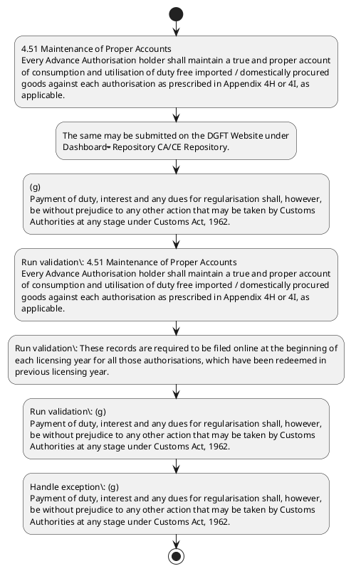

# Chapter 4 / Section 4.51: Maintenance of Proper Accounts

**Chapter Title:** Duty Exemption / Remission Schemes

**Pages:** 32, 33

**Purpose:** 4.51 Maintenance of Proper Accounts
Every Advance Authorisation holder shall maintain a true and proper account
of consumption and utilisation of duty free imported / domestically procured
goods against each authorisation as prescribed in Appendix 4H or 4I, as
applicable.

**Purpose Thanglish:** Indha Maintenance of Proper Accounts section-la, 4.51 Maintenance of Proper Accounts
Every Advance Authorisation holder kandippa maintain a true and proper account
of consumption and utilisation of duty free imported / domestically procured
goods against each authorisation as prescribed in Appendix 4H or 4I, as
applicable.

**Summary:** 4.51 Maintenance of Proper Accounts
Every Advance Authorisation holder shall maintain a true and proper account
of consumption and utilisation of duty free imported / domestically procured
goods against each authorisation as prescribed in Appendix 4H or 4I, as
applicable. These records are required to be filed online at the beginning of
each licensing year for all those authorisations, which have been redeemed in
previous licensing year. The same may be submitted on the DGFT Website under
Dashboard----- Repository CA/CE Repository.

**Business Meaning:** Maintenance of Proper Accounts governs how DGFT business controls should be applied, validated, and enforced.

**Business Explanation:** Maintenance of Proper Accounts explains the operating rule set that DEKAI should enforce. Key control points include 4.51 Maintenance of Proper Accounts
Every Advance Authorisation holder shall maintain a true and proper account
of consumption and utilisation of duty free imported / domestically procured
goods against each authorisation as prescribed in Appendix 4H or 4I, as
applicable. The section also drives actions such as 4.51 Maintenance of Proper Accounts
Every Advance Authorisation holder shall maintain a true and proper account
of consumption and utilisation of duty free imported / domestically procured
goods against each authorisation as prescribed in Appendix 4H or 4I, as
applicable..

**Business Explanation Thanglish:** Indha Maintenance of Proper Accounts section-la, Maintenance of Proper Accounts explains the operating rule set that DEKAI should enforce. Key control points include 4.51 Maintenance of Proper Accounts
Every Advance Authorisation holder kandippa maintain a true and proper account
of consumption and utilisation of duty free imported / domestically procured
goods against each authorisation as prescribed in Appendix 4H or 4I, as
applicable. The section also drives actions such as 4.51 Maintenance of Proper Accounts
Every Advance Authorisation holder kandippa maintain a true and proper account
of consumption and utilisation of duty free imported / domestically procured
goods against each authorisation as prescribed in Appendix 4H or 4I, as
applicable..

## Business Logic
- 4.51 Maintenance of Proper Accounts
Every Advance Authorisation holder shall maintain a true and proper account
of consumption and utilisation of duty free imported / domestically procured
goods against each authorisation as prescribed in Appendix 4H or 4I, as
applicable.
- These records are required to be filed online at the beginning of
each licensing year for all those authorisations, which have been redeemed in
previous licensing year.
- (g)
Payment of duty, interest and any dues for regularisation shall, however,
be without prejudice to any other action that may be taken by Customs
Authorities at any stage under Customs Act, 1962.

## Business Rules
- rule_id=CH4-SEC4_51-R001, rule_description=4.51 Maintenance of Proper Accounts
Every Advance Authorisation holder shall maintain a true and proper account
of consumption and utilisation of duty free imported / domestically procured
goods against each authorisation as prescribed in Appendix 4H or 4I, as
applicable., trigger=Maintenance of Proper Accounts, condition=Section 4.51 is applicable, validation=4.51 Maintenance of Proper Accounts
Every Advance Authorisation holder shall maintain a true and proper account
of consumption and utilisation of duty free imported / domestically procured
goods against each authorisation as prescribed in Appendix 4H or 4I, as
applicable., action=4.51 Maintenance of Proper Accounts
Every Advance Authorisation holder shall maintain a true and proper account
of consumption and utilisation of duty free imported / domestically procured
goods against each authorisation as prescribed in Appendix 4H or 4I, as
applicable., exception=(g)
Payment of duty, interest and any dues for regularisation shall, however,
be without prejudice to any other action that may be taken by Customs
Authorities at any stage under Customs Act, 1962., output=DEKAI should produce a compliance decision for 4.51 - Maintenance of Proper Accounts.
- rule_id=CH4-SEC4_51-R002, rule_description=These records are required to be filed online at the beginning of
each licensing year for all those authorisations, which have been redeemed in
previous licensing year., trigger=Maintenance of Proper Accounts, condition=Section 4.51 is applicable, validation=These records are required to be filed online at the beginning of
each licensing year for all those authorisations, which have been redeemed in
previous licensing year., action=The same may be submitted on the DGFT Website under
Dashboard----- Repository CA/CE Repository., exception=(g)
Payment of duty, interest and any dues for regularisation shall, however,
be without prejudice to any other action that may be taken by Customs
Authorities at any stage under Customs Act, 1962., output=DEKAI should produce a compliance decision for 4.51 - Maintenance of Proper Accounts.
- rule_id=CH4-SEC4_51-R003, rule_description=(g)
Payment of duty, interest and any dues for regularisation shall, however,
be without prejudice to any other action that may be taken by Customs
Authorities at any stage under Customs Act, 1962., trigger=Maintenance of Proper Accounts, condition=Section 4.51 is applicable, validation=(g)
Payment of duty, interest and any dues for regularisation shall, however,
be without prejudice to any other action that may be taken by Customs
Authorities at any stage under Customs Act, 1962., action=(g)
Payment of duty, interest and any dues for regularisation shall, however,
be without prejudice to any other action that may be taken by Customs
Authorities at any stage under Customs Act, 1962., exception=(g)
Payment of duty, interest and any dues for regularisation shall, however,
be without prejudice to any other action that may be taken by Customs
Authorities at any stage under Customs Act, 1962., output=DEKAI should produce a compliance decision for 4.51 - Maintenance of Proper Accounts.

## Conditions
- None identified

## Condition Logic
- id=4.4.51.1, if=Section 4.51 is applicable, then=4.51 Maintenance of Proper Accounts
Every Advance Authorisation holder shall maintain a true and proper account
of consumption and utilisation of duty free imported / domestically procured
goods against each authorisation as prescribed in Appendix 4H or 4I, as
applicable., source=Derived from uploaded documents

## Validations
- 4.51 Maintenance of Proper Accounts
Every Advance Authorisation holder shall maintain a true and proper account
of consumption and utilisation of duty free imported / domestically procured
goods against each authorisation as prescribed in Appendix 4H or 4I, as
applicable.
- These records are required to be filed online at the beginning of
each licensing year for all those authorisations, which have been redeemed in
previous licensing year.
- (g)
Payment of duty, interest and any dues for regularisation shall, however,
be without prejudice to any other action that may be taken by Customs
Authorities at any stage under Customs Act, 1962.

## Exceptions
- (g)
Payment of duty, interest and any dues for regularisation shall, however,
be without prejudice to any other action that may be taken by Customs
Authorities at any stage under Customs Act, 1962.

## Dependencies
- 1
- 2
- 4
- 5
- 6

## Authorities
- DGFT
- The same may be submitted on the DGFT
- Customs
- Authorities at any stage under Customs

## Required Documents
- None identified

## Timelines
- None identified

## Actions
- 4.51 Maintenance of Proper Accounts
Every Advance Authorisation holder shall maintain a true and proper account
of consumption and utilisation of duty free imported / domestically procured
goods against each authorisation as prescribed in Appendix 4H or 4I, as
applicable.
- The same may be submitted on the DGFT Website under
Dashboard----- Repository CA/CE Repository.
- (g)
Payment of duty, interest and any dues for regularisation shall, however,
be without prejudice to any other action that may be taken by Customs
Authorities at any stage under Customs Act, 1962.

## Workflow
- 4.51 Maintenance of Proper Accounts
Every Advance Authorisation holder shall maintain a true and proper account
of consumption and utilisation of duty free imported / domestically procured
goods against each authorisation as prescribed in Appendix 4H or 4I, as
applicable.
- The same may be submitted on the DGFT Website under
Dashboard----- Repository CA/CE Repository.
- (g)
Payment of duty, interest and any dues for regularisation shall, however,
be without prejudice to any other action that may be taken by Customs
Authorities at any stage under Customs Act, 1962.
- Run validation: 4.51 Maintenance of Proper Accounts
Every Advance Authorisation holder shall maintain a true and proper account
of consumption and utilisation of duty free imported / domestically procured
goods against each authorisation as prescribed in Appendix 4H or 4I, as
applicable.
- Run validation: These records are required to be filed online at the beginning of
each licensing year for all those authorisations, which have been redeemed in
previous licensing year.
- Run validation: (g)
Payment of duty, interest and any dues for regularisation shall, however,
be without prejudice to any other action that may be taken by Customs
Authorities at any stage under Customs Act, 1962.
- Handle exception: (g)
Payment of duty, interest and any dues for regularisation shall, however,
be without prejudice to any other action that may be taken by Customs
Authorities at any stage under Customs Act, 1962.

## Workflow ASCII
```text
Maintenance of Proper Accounts
4.51 Maintenance of Proper Accounts
Every Advance Authorisation holder shall maintain a true and proper account
of consumption and utilisation of duty free imported / domestically procured
goods against each authorisation as prescribed in Appendix 4H or 4I, as
applicable.
   |
   v
The same may be submitted on the DGFT Website under
Dashboard----- Repository CA/CE Repository.
   |
   v
(g)
Payment of duty, interest and any dues for regularisation shall, however,
be without prejudice to any other action that may be taken by Customs
Authorities at any stage under Customs Act, 1962.
   |
   v
Run validation: 4.51 Maintenance of Proper Accounts
Every Advance Authorisation holder shall maintain a true and proper account
of consumption and utilisation of duty free imported / domestically procured
goods against each authorisation as prescribed in Appendix 4H or 4I, as
applicable.
   |
   v
Run validation: These records are required to be filed online at the beginning of
each licensing year for all those authorisations, which have been redeemed in
previous licensing year.
   |
   v
Run validation: (g)
Payment of duty, interest and any dues for regularisation shall, however,
be without prejudice to any other action that may be taken by Customs
Authorities at any stage under Customs Act, 1962.
   |
   v
Handle exception: (g)
Payment of duty, interest and any dues for regularisation shall, however,
be without prejudice to any other action that may be taken by Customs
Authorities at any stage under Customs Act, 1962.
```

## Decision Tree
- IF exception applies ((g)
Payment of duty, interest and any dues for regularisation shall, however,
be without prejudice to any other action that may be taken by Customs
Authorities at any stage under Customs Act, 1962.) THEN route to manual review

## Decision Tree ASCII
```text
Maintenance of Proper Accounts Decision
IF exception applies ((g)
Payment of duty, interest and any dues for regularisation shall, however,
be without prejudice to any other action that may be taken by Customs
Authorities at any stage under Customs Act, 1962.) THEN route to manual review
```

## Examples
- User asks to process Maintenance of Proper Accounts; the platform checks conditions, validations, and documents before action.

**Real-world Example:** Example: an importer or exporter invokes Maintenance of Proper Accounts, submits the prescribed DGFT records, and DEKAI uses the extracted rules to 4.51 maintenance of proper accounts
every advance authorisation holder shall maintain a true and proper account
of consumption and utilisation of duty free imported / domestically procured
goods against each authorisation as prescribed in appendix 4h or 4i, as
applicable..

**Real-world Example Thanglish:** Indha Maintenance of Proper Accounts section-la, Example: an importer or exporter invokes Maintenance of Proper Accounts, submits the prescribed DGFT records, and DEKAI uses the extracted rules to 4.51 maintenance of proper accounts
every advance authorisation holder kandippa maintain a true and proper account
of consumption and utilisation of duty free imported / domestically procured
goods against each authorisation as prescribed in appendix 4h or 4i, as
applicable..

## AI Rules
- IF detected context matches section rule THEN enforce: 4.51 Maintenance of Proper Accounts
Every Advance Authorisation holder shall maintain a true and proper account
of consumption and utilisation of duty free imported / domestically procured
goods against each authorisation as prescribed in Appendix 4H or 4I, as
applicable.
- IF detected context matches section rule THEN enforce: These records are required to be filed online at the beginning of
each licensing year for all those authorisations, which have been redeemed in
previous licensing year.
- IF detected context matches section rule THEN enforce: (g)
Payment of duty, interest and any dues for regularisation shall, however,
be without prejudice to any other action that may be taken by Customs
Authorities at any stage under Customs Act, 1962.
- IF validations pass THEN recommend action: 4.51 Maintenance of Proper Accounts
Every Advance Authorisation holder shall maintain a true and proper account
of consumption and utilisation of duty free imported / domestically procured
goods against each authorisation as prescribed in Appendix 4H or 4I, as
applicable.

## Database Fields
- name=section_code, type=string, required=True, source=parsed_section_heading
- name=section_title, type=string, required=True, source=parsed_section_heading
- name=and_flag, type=boolean, required=False, source=keyword:and
- name=are_flag, type=boolean, required=False, source=keyword:are
- name=the_flag, type=boolean, required=False, source=keyword:the
- name=for_flag, type=boolean, required=False, source=keyword:for
- name=all_flag, type=boolean, required=False, source=keyword:all
- name=may_flag, type=boolean, required=False, source=keyword:may
- name=any_flag, type=boolean, required=False, source=keyword:any
- name=act_flag, type=boolean, required=False, source=keyword:Act

## API Requirements
- method=GET, path=/api/dgft/sections/4.51, purpose=Retrieve knowledge payload for section 4.51, query_params=['include=workflow,decision_tree,validations'], response_fields=['section', 'title', 'summary', 'conditions', 'validations', 'exceptions', 'workflow', 'decision_tree']
- method=POST, path=/api/dgft/Maintenance-of-Proper-Accounts/validate, purpose=Validate inputs and documents for Maintenance of Proper Accounts, request_fields=['section_code', 'section_title'], response_fields=['status', 'errors', 'warnings', 'next_actions']
- method=POST, path=/api/dgft/Maintenance-of-Proper-Accounts/execute, purpose=Trigger business action for 4.51 Maintenance of Proper Accounts
Every Advance Authorisation holder shall maintain a true and proper account
of consumption and utilisation of duty free imported / domestically procured
goods against each authorisation as prescribed in Appendix 4H or 4I, as
applicable., request_fields=['section_code', 'section_title'], response_fields=['reference_id', 'status', 'authority', 'timeline']

## UI Screens
- screen_id=Maintenance_of_Proper_Accounts_overview, name=Maintenance of Proper Accounts Overview, purpose=Show section summary, authority, timeline, and eligibility cues., widgets=['summary_card', 'conditions_table', 'authority_badges', 'timeline_panel']
- screen_id=Maintenance_of_Proper_Accounts_submission, name=Maintenance of Proper Accounts Submission, purpose=Capture applicant data and supporting documents., widgets=['dynamic_form', 'document_uploader', 'validation_panel', 'next_action_footer'], fields=['section_code', 'section_title', 'and_flag', 'are_flag', 'the_flag', 'for_flag', 'all_flag', 'may_flag']
- screen_id=Maintenance_of_Proper_Accounts_exceptions, name=Maintenance of Proper Accounts Exception Review, purpose=Explain exception handling and manual review triggers., widgets=['exception_banner', 'decision_tree', 'case_notes']

## Error Messages
- Validation failed because the section requirements were not fully met.

## FAQ
- question_en=What is the purpose of section 4.51?, answer_en=Maintenance of Proper Accounts explains the operating rule set that DEKAI should enforce. Key control points include 4.51 Maintenance of Proper Accounts
Every Advance Authorisation holder shall maintain a true and proper account
of consumption and utilisation of duty free imported / domestically procured
goods against each authorisation as prescribed in Appendix 4H or 4I, as
applicable. The section also drives actions such as 4.51 Maintenance of Proper Accounts
Every Advance Authorisation holder shall maintain a true and proper account
of consumption and utilisation of duty free imported / domestically procured
goods against each authorisation as prescribed in Appendix 4H or 4I, as
applicable.., question_thanglish=Indha Maintenance of Proper Accounts section-la, What is the purpose of section 4.51?, answer_thanglish=Indha Maintenance of Proper Accounts section-la, Maintenance of Proper Accounts explains the operating rule set that DEKAI should enforce. Key control points include 4.51 Maintenance of Proper Accounts
Every Advance Authorisation holder kandippa maintain a true and proper account
of consumption and utilisation of duty free imported / domestically procured
goods against each authorisation as prescribed in Appendix 4H or 4I, as
applicable. The section also drives actions such as 4.51 Maintenance of Proper Accounts
Every Advance Authorisation holder kandippa maintain a true and proper account
of consumption and utilisation of duty free imported / domestically procured
goods against each authorisation as prescribed in Appendix 4H or 4I, as
applicable..
- question_en=What documents are required under Maintenance of Proper Accounts?, answer_en=Not explicitly covered in uploaded documents., question_thanglish=Indha Maintenance of Proper Accounts section-la, What documents are required under Maintenance of Proper Accounts?, answer_thanglish=Indha Maintenance of Proper Accounts section-la, Not explicitly covered in uploaded documents.
- question_en=Which authority handles Maintenance of Proper Accounts?, answer_en=DGFT, The same may be submitted on the DGFT, Customs, Authorities at any stage under Customs, question_thanglish=Indha Maintenance of Proper Accounts section-la, Which authority handles Maintenance of Proper Accounts?, answer_thanglish=Indha Maintenance of Proper Accounts section-la, DGFT, The same may be submitted on the DGFT, Customs, Authorities at any stage under Customs

## Questions Users May Ask
- What does Maintenance of Proper Accounts require?
- Which documents are needed for Maintenance of Proper Accounts?
- How does DEKAI validate Maintenance of Proper Accounts requests?
- What action should be taken for Maintenance of Proper Accounts?

## Expected AI Answers
- Maintenance of Proper Accounts requires the platform to interpret the section text, apply the extracted business rules, and present the correct next action.
- Required documents are inferred from the section text: no explicit documents were detected.
- DEKAI validates Maintenance of Proper Accounts by checking conditions, required documents, authority references, and exception clauses before recommending an outcome.
- The primary extracted action is: 4.51 Maintenance of Proper Accounts
Every Advance Authorisation holder shall maintain a true and proper account
of consumption and utilisation of duty free imported / domestically procured
goods against each authorisation as prescribed in Appendix 4H or 4I, as
applicable.

## AI Q&A Examples
- question_en=User asks: How do I comply with Maintenance of Proper Accounts?, answer_en=AI answers: DEKAI should evaluate section 4.51, apply the extracted rules, and guide the user through 4.51 Maintenance of Proper Accounts
Every Advance Authorisation holder shall maintain a true and proper account
of consumption and utilisation of duty free imported / domestically procured
goods against each authorisation as prescribed in Appendix 4H or 4I, as
applicable.., question_thanglish=Indha Maintenance of Proper Accounts section-la, User asks: How do I comply with Maintenance of Proper Accounts?, answer_thanglish=Indha Maintenance of Proper Accounts section-la, AI answers: DEKAI should evaluate section 4.51, apply the extracted rules, and guide the user through 4.51 Maintenance of Proper Accounts
Every Advance Authorisation holder kandippa maintain a true and proper account
of consumption and utilisation of duty free imported / domestically procured
goods against each authorisation as prescribed in Appendix 4H or 4I, as
applicable..
- question_en=User asks: Which validations apply to Maintenance of Proper Accounts?, answer_en=AI answers: Applicable validations are 4.51 Maintenance of Proper Accounts
Every Advance Authorisation holder shall maintain a true and proper account
of consumption and utilisation of duty free imported / domestically procured
goods against each authorisation as prescribed in Appendix 4H or 4I, as
applicable., These records are required to be filed online at the beginning of
each licensing year for all those authorisations, which have been redeemed in
previous licensing year., (g)
Payment of duty, interest and any dues for regularisation shall, however,
be without prejudice to any other action that may be taken by Customs
Authorities at any stage under Customs Act, 1962., question_thanglish=Indha Maintenance of Proper Accounts section-la, User asks: Which validations apply to Maintenance of Proper Accounts?, answer_thanglish=Indha Maintenance of Proper Accounts section-la, AI answers: Applicable validations are 4.51 Maintenance of Proper Accounts
Every Advance Authorisation holder kandippa maintain a true and proper account
of consumption and utilisation of duty free imported / domestically procured
goods against each authorisation as prescribed in Appendix 4H or 4I, as
applicable., These records are required to be filed online at the beginning of
each licensing year for all those authorisations, which have been redeemed in
previous licensing year., (g)
Payment of duty, interest and any dues for regularisation kandippa, however,
be without prejudice to any other action that may be taken by Customs
Authorities at any stage under Customs Act, 1962.

## DEKAI AI Implementation Notes
- Capture chapter 4, section 4.51, title, and page references as immutable knowledge metadata.
- Bind validations for Maintenance of Proper Accounts into a rule engine keyed by the rule IDs extracted for this section.
- Route escalations or approvals to: DGFT, The same may be submitted on the DGFT, Customs, Authorities at any stage under Customs.
- Trigger manual review when exception clauses are detected.
- Show contextual links to related sections: 1, 2, 4, 5, 6.

## DEKAI AI Implementation Notes Thanglish
- Indha Maintenance of Proper Accounts section-la, Capture chapter 4, section 4.51, title, and page references as immutable knowledge metadata.
- Indha Maintenance of Proper Accounts section-la, Bind validations for Maintenance of Proper Accounts into a rule engine keyed by the rule IDs extracted for this section.
- Indha Maintenance of Proper Accounts section-la, Route escalations or approvals to: DGFT, The same may be submitted on the DGFT, Customs, Authorities at any stage under Customs.
- Indha Maintenance of Proper Accounts section-la, Trigger manual review when exception clauses are detected.
- Indha Maintenance of Proper Accounts section-la, Show contextual links to related sections: 1, 2, 4, 5, 6.

## AI Metadata
- Keywords: and, are, the, for, all, may, any, Act, true, duty, free, each, year, have, been, same, DGFT, case, dues, that
- Search Keywords: and, are, the, for, all, may, any, Act, true, duty, free, each, year, have, been, same, DGFT, case, dues, that
- Intent: Support Maintenance of Proper Accounts processing and compliance validation.
- Tags: 4.51, Maintenance of Proper Accounts, business-rule, dgft
- Related Sections: 1, 2, 4, 5, 6
- Related Chapters: 
- Related Rules: 4.51 Maintenance of Proper Accounts
Every Advance Authorisation holder shall maintain a true and proper account
of consumption and utilisation of duty free imported / domestically procured
goods against each authorisation as prescribed in Appendix 4H or 4I, as
applicable., These records are required to be filed online at the beginning of
each licensing year for all those authorisations, which have been redeemed in
previous licensing year., (g)
Payment of duty, interest and any dues for regularisation shall, however,
be without prejudice to any other action that may be taken by Customs
Authorities at any stage under Customs Act, 1962.

## Mermaid

```mermaid
flowchart TD
    S1["4.51 Maintenance of Proper Accounts
Every Advance Authorisation holder shall maintain a true and proper account
of consumption and utilisation of duty free imported / domestically procured
goods against each authorisation as prescribed in Appendix 4H or 4I, as
applicable."]
    S2["The same may be submitted on the DGFT Website under
Dashboard----- Repository CA/CE Repository."]
    S1 --> S2
    S3["(g)
Payment of duty, interest and any dues for regularisation shall, however,
be without prejudice to any other action that may be taken by Customs
Authorities at any stage under Customs Act, 1962."]
    S2 --> S3
    S4["Run validation: 4.51 Maintenance of Proper Accounts
Every Advance Authorisation holder shall maintain a true and proper account
of consumption and utilisation of duty free imported / domestically procured
goods against each authorisation as prescribed in Appendix 4H or 4I, as
applicable."]
    S3 --> S4
    S5["Run validation: These records are required to be filed online at the beginning of
each licensing year for all those authorisations, which have been redeemed in
previous licensing year."]
    S4 --> S5
    S6["Run validation: (g)
Payment of duty, interest and any dues for regularisation shall, however,
be without prejudice to any other action that may be taken by Customs
Authorities at any stage under Customs Act, 1962."]
    S5 --> S6
    S7["Handle exception: (g)
Payment of duty, interest and any dues for regularisation shall, however,
be without prejudice to any other action that may be taken by Customs
Authorities at any stage under Customs Act, 1962."]
    S6 --> S7
```


## PlantUML

