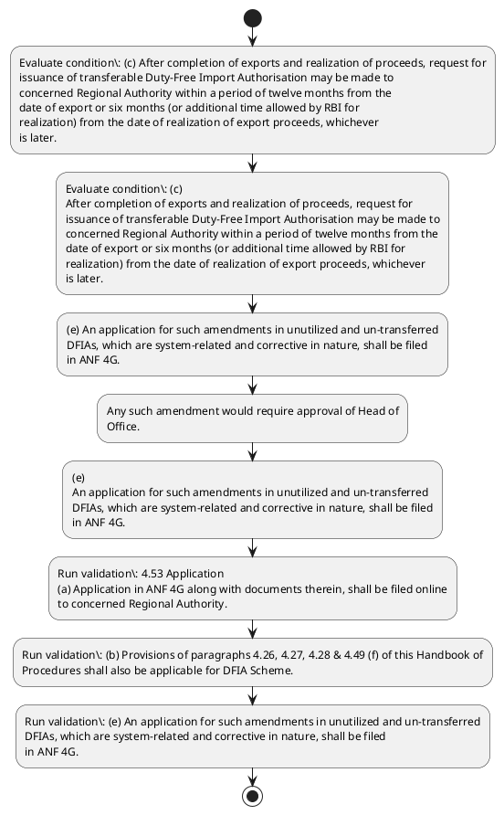

# Chapter 4 / Section 4.53: Application

**Chapter Title:** Duty Exemption / Remission Schemes

**Pages:** 33

**Purpose:** 4.53 Application
(a) Application in ANF 4G along with documents therein, shall be filed online
to concerned Regional Authority.

**Purpose Thanglish:** Indha Application section-la, 4.53 application
(a) application in ANF 4G along with documents therein, kandippa be filed online
to concerned Regional authority.

**Summary:** 4.53 Application
(a) Application in ANF 4G along with documents therein, shall be filed online
to concerned Regional Authority. (b) Provisions of paragraphs 4.26, 4.27, 4.28 & 4.49 (f) of this Handbook of
Procedures shall also be applicable for DFIA Scheme. (c) After completion of exports and realization of proceeds, request for
issuance of transferable Duty-Free Import Authorisation may be made to
concerned Regional Authority within a period of twelve months from the
date of export or six months (or additional time allowed by RBI for
realization) from the date of realization of export proceeds, whichever
is later.

**Business Meaning:** Application governs how DGFT business controls should be applied, validated, and enforced.

**Business Explanation:** Application explains the operating rule set that DEKAI should enforce. Key control points include 4.53 Application
(a) Application in ANF 4G along with documents therein, shall be filed online
to concerned Regional Authority. The section also drives actions such as (e) An application for such amendments in unutilized and un-transferred
DFIAs, which are system-related and corrective in nature, shall be filed
in ANF 4G..

**Business Explanation Thanglish:** Indha Application section-la, application explains the operating rule set that DEKAI should enforce. Key control points include 4.53 application
(a) application in ANF 4G along with documents therein, kandippa be filed online
to concerned Regional authority. The section also drives actions such as (e) An application for such amendments in unutilized and un-transferred
DFIAs, which are system-related and corrective in nature, kandippa be filed
in ANF 4G..

## Business Logic
- 4.53 Application
(a) Application in ANF 4G along with documents therein, shall be filed online
to concerned Regional Authority.
- (b) Provisions of paragraphs 4.26, 4.27, 4.28 & 4.49 (f) of this Handbook of
Procedures shall also be applicable for DFIA Scheme.
- (e) An application for such amendments in unutilized and un-transferred
DFIAs, which are system-related and corrective in nature, shall be filed
in ANF 4G.
- xv
4.53 Application
(a)
Application in ANF 4G along with documents therein, shall be filed online
to concerned Regional Authority.
- (b)
Provisions of paragraphs 4.26, 4.27, 4.28 & 4.49 (f) of this Handbook of
Procedures shall also be applicable for DFIA Scheme.
- (e)
An application for such amendments in unutilized and un-transferred
DFIAs, which are system-related and corrective in nature, shall be filed
in ANF 4G.

## Business Rules
- rule_id=CH4-SEC4_53-R001, rule_description=4.53 Application
(a) Application in ANF 4G along with documents therein, shall be filed online
to concerned Regional Authority., trigger=Application, condition=(c) After completion of exports and realization of proceeds, request for
issuance of transferable Duty-Free Import Authorisation may be made to
concerned Regional Authority within a period of twelve months from the
date of export or six months (or additional time allowed by RBI for
realization) from the date of realization of export proceeds, whichever
is later., validation=4.53 Application
(a) Application in ANF 4G along with documents therein, shall be filed online
to concerned Regional Authority., action=(e) An application for such amendments in unutilized and un-transferred
DFIAs, which are system-related and corrective in nature, shall be filed
in ANF 4G., exception=No explicit exception found in uploaded documents., output=DEKAI should produce a compliance decision for 4.53 - Application.
- rule_id=CH4-SEC4_53-R002, rule_description=(b) Provisions of paragraphs 4.26, 4.27, 4.28 & 4.49 (f) of this Handbook of
Procedures shall also be applicable for DFIA Scheme., trigger=Application, condition=(c)
After completion of exports and realization of proceeds, request for
issuance of transferable Duty-Free Import Authorisation may be made to
concerned Regional Authority within a period of twelve months from the
date of export or six months (or additional time allowed by RBI for
realization) from the date of realization of export proceeds, whichever
is later., validation=(b) Provisions of paragraphs 4.26, 4.27, 4.28 & 4.49 (f) of this Handbook of
Procedures shall also be applicable for DFIA Scheme., action=Any such amendment would require approval of Head of
Office., exception=No explicit exception found in uploaded documents., output=DEKAI should produce a compliance decision for 4.53 - Application.
- rule_id=CH4-SEC4_53-R003, rule_description=(e) An application for such amendments in unutilized and un-transferred
DFIAs, which are system-related and corrective in nature, shall be filed
in ANF 4G., trigger=Application, condition=(c)
After completion of exports and realization of proceeds, request for
issuance of transferable Duty-Free Import Authorisation may be made to
concerned Regional Authority within a period of twelve months from the
date of export or six months (or additional time allowed by RBI for
realization) from the date of realization of export proceeds, whichever
is later., validation=(e) An application for such amendments in unutilized and un-transferred
DFIAs, which are system-related and corrective in nature, shall be filed
in ANF 4G., action=(e)
An application for such amendments in unutilized and un-transferred
DFIAs, which are system-related and corrective in nature, shall be filed
in ANF 4G., exception=No explicit exception found in uploaded documents., output=DEKAI should produce a compliance decision for 4.53 - Application.
- rule_id=CH4-SEC4_53-R004, rule_description=xv
4.53 Application
(a)
Application in ANF 4G along with documents therein, shall be filed online
to concerned Regional Authority., trigger=Application, condition=(c)
After completion of exports and realization of proceeds, request for
issuance of transferable Duty-Free Import Authorisation may be made to
concerned Regional Authority within a period of twelve months from the
date of export or six months (or additional time allowed by RBI for
realization) from the date of realization of export proceeds, whichever
is later., validation=xv
4.53 Application
(a)
Application in ANF 4G along with documents therein, shall be filed online
to concerned Regional Authority., action=(e)
An application for such amendments in unutilized and un-transferred
DFIAs, which are system-related and corrective in nature, shall be filed
in ANF 4G., exception=No explicit exception found in uploaded documents., output=DEKAI should produce a compliance decision for 4.53 - Application.
- rule_id=CH4-SEC4_53-R005, rule_description=(b)
Provisions of paragraphs 4.26, 4.27, 4.28 & 4.49 (f) of this Handbook of
Procedures shall also be applicable for DFIA Scheme., trigger=Application, condition=(c)
After completion of exports and realization of proceeds, request for
issuance of transferable Duty-Free Import Authorisation may be made to
concerned Regional Authority within a period of twelve months from the
date of export or six months (or additional time allowed by RBI for
realization) from the date of realization of export proceeds, whichever
is later., validation=(b)
Provisions of paragraphs 4.26, 4.27, 4.28 & 4.49 (f) of this Handbook of
Procedures shall also be applicable for DFIA Scheme., action=(e)
An application for such amendments in unutilized and un-transferred
DFIAs, which are system-related and corrective in nature, shall be filed
in ANF 4G., exception=No explicit exception found in uploaded documents., output=DEKAI should produce a compliance decision for 4.53 - Application.
- rule_id=CH4-SEC4_53-R006, rule_description=(e)
An application for such amendments in unutilized and un-transferred
DFIAs, which are system-related and corrective in nature, shall be filed
in ANF 4G., trigger=Application, condition=(c)
After completion of exports and realization of proceeds, request for
issuance of transferable Duty-Free Import Authorisation may be made to
concerned Regional Authority within a period of twelve months from the
date of export or six months (or additional time allowed by RBI for
realization) from the date of realization of export proceeds, whichever
is later., validation=(e)
An application for such amendments in unutilized and un-transferred
DFIAs, which are system-related and corrective in nature, shall be filed
in ANF 4G., action=(e)
An application for such amendments in unutilized and un-transferred
DFIAs, which are system-related and corrective in nature, shall be filed
in ANF 4G., exception=No explicit exception found in uploaded documents., output=DEKAI should produce a compliance decision for 4.53 - Application.

## Conditions
- (c) After completion of exports and realization of proceeds, request for
issuance of transferable Duty-Free Import Authorisation may be made to
concerned Regional Authority within a period of twelve months from the
date of export or six months (or additional time allowed by RBI for
realization) from the date of realization of export proceeds, whichever
is later.
- (c)
After completion of exports and realization of proceeds, request for
issuance of transferable Duty-Free Import Authorisation may be made to
concerned Regional Authority within a period of twelve months from the
date of export or six months (or additional time allowed by RBI for
realization) from the date of realization of export proceeds, whichever
is later.

## Condition Logic
- id=4.4.53.1, if=(c) After completion of exports and realization of proceeds, request for
issuance of transferable Duty-Free Import Authorisation may be made to
concerned Regional Authority within a period of twelve months from the
date of export or six months (or additional time allowed by RBI for
realization) from the date of realization of export proceeds, whichever
is later., then=(e) An application for such amendments in unutilized and un-transferred
DFIAs, which are system-related and corrective in nature, shall be filed
in ANF 4G., source=(c) After completion of exports and realization of proceeds, request for
issuance of transferable Duty-Free Import Authorisation may be made to
concerned Regional Authority within a period of twelve months from the
date of export or six months (or additional time allowed by RBI for
realization) from the date of realization of export proceeds, whichever
is later.
- id=4.4.53.2, if=(c)
After completion of exports and realization of proceeds, request for
issuance of transferable Duty-Free Import Authorisation may be made to
concerned Regional Authority within a period of twelve months from the
date of export or six months (or additional time allowed by RBI for
realization) from the date of realization of export proceeds, whichever
is later., then=(e) An application for such amendments in unutilized and un-transferred
DFIAs, which are system-related and corrective in nature, shall be filed
in ANF 4G., source=(c)
After completion of exports and realization of proceeds, request for
issuance of transferable Duty-Free Import Authorisation may be made to
concerned Regional Authority within a period of twelve months from the
date of export or six months (or additional time allowed by RBI for
realization) from the date of realization of export proceeds, whichever
is later.

## Validations
- 4.53 Application
(a) Application in ANF 4G along with documents therein, shall be filed online
to concerned Regional Authority.
- (b) Provisions of paragraphs 4.26, 4.27, 4.28 & 4.49 (f) of this Handbook of
Procedures shall also be applicable for DFIA Scheme.
- (e) An application for such amendments in unutilized and un-transferred
DFIAs, which are system-related and corrective in nature, shall be filed
in ANF 4G.
- xv
4.53 Application
(a)
Application in ANF 4G along with documents therein, shall be filed online
to concerned Regional Authority.
- (b)
Provisions of paragraphs 4.26, 4.27, 4.28 & 4.49 (f) of this Handbook of
Procedures shall also be applicable for DFIA Scheme.
- (e)
An application for such amendments in unutilized and un-transferred
DFIAs, which are system-related and corrective in nature, shall be filed
in ANF 4G.

## Exceptions
- None identified

## Dependencies
- 11.02
- 4.26
- 4.27
- 4.28
- 4.49

## Authorities
- Regional Authority

## Required Documents
- 4.53 Application
(a) Application in ANF 4G along with documents therein, shall be filed online
to concerned Regional Authority.
- (e) An application for such amendments in unutilized and un-transferred
DFIAs, which are system-related and corrective in nature, shall be filed
in ANF 4G.
- xv
4.53 Application
(a)
Application in ANF 4G along with documents therein, shall be filed online
to concerned Regional Authority.
- (e)
An application for such amendments in unutilized and un-transferred
DFIAs, which are system-related and corrective in nature, shall be filed
in ANF 4G.

## Timelines
- (c) After completion of exports and realization of proceeds, request for
issuance of transferable Duty-Free Import Authorisation may be made to
concerned Regional Authority within a period of twelve months from the
date of export or six months (or additional time allowed by RBI for
realization) from the date of realization of export proceeds, whichever
is later.
- (c)
After completion of exports and realization of proceeds, request for
issuance of transferable Duty-Free Import Authorisation may be made to
concerned Regional Authority within a period of twelve months from the
date of export or six months (or additional time allowed by RBI for
realization) from the date of realization of export proceeds, whichever
is later.

## Actions
- (e) An application for such amendments in unutilized and un-transferred
DFIAs, which are system-related and corrective in nature, shall be filed
in ANF 4G.
- Any such amendment would require approval of Head of
Office.
- (e)
An application for such amendments in unutilized and un-transferred
DFIAs, which are system-related and corrective in nature, shall be filed
in ANF 4G.

## Workflow
- Evaluate condition: (c) After completion of exports and realization of proceeds, request for
issuance of transferable Duty-Free Import Authorisation may be made to
concerned Regional Authority within a period of twelve months from the
date of export or six months (or additional time allowed by RBI for
realization) from the date of realization of export proceeds, whichever
is later.
- Evaluate condition: (c)
After completion of exports and realization of proceeds, request for
issuance of transferable Duty-Free Import Authorisation may be made to
concerned Regional Authority within a period of twelve months from the
date of export or six months (or additional time allowed by RBI for
realization) from the date of realization of export proceeds, whichever
is later.
- (e) An application for such amendments in unutilized and un-transferred
DFIAs, which are system-related and corrective in nature, shall be filed
in ANF 4G.
- Any such amendment would require approval of Head of
Office.
- (e)
An application for such amendments in unutilized and un-transferred
DFIAs, which are system-related and corrective in nature, shall be filed
in ANF 4G.
- Run validation: 4.53 Application
(a) Application in ANF 4G along with documents therein, shall be filed online
to concerned Regional Authority.
- Run validation: (b) Provisions of paragraphs 4.26, 4.27, 4.28 & 4.49 (f) of this Handbook of
Procedures shall also be applicable for DFIA Scheme.
- Run validation: (e) An application for such amendments in unutilized and un-transferred
DFIAs, which are system-related and corrective in nature, shall be filed
in ANF 4G.

## Workflow ASCII
```text
Application
Evaluate condition: (c) After completion of exports and realization of proceeds, request for
issuance of transferable Duty-Free Import Authorisation may be made to
concerned Regional Authority within a period of twelve months from the
date of export or six months (or additional time allowed by RBI for
realization) from the date of realization of export proceeds, whichever
is later.
   |
   v
Evaluate condition: (c)
After completion of exports and realization of proceeds, request for
issuance of transferable Duty-Free Import Authorisation may be made to
concerned Regional Authority within a period of twelve months from the
date of export or six months (or additional time allowed by RBI for
realization) from the date of realization of export proceeds, whichever
is later.
   |
   v
(e) An application for such amendments in unutilized and un-transferred
DFIAs, which are system-related and corrective in nature, shall be filed
in ANF 4G.
   |
   v
Any such amendment would require approval of Head of
Office.
   |
   v
(e)
An application for such amendments in unutilized and un-transferred
DFIAs, which are system-related and corrective in nature, shall be filed
in ANF 4G.
   |
   v
Run validation: 4.53 Application
(a) Application in ANF 4G along with documents therein, shall be filed online
to concerned Regional Authority.
   |
   v
Run validation: (b) Provisions of paragraphs 4.26, 4.27, 4.28 & 4.49 (f) of this Handbook of
Procedures shall also be applicable for DFIA Scheme.
   |
   v
Run validation: (e) An application for such amendments in unutilized and un-transferred
DFIAs, which are system-related and corrective in nature, shall be filed
in ANF 4G.
```

## Decision Tree
- IF (c) After completion of exports and realization of proceeds, request for
issuance of transferable Duty-Free Import Authorisation may be made to
concerned Regional Authority within a period of twelve months from the
date of export or six months (or additional time allowed by RBI for
realization) from the date of realization of export proceeds, whichever
is later. THEN (e) An application for such amendments in unutilized and un-transferred
DFIAs, which are system-related and corrective in nature, shall be filed
in ANF 4G.
- IF (c)
After completion of exports and realization of proceeds, request for
issuance of transferable Duty-Free Import Authorisation may be made to
concerned Regional Authority within a period of twelve months from the
date of export or six months (or additional time allowed by RBI for
realization) from the date of realization of export proceeds, whichever
is later. THEN (e) An application for such amendments in unutilized and un-transferred
DFIAs, which are system-related and corrective in nature, shall be filed
in ANF 4G.

## Decision Tree ASCII
```text
Application Decision
IF (c) After completion of exports and realization of proceeds, request for
issuance of transferable Duty-Free Import Authorisation may be made to
concerned Regional Authority within a period of twelve months from the
date of export or six months (or additional time allowed by RBI for
realization) from the date of realization of export proceeds, whichever
is later. THEN (e) An application for such amendments in unutilized and un-transferred
DFIAs, which are system-related and corrective in nature, shall be filed
in ANF 4G.
   |
   v
IF (c)
After completion of exports and realization of proceeds, request for
issuance of transferable Duty-Free Import Authorisation may be made to
concerned Regional Authority within a period of twelve months from the
date of export or six months (or additional time allowed by RBI for
realization) from the date of realization of export proceeds, whichever
is later. THEN (e) An application for such amendments in unutilized and un-transferred
DFIAs, which are system-related and corrective in nature, shall be filed
in ANF 4G.
```

## Examples
- User asks to process Application; the platform checks conditions, validations, and documents before action.

**Real-world Example:** Example: an importer or exporter invokes Application, submits 4.53 Application
(a) Application in ANF 4G along with documents therein, shall be filed online
to concerned Regional Authority., (e) An application for such amendments in unutilized and un-transferred
DFIAs, which are system-related and corrective in nature, shall be filed
in ANF 4G., xv
4.53 Application
(a)
Application in ANF 4G along with documents therein, shall be filed online
to concerned Regional Authority., and DEKAI uses the extracted rules to (e) an application for such amendments in unutilized and un-transferred
dfias, which are system-related and corrective in nature, shall be filed
in anf 4g..

**Real-world Example Thanglish:** Indha Application section-la, Example: an importer or exporter invokes application, submits 4.53 application
(a) application in ANF 4G along with documents therein, kandippa be filed online
to concerned Regional authority., (e) An application for such amendments in unutilized and un-transferred
DFIAs, which are system-related and corrective in nature, kandippa be filed
in ANF 4G., xv
4.53 application
(a)
application in ANF 4G along with documents therein, kandippa be filed online
to concerned Regional authority., and DEKAI uses the extracted rules to (e) an application for such amendments in unutilized and un-transferred
dfias, which are system-related and corrective in nature, kandippa be filed
in anf 4g..

## AI Rules
- IF detected context matches section rule THEN enforce: 4.53 Application
(a) Application in ANF 4G along with documents therein, shall be filed online
to concerned Regional Authority.
- IF detected context matches section rule THEN enforce: (b) Provisions of paragraphs 4.26, 4.27, 4.28 & 4.49 (f) of this Handbook of
Procedures shall also be applicable for DFIA Scheme.
- IF detected context matches section rule THEN enforce: (e) An application for such amendments in unutilized and un-transferred
DFIAs, which are system-related and corrective in nature, shall be filed
in ANF 4G.
- IF detected context matches section rule THEN enforce: xv
4.53 Application
(a)
Application in ANF 4G along with documents therein, shall be filed online
to concerned Regional Authority.
- IF detected context matches section rule THEN enforce: (b)
Provisions of paragraphs 4.26, 4.27, 4.28 & 4.49 (f) of this Handbook of
Procedures shall also be applicable for DFIA Scheme.
- IF detected context matches section rule THEN enforce: (e)
An application for such amendments in unutilized and un-transferred
DFIAs, which are system-related and corrective in nature, shall be filed
in ANF 4G.
- IF validations pass THEN recommend action: (e) An application for such amendments in unutilized and un-transferred
DFIAs, which are system-related and corrective in nature, shall be filed
in ANF 4G.

## Database Fields
- name=section_code, type=string, required=True, source=parsed_section_heading
- name=section_title, type=string, required=True, source=parsed_section_heading
- name=anf_flag, type=boolean, required=False, source=keyword:ANF
- name=for_flag, type=boolean, required=False, source=keyword:for
- name=and_flag, type=boolean, required=False, source=keyword:and
- name=may_flag, type=boolean, required=False, source=keyword:may
- name=the_flag, type=boolean, required=False, source=keyword:the
- name=six_flag, type=boolean, required=False, source=keyword:six
- name=rbi_flag, type=boolean, required=False, source=keyword:RBI
- name=cut_flag, type=boolean, required=False, source=keyword:cut
- name=document_1_submitted, type=boolean, required=True, source=4.53 Application
(a) Application in ANF 4G along with documents therein, shall be filed online
to concerned Regional Authority.
- name=document_2_submitted, type=boolean, required=True, source=(e) An application for such amendments in unutilized and un-transferred
DFIAs, which are system-related and corrective in nature, shall be filed
in ANF 4G.
- name=document_3_submitted, type=boolean, required=True, source=xv
4.53 Application
(a)
Application in ANF 4G along with documents therein, shall be filed online
to concerned Regional Authority.
- name=document_4_submitted, type=boolean, required=True, source=(e)
An application for such amendments in unutilized and un-transferred
DFIAs, which are system-related and corrective in nature, shall be filed
in ANF 4G.

## API Requirements
- method=GET, path=/api/dgft/sections/4.53, purpose=Retrieve knowledge payload for section 4.53, query_params=['include=workflow,decision_tree,validations'], response_fields=['section', 'title', 'summary', 'conditions', 'validations', 'exceptions', 'workflow', 'decision_tree']
- method=POST, path=/api/dgft/Application/validate, purpose=Validate inputs and documents for Application, request_fields=['section_code', 'section_title', 'document_1_submitted', 'document_2_submitted', 'document_3_submitted', 'document_4_submitted'], response_fields=['status', 'errors', 'warnings', 'next_actions']
- method=POST, path=/api/dgft/Application/execute, purpose=Trigger business action for (e) An application for such amendments in unutilized and un-transferred
DFIAs, which are system-related and corrective in nature, shall be filed
in ANF 4G., request_fields=['section_code', 'section_title', 'document_1_submitted', 'document_2_submitted', 'document_3_submitted', 'document_4_submitted'], response_fields=['reference_id', 'status', 'authority', 'timeline']

## UI Screens
- screen_id=Application_overview, name=Application Overview, purpose=Show section summary, authority, timeline, and eligibility cues., widgets=['summary_card', 'conditions_table', 'authority_badges', 'timeline_panel']
- screen_id=Application_submission, name=Application Submission, purpose=Capture applicant data and supporting documents., widgets=['dynamic_form', 'document_uploader', 'validation_panel', 'next_action_footer'], fields=['section_code', 'section_title', 'anf_flag', 'for_flag', 'and_flag', 'may_flag', 'the_flag', 'six_flag']

## Error Messages
- Validation failed because the section requirements were not fully met.

## FAQ
- question_en=What is the purpose of section 4.53?, answer_en=Application explains the operating rule set that DEKAI should enforce. Key control points include 4.53 Application
(a) Application in ANF 4G along with documents therein, shall be filed online
to concerned Regional Authority. The section also drives actions such as (e) An application for such amendments in unutilized and un-transferred
DFIAs, which are system-related and corrective in nature, shall be filed
in ANF 4G.., question_thanglish=Indha Application section-la, What is the purpose of section 4.53?, answer_thanglish=Indha Application section-la, application explains the operating rule set that DEKAI should enforce. Key control points include 4.53 application
(a) application in ANF 4G along with documents therein, kandippa be filed online
to concerned Regional authority. The section also drives actions such as (e) An application for such amendments in unutilized and un-transferred
DFIAs, which are system-related and corrective in nature, kandippa be filed
in ANF 4G..
- question_en=What documents are required under Application?, answer_en=4.53 Application
(a) Application in ANF 4G along with documents therein, shall be filed online
to concerned Regional Authority., (e) An application for such amendments in unutilized and un-transferred
DFIAs, which are system-related and corrective in nature, shall be filed
in ANF 4G., xv
4.53 Application
(a)
Application in ANF 4G along with documents therein, shall be filed online
to concerned Regional Authority., (e)
An application for such amendments in unutilized and un-transferred
DFIAs, which are system-related and corrective in nature, shall be filed
in ANF 4G., question_thanglish=Indha Application section-la, What documents are required under application?, answer_thanglish=Indha Application section-la, 4.53 application
(a) application in ANF 4G along with documents therein, kandippa be filed online
to concerned Regional authority., (e) An application for such amendments in unutilized and un-transferred
DFIAs, which are system-related and corrective in nature, kandippa be filed
in ANF 4G., xv
4.53 application
(a)
application in ANF 4G along with documents therein, kandippa be filed online
to concerned Regional authority., (e)
An application for such amendments in unutilized and un-transferred
DFIAs, which are system-related and corrective in nature, kandippa be filed
in ANF 4G.
- question_en=Which authority handles Application?, answer_en=Regional Authority, question_thanglish=Indha Application section-la, Which authority handles application?, answer_thanglish=Indha Application section-la, Regional authority

## Questions Users May Ask
- What does Application require?
- Which documents are needed for Application?
- How does DEKAI validate Application requests?
- What action should be taken for Application?

## Expected AI Answers
- Application requires the platform to interpret the section text, apply the extracted business rules, and present the correct next action.
- Required documents are inferred from the section text: 4.53 Application
(a) Application in ANF 4G along with documents therein, shall be filed online
to concerned Regional Authority., (e) An application for such amendments in unutilized and un-transferred
DFIAs, which are system-related and corrective in nature, shall be filed
in ANF 4G., xv
4.53 Application
(a)
Application in ANF 4G along with documents therein, shall be filed online
to concerned Regional Authority., (e)
An application for such amendments in unutilized and un-transferred
DFIAs, which are system-related and corrective in nature, shall be filed
in ANF 4G.
- DEKAI validates Application by checking conditions, required documents, authority references, and exception clauses before recommending an outcome.
- The primary extracted action is: (e) An application for such amendments in unutilized and un-transferred
DFIAs, which are system-related and corrective in nature, shall be filed
in ANF 4G.

## AI Q&A Examples
- question_en=User asks: How do I comply with Application?, answer_en=AI answers: DEKAI should evaluate section 4.53, apply the extracted rules, and guide the user through Evaluate condition: (c) After completion of exports and realization of proceeds, request for
issuance of transferable Duty-Free Import Authorisation may be made to
concerned Regional Authority within a period of twelve months from the
date of export or six months (or additional time allowed by RBI for
realization) from the date of realization of export proceeds, whichever
is later.., question_thanglish=Indha Application section-la, User asks: How do I comply with application?, answer_thanglish=Indha Application section-la, AI answers: DEKAI should evaluate section 4.53, apply the extracted rules, and guide the user through Evaluate condition: (c) After completion of exports and realization of proceeds, request for
issuance of transferable Duty-Free import Authorisation may be made to
concerned Regional authority within a period of twelve months from the
date of export or six months (or additional time allowed by RBI for
realization) from the date of realization of export proceeds, whichever
is later..
- question_en=User asks: Which validations apply to Application?, answer_en=AI answers: Applicable validations are 4.53 Application
(a) Application in ANF 4G along with documents therein, shall be filed online
to concerned Regional Authority., (b) Provisions of paragraphs 4.26, 4.27, 4.28 & 4.49 (f) of this Handbook of
Procedures shall also be applicable for DFIA Scheme., (e) An application for such amendments in unutilized and un-transferred
DFIAs, which are system-related and corrective in nature, shall be filed
in ANF 4G., question_thanglish=Indha Application section-la, User asks: Which validations apply to application?, answer_thanglish=Indha Application section-la, AI answers: Applicable validations are 4.53 application
(a) application in ANF 4G along with documents therein, kandippa be filed online
to concerned Regional authority., (b) Provisions of paragraphs 4.26, 4.27, 4.28 & 4.49 (f) of this Handbook of
Procedures kandippa also be applicable for DFIA Scheme., (e) An application for such amendments in unutilized and un-transferred
DFIAs, which are system-related and corrective in nature, kandippa be filed
in ANF 4G.

## DEKAI AI Implementation Notes
- Capture chapter 4, section 4.53, title, and page references as immutable knowledge metadata.
- Bind validations for Application into a rule engine keyed by the rule IDs extracted for this section.
- Expose document upload controls for: 4.53 Application
(a) Application in ANF 4G along with documents therein, shall be filed online
to concerned Regional Authority., (e) An application for such amendments in unutilized and un-transferred
DFIAs, which are system-related and corrective in nature, shall be filed
in ANF 4G., xv
4.53 Application
(a)
Application in ANF 4G along with documents therein, shall be filed online
to concerned Regional Authority., (e)
An application for such amendments in unutilized and un-transferred
DFIAs, which are system-related and corrective in nature, shall be filed
in ANF 4G..
- Route escalations or approvals to: Regional Authority.
- Show contextual links to related sections: 4.26, 4.27, 4.28, 4.49.

## DEKAI AI Implementation Notes Thanglish
- Indha Application section-la, Capture chapter 4, section 4.53, title, and page references as immutable knowledge metadata.
- Indha Application section-la, Bind validations for application into a rule engine keyed by the rule IDs extracted for this section.
- Indha Application section-la, Expose document upload controls for: 4.53 application
(a) application in ANF 4G along with documents therein, kandippa be filed online
to concerned Regional authority., (e) An application for such amendments in unutilized and un-transferred
DFIAs, which are system-related and corrective in nature, kandippa be filed
in ANF 4G., xv
4.53 application
(a)
application in ANF 4G along with documents therein, kandippa be filed online
to concerned Regional authority., (e)
An application for such amendments in unutilized and un-transferred
DFIAs, which are system-related and corrective in nature, kandippa be filed
in ANF 4G..
- Indha Application section-la, Route escalations or approvals to: Regional authority.
- Indha Application section-la, Show contextual links to related sections: 4.26, 4.27, 4.28, 4.49.

## AI Metadata
- Keywords: ANF, for, and, may, the, six, RBI, cut, are, Any, with, this, also, DFIA, made, from, date, time, Late, para
- Search Keywords: ANF, for, and, may, the, six, RBI, cut, are, Any, with, this, also, DFIA, made, from, date, time, Late, para
- Intent: Support Application processing and compliance validation.
- Tags: 4.53, Application, business-rule, document-driven, dgft
- Related Sections: 4.26, 4.27, 4.28, 4.49
- Related Chapters: 
- Related Rules: 4.53 Application
(a) Application in ANF 4G along with documents therein, shall be filed online
to concerned Regional Authority., (b) Provisions of paragraphs 4.26, 4.27, 4.28 & 4.49 (f) of this Handbook of
Procedures shall also be applicable for DFIA Scheme., (e) An application for such amendments in unutilized and un-transferred
DFIAs, which are system-related and corrective in nature, shall be filed
in ANF 4G., xv
4.53 Application
(a)
Application in ANF 4G along with documents therein, shall be filed online
to concerned Regional Authority., (b)
Provisions of paragraphs 4.26, 4.27, 4.28 & 4.49 (f) of this Handbook of
Procedures shall also be applicable for DFIA Scheme.

## Mermaid

```mermaid
flowchart TD
    S1["Evaluate condition: (c) After completion of exports and realization of proceeds, request for
issuance of transferable Duty-Free Import Authorisation may be made to
concerned Regional Authority within a period of twelve months from the
date of export or six months (or additional time allowed by RBI for
realization) from the date of realization of export proceeds, whichever
is later."]
    S2["Evaluate condition: (c)
After completion of exports and realization of proceeds, request for
issuance of transferable Duty-Free Import Authorisation may be made to
concerned Regional Authority within a period of twelve months from the
date of export or six months (or additional time allowed by RBI for
realization) from the date of realization of export proceeds, whichever
is later."]
    S1 --> S2
    S3["(e) An application for such amendments in unutilized and un-transferred
DFIAs, which are system-related and corrective in nature, shall be filed
in ANF 4G."]
    S2 --> S3
    S4["Any such amendment would require approval of Head of
Office."]
    S3 --> S4
    S5["(e)
An application for such amendments in unutilized and un-transferred
DFIAs, which are system-related and corrective in nature, shall be filed
in ANF 4G."]
    S4 --> S5
    S6["Run validation: 4.53 Application
(a) Application in ANF 4G along with documents therein, shall be filed online
to concerned Regional Authority."]
    S5 --> S6
    S7["Run validation: (b) Provisions of paragraphs 4.26, 4.27, 4.28 & 4.49 (f) of this Handbook of
Procedures shall also be applicable for DFIA Scheme."]
    S6 --> S7
    S8["Run validation: (e) An application for such amendments in unutilized and un-transferred
DFIAs, which are system-related and corrective in nature, shall be filed
in ANF 4G."]
    S7 --> S8
```


## PlantUML

