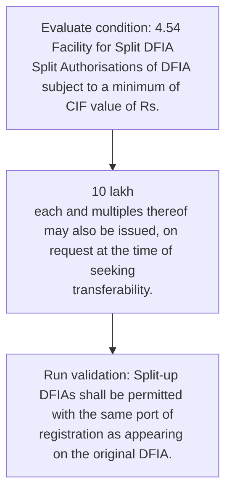
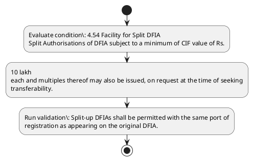

# Chapter 4 / Section 4.54: Facility for Split DFIA

**Chapter Title:** Duty Exemption / Remission Schemes

**Pages:** 33

**Purpose:** 4.54 Facility for Split DFIA
Split Authorisations of DFIA subject to a minimum of CIF value of Rs.

**Purpose Thanglish:** Indha Facility for Split DFIA section-la, 4.54 Facility for Split DFIA
Split Authorisations of DFIA subject to a minimum of CIF value of Rs.

**Summary:** 4.54 Facility for Split DFIA
Split Authorisations of DFIA subject to a minimum of CIF value of Rs. 10 lakh
each and multiples thereof may also be issued, on request at the time of seeking
transferability. Split-up DFIAs shall be permitted with the same port of
registration as appearing on the original DFIA.

**Business Meaning:** Facility for Split DFIA governs how DGFT business controls should be applied, validated, and enforced.

**Business Explanation:** Facility for Split DFIA explains the operating rule set that DEKAI should enforce. Key control points include 4.54 Facility for Split DFIA
Split Authorisations of DFIA subject to a minimum of CIF value of Rs. The section also drives actions such as 10 lakh
each and multiples thereof may also be issued, on request at the time of seeking
transferability..

**Business Explanation Thanglish:** Indha Facility for Split DFIA section-la, Facility for Split DFIA explains the operating rule set that DEKAI should enforce. Key control points include 4.54 Facility for Split DFIA
Split Authorisations of DFIA subject to a minimum of CIF value of Rs. The section also drives actions such as 10 lakh
each and multiples thereof may also be issued, on request at the time of seeking
transferability..

## Business Logic
- 4.54 Facility for Split DFIA
Split Authorisations of DFIA subject to a minimum of CIF value of Rs.
- Split-up DFIAs shall be permitted with the same port of
registration as appearing on the original DFIA.

## Business Rules
- rule_id=CH4-SEC4_54-R001, rule_description=4.54 Facility for Split DFIA
Split Authorisations of DFIA subject to a minimum of CIF value of Rs., trigger=Facility for Split DFIA, condition=4.54 Facility for Split DFIA
Split Authorisations of DFIA subject to a minimum of CIF value of Rs., validation=Split-up DFIAs shall be permitted with the same port of
registration as appearing on the original DFIA., action=10 lakh
each and multiples thereof may also be issued, on request at the time of seeking
transferability., exception=No explicit exception found in uploaded documents., output=DEKAI should produce a compliance decision for 4.54 - Facility for Split DFIA.
- rule_id=CH4-SEC4_54-R002, rule_description=Split-up DFIAs shall be permitted with the same port of
registration as appearing on the original DFIA., trigger=Facility for Split DFIA, condition=4.54 Facility for Split DFIA
Split Authorisations of DFIA subject to a minimum of CIF value of Rs., validation=Split-up DFIAs shall be permitted with the same port of
registration as appearing on the original DFIA., action=10 lakh
each and multiples thereof may also be issued, on request at the time of seeking
transferability., exception=No explicit exception found in uploaded documents., output=DEKAI should produce a compliance decision for 4.54 - Facility for Split DFIA.

## Conditions
- 4.54 Facility for Split DFIA
Split Authorisations of DFIA subject to a minimum of CIF value of Rs.

## Condition Logic
- id=4.4.54.1, if=4.54 Facility for Split DFIA
Split Authorisations of DFIA subject to a minimum of CIF value of Rs., then=10 lakh
each and multiples thereof may also be issued, on request at the time of seeking
transferability., source=4.54 Facility for Split DFIA
Split Authorisations of DFIA subject to a minimum of CIF value of Rs.

## Validations
- Split-up DFIAs shall be permitted with the same port of
registration as appearing on the original DFIA.

## Exceptions
- None identified

## Dependencies
- 1
- 4
- 5

## Authorities
- None identified

## Required Documents
- None identified

## Timelines
- None identified

## Actions
- 10 lakh
each and multiples thereof may also be issued, on request at the time of seeking
transferability.

## Workflow
- Evaluate condition: 4.54 Facility for Split DFIA
Split Authorisations of DFIA subject to a minimum of CIF value of Rs.
- 10 lakh
each and multiples thereof may also be issued, on request at the time of seeking
transferability.
- Run validation: Split-up DFIAs shall be permitted with the same port of
registration as appearing on the original DFIA.

## Workflow ASCII
```text
Facility for Split DFIA
Evaluate condition: 4.54 Facility for Split DFIA
Split Authorisations of DFIA subject to a minimum of CIF value of Rs.
   |
   v
10 lakh
each and multiples thereof may also be issued, on request at the time of seeking
transferability.
   |
   v
Run validation: Split-up DFIAs shall be permitted with the same port of
registration as appearing on the original DFIA.
```

## Decision Tree
- IF 4.54 Facility for Split DFIA
Split Authorisations of DFIA subject to a minimum of CIF value of Rs. THEN 10 lakh
each and multiples thereof may also be issued, on request at the time of seeking
transferability.

## Decision Tree ASCII
```text
Facility for Split DFIA Decision
IF 4.54 Facility for Split DFIA
Split Authorisations of DFIA subject to a minimum of CIF value of Rs. THEN 10 lakh
each and multiples thereof may also be issued, on request at the time of seeking
transferability.
```

## Examples
- User asks to process Facility for Split DFIA; the platform checks conditions, validations, and documents before action.

**Real-world Example:** Example: an importer or exporter invokes Facility for Split DFIA, submits the prescribed DGFT records, and DEKAI uses the extracted rules to 10 lakh
each and multiples thereof may also be issued, on request at the time of seeking
transferability..

**Real-world Example Thanglish:** Indha Facility for Split DFIA section-la, Example: an importer or exporter invokes Facility for Split DFIA, submits the prescribed DGFT records, and DEKAI uses the extracted rules to 10 lakh
each and multiples thereof may also be issued, on request at the time of seeking
transferability..

## AI Rules
- IF detected context matches section rule THEN enforce: 4.54 Facility for Split DFIA
Split Authorisations of DFIA subject to a minimum of CIF value of Rs.
- IF detected context matches section rule THEN enforce: Split-up DFIAs shall be permitted with the same port of
registration as appearing on the original DFIA.
- IF validations pass THEN recommend action: 10 lakh
each and multiples thereof may also be issued, on request at the time of seeking
transferability.

## Database Fields
- name=section_code, type=string, required=True, source=parsed_section_heading
- name=section_title, type=string, required=True, source=parsed_section_heading
- name=for_flag, type=boolean, required=False, source=keyword:for
- name=cif_flag, type=boolean, required=False, source=keyword:CIF
- name=and_flag, type=boolean, required=False, source=keyword:and
- name=may_flag, type=boolean, required=False, source=keyword:may
- name=the_flag, type=boolean, required=False, source=keyword:the
- name=dfia_flag, type=boolean, required=False, source=keyword:DFIA
- name=lakh_flag, type=boolean, required=False, source=keyword:lakh
- name=each_flag, type=boolean, required=False, source=keyword:each

## API Requirements
- method=GET, path=/api/dgft/sections/4.54, purpose=Retrieve knowledge payload for section 4.54, query_params=['include=workflow,decision_tree,validations'], response_fields=['section', 'title', 'summary', 'conditions', 'validations', 'exceptions', 'workflow', 'decision_tree']
- method=POST, path=/api/dgft/Facility-for-Split-DFIA/validate, purpose=Validate inputs and documents for Facility for Split DFIA, request_fields=['section_code', 'section_title'], response_fields=['status', 'errors', 'warnings', 'next_actions']
- method=POST, path=/api/dgft/Facility-for-Split-DFIA/execute, purpose=Trigger business action for 10 lakh
each and multiples thereof may also be issued, on request at the time of seeking
transferability., request_fields=['section_code', 'section_title'], response_fields=['reference_id', 'status', 'authority', 'timeline']

## UI Screens
- screen_id=Facility_for_Split_DFIA_overview, name=Facility for Split DFIA Overview, purpose=Show section summary, authority, timeline, and eligibility cues., widgets=['summary_card', 'conditions_table', 'authority_badges', 'timeline_panel']
- screen_id=Facility_for_Split_DFIA_submission, name=Facility for Split DFIA Submission, purpose=Capture applicant data and supporting documents., widgets=['dynamic_form', 'document_uploader', 'validation_panel', 'next_action_footer'], fields=['section_code', 'section_title', 'for_flag', 'cif_flag', 'and_flag', 'may_flag', 'the_flag', 'dfia_flag']

## Error Messages
- Validation failed because the section requirements were not fully met.

## FAQ
- question_en=What is the purpose of section 4.54?, answer_en=Facility for Split DFIA explains the operating rule set that DEKAI should enforce. Key control points include 4.54 Facility for Split DFIA
Split Authorisations of DFIA subject to a minimum of CIF value of Rs. The section also drives actions such as 10 lakh
each and multiples thereof may also be issued, on request at the time of seeking
transferability.., question_thanglish=Indha Facility for Split DFIA section-la, What is the purpose of section 4.54?, answer_thanglish=Indha Facility for Split DFIA section-la, Facility for Split DFIA explains the operating rule set that DEKAI should enforce. Key control points include 4.54 Facility for Split DFIA
Split Authorisations of DFIA subject to a minimum of CIF value of Rs. The section also drives actions such as 10 lakh
each and multiples thereof may also be issued, on request at the time of seeking
transferability..
- question_en=What documents are required under Facility for Split DFIA?, answer_en=Not explicitly covered in uploaded documents., question_thanglish=Indha Facility for Split DFIA section-la, What documents are required under Facility for Split DFIA?, answer_thanglish=Indha Facility for Split DFIA section-la, Not explicitly covered in uploaded documents.
- question_en=Which authority handles Facility for Split DFIA?, answer_en=Not explicitly covered in uploaded documents., question_thanglish=Indha Facility for Split DFIA section-la, Which authority handles Facility for Split DFIA?, answer_thanglish=Indha Facility for Split DFIA section-la, Not explicitly covered in uploaded documents.

## Questions Users May Ask
- What does Facility for Split DFIA require?
- Which documents are needed for Facility for Split DFIA?
- How does DEKAI validate Facility for Split DFIA requests?
- What action should be taken for Facility for Split DFIA?

## Expected AI Answers
- Facility for Split DFIA requires the platform to interpret the section text, apply the extracted business rules, and present the correct next action.
- Required documents are inferred from the section text: no explicit documents were detected.
- DEKAI validates Facility for Split DFIA by checking conditions, required documents, authority references, and exception clauses before recommending an outcome.
- The primary extracted action is: 10 lakh
each and multiples thereof may also be issued, on request at the time of seeking
transferability.

## AI Q&A Examples
- question_en=User asks: How do I comply with Facility for Split DFIA?, answer_en=AI answers: DEKAI should evaluate section 4.54, apply the extracted rules, and guide the user through Evaluate condition: 4.54 Facility for Split DFIA
Split Authorisations of DFIA subject to a minimum of CIF value of Rs.., question_thanglish=Indha Facility for Split DFIA section-la, User asks: How do I comply with Facility for Split DFIA?, answer_thanglish=Indha Facility for Split DFIA section-la, AI answers: DEKAI should evaluate section 4.54, apply the extracted rules, and guide the user through Evaluate condition: 4.54 Facility for Split DFIA
Split Authorisations of DFIA subject to a minimum of CIF value of Rs..
- question_en=User asks: Which validations apply to Facility for Split DFIA?, answer_en=AI answers: Applicable validations are Split-up DFIAs shall be permitted with the same port of
registration as appearing on the original DFIA., question_thanglish=Indha Facility for Split DFIA section-la, User asks: Which validations apply to Facility for Split DFIA?, answer_thanglish=Indha Facility for Split DFIA section-la, AI answers: Applicable validations are Split-up DFIAs kandippa be permitted with the same port of
registration as appearing on the original DFIA.

## DEKAI AI Implementation Notes
- Capture chapter 4, section 4.54, title, and page references as immutable knowledge metadata.
- Bind validations for Facility for Split DFIA into a rule engine keyed by the rule IDs extracted for this section.
- Show contextual links to related sections: 1, 4, 5.

## DEKAI AI Implementation Notes Thanglish
- Indha Facility for Split DFIA section-la, Capture chapter 4, section 4.54, title, and page references as immutable knowledge metadata.
- Indha Facility for Split DFIA section-la, Bind validations for Facility for Split DFIA into a rule engine keyed by the rule IDs extracted for this section.
- Indha Facility for Split DFIA section-la, Show contextual links to related sections: 1, 4, 5.

## AI Metadata
- Keywords: for, CIF, and, may, the, DFIA, lakh, each, also, time, with, same, port, Split, value, DFIAs, shall, issued, subject, minimum
- Search Keywords: for, CIF, and, may, the, DFIA, lakh, each, also, time, with, same, port, Split, value, DFIAs, shall, issued, subject, minimum
- Intent: Support Facility for Split DFIA processing and compliance validation.
- Tags: 4.54, Facility for Split DFIA, business-rule, dgft
- Related Sections: 1, 4, 5
- Related Chapters: 
- Related Rules: 4.54 Facility for Split DFIA
Split Authorisations of DFIA subject to a minimum of CIF value of Rs., Split-up DFIAs shall be permitted with the same port of
registration as appearing on the original DFIA.

## Mermaid


## PlantUML

