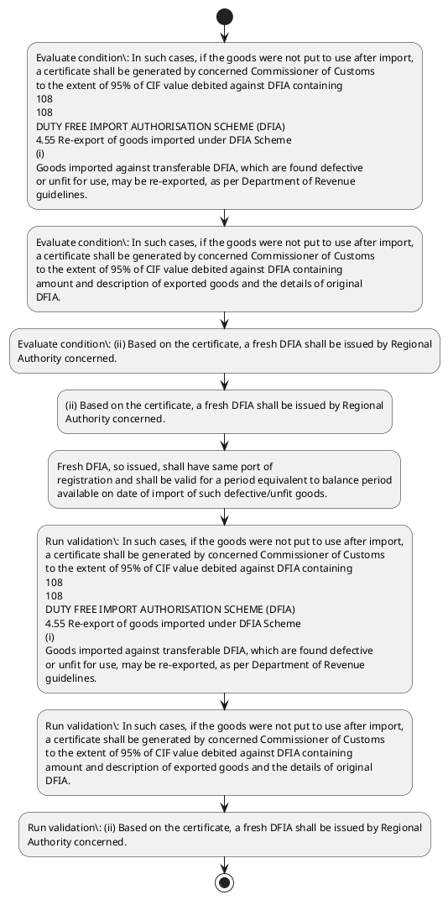

# Chapter 4 / Section 4.55: Re-export of goods imported under DFIA Scheme

**Chapter Title:** Duty Exemption / Remission Schemes

**Pages:** 33, 34

**Purpose:** 4.55 Re-export of goods imported under DFIA Scheme
(i) Goods imported against transferable DFIA, which are found defective
or unfit for use, may be re-exported, as per Department of Revenue
guidelines.

**Purpose Thanglish:** Indha Re-export of goods imported under DFIA Scheme section-la, 4.55 Re-export of goods imported under DFIA Scheme
(i) Goods imported against transferable DFIA, which are found defective
or unfit for use, may be re-exported, as per Department of Revenue
guidelines.

**Summary:** 4.55 Re-export of goods imported under DFIA Scheme
(i) Goods imported against transferable DFIA, which are found defective
or unfit for use, may be re-exported, as per Department of Revenue
guidelines. In such cases, if the goods were not put to use after import,
a certificate shall be generated by concerned Commissioner of Customs
to the extent of 95% of CIF value debited against DFIA containing
108
108
DUTY FREE IMPORT AUTHORISATION SCHEME (DFIA)
4.55 Re-export of goods imported under DFIA Scheme
(i)
Goods imported against transferable DFIA, which are found defective
or unfit for use, may be re-exported, as per Department of Revenue
guidelines. In such cases, if the goods were not put to use after import,
a certificate shall be generated by concerned Commissioner of Customs
to the extent of 95% of CIF value debited against DFIA containing
amount and description of exported goods and the details of original
DFIA.

**Business Meaning:** Re-export of goods imported under DFIA Scheme governs how DGFT business controls should be applied, validated, and enforced.

**Business Explanation:** Re-export of goods imported under DFIA Scheme explains the operating rule set that DEKAI should enforce. Key control points include In such cases, if the goods were not put to use after import,
a certificate shall be generated by concerned Commissioner of Customs
to the extent of 95% of CIF value debited against DFIA containing
108
108
DUTY FREE IMPORT AUTHORISATION SCHEME (DFIA)
4.55 Re-export of goods imported under DFIA Scheme
(i)
Goods imported against transferable DFIA, which are found defective
or unfit for use, may be re-exported, as per Department of Revenue
guidelines. The section also drives actions such as (ii) Based on the certificate, a fresh DFIA shall be issued by Regional
Authority concerned..

**Business Explanation Thanglish:** Indha Re-export of goods imported under DFIA Scheme section-la, Re-export of goods imported under DFIA Scheme explains the operating rule set that DEKAI should enforce. Key control points include In such cases, if the goods were not put to use after import,
a certificate kandippa be generated by concerned Commissioner of Customs
to the extent of 95% of CIF value debited against DFIA containing
108
108
DUTY FREE import AUTHORISATION SCHEME (DFIA)
4.55 Re-export of goods imported under DFIA Scheme
(i)
Goods imported against transferable DFIA, which are found defective
or unfit for use, may be re-exported, as per Department of Revenue
guidelines. The section also drives actions such as (ii) Based on the certificate, a fresh DFIA kandippa be issued by Regional
authority concerned..

## Business Logic
- In such cases, if the goods were not put to use after import,
a certificate shall be generated by concerned Commissioner of Customs
to the extent of 95% of CIF value debited against DFIA containing
108
108
DUTY FREE IMPORT AUTHORISATION SCHEME (DFIA)
4.55 Re-export of goods imported under DFIA Scheme
(i)
Goods imported against transferable DFIA, which are found defective
or unfit for use, may be re-exported, as per Department of Revenue
guidelines.
- In such cases, if the goods were not put to use after import,
a certificate shall be generated by concerned Commissioner of Customs
to the extent of 95% of CIF value debited against DFIA containing
amount and description of exported goods and the details of original
DFIA.
- (ii) Based on the certificate, a fresh DFIA shall be issued by Regional
Authority concerned.
- Fresh DFIA, so issued, shall have same port of
registration and shall be valid for a period equivalent to balance period
available on date of import of such defective/unfit goods.

## Business Rules
- rule_id=CH4-SEC4_55-R001, rule_description=In such cases, if the goods were not put to use after import,
a certificate shall be generated by concerned Commissioner of Customs
to the extent of 95% of CIF value debited against DFIA containing
108
108
DUTY FREE IMPORT AUTHORISATION SCHEME (DFIA)
4.55 Re-export of goods imported under DFIA Scheme
(i)
Goods imported against transferable DFIA, which are found defective
or unfit for use, may be re-exported, as per Department of Revenue
guidelines., trigger=Re-export of goods imported under DFIA Scheme, condition=the goods were not put to use after import, validation=In such cases, if the goods were not put to use after import,
a certificate shall be generated by concerned Commissioner of Customs
to the extent of 95% of CIF value debited against DFIA containing
108
108
DUTY FREE IMPORT AUTHORISATION SCHEME (DFIA)
4.55 Re-export of goods imported under DFIA Scheme
(i)
Goods imported against transferable DFIA, which are found defective
or unfit for use, may be re-exported, as per Department of Revenue
guidelines., action=(ii) Based on the certificate, a fresh DFIA shall be issued by Regional
Authority concerned., exception=No explicit exception found in uploaded documents., output=DEKAI should produce a compliance decision for 4.55 - Re-export of goods imported under DFIA Scheme.
- rule_id=CH4-SEC4_55-R002, rule_description=In such cases, if the goods were not put to use after import,
a certificate shall be generated by concerned Commissioner of Customs
to the extent of 95% of CIF value debited against DFIA containing
amount and description of exported goods and the details of original
DFIA., trigger=Re-export of goods imported under DFIA Scheme, condition=the goods were not put to use after import, validation=In such cases, if the goods were not put to use after import,
a certificate shall be generated by concerned Commissioner of Customs
to the extent of 95% of CIF value debited against DFIA containing
amount and description of exported goods and the details of original
DFIA., action=Fresh DFIA, so issued, shall have same port of
registration and shall be valid for a period equivalent to balance period
available on date of import of such defective/unfit goods., exception=No explicit exception found in uploaded documents., output=DEKAI should produce a compliance decision for 4.55 - Re-export of goods imported under DFIA Scheme.
- rule_id=CH4-SEC4_55-R003, rule_description=(ii) Based on the certificate, a fresh DFIA shall be issued by Regional
Authority concerned., trigger=Re-export of goods imported under DFIA Scheme, condition=(ii) Based on the certificate, a fresh DFIA shall be issued by Regional
Authority concerned., validation=(ii) Based on the certificate, a fresh DFIA shall be issued by Regional
Authority concerned., action=Fresh DFIA, so issued, shall have same port of
registration and shall be valid for a period equivalent to balance period
available on date of import of such defective/unfit goods., exception=No explicit exception found in uploaded documents., output=DEKAI should produce a compliance decision for 4.55 - Re-export of goods imported under DFIA Scheme.
- rule_id=CH4-SEC4_55-R004, rule_description=Fresh DFIA, so issued, shall have same port of
registration and shall be valid for a period equivalent to balance period
available on date of import of such defective/unfit goods., trigger=Re-export of goods imported under DFIA Scheme, condition=(ii) Based on the certificate, a fresh DFIA shall be issued by Regional
Authority concerned., validation=Fresh DFIA, so issued, shall have same port of
registration and shall be valid for a period equivalent to balance period
available on date of import of such defective/unfit goods., action=Fresh DFIA, so issued, shall have same port of
registration and shall be valid for a period equivalent to balance period
available on date of import of such defective/unfit goods., exception=No explicit exception found in uploaded documents., output=DEKAI should produce a compliance decision for 4.55 - Re-export of goods imported under DFIA Scheme.

## Conditions
- In such cases, if the goods were not put to use after import,
a certificate shall be generated by concerned Commissioner of Customs
to the extent of 95% of CIF value debited against DFIA containing
108
108
DUTY FREE IMPORT AUTHORISATION SCHEME (DFIA)
4.55 Re-export of goods imported under DFIA Scheme
(i)
Goods imported against transferable DFIA, which are found defective
or unfit for use, may be re-exported, as per Department of Revenue
guidelines.
- In such cases, if the goods were not put to use after import,
a certificate shall be generated by concerned Commissioner of Customs
to the extent of 95% of CIF value debited against DFIA containing
amount and description of exported goods and the details of original
DFIA.
- (ii) Based on the certificate, a fresh DFIA shall be issued by Regional
Authority concerned.

## Condition Logic
- id=4.4.55.1, if=the goods were not put to use after import, then=(ii) Based on the certificate, a fresh DFIA shall be issued by Regional
Authority concerned., source=In such cases, if the goods were not put to use after import,
a certificate shall be generated by concerned Commissioner of Customs
to the extent of 95% of CIF value debited against DFIA containing
108
108
DUTY FREE IMPORT AUTHORISATION SCHEME (DFIA)
4.55 Re-export of goods imported under DFIA Scheme
(i)
Goods imported against transferable DFIA, which are found defective
or unfit for use, may be re-exported, as per Department of Revenue
guidelines.
- id=4.4.55.2, if=the goods were not put to use after import, then=(ii) Based on the certificate, a fresh DFIA shall be issued by Regional
Authority concerned., source=In such cases, if the goods were not put to use after import,
a certificate shall be generated by concerned Commissioner of Customs
to the extent of 95% of CIF value debited against DFIA containing
amount and description of exported goods and the details of original
DFIA.
- id=4.4.55.3, if=(ii) Based on the certificate, a fresh DFIA shall be issued by Regional
Authority concerned., then=(ii) Based on the certificate, a fresh DFIA shall be issued by Regional
Authority concerned., source=(ii) Based on the certificate, a fresh DFIA shall be issued by Regional
Authority concerned.

## Validations
- In such cases, if the goods were not put to use after import,
a certificate shall be generated by concerned Commissioner of Customs
to the extent of 95% of CIF value debited against DFIA containing
108
108
DUTY FREE IMPORT AUTHORISATION SCHEME (DFIA)
4.55 Re-export of goods imported under DFIA Scheme
(i)
Goods imported against transferable DFIA, which are found defective
or unfit for use, may be re-exported, as per Department of Revenue
guidelines.
- In such cases, if the goods were not put to use after import,
a certificate shall be generated by concerned Commissioner of Customs
to the extent of 95% of CIF value debited against DFIA containing
amount and description of exported goods and the details of original
DFIA.
- (ii) Based on the certificate, a fresh DFIA shall be issued by Regional
Authority concerned.
- Fresh DFIA, so issued, shall have same port of
registration and shall be valid for a period equivalent to balance period
available on date of import of such defective/unfit goods.

## Exceptions
- None identified

## Dependencies
- 1
- 4
- 5

## Authorities
- Customs
- Commissioner of Customs

## Required Documents
- In such cases, if the goods were not put to use after import,
a certificate shall be generated by concerned Commissioner of Customs
to the extent of 95% of CIF value debited against DFIA containing
108
108
DUTY FREE IMPORT AUTHORISATION SCHEME (DFIA)
4.55 Re-export of goods imported under DFIA Scheme
(i)
Goods imported against transferable DFIA, which are found defective
or unfit for use, may be re-exported, as per Department of Revenue
guidelines.
- In such cases, if the goods were not put to use after import,
a certificate shall be generated by concerned Commissioner of Customs
to the extent of 95% of CIF value debited against DFIA containing
amount and description of exported goods and the details of original
DFIA.
- (ii) Based on the certificate, a fresh DFIA shall be issued by Regional
Authority concerned.

## Timelines
- In such cases, if the goods were not put to use after import,
a certificate shall be generated by concerned Commissioner of Customs
to the extent of 95% of CIF value debited against DFIA containing
108
108
DUTY FREE IMPORT AUTHORISATION SCHEME (DFIA)
4.55 Re-export of goods imported under DFIA Scheme
(i)
Goods imported against transferable DFIA, which are found defective
or unfit for use, may be re-exported, as per Department of Revenue
guidelines.
- In such cases, if the goods were not put to use after import,
a certificate shall be generated by concerned Commissioner of Customs
to the extent of 95% of CIF value debited against DFIA containing
amount and description of exported goods and the details of original
DFIA.
- Fresh DFIA, so issued, shall have same port of
registration and shall be valid for a period equivalent to balance period
available on date of import of such defective/unfit goods.

## Actions
- (ii) Based on the certificate, a fresh DFIA shall be issued by Regional
Authority concerned.
- Fresh DFIA, so issued, shall have same port of
registration and shall be valid for a period equivalent to balance period
available on date of import of such defective/unfit goods.

## Workflow
- Evaluate condition: In such cases, if the goods were not put to use after import,
a certificate shall be generated by concerned Commissioner of Customs
to the extent of 95% of CIF value debited against DFIA containing
108
108
DUTY FREE IMPORT AUTHORISATION SCHEME (DFIA)
4.55 Re-export of goods imported under DFIA Scheme
(i)
Goods imported against transferable DFIA, which are found defective
or unfit for use, may be re-exported, as per Department of Revenue
guidelines.
- Evaluate condition: In such cases, if the goods were not put to use after import,
a certificate shall be generated by concerned Commissioner of Customs
to the extent of 95% of CIF value debited against DFIA containing
amount and description of exported goods and the details of original
DFIA.
- Evaluate condition: (ii) Based on the certificate, a fresh DFIA shall be issued by Regional
Authority concerned.
- (ii) Based on the certificate, a fresh DFIA shall be issued by Regional
Authority concerned.
- Fresh DFIA, so issued, shall have same port of
registration and shall be valid for a period equivalent to balance period
available on date of import of such defective/unfit goods.
- Run validation: In such cases, if the goods were not put to use after import,
a certificate shall be generated by concerned Commissioner of Customs
to the extent of 95% of CIF value debited against DFIA containing
108
108
DUTY FREE IMPORT AUTHORISATION SCHEME (DFIA)
4.55 Re-export of goods imported under DFIA Scheme
(i)
Goods imported against transferable DFIA, which are found defective
or unfit for use, may be re-exported, as per Department of Revenue
guidelines.
- Run validation: In such cases, if the goods were not put to use after import,
a certificate shall be generated by concerned Commissioner of Customs
to the extent of 95% of CIF value debited against DFIA containing
amount and description of exported goods and the details of original
DFIA.
- Run validation: (ii) Based on the certificate, a fresh DFIA shall be issued by Regional
Authority concerned.

## Workflow ASCII
```text
Re-export of goods imported under DFIA Scheme
Evaluate condition: In such cases, if the goods were not put to use after import,
a certificate shall be generated by concerned Commissioner of Customs
to the extent of 95% of CIF value debited against DFIA containing
108
108
DUTY FREE IMPORT AUTHORISATION SCHEME (DFIA)
4.55 Re-export of goods imported under DFIA Scheme
(i)
Goods imported against transferable DFIA, which are found defective
or unfit for use, may be re-exported, as per Department of Revenue
guidelines.
   |
   v
Evaluate condition: In such cases, if the goods were not put to use after import,
a certificate shall be generated by concerned Commissioner of Customs
to the extent of 95% of CIF value debited against DFIA containing
amount and description of exported goods and the details of original
DFIA.
   |
   v
Evaluate condition: (ii) Based on the certificate, a fresh DFIA shall be issued by Regional
Authority concerned.
   |
   v
(ii) Based on the certificate, a fresh DFIA shall be issued by Regional
Authority concerned.
   |
   v
Fresh DFIA, so issued, shall have same port of
registration and shall be valid for a period equivalent to balance period
available on date of import of such defective/unfit goods.
   |
   v
Run validation: In such cases, if the goods were not put to use after import,
a certificate shall be generated by concerned Commissioner of Customs
to the extent of 95% of CIF value debited against DFIA containing
108
108
DUTY FREE IMPORT AUTHORISATION SCHEME (DFIA)
4.55 Re-export of goods imported under DFIA Scheme
(i)
Goods imported against transferable DFIA, which are found defective
or unfit for use, may be re-exported, as per Department of Revenue
guidelines.
   |
   v
Run validation: In such cases, if the goods were not put to use after import,
a certificate shall be generated by concerned Commissioner of Customs
to the extent of 95% of CIF value debited against DFIA containing
amount and description of exported goods and the details of original
DFIA.
   |
   v
Run validation: (ii) Based on the certificate, a fresh DFIA shall be issued by Regional
Authority concerned.
```

## Decision Tree
- IF In such cases, if the goods were not put to use after import,
a certificate shall be generated by concerned Commissioner of Customs
to the extent of 95% of CIF value debited against DFIA containing
108
108
DUTY FREE IMPORT AUTHORISATION SCHEME (DFIA)
4.55 Re-export of goods imported under DFIA Scheme
(i)
Goods imported against transferable DFIA, which are found defective
or unfit for use, may be re-exported, as per Department of Revenue
guidelines. THEN (ii) Based on the certificate, a fresh DFIA shall be issued by Regional
Authority concerned.
- IF In such cases, if the goods were not put to use after import,
a certificate shall be generated by concerned Commissioner of Customs
to the extent of 95% of CIF value debited against DFIA containing
amount and description of exported goods and the details of original
DFIA. THEN (ii) Based on the certificate, a fresh DFIA shall be issued by Regional
Authority concerned.
- IF (ii) Based on the certificate, a fresh DFIA shall be issued by Regional
Authority concerned. THEN (ii) Based on the certificate, a fresh DFIA shall be issued by Regional
Authority concerned.

## Decision Tree ASCII
```text
Re-export of goods imported under DFIA Scheme Decision
IF In such cases, if the goods were not put to use after import,
a certificate shall be generated by concerned Commissioner of Customs
to the extent of 95% of CIF value debited against DFIA containing
108
108
DUTY FREE IMPORT AUTHORISATION SCHEME (DFIA)
4.55 Re-export of goods imported under DFIA Scheme
(i)
Goods imported against transferable DFIA, which are found defective
or unfit for use, may be re-exported, as per Department of Revenue
guidelines. THEN (ii) Based on the certificate, a fresh DFIA shall be issued by Regional
Authority concerned.
   |
   v
IF In such cases, if the goods were not put to use after import,
a certificate shall be generated by concerned Commissioner of Customs
to the extent of 95% of CIF value debited against DFIA containing
amount and description of exported goods and the details of original
DFIA. THEN (ii) Based on the certificate, a fresh DFIA shall be issued by Regional
Authority concerned.
   |
   v
IF (ii) Based on the certificate, a fresh DFIA shall be issued by Regional
Authority concerned. THEN (ii) Based on the certificate, a fresh DFIA shall be issued by Regional
Authority concerned.
```

## Examples
- User asks to process Re-export of goods imported under DFIA Scheme; the platform checks conditions, validations, and documents before action.

**Real-world Example:** Example: an importer or exporter invokes Re-export of goods imported under DFIA Scheme, submits In such cases, if the goods were not put to use after import,
a certificate shall be generated by concerned Commissioner of Customs
to the extent of 95% of CIF value debited against DFIA containing
108
108
DUTY FREE IMPORT AUTHORISATION SCHEME (DFIA)
4.55 Re-export of goods imported under DFIA Scheme
(i)
Goods imported against transferable DFIA, which are found defective
or unfit for use, may be re-exported, as per Department of Revenue
guidelines., In such cases, if the goods were not put to use after import,
a certificate shall be generated by concerned Commissioner of Customs
to the extent of 95% of CIF value debited against DFIA containing
amount and description of exported goods and the details of original
DFIA., (ii) Based on the certificate, a fresh DFIA shall be issued by Regional
Authority concerned., and DEKAI uses the extracted rules to (ii) based on the certificate, a fresh dfia shall be issued by regional
authority concerned..

**Real-world Example Thanglish:** Indha Re-export of goods imported under DFIA Scheme section-la, Example: an importer or exporter invokes Re-export of goods imported under DFIA Scheme, submits In such cases, if the goods were not put to use after import,
a certificate kandippa be generated by concerned Commissioner of Customs
to the extent of 95% of CIF value debited against DFIA containing
108
108
DUTY FREE import AUTHORISATION SCHEME (DFIA)
4.55 Re-export of goods imported under DFIA Scheme
(i)
Goods imported against transferable DFIA, which are found defective
or unfit for use, may be re-exported, as per Department of Revenue
guidelines., In such cases, if the goods were not put to use after import,
a certificate kandippa be generated by concerned Commissioner of Customs
to the extent of 95% of CIF value debited against DFIA containing
amount and description of exported goods and the details of original
DFIA., (ii) Based on the certificate, a fresh DFIA kandippa be issued by Regional
authority concerned., and DEKAI uses the extracted rules to (ii) based on the certificate, a fresh dfia kandippa be issued by regional
authority concerned..

## AI Rules
- IF detected context matches section rule THEN enforce: In such cases, if the goods were not put to use after import,
a certificate shall be generated by concerned Commissioner of Customs
to the extent of 95% of CIF value debited against DFIA containing
108
108
DUTY FREE IMPORT AUTHORISATION SCHEME (DFIA)
4.55 Re-export of goods imported under DFIA Scheme
(i)
Goods imported against transferable DFIA, which are found defective
or unfit for use, may be re-exported, as per Department of Revenue
guidelines.
- IF detected context matches section rule THEN enforce: In such cases, if the goods were not put to use after import,
a certificate shall be generated by concerned Commissioner of Customs
to the extent of 95% of CIF value debited against DFIA containing
amount and description of exported goods and the details of original
DFIA.
- IF detected context matches section rule THEN enforce: (ii) Based on the certificate, a fresh DFIA shall be issued by Regional
Authority concerned.
- IF detected context matches section rule THEN enforce: Fresh DFIA, so issued, shall have same port of
registration and shall be valid for a period equivalent to balance period
available on date of import of such defective/unfit goods.
- IF validations pass THEN recommend action: (ii) Based on the certificate, a fresh DFIA shall be issued by Regional
Authority concerned.

## Database Fields
- name=section_code, type=string, required=True, source=parsed_section_heading
- name=section_title, type=string, required=True, source=parsed_section_heading
- name=are_flag, type=boolean, required=False, source=keyword:are
- name=for_flag, type=boolean, required=False, source=keyword:for
- name=use_flag, type=boolean, required=False, source=keyword:use
- name=may_flag, type=boolean, required=False, source=keyword:may
- name=per_flag, type=boolean, required=False, source=keyword:per
- name=the_flag, type=boolean, required=False, source=keyword:the
- name=not_flag, type=boolean, required=False, source=keyword:not
- name=put_flag, type=boolean, required=False, source=keyword:put
- name=document_1_submitted, type=boolean, required=True, source=In such cases, if the goods were not put to use after import,
a certificate shall be generated by concerned Commissioner of Customs
to the extent of 95% of CIF value debited against DFIA containing
108
108
DUTY FREE IMPORT AUTHORISATION SCHEME (DFIA)
4.55 Re-export of goods imported under DFIA Scheme
(i)
Goods imported against transferable DFIA, which are found defective
or unfit for use, may be re-exported, as per Department of Revenue
guidelines.
- name=document_2_submitted, type=boolean, required=True, source=In such cases, if the goods were not put to use after import,
a certificate shall be generated by concerned Commissioner of Customs
to the extent of 95% of CIF value debited against DFIA containing
amount and description of exported goods and the details of original
DFIA.
- name=document_3_submitted, type=boolean, required=True, source=(ii) Based on the certificate, a fresh DFIA shall be issued by Regional
Authority concerned.

## API Requirements
- method=GET, path=/api/dgft/sections/4.55, purpose=Retrieve knowledge payload for section 4.55, query_params=['include=workflow,decision_tree,validations'], response_fields=['section', 'title', 'summary', 'conditions', 'validations', 'exceptions', 'workflow', 'decision_tree']
- method=POST, path=/api/dgft/Re-export-of-goods-imported-under-DFIA-Scheme/validate, purpose=Validate inputs and documents for Re-export of goods imported under DFIA Scheme, request_fields=['section_code', 'section_title', 'document_1_submitted', 'document_2_submitted', 'document_3_submitted'], response_fields=['status', 'errors', 'warnings', 'next_actions']
- method=POST, path=/api/dgft/Re-export-of-goods-imported-under-DFIA-Scheme/execute, purpose=Trigger business action for (ii) Based on the certificate, a fresh DFIA shall be issued by Regional
Authority concerned., request_fields=['section_code', 'section_title', 'document_1_submitted', 'document_2_submitted', 'document_3_submitted'], response_fields=['reference_id', 'status', 'authority', 'timeline']

## UI Screens
- screen_id=Re_export_of_goods_imported_under_DFIA_Scheme_overview, name=Re-export of goods imported under DFIA Scheme Overview, purpose=Show section summary, authority, timeline, and eligibility cues., widgets=['summary_card', 'conditions_table', 'authority_badges', 'timeline_panel']
- screen_id=Re_export_of_goods_imported_under_DFIA_Scheme_submission, name=Re-export of goods imported under DFIA Scheme Submission, purpose=Capture applicant data and supporting documents., widgets=['dynamic_form', 'document_uploader', 'validation_panel', 'next_action_footer'], fields=['section_code', 'section_title', 'are_flag', 'for_flag', 'use_flag', 'may_flag', 'per_flag', 'the_flag']

## Error Messages
- Validation failed because the section requirements were not fully met.

## FAQ
- question_en=What is the purpose of section 4.55?, answer_en=Re-export of goods imported under DFIA Scheme explains the operating rule set that DEKAI should enforce. Key control points include In such cases, if the goods were not put to use after import,
a certificate shall be generated by concerned Commissioner of Customs
to the extent of 95% of CIF value debited against DFIA containing
108
108
DUTY FREE IMPORT AUTHORISATION SCHEME (DFIA)
4.55 Re-export of goods imported under DFIA Scheme
(i)
Goods imported against transferable DFIA, which are found defective
or unfit for use, may be re-exported, as per Department of Revenue
guidelines. The section also drives actions such as (ii) Based on the certificate, a fresh DFIA shall be issued by Regional
Authority concerned.., question_thanglish=Indha Re-export of goods imported under DFIA Scheme section-la, What is the purpose of section 4.55?, answer_thanglish=Indha Re-export of goods imported under DFIA Scheme section-la, Re-export of goods imported under DFIA Scheme explains the operating rule set that DEKAI should enforce. Key control points include In such cases, if the goods were not put to use after import,
a certificate kandippa be generated by concerned Commissioner of Customs
to the extent of 95% of CIF value debited against DFIA containing
108
108
DUTY FREE import AUTHORISATION SCHEME (DFIA)
4.55 Re-export of goods imported under DFIA Scheme
(i)
Goods imported against transferable DFIA, which are found defective
or unfit for use, may be re-exported, as per Department of Revenue
guidelines. The section also drives actions such as (ii) Based on the certificate, a fresh DFIA kandippa be issued by Regional
authority concerned..
- question_en=What documents are required under Re-export of goods imported under DFIA Scheme?, answer_en=In such cases, if the goods were not put to use after import,
a certificate shall be generated by concerned Commissioner of Customs
to the extent of 95% of CIF value debited against DFIA containing
108
108
DUTY FREE IMPORT AUTHORISATION SCHEME (DFIA)
4.55 Re-export of goods imported under DFIA Scheme
(i)
Goods imported against transferable DFIA, which are found defective
or unfit for use, may be re-exported, as per Department of Revenue
guidelines., In such cases, if the goods were not put to use after import,
a certificate shall be generated by concerned Commissioner of Customs
to the extent of 95% of CIF value debited against DFIA containing
amount and description of exported goods and the details of original
DFIA., (ii) Based on the certificate, a fresh DFIA shall be issued by Regional
Authority concerned., question_thanglish=Indha Re-export of goods imported under DFIA Scheme section-la, What documents are required under Re-export of goods imported under DFIA Scheme?, answer_thanglish=Indha Re-export of goods imported under DFIA Scheme section-la, In such cases, if the goods were not put to use after import,
a certificate kandippa be generated by concerned Commissioner of Customs
to the extent of 95% of CIF value debited against DFIA containing
108
108
DUTY FREE import AUTHORISATION SCHEME (DFIA)
4.55 Re-export of goods imported under DFIA Scheme
(i)
Goods imported against transferable DFIA, which are found defective
or unfit for use, may be re-exported, as per Department of Revenue
guidelines., In such cases, if the goods were not put to use after import,
a certificate kandippa be generated by concerned Commissioner of Customs
to the extent of 95% of CIF value debited against DFIA containing
amount and description of exported goods and the details of original
DFIA., (ii) Based on the certificate, a fresh DFIA kandippa be issued by Regional
authority concerned.
- question_en=Which authority handles Re-export of goods imported under DFIA Scheme?, answer_en=Customs, Commissioner of Customs, question_thanglish=Indha Re-export of goods imported under DFIA Scheme section-la, Which authority handles Re-export of goods imported under DFIA Scheme?, answer_thanglish=Indha Re-export of goods imported under DFIA Scheme section-la, Customs, Commissioner of Customs

## Questions Users May Ask
- What does Re-export of goods imported under DFIA Scheme require?
- Which documents are needed for Re-export of goods imported under DFIA Scheme?
- How does DEKAI validate Re-export of goods imported under DFIA Scheme requests?
- What action should be taken for Re-export of goods imported under DFIA Scheme?

## Expected AI Answers
- Re-export of goods imported under DFIA Scheme requires the platform to interpret the section text, apply the extracted business rules, and present the correct next action.
- Required documents are inferred from the section text: In such cases, if the goods were not put to use after import,
a certificate shall be generated by concerned Commissioner of Customs
to the extent of 95% of CIF value debited against DFIA containing
108
108
DUTY FREE IMPORT AUTHORISATION SCHEME (DFIA)
4.55 Re-export of goods imported under DFIA Scheme
(i)
Goods imported against transferable DFIA, which are found defective
or unfit for use, may be re-exported, as per Department of Revenue
guidelines., In such cases, if the goods were not put to use after import,
a certificate shall be generated by concerned Commissioner of Customs
to the extent of 95% of CIF value debited against DFIA containing
amount and description of exported goods and the details of original
DFIA., (ii) Based on the certificate, a fresh DFIA shall be issued by Regional
Authority concerned.
- DEKAI validates Re-export of goods imported under DFIA Scheme by checking conditions, required documents, authority references, and exception clauses before recommending an outcome.
- The primary extracted action is: (ii) Based on the certificate, a fresh DFIA shall be issued by Regional
Authority concerned.

## AI Q&A Examples
- question_en=User asks: How do I comply with Re-export of goods imported under DFIA Scheme?, answer_en=AI answers: DEKAI should evaluate section 4.55, apply the extracted rules, and guide the user through Evaluate condition: In such cases, if the goods were not put to use after import,
a certificate shall be generated by concerned Commissioner of Customs
to the extent of 95% of CIF value debited against DFIA containing
108
108
DUTY FREE IMPORT AUTHORISATION SCHEME (DFIA)
4.55 Re-export of goods imported under DFIA Scheme
(i)
Goods imported against transferable DFIA, which are found defective
or unfit for use, may be re-exported, as per Department of Revenue
guidelines.., question_thanglish=Indha Re-export of goods imported under DFIA Scheme section-la, User asks: How do I comply with Re-export of goods imported under DFIA Scheme?, answer_thanglish=Indha Re-export of goods imported under DFIA Scheme section-la, AI answers: DEKAI should evaluate section 4.55, apply the extracted rules, and guide the user through Evaluate condition: In such cases, if the goods were not put to use after import,
a certificate kandippa be generated by concerned Commissioner of Customs
to the extent of 95% of CIF value debited against DFIA containing
108
108
DUTY FREE import AUTHORISATION SCHEME (DFIA)
4.55 Re-export of goods imported under DFIA Scheme
(i)
Goods imported against transferable DFIA, which are found defective
or unfit for use, may be re-exported, as per Department of Revenue
guidelines..
- question_en=User asks: Which validations apply to Re-export of goods imported under DFIA Scheme?, answer_en=AI answers: Applicable validations are In such cases, if the goods were not put to use after import,
a certificate shall be generated by concerned Commissioner of Customs
to the extent of 95% of CIF value debited against DFIA containing
108
108
DUTY FREE IMPORT AUTHORISATION SCHEME (DFIA)
4.55 Re-export of goods imported under DFIA Scheme
(i)
Goods imported against transferable DFIA, which are found defective
or unfit for use, may be re-exported, as per Department of Revenue
guidelines., In such cases, if the goods were not put to use after import,
a certificate shall be generated by concerned Commissioner of Customs
to the extent of 95% of CIF value debited against DFIA containing
amount and description of exported goods and the details of original
DFIA., (ii) Based on the certificate, a fresh DFIA shall be issued by Regional
Authority concerned., question_thanglish=Indha Re-export of goods imported under DFIA Scheme section-la, User asks: Which validations apply to Re-export of goods imported under DFIA Scheme?, answer_thanglish=Indha Re-export of goods imported under DFIA Scheme section-la, AI answers: Applicable validations are In such cases, if the goods were not put to use after import,
a certificate kandippa be generated by concerned Commissioner of Customs
to the extent of 95% of CIF value debited against DFIA containing
108
108
DUTY FREE import AUTHORISATION SCHEME (DFIA)
4.55 Re-export of goods imported under DFIA Scheme
(i)
Goods imported against transferable DFIA, which are found defective
or unfit for use, may be re-exported, as per Department of Revenue
guidelines., In such cases, if the goods were not put to use after import,
a certificate kandippa be generated by concerned Commissioner of Customs
to the extent of 95% of CIF value debited against DFIA containing
amount and description of exported goods and the details of original
DFIA., (ii) Based on the certificate, a fresh DFIA kandippa be issued by Regional
authority concerned.

## DEKAI AI Implementation Notes
- Capture chapter 4, section 4.55, title, and page references as immutable knowledge metadata.
- Bind validations for Re-export of goods imported under DFIA Scheme into a rule engine keyed by the rule IDs extracted for this section.
- Expose document upload controls for: In such cases, if the goods were not put to use after import,
a certificate shall be generated by concerned Commissioner of Customs
to the extent of 95% of CIF value debited against DFIA containing
108
108
DUTY FREE IMPORT AUTHORISATION SCHEME (DFIA)
4.55 Re-export of goods imported under DFIA Scheme
(i)
Goods imported against transferable DFIA, which are found defective
or unfit for use, may be re-exported, as per Department of Revenue
guidelines., In such cases, if the goods were not put to use after import,
a certificate shall be generated by concerned Commissioner of Customs
to the extent of 95% of CIF value debited against DFIA containing
amount and description of exported goods and the details of original
DFIA., (ii) Based on the certificate, a fresh DFIA shall be issued by Regional
Authority concerned..
- Route escalations or approvals to: Customs, Commissioner of Customs.
- Show contextual links to related sections: 1, 4, 5.

## DEKAI AI Implementation Notes Thanglish
- Indha Re-export of goods imported under DFIA Scheme section-la, Capture chapter 4, section 4.55, title, and page references as immutable knowledge metadata.
- Indha Re-export of goods imported under DFIA Scheme section-la, Bind validations for Re-export of goods imported under DFIA Scheme into a rule engine keyed by the rule IDs extracted for this section.
- Indha Re-export of goods imported under DFIA Scheme section-la, Expose document upload controls for: In such cases, if the goods were not put to use after import,
a certificate kandippa be generated by concerned Commissioner of Customs
to the extent of 95% of CIF value debited against DFIA containing
108
108
DUTY FREE import AUTHORISATION SCHEME (DFIA)
4.55 Re-export of goods imported under DFIA Scheme
(i)
Goods imported against transferable DFIA, which are found defective
or unfit for use, may be re-exported, as per Department of Revenue
guidelines., In such cases, if the goods were not put to use after import,
a certificate kandippa be generated by concerned Commissioner of Customs
to the extent of 95% of CIF value debited against DFIA containing
amount and description of exported goods and the details of original
DFIA., (ii) Based on the certificate, a fresh DFIA kandippa be issued by Regional
authority concerned..
- Indha Re-export of goods imported under DFIA Scheme section-la, Route escalations or approvals to: Customs, Commissioner of Customs.
- Indha Re-export of goods imported under DFIA Scheme section-la, Show contextual links to related sections: 1, 4, 5.

## AI Metadata
- Keywords: are, for, use, may, per, the, not, put, CIF, and, DFIA, such, were, DUTY, FREE, have, same, port, date, goods
- Search Keywords: are, for, use, may, per, the, not, put, CIF, and, DFIA, such, were, DUTY, FREE, have, same, port, date, goods
- Intent: Support Re-export of goods imported under DFIA Scheme processing and compliance validation.
- Tags: 4.55, Re-export of goods imported under DFIA Scheme, business-rule, document-driven, dgft
- Related Sections: 1, 4, 5
- Related Chapters: 
- Related Rules: In such cases, if the goods were not put to use after import,
a certificate shall be generated by concerned Commissioner of Customs
to the extent of 95% of CIF value debited against DFIA containing
108
108
DUTY FREE IMPORT AUTHORISATION SCHEME (DFIA)
4.55 Re-export of goods imported under DFIA Scheme
(i)
Goods imported against transferable DFIA, which are found defective
or unfit for use, may be re-exported, as per Department of Revenue
guidelines., In such cases, if the goods were not put to use after import,
a certificate shall be generated by concerned Commissioner of Customs
to the extent of 95% of CIF value debited against DFIA containing
amount and description of exported goods and the details of original
DFIA., (ii) Based on the certificate, a fresh DFIA shall be issued by Regional
Authority concerned., Fresh DFIA, so issued, shall have same port of
registration and shall be valid for a period equivalent to balance period
available on date of import of such defective/unfit goods.

## Mermaid

```mermaid
flowchart TD
    S1["Evaluate condition: In such cases, if the goods were not put to use after import,
a certificate shall be generated by concerned Commissioner of Customs
to the extent of 95% of CIF value debited against DFIA containing
108
108
DUTY FREE IMPORT AUTHORISATION SCHEME (DFIA)
4.55 Re-export of goods imported under DFIA Scheme
(i)
Goods imported against transferable DFIA, which are found defective
or unfit for use, may be re-exported, as per Department of Revenue
guidelines."]
    S2["Evaluate condition: In such cases, if the goods were not put to use after import,
a certificate shall be generated by concerned Commissioner of Customs
to the extent of 95% of CIF value debited against DFIA containing
amount and description of exported goods and the details of original
DFIA."]
    S1 --> S2
    S3["Evaluate condition: (ii) Based on the certificate, a fresh DFIA shall be issued by Regional
Authority concerned."]
    S2 --> S3
    S4["(ii) Based on the certificate, a fresh DFIA shall be issued by Regional
Authority concerned."]
    S3 --> S4
    S5["Fresh DFIA, so issued, shall have same port of
registration and shall be valid for a period equivalent to balance period
available on date of import of such defective/unfit goods."]
    S4 --> S5
    S6["Run validation: In such cases, if the goods were not put to use after import,
a certificate shall be generated by concerned Commissioner of Customs
to the extent of 95% of CIF value debited against DFIA containing
108
108
DUTY FREE IMPORT AUTHORISATION SCHEME (DFIA)
4.55 Re-export of goods imported under DFIA Scheme
(i)
Goods imported against transferable DFIA, which are found defective
or unfit for use, may be re-exported, as per Department of Revenue
guidelines."]
    S5 --> S6
    S7["Run validation: In such cases, if the goods were not put to use after import,
a certificate shall be generated by concerned Commissioner of Customs
to the extent of 95% of CIF value debited against DFIA containing
amount and description of exported goods and the details of original
DFIA."]
    S6 --> S7
    S8["Run validation: (ii) Based on the certificate, a fresh DFIA shall be issued by Regional
Authority concerned."]
    S7 --> S8
```


## PlantUML

