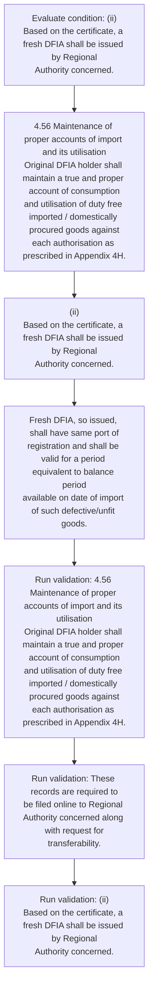
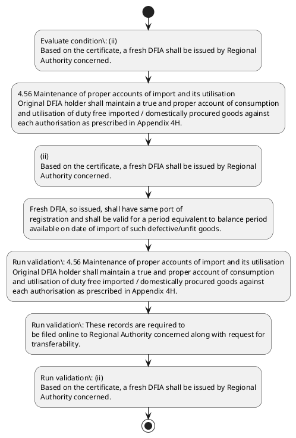

# Chapter 4 / Section 4.56: Maintenance of proper accounts of import and its utilisation

**Chapter Title:** Duty Exemption / Remission Schemes

**Pages:** 34, 35

**Purpose:** 4.56 Maintenance of proper accounts of import and its utilisation
Original DFIA holder shall maintain a true and proper account of consumption
and utilisation of duty free imported / domestically procured goods against
each authorisation as prescribed in Appendix 4H.

**Purpose Thanglish:** Indha Maintenance of proper accounts of import and its utilisation section-la, 4.56 Maintenance of proper accounts of import and its utilisation
Original DFIA holder kandippa maintain a true and proper account of consumption
and utilisation of duty free imported / domestically procured goods against
each authorisation as prescribed in Appendix 4H.

**Summary:** 4.56 Maintenance of proper accounts of import and its utilisation
Original DFIA holder shall maintain a true and proper account of consumption
and utilisation of duty free imported / domestically procured goods against
each authorisation as prescribed in Appendix 4H. These records are required to
be filed online to Regional Authority concerned along with request for
transferability. 109
109
amount and description of exported goods and the details of original
DFIA.

**Business Meaning:** Maintenance of proper accounts of import and its utilisation governs how DGFT business controls should be applied, validated, and enforced.

**Business Explanation:** Maintenance of proper accounts of import and its utilisation explains the operating rule set that DEKAI should enforce. Key control points include 4.56 Maintenance of proper accounts of import and its utilisation
Original DFIA holder shall maintain a true and proper account of consumption
and utilisation of duty free imported / domestically procured goods against
each authorisation as prescribed in Appendix 4H. The section also drives actions such as 4.56 Maintenance of proper accounts of import and its utilisation
Original DFIA holder shall maintain a true and proper account of consumption
and utilisation of duty free imported / domestically procured goods against
each authorisation as prescribed in Appendix 4H..

**Business Explanation Thanglish:** Indha Maintenance of proper accounts of import and its utilisation section-la, Maintenance of proper accounts of import and its utilisation explains the operating rule set that DEKAI should enforce. Key control points include 4.56 Maintenance of proper accounts of import and its utilisation
Original DFIA holder kandippa maintain a true and proper account of consumption
and utilisation of duty free imported / domestically procured goods against
each authorisation as prescribed in Appendix 4H. The section also drives actions such as 4.56 Maintenance of proper accounts of import and its utilisation
Original DFIA holder kandippa maintain a true and proper account of consumption
and utilisation of duty free imported / domestically procured goods against
each authorisation as prescribed in Appendix 4H..

## Business Logic
- 4.56 Maintenance of proper accounts of import and its utilisation
Original DFIA holder shall maintain a true and proper account of consumption
and utilisation of duty free imported / domestically procured goods against
each authorisation as prescribed in Appendix 4H.
- These records are required to
be filed online to Regional Authority concerned along with request for
transferability.
- (ii)
Based on the certificate, a fresh DFIA shall be issued by Regional
Authority concerned.
- Fresh DFIA, so issued, shall have same port of
registration and shall be valid for a period equivalent to balance period
available on date of import of such defective/unfit goods.

## Business Rules
- rule_id=CH4-SEC4_56-R001, rule_description=4.56 Maintenance of proper accounts of import and its utilisation
Original DFIA holder shall maintain a true and proper account of consumption
and utilisation of duty free imported / domestically procured goods against
each authorisation as prescribed in Appendix 4H., trigger=Maintenance of proper accounts of import and its utilisation, condition=(ii)
Based on the certificate, a fresh DFIA shall be issued by Regional
Authority concerned., validation=4.56 Maintenance of proper accounts of import and its utilisation
Original DFIA holder shall maintain a true and proper account of consumption
and utilisation of duty free imported / domestically procured goods against
each authorisation as prescribed in Appendix 4H., action=4.56 Maintenance of proper accounts of import and its utilisation
Original DFIA holder shall maintain a true and proper account of consumption
and utilisation of duty free imported / domestically procured goods against
each authorisation as prescribed in Appendix 4H., exception=No explicit exception found in uploaded documents., output=DEKAI should produce a compliance decision for 4.56 - Maintenance of proper accounts of import and its utilisation.
- rule_id=CH4-SEC4_56-R002, rule_description=These records are required to
be filed online to Regional Authority concerned along with request for
transferability., trigger=Maintenance of proper accounts of import and its utilisation, condition=(ii)
Based on the certificate, a fresh DFIA shall be issued by Regional
Authority concerned., validation=These records are required to
be filed online to Regional Authority concerned along with request for
transferability., action=(ii)
Based on the certificate, a fresh DFIA shall be issued by Regional
Authority concerned., exception=No explicit exception found in uploaded documents., output=DEKAI should produce a compliance decision for 4.56 - Maintenance of proper accounts of import and its utilisation.
- rule_id=CH4-SEC4_56-R003, rule_description=(ii)
Based on the certificate, a fresh DFIA shall be issued by Regional
Authority concerned., trigger=Maintenance of proper accounts of import and its utilisation, condition=(ii)
Based on the certificate, a fresh DFIA shall be issued by Regional
Authority concerned., validation=(ii)
Based on the certificate, a fresh DFIA shall be issued by Regional
Authority concerned., action=Fresh DFIA, so issued, shall have same port of
registration and shall be valid for a period equivalent to balance period
available on date of import of such defective/unfit goods., exception=No explicit exception found in uploaded documents., output=DEKAI should produce a compliance decision for 4.56 - Maintenance of proper accounts of import and its utilisation.
- rule_id=CH4-SEC4_56-R004, rule_description=Fresh DFIA, so issued, shall have same port of
registration and shall be valid for a period equivalent to balance period
available on date of import of such defective/unfit goods., trigger=Maintenance of proper accounts of import and its utilisation, condition=(ii)
Based on the certificate, a fresh DFIA shall be issued by Regional
Authority concerned., validation=Fresh DFIA, so issued, shall have same port of
registration and shall be valid for a period equivalent to balance period
available on date of import of such defective/unfit goods., action=Fresh DFIA, so issued, shall have same port of
registration and shall be valid for a period equivalent to balance period
available on date of import of such defective/unfit goods., exception=No explicit exception found in uploaded documents., output=DEKAI should produce a compliance decision for 4.56 - Maintenance of proper accounts of import and its utilisation.

## Conditions
- (ii)
Based on the certificate, a fresh DFIA shall be issued by Regional
Authority concerned.

## Condition Logic
- id=4.4.56.1, if=(ii)
Based on the certificate, a fresh DFIA shall be issued by Regional
Authority concerned., then=4.56 Maintenance of proper accounts of import and its utilisation
Original DFIA holder shall maintain a true and proper account of consumption
and utilisation of duty free imported / domestically procured goods against
each authorisation as prescribed in Appendix 4H., source=(ii)
Based on the certificate, a fresh DFIA shall be issued by Regional
Authority concerned.

## Validations
- 4.56 Maintenance of proper accounts of import and its utilisation
Original DFIA holder shall maintain a true and proper account of consumption
and utilisation of duty free imported / domestically procured goods against
each authorisation as prescribed in Appendix 4H.
- These records are required to
be filed online to Regional Authority concerned along with request for
transferability.
- (ii)
Based on the certificate, a fresh DFIA shall be issued by Regional
Authority concerned.
- Fresh DFIA, so issued, shall have same port of
registration and shall be valid for a period equivalent to balance period
available on date of import of such defective/unfit goods.

## Exceptions
- None identified

## Dependencies
- None identified

## Authorities
- Regional Authority

## Required Documents
- (ii)
Based on the certificate, a fresh DFIA shall be issued by Regional
Authority concerned.

## Timelines
- Fresh DFIA, so issued, shall have same port of
registration and shall be valid for a period equivalent to balance period
available on date of import of such defective/unfit goods.

## Actions
- 4.56 Maintenance of proper accounts of import and its utilisation
Original DFIA holder shall maintain a true and proper account of consumption
and utilisation of duty free imported / domestically procured goods against
each authorisation as prescribed in Appendix 4H.
- (ii)
Based on the certificate, a fresh DFIA shall be issued by Regional
Authority concerned.
- Fresh DFIA, so issued, shall have same port of
registration and shall be valid for a period equivalent to balance period
available on date of import of such defective/unfit goods.

## Workflow
- Evaluate condition: (ii)
Based on the certificate, a fresh DFIA shall be issued by Regional
Authority concerned.
- 4.56 Maintenance of proper accounts of import and its utilisation
Original DFIA holder shall maintain a true and proper account of consumption
and utilisation of duty free imported / domestically procured goods against
each authorisation as prescribed in Appendix 4H.
- (ii)
Based on the certificate, a fresh DFIA shall be issued by Regional
Authority concerned.
- Fresh DFIA, so issued, shall have same port of
registration and shall be valid for a period equivalent to balance period
available on date of import of such defective/unfit goods.
- Run validation: 4.56 Maintenance of proper accounts of import and its utilisation
Original DFIA holder shall maintain a true and proper account of consumption
and utilisation of duty free imported / domestically procured goods against
each authorisation as prescribed in Appendix 4H.
- Run validation: These records are required to
be filed online to Regional Authority concerned along with request for
transferability.
- Run validation: (ii)
Based on the certificate, a fresh DFIA shall be issued by Regional
Authority concerned.

## Workflow ASCII
```text
Maintenance of proper accounts of import and its utilisation
Evaluate condition: (ii)
Based on the certificate, a fresh DFIA shall be issued by Regional
Authority concerned.
   |
   v
4.56 Maintenance of proper accounts of import and its utilisation
Original DFIA holder shall maintain a true and proper account of consumption
and utilisation of duty free imported / domestically procured goods against
each authorisation as prescribed in Appendix 4H.
   |
   v
(ii)
Based on the certificate, a fresh DFIA shall be issued by Regional
Authority concerned.
   |
   v
Fresh DFIA, so issued, shall have same port of
registration and shall be valid for a period equivalent to balance period
available on date of import of such defective/unfit goods.
   |
   v
Run validation: 4.56 Maintenance of proper accounts of import and its utilisation
Original DFIA holder shall maintain a true and proper account of consumption
and utilisation of duty free imported / domestically procured goods against
each authorisation as prescribed in Appendix 4H.
   |
   v
Run validation: These records are required to
be filed online to Regional Authority concerned along with request for
transferability.
   |
   v
Run validation: (ii)
Based on the certificate, a fresh DFIA shall be issued by Regional
Authority concerned.
```

## Decision Tree
- IF (ii)
Based on the certificate, a fresh DFIA shall be issued by Regional
Authority concerned. THEN 4.56 Maintenance of proper accounts of import and its utilisation
Original DFIA holder shall maintain a true and proper account of consumption
and utilisation of duty free imported / domestically procured goods against
each authorisation as prescribed in Appendix 4H.

## Decision Tree ASCII
```text
Maintenance of proper accounts of import and its utilisation Decision
IF (ii)
Based on the certificate, a fresh DFIA shall be issued by Regional
Authority concerned. THEN 4.56 Maintenance of proper accounts of import and its utilisation
Original DFIA holder shall maintain a true and proper account of consumption
and utilisation of duty free imported / domestically procured goods against
each authorisation as prescribed in Appendix 4H.
```

## Examples
- User asks to process Maintenance of proper accounts of import and its utilisation; the platform checks conditions, validations, and documents before action.

**Real-world Example:** Example: an importer or exporter invokes Maintenance of proper accounts of import and its utilisation, submits (ii)
Based on the certificate, a fresh DFIA shall be issued by Regional
Authority concerned., and DEKAI uses the extracted rules to 4.56 maintenance of proper accounts of import and its utilisation
original dfia holder shall maintain a true and proper account of consumption
and utilisation of duty free imported / domestically procured goods against
each authorisation as prescribed in appendix 4h..

**Real-world Example Thanglish:** Indha Maintenance of proper accounts of import and its utilisation section-la, Example: an importer or exporter invokes Maintenance of proper accounts of import and its utilisation, submits (ii)
Based on the certificate, a fresh DFIA kandippa be issued by Regional
authority concerned., and DEKAI uses the extracted rules to 4.56 maintenance of proper accounts of import and its utilisation
original dfia holder kandippa maintain a true and proper account of consumption
and utilisation of duty free imported / domestically procured goods against
each authorisation as prescribed in appendix 4h..

## AI Rules
- IF detected context matches section rule THEN enforce: 4.56 Maintenance of proper accounts of import and its utilisation
Original DFIA holder shall maintain a true and proper account of consumption
and utilisation of duty free imported / domestically procured goods against
each authorisation as prescribed in Appendix 4H.
- IF detected context matches section rule THEN enforce: These records are required to
be filed online to Regional Authority concerned along with request for
transferability.
- IF detected context matches section rule THEN enforce: (ii)
Based on the certificate, a fresh DFIA shall be issued by Regional
Authority concerned.
- IF detected context matches section rule THEN enforce: Fresh DFIA, so issued, shall have same port of
registration and shall be valid for a period equivalent to balance period
available on date of import of such defective/unfit goods.
- IF validations pass THEN recommend action: 4.56 Maintenance of proper accounts of import and its utilisation
Original DFIA holder shall maintain a true and proper account of consumption
and utilisation of duty free imported / domestically procured goods against
each authorisation as prescribed in Appendix 4H.

## Database Fields
- name=section_code, type=string, required=True, source=parsed_section_heading
- name=section_title, type=string, required=True, source=parsed_section_heading
- name=and_flag, type=boolean, required=False, source=keyword:and
- name=its_flag, type=boolean, required=False, source=keyword:its
- name=are_flag, type=boolean, required=False, source=keyword:are
- name=for_flag, type=boolean, required=False, source=keyword:for
- name=the_flag, type=boolean, required=False, source=keyword:the
- name=dfia_flag, type=boolean, required=False, source=keyword:DFIA
- name=true_flag, type=boolean, required=False, source=keyword:true
- name=duty_flag, type=boolean, required=False, source=keyword:duty
- name=document_1_submitted, type=boolean, required=True, source=(ii)
Based on the certificate, a fresh DFIA shall be issued by Regional
Authority concerned.

## API Requirements
- method=GET, path=/api/dgft/sections/4.56, purpose=Retrieve knowledge payload for section 4.56, query_params=['include=workflow,decision_tree,validations'], response_fields=['section', 'title', 'summary', 'conditions', 'validations', 'exceptions', 'workflow', 'decision_tree']
- method=POST, path=/api/dgft/Maintenance-of-proper-accounts-of-import-and-its-utilisation/validate, purpose=Validate inputs and documents for Maintenance of proper accounts of import and its utilisation, request_fields=['section_code', 'section_title', 'document_1_submitted'], response_fields=['status', 'errors', 'warnings', 'next_actions']
- method=POST, path=/api/dgft/Maintenance-of-proper-accounts-of-import-and-its-utilisation/execute, purpose=Trigger business action for 4.56 Maintenance of proper accounts of import and its utilisation
Original DFIA holder shall maintain a true and proper account of consumption
and utilisation of duty free imported / domestically procured goods against
each authorisation as prescribed in Appendix 4H., request_fields=['section_code', 'section_title', 'document_1_submitted'], response_fields=['reference_id', 'status', 'authority', 'timeline']

## UI Screens
- screen_id=Maintenance_of_proper_accounts_of_import_and_its_utilisation_overview, name=Maintenance of proper accounts of import and its utilisation Overview, purpose=Show section summary, authority, timeline, and eligibility cues., widgets=['summary_card', 'conditions_table', 'authority_badges', 'timeline_panel']
- screen_id=Maintenance_of_proper_accounts_of_import_and_its_utilisation_submission, name=Maintenance of proper accounts of import and its utilisation Submission, purpose=Capture applicant data and supporting documents., widgets=['dynamic_form', 'document_uploader', 'validation_panel', 'next_action_footer'], fields=['section_code', 'section_title', 'and_flag', 'its_flag', 'are_flag', 'for_flag', 'the_flag', 'dfia_flag']

## Error Messages
- Validation failed because the section requirements were not fully met.

## FAQ
- question_en=What is the purpose of section 4.56?, answer_en=Maintenance of proper accounts of import and its utilisation explains the operating rule set that DEKAI should enforce. Key control points include 4.56 Maintenance of proper accounts of import and its utilisation
Original DFIA holder shall maintain a true and proper account of consumption
and utilisation of duty free imported / domestically procured goods against
each authorisation as prescribed in Appendix 4H. The section also drives actions such as 4.56 Maintenance of proper accounts of import and its utilisation
Original DFIA holder shall maintain a true and proper account of consumption
and utilisation of duty free imported / domestically procured goods against
each authorisation as prescribed in Appendix 4H.., question_thanglish=Indha Maintenance of proper accounts of import and its utilisation section-la, What is the purpose of section 4.56?, answer_thanglish=Indha Maintenance of proper accounts of import and its utilisation section-la, Maintenance of proper accounts of import and its utilisation explains the operating rule set that DEKAI should enforce. Key control points include 4.56 Maintenance of proper accounts of import and its utilisation
Original DFIA holder kandippa maintain a true and proper account of consumption
and utilisation of duty free imported / domestically procured goods against
each authorisation as prescribed in Appendix 4H. The section also drives actions such as 4.56 Maintenance of proper accounts of import and its utilisation
Original DFIA holder kandippa maintain a true and proper account of consumption
and utilisation of duty free imported / domestically procured goods against
each authorisation as prescribed in Appendix 4H..
- question_en=What documents are required under Maintenance of proper accounts of import and its utilisation?, answer_en=(ii)
Based on the certificate, a fresh DFIA shall be issued by Regional
Authority concerned., question_thanglish=Indha Maintenance of proper accounts of import and its utilisation section-la, What documents are required under Maintenance of proper accounts of import and its utilisation?, answer_thanglish=Indha Maintenance of proper accounts of import and its utilisation section-la, (ii)
Based on the certificate, a fresh DFIA kandippa be issued by Regional
authority concerned.
- question_en=Which authority handles Maintenance of proper accounts of import and its utilisation?, answer_en=Regional Authority, question_thanglish=Indha Maintenance of proper accounts of import and its utilisation section-la, Which authority handles Maintenance of proper accounts of import and its utilisation?, answer_thanglish=Indha Maintenance of proper accounts of import and its utilisation section-la, Regional authority

## Questions Users May Ask
- What does Maintenance of proper accounts of import and its utilisation require?
- Which documents are needed for Maintenance of proper accounts of import and its utilisation?
- How does DEKAI validate Maintenance of proper accounts of import and its utilisation requests?
- What action should be taken for Maintenance of proper accounts of import and its utilisation?

## Expected AI Answers
- Maintenance of proper accounts of import and its utilisation requires the platform to interpret the section text, apply the extracted business rules, and present the correct next action.
- Required documents are inferred from the section text: (ii)
Based on the certificate, a fresh DFIA shall be issued by Regional
Authority concerned.
- DEKAI validates Maintenance of proper accounts of import and its utilisation by checking conditions, required documents, authority references, and exception clauses before recommending an outcome.
- The primary extracted action is: 4.56 Maintenance of proper accounts of import and its utilisation
Original DFIA holder shall maintain a true and proper account of consumption
and utilisation of duty free imported / domestically procured goods against
each authorisation as prescribed in Appendix 4H.

## AI Q&A Examples
- question_en=User asks: How do I comply with Maintenance of proper accounts of import and its utilisation?, answer_en=AI answers: DEKAI should evaluate section 4.56, apply the extracted rules, and guide the user through Evaluate condition: (ii)
Based on the certificate, a fresh DFIA shall be issued by Regional
Authority concerned.., question_thanglish=Indha Maintenance of proper accounts of import and its utilisation section-la, User asks: How do I comply with Maintenance of proper accounts of import and its utilisation?, answer_thanglish=Indha Maintenance of proper accounts of import and its utilisation section-la, AI answers: DEKAI should evaluate section 4.56, apply the extracted rules, and guide the user through Evaluate condition: (ii)
Based on the certificate, a fresh DFIA kandippa be issued by Regional
authority concerned..
- question_en=User asks: Which validations apply to Maintenance of proper accounts of import and its utilisation?, answer_en=AI answers: Applicable validations are 4.56 Maintenance of proper accounts of import and its utilisation
Original DFIA holder shall maintain a true and proper account of consumption
and utilisation of duty free imported / domestically procured goods against
each authorisation as prescribed in Appendix 4H., These records are required to
be filed online to Regional Authority concerned along with request for
transferability., (ii)
Based on the certificate, a fresh DFIA shall be issued by Regional
Authority concerned., question_thanglish=Indha Maintenance of proper accounts of import and its utilisation section-la, User asks: Which validations apply to Maintenance of proper accounts of import and its utilisation?, answer_thanglish=Indha Maintenance of proper accounts of import and its utilisation section-la, AI answers: Applicable validations are 4.56 Maintenance of proper accounts of import and its utilisation
Original DFIA holder kandippa maintain a true and proper account of consumption
and utilisation of duty free imported / domestically procured goods against
each authorisation as prescribed in Appendix 4H., These records are required to
be filed online to Regional authority concerned along with request for
transferability., (ii)
Based on the certificate, a fresh DFIA kandippa be issued by Regional
authority concerned.

## DEKAI AI Implementation Notes
- Capture chapter 4, section 4.56, title, and page references as immutable knowledge metadata.
- Bind validations for Maintenance of proper accounts of import and its utilisation into a rule engine keyed by the rule IDs extracted for this section.
- Expose document upload controls for: (ii)
Based on the certificate, a fresh DFIA shall be issued by Regional
Authority concerned..
- Route escalations or approvals to: Regional Authority.

## DEKAI AI Implementation Notes Thanglish
- Indha Maintenance of proper accounts of import and its utilisation section-la, Capture chapter 4, section 4.56, title, and page references as immutable knowledge metadata.
- Indha Maintenance of proper accounts of import and its utilisation section-la, Bind validations for Maintenance of proper accounts of import and its utilisation into a rule engine keyed by the rule IDs extracted for this section.
- Indha Maintenance of proper accounts of import and its utilisation section-la, Expose document upload controls for: (ii)
Based on the certificate, a fresh DFIA kandippa be issued by Regional
authority concerned..
- Indha Maintenance of proper accounts of import and its utilisation section-la, Route escalations or approvals to: Regional authority.

## AI Metadata
- Keywords: and, its, are, for, the, DFIA, true, duty, free, each, with, have, same, port, date, such, GEMS, shall, goods, These
- Search Keywords: and, its, are, for, the, DFIA, true, duty, free, each, with, have, same, port, date, such, GEMS, shall, goods, These
- Intent: Support Maintenance of proper accounts of import and its utilisation processing and compliance validation.
- Tags: 4.56, Maintenance of proper accounts of import and its utilisation, business-rule, document-driven, dgft
- Related Sections: 
- Related Chapters: 
- Related Rules: 4.56 Maintenance of proper accounts of import and its utilisation
Original DFIA holder shall maintain a true and proper account of consumption
and utilisation of duty free imported / domestically procured goods against
each authorisation as prescribed in Appendix 4H., These records are required to
be filed online to Regional Authority concerned along with request for
transferability., (ii)
Based on the certificate, a fresh DFIA shall be issued by Regional
Authority concerned., Fresh DFIA, so issued, shall have same port of
registration and shall be valid for a period equivalent to balance period
available on date of import of such defective/unfit goods.

## Mermaid


## PlantUML

