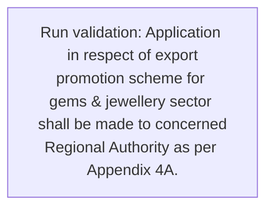
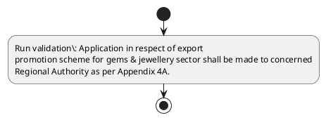

# Chapter 4 / Section 4.57: General Provision

**Chapter Title:** Duty Exemption / Remission Schemes

**Pages:** 35

**Purpose:** 4.57 General Provision
Policy relating to Gem Replenishment Authorisation and scheme for gold/
silver/platinum jewellery is given in FTP.

**Purpose Thanglish:** Indha General Provision section-la, 4.57 General Provision
Policy relating to Gem Replenishment Authorisation and scheme for gold/
silver/platinum jewellery is given in FTP.

**Summary:** 4.57 General Provision
Policy relating to Gem Replenishment Authorisation and scheme for gold/
silver/platinum jewellery is given in FTP. Application in respect of export
promotion scheme for gems & jewellery sector shall be made to concerned
Regional Authority as per Appendix 4A.

**Business Meaning:** General Provision governs how DGFT business controls should be applied, validated, and enforced.

**Business Explanation:** General Provision explains the operating rule set that DEKAI should enforce. Key control points include Application in respect of export
promotion scheme for gems & jewellery sector shall be made to concerned
Regional Authority as per Appendix 4A.

**Business Explanation Thanglish:** Indha General Provision section-la, General Provision explains the operating rule set that DEKAI should enforce. Key control points include application in respect of export
promotion scheme for gems & jewellery sector kandippa be made to concerned
Regional authority as per Appendix 4A.

## Business Logic
- Application in respect of export
promotion scheme for gems & jewellery sector shall be made to concerned
Regional Authority as per Appendix 4A.

## Business Rules
- rule_id=CH4-SEC4_57-R001, rule_description=Application in respect of export
promotion scheme for gems & jewellery sector shall be made to concerned
Regional Authority as per Appendix 4A., trigger=General Provision, condition=Not explicitly covered in uploaded documents., validation=Application in respect of export
promotion scheme for gems & jewellery sector shall be made to concerned
Regional Authority as per Appendix 4A., action=Manual review required., exception=No explicit exception found in uploaded documents., output=DEKAI should produce a compliance decision for 4.57 - General Provision.

## Conditions
- None identified

## Condition Logic
- None identified

## Validations
- Application in respect of export
promotion scheme for gems & jewellery sector shall be made to concerned
Regional Authority as per Appendix 4A.

## Exceptions
- None identified

## Dependencies
- None identified

## Authorities
- Regional Authority

## Required Documents
- Application in respect of export
promotion scheme for gems & jewellery sector shall be made to concerned
Regional Authority as per Appendix 4A.

## Timelines
- None identified

## Actions
- None identified

## Workflow
- Run validation: Application in respect of export
promotion scheme for gems & jewellery sector shall be made to concerned
Regional Authority as per Appendix 4A.

## Workflow ASCII
```text
General Provision
Run validation: Application in respect of export
promotion scheme for gems & jewellery sector shall be made to concerned
Regional Authority as per Appendix 4A.
```

## Decision Tree
- IF section 4.57 applies THEN proceed with standard DGFT workflow

## Decision Tree ASCII
```text
General Provision Decision
IF section 4.57 applies THEN proceed with standard DGFT workflow
```

## Examples
- User asks to process General Provision; the platform checks conditions, validations, and documents before action.

**Real-world Example:** Example: an importer or exporter invokes General Provision, submits Application in respect of export
promotion scheme for gems & jewellery sector shall be made to concerned
Regional Authority as per Appendix 4A., and DEKAI uses the extracted rules to follow the general provision process.

**Real-world Example Thanglish:** Indha General Provision section-la, Example: an importer or exporter invokes General Provision, submits application in respect of export
promotion scheme for gems & jewellery sector kandippa be made to concerned
Regional authority as per Appendix 4A., and DEKAI uses the extracted rules to follow the general provision process.

## AI Rules
- IF detected context matches section rule THEN enforce: Application in respect of export
promotion scheme for gems & jewellery sector shall be made to concerned
Regional Authority as per Appendix 4A.

## Database Fields
- name=section_code, type=string, required=True, source=parsed_section_heading
- name=section_title, type=string, required=True, source=parsed_section_heading
- name=gem_flag, type=boolean, required=False, source=keyword:Gem
- name=and_flag, type=boolean, required=False, source=keyword:and
- name=for_flag, type=boolean, required=False, source=keyword:for
- name=ftp_flag, type=boolean, required=False, source=keyword:FTP
- name=per_flag, type=boolean, required=False, source=keyword:per
- name=gold_flag, type=boolean, required=False, source=keyword:gold
- name=gems_flag, type=boolean, required=False, source=keyword:gems
- name=made_flag, type=boolean, required=False, source=keyword:made
- name=document_1_submitted, type=boolean, required=True, source=Application in respect of export
promotion scheme for gems & jewellery sector shall be made to concerned
Regional Authority as per Appendix 4A.

## API Requirements
- method=GET, path=/api/dgft/sections/4.57, purpose=Retrieve knowledge payload for section 4.57, query_params=['include=workflow,decision_tree,validations'], response_fields=['section', 'title', 'summary', 'conditions', 'validations', 'exceptions', 'workflow', 'decision_tree']
- method=POST, path=/api/dgft/General-Provision/validate, purpose=Validate inputs and documents for General Provision, request_fields=['section_code', 'section_title', 'document_1_submitted'], response_fields=['status', 'errors', 'warnings', 'next_actions']

## UI Screens
- screen_id=General_Provision_overview, name=General Provision Overview, purpose=Show section summary, authority, timeline, and eligibility cues., widgets=['summary_card', 'conditions_table', 'authority_badges', 'timeline_panel']
- screen_id=General_Provision_submission, name=General Provision Submission, purpose=Capture applicant data and supporting documents., widgets=['dynamic_form', 'document_uploader', 'validation_panel', 'next_action_footer'], fields=['section_code', 'section_title', 'gem_flag', 'and_flag', 'for_flag', 'ftp_flag', 'per_flag', 'gold_flag']

## Error Messages
- Validation failed because the section requirements were not fully met.

## FAQ
- question_en=What is the purpose of section 4.57?, answer_en=General Provision explains the operating rule set that DEKAI should enforce. Key control points include Application in respect of export
promotion scheme for gems & jewellery sector shall be made to concerned
Regional Authority as per Appendix 4A., question_thanglish=Indha General Provision section-la, What is the purpose of section 4.57?, answer_thanglish=Indha General Provision section-la, General Provision explains the operating rule set that DEKAI should enforce. Key control points include application in respect of export
promotion scheme for gems & jewellery sector kandippa be made to concerned
Regional authority as per Appendix 4A.
- question_en=What documents are required under General Provision?, answer_en=Application in respect of export
promotion scheme for gems & jewellery sector shall be made to concerned
Regional Authority as per Appendix 4A., question_thanglish=Indha General Provision section-la, What documents are required under General Provision?, answer_thanglish=Indha General Provision section-la, application in respect of export
promotion scheme for gems & jewellery sector kandippa be made to concerned
Regional authority as per Appendix 4A.
- question_en=Which authority handles General Provision?, answer_en=Regional Authority, question_thanglish=Indha General Provision section-la, Which authority handles General Provision?, answer_thanglish=Indha General Provision section-la, Regional authority

## Questions Users May Ask
- What does General Provision require?
- Which documents are needed for General Provision?
- How does DEKAI validate General Provision requests?

## Expected AI Answers
- General Provision requires the platform to interpret the section text, apply the extracted business rules, and present the correct next action.
- Required documents are inferred from the section text: Application in respect of export
promotion scheme for gems & jewellery sector shall be made to concerned
Regional Authority as per Appendix 4A.
- DEKAI validates General Provision by checking conditions, required documents, authority references, and exception clauses before recommending an outcome.

## AI Q&A Examples
- question_en=User asks: How do I comply with General Provision?, answer_en=AI answers: DEKAI should evaluate section 4.57, apply the extracted rules, and guide the user through Run validation: Application in respect of export
promotion scheme for gems & jewellery sector shall be made to concerned
Regional Authority as per Appendix 4A.., question_thanglish=Indha General Provision section-la, User asks: How do I comply with General Provision?, answer_thanglish=Indha General Provision section-la, AI answers: DEKAI should evaluate section 4.57, apply the extracted rules, and guide the user through Run validation: application in respect of export
promotion scheme for gems & jewellery sector kandippa be made to concerned
Regional authority as per Appendix 4A..
- question_en=User asks: Which validations apply to General Provision?, answer_en=AI answers: Applicable validations are Application in respect of export
promotion scheme for gems & jewellery sector shall be made to concerned
Regional Authority as per Appendix 4A., question_thanglish=Indha General Provision section-la, User asks: Which validations apply to General Provision?, answer_thanglish=Indha General Provision section-la, AI answers: Applicable validations are application in respect of export
promotion scheme for gems & jewellery sector kandippa be made to concerned
Regional authority as per Appendix 4A.

## DEKAI AI Implementation Notes
- Capture chapter 4, section 4.57, title, and page references as immutable knowledge metadata.
- Bind validations for General Provision into a rule engine keyed by the rule IDs extracted for this section.
- Expose document upload controls for: Application in respect of export
promotion scheme for gems & jewellery sector shall be made to concerned
Regional Authority as per Appendix 4A..
- Route escalations or approvals to: Regional Authority.

## DEKAI AI Implementation Notes Thanglish
- Indha General Provision section-la, Capture chapter 4, section 4.57, title, and page references as immutable knowledge metadata.
- Indha General Provision section-la, Bind validations for General Provision into a rule engine keyed by the rule IDs extracted for this section.
- Indha General Provision section-la, Expose document upload controls for: application in respect of export
promotion scheme for gems & jewellery sector kandippa be made to concerned
Regional authority as per Appendix 4A..
- Indha General Provision section-la, Route escalations or approvals to: Regional authority.

## AI Metadata
- Keywords: Gem, and, for, FTP, per, gold, gems, made, given, shall, Policy, scheme, export, sector, General, respect, relating, Regional, Appendix, Provision
- Search Keywords: Gem, and, for, FTP, per, gold, gems, made, given, shall, Policy, scheme, export, sector, General, respect, relating, Regional, Appendix, Provision
- Intent: Provide knowledge guidance for General Provision.
- Tags: 4.57, General Provision, business-rule, document-driven, dgft
- Related Sections: 
- Related Chapters: 
- Related Rules: Application in respect of export
promotion scheme for gems & jewellery sector shall be made to concerned
Regional Authority as per Appendix 4A.

## Mermaid


## PlantUML

