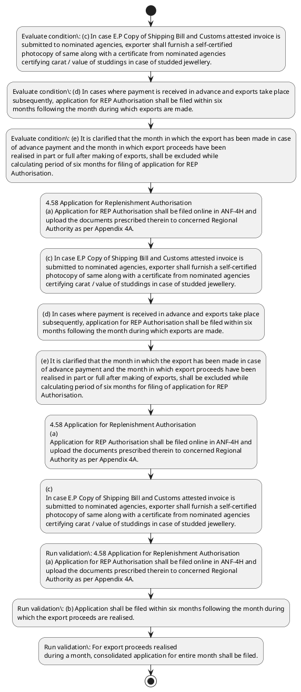

# Chapter 4 / Section 4.58: Application for Replenishment Authorisation

**Chapter Title:** Duty Exemption / Remission Schemes

**Pages:** 35

**Purpose:** 4.58 Application for Replenishment Authorisation
(a) Application for REP Authorisation shall be filed online in ANF-4H and
upload the documents prescribed therein to concerned Regional
Authority as per Appendix 4A.

**Purpose Thanglish:** Indha Application for Replenishment Authorisation section-la, 4.58 application for Replenishment Authorisation
(a) application for REP Authorisation kandippa be filed online in ANF-4H and
upload the documents prescribed therein to concerned Regional
authority as per Appendix 4A.

**Summary:** 4.58 Application for Replenishment Authorisation
(a) Application for REP Authorisation shall be filed online in ANF-4H and
upload the documents prescribed therein to concerned Regional
Authority as per Appendix 4A. (b) Application shall be filed within six months following the month during
which the export proceeds are realised. For export proceeds realised
during a month, consolidated application for entire month shall be filed.

**Business Meaning:** Application for Replenishment Authorisation governs how DGFT business controls should be applied, validated, and enforced.

**Business Explanation:** Application for Replenishment Authorisation explains the operating rule set that DEKAI should enforce. Key control points include 4.58 Application for Replenishment Authorisation
(a) Application for REP Authorisation shall be filed online in ANF-4H and
upload the documents prescribed therein to concerned Regional
Authority as per Appendix 4A. The section also drives actions such as 4.58 Application for Replenishment Authorisation
(a) Application for REP Authorisation shall be filed online in ANF-4H and
upload the documents prescribed therein to concerned Regional
Authority as per Appendix 4A..

**Business Explanation Thanglish:** Indha Application for Replenishment Authorisation section-la, application for Replenishment Authorisation explains the operating rule set that DEKAI should enforce. Key control points include 4.58 application for Replenishment Authorisation
(a) application for REP Authorisation kandippa be filed online in ANF-4H and
upload the documents prescribed therein to concerned Regional
authority as per Appendix 4A. The section also drives actions such as 4.58 application for Replenishment Authorisation
(a) application for REP Authorisation kandippa be filed online in ANF-4H and
upload the documents prescribed therein to concerned Regional
authority as per Appendix 4A..

## Business Logic
- 4.58 Application for Replenishment Authorisation
(a) Application for REP Authorisation shall be filed online in ANF-4H and
upload the documents prescribed therein to concerned Regional
Authority as per Appendix 4A.
- (b) Application shall be filed within six months following the month during
which the export proceeds are realised.
- For export proceeds realised
during a month, consolidated application for entire month shall be filed.
- (c) In case E.P Copy of Shipping Bill and Customs attested invoice is
submitted to nominated agencies, exporter shall furnish a self-certified
photocopy of same along with a certificate from nominated agencies
certifying carat / value of studdings in case of studded jewellery.
- (d) In cases where payment is received in advance and exports take place
subsequently, application for REP Authorisation shall be filed within six
months following the month during which exports are made.
- (e) It is clarified that the month in which the export has been made in case
of advance payment and the month in which export proceeds have been
realised in part or full after making of exports, shall be excluded while
calculating period of six months for filing of application for REP
Authorisation.
- 4.58 Application for Replenishment Authorisation
(a)
Application for REP Authorisation shall be filed online in ANF-4H and
upload the documents prescribed therein to concerned Regional
Authority as per Appendix 4A.
- (b)
Application shall be filed within six months following the month during
which the export proceeds are realised.
- (c)
In case E.P Copy of Shipping Bill and Customs attested invoice is
submitted to nominated agencies, exporter shall furnish a self-certified
photocopy of same along with a certificate from nominated agencies
certifying carat / value of studdings in case of studded jewellery.
- (d)
In cases where payment is received in advance and exports take place
subsequently, application for REP Authorisation shall be filed within six
months following the month during which exports are made.
- (e)
It is clarified that the month in which the export has been made in case
of advance payment and the month in which export proceeds have been
realised in part or full after making of exports, shall be excluded while
calculating period of six months for filing of application for REP
Authorisation.

## Business Rules
- rule_id=CH4-SEC4_58-R001, rule_description=4.58 Application for Replenishment Authorisation
(a) Application for REP Authorisation shall be filed online in ANF-4H and
upload the documents prescribed therein to concerned Regional
Authority as per Appendix 4A., trigger=Application for Replenishment Authorisation, condition=(c) In case E.P Copy of Shipping Bill and Customs attested invoice is
submitted to nominated agencies, exporter shall furnish a self-certified
photocopy of same along with a certificate from nominated agencies
certifying carat / value of studdings in case of studded jewellery., validation=4.58 Application for Replenishment Authorisation
(a) Application for REP Authorisation shall be filed online in ANF-4H and
upload the documents prescribed therein to concerned Regional
Authority as per Appendix 4A., action=4.58 Application for Replenishment Authorisation
(a) Application for REP Authorisation shall be filed online in ANF-4H and
upload the documents prescribed therein to concerned Regional
Authority as per Appendix 4A., exception=No explicit exception found in uploaded documents., output=DEKAI should produce a compliance decision for 4.58 - Application for Replenishment Authorisation.
- rule_id=CH4-SEC4_58-R002, rule_description=(b) Application shall be filed within six months following the month during
which the export proceeds are realised., trigger=Application for Replenishment Authorisation, condition=(d) In cases where payment is received in advance and exports take place
subsequently, application for REP Authorisation shall be filed within six
months following the month during which exports are made., validation=(b) Application shall be filed within six months following the month during
which the export proceeds are realised., action=(c) In case E.P Copy of Shipping Bill and Customs attested invoice is
submitted to nominated agencies, exporter shall furnish a self-certified
photocopy of same along with a certificate from nominated agencies
certifying carat / value of studdings in case of studded jewellery., exception=No explicit exception found in uploaded documents., output=DEKAI should produce a compliance decision for 4.58 - Application for Replenishment Authorisation.
- rule_id=CH4-SEC4_58-R003, rule_description=For export proceeds realised
during a month, consolidated application for entire month shall be filed., trigger=Application for Replenishment Authorisation, condition=(e) It is clarified that the month in which the export has been made in case
of advance payment and the month in which export proceeds have been
realised in part or full after making of exports, shall be excluded while
calculating period of six months for filing of application for REP
Authorisation., validation=For export proceeds realised
during a month, consolidated application for entire month shall be filed., action=(d) In cases where payment is received in advance and exports take place
subsequently, application for REP Authorisation shall be filed within six
months following the month during which exports are made., exception=No explicit exception found in uploaded documents., output=DEKAI should produce a compliance decision for 4.58 - Application for Replenishment Authorisation.
- rule_id=CH4-SEC4_58-R004, rule_description=(c) In case E.P Copy of Shipping Bill and Customs attested invoice is
submitted to nominated agencies, exporter shall furnish a self-certified
photocopy of same along with a certificate from nominated agencies
certifying carat / value of studdings in case of studded jewellery., trigger=Application for Replenishment Authorisation, condition=(c)
In case E.P Copy of Shipping Bill and Customs attested invoice is
submitted to nominated agencies, exporter shall furnish a self-certified
photocopy of same along with a certificate from nominated agencies
certifying carat / value of studdings in case of studded jewellery., validation=(c) In case E.P Copy of Shipping Bill and Customs attested invoice is
submitted to nominated agencies, exporter shall furnish a self-certified
photocopy of same along with a certificate from nominated agencies
certifying carat / value of studdings in case of studded jewellery., action=(e) It is clarified that the month in which the export has been made in case
of advance payment and the month in which export proceeds have been
realised in part or full after making of exports, shall be excluded while
calculating period of six months for filing of application for REP
Authorisation., exception=No explicit exception found in uploaded documents., output=DEKAI should produce a compliance decision for 4.58 - Application for Replenishment Authorisation.
- rule_id=CH4-SEC4_58-R005, rule_description=(d) In cases where payment is received in advance and exports take place
subsequently, application for REP Authorisation shall be filed within six
months following the month during which exports are made., trigger=Application for Replenishment Authorisation, condition=(d)
In cases where payment is received in advance and exports take place
subsequently, application for REP Authorisation shall be filed within six
months following the month during which exports are made., validation=(d) In cases where payment is received in advance and exports take place
subsequently, application for REP Authorisation shall be filed within six
months following the month during which exports are made., action=4.58 Application for Replenishment Authorisation
(a)
Application for REP Authorisation shall be filed online in ANF-4H and
upload the documents prescribed therein to concerned Regional
Authority as per Appendix 4A., exception=No explicit exception found in uploaded documents., output=DEKAI should produce a compliance decision for 4.58 - Application for Replenishment Authorisation.
- rule_id=CH4-SEC4_58-R006, rule_description=(e) It is clarified that the month in which the export has been made in case
of advance payment and the month in which export proceeds have been
realised in part or full after making of exports, shall be excluded while
calculating period of six months for filing of application for REP
Authorisation., trigger=Application for Replenishment Authorisation, condition=(e)
It is clarified that the month in which the export has been made in case
of advance payment and the month in which export proceeds have been
realised in part or full after making of exports, shall be excluded while
calculating period of six months for filing of application for REP
Authorisation., validation=(e) It is clarified that the month in which the export has been made in case
of advance payment and the month in which export proceeds have been
realised in part or full after making of exports, shall be excluded while
calculating period of six months for filing of application for REP
Authorisation., action=(c)
In case E.P Copy of Shipping Bill and Customs attested invoice is
submitted to nominated agencies, exporter shall furnish a self-certified
photocopy of same along with a certificate from nominated agencies
certifying carat / value of studdings in case of studded jewellery., exception=No explicit exception found in uploaded documents., output=DEKAI should produce a compliance decision for 4.58 - Application for Replenishment Authorisation.
- rule_id=CH4-SEC4_58-R007, rule_description=4.58 Application for Replenishment Authorisation
(a)
Application for REP Authorisation shall be filed online in ANF-4H and
upload the documents prescribed therein to concerned Regional
Authority as per Appendix 4A., trigger=Application for Replenishment Authorisation, condition=(e)
It is clarified that the month in which the export has been made in case
of advance payment and the month in which export proceeds have been
realised in part or full after making of exports, shall be excluded while
calculating period of six months for filing of application for REP
Authorisation., validation=4.58 Application for Replenishment Authorisation
(a)
Application for REP Authorisation shall be filed online in ANF-4H and
upload the documents prescribed therein to concerned Regional
Authority as per Appendix 4A., action=(d)
In cases where payment is received in advance and exports take place
subsequently, application for REP Authorisation shall be filed within six
months following the month during which exports are made., exception=No explicit exception found in uploaded documents., output=DEKAI should produce a compliance decision for 4.58 - Application for Replenishment Authorisation.
- rule_id=CH4-SEC4_58-R008, rule_description=(b)
Application shall be filed within six months following the month during
which the export proceeds are realised., trigger=Application for Replenishment Authorisation, condition=(e)
It is clarified that the month in which the export has been made in case
of advance payment and the month in which export proceeds have been
realised in part or full after making of exports, shall be excluded while
calculating period of six months for filing of application for REP
Authorisation., validation=(b)
Application shall be filed within six months following the month during
which the export proceeds are realised., action=(e)
It is clarified that the month in which the export has been made in case
of advance payment and the month in which export proceeds have been
realised in part or full after making of exports, shall be excluded while
calculating period of six months for filing of application for REP
Authorisation., exception=No explicit exception found in uploaded documents., output=DEKAI should produce a compliance decision for 4.58 - Application for Replenishment Authorisation.
- rule_id=CH4-SEC4_58-R009, rule_description=(c)
In case E.P Copy of Shipping Bill and Customs attested invoice is
submitted to nominated agencies, exporter shall furnish a self-certified
photocopy of same along with a certificate from nominated agencies
certifying carat / value of studdings in case of studded jewellery., trigger=Application for Replenishment Authorisation, condition=(e)
It is clarified that the month in which the export has been made in case
of advance payment and the month in which export proceeds have been
realised in part or full after making of exports, shall be excluded while
calculating period of six months for filing of application for REP
Authorisation., validation=(c)
In case E.P Copy of Shipping Bill and Customs attested invoice is
submitted to nominated agencies, exporter shall furnish a self-certified
photocopy of same along with a certificate from nominated agencies
certifying carat / value of studdings in case of studded jewellery., action=(e)
It is clarified that the month in which the export has been made in case
of advance payment and the month in which export proceeds have been
realised in part or full after making of exports, shall be excluded while
calculating period of six months for filing of application for REP
Authorisation., exception=No explicit exception found in uploaded documents., output=DEKAI should produce a compliance decision for 4.58 - Application for Replenishment Authorisation.
- rule_id=CH4-SEC4_58-R010, rule_description=(d)
In cases where payment is received in advance and exports take place
subsequently, application for REP Authorisation shall be filed within six
months following the month during which exports are made., trigger=Application for Replenishment Authorisation, condition=(e)
It is clarified that the month in which the export has been made in case
of advance payment and the month in which export proceeds have been
realised in part or full after making of exports, shall be excluded while
calculating period of six months for filing of application for REP
Authorisation., validation=(d)
In cases where payment is received in advance and exports take place
subsequently, application for REP Authorisation shall be filed within six
months following the month during which exports are made., action=(e)
It is clarified that the month in which the export has been made in case
of advance payment and the month in which export proceeds have been
realised in part or full after making of exports, shall be excluded while
calculating period of six months for filing of application for REP
Authorisation., exception=No explicit exception found in uploaded documents., output=DEKAI should produce a compliance decision for 4.58 - Application for Replenishment Authorisation.
- rule_id=CH4-SEC4_58-R011, rule_description=(e)
It is clarified that the month in which the export has been made in case
of advance payment and the month in which export proceeds have been
realised in part or full after making of exports, shall be excluded while
calculating period of six months for filing of application for REP
Authorisation., trigger=Application for Replenishment Authorisation, condition=(e)
It is clarified that the month in which the export has been made in case
of advance payment and the month in which export proceeds have been
realised in part or full after making of exports, shall be excluded while
calculating period of six months for filing of application for REP
Authorisation., validation=(e)
It is clarified that the month in which the export has been made in case
of advance payment and the month in which export proceeds have been
realised in part or full after making of exports, shall be excluded while
calculating period of six months for filing of application for REP
Authorisation., action=(e)
It is clarified that the month in which the export has been made in case
of advance payment and the month in which export proceeds have been
realised in part or full after making of exports, shall be excluded while
calculating period of six months for filing of application for REP
Authorisation., exception=No explicit exception found in uploaded documents., output=DEKAI should produce a compliance decision for 4.58 - Application for Replenishment Authorisation.

## Conditions
- (c) In case E.P Copy of Shipping Bill and Customs attested invoice is
submitted to nominated agencies, exporter shall furnish a self-certified
photocopy of same along with a certificate from nominated agencies
certifying carat / value of studdings in case of studded jewellery.
- (d) In cases where payment is received in advance and exports take place
subsequently, application for REP Authorisation shall be filed within six
months following the month during which exports are made.
- (e) It is clarified that the month in which the export has been made in case
of advance payment and the month in which export proceeds have been
realised in part or full after making of exports, shall be excluded while
calculating period of six months for filing of application for REP
Authorisation.
- (c)
In case E.P Copy of Shipping Bill and Customs attested invoice is
submitted to nominated agencies, exporter shall furnish a self-certified
photocopy of same along with a certificate from nominated agencies
certifying carat / value of studdings in case of studded jewellery.
- (d)
In cases where payment is received in advance and exports take place
subsequently, application for REP Authorisation shall be filed within six
months following the month during which exports are made.
- (e)
It is clarified that the month in which the export has been made in case
of advance payment and the month in which export proceeds have been
realised in part or full after making of exports, shall be excluded while
calculating period of six months for filing of application for REP
Authorisation.

## Condition Logic
- id=4.4.58.1, if=(c) In case E.P Copy of Shipping Bill and Customs attested invoice is
submitted to nominated agencies, exporter shall furnish a self-certified
photocopy of same along with a certificate from nominated agencies
certifying carat / value of studdings in case of studded jewellery., then=4.58 Application for Replenishment Authorisation
(a) Application for REP Authorisation shall be filed online in ANF-4H and
upload the documents prescribed therein to concerned Regional
Authority as per Appendix 4A., source=(c) In case E.P Copy of Shipping Bill and Customs attested invoice is
submitted to nominated agencies, exporter shall furnish a self-certified
photocopy of same along with a certificate from nominated agencies
certifying carat / value of studdings in case of studded jewellery.
- id=4.4.58.2, if=(d) In cases where payment is received in advance and exports take place
subsequently, application for REP Authorisation shall be filed within six
months following the month during which exports are made., then=4.58 Application for Replenishment Authorisation
(a) Application for REP Authorisation shall be filed online in ANF-4H and
upload the documents prescribed therein to concerned Regional
Authority as per Appendix 4A., source=(d) In cases where payment is received in advance and exports take place
subsequently, application for REP Authorisation shall be filed within six
months following the month during which exports are made.
- id=4.4.58.3, if=(e) It is clarified that the month in which the export has been made in case
of advance payment and the month in which export proceeds have been
realised in part or full after making of exports, shall be excluded while
calculating period of six months for filing of application for REP
Authorisation., then=4.58 Application for Replenishment Authorisation
(a) Application for REP Authorisation shall be filed online in ANF-4H and
upload the documents prescribed therein to concerned Regional
Authority as per Appendix 4A., source=(e) It is clarified that the month in which the export has been made in case
of advance payment and the month in which export proceeds have been
realised in part or full after making of exports, shall be excluded while
calculating period of six months for filing of application for REP
Authorisation.
- id=4.4.58.4, if=(c)
In case E.P Copy of Shipping Bill and Customs attested invoice is
submitted to nominated agencies, exporter shall furnish a self-certified
photocopy of same along with a certificate from nominated agencies
certifying carat / value of studdings in case of studded jewellery., then=4.58 Application for Replenishment Authorisation
(a) Application for REP Authorisation shall be filed online in ANF-4H and
upload the documents prescribed therein to concerned Regional
Authority as per Appendix 4A., source=(c)
In case E.P Copy of Shipping Bill and Customs attested invoice is
submitted to nominated agencies, exporter shall furnish a self-certified
photocopy of same along with a certificate from nominated agencies
certifying carat / value of studdings in case of studded jewellery.
- id=4.4.58.5, if=(d)
In cases where payment is received in advance and exports take place
subsequently, application for REP Authorisation shall be filed within six
months following the month during which exports are made., then=4.58 Application for Replenishment Authorisation
(a) Application for REP Authorisation shall be filed online in ANF-4H and
upload the documents prescribed therein to concerned Regional
Authority as per Appendix 4A., source=(d)
In cases where payment is received in advance and exports take place
subsequently, application for REP Authorisation shall be filed within six
months following the month during which exports are made.
- id=4.4.58.6, if=(e)
It is clarified that the month in which the export has been made in case
of advance payment and the month in which export proceeds have been
realised in part or full after making of exports, shall be excluded while
calculating period of six months for filing of application for REP
Authorisation., then=4.58 Application for Replenishment Authorisation
(a) Application for REP Authorisation shall be filed online in ANF-4H and
upload the documents prescribed therein to concerned Regional
Authority as per Appendix 4A., source=(e)
It is clarified that the month in which the export has been made in case
of advance payment and the month in which export proceeds have been
realised in part or full after making of exports, shall be excluded while
calculating period of six months for filing of application for REP
Authorisation.

## Validations
- 4.58 Application for Replenishment Authorisation
(a) Application for REP Authorisation shall be filed online in ANF-4H and
upload the documents prescribed therein to concerned Regional
Authority as per Appendix 4A.
- (b) Application shall be filed within six months following the month during
which the export proceeds are realised.
- For export proceeds realised
during a month, consolidated application for entire month shall be filed.
- (c) In case E.P Copy of Shipping Bill and Customs attested invoice is
submitted to nominated agencies, exporter shall furnish a self-certified
photocopy of same along with a certificate from nominated agencies
certifying carat / value of studdings in case of studded jewellery.
- (d) In cases where payment is received in advance and exports take place
subsequently, application for REP Authorisation shall be filed within six
months following the month during which exports are made.
- (e) It is clarified that the month in which the export has been made in case
of advance payment and the month in which export proceeds have been
realised in part or full after making of exports, shall be excluded while
calculating period of six months for filing of application for REP
Authorisation.
- 4.58 Application for Replenishment Authorisation
(a)
Application for REP Authorisation shall be filed online in ANF-4H and
upload the documents prescribed therein to concerned Regional
Authority as per Appendix 4A.
- (b)
Application shall be filed within six months following the month during
which the export proceeds are realised.
- (c)
In case E.P Copy of Shipping Bill and Customs attested invoice is
submitted to nominated agencies, exporter shall furnish a self-certified
photocopy of same along with a certificate from nominated agencies
certifying carat / value of studdings in case of studded jewellery.
- (d)
In cases where payment is received in advance and exports take place
subsequently, application for REP Authorisation shall be filed within six
months following the month during which exports are made.
- (e)
It is clarified that the month in which the export has been made in case
of advance payment and the month in which export proceeds have been
realised in part or full after making of exports, shall be excluded while
calculating period of six months for filing of application for REP
Authorisation.

## Exceptions
- None identified

## Dependencies
- None identified

## Authorities
- Customs
- P Copy of Shipping Bill and Customs

## Required Documents
- 4.58 Application for Replenishment Authorisation
(a) Application for REP Authorisation shall be filed online in ANF-4H and
upload the documents prescribed therein to concerned Regional
Authority as per Appendix 4A.
- (b) Application shall be filed within six months following the month during
which the export proceeds are realised.
- For export proceeds realised
during a month, consolidated application for entire month shall be filed.
- P Copy of Shipping Bill
- (d) In cases where payment is received in advance and exports take place
subsequently, application for REP Authorisation shall be filed within six
months following the month during which exports are made.
- (e) It is clarified that the month in which the export has been made in case
of advance payment and the month in which export proceeds have been
realised in part or full after making of exports, shall be excluded while
calculating period of six months for filing of application for REP
Authorisation.
- 4.58 Application for Replenishment Authorisation
(a)
Application for REP Authorisation shall be filed online in ANF-4H and
upload the documents prescribed therein to concerned Regional
Authority as per Appendix 4A.
- (b)
Application shall be filed within six months following the month during
which the export proceeds are realised.
- (d)
In cases where payment is received in advance and exports take place
subsequently, application for REP Authorisation shall be filed within six
months following the month during which exports are made.
- (e)
It is clarified that the month in which the export has been made in case
of advance payment and the month in which export proceeds have been
realised in part or full after making of exports, shall be excluded while
calculating period of six months for filing of application for REP
Authorisation.

## Timelines
- (b) Application shall be filed within six months following the month during
which the export proceeds are realised.
- (d) In cases where payment is received in advance and exports take place
subsequently, application for REP Authorisation shall be filed within six
months following the month during which exports are made.
- (e) It is clarified that the month in which the export has been made in case
of advance payment and the month in which export proceeds have been
realised in part or full after making of exports, shall be excluded while
calculating period of six months for filing of application for REP
Authorisation.
- (b)
Application shall be filed within six months following the month during
which the export proceeds are realised.
- (d)
In cases where payment is received in advance and exports take place
subsequently, application for REP Authorisation shall be filed within six
months following the month during which exports are made.
- (e)
It is clarified that the month in which the export has been made in case
of advance payment and the month in which export proceeds have been
realised in part or full after making of exports, shall be excluded while
calculating period of six months for filing of application for REP
Authorisation.

## Actions
- 4.58 Application for Replenishment Authorisation
(a) Application for REP Authorisation shall be filed online in ANF-4H and
upload the documents prescribed therein to concerned Regional
Authority as per Appendix 4A.
- (c) In case E.P Copy of Shipping Bill and Customs attested invoice is
submitted to nominated agencies, exporter shall furnish a self-certified
photocopy of same along with a certificate from nominated agencies
certifying carat / value of studdings in case of studded jewellery.
- (d) In cases where payment is received in advance and exports take place
subsequently, application for REP Authorisation shall be filed within six
months following the month during which exports are made.
- (e) It is clarified that the month in which the export has been made in case
of advance payment and the month in which export proceeds have been
realised in part or full after making of exports, shall be excluded while
calculating period of six months for filing of application for REP
Authorisation.
- 4.58 Application for Replenishment Authorisation
(a)
Application for REP Authorisation shall be filed online in ANF-4H and
upload the documents prescribed therein to concerned Regional
Authority as per Appendix 4A.
- (c)
In case E.P Copy of Shipping Bill and Customs attested invoice is
submitted to nominated agencies, exporter shall furnish a self-certified
photocopy of same along with a certificate from nominated agencies
certifying carat / value of studdings in case of studded jewellery.
- (d)
In cases where payment is received in advance and exports take place
subsequently, application for REP Authorisation shall be filed within six
months following the month during which exports are made.
- (e)
It is clarified that the month in which the export has been made in case
of advance payment and the month in which export proceeds have been
realised in part or full after making of exports, shall be excluded while
calculating period of six months for filing of application for REP
Authorisation.

## Workflow
- Evaluate condition: (c) In case E.P Copy of Shipping Bill and Customs attested invoice is
submitted to nominated agencies, exporter shall furnish a self-certified
photocopy of same along with a certificate from nominated agencies
certifying carat / value of studdings in case of studded jewellery.
- Evaluate condition: (d) In cases where payment is received in advance and exports take place
subsequently, application for REP Authorisation shall be filed within six
months following the month during which exports are made.
- Evaluate condition: (e) It is clarified that the month in which the export has been made in case
of advance payment and the month in which export proceeds have been
realised in part or full after making of exports, shall be excluded while
calculating period of six months for filing of application for REP
Authorisation.
- 4.58 Application for Replenishment Authorisation
(a) Application for REP Authorisation shall be filed online in ANF-4H and
upload the documents prescribed therein to concerned Regional
Authority as per Appendix 4A.
- (c) In case E.P Copy of Shipping Bill and Customs attested invoice is
submitted to nominated agencies, exporter shall furnish a self-certified
photocopy of same along with a certificate from nominated agencies
certifying carat / value of studdings in case of studded jewellery.
- (d) In cases where payment is received in advance and exports take place
subsequently, application for REP Authorisation shall be filed within six
months following the month during which exports are made.
- (e) It is clarified that the month in which the export has been made in case
of advance payment and the month in which export proceeds have been
realised in part or full after making of exports, shall be excluded while
calculating period of six months for filing of application for REP
Authorisation.
- 4.58 Application for Replenishment Authorisation
(a)
Application for REP Authorisation shall be filed online in ANF-4H and
upload the documents prescribed therein to concerned Regional
Authority as per Appendix 4A.
- (c)
In case E.P Copy of Shipping Bill and Customs attested invoice is
submitted to nominated agencies, exporter shall furnish a self-certified
photocopy of same along with a certificate from nominated agencies
certifying carat / value of studdings in case of studded jewellery.
- Run validation: 4.58 Application for Replenishment Authorisation
(a) Application for REP Authorisation shall be filed online in ANF-4H and
upload the documents prescribed therein to concerned Regional
Authority as per Appendix 4A.
- Run validation: (b) Application shall be filed within six months following the month during
which the export proceeds are realised.
- Run validation: For export proceeds realised
during a month, consolidated application for entire month shall be filed.

## Workflow ASCII
```text
Application for Replenishment Authorisation
Evaluate condition: (c) In case E.P Copy of Shipping Bill and Customs attested invoice is
submitted to nominated agencies, exporter shall furnish a self-certified
photocopy of same along with a certificate from nominated agencies
certifying carat / value of studdings in case of studded jewellery.
   |
   v
Evaluate condition: (d) In cases where payment is received in advance and exports take place
subsequently, application for REP Authorisation shall be filed within six
months following the month during which exports are made.
   |
   v
Evaluate condition: (e) It is clarified that the month in which the export has been made in case
of advance payment and the month in which export proceeds have been
realised in part or full after making of exports, shall be excluded while
calculating period of six months for filing of application for REP
Authorisation.
   |
   v
4.58 Application for Replenishment Authorisation
(a) Application for REP Authorisation shall be filed online in ANF-4H and
upload the documents prescribed therein to concerned Regional
Authority as per Appendix 4A.
   |
   v
(c) In case E.P Copy of Shipping Bill and Customs attested invoice is
submitted to nominated agencies, exporter shall furnish a self-certified
photocopy of same along with a certificate from nominated agencies
certifying carat / value of studdings in case of studded jewellery.
   |
   v
(d) In cases where payment is received in advance and exports take place
subsequently, application for REP Authorisation shall be filed within six
months following the month during which exports are made.
   |
   v
(e) It is clarified that the month in which the export has been made in case
of advance payment and the month in which export proceeds have been
realised in part or full after making of exports, shall be excluded while
calculating period of six months for filing of application for REP
Authorisation.
   |
   v
4.58 Application for Replenishment Authorisation
(a)
Application for REP Authorisation shall be filed online in ANF-4H and
upload the documents prescribed therein to concerned Regional
Authority as per Appendix 4A.
   |
   v
(c)
In case E.P Copy of Shipping Bill and Customs attested invoice is
submitted to nominated agencies, exporter shall furnish a self-certified
photocopy of same along with a certificate from nominated agencies
certifying carat / value of studdings in case of studded jewellery.
   |
   v
Run validation: 4.58 Application for Replenishment Authorisation
(a) Application for REP Authorisation shall be filed online in ANF-4H and
upload the documents prescribed therein to concerned Regional
Authority as per Appendix 4A.
   |
   v
Run validation: (b) Application shall be filed within six months following the month during
which the export proceeds are realised.
   |
   v
Run validation: For export proceeds realised
during a month, consolidated application for entire month shall be filed.
```

## Decision Tree
- IF (c) In case E.P Copy of Shipping Bill and Customs attested invoice is
submitted to nominated agencies, exporter shall furnish a self-certified
photocopy of same along with a certificate from nominated agencies
certifying carat / value of studdings in case of studded jewellery. THEN 4.58 Application for Replenishment Authorisation
(a) Application for REP Authorisation shall be filed online in ANF-4H and
upload the documents prescribed therein to concerned Regional
Authority as per Appendix 4A.
- IF (d) In cases where payment is received in advance and exports take place
subsequently, application for REP Authorisation shall be filed within six
months following the month during which exports are made. THEN 4.58 Application for Replenishment Authorisation
(a) Application for REP Authorisation shall be filed online in ANF-4H and
upload the documents prescribed therein to concerned Regional
Authority as per Appendix 4A.
- IF (e) It is clarified that the month in which the export has been made in case
of advance payment and the month in which export proceeds have been
realised in part or full after making of exports, shall be excluded while
calculating period of six months for filing of application for REP
Authorisation. THEN 4.58 Application for Replenishment Authorisation
(a) Application for REP Authorisation shall be filed online in ANF-4H and
upload the documents prescribed therein to concerned Regional
Authority as per Appendix 4A.
- IF (c)
In case E.P Copy of Shipping Bill and Customs attested invoice is
submitted to nominated agencies, exporter shall furnish a self-certified
photocopy of same along with a certificate from nominated agencies
certifying carat / value of studdings in case of studded jewellery. THEN 4.58 Application for Replenishment Authorisation
(a) Application for REP Authorisation shall be filed online in ANF-4H and
upload the documents prescribed therein to concerned Regional
Authority as per Appendix 4A.
- IF (d)
In cases where payment is received in advance and exports take place
subsequently, application for REP Authorisation shall be filed within six
months following the month during which exports are made. THEN 4.58 Application for Replenishment Authorisation
(a) Application for REP Authorisation shall be filed online in ANF-4H and
upload the documents prescribed therein to concerned Regional
Authority as per Appendix 4A.

## Decision Tree ASCII
```text
Application for Replenishment Authorisation Decision
IF (c) In case E.P Copy of Shipping Bill and Customs attested invoice is
submitted to nominated agencies, exporter shall furnish a self-certified
photocopy of same along with a certificate from nominated agencies
certifying carat / value of studdings in case of studded jewellery. THEN 4.58 Application for Replenishment Authorisation
(a) Application for REP Authorisation shall be filed online in ANF-4H and
upload the documents prescribed therein to concerned Regional
Authority as per Appendix 4A.
   |
   v
IF (d) In cases where payment is received in advance and exports take place
subsequently, application for REP Authorisation shall be filed within six
months following the month during which exports are made. THEN 4.58 Application for Replenishment Authorisation
(a) Application for REP Authorisation shall be filed online in ANF-4H and
upload the documents prescribed therein to concerned Regional
Authority as per Appendix 4A.
   |
   v
IF (e) It is clarified that the month in which the export has been made in case
of advance payment and the month in which export proceeds have been
realised in part or full after making of exports, shall be excluded while
calculating period of six months for filing of application for REP
Authorisation. THEN 4.58 Application for Replenishment Authorisation
(a) Application for REP Authorisation shall be filed online in ANF-4H and
upload the documents prescribed therein to concerned Regional
Authority as per Appendix 4A.
   |
   v
IF (c)
In case E.P Copy of Shipping Bill and Customs attested invoice is
submitted to nominated agencies, exporter shall furnish a self-certified
photocopy of same along with a certificate from nominated agencies
certifying carat / value of studdings in case of studded jewellery. THEN 4.58 Application for Replenishment Authorisation
(a) Application for REP Authorisation shall be filed online in ANF-4H and
upload the documents prescribed therein to concerned Regional
Authority as per Appendix 4A.
   |
   v
IF (d)
In cases where payment is received in advance and exports take place
subsequently, application for REP Authorisation shall be filed within six
months following the month during which exports are made. THEN 4.58 Application for Replenishment Authorisation
(a) Application for REP Authorisation shall be filed online in ANF-4H and
upload the documents prescribed therein to concerned Regional
Authority as per Appendix 4A.
```

## Examples
- User asks to process Application for Replenishment Authorisation; the platform checks conditions, validations, and documents before action.

**Real-world Example:** Example: an importer or exporter invokes Application for Replenishment Authorisation, submits 4.58 Application for Replenishment Authorisation
(a) Application for REP Authorisation shall be filed online in ANF-4H and
upload the documents prescribed therein to concerned Regional
Authority as per Appendix 4A., (b) Application shall be filed within six months following the month during
which the export proceeds are realised., For export proceeds realised
during a month, consolidated application for entire month shall be filed., and DEKAI uses the extracted rules to 4.58 application for replenishment authorisation
(a) application for rep authorisation shall be filed online in anf-4h and
upload the documents prescribed therein to concerned regional
authority as per appendix 4a..

**Real-world Example Thanglish:** Indha Application for Replenishment Authorisation section-la, Example: an importer or exporter invokes application for Replenishment Authorisation, submits 4.58 application for Replenishment Authorisation
(a) application for REP Authorisation kandippa be filed online in ANF-4H and
upload the documents prescribed therein to concerned Regional
authority as per Appendix 4A., (b) application kandippa be filed within six months following the month during
which the export proceeds are realised., For export proceeds realised
during a month, consolidated application for entire month kandippa be filed., and DEKAI uses the extracted rules to 4.58 application for replenishment authorisation
(a) application for rep authorisation kandippa be filed online in anf-4h and
upload the documents prescribed therein to concerned regional
authority as per appendix 4a..

## AI Rules
- IF detected context matches section rule THEN enforce: 4.58 Application for Replenishment Authorisation
(a) Application for REP Authorisation shall be filed online in ANF-4H and
upload the documents prescribed therein to concerned Regional
Authority as per Appendix 4A.
- IF detected context matches section rule THEN enforce: (b) Application shall be filed within six months following the month during
which the export proceeds are realised.
- IF detected context matches section rule THEN enforce: For export proceeds realised
during a month, consolidated application for entire month shall be filed.
- IF detected context matches section rule THEN enforce: (c) In case E.P Copy of Shipping Bill and Customs attested invoice is
submitted to nominated agencies, exporter shall furnish a self-certified
photocopy of same along with a certificate from nominated agencies
certifying carat / value of studdings in case of studded jewellery.
- IF detected context matches section rule THEN enforce: (d) In cases where payment is received in advance and exports take place
subsequently, application for REP Authorisation shall be filed within six
months following the month during which exports are made.
- IF detected context matches section rule THEN enforce: (e) It is clarified that the month in which the export has been made in case
of advance payment and the month in which export proceeds have been
realised in part or full after making of exports, shall be excluded while
calculating period of six months for filing of application for REP
Authorisation.
- IF validations pass THEN recommend action: 4.58 Application for Replenishment Authorisation
(a) Application for REP Authorisation shall be filed online in ANF-4H and
upload the documents prescribed therein to concerned Regional
Authority as per Appendix 4A.

## Database Fields
- name=section_code, type=string, required=True, source=parsed_section_heading
- name=section_title, type=string, required=True, source=parsed_section_heading
- name=for_flag, type=boolean, required=False, source=keyword:for
- name=rep_flag, type=boolean, required=False, source=keyword:REP
- name=and_flag, type=boolean, required=False, source=keyword:and
- name=the_flag, type=boolean, required=False, source=keyword:the
- name=per_flag, type=boolean, required=False, source=keyword:per
- name=six_flag, type=boolean, required=False, source=keyword:six
- name=are_flag, type=boolean, required=False, source=keyword:are
- name=has_flag, type=boolean, required=False, source=keyword:has
- name=document_1_submitted, type=boolean, required=True, source=4.58 Application for Replenishment Authorisation
(a) Application for REP Authorisation shall be filed online in ANF-4H and
upload the documents prescribed therein to concerned Regional
Authority as per Appendix 4A.
- name=document_2_submitted, type=boolean, required=True, source=(b) Application shall be filed within six months following the month during
which the export proceeds are realised.
- name=document_3_submitted, type=boolean, required=True, source=For export proceeds realised
during a month, consolidated application for entire month shall be filed.
- name=document_4_submitted, type=boolean, required=True, source=P Copy of Shipping Bill
- name=document_5_submitted, type=boolean, required=True, source=(d) In cases where payment is received in advance and exports take place
subsequently, application for REP Authorisation shall be filed within six
months following the month during which exports are made.
- name=document_6_submitted, type=boolean, required=True, source=(e) It is clarified that the month in which the export has been made in case
of advance payment and the month in which export proceeds have been
realised in part or full after making of exports, shall be excluded while
calculating period of six months for filing of application for REP
Authorisation.

## API Requirements
- method=GET, path=/api/dgft/sections/4.58, purpose=Retrieve knowledge payload for section 4.58, query_params=['include=workflow,decision_tree,validations'], response_fields=['section', 'title', 'summary', 'conditions', 'validations', 'exceptions', 'workflow', 'decision_tree']
- method=POST, path=/api/dgft/Application-for-Replenishment-Authorisation/validate, purpose=Validate inputs and documents for Application for Replenishment Authorisation, request_fields=['section_code', 'section_title', 'document_1_submitted', 'document_2_submitted', 'document_3_submitted', 'document_4_submitted', 'document_5_submitted', 'document_6_submitted'], response_fields=['status', 'errors', 'warnings', 'next_actions']
- method=POST, path=/api/dgft/Application-for-Replenishment-Authorisation/execute, purpose=Trigger business action for 4.58 Application for Replenishment Authorisation
(a) Application for REP Authorisation shall be filed online in ANF-4H and
upload the documents prescribed therein to concerned Regional
Authority as per Appendix 4A., request_fields=['section_code', 'section_title', 'document_1_submitted', 'document_2_submitted', 'document_3_submitted', 'document_4_submitted', 'document_5_submitted', 'document_6_submitted'], response_fields=['reference_id', 'status', 'authority', 'timeline']

## UI Screens
- screen_id=Application_for_Replenishment_Authorisation_overview, name=Application for Replenishment Authorisation Overview, purpose=Show section summary, authority, timeline, and eligibility cues., widgets=['summary_card', 'conditions_table', 'authority_badges', 'timeline_panel']
- screen_id=Application_for_Replenishment_Authorisation_submission, name=Application for Replenishment Authorisation Submission, purpose=Capture applicant data and supporting documents., widgets=['dynamic_form', 'document_uploader', 'validation_panel', 'next_action_footer'], fields=['section_code', 'section_title', 'for_flag', 'rep_flag', 'and_flag', 'the_flag', 'per_flag', 'six_flag']

## Error Messages
- Validation failed because the section requirements were not fully met.

## FAQ
- question_en=What is the purpose of section 4.58?, answer_en=Application for Replenishment Authorisation explains the operating rule set that DEKAI should enforce. Key control points include 4.58 Application for Replenishment Authorisation
(a) Application for REP Authorisation shall be filed online in ANF-4H and
upload the documents prescribed therein to concerned Regional
Authority as per Appendix 4A. The section also drives actions such as 4.58 Application for Replenishment Authorisation
(a) Application for REP Authorisation shall be filed online in ANF-4H and
upload the documents prescribed therein to concerned Regional
Authority as per Appendix 4A.., question_thanglish=Indha Application for Replenishment Authorisation section-la, What is the purpose of section 4.58?, answer_thanglish=Indha Application for Replenishment Authorisation section-la, application for Replenishment Authorisation explains the operating rule set that DEKAI should enforce. Key control points include 4.58 application for Replenishment Authorisation
(a) application for REP Authorisation kandippa be filed online in ANF-4H and
upload the documents prescribed therein to concerned Regional
authority as per Appendix 4A. The section also drives actions such as 4.58 application for Replenishment Authorisation
(a) application for REP Authorisation kandippa be filed online in ANF-4H and
upload the documents prescribed therein to concerned Regional
authority as per Appendix 4A..
- question_en=What documents are required under Application for Replenishment Authorisation?, answer_en=4.58 Application for Replenishment Authorisation
(a) Application for REP Authorisation shall be filed online in ANF-4H and
upload the documents prescribed therein to concerned Regional
Authority as per Appendix 4A., (b) Application shall be filed within six months following the month during
which the export proceeds are realised., For export proceeds realised
during a month, consolidated application for entire month shall be filed., P Copy of Shipping Bill, (d) In cases where payment is received in advance and exports take place
subsequently, application for REP Authorisation shall be filed within six
months following the month during which exports are made., (e) It is clarified that the month in which the export has been made in case
of advance payment and the month in which export proceeds have been
realised in part or full after making of exports, shall be excluded while
calculating period of six months for filing of application for REP
Authorisation., 4.58 Application for Replenishment Authorisation
(a)
Application for REP Authorisation shall be filed online in ANF-4H and
upload the documents prescribed therein to concerned Regional
Authority as per Appendix 4A., (b)
Application shall be filed within six months following the month during
which the export proceeds are realised., (d)
In cases where payment is received in advance and exports take place
subsequently, application for REP Authorisation shall be filed within six
months following the month during which exports are made., (e)
It is clarified that the month in which the export has been made in case
of advance payment and the month in which export proceeds have been
realised in part or full after making of exports, shall be excluded while
calculating period of six months for filing of application for REP
Authorisation., question_thanglish=Indha Application for Replenishment Authorisation section-la, What documents are required under application for Replenishment Authorisation?, answer_thanglish=Indha Application for Replenishment Authorisation section-la, 4.58 application for Replenishment Authorisation
(a) application for REP Authorisation kandippa be filed online in ANF-4H and
upload the documents prescribed therein to concerned Regional
authority as per Appendix 4A., (b) application kandippa be filed within six months following the month during
which the export proceeds are realised., For export proceeds realised
during a month, consolidated application for entire month kandippa be filed., P Copy of Shipping Bill, (d) In cases where payment is received in advance and exports take place
subsequently, application for REP Authorisation kandippa be filed within six
months following the month during which exports are made., (e) It is clarified that the month in which the export has been made in case
of advance payment and the month in which export proceeds have been
realised in part or full after making of exports, kandippa be excluded while
calculating period of six months for filing of application for REP
Authorisation., 4.58 application for Replenishment Authorisation
(a)
application for REP Authorisation kandippa be filed online in ANF-4H and
upload the documents prescribed therein to concerned Regional
authority as per Appendix 4A., (b)
application kandippa be filed within six months following the month during
which the export proceeds are realised., (d)
In cases where payment is received in advance and exports take place
subsequently, application for REP Authorisation kandippa be filed within six
months following the month during which exports are made., (e)
It is clarified that the month in which the export has been made in case
of advance payment and the month in which export proceeds have been
realised in part or full after making of exports, kandippa be excluded while
calculating period of six months for filing of application for REP
Authorisation.
- question_en=Which authority handles Application for Replenishment Authorisation?, answer_en=Customs, P Copy of Shipping Bill and Customs, question_thanglish=Indha Application for Replenishment Authorisation section-la, Which authority handles application for Replenishment Authorisation?, answer_thanglish=Indha Application for Replenishment Authorisation section-la, Customs, P Copy of Shipping Bill and Customs

## Questions Users May Ask
- What does Application for Replenishment Authorisation require?
- Which documents are needed for Application for Replenishment Authorisation?
- How does DEKAI validate Application for Replenishment Authorisation requests?
- What action should be taken for Application for Replenishment Authorisation?

## Expected AI Answers
- Application for Replenishment Authorisation requires the platform to interpret the section text, apply the extracted business rules, and present the correct next action.
- Required documents are inferred from the section text: 4.58 Application for Replenishment Authorisation
(a) Application for REP Authorisation shall be filed online in ANF-4H and
upload the documents prescribed therein to concerned Regional
Authority as per Appendix 4A., (b) Application shall be filed within six months following the month during
which the export proceeds are realised., For export proceeds realised
during a month, consolidated application for entire month shall be filed., P Copy of Shipping Bill, (d) In cases where payment is received in advance and exports take place
subsequently, application for REP Authorisation shall be filed within six
months following the month during which exports are made.
- DEKAI validates Application for Replenishment Authorisation by checking conditions, required documents, authority references, and exception clauses before recommending an outcome.
- The primary extracted action is: 4.58 Application for Replenishment Authorisation
(a) Application for REP Authorisation shall be filed online in ANF-4H and
upload the documents prescribed therein to concerned Regional
Authority as per Appendix 4A.

## AI Q&A Examples
- question_en=User asks: How do I comply with Application for Replenishment Authorisation?, answer_en=AI answers: DEKAI should evaluate section 4.58, apply the extracted rules, and guide the user through Evaluate condition: (c) In case E.P Copy of Shipping Bill and Customs attested invoice is
submitted to nominated agencies, exporter shall furnish a self-certified
photocopy of same along with a certificate from nominated agencies
certifying carat / value of studdings in case of studded jewellery.., question_thanglish=Indha Application for Replenishment Authorisation section-la, User asks: How do I comply with application for Replenishment Authorisation?, answer_thanglish=Indha Application for Replenishment Authorisation section-la, AI answers: DEKAI should evaluate section 4.58, apply the extracted rules, and guide the user through Evaluate condition: (c) In case E.P Copy of Shipping Bill and Customs attested invoice is
submitted to nominated agencies, exporter kandippa furnish a self-certified
photocopy of same along with a certificate from nominated agencies
certifying carat / value of studdings in case of studded jewellery..
- question_en=User asks: Which validations apply to Application for Replenishment Authorisation?, answer_en=AI answers: Applicable validations are 4.58 Application for Replenishment Authorisation
(a) Application for REP Authorisation shall be filed online in ANF-4H and
upload the documents prescribed therein to concerned Regional
Authority as per Appendix 4A., (b) Application shall be filed within six months following the month during
which the export proceeds are realised., For export proceeds realised
during a month, consolidated application for entire month shall be filed., question_thanglish=Indha Application for Replenishment Authorisation section-la, User asks: Which validations apply to application for Replenishment Authorisation?, answer_thanglish=Indha Application for Replenishment Authorisation section-la, AI answers: Applicable validations are 4.58 application for Replenishment Authorisation
(a) application for REP Authorisation kandippa be filed online in ANF-4H and
upload the documents prescribed therein to concerned Regional
authority as per Appendix 4A., (b) application kandippa be filed within six months following the month during
which the export proceeds are realised., For export proceeds realised
during a month, consolidated application for entire month kandippa be filed.

## DEKAI AI Implementation Notes
- Capture chapter 4, section 4.58, title, and page references as immutable knowledge metadata.
- Bind validations for Application for Replenishment Authorisation into a rule engine keyed by the rule IDs extracted for this section.
- Expose document upload controls for: 4.58 Application for Replenishment Authorisation
(a) Application for REP Authorisation shall be filed online in ANF-4H and
upload the documents prescribed therein to concerned Regional
Authority as per Appendix 4A., (b) Application shall be filed within six months following the month during
which the export proceeds are realised., For export proceeds realised
during a month, consolidated application for entire month shall be filed., P Copy of Shipping Bill, (d) In cases where payment is received in advance and exports take place
subsequently, application for REP Authorisation shall be filed within six
months following the month during which exports are made., (e) It is clarified that the month in which the export has been made in case
of advance payment and the month in which export proceeds have been
realised in part or full after making of exports, shall be excluded while
calculating period of six months for filing of application for REP
Authorisation..
- Route escalations or approvals to: Customs, P Copy of Shipping Bill and Customs.

## DEKAI AI Implementation Notes Thanglish
- Indha Application for Replenishment Authorisation section-la, Capture chapter 4, section 4.58, title, and page references as immutable knowledge metadata.
- Indha Application for Replenishment Authorisation section-la, Bind validations for application for Replenishment Authorisation into a rule engine keyed by the rule IDs extracted for this section.
- Indha Application for Replenishment Authorisation section-la, Expose document upload controls for: 4.58 application for Replenishment Authorisation
(a) application for REP Authorisation kandippa be filed online in ANF-4H and
upload the documents prescribed therein to concerned Regional
authority as per Appendix 4A., (b) application kandippa be filed within six months following the month during
which the export proceeds are realised., For export proceeds realised
during a month, consolidated application for entire month kandippa be filed., P Copy of Shipping Bill, (d) In cases where payment is received in advance and exports take place
subsequently, application for REP Authorisation kandippa be filed within six
months following the month during which exports are made., (e) It is clarified that the month in which the export has been made in case
of advance payment and the month in which export proceeds have been
realised in part or full after making of exports, kandippa be excluded while
calculating period of six months for filing of application for REP
Authorisation..
- Indha Application for Replenishment Authorisation section-la, Route escalations or approvals to: Customs, P Copy of Shipping Bill and Customs.

## AI Metadata
- Keywords: for, REP, and, the, per, six, are, has, ANF-, case, Copy, Bill, same, with, from, take, made, that, been, have
- Search Keywords: for, REP, and, the, per, six, are, has, ANF-, case, Copy, Bill, same, with, from, take, made, that, been, have
- Intent: Support Application for Replenishment Authorisation processing and compliance validation.
- Tags: 4.58, Application for Replenishment Authorisation, business-rule, document-driven, dgft
- Related Sections: 
- Related Chapters: 
- Related Rules: 4.58 Application for Replenishment Authorisation
(a) Application for REP Authorisation shall be filed online in ANF-4H and
upload the documents prescribed therein to concerned Regional
Authority as per Appendix 4A., (b) Application shall be filed within six months following the month during
which the export proceeds are realised., For export proceeds realised
during a month, consolidated application for entire month shall be filed., (c) In case E.P Copy of Shipping Bill and Customs attested invoice is
submitted to nominated agencies, exporter shall furnish a self-certified
photocopy of same along with a certificate from nominated agencies
certifying carat / value of studdings in case of studded jewellery., (d) In cases where payment is received in advance and exports take place
subsequently, application for REP Authorisation shall be filed within six
months following the month during which exports are made.

## Mermaid

```mermaid
flowchart TD
    S1["Evaluate condition: (c) In case E.P Copy of Shipping Bill and Customs attested invoice is
submitted to nominated agencies, exporter shall furnish a self-certified
photocopy of same along with a certificate from nominated agencies
certifying carat / value of studdings in case of studded jewellery."]
    S2["Evaluate condition: (d) In cases where payment is received in advance and exports take place
subsequently, application for REP Authorisation shall be filed within six
months following the month during which exports are made."]
    S1 --> S2
    S3["Evaluate condition: (e) It is clarified that the month in which the export has been made in case
of advance payment and the month in which export proceeds have been
realised in part or full after making of exports, shall be excluded while
calculating period of six months for filing of application for REP
Authorisation."]
    S2 --> S3
    S4["4.58 Application for Replenishment Authorisation
(a) Application for REP Authorisation shall be filed online in ANF-4H and
upload the documents prescribed therein to concerned Regional
Authority as per Appendix 4A."]
    S3 --> S4
    S5["(c) In case E.P Copy of Shipping Bill and Customs attested invoice is
submitted to nominated agencies, exporter shall furnish a self-certified
photocopy of same along with a certificate from nominated agencies
certifying carat / value of studdings in case of studded jewellery."]
    S4 --> S5
    S6["(d) In cases where payment is received in advance and exports take place
subsequently, application for REP Authorisation shall be filed within six
months following the month during which exports are made."]
    S5 --> S6
    S7["(e) It is clarified that the month in which the export has been made in case
of advance payment and the month in which export proceeds have been
realised in part or full after making of exports, shall be excluded while
calculating period of six months for filing of application for REP
Authorisation."]
    S6 --> S7
    S8["4.58 Application for Replenishment Authorisation
(a)
Application for REP Authorisation shall be filed online in ANF-4H and
upload the documents prescribed therein to concerned Regional
Authority as per Appendix 4A."]
    S7 --> S8
    S9["(c)
In case E.P Copy of Shipping Bill and Customs attested invoice is
submitted to nominated agencies, exporter shall furnish a self-certified
photocopy of same along with a certificate from nominated agencies
certifying carat / value of studdings in case of studded jewellery."]
    S8 --> S9
    S10["Run validation: 4.58 Application for Replenishment Authorisation
(a) Application for REP Authorisation shall be filed online in ANF-4H and
upload the documents prescribed therein to concerned Regional
Authority as per Appendix 4A."]
    S9 --> S10
    S11["Run validation: (b) Application shall be filed within six months following the month during
which the export proceeds are realised."]
    S10 --> S11
    S12["Run validation: For export proceeds realised
during a month, consolidated application for entire month shall be filed."]
    S11 --> S12
```


## PlantUML

