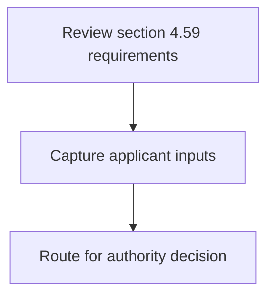
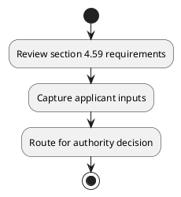

# Chapter 4 / Section 4.59: Wastage Norms

**Chapter Title:** Duty Exemption / Remission Schemes

**Pages:** 35, 36, 37

**Purpose:** 4.59 Wastage Norms
Maximum wastage or manufacturing loss on gold/ silver/ platinum jewellery
and articles thereofxiv:
110
110
GEMS AND JEWELLERY SECTOR
4.59 Wastage Norms
Maximum wastage or manufacturing loss on gold/ silver/ platinum jewellery
and articles thereofxiv:
Sl No Items of export
Percentage of wastage by weight with
reference to Gold/ Platinum / Silver
content in export item
Gold / platinum Silver
Plain Jewellery and Articles,
and ornaments like
Mangalsutra containing gold
and black beads/imitation
a)
stones, cubic zirconia
diamonds, precious, semi-
precious stones.

**Purpose Thanglish:** Indha Wastage Norms section-la, 4.59 Wastage Norms
Maximum wastage or manufacturing loss on gold/ silver/ platinum jewellery
and articles thereofxiv:
110
110
GEMS AND JEWELLERY SECTOR
4.59 Wastage Norms
Maximum wastage or manufacturing loss on gold/ silver/ platinum jewellery
and articles thereofxiv:
Sl No Items of export
Percentage of wastage by weight with
reference to Gold/ Platinum / Silver
content in export item
Gold / platinum Silver
Plain Jewellery and Articles,
and ornaments like
Mangalsutra containing gold
and black beads/imitation
a)
stones, cubic zirconia
diamonds, precious, semi-
precious stones.

**Summary:** 4.59 Wastage Norms
Maximum wastage or manufacturing loss on gold/ silver/ platinum jewellery
and articles thereofxiv:
110
110
GEMS AND JEWELLERY SECTOR
4.59 Wastage Norms
Maximum wastage or manufacturing loss on gold/ silver/ platinum jewellery
and articles thereofxiv:
Sl No Items of export
Percentage of wastage by weight with
reference to Gold/ Platinum / Silver
content in export item
Gold / platinum Silver
Plain Jewellery and Articles,
and ornaments like
Mangalsutra containing gold
and black beads/imitation
a)
stones, cubic zirconia
diamonds, precious, semi-
precious stones. a. Handcrafted
2.25 % 3.00%
b.

**Business Meaning:** 4.59 Wastage Norms
Maximum wastage or manufacturing loss on gold/ silver/ platinum jewellery
and articles thereofxiv:
110
110
GEMS AND JEWELLERY SECTOR
4.59 Wastage Norms
Maximum wastage or manufacturing loss on gold/ silver/ platinum jewellery
and articles thereofxiv:
Sl No Items of export
Percentage of wastage by weight with
reference to Gold/ Platinum / Silver
content in export item
Gold / platinum Silver
Plain Jewellery and Articles,
and ornaments like
Mangalsutra containing gold
and black beads/imitation
a)
stones, cubic zirconia
diamonds, precious, semi-
precious stones.

**Business Explanation:** 4.59 Wastage Norms
Maximum wastage or manufacturing loss on gold/ silver/ platinum jewellery
and articles thereofxiv:
110
110
GEMS AND JEWELLERY SECTOR
4.59 Wastage Norms
Maximum wastage or manufacturing loss on gold/ silver/ platinum jewellery
and articles thereofxiv:
Sl No Items of export
Percentage of wastage by weight with
reference to Gold/ Platinum / Silver
content in export item
Gold / platinum Silver
Plain Jewellery and Articles,
and ornaments like
Mangalsutra containing gold
and black beads/imitation
a)
stones, cubic zirconia
diamonds, precious, semi-
precious stones. a. Handcrafted
2.25 % 3.00%
b.

**Business Explanation Thanglish:** Indha Wastage Norms section-la, 4.59 Wastage Norms
Maximum wastage or manufacturing loss on gold/ silver/ platinum jewellery
and articles thereofxiv:
110
110
GEMS AND JEWELLERY SECTOR
4.59 Wastage Norms
Maximum wastage or manufacturing loss on gold/ silver/ platinum jewellery
and articles thereofxiv:
Sl No Items of export
Percentage of wastage by weight with
reference to Gold/ Platinum / Silver
content in export item
Gold / platinum Silver
Plain Jewellery and Articles,
and ornaments like
Mangalsutra containing gold
and black beads/imitation
a)
stones, cubic zirconia
diamonds, precious, semi-
precious stones. a. Handcrafted
2.25 % 3.00%
b.

## Business Logic
- None identified

## Business Rules
- rule_id=CH4-SEC4_59-R001, rule_description=4.59 Wastage Norms
Maximum wastage or manufacturing loss on gold/ silver/ platinum jewellery
and articles thereofxiv:
110
110
GEMS AND JEWELLERY SECTOR
4.59 Wastage Norms
Maximum wastage or manufacturing loss on gold/ silver/ platinum jewellery
and articles thereofxiv:
Sl No Items of export
Percentage of wastage by weight with
reference to Gold/ Platinum / Silver
content in export item
Gold / platinum Silver
Plain Jewellery and Articles,
and ornaments like
Mangalsutra containing gold
and black beads/imitation
a)
stones, cubic zirconia
diamonds, precious, semi-
precious stones. a. Handcrafted
2.25 % 3.00%
b., trigger=Wastage Norms, condition=Not explicitly covered in uploaded documents., validation=Not explicitly covered in uploaded documents., action=Manual review required., exception=No explicit exception found in uploaded documents., output=DEKAI should produce a compliance decision for 4.59 - Wastage Norms.

## Conditions
- None identified

## Condition Logic
- None identified

## Validations
- None identified

## Exceptions
- None identified

## Dependencies
- 1
- 2
- 3
- 4
- 5

## Authorities
- None identified

## Required Documents
- None identified

## Timelines
- None identified

## Actions
- None identified

## Workflow
- Review section 4.59 requirements
- Capture applicant inputs
- Route for authority decision

## Workflow ASCII
```text
Wastage Norms
Review section 4.59 requirements
   |
   v
Capture applicant inputs
   |
   v
Route for authority decision
```

## Decision Tree
- IF section 4.59 applies THEN proceed with standard DGFT workflow

## Decision Tree ASCII
```text
Wastage Norms Decision
IF section 4.59 applies THEN proceed with standard DGFT workflow
```

## Examples
- User asks to process Wastage Norms; the platform checks conditions, validations, and documents before action.

**Real-world Example:** Example: an importer or exporter invokes Wastage Norms, submits the prescribed DGFT records, and DEKAI uses the extracted rules to follow the wastage norms process.

**Real-world Example Thanglish:** Indha Wastage Norms section-la, Example: an importer or exporter invokes Wastage Norms, submits the prescribed DGFT records, and DEKAI uses the extracted rules to follow the wastage norms process.

## AI Rules
- None identified

## Database Fields
- name=section_code, type=string, required=True, source=parsed_section_heading
- name=section_title, type=string, required=True, source=parsed_section_heading
- name=and_flag, type=boolean, required=False, source=keyword:and
- name=any_flag, type=boolean, required=False, source=keyword:Any
- name=not_flag, type=boolean, required=False, source=keyword:not
- name=loss_flag, type=boolean, required=False, source=keyword:loss
- name=gold_flag, type=boolean, required=False, source=keyword:gold
- name=gems_flag, type=boolean, required=False, source=keyword:GEMS
- name=with_flag, type=boolean, required=False, source=keyword:with
- name=item_flag, type=boolean, required=False, source=keyword:item

## API Requirements
- method=GET, path=/api/dgft/sections/4.59, purpose=Retrieve knowledge payload for section 4.59, query_params=['include=workflow,decision_tree,validations'], response_fields=['section', 'title', 'summary', 'conditions', 'validations', 'exceptions', 'workflow', 'decision_tree']
- method=POST, path=/api/dgft/Wastage-Norms/validate, purpose=Validate inputs and documents for Wastage Norms, request_fields=['section_code', 'section_title'], response_fields=['status', 'errors', 'warnings', 'next_actions']

## UI Screens
- screen_id=Wastage_Norms_overview, name=Wastage Norms Overview, purpose=Show section summary, authority, timeline, and eligibility cues., widgets=['summary_card', 'conditions_table', 'authority_badges', 'timeline_panel']
- screen_id=Wastage_Norms_submission, name=Wastage Norms Submission, purpose=Capture applicant data and supporting documents., widgets=['dynamic_form', 'document_uploader', 'validation_panel', 'next_action_footer'], fields=['section_code', 'section_title', 'and_flag', 'any_flag', 'not_flag', 'loss_flag', 'gold_flag', 'gems_flag']

## Error Messages
- Validation failed because the section requirements were not fully met.

## FAQ
- question_en=What is the purpose of section 4.59?, answer_en=4.59 Wastage Norms
Maximum wastage or manufacturing loss on gold/ silver/ platinum jewellery
and articles thereofxiv:
110
110
GEMS AND JEWELLERY SECTOR
4.59 Wastage Norms
Maximum wastage or manufacturing loss on gold/ silver/ platinum jewellery
and articles thereofxiv:
Sl No Items of export
Percentage of wastage by weight with
reference to Gold/ Platinum / Silver
content in export item
Gold / platinum Silver
Plain Jewellery and Articles,
and ornaments like
Mangalsutra containing gold
and black beads/imitation
a)
stones, cubic zirconia
diamonds, precious, semi-
precious stones. a. Handcrafted
2.25 % 3.00%
b., question_thanglish=Indha Wastage Norms section-la, What is the purpose of section 4.59?, answer_thanglish=Indha Wastage Norms section-la, 4.59 Wastage Norms
Maximum wastage or manufacturing loss on gold/ silver/ platinum jewellery
and articles thereofxiv:
110
110
GEMS AND JEWELLERY SECTOR
4.59 Wastage Norms
Maximum wastage or manufacturing loss on gold/ silver/ platinum jewellery
and articles thereofxiv:
Sl No Items of export
Percentage of wastage by weight with
reference to Gold/ Platinum / Silver
content in export item
Gold / platinum Silver
Plain Jewellery and Articles,
and ornaments like
Mangalsutra containing gold
and black beads/imitation
a)
stones, cubic zirconia
diamonds, precious, semi-
precious stones. a. Handcrafted
2.25 % 3.00%
b.
- question_en=What documents are required under Wastage Norms?, answer_en=Not explicitly covered in uploaded documents., question_thanglish=Indha Wastage Norms section-la, What documents are required under Wastage Norms?, answer_thanglish=Indha Wastage Norms section-la, Not explicitly covered in uploaded documents.
- question_en=Which authority handles Wastage Norms?, answer_en=Not explicitly covered in uploaded documents., question_thanglish=Indha Wastage Norms section-la, Which authority handles Wastage Norms?, answer_thanglish=Indha Wastage Norms section-la, Not explicitly covered in uploaded documents.

## Questions Users May Ask
- What does Wastage Norms require?
- Which documents are needed for Wastage Norms?
- How does DEKAI validate Wastage Norms requests?

## Expected AI Answers
- Wastage Norms requires the platform to interpret the section text, apply the extracted business rules, and present the correct next action.
- Required documents are inferred from the section text: no explicit documents were detected.
- DEKAI validates Wastage Norms by checking conditions, required documents, authority references, and exception clauses before recommending an outcome.

## AI Q&A Examples
- question_en=User asks: How do I comply with Wastage Norms?, answer_en=AI answers: DEKAI should evaluate section 4.59, apply the extracted rules, and guide the user through Review section 4.59 requirements., question_thanglish=Indha Wastage Norms section-la, User asks: How do I comply with Wastage Norms?, answer_thanglish=Indha Wastage Norms section-la, AI answers: DEKAI should evaluate section 4.59, apply the extracted rules, and guide the user through Review section 4.59 requirements.
- question_en=User asks: Which validations apply to Wastage Norms?, answer_en=AI answers: Applicable validations are not explicitly covered in the uploaded documents., question_thanglish=Indha Wastage Norms section-la, User asks: Which validations apply to Wastage Norms?, answer_thanglish=Indha Wastage Norms section-la, AI answers: Applicable validations are not explicitly covered in the uploaded documents.

## DEKAI AI Implementation Notes
- Capture chapter 4, section 4.59, title, and page references as immutable knowledge metadata.
- Bind validations for Wastage Norms into a rule engine keyed by the rule IDs extracted for this section.
- Show contextual links to related sections: 1, 2, 3, 4, 5.

## DEKAI AI Implementation Notes Thanglish
- Indha Wastage Norms section-la, Capture chapter 4, section 4.59, title, and page references as immutable knowledge metadata.
- Indha Wastage Norms section-la, Bind validations for Wastage Norms into a rule engine keyed by the rule IDs extracted for this section.
- Indha Wastage Norms section-la, Show contextual links to related sections: 1, 2, 3, 4, 5.

## AI Metadata
- Keywords: and, Any, not, loss, gold, GEMS, with, item, like, semi, used, only, gods, upto, Norms, Items, Plain, black, cubic, under
- Search Keywords: and, Any, not, loss, gold, GEMS, with, item, like, semi, used, only, gods, upto, Norms, Items, Plain, black, cubic, under
- Intent: Provide knowledge guidance for Wastage Norms.
- Tags: 4.59, Wastage Norms, dgft
- Related Sections: 1, 2, 3, 4, 5
- Related Chapters: 
- Related Rules: 

## Mermaid


## PlantUML

