# Chapter 4 / Section 4.60: Value Addition

**Chapter Title:** Duty Exemption / Remission Schemes

**Pages:** 38

**Purpose:** 4.60 Value Addition
Under scheme for export of jewellery, value addition shall be calculated as per
Paragraph 4.37 of FTP.

**Purpose Thanglish:** Indha Value Addition section-la, 4.60 Value Addition
Under scheme for export of jewellery, value addition kandippa be calculated as per
Paragraph 4.37 of FTP.

**Summary:** 4.60 Value Addition
Under scheme for export of jewellery, value addition shall be calculated as per
Paragraph 4.37 of FTP. Minimum Value Addition shall be:
Sl Items of export Minimum Value
No Addition
a) Plain gold / platinum / silver jewellery 3.5%
and Articles and ornaments like
Mangalsutra containing gold and black
beads / imitation stones, except in
studded form of jewellery. b) All types of Studded gold / platinum / 6.0% (for those studded with
silver Jewellery and articles thereof.

**Business Meaning:** Value Addition governs how DGFT business controls should be applied, validated, and enforced.

**Business Explanation:** Value Addition explains the operating rule set that DEKAI should enforce. Key control points include 4.60 Value Addition
Under scheme for export of jewellery, value addition shall be calculated as per
Paragraph 4.37 of FTP.

**Business Explanation Thanglish:** Indha Value Addition section-la, Value Addition explains the operating rule set that DEKAI should enforce. Key control points include 4.60 Value Addition
Under scheme for export of jewellery, value addition kandippa be calculated as per
Paragraph 4.37 of FTP.

## Business Logic
- 4.60 Value Addition
Under scheme for export of jewellery, value addition shall be calculated as per
Paragraph 4.37 of FTP.
- Minimum Value Addition shall be:
Sl Items of export Minimum Value
No Addition
a) Plain gold / platinum / silver jewellery 3.5%
and Articles and ornaments like
Mangalsutra containing gold and black
beads / imitation stones, except in
studded form of jewellery.
- |
113
4.60 Value Addition
Under scheme for export of jewellery, value addition shall be calculated as per
Paragraph 4.37 of FTP.
- Minimum Value Addition shall be:
Sl
No
Items of export
Minimum Value
Addition
a)
Plain gold / platinum / silver jewellery
and
Articles
and
ornaments
like
Mangalsutra containing gold and black
beads / imitation stones, except
in
studded form of jewellery.

## Business Rules
- rule_id=CH4-SEC4_60-R001, rule_description=4.60 Value Addition
Under scheme for export of jewellery, value addition shall be calculated as per
Paragraph 4.37 of FTP., trigger=Value Addition, condition=c) Any jewellery / articles manufactured 2%
by fully
mechanized process (not applicable
under Advance Authorisation)
d) Gold / silver / platinum medallions & 1.5%
coins (excluding coins of nature of legal
tender) (not applicable under Advance
Authorisation)
e) Gold / silver / platinum findings / 2.5%
mountings manufactured by mechanized
process
f) Gold religious idols (only gods and 10% in case of plain gold
goddess of 8 carats and above (upto 24 religious idols (Non studded)., validation=4.60 Value Addition
Under scheme for export of jewellery, value addition shall be calculated as per
Paragraph 4.37 of FTP., action=Manual review required., exception=Minimum Value Addition shall be:
Sl Items of export Minimum Value
No Addition
a) Plain gold / platinum / silver jewellery 3.5%
and Articles and ornaments like
Mangalsutra containing gold and black
beads / imitation stones, except in
studded form of jewellery., output=DEKAI should produce a compliance decision for 4.60 - Value Addition.
- rule_id=CH4-SEC4_60-R002, rule_description=Minimum Value Addition shall be:
Sl Items of export Minimum Value
No Addition
a) Plain gold / platinum / silver jewellery 3.5%
and Articles and ornaments like
Mangalsutra containing gold and black
beads / imitation stones, except in
studded form of jewellery., trigger=Value Addition, condition=carats) 14% in case of plain gold
religious idols studded with
colour gem stones., validation=Minimum Value Addition shall be:
Sl Items of export Minimum Value
No Addition
a) Plain gold / platinum / silver jewellery 3.5%
and Articles and ornaments like
Mangalsutra containing gold and black
beads / imitation stones, except in
studded form of jewellery., action=Manual review required., exception=113
Sl | | Items of export | Minimum Value |
No | | | Addition |
a) | | Plain gold / platinum / silver jewellery
and Articles and ornaments like
Mangalsutra containing gold and black
beads / imitation stones, except in
studded form of jewellery., output=DEKAI should produce a compliance decision for 4.60 - Value Addition.
- rule_id=CH4-SEC4_60-R003, rule_description=|
113
4.60 Value Addition
Under scheme for export of jewellery, value addition shall be calculated as per
Paragraph 4.37 of FTP., trigger=Value Addition, condition=|
c) | | Any jewellery / articles manufactured
by fully
mechanized process (not applicable
under Advance Authorisation) | 2% |
d) | | Gold / silver / platinum medallions &
coins (excluding coins of nature of legal
tender) (not applicable under Advance
Authorisation) | 1.5% |
e) | | Gold / silver / platinum findings /
mountings manufactured by mechanized
process | 2.5% |
f) | | Gold religious idols (only gods and
goddess of 8 carats and above (upto 24
carats) | 10% in case of plain gold
religious idols (Non studded)., validation=|
113
4.60 Value Addition
Under scheme for export of jewellery, value addition shall be calculated as per
Paragraph 4.37 of FTP., action=Manual review required., exception=Minimum Value Addition shall be:
Sl
No
Items of export
Minimum Value
Addition
a)
Plain gold / platinum / silver jewellery
and
Articles
and
ornaments
like
Mangalsutra containing gold and black
beads / imitation stones, except
in
studded form of jewellery., output=DEKAI should produce a compliance decision for 4.60 - Value Addition.
- rule_id=CH4-SEC4_60-R004, rule_description=Minimum Value Addition shall be:
Sl
No
Items of export
Minimum Value
Addition
a)
Plain gold / platinum / silver jewellery
and
Articles
and
ornaments
like
Mangalsutra containing gold and black
beads / imitation stones, except
in
studded form of jewellery., trigger=Value Addition, condition=14% in case of plain gold
religious idols studded with
colour gem stones., validation=Minimum Value Addition shall be:
Sl
No
Items of export
Minimum Value
Addition
a)
Plain gold / platinum / silver jewellery
and
Articles
and
ornaments
like
Mangalsutra containing gold and black
beads / imitation stones, except
in
studded form of jewellery., action=Manual review required., exception=Minimum Value Addition shall be:
Sl
No
Items of export
Minimum Value
Addition
a)
Plain gold / platinum / silver jewellery
and
Articles
and
ornaments
like
Mangalsutra containing gold and black
beads / imitation stones, except
in
studded form of jewellery., output=DEKAI should produce a compliance decision for 4.60 - Value Addition.

## Conditions
- c) Any jewellery / articles manufactured 2%
by fully
mechanized process (not applicable
under Advance Authorisation)
d) Gold / silver / platinum medallions & 1.5%
coins (excluding coins of nature of legal
tender) (not applicable under Advance
Authorisation)
e) Gold / silver / platinum findings / 2.5%
mountings manufactured by mechanized
process
f) Gold religious idols (only gods and 10% in case of plain gold
goddess of 8 carats and above (upto 24 religious idols (Non studded).
- carats) 14% in case of plain gold
religious idols studded with
colour gem stones.
- |
c) | | Any jewellery / articles manufactured
by fully
mechanized process (not applicable
under Advance Authorisation) | 2% |
d) | | Gold / silver / platinum medallions &
coins (excluding coins of nature of legal
tender) (not applicable under Advance
Authorisation) | 1.5% |
e) | | Gold / silver / platinum findings /
mountings manufactured by mechanized
process | 2.5% |
f) | | Gold religious idols (only gods and
goddess of 8 carats and above (upto 24
carats) | 10% in case of plain gold
religious idols (Non studded).
- 14% in case of plain gold
religious idols studded with
colour gem stones.
- c)
Any jewellery / articles manufactured
by
fully
mechanized
process
(not
applicable
under Advance Authorisation)
2%
d)
Gold / silver / platinum medallions &
coins (excluding coins of nature of legal
tender) (not applicable under Advance
Authorisation)
1.5%
e)
Gold / silver / platinum findings /
mountings manufactured by mechanized
process
2.5%
f)
Gold religious idols (only
gods and
goddess of 8 carats and above (upto 24
carats)
10% in case of plain gold
religious idols (Non studded).

## Condition Logic
- id=4.4.60.1, if=c) Any jewellery / articles manufactured 2%
by fully
mechanized process (not applicable
under Advance Authorisation)
d) Gold / silver / platinum medallions & 1.5%
coins (excluding coins of nature of legal
tender) (not applicable under Advance
Authorisation)
e) Gold / silver / platinum findings / 2.5%
mountings manufactured by mechanized
process
f) Gold religious idols (only gods and 10% in case of plain gold
goddess of 8 carats and above (upto 24 religious idols (Non studded)., then=Route for review, source=c) Any jewellery / articles manufactured 2%
by fully
mechanized process (not applicable
under Advance Authorisation)
d) Gold / silver / platinum medallions & 1.5%
coins (excluding coins of nature of legal
tender) (not applicable under Advance
Authorisation)
e) Gold / silver / platinum findings / 2.5%
mountings manufactured by mechanized
process
f) Gold religious idols (only gods and 10% in case of plain gold
goddess of 8 carats and above (upto 24 religious idols (Non studded).
- id=4.4.60.2, if=carats) 14% in case of plain gold
religious idols studded with
colour gem stones., then=Route for review, source=carats) 14% in case of plain gold
religious idols studded with
colour gem stones.
- id=4.4.60.3, if=|
c) | | Any jewellery / articles manufactured
by fully
mechanized process (not applicable
under Advance Authorisation) | 2% |
d) | | Gold / silver / platinum medallions &
coins (excluding coins of nature of legal
tender) (not applicable under Advance
Authorisation) | 1.5% |
e) | | Gold / silver / platinum findings /
mountings manufactured by mechanized
process | 2.5% |
f) | | Gold religious idols (only gods and
goddess of 8 carats and above (upto 24
carats) | 10% in case of plain gold
religious idols (Non studded)., then=Route for review, source=|
c) | | Any jewellery / articles manufactured
by fully
mechanized process (not applicable
under Advance Authorisation) | 2% |
d) | | Gold / silver / platinum medallions &
coins (excluding coins of nature of legal
tender) (not applicable under Advance
Authorisation) | 1.5% |
e) | | Gold / silver / platinum findings /
mountings manufactured by mechanized
process | 2.5% |
f) | | Gold religious idols (only gods and
goddess of 8 carats and above (upto 24
carats) | 10% in case of plain gold
religious idols (Non studded).
- id=4.4.60.4, if=14% in case of plain gold
religious idols studded with
colour gem stones., then=Route for review, source=14% in case of plain gold
religious idols studded with
colour gem stones.
- id=4.4.60.5, if=c)
Any jewellery / articles manufactured
by
fully
mechanized
process
(not
applicable
under Advance Authorisation)
2%
d)
Gold / silver / platinum medallions &
coins (excluding coins of nature of legal
tender) (not applicable under Advance
Authorisation)
1.5%
e)
Gold / silver / platinum findings /
mountings manufactured by mechanized
process
2.5%
f)
Gold religious idols (only
gods and
goddess of 8 carats and above (upto 24
carats)
10% in case of plain gold
religious idols (Non studded)., then=Route for review, source=c)
Any jewellery / articles manufactured
by
fully
mechanized
process
(not
applicable
under Advance Authorisation)
2%
d)
Gold / silver / platinum medallions &
coins (excluding coins of nature of legal
tender) (not applicable under Advance
Authorisation)
1.5%
e)
Gold / silver / platinum findings /
mountings manufactured by mechanized
process
2.5%
f)
Gold religious idols (only
gods and
goddess of 8 carats and above (upto 24
carats)
10% in case of plain gold
religious idols (Non studded).

## Validations
- 4.60 Value Addition
Under scheme for export of jewellery, value addition shall be calculated as per
Paragraph 4.37 of FTP.
- Minimum Value Addition shall be:
Sl Items of export Minimum Value
No Addition
a) Plain gold / platinum / silver jewellery 3.5%
and Articles and ornaments like
Mangalsutra containing gold and black
beads / imitation stones, except in
studded form of jewellery.
- |
113
4.60 Value Addition
Under scheme for export of jewellery, value addition shall be calculated as per
Paragraph 4.37 of FTP.
- Minimum Value Addition shall be:
Sl
No
Items of export
Minimum Value
Addition
a)
Plain gold / platinum / silver jewellery
and
Articles
and
ornaments
like
Mangalsutra containing gold and black
beads / imitation stones, except
in
studded form of jewellery.

## Exceptions
- Minimum Value Addition shall be:
Sl Items of export Minimum Value
No Addition
a) Plain gold / platinum / silver jewellery 3.5%
and Articles and ornaments like
Mangalsutra containing gold and black
beads / imitation stones, except in
studded form of jewellery.
- 113
Sl | | Items of export | Minimum Value |
No | | | Addition |
a) | | Plain gold / platinum / silver jewellery
and Articles and ornaments like
Mangalsutra containing gold and black
beads / imitation stones, except in
studded form of jewellery.
- Minimum Value Addition shall be:
Sl
No
Items of export
Minimum Value
Addition
a)
Plain gold / platinum / silver jewellery
and
Articles
and
ornaments
like
Mangalsutra containing gold and black
beads / imitation stones, except
in
studded form of jewellery.

## Dependencies
- 4.37

## Authorities
- None identified

## Required Documents
- None identified

## Timelines
- None identified

## Actions
- None identified

## Workflow
- Evaluate condition: c) Any jewellery / articles manufactured 2%
by fully
mechanized process (not applicable
under Advance Authorisation)
d) Gold / silver / platinum medallions & 1.5%
coins (excluding coins of nature of legal
tender) (not applicable under Advance
Authorisation)
e) Gold / silver / platinum findings / 2.5%
mountings manufactured by mechanized
process
f) Gold religious idols (only gods and 10% in case of plain gold
goddess of 8 carats and above (upto 24 religious idols (Non studded).
- Evaluate condition: carats) 14% in case of plain gold
religious idols studded with
colour gem stones.
- Evaluate condition: |
c) | | Any jewellery / articles manufactured
by fully
mechanized process (not applicable
under Advance Authorisation) | 2% |
d) | | Gold / silver / platinum medallions &
coins (excluding coins of nature of legal
tender) (not applicable under Advance
Authorisation) | 1.5% |
e) | | Gold / silver / platinum findings /
mountings manufactured by mechanized
process | 2.5% |
f) | | Gold religious idols (only gods and
goddess of 8 carats and above (upto 24
carats) | 10% in case of plain gold
religious idols (Non studded).
- Run validation: 4.60 Value Addition
Under scheme for export of jewellery, value addition shall be calculated as per
Paragraph 4.37 of FTP.
- Run validation: Minimum Value Addition shall be:
Sl Items of export Minimum Value
No Addition
a) Plain gold / platinum / silver jewellery 3.5%
and Articles and ornaments like
Mangalsutra containing gold and black
beads / imitation stones, except in
studded form of jewellery.
- Run validation: |
113
4.60 Value Addition
Under scheme for export of jewellery, value addition shall be calculated as per
Paragraph 4.37 of FTP.
- Handle exception: Minimum Value Addition shall be:
Sl Items of export Minimum Value
No Addition
a) Plain gold / platinum / silver jewellery 3.5%
and Articles and ornaments like
Mangalsutra containing gold and black
beads / imitation stones, except in
studded form of jewellery.

## Workflow ASCII
```text
Value Addition
Evaluate condition: c) Any jewellery / articles manufactured 2%
by fully
mechanized process (not applicable
under Advance Authorisation)
d) Gold / silver / platinum medallions & 1.5%
coins (excluding coins of nature of legal
tender) (not applicable under Advance
Authorisation)
e) Gold / silver / platinum findings / 2.5%
mountings manufactured by mechanized
process
f) Gold religious idols (only gods and 10% in case of plain gold
goddess of 8 carats and above (upto 24 religious idols (Non studded).
   |
   v
Evaluate condition: carats) 14% in case of plain gold
religious idols studded with
colour gem stones.
   |
   v
Evaluate condition: |
c) | | Any jewellery / articles manufactured
by fully
mechanized process (not applicable
under Advance Authorisation) | 2% |
d) | | Gold / silver / platinum medallions &
coins (excluding coins of nature of legal
tender) (not applicable under Advance
Authorisation) | 1.5% |
e) | | Gold / silver / platinum findings /
mountings manufactured by mechanized
process | 2.5% |
f) | | Gold religious idols (only gods and
goddess of 8 carats and above (upto 24
carats) | 10% in case of plain gold
religious idols (Non studded).
   |
   v
Run validation: 4.60 Value Addition
Under scheme for export of jewellery, value addition shall be calculated as per
Paragraph 4.37 of FTP.
   |
   v
Run validation: Minimum Value Addition shall be:
Sl Items of export Minimum Value
No Addition
a) Plain gold / platinum / silver jewellery 3.5%
and Articles and ornaments like
Mangalsutra containing gold and black
beads / imitation stones, except in
studded form of jewellery.
   |
   v
Run validation: |
113
4.60 Value Addition
Under scheme for export of jewellery, value addition shall be calculated as per
Paragraph 4.37 of FTP.
   |
   v
Handle exception: Minimum Value Addition shall be:
Sl Items of export Minimum Value
No Addition
a) Plain gold / platinum / silver jewellery 3.5%
and Articles and ornaments like
Mangalsutra containing gold and black
beads / imitation stones, except in
studded form of jewellery.
```

## Decision Tree
- IF exception applies (Minimum Value Addition shall be:
Sl Items of export Minimum Value
No Addition
a) Plain gold / platinum / silver jewellery 3.5%
and Articles and ornaments like
Mangalsutra containing gold and black
beads / imitation stones, except in
studded form of jewellery.) THEN route to manual review
- IF exception applies (113
Sl | | Items of export | Minimum Value |
No | | | Addition |
a) | | Plain gold / platinum / silver jewellery
and Articles and ornaments like
Mangalsutra containing gold and black
beads / imitation stones, except in
studded form of jewellery.) THEN route to manual review
- IF exception applies (Minimum Value Addition shall be:
Sl
No
Items of export
Minimum Value
Addition
a)
Plain gold / platinum / silver jewellery
and
Articles
and
ornaments
like
Mangalsutra containing gold and black
beads / imitation stones, except
in
studded form of jewellery.) THEN route to manual review

## Decision Tree ASCII
```text
Value Addition Decision
IF exception applies (Minimum Value Addition shall be:
Sl Items of export Minimum Value
No Addition
a) Plain gold / platinum / silver jewellery 3.5%
and Articles and ornaments like
Mangalsutra containing gold and black
beads / imitation stones, except in
studded form of jewellery.) THEN route to manual review
   |
   v
IF exception applies (113
Sl | | Items of export | Minimum Value |
No | | | Addition |
a) | | Plain gold / platinum / silver jewellery
and Articles and ornaments like
Mangalsutra containing gold and black
beads / imitation stones, except in
studded form of jewellery.) THEN route to manual review
   |
   v
IF exception applies (Minimum Value Addition shall be:
Sl
No
Items of export
Minimum Value
Addition
a)
Plain gold / platinum / silver jewellery
and
Articles
and
ornaments
like
Mangalsutra containing gold and black
beads / imitation stones, except
in
studded form of jewellery.) THEN route to manual review
```

## Examples
- User asks to process Value Addition; the platform checks conditions, validations, and documents before action.

**Real-world Example:** Example: an importer or exporter invokes Value Addition, submits the prescribed DGFT records, and DEKAI uses the extracted rules to follow the value addition process.

**Real-world Example Thanglish:** Indha Value Addition section-la, Example: an importer or exporter invokes Value Addition, submits the prescribed DGFT records, and DEKAI uses the extracted rules to follow the value addition process.

## AI Rules
- IF detected context matches section rule THEN enforce: 4.60 Value Addition
Under scheme for export of jewellery, value addition shall be calculated as per
Paragraph 4.37 of FTP.
- IF detected context matches section rule THEN enforce: Minimum Value Addition shall be:
Sl Items of export Minimum Value
No Addition
a) Plain gold / platinum / silver jewellery 3.5%
and Articles and ornaments like
Mangalsutra containing gold and black
beads / imitation stones, except in
studded form of jewellery.
- IF detected context matches section rule THEN enforce: |
113
4.60 Value Addition
Under scheme for export of jewellery, value addition shall be calculated as per
Paragraph 4.37 of FTP.
- IF detected context matches section rule THEN enforce: Minimum Value Addition shall be:
Sl
No
Items of export
Minimum Value
Addition
a)
Plain gold / platinum / silver jewellery
and
Articles
and
ornaments
like
Mangalsutra containing gold and black
beads / imitation stones, except
in
studded form of jewellery.

## Database Fields
- name=section_code, type=string, required=True, source=parsed_section_heading
- name=section_title, type=string, required=True, source=parsed_section_heading
- name=for_flag, type=boolean, required=False, source=keyword:for
- name=per_flag, type=boolean, required=False, source=keyword:per
- name=ftp_flag, type=boolean, required=False, source=keyword:FTP
- name=and_flag, type=boolean, required=False, source=keyword:and
- name=all_flag, type=boolean, required=False, source=keyword:All
- name=any_flag, type=boolean, required=False, source=keyword:Any
- name=not_flag, type=boolean, required=False, source=keyword:not
- name=non_flag, type=boolean, required=False, source=keyword:Non

## API Requirements
- method=GET, path=/api/dgft/sections/4.60, purpose=Retrieve knowledge payload for section 4.60, query_params=['include=workflow,decision_tree,validations'], response_fields=['section', 'title', 'summary', 'conditions', 'validations', 'exceptions', 'workflow', 'decision_tree']
- method=POST, path=/api/dgft/Value-Addition/validate, purpose=Validate inputs and documents for Value Addition, request_fields=['section_code', 'section_title'], response_fields=['status', 'errors', 'warnings', 'next_actions']

## UI Screens
- screen_id=Value_Addition_overview, name=Value Addition Overview, purpose=Show section summary, authority, timeline, and eligibility cues., widgets=['summary_card', 'conditions_table', 'authority_badges', 'timeline_panel']
- screen_id=Value_Addition_submission, name=Value Addition Submission, purpose=Capture applicant data and supporting documents., widgets=['dynamic_form', 'document_uploader', 'validation_panel', 'next_action_footer'], fields=['section_code', 'section_title', 'for_flag', 'per_flag', 'ftp_flag', 'and_flag', 'all_flag', 'any_flag']
- screen_id=Value_Addition_exceptions, name=Value Addition Exception Review, purpose=Explain exception handling and manual review triggers., widgets=['exception_banner', 'decision_tree', 'case_notes']

## Error Messages
- Validation failed because the section requirements were not fully met.

## FAQ
- question_en=What is the purpose of section 4.60?, answer_en=Value Addition explains the operating rule set that DEKAI should enforce. Key control points include 4.60 Value Addition
Under scheme for export of jewellery, value addition shall be calculated as per
Paragraph 4.37 of FTP., question_thanglish=Indha Value Addition section-la, What is the purpose of section 4.60?, answer_thanglish=Indha Value Addition section-la, Value Addition explains the operating rule set that DEKAI should enforce. Key control points include 4.60 Value Addition
Under scheme for export of jewellery, value addition kandippa be calculated as per
Paragraph 4.37 of FTP.
- question_en=What documents are required under Value Addition?, answer_en=Not explicitly covered in uploaded documents., question_thanglish=Indha Value Addition section-la, What documents are required under Value Addition?, answer_thanglish=Indha Value Addition section-la, Not explicitly covered in uploaded documents.
- question_en=Which authority handles Value Addition?, answer_en=Not explicitly covered in uploaded documents., question_thanglish=Indha Value Addition section-la, Which authority handles Value Addition?, answer_thanglish=Indha Value Addition section-la, Not explicitly covered in uploaded documents.

## Questions Users May Ask
- What does Value Addition require?
- Which documents are needed for Value Addition?
- How does DEKAI validate Value Addition requests?

## Expected AI Answers
- Value Addition requires the platform to interpret the section text, apply the extracted business rules, and present the correct next action.
- Required documents are inferred from the section text: no explicit documents were detected.
- DEKAI validates Value Addition by checking conditions, required documents, authority references, and exception clauses before recommending an outcome.

## AI Q&A Examples
- question_en=User asks: How do I comply with Value Addition?, answer_en=AI answers: DEKAI should evaluate section 4.60, apply the extracted rules, and guide the user through Evaluate condition: c) Any jewellery / articles manufactured 2%
by fully
mechanized process (not applicable
under Advance Authorisation)
d) Gold / silver / platinum medallions & 1.5%
coins (excluding coins of nature of legal
tender) (not applicable under Advance
Authorisation)
e) Gold / silver / platinum findings / 2.5%
mountings manufactured by mechanized
process
f) Gold religious idols (only gods and 10% in case of plain gold
goddess of 8 carats and above (upto 24 religious idols (Non studded).., question_thanglish=Indha Value Addition section-la, User asks: How do I comply with Value Addition?, answer_thanglish=Indha Value Addition section-la, AI answers: DEKAI should evaluate section 4.60, apply the extracted rules, and guide the user through Evaluate condition: c) Any jewellery / articles manufactured 2%
by fully
mechanized process (not applicable
under Advance Authorisation)
d) Gold / silver / platinum medallions & 1.5%
coins (excluding coins of nature of legal
tender) (not applicable under Advance
Authorisation)
e) Gold / silver / platinum findings / 2.5%
mountings manufactured by mechanized
process
f) Gold religious idols (only gods and 10% in case of plain gold
goddess of 8 carats and above (upto 24 religious idols (Non studded)..
- question_en=User asks: Which validations apply to Value Addition?, answer_en=AI answers: Applicable validations are 4.60 Value Addition
Under scheme for export of jewellery, value addition shall be calculated as per
Paragraph 4.37 of FTP., Minimum Value Addition shall be:
Sl Items of export Minimum Value
No Addition
a) Plain gold / platinum / silver jewellery 3.5%
and Articles and ornaments like
Mangalsutra containing gold and black
beads / imitation stones, except in
studded form of jewellery., |
113
4.60 Value Addition
Under scheme for export of jewellery, value addition shall be calculated as per
Paragraph 4.37 of FTP., question_thanglish=Indha Value Addition section-la, User asks: Which validations apply to Value Addition?, answer_thanglish=Indha Value Addition section-la, AI answers: Applicable validations are 4.60 Value Addition
Under scheme for export of jewellery, value addition kandippa be calculated as per
Paragraph 4.37 of FTP., Minimum Value Addition kandippa be:
Sl Items of export Minimum Value
No Addition
a) Plain gold / platinum / silver jewellery 3.5%
and Articles and ornaments like
Mangalsutra containing gold and black
beads / imitation stones, except in
studded form of jewellery., |
113
4.60 Value Addition
Under scheme for export of jewellery, value addition kandippa be calculated as per
Paragraph 4.37 of FTP.

## DEKAI AI Implementation Notes
- Capture chapter 4, section 4.60, title, and page references as immutable knowledge metadata.
- Bind validations for Value Addition into a rule engine keyed by the rule IDs extracted for this section.
- Trigger manual review when exception clauses are detected.
- Show contextual links to related sections: 4.37.

## DEKAI AI Implementation Notes Thanglish
- Indha Value Addition section-la, Capture chapter 4, section 4.60, title, and page references as immutable knowledge metadata.
- Indha Value Addition section-la, Bind validations for Value Addition into a rule engine keyed by the rule IDs extracted for this section.
- Indha Value Addition section-la, Trigger manual review when exception clauses are detected.
- Indha Value Addition section-la, Show contextual links to related sections: 4.37.

## AI Metadata
- Keywords: for, per, FTP, and, All, Any, not, Non, gem, gold, like, form, with, only, gods, case, upto, Value, Under, shall
- Search Keywords: for, per, FTP, and, All, Any, not, Non, gem, gold, like, form, with, only, gods, case, upto, Value, Under, shall
- Intent: Provide knowledge guidance for Value Addition.
- Tags: 4.60, Value Addition, business-rule, dgft
- Related Sections: 4.37
- Related Chapters: 
- Related Rules: 4.60 Value Addition
Under scheme for export of jewellery, value addition shall be calculated as per
Paragraph 4.37 of FTP., Minimum Value Addition shall be:
Sl Items of export Minimum Value
No Addition
a) Plain gold / platinum / silver jewellery 3.5%
and Articles and ornaments like
Mangalsutra containing gold and black
beads / imitation stones, except in
studded form of jewellery., |
113
4.60 Value Addition
Under scheme for export of jewellery, value addition shall be calculated as per
Paragraph 4.37 of FTP., Minimum Value Addition shall be:
Sl
No
Items of export
Minimum Value
Addition
a)
Plain gold / platinum / silver jewellery
and
Articles
and
ornaments
like
Mangalsutra containing gold and black
beads / imitation stones, except
in
studded form of jewellery.

## Mermaid

```mermaid
flowchart TD
    S1["Evaluate condition: c) Any jewellery / articles manufactured 2%
by fully
mechanized process (not applicable
under Advance Authorisation)
d) Gold / silver / platinum medallions & 1.5%
coins (excluding coins of nature of legal
tender) (not applicable under Advance
Authorisation)
e) Gold / silver / platinum findings / 2.5%
mountings manufactured by mechanized
process
f) Gold religious idols (only gods and 10% in case of plain gold
goddess of 8 carats and above (upto 24 religious idols (Non studded)."]
    S2["Evaluate condition: carats) 14% in case of plain gold
religious idols studded with
colour gem stones."]
    S1 --> S2
    S3["Evaluate condition: |
c) | | Any jewellery / articles manufactured
by fully
mechanized process (not applicable
under Advance Authorisation) | 2% |
d) | | Gold / silver / platinum medallions &
coins (excluding coins of nature of legal
tender) (not applicable under Advance
Authorisation) | 1.5% |
e) | | Gold / silver / platinum findings /
mountings manufactured by mechanized
process | 2.5% |
f) | | Gold religious idols (only gods and
goddess of 8 carats and above (upto 24
carats) | 10% in case of plain gold
religious idols (Non studded)."]
    S2 --> S3
    S4["Run validation: 4.60 Value Addition
Under scheme for export of jewellery, value addition shall be calculated as per
Paragraph 4.37 of FTP."]
    S3 --> S4
    S5["Run validation: Minimum Value Addition shall be:
Sl Items of export Minimum Value
No Addition
a) Plain gold / platinum / silver jewellery 3.5%
and Articles and ornaments like
Mangalsutra containing gold and black
beads / imitation stones, except in
studded form of jewellery."]
    S4 --> S5
    S6["Run validation: |
113
4.60 Value Addition
Under scheme for export of jewellery, value addition shall be calculated as per
Paragraph 4.37 of FTP."]
    S5 --> S6
    S7["Handle exception: Minimum Value Addition shall be:
Sl Items of export Minimum Value
No Addition
a) Plain gold / platinum / silver jewellery 3.5%
and Articles and ornaments like
Mangalsutra containing gold and black
beads / imitation stones, except in
studded form of jewellery."]
    S6 --> S7
```


## PlantUML
```plantuml
@startuml
start
:Evaluate condition\: c) Any jewellery / articles manufactured 2%
by fully
mechanized process (not applicable
under Advance Authorisation)
d) Gold / silver / platinum medallions & 1.5%
coins (excluding coins of nature of legal
tender) (not applicable under Advance
Authorisation)
e) Gold / silver / platinum findings / 2.5%
mountings manufactured by mechanized
process
f) Gold religious idols (only gods and 10% in case of plain gold
goddess of 8 carats and above (upto 24 religious idols (Non studded).;
:Evaluate condition\: carats) 14% in case of plain gold
religious idols studded with
colour gem stones.;
:Evaluate condition\: |
c) | | Any jewellery / articles manufactured
by fully
mechanized process (not applicable
under Advance Authorisation) | 2% |
d) | | Gold / silver / platinum medallions &
coins (excluding coins of nature of legal
tender) (not applicable under Advance
Authorisation) | 1.5% |
e) | | Gold / silver / platinum findings /
mountings manufactured by mechanized
process | 2.5% |
f) | | Gold religious idols (only gods and
goddess of 8 carats and above (upto 24
carats) | 10% in case of plain gold
religious idols (Non studded).;
:Run validation\: 4.60 Value Addition
Under scheme for export of jewellery, value addition shall be calculated as per
Paragraph 4.37 of FTP.;
:Run validation\: Minimum Value Addition shall be\:
Sl Items of export Minimum Value
No Addition
a) Plain gold / platinum / silver jewellery 3.5%
and Articles and ornaments like
Mangalsutra containing gold and black
beads / imitation stones, except in
studded form of jewellery.;
:Run validation\: |
113
4.60 Value Addition
Under scheme for export of jewellery, value addition shall be calculated as per
Paragraph 4.37 of FTP.;
:Handle exception\: Minimum Value Addition shall be\:
Sl Items of export Minimum Value
No Addition
a) Plain gold / platinum / silver jewellery 3.5%
and Articles and ornaments like
Mangalsutra containing gold and black
beads / imitation stones, except in
studded form of jewellery.;
stop
@enduml
```
