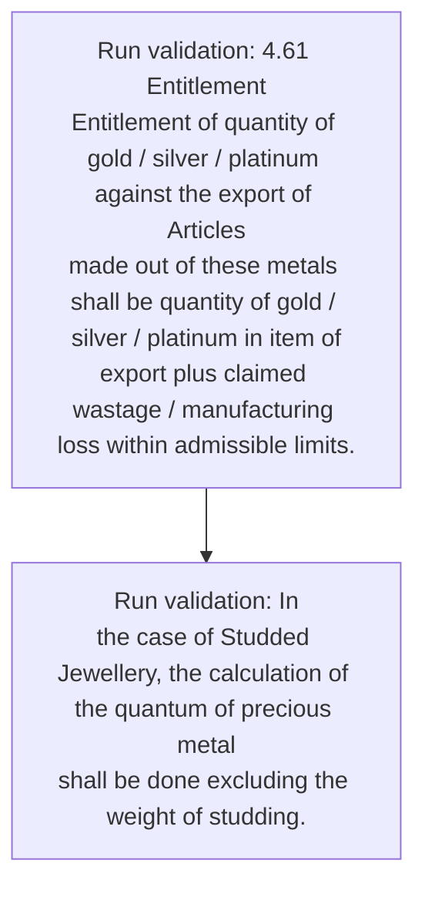
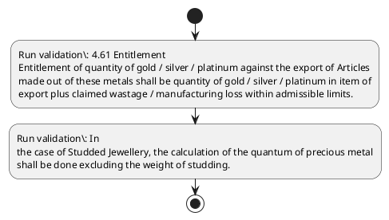

# Chapter 4 / Section 4.61: Entitlement

**Chapter Title:** Duty Exemption / Remission Schemes

**Pages:** 39

**Purpose:** 4.61 Entitlement
Entitlement of quantity of gold / silver / platinum against the export of Articles
made out of these metals shall be quantity of gold / silver / platinum in item of
export plus claimed wastage / manufacturing loss within admissible limits.

**Purpose Thanglish:** Indha Entitlement section-la, 4.61 Entitlement
Entitlement of quantity of gold / silver / platinum against the export of Articles
made out of these metals kandippa be quantity of gold / silver / platinum in item of
export plus claimed wastage / manufacturing loss within admissible limits.

**Summary:** 4.61 Entitlement
Entitlement of quantity of gold / silver / platinum against the export of Articles
made out of these metals shall be quantity of gold / silver / platinum in item of
export plus claimed wastage / manufacturing loss within admissible limits. In
the case of Studded Jewellery, the calculation of the quantum of precious metal
shall be done excluding the weight of studding.

**Business Meaning:** Entitlement governs how DGFT business controls should be applied, validated, and enforced.

**Business Explanation:** Entitlement explains the operating rule set that DEKAI should enforce. Key control points include 4.61 Entitlement
Entitlement of quantity of gold / silver / platinum against the export of Articles
made out of these metals shall be quantity of gold / silver / platinum in item of
export plus claimed wastage / manufacturing loss within admissible limits.

**Business Explanation Thanglish:** Indha Entitlement section-la, Entitlement explains the operating rule set that DEKAI should enforce. Key control points include 4.61 Entitlement
Entitlement of quantity of gold / silver / platinum against the export of Articles
made out of these metals kandippa be quantity of gold / silver / platinum in item of
export plus claimed wastage / manufacturing loss within admissible limits.

## Business Logic
- 4.61 Entitlement
Entitlement of quantity of gold / silver / platinum against the export of Articles
made out of these metals shall be quantity of gold / silver / platinum in item of
export plus claimed wastage / manufacturing loss within admissible limits.
- In
the case of Studded Jewellery, the calculation of the quantum of precious metal
shall be done excluding the weight of studding.

## Business Rules
- rule_id=CH4-SEC4_61-R001, rule_description=4.61 Entitlement
Entitlement of quantity of gold / silver / platinum against the export of Articles
made out of these metals shall be quantity of gold / silver / platinum in item of
export plus claimed wastage / manufacturing loss within admissible limits., trigger=Entitlement, condition=Not explicitly covered in uploaded documents., validation=4.61 Entitlement
Entitlement of quantity of gold / silver / platinum against the export of Articles
made out of these metals shall be quantity of gold / silver / platinum in item of
export plus claimed wastage / manufacturing loss within admissible limits., action=Manual review required., exception=No explicit exception found in uploaded documents., output=DEKAI should produce a compliance decision for 4.61 - Entitlement.
- rule_id=CH4-SEC4_61-R002, rule_description=In
the case of Studded Jewellery, the calculation of the quantum of precious metal
shall be done excluding the weight of studding., trigger=Entitlement, condition=Not explicitly covered in uploaded documents., validation=In
the case of Studded Jewellery, the calculation of the quantum of precious metal
shall be done excluding the weight of studding., action=Manual review required., exception=No explicit exception found in uploaded documents., output=DEKAI should produce a compliance decision for 4.61 - Entitlement.

## Conditions
- None identified

## Condition Logic
- None identified

## Validations
- 4.61 Entitlement
Entitlement of quantity of gold / silver / platinum against the export of Articles
made out of these metals shall be quantity of gold / silver / platinum in item of
export plus claimed wastage / manufacturing loss within admissible limits.
- In
the case of Studded Jewellery, the calculation of the quantum of precious metal
shall be done excluding the weight of studding.

## Exceptions
- None identified

## Dependencies
- 1
- 4
- 6

## Authorities
- None identified

## Required Documents
- None identified

## Timelines
- 4.61 Entitlement
Entitlement of quantity of gold / silver / platinum against the export of Articles
made out of these metals shall be quantity of gold / silver / platinum in item of
export plus claimed wastage / manufacturing loss within admissible limits.

## Actions
- None identified

## Workflow
- Run validation: 4.61 Entitlement
Entitlement of quantity of gold / silver / platinum against the export of Articles
made out of these metals shall be quantity of gold / silver / platinum in item of
export plus claimed wastage / manufacturing loss within admissible limits.
- Run validation: In
the case of Studded Jewellery, the calculation of the quantum of precious metal
shall be done excluding the weight of studding.

## Workflow ASCII
```text
Entitlement
Run validation: 4.61 Entitlement
Entitlement of quantity of gold / silver / platinum against the export of Articles
made out of these metals shall be quantity of gold / silver / platinum in item of
export plus claimed wastage / manufacturing loss within admissible limits.
   |
   v
Run validation: In
the case of Studded Jewellery, the calculation of the quantum of precious metal
shall be done excluding the weight of studding.
```

## Decision Tree
- IF section 4.61 applies THEN proceed with standard DGFT workflow

## Decision Tree ASCII
```text
Entitlement Decision
IF section 4.61 applies THEN proceed with standard DGFT workflow
```

## Examples
- User asks to process Entitlement; the platform checks conditions, validations, and documents before action.

**Real-world Example:** Example: an importer or exporter invokes Entitlement, submits the prescribed DGFT records, and DEKAI uses the extracted rules to follow the entitlement process.

**Real-world Example Thanglish:** Indha Entitlement section-la, Example: an importer or exporter invokes Entitlement, submits the prescribed DGFT records, and DEKAI uses the extracted rules to follow the entitlement process.

## AI Rules
- IF detected context matches section rule THEN enforce: 4.61 Entitlement
Entitlement of quantity of gold / silver / platinum against the export of Articles
made out of these metals shall be quantity of gold / silver / platinum in item of
export plus claimed wastage / manufacturing loss within admissible limits.
- IF detected context matches section rule THEN enforce: In
the case of Studded Jewellery, the calculation of the quantum of precious metal
shall be done excluding the weight of studding.

## Database Fields
- name=section_code, type=string, required=True, source=parsed_section_heading
- name=section_title, type=string, required=True, source=parsed_section_heading
- name=the_flag, type=boolean, required=False, source=keyword:the
- name=out_flag, type=boolean, required=False, source=keyword:out
- name=gold_flag, type=boolean, required=False, source=keyword:gold
- name=made_flag, type=boolean, required=False, source=keyword:made
- name=item_flag, type=boolean, required=False, source=keyword:item
- name=plus_flag, type=boolean, required=False, source=keyword:plus
- name=loss_flag, type=boolean, required=False, source=keyword:loss
- name=case_flag, type=boolean, required=False, source=keyword:case

## API Requirements
- method=GET, path=/api/dgft/sections/4.61, purpose=Retrieve knowledge payload for section 4.61, query_params=['include=workflow,decision_tree,validations'], response_fields=['section', 'title', 'summary', 'conditions', 'validations', 'exceptions', 'workflow', 'decision_tree']
- method=POST, path=/api/dgft/Entitlement/validate, purpose=Validate inputs and documents for Entitlement, request_fields=['section_code', 'section_title'], response_fields=['status', 'errors', 'warnings', 'next_actions']

## UI Screens
- screen_id=Entitlement_overview, name=Entitlement Overview, purpose=Show section summary, authority, timeline, and eligibility cues., widgets=['summary_card', 'conditions_table', 'authority_badges', 'timeline_panel']
- screen_id=Entitlement_submission, name=Entitlement Submission, purpose=Capture applicant data and supporting documents., widgets=['dynamic_form', 'document_uploader', 'validation_panel', 'next_action_footer'], fields=['section_code', 'section_title', 'the_flag', 'out_flag', 'gold_flag', 'made_flag', 'item_flag', 'plus_flag']

## Error Messages
- Validation failed because the section requirements were not fully met.

## FAQ
- question_en=What is the purpose of section 4.61?, answer_en=Entitlement explains the operating rule set that DEKAI should enforce. Key control points include 4.61 Entitlement
Entitlement of quantity of gold / silver / platinum against the export of Articles
made out of these metals shall be quantity of gold / silver / platinum in item of
export plus claimed wastage / manufacturing loss within admissible limits., question_thanglish=Indha Entitlement section-la, What is the purpose of section 4.61?, answer_thanglish=Indha Entitlement section-la, Entitlement explains the operating rule set that DEKAI should enforce. Key control points include 4.61 Entitlement
Entitlement of quantity of gold / silver / platinum against the export of Articles
made out of these metals kandippa be quantity of gold / silver / platinum in item of
export plus claimed wastage / manufacturing loss within admissible limits.
- question_en=What documents are required under Entitlement?, answer_en=Not explicitly covered in uploaded documents., question_thanglish=Indha Entitlement section-la, What documents are required under Entitlement?, answer_thanglish=Indha Entitlement section-la, Not explicitly covered in uploaded documents.
- question_en=Which authority handles Entitlement?, answer_en=Not explicitly covered in uploaded documents., question_thanglish=Indha Entitlement section-la, Which authority handles Entitlement?, answer_thanglish=Indha Entitlement section-la, Not explicitly covered in uploaded documents.

## Questions Users May Ask
- What does Entitlement require?
- Which documents are needed for Entitlement?
- How does DEKAI validate Entitlement requests?

## Expected AI Answers
- Entitlement requires the platform to interpret the section text, apply the extracted business rules, and present the correct next action.
- Required documents are inferred from the section text: no explicit documents were detected.
- DEKAI validates Entitlement by checking conditions, required documents, authority references, and exception clauses before recommending an outcome.

## AI Q&A Examples
- question_en=User asks: How do I comply with Entitlement?, answer_en=AI answers: DEKAI should evaluate section 4.61, apply the extracted rules, and guide the user through Run validation: 4.61 Entitlement
Entitlement of quantity of gold / silver / platinum against the export of Articles
made out of these metals shall be quantity of gold / silver / platinum in item of
export plus claimed wastage / manufacturing loss within admissible limits.., question_thanglish=Indha Entitlement section-la, User asks: How do I comply with Entitlement?, answer_thanglish=Indha Entitlement section-la, AI answers: DEKAI should evaluate section 4.61, apply the extracted rules, and guide the user through Run validation: 4.61 Entitlement
Entitlement of quantity of gold / silver / platinum against the export of Articles
made out of these metals kandippa be quantity of gold / silver / platinum in item of
export plus claimed wastage / manufacturing loss within admissible limits..
- question_en=User asks: Which validations apply to Entitlement?, answer_en=AI answers: Applicable validations are 4.61 Entitlement
Entitlement of quantity of gold / silver / platinum against the export of Articles
made out of these metals shall be quantity of gold / silver / platinum in item of
export plus claimed wastage / manufacturing loss within admissible limits., In
the case of Studded Jewellery, the calculation of the quantum of precious metal
shall be done excluding the weight of studding., question_thanglish=Indha Entitlement section-la, User asks: Which validations apply to Entitlement?, answer_thanglish=Indha Entitlement section-la, AI answers: Applicable validations are 4.61 Entitlement
Entitlement of quantity of gold / silver / platinum against the export of Articles
made out of these metals kandippa be quantity of gold / silver / platinum in item of
export plus claimed wastage / manufacturing loss within admissible limits., In
the case of Studded Jewellery, the calculation of the quantum of precious metal
kandippa be done excluding the weight of studding.

## DEKAI AI Implementation Notes
- Capture chapter 4, section 4.61, title, and page references as immutable knowledge metadata.
- Bind validations for Entitlement into a rule engine keyed by the rule IDs extracted for this section.
- Show contextual links to related sections: 1, 4, 6.

## DEKAI AI Implementation Notes Thanglish
- Indha Entitlement section-la, Capture chapter 4, section 4.61, title, and page references as immutable knowledge metadata.
- Indha Entitlement section-la, Bind validations for Entitlement into a rule engine keyed by the rule IDs extracted for this section.
- Indha Entitlement section-la, Show contextual links to related sections: 1, 4, 6.

## AI Metadata
- Keywords: the, out, gold, made, item, plus, loss, case, done, these, shall, metal, silver, export, metals, within, limits, weight, against, claimed
- Search Keywords: the, out, gold, made, item, plus, loss, case, done, these, shall, metal, silver, export, metals, within, limits, weight, against, claimed
- Intent: Provide knowledge guidance for Entitlement.
- Tags: 4.61, Entitlement, business-rule, dgft
- Related Sections: 1, 4, 6
- Related Chapters: 
- Related Rules: 4.61 Entitlement
Entitlement of quantity of gold / silver / platinum against the export of Articles
made out of these metals shall be quantity of gold / silver / platinum in item of
export plus claimed wastage / manufacturing loss within admissible limits., In
the case of Studded Jewellery, the calculation of the quantum of precious metal
shall be done excluding the weight of studding.

## Mermaid


## PlantUML

