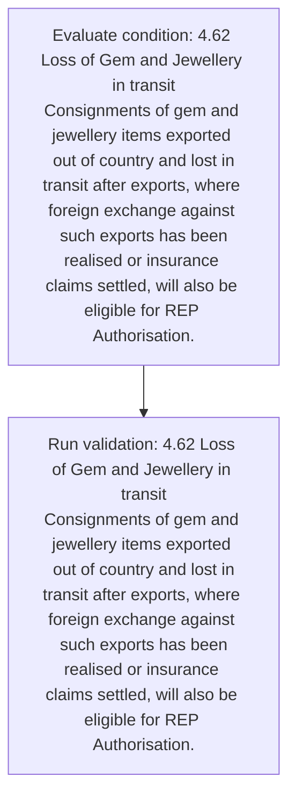
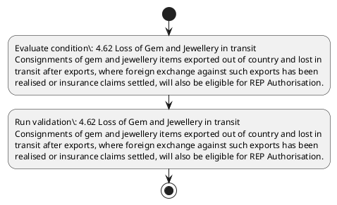

# Chapter 4 / Section 4.62: Loss of Gem and Jewellery in transit

**Chapter Title:** Duty Exemption / Remission Schemes

**Pages:** 39

**Purpose:** 4.62 Loss of Gem and Jewellery in transit
Consignments of gem and jewellery items exported out of country and lost in
transit after exports, where foreign exchange against such exports has been
realised or insurance claims settled, will also be eligible for REP Authorisation.

**Purpose Thanglish:** Indha Loss of Gem and Jewellery in transit section-la, 4.62 Loss of Gem and Jewellery in transit
Consignments of gem and jewellery items exported out of country and lost in
transit after exports, where foreign exchange against such exports has been
realised or insurance claims settled, will also be eligible for REP Authorisation.

**Summary:** 4.62 Loss of Gem and Jewellery in transit
Consignments of gem and jewellery items exported out of country and lost in
transit after exports, where foreign exchange against such exports has been
realised or insurance claims settled, will also be eligible for REP Authorisation.

**Business Meaning:** Loss of Gem and Jewellery in transit governs how DGFT business controls should be applied, validated, and enforced.

**Business Explanation:** Loss of Gem and Jewellery in transit explains the operating rule set that DEKAI should enforce. Key control points include 4.62 Loss of Gem and Jewellery in transit
Consignments of gem and jewellery items exported out of country and lost in
transit after exports, where foreign exchange against such exports has been
realised or insurance claims settled, will also be eligible for REP Authorisation.

**Business Explanation Thanglish:** Indha Loss of Gem and Jewellery in transit section-la, Loss of Gem and Jewellery in transit explains the operating rule set that DEKAI should enforce. Key control points include 4.62 Loss of Gem and Jewellery in transit
Consignments of gem and jewellery items exported out of country and lost in
transit after exports, where foreign exchange against such exports has been
realised or insurance claims settled, will also be eligible for REP Authorisation.

## Business Logic
- 4.62 Loss of Gem and Jewellery in transit
Consignments of gem and jewellery items exported out of country and lost in
transit after exports, where foreign exchange against such exports has been
realised or insurance claims settled, will also be eligible for REP Authorisation.

## Business Rules
- rule_id=CH4-SEC4_62-R001, rule_description=4.62 Loss of Gem and Jewellery in transit
Consignments of gem and jewellery items exported out of country and lost in
transit after exports, where foreign exchange against such exports has been
realised or insurance claims settled, will also be eligible for REP Authorisation., trigger=Loss of Gem and Jewellery in transit, condition=4.62 Loss of Gem and Jewellery in transit
Consignments of gem and jewellery items exported out of country and lost in
transit after exports, where foreign exchange against such exports has been
realised or insurance claims settled, will also be eligible for REP Authorisation., validation=4.62 Loss of Gem and Jewellery in transit
Consignments of gem and jewellery items exported out of country and lost in
transit after exports, where foreign exchange against such exports has been
realised or insurance claims settled, will also be eligible for REP Authorisation., action=Manual review required., exception=No explicit exception found in uploaded documents., output=DEKAI should produce a compliance decision for 4.62 - Loss of Gem and Jewellery in transit.

## Conditions
- 4.62 Loss of Gem and Jewellery in transit
Consignments of gem and jewellery items exported out of country and lost in
transit after exports, where foreign exchange against such exports has been
realised or insurance claims settled, will also be eligible for REP Authorisation.

## Condition Logic
- id=4.4.62.1, if=4.62 Loss of Gem and Jewellery in transit
Consignments of gem and jewellery items exported out of country and lost in
transit after exports, where foreign exchange against such exports has been
realised or insurance claims settled, will also be eligible for REP Authorisation., then=Route for review, source=4.62 Loss of Gem and Jewellery in transit
Consignments of gem and jewellery items exported out of country and lost in
transit after exports, where foreign exchange against such exports has been
realised or insurance claims settled, will also be eligible for REP Authorisation.

## Validations
- 4.62 Loss of Gem and Jewellery in transit
Consignments of gem and jewellery items exported out of country and lost in
transit after exports, where foreign exchange against such exports has been
realised or insurance claims settled, will also be eligible for REP Authorisation.

## Exceptions
- None identified

## Dependencies
- None identified

## Authorities
- None identified

## Required Documents
- None identified

## Timelines
- 4.62 Loss of Gem and Jewellery in transit
Consignments of gem and jewellery items exported out of country and lost in
transit after exports, where foreign exchange against such exports has been
realised or insurance claims settled, will also be eligible for REP Authorisation.

## Actions
- None identified

## Workflow
- Evaluate condition: 4.62 Loss of Gem and Jewellery in transit
Consignments of gem and jewellery items exported out of country and lost in
transit after exports, where foreign exchange against such exports has been
realised or insurance claims settled, will also be eligible for REP Authorisation.
- Run validation: 4.62 Loss of Gem and Jewellery in transit
Consignments of gem and jewellery items exported out of country and lost in
transit after exports, where foreign exchange against such exports has been
realised or insurance claims settled, will also be eligible for REP Authorisation.

## Workflow ASCII
```text
Loss of Gem and Jewellery in transit
Evaluate condition: 4.62 Loss of Gem and Jewellery in transit
Consignments of gem and jewellery items exported out of country and lost in
transit after exports, where foreign exchange against such exports has been
realised or insurance claims settled, will also be eligible for REP Authorisation.
   |
   v
Run validation: 4.62 Loss of Gem and Jewellery in transit
Consignments of gem and jewellery items exported out of country and lost in
transit after exports, where foreign exchange against such exports has been
realised or insurance claims settled, will also be eligible for REP Authorisation.
```

## Decision Tree
- IF section 4.62 applies THEN proceed with standard DGFT workflow

## Decision Tree ASCII
```text
Loss of Gem and Jewellery in transit Decision
IF section 4.62 applies THEN proceed with standard DGFT workflow
```

## Examples
- User asks to process Loss of Gem and Jewellery in transit; the platform checks conditions, validations, and documents before action.

**Real-world Example:** Example: an importer or exporter invokes Loss of Gem and Jewellery in transit, submits the prescribed DGFT records, and DEKAI uses the extracted rules to follow the loss of gem and jewellery in transit process.

**Real-world Example Thanglish:** Indha Loss of Gem and Jewellery in transit section-la, Example: an importer or exporter invokes Loss of Gem and Jewellery in transit, submits the prescribed DGFT records, and DEKAI uses the extracted rules to follow the loss of gem and jewellery in transit process.

## AI Rules
- IF detected context matches section rule THEN enforce: 4.62 Loss of Gem and Jewellery in transit
Consignments of gem and jewellery items exported out of country and lost in
transit after exports, where foreign exchange against such exports has been
realised or insurance claims settled, will also be eligible for REP Authorisation.

## Database Fields
- name=section_code, type=string, required=True, source=parsed_section_heading
- name=section_title, type=string, required=True, source=parsed_section_heading
- name=gem_flag, type=boolean, required=False, source=keyword:Gem
- name=and_flag, type=boolean, required=False, source=keyword:and
- name=out_flag, type=boolean, required=False, source=keyword:out
- name=has_flag, type=boolean, required=False, source=keyword:has
- name=for_flag, type=boolean, required=False, source=keyword:for
- name=rep_flag, type=boolean, required=False, source=keyword:REP
- name=loss_flag, type=boolean, required=False, source=keyword:Loss
- name=lost_flag, type=boolean, required=False, source=keyword:lost

## API Requirements
- method=GET, path=/api/dgft/sections/4.62, purpose=Retrieve knowledge payload for section 4.62, query_params=['include=workflow,decision_tree,validations'], response_fields=['section', 'title', 'summary', 'conditions', 'validations', 'exceptions', 'workflow', 'decision_tree']
- method=POST, path=/api/dgft/Loss-of-Gem-and-Jewellery-in-transit/validate, purpose=Validate inputs and documents for Loss of Gem and Jewellery in transit, request_fields=['section_code', 'section_title'], response_fields=['status', 'errors', 'warnings', 'next_actions']

## UI Screens
- screen_id=Loss_of_Gem_and_Jewellery_in_transit_overview, name=Loss of Gem and Jewellery in transit Overview, purpose=Show section summary, authority, timeline, and eligibility cues., widgets=['summary_card', 'conditions_table', 'authority_badges', 'timeline_panel']
- screen_id=Loss_of_Gem_and_Jewellery_in_transit_submission, name=Loss of Gem and Jewellery in transit Submission, purpose=Capture applicant data and supporting documents., widgets=['dynamic_form', 'document_uploader', 'validation_panel', 'next_action_footer'], fields=['section_code', 'section_title', 'gem_flag', 'and_flag', 'out_flag', 'has_flag', 'for_flag', 'rep_flag']

## Error Messages
- Validation failed because the section requirements were not fully met.

## FAQ
- question_en=What is the purpose of section 4.62?, answer_en=Loss of Gem and Jewellery in transit explains the operating rule set that DEKAI should enforce. Key control points include 4.62 Loss of Gem and Jewellery in transit
Consignments of gem and jewellery items exported out of country and lost in
transit after exports, where foreign exchange against such exports has been
realised or insurance claims settled, will also be eligible for REP Authorisation., question_thanglish=Indha Loss of Gem and Jewellery in transit section-la, What is the purpose of section 4.62?, answer_thanglish=Indha Loss of Gem and Jewellery in transit section-la, Loss of Gem and Jewellery in transit explains the operating rule set that DEKAI should enforce. Key control points include 4.62 Loss of Gem and Jewellery in transit
Consignments of gem and jewellery items exported out of country and lost in
transit after exports, where foreign exchange against such exports has been
realised or insurance claims settled, will also be eligible for REP Authorisation.
- question_en=What documents are required under Loss of Gem and Jewellery in transit?, answer_en=Not explicitly covered in uploaded documents., question_thanglish=Indha Loss of Gem and Jewellery in transit section-la, What documents are required under Loss of Gem and Jewellery in transit?, answer_thanglish=Indha Loss of Gem and Jewellery in transit section-la, Not explicitly covered in uploaded documents.
- question_en=Which authority handles Loss of Gem and Jewellery in transit?, answer_en=Not explicitly covered in uploaded documents., question_thanglish=Indha Loss of Gem and Jewellery in transit section-la, Which authority handles Loss of Gem and Jewellery in transit?, answer_thanglish=Indha Loss of Gem and Jewellery in transit section-la, Not explicitly covered in uploaded documents.

## Questions Users May Ask
- What does Loss of Gem and Jewellery in transit require?
- Which documents are needed for Loss of Gem and Jewellery in transit?
- How does DEKAI validate Loss of Gem and Jewellery in transit requests?

## Expected AI Answers
- Loss of Gem and Jewellery in transit requires the platform to interpret the section text, apply the extracted business rules, and present the correct next action.
- Required documents are inferred from the section text: no explicit documents were detected.
- DEKAI validates Loss of Gem and Jewellery in transit by checking conditions, required documents, authority references, and exception clauses before recommending an outcome.

## AI Q&A Examples
- question_en=User asks: How do I comply with Loss of Gem and Jewellery in transit?, answer_en=AI answers: DEKAI should evaluate section 4.62, apply the extracted rules, and guide the user through Evaluate condition: 4.62 Loss of Gem and Jewellery in transit
Consignments of gem and jewellery items exported out of country and lost in
transit after exports, where foreign exchange against such exports has been
realised or insurance claims settled, will also be eligible for REP Authorisation.., question_thanglish=Indha Loss of Gem and Jewellery in transit section-la, User asks: How do I comply with Loss of Gem and Jewellery in transit?, answer_thanglish=Indha Loss of Gem and Jewellery in transit section-la, AI answers: DEKAI should evaluate section 4.62, apply the extracted rules, and guide the user through Evaluate condition: 4.62 Loss of Gem and Jewellery in transit
Consignments of gem and jewellery items exported out of country and lost in
transit after exports, where foreign exchange against such exports has been
realised or insurance claims settled, will also be eligible for REP Authorisation..
- question_en=User asks: Which validations apply to Loss of Gem and Jewellery in transit?, answer_en=AI answers: Applicable validations are 4.62 Loss of Gem and Jewellery in transit
Consignments of gem and jewellery items exported out of country and lost in
transit after exports, where foreign exchange against such exports has been
realised or insurance claims settled, will also be eligible for REP Authorisation., question_thanglish=Indha Loss of Gem and Jewellery in transit section-la, User asks: Which validations apply to Loss of Gem and Jewellery in transit?, answer_thanglish=Indha Loss of Gem and Jewellery in transit section-la, AI answers: Applicable validations are 4.62 Loss of Gem and Jewellery in transit
Consignments of gem and jewellery items exported out of country and lost in
transit after exports, where foreign exchange against such exports has been
realised or insurance claims settled, will also be eligible for REP Authorisation.

## DEKAI AI Implementation Notes
- Capture chapter 4, section 4.62, title, and page references as immutable knowledge metadata.
- Bind validations for Loss of Gem and Jewellery in transit into a rule engine keyed by the rule IDs extracted for this section.

## DEKAI AI Implementation Notes Thanglish
- Indha Loss of Gem and Jewellery in transit section-la, Capture chapter 4, section 4.62, title, and page references as immutable knowledge metadata.
- Indha Loss of Gem and Jewellery in transit section-la, Bind validations for Loss of Gem and Jewellery in transit into a rule engine keyed by the rule IDs extracted for this section.

## AI Metadata
- Keywords: Gem, and, out, has, for, REP, Loss, lost, such, been, will, also, items, after, where, claims, transit, country, exports, foreign
- Search Keywords: Gem, and, out, has, for, REP, Loss, lost, such, been, will, also, items, after, where, claims, transit, country, exports, foreign
- Intent: Provide knowledge guidance for Loss of Gem and Jewellery in transit.
- Tags: 4.62, Loss of Gem and Jewellery in transit, business-rule, dgft
- Related Sections: 
- Related Chapters: 
- Related Rules: 4.62 Loss of Gem and Jewellery in transit
Consignments of gem and jewellery items exported out of country and lost in
transit after exports, where foreign exchange against such exports has been
realised or insurance claims settled, will also be eligible for REP Authorisation.

## Mermaid


## PlantUML

