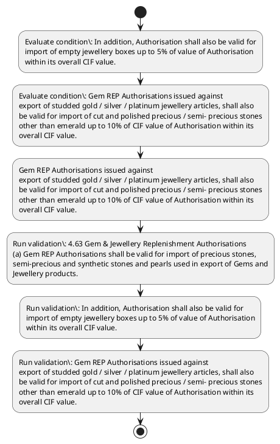

# Chapter 4 / Section 4.63: Gem & Jewellery Replenishment Authorisations

**Chapter Title:** Duty Exemption / Remission Schemes

**Pages:** 39

**Purpose:** 4.63 Gem & Jewellery Replenishment Authorisations
(a) Gem REP Authorisations shall be valid for import of precious stones,
semi-precious and synthetic stones and pearls used in export of Gems and
Jewellery products.

**Purpose Thanglish:** Indha Gem & Jewellery Replenishment Authorisations section-la, 4.63 Gem & Jewellery Replenishment Authorisations
(a) Gem REP Authorisations kandippa be valid for import of precious stones,
semi-precious and synthetic stones and pearls used in export of Gems and
Jewellery products.

**Summary:** 4.63 Gem & Jewellery Replenishment Authorisations
(a) Gem REP Authorisations shall be valid for import of precious stones,
semi-precious and synthetic stones and pearls used in export of Gems and
Jewellery products. In addition, Authorisation shall also be valid for
import of empty jewellery boxes up to 5% of value of Authorisation
within its overall CIF value. Gem REP Authorisations issued against
export of studded gold / silver / platinum jewellery articles, shall also
be valid for import of cut and polished precious / semi- precious stones
other than emerald up to 10% of CIF value of Authorisation within its
overall CIF value.

**Business Meaning:** Gem & Jewellery Replenishment Authorisations governs how DGFT business controls should be applied, validated, and enforced.

**Business Explanation:** Gem & Jewellery Replenishment Authorisations explains the operating rule set that DEKAI should enforce. Key control points include 4.63 Gem & Jewellery Replenishment Authorisations
(a) Gem REP Authorisations shall be valid for import of precious stones,
semi-precious and synthetic stones and pearls used in export of Gems and
Jewellery products. The section also drives actions such as Gem REP Authorisations issued against
export of studded gold / silver / platinum jewellery articles, shall also
be valid for import of cut and polished precious / semi- precious stones
other than emerald up to 10% of CIF value of Authorisation within its
overall CIF value..

**Business Explanation Thanglish:** Indha Gem & Jewellery Replenishment Authorisations section-la, Gem & Jewellery Replenishment Authorisations explains the operating rule set that DEKAI should enforce. Key control points include 4.63 Gem & Jewellery Replenishment Authorisations
(a) Gem REP Authorisations kandippa be valid for import of precious stones,
semi-precious and synthetic stones and pearls used in export of Gems and
Jewellery products. The section also drives actions such as Gem REP Authorisations issued against
export of studded gold / silver / platinum jewellery articles, kandippa also
be valid for import of cut and polished precious / semi- precious stones
other than emerald up to 10% of CIF value of Authorisation within its
overall CIF value..

## Business Logic
- 4.63 Gem & Jewellery Replenishment Authorisations
(a) Gem REP Authorisations shall be valid for import of precious stones,
semi-precious and synthetic stones and pearls used in export of Gems and
Jewellery products.
- In addition, Authorisation shall also be valid for
import of empty jewellery boxes up to 5% of value of Authorisation
within its overall CIF value.
- Gem REP Authorisations issued against
export of studded gold / silver / platinum jewellery articles, shall also
be valid for import of cut and polished precious / semi- precious stones
other than emerald up to 10% of CIF value of Authorisation within its
overall CIF value.
- (b) Gem REP Authorisation will be as per the replenishment rate prescribed
in Appendix 4F and the scale of replenishment on the remaining FOB
value in the case of studded jewellery shall be as given in Appendix-4G.
- 4.63 Gem & Jewellery Replenishment Authorisations
(a)
Gem REP Authorisations shall be valid for import of precious stones,
semi-precious and synthetic stones and pearls used in export of Gems and
Jewellery products.
- (b)
Gem REP Authorisation will be as per the replenishment rate prescribed
in Appendix 4F and the scale of replenishment on the remaining FOB
value in the case of studded jewellery shall be as given in Appendix-4G.

## Business Rules
- rule_id=CH4-SEC4_63-R001, rule_description=4.63 Gem & Jewellery Replenishment Authorisations
(a) Gem REP Authorisations shall be valid for import of precious stones,
semi-precious and synthetic stones and pearls used in export of Gems and
Jewellery products., trigger=Gem & Jewellery Replenishment Authorisations, condition=In addition, Authorisation shall also be valid for
import of empty jewellery boxes up to 5% of value of Authorisation
within its overall CIF value., validation=4.63 Gem & Jewellery Replenishment Authorisations
(a) Gem REP Authorisations shall be valid for import of precious stones,
semi-precious and synthetic stones and pearls used in export of Gems and
Jewellery products., action=Gem REP Authorisations issued against
export of studded gold / silver / platinum jewellery articles, shall also
be valid for import of cut and polished precious / semi- precious stones
other than emerald up to 10% of CIF value of Authorisation within its
overall CIF value., exception=No explicit exception found in uploaded documents., output=DEKAI should produce a compliance decision for 4.63 - Gem & Jewellery Replenishment Authorisations.
- rule_id=CH4-SEC4_63-R002, rule_description=In addition, Authorisation shall also be valid for
import of empty jewellery boxes up to 5% of value of Authorisation
within its overall CIF value., trigger=Gem & Jewellery Replenishment Authorisations, condition=Gem REP Authorisations issued against
export of studded gold / silver / platinum jewellery articles, shall also
be valid for import of cut and polished precious / semi- precious stones
other than emerald up to 10% of CIF value of Authorisation within its
overall CIF value., validation=In addition, Authorisation shall also be valid for
import of empty jewellery boxes up to 5% of value of Authorisation
within its overall CIF value., action=Gem REP Authorisations issued against
export of studded gold / silver / platinum jewellery articles, shall also
be valid for import of cut and polished precious / semi- precious stones
other than emerald up to 10% of CIF value of Authorisation within its
overall CIF value., exception=No explicit exception found in uploaded documents., output=DEKAI should produce a compliance decision for 4.63 - Gem & Jewellery Replenishment Authorisations.
- rule_id=CH4-SEC4_63-R003, rule_description=Gem REP Authorisations issued against
export of studded gold / silver / platinum jewellery articles, shall also
be valid for import of cut and polished precious / semi- precious stones
other than emerald up to 10% of CIF value of Authorisation within its
overall CIF value., trigger=Gem & Jewellery Replenishment Authorisations, condition=Gem REP Authorisations issued against
export of studded gold / silver / platinum jewellery articles, shall also
be valid for import of cut and polished precious / semi- precious stones
other than emerald up to 10% of CIF value of Authorisation within its
overall CIF value., validation=Gem REP Authorisations issued against
export of studded gold / silver / platinum jewellery articles, shall also
be valid for import of cut and polished precious / semi- precious stones
other than emerald up to 10% of CIF value of Authorisation within its
overall CIF value., action=Gem REP Authorisations issued against
export of studded gold / silver / platinum jewellery articles, shall also
be valid for import of cut and polished precious / semi- precious stones
other than emerald up to 10% of CIF value of Authorisation within its
overall CIF value., exception=No explicit exception found in uploaded documents., output=DEKAI should produce a compliance decision for 4.63 - Gem & Jewellery Replenishment Authorisations.
- rule_id=CH4-SEC4_63-R004, rule_description=(b) Gem REP Authorisation will be as per the replenishment rate prescribed
in Appendix 4F and the scale of replenishment on the remaining FOB
value in the case of studded jewellery shall be as given in Appendix-4G., trigger=Gem & Jewellery Replenishment Authorisations, condition=Gem REP Authorisations issued against
export of studded gold / silver / platinum jewellery articles, shall also
be valid for import of cut and polished precious / semi- precious stones
other than emerald up to 10% of CIF value of Authorisation within its
overall CIF value., validation=(b) Gem REP Authorisation will be as per the replenishment rate prescribed
in Appendix 4F and the scale of replenishment on the remaining FOB
value in the case of studded jewellery shall be as given in Appendix-4G., action=Gem REP Authorisations issued against
export of studded gold / silver / platinum jewellery articles, shall also
be valid for import of cut and polished precious / semi- precious stones
other than emerald up to 10% of CIF value of Authorisation within its
overall CIF value., exception=No explicit exception found in uploaded documents., output=DEKAI should produce a compliance decision for 4.63 - Gem & Jewellery Replenishment Authorisations.
- rule_id=CH4-SEC4_63-R005, rule_description=4.63 Gem & Jewellery Replenishment Authorisations
(a)
Gem REP Authorisations shall be valid for import of precious stones,
semi-precious and synthetic stones and pearls used in export of Gems and
Jewellery products., trigger=Gem & Jewellery Replenishment Authorisations, condition=Gem REP Authorisations issued against
export of studded gold / silver / platinum jewellery articles, shall also
be valid for import of cut and polished precious / semi- precious stones
other than emerald up to 10% of CIF value of Authorisation within its
overall CIF value., validation=4.63 Gem & Jewellery Replenishment Authorisations
(a)
Gem REP Authorisations shall be valid for import of precious stones,
semi-precious and synthetic stones and pearls used in export of Gems and
Jewellery products., action=Gem REP Authorisations issued against
export of studded gold / silver / platinum jewellery articles, shall also
be valid for import of cut and polished precious / semi- precious stones
other than emerald up to 10% of CIF value of Authorisation within its
overall CIF value., exception=No explicit exception found in uploaded documents., output=DEKAI should produce a compliance decision for 4.63 - Gem & Jewellery Replenishment Authorisations.
- rule_id=CH4-SEC4_63-R006, rule_description=(b)
Gem REP Authorisation will be as per the replenishment rate prescribed
in Appendix 4F and the scale of replenishment on the remaining FOB
value in the case of studded jewellery shall be as given in Appendix-4G., trigger=Gem & Jewellery Replenishment Authorisations, condition=Gem REP Authorisations issued against
export of studded gold / silver / platinum jewellery articles, shall also
be valid for import of cut and polished precious / semi- precious stones
other than emerald up to 10% of CIF value of Authorisation within its
overall CIF value., validation=(b)
Gem REP Authorisation will be as per the replenishment rate prescribed
in Appendix 4F and the scale of replenishment on the remaining FOB
value in the case of studded jewellery shall be as given in Appendix-4G., action=Gem REP Authorisations issued against
export of studded gold / silver / platinum jewellery articles, shall also
be valid for import of cut and polished precious / semi- precious stones
other than emerald up to 10% of CIF value of Authorisation within its
overall CIF value., exception=No explicit exception found in uploaded documents., output=DEKAI should produce a compliance decision for 4.63 - Gem & Jewellery Replenishment Authorisations.

## Conditions
- In addition, Authorisation shall also be valid for
import of empty jewellery boxes up to 5% of value of Authorisation
within its overall CIF value.
- Gem REP Authorisations issued against
export of studded gold / silver / platinum jewellery articles, shall also
be valid for import of cut and polished precious / semi- precious stones
other than emerald up to 10% of CIF value of Authorisation within its
overall CIF value.

## Condition Logic
- id=4.4.63.1, if=In addition, Authorisation shall also be valid for
import of empty jewellery boxes up to 5% of value of Authorisation
within its overall CIF value., then=Gem REP Authorisations issued against
export of studded gold / silver / platinum jewellery articles, shall also
be valid for import of cut and polished precious / semi- precious stones
other than emerald up to 10% of CIF value of Authorisation within its
overall CIF value., source=In addition, Authorisation shall also be valid for
import of empty jewellery boxes up to 5% of value of Authorisation
within its overall CIF value.
- id=4.4.63.2, if=Gem REP Authorisations issued against
export of studded gold / silver / platinum jewellery articles, shall also
be valid for import of cut and polished precious / semi- precious stones
other than emerald up to 10% of CIF value of Authorisation within its
overall CIF value., then=Gem REP Authorisations issued against
export of studded gold / silver / platinum jewellery articles, shall also
be valid for import of cut and polished precious / semi- precious stones
other than emerald up to 10% of CIF value of Authorisation within its
overall CIF value., source=Gem REP Authorisations issued against
export of studded gold / silver / platinum jewellery articles, shall also
be valid for import of cut and polished precious / semi- precious stones
other than emerald up to 10% of CIF value of Authorisation within its
overall CIF value.

## Validations
- 4.63 Gem & Jewellery Replenishment Authorisations
(a) Gem REP Authorisations shall be valid for import of precious stones,
semi-precious and synthetic stones and pearls used in export of Gems and
Jewellery products.
- In addition, Authorisation shall also be valid for
import of empty jewellery boxes up to 5% of value of Authorisation
within its overall CIF value.
- Gem REP Authorisations issued against
export of studded gold / silver / platinum jewellery articles, shall also
be valid for import of cut and polished precious / semi- precious stones
other than emerald up to 10% of CIF value of Authorisation within its
overall CIF value.
- (b) Gem REP Authorisation will be as per the replenishment rate prescribed
in Appendix 4F and the scale of replenishment on the remaining FOB
value in the case of studded jewellery shall be as given in Appendix-4G.
- 4.63 Gem & Jewellery Replenishment Authorisations
(a)
Gem REP Authorisations shall be valid for import of precious stones,
semi-precious and synthetic stones and pearls used in export of Gems and
Jewellery products.
- (b)
Gem REP Authorisation will be as per the replenishment rate prescribed
in Appendix 4F and the scale of replenishment on the remaining FOB
value in the case of studded jewellery shall be as given in Appendix-4G.

## Exceptions
- None identified

## Dependencies
- None identified

## Authorities
- None identified

## Required Documents
- None identified

## Timelines
- 4.63 Gem & Jewellery Replenishment Authorisations
(a) Gem REP Authorisations shall be valid for import of precious stones,
semi-precious and synthetic stones and pearls used in export of Gems and
Jewellery products.
- In addition, Authorisation shall also be valid for
import of empty jewellery boxes up to 5% of value of Authorisation
within its overall CIF value.
- Gem REP Authorisations issued against
export of studded gold / silver / platinum jewellery articles, shall also
be valid for import of cut and polished precious / semi- precious stones
other than emerald up to 10% of CIF value of Authorisation within its
overall CIF value.
- 4.63 Gem & Jewellery Replenishment Authorisations
(a)
Gem REP Authorisations shall be valid for import of precious stones,
semi-precious and synthetic stones and pearls used in export of Gems and
Jewellery products.

## Actions
- Gem REP Authorisations issued against
export of studded gold / silver / platinum jewellery articles, shall also
be valid for import of cut and polished precious / semi- precious stones
other than emerald up to 10% of CIF value of Authorisation within its
overall CIF value.

## Workflow
- Evaluate condition: In addition, Authorisation shall also be valid for
import of empty jewellery boxes up to 5% of value of Authorisation
within its overall CIF value.
- Evaluate condition: Gem REP Authorisations issued against
export of studded gold / silver / platinum jewellery articles, shall also
be valid for import of cut and polished precious / semi- precious stones
other than emerald up to 10% of CIF value of Authorisation within its
overall CIF value.
- Gem REP Authorisations issued against
export of studded gold / silver / platinum jewellery articles, shall also
be valid for import of cut and polished precious / semi- precious stones
other than emerald up to 10% of CIF value of Authorisation within its
overall CIF value.
- Run validation: 4.63 Gem & Jewellery Replenishment Authorisations
(a) Gem REP Authorisations shall be valid for import of precious stones,
semi-precious and synthetic stones and pearls used in export of Gems and
Jewellery products.
- Run validation: In addition, Authorisation shall also be valid for
import of empty jewellery boxes up to 5% of value of Authorisation
within its overall CIF value.
- Run validation: Gem REP Authorisations issued against
export of studded gold / silver / platinum jewellery articles, shall also
be valid for import of cut and polished precious / semi- precious stones
other than emerald up to 10% of CIF value of Authorisation within its
overall CIF value.

## Workflow ASCII
```text
Gem & Jewellery Replenishment Authorisations
Evaluate condition: In addition, Authorisation shall also be valid for
import of empty jewellery boxes up to 5% of value of Authorisation
within its overall CIF value.
   |
   v
Evaluate condition: Gem REP Authorisations issued against
export of studded gold / silver / platinum jewellery articles, shall also
be valid for import of cut and polished precious / semi- precious stones
other than emerald up to 10% of CIF value of Authorisation within its
overall CIF value.
   |
   v
Gem REP Authorisations issued against
export of studded gold / silver / platinum jewellery articles, shall also
be valid for import of cut and polished precious / semi- precious stones
other than emerald up to 10% of CIF value of Authorisation within its
overall CIF value.
   |
   v
Run validation: 4.63 Gem & Jewellery Replenishment Authorisations
(a) Gem REP Authorisations shall be valid for import of precious stones,
semi-precious and synthetic stones and pearls used in export of Gems and
Jewellery products.
   |
   v
Run validation: In addition, Authorisation shall also be valid for
import of empty jewellery boxes up to 5% of value of Authorisation
within its overall CIF value.
   |
   v
Run validation: Gem REP Authorisations issued against
export of studded gold / silver / platinum jewellery articles, shall also
be valid for import of cut and polished precious / semi- precious stones
other than emerald up to 10% of CIF value of Authorisation within its
overall CIF value.
```

## Decision Tree
- IF In addition, Authorisation shall also be valid for
import of empty jewellery boxes up to 5% of value of Authorisation
within its overall CIF value. THEN Gem REP Authorisations issued against
export of studded gold / silver / platinum jewellery articles, shall also
be valid for import of cut and polished precious / semi- precious stones
other than emerald up to 10% of CIF value of Authorisation within its
overall CIF value.
- IF Gem REP Authorisations issued against
export of studded gold / silver / platinum jewellery articles, shall also
be valid for import of cut and polished precious / semi- precious stones
other than emerald up to 10% of CIF value of Authorisation within its
overall CIF value. THEN Gem REP Authorisations issued against
export of studded gold / silver / platinum jewellery articles, shall also
be valid for import of cut and polished precious / semi- precious stones
other than emerald up to 10% of CIF value of Authorisation within its
overall CIF value.

## Decision Tree ASCII
```text
Gem & Jewellery Replenishment Authorisations Decision
IF In addition, Authorisation shall also be valid for
import of empty jewellery boxes up to 5% of value of Authorisation
within its overall CIF value. THEN Gem REP Authorisations issued against
export of studded gold / silver / platinum jewellery articles, shall also
be valid for import of cut and polished precious / semi- precious stones
other than emerald up to 10% of CIF value of Authorisation within its
overall CIF value.
   |
   v
IF Gem REP Authorisations issued against
export of studded gold / silver / platinum jewellery articles, shall also
be valid for import of cut and polished precious / semi- precious stones
other than emerald up to 10% of CIF value of Authorisation within its
overall CIF value. THEN Gem REP Authorisations issued against
export of studded gold / silver / platinum jewellery articles, shall also
be valid for import of cut and polished precious / semi- precious stones
other than emerald up to 10% of CIF value of Authorisation within its
overall CIF value.
```

## Examples
- User asks to process Gem & Jewellery Replenishment Authorisations; the platform checks conditions, validations, and documents before action.

**Real-world Example:** Example: an importer or exporter invokes Gem & Jewellery Replenishment Authorisations, submits the prescribed DGFT records, and DEKAI uses the extracted rules to gem rep authorisations issued against
export of studded gold / silver / platinum jewellery articles, shall also
be valid for import of cut and polished precious / semi- precious stones
other than emerald up to 10% of cif value of authorisation within its
overall cif value..

**Real-world Example Thanglish:** Indha Gem & Jewellery Replenishment Authorisations section-la, Example: an importer or exporter invokes Gem & Jewellery Replenishment Authorisations, submits the prescribed DGFT records, and DEKAI uses the extracted rules to gem rep authorisations issued against
export of studded gold / silver / platinum jewellery articles, kandippa also
be valid for import of cut and polished precious / semi- precious stones
other than emerald up to 10% of cif value of authorisation within its
overall cif value..

## AI Rules
- IF detected context matches section rule THEN enforce: 4.63 Gem & Jewellery Replenishment Authorisations
(a) Gem REP Authorisations shall be valid for import of precious stones,
semi-precious and synthetic stones and pearls used in export of Gems and
Jewellery products.
- IF detected context matches section rule THEN enforce: In addition, Authorisation shall also be valid for
import of empty jewellery boxes up to 5% of value of Authorisation
within its overall CIF value.
- IF detected context matches section rule THEN enforce: Gem REP Authorisations issued against
export of studded gold / silver / platinum jewellery articles, shall also
be valid for import of cut and polished precious / semi- precious stones
other than emerald up to 10% of CIF value of Authorisation within its
overall CIF value.
- IF detected context matches section rule THEN enforce: (b) Gem REP Authorisation will be as per the replenishment rate prescribed
in Appendix 4F and the scale of replenishment on the remaining FOB
value in the case of studded jewellery shall be as given in Appendix-4G.
- IF detected context matches section rule THEN enforce: 4.63 Gem & Jewellery Replenishment Authorisations
(a)
Gem REP Authorisations shall be valid for import of precious stones,
semi-precious and synthetic stones and pearls used in export of Gems and
Jewellery products.
- IF detected context matches section rule THEN enforce: (b)
Gem REP Authorisation will be as per the replenishment rate prescribed
in Appendix 4F and the scale of replenishment on the remaining FOB
value in the case of studded jewellery shall be as given in Appendix-4G.
- IF validations pass THEN recommend action: Gem REP Authorisations issued against
export of studded gold / silver / platinum jewellery articles, shall also
be valid for import of cut and polished precious / semi- precious stones
other than emerald up to 10% of CIF value of Authorisation within its
overall CIF value.

## Database Fields
- name=section_code, type=string, required=True, source=parsed_section_heading
- name=section_title, type=string, required=True, source=parsed_section_heading
- name=gem_flag, type=boolean, required=False, source=keyword:Gem
- name=rep_flag, type=boolean, required=False, source=keyword:REP
- name=for_flag, type=boolean, required=False, source=keyword:for
- name=and_flag, type=boolean, required=False, source=keyword:and
- name=its_flag, type=boolean, required=False, source=keyword:its
- name=cif_flag, type=boolean, required=False, source=keyword:CIF
- name=cut_flag, type=boolean, required=False, source=keyword:cut
- name=per_flag, type=boolean, required=False, source=keyword:per

## API Requirements
- method=GET, path=/api/dgft/sections/4.63, purpose=Retrieve knowledge payload for section 4.63, query_params=['include=workflow,decision_tree,validations'], response_fields=['section', 'title', 'summary', 'conditions', 'validations', 'exceptions', 'workflow', 'decision_tree']
- method=POST, path=/api/dgft/Gem-Jewellery-Replenishment-Authorisations/validate, purpose=Validate inputs and documents for Gem & Jewellery Replenishment Authorisations, request_fields=['section_code', 'section_title'], response_fields=['status', 'errors', 'warnings', 'next_actions']
- method=POST, path=/api/dgft/Gem-Jewellery-Replenishment-Authorisations/execute, purpose=Trigger business action for Gem REP Authorisations issued against
export of studded gold / silver / platinum jewellery articles, shall also
be valid for import of cut and polished precious / semi- precious stones
other than emerald up to 10% of CIF value of Authorisation within its
overall CIF value., request_fields=['section_code', 'section_title'], response_fields=['reference_id', 'status', 'authority', 'timeline']

## UI Screens
- screen_id=Gem_Jewellery_Replenishment_Authorisations_overview, name=Gem & Jewellery Replenishment Authorisations Overview, purpose=Show section summary, authority, timeline, and eligibility cues., widgets=['summary_card', 'conditions_table', 'authority_badges', 'timeline_panel']
- screen_id=Gem_Jewellery_Replenishment_Authorisations_submission, name=Gem & Jewellery Replenishment Authorisations Submission, purpose=Capture applicant data and supporting documents., widgets=['dynamic_form', 'document_uploader', 'validation_panel', 'next_action_footer'], fields=['section_code', 'section_title', 'gem_flag', 'rep_flag', 'for_flag', 'and_flag', 'its_flag', 'cif_flag']

## Error Messages
- Validation failed because the section requirements were not fully met.

## FAQ
- question_en=What is the purpose of section 4.63?, answer_en=Gem & Jewellery Replenishment Authorisations explains the operating rule set that DEKAI should enforce. Key control points include 4.63 Gem & Jewellery Replenishment Authorisations
(a) Gem REP Authorisations shall be valid for import of precious stones,
semi-precious and synthetic stones and pearls used in export of Gems and
Jewellery products. The section also drives actions such as Gem REP Authorisations issued against
export of studded gold / silver / platinum jewellery articles, shall also
be valid for import of cut and polished precious / semi- precious stones
other than emerald up to 10% of CIF value of Authorisation within its
overall CIF value.., question_thanglish=Indha Gem & Jewellery Replenishment Authorisations section-la, What is the purpose of section 4.63?, answer_thanglish=Indha Gem & Jewellery Replenishment Authorisations section-la, Gem & Jewellery Replenishment Authorisations explains the operating rule set that DEKAI should enforce. Key control points include 4.63 Gem & Jewellery Replenishment Authorisations
(a) Gem REP Authorisations kandippa be valid for import of precious stones,
semi-precious and synthetic stones and pearls used in export of Gems and
Jewellery products. The section also drives actions such as Gem REP Authorisations issued against
export of studded gold / silver / platinum jewellery articles, kandippa also
be valid for import of cut and polished precious / semi- precious stones
other than emerald up to 10% of CIF value of Authorisation within its
overall CIF value..
- question_en=What documents are required under Gem & Jewellery Replenishment Authorisations?, answer_en=Not explicitly covered in uploaded documents., question_thanglish=Indha Gem & Jewellery Replenishment Authorisations section-la, What documents are required under Gem & Jewellery Replenishment Authorisations?, answer_thanglish=Indha Gem & Jewellery Replenishment Authorisations section-la, Not explicitly covered in uploaded documents.
- question_en=Which authority handles Gem & Jewellery Replenishment Authorisations?, answer_en=Not explicitly covered in uploaded documents., question_thanglish=Indha Gem & Jewellery Replenishment Authorisations section-la, Which authority handles Gem & Jewellery Replenishment Authorisations?, answer_thanglish=Indha Gem & Jewellery Replenishment Authorisations section-la, Not explicitly covered in uploaded documents.

## Questions Users May Ask
- What does Gem & Jewellery Replenishment Authorisations require?
- Which documents are needed for Gem & Jewellery Replenishment Authorisations?
- How does DEKAI validate Gem & Jewellery Replenishment Authorisations requests?
- What action should be taken for Gem & Jewellery Replenishment Authorisations?

## Expected AI Answers
- Gem & Jewellery Replenishment Authorisations requires the platform to interpret the section text, apply the extracted business rules, and present the correct next action.
- Required documents are inferred from the section text: no explicit documents were detected.
- DEKAI validates Gem & Jewellery Replenishment Authorisations by checking conditions, required documents, authority references, and exception clauses before recommending an outcome.
- The primary extracted action is: Gem REP Authorisations issued against
export of studded gold / silver / platinum jewellery articles, shall also
be valid for import of cut and polished precious / semi- precious stones
other than emerald up to 10% of CIF value of Authorisation within its
overall CIF value.

## AI Q&A Examples
- question_en=User asks: How do I comply with Gem & Jewellery Replenishment Authorisations?, answer_en=AI answers: DEKAI should evaluate section 4.63, apply the extracted rules, and guide the user through Evaluate condition: In addition, Authorisation shall also be valid for
import of empty jewellery boxes up to 5% of value of Authorisation
within its overall CIF value.., question_thanglish=Indha Gem & Jewellery Replenishment Authorisations section-la, User asks: How do I comply with Gem & Jewellery Replenishment Authorisations?, answer_thanglish=Indha Gem & Jewellery Replenishment Authorisations section-la, AI answers: DEKAI should evaluate section 4.63, apply the extracted rules, and guide the user through Evaluate condition: In addition, Authorisation kandippa also be valid for
import of empty jewellery boxes up to 5% of value of Authorisation
within its overall CIF value..
- question_en=User asks: Which validations apply to Gem & Jewellery Replenishment Authorisations?, answer_en=AI answers: Applicable validations are 4.63 Gem & Jewellery Replenishment Authorisations
(a) Gem REP Authorisations shall be valid for import of precious stones,
semi-precious and synthetic stones and pearls used in export of Gems and
Jewellery products., In addition, Authorisation shall also be valid for
import of empty jewellery boxes up to 5% of value of Authorisation
within its overall CIF value., Gem REP Authorisations issued against
export of studded gold / silver / platinum jewellery articles, shall also
be valid for import of cut and polished precious / semi- precious stones
other than emerald up to 10% of CIF value of Authorisation within its
overall CIF value., question_thanglish=Indha Gem & Jewellery Replenishment Authorisations section-la, User asks: Which validations apply to Gem & Jewellery Replenishment Authorisations?, answer_thanglish=Indha Gem & Jewellery Replenishment Authorisations section-la, AI answers: Applicable validations are 4.63 Gem & Jewellery Replenishment Authorisations
(a) Gem REP Authorisations kandippa be valid for import of precious stones,
semi-precious and synthetic stones and pearls used in export of Gems and
Jewellery products., In addition, Authorisation kandippa also be valid for
import of empty jewellery boxes up to 5% of value of Authorisation
within its overall CIF value., Gem REP Authorisations issued against
export of studded gold / silver / platinum jewellery articles, kandippa also
be valid for import of cut and polished precious / semi- precious stones
other than emerald up to 10% of CIF value of Authorisation within its
overall CIF value.

## DEKAI AI Implementation Notes
- Capture chapter 4, section 4.63, title, and page references as immutable knowledge metadata.
- Bind validations for Gem & Jewellery Replenishment Authorisations into a rule engine keyed by the rule IDs extracted for this section.

## DEKAI AI Implementation Notes Thanglish
- Indha Gem & Jewellery Replenishment Authorisations section-la, Capture chapter 4, section 4.63, title, and page references as immutable knowledge metadata.
- Indha Gem & Jewellery Replenishment Authorisations section-la, Bind validations for Gem & Jewellery Replenishment Authorisations into a rule engine keyed by the rule IDs extracted for this section.

## AI Metadata
- Keywords: Gem, REP, for, and, its, CIF, cut, per, the, FOB, used, Gems, also, gold, semi, than, will, rate, case, shall
- Search Keywords: Gem, REP, for, and, its, CIF, cut, per, the, FOB, used, Gems, also, gold, semi, than, will, rate, case, shall
- Intent: Support Gem & Jewellery Replenishment Authorisations processing and compliance validation.
- Tags: 4.63, Gem & Jewellery Replenishment Authorisations, business-rule, dgft
- Related Sections: 
- Related Chapters: 
- Related Rules: 4.63 Gem & Jewellery Replenishment Authorisations
(a) Gem REP Authorisations shall be valid for import of precious stones,
semi-precious and synthetic stones and pearls used in export of Gems and
Jewellery products., In addition, Authorisation shall also be valid for
import of empty jewellery boxes up to 5% of value of Authorisation
within its overall CIF value., Gem REP Authorisations issued against
export of studded gold / silver / platinum jewellery articles, shall also
be valid for import of cut and polished precious / semi- precious stones
other than emerald up to 10% of CIF value of Authorisation within its
overall CIF value., (b) Gem REP Authorisation will be as per the replenishment rate prescribed
in Appendix 4F and the scale of replenishment on the remaining FOB
value in the case of studded jewellery shall be as given in Appendix-4G., 4.63 Gem & Jewellery Replenishment Authorisations
(a)
Gem REP Authorisations shall be valid for import of precious stones,
semi-precious and synthetic stones and pearls used in export of Gems and
Jewellery products.

## Mermaid

```mermaid
flowchart TD
    S1["Evaluate condition: In addition, Authorisation shall also be valid for
import of empty jewellery boxes up to 5% of value of Authorisation
within its overall CIF value."]
    S2["Evaluate condition: Gem REP Authorisations issued against
export of studded gold / silver / platinum jewellery articles, shall also
be valid for import of cut and polished precious / semi- precious stones
other than emerald up to 10% of CIF value of Authorisation within its
overall CIF value."]
    S1 --> S2
    S3["Gem REP Authorisations issued against
export of studded gold / silver / platinum jewellery articles, shall also
be valid for import of cut and polished precious / semi- precious stones
other than emerald up to 10% of CIF value of Authorisation within its
overall CIF value."]
    S2 --> S3
    S4["Run validation: 4.63 Gem & Jewellery Replenishment Authorisations
(a) Gem REP Authorisations shall be valid for import of precious stones,
semi-precious and synthetic stones and pearls used in export of Gems and
Jewellery products."]
    S3 --> S4
    S5["Run validation: In addition, Authorisation shall also be valid for
import of empty jewellery boxes up to 5% of value of Authorisation
within its overall CIF value."]
    S4 --> S5
    S6["Run validation: Gem REP Authorisations issued against
export of studded gold / silver / platinum jewellery articles, shall also
be valid for import of cut and polished precious / semi- precious stones
other than emerald up to 10% of CIF value of Authorisation within its
overall CIF value."]
    S5 --> S6
```


## PlantUML

