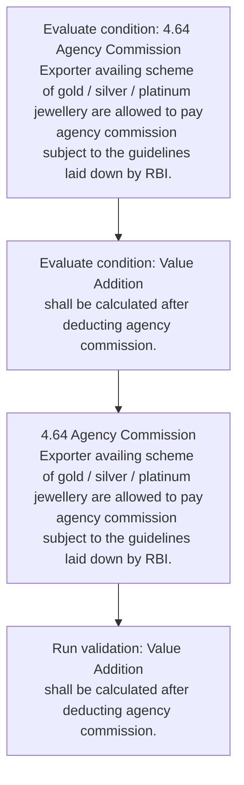
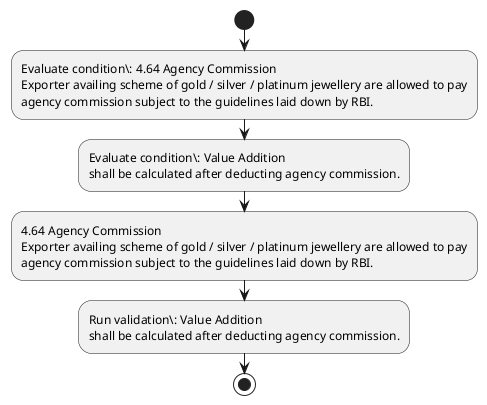

# Chapter 4 / Section 4.64: Agency Commission

**Chapter Title:** Duty Exemption / Remission Schemes

**Pages:** 39

**Purpose:** 4.64 Agency Commission
Exporter availing scheme of gold / silver / platinum jewellery are allowed to pay
agency commission subject to the guidelines laid down by RBI.

**Purpose Thanglish:** Indha Agency Commission section-la, 4.64 Agency Commission
Exporter availing scheme of gold / silver / platinum jewellery are allowed to pay
agency commission subject to the guidelines laid down by RBI.

**Summary:** 4.64 Agency Commission
Exporter availing scheme of gold / silver / platinum jewellery are allowed to pay
agency commission subject to the guidelines laid down by RBI. Value Addition
shall be calculated after deducting agency commission.

**Business Meaning:** Agency Commission governs how DGFT business controls should be applied, validated, and enforced.

**Business Explanation:** Agency Commission explains the operating rule set that DEKAI should enforce. Key control points include 4.64 Agency Commission
Exporter availing scheme of gold / silver / platinum jewellery are allowed to pay
agency commission subject to the guidelines laid down by RBI. The section also drives actions such as 4.64 Agency Commission
Exporter availing scheme of gold / silver / platinum jewellery are allowed to pay
agency commission subject to the guidelines laid down by RBI..

**Business Explanation Thanglish:** Indha Agency Commission section-la, Agency Commission explains the operating rule set that DEKAI should enforce. Key control points include 4.64 Agency Commission
Exporter availing scheme of gold / silver / platinum jewellery are allowed to pay
agency commission subject to the guidelines laid down by RBI. The section also drives actions such as 4.64 Agency Commission
Exporter availing scheme of gold / silver / platinum jewellery are allowed to pay
agency commission subject to the guidelines laid down by RBI..

## Business Logic
- 4.64 Agency Commission
Exporter availing scheme of gold / silver / platinum jewellery are allowed to pay
agency commission subject to the guidelines laid down by RBI.
- Value Addition
shall be calculated after deducting agency commission.

## Business Rules
- rule_id=CH4-SEC4_64-R001, rule_description=4.64 Agency Commission
Exporter availing scheme of gold / silver / platinum jewellery are allowed to pay
agency commission subject to the guidelines laid down by RBI., trigger=Agency Commission, condition=4.64 Agency Commission
Exporter availing scheme of gold / silver / platinum jewellery are allowed to pay
agency commission subject to the guidelines laid down by RBI., validation=Value Addition
shall be calculated after deducting agency commission., action=4.64 Agency Commission
Exporter availing scheme of gold / silver / platinum jewellery are allowed to pay
agency commission subject to the guidelines laid down by RBI., exception=No explicit exception found in uploaded documents., output=DEKAI should produce a compliance decision for 4.64 - Agency Commission.
- rule_id=CH4-SEC4_64-R002, rule_description=Value Addition
shall be calculated after deducting agency commission., trigger=Agency Commission, condition=Value Addition
shall be calculated after deducting agency commission., validation=Value Addition
shall be calculated after deducting agency commission., action=4.64 Agency Commission
Exporter availing scheme of gold / silver / platinum jewellery are allowed to pay
agency commission subject to the guidelines laid down by RBI., exception=No explicit exception found in uploaded documents., output=DEKAI should produce a compliance decision for 4.64 - Agency Commission.

## Conditions
- 4.64 Agency Commission
Exporter availing scheme of gold / silver / platinum jewellery are allowed to pay
agency commission subject to the guidelines laid down by RBI.
- Value Addition
shall be calculated after deducting agency commission.

## Condition Logic
- id=4.4.64.1, if=4.64 Agency Commission
Exporter availing scheme of gold / silver / platinum jewellery are allowed to pay
agency commission subject to the guidelines laid down by RBI., then=4.64 Agency Commission
Exporter availing scheme of gold / silver / platinum jewellery are allowed to pay
agency commission subject to the guidelines laid down by RBI., source=4.64 Agency Commission
Exporter availing scheme of gold / silver / platinum jewellery are allowed to pay
agency commission subject to the guidelines laid down by RBI.
- id=4.4.64.2, if=Value Addition
shall be calculated after deducting agency commission., then=4.64 Agency Commission
Exporter availing scheme of gold / silver / platinum jewellery are allowed to pay
agency commission subject to the guidelines laid down by RBI., source=Value Addition
shall be calculated after deducting agency commission.

## Validations
- Value Addition
shall be calculated after deducting agency commission.

## Exceptions
- None identified

## Dependencies
- 4
- 6

## Authorities
- None identified

## Required Documents
- None identified

## Timelines
- Value Addition
shall be calculated after deducting agency commission.

## Actions
- 4.64 Agency Commission
Exporter availing scheme of gold / silver / platinum jewellery are allowed to pay
agency commission subject to the guidelines laid down by RBI.

## Workflow
- Evaluate condition: 4.64 Agency Commission
Exporter availing scheme of gold / silver / platinum jewellery are allowed to pay
agency commission subject to the guidelines laid down by RBI.
- Evaluate condition: Value Addition
shall be calculated after deducting agency commission.
- 4.64 Agency Commission
Exporter availing scheme of gold / silver / platinum jewellery are allowed to pay
agency commission subject to the guidelines laid down by RBI.
- Run validation: Value Addition
shall be calculated after deducting agency commission.

## Workflow ASCII
```text
Agency Commission
Evaluate condition: 4.64 Agency Commission
Exporter availing scheme of gold / silver / platinum jewellery are allowed to pay
agency commission subject to the guidelines laid down by RBI.
   |
   v
Evaluate condition: Value Addition
shall be calculated after deducting agency commission.
   |
   v
4.64 Agency Commission
Exporter availing scheme of gold / silver / platinum jewellery are allowed to pay
agency commission subject to the guidelines laid down by RBI.
   |
   v
Run validation: Value Addition
shall be calculated after deducting agency commission.
```

## Decision Tree
- IF 4.64 Agency Commission
Exporter availing scheme of gold / silver / platinum jewellery are allowed to pay
agency commission subject to the guidelines laid down by RBI. THEN 4.64 Agency Commission
Exporter availing scheme of gold / silver / platinum jewellery are allowed to pay
agency commission subject to the guidelines laid down by RBI.
- IF Value Addition
shall be calculated after deducting agency commission. THEN 4.64 Agency Commission
Exporter availing scheme of gold / silver / platinum jewellery are allowed to pay
agency commission subject to the guidelines laid down by RBI.

## Decision Tree ASCII
```text
Agency Commission Decision
IF 4.64 Agency Commission
Exporter availing scheme of gold / silver / platinum jewellery are allowed to pay
agency commission subject to the guidelines laid down by RBI. THEN 4.64 Agency Commission
Exporter availing scheme of gold / silver / platinum jewellery are allowed to pay
agency commission subject to the guidelines laid down by RBI.
   |
   v
IF Value Addition
shall be calculated after deducting agency commission. THEN 4.64 Agency Commission
Exporter availing scheme of gold / silver / platinum jewellery are allowed to pay
agency commission subject to the guidelines laid down by RBI.
```

## Examples
- User asks to process Agency Commission; the platform checks conditions, validations, and documents before action.

**Real-world Example:** Example: an importer or exporter invokes Agency Commission, submits the prescribed DGFT records, and DEKAI uses the extracted rules to 4.64 agency commission
exporter availing scheme of gold / silver / platinum jewellery are allowed to pay
agency commission subject to the guidelines laid down by rbi..

**Real-world Example Thanglish:** Indha Agency Commission section-la, Example: an importer or exporter invokes Agency Commission, submits the prescribed DGFT records, and DEKAI uses the extracted rules to 4.64 agency commission
exporter availing scheme of gold / silver / platinum jewellery are allowed to pay
agency commission subject to the guidelines laid down by rbi..

## AI Rules
- IF detected context matches section rule THEN enforce: 4.64 Agency Commission
Exporter availing scheme of gold / silver / platinum jewellery are allowed to pay
agency commission subject to the guidelines laid down by RBI.
- IF detected context matches section rule THEN enforce: Value Addition
shall be calculated after deducting agency commission.
- IF validations pass THEN recommend action: 4.64 Agency Commission
Exporter availing scheme of gold / silver / platinum jewellery are allowed to pay
agency commission subject to the guidelines laid down by RBI.

## Database Fields
- name=section_code, type=string, required=True, source=parsed_section_heading
- name=section_title, type=string, required=True, source=parsed_section_heading
- name=are_flag, type=boolean, required=False, source=keyword:are
- name=pay_flag, type=boolean, required=False, source=keyword:pay
- name=the_flag, type=boolean, required=False, source=keyword:the
- name=rbi_flag, type=boolean, required=False, source=keyword:RBI
- name=gold_flag, type=boolean, required=False, source=keyword:gold
- name=laid_flag, type=boolean, required=False, source=keyword:laid
- name=down_flag, type=boolean, required=False, source=keyword:down
- name=value_flag, type=boolean, required=False, source=keyword:Value

## API Requirements
- method=GET, path=/api/dgft/sections/4.64, purpose=Retrieve knowledge payload for section 4.64, query_params=['include=workflow,decision_tree,validations'], response_fields=['section', 'title', 'summary', 'conditions', 'validations', 'exceptions', 'workflow', 'decision_tree']
- method=POST, path=/api/dgft/Agency-Commission/validate, purpose=Validate inputs and documents for Agency Commission, request_fields=['section_code', 'section_title'], response_fields=['status', 'errors', 'warnings', 'next_actions']
- method=POST, path=/api/dgft/Agency-Commission/execute, purpose=Trigger business action for 4.64 Agency Commission
Exporter availing scheme of gold / silver / platinum jewellery are allowed to pay
agency commission subject to the guidelines laid down by RBI., request_fields=['section_code', 'section_title'], response_fields=['reference_id', 'status', 'authority', 'timeline']

## UI Screens
- screen_id=Agency_Commission_overview, name=Agency Commission Overview, purpose=Show section summary, authority, timeline, and eligibility cues., widgets=['summary_card', 'conditions_table', 'authority_badges', 'timeline_panel']
- screen_id=Agency_Commission_submission, name=Agency Commission Submission, purpose=Capture applicant data and supporting documents., widgets=['dynamic_form', 'document_uploader', 'validation_panel', 'next_action_footer'], fields=['section_code', 'section_title', 'are_flag', 'pay_flag', 'the_flag', 'rbi_flag', 'gold_flag', 'laid_flag']

## Error Messages
- Validation failed because the section requirements were not fully met.

## FAQ
- question_en=What is the purpose of section 4.64?, answer_en=Agency Commission explains the operating rule set that DEKAI should enforce. Key control points include 4.64 Agency Commission
Exporter availing scheme of gold / silver / platinum jewellery are allowed to pay
agency commission subject to the guidelines laid down by RBI. The section also drives actions such as 4.64 Agency Commission
Exporter availing scheme of gold / silver / platinum jewellery are allowed to pay
agency commission subject to the guidelines laid down by RBI.., question_thanglish=Indha Agency Commission section-la, What is the purpose of section 4.64?, answer_thanglish=Indha Agency Commission section-la, Agency Commission explains the operating rule set that DEKAI should enforce. Key control points include 4.64 Agency Commission
Exporter availing scheme of gold / silver / platinum jewellery are allowed to pay
agency commission subject to the guidelines laid down by RBI. The section also drives actions such as 4.64 Agency Commission
Exporter availing scheme of gold / silver / platinum jewellery are allowed to pay
agency commission subject to the guidelines laid down by RBI..
- question_en=What documents are required under Agency Commission?, answer_en=Not explicitly covered in uploaded documents., question_thanglish=Indha Agency Commission section-la, What documents are required under Agency Commission?, answer_thanglish=Indha Agency Commission section-la, Not explicitly covered in uploaded documents.
- question_en=Which authority handles Agency Commission?, answer_en=Not explicitly covered in uploaded documents., question_thanglish=Indha Agency Commission section-la, Which authority handles Agency Commission?, answer_thanglish=Indha Agency Commission section-la, Not explicitly covered in uploaded documents.

## Questions Users May Ask
- What does Agency Commission require?
- Which documents are needed for Agency Commission?
- How does DEKAI validate Agency Commission requests?
- What action should be taken for Agency Commission?

## Expected AI Answers
- Agency Commission requires the platform to interpret the section text, apply the extracted business rules, and present the correct next action.
- Required documents are inferred from the section text: no explicit documents were detected.
- DEKAI validates Agency Commission by checking conditions, required documents, authority references, and exception clauses before recommending an outcome.
- The primary extracted action is: 4.64 Agency Commission
Exporter availing scheme of gold / silver / platinum jewellery are allowed to pay
agency commission subject to the guidelines laid down by RBI.

## AI Q&A Examples
- question_en=User asks: How do I comply with Agency Commission?, answer_en=AI answers: DEKAI should evaluate section 4.64, apply the extracted rules, and guide the user through Evaluate condition: 4.64 Agency Commission
Exporter availing scheme of gold / silver / platinum jewellery are allowed to pay
agency commission subject to the guidelines laid down by RBI.., question_thanglish=Indha Agency Commission section-la, User asks: How do I comply with Agency Commission?, answer_thanglish=Indha Agency Commission section-la, AI answers: DEKAI should evaluate section 4.64, apply the extracted rules, and guide the user through Evaluate condition: 4.64 Agency Commission
Exporter availing scheme of gold / silver / platinum jewellery are allowed to pay
agency commission subject to the guidelines laid down by RBI..
- question_en=User asks: Which validations apply to Agency Commission?, answer_en=AI answers: Applicable validations are Value Addition
shall be calculated after deducting agency commission., question_thanglish=Indha Agency Commission section-la, User asks: Which validations apply to Agency Commission?, answer_thanglish=Indha Agency Commission section-la, AI answers: Applicable validations are Value Addition
kandippa be calculated after deducting agency commission.

## DEKAI AI Implementation Notes
- Capture chapter 4, section 4.64, title, and page references as immutable knowledge metadata.
- Bind validations for Agency Commission into a rule engine keyed by the rule IDs extracted for this section.
- Show contextual links to related sections: 4, 6.

## DEKAI AI Implementation Notes Thanglish
- Indha Agency Commission section-la, Capture chapter 4, section 4.64, title, and page references as immutable knowledge metadata.
- Indha Agency Commission section-la, Bind validations for Agency Commission into a rule engine keyed by the rule IDs extracted for this section.
- Indha Agency Commission section-la, Show contextual links to related sections: 4, 6.

## AI Metadata
- Keywords: are, pay, the, RBI, gold, laid, down, Value, shall, after, Agency, scheme, silver, allowed, subject, Exporter, availing, platinum, Addition, jewellery
- Search Keywords: are, pay, the, RBI, gold, laid, down, Value, shall, after, Agency, scheme, silver, allowed, subject, Exporter, availing, platinum, Addition, jewellery
- Intent: Support Agency Commission processing and compliance validation.
- Tags: 4.64, Agency Commission, business-rule, dgft
- Related Sections: 4, 6
- Related Chapters: 
- Related Rules: 4.64 Agency Commission
Exporter availing scheme of gold / silver / platinum jewellery are allowed to pay
agency commission subject to the guidelines laid down by RBI., Value Addition
shall be calculated after deducting agency commission.

## Mermaid


## PlantUML

