# Chapter 4 / Section 4.65: Endorsement on Shipping Bill and Invoice

**Chapter Title:** Duty Exemption / Remission Schemes

**Pages:** 39, 40

**Purpose:** 4.65 Endorsement on Shipping Bill and Invoice
During export of jewellery, shipping bill and invoice presented to customs
authorities shall contain description of item, its purity, weight of gold/ silver/
platinum content, wastage claimed thereon, total weight of gold/ silver/
platinum content plus wastage claimed and its equivalent quantity in terms of
0.995/0.999 fineness for gold / silver and in terms of 0.9999 fineness for
platinum and its value, FOB value of exports and value addition achieved.

**Purpose Thanglish:** Indha Endorsement on Shipping Bill and Invoice section-la, 4.65 Endorsement on Shipping Bill and Invoice
During export of jewellery, shipping bill and invoice presented to customs
authorities kandippa contain description of item, its purity, weight of gold/ silver/
platinum content, wastage claimed thereon, total weight of gold/ silver/
platinum content plus wastage claimed and its equivalent quantity in terms of
0.995/0.999 fineness for gold / silver and in terms of 0.9999 fineness for
platinum and its value, FOB value of exports and value addition achieved.

**Summary:** 4.65 Endorsement on Shipping Bill and Invoice
During export of jewellery, shipping bill and invoice presented to customs
authorities shall contain description of item, its purity, weight of gold/ silver/
platinum content, wastage claimed thereon, total weight of gold/ silver/
platinum content plus wastage claimed and its equivalent quantity in terms of
0.995/0.999 fineness for gold / silver and in terms of 0.9999 fineness for
platinum and its value, FOB value of exports and value addition achieved. If
pg. 114
pg.

**Business Meaning:** Endorsement on Shipping Bill and Invoice governs how DGFT business controls should be applied, validated, and enforced.

**Business Explanation:** Endorsement on Shipping Bill and Invoice explains the operating rule set that DEKAI should enforce. Key control points include 4.65 Endorsement on Shipping Bill and Invoice
During export of jewellery, shipping bill and invoice presented to customs
authorities shall contain description of item, its purity, weight of gold/ silver/
platinum content, wastage claimed thereon, total weight of gold/ silver/
platinum content plus wastage claimed and its equivalent quantity in terms of
0.995/0.999 fineness for gold / silver and in terms of 0.9999 fineness for
platinum and its value, FOB value of exports and value addition achieved.

**Business Explanation Thanglish:** Indha Endorsement on Shipping Bill and Invoice section-la, Endorsement on Shipping Bill and Invoice explains the operating rule set that DEKAI should enforce. Key control points include 4.65 Endorsement on Shipping Bill and Invoice
During export of jewellery, shipping bill and invoice presented to customs
authorities kandippa contain description of item, its purity, weight of gold/ silver/
platinum content, wastage claimed thereon, total weight of gold/ silver/
platinum content plus wastage claimed and its equivalent quantity in terms of
0.995/0.999 fineness for gold / silver and in terms of 0.9999 fineness for
platinum and its value, FOB value of exports and value addition achieved.

## Business Logic
- 4.65 Endorsement on Shipping Bill and Invoice
During export of jewellery, shipping bill and invoice presented to customs
authorities shall contain description of item, its purity, weight of gold/ silver/
platinum content, wastage claimed thereon, total weight of gold/ silver/
platinum content plus wastage claimed and its equivalent quantity in terms of
0.995/0.999 fineness for gold / silver and in terms of 0.9999 fineness for
platinum and its value, FOB value of exports and value addition achieved.
- 114
4.65 Endorsement on Shipping Bill and Invoice
During export of jewellery, shipping bill and invoice presented to customs
authorities shall contain description of item, its purity, weight of gold/ silver/
platinum content, wastage claimed thereon, total weight of gold/ silver/
platinum content plus wastage claimed and its equivalent quantity in terms of
0.995/0.999 fineness for gold / silver and in terms of 0.9999 fineness for
platinum and its value, FOB value of exports and value addition achieved.
- In case of studded items, shipping bill shall also contain description,
weight and value of precious / semi-precious stones / diamonds / pearls used in
manufacture and weight / value of any other precious metal used for alloying
gold/silver.

## Business Rules
- rule_id=CH4-SEC4_65-R001, rule_description=4.65 Endorsement on Shipping Bill and Invoice
During export of jewellery, shipping bill and invoice presented to customs
authorities shall contain description of item, its purity, weight of gold/ silver/
platinum content, wastage claimed thereon, total weight of gold/ silver/
platinum content plus wastage claimed and its equivalent quantity in terms of
0.995/0.999 fineness for gold / silver and in terms of 0.9999 fineness for
platinum and its value, FOB value of exports and value addition achieved., trigger=Endorsement on Shipping Bill and Invoice, condition=If
pg., validation=4.65 Endorsement on Shipping Bill and Invoice
During export of jewellery, shipping bill and invoice presented to customs
authorities shall contain description of item, its purity, weight of gold/ silver/
platinum content, wastage claimed thereon, total weight of gold/ silver/
platinum content plus wastage claimed and its equivalent quantity in terms of
0.995/0.999 fineness for gold / silver and in terms of 0.9999 fineness for
platinum and its value, FOB value of exports and value addition achieved., action=Manual review required., exception=No explicit exception found in uploaded documents., output=DEKAI should produce a compliance decision for 4.65 - Endorsement on Shipping Bill and Invoice.
- rule_id=CH4-SEC4_65-R002, rule_description=114
4.65 Endorsement on Shipping Bill and Invoice
During export of jewellery, shipping bill and invoice presented to customs
authorities shall contain description of item, its purity, weight of gold/ silver/
platinum content, wastage claimed thereon, total weight of gold/ silver/
platinum content plus wastage claimed and its equivalent quantity in terms of
0.995/0.999 fineness for gold / silver and in terms of 0.9999 fineness for
platinum and its value, FOB value of exports and value addition achieved., trigger=Endorsement on Shipping Bill and Invoice, condition=If
purity of gold/silver/platinum used is same in respect of all or some of items
made out from each of these metals for export, exporter may give total weight of
gold/silver/platinum and other details of such similar items which are of same
purity., validation=114
4.65 Endorsement on Shipping Bill and Invoice
During export of jewellery, shipping bill and invoice presented to customs
authorities shall contain description of item, its purity, weight of gold/ silver/
platinum content, wastage claimed thereon, total weight of gold/ silver/
platinum content plus wastage claimed and its equivalent quantity in terms of
0.995/0.999 fineness for gold / silver and in terms of 0.9999 fineness for
platinum and its value, FOB value of exports and value addition achieved., action=Manual review required., exception=No explicit exception found in uploaded documents., output=DEKAI should produce a compliance decision for 4.65 - Endorsement on Shipping Bill and Invoice.
- rule_id=CH4-SEC4_65-R003, rule_description=In case of studded items, shipping bill shall also contain description,
weight and value of precious / semi-precious stones / diamonds / pearls used in
manufacture and weight / value of any other precious metal used for alloying
gold/silver., trigger=Endorsement on Shipping Bill and Invoice, condition=In case of studded items, shipping bill shall also contain description,
weight and value of precious / semi-precious stones / diamonds / pearls used in
manufacture and weight / value of any other precious metal used for alloying
gold/silver., validation=In case of studded items, shipping bill shall also contain description,
weight and value of precious / semi-precious stones / diamonds / pearls used in
manufacture and weight / value of any other precious metal used for alloying
gold/silver., action=Manual review required., exception=No explicit exception found in uploaded documents., output=DEKAI should produce a compliance decision for 4.65 - Endorsement on Shipping Bill and Invoice.

## Conditions
- If
pg.
- If
purity of gold/silver/platinum used is same in respect of all or some of items
made out from each of these metals for export, exporter may give total weight of
gold/silver/platinum and other details of such similar items which are of same
purity.
- In case of studded items, shipping bill shall also contain description,
weight and value of precious / semi-precious stones / diamonds / pearls used in
manufacture and weight / value of any other precious metal used for alloying
gold/silver.

## Condition Logic
- id=4.4.65.1, if=If
pg., then=Route for review, source=If
pg.
- id=4.4.65.2, if=If
purity of gold/silver/platinum used is same in respect of all or some of items
made out from each of these metals for export, exporter may give total weight of
gold/silver/platinum and other details of such similar items which are of same
purity., then=Route for review, source=If
purity of gold/silver/platinum used is same in respect of all or some of items
made out from each of these metals for export, exporter may give total weight of
gold/silver/platinum and other details of such similar items which are of same
purity.
- id=4.4.65.3, if=In case of studded items, shipping bill shall also contain description,
weight and value of precious / semi-precious stones / diamonds / pearls used in
manufacture and weight / value of any other precious metal used for alloying
gold/silver., then=Route for review, source=In case of studded items, shipping bill shall also contain description,
weight and value of precious / semi-precious stones / diamonds / pearls used in
manufacture and weight / value of any other precious metal used for alloying
gold/silver.

## Validations
- 4.65 Endorsement on Shipping Bill and Invoice
During export of jewellery, shipping bill and invoice presented to customs
authorities shall contain description of item, its purity, weight of gold/ silver/
platinum content, wastage claimed thereon, total weight of gold/ silver/
platinum content plus wastage claimed and its equivalent quantity in terms of
0.995/0.999 fineness for gold / silver and in terms of 0.9999 fineness for
platinum and its value, FOB value of exports and value addition achieved.
- 114
4.65 Endorsement on Shipping Bill and Invoice
During export of jewellery, shipping bill and invoice presented to customs
authorities shall contain description of item, its purity, weight of gold/ silver/
platinum content, wastage claimed thereon, total weight of gold/ silver/
platinum content plus wastage claimed and its equivalent quantity in terms of
0.995/0.999 fineness for gold / silver and in terms of 0.9999 fineness for
platinum and its value, FOB value of exports and value addition achieved.
- In case of studded items, shipping bill shall also contain description,
weight and value of precious / semi-precious stones / diamonds / pearls used in
manufacture and weight / value of any other precious metal used for alloying
gold/silver.

## Exceptions
- None identified

## Dependencies
- None identified

## Authorities
- customs

## Required Documents
- Endorsement on Shipping Bill and Invoice
- In case of studded items, shipping bill shall also contain description,
weight and value of precious / semi-precious stones / diamonds / pearls used in
manufacture and weight / value of any other precious metal used for alloying
gold/silver.

## Timelines
- None identified

## Actions
- None identified

## Workflow
- Evaluate condition: If
pg.
- Evaluate condition: If
purity of gold/silver/platinum used is same in respect of all or some of items
made out from each of these metals for export, exporter may give total weight of
gold/silver/platinum and other details of such similar items which are of same
purity.
- Evaluate condition: In case of studded items, shipping bill shall also contain description,
weight and value of precious / semi-precious stones / diamonds / pearls used in
manufacture and weight / value of any other precious metal used for alloying
gold/silver.
- Run validation: 4.65 Endorsement on Shipping Bill and Invoice
During export of jewellery, shipping bill and invoice presented to customs
authorities shall contain description of item, its purity, weight of gold/ silver/
platinum content, wastage claimed thereon, total weight of gold/ silver/
platinum content plus wastage claimed and its equivalent quantity in terms of
0.995/0.999 fineness for gold / silver and in terms of 0.9999 fineness for
platinum and its value, FOB value of exports and value addition achieved.
- Run validation: 114
4.65 Endorsement on Shipping Bill and Invoice
During export of jewellery, shipping bill and invoice presented to customs
authorities shall contain description of item, its purity, weight of gold/ silver/
platinum content, wastage claimed thereon, total weight of gold/ silver/
platinum content plus wastage claimed and its equivalent quantity in terms of
0.995/0.999 fineness for gold / silver and in terms of 0.9999 fineness for
platinum and its value, FOB value of exports and value addition achieved.
- Run validation: In case of studded items, shipping bill shall also contain description,
weight and value of precious / semi-precious stones / diamonds / pearls used in
manufacture and weight / value of any other precious metal used for alloying
gold/silver.

## Workflow ASCII
```text
Endorsement on Shipping Bill and Invoice
Evaluate condition: If
pg.
   |
   v
Evaluate condition: If
purity of gold/silver/platinum used is same in respect of all or some of items
made out from each of these metals for export, exporter may give total weight of
gold/silver/platinum and other details of such similar items which are of same
purity.
   |
   v
Evaluate condition: In case of studded items, shipping bill shall also contain description,
weight and value of precious / semi-precious stones / diamonds / pearls used in
manufacture and weight / value of any other precious metal used for alloying
gold/silver.
   |
   v
Run validation: 4.65 Endorsement on Shipping Bill and Invoice
During export of jewellery, shipping bill and invoice presented to customs
authorities shall contain description of item, its purity, weight of gold/ silver/
platinum content, wastage claimed thereon, total weight of gold/ silver/
platinum content plus wastage claimed and its equivalent quantity in terms of
0.995/0.999 fineness for gold / silver and in terms of 0.9999 fineness for
platinum and its value, FOB value of exports and value addition achieved.
   |
   v
Run validation: 114
4.65 Endorsement on Shipping Bill and Invoice
During export of jewellery, shipping bill and invoice presented to customs
authorities shall contain description of item, its purity, weight of gold/ silver/
platinum content, wastage claimed thereon, total weight of gold/ silver/
platinum content plus wastage claimed and its equivalent quantity in terms of
0.995/0.999 fineness for gold / silver and in terms of 0.9999 fineness for
platinum and its value, FOB value of exports and value addition achieved.
   |
   v
Run validation: In case of studded items, shipping bill shall also contain description,
weight and value of precious / semi-precious stones / diamonds / pearls used in
manufacture and weight / value of any other precious metal used for alloying
gold/silver.
```

## Decision Tree
- IF section 4.65 applies THEN proceed with standard DGFT workflow

## Decision Tree ASCII
```text
Endorsement on Shipping Bill and Invoice Decision
IF section 4.65 applies THEN proceed with standard DGFT workflow
```

## Examples
- User asks to process Endorsement on Shipping Bill and Invoice; the platform checks conditions, validations, and documents before action.

**Real-world Example:** Example: an importer or exporter invokes Endorsement on Shipping Bill and Invoice, submits Endorsement on Shipping Bill and Invoice, In case of studded items, shipping bill shall also contain description,
weight and value of precious / semi-precious stones / diamonds / pearls used in
manufacture and weight / value of any other precious metal used for alloying
gold/silver., and DEKAI uses the extracted rules to follow the endorsement on shipping bill and invoice process.

**Real-world Example Thanglish:** Indha Endorsement on Shipping Bill and Invoice section-la, Example: an importer or exporter invokes Endorsement on Shipping Bill and Invoice, submits Endorsement on Shipping Bill and Invoice, In case of studded items, shipping bill kandippa also contain description,
weight and value of precious / semi-precious stones / diamonds / pearls used in
manufacture and weight / value of any other precious metal used for alloying
gold/silver., and DEKAI uses the extracted rules to follow the endorsement on shipping bill and invoice process.

## AI Rules
- IF detected context matches section rule THEN enforce: 4.65 Endorsement on Shipping Bill and Invoice
During export of jewellery, shipping bill and invoice presented to customs
authorities shall contain description of item, its purity, weight of gold/ silver/
platinum content, wastage claimed thereon, total weight of gold/ silver/
platinum content plus wastage claimed and its equivalent quantity in terms of
0.995/0.999 fineness for gold / silver and in terms of 0.9999 fineness for
platinum and its value, FOB value of exports and value addition achieved.
- IF detected context matches section rule THEN enforce: 114
4.65 Endorsement on Shipping Bill and Invoice
During export of jewellery, shipping bill and invoice presented to customs
authorities shall contain description of item, its purity, weight of gold/ silver/
platinum content, wastage claimed thereon, total weight of gold/ silver/
platinum content plus wastage claimed and its equivalent quantity in terms of
0.995/0.999 fineness for gold / silver and in terms of 0.9999 fineness for
platinum and its value, FOB value of exports and value addition achieved.
- IF detected context matches section rule THEN enforce: In case of studded items, shipping bill shall also contain description,
weight and value of precious / semi-precious stones / diamonds / pearls used in
manufacture and weight / value of any other precious metal used for alloying
gold/silver.

## Database Fields
- name=section_code, type=string, required=True, source=parsed_section_heading
- name=section_title, type=string, required=True, source=parsed_section_heading
- name=and_flag, type=boolean, required=False, source=keyword:and
- name=its_flag, type=boolean, required=False, source=keyword:its
- name=for_flag, type=boolean, required=False, source=keyword:for
- name=fob_flag, type=boolean, required=False, source=keyword:FOB
- name=all_flag, type=boolean, required=False, source=keyword:all
- name=out_flag, type=boolean, required=False, source=keyword:out
- name=may_flag, type=boolean, required=False, source=keyword:may
- name=are_flag, type=boolean, required=False, source=keyword:are
- name=document_1_submitted, type=boolean, required=True, source=Endorsement on Shipping Bill and Invoice
- name=document_2_submitted, type=boolean, required=True, source=In case of studded items, shipping bill shall also contain description,
weight and value of precious / semi-precious stones / diamonds / pearls used in
manufacture and weight / value of any other precious metal used for alloying
gold/silver.

## API Requirements
- method=GET, path=/api/dgft/sections/4.65, purpose=Retrieve knowledge payload for section 4.65, query_params=['include=workflow,decision_tree,validations'], response_fields=['section', 'title', 'summary', 'conditions', 'validations', 'exceptions', 'workflow', 'decision_tree']
- method=POST, path=/api/dgft/Endorsement-on-Shipping-Bill-and-Invoice/validate, purpose=Validate inputs and documents for Endorsement on Shipping Bill and Invoice, request_fields=['section_code', 'section_title', 'document_1_submitted', 'document_2_submitted'], response_fields=['status', 'errors', 'warnings', 'next_actions']

## UI Screens
- screen_id=Endorsement_on_Shipping_Bill_and_Invoice_overview, name=Endorsement on Shipping Bill and Invoice Overview, purpose=Show section summary, authority, timeline, and eligibility cues., widgets=['summary_card', 'conditions_table', 'authority_badges', 'timeline_panel']
- screen_id=Endorsement_on_Shipping_Bill_and_Invoice_submission, name=Endorsement on Shipping Bill and Invoice Submission, purpose=Capture applicant data and supporting documents., widgets=['dynamic_form', 'document_uploader', 'validation_panel', 'next_action_footer'], fields=['section_code', 'section_title', 'and_flag', 'its_flag', 'for_flag', 'fob_flag', 'all_flag', 'out_flag']

## Error Messages
- Validation failed because the section requirements were not fully met.

## FAQ
- question_en=What is the purpose of section 4.65?, answer_en=Endorsement on Shipping Bill and Invoice explains the operating rule set that DEKAI should enforce. Key control points include 4.65 Endorsement on Shipping Bill and Invoice
During export of jewellery, shipping bill and invoice presented to customs
authorities shall contain description of item, its purity, weight of gold/ silver/
platinum content, wastage claimed thereon, total weight of gold/ silver/
platinum content plus wastage claimed and its equivalent quantity in terms of
0.995/0.999 fineness for gold / silver and in terms of 0.9999 fineness for
platinum and its value, FOB value of exports and value addition achieved., question_thanglish=Indha Endorsement on Shipping Bill and Invoice section-la, What is the purpose of section 4.65?, answer_thanglish=Indha Endorsement on Shipping Bill and Invoice section-la, Endorsement on Shipping Bill and Invoice explains the operating rule set that DEKAI should enforce. Key control points include 4.65 Endorsement on Shipping Bill and Invoice
During export of jewellery, shipping bill and invoice presented to customs
authorities kandippa contain description of item, its purity, weight of gold/ silver/
platinum content, wastage claimed thereon, total weight of gold/ silver/
platinum content plus wastage claimed and its equivalent quantity in terms of
0.995/0.999 fineness for gold / silver and in terms of 0.9999 fineness for
platinum and its value, FOB value of exports and value addition achieved.
- question_en=What documents are required under Endorsement on Shipping Bill and Invoice?, answer_en=Endorsement on Shipping Bill and Invoice, In case of studded items, shipping bill shall also contain description,
weight and value of precious / semi-precious stones / diamonds / pearls used in
manufacture and weight / value of any other precious metal used for alloying
gold/silver., question_thanglish=Indha Endorsement on Shipping Bill and Invoice section-la, What documents are required under Endorsement on Shipping Bill and Invoice?, answer_thanglish=Indha Endorsement on Shipping Bill and Invoice section-la, Endorsement on Shipping Bill and Invoice, In case of studded items, shipping bill kandippa also contain description,
weight and value of precious / semi-precious stones / diamonds / pearls used in
manufacture and weight / value of any other precious metal used for alloying
gold/silver.
- question_en=Which authority handles Endorsement on Shipping Bill and Invoice?, answer_en=customs, question_thanglish=Indha Endorsement on Shipping Bill and Invoice section-la, Which authority handles Endorsement on Shipping Bill and Invoice?, answer_thanglish=Indha Endorsement on Shipping Bill and Invoice section-la, customs

## Questions Users May Ask
- What does Endorsement on Shipping Bill and Invoice require?
- Which documents are needed for Endorsement on Shipping Bill and Invoice?
- How does DEKAI validate Endorsement on Shipping Bill and Invoice requests?

## Expected AI Answers
- Endorsement on Shipping Bill and Invoice requires the platform to interpret the section text, apply the extracted business rules, and present the correct next action.
- Required documents are inferred from the section text: Endorsement on Shipping Bill and Invoice, In case of studded items, shipping bill shall also contain description,
weight and value of precious / semi-precious stones / diamonds / pearls used in
manufacture and weight / value of any other precious metal used for alloying
gold/silver.
- DEKAI validates Endorsement on Shipping Bill and Invoice by checking conditions, required documents, authority references, and exception clauses before recommending an outcome.

## AI Q&A Examples
- question_en=User asks: How do I comply with Endorsement on Shipping Bill and Invoice?, answer_en=AI answers: DEKAI should evaluate section 4.65, apply the extracted rules, and guide the user through Evaluate condition: If
pg.., question_thanglish=Indha Endorsement on Shipping Bill and Invoice section-la, User asks: How do I comply with Endorsement on Shipping Bill and Invoice?, answer_thanglish=Indha Endorsement on Shipping Bill and Invoice section-la, AI answers: DEKAI should evaluate section 4.65, apply the extracted rules, and guide the user through Evaluate condition: If
pg..
- question_en=User asks: Which validations apply to Endorsement on Shipping Bill and Invoice?, answer_en=AI answers: Applicable validations are 4.65 Endorsement on Shipping Bill and Invoice
During export of jewellery, shipping bill and invoice presented to customs
authorities shall contain description of item, its purity, weight of gold/ silver/
platinum content, wastage claimed thereon, total weight of gold/ silver/
platinum content plus wastage claimed and its equivalent quantity in terms of
0.995/0.999 fineness for gold / silver and in terms of 0.9999 fineness for
platinum and its value, FOB value of exports and value addition achieved., 114
4.65 Endorsement on Shipping Bill and Invoice
During export of jewellery, shipping bill and invoice presented to customs
authorities shall contain description of item, its purity, weight of gold/ silver/
platinum content, wastage claimed thereon, total weight of gold/ silver/
platinum content plus wastage claimed and its equivalent quantity in terms of
0.995/0.999 fineness for gold / silver and in terms of 0.9999 fineness for
platinum and its value, FOB value of exports and value addition achieved., In case of studded items, shipping bill shall also contain description,
weight and value of precious / semi-precious stones / diamonds / pearls used in
manufacture and weight / value of any other precious metal used for alloying
gold/silver., question_thanglish=Indha Endorsement on Shipping Bill and Invoice section-la, User asks: Which validations apply to Endorsement on Shipping Bill and Invoice?, answer_thanglish=Indha Endorsement on Shipping Bill and Invoice section-la, AI answers: Applicable validations are 4.65 Endorsement on Shipping Bill and Invoice
During export of jewellery, shipping bill and invoice presented to customs
authorities kandippa contain description of item, its purity, weight of gold/ silver/
platinum content, wastage claimed thereon, total weight of gold/ silver/
platinum content plus wastage claimed and its equivalent quantity in terms of
0.995/0.999 fineness for gold / silver and in terms of 0.9999 fineness for
platinum and its value, FOB value of exports and value addition achieved., 114
4.65 Endorsement on Shipping Bill and Invoice
During export of jewellery, shipping bill and invoice presented to customs
authorities kandippa contain description of item, its purity, weight of gold/ silver/
platinum content, wastage claimed thereon, total weight of gold/ silver/
platinum content plus wastage claimed and its equivalent quantity in terms of
0.995/0.999 fineness for gold / silver and in terms of 0.9999 fineness for
platinum and its value, FOB value of exports and value addition achieved., In case of studded items, shipping bill kandippa also contain description,
weight and value of precious / semi-precious stones / diamonds / pearls used in
manufacture and weight / value of any other precious metal used for alloying
gold/silver.

## DEKAI AI Implementation Notes
- Capture chapter 4, section 4.65, title, and page references as immutable knowledge metadata.
- Bind validations for Endorsement on Shipping Bill and Invoice into a rule engine keyed by the rule IDs extracted for this section.
- Expose document upload controls for: Endorsement on Shipping Bill and Invoice, In case of studded items, shipping bill shall also contain description,
weight and value of precious / semi-precious stones / diamonds / pearls used in
manufacture and weight / value of any other precious metal used for alloying
gold/silver..
- Route escalations or approvals to: customs.

## DEKAI AI Implementation Notes Thanglish
- Indha Endorsement on Shipping Bill and Invoice section-la, Capture chapter 4, section 4.65, title, and page references as immutable knowledge metadata.
- Indha Endorsement on Shipping Bill and Invoice section-la, Bind validations for Endorsement on Shipping Bill and Invoice into a rule engine keyed by the rule IDs extracted for this section.
- Indha Endorsement on Shipping Bill and Invoice section-la, Expose document upload controls for: Endorsement on Shipping Bill and Invoice, In case of studded items, shipping bill kandippa also contain description,
weight and value of precious / semi-precious stones / diamonds / pearls used in
manufacture and weight / value of any other precious metal used for alloying
gold/silver..
- Indha Endorsement on Shipping Bill and Invoice section-la, Route escalations or approvals to: customs.

## AI Metadata
- Keywords: and, its, for, FOB, all, out, may, are, any, Bill, item, gold, plus, used, same, some, made, from, each, give
- Search Keywords: and, its, for, FOB, all, out, may, are, any, Bill, item, gold, plus, used, same, some, made, from, each, give
- Intent: Provide knowledge guidance for Endorsement on Shipping Bill and Invoice.
- Tags: 4.65, Endorsement on Shipping Bill and Invoice, business-rule, document-driven, dgft
- Related Sections: 
- Related Chapters: 
- Related Rules: 4.65 Endorsement on Shipping Bill and Invoice
During export of jewellery, shipping bill and invoice presented to customs
authorities shall contain description of item, its purity, weight of gold/ silver/
platinum content, wastage claimed thereon, total weight of gold/ silver/
platinum content plus wastage claimed and its equivalent quantity in terms of
0.995/0.999 fineness for gold / silver and in terms of 0.9999 fineness for
platinum and its value, FOB value of exports and value addition achieved., 114
4.65 Endorsement on Shipping Bill and Invoice
During export of jewellery, shipping bill and invoice presented to customs
authorities shall contain description of item, its purity, weight of gold/ silver/
platinum content, wastage claimed thereon, total weight of gold/ silver/
platinum content plus wastage claimed and its equivalent quantity in terms of
0.995/0.999 fineness for gold / silver and in terms of 0.9999 fineness for
platinum and its value, FOB value of exports and value addition achieved., In case of studded items, shipping bill shall also contain description,
weight and value of precious / semi-precious stones / diamonds / pearls used in
manufacture and weight / value of any other precious metal used for alloying
gold/silver.

## Mermaid

```mermaid
flowchart TD
    S1["Evaluate condition: If
pg."]
    S2["Evaluate condition: If
purity of gold/silver/platinum used is same in respect of all or some of items
made out from each of these metals for export, exporter may give total weight of
gold/silver/platinum and other details of such similar items which are of same
purity."]
    S1 --> S2
    S3["Evaluate condition: In case of studded items, shipping bill shall also contain description,
weight and value of precious / semi-precious stones / diamonds / pearls used in
manufacture and weight / value of any other precious metal used for alloying
gold/silver."]
    S2 --> S3
    S4["Run validation: 4.65 Endorsement on Shipping Bill and Invoice
During export of jewellery, shipping bill and invoice presented to customs
authorities shall contain description of item, its purity, weight of gold/ silver/
platinum content, wastage claimed thereon, total weight of gold/ silver/
platinum content plus wastage claimed and its equivalent quantity in terms of
0.995/0.999 fineness for gold / silver and in terms of 0.9999 fineness for
platinum and its value, FOB value of exports and value addition achieved."]
    S3 --> S4
    S5["Run validation: 114
4.65 Endorsement on Shipping Bill and Invoice
During export of jewellery, shipping bill and invoice presented to customs
authorities shall contain description of item, its purity, weight of gold/ silver/
platinum content, wastage claimed thereon, total weight of gold/ silver/
platinum content plus wastage claimed and its equivalent quantity in terms of
0.995/0.999 fineness for gold / silver and in terms of 0.9999 fineness for
platinum and its value, FOB value of exports and value addition achieved."]
    S4 --> S5
    S6["Run validation: In case of studded items, shipping bill shall also contain description,
weight and value of precious / semi-precious stones / diamonds / pearls used in
manufacture and weight / value of any other precious metal used for alloying
gold/silver."]
    S5 --> S6
```


## PlantUML
```plantuml
@startuml
start
:Evaluate condition\: If
pg.;
:Evaluate condition\: If
purity of gold/silver/platinum used is same in respect of all or some of items
made out from each of these metals for export, exporter may give total weight of
gold/silver/platinum and other details of such similar items which are of same
purity.;
:Evaluate condition\: In case of studded items, shipping bill shall also contain description,
weight and value of precious / semi-precious stones / diamonds / pearls used in
manufacture and weight / value of any other precious metal used for alloying
gold/silver.;
:Run validation\: 4.65 Endorsement on Shipping Bill and Invoice
During export of jewellery, shipping bill and invoice presented to customs
authorities shall contain description of item, its purity, weight of gold/ silver/
platinum content, wastage claimed thereon, total weight of gold/ silver/
platinum content plus wastage claimed and its equivalent quantity in terms of
0.995/0.999 fineness for gold / silver and in terms of 0.9999 fineness for
platinum and its value, FOB value of exports and value addition achieved.;
:Run validation\: 114
4.65 Endorsement on Shipping Bill and Invoice
During export of jewellery, shipping bill and invoice presented to customs
authorities shall contain description of item, its purity, weight of gold/ silver/
platinum content, wastage claimed thereon, total weight of gold/ silver/
platinum content plus wastage claimed and its equivalent quantity in terms of
0.995/0.999 fineness for gold / silver and in terms of 0.9999 fineness for
platinum and its value, FOB value of exports and value addition achieved.;
:Run validation\: In case of studded items, shipping bill shall also contain description,
weight and value of precious / semi-precious stones / diamonds / pearls used in
manufacture and weight / value of any other precious metal used for alloying
gold/silver.;
stop
@enduml
```
