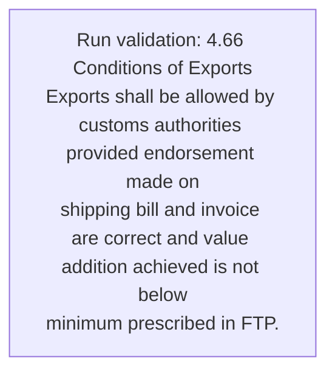
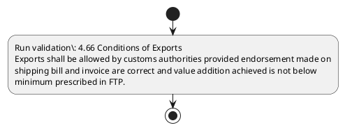

# Chapter 4 / Section 4.66: Conditions of Exports

**Chapter Title:** Duty Exemption / Remission Schemes

**Pages:** 40

**Purpose:** 4.66 Conditions of Exports
Exports shall be allowed by customs authorities provided endorsement made on
shipping bill and invoice are correct and value addition achieved is not below
minimum prescribed in FTP.

**Purpose Thanglish:** Indha Conditions of Exports section-la, 4.66 Conditions of Exports
Exports kandippa be allowed by customs authorities provided endorsement made on
shipping bill and invoice are correct and value addition achieved is not below
minimum prescribed in FTP.

**Summary:** 4.66 Conditions of Exports
Exports shall be allowed by customs authorities provided endorsement made on
shipping bill and invoice are correct and value addition achieved is not below
minimum prescribed in FTP.

**Business Meaning:** Conditions of Exports governs how DGFT business controls should be applied, validated, and enforced.

**Business Explanation:** Conditions of Exports explains the operating rule set that DEKAI should enforce. Key control points include 4.66 Conditions of Exports
Exports shall be allowed by customs authorities provided endorsement made on
shipping bill and invoice are correct and value addition achieved is not below
minimum prescribed in FTP.

**Business Explanation Thanglish:** Indha Conditions of Exports section-la, Conditions of Exports explains the operating rule set that DEKAI should enforce. Key control points include 4.66 Conditions of Exports
Exports kandippa be allowed by customs authorities provided endorsement made on
shipping bill and invoice are correct and value addition achieved is not below
minimum prescribed in FTP.

## Business Logic
- 4.66 Conditions of Exports
Exports shall be allowed by customs authorities provided endorsement made on
shipping bill and invoice are correct and value addition achieved is not below
minimum prescribed in FTP.

## Business Rules
- rule_id=CH4-SEC4_66-R001, rule_description=4.66 Conditions of Exports
Exports shall be allowed by customs authorities provided endorsement made on
shipping bill and invoice are correct and value addition achieved is not below
minimum prescribed in FTP., trigger=Conditions of Exports, condition=Not explicitly covered in uploaded documents., validation=4.66 Conditions of Exports
Exports shall be allowed by customs authorities provided endorsement made on
shipping bill and invoice are correct and value addition achieved is not below
minimum prescribed in FTP., action=Manual review required., exception=No explicit exception found in uploaded documents., output=DEKAI should produce a compliance decision for 4.66 - Conditions of Exports.

## Conditions
- None identified

## Condition Logic
- None identified

## Validations
- 4.66 Conditions of Exports
Exports shall be allowed by customs authorities provided endorsement made on
shipping bill and invoice are correct and value addition achieved is not below
minimum prescribed in FTP.

## Exceptions
- None identified

## Dependencies
- 4
- 6

## Authorities
- customs

## Required Documents
- 4.66 Conditions of Exports
Exports shall be allowed by customs authorities provided endorsement made on
shipping bill and invoice are correct and value addition achieved is not below
minimum prescribed in FTP.

## Timelines
- None identified

## Actions
- None identified

## Workflow
- Run validation: 4.66 Conditions of Exports
Exports shall be allowed by customs authorities provided endorsement made on
shipping bill and invoice are correct and value addition achieved is not below
minimum prescribed in FTP.

## Workflow ASCII
```text
Conditions of Exports
Run validation: 4.66 Conditions of Exports
Exports shall be allowed by customs authorities provided endorsement made on
shipping bill and invoice are correct and value addition achieved is not below
minimum prescribed in FTP.
```

## Decision Tree
- IF section 4.66 applies THEN proceed with standard DGFT workflow

## Decision Tree ASCII
```text
Conditions of Exports Decision
IF section 4.66 applies THEN proceed with standard DGFT workflow
```

## Examples
- User asks to process Conditions of Exports; the platform checks conditions, validations, and documents before action.

**Real-world Example:** Example: an importer or exporter invokes Conditions of Exports, submits 4.66 Conditions of Exports
Exports shall be allowed by customs authorities provided endorsement made on
shipping bill and invoice are correct and value addition achieved is not below
minimum prescribed in FTP., and DEKAI uses the extracted rules to follow the conditions of exports process.

**Real-world Example Thanglish:** Indha Conditions of Exports section-la, Example: an importer or exporter invokes Conditions of Exports, submits 4.66 Conditions of Exports
Exports kandippa be allowed by customs authorities provided endorsement made on
shipping bill and invoice are correct and value addition achieved is not below
minimum prescribed in FTP., and DEKAI uses the extracted rules to follow the conditions of exports process.

## AI Rules
- IF detected context matches section rule THEN enforce: 4.66 Conditions of Exports
Exports shall be allowed by customs authorities provided endorsement made on
shipping bill and invoice are correct and value addition achieved is not below
minimum prescribed in FTP.

## Database Fields
- name=section_code, type=string, required=True, source=parsed_section_heading
- name=section_title, type=string, required=True, source=parsed_section_heading
- name=and_flag, type=boolean, required=False, source=keyword:and
- name=are_flag, type=boolean, required=False, source=keyword:are
- name=not_flag, type=boolean, required=False, source=keyword:not
- name=ftp_flag, type=boolean, required=False, source=keyword:FTP
- name=made_flag, type=boolean, required=False, source=keyword:made
- name=bill_flag, type=boolean, required=False, source=keyword:bill
- name=shall_flag, type=boolean, required=False, source=keyword:shall
- name=value_flag, type=boolean, required=False, source=keyword:value
- name=document_1_submitted, type=boolean, required=True, source=4.66 Conditions of Exports
Exports shall be allowed by customs authorities provided endorsement made on
shipping bill and invoice are correct and value addition achieved is not below
minimum prescribed in FTP.

## API Requirements
- method=GET, path=/api/dgft/sections/4.66, purpose=Retrieve knowledge payload for section 4.66, query_params=['include=workflow,decision_tree,validations'], response_fields=['section', 'title', 'summary', 'conditions', 'validations', 'exceptions', 'workflow', 'decision_tree']
- method=POST, path=/api/dgft/Conditions-of-Exports/validate, purpose=Validate inputs and documents for Conditions of Exports, request_fields=['section_code', 'section_title', 'document_1_submitted'], response_fields=['status', 'errors', 'warnings', 'next_actions']

## UI Screens
- screen_id=Conditions_of_Exports_overview, name=Conditions of Exports Overview, purpose=Show section summary, authority, timeline, and eligibility cues., widgets=['summary_card', 'conditions_table', 'authority_badges', 'timeline_panel']
- screen_id=Conditions_of_Exports_submission, name=Conditions of Exports Submission, purpose=Capture applicant data and supporting documents., widgets=['dynamic_form', 'document_uploader', 'validation_panel', 'next_action_footer'], fields=['section_code', 'section_title', 'and_flag', 'are_flag', 'not_flag', 'ftp_flag', 'made_flag', 'bill_flag']

## Error Messages
- Validation failed because the section requirements were not fully met.

## FAQ
- question_en=What is the purpose of section 4.66?, answer_en=Conditions of Exports explains the operating rule set that DEKAI should enforce. Key control points include 4.66 Conditions of Exports
Exports shall be allowed by customs authorities provided endorsement made on
shipping bill and invoice are correct and value addition achieved is not below
minimum prescribed in FTP., question_thanglish=Indha Conditions of Exports section-la, What is the purpose of section 4.66?, answer_thanglish=Indha Conditions of Exports section-la, Conditions of Exports explains the operating rule set that DEKAI should enforce. Key control points include 4.66 Conditions of Exports
Exports kandippa be allowed by customs authorities provided endorsement made on
shipping bill and invoice are correct and value addition achieved is not below
minimum prescribed in FTP.
- question_en=What documents are required under Conditions of Exports?, answer_en=4.66 Conditions of Exports
Exports shall be allowed by customs authorities provided endorsement made on
shipping bill and invoice are correct and value addition achieved is not below
minimum prescribed in FTP., question_thanglish=Indha Conditions of Exports section-la, What documents are required under Conditions of Exports?, answer_thanglish=Indha Conditions of Exports section-la, 4.66 Conditions of Exports
Exports kandippa be allowed by customs authorities provided endorsement made on
shipping bill and invoice are correct and value addition achieved is not below
minimum prescribed in FTP.
- question_en=Which authority handles Conditions of Exports?, answer_en=customs, question_thanglish=Indha Conditions of Exports section-la, Which authority handles Conditions of Exports?, answer_thanglish=Indha Conditions of Exports section-la, customs

## Questions Users May Ask
- What does Conditions of Exports require?
- Which documents are needed for Conditions of Exports?
- How does DEKAI validate Conditions of Exports requests?

## Expected AI Answers
- Conditions of Exports requires the platform to interpret the section text, apply the extracted business rules, and present the correct next action.
- Required documents are inferred from the section text: 4.66 Conditions of Exports
Exports shall be allowed by customs authorities provided endorsement made on
shipping bill and invoice are correct and value addition achieved is not below
minimum prescribed in FTP.
- DEKAI validates Conditions of Exports by checking conditions, required documents, authority references, and exception clauses before recommending an outcome.

## AI Q&A Examples
- question_en=User asks: How do I comply with Conditions of Exports?, answer_en=AI answers: DEKAI should evaluate section 4.66, apply the extracted rules, and guide the user through Run validation: 4.66 Conditions of Exports
Exports shall be allowed by customs authorities provided endorsement made on
shipping bill and invoice are correct and value addition achieved is not below
minimum prescribed in FTP.., question_thanglish=Indha Conditions of Exports section-la, User asks: How do I comply with Conditions of Exports?, answer_thanglish=Indha Conditions of Exports section-la, AI answers: DEKAI should evaluate section 4.66, apply the extracted rules, and guide the user through Run validation: 4.66 Conditions of Exports
Exports kandippa be allowed by customs authorities provided endorsement made on
shipping bill and invoice are correct and value addition achieved is not below
minimum prescribed in FTP..
- question_en=User asks: Which validations apply to Conditions of Exports?, answer_en=AI answers: Applicable validations are 4.66 Conditions of Exports
Exports shall be allowed by customs authorities provided endorsement made on
shipping bill and invoice are correct and value addition achieved is not below
minimum prescribed in FTP., question_thanglish=Indha Conditions of Exports section-la, User asks: Which validations apply to Conditions of Exports?, answer_thanglish=Indha Conditions of Exports section-la, AI answers: Applicable validations are 4.66 Conditions of Exports
Exports kandippa be allowed by customs authorities provided endorsement made on
shipping bill and invoice are correct and value addition achieved is not below
minimum prescribed in FTP.

## DEKAI AI Implementation Notes
- Capture chapter 4, section 4.66, title, and page references as immutable knowledge metadata.
- Bind validations for Conditions of Exports into a rule engine keyed by the rule IDs extracted for this section.
- Expose document upload controls for: 4.66 Conditions of Exports
Exports shall be allowed by customs authorities provided endorsement made on
shipping bill and invoice are correct and value addition achieved is not below
minimum prescribed in FTP..
- Route escalations or approvals to: customs.
- Show contextual links to related sections: 4, 6.

## DEKAI AI Implementation Notes Thanglish
- Indha Conditions of Exports section-la, Capture chapter 4, section 4.66, title, and page references as immutable knowledge metadata.
- Indha Conditions of Exports section-la, Bind validations for Conditions of Exports into a rule engine keyed by the rule IDs extracted for this section.
- Indha Conditions of Exports section-la, Expose document upload controls for: 4.66 Conditions of Exports
Exports kandippa be allowed by customs authorities provided endorsement made on
shipping bill and invoice are correct and value addition achieved is not below
minimum prescribed in FTP..
- Indha Conditions of Exports section-la, Route escalations or approvals to: customs.
- Indha Conditions of Exports section-la, Show contextual links to related sections: 4, 6.

## AI Metadata
- Keywords: and, are, not, FTP, made, bill, shall, value, below, Exports, allowed, customs, invoice, correct, minimum, provided, shipping, addition, achieved, Conditions
- Search Keywords: and, are, not, FTP, made, bill, shall, value, below, Exports, allowed, customs, invoice, correct, minimum, provided, shipping, addition, achieved, Conditions
- Intent: Provide knowledge guidance for Conditions of Exports.
- Tags: 4.66, Conditions of Exports, business-rule, document-driven, dgft
- Related Sections: 4, 6
- Related Chapters: 
- Related Rules: 4.66 Conditions of Exports
Exports shall be allowed by customs authorities provided endorsement made on
shipping bill and invoice are correct and value addition achieved is not below
minimum prescribed in FTP.

## Mermaid


## PlantUML

