# Chapter 4 / Section 4.67: Proof of Exports

**Chapter Title:** Duty Exemption / Remission Schemes

**Pages:** 40, 41

**Purpose:** 4.67 Proof of Exports
a) Exporter has to furnish the proof of exports, wherever required for
export of gold / silver / platinum jewellery and articles thereof, by
furnishing following documents:
(i) Self-attested copy of Exporter’s copy of the Shipping Bill;
(ii) Tax invoice for export/supplies as prescribed under
CGST/SGST/UT GST rules whose particulars are uploaded on LEO
copy of Shipping Bill
(iii) Bank certificate/e-BRC of realisation in Appendix 2U/ export
realisations from RBI's EDPMS wherever available in DGFT IT
system.

**Purpose Thanglish:** Indha Proof of Exports section-la, 4.67 Proof of Exports
a) Exporter has to furnish the proof of exports, wherever required for
export of gold / silver / platinum jewellery and articles thereof, by
furnishing following documents:
(i) Self-attested copy of Exporter’s copy of the Shipping Bill;
(ii) Tax invoice for export/supplies as prescribed under
CGST/SGST/UT GST rules whose particulars are uploaded on LEO
copy of Shipping Bill
(iii) Bank certificate/e-BRC of realisation in Appendix 2U/ export
realisations from RBI's EDPMS wherever available in DGFT IT
system.

**Summary:** 4.67 Proof of Exports
a) Exporter has to furnish the proof of exports, wherever required for
export of gold / silver / platinum jewellery and articles thereof, by
furnishing following documents:
(i) Self-attested copy of Exporter’s copy of the Shipping Bill;
(ii) Tax invoice for export/supplies as prescribed under
CGST/SGST/UT GST rules whose particulars are uploaded on LEO
copy of Shipping Bill
(iii) Bank certificate/e-BRC of realisation in Appendix 2U/ export
realisations from RBI's EDPMS wherever available in DGFT IT
system. b) In case of personal carriage of jewellery by foreign buyer, following
documents should be submitted by the exporter/seller as proof of
exports for claiming export entitlements:
(i) Copy of shipping bill filed by Indian Seller;
(ii) Copy of Currency Declaration Form filed by Foreign Buyer with
Customs at the time of his arrival; and
(iii) Foreign Exchange Encashment Certificate from Bank. c) In addition to this, Personal Carriage on Documents against Acceptance
(DA)/Cash On Delivery (COD) basis is also allowed.

**Business Meaning:** Proof of Exports governs how DGFT business controls should be applied, validated, and enforced.

**Business Explanation:** Proof of Exports explains the operating rule set that DEKAI should enforce. Key control points include b) In case of personal carriage of jewellery by foreign buyer, following
documents should be submitted by the exporter/seller as proof of
exports for claiming export entitlements:
(i) Copy of shipping bill filed by Indian Seller;
(ii) Copy of Currency Declaration Form filed by Foreign Buyer with
Customs at the time of his arrival; and
(iii) Foreign Exchange Encashment Certificate from Bank. The section also drives actions such as 4.67 Proof of Exports
a) Exporter has to furnish the proof of exports, wherever required for
export of gold / silver / platinum jewellery and articles thereof, by
furnishing following documents:
(i) Self-attested copy of Exporter’s copy of the Shipping Bill;
(ii) Tax invoice for export/supplies as prescribed under
CGST/SGST/UT GST rules whose particulars are uploaded on LEO
copy of Shipping Bill
(iii) Bank certificate/e-BRC of realisation in Appendix 2U/ export
realisations from RBI's EDPMS wherever available in DGFT IT
system..

**Business Explanation Thanglish:** Indha Proof of Exports section-la, Proof of Exports explains the operating rule set that DEKAI should enforce. Key control points include b) In case of personal carriage of jewellery by foreign buyer, following
documents should be submitted by the exporter/seller as proof of
exports for claiming export entitlements:
(i) Copy of shipping bill filed by Indian Seller;
(ii) Copy of Currency Declaration Form filed by Foreign Buyer with
Customs at the time of his arrival; and
(iii) Foreign Exchange Encashment Certificate from Bank. The section also drives actions such as 4.67 Proof of Exports
a) Exporter has to furnish the proof of exports, wherever required for
export of gold / silver / platinum jewellery and articles thereof, by
furnishing following documents:
(i) Self-attested copy of Exporter’s copy of the Shipping Bill;
(ii) Tax invoice for export/supplies as prescribed under
CGST/SGST/UT GST rules whose particulars are uploaded on LEO
copy of Shipping Bill
(iii) Bank certificate/e-BRC of realisation in Appendix 2U/ export
realisations from RBI's EDPMS wherever available in DGFT IT
system..

## Business Logic
- b) In case of personal carriage of jewellery by foreign buyer, following
documents should be submitted by the exporter/seller as proof of
exports for claiming export entitlements:
(i) Copy of shipping bill filed by Indian Seller;
(ii) Copy of Currency Declaration Form filed by Foreign Buyer with
Customs at the time of his arrival; and
(iii) Foreign Exchange Encashment Certificate from Bank.
- In case of studded items, shipping bill shall also contain description,
weight and value of precious / semi-precious stones / diamonds / pearls used in
manufacture and weight / value of any other precious metal used for alloying
gold/silver.
- b)
In case of personal carriage of jewellery by foreign buyer, following
documents should be submitted by the exporter/seller as proof of
exports for claiming export entitlements:
(i)
Copy of shipping bill filed by Indian Seller;
(ii) Copy of Currency Declaration Form filed by Foreign Buyer with
Customs at the time of his arrival; and
(iii) Foreign Exchange Encashment Certificate from Bank.
- d) Instructions issued by Customs Department in this regard should be
followed mutatis mutandis.

## Business Rules
- rule_id=CH4-SEC4_67-R001, rule_description=b) In case of personal carriage of jewellery by foreign buyer, following
documents should be submitted by the exporter/seller as proof of
exports for claiming export entitlements:
(i) Copy of shipping bill filed by Indian Seller;
(ii) Copy of Currency Declaration Form filed by Foreign Buyer with
Customs at the time of his arrival; and
(iii) Foreign Exchange Encashment Certificate from Bank., trigger=Proof of Exports, condition=4.67 Proof of Exports
a) Exporter has to furnish the proof of exports, wherever required for
export of gold / silver / platinum jewellery and articles thereof, by
furnishing following documents:
(i) Self-attested copy of Exporter’s copy of the Shipping Bill;
(ii) Tax invoice for export/supplies as prescribed under
CGST/SGST/UT GST rules whose particulars are uploaded on LEO
copy of Shipping Bill
(iii) Bank certificate/e-BRC of realisation in Appendix 2U/ export
realisations from RBI's EDPMS wherever available in DGFT IT
system., validation=4.67 Proof of Exports
a) Exporter has to furnish the proof of exports, wherever required for
export of gold / silver / platinum jewellery and articles thereof, by
furnishing following documents:
(i) Self-attested copy of Exporter’s copy of the Shipping Bill;
(ii) Tax invoice for export/supplies as prescribed under
CGST/SGST/UT GST rules whose particulars are uploaded on LEO
copy of Shipping Bill
(iii) Bank certificate/e-BRC of realisation in Appendix 2U/ export
realisations from RBI's EDPMS wherever available in DGFT IT
system., action=4.67 Proof of Exports
a) Exporter has to furnish the proof of exports, wherever required for
export of gold / silver / platinum jewellery and articles thereof, by
furnishing following documents:
(i) Self-attested copy of Exporter’s copy of the Shipping Bill;
(ii) Tax invoice for export/supplies as prescribed under
CGST/SGST/UT GST rules whose particulars are uploaded on LEO
copy of Shipping Bill
(iii) Bank certificate/e-BRC of realisation in Appendix 2U/ export
realisations from RBI's EDPMS wherever available in DGFT IT
system., exception=No explicit exception found in uploaded documents., output=DEKAI should produce a compliance decision for 4.67 - Proof of Exports.
- rule_id=CH4-SEC4_67-R002, rule_description=In case of studded items, shipping bill shall also contain description,
weight and value of precious / semi-precious stones / diamonds / pearls used in
manufacture and weight / value of any other precious metal used for alloying
gold/silver., trigger=Proof of Exports, condition=b) In case of personal carriage of jewellery by foreign buyer, following
documents should be submitted by the exporter/seller as proof of
exports for claiming export entitlements:
(i) Copy of shipping bill filed by Indian Seller;
(ii) Copy of Currency Declaration Form filed by Foreign Buyer with
Customs at the time of his arrival; and
(iii) Foreign Exchange Encashment Certificate from Bank., validation=In case of studded items, shipping bill shall also contain description,
weight and value of precious / semi-precious stones / diamonds / pearls used in
manufacture and weight / value of any other precious metal used for alloying
gold/silver., action=b) In case of personal carriage of jewellery by foreign buyer, following
documents should be submitted by the exporter/seller as proof of
exports for claiming export entitlements:
(i) Copy of shipping bill filed by Indian Seller;
(ii) Copy of Currency Declaration Form filed by Foreign Buyer with
Customs at the time of his arrival; and
(iii) Foreign Exchange Encashment Certificate from Bank., exception=No explicit exception found in uploaded documents., output=DEKAI should produce a compliance decision for 4.67 - Proof of Exports.
- rule_id=CH4-SEC4_67-R003, rule_description=b)
In case of personal carriage of jewellery by foreign buyer, following
documents should be submitted by the exporter/seller as proof of
exports for claiming export entitlements:
(i)
Copy of shipping bill filed by Indian Seller;
(ii) Copy of Currency Declaration Form filed by Foreign Buyer with
Customs at the time of his arrival; and
(iii) Foreign Exchange Encashment Certificate from Bank., trigger=Proof of Exports, condition=In case of studded items, shipping bill shall also contain description,
weight and value of precious / semi-precious stones / diamonds / pearls used in
manufacture and weight / value of any other precious metal used for alloying
gold/silver., validation=4.67 Proof of Exports
a)
Exporter has to furnish the proof of exports, wherever required for
export of gold / silver / platinum jewellery and articles thereof, by
furnishing following documents:
(i)
Self-attested copy of Exporter’s copy of the Shipping Bill;
(ii) Tax
invoice
for
export/supplies
as
prescribed
under
CGST/SGST/UT GST rules whose particulars are uploaded on LEO
copy of Shipping Bill
(iii) Bank certificate/e-BRC of realisation in Appendix 2U/ export
realisations from RBI's EDPMS wherever available in DGFT IT
system., action=Exporter will have to furnish following documents as proof of exports
for claiming export entitlements:
pg., exception=No explicit exception found in uploaded documents., output=DEKAI should produce a compliance decision for 4.67 - Proof of Exports.
- rule_id=CH4-SEC4_67-R004, rule_description=d) Instructions issued by Customs Department in this regard should be
followed mutatis mutandis., trigger=Proof of Exports, condition=4.67 Proof of Exports
a)
Exporter has to furnish the proof of exports, wherever required for
export of gold / silver / platinum jewellery and articles thereof, by
furnishing following documents:
(i)
Self-attested copy of Exporter’s copy of the Shipping Bill;
(ii) Tax
invoice
for
export/supplies
as
prescribed
under
CGST/SGST/UT GST rules whose particulars are uploaded on LEO
copy of Shipping Bill
(iii) Bank certificate/e-BRC of realisation in Appendix 2U/ export
realisations from RBI's EDPMS wherever available in DGFT IT
system., validation=4.67 Proof of Exports
a)
Exporter has to furnish the proof of exports, wherever required for
export of gold / silver / platinum jewellery and articles thereof, by
furnishing following documents:
(i)
Self-attested copy of Exporter’s copy of the Shipping Bill;
(ii) Tax
invoice
for
export/supplies
as
prescribed
under
CGST/SGST/UT GST rules whose particulars are uploaded on LEO
copy of Shipping Bill
(iii) Bank certificate/e-BRC of realisation in Appendix 2U/ export
realisations from RBI's EDPMS wherever available in DGFT IT
system., action=4.67 Proof of Exports
a)
Exporter has to furnish the proof of exports, wherever required for
export of gold / silver / platinum jewellery and articles thereof, by
furnishing following documents:
(i)
Self-attested copy of Exporter’s copy of the Shipping Bill;
(ii) Tax
invoice
for
export/supplies
as
prescribed
under
CGST/SGST/UT GST rules whose particulars are uploaded on LEO
copy of Shipping Bill
(iii) Bank certificate/e-BRC of realisation in Appendix 2U/ export
realisations from RBI's EDPMS wherever available in DGFT IT
system., exception=No explicit exception found in uploaded documents., output=DEKAI should produce a compliance decision for 4.67 - Proof of Exports.

## Conditions
- 4.67 Proof of Exports
a) Exporter has to furnish the proof of exports, wherever required for
export of gold / silver / platinum jewellery and articles thereof, by
furnishing following documents:
(i) Self-attested copy of Exporter’s copy of the Shipping Bill;
(ii) Tax invoice for export/supplies as prescribed under
CGST/SGST/UT GST rules whose particulars are uploaded on LEO
copy of Shipping Bill
(iii) Bank certificate/e-BRC of realisation in Appendix 2U/ export
realisations from RBI's EDPMS wherever available in DGFT IT
system.
- b) In case of personal carriage of jewellery by foreign buyer, following
documents should be submitted by the exporter/seller as proof of
exports for claiming export entitlements:
(i) Copy of shipping bill filed by Indian Seller;
(ii) Copy of Currency Declaration Form filed by Foreign Buyer with
Customs at the time of his arrival; and
(iii) Foreign Exchange Encashment Certificate from Bank.
- In case of studded items, shipping bill shall also contain description,
weight and value of precious / semi-precious stones / diamonds / pearls used in
manufacture and weight / value of any other precious metal used for alloying
gold/silver.
- 4.67 Proof of Exports
a)
Exporter has to furnish the proof of exports, wherever required for
export of gold / silver / platinum jewellery and articles thereof, by
furnishing following documents:
(i)
Self-attested copy of Exporter’s copy of the Shipping Bill;
(ii) Tax
invoice
for
export/supplies
as
prescribed
under
CGST/SGST/UT GST rules whose particulars are uploaded on LEO
copy of Shipping Bill
(iii) Bank certificate/e-BRC of realisation in Appendix 2U/ export
realisations from RBI's EDPMS wherever available in DGFT IT
system.
- b)
In case of personal carriage of jewellery by foreign buyer, following
documents should be submitted by the exporter/seller as proof of
exports for claiming export entitlements:
(i)
Copy of shipping bill filed by Indian Seller;
(ii) Copy of Currency Declaration Form filed by Foreign Buyer with
Customs at the time of his arrival; and
(iii) Foreign Exchange Encashment Certificate from Bank.
- Exporter will have to furnish following documents as proof of exports
for claiming export entitlements:
(i) Copy of Shipping Bill filed by Indian Seller; and
(ii) Bank Certificate/e-BRC of Export and Realisation/ export
realisations from RBI's EDPMS wherever available in DGFT IT
system.

## Condition Logic
- id=4.4.67.1, if=4.67 Proof of Exports
a) Exporter has to furnish the proof of exports, wherever required for
export of gold / silver / platinum jewellery and articles thereof, by
furnishing following documents:
(i) Self-attested copy of Exporter’s copy of the Shipping Bill;
(ii) Tax invoice for export/supplies as prescribed under
CGST/SGST/UT GST rules whose particulars are uploaded on LEO
copy of Shipping Bill
(iii) Bank certificate/e-BRC of realisation in Appendix 2U/ export
realisations from RBI's EDPMS wherever available in DGFT IT
system., then=4.67 Proof of Exports
a) Exporter has to furnish the proof of exports, wherever required for
export of gold / silver / platinum jewellery and articles thereof, by
furnishing following documents:
(i) Self-attested copy of Exporter’s copy of the Shipping Bill;
(ii) Tax invoice for export/supplies as prescribed under
CGST/SGST/UT GST rules whose particulars are uploaded on LEO
copy of Shipping Bill
(iii) Bank certificate/e-BRC of realisation in Appendix 2U/ export
realisations from RBI's EDPMS wherever available in DGFT IT
system., source=4.67 Proof of Exports
a) Exporter has to furnish the proof of exports, wherever required for
export of gold / silver / platinum jewellery and articles thereof, by
furnishing following documents:
(i) Self-attested copy of Exporter’s copy of the Shipping Bill;
(ii) Tax invoice for export/supplies as prescribed under
CGST/SGST/UT GST rules whose particulars are uploaded on LEO
copy of Shipping Bill
(iii) Bank certificate/e-BRC of realisation in Appendix 2U/ export
realisations from RBI's EDPMS wherever available in DGFT IT
system.
- id=4.4.67.2, if=b) In case of personal carriage of jewellery by foreign buyer, following
documents should be submitted by the exporter/seller as proof of
exports for claiming export entitlements:
(i) Copy of shipping bill filed by Indian Seller;
(ii) Copy of Currency Declaration Form filed by Foreign Buyer with
Customs at the time of his arrival; and
(iii) Foreign Exchange Encashment Certificate from Bank., then=4.67 Proof of Exports
a) Exporter has to furnish the proof of exports, wherever required for
export of gold / silver / platinum jewellery and articles thereof, by
furnishing following documents:
(i) Self-attested copy of Exporter’s copy of the Shipping Bill;
(ii) Tax invoice for export/supplies as prescribed under
CGST/SGST/UT GST rules whose particulars are uploaded on LEO
copy of Shipping Bill
(iii) Bank certificate/e-BRC of realisation in Appendix 2U/ export
realisations from RBI's EDPMS wherever available in DGFT IT
system., source=b) In case of personal carriage of jewellery by foreign buyer, following
documents should be submitted by the exporter/seller as proof of
exports for claiming export entitlements:
(i) Copy of shipping bill filed by Indian Seller;
(ii) Copy of Currency Declaration Form filed by Foreign Buyer with
Customs at the time of his arrival; and
(iii) Foreign Exchange Encashment Certificate from Bank.
- id=4.4.67.3, if=In case of studded items, shipping bill shall also contain description,
weight and value of precious / semi-precious stones / diamonds / pearls used in
manufacture and weight / value of any other precious metal used for alloying
gold/silver., then=4.67 Proof of Exports
a) Exporter has to furnish the proof of exports, wherever required for
export of gold / silver / platinum jewellery and articles thereof, by
furnishing following documents:
(i) Self-attested copy of Exporter’s copy of the Shipping Bill;
(ii) Tax invoice for export/supplies as prescribed under
CGST/SGST/UT GST rules whose particulars are uploaded on LEO
copy of Shipping Bill
(iii) Bank certificate/e-BRC of realisation in Appendix 2U/ export
realisations from RBI's EDPMS wherever available in DGFT IT
system., source=In case of studded items, shipping bill shall also contain description,
weight and value of precious / semi-precious stones / diamonds / pearls used in
manufacture and weight / value of any other precious metal used for alloying
gold/silver.
- id=4.4.67.4, if=4.67 Proof of Exports
a)
Exporter has to furnish the proof of exports, wherever required for
export of gold / silver / platinum jewellery and articles thereof, by
furnishing following documents:
(i)
Self-attested copy of Exporter’s copy of the Shipping Bill;
(ii) Tax
invoice
for
export/supplies
as
prescribed
under
CGST/SGST/UT GST rules whose particulars are uploaded on LEO
copy of Shipping Bill
(iii) Bank certificate/e-BRC of realisation in Appendix 2U/ export
realisations from RBI's EDPMS wherever available in DGFT IT
system., then=4.67 Proof of Exports
a) Exporter has to furnish the proof of exports, wherever required for
export of gold / silver / platinum jewellery and articles thereof, by
furnishing following documents:
(i) Self-attested copy of Exporter’s copy of the Shipping Bill;
(ii) Tax invoice for export/supplies as prescribed under
CGST/SGST/UT GST rules whose particulars are uploaded on LEO
copy of Shipping Bill
(iii) Bank certificate/e-BRC of realisation in Appendix 2U/ export
realisations from RBI's EDPMS wherever available in DGFT IT
system., source=4.67 Proof of Exports
a)
Exporter has to furnish the proof of exports, wherever required for
export of gold / silver / platinum jewellery and articles thereof, by
furnishing following documents:
(i)
Self-attested copy of Exporter’s copy of the Shipping Bill;
(ii) Tax
invoice
for
export/supplies
as
prescribed
under
CGST/SGST/UT GST rules whose particulars are uploaded on LEO
copy of Shipping Bill
(iii) Bank certificate/e-BRC of realisation in Appendix 2U/ export
realisations from RBI's EDPMS wherever available in DGFT IT
system.
- id=4.4.67.5, if=b)
In case of personal carriage of jewellery by foreign buyer, following
documents should be submitted by the exporter/seller as proof of
exports for claiming export entitlements:
(i)
Copy of shipping bill filed by Indian Seller;
(ii) Copy of Currency Declaration Form filed by Foreign Buyer with
Customs at the time of his arrival; and
(iii) Foreign Exchange Encashment Certificate from Bank., then=4.67 Proof of Exports
a) Exporter has to furnish the proof of exports, wherever required for
export of gold / silver / platinum jewellery and articles thereof, by
furnishing following documents:
(i) Self-attested copy of Exporter’s copy of the Shipping Bill;
(ii) Tax invoice for export/supplies as prescribed under
CGST/SGST/UT GST rules whose particulars are uploaded on LEO
copy of Shipping Bill
(iii) Bank certificate/e-BRC of realisation in Appendix 2U/ export
realisations from RBI's EDPMS wherever available in DGFT IT
system., source=b)
In case of personal carriage of jewellery by foreign buyer, following
documents should be submitted by the exporter/seller as proof of
exports for claiming export entitlements:
(i)
Copy of shipping bill filed by Indian Seller;
(ii) Copy of Currency Declaration Form filed by Foreign Buyer with
Customs at the time of his arrival; and
(iii) Foreign Exchange Encashment Certificate from Bank.
- id=4.4.67.6, if=Exporter will have to furnish following documents as proof of exports
for claiming export entitlements:
(i) Copy of Shipping Bill filed by Indian Seller; and
(ii) Bank Certificate/e-BRC of Export and Realisation/ export
realisations from RBI's EDPMS wherever available in DGFT IT
system., then=4.67 Proof of Exports
a) Exporter has to furnish the proof of exports, wherever required for
export of gold / silver / platinum jewellery and articles thereof, by
furnishing following documents:
(i) Self-attested copy of Exporter’s copy of the Shipping Bill;
(ii) Tax invoice for export/supplies as prescribed under
CGST/SGST/UT GST rules whose particulars are uploaded on LEO
copy of Shipping Bill
(iii) Bank certificate/e-BRC of realisation in Appendix 2U/ export
realisations from RBI's EDPMS wherever available in DGFT IT
system., source=Exporter will have to furnish following documents as proof of exports
for claiming export entitlements:
(i) Copy of Shipping Bill filed by Indian Seller; and
(ii) Bank Certificate/e-BRC of Export and Realisation/ export
realisations from RBI's EDPMS wherever available in DGFT IT
system.

## Validations
- 4.67 Proof of Exports
a) Exporter has to furnish the proof of exports, wherever required for
export of gold / silver / platinum jewellery and articles thereof, by
furnishing following documents:
(i) Self-attested copy of Exporter’s copy of the Shipping Bill;
(ii) Tax invoice for export/supplies as prescribed under
CGST/SGST/UT GST rules whose particulars are uploaded on LEO
copy of Shipping Bill
(iii) Bank certificate/e-BRC of realisation in Appendix 2U/ export
realisations from RBI's EDPMS wherever available in DGFT IT
system.
- In case of studded items, shipping bill shall also contain description,
weight and value of precious / semi-precious stones / diamonds / pearls used in
manufacture and weight / value of any other precious metal used for alloying
gold/silver.
- 4.67 Proof of Exports
a)
Exporter has to furnish the proof of exports, wherever required for
export of gold / silver / platinum jewellery and articles thereof, by
furnishing following documents:
(i)
Self-attested copy of Exporter’s copy of the Shipping Bill;
(ii) Tax
invoice
for
export/supplies
as
prescribed
under
CGST/SGST/UT GST rules whose particulars are uploaded on LEO
copy of Shipping Bill
(iii) Bank certificate/e-BRC of realisation in Appendix 2U/ export
realisations from RBI's EDPMS wherever available in DGFT IT
system.

## Exceptions
- None identified

## Dependencies
- None identified

## Authorities
- DGFT
- EDPMS wherever available in DGFT
- Customs
- Instructions issued by Customs

## Required Documents
- Shipping Bill
- Copy of Currency Declaration
- Foreign Exchange Encashment Certificate
- c) In addition to this, Personal Carriage on Documents against Acceptance
(DA)/Cash On Delivery (COD) basis is also allowed.
- Exporter will have to furnish following documents as proof of exports
for claiming export entitlements:
pg.
- In case of studded items, shipping bill shall also contain description,
weight and value of precious / semi-precious stones / diamonds / pearls used in
manufacture and weight / value of any other precious metal used for alloying
gold/silver.
- c)
In addition to this, Personal Carriage on Documents against Acceptance
(DA)/Cash On Delivery (COD) basis is also allowed.
- Copy of Shipping Bill
- Bank Certificate

## Timelines
- None identified

## Actions
- 4.67 Proof of Exports
a) Exporter has to furnish the proof of exports, wherever required for
export of gold / silver / platinum jewellery and articles thereof, by
furnishing following documents:
(i) Self-attested copy of Exporter’s copy of the Shipping Bill;
(ii) Tax invoice for export/supplies as prescribed under
CGST/SGST/UT GST rules whose particulars are uploaded on LEO
copy of Shipping Bill
(iii) Bank certificate/e-BRC of realisation in Appendix 2U/ export
realisations from RBI's EDPMS wherever available in DGFT IT
system.
- b) In case of personal carriage of jewellery by foreign buyer, following
documents should be submitted by the exporter/seller as proof of
exports for claiming export entitlements:
(i) Copy of shipping bill filed by Indian Seller;
(ii) Copy of Currency Declaration Form filed by Foreign Buyer with
Customs at the time of his arrival; and
(iii) Foreign Exchange Encashment Certificate from Bank.
- Exporter will have to furnish following documents as proof of exports
for claiming export entitlements:
pg.
- 4.67 Proof of Exports
a)
Exporter has to furnish the proof of exports, wherever required for
export of gold / silver / platinum jewellery and articles thereof, by
furnishing following documents:
(i)
Self-attested copy of Exporter’s copy of the Shipping Bill;
(ii) Tax
invoice
for
export/supplies
as
prescribed
under
CGST/SGST/UT GST rules whose particulars are uploaded on LEO
copy of Shipping Bill
(iii) Bank certificate/e-BRC of realisation in Appendix 2U/ export
realisations from RBI's EDPMS wherever available in DGFT IT
system.
- b)
In case of personal carriage of jewellery by foreign buyer, following
documents should be submitted by the exporter/seller as proof of
exports for claiming export entitlements:
(i)
Copy of shipping bill filed by Indian Seller;
(ii) Copy of Currency Declaration Form filed by Foreign Buyer with
Customs at the time of his arrival; and
(iii) Foreign Exchange Encashment Certificate from Bank.
- Exporter will have to furnish following documents as proof of exports
for claiming export entitlements:
(i) Copy of Shipping Bill filed by Indian Seller; and
(ii) Bank Certificate/e-BRC of Export and Realisation/ export
realisations from RBI's EDPMS wherever available in DGFT IT
system.
- d) Instructions issued by Customs Department in this regard should be
followed mutatis mutandis.

## Workflow
- Evaluate condition: 4.67 Proof of Exports
a) Exporter has to furnish the proof of exports, wherever required for
export of gold / silver / platinum jewellery and articles thereof, by
furnishing following documents:
(i) Self-attested copy of Exporter’s copy of the Shipping Bill;
(ii) Tax invoice for export/supplies as prescribed under
CGST/SGST/UT GST rules whose particulars are uploaded on LEO
copy of Shipping Bill
(iii) Bank certificate/e-BRC of realisation in Appendix 2U/ export
realisations from RBI's EDPMS wherever available in DGFT IT
system.
- Evaluate condition: b) In case of personal carriage of jewellery by foreign buyer, following
documents should be submitted by the exporter/seller as proof of
exports for claiming export entitlements:
(i) Copy of shipping bill filed by Indian Seller;
(ii) Copy of Currency Declaration Form filed by Foreign Buyer with
Customs at the time of his arrival; and
(iii) Foreign Exchange Encashment Certificate from Bank.
- Evaluate condition: In case of studded items, shipping bill shall also contain description,
weight and value of precious / semi-precious stones / diamonds / pearls used in
manufacture and weight / value of any other precious metal used for alloying
gold/silver.
- 4.67 Proof of Exports
a) Exporter has to furnish the proof of exports, wherever required for
export of gold / silver / platinum jewellery and articles thereof, by
furnishing following documents:
(i) Self-attested copy of Exporter’s copy of the Shipping Bill;
(ii) Tax invoice for export/supplies as prescribed under
CGST/SGST/UT GST rules whose particulars are uploaded on LEO
copy of Shipping Bill
(iii) Bank certificate/e-BRC of realisation in Appendix 2U/ export
realisations from RBI's EDPMS wherever available in DGFT IT
system.
- b) In case of personal carriage of jewellery by foreign buyer, following
documents should be submitted by the exporter/seller as proof of
exports for claiming export entitlements:
(i) Copy of shipping bill filed by Indian Seller;
(ii) Copy of Currency Declaration Form filed by Foreign Buyer with
Customs at the time of his arrival; and
(iii) Foreign Exchange Encashment Certificate from Bank.
- Exporter will have to furnish following documents as proof of exports
for claiming export entitlements:
pg.
- 4.67 Proof of Exports
a)
Exporter has to furnish the proof of exports, wherever required for
export of gold / silver / platinum jewellery and articles thereof, by
furnishing following documents:
(i)
Self-attested copy of Exporter’s copy of the Shipping Bill;
(ii) Tax
invoice
for
export/supplies
as
prescribed
under
CGST/SGST/UT GST rules whose particulars are uploaded on LEO
copy of Shipping Bill
(iii) Bank certificate/e-BRC of realisation in Appendix 2U/ export
realisations from RBI's EDPMS wherever available in DGFT IT
system.
- b)
In case of personal carriage of jewellery by foreign buyer, following
documents should be submitted by the exporter/seller as proof of
exports for claiming export entitlements:
(i)
Copy of shipping bill filed by Indian Seller;
(ii) Copy of Currency Declaration Form filed by Foreign Buyer with
Customs at the time of his arrival; and
(iii) Foreign Exchange Encashment Certificate from Bank.
- Exporter will have to furnish following documents as proof of exports
for claiming export entitlements:
(i) Copy of Shipping Bill filed by Indian Seller; and
(ii) Bank Certificate/e-BRC of Export and Realisation/ export
realisations from RBI's EDPMS wherever available in DGFT IT
system.
- Run validation: 4.67 Proof of Exports
a) Exporter has to furnish the proof of exports, wherever required for
export of gold / silver / platinum jewellery and articles thereof, by
furnishing following documents:
(i) Self-attested copy of Exporter’s copy of the Shipping Bill;
(ii) Tax invoice for export/supplies as prescribed under
CGST/SGST/UT GST rules whose particulars are uploaded on LEO
copy of Shipping Bill
(iii) Bank certificate/e-BRC of realisation in Appendix 2U/ export
realisations from RBI's EDPMS wherever available in DGFT IT
system.
- Run validation: In case of studded items, shipping bill shall also contain description,
weight and value of precious / semi-precious stones / diamonds / pearls used in
manufacture and weight / value of any other precious metal used for alloying
gold/silver.
- Run validation: 4.67 Proof of Exports
a)
Exporter has to furnish the proof of exports, wherever required for
export of gold / silver / platinum jewellery and articles thereof, by
furnishing following documents:
(i)
Self-attested copy of Exporter’s copy of the Shipping Bill;
(ii) Tax
invoice
for
export/supplies
as
prescribed
under
CGST/SGST/UT GST rules whose particulars are uploaded on LEO
copy of Shipping Bill
(iii) Bank certificate/e-BRC of realisation in Appendix 2U/ export
realisations from RBI's EDPMS wherever available in DGFT IT
system.

## Workflow ASCII
```text
Proof of Exports
Evaluate condition: 4.67 Proof of Exports
a) Exporter has to furnish the proof of exports, wherever required for
export of gold / silver / platinum jewellery and articles thereof, by
furnishing following documents:
(i) Self-attested copy of Exporter’s copy of the Shipping Bill;
(ii) Tax invoice for export/supplies as prescribed under
CGST/SGST/UT GST rules whose particulars are uploaded on LEO
copy of Shipping Bill
(iii) Bank certificate/e-BRC of realisation in Appendix 2U/ export
realisations from RBI's EDPMS wherever available in DGFT IT
system.
   |
   v
Evaluate condition: b) In case of personal carriage of jewellery by foreign buyer, following
documents should be submitted by the exporter/seller as proof of
exports for claiming export entitlements:
(i) Copy of shipping bill filed by Indian Seller;
(ii) Copy of Currency Declaration Form filed by Foreign Buyer with
Customs at the time of his arrival; and
(iii) Foreign Exchange Encashment Certificate from Bank.
   |
   v
Evaluate condition: In case of studded items, shipping bill shall also contain description,
weight and value of precious / semi-precious stones / diamonds / pearls used in
manufacture and weight / value of any other precious metal used for alloying
gold/silver.
   |
   v
4.67 Proof of Exports
a) Exporter has to furnish the proof of exports, wherever required for
export of gold / silver / platinum jewellery and articles thereof, by
furnishing following documents:
(i) Self-attested copy of Exporter’s copy of the Shipping Bill;
(ii) Tax invoice for export/supplies as prescribed under
CGST/SGST/UT GST rules whose particulars are uploaded on LEO
copy of Shipping Bill
(iii) Bank certificate/e-BRC of realisation in Appendix 2U/ export
realisations from RBI's EDPMS wherever available in DGFT IT
system.
   |
   v
b) In case of personal carriage of jewellery by foreign buyer, following
documents should be submitted by the exporter/seller as proof of
exports for claiming export entitlements:
(i) Copy of shipping bill filed by Indian Seller;
(ii) Copy of Currency Declaration Form filed by Foreign Buyer with
Customs at the time of his arrival; and
(iii) Foreign Exchange Encashment Certificate from Bank.
   |
   v
Exporter will have to furnish following documents as proof of exports
for claiming export entitlements:
pg.
   |
   v
4.67 Proof of Exports
a)
Exporter has to furnish the proof of exports, wherever required for
export of gold / silver / platinum jewellery and articles thereof, by
furnishing following documents:
(i)
Self-attested copy of Exporter’s copy of the Shipping Bill;
(ii) Tax
invoice
for
export/supplies
as
prescribed
under
CGST/SGST/UT GST rules whose particulars are uploaded on LEO
copy of Shipping Bill
(iii) Bank certificate/e-BRC of realisation in Appendix 2U/ export
realisations from RBI's EDPMS wherever available in DGFT IT
system.
   |
   v
b)
In case of personal carriage of jewellery by foreign buyer, following
documents should be submitted by the exporter/seller as proof of
exports for claiming export entitlements:
(i)
Copy of shipping bill filed by Indian Seller;
(ii) Copy of Currency Declaration Form filed by Foreign Buyer with
Customs at the time of his arrival; and
(iii) Foreign Exchange Encashment Certificate from Bank.
   |
   v
Exporter will have to furnish following documents as proof of exports
for claiming export entitlements:
(i) Copy of Shipping Bill filed by Indian Seller; and
(ii) Bank Certificate/e-BRC of Export and Realisation/ export
realisations from RBI's EDPMS wherever available in DGFT IT
system.
   |
   v
Run validation: 4.67 Proof of Exports
a) Exporter has to furnish the proof of exports, wherever required for
export of gold / silver / platinum jewellery and articles thereof, by
furnishing following documents:
(i) Self-attested copy of Exporter’s copy of the Shipping Bill;
(ii) Tax invoice for export/supplies as prescribed under
CGST/SGST/UT GST rules whose particulars are uploaded on LEO
copy of Shipping Bill
(iii) Bank certificate/e-BRC of realisation in Appendix 2U/ export
realisations from RBI's EDPMS wherever available in DGFT IT
system.
   |
   v
Run validation: In case of studded items, shipping bill shall also contain description,
weight and value of precious / semi-precious stones / diamonds / pearls used in
manufacture and weight / value of any other precious metal used for alloying
gold/silver.
   |
   v
Run validation: 4.67 Proof of Exports
a)
Exporter has to furnish the proof of exports, wherever required for
export of gold / silver / platinum jewellery and articles thereof, by
furnishing following documents:
(i)
Self-attested copy of Exporter’s copy of the Shipping Bill;
(ii) Tax
invoice
for
export/supplies
as
prescribed
under
CGST/SGST/UT GST rules whose particulars are uploaded on LEO
copy of Shipping Bill
(iii) Bank certificate/e-BRC of realisation in Appendix 2U/ export
realisations from RBI's EDPMS wherever available in DGFT IT
system.
```

## Decision Tree
- IF 4.67 Proof of Exports
a) Exporter has to furnish the proof of exports, wherever required for
export of gold / silver / platinum jewellery and articles thereof, by
furnishing following documents:
(i) Self-attested copy of Exporter’s copy of the Shipping Bill;
(ii) Tax invoice for export/supplies as prescribed under
CGST/SGST/UT GST rules whose particulars are uploaded on LEO
copy of Shipping Bill
(iii) Bank certificate/e-BRC of realisation in Appendix 2U/ export
realisations from RBI's EDPMS wherever available in DGFT IT
system. THEN 4.67 Proof of Exports
a) Exporter has to furnish the proof of exports, wherever required for
export of gold / silver / platinum jewellery and articles thereof, by
furnishing following documents:
(i) Self-attested copy of Exporter’s copy of the Shipping Bill;
(ii) Tax invoice for export/supplies as prescribed under
CGST/SGST/UT GST rules whose particulars are uploaded on LEO
copy of Shipping Bill
(iii) Bank certificate/e-BRC of realisation in Appendix 2U/ export
realisations from RBI's EDPMS wherever available in DGFT IT
system.
- IF b) In case of personal carriage of jewellery by foreign buyer, following
documents should be submitted by the exporter/seller as proof of
exports for claiming export entitlements:
(i) Copy of shipping bill filed by Indian Seller;
(ii) Copy of Currency Declaration Form filed by Foreign Buyer with
Customs at the time of his arrival; and
(iii) Foreign Exchange Encashment Certificate from Bank. THEN 4.67 Proof of Exports
a) Exporter has to furnish the proof of exports, wherever required for
export of gold / silver / platinum jewellery and articles thereof, by
furnishing following documents:
(i) Self-attested copy of Exporter’s copy of the Shipping Bill;
(ii) Tax invoice for export/supplies as prescribed under
CGST/SGST/UT GST rules whose particulars are uploaded on LEO
copy of Shipping Bill
(iii) Bank certificate/e-BRC of realisation in Appendix 2U/ export
realisations from RBI's EDPMS wherever available in DGFT IT
system.
- IF In case of studded items, shipping bill shall also contain description,
weight and value of precious / semi-precious stones / diamonds / pearls used in
manufacture and weight / value of any other precious metal used for alloying
gold/silver. THEN 4.67 Proof of Exports
a) Exporter has to furnish the proof of exports, wherever required for
export of gold / silver / platinum jewellery and articles thereof, by
furnishing following documents:
(i) Self-attested copy of Exporter’s copy of the Shipping Bill;
(ii) Tax invoice for export/supplies as prescribed under
CGST/SGST/UT GST rules whose particulars are uploaded on LEO
copy of Shipping Bill
(iii) Bank certificate/e-BRC of realisation in Appendix 2U/ export
realisations from RBI's EDPMS wherever available in DGFT IT
system.
- IF 4.67 Proof of Exports
a)
Exporter has to furnish the proof of exports, wherever required for
export of gold / silver / platinum jewellery and articles thereof, by
furnishing following documents:
(i)
Self-attested copy of Exporter’s copy of the Shipping Bill;
(ii) Tax
invoice
for
export/supplies
as
prescribed
under
CGST/SGST/UT GST rules whose particulars are uploaded on LEO
copy of Shipping Bill
(iii) Bank certificate/e-BRC of realisation in Appendix 2U/ export
realisations from RBI's EDPMS wherever available in DGFT IT
system. THEN 4.67 Proof of Exports
a) Exporter has to furnish the proof of exports, wherever required for
export of gold / silver / platinum jewellery and articles thereof, by
furnishing following documents:
(i) Self-attested copy of Exporter’s copy of the Shipping Bill;
(ii) Tax invoice for export/supplies as prescribed under
CGST/SGST/UT GST rules whose particulars are uploaded on LEO
copy of Shipping Bill
(iii) Bank certificate/e-BRC of realisation in Appendix 2U/ export
realisations from RBI's EDPMS wherever available in DGFT IT
system.
- IF b)
In case of personal carriage of jewellery by foreign buyer, following
documents should be submitted by the exporter/seller as proof of
exports for claiming export entitlements:
(i)
Copy of shipping bill filed by Indian Seller;
(ii) Copy of Currency Declaration Form filed by Foreign Buyer with
Customs at the time of his arrival; and
(iii) Foreign Exchange Encashment Certificate from Bank. THEN 4.67 Proof of Exports
a) Exporter has to furnish the proof of exports, wherever required for
export of gold / silver / platinum jewellery and articles thereof, by
furnishing following documents:
(i) Self-attested copy of Exporter’s copy of the Shipping Bill;
(ii) Tax invoice for export/supplies as prescribed under
CGST/SGST/UT GST rules whose particulars are uploaded on LEO
copy of Shipping Bill
(iii) Bank certificate/e-BRC of realisation in Appendix 2U/ export
realisations from RBI's EDPMS wherever available in DGFT IT
system.

## Decision Tree ASCII
```text
Proof of Exports Decision
IF 4.67 Proof of Exports
a) Exporter has to furnish the proof of exports, wherever required for
export of gold / silver / platinum jewellery and articles thereof, by
furnishing following documents:
(i) Self-attested copy of Exporter’s copy of the Shipping Bill;
(ii) Tax invoice for export/supplies as prescribed under
CGST/SGST/UT GST rules whose particulars are uploaded on LEO
copy of Shipping Bill
(iii) Bank certificate/e-BRC of realisation in Appendix 2U/ export
realisations from RBI's EDPMS wherever available in DGFT IT
system. THEN 4.67 Proof of Exports
a) Exporter has to furnish the proof of exports, wherever required for
export of gold / silver / platinum jewellery and articles thereof, by
furnishing following documents:
(i) Self-attested copy of Exporter’s copy of the Shipping Bill;
(ii) Tax invoice for export/supplies as prescribed under
CGST/SGST/UT GST rules whose particulars are uploaded on LEO
copy of Shipping Bill
(iii) Bank certificate/e-BRC of realisation in Appendix 2U/ export
realisations from RBI's EDPMS wherever available in DGFT IT
system.
   |
   v
IF b) In case of personal carriage of jewellery by foreign buyer, following
documents should be submitted by the exporter/seller as proof of
exports for claiming export entitlements:
(i) Copy of shipping bill filed by Indian Seller;
(ii) Copy of Currency Declaration Form filed by Foreign Buyer with
Customs at the time of his arrival; and
(iii) Foreign Exchange Encashment Certificate from Bank. THEN 4.67 Proof of Exports
a) Exporter has to furnish the proof of exports, wherever required for
export of gold / silver / platinum jewellery and articles thereof, by
furnishing following documents:
(i) Self-attested copy of Exporter’s copy of the Shipping Bill;
(ii) Tax invoice for export/supplies as prescribed under
CGST/SGST/UT GST rules whose particulars are uploaded on LEO
copy of Shipping Bill
(iii) Bank certificate/e-BRC of realisation in Appendix 2U/ export
realisations from RBI's EDPMS wherever available in DGFT IT
system.
   |
   v
IF In case of studded items, shipping bill shall also contain description,
weight and value of precious / semi-precious stones / diamonds / pearls used in
manufacture and weight / value of any other precious metal used for alloying
gold/silver. THEN 4.67 Proof of Exports
a) Exporter has to furnish the proof of exports, wherever required for
export of gold / silver / platinum jewellery and articles thereof, by
furnishing following documents:
(i) Self-attested copy of Exporter’s copy of the Shipping Bill;
(ii) Tax invoice for export/supplies as prescribed under
CGST/SGST/UT GST rules whose particulars are uploaded on LEO
copy of Shipping Bill
(iii) Bank certificate/e-BRC of realisation in Appendix 2U/ export
realisations from RBI's EDPMS wherever available in DGFT IT
system.
   |
   v
IF 4.67 Proof of Exports
a)
Exporter has to furnish the proof of exports, wherever required for
export of gold / silver / platinum jewellery and articles thereof, by
furnishing following documents:
(i)
Self-attested copy of Exporter’s copy of the Shipping Bill;
(ii) Tax
invoice
for
export/supplies
as
prescribed
under
CGST/SGST/UT GST rules whose particulars are uploaded on LEO
copy of Shipping Bill
(iii) Bank certificate/e-BRC of realisation in Appendix 2U/ export
realisations from RBI's EDPMS wherever available in DGFT IT
system. THEN 4.67 Proof of Exports
a) Exporter has to furnish the proof of exports, wherever required for
export of gold / silver / platinum jewellery and articles thereof, by
furnishing following documents:
(i) Self-attested copy of Exporter’s copy of the Shipping Bill;
(ii) Tax invoice for export/supplies as prescribed under
CGST/SGST/UT GST rules whose particulars are uploaded on LEO
copy of Shipping Bill
(iii) Bank certificate/e-BRC of realisation in Appendix 2U/ export
realisations from RBI's EDPMS wherever available in DGFT IT
system.
   |
   v
IF b)
In case of personal carriage of jewellery by foreign buyer, following
documents should be submitted by the exporter/seller as proof of
exports for claiming export entitlements:
(i)
Copy of shipping bill filed by Indian Seller;
(ii) Copy of Currency Declaration Form filed by Foreign Buyer with
Customs at the time of his arrival; and
(iii) Foreign Exchange Encashment Certificate from Bank. THEN 4.67 Proof of Exports
a) Exporter has to furnish the proof of exports, wherever required for
export of gold / silver / platinum jewellery and articles thereof, by
furnishing following documents:
(i) Self-attested copy of Exporter’s copy of the Shipping Bill;
(ii) Tax invoice for export/supplies as prescribed under
CGST/SGST/UT GST rules whose particulars are uploaded on LEO
copy of Shipping Bill
(iii) Bank certificate/e-BRC of realisation in Appendix 2U/ export
realisations from RBI's EDPMS wherever available in DGFT IT
system.
```

## Examples
- User asks to process Proof of Exports; the platform checks conditions, validations, and documents before action.

**Real-world Example:** Example: an importer or exporter invokes Proof of Exports, submits Shipping Bill, Copy of Currency Declaration, Foreign Exchange Encashment Certificate, and DEKAI uses the extracted rules to 4.67 proof of exports
a) exporter has to furnish the proof of exports, wherever required for
export of gold / silver / platinum jewellery and articles thereof, by
furnishing following documents:
(i) self-attested copy of exporter’s copy of the shipping bill;
(ii) tax invoice for export/supplies as prescribed under
cgst/sgst/ut gst rules whose particulars are uploaded on leo
copy of shipping bill
(iii) bank certificate/e-brc of realisation in appendix 2u/ export
realisations from rbi's edpms wherever available in dgft it
system..

**Real-world Example Thanglish:** Indha Proof of Exports section-la, Example: an importer or exporter invokes Proof of Exports, submits Shipping Bill, Copy of Currency Declaration, Foreign Exchange Encashment Certificate, and DEKAI uses the extracted rules to 4.67 proof of exports
a) exporter has to furnish the proof of exports, wherever required for
export of gold / silver / platinum jewellery and articles thereof, by
furnishing following documents:
(i) self-attested copy of exporter’s copy of the shipping bill;
(ii) tax invoice for export/supplies as prescribed under
cgst/sgst/ut gst rules whose particulars are uploaded on leo
copy of shipping bill
(iii) bank certificate/e-brc of realisation in appendix 2u/ export
realisations from rbi's edpms wherever available in dgft it
system..

## AI Rules
- IF detected context matches section rule THEN enforce: b) In case of personal carriage of jewellery by foreign buyer, following
documents should be submitted by the exporter/seller as proof of
exports for claiming export entitlements:
(i) Copy of shipping bill filed by Indian Seller;
(ii) Copy of Currency Declaration Form filed by Foreign Buyer with
Customs at the time of his arrival; and
(iii) Foreign Exchange Encashment Certificate from Bank.
- IF detected context matches section rule THEN enforce: In case of studded items, shipping bill shall also contain description,
weight and value of precious / semi-precious stones / diamonds / pearls used in
manufacture and weight / value of any other precious metal used for alloying
gold/silver.
- IF detected context matches section rule THEN enforce: b)
In case of personal carriage of jewellery by foreign buyer, following
documents should be submitted by the exporter/seller as proof of
exports for claiming export entitlements:
(i)
Copy of shipping bill filed by Indian Seller;
(ii) Copy of Currency Declaration Form filed by Foreign Buyer with
Customs at the time of his arrival; and
(iii) Foreign Exchange Encashment Certificate from Bank.
- IF detected context matches section rule THEN enforce: d) Instructions issued by Customs Department in this regard should be
followed mutatis mutandis.
- IF validations pass THEN recommend action: 4.67 Proof of Exports
a) Exporter has to furnish the proof of exports, wherever required for
export of gold / silver / platinum jewellery and articles thereof, by
furnishing following documents:
(i) Self-attested copy of Exporter’s copy of the Shipping Bill;
(ii) Tax invoice for export/supplies as prescribed under
CGST/SGST/UT GST rules whose particulars are uploaded on LEO
copy of Shipping Bill
(iii) Bank certificate/e-BRC of realisation in Appendix 2U/ export
realisations from RBI's EDPMS wherever available in DGFT IT
system.

## Database Fields
- name=section_code, type=string, required=True, source=parsed_section_heading
- name=section_title, type=string, required=True, source=parsed_section_heading
- name=has_flag, type=boolean, required=False, source=keyword:has
- name=the_flag, type=boolean, required=False, source=keyword:the
- name=for_flag, type=boolean, required=False, source=keyword:for
- name=and_flag, type=boolean, required=False, source=keyword:and
- name=tax_flag, type=boolean, required=False, source=keyword:Tax
- name=gst_flag, type=boolean, required=False, source=keyword:GST
- name=are_flag, type=boolean, required=False, source=keyword:are
- name=leo_flag, type=boolean, required=False, source=keyword:LEO
- name=document_1_submitted, type=boolean, required=True, source=Shipping Bill
- name=document_2_submitted, type=boolean, required=True, source=Copy of Currency Declaration
- name=document_3_submitted, type=boolean, required=True, source=Foreign Exchange Encashment Certificate
- name=document_4_submitted, type=boolean, required=True, source=c) In addition to this, Personal Carriage on Documents against Acceptance
(DA)/Cash On Delivery (COD) basis is also allowed.
- name=document_5_submitted, type=boolean, required=True, source=Exporter will have to furnish following documents as proof of exports
for claiming export entitlements:
pg.
- name=document_6_submitted, type=boolean, required=True, source=In case of studded items, shipping bill shall also contain description,
weight and value of precious / semi-precious stones / diamonds / pearls used in
manufacture and weight / value of any other precious metal used for alloying
gold/silver.

## API Requirements
- method=GET, path=/api/dgft/sections/4.67, purpose=Retrieve knowledge payload for section 4.67, query_params=['include=workflow,decision_tree,validations'], response_fields=['section', 'title', 'summary', 'conditions', 'validations', 'exceptions', 'workflow', 'decision_tree']
- method=POST, path=/api/dgft/Proof-of-Exports/validate, purpose=Validate inputs and documents for Proof of Exports, request_fields=['section_code', 'section_title', 'document_1_submitted', 'document_2_submitted', 'document_3_submitted', 'document_4_submitted', 'document_5_submitted', 'document_6_submitted'], response_fields=['status', 'errors', 'warnings', 'next_actions']
- method=POST, path=/api/dgft/Proof-of-Exports/execute, purpose=Trigger business action for 4.67 Proof of Exports
a) Exporter has to furnish the proof of exports, wherever required for
export of gold / silver / platinum jewellery and articles thereof, by
furnishing following documents:
(i) Self-attested copy of Exporter’s copy of the Shipping Bill;
(ii) Tax invoice for export/supplies as prescribed under
CGST/SGST/UT GST rules whose particulars are uploaded on LEO
copy of Shipping Bill
(iii) Bank certificate/e-BRC of realisation in Appendix 2U/ export
realisations from RBI's EDPMS wherever available in DGFT IT
system., request_fields=['section_code', 'section_title', 'document_1_submitted', 'document_2_submitted', 'document_3_submitted', 'document_4_submitted', 'document_5_submitted', 'document_6_submitted'], response_fields=['reference_id', 'status', 'authority', 'timeline']

## UI Screens
- screen_id=Proof_of_Exports_overview, name=Proof of Exports Overview, purpose=Show section summary, authority, timeline, and eligibility cues., widgets=['summary_card', 'conditions_table', 'authority_badges', 'timeline_panel']
- screen_id=Proof_of_Exports_submission, name=Proof of Exports Submission, purpose=Capture applicant data and supporting documents., widgets=['dynamic_form', 'document_uploader', 'validation_panel', 'next_action_footer'], fields=['section_code', 'section_title', 'has_flag', 'the_flag', 'for_flag', 'and_flag', 'tax_flag', 'gst_flag']

## Error Messages
- Validation failed because the section requirements were not fully met.

## FAQ
- question_en=What is the purpose of section 4.67?, answer_en=Proof of Exports explains the operating rule set that DEKAI should enforce. Key control points include b) In case of personal carriage of jewellery by foreign buyer, following
documents should be submitted by the exporter/seller as proof of
exports for claiming export entitlements:
(i) Copy of shipping bill filed by Indian Seller;
(ii) Copy of Currency Declaration Form filed by Foreign Buyer with
Customs at the time of his arrival; and
(iii) Foreign Exchange Encashment Certificate from Bank. The section also drives actions such as 4.67 Proof of Exports
a) Exporter has to furnish the proof of exports, wherever required for
export of gold / silver / platinum jewellery and articles thereof, by
furnishing following documents:
(i) Self-attested copy of Exporter’s copy of the Shipping Bill;
(ii) Tax invoice for export/supplies as prescribed under
CGST/SGST/UT GST rules whose particulars are uploaded on LEO
copy of Shipping Bill
(iii) Bank certificate/e-BRC of realisation in Appendix 2U/ export
realisations from RBI's EDPMS wherever available in DGFT IT
system.., question_thanglish=Indha Proof of Exports section-la, What is the purpose of section 4.67?, answer_thanglish=Indha Proof of Exports section-la, Proof of Exports explains the operating rule set that DEKAI should enforce. Key control points include b) In case of personal carriage of jewellery by foreign buyer, following
documents should be submitted by the exporter/seller as proof of
exports for claiming export entitlements:
(i) Copy of shipping bill filed by Indian Seller;
(ii) Copy of Currency Declaration Form filed by Foreign Buyer with
Customs at the time of his arrival; and
(iii) Foreign Exchange Encashment Certificate from Bank. The section also drives actions such as 4.67 Proof of Exports
a) Exporter has to furnish the proof of exports, wherever required for
export of gold / silver / platinum jewellery and articles thereof, by
furnishing following documents:
(i) Self-attested copy of Exporter’s copy of the Shipping Bill;
(ii) Tax invoice for export/supplies as prescribed under
CGST/SGST/UT GST rules whose particulars are uploaded on LEO
copy of Shipping Bill
(iii) Bank certificate/e-BRC of realisation in Appendix 2U/ export
realisations from RBI's EDPMS wherever available in DGFT IT
system..
- question_en=What documents are required under Proof of Exports?, answer_en=Shipping Bill, Copy of Currency Declaration, Foreign Exchange Encashment Certificate, c) In addition to this, Personal Carriage on Documents against Acceptance
(DA)/Cash On Delivery (COD) basis is also allowed., Exporter will have to furnish following documents as proof of exports
for claiming export entitlements:
pg., In case of studded items, shipping bill shall also contain description,
weight and value of precious / semi-precious stones / diamonds / pearls used in
manufacture and weight / value of any other precious metal used for alloying
gold/silver., c)
In addition to this, Personal Carriage on Documents against Acceptance
(DA)/Cash On Delivery (COD) basis is also allowed., Copy of Shipping Bill, Bank Certificate, question_thanglish=Indha Proof of Exports section-la, What documents are required under Proof of Exports?, answer_thanglish=Indha Proof of Exports section-la, Shipping Bill, Copy of Currency Declaration, Foreign Exchange Encashment Certificate, c) In addition to this, Personal Carriage on documents against Acceptance
(DA)/Cash On Delivery (COD) basis is also allowed., Exporter will have to furnish following documents as proof of exports
for claiming export entitlements:
pg., In case of studded items, shipping bill kandippa also contain description,
weight and value of precious / semi-precious stones / diamonds / pearls used in
manufacture and weight / value of any other precious metal used for alloying
gold/silver., c)
In addition to this, Personal Carriage on documents against Acceptance
(DA)/Cash On Delivery (COD) basis is also allowed., Copy of Shipping Bill, Bank Certificate
- question_en=Which authority handles Proof of Exports?, answer_en=DGFT, EDPMS wherever available in DGFT, Customs, Instructions issued by Customs, question_thanglish=Indha Proof of Exports section-la, Which authority handles Proof of Exports?, answer_thanglish=Indha Proof of Exports section-la, DGFT, EDPMS wherever available in DGFT, Customs, Instructions issued by Customs

## Questions Users May Ask
- What does Proof of Exports require?
- Which documents are needed for Proof of Exports?
- How does DEKAI validate Proof of Exports requests?
- What action should be taken for Proof of Exports?

## Expected AI Answers
- Proof of Exports requires the platform to interpret the section text, apply the extracted business rules, and present the correct next action.
- Required documents are inferred from the section text: Shipping Bill, Copy of Currency Declaration, Foreign Exchange Encashment Certificate, c) In addition to this, Personal Carriage on Documents against Acceptance
(DA)/Cash On Delivery (COD) basis is also allowed., Exporter will have to furnish following documents as proof of exports
for claiming export entitlements:
pg.
- DEKAI validates Proof of Exports by checking conditions, required documents, authority references, and exception clauses before recommending an outcome.
- The primary extracted action is: 4.67 Proof of Exports
a) Exporter has to furnish the proof of exports, wherever required for
export of gold / silver / platinum jewellery and articles thereof, by
furnishing following documents:
(i) Self-attested copy of Exporter’s copy of the Shipping Bill;
(ii) Tax invoice for export/supplies as prescribed under
CGST/SGST/UT GST rules whose particulars are uploaded on LEO
copy of Shipping Bill
(iii) Bank certificate/e-BRC of realisation in Appendix 2U/ export
realisations from RBI's EDPMS wherever available in DGFT IT
system.

## AI Q&A Examples
- question_en=User asks: How do I comply with Proof of Exports?, answer_en=AI answers: DEKAI should evaluate section 4.67, apply the extracted rules, and guide the user through Evaluate condition: 4.67 Proof of Exports
a) Exporter has to furnish the proof of exports, wherever required for
export of gold / silver / platinum jewellery and articles thereof, by
furnishing following documents:
(i) Self-attested copy of Exporter’s copy of the Shipping Bill;
(ii) Tax invoice for export/supplies as prescribed under
CGST/SGST/UT GST rules whose particulars are uploaded on LEO
copy of Shipping Bill
(iii) Bank certificate/e-BRC of realisation in Appendix 2U/ export
realisations from RBI's EDPMS wherever available in DGFT IT
system.., question_thanglish=Indha Proof of Exports section-la, User asks: How do I comply with Proof of Exports?, answer_thanglish=Indha Proof of Exports section-la, AI answers: DEKAI should evaluate section 4.67, apply the extracted rules, and guide the user through Evaluate condition: 4.67 Proof of Exports
a) Exporter has to furnish the proof of exports, wherever required for
export of gold / silver / platinum jewellery and articles thereof, by
furnishing following documents:
(i) Self-attested copy of Exporter’s copy of the Shipping Bill;
(ii) Tax invoice for export/supplies as prescribed under
CGST/SGST/UT GST rules whose particulars are uploaded on LEO
copy of Shipping Bill
(iii) Bank certificate/e-BRC of realisation in Appendix 2U/ export
realisations from RBI's EDPMS wherever available in DGFT IT
system..
- question_en=User asks: Which validations apply to Proof of Exports?, answer_en=AI answers: Applicable validations are 4.67 Proof of Exports
a) Exporter has to furnish the proof of exports, wherever required for
export of gold / silver / platinum jewellery and articles thereof, by
furnishing following documents:
(i) Self-attested copy of Exporter’s copy of the Shipping Bill;
(ii) Tax invoice for export/supplies as prescribed under
CGST/SGST/UT GST rules whose particulars are uploaded on LEO
copy of Shipping Bill
(iii) Bank certificate/e-BRC of realisation in Appendix 2U/ export
realisations from RBI's EDPMS wherever available in DGFT IT
system., In case of studded items, shipping bill shall also contain description,
weight and value of precious / semi-precious stones / diamonds / pearls used in
manufacture and weight / value of any other precious metal used for alloying
gold/silver., 4.67 Proof of Exports
a)
Exporter has to furnish the proof of exports, wherever required for
export of gold / silver / platinum jewellery and articles thereof, by
furnishing following documents:
(i)
Self-attested copy of Exporter’s copy of the Shipping Bill;
(ii) Tax
invoice
for
export/supplies
as
prescribed
under
CGST/SGST/UT GST rules whose particulars are uploaded on LEO
copy of Shipping Bill
(iii) Bank certificate/e-BRC of realisation in Appendix 2U/ export
realisations from RBI's EDPMS wherever available in DGFT IT
system., question_thanglish=Indha Proof of Exports section-la, User asks: Which validations apply to Proof of Exports?, answer_thanglish=Indha Proof of Exports section-la, AI answers: Applicable validations are 4.67 Proof of Exports
a) Exporter has to furnish the proof of exports, wherever required for
export of gold / silver / platinum jewellery and articles thereof, by
furnishing following documents:
(i) Self-attested copy of Exporter’s copy of the Shipping Bill;
(ii) Tax invoice for export/supplies as prescribed under
CGST/SGST/UT GST rules whose particulars are uploaded on LEO
copy of Shipping Bill
(iii) Bank certificate/e-BRC of realisation in Appendix 2U/ export
realisations from RBI's EDPMS wherever available in DGFT IT
system., In case of studded items, shipping bill kandippa also contain description,
weight and value of precious / semi-precious stones / diamonds / pearls used in
manufacture and weight / value of any other precious metal used for alloying
gold/silver., 4.67 Proof of Exports
a)
Exporter has to furnish the proof of exports, wherever required for
export of gold / silver / platinum jewellery and articles thereof, by
furnishing following documents:
(i)
Self-attested copy of Exporter’s copy of the Shipping Bill;
(ii) Tax
invoice
for
export/supplies
as
prescribed
under
CGST/SGST/UT GST rules whose particulars are uploaded on LEO
copy of Shipping Bill
(iii) Bank certificate/e-BRC of realisation in Appendix 2U/ export
realisations from RBI's EDPMS wherever available in DGFT IT
system.

## DEKAI AI Implementation Notes
- Capture chapter 4, section 4.67, title, and page references as immutable knowledge metadata.
- Bind validations for Proof of Exports into a rule engine keyed by the rule IDs extracted for this section.
- Expose document upload controls for: Shipping Bill, Copy of Currency Declaration, Foreign Exchange Encashment Certificate, c) In addition to this, Personal Carriage on Documents against Acceptance
(DA)/Cash On Delivery (COD) basis is also allowed., Exporter will have to furnish following documents as proof of exports
for claiming export entitlements:
pg., In case of studded items, shipping bill shall also contain description,
weight and value of precious / semi-precious stones / diamonds / pearls used in
manufacture and weight / value of any other precious metal used for alloying
gold/silver..
- Route escalations or approvals to: DGFT, EDPMS wherever available in DGFT, Customs, Instructions issued by Customs.

## DEKAI AI Implementation Notes Thanglish
- Indha Proof of Exports section-la, Capture chapter 4, section 4.67, title, and page references as immutable knowledge metadata.
- Indha Proof of Exports section-la, Bind validations for Proof of Exports into a rule engine keyed by the rule IDs extracted for this section.
- Indha Proof of Exports section-la, Expose document upload controls for: Shipping Bill, Copy of Currency Declaration, Foreign Exchange Encashment Certificate, c) In addition to this, Personal Carriage on documents against Acceptance
(DA)/Cash On Delivery (COD) basis is also allowed., Exporter will have to furnish following documents as proof of exports
for claiming export entitlements:
pg., In case of studded items, shipping bill kandippa also contain description,
weight and value of precious / semi-precious stones / diamonds / pearls used in
manufacture and weight / value of any other precious metal used for alloying
gold/silver..
- Indha Proof of Exports section-la, Route escalations or approvals to: DGFT, EDPMS wherever available in DGFT, Customs, Instructions issued by Customs.

## AI Metadata
- Keywords: has, the, for, and, Tax, GST, are, LEO, iii, RBI, his, COD, all, out, may, any, gold, copy, Bill, Bank
- Search Keywords: has, the, for, and, Tax, GST, are, LEO, iii, RBI, his, COD, all, out, may, any, gold, copy, Bill, Bank
- Intent: Support Proof of Exports processing and compliance validation.
- Tags: 4.67, Proof of Exports, business-rule, document-driven, dgft
- Related Sections: 
- Related Chapters: 
- Related Rules: b) In case of personal carriage of jewellery by foreign buyer, following
documents should be submitted by the exporter/seller as proof of
exports for claiming export entitlements:
(i) Copy of shipping bill filed by Indian Seller;
(ii) Copy of Currency Declaration Form filed by Foreign Buyer with
Customs at the time of his arrival; and
(iii) Foreign Exchange Encashment Certificate from Bank., In case of studded items, shipping bill shall also contain description,
weight and value of precious / semi-precious stones / diamonds / pearls used in
manufacture and weight / value of any other precious metal used for alloying
gold/silver., b)
In case of personal carriage of jewellery by foreign buyer, following
documents should be submitted by the exporter/seller as proof of
exports for claiming export entitlements:
(i)
Copy of shipping bill filed by Indian Seller;
(ii) Copy of Currency Declaration Form filed by Foreign Buyer with
Customs at the time of his arrival; and
(iii) Foreign Exchange Encashment Certificate from Bank., d) Instructions issued by Customs Department in this regard should be
followed mutatis mutandis.

## Mermaid

```mermaid
flowchart TD
    S1["Evaluate condition: 4.67 Proof of Exports
a) Exporter has to furnish the proof of exports, wherever required for
export of gold / silver / platinum jewellery and articles thereof, by
furnishing following documents:
(i) Self-attested copy of Exporter’s copy of the Shipping Bill;
(ii) Tax invoice for export/supplies as prescribed under
CGST/SGST/UT GST rules whose particulars are uploaded on LEO
copy of Shipping Bill
(iii) Bank certificate/e-BRC of realisation in Appendix 2U/ export
realisations from RBI's EDPMS wherever available in DGFT IT
system."]
    S2["Evaluate condition: b) In case of personal carriage of jewellery by foreign buyer, following
documents should be submitted by the exporter/seller as proof of
exports for claiming export entitlements:
(i) Copy of shipping bill filed by Indian Seller;
(ii) Copy of Currency Declaration Form filed by Foreign Buyer with
Customs at the time of his arrival; and
(iii) Foreign Exchange Encashment Certificate from Bank."]
    S1 --> S2
    S3["Evaluate condition: In case of studded items, shipping bill shall also contain description,
weight and value of precious / semi-precious stones / diamonds / pearls used in
manufacture and weight / value of any other precious metal used for alloying
gold/silver."]
    S2 --> S3
    S4["4.67 Proof of Exports
a) Exporter has to furnish the proof of exports, wherever required for
export of gold / silver / platinum jewellery and articles thereof, by
furnishing following documents:
(i) Self-attested copy of Exporter’s copy of the Shipping Bill;
(ii) Tax invoice for export/supplies as prescribed under
CGST/SGST/UT GST rules whose particulars are uploaded on LEO
copy of Shipping Bill
(iii) Bank certificate/e-BRC of realisation in Appendix 2U/ export
realisations from RBI's EDPMS wherever available in DGFT IT
system."]
    S3 --> S4
    S5["b) In case of personal carriage of jewellery by foreign buyer, following
documents should be submitted by the exporter/seller as proof of
exports for claiming export entitlements:
(i) Copy of shipping bill filed by Indian Seller;
(ii) Copy of Currency Declaration Form filed by Foreign Buyer with
Customs at the time of his arrival; and
(iii) Foreign Exchange Encashment Certificate from Bank."]
    S4 --> S5
    S6["Exporter will have to furnish following documents as proof of exports
for claiming export entitlements:
pg."]
    S5 --> S6
    S7["4.67 Proof of Exports
a)
Exporter has to furnish the proof of exports, wherever required for
export of gold / silver / platinum jewellery and articles thereof, by
furnishing following documents:
(i)
Self-attested copy of Exporter’s copy of the Shipping Bill;
(ii) Tax
invoice
for
export/supplies
as
prescribed
under
CGST/SGST/UT GST rules whose particulars are uploaded on LEO
copy of Shipping Bill
(iii) Bank certificate/e-BRC of realisation in Appendix 2U/ export
realisations from RBI's EDPMS wherever available in DGFT IT
system."]
    S6 --> S7
    S8["b)
In case of personal carriage of jewellery by foreign buyer, following
documents should be submitted by the exporter/seller as proof of
exports for claiming export entitlements:
(i)
Copy of shipping bill filed by Indian Seller;
(ii) Copy of Currency Declaration Form filed by Foreign Buyer with
Customs at the time of his arrival; and
(iii) Foreign Exchange Encashment Certificate from Bank."]
    S7 --> S8
    S9["Exporter will have to furnish following documents as proof of exports
for claiming export entitlements:
(i) Copy of Shipping Bill filed by Indian Seller; and
(ii) Bank Certificate/e-BRC of Export and Realisation/ export
realisations from RBI's EDPMS wherever available in DGFT IT
system."]
    S8 --> S9
    S10["Run validation: 4.67 Proof of Exports
a) Exporter has to furnish the proof of exports, wherever required for
export of gold / silver / platinum jewellery and articles thereof, by
furnishing following documents:
(i) Self-attested copy of Exporter’s copy of the Shipping Bill;
(ii) Tax invoice for export/supplies as prescribed under
CGST/SGST/UT GST rules whose particulars are uploaded on LEO
copy of Shipping Bill
(iii) Bank certificate/e-BRC of realisation in Appendix 2U/ export
realisations from RBI's EDPMS wherever available in DGFT IT
system."]
    S9 --> S10
    S11["Run validation: In case of studded items, shipping bill shall also contain description,
weight and value of precious / semi-precious stones / diamonds / pearls used in
manufacture and weight / value of any other precious metal used for alloying
gold/silver."]
    S10 --> S11
    S12["Run validation: 4.67 Proof of Exports
a)
Exporter has to furnish the proof of exports, wherever required for
export of gold / silver / platinum jewellery and articles thereof, by
furnishing following documents:
(i)
Self-attested copy of Exporter’s copy of the Shipping Bill;
(ii) Tax
invoice
for
export/supplies
as
prescribed
under
CGST/SGST/UT GST rules whose particulars are uploaded on LEO
copy of Shipping Bill
(iii) Bank certificate/e-BRC of realisation in Appendix 2U/ export
realisations from RBI's EDPMS wherever available in DGFT IT
system."]
    S11 --> S12
```


## PlantUML
```plantuml
@startuml
start
:Evaluate condition\: 4.67 Proof of Exports
a) Exporter has to furnish the proof of exports, wherever required for
export of gold / silver / platinum jewellery and articles thereof, by
furnishing following documents\:
(i) Self-attested copy of Exporter’s copy of the Shipping Bill;
(ii) Tax invoice for export/supplies as prescribed under
CGST/SGST/UT GST rules whose particulars are uploaded on LEO
copy of Shipping Bill
(iii) Bank certificate/e-BRC of realisation in Appendix 2U/ export
realisations from RBI's EDPMS wherever available in DGFT IT
system.;
:Evaluate condition\: b) In case of personal carriage of jewellery by foreign buyer, following
documents should be submitted by the exporter/seller as proof of
exports for claiming export entitlements\:
(i) Copy of shipping bill filed by Indian Seller;
(ii) Copy of Currency Declaration Form filed by Foreign Buyer with
Customs at the time of his arrival; and
(iii) Foreign Exchange Encashment Certificate from Bank.;
:Evaluate condition\: In case of studded items, shipping bill shall also contain description,
weight and value of precious / semi-precious stones / diamonds / pearls used in
manufacture and weight / value of any other precious metal used for alloying
gold/silver.;
:4.67 Proof of Exports
a) Exporter has to furnish the proof of exports, wherever required for
export of gold / silver / platinum jewellery and articles thereof, by
furnishing following documents\:
(i) Self-attested copy of Exporter’s copy of the Shipping Bill;
(ii) Tax invoice for export/supplies as prescribed under
CGST/SGST/UT GST rules whose particulars are uploaded on LEO
copy of Shipping Bill
(iii) Bank certificate/e-BRC of realisation in Appendix 2U/ export
realisations from RBI's EDPMS wherever available in DGFT IT
system.;
:b) In case of personal carriage of jewellery by foreign buyer, following
documents should be submitted by the exporter/seller as proof of
exports for claiming export entitlements\:
(i) Copy of shipping bill filed by Indian Seller;
(ii) Copy of Currency Declaration Form filed by Foreign Buyer with
Customs at the time of his arrival; and
(iii) Foreign Exchange Encashment Certificate from Bank.;
:Exporter will have to furnish following documents as proof of exports
for claiming export entitlements\:
pg.;
:4.67 Proof of Exports
a)
Exporter has to furnish the proof of exports, wherever required for
export of gold / silver / platinum jewellery and articles thereof, by
furnishing following documents\:
(i)
Self-attested copy of Exporter’s copy of the Shipping Bill;
(ii) Tax
invoice
for
export/supplies
as
prescribed
under
CGST/SGST/UT GST rules whose particulars are uploaded on LEO
copy of Shipping Bill
(iii) Bank certificate/e-BRC of realisation in Appendix 2U/ export
realisations from RBI's EDPMS wherever available in DGFT IT
system.;
:b)
In case of personal carriage of jewellery by foreign buyer, following
documents should be submitted by the exporter/seller as proof of
exports for claiming export entitlements\:
(i)
Copy of shipping bill filed by Indian Seller;
(ii) Copy of Currency Declaration Form filed by Foreign Buyer with
Customs at the time of his arrival; and
(iii) Foreign Exchange Encashment Certificate from Bank.;
:Exporter will have to furnish following documents as proof of exports
for claiming export entitlements\:
(i) Copy of Shipping Bill filed by Indian Seller; and
(ii) Bank Certificate/e-BRC of Export and Realisation/ export
realisations from RBI's EDPMS wherever available in DGFT IT
system.;
:Run validation\: 4.67 Proof of Exports
a) Exporter has to furnish the proof of exports, wherever required for
export of gold / silver / platinum jewellery and articles thereof, by
furnishing following documents\:
(i) Self-attested copy of Exporter’s copy of the Shipping Bill;
(ii) Tax invoice for export/supplies as prescribed under
CGST/SGST/UT GST rules whose particulars are uploaded on LEO
copy of Shipping Bill
(iii) Bank certificate/e-BRC of realisation in Appendix 2U/ export
realisations from RBI's EDPMS wherever available in DGFT IT
system.;
:Run validation\: In case of studded items, shipping bill shall also contain description,
weight and value of precious / semi-precious stones / diamonds / pearls used in
manufacture and weight / value of any other precious metal used for alloying
gold/silver.;
:Run validation\: 4.67 Proof of Exports
a)
Exporter has to furnish the proof of exports, wherever required for
export of gold / silver / platinum jewellery and articles thereof, by
furnishing following documents\:
(i)
Self-attested copy of Exporter’s copy of the Shipping Bill;
(ii) Tax
invoice
for
export/supplies
as
prescribed
under
CGST/SGST/UT GST rules whose particulars are uploaded on LEO
copy of Shipping Bill
(iii) Bank certificate/e-BRC of realisation in Appendix 2U/ export
realisations from RBI's EDPMS wherever available in DGFT IT
system.;
stop
@enduml
```
