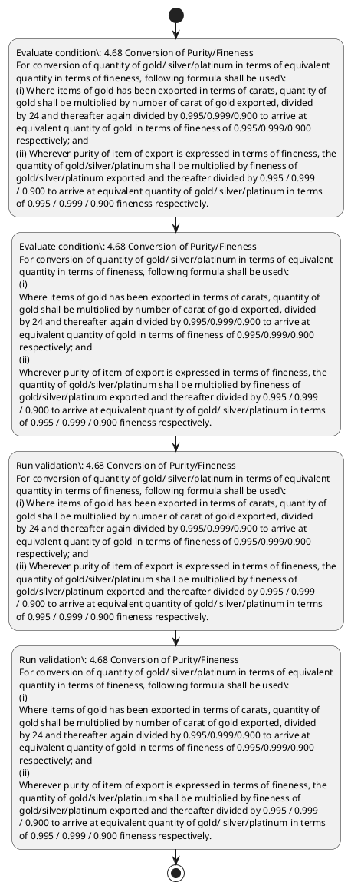

# Chapter 4 / Section 4.68: Conversion of Purity/Fineness

**Chapter Title:** Duty Exemption / Remission Schemes

**Pages:** 41

**Purpose:** 4.68 Conversion of Purity/Fineness
For conversion of quantity of gold/ silver/platinum in terms of equivalent
quantity in terms of fineness, following formula shall be used:
(i) Where items of gold has been exported in terms of carats, quantity of
gold shall be multiplied by number of carat of gold exported, divided
by 24 and thereafter again divided by 0.995/0.999/0.900 to arrive at
equivalent quantity of gold in terms of fineness of 0.995/0.999/0.900
respectively; and
(ii) Wherever purity of item of export is expressed in terms of fineness, the
quantity of gold/silver/platinum shall be multiplied by fineness of
gold/silver/platinum exported and thereafter divided by 0.995 / 0.999
/ 0.900 to arrive at equivalent quantity of gold/ silver/platinum in terms
of 0.995 / 0.999 / 0.900 fineness respectively.

**Purpose Thanglish:** Indha Conversion of Purity/Fineness section-la, 4.68 Conversion of Purity/Fineness
For conversion of quantity of gold/ silver/platinum in terms of equivalent
quantity in terms of fineness, following formula kandippa be used:
(i) Where items of gold has been exported in terms of carats, quantity of
gold kandippa be multiplied by number of carat of gold exported, divided
by 24 and thereafter again divided by 0.995/0.999/0.900 to arrive at
equivalent quantity of gold in terms of fineness of 0.995/0.999/0.900
respectively; and
(ii) Wherever purity of item of export is expressed in terms of fineness, the
quantity of gold/silver/platinum kandippa be multiplied by fineness of
gold/silver/platinum exported and thereafter divided by 0.995 / 0.999
/ 0.900 to arrive at equivalent quantity of gold/ silver/platinum in terms
of 0.995 / 0.999 / 0.900 fineness respectively.

**Summary:** 4.68 Conversion of Purity/Fineness
For conversion of quantity of gold/ silver/platinum in terms of equivalent
quantity in terms of fineness, following formula shall be used:
(i) Where items of gold has been exported in terms of carats, quantity of
gold shall be multiplied by number of carat of gold exported, divided
by 24 and thereafter again divided by 0.995/0.999/0.900 to arrive at
equivalent quantity of gold in terms of fineness of 0.995/0.999/0.900
respectively; and
(ii) Wherever purity of item of export is expressed in terms of fineness, the
quantity of gold/silver/platinum shall be multiplied by fineness of
gold/silver/platinum exported and thereafter divided by 0.995 / 0.999
/ 0.900 to arrive at equivalent quantity of gold/ silver/platinum in terms
of 0.995 / 0.999 / 0.900 fineness respectively. 4.68 Conversion of Purity/Fineness
For conversion of quantity of gold/ silver/platinum in terms of equivalent
quantity in terms of fineness, following formula shall be used:
(i)
Where items of gold has been exported in terms of carats, quantity of
gold shall be multiplied by number of carat of gold exported, divided
by 24 and thereafter again divided by 0.995/0.999/0.900 to arrive at
equivalent quantity of gold in terms of fineness of 0.995/0.999/0.900
respectively; and
(ii)
Wherever purity of item of export is expressed in terms of fineness, the
quantity of gold/silver/platinum shall be multiplied by fineness of
gold/silver/platinum exported and thereafter divided by 0.995 / 0.999
/ 0.900 to arrive at equivalent quantity of gold/ silver/platinum in terms
of 0.995 / 0.999 / 0.900 fineness respectively.

**Business Meaning:** Conversion of Purity/Fineness governs how DGFT business controls should be applied, validated, and enforced.

**Business Explanation:** Conversion of Purity/Fineness explains the operating rule set that DEKAI should enforce. Key control points include 4.68 Conversion of Purity/Fineness
For conversion of quantity of gold/ silver/platinum in terms of equivalent
quantity in terms of fineness, following formula shall be used:
(i) Where items of gold has been exported in terms of carats, quantity of
gold shall be multiplied by number of carat of gold exported, divided
by 24 and thereafter again divided by 0.995/0.999/0.900 to arrive at
equivalent quantity of gold in terms of fineness of 0.995/0.999/0.900
respectively; and
(ii) Wherever purity of item of export is expressed in terms of fineness, the
quantity of gold/silver/platinum shall be multiplied by fineness of
gold/silver/platinum exported and thereafter divided by 0.995 / 0.999
/ 0.900 to arrive at equivalent quantity of gold/ silver/platinum in terms
of 0.995 / 0.999 / 0.900 fineness respectively.

**Business Explanation Thanglish:** Indha Conversion of Purity/Fineness section-la, Conversion of Purity/Fineness explains the operating rule set that DEKAI should enforce. Key control points include 4.68 Conversion of Purity/Fineness
For conversion of quantity of gold/ silver/platinum in terms of equivalent
quantity in terms of fineness, following formula kandippa be used:
(i) Where items of gold has been exported in terms of carats, quantity of
gold kandippa be multiplied by number of carat of gold exported, divided
by 24 and thereafter again divided by 0.995/0.999/0.900 to arrive at
equivalent quantity of gold in terms of fineness of 0.995/0.999/0.900
respectively; and
(ii) Wherever purity of item of export is expressed in terms of fineness, the
quantity of gold/silver/platinum kandippa be multiplied by fineness of
gold/silver/platinum exported and thereafter divided by 0.995 / 0.999
/ 0.900 to arrive at equivalent quantity of gold/ silver/platinum in terms
of 0.995 / 0.999 / 0.900 fineness respectively.

## Business Logic
- 4.68 Conversion of Purity/Fineness
For conversion of quantity of gold/ silver/platinum in terms of equivalent
quantity in terms of fineness, following formula shall be used:
(i) Where items of gold has been exported in terms of carats, quantity of
gold shall be multiplied by number of carat of gold exported, divided
by 24 and thereafter again divided by 0.995/0.999/0.900 to arrive at
equivalent quantity of gold in terms of fineness of 0.995/0.999/0.900
respectively; and
(ii) Wherever purity of item of export is expressed in terms of fineness, the
quantity of gold/silver/platinum shall be multiplied by fineness of
gold/silver/platinum exported and thereafter divided by 0.995 / 0.999
/ 0.900 to arrive at equivalent quantity of gold/ silver/platinum in terms
of 0.995 / 0.999 / 0.900 fineness respectively.
- 4.68 Conversion of Purity/Fineness
For conversion of quantity of gold/ silver/platinum in terms of equivalent
quantity in terms of fineness, following formula shall be used:
(i)
Where items of gold has been exported in terms of carats, quantity of
gold shall be multiplied by number of carat of gold exported, divided
by 24 and thereafter again divided by 0.995/0.999/0.900 to arrive at
equivalent quantity of gold in terms of fineness of 0.995/0.999/0.900
respectively; and
(ii)
Wherever purity of item of export is expressed in terms of fineness, the
quantity of gold/silver/platinum shall be multiplied by fineness of
gold/silver/platinum exported and thereafter divided by 0.995 / 0.999
/ 0.900 to arrive at equivalent quantity of gold/ silver/platinum in terms
of 0.995 / 0.999 / 0.900 fineness respectively.

## Business Rules
- rule_id=CH4-SEC4_68-R001, rule_description=4.68 Conversion of Purity/Fineness
For conversion of quantity of gold/ silver/platinum in terms of equivalent
quantity in terms of fineness, following formula shall be used:
(i) Where items of gold has been exported in terms of carats, quantity of
gold shall be multiplied by number of carat of gold exported, divided
by 24 and thereafter again divided by 0.995/0.999/0.900 to arrive at
equivalent quantity of gold in terms of fineness of 0.995/0.999/0.900
respectively; and
(ii) Wherever purity of item of export is expressed in terms of fineness, the
quantity of gold/silver/platinum shall be multiplied by fineness of
gold/silver/platinum exported and thereafter divided by 0.995 / 0.999
/ 0.900 to arrive at equivalent quantity of gold/ silver/platinum in terms
of 0.995 / 0.999 / 0.900 fineness respectively., trigger=Conversion of Purity/Fineness, condition=4.68 Conversion of Purity/Fineness
For conversion of quantity of gold/ silver/platinum in terms of equivalent
quantity in terms of fineness, following formula shall be used:
(i) Where items of gold has been exported in terms of carats, quantity of
gold shall be multiplied by number of carat of gold exported, divided
by 24 and thereafter again divided by 0.995/0.999/0.900 to arrive at
equivalent quantity of gold in terms of fineness of 0.995/0.999/0.900
respectively; and
(ii) Wherever purity of item of export is expressed in terms of fineness, the
quantity of gold/silver/platinum shall be multiplied by fineness of
gold/silver/platinum exported and thereafter divided by 0.995 / 0.999
/ 0.900 to arrive at equivalent quantity of gold/ silver/platinum in terms
of 0.995 / 0.999 / 0.900 fineness respectively., validation=4.68 Conversion of Purity/Fineness
For conversion of quantity of gold/ silver/platinum in terms of equivalent
quantity in terms of fineness, following formula shall be used:
(i) Where items of gold has been exported in terms of carats, quantity of
gold shall be multiplied by number of carat of gold exported, divided
by 24 and thereafter again divided by 0.995/0.999/0.900 to arrive at
equivalent quantity of gold in terms of fineness of 0.995/0.999/0.900
respectively; and
(ii) Wherever purity of item of export is expressed in terms of fineness, the
quantity of gold/silver/platinum shall be multiplied by fineness of
gold/silver/platinum exported and thereafter divided by 0.995 / 0.999
/ 0.900 to arrive at equivalent quantity of gold/ silver/platinum in terms
of 0.995 / 0.999 / 0.900 fineness respectively., action=Manual review required., exception=No explicit exception found in uploaded documents., output=DEKAI should produce a compliance decision for 4.68 - Conversion of Purity/Fineness.
- rule_id=CH4-SEC4_68-R002, rule_description=4.68 Conversion of Purity/Fineness
For conversion of quantity of gold/ silver/platinum in terms of equivalent
quantity in terms of fineness, following formula shall be used:
(i)
Where items of gold has been exported in terms of carats, quantity of
gold shall be multiplied by number of carat of gold exported, divided
by 24 and thereafter again divided by 0.995/0.999/0.900 to arrive at
equivalent quantity of gold in terms of fineness of 0.995/0.999/0.900
respectively; and
(ii)
Wherever purity of item of export is expressed in terms of fineness, the
quantity of gold/silver/platinum shall be multiplied by fineness of
gold/silver/platinum exported and thereafter divided by 0.995 / 0.999
/ 0.900 to arrive at equivalent quantity of gold/ silver/platinum in terms
of 0.995 / 0.999 / 0.900 fineness respectively., trigger=Conversion of Purity/Fineness, condition=4.68 Conversion of Purity/Fineness
For conversion of quantity of gold/ silver/platinum in terms of equivalent
quantity in terms of fineness, following formula shall be used:
(i)
Where items of gold has been exported in terms of carats, quantity of
gold shall be multiplied by number of carat of gold exported, divided
by 24 and thereafter again divided by 0.995/0.999/0.900 to arrive at
equivalent quantity of gold in terms of fineness of 0.995/0.999/0.900
respectively; and
(ii)
Wherever purity of item of export is expressed in terms of fineness, the
quantity of gold/silver/platinum shall be multiplied by fineness of
gold/silver/platinum exported and thereafter divided by 0.995 / 0.999
/ 0.900 to arrive at equivalent quantity of gold/ silver/platinum in terms
of 0.995 / 0.999 / 0.900 fineness respectively., validation=4.68 Conversion of Purity/Fineness
For conversion of quantity of gold/ silver/platinum in terms of equivalent
quantity in terms of fineness, following formula shall be used:
(i)
Where items of gold has been exported in terms of carats, quantity of
gold shall be multiplied by number of carat of gold exported, divided
by 24 and thereafter again divided by 0.995/0.999/0.900 to arrive at
equivalent quantity of gold in terms of fineness of 0.995/0.999/0.900
respectively; and
(ii)
Wherever purity of item of export is expressed in terms of fineness, the
quantity of gold/silver/platinum shall be multiplied by fineness of
gold/silver/platinum exported and thereafter divided by 0.995 / 0.999
/ 0.900 to arrive at equivalent quantity of gold/ silver/platinum in terms
of 0.995 / 0.999 / 0.900 fineness respectively., action=Manual review required., exception=No explicit exception found in uploaded documents., output=DEKAI should produce a compliance decision for 4.68 - Conversion of Purity/Fineness.

## Conditions
- 4.68 Conversion of Purity/Fineness
For conversion of quantity of gold/ silver/platinum in terms of equivalent
quantity in terms of fineness, following formula shall be used:
(i) Where items of gold has been exported in terms of carats, quantity of
gold shall be multiplied by number of carat of gold exported, divided
by 24 and thereafter again divided by 0.995/0.999/0.900 to arrive at
equivalent quantity of gold in terms of fineness of 0.995/0.999/0.900
respectively; and
(ii) Wherever purity of item of export is expressed in terms of fineness, the
quantity of gold/silver/platinum shall be multiplied by fineness of
gold/silver/platinum exported and thereafter divided by 0.995 / 0.999
/ 0.900 to arrive at equivalent quantity of gold/ silver/platinum in terms
of 0.995 / 0.999 / 0.900 fineness respectively.
- 4.68 Conversion of Purity/Fineness
For conversion of quantity of gold/ silver/platinum in terms of equivalent
quantity in terms of fineness, following formula shall be used:
(i)
Where items of gold has been exported in terms of carats, quantity of
gold shall be multiplied by number of carat of gold exported, divided
by 24 and thereafter again divided by 0.995/0.999/0.900 to arrive at
equivalent quantity of gold in terms of fineness of 0.995/0.999/0.900
respectively; and
(ii)
Wherever purity of item of export is expressed in terms of fineness, the
quantity of gold/silver/platinum shall be multiplied by fineness of
gold/silver/platinum exported and thereafter divided by 0.995 / 0.999
/ 0.900 to arrive at equivalent quantity of gold/ silver/platinum in terms
of 0.995 / 0.999 / 0.900 fineness respectively.

## Condition Logic
- id=4.4.68.1, if=4.68 Conversion of Purity/Fineness
For conversion of quantity of gold/ silver/platinum in terms of equivalent
quantity in terms of fineness, following formula shall be used:
(i) Where items of gold has been exported in terms of carats, quantity of
gold shall be multiplied by number of carat of gold exported, divided
by 24 and thereafter again divided by 0.995/0.999/0.900 to arrive at
equivalent quantity of gold in terms of fineness of 0.995/0.999/0.900
respectively; and
(ii) Wherever purity of item of export is expressed in terms of fineness, the
quantity of gold/silver/platinum shall be multiplied by fineness of
gold/silver/platinum exported and thereafter divided by 0.995 / 0.999
/ 0.900 to arrive at equivalent quantity of gold/ silver/platinum in terms
of 0.995 / 0.999 / 0.900 fineness respectively., then=Route for review, source=4.68 Conversion of Purity/Fineness
For conversion of quantity of gold/ silver/platinum in terms of equivalent
quantity in terms of fineness, following formula shall be used:
(i) Where items of gold has been exported in terms of carats, quantity of
gold shall be multiplied by number of carat of gold exported, divided
by 24 and thereafter again divided by 0.995/0.999/0.900 to arrive at
equivalent quantity of gold in terms of fineness of 0.995/0.999/0.900
respectively; and
(ii) Wherever purity of item of export is expressed in terms of fineness, the
quantity of gold/silver/platinum shall be multiplied by fineness of
gold/silver/platinum exported and thereafter divided by 0.995 / 0.999
/ 0.900 to arrive at equivalent quantity of gold/ silver/platinum in terms
of 0.995 / 0.999 / 0.900 fineness respectively.
- id=4.4.68.2, if=4.68 Conversion of Purity/Fineness
For conversion of quantity of gold/ silver/platinum in terms of equivalent
quantity in terms of fineness, following formula shall be used:
(i)
Where items of gold has been exported in terms of carats, quantity of
gold shall be multiplied by number of carat of gold exported, divided
by 24 and thereafter again divided by 0.995/0.999/0.900 to arrive at
equivalent quantity of gold in terms of fineness of 0.995/0.999/0.900
respectively; and
(ii)
Wherever purity of item of export is expressed in terms of fineness, the
quantity of gold/silver/platinum shall be multiplied by fineness of
gold/silver/platinum exported and thereafter divided by 0.995 / 0.999
/ 0.900 to arrive at equivalent quantity of gold/ silver/platinum in terms
of 0.995 / 0.999 / 0.900 fineness respectively., then=Route for review, source=4.68 Conversion of Purity/Fineness
For conversion of quantity of gold/ silver/platinum in terms of equivalent
quantity in terms of fineness, following formula shall be used:
(i)
Where items of gold has been exported in terms of carats, quantity of
gold shall be multiplied by number of carat of gold exported, divided
by 24 and thereafter again divided by 0.995/0.999/0.900 to arrive at
equivalent quantity of gold in terms of fineness of 0.995/0.999/0.900
respectively; and
(ii)
Wherever purity of item of export is expressed in terms of fineness, the
quantity of gold/silver/platinum shall be multiplied by fineness of
gold/silver/platinum exported and thereafter divided by 0.995 / 0.999
/ 0.900 to arrive at equivalent quantity of gold/ silver/platinum in terms
of 0.995 / 0.999 / 0.900 fineness respectively.

## Validations
- 4.68 Conversion of Purity/Fineness
For conversion of quantity of gold/ silver/platinum in terms of equivalent
quantity in terms of fineness, following formula shall be used:
(i) Where items of gold has been exported in terms of carats, quantity of
gold shall be multiplied by number of carat of gold exported, divided
by 24 and thereafter again divided by 0.995/0.999/0.900 to arrive at
equivalent quantity of gold in terms of fineness of 0.995/0.999/0.900
respectively; and
(ii) Wherever purity of item of export is expressed in terms of fineness, the
quantity of gold/silver/platinum shall be multiplied by fineness of
gold/silver/platinum exported and thereafter divided by 0.995 / 0.999
/ 0.900 to arrive at equivalent quantity of gold/ silver/platinum in terms
of 0.995 / 0.999 / 0.900 fineness respectively.
- 4.68 Conversion of Purity/Fineness
For conversion of quantity of gold/ silver/platinum in terms of equivalent
quantity in terms of fineness, following formula shall be used:
(i)
Where items of gold has been exported in terms of carats, quantity of
gold shall be multiplied by number of carat of gold exported, divided
by 24 and thereafter again divided by 0.995/0.999/0.900 to arrive at
equivalent quantity of gold in terms of fineness of 0.995/0.999/0.900
respectively; and
(ii)
Wherever purity of item of export is expressed in terms of fineness, the
quantity of gold/silver/platinum shall be multiplied by fineness of
gold/silver/platinum exported and thereafter divided by 0.995 / 0.999
/ 0.900 to arrive at equivalent quantity of gold/ silver/platinum in terms
of 0.995 / 0.999 / 0.900 fineness respectively.

## Exceptions
- None identified

## Dependencies
- 2
- 4
- 5
- 6

## Authorities
- None identified

## Required Documents
- None identified

## Timelines
- 4.68 Conversion of Purity/Fineness
For conversion of quantity of gold/ silver/platinum in terms of equivalent
quantity in terms of fineness, following formula shall be used:
(i) Where items of gold has been exported in terms of carats, quantity of
gold shall be multiplied by number of carat of gold exported, divided
by 24 and thereafter again divided by 0.995/0.999/0.900 to arrive at
equivalent quantity of gold in terms of fineness of 0.995/0.999/0.900
respectively; and
(ii) Wherever purity of item of export is expressed in terms of fineness, the
quantity of gold/silver/platinum shall be multiplied by fineness of
gold/silver/platinum exported and thereafter divided by 0.995 / 0.999
/ 0.900 to arrive at equivalent quantity of gold/ silver/platinum in terms
of 0.995 / 0.999 / 0.900 fineness respectively.
- 4.68 Conversion of Purity/Fineness
For conversion of quantity of gold/ silver/platinum in terms of equivalent
quantity in terms of fineness, following formula shall be used:
(i)
Where items of gold has been exported in terms of carats, quantity of
gold shall be multiplied by number of carat of gold exported, divided
by 24 and thereafter again divided by 0.995/0.999/0.900 to arrive at
equivalent quantity of gold in terms of fineness of 0.995/0.999/0.900
respectively; and
(ii)
Wherever purity of item of export is expressed in terms of fineness, the
quantity of gold/silver/platinum shall be multiplied by fineness of
gold/silver/platinum exported and thereafter divided by 0.995 / 0.999
/ 0.900 to arrive at equivalent quantity of gold/ silver/platinum in terms
of 0.995 / 0.999 / 0.900 fineness respectively.

## Actions
- None identified

## Workflow
- Evaluate condition: 4.68 Conversion of Purity/Fineness
For conversion of quantity of gold/ silver/platinum in terms of equivalent
quantity in terms of fineness, following formula shall be used:
(i) Where items of gold has been exported in terms of carats, quantity of
gold shall be multiplied by number of carat of gold exported, divided
by 24 and thereafter again divided by 0.995/0.999/0.900 to arrive at
equivalent quantity of gold in terms of fineness of 0.995/0.999/0.900
respectively; and
(ii) Wherever purity of item of export is expressed in terms of fineness, the
quantity of gold/silver/platinum shall be multiplied by fineness of
gold/silver/platinum exported and thereafter divided by 0.995 / 0.999
/ 0.900 to arrive at equivalent quantity of gold/ silver/platinum in terms
of 0.995 / 0.999 / 0.900 fineness respectively.
- Evaluate condition: 4.68 Conversion of Purity/Fineness
For conversion of quantity of gold/ silver/platinum in terms of equivalent
quantity in terms of fineness, following formula shall be used:
(i)
Where items of gold has been exported in terms of carats, quantity of
gold shall be multiplied by number of carat of gold exported, divided
by 24 and thereafter again divided by 0.995/0.999/0.900 to arrive at
equivalent quantity of gold in terms of fineness of 0.995/0.999/0.900
respectively; and
(ii)
Wherever purity of item of export is expressed in terms of fineness, the
quantity of gold/silver/platinum shall be multiplied by fineness of
gold/silver/platinum exported and thereafter divided by 0.995 / 0.999
/ 0.900 to arrive at equivalent quantity of gold/ silver/platinum in terms
of 0.995 / 0.999 / 0.900 fineness respectively.
- Run validation: 4.68 Conversion of Purity/Fineness
For conversion of quantity of gold/ silver/platinum in terms of equivalent
quantity in terms of fineness, following formula shall be used:
(i) Where items of gold has been exported in terms of carats, quantity of
gold shall be multiplied by number of carat of gold exported, divided
by 24 and thereafter again divided by 0.995/0.999/0.900 to arrive at
equivalent quantity of gold in terms of fineness of 0.995/0.999/0.900
respectively; and
(ii) Wherever purity of item of export is expressed in terms of fineness, the
quantity of gold/silver/platinum shall be multiplied by fineness of
gold/silver/platinum exported and thereafter divided by 0.995 / 0.999
/ 0.900 to arrive at equivalent quantity of gold/ silver/platinum in terms
of 0.995 / 0.999 / 0.900 fineness respectively.
- Run validation: 4.68 Conversion of Purity/Fineness
For conversion of quantity of gold/ silver/platinum in terms of equivalent
quantity in terms of fineness, following formula shall be used:
(i)
Where items of gold has been exported in terms of carats, quantity of
gold shall be multiplied by number of carat of gold exported, divided
by 24 and thereafter again divided by 0.995/0.999/0.900 to arrive at
equivalent quantity of gold in terms of fineness of 0.995/0.999/0.900
respectively; and
(ii)
Wherever purity of item of export is expressed in terms of fineness, the
quantity of gold/silver/platinum shall be multiplied by fineness of
gold/silver/platinum exported and thereafter divided by 0.995 / 0.999
/ 0.900 to arrive at equivalent quantity of gold/ silver/platinum in terms
of 0.995 / 0.999 / 0.900 fineness respectively.

## Workflow ASCII
```text
Conversion of Purity/Fineness
Evaluate condition: 4.68 Conversion of Purity/Fineness
For conversion of quantity of gold/ silver/platinum in terms of equivalent
quantity in terms of fineness, following formula shall be used:
(i) Where items of gold has been exported in terms of carats, quantity of
gold shall be multiplied by number of carat of gold exported, divided
by 24 and thereafter again divided by 0.995/0.999/0.900 to arrive at
equivalent quantity of gold in terms of fineness of 0.995/0.999/0.900
respectively; and
(ii) Wherever purity of item of export is expressed in terms of fineness, the
quantity of gold/silver/platinum shall be multiplied by fineness of
gold/silver/platinum exported and thereafter divided by 0.995 / 0.999
/ 0.900 to arrive at equivalent quantity of gold/ silver/platinum in terms
of 0.995 / 0.999 / 0.900 fineness respectively.
   |
   v
Evaluate condition: 4.68 Conversion of Purity/Fineness
For conversion of quantity of gold/ silver/platinum in terms of equivalent
quantity in terms of fineness, following formula shall be used:
(i)
Where items of gold has been exported in terms of carats, quantity of
gold shall be multiplied by number of carat of gold exported, divided
by 24 and thereafter again divided by 0.995/0.999/0.900 to arrive at
equivalent quantity of gold in terms of fineness of 0.995/0.999/0.900
respectively; and
(ii)
Wherever purity of item of export is expressed in terms of fineness, the
quantity of gold/silver/platinum shall be multiplied by fineness of
gold/silver/platinum exported and thereafter divided by 0.995 / 0.999
/ 0.900 to arrive at equivalent quantity of gold/ silver/platinum in terms
of 0.995 / 0.999 / 0.900 fineness respectively.
   |
   v
Run validation: 4.68 Conversion of Purity/Fineness
For conversion of quantity of gold/ silver/platinum in terms of equivalent
quantity in terms of fineness, following formula shall be used:
(i) Where items of gold has been exported in terms of carats, quantity of
gold shall be multiplied by number of carat of gold exported, divided
by 24 and thereafter again divided by 0.995/0.999/0.900 to arrive at
equivalent quantity of gold in terms of fineness of 0.995/0.999/0.900
respectively; and
(ii) Wherever purity of item of export is expressed in terms of fineness, the
quantity of gold/silver/platinum shall be multiplied by fineness of
gold/silver/platinum exported and thereafter divided by 0.995 / 0.999
/ 0.900 to arrive at equivalent quantity of gold/ silver/platinum in terms
of 0.995 / 0.999 / 0.900 fineness respectively.
   |
   v
Run validation: 4.68 Conversion of Purity/Fineness
For conversion of quantity of gold/ silver/platinum in terms of equivalent
quantity in terms of fineness, following formula shall be used:
(i)
Where items of gold has been exported in terms of carats, quantity of
gold shall be multiplied by number of carat of gold exported, divided
by 24 and thereafter again divided by 0.995/0.999/0.900 to arrive at
equivalent quantity of gold in terms of fineness of 0.995/0.999/0.900
respectively; and
(ii)
Wherever purity of item of export is expressed in terms of fineness, the
quantity of gold/silver/platinum shall be multiplied by fineness of
gold/silver/platinum exported and thereafter divided by 0.995 / 0.999
/ 0.900 to arrive at equivalent quantity of gold/ silver/platinum in terms
of 0.995 / 0.999 / 0.900 fineness respectively.
```

## Decision Tree
- IF section 4.68 applies THEN proceed with standard DGFT workflow

## Decision Tree ASCII
```text
Conversion of Purity/Fineness Decision
IF section 4.68 applies THEN proceed with standard DGFT workflow
```

## Examples
- User asks to process Conversion of Purity/Fineness; the platform checks conditions, validations, and documents before action.

**Real-world Example:** Example: an importer or exporter invokes Conversion of Purity/Fineness, submits the prescribed DGFT records, and DEKAI uses the extracted rules to follow the conversion of purity/fineness process.

**Real-world Example Thanglish:** Indha Conversion of Purity/Fineness section-la, Example: an importer or exporter invokes Conversion of Purity/Fineness, submits the prescribed DGFT records, and DEKAI uses the extracted rules to follow the conversion of purity/fineness process.

## AI Rules
- IF detected context matches section rule THEN enforce: 4.68 Conversion of Purity/Fineness
For conversion of quantity of gold/ silver/platinum in terms of equivalent
quantity in terms of fineness, following formula shall be used:
(i) Where items of gold has been exported in terms of carats, quantity of
gold shall be multiplied by number of carat of gold exported, divided
by 24 and thereafter again divided by 0.995/0.999/0.900 to arrive at
equivalent quantity of gold in terms of fineness of 0.995/0.999/0.900
respectively; and
(ii) Wherever purity of item of export is expressed in terms of fineness, the
quantity of gold/silver/platinum shall be multiplied by fineness of
gold/silver/platinum exported and thereafter divided by 0.995 / 0.999
/ 0.900 to arrive at equivalent quantity of gold/ silver/platinum in terms
of 0.995 / 0.999 / 0.900 fineness respectively.
- IF detected context matches section rule THEN enforce: 4.68 Conversion of Purity/Fineness
For conversion of quantity of gold/ silver/platinum in terms of equivalent
quantity in terms of fineness, following formula shall be used:
(i)
Where items of gold has been exported in terms of carats, quantity of
gold shall be multiplied by number of carat of gold exported, divided
by 24 and thereafter again divided by 0.995/0.999/0.900 to arrive at
equivalent quantity of gold in terms of fineness of 0.995/0.999/0.900
respectively; and
(ii)
Wherever purity of item of export is expressed in terms of fineness, the
quantity of gold/silver/platinum shall be multiplied by fineness of
gold/silver/platinum exported and thereafter divided by 0.995 / 0.999
/ 0.900 to arrive at equivalent quantity of gold/ silver/platinum in terms
of 0.995 / 0.999 / 0.900 fineness respectively.

## Database Fields
- name=section_code, type=string, required=True, source=parsed_section_heading
- name=section_title, type=string, required=True, source=parsed_section_heading
- name=for_flag, type=boolean, required=False, source=keyword:For
- name=has_flag, type=boolean, required=False, source=keyword:has
- name=and_flag, type=boolean, required=False, source=keyword:and
- name=the_flag, type=boolean, required=False, source=keyword:the
- name=gold_flag, type=boolean, required=False, source=keyword:gold
- name=used_flag, type=boolean, required=False, source=keyword:used
- name=been_flag, type=boolean, required=False, source=keyword:been
- name=item_flag, type=boolean, required=False, source=keyword:item

## API Requirements
- method=GET, path=/api/dgft/sections/4.68, purpose=Retrieve knowledge payload for section 4.68, query_params=['include=workflow,decision_tree,validations'], response_fields=['section', 'title', 'summary', 'conditions', 'validations', 'exceptions', 'workflow', 'decision_tree']
- method=POST, path=/api/dgft/Conversion-of-Purity-Fineness/validate, purpose=Validate inputs and documents for Conversion of Purity/Fineness, request_fields=['section_code', 'section_title'], response_fields=['status', 'errors', 'warnings', 'next_actions']

## UI Screens
- screen_id=Conversion_of_Purity_Fineness_overview, name=Conversion of Purity/Fineness Overview, purpose=Show section summary, authority, timeline, and eligibility cues., widgets=['summary_card', 'conditions_table', 'authority_badges', 'timeline_panel']
- screen_id=Conversion_of_Purity_Fineness_submission, name=Conversion of Purity/Fineness Submission, purpose=Capture applicant data and supporting documents., widgets=['dynamic_form', 'document_uploader', 'validation_panel', 'next_action_footer'], fields=['section_code', 'section_title', 'for_flag', 'has_flag', 'and_flag', 'the_flag', 'gold_flag', 'used_flag']

## Error Messages
- Validation failed because the section requirements were not fully met.

## FAQ
- question_en=What is the purpose of section 4.68?, answer_en=Conversion of Purity/Fineness explains the operating rule set that DEKAI should enforce. Key control points include 4.68 Conversion of Purity/Fineness
For conversion of quantity of gold/ silver/platinum in terms of equivalent
quantity in terms of fineness, following formula shall be used:
(i) Where items of gold has been exported in terms of carats, quantity of
gold shall be multiplied by number of carat of gold exported, divided
by 24 and thereafter again divided by 0.995/0.999/0.900 to arrive at
equivalent quantity of gold in terms of fineness of 0.995/0.999/0.900
respectively; and
(ii) Wherever purity of item of export is expressed in terms of fineness, the
quantity of gold/silver/platinum shall be multiplied by fineness of
gold/silver/platinum exported and thereafter divided by 0.995 / 0.999
/ 0.900 to arrive at equivalent quantity of gold/ silver/platinum in terms
of 0.995 / 0.999 / 0.900 fineness respectively., question_thanglish=Indha Conversion of Purity/Fineness section-la, What is the purpose of section 4.68?, answer_thanglish=Indha Conversion of Purity/Fineness section-la, Conversion of Purity/Fineness explains the operating rule set that DEKAI should enforce. Key control points include 4.68 Conversion of Purity/Fineness
For conversion of quantity of gold/ silver/platinum in terms of equivalent
quantity in terms of fineness, following formula kandippa be used:
(i) Where items of gold has been exported in terms of carats, quantity of
gold kandippa be multiplied by number of carat of gold exported, divided
by 24 and thereafter again divided by 0.995/0.999/0.900 to arrive at
equivalent quantity of gold in terms of fineness of 0.995/0.999/0.900
respectively; and
(ii) Wherever purity of item of export is expressed in terms of fineness, the
quantity of gold/silver/platinum kandippa be multiplied by fineness of
gold/silver/platinum exported and thereafter divided by 0.995 / 0.999
/ 0.900 to arrive at equivalent quantity of gold/ silver/platinum in terms
of 0.995 / 0.999 / 0.900 fineness respectively.
- question_en=What documents are required under Conversion of Purity/Fineness?, answer_en=Not explicitly covered in uploaded documents., question_thanglish=Indha Conversion of Purity/Fineness section-la, What documents are required under Conversion of Purity/Fineness?, answer_thanglish=Indha Conversion of Purity/Fineness section-la, Not explicitly covered in uploaded documents.
- question_en=Which authority handles Conversion of Purity/Fineness?, answer_en=Not explicitly covered in uploaded documents., question_thanglish=Indha Conversion of Purity/Fineness section-la, Which authority handles Conversion of Purity/Fineness?, answer_thanglish=Indha Conversion of Purity/Fineness section-la, Not explicitly covered in uploaded documents.

## Questions Users May Ask
- What does Conversion of Purity/Fineness require?
- Which documents are needed for Conversion of Purity/Fineness?
- How does DEKAI validate Conversion of Purity/Fineness requests?

## Expected AI Answers
- Conversion of Purity/Fineness requires the platform to interpret the section text, apply the extracted business rules, and present the correct next action.
- Required documents are inferred from the section text: no explicit documents were detected.
- DEKAI validates Conversion of Purity/Fineness by checking conditions, required documents, authority references, and exception clauses before recommending an outcome.

## AI Q&A Examples
- question_en=User asks: How do I comply with Conversion of Purity/Fineness?, answer_en=AI answers: DEKAI should evaluate section 4.68, apply the extracted rules, and guide the user through Evaluate condition: 4.68 Conversion of Purity/Fineness
For conversion of quantity of gold/ silver/platinum in terms of equivalent
quantity in terms of fineness, following formula shall be used:
(i) Where items of gold has been exported in terms of carats, quantity of
gold shall be multiplied by number of carat of gold exported, divided
by 24 and thereafter again divided by 0.995/0.999/0.900 to arrive at
equivalent quantity of gold in terms of fineness of 0.995/0.999/0.900
respectively; and
(ii) Wherever purity of item of export is expressed in terms of fineness, the
quantity of gold/silver/platinum shall be multiplied by fineness of
gold/silver/platinum exported and thereafter divided by 0.995 / 0.999
/ 0.900 to arrive at equivalent quantity of gold/ silver/platinum in terms
of 0.995 / 0.999 / 0.900 fineness respectively.., question_thanglish=Indha Conversion of Purity/Fineness section-la, User asks: How do I comply with Conversion of Purity/Fineness?, answer_thanglish=Indha Conversion of Purity/Fineness section-la, AI answers: DEKAI should evaluate section 4.68, apply the extracted rules, and guide the user through Evaluate condition: 4.68 Conversion of Purity/Fineness
For conversion of quantity of gold/ silver/platinum in terms of equivalent
quantity in terms of fineness, following formula kandippa be used:
(i) Where items of gold has been exported in terms of carats, quantity of
gold kandippa be multiplied by number of carat of gold exported, divided
by 24 and thereafter again divided by 0.995/0.999/0.900 to arrive at
equivalent quantity of gold in terms of fineness of 0.995/0.999/0.900
respectively; and
(ii) Wherever purity of item of export is expressed in terms of fineness, the
quantity of gold/silver/platinum kandippa be multiplied by fineness of
gold/silver/platinum exported and thereafter divided by 0.995 / 0.999
/ 0.900 to arrive at equivalent quantity of gold/ silver/platinum in terms
of 0.995 / 0.999 / 0.900 fineness respectively..
- question_en=User asks: Which validations apply to Conversion of Purity/Fineness?, answer_en=AI answers: Applicable validations are 4.68 Conversion of Purity/Fineness
For conversion of quantity of gold/ silver/platinum in terms of equivalent
quantity in terms of fineness, following formula shall be used:
(i) Where items of gold has been exported in terms of carats, quantity of
gold shall be multiplied by number of carat of gold exported, divided
by 24 and thereafter again divided by 0.995/0.999/0.900 to arrive at
equivalent quantity of gold in terms of fineness of 0.995/0.999/0.900
respectively; and
(ii) Wherever purity of item of export is expressed in terms of fineness, the
quantity of gold/silver/platinum shall be multiplied by fineness of
gold/silver/platinum exported and thereafter divided by 0.995 / 0.999
/ 0.900 to arrive at equivalent quantity of gold/ silver/platinum in terms
of 0.995 / 0.999 / 0.900 fineness respectively., 4.68 Conversion of Purity/Fineness
For conversion of quantity of gold/ silver/platinum in terms of equivalent
quantity in terms of fineness, following formula shall be used:
(i)
Where items of gold has been exported in terms of carats, quantity of
gold shall be multiplied by number of carat of gold exported, divided
by 24 and thereafter again divided by 0.995/0.999/0.900 to arrive at
equivalent quantity of gold in terms of fineness of 0.995/0.999/0.900
respectively; and
(ii)
Wherever purity of item of export is expressed in terms of fineness, the
quantity of gold/silver/platinum shall be multiplied by fineness of
gold/silver/platinum exported and thereafter divided by 0.995 / 0.999
/ 0.900 to arrive at equivalent quantity of gold/ silver/platinum in terms
of 0.995 / 0.999 / 0.900 fineness respectively., question_thanglish=Indha Conversion of Purity/Fineness section-la, User asks: Which validations apply to Conversion of Purity/Fineness?, answer_thanglish=Indha Conversion of Purity/Fineness section-la, AI answers: Applicable validations are 4.68 Conversion of Purity/Fineness
For conversion of quantity of gold/ silver/platinum in terms of equivalent
quantity in terms of fineness, following formula kandippa be used:
(i) Where items of gold has been exported in terms of carats, quantity of
gold kandippa be multiplied by number of carat of gold exported, divided
by 24 and thereafter again divided by 0.995/0.999/0.900 to arrive at
equivalent quantity of gold in terms of fineness of 0.995/0.999/0.900
respectively; and
(ii) Wherever purity of item of export is expressed in terms of fineness, the
quantity of gold/silver/platinum kandippa be multiplied by fineness of
gold/silver/platinum exported and thereafter divided by 0.995 / 0.999
/ 0.900 to arrive at equivalent quantity of gold/ silver/platinum in terms
of 0.995 / 0.999 / 0.900 fineness respectively., 4.68 Conversion of Purity/Fineness
For conversion of quantity of gold/ silver/platinum in terms of equivalent
quantity in terms of fineness, following formula kandippa be used:
(i)
Where items of gold has been exported in terms of carats, quantity of
gold kandippa be multiplied by number of carat of gold exported, divided
by 24 and thereafter again divided by 0.995/0.999/0.900 to arrive at
equivalent quantity of gold in terms of fineness of 0.995/0.999/0.900
respectively; and
(ii)
Wherever purity of item of export is expressed in terms of fineness, the
quantity of gold/silver/platinum kandippa be multiplied by fineness of
gold/silver/platinum exported and thereafter divided by 0.995 / 0.999
/ 0.900 to arrive at equivalent quantity of gold/ silver/platinum in terms
of 0.995 / 0.999 / 0.900 fineness respectively.

## DEKAI AI Implementation Notes
- Capture chapter 4, section 4.68, title, and page references as immutable knowledge metadata.
- Bind validations for Conversion of Purity/Fineness into a rule engine keyed by the rule IDs extracted for this section.
- Show contextual links to related sections: 2, 4, 5, 6.

## DEKAI AI Implementation Notes Thanglish
- Indha Conversion of Purity/Fineness section-la, Capture chapter 4, section 4.68, title, and page references as immutable knowledge metadata.
- Indha Conversion of Purity/Fineness section-la, Bind validations for Conversion of Purity/Fineness into a rule engine keyed by the rule IDs extracted for this section.
- Indha Conversion of Purity/Fineness section-la, Show contextual links to related sections: 2, 4, 5, 6.

## AI Metadata
- Keywords: For, has, and, the, gold, used, been, item, terms, shall, Where, items, carat, again, carats, number, arrive, purity, export, formula
- Search Keywords: For, has, and, the, gold, used, been, item, terms, shall, Where, items, carat, again, carats, number, arrive, purity, export, formula
- Intent: Provide knowledge guidance for Conversion of Purity/Fineness.
- Tags: 4.68, Conversion of Purity/Fineness, business-rule, dgft
- Related Sections: 2, 4, 5, 6
- Related Chapters: 
- Related Rules: 4.68 Conversion of Purity/Fineness
For conversion of quantity of gold/ silver/platinum in terms of equivalent
quantity in terms of fineness, following formula shall be used:
(i) Where items of gold has been exported in terms of carats, quantity of
gold shall be multiplied by number of carat of gold exported, divided
by 24 and thereafter again divided by 0.995/0.999/0.900 to arrive at
equivalent quantity of gold in terms of fineness of 0.995/0.999/0.900
respectively; and
(ii) Wherever purity of item of export is expressed in terms of fineness, the
quantity of gold/silver/platinum shall be multiplied by fineness of
gold/silver/platinum exported and thereafter divided by 0.995 / 0.999
/ 0.900 to arrive at equivalent quantity of gold/ silver/platinum in terms
of 0.995 / 0.999 / 0.900 fineness respectively., 4.68 Conversion of Purity/Fineness
For conversion of quantity of gold/ silver/platinum in terms of equivalent
quantity in terms of fineness, following formula shall be used:
(i)
Where items of gold has been exported in terms of carats, quantity of
gold shall be multiplied by number of carat of gold exported, divided
by 24 and thereafter again divided by 0.995/0.999/0.900 to arrive at
equivalent quantity of gold in terms of fineness of 0.995/0.999/0.900
respectively; and
(ii)
Wherever purity of item of export is expressed in terms of fineness, the
quantity of gold/silver/platinum shall be multiplied by fineness of
gold/silver/platinum exported and thereafter divided by 0.995 / 0.999
/ 0.900 to arrive at equivalent quantity of gold/ silver/platinum in terms
of 0.995 / 0.999 / 0.900 fineness respectively.

## Mermaid

```mermaid
flowchart TD
    S1["Evaluate condition: 4.68 Conversion of Purity/Fineness
For conversion of quantity of gold/ silver/platinum in terms of equivalent
quantity in terms of fineness, following formula shall be used:
(i) Where items of gold has been exported in terms of carats, quantity of
gold shall be multiplied by number of carat of gold exported, divided
by 24 and thereafter again divided by 0.995/0.999/0.900 to arrive at
equivalent quantity of gold in terms of fineness of 0.995/0.999/0.900
respectively; and
(ii) Wherever purity of item of export is expressed in terms of fineness, the
quantity of gold/silver/platinum shall be multiplied by fineness of
gold/silver/platinum exported and thereafter divided by 0.995 / 0.999
/ 0.900 to arrive at equivalent quantity of gold/ silver/platinum in terms
of 0.995 / 0.999 / 0.900 fineness respectively."]
    S2["Evaluate condition: 4.68 Conversion of Purity/Fineness
For conversion of quantity of gold/ silver/platinum in terms of equivalent
quantity in terms of fineness, following formula shall be used:
(i)
Where items of gold has been exported in terms of carats, quantity of
gold shall be multiplied by number of carat of gold exported, divided
by 24 and thereafter again divided by 0.995/0.999/0.900 to arrive at
equivalent quantity of gold in terms of fineness of 0.995/0.999/0.900
respectively; and
(ii)
Wherever purity of item of export is expressed in terms of fineness, the
quantity of gold/silver/platinum shall be multiplied by fineness of
gold/silver/platinum exported and thereafter divided by 0.995 / 0.999
/ 0.900 to arrive at equivalent quantity of gold/ silver/platinum in terms
of 0.995 / 0.999 / 0.900 fineness respectively."]
    S1 --> S2
    S3["Run validation: 4.68 Conversion of Purity/Fineness
For conversion of quantity of gold/ silver/platinum in terms of equivalent
quantity in terms of fineness, following formula shall be used:
(i) Where items of gold has been exported in terms of carats, quantity of
gold shall be multiplied by number of carat of gold exported, divided
by 24 and thereafter again divided by 0.995/0.999/0.900 to arrive at
equivalent quantity of gold in terms of fineness of 0.995/0.999/0.900
respectively; and
(ii) Wherever purity of item of export is expressed in terms of fineness, the
quantity of gold/silver/platinum shall be multiplied by fineness of
gold/silver/platinum exported and thereafter divided by 0.995 / 0.999
/ 0.900 to arrive at equivalent quantity of gold/ silver/platinum in terms
of 0.995 / 0.999 / 0.900 fineness respectively."]
    S2 --> S3
    S4["Run validation: 4.68 Conversion of Purity/Fineness
For conversion of quantity of gold/ silver/platinum in terms of equivalent
quantity in terms of fineness, following formula shall be used:
(i)
Where items of gold has been exported in terms of carats, quantity of
gold shall be multiplied by number of carat of gold exported, divided
by 24 and thereafter again divided by 0.995/0.999/0.900 to arrive at
equivalent quantity of gold in terms of fineness of 0.995/0.999/0.900
respectively; and
(ii)
Wherever purity of item of export is expressed in terms of fineness, the
quantity of gold/silver/platinum shall be multiplied by fineness of
gold/silver/platinum exported and thereafter divided by 0.995 / 0.999
/ 0.900 to arrive at equivalent quantity of gold/ silver/platinum in terms
of 0.995 / 0.999 / 0.900 fineness respectively."]
    S3 --> S4
```


## PlantUML

