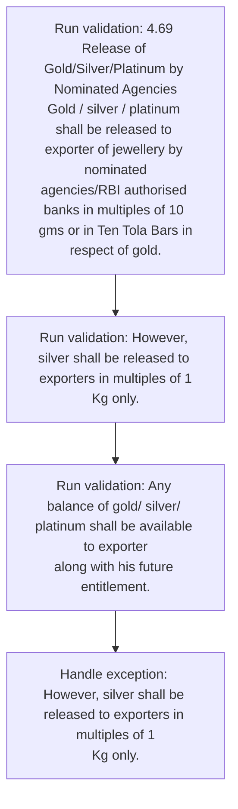
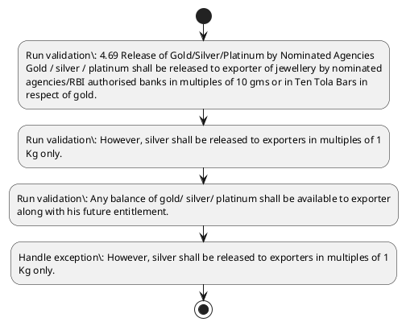

# Chapter 4 / Section 4.69: Release of Gold/Silver/Platinum by Nominated Agencies

**Chapter Title:** Duty Exemption / Remission Schemes

**Pages:** 41

**Purpose:** 4.69 Release of Gold/Silver/Platinum by Nominated Agencies
Gold / silver / platinum shall be released to exporter of jewellery by nominated
agencies/RBI authorised banks in multiples of 10 gms or in Ten Tola Bars in
respect of gold.

**Purpose Thanglish:** Indha Release of Gold/Silver/Platinum by Nominated Agencies section-la, 4.69 Release of Gold/Silver/Platinum by Nominated Agencies
Gold / silver / platinum kandippa be released to exporter of jewellery by nominated
agencies/RBI authorised banks in multiples of 10 gms or in Ten Tola Bars in
respect of gold.

**Summary:** 4.69 Release of Gold/Silver/Platinum by Nominated Agencies
Gold / silver / platinum shall be released to exporter of jewellery by nominated
agencies/RBI authorised banks in multiples of 10 gms or in Ten Tola Bars in
respect of gold. However, silver shall be released to exporters in multiples of 1
Kg only. Any balance of gold/ silver/ platinum shall be available to exporter
along with his future entitlement.

**Business Meaning:** Release of Gold/Silver/Platinum by Nominated Agencies governs how DGFT business controls should be applied, validated, and enforced.

**Business Explanation:** Release of Gold/Silver/Platinum by Nominated Agencies explains the operating rule set that DEKAI should enforce. Key control points include 4.69 Release of Gold/Silver/Platinum by Nominated Agencies
Gold / silver / platinum shall be released to exporter of jewellery by nominated
agencies/RBI authorised banks in multiples of 10 gms or in Ten Tola Bars in
respect of gold.

**Business Explanation Thanglish:** Indha Release of Gold/Silver/Platinum by Nominated Agencies section-la, Release of Gold/Silver/Platinum by Nominated Agencies explains the operating rule set that DEKAI should enforce. Key control points include 4.69 Release of Gold/Silver/Platinum by Nominated Agencies
Gold / silver / platinum kandippa be released to exporter of jewellery by nominated
agencies/RBI authorised banks in multiples of 10 gms or in Ten Tola Bars in
respect of gold.

## Business Logic
- 4.69 Release of Gold/Silver/Platinum by Nominated Agencies
Gold / silver / platinum shall be released to exporter of jewellery by nominated
agencies/RBI authorised banks in multiples of 10 gms or in Ten Tola Bars in
respect of gold.
- However, silver shall be released to exporters in multiples of 1
Kg only.
- Any balance of gold/ silver/ platinum shall be available to exporter
along with his future entitlement.
- Gold/ silver shall be released by the
nominated agencies in terms of 0.995 fineness or more and platinum in terms
of 0.900 fineness or more.

## Business Rules
- rule_id=CH4-SEC4_69-R001, rule_description=4.69 Release of Gold/Silver/Platinum by Nominated Agencies
Gold / silver / platinum shall be released to exporter of jewellery by nominated
agencies/RBI authorised banks in multiples of 10 gms or in Ten Tola Bars in
respect of gold., trigger=Release of Gold/Silver/Platinum by Nominated Agencies, condition=Not explicitly covered in uploaded documents., validation=4.69 Release of Gold/Silver/Platinum by Nominated Agencies
Gold / silver / platinum shall be released to exporter of jewellery by nominated
agencies/RBI authorised banks in multiples of 10 gms or in Ten Tola Bars in
respect of gold., action=Manual review required., exception=However, silver shall be released to exporters in multiples of 1
Kg only., output=DEKAI should produce a compliance decision for 4.69 - Release of Gold/Silver/Platinum by Nominated Agencies.
- rule_id=CH4-SEC4_69-R002, rule_description=However, silver shall be released to exporters in multiples of 1
Kg only., trigger=Release of Gold/Silver/Platinum by Nominated Agencies, condition=Not explicitly covered in uploaded documents., validation=However, silver shall be released to exporters in multiples of 1
Kg only., action=Manual review required., exception=However, silver shall be released to exporters in multiples of 1
Kg only., output=DEKAI should produce a compliance decision for 4.69 - Release of Gold/Silver/Platinum by Nominated Agencies.
- rule_id=CH4-SEC4_69-R003, rule_description=Any balance of gold/ silver/ platinum shall be available to exporter
along with his future entitlement., trigger=Release of Gold/Silver/Platinum by Nominated Agencies, condition=Not explicitly covered in uploaded documents., validation=Any balance of gold/ silver/ platinum shall be available to exporter
along with his future entitlement., action=Manual review required., exception=However, silver shall be released to exporters in multiples of 1
Kg only., output=DEKAI should produce a compliance decision for 4.69 - Release of Gold/Silver/Platinum by Nominated Agencies.
- rule_id=CH4-SEC4_69-R004, rule_description=Gold/ silver shall be released by the
nominated agencies in terms of 0.995 fineness or more and platinum in terms
of 0.900 fineness or more., trigger=Release of Gold/Silver/Platinum by Nominated Agencies, condition=Not explicitly covered in uploaded documents., validation=Gold/ silver shall be released by the
nominated agencies in terms of 0.995 fineness or more and platinum in terms
of 0.900 fineness or more., action=Manual review required., exception=However, silver shall be released to exporters in multiples of 1
Kg only., output=DEKAI should produce a compliance decision for 4.69 - Release of Gold/Silver/Platinum by Nominated Agencies.

## Conditions
- None identified

## Condition Logic
- None identified

## Validations
- 4.69 Release of Gold/Silver/Platinum by Nominated Agencies
Gold / silver / platinum shall be released to exporter of jewellery by nominated
agencies/RBI authorised banks in multiples of 10 gms or in Ten Tola Bars in
respect of gold.
- However, silver shall be released to exporters in multiples of 1
Kg only.
- Any balance of gold/ silver/ platinum shall be available to exporter
along with his future entitlement.
- Gold/ silver shall be released by the
nominated agencies in terms of 0.995 fineness or more and platinum in terms
of 0.900 fineness or more.

## Exceptions
- However, silver shall be released to exporters in multiples of 1
Kg only.

## Dependencies
- 1
- 4
- 5
- 6

## Authorities
- None identified

## Required Documents
- None identified

## Timelines
- None identified

## Actions
- None identified

## Workflow
- Run validation: 4.69 Release of Gold/Silver/Platinum by Nominated Agencies
Gold / silver / platinum shall be released to exporter of jewellery by nominated
agencies/RBI authorised banks in multiples of 10 gms or in Ten Tola Bars in
respect of gold.
- Run validation: However, silver shall be released to exporters in multiples of 1
Kg only.
- Run validation: Any balance of gold/ silver/ platinum shall be available to exporter
along with his future entitlement.
- Handle exception: However, silver shall be released to exporters in multiples of 1
Kg only.

## Workflow ASCII
```text
Release of Gold/Silver/Platinum by Nominated Agencies
Run validation: 4.69 Release of Gold/Silver/Platinum by Nominated Agencies
Gold / silver / platinum shall be released to exporter of jewellery by nominated
agencies/RBI authorised banks in multiples of 10 gms or in Ten Tola Bars in
respect of gold.
   |
   v
Run validation: However, silver shall be released to exporters in multiples of 1
Kg only.
   |
   v
Run validation: Any balance of gold/ silver/ platinum shall be available to exporter
along with his future entitlement.
   |
   v
Handle exception: However, silver shall be released to exporters in multiples of 1
Kg only.
```

## Decision Tree
- IF exception applies (However, silver shall be released to exporters in multiples of 1
Kg only.) THEN route to manual review

## Decision Tree ASCII
```text
Release of Gold/Silver/Platinum by Nominated Agencies Decision
IF exception applies (However, silver shall be released to exporters in multiples of 1
Kg only.) THEN route to manual review
```

## Examples
- User asks to process Release of Gold/Silver/Platinum by Nominated Agencies; the platform checks conditions, validations, and documents before action.

**Real-world Example:** Example: an importer or exporter invokes Release of Gold/Silver/Platinum by Nominated Agencies, submits the prescribed DGFT records, and DEKAI uses the extracted rules to follow the release of gold/silver/platinum by nominated agencies process.

**Real-world Example Thanglish:** Indha Release of Gold/Silver/Platinum by Nominated Agencies section-la, Example: an importer or exporter invokes Release of Gold/Silver/Platinum by Nominated Agencies, submits the prescribed DGFT records, and DEKAI uses the extracted rules to follow the release of gold/silver/platinum by nominated agencies process.

## AI Rules
- IF detected context matches section rule THEN enforce: 4.69 Release of Gold/Silver/Platinum by Nominated Agencies
Gold / silver / platinum shall be released to exporter of jewellery by nominated
agencies/RBI authorised banks in multiples of 10 gms or in Ten Tola Bars in
respect of gold.
- IF detected context matches section rule THEN enforce: However, silver shall be released to exporters in multiples of 1
Kg only.
- IF detected context matches section rule THEN enforce: Any balance of gold/ silver/ platinum shall be available to exporter
along with his future entitlement.
- IF detected context matches section rule THEN enforce: Gold/ silver shall be released by the
nominated agencies in terms of 0.995 fineness or more and platinum in terms
of 0.900 fineness or more.

## Database Fields
- name=section_code, type=string, required=True, source=parsed_section_heading
- name=section_title, type=string, required=True, source=parsed_section_heading
- name=gms_flag, type=boolean, required=False, source=keyword:gms
- name=ten_flag, type=boolean, required=False, source=keyword:Ten
- name=any_flag, type=boolean, required=False, source=keyword:Any
- name=his_flag, type=boolean, required=False, source=keyword:his
- name=the_flag, type=boolean, required=False, source=keyword:the
- name=and_flag, type=boolean, required=False, source=keyword:and
- name=gold_flag, type=boolean, required=False, source=keyword:Gold
- name=tola_flag, type=boolean, required=False, source=keyword:Tola

## API Requirements
- method=GET, path=/api/dgft/sections/4.69, purpose=Retrieve knowledge payload for section 4.69, query_params=['include=workflow,decision_tree,validations'], response_fields=['section', 'title', 'summary', 'conditions', 'validations', 'exceptions', 'workflow', 'decision_tree']
- method=POST, path=/api/dgft/Release-of-Gold-Silver-Platinum-by-Nominated-Agencies/validate, purpose=Validate inputs and documents for Release of Gold/Silver/Platinum by Nominated Agencies, request_fields=['section_code', 'section_title'], response_fields=['status', 'errors', 'warnings', 'next_actions']

## UI Screens
- screen_id=Release_of_Gold_Silver_Platinum_by_Nominated_Agencies_overview, name=Release of Gold/Silver/Platinum by Nominated Agencies Overview, purpose=Show section summary, authority, timeline, and eligibility cues., widgets=['summary_card', 'conditions_table', 'authority_badges', 'timeline_panel']
- screen_id=Release_of_Gold_Silver_Platinum_by_Nominated_Agencies_submission, name=Release of Gold/Silver/Platinum by Nominated Agencies Submission, purpose=Capture applicant data and supporting documents., widgets=['dynamic_form', 'document_uploader', 'validation_panel', 'next_action_footer'], fields=['section_code', 'section_title', 'gms_flag', 'ten_flag', 'any_flag', 'his_flag', 'the_flag', 'and_flag']
- screen_id=Release_of_Gold_Silver_Platinum_by_Nominated_Agencies_exceptions, name=Release of Gold/Silver/Platinum by Nominated Agencies Exception Review, purpose=Explain exception handling and manual review triggers., widgets=['exception_banner', 'decision_tree', 'case_notes']

## Error Messages
- Validation failed because the section requirements were not fully met.

## FAQ
- question_en=What is the purpose of section 4.69?, answer_en=Release of Gold/Silver/Platinum by Nominated Agencies explains the operating rule set that DEKAI should enforce. Key control points include 4.69 Release of Gold/Silver/Platinum by Nominated Agencies
Gold / silver / platinum shall be released to exporter of jewellery by nominated
agencies/RBI authorised banks in multiples of 10 gms or in Ten Tola Bars in
respect of gold., question_thanglish=Indha Release of Gold/Silver/Platinum by Nominated Agencies section-la, What is the purpose of section 4.69?, answer_thanglish=Indha Release of Gold/Silver/Platinum by Nominated Agencies section-la, Release of Gold/Silver/Platinum by Nominated Agencies explains the operating rule set that DEKAI should enforce. Key control points include 4.69 Release of Gold/Silver/Platinum by Nominated Agencies
Gold / silver / platinum kandippa be released to exporter of jewellery by nominated
agencies/RBI authorised banks in multiples of 10 gms or in Ten Tola Bars in
respect of gold.
- question_en=What documents are required under Release of Gold/Silver/Platinum by Nominated Agencies?, answer_en=Not explicitly covered in uploaded documents., question_thanglish=Indha Release of Gold/Silver/Platinum by Nominated Agencies section-la, What documents are required under Release of Gold/Silver/Platinum by Nominated Agencies?, answer_thanglish=Indha Release of Gold/Silver/Platinum by Nominated Agencies section-la, Not explicitly covered in uploaded documents.
- question_en=Which authority handles Release of Gold/Silver/Platinum by Nominated Agencies?, answer_en=Not explicitly covered in uploaded documents., question_thanglish=Indha Release of Gold/Silver/Platinum by Nominated Agencies section-la, Which authority handles Release of Gold/Silver/Platinum by Nominated Agencies?, answer_thanglish=Indha Release of Gold/Silver/Platinum by Nominated Agencies section-la, Not explicitly covered in uploaded documents.

## Questions Users May Ask
- What does Release of Gold/Silver/Platinum by Nominated Agencies require?
- Which documents are needed for Release of Gold/Silver/Platinum by Nominated Agencies?
- How does DEKAI validate Release of Gold/Silver/Platinum by Nominated Agencies requests?

## Expected AI Answers
- Release of Gold/Silver/Platinum by Nominated Agencies requires the platform to interpret the section text, apply the extracted business rules, and present the correct next action.
- Required documents are inferred from the section text: no explicit documents were detected.
- DEKAI validates Release of Gold/Silver/Platinum by Nominated Agencies by checking conditions, required documents, authority references, and exception clauses before recommending an outcome.

## AI Q&A Examples
- question_en=User asks: How do I comply with Release of Gold/Silver/Platinum by Nominated Agencies?, answer_en=AI answers: DEKAI should evaluate section 4.69, apply the extracted rules, and guide the user through Run validation: 4.69 Release of Gold/Silver/Platinum by Nominated Agencies
Gold / silver / platinum shall be released to exporter of jewellery by nominated
agencies/RBI authorised banks in multiples of 10 gms or in Ten Tola Bars in
respect of gold.., question_thanglish=Indha Release of Gold/Silver/Platinum by Nominated Agencies section-la, User asks: How do I comply with Release of Gold/Silver/Platinum by Nominated Agencies?, answer_thanglish=Indha Release of Gold/Silver/Platinum by Nominated Agencies section-la, AI answers: DEKAI should evaluate section 4.69, apply the extracted rules, and guide the user through Run validation: 4.69 Release of Gold/Silver/Platinum by Nominated Agencies
Gold / silver / platinum kandippa be released to exporter of jewellery by nominated
agencies/RBI authorised banks in multiples of 10 gms or in Ten Tola Bars in
respect of gold..
- question_en=User asks: Which validations apply to Release of Gold/Silver/Platinum by Nominated Agencies?, answer_en=AI answers: Applicable validations are 4.69 Release of Gold/Silver/Platinum by Nominated Agencies
Gold / silver / platinum shall be released to exporter of jewellery by nominated
agencies/RBI authorised banks in multiples of 10 gms or in Ten Tola Bars in
respect of gold., However, silver shall be released to exporters in multiples of 1
Kg only., Any balance of gold/ silver/ platinum shall be available to exporter
along with his future entitlement., question_thanglish=Indha Release of Gold/Silver/Platinum by Nominated Agencies section-la, User asks: Which validations apply to Release of Gold/Silver/Platinum by Nominated Agencies?, answer_thanglish=Indha Release of Gold/Silver/Platinum by Nominated Agencies section-la, AI answers: Applicable validations are 4.69 Release of Gold/Silver/Platinum by Nominated Agencies
Gold / silver / platinum kandippa be released to exporter of jewellery by nominated
agencies/RBI authorised banks in multiples of 10 gms or in Ten Tola Bars in
respect of gold., However, silver kandippa be released to exporters in multiples of 1
Kg only., Any balance of gold/ silver/ platinum kandippa be available to exporter
along with his future entitlement.

## DEKAI AI Implementation Notes
- Capture chapter 4, section 4.69, title, and page references as immutable knowledge metadata.
- Bind validations for Release of Gold/Silver/Platinum by Nominated Agencies into a rule engine keyed by the rule IDs extracted for this section.
- Trigger manual review when exception clauses are detected.
- Show contextual links to related sections: 1, 4, 5, 6.

## DEKAI AI Implementation Notes Thanglish
- Indha Release of Gold/Silver/Platinum by Nominated Agencies section-la, Capture chapter 4, section 4.69, title, and page references as immutable knowledge metadata.
- Indha Release of Gold/Silver/Platinum by Nominated Agencies section-la, Bind validations for Release of Gold/Silver/Platinum by Nominated Agencies into a rule engine keyed by the rule IDs extracted for this section.
- Indha Release of Gold/Silver/Platinum by Nominated Agencies section-la, Trigger manual review when exception clauses are detected.
- Indha Release of Gold/Silver/Platinum by Nominated Agencies section-la, Show contextual links to related sections: 1, 4, 5, 6.

## AI Metadata
- Keywords: gms, Ten, Any, his, the, and, Gold, Tola, Bars, only, with, more, shall, banks, along, terms, silver, future, Release, respect
- Search Keywords: gms, Ten, Any, his, the, and, Gold, Tola, Bars, only, with, more, shall, banks, along, terms, silver, future, Release, respect
- Intent: Provide knowledge guidance for Release of Gold/Silver/Platinum by Nominated Agencies.
- Tags: 4.69, Release of Gold/Silver/Platinum by Nominated Agencies, business-rule, dgft
- Related Sections: 1, 4, 5, 6
- Related Chapters: 
- Related Rules: 4.69 Release of Gold/Silver/Platinum by Nominated Agencies
Gold / silver / platinum shall be released to exporter of jewellery by nominated
agencies/RBI authorised banks in multiples of 10 gms or in Ten Tola Bars in
respect of gold., However, silver shall be released to exporters in multiples of 1
Kg only., Any balance of gold/ silver/ platinum shall be available to exporter
along with his future entitlement., Gold/ silver shall be released by the
nominated agencies in terms of 0.995 fineness or more and platinum in terms
of 0.900 fineness or more.

## Mermaid


## PlantUML

