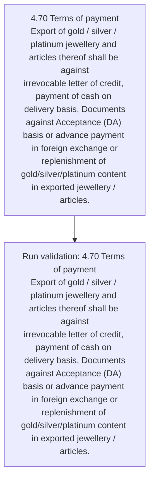
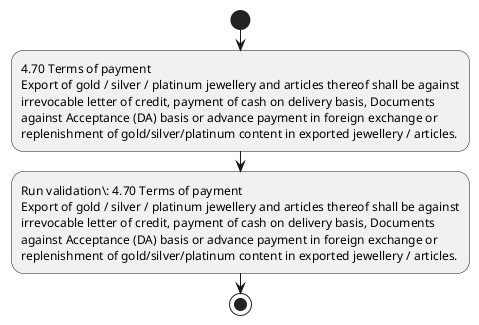

# Chapter 4 / Section 4.70: Terms of payment

**Chapter Title:** Duty Exemption / Remission Schemes

**Pages:** 41

**Purpose:** 4.70 Terms of payment
Export of gold / silver / platinum jewellery and articles thereof shall be against
irrevocable letter of credit, payment of cash on delivery basis, Documents
against Acceptance (DA) basis or advance payment in foreign exchange or
replenishment of gold/silver/platinum content in exported jewellery / articles.

**Purpose Thanglish:** Indha Terms of payment section-la, 4.70 Terms of payment
export of gold / silver / platinum jewellery and articles thereof kandippa be against
irrevocable letter of credit, payment of cash on delivery basis, documents
against Acceptance (DA) basis or advance payment in foreign exchange or
replenishment of gold/silver/platinum content in exported jewellery / articles.

**Summary:** 4.70 Terms of payment
Export of gold / silver / platinum jewellery and articles thereof shall be against
irrevocable letter of credit, payment of cash on delivery basis, Documents
against Acceptance (DA) basis or advance payment in foreign exchange or
replenishment of gold/silver/platinum content in exported jewellery / articles.

**Business Meaning:** Terms of payment governs how DGFT business controls should be applied, validated, and enforced.

**Business Explanation:** Terms of payment explains the operating rule set that DEKAI should enforce. Key control points include 4.70 Terms of payment
Export of gold / silver / platinum jewellery and articles thereof shall be against
irrevocable letter of credit, payment of cash on delivery basis, Documents
against Acceptance (DA) basis or advance payment in foreign exchange or
replenishment of gold/silver/platinum content in exported jewellery / articles. The section also drives actions such as 4.70 Terms of payment
Export of gold / silver / platinum jewellery and articles thereof shall be against
irrevocable letter of credit, payment of cash on delivery basis, Documents
against Acceptance (DA) basis or advance payment in foreign exchange or
replenishment of gold/silver/platinum content in exported jewellery / articles..

**Business Explanation Thanglish:** Indha Terms of payment section-la, Terms of payment explains the operating rule set that DEKAI should enforce. Key control points include 4.70 Terms of payment
export of gold / silver / platinum jewellery and articles thereof kandippa be against
irrevocable letter of credit, payment of cash on delivery basis, documents
against Acceptance (DA) basis or advance payment in foreign exchange or
replenishment of gold/silver/platinum content in exported jewellery / articles. The section also drives actions such as 4.70 Terms of payment
export of gold / silver / platinum jewellery and articles thereof kandippa be against
irrevocable letter of credit, payment of cash on delivery basis, documents
against Acceptance (DA) basis or advance payment in foreign exchange or
replenishment of gold/silver/platinum content in exported jewellery / articles..

## Business Logic
- 4.70 Terms of payment
Export of gold / silver / platinum jewellery and articles thereof shall be against
irrevocable letter of credit, payment of cash on delivery basis, Documents
against Acceptance (DA) basis or advance payment in foreign exchange or
replenishment of gold/silver/platinum content in exported jewellery / articles.

## Business Rules
- rule_id=CH4-SEC4_70-R001, rule_description=4.70 Terms of payment
Export of gold / silver / platinum jewellery and articles thereof shall be against
irrevocable letter of credit, payment of cash on delivery basis, Documents
against Acceptance (DA) basis or advance payment in foreign exchange or
replenishment of gold/silver/platinum content in exported jewellery / articles., trigger=Terms of payment, condition=Section 4.70 is applicable, validation=4.70 Terms of payment
Export of gold / silver / platinum jewellery and articles thereof shall be against
irrevocable letter of credit, payment of cash on delivery basis, Documents
against Acceptance (DA) basis or advance payment in foreign exchange or
replenishment of gold/silver/platinum content in exported jewellery / articles., action=4.70 Terms of payment
Export of gold / silver / platinum jewellery and articles thereof shall be against
irrevocable letter of credit, payment of cash on delivery basis, Documents
against Acceptance (DA) basis or advance payment in foreign exchange or
replenishment of gold/silver/platinum content in exported jewellery / articles., exception=No explicit exception found in uploaded documents., output=DEKAI should produce a compliance decision for 4.70 - Terms of payment.

## Conditions
- None identified

## Condition Logic
- id=4.4.70.1, if=Section 4.70 is applicable, then=4.70 Terms of payment
Export of gold / silver / platinum jewellery and articles thereof shall be against
irrevocable letter of credit, payment of cash on delivery basis, Documents
against Acceptance (DA) basis or advance payment in foreign exchange or
replenishment of gold/silver/platinum content in exported jewellery / articles., source=Derived from uploaded documents

## Validations
- 4.70 Terms of payment
Export of gold / silver / platinum jewellery and articles thereof shall be against
irrevocable letter of credit, payment of cash on delivery basis, Documents
against Acceptance (DA) basis or advance payment in foreign exchange or
replenishment of gold/silver/platinum content in exported jewellery / articles.

## Exceptions
- None identified

## Dependencies
- 4

## Authorities
- None identified

## Required Documents
- 4.70 Terms of payment
Export of gold / silver / platinum jewellery and articles thereof shall be against
irrevocable letter of credit, payment of cash on delivery basis, Documents
against Acceptance (DA) basis or advance payment in foreign exchange or
replenishment of gold/silver/platinum content in exported jewellery / articles.

## Timelines
- None identified

## Actions
- 4.70 Terms of payment
Export of gold / silver / platinum jewellery and articles thereof shall be against
irrevocable letter of credit, payment of cash on delivery basis, Documents
against Acceptance (DA) basis or advance payment in foreign exchange or
replenishment of gold/silver/platinum content in exported jewellery / articles.

## Workflow
- 4.70 Terms of payment
Export of gold / silver / platinum jewellery and articles thereof shall be against
irrevocable letter of credit, payment of cash on delivery basis, Documents
against Acceptance (DA) basis or advance payment in foreign exchange or
replenishment of gold/silver/platinum content in exported jewellery / articles.
- Run validation: 4.70 Terms of payment
Export of gold / silver / platinum jewellery and articles thereof shall be against
irrevocable letter of credit, payment of cash on delivery basis, Documents
against Acceptance (DA) basis or advance payment in foreign exchange or
replenishment of gold/silver/platinum content in exported jewellery / articles.

## Workflow ASCII
```text
Terms of payment
4.70 Terms of payment
Export of gold / silver / platinum jewellery and articles thereof shall be against
irrevocable letter of credit, payment of cash on delivery basis, Documents
against Acceptance (DA) basis or advance payment in foreign exchange or
replenishment of gold/silver/platinum content in exported jewellery / articles.
   |
   v
Run validation: 4.70 Terms of payment
Export of gold / silver / platinum jewellery and articles thereof shall be against
irrevocable letter of credit, payment of cash on delivery basis, Documents
against Acceptance (DA) basis or advance payment in foreign exchange or
replenishment of gold/silver/platinum content in exported jewellery / articles.
```

## Decision Tree
- IF section 4.70 applies THEN 4.70 Terms of payment
Export of gold / silver / platinum jewellery and articles thereof shall be against
irrevocable letter of credit, payment of cash on delivery basis, Documents
against Acceptance (DA) basis or advance payment in foreign exchange or
replenishment of gold/silver/platinum content in exported jewellery / articles.

## Decision Tree ASCII
```text
Terms of payment Decision
IF section 4.70 applies THEN 4.70 Terms of payment
Export of gold / silver / platinum jewellery and articles thereof shall be against
irrevocable letter of credit, payment of cash on delivery basis, Documents
against Acceptance (DA) basis or advance payment in foreign exchange or
replenishment of gold/silver/platinum content in exported jewellery / articles.
```

## Examples
- User asks to process Terms of payment; the platform checks conditions, validations, and documents before action.

**Real-world Example:** Example: an importer or exporter invokes Terms of payment, submits 4.70 Terms of payment
Export of gold / silver / platinum jewellery and articles thereof shall be against
irrevocable letter of credit, payment of cash on delivery basis, Documents
against Acceptance (DA) basis or advance payment in foreign exchange or
replenishment of gold/silver/platinum content in exported jewellery / articles., and DEKAI uses the extracted rules to 4.70 terms of payment
export of gold / silver / platinum jewellery and articles thereof shall be against
irrevocable letter of credit, payment of cash on delivery basis, documents
against acceptance (da) basis or advance payment in foreign exchange or
replenishment of gold/silver/platinum content in exported jewellery / articles..

**Real-world Example Thanglish:** Indha Terms of payment section-la, Example: an importer or exporter invokes Terms of payment, submits 4.70 Terms of payment
export of gold / silver / platinum jewellery and articles thereof kandippa be against
irrevocable letter of credit, payment of cash on delivery basis, documents
against Acceptance (DA) basis or advance payment in foreign exchange or
replenishment of gold/silver/platinum content in exported jewellery / articles., and DEKAI uses the extracted rules to 4.70 terms of payment
export of gold / silver / platinum jewellery and articles thereof kandippa be against
irrevocable letter of credit, payment of cash on delivery basis, documents
against acceptance (da) basis or advance payment in foreign exchange or
replenishment of gold/silver/platinum content in exported jewellery / articles..

## AI Rules
- IF detected context matches section rule THEN enforce: 4.70 Terms of payment
Export of gold / silver / platinum jewellery and articles thereof shall be against
irrevocable letter of credit, payment of cash on delivery basis, Documents
against Acceptance (DA) basis or advance payment in foreign exchange or
replenishment of gold/silver/platinum content in exported jewellery / articles.
- IF validations pass THEN recommend action: 4.70 Terms of payment
Export of gold / silver / platinum jewellery and articles thereof shall be against
irrevocable letter of credit, payment of cash on delivery basis, Documents
against Acceptance (DA) basis or advance payment in foreign exchange or
replenishment of gold/silver/platinum content in exported jewellery / articles.

## Database Fields
- name=section_code, type=string, required=True, source=parsed_section_heading
- name=section_title, type=string, required=True, source=parsed_section_heading
- name=and_flag, type=boolean, required=False, source=keyword:and
- name=gold_flag, type=boolean, required=False, source=keyword:gold
- name=cash_flag, type=boolean, required=False, source=keyword:cash
- name=terms_flag, type=boolean, required=False, source=keyword:Terms
- name=shall_flag, type=boolean, required=False, source=keyword:shall
- name=basis_flag, type=boolean, required=False, source=keyword:basis
- name=export_flag, type=boolean, required=False, source=keyword:Export
- name=silver_flag, type=boolean, required=False, source=keyword:silver
- name=document_1_submitted, type=boolean, required=True, source=4.70 Terms of payment
Export of gold / silver / platinum jewellery and articles thereof shall be against
irrevocable letter of credit, payment of cash on delivery basis, Documents
against Acceptance (DA) basis or advance payment in foreign exchange or
replenishment of gold/silver/platinum content in exported jewellery / articles.

## API Requirements
- method=GET, path=/api/dgft/sections/4.70, purpose=Retrieve knowledge payload for section 4.70, query_params=['include=workflow,decision_tree,validations'], response_fields=['section', 'title', 'summary', 'conditions', 'validations', 'exceptions', 'workflow', 'decision_tree']
- method=POST, path=/api/dgft/Terms-of-payment/validate, purpose=Validate inputs and documents for Terms of payment, request_fields=['section_code', 'section_title', 'document_1_submitted'], response_fields=['status', 'errors', 'warnings', 'next_actions']
- method=POST, path=/api/dgft/Terms-of-payment/execute, purpose=Trigger business action for 4.70 Terms of payment
Export of gold / silver / platinum jewellery and articles thereof shall be against
irrevocable letter of credit, payment of cash on delivery basis, Documents
against Acceptance (DA) basis or advance payment in foreign exchange or
replenishment of gold/silver/platinum content in exported jewellery / articles., request_fields=['section_code', 'section_title', 'document_1_submitted'], response_fields=['reference_id', 'status', 'authority', 'timeline']

## UI Screens
- screen_id=Terms_of_payment_overview, name=Terms of payment Overview, purpose=Show section summary, authority, timeline, and eligibility cues., widgets=['summary_card', 'conditions_table', 'authority_badges', 'timeline_panel']
- screen_id=Terms_of_payment_submission, name=Terms of payment Submission, purpose=Capture applicant data and supporting documents., widgets=['dynamic_form', 'document_uploader', 'validation_panel', 'next_action_footer'], fields=['section_code', 'section_title', 'and_flag', 'gold_flag', 'cash_flag', 'terms_flag', 'shall_flag', 'basis_flag']

## Error Messages
- Validation failed because the section requirements were not fully met.

## FAQ
- question_en=What is the purpose of section 4.70?, answer_en=Terms of payment explains the operating rule set that DEKAI should enforce. Key control points include 4.70 Terms of payment
Export of gold / silver / platinum jewellery and articles thereof shall be against
irrevocable letter of credit, payment of cash on delivery basis, Documents
against Acceptance (DA) basis or advance payment in foreign exchange or
replenishment of gold/silver/platinum content in exported jewellery / articles. The section also drives actions such as 4.70 Terms of payment
Export of gold / silver / platinum jewellery and articles thereof shall be against
irrevocable letter of credit, payment of cash on delivery basis, Documents
against Acceptance (DA) basis or advance payment in foreign exchange or
replenishment of gold/silver/platinum content in exported jewellery / articles.., question_thanglish=Indha Terms of payment section-la, What is the purpose of section 4.70?, answer_thanglish=Indha Terms of payment section-la, Terms of payment explains the operating rule set that DEKAI should enforce. Key control points include 4.70 Terms of payment
export of gold / silver / platinum jewellery and articles thereof kandippa be against
irrevocable letter of credit, payment of cash on delivery basis, documents
against Acceptance (DA) basis or advance payment in foreign exchange or
replenishment of gold/silver/platinum content in exported jewellery / articles. The section also drives actions such as 4.70 Terms of payment
export of gold / silver / platinum jewellery and articles thereof kandippa be against
irrevocable letter of credit, payment of cash on delivery basis, documents
against Acceptance (DA) basis or advance payment in foreign exchange or
replenishment of gold/silver/platinum content in exported jewellery / articles..
- question_en=What documents are required under Terms of payment?, answer_en=4.70 Terms of payment
Export of gold / silver / platinum jewellery and articles thereof shall be against
irrevocable letter of credit, payment of cash on delivery basis, Documents
against Acceptance (DA) basis or advance payment in foreign exchange or
replenishment of gold/silver/platinum content in exported jewellery / articles., question_thanglish=Indha Terms of payment section-la, What documents are required under Terms of payment?, answer_thanglish=Indha Terms of payment section-la, 4.70 Terms of payment
export of gold / silver / platinum jewellery and articles thereof kandippa be against
irrevocable letter of credit, payment of cash on delivery basis, documents
against Acceptance (DA) basis or advance payment in foreign exchange or
replenishment of gold/silver/platinum content in exported jewellery / articles.
- question_en=Which authority handles Terms of payment?, answer_en=Not explicitly covered in uploaded documents., question_thanglish=Indha Terms of payment section-la, Which authority handles Terms of payment?, answer_thanglish=Indha Terms of payment section-la, Not explicitly covered in uploaded documents.

## Questions Users May Ask
- What does Terms of payment require?
- Which documents are needed for Terms of payment?
- How does DEKAI validate Terms of payment requests?
- What action should be taken for Terms of payment?

## Expected AI Answers
- Terms of payment requires the platform to interpret the section text, apply the extracted business rules, and present the correct next action.
- Required documents are inferred from the section text: 4.70 Terms of payment
Export of gold / silver / platinum jewellery and articles thereof shall be against
irrevocable letter of credit, payment of cash on delivery basis, Documents
against Acceptance (DA) basis or advance payment in foreign exchange or
replenishment of gold/silver/platinum content in exported jewellery / articles.
- DEKAI validates Terms of payment by checking conditions, required documents, authority references, and exception clauses before recommending an outcome.
- The primary extracted action is: 4.70 Terms of payment
Export of gold / silver / platinum jewellery and articles thereof shall be against
irrevocable letter of credit, payment of cash on delivery basis, Documents
against Acceptance (DA) basis or advance payment in foreign exchange or
replenishment of gold/silver/platinum content in exported jewellery / articles.

## AI Q&A Examples
- question_en=User asks: How do I comply with Terms of payment?, answer_en=AI answers: DEKAI should evaluate section 4.70, apply the extracted rules, and guide the user through 4.70 Terms of payment
Export of gold / silver / platinum jewellery and articles thereof shall be against
irrevocable letter of credit, payment of cash on delivery basis, Documents
against Acceptance (DA) basis or advance payment in foreign exchange or
replenishment of gold/silver/platinum content in exported jewellery / articles.., question_thanglish=Indha Terms of payment section-la, User asks: How do I comply with Terms of payment?, answer_thanglish=Indha Terms of payment section-la, AI answers: DEKAI should evaluate section 4.70, apply the extracted rules, and guide the user through 4.70 Terms of payment
export of gold / silver / platinum jewellery and articles thereof kandippa be against
irrevocable letter of credit, payment of cash on delivery basis, documents
against Acceptance (DA) basis or advance payment in foreign exchange or
replenishment of gold/silver/platinum content in exported jewellery / articles..
- question_en=User asks: Which validations apply to Terms of payment?, answer_en=AI answers: Applicable validations are 4.70 Terms of payment
Export of gold / silver / platinum jewellery and articles thereof shall be against
irrevocable letter of credit, payment of cash on delivery basis, Documents
against Acceptance (DA) basis or advance payment in foreign exchange or
replenishment of gold/silver/platinum content in exported jewellery / articles., question_thanglish=Indha Terms of payment section-la, User asks: Which validations apply to Terms of payment?, answer_thanglish=Indha Terms of payment section-la, AI answers: Applicable validations are 4.70 Terms of payment
export of gold / silver / platinum jewellery and articles thereof kandippa be against
irrevocable letter of credit, payment of cash on delivery basis, documents
against Acceptance (DA) basis or advance payment in foreign exchange or
replenishment of gold/silver/platinum content in exported jewellery / articles.

## DEKAI AI Implementation Notes
- Capture chapter 4, section 4.70, title, and page references as immutable knowledge metadata.
- Bind validations for Terms of payment into a rule engine keyed by the rule IDs extracted for this section.
- Expose document upload controls for: 4.70 Terms of payment
Export of gold / silver / platinum jewellery and articles thereof shall be against
irrevocable letter of credit, payment of cash on delivery basis, Documents
against Acceptance (DA) basis or advance payment in foreign exchange or
replenishment of gold/silver/platinum content in exported jewellery / articles..
- Show contextual links to related sections: 4.

## DEKAI AI Implementation Notes Thanglish
- Indha Terms of payment section-la, Capture chapter 4, section 4.70, title, and page references as immutable knowledge metadata.
- Indha Terms of payment section-la, Bind validations for Terms of payment into a rule engine keyed by the rule IDs extracted for this section.
- Indha Terms of payment section-la, Expose document upload controls for: 4.70 Terms of payment
export of gold / silver / platinum jewellery and articles thereof kandippa be against
irrevocable letter of credit, payment of cash on delivery basis, documents
against Acceptance (DA) basis or advance payment in foreign exchange or
replenishment of gold/silver/platinum content in exported jewellery / articles..
- Indha Terms of payment section-la, Show contextual links to related sections: 4.

## AI Metadata
- Keywords: and, gold, cash, Terms, shall, basis, Export, silver, letter, credit, payment, thereof, against, advance, foreign, content, platinum, articles, delivery, exchange
- Search Keywords: and, gold, cash, Terms, shall, basis, Export, silver, letter, credit, payment, thereof, against, advance, foreign, content, platinum, articles, delivery, exchange
- Intent: Support Terms of payment processing and compliance validation.
- Tags: 4.70, Terms of payment, business-rule, document-driven, dgft
- Related Sections: 4
- Related Chapters: 
- Related Rules: 4.70 Terms of payment
Export of gold / silver / platinum jewellery and articles thereof shall be against
irrevocable letter of credit, payment of cash on delivery basis, Documents
against Acceptance (DA) basis or advance payment in foreign exchange or
replenishment of gold/silver/platinum content in exported jewellery / articles.

## Mermaid


## PlantUML

