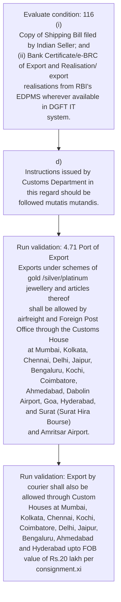
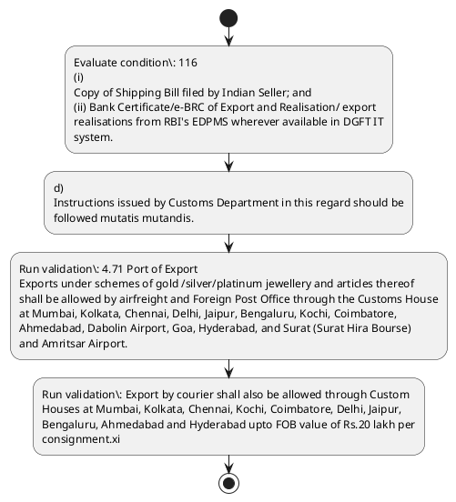

# Chapter 4 / Section 4.71: Port of Export

**Chapter Title:** Duty Exemption / Remission Schemes

**Pages:** 41, 42

**Purpose:** 4.71 Port of Export
Exports under schemes of gold /silver/platinum jewellery and articles thereof
shall be allowed by airfreight and Foreign Post Office through the Customs House
at Mumbai, Kolkata, Chennai, Delhi, Jaipur, Bengaluru, Kochi, Coimbatore,
Ahmedabad, Dabolin Airport, Goa, Hyderabad, and Surat (Surat Hira Bourse)
and Amritsar Airport.

**Purpose Thanglish:** Indha Port of Export section-la, 4.71 Port of export
Exports under schemes of gold /silver/platinum jewellery and articles thereof
kandippa be allowed by airfreight and Foreign Post Office through the Customs House
at Mumbai, Kolkata, Chennai, Delhi, Jaipur, Bengaluru, Kochi, Coimbatore,
Ahmedabad, Dabolin Airport, Goa, Hyderabad, and Surat (Surat Hira Bourse)
and Amritsar Airport.

**Summary:** 4.71 Port of Export
pg. 116
pg. 116
(i)
Copy of Shipping Bill filed by Indian Seller; and
(ii) Bank Certificate/e-BRC of Export and Realisation/ export
realisations from RBI's EDPMS wherever available in DGFT IT
system.

**Business Meaning:** Port of Export governs how DGFT business controls should be applied, validated, and enforced.

**Business Explanation:** Port of Export explains the operating rule set that DEKAI should enforce. Key control points include d)
Instructions issued by Customs Department in this regard should be
followed mutatis mutandis. The section also drives actions such as d)
Instructions issued by Customs Department in this regard should be
followed mutatis mutandis..

**Business Explanation Thanglish:** Indha Port of Export section-la, Port of export explains the operating rule set that DEKAI should enforce. Key control points include d)
Instructions issued by Customs Department in this regard should be
followed mutatis mutandis. The section also drives actions such as d)
Instructions issued by Customs Department in this regard should be
followed mutatis mutandis..

## Business Logic
- d)
Instructions issued by Customs Department in this regard should be
followed mutatis mutandis.
- 4.71 Port of Export
Exports under schemes of gold /silver/platinum jewellery and articles thereof
shall be allowed by airfreight and Foreign Post Office through the Customs House
at Mumbai, Kolkata, Chennai, Delhi, Jaipur, Bengaluru, Kochi, Coimbatore,
Ahmedabad, Dabolin Airport, Goa, Hyderabad, and Surat (Surat Hira Bourse)
and Amritsar Airport.
- Export by courier shall also be allowed through Custom
Houses at Mumbai, Kolkata, Chennai, Kochi, Coimbatore, Delhi, Jaipur,
Bengaluru, Ahmedabad and Hyderabad upto FOB value of Rs.20 lakh per
consignment.xi

## Business Rules
- rule_id=CH4-SEC4_71-R001, rule_description=d)
Instructions issued by Customs Department in this regard should be
followed mutatis mutandis., trigger=Port of Export, condition=116
(i)
Copy of Shipping Bill filed by Indian Seller; and
(ii) Bank Certificate/e-BRC of Export and Realisation/ export
realisations from RBI's EDPMS wherever available in DGFT IT
system., validation=4.71 Port of Export
Exports under schemes of gold /silver/platinum jewellery and articles thereof
shall be allowed by airfreight and Foreign Post Office through the Customs House
at Mumbai, Kolkata, Chennai, Delhi, Jaipur, Bengaluru, Kochi, Coimbatore,
Ahmedabad, Dabolin Airport, Goa, Hyderabad, and Surat (Surat Hira Bourse)
and Amritsar Airport., action=d)
Instructions issued by Customs Department in this regard should be
followed mutatis mutandis., exception=No explicit exception found in uploaded documents., output=DEKAI should produce a compliance decision for 4.71 - Port of Export.
- rule_id=CH4-SEC4_71-R002, rule_description=4.71 Port of Export
Exports under schemes of gold /silver/platinum jewellery and articles thereof
shall be allowed by airfreight and Foreign Post Office through the Customs House
at Mumbai, Kolkata, Chennai, Delhi, Jaipur, Bengaluru, Kochi, Coimbatore,
Ahmedabad, Dabolin Airport, Goa, Hyderabad, and Surat (Surat Hira Bourse)
and Amritsar Airport., trigger=Port of Export, condition=116
(i)
Copy of Shipping Bill filed by Indian Seller; and
(ii) Bank Certificate/e-BRC of Export and Realisation/ export
realisations from RBI's EDPMS wherever available in DGFT IT
system., validation=Export by courier shall also be allowed through Custom
Houses at Mumbai, Kolkata, Chennai, Kochi, Coimbatore, Delhi, Jaipur,
Bengaluru, Ahmedabad and Hyderabad upto FOB value of Rs.20 lakh per
consignment.xi, action=d)
Instructions issued by Customs Department in this regard should be
followed mutatis mutandis., exception=No explicit exception found in uploaded documents., output=DEKAI should produce a compliance decision for 4.71 - Port of Export.
- rule_id=CH4-SEC4_71-R003, rule_description=Export by courier shall also be allowed through Custom
Houses at Mumbai, Kolkata, Chennai, Kochi, Coimbatore, Delhi, Jaipur,
Bengaluru, Ahmedabad and Hyderabad upto FOB value of Rs.20 lakh per
consignment.xi, trigger=Port of Export, condition=116
(i)
Copy of Shipping Bill filed by Indian Seller; and
(ii) Bank Certificate/e-BRC of Export and Realisation/ export
realisations from RBI's EDPMS wherever available in DGFT IT
system., validation=Export by courier shall also be allowed through Custom
Houses at Mumbai, Kolkata, Chennai, Kochi, Coimbatore, Delhi, Jaipur,
Bengaluru, Ahmedabad and Hyderabad upto FOB value of Rs.20 lakh per
consignment.xi, action=d)
Instructions issued by Customs Department in this regard should be
followed mutatis mutandis., exception=No explicit exception found in uploaded documents., output=DEKAI should produce a compliance decision for 4.71 - Port of Export.

## Conditions
- 116
(i)
Copy of Shipping Bill filed by Indian Seller; and
(ii) Bank Certificate/e-BRC of Export and Realisation/ export
realisations from RBI's EDPMS wherever available in DGFT IT
system.

## Condition Logic
- id=4.4.71.1, if=116
(i)
Copy of Shipping Bill filed by Indian Seller; and
(ii) Bank Certificate/e-BRC of Export and Realisation/ export
realisations from RBI's EDPMS wherever available in DGFT IT
system., then=d)
Instructions issued by Customs Department in this regard should be
followed mutatis mutandis., source=116
(i)
Copy of Shipping Bill filed by Indian Seller; and
(ii) Bank Certificate/e-BRC of Export and Realisation/ export
realisations from RBI's EDPMS wherever available in DGFT IT
system.

## Validations
- 4.71 Port of Export
Exports under schemes of gold /silver/platinum jewellery and articles thereof
shall be allowed by airfreight and Foreign Post Office through the Customs House
at Mumbai, Kolkata, Chennai, Delhi, Jaipur, Bengaluru, Kochi, Coimbatore,
Ahmedabad, Dabolin Airport, Goa, Hyderabad, and Surat (Surat Hira Bourse)
and Amritsar Airport.
- Export by courier shall also be allowed through Custom
Houses at Mumbai, Kolkata, Chennai, Kochi, Coimbatore, Delhi, Jaipur,
Bengaluru, Ahmedabad and Hyderabad upto FOB value of Rs.20 lakh per
consignment.xi

## Exceptions
- None identified

## Dependencies
- None identified

## Authorities
- DGFT
- EDPMS wherever available in DGFT
- Customs
- Instructions issued by Customs
- Foreign Post Office through the Customs

## Required Documents
- Copy of Shipping Bill
- Bank Certificate

## Timelines
- None identified

## Actions
- d)
Instructions issued by Customs Department in this regard should be
followed mutatis mutandis.

## Workflow
- Evaluate condition: 116
(i)
Copy of Shipping Bill filed by Indian Seller; and
(ii) Bank Certificate/e-BRC of Export and Realisation/ export
realisations from RBI's EDPMS wherever available in DGFT IT
system.
- d)
Instructions issued by Customs Department in this regard should be
followed mutatis mutandis.
- Run validation: 4.71 Port of Export
Exports under schemes of gold /silver/platinum jewellery and articles thereof
shall be allowed by airfreight and Foreign Post Office through the Customs House
at Mumbai, Kolkata, Chennai, Delhi, Jaipur, Bengaluru, Kochi, Coimbatore,
Ahmedabad, Dabolin Airport, Goa, Hyderabad, and Surat (Surat Hira Bourse)
and Amritsar Airport.
- Run validation: Export by courier shall also be allowed through Custom
Houses at Mumbai, Kolkata, Chennai, Kochi, Coimbatore, Delhi, Jaipur,
Bengaluru, Ahmedabad and Hyderabad upto FOB value of Rs.20 lakh per
consignment.xi

## Workflow ASCII
```text
Port of Export
Evaluate condition: 116
(i)
Copy of Shipping Bill filed by Indian Seller; and
(ii) Bank Certificate/e-BRC of Export and Realisation/ export
realisations from RBI's EDPMS wherever available in DGFT IT
system.
   |
   v
d)
Instructions issued by Customs Department in this regard should be
followed mutatis mutandis.
   |
   v
Run validation: 4.71 Port of Export
Exports under schemes of gold /silver/platinum jewellery and articles thereof
shall be allowed by airfreight and Foreign Post Office through the Customs House
at Mumbai, Kolkata, Chennai, Delhi, Jaipur, Bengaluru, Kochi, Coimbatore,
Ahmedabad, Dabolin Airport, Goa, Hyderabad, and Surat (Surat Hira Bourse)
and Amritsar Airport.
   |
   v
Run validation: Export by courier shall also be allowed through Custom
Houses at Mumbai, Kolkata, Chennai, Kochi, Coimbatore, Delhi, Jaipur,
Bengaluru, Ahmedabad and Hyderabad upto FOB value of Rs.20 lakh per
consignment.xi
```

## Decision Tree
- IF 116
(i)
Copy of Shipping Bill filed by Indian Seller; and
(ii) Bank Certificate/e-BRC of Export and Realisation/ export
realisations from RBI's EDPMS wherever available in DGFT IT
system. THEN d)
Instructions issued by Customs Department in this regard should be
followed mutatis mutandis.

## Decision Tree ASCII
```text
Port of Export Decision
IF 116
(i)
Copy of Shipping Bill filed by Indian Seller; and
(ii) Bank Certificate/e-BRC of Export and Realisation/ export
realisations from RBI's EDPMS wherever available in DGFT IT
system. THEN d)
Instructions issued by Customs Department in this regard should be
followed mutatis mutandis.
```

## Examples
- User asks to process Port of Export; the platform checks conditions, validations, and documents before action.

**Real-world Example:** Example: an importer or exporter invokes Port of Export, submits Copy of Shipping Bill, Bank Certificate, and DEKAI uses the extracted rules to d)
instructions issued by customs department in this regard should be
followed mutatis mutandis..

**Real-world Example Thanglish:** Indha Port of Export section-la, Example: an importer or exporter invokes Port of export, submits Copy of Shipping Bill, Bank Certificate, and DEKAI uses the extracted rules to d)
instructions issued by customs department in this regard should be
followed mutatis mutandis..

## AI Rules
- IF detected context matches section rule THEN enforce: d)
Instructions issued by Customs Department in this regard should be
followed mutatis mutandis.
- IF detected context matches section rule THEN enforce: 4.71 Port of Export
Exports under schemes of gold /silver/platinum jewellery and articles thereof
shall be allowed by airfreight and Foreign Post Office through the Customs House
at Mumbai, Kolkata, Chennai, Delhi, Jaipur, Bengaluru, Kochi, Coimbatore,
Ahmedabad, Dabolin Airport, Goa, Hyderabad, and Surat (Surat Hira Bourse)
and Amritsar Airport.
- IF detected context matches section rule THEN enforce: Export by courier shall also be allowed through Custom
Houses at Mumbai, Kolkata, Chennai, Kochi, Coimbatore, Delhi, Jaipur,
Bengaluru, Ahmedabad and Hyderabad upto FOB value of Rs.20 lakh per
consignment.xi
- IF validations pass THEN recommend action: d)
Instructions issued by Customs Department in this regard should be
followed mutatis mutandis.

## Database Fields
- name=section_code, type=string, required=True, source=parsed_section_heading
- name=section_title, type=string, required=True, source=parsed_section_heading
- name=and_flag, type=boolean, required=False, source=keyword:and
- name=rbi_flag, type=boolean, required=False, source=keyword:RBI
- name=the_flag, type=boolean, required=False, source=keyword:the
- name=goa_flag, type=boolean, required=False, source=keyword:Goa
- name=fob_flag, type=boolean, required=False, source=keyword:FOB
- name=per_flag, type=boolean, required=False, source=keyword:per
- name=port_flag, type=boolean, required=False, source=keyword:Port
- name=copy_flag, type=boolean, required=False, source=keyword:Copy
- name=document_1_submitted, type=boolean, required=True, source=Copy of Shipping Bill
- name=document_2_submitted, type=boolean, required=True, source=Bank Certificate

## API Requirements
- method=GET, path=/api/dgft/sections/4.71, purpose=Retrieve knowledge payload for section 4.71, query_params=['include=workflow,decision_tree,validations'], response_fields=['section', 'title', 'summary', 'conditions', 'validations', 'exceptions', 'workflow', 'decision_tree']
- method=POST, path=/api/dgft/Port-of-Export/validate, purpose=Validate inputs and documents for Port of Export, request_fields=['section_code', 'section_title', 'document_1_submitted', 'document_2_submitted'], response_fields=['status', 'errors', 'warnings', 'next_actions']
- method=POST, path=/api/dgft/Port-of-Export/execute, purpose=Trigger business action for d)
Instructions issued by Customs Department in this regard should be
followed mutatis mutandis., request_fields=['section_code', 'section_title', 'document_1_submitted', 'document_2_submitted'], response_fields=['reference_id', 'status', 'authority', 'timeline']

## UI Screens
- screen_id=Port_of_Export_overview, name=Port of Export Overview, purpose=Show section summary, authority, timeline, and eligibility cues., widgets=['summary_card', 'conditions_table', 'authority_badges', 'timeline_panel']
- screen_id=Port_of_Export_submission, name=Port of Export Submission, purpose=Capture applicant data and supporting documents., widgets=['dynamic_form', 'document_uploader', 'validation_panel', 'next_action_footer'], fields=['section_code', 'section_title', 'and_flag', 'rbi_flag', 'the_flag', 'goa_flag', 'fob_flag', 'per_flag']

## Error Messages
- Validation failed because the section requirements were not fully met.

## FAQ
- question_en=What is the purpose of section 4.71?, answer_en=Port of Export explains the operating rule set that DEKAI should enforce. Key control points include d)
Instructions issued by Customs Department in this regard should be
followed mutatis mutandis. The section also drives actions such as d)
Instructions issued by Customs Department in this regard should be
followed mutatis mutandis.., question_thanglish=Indha Port of Export section-la, What is the purpose of section 4.71?, answer_thanglish=Indha Port of Export section-la, Port of export explains the operating rule set that DEKAI should enforce. Key control points include d)
Instructions issued by Customs Department in this regard should be
followed mutatis mutandis. The section also drives actions such as d)
Instructions issued by Customs Department in this regard should be
followed mutatis mutandis..
- question_en=What documents are required under Port of Export?, answer_en=Copy of Shipping Bill, Bank Certificate, question_thanglish=Indha Port of Export section-la, What documents are required under Port of export?, answer_thanglish=Indha Port of Export section-la, Copy of Shipping Bill, Bank Certificate
- question_en=Which authority handles Port of Export?, answer_en=DGFT, EDPMS wherever available in DGFT, Customs, Instructions issued by Customs, Foreign Post Office through the Customs, question_thanglish=Indha Port of Export section-la, Which authority handles Port of export?, answer_thanglish=Indha Port of Export section-la, DGFT, EDPMS wherever available in DGFT, Customs, Instructions issued by Customs, Foreign Post Office through the Customs

## Questions Users May Ask
- What does Port of Export require?
- Which documents are needed for Port of Export?
- How does DEKAI validate Port of Export requests?
- What action should be taken for Port of Export?

## Expected AI Answers
- Port of Export requires the platform to interpret the section text, apply the extracted business rules, and present the correct next action.
- Required documents are inferred from the section text: Copy of Shipping Bill, Bank Certificate
- DEKAI validates Port of Export by checking conditions, required documents, authority references, and exception clauses before recommending an outcome.
- The primary extracted action is: d)
Instructions issued by Customs Department in this regard should be
followed mutatis mutandis.

## AI Q&A Examples
- question_en=User asks: How do I comply with Port of Export?, answer_en=AI answers: DEKAI should evaluate section 4.71, apply the extracted rules, and guide the user through Evaluate condition: 116
(i)
Copy of Shipping Bill filed by Indian Seller; and
(ii) Bank Certificate/e-BRC of Export and Realisation/ export
realisations from RBI's EDPMS wherever available in DGFT IT
system.., question_thanglish=Indha Port of Export section-la, User asks: How do I comply with Port of export?, answer_thanglish=Indha Port of Export section-la, AI answers: DEKAI should evaluate section 4.71, apply the extracted rules, and guide the user through Evaluate condition: 116
(i)
Copy of Shipping Bill filed by Indian Seller; and
(ii) Bank Certificate/e-BRC of export and Realisation/ export
realisations from RBI's EDPMS wherever available in DGFT IT
system..
- question_en=User asks: Which validations apply to Port of Export?, answer_en=AI answers: Applicable validations are 4.71 Port of Export
Exports under schemes of gold /silver/platinum jewellery and articles thereof
shall be allowed by airfreight and Foreign Post Office through the Customs House
at Mumbai, Kolkata, Chennai, Delhi, Jaipur, Bengaluru, Kochi, Coimbatore,
Ahmedabad, Dabolin Airport, Goa, Hyderabad, and Surat (Surat Hira Bourse)
and Amritsar Airport., Export by courier shall also be allowed through Custom
Houses at Mumbai, Kolkata, Chennai, Kochi, Coimbatore, Delhi, Jaipur,
Bengaluru, Ahmedabad and Hyderabad upto FOB value of Rs.20 lakh per
consignment.xi, question_thanglish=Indha Port of Export section-la, User asks: Which validations apply to Port of export?, answer_thanglish=Indha Port of Export section-la, AI answers: Applicable validations are 4.71 Port of export
Exports under schemes of gold /silver/platinum jewellery and articles thereof
kandippa be allowed by airfreight and Foreign Post Office through the Customs House
at Mumbai, Kolkata, Chennai, Delhi, Jaipur, Bengaluru, Kochi, Coimbatore,
Ahmedabad, Dabolin Airport, Goa, Hyderabad, and Surat (Surat Hira Bourse)
and Amritsar Airport., export by courier kandippa also be allowed through Custom
Houses at Mumbai, Kolkata, Chennai, Kochi, Coimbatore, Delhi, Jaipur,
Bengaluru, Ahmedabad and Hyderabad upto FOB value of Rs.20 lakh per
consignment.xi

## DEKAI AI Implementation Notes
- Capture chapter 4, section 4.71, title, and page references as immutable knowledge metadata.
- Bind validations for Port of Export into a rule engine keyed by the rule IDs extracted for this section.
- Expose document upload controls for: Copy of Shipping Bill, Bank Certificate.
- Route escalations or approvals to: DGFT, EDPMS wherever available in DGFT, Customs, Instructions issued by Customs.

## DEKAI AI Implementation Notes Thanglish
- Indha Port of Export section-la, Capture chapter 4, section 4.71, title, and page references as immutable knowledge metadata.
- Indha Port of Export section-la, Bind validations for Port of export into a rule engine keyed by the rule IDs extracted for this section.
- Indha Port of Export section-la, Expose document upload controls for: Copy of Shipping Bill, Bank Certificate.
- Indha Port of Export section-la, Route escalations or approvals to: DGFT, EDPMS wherever available in DGFT, Customs, Instructions issued by Customs.

## AI Metadata
- Keywords: and, RBI, the, Goa, FOB, per, Port, Copy, Bill, Bank, from, DGFT, this, gold, Post, Hira, also, upto, lakh, filed
- Search Keywords: and, RBI, the, Goa, FOB, per, Port, Copy, Bill, Bank, from, DGFT, this, gold, Post, Hira, also, upto, lakh, filed
- Intent: Support Port of Export processing and compliance validation.
- Tags: 4.71, Port of Export, business-rule, document-driven, dgft
- Related Sections: 
- Related Chapters: 
- Related Rules: d)
Instructions issued by Customs Department in this regard should be
followed mutatis mutandis., 4.71 Port of Export
Exports under schemes of gold /silver/platinum jewellery and articles thereof
shall be allowed by airfreight and Foreign Post Office through the Customs House
at Mumbai, Kolkata, Chennai, Delhi, Jaipur, Bengaluru, Kochi, Coimbatore,
Ahmedabad, Dabolin Airport, Goa, Hyderabad, and Surat (Surat Hira Bourse)
and Amritsar Airport., Export by courier shall also be allowed through Custom
Houses at Mumbai, Kolkata, Chennai, Kochi, Coimbatore, Delhi, Jaipur,
Bengaluru, Ahmedabad and Hyderabad upto FOB value of Rs.20 lakh per
consignment.xi

## Mermaid


## PlantUML

