# Chapter 4 / Section 4.72: Export by Post

**Chapter Title:** Duty Exemption / Remission Schemes

**Pages:** 42

**Purpose:** 4.72 Export by Post
Policy for export of gems and jewellery parcel by post is in paragraph 4.47 of
FTP.

**Purpose Thanglish:** Indha Export by Post section-la, 4.72 export by Post
Policy for export of gems and jewellery parcel by post is in paragraph 4.47 of
FTP.

**Summary:** 4.72 Export by Post
Policy for export of gems and jewellery parcel by post is in paragraph 4.47 of
FTP. At the time of exports, exporter shall submit following documents:
(i) Shipping bills or Tax invoice for export/supplies as prescribed under
CGST/SGST/UT GST rules presented at foreign Post Office;
(ii) Certificate from nominated agencies indicating price at which gold/
silver/platinum was booked or given on outright sale basis or loan basis;
(iii) Three copies of Tax invoices for export/supplies as prescribed under
CGST/SGST/UT GST rules. 4.72 Export by Post
Policy for export of gems and jewellery parcel by post is in paragraph 4.47 of
FTP.

**Business Meaning:** Export by Post governs how DGFT business controls should be applied, validated, and enforced.

**Business Explanation:** Export by Post explains the operating rule set that DEKAI should enforce. Key control points include At the time of exports, exporter shall submit following documents:
(i) Shipping bills or Tax invoice for export/supplies as prescribed under
CGST/SGST/UT GST rules presented at foreign Post Office;
(ii) Certificate from nominated agencies indicating price at which gold/
silver/platinum was booked or given on outright sale basis or loan basis;
(iii) Three copies of Tax invoices for export/supplies as prescribed under
CGST/SGST/UT GST rules. The section also drives actions such as At the time of exports, exporter shall submit following documents:
(i) Shipping bills or Tax invoice for export/supplies as prescribed under
CGST/SGST/UT GST rules presented at foreign Post Office;
(ii) Certificate from nominated agencies indicating price at which gold/
silver/platinum was booked or given on outright sale basis or loan basis;
(iii) Three copies of Tax invoices for export/supplies as prescribed under
CGST/SGST/UT GST rules..

**Business Explanation Thanglish:** Indha Export by Post section-la, export by Post explains the operating rule set that DEKAI should enforce. Key control points include At the time of exports, exporter kandippa submit following documents:
(i) Shipping bills or Tax invoice for export/supplies as prescribed under
CGST/SGST/UT GST rules presented at foreign Post Office;
(ii) Certificate from nominated agencies indicating price at which gold/
silver/platinum was booked or given on outright sale basis or loan basis;
(iii) Three copies of Tax invoices for export/supplies as prescribed under
CGST/SGST/UT GST rules. The section also drives actions such as At the time of exports, exporter kandippa submit following documents:
(i) Shipping bills or Tax invoice for export/supplies as prescribed under
CGST/SGST/UT GST rules presented at foreign Post Office;
(ii) Certificate from nominated agencies indicating price at which gold/
silver/platinum was booked or given on outright sale basis or loan basis;
(iii) Three copies of Tax invoices for export/supplies as prescribed under
CGST/SGST/UT GST rules..

## Business Logic
- At the time of exports, exporter shall submit following documents:
(i) Shipping bills or Tax invoice for export/supplies as prescribed under
CGST/SGST/UT GST rules presented at foreign Post Office;
(ii) Certificate from nominated agencies indicating price at which gold/
silver/platinum was booked or given on outright sale basis or loan basis;
(iii) Three copies of Tax invoices for export/supplies as prescribed under
CGST/SGST/UT GST rules.
- At the time of exports, exporter shall submit following documents:
(i)
Shipping bills or Tax invoice for export/supplies as prescribed under
CGST/SGST/UT GST rules presented at foreign Post Office;
(ii)
Certificate from nominated agencies indicating price at which gold/
silver/platinum was booked or given on outright sale basis or loan basis;
(iii)
Three copies of Tax invoices for export/supplies as prescribed under
CGST/SGST/UT GST rules.

## Business Rules
- rule_id=CH4-SEC4_72-R001, rule_description=At the time of exports, exporter shall submit following documents:
(i) Shipping bills or Tax invoice for export/supplies as prescribed under
CGST/SGST/UT GST rules presented at foreign Post Office;
(ii) Certificate from nominated agencies indicating price at which gold/
silver/platinum was booked or given on outright sale basis or loan basis;
(iii) Three copies of Tax invoices for export/supplies as prescribed under
CGST/SGST/UT GST rules., trigger=Export by Post, condition=At the time of exports, exporter shall submit following documents:
(i) Shipping bills or Tax invoice for export/supplies as prescribed under
CGST/SGST/UT GST rules presented at foreign Post Office;
(ii) Certificate from nominated agencies indicating price at which gold/
silver/platinum was booked or given on outright sale basis or loan basis;
(iii) Three copies of Tax invoices for export/supplies as prescribed under
CGST/SGST/UT GST rules., validation=At the time of exports, exporter shall submit following documents:
(i) Shipping bills or Tax invoice for export/supplies as prescribed under
CGST/SGST/UT GST rules presented at foreign Post Office;
(ii) Certificate from nominated agencies indicating price at which gold/
silver/platinum was booked or given on outright sale basis or loan basis;
(iii) Three copies of Tax invoices for export/supplies as prescribed under
CGST/SGST/UT GST rules., action=At the time of exports, exporter shall submit following documents:
(i) Shipping bills or Tax invoice for export/supplies as prescribed under
CGST/SGST/UT GST rules presented at foreign Post Office;
(ii) Certificate from nominated agencies indicating price at which gold/
silver/platinum was booked or given on outright sale basis or loan basis;
(iii) Three copies of Tax invoices for export/supplies as prescribed under
CGST/SGST/UT GST rules., exception=No explicit exception found in uploaded documents., output=DEKAI should produce a compliance decision for 4.72 - Export by Post.
- rule_id=CH4-SEC4_72-R002, rule_description=At the time of exports, exporter shall submit following documents:
(i)
Shipping bills or Tax invoice for export/supplies as prescribed under
CGST/SGST/UT GST rules presented at foreign Post Office;
(ii)
Certificate from nominated agencies indicating price at which gold/
silver/platinum was booked or given on outright sale basis or loan basis;
(iii)
Three copies of Tax invoices for export/supplies as prescribed under
CGST/SGST/UT GST rules., trigger=Export by Post, condition=At the time of exports, exporter shall submit following documents:
(i)
Shipping bills or Tax invoice for export/supplies as prescribed under
CGST/SGST/UT GST rules presented at foreign Post Office;
(ii)
Certificate from nominated agencies indicating price at which gold/
silver/platinum was booked or given on outright sale basis or loan basis;
(iii)
Three copies of Tax invoices for export/supplies as prescribed under
CGST/SGST/UT GST rules., validation=At the time of exports, exporter shall submit following documents:
(i)
Shipping bills or Tax invoice for export/supplies as prescribed under
CGST/SGST/UT GST rules presented at foreign Post Office;
(ii)
Certificate from nominated agencies indicating price at which gold/
silver/platinum was booked or given on outright sale basis or loan basis;
(iii)
Three copies of Tax invoices for export/supplies as prescribed under
CGST/SGST/UT GST rules., action=At the time of exports, exporter shall submit following documents:
(i)
Shipping bills or Tax invoice for export/supplies as prescribed under
CGST/SGST/UT GST rules presented at foreign Post Office;
(ii)
Certificate from nominated agencies indicating price at which gold/
silver/platinum was booked or given on outright sale basis or loan basis;
(iii)
Three copies of Tax invoices for export/supplies as prescribed under
CGST/SGST/UT GST rules., exception=No explicit exception found in uploaded documents., output=DEKAI should produce a compliance decision for 4.72 - Export by Post.

## Conditions
- At the time of exports, exporter shall submit following documents:
(i) Shipping bills or Tax invoice for export/supplies as prescribed under
CGST/SGST/UT GST rules presented at foreign Post Office;
(ii) Certificate from nominated agencies indicating price at which gold/
silver/platinum was booked or given on outright sale basis or loan basis;
(iii) Three copies of Tax invoices for export/supplies as prescribed under
CGST/SGST/UT GST rules.
- At the time of exports, exporter shall submit following documents:
(i)
Shipping bills or Tax invoice for export/supplies as prescribed under
CGST/SGST/UT GST rules presented at foreign Post Office;
(ii)
Certificate from nominated agencies indicating price at which gold/
silver/platinum was booked or given on outright sale basis or loan basis;
(iii)
Three copies of Tax invoices for export/supplies as prescribed under
CGST/SGST/UT GST rules.

## Condition Logic
- id=4.4.72.1, if=At the time of exports, exporter shall submit following documents:
(i) Shipping bills or Tax invoice for export/supplies as prescribed under
CGST/SGST/UT GST rules presented at foreign Post Office;
(ii) Certificate from nominated agencies indicating price at which gold/
silver/platinum was booked or given on outright sale basis or loan basis;
(iii) Three copies of Tax invoices for export/supplies as prescribed under
CGST/SGST/UT GST rules., then=At the time of exports, exporter shall submit following documents:
(i) Shipping bills or Tax invoice for export/supplies as prescribed under
CGST/SGST/UT GST rules presented at foreign Post Office;
(ii) Certificate from nominated agencies indicating price at which gold/
silver/platinum was booked or given on outright sale basis or loan basis;
(iii) Three copies of Tax invoices for export/supplies as prescribed under
CGST/SGST/UT GST rules., source=At the time of exports, exporter shall submit following documents:
(i) Shipping bills or Tax invoice for export/supplies as prescribed under
CGST/SGST/UT GST rules presented at foreign Post Office;
(ii) Certificate from nominated agencies indicating price at which gold/
silver/platinum was booked or given on outright sale basis or loan basis;
(iii) Three copies of Tax invoices for export/supplies as prescribed under
CGST/SGST/UT GST rules.
- id=4.4.72.2, if=At the time of exports, exporter shall submit following documents:
(i)
Shipping bills or Tax invoice for export/supplies as prescribed under
CGST/SGST/UT GST rules presented at foreign Post Office;
(ii)
Certificate from nominated agencies indicating price at which gold/
silver/platinum was booked or given on outright sale basis or loan basis;
(iii)
Three copies of Tax invoices for export/supplies as prescribed under
CGST/SGST/UT GST rules., then=At the time of exports, exporter shall submit following documents:
(i) Shipping bills or Tax invoice for export/supplies as prescribed under
CGST/SGST/UT GST rules presented at foreign Post Office;
(ii) Certificate from nominated agencies indicating price at which gold/
silver/platinum was booked or given on outright sale basis or loan basis;
(iii) Three copies of Tax invoices for export/supplies as prescribed under
CGST/SGST/UT GST rules., source=At the time of exports, exporter shall submit following documents:
(i)
Shipping bills or Tax invoice for export/supplies as prescribed under
CGST/SGST/UT GST rules presented at foreign Post Office;
(ii)
Certificate from nominated agencies indicating price at which gold/
silver/platinum was booked or given on outright sale basis or loan basis;
(iii)
Three copies of Tax invoices for export/supplies as prescribed under
CGST/SGST/UT GST rules.

## Validations
- At the time of exports, exporter shall submit following documents:
(i) Shipping bills or Tax invoice for export/supplies as prescribed under
CGST/SGST/UT GST rules presented at foreign Post Office;
(ii) Certificate from nominated agencies indicating price at which gold/
silver/platinum was booked or given on outright sale basis or loan basis;
(iii) Three copies of Tax invoices for export/supplies as prescribed under
CGST/SGST/UT GST rules.
- At the time of exports, exporter shall submit following documents:
(i)
Shipping bills or Tax invoice for export/supplies as prescribed under
CGST/SGST/UT GST rules presented at foreign Post Office;
(ii)
Certificate from nominated agencies indicating price at which gold/
silver/platinum was booked or given on outright sale basis or loan basis;
(iii)
Three copies of Tax invoices for export/supplies as prescribed under
CGST/SGST/UT GST rules.

## Exceptions
- None identified

## Dependencies
- 4.47

## Authorities
- None identified

## Required Documents
- At the time of exports, exporter shall submit following documents:
(i) Shipping bills or Tax invoice for export/supplies as prescribed under
CGST/SGST/UT GST rules presented at foreign Post Office;
(ii) Certificate from nominated agencies indicating price at which gold/
silver/platinum was booked or given on outright sale basis or loan basis;
(iii) Three copies of Tax invoices for export/supplies as prescribed under
CGST/SGST/UT GST rules.
- At the time of exports, exporter shall submit following documents:
(i)
Shipping bills or Tax invoice for export/supplies as prescribed under
CGST/SGST/UT GST rules presented at foreign Post Office;
(ii)
Certificate from nominated agencies indicating price at which gold/
silver/platinum was booked or given on outright sale basis or loan basis;
(iii)
Three copies of Tax invoices for export/supplies as prescribed under
CGST/SGST/UT GST rules.

## Timelines
- None identified

## Actions
- At the time of exports, exporter shall submit following documents:
(i) Shipping bills or Tax invoice for export/supplies as prescribed under
CGST/SGST/UT GST rules presented at foreign Post Office;
(ii) Certificate from nominated agencies indicating price at which gold/
silver/platinum was booked or given on outright sale basis or loan basis;
(iii) Three copies of Tax invoices for export/supplies as prescribed under
CGST/SGST/UT GST rules.
- At the time of exports, exporter shall submit following documents:
(i)
Shipping bills or Tax invoice for export/supplies as prescribed under
CGST/SGST/UT GST rules presented at foreign Post Office;
(ii)
Certificate from nominated agencies indicating price at which gold/
silver/platinum was booked or given on outright sale basis or loan basis;
(iii)
Three copies of Tax invoices for export/supplies as prescribed under
CGST/SGST/UT GST rules.

## Workflow
- Evaluate condition: At the time of exports, exporter shall submit following documents:
(i) Shipping bills or Tax invoice for export/supplies as prescribed under
CGST/SGST/UT GST rules presented at foreign Post Office;
(ii) Certificate from nominated agencies indicating price at which gold/
silver/platinum was booked or given on outright sale basis or loan basis;
(iii) Three copies of Tax invoices for export/supplies as prescribed under
CGST/SGST/UT GST rules.
- Evaluate condition: At the time of exports, exporter shall submit following documents:
(i)
Shipping bills or Tax invoice for export/supplies as prescribed under
CGST/SGST/UT GST rules presented at foreign Post Office;
(ii)
Certificate from nominated agencies indicating price at which gold/
silver/platinum was booked or given on outright sale basis or loan basis;
(iii)
Three copies of Tax invoices for export/supplies as prescribed under
CGST/SGST/UT GST rules.
- At the time of exports, exporter shall submit following documents:
(i) Shipping bills or Tax invoice for export/supplies as prescribed under
CGST/SGST/UT GST rules presented at foreign Post Office;
(ii) Certificate from nominated agencies indicating price at which gold/
silver/platinum was booked or given on outright sale basis or loan basis;
(iii) Three copies of Tax invoices for export/supplies as prescribed under
CGST/SGST/UT GST rules.
- At the time of exports, exporter shall submit following documents:
(i)
Shipping bills or Tax invoice for export/supplies as prescribed under
CGST/SGST/UT GST rules presented at foreign Post Office;
(ii)
Certificate from nominated agencies indicating price at which gold/
silver/platinum was booked or given on outright sale basis or loan basis;
(iii)
Three copies of Tax invoices for export/supplies as prescribed under
CGST/SGST/UT GST rules.
- Run validation: At the time of exports, exporter shall submit following documents:
(i) Shipping bills or Tax invoice for export/supplies as prescribed under
CGST/SGST/UT GST rules presented at foreign Post Office;
(ii) Certificate from nominated agencies indicating price at which gold/
silver/platinum was booked or given on outright sale basis or loan basis;
(iii) Three copies of Tax invoices for export/supplies as prescribed under
CGST/SGST/UT GST rules.
- Run validation: At the time of exports, exporter shall submit following documents:
(i)
Shipping bills or Tax invoice for export/supplies as prescribed under
CGST/SGST/UT GST rules presented at foreign Post Office;
(ii)
Certificate from nominated agencies indicating price at which gold/
silver/platinum was booked or given on outright sale basis or loan basis;
(iii)
Three copies of Tax invoices for export/supplies as prescribed under
CGST/SGST/UT GST rules.

## Workflow ASCII
```text
Export by Post
Evaluate condition: At the time of exports, exporter shall submit following documents:
(i) Shipping bills or Tax invoice for export/supplies as prescribed under
CGST/SGST/UT GST rules presented at foreign Post Office;
(ii) Certificate from nominated agencies indicating price at which gold/
silver/platinum was booked or given on outright sale basis or loan basis;
(iii) Three copies of Tax invoices for export/supplies as prescribed under
CGST/SGST/UT GST rules.
   |
   v
Evaluate condition: At the time of exports, exporter shall submit following documents:
(i)
Shipping bills or Tax invoice for export/supplies as prescribed under
CGST/SGST/UT GST rules presented at foreign Post Office;
(ii)
Certificate from nominated agencies indicating price at which gold/
silver/platinum was booked or given on outright sale basis or loan basis;
(iii)
Three copies of Tax invoices for export/supplies as prescribed under
CGST/SGST/UT GST rules.
   |
   v
At the time of exports, exporter shall submit following documents:
(i) Shipping bills or Tax invoice for export/supplies as prescribed under
CGST/SGST/UT GST rules presented at foreign Post Office;
(ii) Certificate from nominated agencies indicating price at which gold/
silver/platinum was booked or given on outright sale basis or loan basis;
(iii) Three copies of Tax invoices for export/supplies as prescribed under
CGST/SGST/UT GST rules.
   |
   v
At the time of exports, exporter shall submit following documents:
(i)
Shipping bills or Tax invoice for export/supplies as prescribed under
CGST/SGST/UT GST rules presented at foreign Post Office;
(ii)
Certificate from nominated agencies indicating price at which gold/
silver/platinum was booked or given on outright sale basis or loan basis;
(iii)
Three copies of Tax invoices for export/supplies as prescribed under
CGST/SGST/UT GST rules.
   |
   v
Run validation: At the time of exports, exporter shall submit following documents:
(i) Shipping bills or Tax invoice for export/supplies as prescribed under
CGST/SGST/UT GST rules presented at foreign Post Office;
(ii) Certificate from nominated agencies indicating price at which gold/
silver/platinum was booked or given on outright sale basis or loan basis;
(iii) Three copies of Tax invoices for export/supplies as prescribed under
CGST/SGST/UT GST rules.
   |
   v
Run validation: At the time of exports, exporter shall submit following documents:
(i)
Shipping bills or Tax invoice for export/supplies as prescribed under
CGST/SGST/UT GST rules presented at foreign Post Office;
(ii)
Certificate from nominated agencies indicating price at which gold/
silver/platinum was booked or given on outright sale basis or loan basis;
(iii)
Three copies of Tax invoices for export/supplies as prescribed under
CGST/SGST/UT GST rules.
```

## Decision Tree
- IF At the time of exports, exporter shall submit following documents:
(i) Shipping bills or Tax invoice for export/supplies as prescribed under
CGST/SGST/UT GST rules presented at foreign Post Office;
(ii) Certificate from nominated agencies indicating price at which gold/
silver/platinum was booked or given on outright sale basis or loan basis;
(iii) Three copies of Tax invoices for export/supplies as prescribed under
CGST/SGST/UT GST rules. THEN At the time of exports, exporter shall submit following documents:
(i) Shipping bills or Tax invoice for export/supplies as prescribed under
CGST/SGST/UT GST rules presented at foreign Post Office;
(ii) Certificate from nominated agencies indicating price at which gold/
silver/platinum was booked or given on outright sale basis or loan basis;
(iii) Three copies of Tax invoices for export/supplies as prescribed under
CGST/SGST/UT GST rules.
- IF At the time of exports, exporter shall submit following documents:
(i)
Shipping bills or Tax invoice for export/supplies as prescribed under
CGST/SGST/UT GST rules presented at foreign Post Office;
(ii)
Certificate from nominated agencies indicating price at which gold/
silver/platinum was booked or given on outright sale basis or loan basis;
(iii)
Three copies of Tax invoices for export/supplies as prescribed under
CGST/SGST/UT GST rules. THEN At the time of exports, exporter shall submit following documents:
(i) Shipping bills or Tax invoice for export/supplies as prescribed under
CGST/SGST/UT GST rules presented at foreign Post Office;
(ii) Certificate from nominated agencies indicating price at which gold/
silver/platinum was booked or given on outright sale basis or loan basis;
(iii) Three copies of Tax invoices for export/supplies as prescribed under
CGST/SGST/UT GST rules.

## Decision Tree ASCII
```text
Export by Post Decision
IF At the time of exports, exporter shall submit following documents:
(i) Shipping bills or Tax invoice for export/supplies as prescribed under
CGST/SGST/UT GST rules presented at foreign Post Office;
(ii) Certificate from nominated agencies indicating price at which gold/
silver/platinum was booked or given on outright sale basis or loan basis;
(iii) Three copies of Tax invoices for export/supplies as prescribed under
CGST/SGST/UT GST rules. THEN At the time of exports, exporter shall submit following documents:
(i) Shipping bills or Tax invoice for export/supplies as prescribed under
CGST/SGST/UT GST rules presented at foreign Post Office;
(ii) Certificate from nominated agencies indicating price at which gold/
silver/platinum was booked or given on outright sale basis or loan basis;
(iii) Three copies of Tax invoices for export/supplies as prescribed under
CGST/SGST/UT GST rules.
   |
   v
IF At the time of exports, exporter shall submit following documents:
(i)
Shipping bills or Tax invoice for export/supplies as prescribed under
CGST/SGST/UT GST rules presented at foreign Post Office;
(ii)
Certificate from nominated agencies indicating price at which gold/
silver/platinum was booked or given on outright sale basis or loan basis;
(iii)
Three copies of Tax invoices for export/supplies as prescribed under
CGST/SGST/UT GST rules. THEN At the time of exports, exporter shall submit following documents:
(i) Shipping bills or Tax invoice for export/supplies as prescribed under
CGST/SGST/UT GST rules presented at foreign Post Office;
(ii) Certificate from nominated agencies indicating price at which gold/
silver/platinum was booked or given on outright sale basis or loan basis;
(iii) Three copies of Tax invoices for export/supplies as prescribed under
CGST/SGST/UT GST rules.
```

## Examples
- User asks to process Export by Post; the platform checks conditions, validations, and documents before action.

**Real-world Example:** Example: an importer or exporter invokes Export by Post, submits At the time of exports, exporter shall submit following documents:
(i) Shipping bills or Tax invoice for export/supplies as prescribed under
CGST/SGST/UT GST rules presented at foreign Post Office;
(ii) Certificate from nominated agencies indicating price at which gold/
silver/platinum was booked or given on outright sale basis or loan basis;
(iii) Three copies of Tax invoices for export/supplies as prescribed under
CGST/SGST/UT GST rules., At the time of exports, exporter shall submit following documents:
(i)
Shipping bills or Tax invoice for export/supplies as prescribed under
CGST/SGST/UT GST rules presented at foreign Post Office;
(ii)
Certificate from nominated agencies indicating price at which gold/
silver/platinum was booked or given on outright sale basis or loan basis;
(iii)
Three copies of Tax invoices for export/supplies as prescribed under
CGST/SGST/UT GST rules., and DEKAI uses the extracted rules to at the time of exports, exporter shall submit following documents:
(i) shipping bills or tax invoice for export/supplies as prescribed under
cgst/sgst/ut gst rules presented at foreign post office;
(ii) certificate from nominated agencies indicating price at which gold/
silver/platinum was booked or given on outright sale basis or loan basis;
(iii) three copies of tax invoices for export/supplies as prescribed under
cgst/sgst/ut gst rules..

**Real-world Example Thanglish:** Indha Export by Post section-la, Example: an importer or exporter invokes export by Post, submits At the time of exports, exporter kandippa submit following documents:
(i) Shipping bills or Tax invoice for export/supplies as prescribed under
CGST/SGST/UT GST rules presented at foreign Post Office;
(ii) Certificate from nominated agencies indicating price at which gold/
silver/platinum was booked or given on outright sale basis or loan basis;
(iii) Three copies of Tax invoices for export/supplies as prescribed under
CGST/SGST/UT GST rules., At the time of exports, exporter kandippa submit following documents:
(i)
Shipping bills or Tax invoice for export/supplies as prescribed under
CGST/SGST/UT GST rules presented at foreign Post Office;
(ii)
Certificate from nominated agencies indicating price at which gold/
silver/platinum was booked or given on outright sale basis or loan basis;
(iii)
Three copies of Tax invoices for export/supplies as prescribed under
CGST/SGST/UT GST rules., and DEKAI uses the extracted rules to at the time of exports, exporter kandippa submit following documents:
(i) shipping bills or tax invoice for export/supplies as prescribed under
cgst/sgst/ut gst rules presented at foreign post office;
(ii) certificate from nominated agencies indicating price at which gold/
silver/platinum was booked or given on outright sale basis or loan basis;
(iii) three copies of tax invoices for export/supplies as prescribed under
cgst/sgst/ut gst rules..

## AI Rules
- IF detected context matches section rule THEN enforce: At the time of exports, exporter shall submit following documents:
(i) Shipping bills or Tax invoice for export/supplies as prescribed under
CGST/SGST/UT GST rules presented at foreign Post Office;
(ii) Certificate from nominated agencies indicating price at which gold/
silver/platinum was booked or given on outright sale basis or loan basis;
(iii) Three copies of Tax invoices for export/supplies as prescribed under
CGST/SGST/UT GST rules.
- IF detected context matches section rule THEN enforce: At the time of exports, exporter shall submit following documents:
(i)
Shipping bills or Tax invoice for export/supplies as prescribed under
CGST/SGST/UT GST rules presented at foreign Post Office;
(ii)
Certificate from nominated agencies indicating price at which gold/
silver/platinum was booked or given on outright sale basis or loan basis;
(iii)
Three copies of Tax invoices for export/supplies as prescribed under
CGST/SGST/UT GST rules.
- IF validations pass THEN recommend action: At the time of exports, exporter shall submit following documents:
(i) Shipping bills or Tax invoice for export/supplies as prescribed under
CGST/SGST/UT GST rules presented at foreign Post Office;
(ii) Certificate from nominated agencies indicating price at which gold/
silver/platinum was booked or given on outright sale basis or loan basis;
(iii) Three copies of Tax invoices for export/supplies as prescribed under
CGST/SGST/UT GST rules.

## Database Fields
- name=section_code, type=string, required=True, source=parsed_section_heading
- name=section_title, type=string, required=True, source=parsed_section_heading
- name=for_flag, type=boolean, required=False, source=keyword:for
- name=and_flag, type=boolean, required=False, source=keyword:and
- name=ftp_flag, type=boolean, required=False, source=keyword:FTP
- name=the_flag, type=boolean, required=False, source=keyword:the
- name=tax_flag, type=boolean, required=False, source=keyword:Tax
- name=gst_flag, type=boolean, required=False, source=keyword:GST
- name=was_flag, type=boolean, required=False, source=keyword:was
- name=iii_flag, type=boolean, required=False, source=keyword:iii
- name=document_1_submitted, type=boolean, required=True, source=At the time of exports, exporter shall submit following documents:
(i) Shipping bills or Tax invoice for export/supplies as prescribed under
CGST/SGST/UT GST rules presented at foreign Post Office;
(ii) Certificate from nominated agencies indicating price at which gold/
silver/platinum was booked or given on outright sale basis or loan basis;
(iii) Three copies of Tax invoices for export/supplies as prescribed under
CGST/SGST/UT GST rules.
- name=document_2_submitted, type=boolean, required=True, source=At the time of exports, exporter shall submit following documents:
(i)
Shipping bills or Tax invoice for export/supplies as prescribed under
CGST/SGST/UT GST rules presented at foreign Post Office;
(ii)
Certificate from nominated agencies indicating price at which gold/
silver/platinum was booked or given on outright sale basis or loan basis;
(iii)
Three copies of Tax invoices for export/supplies as prescribed under
CGST/SGST/UT GST rules.

## API Requirements
- method=GET, path=/api/dgft/sections/4.72, purpose=Retrieve knowledge payload for section 4.72, query_params=['include=workflow,decision_tree,validations'], response_fields=['section', 'title', 'summary', 'conditions', 'validations', 'exceptions', 'workflow', 'decision_tree']
- method=POST, path=/api/dgft/Export-by-Post/validate, purpose=Validate inputs and documents for Export by Post, request_fields=['section_code', 'section_title', 'document_1_submitted', 'document_2_submitted'], response_fields=['status', 'errors', 'warnings', 'next_actions']
- method=POST, path=/api/dgft/Export-by-Post/execute, purpose=Trigger business action for At the time of exports, exporter shall submit following documents:
(i) Shipping bills or Tax invoice for export/supplies as prescribed under
CGST/SGST/UT GST rules presented at foreign Post Office;
(ii) Certificate from nominated agencies indicating price at which gold/
silver/platinum was booked or given on outright sale basis or loan basis;
(iii) Three copies of Tax invoices for export/supplies as prescribed under
CGST/SGST/UT GST rules., request_fields=['section_code', 'section_title', 'document_1_submitted', 'document_2_submitted'], response_fields=['reference_id', 'status', 'authority', 'timeline']

## UI Screens
- screen_id=Export_by_Post_overview, name=Export by Post Overview, purpose=Show section summary, authority, timeline, and eligibility cues., widgets=['summary_card', 'conditions_table', 'authority_badges', 'timeline_panel']
- screen_id=Export_by_Post_submission, name=Export by Post Submission, purpose=Capture applicant data and supporting documents., widgets=['dynamic_form', 'document_uploader', 'validation_panel', 'next_action_footer'], fields=['section_code', 'section_title', 'for_flag', 'and_flag', 'ftp_flag', 'the_flag', 'tax_flag', 'gst_flag']

## Error Messages
- Validation failed because the section requirements were not fully met.

## FAQ
- question_en=What is the purpose of section 4.72?, answer_en=Export by Post explains the operating rule set that DEKAI should enforce. Key control points include At the time of exports, exporter shall submit following documents:
(i) Shipping bills or Tax invoice for export/supplies as prescribed under
CGST/SGST/UT GST rules presented at foreign Post Office;
(ii) Certificate from nominated agencies indicating price at which gold/
silver/platinum was booked or given on outright sale basis or loan basis;
(iii) Three copies of Tax invoices for export/supplies as prescribed under
CGST/SGST/UT GST rules. The section also drives actions such as At the time of exports, exporter shall submit following documents:
(i) Shipping bills or Tax invoice for export/supplies as prescribed under
CGST/SGST/UT GST rules presented at foreign Post Office;
(ii) Certificate from nominated agencies indicating price at which gold/
silver/platinum was booked or given on outright sale basis or loan basis;
(iii) Three copies of Tax invoices for export/supplies as prescribed under
CGST/SGST/UT GST rules.., question_thanglish=Indha Export by Post section-la, What is the purpose of section 4.72?, answer_thanglish=Indha Export by Post section-la, export by Post explains the operating rule set that DEKAI should enforce. Key control points include At the time of exports, exporter kandippa submit following documents:
(i) Shipping bills or Tax invoice for export/supplies as prescribed under
CGST/SGST/UT GST rules presented at foreign Post Office;
(ii) Certificate from nominated agencies indicating price at which gold/
silver/platinum was booked or given on outright sale basis or loan basis;
(iii) Three copies of Tax invoices for export/supplies as prescribed under
CGST/SGST/UT GST rules. The section also drives actions such as At the time of exports, exporter kandippa submit following documents:
(i) Shipping bills or Tax invoice for export/supplies as prescribed under
CGST/SGST/UT GST rules presented at foreign Post Office;
(ii) Certificate from nominated agencies indicating price at which gold/
silver/platinum was booked or given on outright sale basis or loan basis;
(iii) Three copies of Tax invoices for export/supplies as prescribed under
CGST/SGST/UT GST rules..
- question_en=What documents are required under Export by Post?, answer_en=At the time of exports, exporter shall submit following documents:
(i) Shipping bills or Tax invoice for export/supplies as prescribed under
CGST/SGST/UT GST rules presented at foreign Post Office;
(ii) Certificate from nominated agencies indicating price at which gold/
silver/platinum was booked or given on outright sale basis or loan basis;
(iii) Three copies of Tax invoices for export/supplies as prescribed under
CGST/SGST/UT GST rules., At the time of exports, exporter shall submit following documents:
(i)
Shipping bills or Tax invoice for export/supplies as prescribed under
CGST/SGST/UT GST rules presented at foreign Post Office;
(ii)
Certificate from nominated agencies indicating price at which gold/
silver/platinum was booked or given on outright sale basis or loan basis;
(iii)
Three copies of Tax invoices for export/supplies as prescribed under
CGST/SGST/UT GST rules., question_thanglish=Indha Export by Post section-la, What documents are required under export by Post?, answer_thanglish=Indha Export by Post section-la, At the time of exports, exporter kandippa submit following documents:
(i) Shipping bills or Tax invoice for export/supplies as prescribed under
CGST/SGST/UT GST rules presented at foreign Post Office;
(ii) Certificate from nominated agencies indicating price at which gold/
silver/platinum was booked or given on outright sale basis or loan basis;
(iii) Three copies of Tax invoices for export/supplies as prescribed under
CGST/SGST/UT GST rules., At the time of exports, exporter kandippa submit following documents:
(i)
Shipping bills or Tax invoice for export/supplies as prescribed under
CGST/SGST/UT GST rules presented at foreign Post Office;
(ii)
Certificate from nominated agencies indicating price at which gold/
silver/platinum was booked or given on outright sale basis or loan basis;
(iii)
Three copies of Tax invoices for export/supplies as prescribed under
CGST/SGST/UT GST rules.
- question_en=Which authority handles Export by Post?, answer_en=Not explicitly covered in uploaded documents., question_thanglish=Indha Export by Post section-la, Which authority handles export by Post?, answer_thanglish=Indha Export by Post section-la, Not explicitly covered in uploaded documents.

## Questions Users May Ask
- What does Export by Post require?
- Which documents are needed for Export by Post?
- How does DEKAI validate Export by Post requests?
- What action should be taken for Export by Post?

## Expected AI Answers
- Export by Post requires the platform to interpret the section text, apply the extracted business rules, and present the correct next action.
- Required documents are inferred from the section text: At the time of exports, exporter shall submit following documents:
(i) Shipping bills or Tax invoice for export/supplies as prescribed under
CGST/SGST/UT GST rules presented at foreign Post Office;
(ii) Certificate from nominated agencies indicating price at which gold/
silver/platinum was booked or given on outright sale basis or loan basis;
(iii) Three copies of Tax invoices for export/supplies as prescribed under
CGST/SGST/UT GST rules., At the time of exports, exporter shall submit following documents:
(i)
Shipping bills or Tax invoice for export/supplies as prescribed under
CGST/SGST/UT GST rules presented at foreign Post Office;
(ii)
Certificate from nominated agencies indicating price at which gold/
silver/platinum was booked or given on outright sale basis or loan basis;
(iii)
Three copies of Tax invoices for export/supplies as prescribed under
CGST/SGST/UT GST rules.
- DEKAI validates Export by Post by checking conditions, required documents, authority references, and exception clauses before recommending an outcome.
- The primary extracted action is: At the time of exports, exporter shall submit following documents:
(i) Shipping bills or Tax invoice for export/supplies as prescribed under
CGST/SGST/UT GST rules presented at foreign Post Office;
(ii) Certificate from nominated agencies indicating price at which gold/
silver/platinum was booked or given on outright sale basis or loan basis;
(iii) Three copies of Tax invoices for export/supplies as prescribed under
CGST/SGST/UT GST rules.

## AI Q&A Examples
- question_en=User asks: How do I comply with Export by Post?, answer_en=AI answers: DEKAI should evaluate section 4.72, apply the extracted rules, and guide the user through Evaluate condition: At the time of exports, exporter shall submit following documents:
(i) Shipping bills or Tax invoice for export/supplies as prescribed under
CGST/SGST/UT GST rules presented at foreign Post Office;
(ii) Certificate from nominated agencies indicating price at which gold/
silver/platinum was booked or given on outright sale basis or loan basis;
(iii) Three copies of Tax invoices for export/supplies as prescribed under
CGST/SGST/UT GST rules.., question_thanglish=Indha Export by Post section-la, User asks: How do I comply with export by Post?, answer_thanglish=Indha Export by Post section-la, AI answers: DEKAI should evaluate section 4.72, apply the extracted rules, and guide the user through Evaluate condition: At the time of exports, exporter kandippa submit following documents:
(i) Shipping bills or Tax invoice for export/supplies as prescribed under
CGST/SGST/UT GST rules presented at foreign Post Office;
(ii) Certificate from nominated agencies indicating price at which gold/
silver/platinum was booked or given on outright sale basis or loan basis;
(iii) Three copies of Tax invoices for export/supplies as prescribed under
CGST/SGST/UT GST rules..
- question_en=User asks: Which validations apply to Export by Post?, answer_en=AI answers: Applicable validations are At the time of exports, exporter shall submit following documents:
(i) Shipping bills or Tax invoice for export/supplies as prescribed under
CGST/SGST/UT GST rules presented at foreign Post Office;
(ii) Certificate from nominated agencies indicating price at which gold/
silver/platinum was booked or given on outright sale basis or loan basis;
(iii) Three copies of Tax invoices for export/supplies as prescribed under
CGST/SGST/UT GST rules., At the time of exports, exporter shall submit following documents:
(i)
Shipping bills or Tax invoice for export/supplies as prescribed under
CGST/SGST/UT GST rules presented at foreign Post Office;
(ii)
Certificate from nominated agencies indicating price at which gold/
silver/platinum was booked or given on outright sale basis or loan basis;
(iii)
Three copies of Tax invoices for export/supplies as prescribed under
CGST/SGST/UT GST rules., question_thanglish=Indha Export by Post section-la, User asks: Which validations apply to export by Post?, answer_thanglish=Indha Export by Post section-la, AI answers: Applicable validations are At the time of exports, exporter kandippa submit following documents:
(i) Shipping bills or Tax invoice for export/supplies as prescribed under
CGST/SGST/UT GST rules presented at foreign Post Office;
(ii) Certificate from nominated agencies indicating price at which gold/
silver/platinum was booked or given on outright sale basis or loan basis;
(iii) Three copies of Tax invoices for export/supplies as prescribed under
CGST/SGST/UT GST rules., At the time of exports, exporter kandippa submit following documents:
(i)
Shipping bills or Tax invoice for export/supplies as prescribed under
CGST/SGST/UT GST rules presented at foreign Post Office;
(ii)
Certificate from nominated agencies indicating price at which gold/
silver/platinum was booked or given on outright sale basis or loan basis;
(iii)
Three copies of Tax invoices for export/supplies as prescribed under
CGST/SGST/UT GST rules.

## DEKAI AI Implementation Notes
- Capture chapter 4, section 4.72, title, and page references as immutable knowledge metadata.
- Bind validations for Export by Post into a rule engine keyed by the rule IDs extracted for this section.
- Expose document upload controls for: At the time of exports, exporter shall submit following documents:
(i) Shipping bills or Tax invoice for export/supplies as prescribed under
CGST/SGST/UT GST rules presented at foreign Post Office;
(ii) Certificate from nominated agencies indicating price at which gold/
silver/platinum was booked or given on outright sale basis or loan basis;
(iii) Three copies of Tax invoices for export/supplies as prescribed under
CGST/SGST/UT GST rules., At the time of exports, exporter shall submit following documents:
(i)
Shipping bills or Tax invoice for export/supplies as prescribed under
CGST/SGST/UT GST rules presented at foreign Post Office;
(ii)
Certificate from nominated agencies indicating price at which gold/
silver/platinum was booked or given on outright sale basis or loan basis;
(iii)
Three copies of Tax invoices for export/supplies as prescribed under
CGST/SGST/UT GST rules..
- Show contextual links to related sections: 4.47.

## DEKAI AI Implementation Notes Thanglish
- Indha Export by Post section-la, Capture chapter 4, section 4.72, title, and page references as immutable knowledge metadata.
- Indha Export by Post section-la, Bind validations for export by Post into a rule engine keyed by the rule IDs extracted for this section.
- Indha Export by Post section-la, Expose document upload controls for: At the time of exports, exporter kandippa submit following documents:
(i) Shipping bills or Tax invoice for export/supplies as prescribed under
CGST/SGST/UT GST rules presented at foreign Post Office;
(ii) Certificate from nominated agencies indicating price at which gold/
silver/platinum was booked or given on outright sale basis or loan basis;
(iii) Three copies of Tax invoices for export/supplies as prescribed under
CGST/SGST/UT GST rules., At the time of exports, exporter kandippa submit following documents:
(i)
Shipping bills or Tax invoice for export/supplies as prescribed under
CGST/SGST/UT GST rules presented at foreign Post Office;
(ii)
Certificate from nominated agencies indicating price at which gold/
silver/platinum was booked or given on outright sale basis or loan basis;
(iii)
Three copies of Tax invoices for export/supplies as prescribed under
CGST/SGST/UT GST rules..
- Indha Export by Post section-la, Show contextual links to related sections: 4.47.

## AI Metadata
- Keywords: for, and, FTP, the, Tax, GST, was, iii, Post, gems, time, from, gold, sale, loan, shall, bills, under, rules, price
- Search Keywords: for, and, FTP, the, Tax, GST, was, iii, Post, gems, time, from, gold, sale, loan, shall, bills, under, rules, price
- Intent: Support Export by Post processing and compliance validation.
- Tags: 4.72, Export by Post, business-rule, document-driven, dgft
- Related Sections: 4.47
- Related Chapters: 
- Related Rules: At the time of exports, exporter shall submit following documents:
(i) Shipping bills or Tax invoice for export/supplies as prescribed under
CGST/SGST/UT GST rules presented at foreign Post Office;
(ii) Certificate from nominated agencies indicating price at which gold/
silver/platinum was booked or given on outright sale basis or loan basis;
(iii) Three copies of Tax invoices for export/supplies as prescribed under
CGST/SGST/UT GST rules., At the time of exports, exporter shall submit following documents:
(i)
Shipping bills or Tax invoice for export/supplies as prescribed under
CGST/SGST/UT GST rules presented at foreign Post Office;
(ii)
Certificate from nominated agencies indicating price at which gold/
silver/platinum was booked or given on outright sale basis or loan basis;
(iii)
Three copies of Tax invoices for export/supplies as prescribed under
CGST/SGST/UT GST rules.

## Mermaid

```mermaid
flowchart TD
    S1["Evaluate condition: At the time of exports, exporter shall submit following documents:
(i) Shipping bills or Tax invoice for export/supplies as prescribed under
CGST/SGST/UT GST rules presented at foreign Post Office;
(ii) Certificate from nominated agencies indicating price at which gold/
silver/platinum was booked or given on outright sale basis or loan basis;
(iii) Three copies of Tax invoices for export/supplies as prescribed under
CGST/SGST/UT GST rules."]
    S2["Evaluate condition: At the time of exports, exporter shall submit following documents:
(i)
Shipping bills or Tax invoice for export/supplies as prescribed under
CGST/SGST/UT GST rules presented at foreign Post Office;
(ii)
Certificate from nominated agencies indicating price at which gold/
silver/platinum was booked or given on outright sale basis or loan basis;
(iii)
Three copies of Tax invoices for export/supplies as prescribed under
CGST/SGST/UT GST rules."]
    S1 --> S2
    S3["At the time of exports, exporter shall submit following documents:
(i) Shipping bills or Tax invoice for export/supplies as prescribed under
CGST/SGST/UT GST rules presented at foreign Post Office;
(ii) Certificate from nominated agencies indicating price at which gold/
silver/platinum was booked or given on outright sale basis or loan basis;
(iii) Three copies of Tax invoices for export/supplies as prescribed under
CGST/SGST/UT GST rules."]
    S2 --> S3
    S4["At the time of exports, exporter shall submit following documents:
(i)
Shipping bills or Tax invoice for export/supplies as prescribed under
CGST/SGST/UT GST rules presented at foreign Post Office;
(ii)
Certificate from nominated agencies indicating price at which gold/
silver/platinum was booked or given on outright sale basis or loan basis;
(iii)
Three copies of Tax invoices for export/supplies as prescribed under
CGST/SGST/UT GST rules."]
    S3 --> S4
    S5["Run validation: At the time of exports, exporter shall submit following documents:
(i) Shipping bills or Tax invoice for export/supplies as prescribed under
CGST/SGST/UT GST rules presented at foreign Post Office;
(ii) Certificate from nominated agencies indicating price at which gold/
silver/platinum was booked or given on outright sale basis or loan basis;
(iii) Three copies of Tax invoices for export/supplies as prescribed under
CGST/SGST/UT GST rules."]
    S4 --> S5
    S6["Run validation: At the time of exports, exporter shall submit following documents:
(i)
Shipping bills or Tax invoice for export/supplies as prescribed under
CGST/SGST/UT GST rules presented at foreign Post Office;
(ii)
Certificate from nominated agencies indicating price at which gold/
silver/platinum was booked or given on outright sale basis or loan basis;
(iii)
Three copies of Tax invoices for export/supplies as prescribed under
CGST/SGST/UT GST rules."]
    S5 --> S6
```


## PlantUML
```plantuml
@startuml
start
:Evaluate condition\: At the time of exports, exporter shall submit following documents\:
(i) Shipping bills or Tax invoice for export/supplies as prescribed under
CGST/SGST/UT GST rules presented at foreign Post Office;
(ii) Certificate from nominated agencies indicating price at which gold/
silver/platinum was booked or given on outright sale basis or loan basis;
(iii) Three copies of Tax invoices for export/supplies as prescribed under
CGST/SGST/UT GST rules.;
:Evaluate condition\: At the time of exports, exporter shall submit following documents\:
(i)
Shipping bills or Tax invoice for export/supplies as prescribed under
CGST/SGST/UT GST rules presented at foreign Post Office;
(ii)
Certificate from nominated agencies indicating price at which gold/
silver/platinum was booked or given on outright sale basis or loan basis;
(iii)
Three copies of Tax invoices for export/supplies as prescribed under
CGST/SGST/UT GST rules.;
:At the time of exports, exporter shall submit following documents\:
(i) Shipping bills or Tax invoice for export/supplies as prescribed under
CGST/SGST/UT GST rules presented at foreign Post Office;
(ii) Certificate from nominated agencies indicating price at which gold/
silver/platinum was booked or given on outright sale basis or loan basis;
(iii) Three copies of Tax invoices for export/supplies as prescribed under
CGST/SGST/UT GST rules.;
:At the time of exports, exporter shall submit following documents\:
(i)
Shipping bills or Tax invoice for export/supplies as prescribed under
CGST/SGST/UT GST rules presented at foreign Post Office;
(ii)
Certificate from nominated agencies indicating price at which gold/
silver/platinum was booked or given on outright sale basis or loan basis;
(iii)
Three copies of Tax invoices for export/supplies as prescribed under
CGST/SGST/UT GST rules.;
:Run validation\: At the time of exports, exporter shall submit following documents\:
(i) Shipping bills or Tax invoice for export/supplies as prescribed under
CGST/SGST/UT GST rules presented at foreign Post Office;
(ii) Certificate from nominated agencies indicating price at which gold/
silver/platinum was booked or given on outright sale basis or loan basis;
(iii) Three copies of Tax invoices for export/supplies as prescribed under
CGST/SGST/UT GST rules.;
:Run validation\: At the time of exports, exporter shall submit following documents\:
(i)
Shipping bills or Tax invoice for export/supplies as prescribed under
CGST/SGST/UT GST rules presented at foreign Post Office;
(ii)
Certificate from nominated agencies indicating price at which gold/
silver/platinum was booked or given on outright sale basis or loan basis;
(iii)
Three copies of Tax invoices for export/supplies as prescribed under
CGST/SGST/UT GST rules.;
stop
@enduml
```
