# Chapter 4 / Section 4.73: Export of Cut & Polished Diamonds for Certification/Grading & Re-

**Chapter Title:** Duty Exemption / Remission Schemes

**Pages:** 42, 43

**Purpose:** 4.73 Export of Cut & Polished Diamonds for Certification/Grading & Re-
import
Following are authorized laboratories for certification / grading of diamonds of
0.25 carat and above:
(1) International Gemological Institute (IG)–Hong Kong;
(2) American Gem Society Laboratories (AGS Laboratories),8917
West Sahara Avenue, Las Vegas, Nevada 89117;
(3) Central Gem Laboratory, Miyagi Building, 5-15-14 Ueno Taito- Ku,
Tokyo, Japan;
(4) Diamond Trading Company, Maidenhead, UK;
(5) European Gemological Laboratory(EGL), USA;
(6) Gemological Institute of America (GIA), USA;
(7) Hoge Road Voor Diamond, Antwerp, (HRD);
(8) International Diamond Laboratories DMCC, Dubai;
(9) The Robert Mouawad Campus, International Gemological Institute
(IGI)USA;
(10) World Diamond Centre of Diamonds High
Council, Antwerp, Belgium;
(11) GIA Hong Kong Laboratory Ltd., Hong Kong;
pg.

**Purpose Thanglish:** Indha Export of Cut & Polished Diamonds for Certification/Grading & Re- section-la, 4.73 export of Cut & Polished Diamonds for Certification/Grading & Re-
import
Following are authorized laboratories for certification / grading of diamonds of
0.25 carat and above:
(1) International Gemological Institute (IG)–Hong Kong;
(2) American Gem Society Laboratories (AGS Laboratories),8917
West Sahara Avenue, Las Vegas, Nevada 89117;
(3) Central Gem Laboratory, Miyagi Building, 5-15-14 Ueno Taito- Ku,
Tokyo, Japan;
(4) Diamond Trading Company, Maidenhead, UK;
(5) European Gemological Laboratory(EGL), USA;
(6) Gemological Institute of America (GIA), USA;
(7) Hoge Road Voor Diamond, Antwerp, (HRD);
(8) International Diamond Laboratories DMCC, Dubai;
(9) The Robert Mouawad Campus, International Gemological Institute
(IGI)USA;
(10) World Diamond Centre of Diamonds High
Council, Antwerp, Belgium;
(11) GIA Hong Kong Laboratory Ltd., Hong Kong;
pg.

**Summary:** 4.73 Export of Cut & Polished Diamonds for Certification/Grading & Re-
import
Following are authorized laboratories for certification / grading of diamonds of
0.25 carat and above:
(1) International Gemological Institute (IG)–Hong Kong;
(2) American Gem Society Laboratories (AGS Laboratories),8917
West Sahara Avenue, Las Vegas, Nevada 89117;
(3) Central Gem Laboratory, Miyagi Building, 5-15-14 Ueno Taito- Ku,
Tokyo, Japan;
(4) Diamond Trading Company, Maidenhead, UK;
(5) European Gemological Laboratory(EGL), USA;
(6) Gemological Institute of America (GIA), USA;
(7) Hoge Road Voor Diamond, Antwerp, (HRD);
(8) International Diamond Laboratories DMCC, Dubai;
(9) The Robert Mouawad Campus, International Gemological Institute
(IGI)USA;
(10) World Diamond Centre of Diamonds High
Council, Antwerp, Belgium;
(11) GIA Hong Kong Laboratory Ltd., Hong Kong;
pg. 117
pg. 117
Exports under schemes of gold /silver/platinum jewellery and articles thereof
shall be allowed by airfreight and Foreign Post Office through the Customs House
at Mumbai, Kolkata, Chennai, Delhi, Jaipur, Bengaluru, Kochi, Coimbatore,
Ahmedabad, Dabolin Airport, Goa, Hyderabad, and Surat (Surat Hira Bourse)
and Amritsar Airport.

**Business Meaning:** Export of Cut & Polished Diamonds for Certification/Grading & Re- governs how DGFT business controls should be applied, validated, and enforced.

**Business Explanation:** Export of Cut & Polished Diamonds for Certification/Grading & Re- explains the operating rule set that DEKAI should enforce. Key control points include 117
Exports under schemes of gold /silver/platinum jewellery and articles thereof
shall be allowed by airfreight and Foreign Post Office through the Customs House
at Mumbai, Kolkata, Chennai, Delhi, Jaipur, Bengaluru, Kochi, Coimbatore,
Ahmedabad, Dabolin Airport, Goa, Hyderabad, and Surat (Surat Hira Bourse)
and Amritsar Airport.

**Business Explanation Thanglish:** Indha Export of Cut & Polished Diamonds for Certification/Grading & Re- section-la, export of Cut & Polished Diamonds for Certification/Grading & Re- explains the operating rule set that DEKAI should enforce. Key control points include 117
Exports under schemes of gold /silver/platinum jewellery and articles thereof
kandippa be allowed by airfreight and Foreign Post Office through the Customs House
at Mumbai, Kolkata, Chennai, Delhi, Jaipur, Bengaluru, Kochi, Coimbatore,
Ahmedabad, Dabolin Airport, Goa, Hyderabad, and Surat (Surat Hira Bourse)
and Amritsar Airport.

## Business Logic
- 117
Exports under schemes of gold /silver/platinum jewellery and articles thereof
shall be allowed by airfreight and Foreign Post Office through the Customs House
at Mumbai, Kolkata, Chennai, Delhi, Jaipur, Bengaluru, Kochi, Coimbatore,
Ahmedabad, Dabolin Airport, Goa, Hyderabad, and Surat (Surat Hira Bourse)
and Amritsar Airport.
- Export by courier shall also be allowed through Custom
Houses at Mumbai, Kolkata, Chennai, Kochi, Coimbatore, Delhi, Jaipur,
Bengaluru, Ahmedabad and Hyderabad upto FOB value of Rs.20 lakh per
consignment.xi
4.73 Export of Cut & Polished Diamonds for Certification/Grading & Re-
import
Following are authorized laboratories for certification / grading of diamonds of
0.25 carat and above:
(1) International Gemological Institute (IG)–Hong Kong;
(2) American Gem Society Laboratories (AGS Laboratories),8917
West Sahara Avenue, Las Vegas, Nevada 89117;
(3) Central Gem Laboratory, Miyagi Building, 5-15-14 Ueno Taito- Ku,
Tokyo, Japan;
(4) Diamond Trading Company, Maidenhead, UK;
(5) European Gemological Laboratory(EGL), USA;
(6) Gemological Institute of America (GIA), USA;
(7) Hoge Road Voor Diamond, Antwerp, (HRD);
(8) International Diamond Laboratories DMCC, Dubai;
(9) The Robert Mouawad Campus, International Gemological Institute
(IGI)USA;
(10) World
Diamond
Centre
of
Diamonds
High
Council, Antwerp, Belgium;
(11) GIA Hong Kong Laboratory Ltd., Hong Kong;
(12) Gemological Research(Thailand)Co.

## Business Rules
- rule_id=CH4-SEC4_73-R001, rule_description=117
Exports under schemes of gold /silver/platinum jewellery and articles thereof
shall be allowed by airfreight and Foreign Post Office through the Customs House
at Mumbai, Kolkata, Chennai, Delhi, Jaipur, Bengaluru, Kochi, Coimbatore,
Ahmedabad, Dabolin Airport, Goa, Hyderabad, and Surat (Surat Hira Bourse)
and Amritsar Airport., trigger=Export of Cut & Polished Diamonds for Certification/Grading & Re-, condition=4.73 Export of Cut & Polished Diamonds for Certification/Grading & Re-
import
Following are authorized laboratories for certification / grading of diamonds of
0.25 carat and above:
(1) International Gemological Institute (IG)–Hong Kong;
(2) American Gem Society Laboratories (AGS Laboratories),8917
West Sahara Avenue, Las Vegas, Nevada 89117;
(3) Central Gem Laboratory, Miyagi Building, 5-15-14 Ueno Taito- Ku,
Tokyo, Japan;
(4) Diamond Trading Company, Maidenhead, UK;
(5) European Gemological Laboratory(EGL), USA;
(6) Gemological Institute of America (GIA), USA;
(7) Hoge Road Voor Diamond, Antwerp, (HRD);
(8) International Diamond Laboratories DMCC, Dubai;
(9) The Robert Mouawad Campus, International Gemological Institute
(IGI)USA;
(10) World Diamond Centre of Diamonds High
Council, Antwerp, Belgium;
(11) GIA Hong Kong Laboratory Ltd., Hong Kong;
pg., validation=117
Exports under schemes of gold /silver/platinum jewellery and articles thereof
shall be allowed by airfreight and Foreign Post Office through the Customs House
at Mumbai, Kolkata, Chennai, Delhi, Jaipur, Bengaluru, Kochi, Coimbatore,
Ahmedabad, Dabolin Airport, Goa, Hyderabad, and Surat (Surat Hira Bourse)
and Amritsar Airport., action=Manual review required., exception=No explicit exception found in uploaded documents., output=DEKAI should produce a compliance decision for 4.73 - Export of Cut & Polished Diamonds for Certification/Grading & Re-.
- rule_id=CH4-SEC4_73-R002, rule_description=Export by courier shall also be allowed through Custom
Houses at Mumbai, Kolkata, Chennai, Kochi, Coimbatore, Delhi, Jaipur,
Bengaluru, Ahmedabad and Hyderabad upto FOB value of Rs.20 lakh per
consignment.xi
4.73 Export of Cut & Polished Diamonds for Certification/Grading & Re-
import
Following are authorized laboratories for certification / grading of diamonds of
0.25 carat and above:
(1) International Gemological Institute (IG)–Hong Kong;
(2) American Gem Society Laboratories (AGS Laboratories),8917
West Sahara Avenue, Las Vegas, Nevada 89117;
(3) Central Gem Laboratory, Miyagi Building, 5-15-14 Ueno Taito- Ku,
Tokyo, Japan;
(4) Diamond Trading Company, Maidenhead, UK;
(5) European Gemological Laboratory(EGL), USA;
(6) Gemological Institute of America (GIA), USA;
(7) Hoge Road Voor Diamond, Antwerp, (HRD);
(8) International Diamond Laboratories DMCC, Dubai;
(9) The Robert Mouawad Campus, International Gemological Institute
(IGI)USA;
(10) World
Diamond
Centre
of
Diamonds
High
Council, Antwerp, Belgium;
(11) GIA Hong Kong Laboratory Ltd., Hong Kong;
(12) Gemological Research(Thailand)Co., trigger=Export of Cut & Polished Diamonds for Certification/Grading & Re-, condition=Export by courier shall also be allowed through Custom
Houses at Mumbai, Kolkata, Chennai, Kochi, Coimbatore, Delhi, Jaipur,
Bengaluru, Ahmedabad and Hyderabad upto FOB value of Rs.20 lakh per
consignment.xi
4.73 Export of Cut & Polished Diamonds for Certification/Grading & Re-
import
Following are authorized laboratories for certification / grading of diamonds of
0.25 carat and above:
(1) International Gemological Institute (IG)–Hong Kong;
(2) American Gem Society Laboratories (AGS Laboratories),8917
West Sahara Avenue, Las Vegas, Nevada 89117;
(3) Central Gem Laboratory, Miyagi Building, 5-15-14 Ueno Taito- Ku,
Tokyo, Japan;
(4) Diamond Trading Company, Maidenhead, UK;
(5) European Gemological Laboratory(EGL), USA;
(6) Gemological Institute of America (GIA), USA;
(7) Hoge Road Voor Diamond, Antwerp, (HRD);
(8) International Diamond Laboratories DMCC, Dubai;
(9) The Robert Mouawad Campus, International Gemological Institute
(IGI)USA;
(10) World
Diamond
Centre
of
Diamonds
High
Council, Antwerp, Belgium;
(11) GIA Hong Kong Laboratory Ltd., Hong Kong;
(12) Gemological Research(Thailand)Co., validation=Export by courier shall also be allowed through Custom
Houses at Mumbai, Kolkata, Chennai, Kochi, Coimbatore, Delhi, Jaipur,
Bengaluru, Ahmedabad and Hyderabad upto FOB value of Rs.20 lakh per
consignment.xi
4.73 Export of Cut & Polished Diamonds for Certification/Grading & Re-
import
Following are authorized laboratories for certification / grading of diamonds of
0.25 carat and above:
(1) International Gemological Institute (IG)–Hong Kong;
(2) American Gem Society Laboratories (AGS Laboratories),8917
West Sahara Avenue, Las Vegas, Nevada 89117;
(3) Central Gem Laboratory, Miyagi Building, 5-15-14 Ueno Taito- Ku,
Tokyo, Japan;
(4) Diamond Trading Company, Maidenhead, UK;
(5) European Gemological Laboratory(EGL), USA;
(6) Gemological Institute of America (GIA), USA;
(7) Hoge Road Voor Diamond, Antwerp, (HRD);
(8) International Diamond Laboratories DMCC, Dubai;
(9) The Robert Mouawad Campus, International Gemological Institute
(IGI)USA;
(10) World
Diamond
Centre
of
Diamonds
High
Council, Antwerp, Belgium;
(11) GIA Hong Kong Laboratory Ltd., Hong Kong;
(12) Gemological Research(Thailand)Co., action=Manual review required., exception=No explicit exception found in uploaded documents., output=DEKAI should produce a compliance decision for 4.73 - Export of Cut & Polished Diamonds for Certification/Grading & Re-.

## Conditions
- 4.73 Export of Cut & Polished Diamonds for Certification/Grading & Re-
import
Following are authorized laboratories for certification / grading of diamonds of
0.25 carat and above:
(1) International Gemological Institute (IG)–Hong Kong;
(2) American Gem Society Laboratories (AGS Laboratories),8917
West Sahara Avenue, Las Vegas, Nevada 89117;
(3) Central Gem Laboratory, Miyagi Building, 5-15-14 Ueno Taito- Ku,
Tokyo, Japan;
(4) Diamond Trading Company, Maidenhead, UK;
(5) European Gemological Laboratory(EGL), USA;
(6) Gemological Institute of America (GIA), USA;
(7) Hoge Road Voor Diamond, Antwerp, (HRD);
(8) International Diamond Laboratories DMCC, Dubai;
(9) The Robert Mouawad Campus, International Gemological Institute
(IGI)USA;
(10) World Diamond Centre of Diamonds High
Council, Antwerp, Belgium;
(11) GIA Hong Kong Laboratory Ltd., Hong Kong;
pg.
- Export by courier shall also be allowed through Custom
Houses at Mumbai, Kolkata, Chennai, Kochi, Coimbatore, Delhi, Jaipur,
Bengaluru, Ahmedabad and Hyderabad upto FOB value of Rs.20 lakh per
consignment.xi
4.73 Export of Cut & Polished Diamonds for Certification/Grading & Re-
import
Following are authorized laboratories for certification / grading of diamonds of
0.25 carat and above:
(1) International Gemological Institute (IG)–Hong Kong;
(2) American Gem Society Laboratories (AGS Laboratories),8917
West Sahara Avenue, Las Vegas, Nevada 89117;
(3) Central Gem Laboratory, Miyagi Building, 5-15-14 Ueno Taito- Ku,
Tokyo, Japan;
(4) Diamond Trading Company, Maidenhead, UK;
(5) European Gemological Laboratory(EGL), USA;
(6) Gemological Institute of America (GIA), USA;
(7) Hoge Road Voor Diamond, Antwerp, (HRD);
(8) International Diamond Laboratories DMCC, Dubai;
(9) The Robert Mouawad Campus, International Gemological Institute
(IGI)USA;
(10) World
Diamond
Centre
of
Diamonds
High
Council, Antwerp, Belgium;
(11) GIA Hong Kong Laboratory Ltd., Hong Kong;
(12) Gemological Research(Thailand)Co.

## Condition Logic
- id=4.4.73.1, if=4.73 Export of Cut & Polished Diamonds for Certification/Grading & Re-
import
Following are authorized laboratories for certification / grading of diamonds of
0.25 carat and above:
(1) International Gemological Institute (IG)–Hong Kong;
(2) American Gem Society Laboratories (AGS Laboratories),8917
West Sahara Avenue, Las Vegas, Nevada 89117;
(3) Central Gem Laboratory, Miyagi Building, 5-15-14 Ueno Taito- Ku,
Tokyo, Japan;
(4) Diamond Trading Company, Maidenhead, UK;
(5) European Gemological Laboratory(EGL), USA;
(6) Gemological Institute of America (GIA), USA;
(7) Hoge Road Voor Diamond, Antwerp, (HRD);
(8) International Diamond Laboratories DMCC, Dubai;
(9) The Robert Mouawad Campus, International Gemological Institute
(IGI)USA;
(10) World Diamond Centre of Diamonds High
Council, Antwerp, Belgium;
(11) GIA Hong Kong Laboratory Ltd., Hong Kong;
pg., then=Route for review, source=4.73 Export of Cut & Polished Diamonds for Certification/Grading & Re-
import
Following are authorized laboratories for certification / grading of diamonds of
0.25 carat and above:
(1) International Gemological Institute (IG)–Hong Kong;
(2) American Gem Society Laboratories (AGS Laboratories),8917
West Sahara Avenue, Las Vegas, Nevada 89117;
(3) Central Gem Laboratory, Miyagi Building, 5-15-14 Ueno Taito- Ku,
Tokyo, Japan;
(4) Diamond Trading Company, Maidenhead, UK;
(5) European Gemological Laboratory(EGL), USA;
(6) Gemological Institute of America (GIA), USA;
(7) Hoge Road Voor Diamond, Antwerp, (HRD);
(8) International Diamond Laboratories DMCC, Dubai;
(9) The Robert Mouawad Campus, International Gemological Institute
(IGI)USA;
(10) World Diamond Centre of Diamonds High
Council, Antwerp, Belgium;
(11) GIA Hong Kong Laboratory Ltd., Hong Kong;
pg.
- id=4.4.73.2, if=Export by courier shall also be allowed through Custom
Houses at Mumbai, Kolkata, Chennai, Kochi, Coimbatore, Delhi, Jaipur,
Bengaluru, Ahmedabad and Hyderabad upto FOB value of Rs.20 lakh per
consignment.xi
4.73 Export of Cut & Polished Diamonds for Certification/Grading & Re-
import
Following are authorized laboratories for certification / grading of diamonds of
0.25 carat and above:
(1) International Gemological Institute (IG)–Hong Kong;
(2) American Gem Society Laboratories (AGS Laboratories),8917
West Sahara Avenue, Las Vegas, Nevada 89117;
(3) Central Gem Laboratory, Miyagi Building, 5-15-14 Ueno Taito- Ku,
Tokyo, Japan;
(4) Diamond Trading Company, Maidenhead, UK;
(5) European Gemological Laboratory(EGL), USA;
(6) Gemological Institute of America (GIA), USA;
(7) Hoge Road Voor Diamond, Antwerp, (HRD);
(8) International Diamond Laboratories DMCC, Dubai;
(9) The Robert Mouawad Campus, International Gemological Institute
(IGI)USA;
(10) World
Diamond
Centre
of
Diamonds
High
Council, Antwerp, Belgium;
(11) GIA Hong Kong Laboratory Ltd., Hong Kong;
(12) Gemological Research(Thailand)Co., then=Route for review, source=Export by courier shall also be allowed through Custom
Houses at Mumbai, Kolkata, Chennai, Kochi, Coimbatore, Delhi, Jaipur,
Bengaluru, Ahmedabad and Hyderabad upto FOB value of Rs.20 lakh per
consignment.xi
4.73 Export of Cut & Polished Diamonds for Certification/Grading & Re-
import
Following are authorized laboratories for certification / grading of diamonds of
0.25 carat and above:
(1) International Gemological Institute (IG)–Hong Kong;
(2) American Gem Society Laboratories (AGS Laboratories),8917
West Sahara Avenue, Las Vegas, Nevada 89117;
(3) Central Gem Laboratory, Miyagi Building, 5-15-14 Ueno Taito- Ku,
Tokyo, Japan;
(4) Diamond Trading Company, Maidenhead, UK;
(5) European Gemological Laboratory(EGL), USA;
(6) Gemological Institute of America (GIA), USA;
(7) Hoge Road Voor Diamond, Antwerp, (HRD);
(8) International Diamond Laboratories DMCC, Dubai;
(9) The Robert Mouawad Campus, International Gemological Institute
(IGI)USA;
(10) World
Diamond
Centre
of
Diamonds
High
Council, Antwerp, Belgium;
(11) GIA Hong Kong Laboratory Ltd., Hong Kong;
(12) Gemological Research(Thailand)Co.

## Validations
- 117
Exports under schemes of gold /silver/platinum jewellery and articles thereof
shall be allowed by airfreight and Foreign Post Office through the Customs House
at Mumbai, Kolkata, Chennai, Delhi, Jaipur, Bengaluru, Kochi, Coimbatore,
Ahmedabad, Dabolin Airport, Goa, Hyderabad, and Surat (Surat Hira Bourse)
and Amritsar Airport.
- Export by courier shall also be allowed through Custom
Houses at Mumbai, Kolkata, Chennai, Kochi, Coimbatore, Delhi, Jaipur,
Bengaluru, Ahmedabad and Hyderabad upto FOB value of Rs.20 lakh per
consignment.xi
4.73 Export of Cut & Polished Diamonds for Certification/Grading & Re-
import
Following are authorized laboratories for certification / grading of diamonds of
0.25 carat and above:
(1) International Gemological Institute (IG)–Hong Kong;
(2) American Gem Society Laboratories (AGS Laboratories),8917
West Sahara Avenue, Las Vegas, Nevada 89117;
(3) Central Gem Laboratory, Miyagi Building, 5-15-14 Ueno Taito- Ku,
Tokyo, Japan;
(4) Diamond Trading Company, Maidenhead, UK;
(5) European Gemological Laboratory(EGL), USA;
(6) Gemological Institute of America (GIA), USA;
(7) Hoge Road Voor Diamond, Antwerp, (HRD);
(8) International Diamond Laboratories DMCC, Dubai;
(9) The Robert Mouawad Campus, International Gemological Institute
(IGI)USA;
(10) World
Diamond
Centre
of
Diamonds
High
Council, Antwerp, Belgium;
(11) GIA Hong Kong Laboratory Ltd., Hong Kong;
(12) Gemological Research(Thailand)Co.

## Exceptions
- None identified

## Dependencies
- 1
- 2
- 3
- 4
- 5
- 6

## Authorities
- Customs
- Foreign Post Office through the Customs

## Required Documents
- None identified

## Timelines
- None identified

## Actions
- None identified

## Workflow
- Evaluate condition: 4.73 Export of Cut & Polished Diamonds for Certification/Grading & Re-
import
Following are authorized laboratories for certification / grading of diamonds of
0.25 carat and above:
(1) International Gemological Institute (IG)–Hong Kong;
(2) American Gem Society Laboratories (AGS Laboratories),8917
West Sahara Avenue, Las Vegas, Nevada 89117;
(3) Central Gem Laboratory, Miyagi Building, 5-15-14 Ueno Taito- Ku,
Tokyo, Japan;
(4) Diamond Trading Company, Maidenhead, UK;
(5) European Gemological Laboratory(EGL), USA;
(6) Gemological Institute of America (GIA), USA;
(7) Hoge Road Voor Diamond, Antwerp, (HRD);
(8) International Diamond Laboratories DMCC, Dubai;
(9) The Robert Mouawad Campus, International Gemological Institute
(IGI)USA;
(10) World Diamond Centre of Diamonds High
Council, Antwerp, Belgium;
(11) GIA Hong Kong Laboratory Ltd., Hong Kong;
pg.
- Evaluate condition: Export by courier shall also be allowed through Custom
Houses at Mumbai, Kolkata, Chennai, Kochi, Coimbatore, Delhi, Jaipur,
Bengaluru, Ahmedabad and Hyderabad upto FOB value of Rs.20 lakh per
consignment.xi
4.73 Export of Cut & Polished Diamonds for Certification/Grading & Re-
import
Following are authorized laboratories for certification / grading of diamonds of
0.25 carat and above:
(1) International Gemological Institute (IG)–Hong Kong;
(2) American Gem Society Laboratories (AGS Laboratories),8917
West Sahara Avenue, Las Vegas, Nevada 89117;
(3) Central Gem Laboratory, Miyagi Building, 5-15-14 Ueno Taito- Ku,
Tokyo, Japan;
(4) Diamond Trading Company, Maidenhead, UK;
(5) European Gemological Laboratory(EGL), USA;
(6) Gemological Institute of America (GIA), USA;
(7) Hoge Road Voor Diamond, Antwerp, (HRD);
(8) International Diamond Laboratories DMCC, Dubai;
(9) The Robert Mouawad Campus, International Gemological Institute
(IGI)USA;
(10) World
Diamond
Centre
of
Diamonds
High
Council, Antwerp, Belgium;
(11) GIA Hong Kong Laboratory Ltd., Hong Kong;
(12) Gemological Research(Thailand)Co.
- Run validation: 117
Exports under schemes of gold /silver/platinum jewellery and articles thereof
shall be allowed by airfreight and Foreign Post Office through the Customs House
at Mumbai, Kolkata, Chennai, Delhi, Jaipur, Bengaluru, Kochi, Coimbatore,
Ahmedabad, Dabolin Airport, Goa, Hyderabad, and Surat (Surat Hira Bourse)
and Amritsar Airport.
- Run validation: Export by courier shall also be allowed through Custom
Houses at Mumbai, Kolkata, Chennai, Kochi, Coimbatore, Delhi, Jaipur,
Bengaluru, Ahmedabad and Hyderabad upto FOB value of Rs.20 lakh per
consignment.xi
4.73 Export of Cut & Polished Diamonds for Certification/Grading & Re-
import
Following are authorized laboratories for certification / grading of diamonds of
0.25 carat and above:
(1) International Gemological Institute (IG)–Hong Kong;
(2) American Gem Society Laboratories (AGS Laboratories),8917
West Sahara Avenue, Las Vegas, Nevada 89117;
(3) Central Gem Laboratory, Miyagi Building, 5-15-14 Ueno Taito- Ku,
Tokyo, Japan;
(4) Diamond Trading Company, Maidenhead, UK;
(5) European Gemological Laboratory(EGL), USA;
(6) Gemological Institute of America (GIA), USA;
(7) Hoge Road Voor Diamond, Antwerp, (HRD);
(8) International Diamond Laboratories DMCC, Dubai;
(9) The Robert Mouawad Campus, International Gemological Institute
(IGI)USA;
(10) World
Diamond
Centre
of
Diamonds
High
Council, Antwerp, Belgium;
(11) GIA Hong Kong Laboratory Ltd., Hong Kong;
(12) Gemological Research(Thailand)Co.

## Workflow ASCII
```text
Export of Cut & Polished Diamonds for Certification/Grading & Re-
Evaluate condition: 4.73 Export of Cut & Polished Diamonds for Certification/Grading & Re-
import
Following are authorized laboratories for certification / grading of diamonds of
0.25 carat and above:
(1) International Gemological Institute (IG)–Hong Kong;
(2) American Gem Society Laboratories (AGS Laboratories),8917
West Sahara Avenue, Las Vegas, Nevada 89117;
(3) Central Gem Laboratory, Miyagi Building, 5-15-14 Ueno Taito- Ku,
Tokyo, Japan;
(4) Diamond Trading Company, Maidenhead, UK;
(5) European Gemological Laboratory(EGL), USA;
(6) Gemological Institute of America (GIA), USA;
(7) Hoge Road Voor Diamond, Antwerp, (HRD);
(8) International Diamond Laboratories DMCC, Dubai;
(9) The Robert Mouawad Campus, International Gemological Institute
(IGI)USA;
(10) World Diamond Centre of Diamonds High
Council, Antwerp, Belgium;
(11) GIA Hong Kong Laboratory Ltd., Hong Kong;
pg.
   |
   v
Evaluate condition: Export by courier shall also be allowed through Custom
Houses at Mumbai, Kolkata, Chennai, Kochi, Coimbatore, Delhi, Jaipur,
Bengaluru, Ahmedabad and Hyderabad upto FOB value of Rs.20 lakh per
consignment.xi
4.73 Export of Cut & Polished Diamonds for Certification/Grading & Re-
import
Following are authorized laboratories for certification / grading of diamonds of
0.25 carat and above:
(1) International Gemological Institute (IG)–Hong Kong;
(2) American Gem Society Laboratories (AGS Laboratories),8917
West Sahara Avenue, Las Vegas, Nevada 89117;
(3) Central Gem Laboratory, Miyagi Building, 5-15-14 Ueno Taito- Ku,
Tokyo, Japan;
(4) Diamond Trading Company, Maidenhead, UK;
(5) European Gemological Laboratory(EGL), USA;
(6) Gemological Institute of America (GIA), USA;
(7) Hoge Road Voor Diamond, Antwerp, (HRD);
(8) International Diamond Laboratories DMCC, Dubai;
(9) The Robert Mouawad Campus, International Gemological Institute
(IGI)USA;
(10) World
Diamond
Centre
of
Diamonds
High
Council, Antwerp, Belgium;
(11) GIA Hong Kong Laboratory Ltd., Hong Kong;
(12) Gemological Research(Thailand)Co.
   |
   v
Run validation: 117
Exports under schemes of gold /silver/platinum jewellery and articles thereof
shall be allowed by airfreight and Foreign Post Office through the Customs House
at Mumbai, Kolkata, Chennai, Delhi, Jaipur, Bengaluru, Kochi, Coimbatore,
Ahmedabad, Dabolin Airport, Goa, Hyderabad, and Surat (Surat Hira Bourse)
and Amritsar Airport.
   |
   v
Run validation: Export by courier shall also be allowed through Custom
Houses at Mumbai, Kolkata, Chennai, Kochi, Coimbatore, Delhi, Jaipur,
Bengaluru, Ahmedabad and Hyderabad upto FOB value of Rs.20 lakh per
consignment.xi
4.73 Export of Cut & Polished Diamonds for Certification/Grading & Re-
import
Following are authorized laboratories for certification / grading of diamonds of
0.25 carat and above:
(1) International Gemological Institute (IG)–Hong Kong;
(2) American Gem Society Laboratories (AGS Laboratories),8917
West Sahara Avenue, Las Vegas, Nevada 89117;
(3) Central Gem Laboratory, Miyagi Building, 5-15-14 Ueno Taito- Ku,
Tokyo, Japan;
(4) Diamond Trading Company, Maidenhead, UK;
(5) European Gemological Laboratory(EGL), USA;
(6) Gemological Institute of America (GIA), USA;
(7) Hoge Road Voor Diamond, Antwerp, (HRD);
(8) International Diamond Laboratories DMCC, Dubai;
(9) The Robert Mouawad Campus, International Gemological Institute
(IGI)USA;
(10) World
Diamond
Centre
of
Diamonds
High
Council, Antwerp, Belgium;
(11) GIA Hong Kong Laboratory Ltd., Hong Kong;
(12) Gemological Research(Thailand)Co.
```

## Decision Tree
- IF section 4.73 applies THEN proceed with standard DGFT workflow

## Decision Tree ASCII
```text
Export of Cut & Polished Diamonds for Certification/Grading & Re- Decision
IF section 4.73 applies THEN proceed with standard DGFT workflow
```

## Examples
- User asks to process Export of Cut & Polished Diamonds for Certification/Grading & Re-; the platform checks conditions, validations, and documents before action.

**Real-world Example:** Example: an importer or exporter invokes Export of Cut & Polished Diamonds for Certification/Grading & Re-, submits the prescribed DGFT records, and DEKAI uses the extracted rules to follow the export of cut & polished diamonds for certification/grading & re- process.

**Real-world Example Thanglish:** Indha Export of Cut & Polished Diamonds for Certification/Grading & Re- section-la, Example: an importer or exporter invokes export of Cut & Polished Diamonds for Certification/Grading & Re-, submits the prescribed DGFT records, and DEKAI uses the extracted rules to follow the export of cut & polished diamonds for certification/grading & re- process.

## AI Rules
- IF detected context matches section rule THEN enforce: 117
Exports under schemes of gold /silver/platinum jewellery and articles thereof
shall be allowed by airfreight and Foreign Post Office through the Customs House
at Mumbai, Kolkata, Chennai, Delhi, Jaipur, Bengaluru, Kochi, Coimbatore,
Ahmedabad, Dabolin Airport, Goa, Hyderabad, and Surat (Surat Hira Bourse)
and Amritsar Airport.
- IF detected context matches section rule THEN enforce: Export by courier shall also be allowed through Custom
Houses at Mumbai, Kolkata, Chennai, Kochi, Coimbatore, Delhi, Jaipur,
Bengaluru, Ahmedabad and Hyderabad upto FOB value of Rs.20 lakh per
consignment.xi
4.73 Export of Cut & Polished Diamonds for Certification/Grading & Re-
import
Following are authorized laboratories for certification / grading of diamonds of
0.25 carat and above:
(1) International Gemological Institute (IG)–Hong Kong;
(2) American Gem Society Laboratories (AGS Laboratories),8917
West Sahara Avenue, Las Vegas, Nevada 89117;
(3) Central Gem Laboratory, Miyagi Building, 5-15-14 Ueno Taito- Ku,
Tokyo, Japan;
(4) Diamond Trading Company, Maidenhead, UK;
(5) European Gemological Laboratory(EGL), USA;
(6) Gemological Institute of America (GIA), USA;
(7) Hoge Road Voor Diamond, Antwerp, (HRD);
(8) International Diamond Laboratories DMCC, Dubai;
(9) The Robert Mouawad Campus, International Gemological Institute
(IGI)USA;
(10) World
Diamond
Centre
of
Diamonds
High
Council, Antwerp, Belgium;
(11) GIA Hong Kong Laboratory Ltd., Hong Kong;
(12) Gemological Research(Thailand)Co.

## Database Fields
- name=section_code, type=string, required=True, source=parsed_section_heading
- name=section_title, type=string, required=True, source=parsed_section_heading
- name=cut_flag, type=boolean, required=False, source=keyword:Cut
- name=for_flag, type=boolean, required=False, source=keyword:for
- name=are_flag, type=boolean, required=False, source=keyword:are
- name=and_flag, type=boolean, required=False, source=keyword:and
- name=gem_flag, type=boolean, required=False, source=keyword:Gem
- name=ags_flag, type=boolean, required=False, source=keyword:AGS
- name=las_flag, type=boolean, required=False, source=keyword:Las
- name=egl_flag, type=boolean, required=False, source=keyword:EGL

## API Requirements
- method=GET, path=/api/dgft/sections/4.73, purpose=Retrieve knowledge payload for section 4.73, query_params=['include=workflow,decision_tree,validations'], response_fields=['section', 'title', 'summary', 'conditions', 'validations', 'exceptions', 'workflow', 'decision_tree']
- method=POST, path=/api/dgft/Export-of-Cut-Polished-Diamonds-for-Certification-Grading-Re/validate, purpose=Validate inputs and documents for Export of Cut & Polished Diamonds for Certification/Grading & Re-, request_fields=['section_code', 'section_title'], response_fields=['status', 'errors', 'warnings', 'next_actions']

## UI Screens
- screen_id=Export_of_Cut_Polished_Diamonds_for_Certification_Grading_Re_overview, name=Export of Cut & Polished Diamonds for Certification/Grading & Re- Overview, purpose=Show section summary, authority, timeline, and eligibility cues., widgets=['summary_card', 'conditions_table', 'authority_badges', 'timeline_panel']
- screen_id=Export_of_Cut_Polished_Diamonds_for_Certification_Grading_Re_submission, name=Export of Cut & Polished Diamonds for Certification/Grading & Re- Submission, purpose=Capture applicant data and supporting documents., widgets=['dynamic_form', 'document_uploader', 'validation_panel', 'next_action_footer'], fields=['section_code', 'section_title', 'cut_flag', 'for_flag', 'are_flag', 'and_flag', 'gem_flag', 'ags_flag']

## Error Messages
- Validation failed because the section requirements were not fully met.

## FAQ
- question_en=What is the purpose of section 4.73?, answer_en=Export of Cut & Polished Diamonds for Certification/Grading & Re- explains the operating rule set that DEKAI should enforce. Key control points include 117
Exports under schemes of gold /silver/platinum jewellery and articles thereof
shall be allowed by airfreight and Foreign Post Office through the Customs House
at Mumbai, Kolkata, Chennai, Delhi, Jaipur, Bengaluru, Kochi, Coimbatore,
Ahmedabad, Dabolin Airport, Goa, Hyderabad, and Surat (Surat Hira Bourse)
and Amritsar Airport., question_thanglish=Indha Export of Cut & Polished Diamonds for Certification/Grading & Re- section-la, What is the purpose of section 4.73?, answer_thanglish=Indha Export of Cut & Polished Diamonds for Certification/Grading & Re- section-la, export of Cut & Polished Diamonds for Certification/Grading & Re- explains the operating rule set that DEKAI should enforce. Key control points include 117
Exports under schemes of gold /silver/platinum jewellery and articles thereof
kandippa be allowed by airfreight and Foreign Post Office through the Customs House
at Mumbai, Kolkata, Chennai, Delhi, Jaipur, Bengaluru, Kochi, Coimbatore,
Ahmedabad, Dabolin Airport, Goa, Hyderabad, and Surat (Surat Hira Bourse)
and Amritsar Airport.
- question_en=What documents are required under Export of Cut & Polished Diamonds for Certification/Grading & Re-?, answer_en=Not explicitly covered in uploaded documents., question_thanglish=Indha Export of Cut & Polished Diamonds for Certification/Grading & Re- section-la, What documents are required under export of Cut & Polished Diamonds for Certification/Grading & Re-?, answer_thanglish=Indha Export of Cut & Polished Diamonds for Certification/Grading & Re- section-la, Not explicitly covered in uploaded documents.
- question_en=Which authority handles Export of Cut & Polished Diamonds for Certification/Grading & Re-?, answer_en=Customs, Foreign Post Office through the Customs, question_thanglish=Indha Export of Cut & Polished Diamonds for Certification/Grading & Re- section-la, Which authority handles export of Cut & Polished Diamonds for Certification/Grading & Re-?, answer_thanglish=Indha Export of Cut & Polished Diamonds for Certification/Grading & Re- section-la, Customs, Foreign Post Office through the Customs

## Questions Users May Ask
- What does Export of Cut & Polished Diamonds for Certification/Grading & Re- require?
- Which documents are needed for Export of Cut & Polished Diamonds for Certification/Grading & Re-?
- How does DEKAI validate Export of Cut & Polished Diamonds for Certification/Grading & Re- requests?

## Expected AI Answers
- Export of Cut & Polished Diamonds for Certification/Grading & Re- requires the platform to interpret the section text, apply the extracted business rules, and present the correct next action.
- Required documents are inferred from the section text: no explicit documents were detected.
- DEKAI validates Export of Cut & Polished Diamonds for Certification/Grading & Re- by checking conditions, required documents, authority references, and exception clauses before recommending an outcome.

## AI Q&A Examples
- question_en=User asks: How do I comply with Export of Cut & Polished Diamonds for Certification/Grading & Re-?, answer_en=AI answers: DEKAI should evaluate section 4.73, apply the extracted rules, and guide the user through Evaluate condition: 4.73 Export of Cut & Polished Diamonds for Certification/Grading & Re-
import
Following are authorized laboratories for certification / grading of diamonds of
0.25 carat and above:
(1) International Gemological Institute (IG)–Hong Kong;
(2) American Gem Society Laboratories (AGS Laboratories),8917
West Sahara Avenue, Las Vegas, Nevada 89117;
(3) Central Gem Laboratory, Miyagi Building, 5-15-14 Ueno Taito- Ku,
Tokyo, Japan;
(4) Diamond Trading Company, Maidenhead, UK;
(5) European Gemological Laboratory(EGL), USA;
(6) Gemological Institute of America (GIA), USA;
(7) Hoge Road Voor Diamond, Antwerp, (HRD);
(8) International Diamond Laboratories DMCC, Dubai;
(9) The Robert Mouawad Campus, International Gemological Institute
(IGI)USA;
(10) World Diamond Centre of Diamonds High
Council, Antwerp, Belgium;
(11) GIA Hong Kong Laboratory Ltd., Hong Kong;
pg.., question_thanglish=Indha Export of Cut & Polished Diamonds for Certification/Grading & Re- section-la, User asks: How do I comply with export of Cut & Polished Diamonds for Certification/Grading & Re-?, answer_thanglish=Indha Export of Cut & Polished Diamonds for Certification/Grading & Re- section-la, AI answers: DEKAI should evaluate section 4.73, apply the extracted rules, and guide the user through Evaluate condition: 4.73 export of Cut & Polished Diamonds for Certification/Grading & Re-
import
Following are authorized laboratories for certification / grading of diamonds of
0.25 carat and above:
(1) International Gemological Institute (IG)–Hong Kong;
(2) American Gem Society Laboratories (AGS Laboratories),8917
West Sahara Avenue, Las Vegas, Nevada 89117;
(3) Central Gem Laboratory, Miyagi Building, 5-15-14 Ueno Taito- Ku,
Tokyo, Japan;
(4) Diamond Trading Company, Maidenhead, UK;
(5) European Gemological Laboratory(EGL), USA;
(6) Gemological Institute of America (GIA), USA;
(7) Hoge Road Voor Diamond, Antwerp, (HRD);
(8) International Diamond Laboratories DMCC, Dubai;
(9) The Robert Mouawad Campus, International Gemological Institute
(IGI)USA;
(10) World Diamond Centre of Diamonds High
Council, Antwerp, Belgium;
(11) GIA Hong Kong Laboratory Ltd., Hong Kong;
pg..
- question_en=User asks: Which validations apply to Export of Cut & Polished Diamonds for Certification/Grading & Re-?, answer_en=AI answers: Applicable validations are 117
Exports under schemes of gold /silver/platinum jewellery and articles thereof
shall be allowed by airfreight and Foreign Post Office through the Customs House
at Mumbai, Kolkata, Chennai, Delhi, Jaipur, Bengaluru, Kochi, Coimbatore,
Ahmedabad, Dabolin Airport, Goa, Hyderabad, and Surat (Surat Hira Bourse)
and Amritsar Airport., Export by courier shall also be allowed through Custom
Houses at Mumbai, Kolkata, Chennai, Kochi, Coimbatore, Delhi, Jaipur,
Bengaluru, Ahmedabad and Hyderabad upto FOB value of Rs.20 lakh per
consignment.xi
4.73 Export of Cut & Polished Diamonds for Certification/Grading & Re-
import
Following are authorized laboratories for certification / grading of diamonds of
0.25 carat and above:
(1) International Gemological Institute (IG)–Hong Kong;
(2) American Gem Society Laboratories (AGS Laboratories),8917
West Sahara Avenue, Las Vegas, Nevada 89117;
(3) Central Gem Laboratory, Miyagi Building, 5-15-14 Ueno Taito- Ku,
Tokyo, Japan;
(4) Diamond Trading Company, Maidenhead, UK;
(5) European Gemological Laboratory(EGL), USA;
(6) Gemological Institute of America (GIA), USA;
(7) Hoge Road Voor Diamond, Antwerp, (HRD);
(8) International Diamond Laboratories DMCC, Dubai;
(9) The Robert Mouawad Campus, International Gemological Institute
(IGI)USA;
(10) World
Diamond
Centre
of
Diamonds
High
Council, Antwerp, Belgium;
(11) GIA Hong Kong Laboratory Ltd., Hong Kong;
(12) Gemological Research(Thailand)Co., question_thanglish=Indha Export of Cut & Polished Diamonds for Certification/Grading & Re- section-la, User asks: Which validations apply to export of Cut & Polished Diamonds for Certification/Grading & Re-?, answer_thanglish=Indha Export of Cut & Polished Diamonds for Certification/Grading & Re- section-la, AI answers: Applicable validations are 117
Exports under schemes of gold /silver/platinum jewellery and articles thereof
kandippa be allowed by airfreight and Foreign Post Office through the Customs House
at Mumbai, Kolkata, Chennai, Delhi, Jaipur, Bengaluru, Kochi, Coimbatore,
Ahmedabad, Dabolin Airport, Goa, Hyderabad, and Surat (Surat Hira Bourse)
and Amritsar Airport., export by courier kandippa also be allowed through Custom
Houses at Mumbai, Kolkata, Chennai, Kochi, Coimbatore, Delhi, Jaipur,
Bengaluru, Ahmedabad and Hyderabad upto FOB value of Rs.20 lakh per
consignment.xi
4.73 export of Cut & Polished Diamonds for Certification/Grading & Re-
import
Following are authorized laboratories for certification / grading of diamonds of
0.25 carat and above:
(1) International Gemological Institute (IG)–Hong Kong;
(2) American Gem Society Laboratories (AGS Laboratories),8917
West Sahara Avenue, Las Vegas, Nevada 89117;
(3) Central Gem Laboratory, Miyagi Building, 5-15-14 Ueno Taito- Ku,
Tokyo, Japan;
(4) Diamond Trading Company, Maidenhead, UK;
(5) European Gemological Laboratory(EGL), USA;
(6) Gemological Institute of America (GIA), USA;
(7) Hoge Road Voor Diamond, Antwerp, (HRD);
(8) International Diamond Laboratories DMCC, Dubai;
(9) The Robert Mouawad Campus, International Gemological Institute
(IGI)USA;
(10) World
Diamond
Centre
of
Diamonds
High
Council, Antwerp, Belgium;
(11) GIA Hong Kong Laboratory Ltd., Hong Kong;
(12) Gemological Research(Thailand)Co.

## DEKAI AI Implementation Notes
- Capture chapter 4, section 4.73, title, and page references as immutable knowledge metadata.
- Bind validations for Export of Cut & Polished Diamonds for Certification/Grading & Re- into a rule engine keyed by the rule IDs extracted for this section.
- Route escalations or approvals to: Customs, Foreign Post Office through the Customs.
- Show contextual links to related sections: 1, 2, 3, 4, 5, 6.

## DEKAI AI Implementation Notes Thanglish
- Indha Export of Cut & Polished Diamonds for Certification/Grading & Re- section-la, Capture chapter 4, section 4.73, title, and page references as immutable knowledge metadata.
- Indha Export of Cut & Polished Diamonds for Certification/Grading & Re- section-la, Bind validations for export of Cut & Polished Diamonds for Certification/Grading & Re- into a rule engine keyed by the rule IDs extracted for this section.
- Indha Export of Cut & Polished Diamonds for Certification/Grading & Re- section-la, Route escalations or approvals to: Customs, Foreign Post Office through the Customs.
- Indha Export of Cut & Polished Diamonds for Certification/Grading & Re- section-la, Show contextual links to related sections: 1, 2, 3, 4, 5, 6.

## AI Metadata
- Keywords: Cut, for, are, and, Gem, AGS, Las, EGL, USA, GIA, HRD, The, IGI, Ltd, Goa, FOB, per, Pvt, UAE, xii
- Search Keywords: Cut, for, are, and, Gem, AGS, Las, EGL, USA, GIA, HRD, The, IGI, Ltd, Goa, FOB, per, Pvt, UAE, xii
- Intent: Provide knowledge guidance for Export of Cut & Polished Diamonds for Certification/Grading & Re-.
- Tags: 4.73, Export of Cut & Polished Diamonds for Certification/Grading & Re-, business-rule, dgft
- Related Sections: 1, 2, 3, 4, 5, 6
- Related Chapters: 
- Related Rules: 117
Exports under schemes of gold /silver/platinum jewellery and articles thereof
shall be allowed by airfreight and Foreign Post Office through the Customs House
at Mumbai, Kolkata, Chennai, Delhi, Jaipur, Bengaluru, Kochi, Coimbatore,
Ahmedabad, Dabolin Airport, Goa, Hyderabad, and Surat (Surat Hira Bourse)
and Amritsar Airport., Export by courier shall also be allowed through Custom
Houses at Mumbai, Kolkata, Chennai, Kochi, Coimbatore, Delhi, Jaipur,
Bengaluru, Ahmedabad and Hyderabad upto FOB value of Rs.20 lakh per
consignment.xi
4.73 Export of Cut & Polished Diamonds for Certification/Grading & Re-
import
Following are authorized laboratories for certification / grading of diamonds of
0.25 carat and above:
(1) International Gemological Institute (IG)–Hong Kong;
(2) American Gem Society Laboratories (AGS Laboratories),8917
West Sahara Avenue, Las Vegas, Nevada 89117;
(3) Central Gem Laboratory, Miyagi Building, 5-15-14 Ueno Taito- Ku,
Tokyo, Japan;
(4) Diamond Trading Company, Maidenhead, UK;
(5) European Gemological Laboratory(EGL), USA;
(6) Gemological Institute of America (GIA), USA;
(7) Hoge Road Voor Diamond, Antwerp, (HRD);
(8) International Diamond Laboratories DMCC, Dubai;
(9) The Robert Mouawad Campus, International Gemological Institute
(IGI)USA;
(10) World
Diamond
Centre
of
Diamonds
High
Council, Antwerp, Belgium;
(11) GIA Hong Kong Laboratory Ltd., Hong Kong;
(12) Gemological Research(Thailand)Co.

## Mermaid

```mermaid
flowchart TD
    S1["Evaluate condition: 4.73 Export of Cut & Polished Diamonds for Certification/Grading & Re-
import
Following are authorized laboratories for certification / grading of diamonds of
0.25 carat and above:
(1) International Gemological Institute (IG)–Hong Kong;
(2) American Gem Society Laboratories (AGS Laboratories),8917
West Sahara Avenue, Las Vegas, Nevada 89117;
(3) Central Gem Laboratory, Miyagi Building, 5-15-14 Ueno Taito- Ku,
Tokyo, Japan;
(4) Diamond Trading Company, Maidenhead, UK;
(5) European Gemological Laboratory(EGL), USA;
(6) Gemological Institute of America (GIA), USA;
(7) Hoge Road Voor Diamond, Antwerp, (HRD);
(8) International Diamond Laboratories DMCC, Dubai;
(9) The Robert Mouawad Campus, International Gemological Institute
(IGI)USA;
(10) World Diamond Centre of Diamonds High
Council, Antwerp, Belgium;
(11) GIA Hong Kong Laboratory Ltd., Hong Kong;
pg."]
    S2["Evaluate condition: Export by courier shall also be allowed through Custom
Houses at Mumbai, Kolkata, Chennai, Kochi, Coimbatore, Delhi, Jaipur,
Bengaluru, Ahmedabad and Hyderabad upto FOB value of Rs.20 lakh per
consignment.xi
4.73 Export of Cut & Polished Diamonds for Certification/Grading & Re-
import
Following are authorized laboratories for certification / grading of diamonds of
0.25 carat and above:
(1) International Gemological Institute (IG)–Hong Kong;
(2) American Gem Society Laboratories (AGS Laboratories),8917
West Sahara Avenue, Las Vegas, Nevada 89117;
(3) Central Gem Laboratory, Miyagi Building, 5-15-14 Ueno Taito- Ku,
Tokyo, Japan;
(4) Diamond Trading Company, Maidenhead, UK;
(5) European Gemological Laboratory(EGL), USA;
(6) Gemological Institute of America (GIA), USA;
(7) Hoge Road Voor Diamond, Antwerp, (HRD);
(8) International Diamond Laboratories DMCC, Dubai;
(9) The Robert Mouawad Campus, International Gemological Institute
(IGI)USA;
(10) World
Diamond
Centre
of
Diamonds
High
Council, Antwerp, Belgium;
(11) GIA Hong Kong Laboratory Ltd., Hong Kong;
(12) Gemological Research(Thailand)Co."]
    S1 --> S2
    S3["Run validation: 117
Exports under schemes of gold /silver/platinum jewellery and articles thereof
shall be allowed by airfreight and Foreign Post Office through the Customs House
at Mumbai, Kolkata, Chennai, Delhi, Jaipur, Bengaluru, Kochi, Coimbatore,
Ahmedabad, Dabolin Airport, Goa, Hyderabad, and Surat (Surat Hira Bourse)
and Amritsar Airport."]
    S2 --> S3
    S4["Run validation: Export by courier shall also be allowed through Custom
Houses at Mumbai, Kolkata, Chennai, Kochi, Coimbatore, Delhi, Jaipur,
Bengaluru, Ahmedabad and Hyderabad upto FOB value of Rs.20 lakh per
consignment.xi
4.73 Export of Cut & Polished Diamonds for Certification/Grading & Re-
import
Following are authorized laboratories for certification / grading of diamonds of
0.25 carat and above:
(1) International Gemological Institute (IG)–Hong Kong;
(2) American Gem Society Laboratories (AGS Laboratories),8917
West Sahara Avenue, Las Vegas, Nevada 89117;
(3) Central Gem Laboratory, Miyagi Building, 5-15-14 Ueno Taito- Ku,
Tokyo, Japan;
(4) Diamond Trading Company, Maidenhead, UK;
(5) European Gemological Laboratory(EGL), USA;
(6) Gemological Institute of America (GIA), USA;
(7) Hoge Road Voor Diamond, Antwerp, (HRD);
(8) International Diamond Laboratories DMCC, Dubai;
(9) The Robert Mouawad Campus, International Gemological Institute
(IGI)USA;
(10) World
Diamond
Centre
of
Diamonds
High
Council, Antwerp, Belgium;
(11) GIA Hong Kong Laboratory Ltd., Hong Kong;
(12) Gemological Research(Thailand)Co."]
    S3 --> S4
```


## PlantUML
```plantuml
@startuml
start
:Evaluate condition\: 4.73 Export of Cut & Polished Diamonds for Certification/Grading & Re-
import
Following are authorized laboratories for certification / grading of diamonds of
0.25 carat and above\:
(1) International Gemological Institute (IG)–Hong Kong;
(2) American Gem Society Laboratories (AGS Laboratories),8917
West Sahara Avenue, Las Vegas, Nevada 89117;
(3) Central Gem Laboratory, Miyagi Building, 5-15-14 Ueno Taito- Ku,
Tokyo, Japan;
(4) Diamond Trading Company, Maidenhead, UK;
(5) European Gemological Laboratory(EGL), USA;
(6) Gemological Institute of America (GIA), USA;
(7) Hoge Road Voor Diamond, Antwerp, (HRD);
(8) International Diamond Laboratories DMCC, Dubai;
(9) The Robert Mouawad Campus, International Gemological Institute
(IGI)USA;
(10) World Diamond Centre of Diamonds High
Council, Antwerp, Belgium;
(11) GIA Hong Kong Laboratory Ltd., Hong Kong;
pg.;
:Evaluate condition\: Export by courier shall also be allowed through Custom
Houses at Mumbai, Kolkata, Chennai, Kochi, Coimbatore, Delhi, Jaipur,
Bengaluru, Ahmedabad and Hyderabad upto FOB value of Rs.20 lakh per
consignment.xi
4.73 Export of Cut & Polished Diamonds for Certification/Grading & Re-
import
Following are authorized laboratories for certification / grading of diamonds of
0.25 carat and above\:
(1) International Gemological Institute (IG)–Hong Kong;
(2) American Gem Society Laboratories (AGS Laboratories),8917
West Sahara Avenue, Las Vegas, Nevada 89117;
(3) Central Gem Laboratory, Miyagi Building, 5-15-14 Ueno Taito- Ku,
Tokyo, Japan;
(4) Diamond Trading Company, Maidenhead, UK;
(5) European Gemological Laboratory(EGL), USA;
(6) Gemological Institute of America (GIA), USA;
(7) Hoge Road Voor Diamond, Antwerp, (HRD);
(8) International Diamond Laboratories DMCC, Dubai;
(9) The Robert Mouawad Campus, International Gemological Institute
(IGI)USA;
(10) World
Diamond
Centre
of
Diamonds
High
Council, Antwerp, Belgium;
(11) GIA Hong Kong Laboratory Ltd., Hong Kong;
(12) Gemological Research(Thailand)Co.;
:Run validation\: 117
Exports under schemes of gold /silver/platinum jewellery and articles thereof
shall be allowed by airfreight and Foreign Post Office through the Customs House
at Mumbai, Kolkata, Chennai, Delhi, Jaipur, Bengaluru, Kochi, Coimbatore,
Ahmedabad, Dabolin Airport, Goa, Hyderabad, and Surat (Surat Hira Bourse)
and Amritsar Airport.;
:Run validation\: Export by courier shall also be allowed through Custom
Houses at Mumbai, Kolkata, Chennai, Kochi, Coimbatore, Delhi, Jaipur,
Bengaluru, Ahmedabad and Hyderabad upto FOB value of Rs.20 lakh per
consignment.xi
4.73 Export of Cut & Polished Diamonds for Certification/Grading & Re-
import
Following are authorized laboratories for certification / grading of diamonds of
0.25 carat and above\:
(1) International Gemological Institute (IG)–Hong Kong;
(2) American Gem Society Laboratories (AGS Laboratories),8917
West Sahara Avenue, Las Vegas, Nevada 89117;
(3) Central Gem Laboratory, Miyagi Building, 5-15-14 Ueno Taito- Ku,
Tokyo, Japan;
(4) Diamond Trading Company, Maidenhead, UK;
(5) European Gemological Laboratory(EGL), USA;
(6) Gemological Institute of America (GIA), USA;
(7) Hoge Road Voor Diamond, Antwerp, (HRD);
(8) International Diamond Laboratories DMCC, Dubai;
(9) The Robert Mouawad Campus, International Gemological Institute
(IGI)USA;
(10) World
Diamond
Centre
of
Diamonds
High
Council, Antwerp, Belgium;
(11) GIA Hong Kong Laboratory Ltd., Hong Kong;
(12) Gemological Research(Thailand)Co.;
stop
@enduml
```
