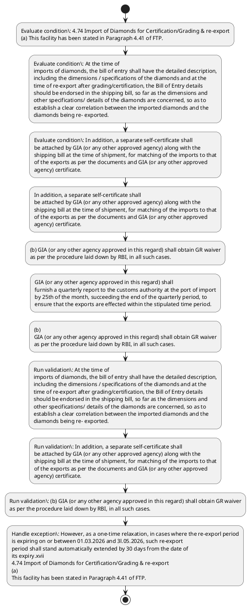

# Chapter 4 / Section 4.74: Import of Diamonds for Certification/Grading & re-export

**Chapter Title:** Duty Exemption / Remission Schemes

**Pages:** 43

**Purpose:** 4.74 Import of Diamonds for Certification/Grading & re-export
(a) This facility has been stated in Paragraph 4.41 of FTP.

**Purpose Thanglish:** Indha Import of Diamonds for Certification/Grading & re-export section-la, 4.74 import of Diamonds for Certification/Grading & re-export
(a) This facility has been stated in Paragraph 4.41 of FTP.

**Summary:** 4.74 Import of Diamonds for Certification/Grading & re-export
(a) This facility has been stated in Paragraph 4.41 of FTP. At the time of
imports of diamonds, the bill of entry shall have the detailed description,
including the dimensions / specifications of the diamonds and at the
time of re-export after grading/certification, the Bill of Entry details
should be endorsed in the shipping bill, so far as the dimensions and
other specifications/ details of the diamonds are concerned, so as to
establish a clear correlation between the imported diamonds and the
diamonds being re- exported. In addition, a separate self-certificate shall
be attached by GIA (or any other approved agency) along with the
shipping bill at the time of shipment, for matching of the imports to that
of the exports as per the documents and GIA (or any other approved
agency) certificate.

**Business Meaning:** Import of Diamonds for Certification/Grading & re-export governs how DGFT business controls should be applied, validated, and enforced.

**Business Explanation:** Import of Diamonds for Certification/Grading & re-export explains the operating rule set that DEKAI should enforce. Key control points include At the time of
imports of diamonds, the bill of entry shall have the detailed description,
including the dimensions / specifications of the diamonds and at the
time of re-export after grading/certification, the Bill of Entry details
should be endorsed in the shipping bill, so far as the dimensions and
other specifications/ details of the diamonds are concerned, so as to
establish a clear correlation between the imported diamonds and the
diamonds being re- exported. The section also drives actions such as In addition, a separate self-certificate shall
be attached by GIA (or any other approved agency) along with the
shipping bill at the time of shipment, for matching of the imports to that
of the exports as per the documents and GIA (or any other approved
agency) certificate..

**Business Explanation Thanglish:** Indha Import of Diamonds for Certification/Grading & re-export section-la, import of Diamonds for Certification/Grading & re-export explains the operating rule set that DEKAI should enforce. Key control points include At the time of
imports of diamonds, the bill of entry kandippa have the detailed description,
including the dimensions / specifications of the diamonds and at the
time of re-export after grading/certification, the Bill of Entry details
should be endorsed in the shipping bill, so far as the dimensions and
other specifications/ details of the diamonds are concerned, so as to
establish a clear correlation between the imported diamonds and the
diamonds being re- exported. The section also drives actions such as In addition, a separate self-certificate kandippa
be attached by GIA (or any other approved agency) along with the
shipping bill at the time of shipment, for matching of the imports to that
of the exports as per the documents and GIA (or any other approved
agency) certificate..

## Business Logic
- At the time of
imports of diamonds, the bill of entry shall have the detailed description,
including the dimensions / specifications of the diamonds and at the
time of re-export after grading/certification, the Bill of Entry details
should be endorsed in the shipping bill, so far as the dimensions and
other specifications/ details of the diamonds are concerned, so as to
establish a clear correlation between the imported diamonds and the
diamonds being re- exported.
- In addition, a separate self-certificate shall
be attached by GIA (or any other approved agency) along with the
shipping bill at the time of shipment, for matching of the imports to that
of the exports as per the documents and GIA (or any other approved
agency) certificate.
- (b) GIA (or any other agency approved in this regard) shall obtain GR waiver
as per the procedure laid down by RBI, in all such cases.
- (c) Re-export of the imported diamonds shall be completed within a
maximum time period of 3 months from the date of import(s).
- At the
time of import, the agency shall give an undertaking to the customs to
this effect.
- GIA (or any other agency approved in this regard) shall
furnish a quarterly report to the customs authority at the port of import
by 25th of the month, succeeding the end of the quarterly period, to
ensure that the exports are effected within the stipulated time period.
- However, as a one-time relaxation, in cases where the re-exporl period
is expiring on or between 01.03.2026 and 3l.05.2026, such re-export
period shall stand automatically extended by 30 days from the date of
its expiry.xvii
4.74 Import of Diamonds for Certification/Grading & re-export
(a)
This facility has been stated in Paragraph 4.41 of FTP.
- (b)
GIA (or any other agency approved in this regard) shall obtain GR waiver
as per the procedure laid down by RBI, in all such cases.
- (c)
Re-export of the imported diamonds shall be completed within a
maximum time period of 3 months from the date of import(s).
- However, as a one-time relaxation, in cases where the re-exporl period
is expiring on or between 01.03.2026 and 3l.05.2026, such re-export
period shall stand automatically extended by 30 days from the date of
its expiry.xvii

## Business Rules
- rule_id=CH4-SEC4_74-R001, rule_description=At the time of
imports of diamonds, the bill of entry shall have the detailed description,
including the dimensions / specifications of the diamonds and at the
time of re-export after grading/certification, the Bill of Entry details
should be endorsed in the shipping bill, so far as the dimensions and
other specifications/ details of the diamonds are concerned, so as to
establish a clear correlation between the imported diamonds and the
diamonds being re- exported., trigger=Import of Diamonds for Certification/Grading & re-export, condition=4.74 Import of Diamonds for Certification/Grading & re-export
(a) This facility has been stated in Paragraph 4.41 of FTP., validation=At the time of
imports of diamonds, the bill of entry shall have the detailed description,
including the dimensions / specifications of the diamonds and at the
time of re-export after grading/certification, the Bill of Entry details
should be endorsed in the shipping bill, so far as the dimensions and
other specifications/ details of the diamonds are concerned, so as to
establish a clear correlation between the imported diamonds and the
diamonds being re- exported., action=In addition, a separate self-certificate shall
be attached by GIA (or any other approved agency) along with the
shipping bill at the time of shipment, for matching of the imports to that
of the exports as per the documents and GIA (or any other approved
agency) certificate., exception=However, as a one-time relaxation, in cases where the re-exporl period
is expiring on or between 01.03.2026 and 3l.05.2026, such re-export
period shall stand automatically extended by 30 days from the date of
its expiry.xvii
4.74 Import of Diamonds for Certification/Grading & re-export
(a)
This facility has been stated in Paragraph 4.41 of FTP., output=DEKAI should produce a compliance decision for 4.74 - Import of Diamonds for Certification/Grading & re-export.
- rule_id=CH4-SEC4_74-R002, rule_description=In addition, a separate self-certificate shall
be attached by GIA (or any other approved agency) along with the
shipping bill at the time of shipment, for matching of the imports to that
of the exports as per the documents and GIA (or any other approved
agency) certificate., trigger=Import of Diamonds for Certification/Grading & re-export, condition=At the time of
imports of diamonds, the bill of entry shall have the detailed description,
including the dimensions / specifications of the diamonds and at the
time of re-export after grading/certification, the Bill of Entry details
should be endorsed in the shipping bill, so far as the dimensions and
other specifications/ details of the diamonds are concerned, so as to
establish a clear correlation between the imported diamonds and the
diamonds being re- exported., validation=In addition, a separate self-certificate shall
be attached by GIA (or any other approved agency) along with the
shipping bill at the time of shipment, for matching of the imports to that
of the exports as per the documents and GIA (or any other approved
agency) certificate., action=(b) GIA (or any other agency approved in this regard) shall obtain GR waiver
as per the procedure laid down by RBI, in all such cases., exception=However, as a one-time relaxation, in cases where the re-exporl period
is expiring on or between 01.03.2026 and 3l.05.2026, such re-export
period shall stand automatically extended by 30 days from the date of
its expiry.xvii, output=DEKAI should produce a compliance decision for 4.74 - Import of Diamonds for Certification/Grading & re-export.
- rule_id=CH4-SEC4_74-R003, rule_description=(b) GIA (or any other agency approved in this regard) shall obtain GR waiver
as per the procedure laid down by RBI, in all such cases., trigger=Import of Diamonds for Certification/Grading & re-export, condition=In addition, a separate self-certificate shall
be attached by GIA (or any other approved agency) along with the
shipping bill at the time of shipment, for matching of the imports to that
of the exports as per the documents and GIA (or any other approved
agency) certificate., validation=(b) GIA (or any other agency approved in this regard) shall obtain GR waiver
as per the procedure laid down by RBI, in all such cases., action=GIA (or any other agency approved in this regard) shall
furnish a quarterly report to the customs authority at the port of import
by 25th of the month, succeeding the end of the quarterly period, to
ensure that the exports are effected within the stipulated time period., exception=However, as a one-time relaxation, in cases where the re-exporl period
is expiring on or between 01.03.2026 and 3l.05.2026, such re-export
period shall stand automatically extended by 30 days from the date of
its expiry.xvii, output=DEKAI should produce a compliance decision for 4.74 - Import of Diamonds for Certification/Grading & re-export.
- rule_id=CH4-SEC4_74-R004, rule_description=(c) Re-export of the imported diamonds shall be completed within a
maximum time period of 3 months from the date of import(s)., trigger=Import of Diamonds for Certification/Grading & re-export, condition=However, as a one-time relaxation, in cases where the re-exporl period
is expiring on or between 01.03.2026 and 3l.05.2026, such re-export
period shall stand automatically extended by 30 days from the date of
its expiry.xvii
4.74 Import of Diamonds for Certification/Grading & re-export
(a)
This facility has been stated in Paragraph 4.41 of FTP., validation=(c) Re-export of the imported diamonds shall be completed within a
maximum time period of 3 months from the date of import(s)., action=(b)
GIA (or any other agency approved in this regard) shall obtain GR waiver
as per the procedure laid down by RBI, in all such cases., exception=However, as a one-time relaxation, in cases where the re-exporl period
is expiring on or between 01.03.2026 and 3l.05.2026, such re-export
period shall stand automatically extended by 30 days from the date of
its expiry.xvii, output=DEKAI should produce a compliance decision for 4.74 - Import of Diamonds for Certification/Grading & re-export.
- rule_id=CH4-SEC4_74-R005, rule_description=At the
time of import, the agency shall give an undertaking to the customs to
this effect., trigger=Import of Diamonds for Certification/Grading & re-export, condition=However, as a one-time relaxation, in cases where the re-exporl period
is expiring on or between 01.03.2026 and 3l.05.2026, such re-export
period shall stand automatically extended by 30 days from the date of
its expiry.xvii, validation=At the
time of import, the agency shall give an undertaking to the customs to
this effect., action=(b)
GIA (or any other agency approved in this regard) shall obtain GR waiver
as per the procedure laid down by RBI, in all such cases., exception=However, as a one-time relaxation, in cases where the re-exporl period
is expiring on or between 01.03.2026 and 3l.05.2026, such re-export
period shall stand automatically extended by 30 days from the date of
its expiry.xvii, output=DEKAI should produce a compliance decision for 4.74 - Import of Diamonds for Certification/Grading & re-export.
- rule_id=CH4-SEC4_74-R006, rule_description=GIA (or any other agency approved in this regard) shall
furnish a quarterly report to the customs authority at the port of import
by 25th of the month, succeeding the end of the quarterly period, to
ensure that the exports are effected within the stipulated time period., trigger=Import of Diamonds for Certification/Grading & re-export, condition=However, as a one-time relaxation, in cases where the re-exporl period
is expiring on or between 01.03.2026 and 3l.05.2026, such re-export
period shall stand automatically extended by 30 days from the date of
its expiry.xvii, validation=GIA (or any other agency approved in this regard) shall
furnish a quarterly report to the customs authority at the port of import
by 25th of the month, succeeding the end of the quarterly period, to
ensure that the exports are effected within the stipulated time period., action=(b)
GIA (or any other agency approved in this regard) shall obtain GR waiver
as per the procedure laid down by RBI, in all such cases., exception=However, as a one-time relaxation, in cases where the re-exporl period
is expiring on or between 01.03.2026 and 3l.05.2026, such re-export
period shall stand automatically extended by 30 days from the date of
its expiry.xvii, output=DEKAI should produce a compliance decision for 4.74 - Import of Diamonds for Certification/Grading & re-export.
- rule_id=CH4-SEC4_74-R007, rule_description=However, as a one-time relaxation, in cases where the re-exporl period
is expiring on or between 01.03.2026 and 3l.05.2026, such re-export
period shall stand automatically extended by 30 days from the date of
its expiry.xvii
4.74 Import of Diamonds for Certification/Grading & re-export
(a)
This facility has been stated in Paragraph 4.41 of FTP., trigger=Import of Diamonds for Certification/Grading & re-export, condition=However, as a one-time relaxation, in cases where the re-exporl period
is expiring on or between 01.03.2026 and 3l.05.2026, such re-export
period shall stand automatically extended by 30 days from the date of
its expiry.xvii, validation=However, as a one-time relaxation, in cases where the re-exporl period
is expiring on or between 01.03.2026 and 3l.05.2026, such re-export
period shall stand automatically extended by 30 days from the date of
its expiry.xvii
4.74 Import of Diamonds for Certification/Grading & re-export
(a)
This facility has been stated in Paragraph 4.41 of FTP., action=(b)
GIA (or any other agency approved in this regard) shall obtain GR waiver
as per the procedure laid down by RBI, in all such cases., exception=However, as a one-time relaxation, in cases where the re-exporl period
is expiring on or between 01.03.2026 and 3l.05.2026, such re-export
period shall stand automatically extended by 30 days from the date of
its expiry.xvii, output=DEKAI should produce a compliance decision for 4.74 - Import of Diamonds for Certification/Grading & re-export.
- rule_id=CH4-SEC4_74-R008, rule_description=(b)
GIA (or any other agency approved in this regard) shall obtain GR waiver
as per the procedure laid down by RBI, in all such cases., trigger=Import of Diamonds for Certification/Grading & re-export, condition=However, as a one-time relaxation, in cases where the re-exporl period
is expiring on or between 01.03.2026 and 3l.05.2026, such re-export
period shall stand automatically extended by 30 days from the date of
its expiry.xvii, validation=(b)
GIA (or any other agency approved in this regard) shall obtain GR waiver
as per the procedure laid down by RBI, in all such cases., action=(b)
GIA (or any other agency approved in this regard) shall obtain GR waiver
as per the procedure laid down by RBI, in all such cases., exception=However, as a one-time relaxation, in cases where the re-exporl period
is expiring on or between 01.03.2026 and 3l.05.2026, such re-export
period shall stand automatically extended by 30 days from the date of
its expiry.xvii, output=DEKAI should produce a compliance decision for 4.74 - Import of Diamonds for Certification/Grading & re-export.
- rule_id=CH4-SEC4_74-R009, rule_description=(c)
Re-export of the imported diamonds shall be completed within a
maximum time period of 3 months from the date of import(s)., trigger=Import of Diamonds for Certification/Grading & re-export, condition=However, as a one-time relaxation, in cases where the re-exporl period
is expiring on or between 01.03.2026 and 3l.05.2026, such re-export
period shall stand automatically extended by 30 days from the date of
its expiry.xvii, validation=(c)
Re-export of the imported diamonds shall be completed within a
maximum time period of 3 months from the date of import(s)., action=(b)
GIA (or any other agency approved in this regard) shall obtain GR waiver
as per the procedure laid down by RBI, in all such cases., exception=However, as a one-time relaxation, in cases where the re-exporl period
is expiring on or between 01.03.2026 and 3l.05.2026, such re-export
period shall stand automatically extended by 30 days from the date of
its expiry.xvii, output=DEKAI should produce a compliance decision for 4.74 - Import of Diamonds for Certification/Grading & re-export.
- rule_id=CH4-SEC4_74-R010, rule_description=However, as a one-time relaxation, in cases where the re-exporl period
is expiring on or between 01.03.2026 and 3l.05.2026, such re-export
period shall stand automatically extended by 30 days from the date of
its expiry.xvii, trigger=Import of Diamonds for Certification/Grading & re-export, condition=However, as a one-time relaxation, in cases where the re-exporl period
is expiring on or between 01.03.2026 and 3l.05.2026, such re-export
period shall stand automatically extended by 30 days from the date of
its expiry.xvii, validation=However, as a one-time relaxation, in cases where the re-exporl period
is expiring on or between 01.03.2026 and 3l.05.2026, such re-export
period shall stand automatically extended by 30 days from the date of
its expiry.xvii, action=(b)
GIA (or any other agency approved in this regard) shall obtain GR waiver
as per the procedure laid down by RBI, in all such cases., exception=However, as a one-time relaxation, in cases where the re-exporl period
is expiring on or between 01.03.2026 and 3l.05.2026, such re-export
period shall stand automatically extended by 30 days from the date of
its expiry.xvii, output=DEKAI should produce a compliance decision for 4.74 - Import of Diamonds for Certification/Grading & re-export.

## Conditions
- 4.74 Import of Diamonds for Certification/Grading & re-export
(a) This facility has been stated in Paragraph 4.41 of FTP.
- At the time of
imports of diamonds, the bill of entry shall have the detailed description,
including the dimensions / specifications of the diamonds and at the
time of re-export after grading/certification, the Bill of Entry details
should be endorsed in the shipping bill, so far as the dimensions and
other specifications/ details of the diamonds are concerned, so as to
establish a clear correlation between the imported diamonds and the
diamonds being re- exported.
- In addition, a separate self-certificate shall
be attached by GIA (or any other approved agency) along with the
shipping bill at the time of shipment, for matching of the imports to that
of the exports as per the documents and GIA (or any other approved
agency) certificate.
- However, as a one-time relaxation, in cases where the re-exporl period
is expiring on or between 01.03.2026 and 3l.05.2026, such re-export
period shall stand automatically extended by 30 days from the date of
its expiry.xvii
4.74 Import of Diamonds for Certification/Grading & re-export
(a)
This facility has been stated in Paragraph 4.41 of FTP.
- However, as a one-time relaxation, in cases where the re-exporl period
is expiring on or between 01.03.2026 and 3l.05.2026, such re-export
period shall stand automatically extended by 30 days from the date of
its expiry.xvii

## Condition Logic
- id=4.4.74.1, if=4.74 Import of Diamonds for Certification/Grading & re-export
(a) This facility has been stated in Paragraph 4.41 of FTP., then=In addition, a separate self-certificate shall
be attached by GIA (or any other approved agency) along with the
shipping bill at the time of shipment, for matching of the imports to that
of the exports as per the documents and GIA (or any other approved
agency) certificate., source=4.74 Import of Diamonds for Certification/Grading & re-export
(a) This facility has been stated in Paragraph 4.41 of FTP.
- id=4.4.74.2, if=At the time of
imports of diamonds, the bill of entry shall have the detailed description,
including the dimensions / specifications of the diamonds and at the
time of re-export after grading/certification, the Bill of Entry details
should be endorsed in the shipping bill, so far as the dimensions and
other specifications/ details of the diamonds are concerned, so as to
establish a clear correlation between the imported diamonds and the
diamonds being re- exported., then=In addition, a separate self-certificate shall
be attached by GIA (or any other approved agency) along with the
shipping bill at the time of shipment, for matching of the imports to that
of the exports as per the documents and GIA (or any other approved
agency) certificate., source=At the time of
imports of diamonds, the bill of entry shall have the detailed description,
including the dimensions / specifications of the diamonds and at the
time of re-export after grading/certification, the Bill of Entry details
should be endorsed in the shipping bill, so far as the dimensions and
other specifications/ details of the diamonds are concerned, so as to
establish a clear correlation between the imported diamonds and the
diamonds being re- exported.
- id=4.4.74.3, if=In addition, a separate self-certificate shall
be attached by GIA (or any other approved agency) along with the
shipping bill at the time of shipment, for matching of the imports to that
of the exports as per the documents and GIA (or any other approved
agency) certificate., then=In addition, a separate self-certificate shall
be attached by GIA (or any other approved agency) along with the
shipping bill at the time of shipment, for matching of the imports to that
of the exports as per the documents and GIA (or any other approved
agency) certificate., source=In addition, a separate self-certificate shall
be attached by GIA (or any other approved agency) along with the
shipping bill at the time of shipment, for matching of the imports to that
of the exports as per the documents and GIA (or any other approved
agency) certificate.
- id=4.4.74.4, if=However, as a one-time relaxation, in cases where the re-exporl period
is expiring on or between 01.03.2026 and 3l.05.2026, such re-export
period shall stand automatically extended by 30 days from the date of
its expiry.xvii
4.74 Import of Diamonds for Certification/Grading & re-export
(a)
This facility has been stated in Paragraph 4.41 of FTP., then=In addition, a separate self-certificate shall
be attached by GIA (or any other approved agency) along with the
shipping bill at the time of shipment, for matching of the imports to that
of the exports as per the documents and GIA (or any other approved
agency) certificate., source=However, as a one-time relaxation, in cases where the re-exporl period
is expiring on or between 01.03.2026 and 3l.05.2026, such re-export
period shall stand automatically extended by 30 days from the date of
its expiry.xvii
4.74 Import of Diamonds for Certification/Grading & re-export
(a)
This facility has been stated in Paragraph 4.41 of FTP.
- id=4.4.74.5, if=However, as a one-time relaxation, in cases where the re-exporl period
is expiring on or between 01.03.2026 and 3l.05.2026, such re-export
period shall stand automatically extended by 30 days from the date of
its expiry.xvii, then=In addition, a separate self-certificate shall
be attached by GIA (or any other approved agency) along with the
shipping bill at the time of shipment, for matching of the imports to that
of the exports as per the documents and GIA (or any other approved
agency) certificate., source=However, as a one-time relaxation, in cases where the re-exporl period
is expiring on or between 01.03.2026 and 3l.05.2026, such re-export
period shall stand automatically extended by 30 days from the date of
its expiry.xvii

## Validations
- At the time of
imports of diamonds, the bill of entry shall have the detailed description,
including the dimensions / specifications of the diamonds and at the
time of re-export after grading/certification, the Bill of Entry details
should be endorsed in the shipping bill, so far as the dimensions and
other specifications/ details of the diamonds are concerned, so as to
establish a clear correlation between the imported diamonds and the
diamonds being re- exported.
- In addition, a separate self-certificate shall
be attached by GIA (or any other approved agency) along with the
shipping bill at the time of shipment, for matching of the imports to that
of the exports as per the documents and GIA (or any other approved
agency) certificate.
- (b) GIA (or any other agency approved in this regard) shall obtain GR waiver
as per the procedure laid down by RBI, in all such cases.
- (c) Re-export of the imported diamonds shall be completed within a
maximum time period of 3 months from the date of import(s).
- At the
time of import, the agency shall give an undertaking to the customs to
this effect.
- GIA (or any other agency approved in this regard) shall
furnish a quarterly report to the customs authority at the port of import
by 25th of the month, succeeding the end of the quarterly period, to
ensure that the exports are effected within the stipulated time period.
- However, as a one-time relaxation, in cases where the re-exporl period
is expiring on or between 01.03.2026 and 3l.05.2026, such re-export
period shall stand automatically extended by 30 days from the date of
its expiry.xvii
4.74 Import of Diamonds for Certification/Grading & re-export
(a)
This facility has been stated in Paragraph 4.41 of FTP.
- (b)
GIA (or any other agency approved in this regard) shall obtain GR waiver
as per the procedure laid down by RBI, in all such cases.
- (c)
Re-export of the imported diamonds shall be completed within a
maximum time period of 3 months from the date of import(s).
- However, as a one-time relaxation, in cases where the re-exporl period
is expiring on or between 01.03.2026 and 3l.05.2026, such re-export
period shall stand automatically extended by 30 days from the date of
its expiry.xvii

## Exceptions
- However, as a one-time relaxation, in cases where the re-exporl period
is expiring on or between 01.03.2026 and 3l.05.2026, such re-export
period shall stand automatically extended by 30 days from the date of
its expiry.xvii
4.74 Import of Diamonds for Certification/Grading & re-export
(a)
This facility has been stated in Paragraph 4.41 of FTP.
- However, as a one-time relaxation, in cases where the re-exporl period
is expiring on or between 01.03.2026 and 3l.05.2026, such re-export
period shall stand automatically extended by 30 days from the date of
its expiry.xvii

## Dependencies
- 4.41
- 1
- 2
- 3
- 4
- 5
- 6

## Authorities
- customs
- customs authority

## Required Documents
- At the time of
imports of diamonds, the bill of entry shall have the detailed description,
including the dimensions / specifications of the diamonds and at the
time of re-export after grading/certification, the Bill of Entry details
should be endorsed in the shipping bill, so far as the dimensions and
other specifications/ details of the diamonds are concerned, so as to
establish a clear correlation between the imported diamonds and the
diamonds being re- exported.
- In addition, a separate self-certificate shall
be attached by GIA (or any other approved agency) along with the
shipping bill at the time of shipment, for matching of the imports to that
of the exports as per the documents and GIA (or any other approved
agency) certificate.
- At the
time of import, the agency shall give an undertaking to the customs to
this effect.

## Timelines
- At the time of
imports of diamonds, the bill of entry shall have the detailed description,
including the dimensions / specifications of the diamonds and at the
time of re-export after grading/certification, the Bill of Entry details
should be endorsed in the shipping bill, so far as the dimensions and
other specifications/ details of the diamonds are concerned, so as to
establish a clear correlation between the imported diamonds and the
diamonds being re- exported.
- (c) Re-export of the imported diamonds shall be completed within a
maximum time period of 3 months from the date of import(s).
- GIA (or any other agency approved in this regard) shall
furnish a quarterly report to the customs authority at the port of import
by 25th of the month, succeeding the end of the quarterly period, to
ensure that the exports are effected within the stipulated time period.
- However, as a one-time relaxation, in cases where the re-exporl period
is expiring on or between 01.03.2026 and 3l.05.2026, such re-export
period shall stand automatically extended by 30 days from the date of
its expiry.xvii
4.74 Import of Diamonds for Certification/Grading & re-export
(a)
This facility has been stated in Paragraph 4.41 of FTP.
- (c)
Re-export of the imported diamonds shall be completed within a
maximum time period of 3 months from the date of import(s).
- However, as a one-time relaxation, in cases where the re-exporl period
is expiring on or between 01.03.2026 and 3l.05.2026, such re-export
period shall stand automatically extended by 30 days from the date of
its expiry.xvii

## Actions
- In addition, a separate self-certificate shall
be attached by GIA (or any other approved agency) along with the
shipping bill at the time of shipment, for matching of the imports to that
of the exports as per the documents and GIA (or any other approved
agency) certificate.
- (b) GIA (or any other agency approved in this regard) shall obtain GR waiver
as per the procedure laid down by RBI, in all such cases.
- GIA (or any other agency approved in this regard) shall
furnish a quarterly report to the customs authority at the port of import
by 25th of the month, succeeding the end of the quarterly period, to
ensure that the exports are effected within the stipulated time period.
- (b)
GIA (or any other agency approved in this regard) shall obtain GR waiver
as per the procedure laid down by RBI, in all such cases.

## Workflow
- Evaluate condition: 4.74 Import of Diamonds for Certification/Grading & re-export
(a) This facility has been stated in Paragraph 4.41 of FTP.
- Evaluate condition: At the time of
imports of diamonds, the bill of entry shall have the detailed description,
including the dimensions / specifications of the diamonds and at the
time of re-export after grading/certification, the Bill of Entry details
should be endorsed in the shipping bill, so far as the dimensions and
other specifications/ details of the diamonds are concerned, so as to
establish a clear correlation between the imported diamonds and the
diamonds being re- exported.
- Evaluate condition: In addition, a separate self-certificate shall
be attached by GIA (or any other approved agency) along with the
shipping bill at the time of shipment, for matching of the imports to that
of the exports as per the documents and GIA (or any other approved
agency) certificate.
- In addition, a separate self-certificate shall
be attached by GIA (or any other approved agency) along with the
shipping bill at the time of shipment, for matching of the imports to that
of the exports as per the documents and GIA (or any other approved
agency) certificate.
- (b) GIA (or any other agency approved in this regard) shall obtain GR waiver
as per the procedure laid down by RBI, in all such cases.
- GIA (or any other agency approved in this regard) shall
furnish a quarterly report to the customs authority at the port of import
by 25th of the month, succeeding the end of the quarterly period, to
ensure that the exports are effected within the stipulated time period.
- (b)
GIA (or any other agency approved in this regard) shall obtain GR waiver
as per the procedure laid down by RBI, in all such cases.
- Run validation: At the time of
imports of diamonds, the bill of entry shall have the detailed description,
including the dimensions / specifications of the diamonds and at the
time of re-export after grading/certification, the Bill of Entry details
should be endorsed in the shipping bill, so far as the dimensions and
other specifications/ details of the diamonds are concerned, so as to
establish a clear correlation between the imported diamonds and the
diamonds being re- exported.
- Run validation: In addition, a separate self-certificate shall
be attached by GIA (or any other approved agency) along with the
shipping bill at the time of shipment, for matching of the imports to that
of the exports as per the documents and GIA (or any other approved
agency) certificate.
- Run validation: (b) GIA (or any other agency approved in this regard) shall obtain GR waiver
as per the procedure laid down by RBI, in all such cases.
- Handle exception: However, as a one-time relaxation, in cases where the re-exporl period
is expiring on or between 01.03.2026 and 3l.05.2026, such re-export
period shall stand automatically extended by 30 days from the date of
its expiry.xvii
4.74 Import of Diamonds for Certification/Grading & re-export
(a)
This facility has been stated in Paragraph 4.41 of FTP.

## Workflow ASCII
```text
Import of Diamonds for Certification/Grading & re-export
Evaluate condition: 4.74 Import of Diamonds for Certification/Grading & re-export
(a) This facility has been stated in Paragraph 4.41 of FTP.
   |
   v
Evaluate condition: At the time of
imports of diamonds, the bill of entry shall have the detailed description,
including the dimensions / specifications of the diamonds and at the
time of re-export after grading/certification, the Bill of Entry details
should be endorsed in the shipping bill, so far as the dimensions and
other specifications/ details of the diamonds are concerned, so as to
establish a clear correlation between the imported diamonds and the
diamonds being re- exported.
   |
   v
Evaluate condition: In addition, a separate self-certificate shall
be attached by GIA (or any other approved agency) along with the
shipping bill at the time of shipment, for matching of the imports to that
of the exports as per the documents and GIA (or any other approved
agency) certificate.
   |
   v
In addition, a separate self-certificate shall
be attached by GIA (or any other approved agency) along with the
shipping bill at the time of shipment, for matching of the imports to that
of the exports as per the documents and GIA (or any other approved
agency) certificate.
   |
   v
(b) GIA (or any other agency approved in this regard) shall obtain GR waiver
as per the procedure laid down by RBI, in all such cases.
   |
   v
GIA (or any other agency approved in this regard) shall
furnish a quarterly report to the customs authority at the port of import
by 25th of the month, succeeding the end of the quarterly period, to
ensure that the exports are effected within the stipulated time period.
   |
   v
(b)
GIA (or any other agency approved in this regard) shall obtain GR waiver
as per the procedure laid down by RBI, in all such cases.
   |
   v
Run validation: At the time of
imports of diamonds, the bill of entry shall have the detailed description,
including the dimensions / specifications of the diamonds and at the
time of re-export after grading/certification, the Bill of Entry details
should be endorsed in the shipping bill, so far as the dimensions and
other specifications/ details of the diamonds are concerned, so as to
establish a clear correlation between the imported diamonds and the
diamonds being re- exported.
   |
   v
Run validation: In addition, a separate self-certificate shall
be attached by GIA (or any other approved agency) along with the
shipping bill at the time of shipment, for matching of the imports to that
of the exports as per the documents and GIA (or any other approved
agency) certificate.
   |
   v
Run validation: (b) GIA (or any other agency approved in this regard) shall obtain GR waiver
as per the procedure laid down by RBI, in all such cases.
   |
   v
Handle exception: However, as a one-time relaxation, in cases where the re-exporl period
is expiring on or between 01.03.2026 and 3l.05.2026, such re-export
period shall stand automatically extended by 30 days from the date of
its expiry.xvii
4.74 Import of Diamonds for Certification/Grading & re-export
(a)
This facility has been stated in Paragraph 4.41 of FTP.
```

## Decision Tree
- IF 4.74 Import of Diamonds for Certification/Grading & re-export
(a) This facility has been stated in Paragraph 4.41 of FTP. THEN In addition, a separate self-certificate shall
be attached by GIA (or any other approved agency) along with the
shipping bill at the time of shipment, for matching of the imports to that
of the exports as per the documents and GIA (or any other approved
agency) certificate.
- IF At the time of
imports of diamonds, the bill of entry shall have the detailed description,
including the dimensions / specifications of the diamonds and at the
time of re-export after grading/certification, the Bill of Entry details
should be endorsed in the shipping bill, so far as the dimensions and
other specifications/ details of the diamonds are concerned, so as to
establish a clear correlation between the imported diamonds and the
diamonds being re- exported. THEN In addition, a separate self-certificate shall
be attached by GIA (or any other approved agency) along with the
shipping bill at the time of shipment, for matching of the imports to that
of the exports as per the documents and GIA (or any other approved
agency) certificate.
- IF In addition, a separate self-certificate shall
be attached by GIA (or any other approved agency) along with the
shipping bill at the time of shipment, for matching of the imports to that
of the exports as per the documents and GIA (or any other approved
agency) certificate. THEN In addition, a separate self-certificate shall
be attached by GIA (or any other approved agency) along with the
shipping bill at the time of shipment, for matching of the imports to that
of the exports as per the documents and GIA (or any other approved
agency) certificate.
- IF However, as a one-time relaxation, in cases where the re-exporl period
is expiring on or between 01.03.2026 and 3l.05.2026, such re-export
period shall stand automatically extended by 30 days from the date of
its expiry.xvii
4.74 Import of Diamonds for Certification/Grading & re-export
(a)
This facility has been stated in Paragraph 4.41 of FTP. THEN In addition, a separate self-certificate shall
be attached by GIA (or any other approved agency) along with the
shipping bill at the time of shipment, for matching of the imports to that
of the exports as per the documents and GIA (or any other approved
agency) certificate.
- IF However, as a one-time relaxation, in cases where the re-exporl period
is expiring on or between 01.03.2026 and 3l.05.2026, such re-export
period shall stand automatically extended by 30 days from the date of
its expiry.xvii THEN In addition, a separate self-certificate shall
be attached by GIA (or any other approved agency) along with the
shipping bill at the time of shipment, for matching of the imports to that
of the exports as per the documents and GIA (or any other approved
agency) certificate.
- IF exception applies (However, as a one-time relaxation, in cases where the re-exporl period
is expiring on or between 01.03.2026 and 3l.05.2026, such re-export
period shall stand automatically extended by 30 days from the date of
its expiry.xvii
4.74 Import of Diamonds for Certification/Grading & re-export
(a)
This facility has been stated in Paragraph 4.41 of FTP.) THEN route to manual review
- IF exception applies (However, as a one-time relaxation, in cases where the re-exporl period
is expiring on or between 01.03.2026 and 3l.05.2026, such re-export
period shall stand automatically extended by 30 days from the date of
its expiry.xvii) THEN route to manual review

## Decision Tree ASCII
```text
Import of Diamonds for Certification/Grading & re-export Decision
IF 4.74 Import of Diamonds for Certification/Grading & re-export
(a) This facility has been stated in Paragraph 4.41 of FTP. THEN In addition, a separate self-certificate shall
be attached by GIA (or any other approved agency) along with the
shipping bill at the time of shipment, for matching of the imports to that
of the exports as per the documents and GIA (or any other approved
agency) certificate.
   |
   v
IF At the time of
imports of diamonds, the bill of entry shall have the detailed description,
including the dimensions / specifications of the diamonds and at the
time of re-export after grading/certification, the Bill of Entry details
should be endorsed in the shipping bill, so far as the dimensions and
other specifications/ details of the diamonds are concerned, so as to
establish a clear correlation between the imported diamonds and the
diamonds being re- exported. THEN In addition, a separate self-certificate shall
be attached by GIA (or any other approved agency) along with the
shipping bill at the time of shipment, for matching of the imports to that
of the exports as per the documents and GIA (or any other approved
agency) certificate.
   |
   v
IF In addition, a separate self-certificate shall
be attached by GIA (or any other approved agency) along with the
shipping bill at the time of shipment, for matching of the imports to that
of the exports as per the documents and GIA (or any other approved
agency) certificate. THEN In addition, a separate self-certificate shall
be attached by GIA (or any other approved agency) along with the
shipping bill at the time of shipment, for matching of the imports to that
of the exports as per the documents and GIA (or any other approved
agency) certificate.
   |
   v
IF However, as a one-time relaxation, in cases where the re-exporl period
is expiring on or between 01.03.2026 and 3l.05.2026, such re-export
period shall stand automatically extended by 30 days from the date of
its expiry.xvii
4.74 Import of Diamonds for Certification/Grading & re-export
(a)
This facility has been stated in Paragraph 4.41 of FTP. THEN In addition, a separate self-certificate shall
be attached by GIA (or any other approved agency) along with the
shipping bill at the time of shipment, for matching of the imports to that
of the exports as per the documents and GIA (or any other approved
agency) certificate.
   |
   v
IF However, as a one-time relaxation, in cases where the re-exporl period
is expiring on or between 01.03.2026 and 3l.05.2026, such re-export
period shall stand automatically extended by 30 days from the date of
its expiry.xvii THEN In addition, a separate self-certificate shall
be attached by GIA (or any other approved agency) along with the
shipping bill at the time of shipment, for matching of the imports to that
of the exports as per the documents and GIA (or any other approved
agency) certificate.
   |
   v
IF exception applies (However, as a one-time relaxation, in cases where the re-exporl period
is expiring on or between 01.03.2026 and 3l.05.2026, such re-export
period shall stand automatically extended by 30 days from the date of
its expiry.xvii
4.74 Import of Diamonds for Certification/Grading & re-export
(a)
This facility has been stated in Paragraph 4.41 of FTP.) THEN route to manual review
   |
   v
IF exception applies (However, as a one-time relaxation, in cases where the re-exporl period
is expiring on or between 01.03.2026 and 3l.05.2026, such re-export
period shall stand automatically extended by 30 days from the date of
its expiry.xvii) THEN route to manual review
```

## Examples
- User asks to process Import of Diamonds for Certification/Grading & re-export; the platform checks conditions, validations, and documents before action.

**Real-world Example:** Example: an importer or exporter invokes Import of Diamonds for Certification/Grading & re-export, submits At the time of
imports of diamonds, the bill of entry shall have the detailed description,
including the dimensions / specifications of the diamonds and at the
time of re-export after grading/certification, the Bill of Entry details
should be endorsed in the shipping bill, so far as the dimensions and
other specifications/ details of the diamonds are concerned, so as to
establish a clear correlation between the imported diamonds and the
diamonds being re- exported., In addition, a separate self-certificate shall
be attached by GIA (or any other approved agency) along with the
shipping bill at the time of shipment, for matching of the imports to that
of the exports as per the documents and GIA (or any other approved
agency) certificate., At the
time of import, the agency shall give an undertaking to the customs to
this effect., and DEKAI uses the extracted rules to in addition, a separate self-certificate shall
be attached by gia (or any other approved agency) along with the
shipping bill at the time of shipment, for matching of the imports to that
of the exports as per the documents and gia (or any other approved
agency) certificate..

**Real-world Example Thanglish:** Indha Import of Diamonds for Certification/Grading & re-export section-la, Example: an importer or exporter invokes import of Diamonds for Certification/Grading & re-export, submits At the time of
imports of diamonds, the bill of entry kandippa have the detailed description,
including the dimensions / specifications of the diamonds and at the
time of re-export after grading/certification, the Bill of Entry details
should be endorsed in the shipping bill, so far as the dimensions and
other specifications/ details of the diamonds are concerned, so as to
establish a clear correlation between the imported diamonds and the
diamonds being re- exported., In addition, a separate self-certificate kandippa
be attached by GIA (or any other approved agency) along with the
shipping bill at the time of shipment, for matching of the imports to that
of the exports as per the documents and GIA (or any other approved
agency) certificate., At the
time of import, the agency kandippa give an undertaking to the customs to
this effect., and DEKAI uses the extracted rules to in addition, a separate self-certificate kandippa
be attached by gia (or any other approved agency) along with the
shipping bill at the time of shipment, for matching of the imports to that
of the exports as per the documents and gia (or any other approved
agency) certificate..

## AI Rules
- IF detected context matches section rule THEN enforce: At the time of
imports of diamonds, the bill of entry shall have the detailed description,
including the dimensions / specifications of the diamonds and at the
time of re-export after grading/certification, the Bill of Entry details
should be endorsed in the shipping bill, so far as the dimensions and
other specifications/ details of the diamonds are concerned, so as to
establish a clear correlation between the imported diamonds and the
diamonds being re- exported.
- IF detected context matches section rule THEN enforce: In addition, a separate self-certificate shall
be attached by GIA (or any other approved agency) along with the
shipping bill at the time of shipment, for matching of the imports to that
of the exports as per the documents and GIA (or any other approved
agency) certificate.
- IF detected context matches section rule THEN enforce: (b) GIA (or any other agency approved in this regard) shall obtain GR waiver
as per the procedure laid down by RBI, in all such cases.
- IF detected context matches section rule THEN enforce: (c) Re-export of the imported diamonds shall be completed within a
maximum time period of 3 months from the date of import(s).
- IF detected context matches section rule THEN enforce: At the
time of import, the agency shall give an undertaking to the customs to
this effect.
- IF detected context matches section rule THEN enforce: GIA (or any other agency approved in this regard) shall
furnish a quarterly report to the customs authority at the port of import
by 25th of the month, succeeding the end of the quarterly period, to
ensure that the exports are effected within the stipulated time period.
- IF validations pass THEN recommend action: In addition, a separate self-certificate shall
be attached by GIA (or any other approved agency) along with the
shipping bill at the time of shipment, for matching of the imports to that
of the exports as per the documents and GIA (or any other approved
agency) certificate.

## Database Fields
- name=section_code, type=string, required=True, source=parsed_section_heading
- name=section_title, type=string, required=True, source=parsed_section_heading
- name=for_flag, type=boolean, required=False, source=keyword:for
- name=has_flag, type=boolean, required=False, source=keyword:has
- name=ftp_flag, type=boolean, required=False, source=keyword:FTP
- name=the_flag, type=boolean, required=False, source=keyword:the
- name=and_flag, type=boolean, required=False, source=keyword:and
- name=far_flag, type=boolean, required=False, source=keyword:far
- name=are_flag, type=boolean, required=False, source=keyword:are
- name=gia_flag, type=boolean, required=False, source=keyword:GIA
- name=document_1_submitted, type=boolean, required=True, source=At the time of
imports of diamonds, the bill of entry shall have the detailed description,
including the dimensions / specifications of the diamonds and at the
time of re-export after grading/certification, the Bill of Entry details
should be endorsed in the shipping bill, so far as the dimensions and
other specifications/ details of the diamonds are concerned, so as to
establish a clear correlation between the imported diamonds and the
diamonds being re- exported.
- name=document_2_submitted, type=boolean, required=True, source=In addition, a separate self-certificate shall
be attached by GIA (or any other approved agency) along with the
shipping bill at the time of shipment, for matching of the imports to that
of the exports as per the documents and GIA (or any other approved
agency) certificate.
- name=document_3_submitted, type=boolean, required=True, source=At the
time of import, the agency shall give an undertaking to the customs to
this effect.

## API Requirements
- method=GET, path=/api/dgft/sections/4.74, purpose=Retrieve knowledge payload for section 4.74, query_params=['include=workflow,decision_tree,validations'], response_fields=['section', 'title', 'summary', 'conditions', 'validations', 'exceptions', 'workflow', 'decision_tree']
- method=POST, path=/api/dgft/Import-of-Diamonds-for-Certification-Grading-re-export/validate, purpose=Validate inputs and documents for Import of Diamonds for Certification/Grading & re-export, request_fields=['section_code', 'section_title', 'document_1_submitted', 'document_2_submitted', 'document_3_submitted'], response_fields=['status', 'errors', 'warnings', 'next_actions']
- method=POST, path=/api/dgft/Import-of-Diamonds-for-Certification-Grading-re-export/execute, purpose=Trigger business action for In addition, a separate self-certificate shall
be attached by GIA (or any other approved agency) along with the
shipping bill at the time of shipment, for matching of the imports to that
of the exports as per the documents and GIA (or any other approved
agency) certificate., request_fields=['section_code', 'section_title', 'document_1_submitted', 'document_2_submitted', 'document_3_submitted'], response_fields=['reference_id', 'status', 'authority', 'timeline']

## UI Screens
- screen_id=Import_of_Diamonds_for_Certification_Grading_re_export_overview, name=Import of Diamonds for Certification/Grading & re-export Overview, purpose=Show section summary, authority, timeline, and eligibility cues., widgets=['summary_card', 'conditions_table', 'authority_badges', 'timeline_panel']
- screen_id=Import_of_Diamonds_for_Certification_Grading_re_export_submission, name=Import of Diamonds for Certification/Grading & re-export Submission, purpose=Capture applicant data and supporting documents., widgets=['dynamic_form', 'document_uploader', 'validation_panel', 'next_action_footer'], fields=['section_code', 'section_title', 'for_flag', 'has_flag', 'ftp_flag', 'the_flag', 'and_flag', 'far_flag']
- screen_id=Import_of_Diamonds_for_Certification_Grading_re_export_exceptions, name=Import of Diamonds for Certification/Grading & re-export Exception Review, purpose=Explain exception handling and manual review triggers., widgets=['exception_banner', 'decision_tree', 'case_notes']

## Error Messages
- Validation failed because the section requirements were not fully met.

## FAQ
- question_en=What is the purpose of section 4.74?, answer_en=Import of Diamonds for Certification/Grading & re-export explains the operating rule set that DEKAI should enforce. Key control points include At the time of
imports of diamonds, the bill of entry shall have the detailed description,
including the dimensions / specifications of the diamonds and at the
time of re-export after grading/certification, the Bill of Entry details
should be endorsed in the shipping bill, so far as the dimensions and
other specifications/ details of the diamonds are concerned, so as to
establish a clear correlation between the imported diamonds and the
diamonds being re- exported. The section also drives actions such as In addition, a separate self-certificate shall
be attached by GIA (or any other approved agency) along with the
shipping bill at the time of shipment, for matching of the imports to that
of the exports as per the documents and GIA (or any other approved
agency) certificate.., question_thanglish=Indha Import of Diamonds for Certification/Grading & re-export section-la, What is the purpose of section 4.74?, answer_thanglish=Indha Import of Diamonds for Certification/Grading & re-export section-la, import of Diamonds for Certification/Grading & re-export explains the operating rule set that DEKAI should enforce. Key control points include At the time of
imports of diamonds, the bill of entry kandippa have the detailed description,
including the dimensions / specifications of the diamonds and at the
time of re-export after grading/certification, the Bill of Entry details
should be endorsed in the shipping bill, so far as the dimensions and
other specifications/ details of the diamonds are concerned, so as to
establish a clear correlation between the imported diamonds and the
diamonds being re- exported. The section also drives actions such as In addition, a separate self-certificate kandippa
be attached by GIA (or any other approved agency) along with the
shipping bill at the time of shipment, for matching of the imports to that
of the exports as per the documents and GIA (or any other approved
agency) certificate..
- question_en=What documents are required under Import of Diamonds for Certification/Grading & re-export?, answer_en=At the time of
imports of diamonds, the bill of entry shall have the detailed description,
including the dimensions / specifications of the diamonds and at the
time of re-export after grading/certification, the Bill of Entry details
should be endorsed in the shipping bill, so far as the dimensions and
other specifications/ details of the diamonds are concerned, so as to
establish a clear correlation between the imported diamonds and the
diamonds being re- exported., In addition, a separate self-certificate shall
be attached by GIA (or any other approved agency) along with the
shipping bill at the time of shipment, for matching of the imports to that
of the exports as per the documents and GIA (or any other approved
agency) certificate., At the
time of import, the agency shall give an undertaking to the customs to
this effect., question_thanglish=Indha Import of Diamonds for Certification/Grading & re-export section-la, What documents are required under import of Diamonds for Certification/Grading & re-export?, answer_thanglish=Indha Import of Diamonds for Certification/Grading & re-export section-la, At the time of
imports of diamonds, the bill of entry kandippa have the detailed description,
including the dimensions / specifications of the diamonds and at the
time of re-export after grading/certification, the Bill of Entry details
should be endorsed in the shipping bill, so far as the dimensions and
other specifications/ details of the diamonds are concerned, so as to
establish a clear correlation between the imported diamonds and the
diamonds being re- exported., In addition, a separate self-certificate kandippa
be attached by GIA (or any other approved agency) along with the
shipping bill at the time of shipment, for matching of the imports to that
of the exports as per the documents and GIA (or any other approved
agency) certificate., At the
time of import, the agency kandippa give an undertaking to the customs to
this effect.
- question_en=Which authority handles Import of Diamonds for Certification/Grading & re-export?, answer_en=customs, customs authority, question_thanglish=Indha Import of Diamonds for Certification/Grading & re-export section-la, Which authority handles import of Diamonds for Certification/Grading & re-export?, answer_thanglish=Indha Import of Diamonds for Certification/Grading & re-export section-la, customs, customs authority

## Questions Users May Ask
- What does Import of Diamonds for Certification/Grading & re-export require?
- Which documents are needed for Import of Diamonds for Certification/Grading & re-export?
- How does DEKAI validate Import of Diamonds for Certification/Grading & re-export requests?
- What action should be taken for Import of Diamonds for Certification/Grading & re-export?

## Expected AI Answers
- Import of Diamonds for Certification/Grading & re-export requires the platform to interpret the section text, apply the extracted business rules, and present the correct next action.
- Required documents are inferred from the section text: At the time of
imports of diamonds, the bill of entry shall have the detailed description,
including the dimensions / specifications of the diamonds and at the
time of re-export after grading/certification, the Bill of Entry details
should be endorsed in the shipping bill, so far as the dimensions and
other specifications/ details of the diamonds are concerned, so as to
establish a clear correlation between the imported diamonds and the
diamonds being re- exported., In addition, a separate self-certificate shall
be attached by GIA (or any other approved agency) along with the
shipping bill at the time of shipment, for matching of the imports to that
of the exports as per the documents and GIA (or any other approved
agency) certificate., At the
time of import, the agency shall give an undertaking to the customs to
this effect.
- DEKAI validates Import of Diamonds for Certification/Grading & re-export by checking conditions, required documents, authority references, and exception clauses before recommending an outcome.
- The primary extracted action is: In addition, a separate self-certificate shall
be attached by GIA (or any other approved agency) along with the
shipping bill at the time of shipment, for matching of the imports to that
of the exports as per the documents and GIA (or any other approved
agency) certificate.

## AI Q&A Examples
- question_en=User asks: How do I comply with Import of Diamonds for Certification/Grading & re-export?, answer_en=AI answers: DEKAI should evaluate section 4.74, apply the extracted rules, and guide the user through Evaluate condition: 4.74 Import of Diamonds for Certification/Grading & re-export
(a) This facility has been stated in Paragraph 4.41 of FTP.., question_thanglish=Indha Import of Diamonds for Certification/Grading & re-export section-la, User asks: How do I comply with import of Diamonds for Certification/Grading & re-export?, answer_thanglish=Indha Import of Diamonds for Certification/Grading & re-export section-la, AI answers: DEKAI should evaluate section 4.74, apply the extracted rules, and guide the user through Evaluate condition: 4.74 import of Diamonds for Certification/Grading & re-export
(a) This facility has been stated in Paragraph 4.41 of FTP..
- question_en=User asks: Which validations apply to Import of Diamonds for Certification/Grading & re-export?, answer_en=AI answers: Applicable validations are At the time of
imports of diamonds, the bill of entry shall have the detailed description,
including the dimensions / specifications of the diamonds and at the
time of re-export after grading/certification, the Bill of Entry details
should be endorsed in the shipping bill, so far as the dimensions and
other specifications/ details of the diamonds are concerned, so as to
establish a clear correlation between the imported diamonds and the
diamonds being re- exported., In addition, a separate self-certificate shall
be attached by GIA (or any other approved agency) along with the
shipping bill at the time of shipment, for matching of the imports to that
of the exports as per the documents and GIA (or any other approved
agency) certificate., (b) GIA (or any other agency approved in this regard) shall obtain GR waiver
as per the procedure laid down by RBI, in all such cases., question_thanglish=Indha Import of Diamonds for Certification/Grading & re-export section-la, User asks: Which validations apply to import of Diamonds for Certification/Grading & re-export?, answer_thanglish=Indha Import of Diamonds for Certification/Grading & re-export section-la, AI answers: Applicable validations are At the time of
imports of diamonds, the bill of entry kandippa have the detailed description,
including the dimensions / specifications of the diamonds and at the
time of re-export after grading/certification, the Bill of Entry details
should be endorsed in the shipping bill, so far as the dimensions and
other specifications/ details of the diamonds are concerned, so as to
establish a clear correlation between the imported diamonds and the
diamonds being re- exported., In addition, a separate self-certificate kandippa
be attached by GIA (or any other approved agency) along with the
shipping bill at the time of shipment, for matching of the imports to that
of the exports as per the documents and GIA (or any other approved
agency) certificate., (b) GIA (or any other agency approved in this regard) kandippa obtain GR waiver
as per the procedure laid down by RBI, in all such cases.

## DEKAI AI Implementation Notes
- Capture chapter 4, section 4.74, title, and page references as immutable knowledge metadata.
- Bind validations for Import of Diamonds for Certification/Grading & re-export into a rule engine keyed by the rule IDs extracted for this section.
- Expose document upload controls for: At the time of
imports of diamonds, the bill of entry shall have the detailed description,
including the dimensions / specifications of the diamonds and at the
time of re-export after grading/certification, the Bill of Entry details
should be endorsed in the shipping bill, so far as the dimensions and
other specifications/ details of the diamonds are concerned, so as to
establish a clear correlation between the imported diamonds and the
diamonds being re- exported., In addition, a separate self-certificate shall
be attached by GIA (or any other approved agency) along with the
shipping bill at the time of shipment, for matching of the imports to that
of the exports as per the documents and GIA (or any other approved
agency) certificate., At the
time of import, the agency shall give an undertaking to the customs to
this effect..
- Route escalations or approvals to: customs, customs authority.
- Trigger manual review when exception clauses are detected.
- Show contextual links to related sections: 4.41, 1, 2, 3, 4, 5, 6.

## DEKAI AI Implementation Notes Thanglish
- Indha Import of Diamonds for Certification/Grading & re-export section-la, Capture chapter 4, section 4.74, title, and page references as immutable knowledge metadata.
- Indha Import of Diamonds for Certification/Grading & re-export section-la, Bind validations for import of Diamonds for Certification/Grading & re-export into a rule engine keyed by the rule IDs extracted for this section.
- Indha Import of Diamonds for Certification/Grading & re-export section-la, Expose document upload controls for: At the time of
imports of diamonds, the bill of entry kandippa have the detailed description,
including the dimensions / specifications of the diamonds and at the
time of re-export after grading/certification, the Bill of Entry details
should be endorsed in the shipping bill, so far as the dimensions and
other specifications/ details of the diamonds are concerned, so as to
establish a clear correlation between the imported diamonds and the
diamonds being re- exported., In addition, a separate self-certificate kandippa
be attached by GIA (or any other approved agency) along with the
shipping bill at the time of shipment, for matching of the imports to that
of the exports as per the documents and GIA (or any other approved
agency) certificate., At the
time of import, the agency kandippa give an undertaking to the customs to
this effect..
- Indha Import of Diamonds for Certification/Grading & re-export section-la, Route escalations or approvals to: customs, customs authority.
- Indha Import of Diamonds for Certification/Grading & re-export section-la, Trigger manual review when exception clauses are detected.
- Indha Import of Diamonds for Certification/Grading & re-export section-la, Show contextual links to related sections: 4.41, 1, 2, 3, 4, 5, 6.

## AI Metadata
- Keywords: for, has, FTP, the, and, far, are, GIA, any, per, RBI, all, end, its, This, been, time, bill, have, with
- Search Keywords: for, has, FTP, the, and, far, are, GIA, any, per, RBI, all, end, its, This, been, time, bill, have, with
- Intent: Support Import of Diamonds for Certification/Grading & re-export processing and compliance validation.
- Tags: 4.74, Import of Diamonds for Certification/Grading & re-export, business-rule, document-driven, dgft
- Related Sections: 4.41, 1, 2, 3, 4, 5, 6
- Related Chapters: 
- Related Rules: At the time of
imports of diamonds, the bill of entry shall have the detailed description,
including the dimensions / specifications of the diamonds and at the
time of re-export after grading/certification, the Bill of Entry details
should be endorsed in the shipping bill, so far as the dimensions and
other specifications/ details of the diamonds are concerned, so as to
establish a clear correlation between the imported diamonds and the
diamonds being re- exported., In addition, a separate self-certificate shall
be attached by GIA (or any other approved agency) along with the
shipping bill at the time of shipment, for matching of the imports to that
of the exports as per the documents and GIA (or any other approved
agency) certificate., (b) GIA (or any other agency approved in this regard) shall obtain GR waiver
as per the procedure laid down by RBI, in all such cases., (c) Re-export of the imported diamonds shall be completed within a
maximum time period of 3 months from the date of import(s)., At the
time of import, the agency shall give an undertaking to the customs to
this effect.

## Mermaid

```mermaid
flowchart TD
    S1["Evaluate condition: 4.74 Import of Diamonds for Certification/Grading & re-export
(a) This facility has been stated in Paragraph 4.41 of FTP."]
    S2["Evaluate condition: At the time of
imports of diamonds, the bill of entry shall have the detailed description,
including the dimensions / specifications of the diamonds and at the
time of re-export after grading/certification, the Bill of Entry details
should be endorsed in the shipping bill, so far as the dimensions and
other specifications/ details of the diamonds are concerned, so as to
establish a clear correlation between the imported diamonds and the
diamonds being re- exported."]
    S1 --> S2
    S3["Evaluate condition: In addition, a separate self-certificate shall
be attached by GIA (or any other approved agency) along with the
shipping bill at the time of shipment, for matching of the imports to that
of the exports as per the documents and GIA (or any other approved
agency) certificate."]
    S2 --> S3
    S4["In addition, a separate self-certificate shall
be attached by GIA (or any other approved agency) along with the
shipping bill at the time of shipment, for matching of the imports to that
of the exports as per the documents and GIA (or any other approved
agency) certificate."]
    S3 --> S4
    S5["(b) GIA (or any other agency approved in this regard) shall obtain GR waiver
as per the procedure laid down by RBI, in all such cases."]
    S4 --> S5
    S6["GIA (or any other agency approved in this regard) shall
furnish a quarterly report to the customs authority at the port of import
by 25th of the month, succeeding the end of the quarterly period, to
ensure that the exports are effected within the stipulated time period."]
    S5 --> S6
    S7["(b)
GIA (or any other agency approved in this regard) shall obtain GR waiver
as per the procedure laid down by RBI, in all such cases."]
    S6 --> S7
    S8["Run validation: At the time of
imports of diamonds, the bill of entry shall have the detailed description,
including the dimensions / specifications of the diamonds and at the
time of re-export after grading/certification, the Bill of Entry details
should be endorsed in the shipping bill, so far as the dimensions and
other specifications/ details of the diamonds are concerned, so as to
establish a clear correlation between the imported diamonds and the
diamonds being re- exported."]
    S7 --> S8
    S9["Run validation: In addition, a separate self-certificate shall
be attached by GIA (or any other approved agency) along with the
shipping bill at the time of shipment, for matching of the imports to that
of the exports as per the documents and GIA (or any other approved
agency) certificate."]
    S8 --> S9
    S10["Run validation: (b) GIA (or any other agency approved in this regard) shall obtain GR waiver
as per the procedure laid down by RBI, in all such cases."]
    S9 --> S10
    S11["Handle exception: However, as a one-time relaxation, in cases where the re-exporl period
is expiring on or between 01.03.2026 and 3l.05.2026, such re-export
period shall stand automatically extended by 30 days from the date of
its expiry.xvii
4.74 Import of Diamonds for Certification/Grading & re-export
(a)
This facility has been stated in Paragraph 4.41 of FTP."]
    S10 --> S11
```


## PlantUML

