# Chapter 4 / Section 4.75: Enlistment /Authorisation of Laboratories for Certification/

**Chapter Title:** Duty Exemption / Remission Schemes

**Pages:** 43, 44

**Purpose:** 4.75 Enlistment /Authorisation of Laboratories for Certification/
Grading of Diamonds of 0.25 carat and above
Applications for enlistment of laboratories should be submitted to Gems and
pg.

**Purpose Thanglish:** Indha Enlistment /Authorisation of Laboratories for Certification/ section-la, 4.75 Enlistment /Authorisation of Laboratories for Certification/
Grading of Diamonds of 0.25 carat and above
Applications for enlistment of laboratories should be submitted to Gems and
pg.

**Summary:** 4.75 Enlistment /Authorisation of Laboratories for Certification/
Grading of Diamonds of 0.25 carat and above
Applications for enlistment of laboratories should be submitted to Gems and
pg. 118
pg. 118
(12) Gemological Research(Thailand)Co.

**Business Meaning:** Enlistment /Authorisation of Laboratories for Certification/ governs how DGFT business controls should be applied, validated, and enforced.

**Business Explanation:** Enlistment /Authorisation of Laboratories for Certification/ explains the operating rule set that DEKAI should enforce. Key control points include 4.75 Enlistment /Authorisation of Laboratories for Certification/
Grading of Diamonds of 0.25 carat and above
Applications for enlistment of laboratories should be submitted to Gems and
pg. The section also drives actions such as 4.75 Enlistment /Authorisation of Laboratories for Certification/
Grading of Diamonds of 0.25 carat and above
Applications for enlistment of laboratories should be submitted to Gems and
pg..

**Business Explanation Thanglish:** Indha Enlistment /Authorisation of Laboratories for Certification/ section-la, Enlistment /Authorisation of Laboratories for Certification/ explains the operating rule set that DEKAI should enforce. Key control points include 4.75 Enlistment /Authorisation of Laboratories for Certification/
Grading of Diamonds of 0.25 carat and above
Applications for enlistment of laboratories should be submitted to Gems and
pg. The section also drives actions such as 4.75 Enlistment /Authorisation of Laboratories for Certification/
Grading of Diamonds of 0.25 carat and above
Applications for enlistment of laboratories should be submitted to Gems and
pg..

## Business Logic
- 4.75 Enlistment /Authorisation of Laboratories for Certification/
Grading of Diamonds of 0.25 carat and above
Applications for enlistment of laboratories should be submitted to Gems and
pg.
- (19) GIA Laboratory, FZCO, Dubai, UAE.xii, xix
4.75 Enlistment /Authorisation of Laboratories for Certification/
Grading of Diamonds of 0.25 carat and above
Applications for enlistment of laboratories should be submitted to Gems and
Jewellery Promotion Council (GJEPC) for scrutiny of the application for
fulfillment of the norms prescribed.

## Business Rules
- rule_id=CH4-SEC4_75-R001, rule_description=4.75 Enlistment /Authorisation of Laboratories for Certification/
Grading of Diamonds of 0.25 carat and above
Applications for enlistment of laboratories should be submitted to Gems and
pg., trigger=Enlistment /Authorisation of Laboratories for Certification/, condition=4.75 Enlistment /Authorisation of Laboratories for Certification/
Grading of Diamonds of 0.25 carat and above
Applications for enlistment of laboratories should be submitted to Gems and
pg., validation=After in principle approval of DGFT is granted, GJEPC will
conduct inspection of the facility to verify the availability of equipments,
technical manpower as well as other infrastructure required for the Laboratory,
to function as Authorised Laboratory for certification/ grading of diamonds of
0.25 carat and above., action=4.75 Enlistment /Authorisation of Laboratories for Certification/
Grading of Diamonds of 0.25 carat and above
Applications for enlistment of laboratories should be submitted to Gems and
pg., exception=No explicit exception found in uploaded documents., output=DEKAI should produce a compliance decision for 4.75 - Enlistment /Authorisation of Laboratories for Certification/.
- rule_id=CH4-SEC4_75-R002, rule_description=(19) GIA Laboratory, FZCO, Dubai, UAE.xii, xix
4.75 Enlistment /Authorisation of Laboratories for Certification/
Grading of Diamonds of 0.25 carat and above
Applications for enlistment of laboratories should be submitted to Gems and
Jewellery Promotion Council (GJEPC) for scrutiny of the application for
fulfillment of the norms prescribed., trigger=Enlistment /Authorisation of Laboratories for Certification/, condition=(19) GIA Laboratory, FZCO, Dubai, UAE.xii, xix
4.75 Enlistment /Authorisation of Laboratories for Certification/
Grading of Diamonds of 0.25 carat and above
Applications for enlistment of laboratories should be submitted to Gems and
Jewellery Promotion Council (GJEPC) for scrutiny of the application for
fulfillment of the norms prescribed., validation=After in principle approval of DGFT is granted, GJEPC will
conduct inspection of the facility to verify the availability of equipments,
technical manpower as well as other infrastructure required for the Laboratory,
to function as Authorised Laboratory for certification/ grading of diamonds of
0.25 carat and above., action=(19) GIA Laboratory, FZCO, Dubai, UAE.xii, xix
4.75 Enlistment /Authorisation of Laboratories for Certification/
Grading of Diamonds of 0.25 carat and above
Applications for enlistment of laboratories should be submitted to Gems and
Jewellery Promotion Council (GJEPC) for scrutiny of the application for
fulfillment of the norms prescribed., exception=No explicit exception found in uploaded documents., output=DEKAI should produce a compliance decision for 4.75 - Enlistment /Authorisation of Laboratories for Certification/.

## Conditions
- 4.75 Enlistment /Authorisation of Laboratories for Certification/
Grading of Diamonds of 0.25 carat and above
Applications for enlistment of laboratories should be submitted to Gems and
pg.
- (19) GIA Laboratory, FZCO, Dubai, UAE.xii, xix
4.75 Enlistment /Authorisation of Laboratories for Certification/
Grading of Diamonds of 0.25 carat and above
Applications for enlistment of laboratories should be submitted to Gems and
Jewellery Promotion Council (GJEPC) for scrutiny of the application for
fulfillment of the norms prescribed.
- GJEPC will forward the application after
verification of bona fides with their clear recommendation for in principle
approval of DGFT.
- After in principle approval of DGFT is granted, GJEPC will
conduct inspection of the facility to verify the availability of equipments,
technical manpower as well as other infrastructure required for the Laboratory,
to function as Authorised Laboratory for certification/ grading of diamonds of
0.25 carat and above.

## Condition Logic
- id=4.4.75.1, if=4.75 Enlistment /Authorisation of Laboratories for Certification/
Grading of Diamonds of 0.25 carat and above
Applications for enlistment of laboratories should be submitted to Gems and
pg., then=4.75 Enlistment /Authorisation of Laboratories for Certification/
Grading of Diamonds of 0.25 carat and above
Applications for enlistment of laboratories should be submitted to Gems and
pg., source=4.75 Enlistment /Authorisation of Laboratories for Certification/
Grading of Diamonds of 0.25 carat and above
Applications for enlistment of laboratories should be submitted to Gems and
pg.
- id=4.4.75.2, if=(19) GIA Laboratory, FZCO, Dubai, UAE.xii, xix
4.75 Enlistment /Authorisation of Laboratories for Certification/
Grading of Diamonds of 0.25 carat and above
Applications for enlistment of laboratories should be submitted to Gems and
Jewellery Promotion Council (GJEPC) for scrutiny of the application for
fulfillment of the norms prescribed., then=4.75 Enlistment /Authorisation of Laboratories for Certification/
Grading of Diamonds of 0.25 carat and above
Applications for enlistment of laboratories should be submitted to Gems and
pg., source=(19) GIA Laboratory, FZCO, Dubai, UAE.xii, xix
4.75 Enlistment /Authorisation of Laboratories for Certification/
Grading of Diamonds of 0.25 carat and above
Applications for enlistment of laboratories should be submitted to Gems and
Jewellery Promotion Council (GJEPC) for scrutiny of the application for
fulfillment of the norms prescribed.
- id=4.4.75.3, if=GJEPC will forward the application after
verification of bona fides with their clear recommendation for in principle
approval of DGFT., then=4.75 Enlistment /Authorisation of Laboratories for Certification/
Grading of Diamonds of 0.25 carat and above
Applications for enlistment of laboratories should be submitted to Gems and
pg., source=GJEPC will forward the application after
verification of bona fides with their clear recommendation for in principle
approval of DGFT.
- id=4.4.75.4, if=After in principle approval of DGFT is granted, GJEPC will
conduct inspection of the facility to verify the availability of equipments,
technical manpower as well as other infrastructure required for the Laboratory,
to function as Authorised Laboratory for certification/ grading of diamonds of
0.25 carat and above., then=4.75 Enlistment /Authorisation of Laboratories for Certification/
Grading of Diamonds of 0.25 carat and above
Applications for enlistment of laboratories should be submitted to Gems and
pg., source=After in principle approval of DGFT is granted, GJEPC will
conduct inspection of the facility to verify the availability of equipments,
technical manpower as well as other infrastructure required for the Laboratory,
to function as Authorised Laboratory for certification/ grading of diamonds of
0.25 carat and above.

## Validations
- After in principle approval of DGFT is granted, GJEPC will
conduct inspection of the facility to verify the availability of equipments,
technical manpower as well as other infrastructure required for the Laboratory,
to function as Authorised Laboratory for certification/ grading of diamonds of
0.25 carat and above.

## Exceptions
- None identified

## Dependencies
- 4.41
- 4.42

## Authorities
- DGFT
- After in principle approval of DGFT

## Required Documents
- 4.75 Enlistment /Authorisation of Laboratories for Certification/
Grading of Diamonds of 0.25 carat and above
Applications for enlistment of laboratories should be submitted to Gems and
pg.
- (19) GIA Laboratory, FZCO, Dubai, UAE.xii, xix
4.75 Enlistment /Authorisation of Laboratories for Certification/
Grading of Diamonds of 0.25 carat and above
Applications for enlistment of laboratories should be submitted to Gems and
Jewellery Promotion Council (GJEPC) for scrutiny of the application for
fulfillment of the norms prescribed.
- GJEPC will forward the application after
verification of bona fides with their clear recommendation for in principle
approval of DGFT.

## Timelines
- GJEPC will forward the application after
verification of bona fides with their clear recommendation for in principle
approval of DGFT.
- After in principle approval of DGFT is granted, GJEPC will
conduct inspection of the facility to verify the availability of equipments,
technical manpower as well as other infrastructure required for the Laboratory,
to function as Authorised Laboratory for certification/ grading of diamonds of
0.25 carat and above.

## Actions
- 4.75 Enlistment /Authorisation of Laboratories for Certification/
Grading of Diamonds of 0.25 carat and above
Applications for enlistment of laboratories should be submitted to Gems and
pg.
- (19) GIA Laboratory, FZCO, Dubai, UAE.xii, xix
4.75 Enlistment /Authorisation of Laboratories for Certification/
Grading of Diamonds of 0.25 carat and above
Applications for enlistment of laboratories should be submitted to Gems and
Jewellery Promotion Council (GJEPC) for scrutiny of the application for
fulfillment of the norms prescribed.
- After in principle approval of DGFT is granted, GJEPC will
conduct inspection of the facility to verify the availability of equipments,
technical manpower as well as other infrastructure required for the Laboratory,
to function as Authorised Laboratory for certification/ grading of diamonds of
0.25 carat and above.
- Based on the Inspection Report and recommendations of
the GJEPC, the concerned laboratory would be considered for inclusion in
paragraph 4.41 or 4.42 of FTP as the case may be.

## Workflow
- Evaluate condition: 4.75 Enlistment /Authorisation of Laboratories for Certification/
Grading of Diamonds of 0.25 carat and above
Applications for enlistment of laboratories should be submitted to Gems and
pg.
- Evaluate condition: (19) GIA Laboratory, FZCO, Dubai, UAE.xii, xix
4.75 Enlistment /Authorisation of Laboratories for Certification/
Grading of Diamonds of 0.25 carat and above
Applications for enlistment of laboratories should be submitted to Gems and
Jewellery Promotion Council (GJEPC) for scrutiny of the application for
fulfillment of the norms prescribed.
- Evaluate condition: GJEPC will forward the application after
verification of bona fides with their clear recommendation for in principle
approval of DGFT.
- 4.75 Enlistment /Authorisation of Laboratories for Certification/
Grading of Diamonds of 0.25 carat and above
Applications for enlistment of laboratories should be submitted to Gems and
pg.
- (19) GIA Laboratory, FZCO, Dubai, UAE.xii, xix
4.75 Enlistment /Authorisation of Laboratories for Certification/
Grading of Diamonds of 0.25 carat and above
Applications for enlistment of laboratories should be submitted to Gems and
Jewellery Promotion Council (GJEPC) for scrutiny of the application for
fulfillment of the norms prescribed.
- After in principle approval of DGFT is granted, GJEPC will
conduct inspection of the facility to verify the availability of equipments,
technical manpower as well as other infrastructure required for the Laboratory,
to function as Authorised Laboratory for certification/ grading of diamonds of
0.25 carat and above.
- Based on the Inspection Report and recommendations of
the GJEPC, the concerned laboratory would be considered for inclusion in
paragraph 4.41 or 4.42 of FTP as the case may be.
- Run validation: After in principle approval of DGFT is granted, GJEPC will
conduct inspection of the facility to verify the availability of equipments,
technical manpower as well as other infrastructure required for the Laboratory,
to function as Authorised Laboratory for certification/ grading of diamonds of
0.25 carat and above.

## Workflow ASCII
```text
Enlistment /Authorisation of Laboratories for Certification/
Evaluate condition: 4.75 Enlistment /Authorisation of Laboratories for Certification/
Grading of Diamonds of 0.25 carat and above
Applications for enlistment of laboratories should be submitted to Gems and
pg.
   |
   v
Evaluate condition: (19) GIA Laboratory, FZCO, Dubai, UAE.xii, xix
4.75 Enlistment /Authorisation of Laboratories for Certification/
Grading of Diamonds of 0.25 carat and above
Applications for enlistment of laboratories should be submitted to Gems and
Jewellery Promotion Council (GJEPC) for scrutiny of the application for
fulfillment of the norms prescribed.
   |
   v
Evaluate condition: GJEPC will forward the application after
verification of bona fides with their clear recommendation for in principle
approval of DGFT.
   |
   v
4.75 Enlistment /Authorisation of Laboratories for Certification/
Grading of Diamonds of 0.25 carat and above
Applications for enlistment of laboratories should be submitted to Gems and
pg.
   |
   v
(19) GIA Laboratory, FZCO, Dubai, UAE.xii, xix
4.75 Enlistment /Authorisation of Laboratories for Certification/
Grading of Diamonds of 0.25 carat and above
Applications for enlistment of laboratories should be submitted to Gems and
Jewellery Promotion Council (GJEPC) for scrutiny of the application for
fulfillment of the norms prescribed.
   |
   v
After in principle approval of DGFT is granted, GJEPC will
conduct inspection of the facility to verify the availability of equipments,
technical manpower as well as other infrastructure required for the Laboratory,
to function as Authorised Laboratory for certification/ grading of diamonds of
0.25 carat and above.
   |
   v
Based on the Inspection Report and recommendations of
the GJEPC, the concerned laboratory would be considered for inclusion in
paragraph 4.41 or 4.42 of FTP as the case may be.
   |
   v
Run validation: After in principle approval of DGFT is granted, GJEPC will
conduct inspection of the facility to verify the availability of equipments,
technical manpower as well as other infrastructure required for the Laboratory,
to function as Authorised Laboratory for certification/ grading of diamonds of
0.25 carat and above.
```

## Decision Tree
- IF 4.75 Enlistment /Authorisation of Laboratories for Certification/
Grading of Diamonds of 0.25 carat and above
Applications for enlistment of laboratories should be submitted to Gems and
pg. THEN 4.75 Enlistment /Authorisation of Laboratories for Certification/
Grading of Diamonds of 0.25 carat and above
Applications for enlistment of laboratories should be submitted to Gems and
pg.
- IF (19) GIA Laboratory, FZCO, Dubai, UAE.xii, xix
4.75 Enlistment /Authorisation of Laboratories for Certification/
Grading of Diamonds of 0.25 carat and above
Applications for enlistment of laboratories should be submitted to Gems and
Jewellery Promotion Council (GJEPC) for scrutiny of the application for
fulfillment of the norms prescribed. THEN 4.75 Enlistment /Authorisation of Laboratories for Certification/
Grading of Diamonds of 0.25 carat and above
Applications for enlistment of laboratories should be submitted to Gems and
pg.
- IF GJEPC will forward the application after
verification of bona fides with their clear recommendation for in principle
approval of DGFT. THEN 4.75 Enlistment /Authorisation of Laboratories for Certification/
Grading of Diamonds of 0.25 carat and above
Applications for enlistment of laboratories should be submitted to Gems and
pg.
- IF After in principle approval of DGFT is granted, GJEPC will
conduct inspection of the facility to verify the availability of equipments,
technical manpower as well as other infrastructure required for the Laboratory,
to function as Authorised Laboratory for certification/ grading of diamonds of
0.25 carat and above. THEN 4.75 Enlistment /Authorisation of Laboratories for Certification/
Grading of Diamonds of 0.25 carat and above
Applications for enlistment of laboratories should be submitted to Gems and
pg.

## Decision Tree ASCII
```text
Enlistment /Authorisation of Laboratories for Certification/ Decision
IF 4.75 Enlistment /Authorisation of Laboratories for Certification/
Grading of Diamonds of 0.25 carat and above
Applications for enlistment of laboratories should be submitted to Gems and
pg. THEN 4.75 Enlistment /Authorisation of Laboratories for Certification/
Grading of Diamonds of 0.25 carat and above
Applications for enlistment of laboratories should be submitted to Gems and
pg.
   |
   v
IF (19) GIA Laboratory, FZCO, Dubai, UAE.xii, xix
4.75 Enlistment /Authorisation of Laboratories for Certification/
Grading of Diamonds of 0.25 carat and above
Applications for enlistment of laboratories should be submitted to Gems and
Jewellery Promotion Council (GJEPC) for scrutiny of the application for
fulfillment of the norms prescribed. THEN 4.75 Enlistment /Authorisation of Laboratories for Certification/
Grading of Diamonds of 0.25 carat and above
Applications for enlistment of laboratories should be submitted to Gems and
pg.
   |
   v
IF GJEPC will forward the application after
verification of bona fides with their clear recommendation for in principle
approval of DGFT. THEN 4.75 Enlistment /Authorisation of Laboratories for Certification/
Grading of Diamonds of 0.25 carat and above
Applications for enlistment of laboratories should be submitted to Gems and
pg.
   |
   v
IF After in principle approval of DGFT is granted, GJEPC will
conduct inspection of the facility to verify the availability of equipments,
technical manpower as well as other infrastructure required for the Laboratory,
to function as Authorised Laboratory for certification/ grading of diamonds of
0.25 carat and above. THEN 4.75 Enlistment /Authorisation of Laboratories for Certification/
Grading of Diamonds of 0.25 carat and above
Applications for enlistment of laboratories should be submitted to Gems and
pg.
```

## Examples
- User asks to process Enlistment /Authorisation of Laboratories for Certification/; the platform checks conditions, validations, and documents before action.

**Real-world Example:** Example: an importer or exporter invokes Enlistment /Authorisation of Laboratories for Certification/, submits 4.75 Enlistment /Authorisation of Laboratories for Certification/
Grading of Diamonds of 0.25 carat and above
Applications for enlistment of laboratories should be submitted to Gems and
pg., (19) GIA Laboratory, FZCO, Dubai, UAE.xii, xix
4.75 Enlistment /Authorisation of Laboratories for Certification/
Grading of Diamonds of 0.25 carat and above
Applications for enlistment of laboratories should be submitted to Gems and
Jewellery Promotion Council (GJEPC) for scrutiny of the application for
fulfillment of the norms prescribed., GJEPC will forward the application after
verification of bona fides with their clear recommendation for in principle
approval of DGFT., and DEKAI uses the extracted rules to 4.75 enlistment /authorisation of laboratories for certification/
grading of diamonds of 0.25 carat and above
applications for enlistment of laboratories should be submitted to gems and
pg..

**Real-world Example Thanglish:** Indha Enlistment /Authorisation of Laboratories for Certification/ section-la, Example: an importer or exporter invokes Enlistment /Authorisation of Laboratories for Certification/, submits 4.75 Enlistment /Authorisation of Laboratories for Certification/
Grading of Diamonds of 0.25 carat and above
Applications for enlistment of laboratories should be submitted to Gems and
pg., (19) GIA Laboratory, FZCO, Dubai, UAE.xii, xix
4.75 Enlistment /Authorisation of Laboratories for Certification/
Grading of Diamonds of 0.25 carat and above
Applications for enlistment of laboratories should be submitted to Gems and
Jewellery Promotion Council (GJEPC) for scrutiny of the application for
fulfillment of the norms prescribed., GJEPC will forward the application after
verification of bona fides with their clear recommendation for in principle
approval of DGFT., and DEKAI uses the extracted rules to 4.75 enlistment /authorisation of laboratories for certification/
grading of diamonds of 0.25 carat and above
applications for enlistment of laboratories should be submitted to gems and
pg..

## AI Rules
- IF detected context matches section rule THEN enforce: 4.75 Enlistment /Authorisation of Laboratories for Certification/
Grading of Diamonds of 0.25 carat and above
Applications for enlistment of laboratories should be submitted to Gems and
pg.
- IF detected context matches section rule THEN enforce: (19) GIA Laboratory, FZCO, Dubai, UAE.xii, xix
4.75 Enlistment /Authorisation of Laboratories for Certification/
Grading of Diamonds of 0.25 carat and above
Applications for enlistment of laboratories should be submitted to Gems and
Jewellery Promotion Council (GJEPC) for scrutiny of the application for
fulfillment of the norms prescribed.
- IF validations pass THEN recommend action: 4.75 Enlistment /Authorisation of Laboratories for Certification/
Grading of Diamonds of 0.25 carat and above
Applications for enlistment of laboratories should be submitted to Gems and
pg.

## Database Fields
- name=section_code, type=string, required=True, source=parsed_section_heading
- name=section_title, type=string, required=True, source=parsed_section_heading
- name=for_flag, type=boolean, required=False, source=keyword:for
- name=and_flag, type=boolean, required=False, source=keyword:and
- name=ltd_flag, type=boolean, required=False, source=keyword:Ltd
- name=gia_flag, type=boolean, required=False, source=keyword:GIA
- name=pvt_flag, type=boolean, required=False, source=keyword:Pvt
- name=uae_flag, type=boolean, required=False, source=keyword:UAE
- name=xii_flag, type=boolean, required=False, source=keyword:xii
- name=xix_flag, type=boolean, required=False, source=keyword:xix
- name=document_1_submitted, type=boolean, required=True, source=4.75 Enlistment /Authorisation of Laboratories for Certification/
Grading of Diamonds of 0.25 carat and above
Applications for enlistment of laboratories should be submitted to Gems and
pg.
- name=document_2_submitted, type=boolean, required=True, source=(19) GIA Laboratory, FZCO, Dubai, UAE.xii, xix
4.75 Enlistment /Authorisation of Laboratories for Certification/
Grading of Diamonds of 0.25 carat and above
Applications for enlistment of laboratories should be submitted to Gems and
Jewellery Promotion Council (GJEPC) for scrutiny of the application for
fulfillment of the norms prescribed.
- name=document_3_submitted, type=boolean, required=True, source=GJEPC will forward the application after
verification of bona fides with their clear recommendation for in principle
approval of DGFT.

## API Requirements
- method=GET, path=/api/dgft/sections/4.75, purpose=Retrieve knowledge payload for section 4.75, query_params=['include=workflow,decision_tree,validations'], response_fields=['section', 'title', 'summary', 'conditions', 'validations', 'exceptions', 'workflow', 'decision_tree']
- method=POST, path=/api/dgft/Enlistment-Authorisation-of-Laboratories-for-Certification/validate, purpose=Validate inputs and documents for Enlistment /Authorisation of Laboratories for Certification/, request_fields=['section_code', 'section_title', 'document_1_submitted', 'document_2_submitted', 'document_3_submitted'], response_fields=['status', 'errors', 'warnings', 'next_actions']
- method=POST, path=/api/dgft/Enlistment-Authorisation-of-Laboratories-for-Certification/execute, purpose=Trigger business action for 4.75 Enlistment /Authorisation of Laboratories for Certification/
Grading of Diamonds of 0.25 carat and above
Applications for enlistment of laboratories should be submitted to Gems and
pg., request_fields=['section_code', 'section_title', 'document_1_submitted', 'document_2_submitted', 'document_3_submitted'], response_fields=['reference_id', 'status', 'authority', 'timeline']

## UI Screens
- screen_id=Enlistment_Authorisation_of_Laboratories_for_Certification_overview, name=Enlistment /Authorisation of Laboratories for Certification/ Overview, purpose=Show section summary, authority, timeline, and eligibility cues., widgets=['summary_card', 'conditions_table', 'authority_badges', 'timeline_panel']
- screen_id=Enlistment_Authorisation_of_Laboratories_for_Certification_submission, name=Enlistment /Authorisation of Laboratories for Certification/ Submission, purpose=Capture applicant data and supporting documents., widgets=['dynamic_form', 'document_uploader', 'validation_panel', 'next_action_footer'], fields=['section_code', 'section_title', 'for_flag', 'and_flag', 'ltd_flag', 'gia_flag', 'pvt_flag', 'uae_flag']

## Error Messages
- Validation failed because the section requirements were not fully met.

## FAQ
- question_en=What is the purpose of section 4.75?, answer_en=Enlistment /Authorisation of Laboratories for Certification/ explains the operating rule set that DEKAI should enforce. Key control points include 4.75 Enlistment /Authorisation of Laboratories for Certification/
Grading of Diamonds of 0.25 carat and above
Applications for enlistment of laboratories should be submitted to Gems and
pg. The section also drives actions such as 4.75 Enlistment /Authorisation of Laboratories for Certification/
Grading of Diamonds of 0.25 carat and above
Applications for enlistment of laboratories should be submitted to Gems and
pg.., question_thanglish=Indha Enlistment /Authorisation of Laboratories for Certification/ section-la, What is the purpose of section 4.75?, answer_thanglish=Indha Enlistment /Authorisation of Laboratories for Certification/ section-la, Enlistment /Authorisation of Laboratories for Certification/ explains the operating rule set that DEKAI should enforce. Key control points include 4.75 Enlistment /Authorisation of Laboratories for Certification/
Grading of Diamonds of 0.25 carat and above
Applications for enlistment of laboratories should be submitted to Gems and
pg. The section also drives actions such as 4.75 Enlistment /Authorisation of Laboratories for Certification/
Grading of Diamonds of 0.25 carat and above
Applications for enlistment of laboratories should be submitted to Gems and
pg..
- question_en=What documents are required under Enlistment /Authorisation of Laboratories for Certification/?, answer_en=4.75 Enlistment /Authorisation of Laboratories for Certification/
Grading of Diamonds of 0.25 carat and above
Applications for enlistment of laboratories should be submitted to Gems and
pg., (19) GIA Laboratory, FZCO, Dubai, UAE.xii, xix
4.75 Enlistment /Authorisation of Laboratories for Certification/
Grading of Diamonds of 0.25 carat and above
Applications for enlistment of laboratories should be submitted to Gems and
Jewellery Promotion Council (GJEPC) for scrutiny of the application for
fulfillment of the norms prescribed., GJEPC will forward the application after
verification of bona fides with their clear recommendation for in principle
approval of DGFT., question_thanglish=Indha Enlistment /Authorisation of Laboratories for Certification/ section-la, What documents are required under Enlistment /Authorisation of Laboratories for Certification/?, answer_thanglish=Indha Enlistment /Authorisation of Laboratories for Certification/ section-la, 4.75 Enlistment /Authorisation of Laboratories for Certification/
Grading of Diamonds of 0.25 carat and above
Applications for enlistment of laboratories should be submitted to Gems and
pg., (19) GIA Laboratory, FZCO, Dubai, UAE.xii, xix
4.75 Enlistment /Authorisation of Laboratories for Certification/
Grading of Diamonds of 0.25 carat and above
Applications for enlistment of laboratories should be submitted to Gems and
Jewellery Promotion Council (GJEPC) for scrutiny of the application for
fulfillment of the norms prescribed., GJEPC will forward the application after
verification of bona fides with their clear recommendation for in principle
approval of DGFT.
- question_en=Which authority handles Enlistment /Authorisation of Laboratories for Certification/?, answer_en=DGFT, After in principle approval of DGFT, question_thanglish=Indha Enlistment /Authorisation of Laboratories for Certification/ section-la, Which authority handles Enlistment /Authorisation of Laboratories for Certification/?, answer_thanglish=Indha Enlistment /Authorisation of Laboratories for Certification/ section-la, DGFT, After in principle approval of DGFT

## Questions Users May Ask
- What does Enlistment /Authorisation of Laboratories for Certification/ require?
- Which documents are needed for Enlistment /Authorisation of Laboratories for Certification/?
- How does DEKAI validate Enlistment /Authorisation of Laboratories for Certification/ requests?
- What action should be taken for Enlistment /Authorisation of Laboratories for Certification/?

## Expected AI Answers
- Enlistment /Authorisation of Laboratories for Certification/ requires the platform to interpret the section text, apply the extracted business rules, and present the correct next action.
- Required documents are inferred from the section text: 4.75 Enlistment /Authorisation of Laboratories for Certification/
Grading of Diamonds of 0.25 carat and above
Applications for enlistment of laboratories should be submitted to Gems and
pg., (19) GIA Laboratory, FZCO, Dubai, UAE.xii, xix
4.75 Enlistment /Authorisation of Laboratories for Certification/
Grading of Diamonds of 0.25 carat and above
Applications for enlistment of laboratories should be submitted to Gems and
Jewellery Promotion Council (GJEPC) for scrutiny of the application for
fulfillment of the norms prescribed., GJEPC will forward the application after
verification of bona fides with their clear recommendation for in principle
approval of DGFT.
- DEKAI validates Enlistment /Authorisation of Laboratories for Certification/ by checking conditions, required documents, authority references, and exception clauses before recommending an outcome.
- The primary extracted action is: 4.75 Enlistment /Authorisation of Laboratories for Certification/
Grading of Diamonds of 0.25 carat and above
Applications for enlistment of laboratories should be submitted to Gems and
pg.

## AI Q&A Examples
- question_en=User asks: How do I comply with Enlistment /Authorisation of Laboratories for Certification/?, answer_en=AI answers: DEKAI should evaluate section 4.75, apply the extracted rules, and guide the user through Evaluate condition: 4.75 Enlistment /Authorisation of Laboratories for Certification/
Grading of Diamonds of 0.25 carat and above
Applications for enlistment of laboratories should be submitted to Gems and
pg.., question_thanglish=Indha Enlistment /Authorisation of Laboratories for Certification/ section-la, User asks: How do I comply with Enlistment /Authorisation of Laboratories for Certification/?, answer_thanglish=Indha Enlistment /Authorisation of Laboratories for Certification/ section-la, AI answers: DEKAI should evaluate section 4.75, apply the extracted rules, and guide the user through Evaluate condition: 4.75 Enlistment /Authorisation of Laboratories for Certification/
Grading of Diamonds of 0.25 carat and above
Applications for enlistment of laboratories should be submitted to Gems and
pg..
- question_en=User asks: Which validations apply to Enlistment /Authorisation of Laboratories for Certification/?, answer_en=AI answers: Applicable validations are After in principle approval of DGFT is granted, GJEPC will
conduct inspection of the facility to verify the availability of equipments,
technical manpower as well as other infrastructure required for the Laboratory,
to function as Authorised Laboratory for certification/ grading of diamonds of
0.25 carat and above., question_thanglish=Indha Enlistment /Authorisation of Laboratories for Certification/ section-la, User asks: Which validations apply to Enlistment /Authorisation of Laboratories for Certification/?, answer_thanglish=Indha Enlistment /Authorisation of Laboratories for Certification/ section-la, AI answers: Applicable validations are After in principle approval of DGFT is granted, GJEPC will
conduct inspection of the facility to verify the availability of equipments,
technical manpower as well as other infrastructure required for the Laboratory,
to function as Authorised Laboratory for certification/ grading of diamonds of
0.25 carat and above.

## DEKAI AI Implementation Notes
- Capture chapter 4, section 4.75, title, and page references as immutable knowledge metadata.
- Bind validations for Enlistment /Authorisation of Laboratories for Certification/ into a rule engine keyed by the rule IDs extracted for this section.
- Expose document upload controls for: 4.75 Enlistment /Authorisation of Laboratories for Certification/
Grading of Diamonds of 0.25 carat and above
Applications for enlistment of laboratories should be submitted to Gems and
pg., (19) GIA Laboratory, FZCO, Dubai, UAE.xii, xix
4.75 Enlistment /Authorisation of Laboratories for Certification/
Grading of Diamonds of 0.25 carat and above
Applications for enlistment of laboratories should be submitted to Gems and
Jewellery Promotion Council (GJEPC) for scrutiny of the application for
fulfillment of the norms prescribed., GJEPC will forward the application after
verification of bona fides with their clear recommendation for in principle
approval of DGFT..
- Route escalations or approvals to: DGFT, After in principle approval of DGFT.
- Show contextual links to related sections: 4.41, 4.42.

## DEKAI AI Implementation Notes Thanglish
- Indha Enlistment /Authorisation of Laboratories for Certification/ section-la, Capture chapter 4, section 4.75, title, and page references as immutable knowledge metadata.
- Indha Enlistment /Authorisation of Laboratories for Certification/ section-la, Bind validations for Enlistment /Authorisation of Laboratories for Certification/ into a rule engine keyed by the rule IDs extracted for this section.
- Indha Enlistment /Authorisation of Laboratories for Certification/ section-la, Expose document upload controls for: 4.75 Enlistment /Authorisation of Laboratories for Certification/
Grading of Diamonds of 0.25 carat and above
Applications for enlistment of laboratories should be submitted to Gems and
pg., (19) GIA Laboratory, FZCO, Dubai, UAE.xii, xix
4.75 Enlistment /Authorisation of Laboratories for Certification/
Grading of Diamonds of 0.25 carat and above
Applications for enlistment of laboratories should be submitted to Gems and
Jewellery Promotion Council (GJEPC) for scrutiny of the application for
fulfillment of the norms prescribed., GJEPC will forward the application after
verification of bona fides with their clear recommendation for in principle
approval of DGFT..
- Indha Enlistment /Authorisation of Laboratories for Certification/ section-la, Route escalations or approvals to: DGFT, After in principle approval of DGFT.
- Indha Enlistment /Authorisation of Laboratories for Certification/ section-la, Show contextual links to related sections: 4.41, 4.42.

## AI Metadata
- Keywords: for, and, Ltd, GIA, Pvt, UAE, xii, xix, the, FTP, may, Gems, FZCO, will, bona, with, DGFT, well, case, carat
- Search Keywords: for, and, Ltd, GIA, Pvt, UAE, xii, xix, the, FTP, may, Gems, FZCO, will, bona, with, DGFT, well, case, carat
- Intent: Support Enlistment /Authorisation of Laboratories for Certification/ processing and compliance validation.
- Tags: 4.75, Enlistment /Authorisation of Laboratories for Certification/, business-rule, document-driven, dgft
- Related Sections: 4.41, 4.42
- Related Chapters: 
- Related Rules: 4.75 Enlistment /Authorisation of Laboratories for Certification/
Grading of Diamonds of 0.25 carat and above
Applications for enlistment of laboratories should be submitted to Gems and
pg., (19) GIA Laboratory, FZCO, Dubai, UAE.xii, xix
4.75 Enlistment /Authorisation of Laboratories for Certification/
Grading of Diamonds of 0.25 carat and above
Applications for enlistment of laboratories should be submitted to Gems and
Jewellery Promotion Council (GJEPC) for scrutiny of the application for
fulfillment of the norms prescribed.

## Mermaid

```mermaid
flowchart TD
    S1["Evaluate condition: 4.75 Enlistment /Authorisation of Laboratories for Certification/
Grading of Diamonds of 0.25 carat and above
Applications for enlistment of laboratories should be submitted to Gems and
pg."]
    S2["Evaluate condition: (19) GIA Laboratory, FZCO, Dubai, UAE.xii, xix
4.75 Enlistment /Authorisation of Laboratories for Certification/
Grading of Diamonds of 0.25 carat and above
Applications for enlistment of laboratories should be submitted to Gems and
Jewellery Promotion Council (GJEPC) for scrutiny of the application for
fulfillment of the norms prescribed."]
    S1 --> S2
    S3["Evaluate condition: GJEPC will forward the application after
verification of bona fides with their clear recommendation for in principle
approval of DGFT."]
    S2 --> S3
    S4["4.75 Enlistment /Authorisation of Laboratories for Certification/
Grading of Diamonds of 0.25 carat and above
Applications for enlistment of laboratories should be submitted to Gems and
pg."]
    S3 --> S4
    S5["(19) GIA Laboratory, FZCO, Dubai, UAE.xii, xix
4.75 Enlistment /Authorisation of Laboratories for Certification/
Grading of Diamonds of 0.25 carat and above
Applications for enlistment of laboratories should be submitted to Gems and
Jewellery Promotion Council (GJEPC) for scrutiny of the application for
fulfillment of the norms prescribed."]
    S4 --> S5
    S6["After in principle approval of DGFT is granted, GJEPC will
conduct inspection of the facility to verify the availability of equipments,
technical manpower as well as other infrastructure required for the Laboratory,
to function as Authorised Laboratory for certification/ grading of diamonds of
0.25 carat and above."]
    S5 --> S6
    S7["Based on the Inspection Report and recommendations of
the GJEPC, the concerned laboratory would be considered for inclusion in
paragraph 4.41 or 4.42 of FTP as the case may be."]
    S6 --> S7
    S8["Run validation: After in principle approval of DGFT is granted, GJEPC will
conduct inspection of the facility to verify the availability of equipments,
technical manpower as well as other infrastructure required for the Laboratory,
to function as Authorised Laboratory for certification/ grading of diamonds of
0.25 carat and above."]
    S7 --> S8
```


## PlantUML
```plantuml
@startuml
start
:Evaluate condition\: 4.75 Enlistment /Authorisation of Laboratories for Certification/
Grading of Diamonds of 0.25 carat and above
Applications for enlistment of laboratories should be submitted to Gems and
pg.;
:Evaluate condition\: (19) GIA Laboratory, FZCO, Dubai, UAE.xii, xix
4.75 Enlistment /Authorisation of Laboratories for Certification/
Grading of Diamonds of 0.25 carat and above
Applications for enlistment of laboratories should be submitted to Gems and
Jewellery Promotion Council (GJEPC) for scrutiny of the application for
fulfillment of the norms prescribed.;
:Evaluate condition\: GJEPC will forward the application after
verification of bona fides with their clear recommendation for in principle
approval of DGFT.;
:4.75 Enlistment /Authorisation of Laboratories for Certification/
Grading of Diamonds of 0.25 carat and above
Applications for enlistment of laboratories should be submitted to Gems and
pg.;
:(19) GIA Laboratory, FZCO, Dubai, UAE.xii, xix
4.75 Enlistment /Authorisation of Laboratories for Certification/
Grading of Diamonds of 0.25 carat and above
Applications for enlistment of laboratories should be submitted to Gems and
Jewellery Promotion Council (GJEPC) for scrutiny of the application for
fulfillment of the norms prescribed.;
:After in principle approval of DGFT is granted, GJEPC will
conduct inspection of the facility to verify the availability of equipments,
technical manpower as well as other infrastructure required for the Laboratory,
to function as Authorised Laboratory for certification/ grading of diamonds of
0.25 carat and above.;
:Based on the Inspection Report and recommendations of
the GJEPC, the concerned laboratory would be considered for inclusion in
paragraph 4.41 or 4.42 of FTP as the case may be.;
:Run validation\: After in principle approval of DGFT is granted, GJEPC will
conduct inspection of the facility to verify the availability of equipments,
technical manpower as well as other infrastructure required for the Laboratory,
to function as Authorised Laboratory for certification/ grading of diamonds of
0.25 carat and above.;
stop
@enduml
```
