# Chapter 4 / Section 4.76: Export against Supply by Foreign Buyer

**Chapter Title:** Duty Exemption / Remission Schemes

**Pages:** 44

**Purpose:** 4.76 Export against Supply by Foreign Buyer
(a) Before clearance of each consignment of import supplied by foreign
buyer, Nominated Agency / Status Holder having Nominated Agency
Certificate/Eligible Exporter shall execute a bond with Customs,
undertaking to export within stipulated period in contract,
gold/silver/platinum jewellery or articles equivalent to entire import
quantity of gold/silver/platinum, mountings and findings etc.

**Purpose Thanglish:** Indha Export against Supply by Foreign Buyer section-la, 4.76 export against Supply by Foreign Buyer
(a) Before clearance of each consignment of import supplied by foreign
buyer, Nominated Agency / Status Holder having Nominated Agency
Certificate/Eligible Exporter kandippa execute a bond with Customs,
undertaking to export within stipulated period in contract,
gold/silver/platinum jewellery or articles equivalent to entire import
quantity of gold/silver/platinum, mountings and findings etc.

**Summary:** 4.76 Export against Supply by Foreign Buyer
(a) Before clearance of each consignment of import supplied by foreign
buyer, Nominated Agency / Status Holder having Nominated Agency
Certificate/Eligible Exporter shall execute a bond with Customs,
undertaking to export within stipulated period in contract,
gold/silver/platinum jewellery or articles equivalent to entire import
quantity of gold/silver/platinum, mountings and findings etc. excluding
admissible wastage. (b) In case of direct supply of gold/silver/platinum, alloys, findings and
mountings of gold/silver/platinum and plain semi-finished
gold/silver/platinum jewellery to status holder/ exporter, Status
Holder/exporter shall furnish a Bank Guarantee/LUT, as per Customs
Rules and regulations to Customs equivalent to Basic Customs Duty
leviable on imported gold/ silver/ platinum, alloys, findings and
mountings of gold/ silver/ platinum and plain semi- finished gold/
silver/ platinum jewellery etc.

**Business Meaning:** Export against Supply by Foreign Buyer governs how DGFT business controls should be applied, validated, and enforced.

**Business Explanation:** Export against Supply by Foreign Buyer explains the operating rule set that DEKAI should enforce. Key control points include 4.76 Export against Supply by Foreign Buyer
(a) Before clearance of each consignment of import supplied by foreign
buyer, Nominated Agency / Status Holder having Nominated Agency
Certificate/Eligible Exporter shall execute a bond with Customs,
undertaking to export within stipulated period in contract,
gold/silver/platinum jewellery or articles equivalent to entire import
quantity of gold/silver/platinum, mountings and findings etc. The section also drives actions such as (b) In case of direct supply of gold/silver/platinum, alloys, findings and
mountings of gold/silver/platinum and plain semi-finished
gold/silver/platinum jewellery to status holder/ exporter, Status
Holder/exporter shall furnish a Bank Guarantee/LUT, as per Customs
Rules and regulations to Customs equivalent to Basic Customs Duty
leviable on imported gold/ silver/ platinum, alloys, findings and
mountings of gold/ silver/ platinum and plain semi- finished gold/
silver/ platinum jewellery etc..

**Business Explanation Thanglish:** Indha Export against Supply by Foreign Buyer section-la, export against Supply by Foreign Buyer explains the operating rule set that DEKAI should enforce. Key control points include 4.76 export against Supply by Foreign Buyer
(a) Before clearance of each consignment of import supplied by foreign
buyer, Nominated Agency / Status Holder having Nominated Agency
Certificate/Eligible Exporter kandippa execute a bond with Customs,
undertaking to export within stipulated period in contract,
gold/silver/platinum jewellery or articles equivalent to entire import
quantity of gold/silver/platinum, mountings and findings etc. The section also drives actions such as (b) In case of direct supply of gold/silver/platinum, alloys, findings and
mountings of gold/silver/platinum and plain semi-finished
gold/silver/platinum jewellery to status holder/ exporter, Status
Holder/exporter kandippa furnish a Bank Guarantee/LUT, as per Customs
Rules and regulations to Customs equivalent to Basic Customs Duty
leviable on imported gold/ silver/ platinum, alloys, findings and
mountings of gold/ silver/ platinum and plain semi- finished gold/
silver/ platinum jewellery etc..

## Business Logic
- 4.76 Export against Supply by Foreign Buyer
(a) Before clearance of each consignment of import supplied by foreign
buyer, Nominated Agency / Status Holder having Nominated Agency
Certificate/Eligible Exporter shall execute a bond with Customs,
undertaking to export within stipulated period in contract,
gold/silver/platinum jewellery or articles equivalent to entire import
quantity of gold/silver/platinum, mountings and findings etc.
- (b) In case of direct supply of gold/silver/platinum, alloys, findings and
mountings of gold/silver/platinum and plain semi-finished
gold/silver/platinum jewellery to status holder/ exporter, Status
Holder/exporter shall furnish a Bank Guarantee/LUT, as per Customs
Rules and regulations to Customs equivalent to Basic Customs Duty
leviable on imported gold/ silver/ platinum, alloys, findings and
mountings of gold/ silver/ platinum and plain semi- finished gold/
silver/ platinum jewellery etc.
- Integrated Goods and Services tax and
Compensation Cess leviable under Section 3(7) AND 3(9) of Customs
Tariff Act shall be payable separately on imports.
- (c) BG /LUT, executed with Customs shall be valid for one year.
- In case of
direct supply to Status Holder/exporter, exports shall be completed
within 90 days.
- In case of non-fulfillment of EO / non- achievement of
stipulated value addition, Customs Authority shall proceed to recover
custom duty along-with interest as notified by Do R which may include
enforcement of BG/LUT.
- However, as a one-time relaxation, in cases where
the export period is expiring on or between 01.03.2026 and 31.05.2026,
such export period shall stand automatically extended by 30 days from
the date of its expiry.xvii
4.76 Export against Supply by Foreign Buyer
(a)
Before clearance of each consignment of import supplied by foreign
buyer, Nominated Agency / Status Holder having Nominated Agency
Certificate/Eligible Exporter shall execute a bond with Customs,
undertaking to export within stipulated period in contract,
gold/silver/platinum jewellery or articles equivalent to entire import
quantity of gold/silver/platinum, mountings and findings etc.
- (b)
In case of direct supply of gold/silver/platinum, alloys, findings and
mountings
of
gold/silver/platinum
and
plain
semi-finished
gold/silver/platinum jewellery to status holder/ exporter, Status
Holder/exporter shall furnish a Bank Guarantee/LUT, as per Customs
Rules and regulations to Customs equivalent to Basic Customs Duty
leviable on imported gold/ silver/ platinum, alloys, findings and
mountings of gold/ silver/ platinum and plain semi- finished gold/
silver/ platinum jewellery etc.
- (c)
BG /LUT, executed with Customs shall be valid for one year.
- However, as a one-time relaxation, in cases where
the export period is expiring on or between 01.03.2026 and 31.05.2026,
such export period shall stand automatically extended by 30 days from
the date of its expiry.xvii

## Business Rules
- rule_id=CH4-SEC4_76-R001, rule_description=4.76 Export against Supply by Foreign Buyer
(a) Before clearance of each consignment of import supplied by foreign
buyer, Nominated Agency / Status Holder having Nominated Agency
Certificate/Eligible Exporter shall execute a bond with Customs,
undertaking to export within stipulated period in contract,
gold/silver/platinum jewellery or articles equivalent to entire import
quantity of gold/silver/platinum, mountings and findings etc., trigger=Export against Supply by Foreign Buyer, condition=4.76 Export against Supply by Foreign Buyer
(a) Before clearance of each consignment of import supplied by foreign
buyer, Nominated Agency / Status Holder having Nominated Agency
Certificate/Eligible Exporter shall execute a bond with Customs,
undertaking to export within stipulated period in contract,
gold/silver/platinum jewellery or articles equivalent to entire import
quantity of gold/silver/platinum, mountings and findings etc., validation=4.76 Export against Supply by Foreign Buyer
(a) Before clearance of each consignment of import supplied by foreign
buyer, Nominated Agency / Status Holder having Nominated Agency
Certificate/Eligible Exporter shall execute a bond with Customs,
undertaking to export within stipulated period in contract,
gold/silver/platinum jewellery or articles equivalent to entire import
quantity of gold/silver/platinum, mountings and findings etc., action=(b) In case of direct supply of gold/silver/platinum, alloys, findings and
mountings of gold/silver/platinum and plain semi-finished
gold/silver/platinum jewellery to status holder/ exporter, Status
Holder/exporter shall furnish a Bank Guarantee/LUT, as per Customs
Rules and regulations to Customs equivalent to Basic Customs Duty
leviable on imported gold/ silver/ platinum, alloys, findings and
mountings of gold/ silver/ platinum and plain semi- finished gold/
silver/ platinum jewellery etc., exception=However, as a one-time relaxation, in cases where
the export period is expiring on or between 01.03.2026 and 31.05.2026,
such export period shall stand automatically extended by 30 days from
the date of its expiry.xvii
4.76 Export against Supply by Foreign Buyer
(a)
Before clearance of each consignment of import supplied by foreign
buyer, Nominated Agency / Status Holder having Nominated Agency
Certificate/Eligible Exporter shall execute a bond with Customs,
undertaking to export within stipulated period in contract,
gold/silver/platinum jewellery or articles equivalent to entire import
quantity of gold/silver/platinum, mountings and findings etc., output=DEKAI should produce a compliance decision for 4.76 - Export against Supply by Foreign Buyer.
- rule_id=CH4-SEC4_76-R002, rule_description=(b) In case of direct supply of gold/silver/platinum, alloys, findings and
mountings of gold/silver/platinum and plain semi-finished
gold/silver/platinum jewellery to status holder/ exporter, Status
Holder/exporter shall furnish a Bank Guarantee/LUT, as per Customs
Rules and regulations to Customs equivalent to Basic Customs Duty
leviable on imported gold/ silver/ platinum, alloys, findings and
mountings of gold/ silver/ platinum and plain semi- finished gold/
silver/ platinum jewellery etc., trigger=Export against Supply by Foreign Buyer, condition=(b) In case of direct supply of gold/silver/platinum, alloys, findings and
mountings of gold/silver/platinum and plain semi-finished
gold/silver/platinum jewellery to status holder/ exporter, Status
Holder/exporter shall furnish a Bank Guarantee/LUT, as per Customs
Rules and regulations to Customs equivalent to Basic Customs Duty
leviable on imported gold/ silver/ platinum, alloys, findings and
mountings of gold/ silver/ platinum and plain semi- finished gold/
silver/ platinum jewellery etc., validation=(b) In case of direct supply of gold/silver/platinum, alloys, findings and
mountings of gold/silver/platinum and plain semi-finished
gold/silver/platinum jewellery to status holder/ exporter, Status
Holder/exporter shall furnish a Bank Guarantee/LUT, as per Customs
Rules and regulations to Customs equivalent to Basic Customs Duty
leviable on imported gold/ silver/ platinum, alloys, findings and
mountings of gold/ silver/ platinum and plain semi- finished gold/
silver/ platinum jewellery etc., action=Integrated Goods and Services tax and
Compensation Cess leviable under Section 3(7) AND 3(9) of Customs
Tariff Act shall be payable separately on imports., exception=However, as a one-time relaxation, in cases where
the export period is expiring on or between 01.03.2026 and 31.05.2026,
such export period shall stand automatically extended by 30 days from
the date of its expiry.xvii, output=DEKAI should produce a compliance decision for 4.76 - Export against Supply by Foreign Buyer.
- rule_id=CH4-SEC4_76-R003, rule_description=Integrated Goods and Services tax and
Compensation Cess leviable under Section 3(7) AND 3(9) of Customs
Tariff Act shall be payable separately on imports., trigger=Export against Supply by Foreign Buyer, condition=Integrated Goods and Services tax and
Compensation Cess leviable under Section 3(7) AND 3(9) of Customs
Tariff Act shall be payable separately on imports., validation=Integrated Goods and Services tax and
Compensation Cess leviable under Section 3(7) AND 3(9) of Customs
Tariff Act shall be payable separately on imports., action=(b)
In case of direct supply of gold/silver/platinum, alloys, findings and
mountings
of
gold/silver/platinum
and
plain
semi-finished
gold/silver/platinum jewellery to status holder/ exporter, Status
Holder/exporter shall furnish a Bank Guarantee/LUT, as per Customs
Rules and regulations to Customs equivalent to Basic Customs Duty
leviable on imported gold/ silver/ platinum, alloys, findings and
mountings of gold/ silver/ platinum and plain semi- finished gold/
silver/ platinum jewellery etc., exception=However, as a one-time relaxation, in cases where
the export period is expiring on or between 01.03.2026 and 31.05.2026,
such export period shall stand automatically extended by 30 days from
the date of its expiry.xvii, output=DEKAI should produce a compliance decision for 4.76 - Export against Supply by Foreign Buyer.
- rule_id=CH4-SEC4_76-R004, rule_description=(c) BG /LUT, executed with Customs shall be valid for one year., trigger=Export against Supply by Foreign Buyer, condition=In case of
direct supply to Status Holder/exporter, exports shall be completed
within 90 days., validation=(c) BG /LUT, executed with Customs shall be valid for one year., action=(b)
In case of direct supply of gold/silver/platinum, alloys, findings and
mountings
of
gold/silver/platinum
and
plain
semi-finished
gold/silver/platinum jewellery to status holder/ exporter, Status
Holder/exporter shall furnish a Bank Guarantee/LUT, as per Customs
Rules and regulations to Customs equivalent to Basic Customs Duty
leviable on imported gold/ silver/ platinum, alloys, findings and
mountings of gold/ silver/ platinum and plain semi- finished gold/
silver/ platinum jewellery etc., exception=However, as a one-time relaxation, in cases where
the export period is expiring on or between 01.03.2026 and 31.05.2026,
such export period shall stand automatically extended by 30 days from
the date of its expiry.xvii, output=DEKAI should produce a compliance decision for 4.76 - Export against Supply by Foreign Buyer.
- rule_id=CH4-SEC4_76-R005, rule_description=In case of
direct supply to Status Holder/exporter, exports shall be completed
within 90 days., trigger=Export against Supply by Foreign Buyer, condition=In case of non-fulfillment of EO / non- achievement of
stipulated value addition, Customs Authority shall proceed to recover
custom duty along-with interest as notified by Do R which may include
enforcement of BG/LUT., validation=In case of
direct supply to Status Holder/exporter, exports shall be completed
within 90 days., action=(b)
In case of direct supply of gold/silver/platinum, alloys, findings and
mountings
of
gold/silver/platinum
and
plain
semi-finished
gold/silver/platinum jewellery to status holder/ exporter, Status
Holder/exporter shall furnish a Bank Guarantee/LUT, as per Customs
Rules and regulations to Customs equivalent to Basic Customs Duty
leviable on imported gold/ silver/ platinum, alloys, findings and
mountings of gold/ silver/ platinum and plain semi- finished gold/
silver/ platinum jewellery etc., exception=However, as a one-time relaxation, in cases where
the export period is expiring on or between 01.03.2026 and 31.05.2026,
such export period shall stand automatically extended by 30 days from
the date of its expiry.xvii, output=DEKAI should produce a compliance decision for 4.76 - Export against Supply by Foreign Buyer.
- rule_id=CH4-SEC4_76-R006, rule_description=In case of non-fulfillment of EO / non- achievement of
stipulated value addition, Customs Authority shall proceed to recover
custom duty along-with interest as notified by Do R which may include
enforcement of BG/LUT., trigger=Export against Supply by Foreign Buyer, condition=However, as a one-time relaxation, in cases where
the export period is expiring on or between 01.03.2026 and 31.05.2026,
such export period shall stand automatically extended by 30 days from
the date of its expiry.xvii
4.76 Export against Supply by Foreign Buyer
(a)
Before clearance of each consignment of import supplied by foreign
buyer, Nominated Agency / Status Holder having Nominated Agency
Certificate/Eligible Exporter shall execute a bond with Customs,
undertaking to export within stipulated period in contract,
gold/silver/platinum jewellery or articles equivalent to entire import
quantity of gold/silver/platinum, mountings and findings etc., validation=In case of non-fulfillment of EO / non- achievement of
stipulated value addition, Customs Authority shall proceed to recover
custom duty along-with interest as notified by Do R which may include
enforcement of BG/LUT., action=(b)
In case of direct supply of gold/silver/platinum, alloys, findings and
mountings
of
gold/silver/platinum
and
plain
semi-finished
gold/silver/platinum jewellery to status holder/ exporter, Status
Holder/exporter shall furnish a Bank Guarantee/LUT, as per Customs
Rules and regulations to Customs equivalent to Basic Customs Duty
leviable on imported gold/ silver/ platinum, alloys, findings and
mountings of gold/ silver/ platinum and plain semi- finished gold/
silver/ platinum jewellery etc., exception=However, as a one-time relaxation, in cases where
the export period is expiring on or between 01.03.2026 and 31.05.2026,
such export period shall stand automatically extended by 30 days from
the date of its expiry.xvii, output=DEKAI should produce a compliance decision for 4.76 - Export against Supply by Foreign Buyer.
- rule_id=CH4-SEC4_76-R007, rule_description=However, as a one-time relaxation, in cases where
the export period is expiring on or between 01.03.2026 and 31.05.2026,
such export period shall stand automatically extended by 30 days from
the date of its expiry.xvii
4.76 Export against Supply by Foreign Buyer
(a)
Before clearance of each consignment of import supplied by foreign
buyer, Nominated Agency / Status Holder having Nominated Agency
Certificate/Eligible Exporter shall execute a bond with Customs,
undertaking to export within stipulated period in contract,
gold/silver/platinum jewellery or articles equivalent to entire import
quantity of gold/silver/platinum, mountings and findings etc., trigger=Export against Supply by Foreign Buyer, condition=(b)
In case of direct supply of gold/silver/platinum, alloys, findings and
mountings
of
gold/silver/platinum
and
plain
semi-finished
gold/silver/platinum jewellery to status holder/ exporter, Status
Holder/exporter shall furnish a Bank Guarantee/LUT, as per Customs
Rules and regulations to Customs equivalent to Basic Customs Duty
leviable on imported gold/ silver/ platinum, alloys, findings and
mountings of gold/ silver/ platinum and plain semi- finished gold/
silver/ platinum jewellery etc., validation=However, as a one-time relaxation, in cases where
the export period is expiring on or between 01.03.2026 and 31.05.2026,
such export period shall stand automatically extended by 30 days from
the date of its expiry.xvii
4.76 Export against Supply by Foreign Buyer
(a)
Before clearance of each consignment of import supplied by foreign
buyer, Nominated Agency / Status Holder having Nominated Agency
Certificate/Eligible Exporter shall execute a bond with Customs,
undertaking to export within stipulated period in contract,
gold/silver/platinum jewellery or articles equivalent to entire import
quantity of gold/silver/platinum, mountings and findings etc., action=(b)
In case of direct supply of gold/silver/platinum, alloys, findings and
mountings
of
gold/silver/platinum
and
plain
semi-finished
gold/silver/platinum jewellery to status holder/ exporter, Status
Holder/exporter shall furnish a Bank Guarantee/LUT, as per Customs
Rules and regulations to Customs equivalent to Basic Customs Duty
leviable on imported gold/ silver/ platinum, alloys, findings and
mountings of gold/ silver/ platinum and plain semi- finished gold/
silver/ platinum jewellery etc., exception=However, as a one-time relaxation, in cases where
the export period is expiring on or between 01.03.2026 and 31.05.2026,
such export period shall stand automatically extended by 30 days from
the date of its expiry.xvii, output=DEKAI should produce a compliance decision for 4.76 - Export against Supply by Foreign Buyer.
- rule_id=CH4-SEC4_76-R008, rule_description=(b)
In case of direct supply of gold/silver/platinum, alloys, findings and
mountings
of
gold/silver/platinum
and
plain
semi-finished
gold/silver/platinum jewellery to status holder/ exporter, Status
Holder/exporter shall furnish a Bank Guarantee/LUT, as per Customs
Rules and regulations to Customs equivalent to Basic Customs Duty
leviable on imported gold/ silver/ platinum, alloys, findings and
mountings of gold/ silver/ platinum and plain semi- finished gold/
silver/ platinum jewellery etc., trigger=Export against Supply by Foreign Buyer, condition=However, as a one-time relaxation, in cases where
the export period is expiring on or between 01.03.2026 and 31.05.2026,
such export period shall stand automatically extended by 30 days from
the date of its expiry.xvii, validation=(b)
In case of direct supply of gold/silver/platinum, alloys, findings and
mountings
of
gold/silver/platinum
and
plain
semi-finished
gold/silver/platinum jewellery to status holder/ exporter, Status
Holder/exporter shall furnish a Bank Guarantee/LUT, as per Customs
Rules and regulations to Customs equivalent to Basic Customs Duty
leviable on imported gold/ silver/ platinum, alloys, findings and
mountings of gold/ silver/ platinum and plain semi- finished gold/
silver/ platinum jewellery etc., action=(b)
In case of direct supply of gold/silver/platinum, alloys, findings and
mountings
of
gold/silver/platinum
and
plain
semi-finished
gold/silver/platinum jewellery to status holder/ exporter, Status
Holder/exporter shall furnish a Bank Guarantee/LUT, as per Customs
Rules and regulations to Customs equivalent to Basic Customs Duty
leviable on imported gold/ silver/ platinum, alloys, findings and
mountings of gold/ silver/ platinum and plain semi- finished gold/
silver/ platinum jewellery etc., exception=However, as a one-time relaxation, in cases where
the export period is expiring on or between 01.03.2026 and 31.05.2026,
such export period shall stand automatically extended by 30 days from
the date of its expiry.xvii, output=DEKAI should produce a compliance decision for 4.76 - Export against Supply by Foreign Buyer.
- rule_id=CH4-SEC4_76-R009, rule_description=(c)
BG /LUT, executed with Customs shall be valid for one year., trigger=Export against Supply by Foreign Buyer, condition=However, as a one-time relaxation, in cases where
the export period is expiring on or between 01.03.2026 and 31.05.2026,
such export period shall stand automatically extended by 30 days from
the date of its expiry.xvii, validation=(c)
BG /LUT, executed with Customs shall be valid for one year., action=(b)
In case of direct supply of gold/silver/platinum, alloys, findings and
mountings
of
gold/silver/platinum
and
plain
semi-finished
gold/silver/platinum jewellery to status holder/ exporter, Status
Holder/exporter shall furnish a Bank Guarantee/LUT, as per Customs
Rules and regulations to Customs equivalent to Basic Customs Duty
leviable on imported gold/ silver/ platinum, alloys, findings and
mountings of gold/ silver/ platinum and plain semi- finished gold/
silver/ platinum jewellery etc., exception=However, as a one-time relaxation, in cases where
the export period is expiring on or between 01.03.2026 and 31.05.2026,
such export period shall stand automatically extended by 30 days from
the date of its expiry.xvii, output=DEKAI should produce a compliance decision for 4.76 - Export against Supply by Foreign Buyer.
- rule_id=CH4-SEC4_76-R010, rule_description=However, as a one-time relaxation, in cases where
the export period is expiring on or between 01.03.2026 and 31.05.2026,
such export period shall stand automatically extended by 30 days from
the date of its expiry.xvii, trigger=Export against Supply by Foreign Buyer, condition=However, as a one-time relaxation, in cases where
the export period is expiring on or between 01.03.2026 and 31.05.2026,
such export period shall stand automatically extended by 30 days from
the date of its expiry.xvii, validation=However, as a one-time relaxation, in cases where
the export period is expiring on or between 01.03.2026 and 31.05.2026,
such export period shall stand automatically extended by 30 days from
the date of its expiry.xvii, action=(b)
In case of direct supply of gold/silver/platinum, alloys, findings and
mountings
of
gold/silver/platinum
and
plain
semi-finished
gold/silver/platinum jewellery to status holder/ exporter, Status
Holder/exporter shall furnish a Bank Guarantee/LUT, as per Customs
Rules and regulations to Customs equivalent to Basic Customs Duty
leviable on imported gold/ silver/ platinum, alloys, findings and
mountings of gold/ silver/ platinum and plain semi- finished gold/
silver/ platinum jewellery etc., exception=However, as a one-time relaxation, in cases where
the export period is expiring on or between 01.03.2026 and 31.05.2026,
such export period shall stand automatically extended by 30 days from
the date of its expiry.xvii, output=DEKAI should produce a compliance decision for 4.76 - Export against Supply by Foreign Buyer.

## Conditions
- 4.76 Export against Supply by Foreign Buyer
(a) Before clearance of each consignment of import supplied by foreign
buyer, Nominated Agency / Status Holder having Nominated Agency
Certificate/Eligible Exporter shall execute a bond with Customs,
undertaking to export within stipulated period in contract,
gold/silver/platinum jewellery or articles equivalent to entire import
quantity of gold/silver/platinum, mountings and findings etc.
- (b) In case of direct supply of gold/silver/platinum, alloys, findings and
mountings of gold/silver/platinum and plain semi-finished
gold/silver/platinum jewellery to status holder/ exporter, Status
Holder/exporter shall furnish a Bank Guarantee/LUT, as per Customs
Rules and regulations to Customs equivalent to Basic Customs Duty
leviable on imported gold/ silver/ platinum, alloys, findings and
mountings of gold/ silver/ platinum and plain semi- finished gold/
silver/ platinum jewellery etc.
- Integrated Goods and Services tax and
Compensation Cess leviable under Section 3(7) AND 3(9) of Customs
Tariff Act shall be payable separately on imports.
- In case of
direct supply to Status Holder/exporter, exports shall be completed
within 90 days.
- In case of non-fulfillment of EO / non- achievement of
stipulated value addition, Customs Authority shall proceed to recover
custom duty along-with interest as notified by Do R which may include
enforcement of BG/LUT.
- However, as a one-time relaxation, in cases where
the export period is expiring on or between 01.03.2026 and 31.05.2026,
such export period shall stand automatically extended by 30 days from
the date of its expiry.xvii
4.76 Export against Supply by Foreign Buyer
(a)
Before clearance of each consignment of import supplied by foreign
buyer, Nominated Agency / Status Holder having Nominated Agency
Certificate/Eligible Exporter shall execute a bond with Customs,
undertaking to export within stipulated period in contract,
gold/silver/platinum jewellery or articles equivalent to entire import
quantity of gold/silver/platinum, mountings and findings etc.
- (b)
In case of direct supply of gold/silver/platinum, alloys, findings and
mountings
of
gold/silver/platinum
and
plain
semi-finished
gold/silver/platinum jewellery to status holder/ exporter, Status
Holder/exporter shall furnish a Bank Guarantee/LUT, as per Customs
Rules and regulations to Customs equivalent to Basic Customs Duty
leviable on imported gold/ silver/ platinum, alloys, findings and
mountings of gold/ silver/ platinum and plain semi- finished gold/
silver/ platinum jewellery etc.
- However, as a one-time relaxation, in cases where
the export period is expiring on or between 01.03.2026 and 31.05.2026,
such export period shall stand automatically extended by 30 days from
the date of its expiry.xvii

## Condition Logic
- id=4.4.76.1, if=4.76 Export against Supply by Foreign Buyer
(a) Before clearance of each consignment of import supplied by foreign
buyer, Nominated Agency / Status Holder having Nominated Agency
Certificate/Eligible Exporter shall execute a bond with Customs,
undertaking to export within stipulated period in contract,
gold/silver/platinum jewellery or articles equivalent to entire import
quantity of gold/silver/platinum, mountings and findings etc., then=(b) In case of direct supply of gold/silver/platinum, alloys, findings and
mountings of gold/silver/platinum and plain semi-finished
gold/silver/platinum jewellery to status holder/ exporter, Status
Holder/exporter shall furnish a Bank Guarantee/LUT, as per Customs
Rules and regulations to Customs equivalent to Basic Customs Duty
leviable on imported gold/ silver/ platinum, alloys, findings and
mountings of gold/ silver/ platinum and plain semi- finished gold/
silver/ platinum jewellery etc., source=4.76 Export against Supply by Foreign Buyer
(a) Before clearance of each consignment of import supplied by foreign
buyer, Nominated Agency / Status Holder having Nominated Agency
Certificate/Eligible Exporter shall execute a bond with Customs,
undertaking to export within stipulated period in contract,
gold/silver/platinum jewellery or articles equivalent to entire import
quantity of gold/silver/platinum, mountings and findings etc.
- id=4.4.76.2, if=(b) In case of direct supply of gold/silver/platinum, alloys, findings and
mountings of gold/silver/platinum and plain semi-finished
gold/silver/platinum jewellery to status holder/ exporter, Status
Holder/exporter shall furnish a Bank Guarantee/LUT, as per Customs
Rules and regulations to Customs equivalent to Basic Customs Duty
leviable on imported gold/ silver/ platinum, alloys, findings and
mountings of gold/ silver/ platinum and plain semi- finished gold/
silver/ platinum jewellery etc., then=(b) In case of direct supply of gold/silver/platinum, alloys, findings and
mountings of gold/silver/platinum and plain semi-finished
gold/silver/platinum jewellery to status holder/ exporter, Status
Holder/exporter shall furnish a Bank Guarantee/LUT, as per Customs
Rules and regulations to Customs equivalent to Basic Customs Duty
leviable on imported gold/ silver/ platinum, alloys, findings and
mountings of gold/ silver/ platinum and plain semi- finished gold/
silver/ platinum jewellery etc., source=(b) In case of direct supply of gold/silver/platinum, alloys, findings and
mountings of gold/silver/platinum and plain semi-finished
gold/silver/platinum jewellery to status holder/ exporter, Status
Holder/exporter shall furnish a Bank Guarantee/LUT, as per Customs
Rules and regulations to Customs equivalent to Basic Customs Duty
leviable on imported gold/ silver/ platinum, alloys, findings and
mountings of gold/ silver/ platinum and plain semi- finished gold/
silver/ platinum jewellery etc.
- id=4.4.76.3, if=Integrated Goods and Services tax and
Compensation Cess leviable under Section 3(7) AND 3(9) of Customs
Tariff Act shall be payable separately on imports., then=(b) In case of direct supply of gold/silver/platinum, alloys, findings and
mountings of gold/silver/platinum and plain semi-finished
gold/silver/platinum jewellery to status holder/ exporter, Status
Holder/exporter shall furnish a Bank Guarantee/LUT, as per Customs
Rules and regulations to Customs equivalent to Basic Customs Duty
leviable on imported gold/ silver/ platinum, alloys, findings and
mountings of gold/ silver/ platinum and plain semi- finished gold/
silver/ platinum jewellery etc., source=Integrated Goods and Services tax and
Compensation Cess leviable under Section 3(7) AND 3(9) of Customs
Tariff Act shall be payable separately on imports.
- id=4.4.76.4, if=In case of
direct supply to Status Holder/exporter, exports shall be completed
within 90 days., then=(b) In case of direct supply of gold/silver/platinum, alloys, findings and
mountings of gold/silver/platinum and plain semi-finished
gold/silver/platinum jewellery to status holder/ exporter, Status
Holder/exporter shall furnish a Bank Guarantee/LUT, as per Customs
Rules and regulations to Customs equivalent to Basic Customs Duty
leviable on imported gold/ silver/ platinum, alloys, findings and
mountings of gold/ silver/ platinum and plain semi- finished gold/
silver/ platinum jewellery etc., source=In case of
direct supply to Status Holder/exporter, exports shall be completed
within 90 days.
- id=4.4.76.5, if=In case of non-fulfillment of EO / non- achievement of
stipulated value addition, Customs Authority shall proceed to recover
custom duty along-with interest as notified by Do R which may include
enforcement of BG/LUT., then=(b) In case of direct supply of gold/silver/platinum, alloys, findings and
mountings of gold/silver/platinum and plain semi-finished
gold/silver/platinum jewellery to status holder/ exporter, Status
Holder/exporter shall furnish a Bank Guarantee/LUT, as per Customs
Rules and regulations to Customs equivalent to Basic Customs Duty
leviable on imported gold/ silver/ platinum, alloys, findings and
mountings of gold/ silver/ platinum and plain semi- finished gold/
silver/ platinum jewellery etc., source=In case of non-fulfillment of EO / non- achievement of
stipulated value addition, Customs Authority shall proceed to recover
custom duty along-with interest as notified by Do R which may include
enforcement of BG/LUT.
- id=4.4.76.6, if=However, as a one-time relaxation, in cases where
the export period is expiring on or between 01.03.2026 and 31.05.2026,
such export period shall stand automatically extended by 30 days from
the date of its expiry.xvii
4.76 Export against Supply by Foreign Buyer
(a)
Before clearance of each consignment of import supplied by foreign
buyer, Nominated Agency / Status Holder having Nominated Agency
Certificate/Eligible Exporter shall execute a bond with Customs,
undertaking to export within stipulated period in contract,
gold/silver/platinum jewellery or articles equivalent to entire import
quantity of gold/silver/platinum, mountings and findings etc., then=(b) In case of direct supply of gold/silver/platinum, alloys, findings and
mountings of gold/silver/platinum and plain semi-finished
gold/silver/platinum jewellery to status holder/ exporter, Status
Holder/exporter shall furnish a Bank Guarantee/LUT, as per Customs
Rules and regulations to Customs equivalent to Basic Customs Duty
leviable on imported gold/ silver/ platinum, alloys, findings and
mountings of gold/ silver/ platinum and plain semi- finished gold/
silver/ platinum jewellery etc., source=However, as a one-time relaxation, in cases where
the export period is expiring on or between 01.03.2026 and 31.05.2026,
such export period shall stand automatically extended by 30 days from
the date of its expiry.xvii
4.76 Export against Supply by Foreign Buyer
(a)
Before clearance of each consignment of import supplied by foreign
buyer, Nominated Agency / Status Holder having Nominated Agency
Certificate/Eligible Exporter shall execute a bond with Customs,
undertaking to export within stipulated period in contract,
gold/silver/platinum jewellery or articles equivalent to entire import
quantity of gold/silver/platinum, mountings and findings etc.
- id=4.4.76.7, if=(b)
In case of direct supply of gold/silver/platinum, alloys, findings and
mountings
of
gold/silver/platinum
and
plain
semi-finished
gold/silver/platinum jewellery to status holder/ exporter, Status
Holder/exporter shall furnish a Bank Guarantee/LUT, as per Customs
Rules and regulations to Customs equivalent to Basic Customs Duty
leviable on imported gold/ silver/ platinum, alloys, findings and
mountings of gold/ silver/ platinum and plain semi- finished gold/
silver/ platinum jewellery etc., then=(b) In case of direct supply of gold/silver/platinum, alloys, findings and
mountings of gold/silver/platinum and plain semi-finished
gold/silver/platinum jewellery to status holder/ exporter, Status
Holder/exporter shall furnish a Bank Guarantee/LUT, as per Customs
Rules and regulations to Customs equivalent to Basic Customs Duty
leviable on imported gold/ silver/ platinum, alloys, findings and
mountings of gold/ silver/ platinum and plain semi- finished gold/
silver/ platinum jewellery etc., source=(b)
In case of direct supply of gold/silver/platinum, alloys, findings and
mountings
of
gold/silver/platinum
and
plain
semi-finished
gold/silver/platinum jewellery to status holder/ exporter, Status
Holder/exporter shall furnish a Bank Guarantee/LUT, as per Customs
Rules and regulations to Customs equivalent to Basic Customs Duty
leviable on imported gold/ silver/ platinum, alloys, findings and
mountings of gold/ silver/ platinum and plain semi- finished gold/
silver/ platinum jewellery etc.
- id=4.4.76.8, if=However, as a one-time relaxation, in cases where
the export period is expiring on or between 01.03.2026 and 31.05.2026,
such export period shall stand automatically extended by 30 days from
the date of its expiry.xvii, then=(b) In case of direct supply of gold/silver/platinum, alloys, findings and
mountings of gold/silver/platinum and plain semi-finished
gold/silver/platinum jewellery to status holder/ exporter, Status
Holder/exporter shall furnish a Bank Guarantee/LUT, as per Customs
Rules and regulations to Customs equivalent to Basic Customs Duty
leviable on imported gold/ silver/ platinum, alloys, findings and
mountings of gold/ silver/ platinum and plain semi- finished gold/
silver/ platinum jewellery etc., source=However, as a one-time relaxation, in cases where
the export period is expiring on or between 01.03.2026 and 31.05.2026,
such export period shall stand automatically extended by 30 days from
the date of its expiry.xvii

## Validations
- 4.76 Export against Supply by Foreign Buyer
(a) Before clearance of each consignment of import supplied by foreign
buyer, Nominated Agency / Status Holder having Nominated Agency
Certificate/Eligible Exporter shall execute a bond with Customs,
undertaking to export within stipulated period in contract,
gold/silver/platinum jewellery or articles equivalent to entire import
quantity of gold/silver/platinum, mountings and findings etc.
- (b) In case of direct supply of gold/silver/platinum, alloys, findings and
mountings of gold/silver/platinum and plain semi-finished
gold/silver/platinum jewellery to status holder/ exporter, Status
Holder/exporter shall furnish a Bank Guarantee/LUT, as per Customs
Rules and regulations to Customs equivalent to Basic Customs Duty
leviable on imported gold/ silver/ platinum, alloys, findings and
mountings of gold/ silver/ platinum and plain semi- finished gold/
silver/ platinum jewellery etc.
- Integrated Goods and Services tax and
Compensation Cess leviable under Section 3(7) AND 3(9) of Customs
Tariff Act shall be payable separately on imports.
- (c) BG /LUT, executed with Customs shall be valid for one year.
- In case of
direct supply to Status Holder/exporter, exports shall be completed
within 90 days.
- In case of non-fulfillment of EO / non- achievement of
stipulated value addition, Customs Authority shall proceed to recover
custom duty along-with interest as notified by Do R which may include
enforcement of BG/LUT.
- However, as a one-time relaxation, in cases where
the export period is expiring on or between 01.03.2026 and 31.05.2026,
such export period shall stand automatically extended by 30 days from
the date of its expiry.xvii
4.76 Export against Supply by Foreign Buyer
(a)
Before clearance of each consignment of import supplied by foreign
buyer, Nominated Agency / Status Holder having Nominated Agency
Certificate/Eligible Exporter shall execute a bond with Customs,
undertaking to export within stipulated period in contract,
gold/silver/platinum jewellery or articles equivalent to entire import
quantity of gold/silver/platinum, mountings and findings etc.
- (b)
In case of direct supply of gold/silver/platinum, alloys, findings and
mountings
of
gold/silver/platinum
and
plain
semi-finished
gold/silver/platinum jewellery to status holder/ exporter, Status
Holder/exporter shall furnish a Bank Guarantee/LUT, as per Customs
Rules and regulations to Customs equivalent to Basic Customs Duty
leviable on imported gold/ silver/ platinum, alloys, findings and
mountings of gold/ silver/ platinum and plain semi- finished gold/
silver/ platinum jewellery etc.
- (c)
BG /LUT, executed with Customs shall be valid for one year.
- However, as a one-time relaxation, in cases where
the export period is expiring on or between 01.03.2026 and 31.05.2026,
such export period shall stand automatically extended by 30 days from
the date of its expiry.xvii

## Exceptions
- However, as a one-time relaxation, in cases where
the export period is expiring on or between 01.03.2026 and 31.05.2026,
such export period shall stand automatically extended by 30 days from
the date of its expiry.xvii
4.76 Export against Supply by Foreign Buyer
(a)
Before clearance of each consignment of import supplied by foreign
buyer, Nominated Agency / Status Holder having Nominated Agency
Certificate/Eligible Exporter shall execute a bond with Customs,
undertaking to export within stipulated period in contract,
gold/silver/platinum jewellery or articles equivalent to entire import
quantity of gold/silver/platinum, mountings and findings etc.
- However, as a one-time relaxation, in cases where
the export period is expiring on or between 01.03.2026 and 31.05.2026,
such export period shall stand automatically extended by 30 days from
the date of its expiry.xvii

## Dependencies
- 3

## Authorities
- Customs
- Certificate/Eligible Exporter shall execute a bond with Customs
- Rules and regulations to Customs equivalent to Basic Customs
- Customs Authority

## Required Documents
- 4.76 Export against Supply by Foreign Buyer
(a) Before clearance of each consignment of import supplied by foreign
buyer, Nominated Agency / Status Holder having Nominated Agency
Certificate/Eligible Exporter shall execute a bond with Customs,
undertaking to export within stipulated period in contract,
gold/silver/platinum jewellery or articles equivalent to entire import
quantity of gold/silver/platinum, mountings and findings etc.
- However, as a one-time relaxation, in cases where
the export period is expiring on or between 01.03.2026 and 31.05.2026,
such export period shall stand automatically extended by 30 days from
the date of its expiry.xvii
4.76 Export against Supply by Foreign Buyer
(a)
Before clearance of each consignment of import supplied by foreign
buyer, Nominated Agency / Status Holder having Nominated Agency
Certificate/Eligible Exporter shall execute a bond with Customs,
undertaking to export within stipulated period in contract,
gold/silver/platinum jewellery or articles equivalent to entire import
quantity of gold/silver/platinum, mountings and findings etc.

## Timelines
- 4.76 Export against Supply by Foreign Buyer
(a) Before clearance of each consignment of import supplied by foreign
buyer, Nominated Agency / Status Holder having Nominated Agency
Certificate/Eligible Exporter shall execute a bond with Customs,
undertaking to export within stipulated period in contract,
gold/silver/platinum jewellery or articles equivalent to entire import
quantity of gold/silver/platinum, mountings and findings etc.
- (c) BG /LUT, executed with Customs shall be valid for one year.
- In case of
direct supply to Status Holder/exporter, exports shall be completed
within 90 days.
- However, as a one-time relaxation, in cases where
the export period is expiring on or between 01.03.2026 and 31.05.2026,
such export period shall stand automatically extended by 30 days from
the date of its expiry.xvii
4.76 Export against Supply by Foreign Buyer
(a)
Before clearance of each consignment of import supplied by foreign
buyer, Nominated Agency / Status Holder having Nominated Agency
Certificate/Eligible Exporter shall execute a bond with Customs,
undertaking to export within stipulated period in contract,
gold/silver/platinum jewellery or articles equivalent to entire import
quantity of gold/silver/platinum, mountings and findings etc.
- (c)
BG /LUT, executed with Customs shall be valid for one year.
- However, as a one-time relaxation, in cases where
the export period is expiring on or between 01.03.2026 and 31.05.2026,
such export period shall stand automatically extended by 30 days from
the date of its expiry.xvii

## Actions
- (b) In case of direct supply of gold/silver/platinum, alloys, findings and
mountings of gold/silver/platinum and plain semi-finished
gold/silver/platinum jewellery to status holder/ exporter, Status
Holder/exporter shall furnish a Bank Guarantee/LUT, as per Customs
Rules and regulations to Customs equivalent to Basic Customs Duty
leviable on imported gold/ silver/ platinum, alloys, findings and
mountings of gold/ silver/ platinum and plain semi- finished gold/
silver/ platinum jewellery etc.
- Integrated Goods and Services tax and
Compensation Cess leviable under Section 3(7) AND 3(9) of Customs
Tariff Act shall be payable separately on imports.
- (b)
In case of direct supply of gold/silver/platinum, alloys, findings and
mountings
of
gold/silver/platinum
and
plain
semi-finished
gold/silver/platinum jewellery to status holder/ exporter, Status
Holder/exporter shall furnish a Bank Guarantee/LUT, as per Customs
Rules and regulations to Customs equivalent to Basic Customs Duty
leviable on imported gold/ silver/ platinum, alloys, findings and
mountings of gold/ silver/ platinum and plain semi- finished gold/
silver/ platinum jewellery etc.

## Workflow
- Evaluate condition: 4.76 Export against Supply by Foreign Buyer
(a) Before clearance of each consignment of import supplied by foreign
buyer, Nominated Agency / Status Holder having Nominated Agency
Certificate/Eligible Exporter shall execute a bond with Customs,
undertaking to export within stipulated period in contract,
gold/silver/platinum jewellery or articles equivalent to entire import
quantity of gold/silver/platinum, mountings and findings etc.
- Evaluate condition: (b) In case of direct supply of gold/silver/platinum, alloys, findings and
mountings of gold/silver/platinum and plain semi-finished
gold/silver/platinum jewellery to status holder/ exporter, Status
Holder/exporter shall furnish a Bank Guarantee/LUT, as per Customs
Rules and regulations to Customs equivalent to Basic Customs Duty
leviable on imported gold/ silver/ platinum, alloys, findings and
mountings of gold/ silver/ platinum and plain semi- finished gold/
silver/ platinum jewellery etc.
- Evaluate condition: Integrated Goods and Services tax and
Compensation Cess leviable under Section 3(7) AND 3(9) of Customs
Tariff Act shall be payable separately on imports.
- (b) In case of direct supply of gold/silver/platinum, alloys, findings and
mountings of gold/silver/platinum and plain semi-finished
gold/silver/platinum jewellery to status holder/ exporter, Status
Holder/exporter shall furnish a Bank Guarantee/LUT, as per Customs
Rules and regulations to Customs equivalent to Basic Customs Duty
leviable on imported gold/ silver/ platinum, alloys, findings and
mountings of gold/ silver/ platinum and plain semi- finished gold/
silver/ platinum jewellery etc.
- Integrated Goods and Services tax and
Compensation Cess leviable under Section 3(7) AND 3(9) of Customs
Tariff Act shall be payable separately on imports.
- (b)
In case of direct supply of gold/silver/platinum, alloys, findings and
mountings
of
gold/silver/platinum
and
plain
semi-finished
gold/silver/platinum jewellery to status holder/ exporter, Status
Holder/exporter shall furnish a Bank Guarantee/LUT, as per Customs
Rules and regulations to Customs equivalent to Basic Customs Duty
leviable on imported gold/ silver/ platinum, alloys, findings and
mountings of gold/ silver/ platinum and plain semi- finished gold/
silver/ platinum jewellery etc.
- Run validation: 4.76 Export against Supply by Foreign Buyer
(a) Before clearance of each consignment of import supplied by foreign
buyer, Nominated Agency / Status Holder having Nominated Agency
Certificate/Eligible Exporter shall execute a bond with Customs,
undertaking to export within stipulated period in contract,
gold/silver/platinum jewellery or articles equivalent to entire import
quantity of gold/silver/platinum, mountings and findings etc.
- Run validation: (b) In case of direct supply of gold/silver/platinum, alloys, findings and
mountings of gold/silver/platinum and plain semi-finished
gold/silver/platinum jewellery to status holder/ exporter, Status
Holder/exporter shall furnish a Bank Guarantee/LUT, as per Customs
Rules and regulations to Customs equivalent to Basic Customs Duty
leviable on imported gold/ silver/ platinum, alloys, findings and
mountings of gold/ silver/ platinum and plain semi- finished gold/
silver/ platinum jewellery etc.
- Run validation: Integrated Goods and Services tax and
Compensation Cess leviable under Section 3(7) AND 3(9) of Customs
Tariff Act shall be payable separately on imports.
- Handle exception: However, as a one-time relaxation, in cases where
the export period is expiring on or between 01.03.2026 and 31.05.2026,
such export period shall stand automatically extended by 30 days from
the date of its expiry.xvii
4.76 Export against Supply by Foreign Buyer
(a)
Before clearance of each consignment of import supplied by foreign
buyer, Nominated Agency / Status Holder having Nominated Agency
Certificate/Eligible Exporter shall execute a bond with Customs,
undertaking to export within stipulated period in contract,
gold/silver/platinum jewellery or articles equivalent to entire import
quantity of gold/silver/platinum, mountings and findings etc.

## Workflow ASCII
```text
Export against Supply by Foreign Buyer
Evaluate condition: 4.76 Export against Supply by Foreign Buyer
(a) Before clearance of each consignment of import supplied by foreign
buyer, Nominated Agency / Status Holder having Nominated Agency
Certificate/Eligible Exporter shall execute a bond with Customs,
undertaking to export within stipulated period in contract,
gold/silver/platinum jewellery or articles equivalent to entire import
quantity of gold/silver/platinum, mountings and findings etc.
   |
   v
Evaluate condition: (b) In case of direct supply of gold/silver/platinum, alloys, findings and
mountings of gold/silver/platinum and plain semi-finished
gold/silver/platinum jewellery to status holder/ exporter, Status
Holder/exporter shall furnish a Bank Guarantee/LUT, as per Customs
Rules and regulations to Customs equivalent to Basic Customs Duty
leviable on imported gold/ silver/ platinum, alloys, findings and
mountings of gold/ silver/ platinum and plain semi- finished gold/
silver/ platinum jewellery etc.
   |
   v
Evaluate condition: Integrated Goods and Services tax and
Compensation Cess leviable under Section 3(7) AND 3(9) of Customs
Tariff Act shall be payable separately on imports.
   |
   v
(b) In case of direct supply of gold/silver/platinum, alloys, findings and
mountings of gold/silver/platinum and plain semi-finished
gold/silver/platinum jewellery to status holder/ exporter, Status
Holder/exporter shall furnish a Bank Guarantee/LUT, as per Customs
Rules and regulations to Customs equivalent to Basic Customs Duty
leviable on imported gold/ silver/ platinum, alloys, findings and
mountings of gold/ silver/ platinum and plain semi- finished gold/
silver/ platinum jewellery etc.
   |
   v
Integrated Goods and Services tax and
Compensation Cess leviable under Section 3(7) AND 3(9) of Customs
Tariff Act shall be payable separately on imports.
   |
   v
(b)
In case of direct supply of gold/silver/platinum, alloys, findings and
mountings
of
gold/silver/platinum
and
plain
semi-finished
gold/silver/platinum jewellery to status holder/ exporter, Status
Holder/exporter shall furnish a Bank Guarantee/LUT, as per Customs
Rules and regulations to Customs equivalent to Basic Customs Duty
leviable on imported gold/ silver/ platinum, alloys, findings and
mountings of gold/ silver/ platinum and plain semi- finished gold/
silver/ platinum jewellery etc.
   |
   v
Run validation: 4.76 Export against Supply by Foreign Buyer
(a) Before clearance of each consignment of import supplied by foreign
buyer, Nominated Agency / Status Holder having Nominated Agency
Certificate/Eligible Exporter shall execute a bond with Customs,
undertaking to export within stipulated period in contract,
gold/silver/platinum jewellery or articles equivalent to entire import
quantity of gold/silver/platinum, mountings and findings etc.
   |
   v
Run validation: (b) In case of direct supply of gold/silver/platinum, alloys, findings and
mountings of gold/silver/platinum and plain semi-finished
gold/silver/platinum jewellery to status holder/ exporter, Status
Holder/exporter shall furnish a Bank Guarantee/LUT, as per Customs
Rules and regulations to Customs equivalent to Basic Customs Duty
leviable on imported gold/ silver/ platinum, alloys, findings and
mountings of gold/ silver/ platinum and plain semi- finished gold/
silver/ platinum jewellery etc.
   |
   v
Run validation: Integrated Goods and Services tax and
Compensation Cess leviable under Section 3(7) AND 3(9) of Customs
Tariff Act shall be payable separately on imports.
   |
   v
Handle exception: However, as a one-time relaxation, in cases where
the export period is expiring on or between 01.03.2026 and 31.05.2026,
such export period shall stand automatically extended by 30 days from
the date of its expiry.xvii
4.76 Export against Supply by Foreign Buyer
(a)
Before clearance of each consignment of import supplied by foreign
buyer, Nominated Agency / Status Holder having Nominated Agency
Certificate/Eligible Exporter shall execute a bond with Customs,
undertaking to export within stipulated period in contract,
gold/silver/platinum jewellery or articles equivalent to entire import
quantity of gold/silver/platinum, mountings and findings etc.
```

## Decision Tree
- IF 4.76 Export against Supply by Foreign Buyer
(a) Before clearance of each consignment of import supplied by foreign
buyer, Nominated Agency / Status Holder having Nominated Agency
Certificate/Eligible Exporter shall execute a bond with Customs,
undertaking to export within stipulated period in contract,
gold/silver/platinum jewellery or articles equivalent to entire import
quantity of gold/silver/platinum, mountings and findings etc. THEN (b) In case of direct supply of gold/silver/platinum, alloys, findings and
mountings of gold/silver/platinum and plain semi-finished
gold/silver/platinum jewellery to status holder/ exporter, Status
Holder/exporter shall furnish a Bank Guarantee/LUT, as per Customs
Rules and regulations to Customs equivalent to Basic Customs Duty
leviable on imported gold/ silver/ platinum, alloys, findings and
mountings of gold/ silver/ platinum and plain semi- finished gold/
silver/ platinum jewellery etc.
- IF (b) In case of direct supply of gold/silver/platinum, alloys, findings and
mountings of gold/silver/platinum and plain semi-finished
gold/silver/platinum jewellery to status holder/ exporter, Status
Holder/exporter shall furnish a Bank Guarantee/LUT, as per Customs
Rules and regulations to Customs equivalent to Basic Customs Duty
leviable on imported gold/ silver/ platinum, alloys, findings and
mountings of gold/ silver/ platinum and plain semi- finished gold/
silver/ platinum jewellery etc. THEN (b) In case of direct supply of gold/silver/platinum, alloys, findings and
mountings of gold/silver/platinum and plain semi-finished
gold/silver/platinum jewellery to status holder/ exporter, Status
Holder/exporter shall furnish a Bank Guarantee/LUT, as per Customs
Rules and regulations to Customs equivalent to Basic Customs Duty
leviable on imported gold/ silver/ platinum, alloys, findings and
mountings of gold/ silver/ platinum and plain semi- finished gold/
silver/ platinum jewellery etc.
- IF Integrated Goods and Services tax and
Compensation Cess leviable under Section 3(7) AND 3(9) of Customs
Tariff Act shall be payable separately on imports. THEN (b) In case of direct supply of gold/silver/platinum, alloys, findings and
mountings of gold/silver/platinum and plain semi-finished
gold/silver/platinum jewellery to status holder/ exporter, Status
Holder/exporter shall furnish a Bank Guarantee/LUT, as per Customs
Rules and regulations to Customs equivalent to Basic Customs Duty
leviable on imported gold/ silver/ platinum, alloys, findings and
mountings of gold/ silver/ platinum and plain semi- finished gold/
silver/ platinum jewellery etc.
- IF In case of
direct supply to Status Holder/exporter, exports shall be completed
within 90 days. THEN (b) In case of direct supply of gold/silver/platinum, alloys, findings and
mountings of gold/silver/platinum and plain semi-finished
gold/silver/platinum jewellery to status holder/ exporter, Status
Holder/exporter shall furnish a Bank Guarantee/LUT, as per Customs
Rules and regulations to Customs equivalent to Basic Customs Duty
leviable on imported gold/ silver/ platinum, alloys, findings and
mountings of gold/ silver/ platinum and plain semi- finished gold/
silver/ platinum jewellery etc.
- IF In case of non-fulfillment of EO / non- achievement of
stipulated value addition, Customs Authority shall proceed to recover
custom duty along-with interest as notified by Do R which may include
enforcement of BG/LUT. THEN (b) In case of direct supply of gold/silver/platinum, alloys, findings and
mountings of gold/silver/platinum and plain semi-finished
gold/silver/platinum jewellery to status holder/ exporter, Status
Holder/exporter shall furnish a Bank Guarantee/LUT, as per Customs
Rules and regulations to Customs equivalent to Basic Customs Duty
leviable on imported gold/ silver/ platinum, alloys, findings and
mountings of gold/ silver/ platinum and plain semi- finished gold/
silver/ platinum jewellery etc.
- IF exception applies (However, as a one-time relaxation, in cases where
the export period is expiring on or between 01.03.2026 and 31.05.2026,
such export period shall stand automatically extended by 30 days from
the date of its expiry.xvii
4.76 Export against Supply by Foreign Buyer
(a)
Before clearance of each consignment of import supplied by foreign
buyer, Nominated Agency / Status Holder having Nominated Agency
Certificate/Eligible Exporter shall execute a bond with Customs,
undertaking to export within stipulated period in contract,
gold/silver/platinum jewellery or articles equivalent to entire import
quantity of gold/silver/platinum, mountings and findings etc.) THEN route to manual review
- IF exception applies (However, as a one-time relaxation, in cases where
the export period is expiring on or between 01.03.2026 and 31.05.2026,
such export period shall stand automatically extended by 30 days from
the date of its expiry.xvii) THEN route to manual review

## Decision Tree ASCII
```text
Export against Supply by Foreign Buyer Decision
IF 4.76 Export against Supply by Foreign Buyer
(a) Before clearance of each consignment of import supplied by foreign
buyer, Nominated Agency / Status Holder having Nominated Agency
Certificate/Eligible Exporter shall execute a bond with Customs,
undertaking to export within stipulated period in contract,
gold/silver/platinum jewellery or articles equivalent to entire import
quantity of gold/silver/platinum, mountings and findings etc. THEN (b) In case of direct supply of gold/silver/platinum, alloys, findings and
mountings of gold/silver/platinum and plain semi-finished
gold/silver/platinum jewellery to status holder/ exporter, Status
Holder/exporter shall furnish a Bank Guarantee/LUT, as per Customs
Rules and regulations to Customs equivalent to Basic Customs Duty
leviable on imported gold/ silver/ platinum, alloys, findings and
mountings of gold/ silver/ platinum and plain semi- finished gold/
silver/ platinum jewellery etc.
   |
   v
IF (b) In case of direct supply of gold/silver/platinum, alloys, findings and
mountings of gold/silver/platinum and plain semi-finished
gold/silver/platinum jewellery to status holder/ exporter, Status
Holder/exporter shall furnish a Bank Guarantee/LUT, as per Customs
Rules and regulations to Customs equivalent to Basic Customs Duty
leviable on imported gold/ silver/ platinum, alloys, findings and
mountings of gold/ silver/ platinum and plain semi- finished gold/
silver/ platinum jewellery etc. THEN (b) In case of direct supply of gold/silver/platinum, alloys, findings and
mountings of gold/silver/platinum and plain semi-finished
gold/silver/platinum jewellery to status holder/ exporter, Status
Holder/exporter shall furnish a Bank Guarantee/LUT, as per Customs
Rules and regulations to Customs equivalent to Basic Customs Duty
leviable on imported gold/ silver/ platinum, alloys, findings and
mountings of gold/ silver/ platinum and plain semi- finished gold/
silver/ platinum jewellery etc.
   |
   v
IF Integrated Goods and Services tax and
Compensation Cess leviable under Section 3(7) AND 3(9) of Customs
Tariff Act shall be payable separately on imports. THEN (b) In case of direct supply of gold/silver/platinum, alloys, findings and
mountings of gold/silver/platinum and plain semi-finished
gold/silver/platinum jewellery to status holder/ exporter, Status
Holder/exporter shall furnish a Bank Guarantee/LUT, as per Customs
Rules and regulations to Customs equivalent to Basic Customs Duty
leviable on imported gold/ silver/ platinum, alloys, findings and
mountings of gold/ silver/ platinum and plain semi- finished gold/
silver/ platinum jewellery etc.
   |
   v
IF In case of
direct supply to Status Holder/exporter, exports shall be completed
within 90 days. THEN (b) In case of direct supply of gold/silver/platinum, alloys, findings and
mountings of gold/silver/platinum and plain semi-finished
gold/silver/platinum jewellery to status holder/ exporter, Status
Holder/exporter shall furnish a Bank Guarantee/LUT, as per Customs
Rules and regulations to Customs equivalent to Basic Customs Duty
leviable on imported gold/ silver/ platinum, alloys, findings and
mountings of gold/ silver/ platinum and plain semi- finished gold/
silver/ platinum jewellery etc.
   |
   v
IF In case of non-fulfillment of EO / non- achievement of
stipulated value addition, Customs Authority shall proceed to recover
custom duty along-with interest as notified by Do R which may include
enforcement of BG/LUT. THEN (b) In case of direct supply of gold/silver/platinum, alloys, findings and
mountings of gold/silver/platinum and plain semi-finished
gold/silver/platinum jewellery to status holder/ exporter, Status
Holder/exporter shall furnish a Bank Guarantee/LUT, as per Customs
Rules and regulations to Customs equivalent to Basic Customs Duty
leviable on imported gold/ silver/ platinum, alloys, findings and
mountings of gold/ silver/ platinum and plain semi- finished gold/
silver/ platinum jewellery etc.
   |
   v
IF exception applies (However, as a one-time relaxation, in cases where
the export period is expiring on or between 01.03.2026 and 31.05.2026,
such export period shall stand automatically extended by 30 days from
the date of its expiry.xvii
4.76 Export against Supply by Foreign Buyer
(a)
Before clearance of each consignment of import supplied by foreign
buyer, Nominated Agency / Status Holder having Nominated Agency
Certificate/Eligible Exporter shall execute a bond with Customs,
undertaking to export within stipulated period in contract,
gold/silver/platinum jewellery or articles equivalent to entire import
quantity of gold/silver/platinum, mountings and findings etc.) THEN route to manual review
   |
   v
IF exception applies (However, as a one-time relaxation, in cases where
the export period is expiring on or between 01.03.2026 and 31.05.2026,
such export period shall stand automatically extended by 30 days from
the date of its expiry.xvii) THEN route to manual review
```

## Examples
- User asks to process Export against Supply by Foreign Buyer; the platform checks conditions, validations, and documents before action.

**Real-world Example:** Example: an importer or exporter invokes Export against Supply by Foreign Buyer, submits 4.76 Export against Supply by Foreign Buyer
(a) Before clearance of each consignment of import supplied by foreign
buyer, Nominated Agency / Status Holder having Nominated Agency
Certificate/Eligible Exporter shall execute a bond with Customs,
undertaking to export within stipulated period in contract,
gold/silver/platinum jewellery or articles equivalent to entire import
quantity of gold/silver/platinum, mountings and findings etc., However, as a one-time relaxation, in cases where
the export period is expiring on or between 01.03.2026 and 31.05.2026,
such export period shall stand automatically extended by 30 days from
the date of its expiry.xvii
4.76 Export against Supply by Foreign Buyer
(a)
Before clearance of each consignment of import supplied by foreign
buyer, Nominated Agency / Status Holder having Nominated Agency
Certificate/Eligible Exporter shall execute a bond with Customs,
undertaking to export within stipulated period in contract,
gold/silver/platinum jewellery or articles equivalent to entire import
quantity of gold/silver/platinum, mountings and findings etc., and DEKAI uses the extracted rules to (b) in case of direct supply of gold/silver/platinum, alloys, findings and
mountings of gold/silver/platinum and plain semi-finished
gold/silver/platinum jewellery to status holder/ exporter, status
holder/exporter shall furnish a bank guarantee/lut, as per customs
rules and regulations to customs equivalent to basic customs duty
leviable on imported gold/ silver/ platinum, alloys, findings and
mountings of gold/ silver/ platinum and plain semi- finished gold/
silver/ platinum jewellery etc..

**Real-world Example Thanglish:** Indha Export against Supply by Foreign Buyer section-la, Example: an importer or exporter invokes export against Supply by Foreign Buyer, submits 4.76 export against Supply by Foreign Buyer
(a) Before clearance of each consignment of import supplied by foreign
buyer, Nominated Agency / Status Holder having Nominated Agency
Certificate/Eligible Exporter kandippa execute a bond with Customs,
undertaking to export within stipulated period in contract,
gold/silver/platinum jewellery or articles equivalent to entire import
quantity of gold/silver/platinum, mountings and findings etc., However, as a one-time relaxation, in cases where
the export period is expiring on or between 01.03.2026 and 31.05.2026,
such export period kandippa stand automatically extended by 30 days from
the date of its expiry.xvii
4.76 export against Supply by Foreign Buyer
(a)
Before clearance of each consignment of import supplied by foreign
buyer, Nominated Agency / Status Holder having Nominated Agency
Certificate/Eligible Exporter kandippa execute a bond with Customs,
undertaking to export within stipulated period in contract,
gold/silver/platinum jewellery or articles equivalent to entire import
quantity of gold/silver/platinum, mountings and findings etc., and DEKAI uses the extracted rules to (b) in case of direct supply of gold/silver/platinum, alloys, findings and
mountings of gold/silver/platinum and plain semi-finished
gold/silver/platinum jewellery to status holder/ exporter, status
holder/exporter kandippa furnish a bank guarantee/lut, as per customs
rules and regulations to customs equivalent to basic customs duty
leviable on imported gold/ silver/ platinum, alloys, findings and
mountings of gold/ silver/ platinum and plain semi- finished gold/
silver/ platinum jewellery etc..

## AI Rules
- IF detected context matches section rule THEN enforce: 4.76 Export against Supply by Foreign Buyer
(a) Before clearance of each consignment of import supplied by foreign
buyer, Nominated Agency / Status Holder having Nominated Agency
Certificate/Eligible Exporter shall execute a bond with Customs,
undertaking to export within stipulated period in contract,
gold/silver/platinum jewellery or articles equivalent to entire import
quantity of gold/silver/platinum, mountings and findings etc.
- IF detected context matches section rule THEN enforce: (b) In case of direct supply of gold/silver/platinum, alloys, findings and
mountings of gold/silver/platinum and plain semi-finished
gold/silver/platinum jewellery to status holder/ exporter, Status
Holder/exporter shall furnish a Bank Guarantee/LUT, as per Customs
Rules and regulations to Customs equivalent to Basic Customs Duty
leviable on imported gold/ silver/ platinum, alloys, findings and
mountings of gold/ silver/ platinum and plain semi- finished gold/
silver/ platinum jewellery etc.
- IF detected context matches section rule THEN enforce: Integrated Goods and Services tax and
Compensation Cess leviable under Section 3(7) AND 3(9) of Customs
Tariff Act shall be payable separately on imports.
- IF detected context matches section rule THEN enforce: (c) BG /LUT, executed with Customs shall be valid for one year.
- IF detected context matches section rule THEN enforce: In case of
direct supply to Status Holder/exporter, exports shall be completed
within 90 days.
- IF detected context matches section rule THEN enforce: In case of non-fulfillment of EO / non- achievement of
stipulated value addition, Customs Authority shall proceed to recover
custom duty along-with interest as notified by Do R which may include
enforcement of BG/LUT.
- IF validations pass THEN recommend action: (b) In case of direct supply of gold/silver/platinum, alloys, findings and
mountings of gold/silver/platinum and plain semi-finished
gold/silver/platinum jewellery to status holder/ exporter, Status
Holder/exporter shall furnish a Bank Guarantee/LUT, as per Customs
Rules and regulations to Customs equivalent to Basic Customs Duty
leviable on imported gold/ silver/ platinum, alloys, findings and
mountings of gold/ silver/ platinum and plain semi- finished gold/
silver/ platinum jewellery etc.

## Database Fields
- name=section_code, type=string, required=True, source=parsed_section_heading
- name=section_title, type=string, required=True, source=parsed_section_heading
- name=and_flag, type=boolean, required=False, source=keyword:and
- name=etc_flag, type=boolean, required=False, source=keyword:etc
- name=per_flag, type=boolean, required=False, source=keyword:per
- name=tax_flag, type=boolean, required=False, source=keyword:tax
- name=act_flag, type=boolean, required=False, source=keyword:Act
- name=lut_flag, type=boolean, required=False, source=keyword:LUT
- name=for_flag, type=boolean, required=False, source=keyword:for
- name=one_flag, type=boolean, required=False, source=keyword:one
- name=document_1_submitted, type=boolean, required=True, source=4.76 Export against Supply by Foreign Buyer
(a) Before clearance of each consignment of import supplied by foreign
buyer, Nominated Agency / Status Holder having Nominated Agency
Certificate/Eligible Exporter shall execute a bond with Customs,
undertaking to export within stipulated period in contract,
gold/silver/platinum jewellery or articles equivalent to entire import
quantity of gold/silver/platinum, mountings and findings etc.
- name=document_2_submitted, type=boolean, required=True, source=However, as a one-time relaxation, in cases where
the export period is expiring on or between 01.03.2026 and 31.05.2026,
such export period shall stand automatically extended by 30 days from
the date of its expiry.xvii
4.76 Export against Supply by Foreign Buyer
(a)
Before clearance of each consignment of import supplied by foreign
buyer, Nominated Agency / Status Holder having Nominated Agency
Certificate/Eligible Exporter shall execute a bond with Customs,
undertaking to export within stipulated period in contract,
gold/silver/platinum jewellery or articles equivalent to entire import
quantity of gold/silver/platinum, mountings and findings etc.

## API Requirements
- method=GET, path=/api/dgft/sections/4.76, purpose=Retrieve knowledge payload for section 4.76, query_params=['include=workflow,decision_tree,validations'], response_fields=['section', 'title', 'summary', 'conditions', 'validations', 'exceptions', 'workflow', 'decision_tree']
- method=POST, path=/api/dgft/Export-against-Supply-by-Foreign-Buyer/validate, purpose=Validate inputs and documents for Export against Supply by Foreign Buyer, request_fields=['section_code', 'section_title', 'document_1_submitted', 'document_2_submitted'], response_fields=['status', 'errors', 'warnings', 'next_actions']
- method=POST, path=/api/dgft/Export-against-Supply-by-Foreign-Buyer/execute, purpose=Trigger business action for (b) In case of direct supply of gold/silver/platinum, alloys, findings and
mountings of gold/silver/platinum and plain semi-finished
gold/silver/platinum jewellery to status holder/ exporter, Status
Holder/exporter shall furnish a Bank Guarantee/LUT, as per Customs
Rules and regulations to Customs equivalent to Basic Customs Duty
leviable on imported gold/ silver/ platinum, alloys, findings and
mountings of gold/ silver/ platinum and plain semi- finished gold/
silver/ platinum jewellery etc., request_fields=['section_code', 'section_title', 'document_1_submitted', 'document_2_submitted'], response_fields=['reference_id', 'status', 'authority', 'timeline']

## UI Screens
- screen_id=Export_against_Supply_by_Foreign_Buyer_overview, name=Export against Supply by Foreign Buyer Overview, purpose=Show section summary, authority, timeline, and eligibility cues., widgets=['summary_card', 'conditions_table', 'authority_badges', 'timeline_panel']
- screen_id=Export_against_Supply_by_Foreign_Buyer_submission, name=Export against Supply by Foreign Buyer Submission, purpose=Capture applicant data and supporting documents., widgets=['dynamic_form', 'document_uploader', 'validation_panel', 'next_action_footer'], fields=['section_code', 'section_title', 'and_flag', 'etc_flag', 'per_flag', 'tax_flag', 'act_flag', 'lut_flag']
- screen_id=Export_against_Supply_by_Foreign_Buyer_exceptions, name=Export against Supply by Foreign Buyer Exception Review, purpose=Explain exception handling and manual review triggers., widgets=['exception_banner', 'decision_tree', 'case_notes']

## Error Messages
- Validation failed because the section requirements were not fully met.

## FAQ
- question_en=What is the purpose of section 4.76?, answer_en=Export against Supply by Foreign Buyer explains the operating rule set that DEKAI should enforce. Key control points include 4.76 Export against Supply by Foreign Buyer
(a) Before clearance of each consignment of import supplied by foreign
buyer, Nominated Agency / Status Holder having Nominated Agency
Certificate/Eligible Exporter shall execute a bond with Customs,
undertaking to export within stipulated period in contract,
gold/silver/platinum jewellery or articles equivalent to entire import
quantity of gold/silver/platinum, mountings and findings etc. The section also drives actions such as (b) In case of direct supply of gold/silver/platinum, alloys, findings and
mountings of gold/silver/platinum and plain semi-finished
gold/silver/platinum jewellery to status holder/ exporter, Status
Holder/exporter shall furnish a Bank Guarantee/LUT, as per Customs
Rules and regulations to Customs equivalent to Basic Customs Duty
leviable on imported gold/ silver/ platinum, alloys, findings and
mountings of gold/ silver/ platinum and plain semi- finished gold/
silver/ platinum jewellery etc.., question_thanglish=Indha Export against Supply by Foreign Buyer section-la, What is the purpose of section 4.76?, answer_thanglish=Indha Export against Supply by Foreign Buyer section-la, export against Supply by Foreign Buyer explains the operating rule set that DEKAI should enforce. Key control points include 4.76 export against Supply by Foreign Buyer
(a) Before clearance of each consignment of import supplied by foreign
buyer, Nominated Agency / Status Holder having Nominated Agency
Certificate/Eligible Exporter kandippa execute a bond with Customs,
undertaking to export within stipulated period in contract,
gold/silver/platinum jewellery or articles equivalent to entire import
quantity of gold/silver/platinum, mountings and findings etc. The section also drives actions such as (b) In case of direct supply of gold/silver/platinum, alloys, findings and
mountings of gold/silver/platinum and plain semi-finished
gold/silver/platinum jewellery to status holder/ exporter, Status
Holder/exporter kandippa furnish a Bank Guarantee/LUT, as per Customs
Rules and regulations to Customs equivalent to Basic Customs Duty
leviable on imported gold/ silver/ platinum, alloys, findings and
mountings of gold/ silver/ platinum and plain semi- finished gold/
silver/ platinum jewellery etc..
- question_en=What documents are required under Export against Supply by Foreign Buyer?, answer_en=4.76 Export against Supply by Foreign Buyer
(a) Before clearance of each consignment of import supplied by foreign
buyer, Nominated Agency / Status Holder having Nominated Agency
Certificate/Eligible Exporter shall execute a bond with Customs,
undertaking to export within stipulated period in contract,
gold/silver/platinum jewellery or articles equivalent to entire import
quantity of gold/silver/platinum, mountings and findings etc., However, as a one-time relaxation, in cases where
the export period is expiring on or between 01.03.2026 and 31.05.2026,
such export period shall stand automatically extended by 30 days from
the date of its expiry.xvii
4.76 Export against Supply by Foreign Buyer
(a)
Before clearance of each consignment of import supplied by foreign
buyer, Nominated Agency / Status Holder having Nominated Agency
Certificate/Eligible Exporter shall execute a bond with Customs,
undertaking to export within stipulated period in contract,
gold/silver/platinum jewellery or articles equivalent to entire import
quantity of gold/silver/platinum, mountings and findings etc., question_thanglish=Indha Export against Supply by Foreign Buyer section-la, What documents are required under export against Supply by Foreign Buyer?, answer_thanglish=Indha Export against Supply by Foreign Buyer section-la, 4.76 export against Supply by Foreign Buyer
(a) Before clearance of each consignment of import supplied by foreign
buyer, Nominated Agency / Status Holder having Nominated Agency
Certificate/Eligible Exporter kandippa execute a bond with Customs,
undertaking to export within stipulated period in contract,
gold/silver/platinum jewellery or articles equivalent to entire import
quantity of gold/silver/platinum, mountings and findings etc., However, as a one-time relaxation, in cases where
the export period is expiring on or between 01.03.2026 and 31.05.2026,
such export period kandippa stand automatically extended by 30 days from
the date of its expiry.xvii
4.76 export against Supply by Foreign Buyer
(a)
Before clearance of each consignment of import supplied by foreign
buyer, Nominated Agency / Status Holder having Nominated Agency
Certificate/Eligible Exporter kandippa execute a bond with Customs,
undertaking to export within stipulated period in contract,
gold/silver/platinum jewellery or articles equivalent to entire import
quantity of gold/silver/platinum, mountings and findings etc.
- question_en=Which authority handles Export against Supply by Foreign Buyer?, answer_en=Customs, Certificate/Eligible Exporter shall execute a bond with Customs, Rules and regulations to Customs equivalent to Basic Customs, Customs Authority, question_thanglish=Indha Export against Supply by Foreign Buyer section-la, Which authority handles export against Supply by Foreign Buyer?, answer_thanglish=Indha Export against Supply by Foreign Buyer section-la, Customs, Certificate/Eligible Exporter kandippa execute a bond with Customs, Rules and regulations to Customs equivalent to Basic Customs, Customs authority

## Questions Users May Ask
- What does Export against Supply by Foreign Buyer require?
- Which documents are needed for Export against Supply by Foreign Buyer?
- How does DEKAI validate Export against Supply by Foreign Buyer requests?
- What action should be taken for Export against Supply by Foreign Buyer?

## Expected AI Answers
- Export against Supply by Foreign Buyer requires the platform to interpret the section text, apply the extracted business rules, and present the correct next action.
- Required documents are inferred from the section text: 4.76 Export against Supply by Foreign Buyer
(a) Before clearance of each consignment of import supplied by foreign
buyer, Nominated Agency / Status Holder having Nominated Agency
Certificate/Eligible Exporter shall execute a bond with Customs,
undertaking to export within stipulated period in contract,
gold/silver/platinum jewellery or articles equivalent to entire import
quantity of gold/silver/platinum, mountings and findings etc., However, as a one-time relaxation, in cases where
the export period is expiring on or between 01.03.2026 and 31.05.2026,
such export period shall stand automatically extended by 30 days from
the date of its expiry.xvii
4.76 Export against Supply by Foreign Buyer
(a)
Before clearance of each consignment of import supplied by foreign
buyer, Nominated Agency / Status Holder having Nominated Agency
Certificate/Eligible Exporter shall execute a bond with Customs,
undertaking to export within stipulated period in contract,
gold/silver/platinum jewellery or articles equivalent to entire import
quantity of gold/silver/platinum, mountings and findings etc.
- DEKAI validates Export against Supply by Foreign Buyer by checking conditions, required documents, authority references, and exception clauses before recommending an outcome.
- The primary extracted action is: (b) In case of direct supply of gold/silver/platinum, alloys, findings and
mountings of gold/silver/platinum and plain semi-finished
gold/silver/platinum jewellery to status holder/ exporter, Status
Holder/exporter shall furnish a Bank Guarantee/LUT, as per Customs
Rules and regulations to Customs equivalent to Basic Customs Duty
leviable on imported gold/ silver/ platinum, alloys, findings and
mountings of gold/ silver/ platinum and plain semi- finished gold/
silver/ platinum jewellery etc.

## AI Q&A Examples
- question_en=User asks: How do I comply with Export against Supply by Foreign Buyer?, answer_en=AI answers: DEKAI should evaluate section 4.76, apply the extracted rules, and guide the user through Evaluate condition: 4.76 Export against Supply by Foreign Buyer
(a) Before clearance of each consignment of import supplied by foreign
buyer, Nominated Agency / Status Holder having Nominated Agency
Certificate/Eligible Exporter shall execute a bond with Customs,
undertaking to export within stipulated period in contract,
gold/silver/platinum jewellery or articles equivalent to entire import
quantity of gold/silver/platinum, mountings and findings etc.., question_thanglish=Indha Export against Supply by Foreign Buyer section-la, User asks: How do I comply with export against Supply by Foreign Buyer?, answer_thanglish=Indha Export against Supply by Foreign Buyer section-la, AI answers: DEKAI should evaluate section 4.76, apply the extracted rules, and guide the user through Evaluate condition: 4.76 export against Supply by Foreign Buyer
(a) Before clearance of each consignment of import supplied by foreign
buyer, Nominated Agency / Status Holder having Nominated Agency
Certificate/Eligible Exporter kandippa execute a bond with Customs,
undertaking to export within stipulated period in contract,
gold/silver/platinum jewellery or articles equivalent to entire import
quantity of gold/silver/platinum, mountings and findings etc..
- question_en=User asks: Which validations apply to Export against Supply by Foreign Buyer?, answer_en=AI answers: Applicable validations are 4.76 Export against Supply by Foreign Buyer
(a) Before clearance of each consignment of import supplied by foreign
buyer, Nominated Agency / Status Holder having Nominated Agency
Certificate/Eligible Exporter shall execute a bond with Customs,
undertaking to export within stipulated period in contract,
gold/silver/platinum jewellery or articles equivalent to entire import
quantity of gold/silver/platinum, mountings and findings etc., (b) In case of direct supply of gold/silver/platinum, alloys, findings and
mountings of gold/silver/platinum and plain semi-finished
gold/silver/platinum jewellery to status holder/ exporter, Status
Holder/exporter shall furnish a Bank Guarantee/LUT, as per Customs
Rules and regulations to Customs equivalent to Basic Customs Duty
leviable on imported gold/ silver/ platinum, alloys, findings and
mountings of gold/ silver/ platinum and plain semi- finished gold/
silver/ platinum jewellery etc., Integrated Goods and Services tax and
Compensation Cess leviable under Section 3(7) AND 3(9) of Customs
Tariff Act shall be payable separately on imports., question_thanglish=Indha Export against Supply by Foreign Buyer section-la, User asks: Which validations apply to export against Supply by Foreign Buyer?, answer_thanglish=Indha Export against Supply by Foreign Buyer section-la, AI answers: Applicable validations are 4.76 export against Supply by Foreign Buyer
(a) Before clearance of each consignment of import supplied by foreign
buyer, Nominated Agency / Status Holder having Nominated Agency
Certificate/Eligible Exporter kandippa execute a bond with Customs,
undertaking to export within stipulated period in contract,
gold/silver/platinum jewellery or articles equivalent to entire import
quantity of gold/silver/platinum, mountings and findings etc., (b) In case of direct supply of gold/silver/platinum, alloys, findings and
mountings of gold/silver/platinum and plain semi-finished
gold/silver/platinum jewellery to status holder/ exporter, Status
Holder/exporter kandippa furnish a Bank Guarantee/LUT, as per Customs
Rules and regulations to Customs equivalent to Basic Customs Duty
leviable on imported gold/ silver/ platinum, alloys, findings and
mountings of gold/ silver/ platinum and plain semi- finished gold/
silver/ platinum jewellery etc., Integrated Goods and Services tax and
Compensation Cess leviable under Section 3(7) AND 3(9) of Customs
Tariff Act kandippa be payable separately on imports.

## DEKAI AI Implementation Notes
- Capture chapter 4, section 4.76, title, and page references as immutable knowledge metadata.
- Bind validations for Export against Supply by Foreign Buyer into a rule engine keyed by the rule IDs extracted for this section.
- Expose document upload controls for: 4.76 Export against Supply by Foreign Buyer
(a) Before clearance of each consignment of import supplied by foreign
buyer, Nominated Agency / Status Holder having Nominated Agency
Certificate/Eligible Exporter shall execute a bond with Customs,
undertaking to export within stipulated period in contract,
gold/silver/platinum jewellery or articles equivalent to entire import
quantity of gold/silver/platinum, mountings and findings etc., However, as a one-time relaxation, in cases where
the export period is expiring on or between 01.03.2026 and 31.05.2026,
such export period shall stand automatically extended by 30 days from
the date of its expiry.xvii
4.76 Export against Supply by Foreign Buyer
(a)
Before clearance of each consignment of import supplied by foreign
buyer, Nominated Agency / Status Holder having Nominated Agency
Certificate/Eligible Exporter shall execute a bond with Customs,
undertaking to export within stipulated period in contract,
gold/silver/platinum jewellery or articles equivalent to entire import
quantity of gold/silver/platinum, mountings and findings etc..
- Route escalations or approvals to: Customs, Certificate/Eligible Exporter shall execute a bond with Customs, Rules and regulations to Customs equivalent to Basic Customs, Customs Authority.
- Trigger manual review when exception clauses are detected.

## DEKAI AI Implementation Notes Thanglish
- Indha Export against Supply by Foreign Buyer section-la, Capture chapter 4, section 4.76, title, and page references as immutable knowledge metadata.
- Indha Export against Supply by Foreign Buyer section-la, Bind validations for export against Supply by Foreign Buyer into a rule engine keyed by the rule IDs extracted for this section.
- Indha Export against Supply by Foreign Buyer section-la, Expose document upload controls for: 4.76 export against Supply by Foreign Buyer
(a) Before clearance of each consignment of import supplied by foreign
buyer, Nominated Agency / Status Holder having Nominated Agency
Certificate/Eligible Exporter kandippa execute a bond with Customs,
undertaking to export within stipulated period in contract,
gold/silver/platinum jewellery or articles equivalent to entire import
quantity of gold/silver/platinum, mountings and findings etc., However, as a one-time relaxation, in cases where
the export period is expiring on or between 01.03.2026 and 31.05.2026,
such export period kandippa stand automatically extended by 30 days from
the date of its expiry.xvii
4.76 export against Supply by Foreign Buyer
(a)
Before clearance of each consignment of import supplied by foreign
buyer, Nominated Agency / Status Holder having Nominated Agency
Certificate/Eligible Exporter kandippa execute a bond with Customs,
undertaking to export within stipulated period in contract,
gold/silver/platinum jewellery or articles equivalent to entire import
quantity of gold/silver/platinum, mountings and findings etc..
- Indha Export against Supply by Foreign Buyer section-la, Route escalations or approvals to: Customs, Certificate/Eligible Exporter kandippa execute a bond with Customs, Rules and regulations to Customs equivalent to Basic Customs, Customs authority.
- Indha Export against Supply by Foreign Buyer section-la, Trigger manual review when exception clauses are detected.

## AI Metadata
- Keywords: and, etc, per, tax, Act, LUT, for, one, non, may, the, its, each, bond, with, case, Bank, Duty, gold, semi
- Search Keywords: and, etc, per, tax, Act, LUT, for, one, non, may, the, its, each, bond, with, case, Bank, Duty, gold, semi
- Intent: Support Export against Supply by Foreign Buyer processing and compliance validation.
- Tags: 4.76, Export against Supply by Foreign Buyer, business-rule, document-driven, dgft
- Related Sections: 
- Related Chapters: 
- Related Rules: 4.76 Export against Supply by Foreign Buyer
(a) Before clearance of each consignment of import supplied by foreign
buyer, Nominated Agency / Status Holder having Nominated Agency
Certificate/Eligible Exporter shall execute a bond with Customs,
undertaking to export within stipulated period in contract,
gold/silver/platinum jewellery or articles equivalent to entire import
quantity of gold/silver/platinum, mountings and findings etc., (b) In case of direct supply of gold/silver/platinum, alloys, findings and
mountings of gold/silver/platinum and plain semi-finished
gold/silver/platinum jewellery to status holder/ exporter, Status
Holder/exporter shall furnish a Bank Guarantee/LUT, as per Customs
Rules and regulations to Customs equivalent to Basic Customs Duty
leviable on imported gold/ silver/ platinum, alloys, findings and
mountings of gold/ silver/ platinum and plain semi- finished gold/
silver/ platinum jewellery etc., Integrated Goods and Services tax and
Compensation Cess leviable under Section 3(7) AND 3(9) of Customs
Tariff Act shall be payable separately on imports., (c) BG /LUT, executed with Customs shall be valid for one year., In case of
direct supply to Status Holder/exporter, exports shall be completed
within 90 days.

## Mermaid

```mermaid
flowchart TD
    S1["Evaluate condition: 4.76 Export against Supply by Foreign Buyer
(a) Before clearance of each consignment of import supplied by foreign
buyer, Nominated Agency / Status Holder having Nominated Agency
Certificate/Eligible Exporter shall execute a bond with Customs,
undertaking to export within stipulated period in contract,
gold/silver/platinum jewellery or articles equivalent to entire import
quantity of gold/silver/platinum, mountings and findings etc."]
    S2["Evaluate condition: (b) In case of direct supply of gold/silver/platinum, alloys, findings and
mountings of gold/silver/platinum and plain semi-finished
gold/silver/platinum jewellery to status holder/ exporter, Status
Holder/exporter shall furnish a Bank Guarantee/LUT, as per Customs
Rules and regulations to Customs equivalent to Basic Customs Duty
leviable on imported gold/ silver/ platinum, alloys, findings and
mountings of gold/ silver/ platinum and plain semi- finished gold/
silver/ platinum jewellery etc."]
    S1 --> S2
    S3["Evaluate condition: Integrated Goods and Services tax and
Compensation Cess leviable under Section 3(7) AND 3(9) of Customs
Tariff Act shall be payable separately on imports."]
    S2 --> S3
    S4["(b) In case of direct supply of gold/silver/platinum, alloys, findings and
mountings of gold/silver/platinum and plain semi-finished
gold/silver/platinum jewellery to status holder/ exporter, Status
Holder/exporter shall furnish a Bank Guarantee/LUT, as per Customs
Rules and regulations to Customs equivalent to Basic Customs Duty
leviable on imported gold/ silver/ platinum, alloys, findings and
mountings of gold/ silver/ platinum and plain semi- finished gold/
silver/ platinum jewellery etc."]
    S3 --> S4
    S5["Integrated Goods and Services tax and
Compensation Cess leviable under Section 3(7) AND 3(9) of Customs
Tariff Act shall be payable separately on imports."]
    S4 --> S5
    S6["(b)
In case of direct supply of gold/silver/platinum, alloys, findings and
mountings
of
gold/silver/platinum
and
plain
semi-finished
gold/silver/platinum jewellery to status holder/ exporter, Status
Holder/exporter shall furnish a Bank Guarantee/LUT, as per Customs
Rules and regulations to Customs equivalent to Basic Customs Duty
leviable on imported gold/ silver/ platinum, alloys, findings and
mountings of gold/ silver/ platinum and plain semi- finished gold/
silver/ platinum jewellery etc."]
    S5 --> S6
    S7["Run validation: 4.76 Export against Supply by Foreign Buyer
(a) Before clearance of each consignment of import supplied by foreign
buyer, Nominated Agency / Status Holder having Nominated Agency
Certificate/Eligible Exporter shall execute a bond with Customs,
undertaking to export within stipulated period in contract,
gold/silver/platinum jewellery or articles equivalent to entire import
quantity of gold/silver/platinum, mountings and findings etc."]
    S6 --> S7
    S8["Run validation: (b) In case of direct supply of gold/silver/platinum, alloys, findings and
mountings of gold/silver/platinum and plain semi-finished
gold/silver/platinum jewellery to status holder/ exporter, Status
Holder/exporter shall furnish a Bank Guarantee/LUT, as per Customs
Rules and regulations to Customs equivalent to Basic Customs Duty
leviable on imported gold/ silver/ platinum, alloys, findings and
mountings of gold/ silver/ platinum and plain semi- finished gold/
silver/ platinum jewellery etc."]
    S7 --> S8
    S9["Run validation: Integrated Goods and Services tax and
Compensation Cess leviable under Section 3(7) AND 3(9) of Customs
Tariff Act shall be payable separately on imports."]
    S8 --> S9
    S10["Handle exception: However, as a one-time relaxation, in cases where
the export period is expiring on or between 01.03.2026 and 31.05.2026,
such export period shall stand automatically extended by 30 days from
the date of its expiry.xvii
4.76 Export against Supply by Foreign Buyer
(a)
Before clearance of each consignment of import supplied by foreign
buyer, Nominated Agency / Status Holder having Nominated Agency
Certificate/Eligible Exporter shall execute a bond with Customs,
undertaking to export within stipulated period in contract,
gold/silver/platinum jewellery or articles equivalent to entire import
quantity of gold/silver/platinum, mountings and findings etc."]
    S9 --> S10
```


## PlantUML
```plantuml
@startuml
start
:Evaluate condition\: 4.76 Export against Supply by Foreign Buyer
(a) Before clearance of each consignment of import supplied by foreign
buyer, Nominated Agency / Status Holder having Nominated Agency
Certificate/Eligible Exporter shall execute a bond with Customs,
undertaking to export within stipulated period in contract,
gold/silver/platinum jewellery or articles equivalent to entire import
quantity of gold/silver/platinum, mountings and findings etc.;
:Evaluate condition\: (b) In case of direct supply of gold/silver/platinum, alloys, findings and
mountings of gold/silver/platinum and plain semi-finished
gold/silver/platinum jewellery to status holder/ exporter, Status
Holder/exporter shall furnish a Bank Guarantee/LUT, as per Customs
Rules and regulations to Customs equivalent to Basic Customs Duty
leviable on imported gold/ silver/ platinum, alloys, findings and
mountings of gold/ silver/ platinum and plain semi- finished gold/
silver/ platinum jewellery etc.;
:Evaluate condition\: Integrated Goods and Services tax and
Compensation Cess leviable under Section 3(7) AND 3(9) of Customs
Tariff Act shall be payable separately on imports.;
:(b) In case of direct supply of gold/silver/platinum, alloys, findings and
mountings of gold/silver/platinum and plain semi-finished
gold/silver/platinum jewellery to status holder/ exporter, Status
Holder/exporter shall furnish a Bank Guarantee/LUT, as per Customs
Rules and regulations to Customs equivalent to Basic Customs Duty
leviable on imported gold/ silver/ platinum, alloys, findings and
mountings of gold/ silver/ platinum and plain semi- finished gold/
silver/ platinum jewellery etc.;
:Integrated Goods and Services tax and
Compensation Cess leviable under Section 3(7) AND 3(9) of Customs
Tariff Act shall be payable separately on imports.;
:(b)
In case of direct supply of gold/silver/platinum, alloys, findings and
mountings
of
gold/silver/platinum
and
plain
semi-finished
gold/silver/platinum jewellery to status holder/ exporter, Status
Holder/exporter shall furnish a Bank Guarantee/LUT, as per Customs
Rules and regulations to Customs equivalent to Basic Customs Duty
leviable on imported gold/ silver/ platinum, alloys, findings and
mountings of gold/ silver/ platinum and plain semi- finished gold/
silver/ platinum jewellery etc.;
:Run validation\: 4.76 Export against Supply by Foreign Buyer
(a) Before clearance of each consignment of import supplied by foreign
buyer, Nominated Agency / Status Holder having Nominated Agency
Certificate/Eligible Exporter shall execute a bond with Customs,
undertaking to export within stipulated period in contract,
gold/silver/platinum jewellery or articles equivalent to entire import
quantity of gold/silver/platinum, mountings and findings etc.;
:Run validation\: (b) In case of direct supply of gold/silver/platinum, alloys, findings and
mountings of gold/silver/platinum and plain semi-finished
gold/silver/platinum jewellery to status holder/ exporter, Status
Holder/exporter shall furnish a Bank Guarantee/LUT, as per Customs
Rules and regulations to Customs equivalent to Basic Customs Duty
leviable on imported gold/ silver/ platinum, alloys, findings and
mountings of gold/ silver/ platinum and plain semi- finished gold/
silver/ platinum jewellery etc.;
:Run validation\: Integrated Goods and Services tax and
Compensation Cess leviable under Section 3(7) AND 3(9) of Customs
Tariff Act shall be payable separately on imports.;
:Handle exception\: However, as a one-time relaxation, in cases where
the export period is expiring on or between 01.03.2026 and 31.05.2026,
such export period shall stand automatically extended by 30 days from
the date of its expiry.xvii
4.76 Export against Supply by Foreign Buyer
(a)
Before clearance of each consignment of import supplied by foreign
buyer, Nominated Agency / Status Holder having Nominated Agency
Certificate/Eligible Exporter shall execute a bond with Customs,
undertaking to export within stipulated period in contract,
gold/silver/platinum jewellery or articles equivalent to entire import
quantity of gold/silver/platinum, mountings and findings etc.;
stop
@enduml
```
