# Chapter 4 / Section 4.77: Export Procedure/Payment of Customs Duty

**Chapter Title:** Duty Exemption / Remission Schemes

**Pages:** 44, 45, 46

**Purpose:** 119
Jewellery Promotion Council (GJEPC) for scrutiny of the application for
fulfillment of the norms prescribed.

**Purpose Thanglish:** Indha Export Procedure/Payment of Customs Duty section-la, 119
Jewellery Promotion Council (GJEPC) for scrutiny of the application for
fulfillment of the norms prescribed.

**Summary:** 4.77 Export Procedure/Payment of Customs Duty
pg. 119
pg. 119
Jewellery Promotion Council (GJEPC) for scrutiny of the application for
fulfillment of the norms prescribed.

**Business Meaning:** Export Procedure/Payment of Customs Duty governs how DGFT business controls should be applied, validated, and enforced.

**Business Explanation:** Export Procedure/Payment of Customs Duty explains the operating rule set that DEKAI should enforce. Key control points include 4.77 Export Procedure/Payment of Customs Duty
(a) Nominated Agency / exporter shall be liable to pay customs duty leviable
on that quantity for which export obligation is not discharged within due
date. The section also drives actions such as 4.77 Export Procedure/Payment of Customs Duty
pg..

**Business Explanation Thanglish:** Indha Export Procedure/Payment of Customs Duty section-la, export Procedure/Payment of Customs Duty explains the operating rule set that DEKAI should enforce. Key control points include 4.77 export Procedure/Payment of Customs Duty
(a) Nominated Agency / exporter kandippa be liable to pay customs duty leviable
on that quantity for which export obligation is not discharged within due
date. The section also drives actions such as 4.77 export Procedure/Payment of Customs Duty
pg..

## Business Logic
- 4.77 Export Procedure/Payment of Customs Duty
(a) Nominated Agency / exporter shall be liable to pay customs duty leviable
on that quantity for which export obligation is not discharged within due
date.
- (b) Goods shall be cleared through Customs by Nominated Agency /
exporter.
- Even where export order is received by an Associate, goods
shall be cleared through Customs by nominated agency only and not by
Associate.
- Associate shall, in such cases, authorise Nominated Agency to
act as its agent to file Bill of Entry and Shipping Bill.
- (c) At the time of export, shipping bill presented to Customs shall also
contain the following:
(i) Name and address of associate /exporter;
(ii) An endorsement by Nominated Agency that export is made against
an order received by concerned associate, its date of registration
with nominated agency.
- In case of exports by exporter, a self-
declaration shall be provided to this effect;
(iii) Name of Customs House through which gold/ silver/
platinum/plain semi-finished gold/ silver/ platinum jewellery was
imported and corresponding Bill of Entry No.
- (d) Each shipping bill shall be valid for exports only through Customs House
located at the place where office of Nominated Agency / exporter
concerned is situated.
- It shall be valid for shipment for a period of seven
days including the date on which endorsement was made by nominated
agency in case of exports through nominated agency.
- If exports cannot
be made within this period, exporter shall file a fresh shipping bill.
- (e) At the time of export, exporter shall submit following documents:
(i) Shipping bill with two extra copies where exports are made from
a Customs House other than Customs House through which
corresponding import of gold/ silver/ platinum/plain semi-
finished gold/silver/ platinum jewellery was effected.
- 120
(a)
Nominated Agency / exporter shall be liable to pay customs duty leviable
on that quantity for which export obligation is not discharged within due
date.
- (b)
Goods shall be cleared through Customs by Nominated Agency /
exporter.
- (c)
At the time of export, shipping bill presented to Customs shall also
contain the following:
(i)
Name and address of associate /exporter;
(ii) An endorsement by Nominated Agency that export is made against
an order received by concerned associate, its date of registration
with nominated agency.
- In case of exports by exporter, a self-
declaration shall be provided to this effect;
(iii) Name
of
Customs
House
through
which
gold/
silver/
platinum/plain semi-finished gold/ silver/ platinum jewellery was
imported and corresponding Bill of Entry No.
- (d)
Each shipping bill shall be valid for exports only through Customs House
located at the place where office of Nominated Agency / exporter
concerned is situated.
- (e)
At the time of export, exporter shall submit following documents:
(i)
Shipping bill with two extra copies where exports are made from
a Customs House other than Customs House through which
corresponding import of gold/ silver/ platinum/plain semi-
finished gold/silver/ platinum jewellery was effected.
- (f) Customs authorities shall return two copies of shipping bill and
connected invoice duly attested.
- One copy shall be sent to person who
presented documents and the other copy shall be sent by Customs to
office of nominated agency /exporter.
- (g) In case of exports through nominated agency, exporter shall submit
proof of exports to nominated agency within 15 days of exports, who
shall, after verifying documents, release admissible quantity of the gold/
silver/ platinum etc.
- Integrated Goods and Services tax and Compensation Cess leviable
under Section 3(7) AND 3(9) of Customs Tariff Act shall be payable
separately on imports.
- BG /LUT shall be redeemed only when the
exporter has furnished proof of exports to nominated agency and
accounted for the use of items supplied in advance in export product.
- (i) For redemption of bond/ BG /LUT executed with Customs, Nominated
Agency /exporter shall furnish a statement indicating items, its quantity
and value supplied by foreign buyer, corresponding Bill of Entry number
and date, number of each of shipping bills against which corresponding
exports was made.

## Business Rules
- rule_id=CH4-SEC4_77-R001, rule_description=4.77 Export Procedure/Payment of Customs Duty
(a) Nominated Agency / exporter shall be liable to pay customs duty leviable
on that quantity for which export obligation is not discharged within due
date., trigger=Export Procedure/Payment of Customs Duty, condition=GJEPC will forward the application after
verification of bona fides with their clear recommendation for in principle
approval of DGFT., validation=After in principle approval of DGFT is granted, GJEPC will
conduct inspection of the facility to verify the availability of equipments,
technical manpower as well as other infrastructure required for the Laboratory,
to function as Authorised Laboratory for certification/ grading of diamonds of
0.25 carat and above., action=4.77 Export Procedure/Payment of Customs Duty
pg., exception=No explicit exception found in uploaded documents., output=DEKAI should produce a compliance decision for 4.77 - Export Procedure/Payment of Customs Duty.
- rule_id=CH4-SEC4_77-R002, rule_description=(b) Goods shall be cleared through Customs by Nominated Agency /
exporter., trigger=Export Procedure/Payment of Customs Duty, condition=After in principle approval of DGFT is granted, GJEPC will
conduct inspection of the facility to verify the availability of equipments,
technical manpower as well as other infrastructure required for the Laboratory,
to function as Authorised Laboratory for certification/ grading of diamonds of
0.25 carat and above., validation=4.77 Export Procedure/Payment of Customs Duty
(a) Nominated Agency / exporter shall be liable to pay customs duty leviable
on that quantity for which export obligation is not discharged within due
date., action=After in principle approval of DGFT is granted, GJEPC will
conduct inspection of the facility to verify the availability of equipments,
technical manpower as well as other infrastructure required for the Laboratory,
to function as Authorised Laboratory for certification/ grading of diamonds of
0.25 carat and above., exception=No explicit exception found in uploaded documents., output=DEKAI should produce a compliance decision for 4.77 - Export Procedure/Payment of Customs Duty.
- rule_id=CH4-SEC4_77-R003, rule_description=Even where export order is received by an Associate, goods
shall be cleared through Customs by nominated agency only and not by
Associate., trigger=Export Procedure/Payment of Customs Duty, condition=Even where export order is received by an Associate, goods
shall be cleared through Customs by nominated agency only and not by
Associate., validation=(b) Goods shall be cleared through Customs by Nominated Agency /
exporter., action=Based on the Inspection Report and recommendations of
the GJEPC, the concerned laboratory would be considered for inclusion in
paragraph 4.41 or 4.42 of FTP as the case may be., exception=No explicit exception found in uploaded documents., output=DEKAI should produce a compliance decision for 4.77 - Export Procedure/Payment of Customs Duty.
- rule_id=CH4-SEC4_77-R004, rule_description=Associate shall, in such cases, authorise Nominated Agency to
act as its agent to file Bill of Entry and Shipping Bill., trigger=Export Procedure/Payment of Customs Duty, condition=In case of exports by exporter, a self-
declaration shall be provided to this effect;
(iii) Name of Customs House through which gold/ silver/
platinum/plain semi-finished gold/ silver/ platinum jewellery was
imported and corresponding Bill of Entry No., validation=Even where export order is received by an Associate, goods
shall be cleared through Customs by nominated agency only and not by
Associate., action=4.77 Export Procedure/Payment of Customs Duty
(a) Nominated Agency / exporter shall be liable to pay customs duty leviable
on that quantity for which export obligation is not discharged within due
date., exception=No explicit exception found in uploaded documents., output=DEKAI should produce a compliance decision for 4.77 - Export Procedure/Payment of Customs Duty.
- rule_id=CH4-SEC4_77-R005, rule_description=(c) At the time of export, shipping bill presented to Customs shall also
contain the following:
(i) Name and address of associate /exporter;
(ii) An endorsement by Nominated Agency that export is made against
an order received by concerned associate, its date of registration
with nominated agency., trigger=Export Procedure/Payment of Customs Duty, condition=(d) Each shipping bill shall be valid for exports only through Customs House
located at the place where office of Nominated Agency / exporter
concerned is situated., validation=Associate shall, in such cases, authorise Nominated Agency to
act as its agent to file Bill of Entry and Shipping Bill., action=(e) At the time of export, exporter shall submit following documents:
(i) Shipping bill with two extra copies where exports are made from
a Customs House other than Customs House through which
corresponding import of gold/ silver/ platinum/plain semi-
finished gold/silver/ platinum jewellery was effected., exception=No explicit exception found in uploaded documents., output=DEKAI should produce a compliance decision for 4.77 - Export Procedure/Payment of Customs Duty.
- rule_id=CH4-SEC4_77-R006, rule_description=In case of exports by exporter, a self-
declaration shall be provided to this effect;
(iii) Name of Customs House through which gold/ silver/
platinum/plain semi-finished gold/ silver/ platinum jewellery was
imported and corresponding Bill of Entry No., trigger=Export Procedure/Payment of Customs Duty, condition=It shall be valid for shipment for a period of seven
days including the date on which endorsement was made by nominated
agency in case of exports through nominated agency., validation=(c) At the time of export, shipping bill presented to Customs shall also
contain the following:
(i) Name and address of associate /exporter;
(ii) An endorsement by Nominated Agency that export is made against
an order received by concerned associate, its date of registration
with nominated agency., action=120
(a)
Nominated Agency / exporter shall be liable to pay customs duty leviable
on that quantity for which export obligation is not discharged within due
date., exception=No explicit exception found in uploaded documents., output=DEKAI should produce a compliance decision for 4.77 - Export Procedure/Payment of Customs Duty.
- rule_id=CH4-SEC4_77-R007, rule_description=(d) Each shipping bill shall be valid for exports only through Customs House
located at the place where office of Nominated Agency / exporter
concerned is situated., trigger=Export Procedure/Payment of Customs Duty, condition=If exports cannot
be made within this period, exporter shall file a fresh shipping bill., validation=In case of exports by exporter, a self-
declaration shall be provided to this effect;
(iii) Name of Customs House through which gold/ silver/
platinum/plain semi-finished gold/ silver/ platinum jewellery was
imported and corresponding Bill of Entry No., action=(e)
At the time of export, exporter shall submit following documents:
(i)
Shipping bill with two extra copies where exports are made from
a Customs House other than Customs House through which
corresponding import of gold/ silver/ platinum/plain semi-
finished gold/silver/ platinum jewellery was effected., exception=No explicit exception found in uploaded documents., output=DEKAI should produce a compliance decision for 4.77 - Export Procedure/Payment of Customs Duty.
- rule_id=CH4-SEC4_77-R008, rule_description=It shall be valid for shipment for a period of seven
days including the date on which endorsement was made by nominated
agency in case of exports through nominated agency., trigger=Export Procedure/Payment of Customs Duty, condition=(e) At the time of export, exporter shall submit following documents:
(i) Shipping bill with two extra copies where exports are made from
a Customs House other than Customs House through which
corresponding import of gold/ silver/ platinum/plain semi-
finished gold/silver/ platinum jewellery was effected., validation=(d) Each shipping bill shall be valid for exports only through Customs House
located at the place where office of Nominated Agency / exporter
concerned is situated., action=(g) In case of exports through nominated agency, exporter shall submit
proof of exports to nominated agency within 15 days of exports, who
shall, after verifying documents, release admissible quantity of the gold/
silver/ platinum etc., exception=No explicit exception found in uploaded documents., output=DEKAI should produce a compliance decision for 4.77 - Export Procedure/Payment of Customs Duty.
- rule_id=CH4-SEC4_77-R009, rule_description=If exports cannot
be made within this period, exporter shall file a fresh shipping bill., trigger=Export Procedure/Payment of Customs Duty, condition=In other
cases, shipping bill with an extra copy;
(ii) Three copies of tax invoices for export/ supplies as prescribed
under CGST/SGST/UT GST rules;
(iii) Certificate from nominated agency indicating quantity and value
of items supplied by foreign buyer., validation=It shall be valid for shipment for a period of seven
days including the date on which endorsement was made by nominated
agency in case of exports through nominated agency., action=(h) Exporter may also obtain, in advance, gold/ silver/ platinum etc., exception=No explicit exception found in uploaded documents., output=DEKAI should produce a compliance decision for 4.77 - Export Procedure/Payment of Customs Duty.
- rule_id=CH4-SEC4_77-R010, rule_description=(e) At the time of export, exporter shall submit following documents:
(i) Shipping bill with two extra copies where exports are made from
a Customs House other than Customs House through which
corresponding import of gold/ silver/ platinum/plain semi-
finished gold/silver/ platinum jewellery was effected., trigger=Export Procedure/Payment of Customs Duty, condition=In case of exports by exporter, a self-
declaration shall be provided to this effect;
(iii) Name
of
Customs
House
through
which
gold/
silver/
platinum/plain semi-finished gold/ silver/ platinum jewellery was
imported and corresponding Bill of Entry No., validation=If exports cannot
be made within this period, exporter shall file a fresh shipping bill., action=supplied by foreign buyer by furnishing a BG /LUT for an amount equal
to international price of such items plus customs duty payable thereon., exception=No explicit exception found in uploaded documents., output=DEKAI should produce a compliance decision for 4.77 - Export Procedure/Payment of Customs Duty.
- rule_id=CH4-SEC4_77-R011, rule_description=120
(a)
Nominated Agency / exporter shall be liable to pay customs duty leviable
on that quantity for which export obligation is not discharged within due
date., trigger=Export Procedure/Payment of Customs Duty, condition=(d)
Each shipping bill shall be valid for exports only through Customs House
located at the place where office of Nominated Agency / exporter
concerned is situated., validation=(e) At the time of export, exporter shall submit following documents:
(i) Shipping bill with two extra copies where exports are made from
a Customs House other than Customs House through which
corresponding import of gold/ silver/ platinum/plain semi-
finished gold/silver/ platinum jewellery was effected., action=Integrated Goods and Services tax and Compensation Cess leviable
under Section 3(7) AND 3(9) of Customs Tariff Act shall be payable
separately on imports., exception=No explicit exception found in uploaded documents., output=DEKAI should produce a compliance decision for 4.77 - Export Procedure/Payment of Customs Duty.
- rule_id=CH4-SEC4_77-R012, rule_description=(b)
Goods shall be cleared through Customs by Nominated Agency /
exporter., trigger=Export Procedure/Payment of Customs Duty, condition=(e)
At the time of export, exporter shall submit following documents:
(i)
Shipping bill with two extra copies where exports are made from
a Customs House other than Customs House through which
corresponding import of gold/ silver/ platinum/plain semi-
finished gold/silver/ platinum jewellery was effected., validation=120
(a)
Nominated Agency / exporter shall be liable to pay customs duty leviable
on that quantity for which export obligation is not discharged within due
date., action=BG /LUT shall be redeemed only when the
exporter has furnished proof of exports to nominated agency and
accounted for the use of items supplied in advance in export product., exception=No explicit exception found in uploaded documents., output=DEKAI should produce a compliance decision for 4.77 - Export Procedure/Payment of Customs Duty.
- rule_id=CH4-SEC4_77-R013, rule_description=(c)
At the time of export, shipping bill presented to Customs shall also
contain the following:
(i)
Name and address of associate /exporter;
(ii) An endorsement by Nominated Agency that export is made against
an order received by concerned associate, its date of registration
with nominated agency., trigger=Export Procedure/Payment of Customs Duty, condition=(g) In case of exports through nominated agency, exporter shall submit
proof of exports to nominated agency within 15 days of exports, who
shall, after verifying documents, release admissible quantity of the gold/
silver/ platinum etc., validation=(b)
Goods shall be cleared through Customs by Nominated Agency /
exporter., action=(i) For redemption of bond/ BG /LUT executed with Customs, Nominated
Agency /exporter shall furnish a statement indicating items, its quantity
and value supplied by foreign buyer, corresponding Bill of Entry number
and date, number of each of shipping bills against which corresponding
exports was made., exception=No explicit exception found in uploaded documents., output=DEKAI should produce a compliance decision for 4.77 - Export Procedure/Payment of Customs Duty.
- rule_id=CH4-SEC4_77-R014, rule_description=In case of exports by exporter, a self-
declaration shall be provided to this effect;
(iii) Name
of
Customs
House
through
which
gold/
silver/
platinum/plain semi-finished gold/ silver/ platinum jewellery was
imported and corresponding Bill of Entry No., trigger=Export Procedure/Payment of Customs Duty, condition=Integrated Goods and Services tax and Compensation Cess leviable
under Section 3(7) AND 3(9) of Customs Tariff Act shall be payable
separately on imports., validation=(c)
At the time of export, shipping bill presented to Customs shall also
contain the following:
(i)
Name and address of associate /exporter;
(ii) An endorsement by Nominated Agency that export is made against
an order received by concerned associate, its date of registration
with nominated agency., action=(i) For redemption of bond/ BG /LUT executed with Customs, Nominated
Agency /exporter shall furnish a statement indicating items, its quantity
and value supplied by foreign buyer, corresponding Bill of Entry number
and date, number of each of shipping bills against which corresponding
exports was made., exception=No explicit exception found in uploaded documents., output=DEKAI should produce a compliance decision for 4.77 - Export Procedure/Payment of Customs Duty.
- rule_id=CH4-SEC4_77-R015, rule_description=(d)
Each shipping bill shall be valid for exports only through Customs House
located at the place where office of Nominated Agency / exporter
concerned is situated., trigger=Export Procedure/Payment of Customs Duty, condition=BG /LUT shall be redeemed only when the
exporter has furnished proof of exports to nominated agency and
accounted for the use of items supplied in advance in export product., validation=In case of exports by exporter, a self-
declaration shall be provided to this effect;
(iii) Name
of
Customs
House
through
which
gold/
silver/
platinum/plain semi-finished gold/ silver/ platinum jewellery was
imported and corresponding Bill of Entry No., action=(i) For redemption of bond/ BG /LUT executed with Customs, Nominated
Agency /exporter shall furnish a statement indicating items, its quantity
and value supplied by foreign buyer, corresponding Bill of Entry number
and date, number of each of shipping bills against which corresponding
exports was made., exception=No explicit exception found in uploaded documents., output=DEKAI should produce a compliance decision for 4.77 - Export Procedure/Payment of Customs Duty.
- rule_id=CH4-SEC4_77-R016, rule_description=(e)
At the time of export, exporter shall submit following documents:
(i)
Shipping bill with two extra copies where exports are made from
a Customs House other than Customs House through which
corresponding import of gold/ silver/ platinum/plain semi-
finished gold/silver/ platinum jewellery was effected., trigger=Export Procedure/Payment of Customs Duty, condition=BG /LUT shall be redeemed only when the
exporter has furnished proof of exports to nominated agency and
accounted for the use of items supplied in advance in export product., validation=(d)
Each shipping bill shall be valid for exports only through Customs House
located at the place where office of Nominated Agency / exporter
concerned is situated., action=(i) For redemption of bond/ BG /LUT executed with Customs, Nominated
Agency /exporter shall furnish a statement indicating items, its quantity
and value supplied by foreign buyer, corresponding Bill of Entry number
and date, number of each of shipping bills against which corresponding
exports was made., exception=No explicit exception found in uploaded documents., output=DEKAI should produce a compliance decision for 4.77 - Export Procedure/Payment of Customs Duty.
- rule_id=CH4-SEC4_77-R017, rule_description=(f) Customs authorities shall return two copies of shipping bill and
connected invoice duly attested., trigger=Export Procedure/Payment of Customs Duty, condition=BG /LUT shall be redeemed only when the
exporter has furnished proof of exports to nominated agency and
accounted for the use of items supplied in advance in export product., validation=(e)
At the time of export, exporter shall submit following documents:
(i)
Shipping bill with two extra copies where exports are made from
a Customs House other than Customs House through which
corresponding import of gold/ silver/ platinum/plain semi-
finished gold/silver/ platinum jewellery was effected., action=(i) For redemption of bond/ BG /LUT executed with Customs, Nominated
Agency /exporter shall furnish a statement indicating items, its quantity
and value supplied by foreign buyer, corresponding Bill of Entry number
and date, number of each of shipping bills against which corresponding
exports was made., exception=No explicit exception found in uploaded documents., output=DEKAI should produce a compliance decision for 4.77 - Export Procedure/Payment of Customs Duty.
- rule_id=CH4-SEC4_77-R018, rule_description=One copy shall be sent to person who
presented documents and the other copy shall be sent by Customs to
office of nominated agency /exporter., trigger=Export Procedure/Payment of Customs Duty, condition=BG /LUT shall be redeemed only when the
exporter has furnished proof of exports to nominated agency and
accounted for the use of items supplied in advance in export product., validation=(f) Customs authorities shall return two copies of shipping bill and
connected invoice duly attested., action=(i) For redemption of bond/ BG /LUT executed with Customs, Nominated
Agency /exporter shall furnish a statement indicating items, its quantity
and value supplied by foreign buyer, corresponding Bill of Entry number
and date, number of each of shipping bills against which corresponding
exports was made., exception=No explicit exception found in uploaded documents., output=DEKAI should produce a compliance decision for 4.77 - Export Procedure/Payment of Customs Duty.
- rule_id=CH4-SEC4_77-R019, rule_description=(g) In case of exports through nominated agency, exporter shall submit
proof of exports to nominated agency within 15 days of exports, who
shall, after verifying documents, release admissible quantity of the gold/
silver/ platinum etc., trigger=Export Procedure/Payment of Customs Duty, condition=BG /LUT shall be redeemed only when the
exporter has furnished proof of exports to nominated agency and
accounted for the use of items supplied in advance in export product., validation=One copy shall be sent to person who
presented documents and the other copy shall be sent by Customs to
office of nominated agency /exporter., action=(i) For redemption of bond/ BG /LUT executed with Customs, Nominated
Agency /exporter shall furnish a statement indicating items, its quantity
and value supplied by foreign buyer, corresponding Bill of Entry number
and date, number of each of shipping bills against which corresponding
exports was made., exception=No explicit exception found in uploaded documents., output=DEKAI should produce a compliance decision for 4.77 - Export Procedure/Payment of Customs Duty.
- rule_id=CH4-SEC4_77-R020, rule_description=Integrated Goods and Services tax and Compensation Cess leviable
under Section 3(7) AND 3(9) of Customs Tariff Act shall be payable
separately on imports., trigger=Export Procedure/Payment of Customs Duty, condition=BG /LUT shall be redeemed only when the
exporter has furnished proof of exports to nominated agency and
accounted for the use of items supplied in advance in export product., validation=(g) In case of exports through nominated agency, exporter shall submit
proof of exports to nominated agency within 15 days of exports, who
shall, after verifying documents, release admissible quantity of the gold/
silver/ platinum etc., action=(i) For redemption of bond/ BG /LUT executed with Customs, Nominated
Agency /exporter shall furnish a statement indicating items, its quantity
and value supplied by foreign buyer, corresponding Bill of Entry number
and date, number of each of shipping bills against which corresponding
exports was made., exception=No explicit exception found in uploaded documents., output=DEKAI should produce a compliance decision for 4.77 - Export Procedure/Payment of Customs Duty.
- rule_id=CH4-SEC4_77-R021, rule_description=BG /LUT shall be redeemed only when the
exporter has furnished proof of exports to nominated agency and
accounted for the use of items supplied in advance in export product., trigger=Export Procedure/Payment of Customs Duty, condition=BG /LUT shall be redeemed only when the
exporter has furnished proof of exports to nominated agency and
accounted for the use of items supplied in advance in export product., validation=Integrated Goods and Services tax and Compensation Cess leviable
under Section 3(7) AND 3(9) of Customs Tariff Act shall be payable
separately on imports., action=(i) For redemption of bond/ BG /LUT executed with Customs, Nominated
Agency /exporter shall furnish a statement indicating items, its quantity
and value supplied by foreign buyer, corresponding Bill of Entry number
and date, number of each of shipping bills against which corresponding
exports was made., exception=No explicit exception found in uploaded documents., output=DEKAI should produce a compliance decision for 4.77 - Export Procedure/Payment of Customs Duty.
- rule_id=CH4-SEC4_77-R022, rule_description=(i) For redemption of bond/ BG /LUT executed with Customs, Nominated
Agency /exporter shall furnish a statement indicating items, its quantity
and value supplied by foreign buyer, corresponding Bill of Entry number
and date, number of each of shipping bills against which corresponding
exports was made., trigger=Export Procedure/Payment of Customs Duty, condition=BG /LUT shall be redeemed only when the
exporter has furnished proof of exports to nominated agency and
accounted for the use of items supplied in advance in export product., validation=BG /LUT shall be redeemed only when the
exporter has furnished proof of exports to nominated agency and
accounted for the use of items supplied in advance in export product., action=(i) For redemption of bond/ BG /LUT executed with Customs, Nominated
Agency /exporter shall furnish a statement indicating items, its quantity
and value supplied by foreign buyer, corresponding Bill of Entry number
and date, number of each of shipping bills against which corresponding
exports was made., exception=No explicit exception found in uploaded documents., output=DEKAI should produce a compliance decision for 4.77 - Export Procedure/Payment of Customs Duty.

## Conditions
- GJEPC will forward the application after
verification of bona fides with their clear recommendation for in principle
approval of DGFT.
- After in principle approval of DGFT is granted, GJEPC will
conduct inspection of the facility to verify the availability of equipments,
technical manpower as well as other infrastructure required for the Laboratory,
to function as Authorised Laboratory for certification/ grading of diamonds of
0.25 carat and above.
- Even where export order is received by an Associate, goods
shall be cleared through Customs by nominated agency only and not by
Associate.
- In case of exports by exporter, a self-
declaration shall be provided to this effect;
(iii) Name of Customs House through which gold/ silver/
platinum/plain semi-finished gold/ silver/ platinum jewellery was
imported and corresponding Bill of Entry No.
- (d) Each shipping bill shall be valid for exports only through Customs House
located at the place where office of Nominated Agency / exporter
concerned is situated.
- It shall be valid for shipment for a period of seven
days including the date on which endorsement was made by nominated
agency in case of exports through nominated agency.
- If exports cannot
be made within this period, exporter shall file a fresh shipping bill.
- (e) At the time of export, exporter shall submit following documents:
(i) Shipping bill with two extra copies where exports are made from
a Customs House other than Customs House through which
corresponding import of gold/ silver/ platinum/plain semi-
finished gold/silver/ platinum jewellery was effected.
- In other
cases, shipping bill with an extra copy;
(ii) Three copies of tax invoices for export/ supplies as prescribed
under CGST/SGST/UT GST rules;
(iii) Certificate from nominated agency indicating quantity and value
of items supplied by foreign buyer.
- In case of exports by exporter, a self-
declaration shall be provided to this effect;
(iii) Name
of
Customs
House
through
which
gold/
silver/
platinum/plain semi-finished gold/ silver/ platinum jewellery was
imported and corresponding Bill of Entry No.
- (d)
Each shipping bill shall be valid for exports only through Customs House
located at the place where office of Nominated Agency / exporter
concerned is situated.
- (e)
At the time of export, exporter shall submit following documents:
(i)
Shipping bill with two extra copies where exports are made from
a Customs House other than Customs House through which
corresponding import of gold/ silver/ platinum/plain semi-
finished gold/silver/ platinum jewellery was effected.
- (g) In case of exports through nominated agency, exporter shall submit
proof of exports to nominated agency within 15 days of exports, who
shall, after verifying documents, release admissible quantity of the gold/
silver/ platinum etc.
- Integrated Goods and Services tax and Compensation Cess leviable
under Section 3(7) AND 3(9) of Customs Tariff Act shall be payable
separately on imports.
- BG /LUT shall be redeemed only when the
exporter has furnished proof of exports to nominated agency and
accounted for the use of items supplied in advance in export product.

## Condition Logic
- id=4.4.77.1, if=GJEPC will forward the application after
verification of bona fides with their clear recommendation for in principle
approval of DGFT., then=4.77 Export Procedure/Payment of Customs Duty
pg., source=GJEPC will forward the application after
verification of bona fides with their clear recommendation for in principle
approval of DGFT.
- id=4.4.77.2, if=After in principle approval of DGFT is granted, GJEPC will
conduct inspection of the facility to verify the availability of equipments,
technical manpower as well as other infrastructure required for the Laboratory,
to function as Authorised Laboratory for certification/ grading of diamonds of
0.25 carat and above., then=4.77 Export Procedure/Payment of Customs Duty
pg., source=After in principle approval of DGFT is granted, GJEPC will
conduct inspection of the facility to verify the availability of equipments,
technical manpower as well as other infrastructure required for the Laboratory,
to function as Authorised Laboratory for certification/ grading of diamonds of
0.25 carat and above.
- id=4.4.77.3, if=Even where export order is received by an Associate, goods
shall be cleared through Customs by nominated agency only and not by
Associate., then=4.77 Export Procedure/Payment of Customs Duty
pg., source=Even where export order is received by an Associate, goods
shall be cleared through Customs by nominated agency only and not by
Associate.
- id=4.4.77.4, if=In case of exports by exporter, a self-
declaration shall be provided to this effect;
(iii) Name of Customs House through which gold/ silver/
platinum/plain semi-finished gold/ silver/ platinum jewellery was
imported and corresponding Bill of Entry No., then=4.77 Export Procedure/Payment of Customs Duty
pg., source=In case of exports by exporter, a self-
declaration shall be provided to this effect;
(iii) Name of Customs House through which gold/ silver/
platinum/plain semi-finished gold/ silver/ platinum jewellery was
imported and corresponding Bill of Entry No.
- id=4.4.77.5, if=(d) Each shipping bill shall be valid for exports only through Customs House
located at the place where office of Nominated Agency / exporter
concerned is situated., then=4.77 Export Procedure/Payment of Customs Duty
pg., source=(d) Each shipping bill shall be valid for exports only through Customs House
located at the place where office of Nominated Agency / exporter
concerned is situated.
- id=4.4.77.6, if=It shall be valid for shipment for a period of seven
days including the date on which endorsement was made by nominated
agency in case of exports through nominated agency., then=4.77 Export Procedure/Payment of Customs Duty
pg., source=It shall be valid for shipment for a period of seven
days including the date on which endorsement was made by nominated
agency in case of exports through nominated agency.
- id=4.4.77.7, if=If exports cannot
be made within this period, exporter shall file a fresh shipping bill., then=4.77 Export Procedure/Payment of Customs Duty
pg., source=If exports cannot
be made within this period, exporter shall file a fresh shipping bill.
- id=4.4.77.8, if=(e) At the time of export, exporter shall submit following documents:
(i) Shipping bill with two extra copies where exports are made from
a Customs House other than Customs House through which
corresponding import of gold/ silver/ platinum/plain semi-
finished gold/silver/ platinum jewellery was effected., then=4.77 Export Procedure/Payment of Customs Duty
pg., source=(e) At the time of export, exporter shall submit following documents:
(i) Shipping bill with two extra copies where exports are made from
a Customs House other than Customs House through which
corresponding import of gold/ silver/ platinum/plain semi-
finished gold/silver/ platinum jewellery was effected.
- id=4.4.77.9, if=In other
cases, shipping bill with an extra copy;
(ii) Three copies of tax invoices for export/ supplies as prescribed
under CGST/SGST/UT GST rules;
(iii) Certificate from nominated agency indicating quantity and value
of items supplied by foreign buyer., then=4.77 Export Procedure/Payment of Customs Duty
pg., source=In other
cases, shipping bill with an extra copy;
(ii) Three copies of tax invoices for export/ supplies as prescribed
under CGST/SGST/UT GST rules;
(iii) Certificate from nominated agency indicating quantity and value
of items supplied by foreign buyer.
- id=4.4.77.10, if=In case of exports by exporter, a self-
declaration shall be provided to this effect;
(iii) Name
of
Customs
House
through
which
gold/
silver/
platinum/plain semi-finished gold/ silver/ platinum jewellery was
imported and corresponding Bill of Entry No., then=4.77 Export Procedure/Payment of Customs Duty
pg., source=In case of exports by exporter, a self-
declaration shall be provided to this effect;
(iii) Name
of
Customs
House
through
which
gold/
silver/
platinum/plain semi-finished gold/ silver/ platinum jewellery was
imported and corresponding Bill of Entry No.
- id=4.4.77.11, if=(d)
Each shipping bill shall be valid for exports only through Customs House
located at the place where office of Nominated Agency / exporter
concerned is situated., then=4.77 Export Procedure/Payment of Customs Duty
pg., source=(d)
Each shipping bill shall be valid for exports only through Customs House
located at the place where office of Nominated Agency / exporter
concerned is situated.
- id=4.4.77.12, if=(e)
At the time of export, exporter shall submit following documents:
(i)
Shipping bill with two extra copies where exports are made from
a Customs House other than Customs House through which
corresponding import of gold/ silver/ platinum/plain semi-
finished gold/silver/ platinum jewellery was effected., then=4.77 Export Procedure/Payment of Customs Duty
pg., source=(e)
At the time of export, exporter shall submit following documents:
(i)
Shipping bill with two extra copies where exports are made from
a Customs House other than Customs House through which
corresponding import of gold/ silver/ platinum/plain semi-
finished gold/silver/ platinum jewellery was effected.
- id=4.4.77.13, if=(g) In case of exports through nominated agency, exporter shall submit
proof of exports to nominated agency within 15 days of exports, who
shall, after verifying documents, release admissible quantity of the gold/
silver/ platinum etc., then=4.77 Export Procedure/Payment of Customs Duty
pg., source=(g) In case of exports through nominated agency, exporter shall submit
proof of exports to nominated agency within 15 days of exports, who
shall, after verifying documents, release admissible quantity of the gold/
silver/ platinum etc.
- id=4.4.77.14, if=Integrated Goods and Services tax and Compensation Cess leviable
under Section 3(7) AND 3(9) of Customs Tariff Act shall be payable
separately on imports., then=4.77 Export Procedure/Payment of Customs Duty
pg., source=Integrated Goods and Services tax and Compensation Cess leviable
under Section 3(7) AND 3(9) of Customs Tariff Act shall be payable
separately on imports.
- id=4.4.77.15, if=BG /LUT shall be redeemed only when the
exporter has furnished proof of exports to nominated agency and
accounted for the use of items supplied in advance in export product., then=4.77 Export Procedure/Payment of Customs Duty
pg., source=BG /LUT shall be redeemed only when the
exporter has furnished proof of exports to nominated agency and
accounted for the use of items supplied in advance in export product.

## Validations
- After in principle approval of DGFT is granted, GJEPC will
conduct inspection of the facility to verify the availability of equipments,
technical manpower as well as other infrastructure required for the Laboratory,
to function as Authorised Laboratory for certification/ grading of diamonds of
0.25 carat and above.
- 4.77 Export Procedure/Payment of Customs Duty
(a) Nominated Agency / exporter shall be liable to pay customs duty leviable
on that quantity for which export obligation is not discharged within due
date.
- (b) Goods shall be cleared through Customs by Nominated Agency /
exporter.
- Even where export order is received by an Associate, goods
shall be cleared through Customs by nominated agency only and not by
Associate.
- Associate shall, in such cases, authorise Nominated Agency to
act as its agent to file Bill of Entry and Shipping Bill.
- (c) At the time of export, shipping bill presented to Customs shall also
contain the following:
(i) Name and address of associate /exporter;
(ii) An endorsement by Nominated Agency that export is made against
an order received by concerned associate, its date of registration
with nominated agency.
- In case of exports by exporter, a self-
declaration shall be provided to this effect;
(iii) Name of Customs House through which gold/ silver/
platinum/plain semi-finished gold/ silver/ platinum jewellery was
imported and corresponding Bill of Entry No.
- (d) Each shipping bill shall be valid for exports only through Customs House
located at the place where office of Nominated Agency / exporter
concerned is situated.
- It shall be valid for shipment for a period of seven
days including the date on which endorsement was made by nominated
agency in case of exports through nominated agency.
- If exports cannot
be made within this period, exporter shall file a fresh shipping bill.
- (e) At the time of export, exporter shall submit following documents:
(i) Shipping bill with two extra copies where exports are made from
a Customs House other than Customs House through which
corresponding import of gold/ silver/ platinum/plain semi-
finished gold/silver/ platinum jewellery was effected.
- 120
(a)
Nominated Agency / exporter shall be liable to pay customs duty leviable
on that quantity for which export obligation is not discharged within due
date.
- (b)
Goods shall be cleared through Customs by Nominated Agency /
exporter.
- (c)
At the time of export, shipping bill presented to Customs shall also
contain the following:
(i)
Name and address of associate /exporter;
(ii) An endorsement by Nominated Agency that export is made against
an order received by concerned associate, its date of registration
with nominated agency.
- In case of exports by exporter, a self-
declaration shall be provided to this effect;
(iii) Name
of
Customs
House
through
which
gold/
silver/
platinum/plain semi-finished gold/ silver/ platinum jewellery was
imported and corresponding Bill of Entry No.
- (d)
Each shipping bill shall be valid for exports only through Customs House
located at the place where office of Nominated Agency / exporter
concerned is situated.
- (e)
At the time of export, exporter shall submit following documents:
(i)
Shipping bill with two extra copies where exports are made from
a Customs House other than Customs House through which
corresponding import of gold/ silver/ platinum/plain semi-
finished gold/silver/ platinum jewellery was effected.
- (f) Customs authorities shall return two copies of shipping bill and
connected invoice duly attested.
- One copy shall be sent to person who
presented documents and the other copy shall be sent by Customs to
office of nominated agency /exporter.
- (g) In case of exports through nominated agency, exporter shall submit
proof of exports to nominated agency within 15 days of exports, who
shall, after verifying documents, release admissible quantity of the gold/
silver/ platinum etc.
- Integrated Goods and Services tax and Compensation Cess leviable
under Section 3(7) AND 3(9) of Customs Tariff Act shall be payable
separately on imports.
- BG /LUT shall be redeemed only when the
exporter has furnished proof of exports to nominated agency and
accounted for the use of items supplied in advance in export product.
- (i) For redemption of bond/ BG /LUT executed with Customs, Nominated
Agency /exporter shall furnish a statement indicating items, its quantity
and value supplied by foreign buyer, corresponding Bill of Entry number
and date, number of each of shipping bills against which corresponding
exports was made.

## Exceptions
- None identified

## Dependencies
- 4.41
- 3
- 4.42
- 1
- 2
- 4
- 5

## Authorities
- Customs
- Export Procedure/Payment of Customs
- DGFT
- After in principle approval of DGFT
- Goods shall be cleared through Customs
- Name of Customs
- Each shipping bill shall be valid for exports only through Customs
- Customs House other than Customs
- For redemption of bond/ BG /LUT executed with Customs

## Required Documents
- 119
Jewellery Promotion Council (GJEPC) for scrutiny of the application for
fulfillment of the norms prescribed.
- GJEPC will forward the application after
verification of bona fides with their clear recommendation for in principle
approval of DGFT.
- Bill of Entry and Shipping Bill
- (c) At the time of export, shipping bill presented to Customs shall also
contain the following:
(i) Name and address of associate /exporter;
(ii) An endorsement by Nominated Agency that export is made against
an order received by concerned associate, its date of registration
with nominated agency.
- In case of exports by exporter, a self-
declaration shall be provided to this effect;
(iii) Name of Customs House through which gold/ silver/
platinum/plain semi-finished gold/ silver/ platinum jewellery was
imported and corresponding Bill of Entry No.
- (d) Each shipping bill shall be valid for exports only through Customs House
located at the place where office of Nominated Agency / exporter
concerned is situated.
- If exports cannot
be made within this period, exporter shall file a fresh shipping bill.
- (e) At the time of export, exporter shall submit following documents:
(i) Shipping bill with two extra copies where exports are made from
a Customs House other than Customs House through which
corresponding import of gold/ silver/ platinum/plain semi-
finished gold/silver/ platinum jewellery was effected.
- In other
cases, shipping bill with an extra copy;
(ii) Three copies of tax invoices for export/ supplies as prescribed
under CGST/SGST/UT GST rules;
(iii) Certificate from nominated agency indicating quantity and value
of items supplied by foreign buyer.
- (c)
At the time of export, shipping bill presented to Customs shall also
contain the following:
(i)
Name and address of associate /exporter;
(ii) An endorsement by Nominated Agency that export is made against
an order received by concerned associate, its date of registration
with nominated agency.
- In case of exports by exporter, a self-
declaration shall be provided to this effect;
(iii) Name
of
Customs
House
through
which
gold/
silver/
platinum/plain semi-finished gold/ silver/ platinum jewellery was
imported and corresponding Bill of Entry No.
- (d)
Each shipping bill shall be valid for exports only through Customs House
located at the place where office of Nominated Agency / exporter
concerned is situated.
- (e)
At the time of export, exporter shall submit following documents:
(i)
Shipping bill with two extra copies where exports are made from
a Customs House other than Customs House through which
corresponding import of gold/ silver/ platinum/plain semi-
finished gold/silver/ platinum jewellery was effected.
- (f) Customs authorities shall return two copies of shipping bill and
connected invoice duly attested.
- One copy shall be sent to person who
presented documents and the other copy shall be sent by Customs to
office of nominated agency /exporter.
- (g) In case of exports through nominated agency, exporter shall submit
proof of exports to nominated agency within 15 days of exports, who
shall, after verifying documents, release admissible quantity of the gold/
silver/ platinum etc.
- BG /LUT shall be redeemed only when the
exporter has furnished proof of exports to nominated agency and
accounted for the use of items supplied in advance in export product.
- (i) For redemption of bond/ BG /LUT executed with Customs, Nominated
Agency /exporter shall furnish a statement indicating items, its quantity
and value supplied by foreign buyer, corresponding Bill of Entry number
and date, number of each of shipping bills against which corresponding
exports was made.

## Timelines
- GJEPC will forward the application after
verification of bona fides with their clear recommendation for in principle
approval of DGFT.
- After in principle approval of DGFT is granted, GJEPC will
conduct inspection of the facility to verify the availability of equipments,
technical manpower as well as other infrastructure required for the Laboratory,
to function as Authorised Laboratory for certification/ grading of diamonds of
0.25 carat and above.
- 4.77 Export Procedure/Payment of Customs Duty
(a) Nominated Agency / exporter shall be liable to pay customs duty leviable
on that quantity for which export obligation is not discharged within due
date.
- (d) Each shipping bill shall be valid for exports only through Customs House
located at the place where office of Nominated Agency / exporter
concerned is situated.
- It shall be valid for shipment for a period of seven
days including the date on which endorsement was made by nominated
agency in case of exports through nominated agency.
- If exports cannot
be made within this period, exporter shall file a fresh shipping bill.
- 120
(a)
Nominated Agency / exporter shall be liable to pay customs duty leviable
on that quantity for which export obligation is not discharged within due
date.
- (d)
Each shipping bill shall be valid for exports only through Customs House
located at the place where office of Nominated Agency / exporter
concerned is situated.
- (g) In case of exports through nominated agency, exporter shall submit
proof of exports to nominated agency within 15 days of exports, who
shall, after verifying documents, release admissible quantity of the gold/
silver/ platinum etc.

## Actions
- 4.77 Export Procedure/Payment of Customs Duty
pg.
- After in principle approval of DGFT is granted, GJEPC will
conduct inspection of the facility to verify the availability of equipments,
technical manpower as well as other infrastructure required for the Laboratory,
to function as Authorised Laboratory for certification/ grading of diamonds of
0.25 carat and above.
- Based on the Inspection Report and recommendations of
the GJEPC, the concerned laboratory would be considered for inclusion in
paragraph 4.41 or 4.42 of FTP as the case may be.
- 4.77 Export Procedure/Payment of Customs Duty
(a) Nominated Agency / exporter shall be liable to pay customs duty leviable
on that quantity for which export obligation is not discharged within due
date.
- (e) At the time of export, exporter shall submit following documents:
(i) Shipping bill with two extra copies where exports are made from
a Customs House other than Customs House through which
corresponding import of gold/ silver/ platinum/plain semi-
finished gold/silver/ platinum jewellery was effected.
- 120
(a)
Nominated Agency / exporter shall be liable to pay customs duty leviable
on that quantity for which export obligation is not discharged within due
date.
- (e)
At the time of export, exporter shall submit following documents:
(i)
Shipping bill with two extra copies where exports are made from
a Customs House other than Customs House through which
corresponding import of gold/ silver/ platinum/plain semi-
finished gold/silver/ platinum jewellery was effected.
- (g) In case of exports through nominated agency, exporter shall submit
proof of exports to nominated agency within 15 days of exports, who
shall, after verifying documents, release admissible quantity of the gold/
silver/ platinum etc.
- (h) Exporter may also obtain, in advance, gold/ silver/ platinum etc.
- supplied by foreign buyer by furnishing a BG /LUT for an amount equal
to international price of such items plus customs duty payable thereon.
- Integrated Goods and Services tax and Compensation Cess leviable
under Section 3(7) AND 3(9) of Customs Tariff Act shall be payable
separately on imports.
- BG /LUT shall be redeemed only when the
exporter has furnished proof of exports to nominated agency and
accounted for the use of items supplied in advance in export product.
- (i) For redemption of bond/ BG /LUT executed with Customs, Nominated
Agency /exporter shall furnish a statement indicating items, its quantity
and value supplied by foreign buyer, corresponding Bill of Entry number
and date, number of each of shipping bills against which corresponding
exports was made.

## Workflow
- Evaluate condition: GJEPC will forward the application after
verification of bona fides with their clear recommendation for in principle
approval of DGFT.
- Evaluate condition: After in principle approval of DGFT is granted, GJEPC will
conduct inspection of the facility to verify the availability of equipments,
technical manpower as well as other infrastructure required for the Laboratory,
to function as Authorised Laboratory for certification/ grading of diamonds of
0.25 carat and above.
- Evaluate condition: Even where export order is received by an Associate, goods
shall be cleared through Customs by nominated agency only and not by
Associate.
- 4.77 Export Procedure/Payment of Customs Duty
pg.
- After in principle approval of DGFT is granted, GJEPC will
conduct inspection of the facility to verify the availability of equipments,
technical manpower as well as other infrastructure required for the Laboratory,
to function as Authorised Laboratory for certification/ grading of diamonds of
0.25 carat and above.
- Based on the Inspection Report and recommendations of
the GJEPC, the concerned laboratory would be considered for inclusion in
paragraph 4.41 or 4.42 of FTP as the case may be.
- 4.77 Export Procedure/Payment of Customs Duty
(a) Nominated Agency / exporter shall be liable to pay customs duty leviable
on that quantity for which export obligation is not discharged within due
date.
- (e) At the time of export, exporter shall submit following documents:
(i) Shipping bill with two extra copies where exports are made from
a Customs House other than Customs House through which
corresponding import of gold/ silver/ platinum/plain semi-
finished gold/silver/ platinum jewellery was effected.
- 120
(a)
Nominated Agency / exporter shall be liable to pay customs duty leviable
on that quantity for which export obligation is not discharged within due
date.
- Run validation: After in principle approval of DGFT is granted, GJEPC will
conduct inspection of the facility to verify the availability of equipments,
technical manpower as well as other infrastructure required for the Laboratory,
to function as Authorised Laboratory for certification/ grading of diamonds of
0.25 carat and above.
- Run validation: 4.77 Export Procedure/Payment of Customs Duty
(a) Nominated Agency / exporter shall be liable to pay customs duty leviable
on that quantity for which export obligation is not discharged within due
date.
- Run validation: (b) Goods shall be cleared through Customs by Nominated Agency /
exporter.

## Workflow ASCII
```text
Export Procedure/Payment of Customs Duty
Evaluate condition: GJEPC will forward the application after
verification of bona fides with their clear recommendation for in principle
approval of DGFT.
   |
   v
Evaluate condition: After in principle approval of DGFT is granted, GJEPC will
conduct inspection of the facility to verify the availability of equipments,
technical manpower as well as other infrastructure required for the Laboratory,
to function as Authorised Laboratory for certification/ grading of diamonds of
0.25 carat and above.
   |
   v
Evaluate condition: Even where export order is received by an Associate, goods
shall be cleared through Customs by nominated agency only and not by
Associate.
   |
   v
4.77 Export Procedure/Payment of Customs Duty
pg.
   |
   v
After in principle approval of DGFT is granted, GJEPC will
conduct inspection of the facility to verify the availability of equipments,
technical manpower as well as other infrastructure required for the Laboratory,
to function as Authorised Laboratory for certification/ grading of diamonds of
0.25 carat and above.
   |
   v
Based on the Inspection Report and recommendations of
the GJEPC, the concerned laboratory would be considered for inclusion in
paragraph 4.41 or 4.42 of FTP as the case may be.
   |
   v
4.77 Export Procedure/Payment of Customs Duty
(a) Nominated Agency / exporter shall be liable to pay customs duty leviable
on that quantity for which export obligation is not discharged within due
date.
   |
   v
(e) At the time of export, exporter shall submit following documents:
(i) Shipping bill with two extra copies where exports are made from
a Customs House other than Customs House through which
corresponding import of gold/ silver/ platinum/plain semi-
finished gold/silver/ platinum jewellery was effected.
   |
   v
120
(a)
Nominated Agency / exporter shall be liable to pay customs duty leviable
on that quantity for which export obligation is not discharged within due
date.
   |
   v
Run validation: After in principle approval of DGFT is granted, GJEPC will
conduct inspection of the facility to verify the availability of equipments,
technical manpower as well as other infrastructure required for the Laboratory,
to function as Authorised Laboratory for certification/ grading of diamonds of
0.25 carat and above.
   |
   v
Run validation: 4.77 Export Procedure/Payment of Customs Duty
(a) Nominated Agency / exporter shall be liable to pay customs duty leviable
on that quantity for which export obligation is not discharged within due
date.
   |
   v
Run validation: (b) Goods shall be cleared through Customs by Nominated Agency /
exporter.
```

## Decision Tree
- IF GJEPC will forward the application after
verification of bona fides with their clear recommendation for in principle
approval of DGFT. THEN 4.77 Export Procedure/Payment of Customs Duty
pg.
- IF After in principle approval of DGFT is granted, GJEPC will
conduct inspection of the facility to verify the availability of equipments,
technical manpower as well as other infrastructure required for the Laboratory,
to function as Authorised Laboratory for certification/ grading of diamonds of
0.25 carat and above. THEN 4.77 Export Procedure/Payment of Customs Duty
pg.
- IF Even where export order is received by an Associate, goods
shall be cleared through Customs by nominated agency only and not by
Associate. THEN 4.77 Export Procedure/Payment of Customs Duty
pg.
- IF In case of exports by exporter, a self-
declaration shall be provided to this effect;
(iii) Name of Customs House through which gold/ silver/
platinum/plain semi-finished gold/ silver/ platinum jewellery was
imported and corresponding Bill of Entry No. THEN 4.77 Export Procedure/Payment of Customs Duty
pg.
- IF (d) Each shipping bill shall be valid for exports only through Customs House
located at the place where office of Nominated Agency / exporter
concerned is situated. THEN 4.77 Export Procedure/Payment of Customs Duty
pg.

## Decision Tree ASCII
```text
Export Procedure/Payment of Customs Duty Decision
IF GJEPC will forward the application after
verification of bona fides with their clear recommendation for in principle
approval of DGFT. THEN 4.77 Export Procedure/Payment of Customs Duty
pg.
   |
   v
IF After in principle approval of DGFT is granted, GJEPC will
conduct inspection of the facility to verify the availability of equipments,
technical manpower as well as other infrastructure required for the Laboratory,
to function as Authorised Laboratory for certification/ grading of diamonds of
0.25 carat and above. THEN 4.77 Export Procedure/Payment of Customs Duty
pg.
   |
   v
IF Even where export order is received by an Associate, goods
shall be cleared through Customs by nominated agency only and not by
Associate. THEN 4.77 Export Procedure/Payment of Customs Duty
pg.
   |
   v
IF In case of exports by exporter, a self-
declaration shall be provided to this effect;
(iii) Name of Customs House through which gold/ silver/
platinum/plain semi-finished gold/ silver/ platinum jewellery was
imported and corresponding Bill of Entry No. THEN 4.77 Export Procedure/Payment of Customs Duty
pg.
   |
   v
IF (d) Each shipping bill shall be valid for exports only through Customs House
located at the place where office of Nominated Agency / exporter
concerned is situated. THEN 4.77 Export Procedure/Payment of Customs Duty
pg.
```

## Examples
- User asks to process Export Procedure/Payment of Customs Duty; the platform checks conditions, validations, and documents before action.

**Real-world Example:** Example: an importer or exporter invokes Export Procedure/Payment of Customs Duty, submits 119
Jewellery Promotion Council (GJEPC) for scrutiny of the application for
fulfillment of the norms prescribed., GJEPC will forward the application after
verification of bona fides with their clear recommendation for in principle
approval of DGFT., Bill of Entry and Shipping Bill, and DEKAI uses the extracted rules to 4.77 export procedure/payment of customs duty
pg..

**Real-world Example Thanglish:** Indha Export Procedure/Payment of Customs Duty section-la, Example: an importer or exporter invokes export Procedure/Payment of Customs Duty, submits 119
Jewellery Promotion Council (GJEPC) for scrutiny of the application for
fulfillment of the norms prescribed., GJEPC will forward the application after
verification of bona fides with their clear recommendation for in principle
approval of DGFT., Bill of Entry and Shipping Bill, and DEKAI uses the extracted rules to 4.77 export procedure/payment of customs duty
pg..

## AI Rules
- IF detected context matches section rule THEN enforce: 4.77 Export Procedure/Payment of Customs Duty
(a) Nominated Agency / exporter shall be liable to pay customs duty leviable
on that quantity for which export obligation is not discharged within due
date.
- IF detected context matches section rule THEN enforce: (b) Goods shall be cleared through Customs by Nominated Agency /
exporter.
- IF detected context matches section rule THEN enforce: Even where export order is received by an Associate, goods
shall be cleared through Customs by nominated agency only and not by
Associate.
- IF detected context matches section rule THEN enforce: Associate shall, in such cases, authorise Nominated Agency to
act as its agent to file Bill of Entry and Shipping Bill.
- IF detected context matches section rule THEN enforce: (c) At the time of export, shipping bill presented to Customs shall also
contain the following:
(i) Name and address of associate /exporter;
(ii) An endorsement by Nominated Agency that export is made against
an order received by concerned associate, its date of registration
with nominated agency.
- IF detected context matches section rule THEN enforce: In case of exports by exporter, a self-
declaration shall be provided to this effect;
(iii) Name of Customs House through which gold/ silver/
platinum/plain semi-finished gold/ silver/ platinum jewellery was
imported and corresponding Bill of Entry No.
- IF validations pass THEN recommend action: 4.77 Export Procedure/Payment of Customs Duty
pg.

## Database Fields
- name=section_code, type=string, required=True, source=parsed_section_heading
- name=section_title, type=string, required=True, source=parsed_section_heading
- name=for_flag, type=boolean, required=False, source=keyword:for
- name=the_flag, type=boolean, required=False, source=keyword:the
- name=and_flag, type=boolean, required=False, source=keyword:and
- name=ftp_flag, type=boolean, required=False, source=keyword:FTP
- name=may_flag, type=boolean, required=False, source=keyword:may
- name=pay_flag, type=boolean, required=False, source=keyword:pay
- name=not_flag, type=boolean, required=False, source=keyword:not
- name=due_flag, type=boolean, required=False, source=keyword:due
- name=document_1_submitted, type=boolean, required=True, source=119
Jewellery Promotion Council (GJEPC) for scrutiny of the application for
fulfillment of the norms prescribed.
- name=document_2_submitted, type=boolean, required=True, source=GJEPC will forward the application after
verification of bona fides with their clear recommendation for in principle
approval of DGFT.
- name=document_3_submitted, type=boolean, required=True, source=Bill of Entry and Shipping Bill
- name=document_4_submitted, type=boolean, required=True, source=(c) At the time of export, shipping bill presented to Customs shall also
contain the following:
(i) Name and address of associate /exporter;
(ii) An endorsement by Nominated Agency that export is made against
an order received by concerned associate, its date of registration
with nominated agency.
- name=document_5_submitted, type=boolean, required=True, source=In case of exports by exporter, a self-
declaration shall be provided to this effect;
(iii) Name of Customs House through which gold/ silver/
platinum/plain semi-finished gold/ silver/ platinum jewellery was
imported and corresponding Bill of Entry No.
- name=document_6_submitted, type=boolean, required=True, source=(d) Each shipping bill shall be valid for exports only through Customs House
located at the place where office of Nominated Agency / exporter
concerned is situated.

## API Requirements
- method=GET, path=/api/dgft/sections/4.77, purpose=Retrieve knowledge payload for section 4.77, query_params=['include=workflow,decision_tree,validations'], response_fields=['section', 'title', 'summary', 'conditions', 'validations', 'exceptions', 'workflow', 'decision_tree']
- method=POST, path=/api/dgft/Export-Procedure-Payment-of-Customs-Duty/validate, purpose=Validate inputs and documents for Export Procedure/Payment of Customs Duty, request_fields=['section_code', 'section_title', 'document_1_submitted', 'document_2_submitted', 'document_3_submitted', 'document_4_submitted', 'document_5_submitted', 'document_6_submitted'], response_fields=['status', 'errors', 'warnings', 'next_actions']
- method=POST, path=/api/dgft/Export-Procedure-Payment-of-Customs-Duty/execute, purpose=Trigger business action for 4.77 Export Procedure/Payment of Customs Duty
pg., request_fields=['section_code', 'section_title', 'document_1_submitted', 'document_2_submitted', 'document_3_submitted', 'document_4_submitted', 'document_5_submitted', 'document_6_submitted'], response_fields=['reference_id', 'status', 'authority', 'timeline']

## UI Screens
- screen_id=Export_Procedure_Payment_of_Customs_Duty_overview, name=Export Procedure/Payment of Customs Duty Overview, purpose=Show section summary, authority, timeline, and eligibility cues., widgets=['summary_card', 'conditions_table', 'authority_badges', 'timeline_panel']
- screen_id=Export_Procedure_Payment_of_Customs_Duty_submission, name=Export Procedure/Payment of Customs Duty Submission, purpose=Capture applicant data and supporting documents., widgets=['dynamic_form', 'document_uploader', 'validation_panel', 'next_action_footer'], fields=['section_code', 'section_title', 'for_flag', 'the_flag', 'and_flag', 'ftp_flag', 'may_flag', 'pay_flag']

## Error Messages
- Validation failed because the section requirements were not fully met.

## FAQ
- question_en=What is the purpose of section 4.77?, answer_en=Export Procedure/Payment of Customs Duty explains the operating rule set that DEKAI should enforce. Key control points include 4.77 Export Procedure/Payment of Customs Duty
(a) Nominated Agency / exporter shall be liable to pay customs duty leviable
on that quantity for which export obligation is not discharged within due
date. The section also drives actions such as 4.77 Export Procedure/Payment of Customs Duty
pg.., question_thanglish=Indha Export Procedure/Payment of Customs Duty section-la, What is the purpose of section 4.77?, answer_thanglish=Indha Export Procedure/Payment of Customs Duty section-la, export Procedure/Payment of Customs Duty explains the operating rule set that DEKAI should enforce. Key control points include 4.77 export Procedure/Payment of Customs Duty
(a) Nominated Agency / exporter kandippa be liable to pay customs duty leviable
on that quantity for which export obligation is not discharged within due
date. The section also drives actions such as 4.77 export Procedure/Payment of Customs Duty
pg..
- question_en=What documents are required under Export Procedure/Payment of Customs Duty?, answer_en=119
Jewellery Promotion Council (GJEPC) for scrutiny of the application for
fulfillment of the norms prescribed., GJEPC will forward the application after
verification of bona fides with their clear recommendation for in principle
approval of DGFT., Bill of Entry and Shipping Bill, (c) At the time of export, shipping bill presented to Customs shall also
contain the following:
(i) Name and address of associate /exporter;
(ii) An endorsement by Nominated Agency that export is made against
an order received by concerned associate, its date of registration
with nominated agency., In case of exports by exporter, a self-
declaration shall be provided to this effect;
(iii) Name of Customs House through which gold/ silver/
platinum/plain semi-finished gold/ silver/ platinum jewellery was
imported and corresponding Bill of Entry No., (d) Each shipping bill shall be valid for exports only through Customs House
located at the place where office of Nominated Agency / exporter
concerned is situated., If exports cannot
be made within this period, exporter shall file a fresh shipping bill., (e) At the time of export, exporter shall submit following documents:
(i) Shipping bill with two extra copies where exports are made from
a Customs House other than Customs House through which
corresponding import of gold/ silver/ platinum/plain semi-
finished gold/silver/ platinum jewellery was effected., In other
cases, shipping bill with an extra copy;
(ii) Three copies of tax invoices for export/ supplies as prescribed
under CGST/SGST/UT GST rules;
(iii) Certificate from nominated agency indicating quantity and value
of items supplied by foreign buyer., (c)
At the time of export, shipping bill presented to Customs shall also
contain the following:
(i)
Name and address of associate /exporter;
(ii) An endorsement by Nominated Agency that export is made against
an order received by concerned associate, its date of registration
with nominated agency., In case of exports by exporter, a self-
declaration shall be provided to this effect;
(iii) Name
of
Customs
House
through
which
gold/
silver/
platinum/plain semi-finished gold/ silver/ platinum jewellery was
imported and corresponding Bill of Entry No., (d)
Each shipping bill shall be valid for exports only through Customs House
located at the place where office of Nominated Agency / exporter
concerned is situated., (e)
At the time of export, exporter shall submit following documents:
(i)
Shipping bill with two extra copies where exports are made from
a Customs House other than Customs House through which
corresponding import of gold/ silver/ platinum/plain semi-
finished gold/silver/ platinum jewellery was effected., (f) Customs authorities shall return two copies of shipping bill and
connected invoice duly attested., One copy shall be sent to person who
presented documents and the other copy shall be sent by Customs to
office of nominated agency /exporter., (g) In case of exports through nominated agency, exporter shall submit
proof of exports to nominated agency within 15 days of exports, who
shall, after verifying documents, release admissible quantity of the gold/
silver/ platinum etc., BG /LUT shall be redeemed only when the
exporter has furnished proof of exports to nominated agency and
accounted for the use of items supplied in advance in export product., (i) For redemption of bond/ BG /LUT executed with Customs, Nominated
Agency /exporter shall furnish a statement indicating items, its quantity
and value supplied by foreign buyer, corresponding Bill of Entry number
and date, number of each of shipping bills against which corresponding
exports was made., question_thanglish=Indha Export Procedure/Payment of Customs Duty section-la, What documents are required under export Procedure/Payment of Customs Duty?, answer_thanglish=Indha Export Procedure/Payment of Customs Duty section-la, 119
Jewellery Promotion Council (GJEPC) for scrutiny of the application for
fulfillment of the norms prescribed., GJEPC will forward the application after
verification of bona fides with their clear recommendation for in principle
approval of DGFT., Bill of Entry and Shipping Bill, (c) At the time of export, shipping bill presented to Customs kandippa also
contain the following:
(i) Name and address of associate /exporter;
(ii) An endorsement by Nominated Agency that export is made against
an order received by concerned associate, its date of registration
with nominated agency., In case of exports by exporter, a self-
declaration kandippa be provided to this effect;
(iii) Name of Customs House through which gold/ silver/
platinum/plain semi-finished gold/ silver/ platinum jewellery was
imported and corresponding Bill of Entry No., (d) Each shipping bill kandippa be valid for exports only through Customs House
located at the place where office of Nominated Agency / exporter
concerned is situated., If exports cannot
be made within this period, exporter kandippa file a fresh shipping bill., (e) At the time of export, exporter kandippa submit following documents:
(i) Shipping bill with two extra copies where exports are made from
a Customs House other than Customs House through which
corresponding import of gold/ silver/ platinum/plain semi-
finished gold/silver/ platinum jewellery was effected., In other
cases, shipping bill with an extra copy;
(ii) Three copies of tax invoices for export/ supplies as prescribed
under CGST/SGST/UT GST rules;
(iii) Certificate from nominated agency indicating quantity and value
of items supplied by foreign buyer., (c)
At the time of export, shipping bill presented to Customs kandippa also
contain the following:
(i)
Name and address of associate /exporter;
(ii) An endorsement by Nominated Agency that export is made against
an order received by concerned associate, its date of registration
with nominated agency., In case of exports by exporter, a self-
declaration kandippa be provided to this effect;
(iii) Name
of
Customs
House
through
which
gold/
silver/
platinum/plain semi-finished gold/ silver/ platinum jewellery was
imported and corresponding Bill of Entry No., (d)
Each shipping bill kandippa be valid for exports only through Customs House
located at the place where office of Nominated Agency / exporter
concerned is situated., (e)
At the time of export, exporter kandippa submit following documents:
(i)
Shipping bill with two extra copies where exports are made from
a Customs House other than Customs House through which
corresponding import of gold/ silver/ platinum/plain semi-
finished gold/silver/ platinum jewellery was effected., (f) Customs authorities kandippa return two copies of shipping bill and
connected invoice duly attested., One copy kandippa be sent to person who
presented documents and the other copy kandippa be sent by Customs to
office of nominated agency /exporter., (g) In case of exports through nominated agency, exporter kandippa submit
proof of exports to nominated agency within 15 days of exports, who
kandippa, after verifying documents, release admissible quantity of the gold/
silver/ platinum etc., BG /LUT kandippa be redeemed only when the
exporter has furnished proof of exports to nominated agency and
accounted for the use of items supplied in advance in export product., (i) For redemption of bond/ BG /LUT executed with Customs, Nominated
Agency /exporter kandippa furnish a statement indicating items, its quantity
and value supplied by foreign buyer, corresponding Bill of Entry number
and date, number of each of shipping bills against which corresponding
exports was made.
- question_en=Which authority handles Export Procedure/Payment of Customs Duty?, answer_en=Customs, Export Procedure/Payment of Customs, DGFT, After in principle approval of DGFT, Goods shall be cleared through Customs, Name of Customs, Each shipping bill shall be valid for exports only through Customs, Customs House other than Customs, For redemption of bond/ BG /LUT executed with Customs, question_thanglish=Indha Export Procedure/Payment of Customs Duty section-la, Which authority handles export Procedure/Payment of Customs Duty?, answer_thanglish=Indha Export Procedure/Payment of Customs Duty section-la, Customs, export Procedure/Payment of Customs, DGFT, After in principle approval of DGFT, Goods kandippa be cleared through Customs, Name of Customs, Each shipping bill kandippa be valid for exports only through Customs, Customs House other than Customs, For redemption of bond/ BG /LUT executed with Customs

## Questions Users May Ask
- What does Export Procedure/Payment of Customs Duty require?
- Which documents are needed for Export Procedure/Payment of Customs Duty?
- How does DEKAI validate Export Procedure/Payment of Customs Duty requests?
- What action should be taken for Export Procedure/Payment of Customs Duty?

## Expected AI Answers
- Export Procedure/Payment of Customs Duty requires the platform to interpret the section text, apply the extracted business rules, and present the correct next action.
- Required documents are inferred from the section text: 119
Jewellery Promotion Council (GJEPC) for scrutiny of the application for
fulfillment of the norms prescribed., GJEPC will forward the application after
verification of bona fides with their clear recommendation for in principle
approval of DGFT., Bill of Entry and Shipping Bill, (c) At the time of export, shipping bill presented to Customs shall also
contain the following:
(i) Name and address of associate /exporter;
(ii) An endorsement by Nominated Agency that export is made against
an order received by concerned associate, its date of registration
with nominated agency., In case of exports by exporter, a self-
declaration shall be provided to this effect;
(iii) Name of Customs House through which gold/ silver/
platinum/plain semi-finished gold/ silver/ platinum jewellery was
imported and corresponding Bill of Entry No.
- DEKAI validates Export Procedure/Payment of Customs Duty by checking conditions, required documents, authority references, and exception clauses before recommending an outcome.
- The primary extracted action is: 4.77 Export Procedure/Payment of Customs Duty
pg.

## AI Q&A Examples
- question_en=User asks: How do I comply with Export Procedure/Payment of Customs Duty?, answer_en=AI answers: DEKAI should evaluate section 4.77, apply the extracted rules, and guide the user through Evaluate condition: GJEPC will forward the application after
verification of bona fides with their clear recommendation for in principle
approval of DGFT.., question_thanglish=Indha Export Procedure/Payment of Customs Duty section-la, User asks: How do I comply with export Procedure/Payment of Customs Duty?, answer_thanglish=Indha Export Procedure/Payment of Customs Duty section-la, AI answers: DEKAI should evaluate section 4.77, apply the extracted rules, and guide the user through Evaluate condition: GJEPC will forward the application after
verification of bona fides with their clear recommendation for in principle
approval of DGFT..
- question_en=User asks: Which validations apply to Export Procedure/Payment of Customs Duty?, answer_en=AI answers: Applicable validations are After in principle approval of DGFT is granted, GJEPC will
conduct inspection of the facility to verify the availability of equipments,
technical manpower as well as other infrastructure required for the Laboratory,
to function as Authorised Laboratory for certification/ grading of diamonds of
0.25 carat and above., 4.77 Export Procedure/Payment of Customs Duty
(a) Nominated Agency / exporter shall be liable to pay customs duty leviable
on that quantity for which export obligation is not discharged within due
date., (b) Goods shall be cleared through Customs by Nominated Agency /
exporter., question_thanglish=Indha Export Procedure/Payment of Customs Duty section-la, User asks: Which validations apply to export Procedure/Payment of Customs Duty?, answer_thanglish=Indha Export Procedure/Payment of Customs Duty section-la, AI answers: Applicable validations are After in principle approval of DGFT is granted, GJEPC will
conduct inspection of the facility to verify the availability of equipments,
technical manpower as well as other infrastructure required for the Laboratory,
to function as Authorised Laboratory for certification/ grading of diamonds of
0.25 carat and above., 4.77 export Procedure/Payment of Customs Duty
(a) Nominated Agency / exporter kandippa be liable to pay customs duty leviable
on that quantity for which export obligation is not discharged within due
date., (b) Goods kandippa be cleared through Customs by Nominated Agency /
exporter.

## DEKAI AI Implementation Notes
- Capture chapter 4, section 4.77, title, and page references as immutable knowledge metadata.
- Bind validations for Export Procedure/Payment of Customs Duty into a rule engine keyed by the rule IDs extracted for this section.
- Expose document upload controls for: 119
Jewellery Promotion Council (GJEPC) for scrutiny of the application for
fulfillment of the norms prescribed., GJEPC will forward the application after
verification of bona fides with their clear recommendation for in principle
approval of DGFT., Bill of Entry and Shipping Bill, (c) At the time of export, shipping bill presented to Customs shall also
contain the following:
(i) Name and address of associate /exporter;
(ii) An endorsement by Nominated Agency that export is made against
an order received by concerned associate, its date of registration
with nominated agency., In case of exports by exporter, a self-
declaration shall be provided to this effect;
(iii) Name of Customs House through which gold/ silver/
platinum/plain semi-finished gold/ silver/ platinum jewellery was
imported and corresponding Bill of Entry No., (d) Each shipping bill shall be valid for exports only through Customs House
located at the place where office of Nominated Agency / exporter
concerned is situated..
- Route escalations or approvals to: Customs, Export Procedure/Payment of Customs, DGFT, After in principle approval of DGFT.
- Show contextual links to related sections: 4.41, 4.42, 1, 2, 3, 4, 5.

## DEKAI AI Implementation Notes Thanglish
- Indha Export Procedure/Payment of Customs Duty section-la, Capture chapter 4, section 4.77, title, and page references as immutable knowledge metadata.
- Indha Export Procedure/Payment of Customs Duty section-la, Bind validations for export Procedure/Payment of Customs Duty into a rule engine keyed by the rule IDs extracted for this section.
- Indha Export Procedure/Payment of Customs Duty section-la, Expose document upload controls for: 119
Jewellery Promotion Council (GJEPC) for scrutiny of the application for
fulfillment of the norms prescribed., GJEPC will forward the application after
verification of bona fides with their clear recommendation for in principle
approval of DGFT., Bill of Entry and Shipping Bill, (c) At the time of export, shipping bill presented to Customs kandippa also
contain the following:
(i) Name and address of associate /exporter;
(ii) An endorsement by Nominated Agency that export is made against
an order received by concerned associate, its date of registration
with nominated agency., In case of exports by exporter, a self-
declaration kandippa be provided to this effect;
(iii) Name of Customs House through which gold/ silver/
platinum/plain semi-finished gold/ silver/ platinum jewellery was
imported and corresponding Bill of Entry No., (d) Each shipping bill kandippa be valid for exports only through Customs House
located at the place where office of Nominated Agency / exporter
concerned is situated..
- Indha Export Procedure/Payment of Customs Duty section-la, Route escalations or approvals to: Customs, export Procedure/Payment of Customs, DGFT, After in principle approval of DGFT.
- Indha Export Procedure/Payment of Customs Duty section-la, Show contextual links to related sections: 4.41, 4.42, 1, 2, 3, 4, 5.

## AI Metadata
- Keywords: for, the, and, FTP, may, pay, not, due, act, its, iii, was, two, are, tax, GST, One, who, etc, LUT
- Search Keywords: for, the, and, FTP, may, pay, not, due, act, its, iii, was, two, are, tax, GST, One, who, etc, LUT
- Intent: Support Export Procedure/Payment of Customs Duty processing and compliance validation.
- Tags: 4.77, Export Procedure/Payment of Customs Duty, business-rule, document-driven, dgft
- Related Sections: 4.41, 4.42, 1, 2, 3, 4, 5
- Related Chapters: 
- Related Rules: 4.77 Export Procedure/Payment of Customs Duty
(a) Nominated Agency / exporter shall be liable to pay customs duty leviable
on that quantity for which export obligation is not discharged within due
date., (b) Goods shall be cleared through Customs by Nominated Agency /
exporter., Even where export order is received by an Associate, goods
shall be cleared through Customs by nominated agency only and not by
Associate., Associate shall, in such cases, authorise Nominated Agency to
act as its agent to file Bill of Entry and Shipping Bill., (c) At the time of export, shipping bill presented to Customs shall also
contain the following:
(i) Name and address of associate /exporter;
(ii) An endorsement by Nominated Agency that export is made against
an order received by concerned associate, its date of registration
with nominated agency.

## Mermaid

```mermaid
flowchart TD
    S1["Evaluate condition: GJEPC will forward the application after
verification of bona fides with their clear recommendation for in principle
approval of DGFT."]
    S2["Evaluate condition: After in principle approval of DGFT is granted, GJEPC will
conduct inspection of the facility to verify the availability of equipments,
technical manpower as well as other infrastructure required for the Laboratory,
to function as Authorised Laboratory for certification/ grading of diamonds of
0.25 carat and above."]
    S1 --> S2
    S3["Evaluate condition: Even where export order is received by an Associate, goods
shall be cleared through Customs by nominated agency only and not by
Associate."]
    S2 --> S3
    S4["4.77 Export Procedure/Payment of Customs Duty
pg."]
    S3 --> S4
    S5["After in principle approval of DGFT is granted, GJEPC will
conduct inspection of the facility to verify the availability of equipments,
technical manpower as well as other infrastructure required for the Laboratory,
to function as Authorised Laboratory for certification/ grading of diamonds of
0.25 carat and above."]
    S4 --> S5
    S6["Based on the Inspection Report and recommendations of
the GJEPC, the concerned laboratory would be considered for inclusion in
paragraph 4.41 or 4.42 of FTP as the case may be."]
    S5 --> S6
    S7["4.77 Export Procedure/Payment of Customs Duty
(a) Nominated Agency / exporter shall be liable to pay customs duty leviable
on that quantity for which export obligation is not discharged within due
date."]
    S6 --> S7
    S8["(e) At the time of export, exporter shall submit following documents:
(i) Shipping bill with two extra copies where exports are made from
a Customs House other than Customs House through which
corresponding import of gold/ silver/ platinum/plain semi-
finished gold/silver/ platinum jewellery was effected."]
    S7 --> S8
    S9["120
(a)
Nominated Agency / exporter shall be liable to pay customs duty leviable
on that quantity for which export obligation is not discharged within due
date."]
    S8 --> S9
    S10["Run validation: After in principle approval of DGFT is granted, GJEPC will
conduct inspection of the facility to verify the availability of equipments,
technical manpower as well as other infrastructure required for the Laboratory,
to function as Authorised Laboratory for certification/ grading of diamonds of
0.25 carat and above."]
    S9 --> S10
    S11["Run validation: 4.77 Export Procedure/Payment of Customs Duty
(a) Nominated Agency / exporter shall be liable to pay customs duty leviable
on that quantity for which export obligation is not discharged within due
date."]
    S10 --> S11
    S12["Run validation: (b) Goods shall be cleared through Customs by Nominated Agency /
exporter."]
    S11 --> S12
```


## PlantUML
```plantuml
@startuml
start
:Evaluate condition\: GJEPC will forward the application after
verification of bona fides with their clear recommendation for in principle
approval of DGFT.;
:Evaluate condition\: After in principle approval of DGFT is granted, GJEPC will
conduct inspection of the facility to verify the availability of equipments,
technical manpower as well as other infrastructure required for the Laboratory,
to function as Authorised Laboratory for certification/ grading of diamonds of
0.25 carat and above.;
:Evaluate condition\: Even where export order is received by an Associate, goods
shall be cleared through Customs by nominated agency only and not by
Associate.;
:4.77 Export Procedure/Payment of Customs Duty
pg.;
:After in principle approval of DGFT is granted, GJEPC will
conduct inspection of the facility to verify the availability of equipments,
technical manpower as well as other infrastructure required for the Laboratory,
to function as Authorised Laboratory for certification/ grading of diamonds of
0.25 carat and above.;
:Based on the Inspection Report and recommendations of
the GJEPC, the concerned laboratory would be considered for inclusion in
paragraph 4.41 or 4.42 of FTP as the case may be.;
:4.77 Export Procedure/Payment of Customs Duty
(a) Nominated Agency / exporter shall be liable to pay customs duty leviable
on that quantity for which export obligation is not discharged within due
date.;
:(e) At the time of export, exporter shall submit following documents\:
(i) Shipping bill with two extra copies where exports are made from
a Customs House other than Customs House through which
corresponding import of gold/ silver/ platinum/plain semi-
finished gold/silver/ platinum jewellery was effected.;
:120
(a)
Nominated Agency / exporter shall be liable to pay customs duty leviable
on that quantity for which export obligation is not discharged within due
date.;
:Run validation\: After in principle approval of DGFT is granted, GJEPC will
conduct inspection of the facility to verify the availability of equipments,
technical manpower as well as other infrastructure required for the Laboratory,
to function as Authorised Laboratory for certification/ grading of diamonds of
0.25 carat and above.;
:Run validation\: 4.77 Export Procedure/Payment of Customs Duty
(a) Nominated Agency / exporter shall be liable to pay customs duty leviable
on that quantity for which export obligation is not discharged within due
date.;
:Run validation\: (b) Goods shall be cleared through Customs by Nominated Agency /
exporter.;
stop
@enduml
```
